<!-- 
🤖 AI AGENT INSTRUCTIONS FOR SLIDE CONTENT GENERATION:

✅ ALLOWED MODIFICATIONS:
- Replace slide titles with meaningful content-based titles
- Add slide content (headings, bullet points, visuals, layouts)
- Add v-click animations using <v-click at="1">, <v-click at="2">, etc.
- Add/remove/adjust [click] markers in speaker notes to match v-click animations
- Add subtitle, description, and navigation elements to title slide

❌ FORBIDDEN MODIFICATIONS:
- DO NOT modify the speaker transcript text in comments
- DO NOT change the speaker names (Dr. James, Sarah, etc.)
- DO NOT alter the exact wording of transcript for video synchronization
- DO NOT remove or change the structure of speaker notes comments

🎯 GOAL: Create engaging slide content while preserving exact transcript text for video generation
-->

# Python Programming Fundamentals

## Summer 2023 Exam Solution Guide

<div class="pt-12">
  <span @click="$slidev.nav.next" class="px-2 py-1 rounded cursor-pointer" hover="bg-white bg-opacity-10">
    Press Space for next slide <carbon:arrow-right class="inline"/>
  </span>
</div>

<div class="abs-br m-6 flex gap-2">
  <button @click="$slidev.nav.openInEditor()" title="Open in Editor" class="text-xl slidev-icon-btn opacity-50 !border-none !hover:text-white">
    <carbon:edit />
  </button>
  <a href="https://github.com/slidevjs/slidev" target="_blank" alt="GitHub" title="Open in GitHub"
    class="text-xl slidev-icon-btn opacity-50 !border-none !hover:text-white">
    <carbon-logo-github />
  </a>
</div>

<!--
Dr. James: Welcome to the Deep Dive. We're here to pull out the key info you need from different sources. That's right. And today we're looking at a summer 2023 exam solution guide. It's all about the basics of Python programming.

Sarah: Yep, the fundamentals.

Dr. James: So whether this is maybe your first time seeing this stuff or you need a refresher, or maybe you just want things clear before you actually start coding, our aim is to, you know, make these technical ideas understandable, maybe even interesting. Hopefully.

Sarah: And this guide, it hits definitions, rules, code examples, pretty comprehensive for fundamentals.

Dr. James: Okay, let's dive in.
-->

---
layout: default
---

# What is an Algorithm?

<div class="grid grid-cols-2 gap-x-4">

<div>

## 🧠 **Core Definition**

<v-click at="1">

- **Step-by-step procedure**
- Solves problems in **finite sequence**

</v-click>

</div>

<div v-click at="2">

## 💡 **Recipe Analogy**

**"Like a recipe. Exactly like a recipe!"**

- Clear, unambiguous steps
- Finite and well-defined
- Set of **instructions** → **specific result**

</div>

<div v-click="3" class="mt-8 p-4 bg-gradient-to-r from-blue-50 to-purple-50 rounded-lg">
<strong>🎯 Remember:</strong> Algorithms are the logic behind pretty much all software!
</div>

<!--
Dr. James: First concept, algorithms. Sounds maybe a bit formal, but what is an algorithm really?

[click] Sarah: Well, at its heart, it's just a step-by-step procedure. It's a way to solve a problem in a specific finite sequence of steps.

[click] Sarah: Like a recipe. Exactly like a recipe. That's a great analogy. For computers, it's the set of instructions to get a certain result.

[click] Sarah: And honestly, algorithms are the logic behind pretty much all software.

Dr. James: Makes sense. And the material gives this mnemonic, C or VC, to remember the advantages. What's that about?
-->

---
layout: default
---

# Algorithm Advantages: CERVC

<div class="grid grid-cols-2 gap-x-4">

<div>

## <v-click at="1">**C** - Clarity</v-click>
<v-click at="1">Instructions must be totally unambiguous</v-click>

## <v-click at="2">**E** - Efficiency</v-click> 
<v-click at="2">Optimize use of time and memory resources</v-click>

## <v-click at="3">**R** - Reusability</v-click>
<v-click at="3">Adapt and reuse parts for similar problems</v-click>

</div>

<div>

## <v-click at="4">**V** - Verification</v-click>
<v-click at="4">Easier to test and debug clear steps</v-click>

## <v-click at="5">**C** - Communication</v-click>
<v-click at="5">Acts like a blueprint for team collaboration</v-click>

</div>

</div>

<!--
[click] Sarah: No confusion for the programmer or the machine. Right. 

[click] Dr. James: E is efficiency. Good algorithms, they try to use resources, well, time, memory. Think about sorting huge amounts of data. Yeah, you want that fast. Exactly. Efficiency matters. 

[click] Sarah: R is reusability. Often, you build an algorithm for one thing, but you can adapt it or reuse parts for similar problems later. Saves a lot of work. 

[click] Dr. James: V is verification. Clear steps mean it's easier to test and debug, make sure it actually works correctly. Before coding it up.

[click] Sarah: Precisely.

[click] Dr. James: And the last C is communication. An algorithm is like a blueprint. It helps different people understand the solution, work together on it.
-->

---
layout: default
---

# Flow Charts: Visual Algorithms

<div class="grid grid-cols-2 gap-x-4">

<div>

## <v-click at="1">What are Flow Charts?</v-click>

<v-click at="1">

**Visual algorithms** using standard symbols and arrows to show:
- Sequence of steps
- Decision points  
- Flow of logic

</v-click>

<v-click at="2">

### Like looking at a map instead of reading directions 🗺️

</v-click>

</div>

<div>

<v-click at="3">

## Standard Symbols


</v-click>

</div>

</div>

<!--
[click] Dr. James: So it's really about planning it out first. Okay. Another tool for planning is the flow chart. How do they fit in?

[click] Sarah: Flow charts are basically visual algorithms. Instead of just text, you use standard symbols and arrows to show the sequence, the decisions, the flow of logic.

[click] Dr. James: More graphical.

[click] Sarah: Yeah, much more graphical. Sometimes easier to grasp the overall structure quickly, like looking at a map instead of reading directions. Got it.

[click] Dr. James: And like algorithms, there are rules for good flow charts. The source mentions PDRSC. 

[click] Sarah: P, use the proper symbols. Rectangles for actions, diamonds for decisions, you know, the standard shape so everyone reads it the same way. 

[click] Dr. James: Okay. 

[click] Sarah: D, direction.
-->

---
layout: default
---

# Flow Chart Rules: PDRSC

<div class="grid grid-cols-2 gap-x-4">

<div>

## <v-click at="1">**P** - Proper Symbols</v-click>
<v-click at="1">Use standard shapes so everyone reads it the same way</v-click>

## <v-click at="2">**D** - Direction</v-click>
<v-click at="2">Generally top to bottom, left to right - standard flow</v-click>

## <v-click at="3">**R** - Single Entry/Exit</v-click>
<v-click at="3">One clear start, one clear end - keeps it organized</v-click>

</div>

<div>

## <v-click at="4">**S** - Simplicity</v-click>
<v-click at="4">Keep text inside symbols concise and easy to understand</v-click>

## <v-click at="5">**C** - Consistency</v-click>
<v-click at="5">Use same level of detail and symbols throughout</v-click>

</div>

</div>

<!--
[click] Sarah: Generally top to bottom, left to right. Keeps it easy to follow. Standard flow.

[click] Dr. James: Right.

[click] Sarah: R, single entry exit. Should have one clear start, one clear end. Keeps it organized. 

[click] Dr. James: S, clarity. Keep the text inside the symbols concise, easy to understand steps. 

[click] Sarah: And C, consistency. Use the same level of detail and symbols throughout.

Dr. James: Makes sense. The guide even gives an example. Calculating simple interest, how would that look as a flow chart? Okay. So you'd start with a start oval, then an arrow to a parallelogram, input PRT, principal rate time.

Dr. James: The inputs. Right. Then an arrow to a rectangle for the calculation. SI equals PRT 100.
-->

---
layout: default
---

# Simple Interest Flow Chart Example

<div class="grid grid-cols-2 gap-x-4">

<div>

## <v-click at="1">The Problem</v-click>
<v-click at="1">Calculate simple interest using the formula:</v-click>

<v-click at="2">

### **SI = (P × R × T) ÷ 100**

Where:
- P = Principal amount
- R = Rate of interest  
- T = Time period

</v-click>

</div>

<div>

<v-click at="3">

## Flow Chart Steps

```mermaid
graph TD
    A[("START")] --> B[/"INPUT: P, R, T"/]
    B --> C["SI = (P × R × T) ÷ 100"]
    C --> D[/"OUTPUT: SI"/]
    D --> E[("END")]
```



Maps out the exact steps:
1. Get the numbers
2. Do the math  
3. Show the answer

</v-click>

</div>

</div>

<!--
[click] Sarah: That's the process.

[click] Dr. James: The formula. Yep. Arrow again to another parallelogram, output SI, show the result. And finally, an arrow to an end oval.

[click] Sarah: So if I wanted to figure out interest on, say, a quick loan. Exactly. It maps out those exact steps, get the numbers, do the math, show the answer. Very clear.

Dr. James: Okay. Solid foundation for problem solving. Let's shift into Python itself. Assignment operators. What are these? Assignment operators are how you give values to variables in Python. The basic one is just the equal sign. Simple enough. But Python has these shorthand operators too. Like instead of XX plus 5, you can just write X plus up to 5.
-->

---
layout: default
---

# Python Assignment Operators

<div class="grid grid-cols-2 gap-x-4">

<div>

## <v-click at="1">Basic Assignment</v-click>

<v-click at="1">

```python
x = 5  # Simple assignment
```

</v-click>

## <v-click at="2">Shorthand Operators</v-click>

<v-click at="2">

Instead of `x = x + 5`, use:

```python
x += 5   # Addition assignment
x -= 3   # Subtraction assignment  
x *= 2   # Multiplication assignment
x /= 4   # Division assignment
x //= 2  # Integer division assignment
x %= 3   # Modulus assignment
x **= 2  # Exponentiation assignment
```

</v-click>

</div>

<div>

<v-click at="3">

## **VALUE** Mnemonic

**V**ariable **A**ssignment **L**ike **U**pdating **E**xisting values

### Benefits:
- ✅ Shorter, cleaner code
- ✅ Often more efficient
- ✅ Easier to read when updating variables frequently

</v-click>

</div>

</div>

<!--
[click] Dr. James: Combines the math and the assignment. Ah, shortcuts. Yeah. They make code shorter, often a bit easier to read, especially if you're updating the same variable a lot.

[click] Sarah: And the guide lists a whole bunch, plus any errors, even things like NMN.

[click] Dr. James: It's quite a set. Each one pairs an operation like multiplication or maybe integer division with assignment. The mnemonic they use is value.

[click] Sarah: Variable assignment is like updating existing values. Sort of captures the idea that you're usually modifying what's already in the variable. It's concise and sometimes it can even be slightly more efficient.

[click] Dr. James: Right. Efficiency and cleaner code. Always good. Next up, Python data types.
-->

---
layout: default
---

# Python Data Types

<div class="grid grid-cols-2 gap-x-4">

<div>

## <v-click at="1">What are Data Types?</v-click>

<v-click at="1">

**Classify what kind of value a variable can hold**

- Is it a whole number?
- Text?  
- True/false value?

The computer handles different types differently

</v-click>

<v-click at="2">

### Python is Dynamically Typed
You don't have to declare types explicitly - Python figures it out!

</v-click>

</div>

<div>

<v-click at="3">

## Common Python Data Types

```python
# Numeric Types
age = 25              # int
price = 19.99         # float  
complex_num = 3+4j    # complex

# Text Type
name = "Python"       # str

# Boolean Type  
is_active = True      # bool

# Collection Types
numbers = [1, 2, 3]       # list
coordinates = (10, 20)    # tuple
unique_ids = {1, 2, 3}    # set
student = {"name": "John"} # dict
```

</v-click>

</div>

</div>

<!--
[click] Dr. James: This feels really fundamental. Oh, absolutely.

[click] Sarah: Data types just classify what kind of value a variable can hold. Is it a whole number? Text? A true false thing. 

[click] Dr. James: The computer handles different types differently.

[click] Sarah: And Python figures this out mostly on its own, right? Dynamically typed. It is dynamically typed, yes. You often don't have to declare the type explicitly. But understanding the types is still crucial for writing code that works correctly and, again, efficiently.

[click] Dr. James: And there are quite a few types listed. Int, float, stripe, bool, list, tuple, set, dict. Even complex and untyped. 

Sarah: It's a good range. You've got everything you need for programming.

Dr. James: These concepts give you solid foundations. Perfect for building Python skills. Ready for the next level!
-->

