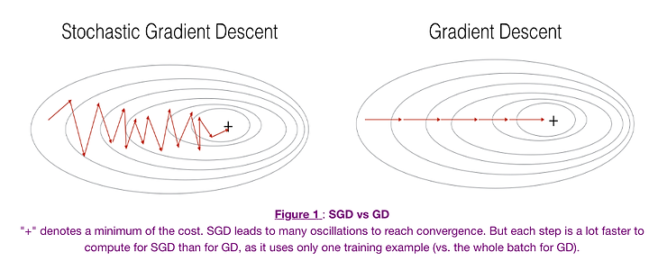
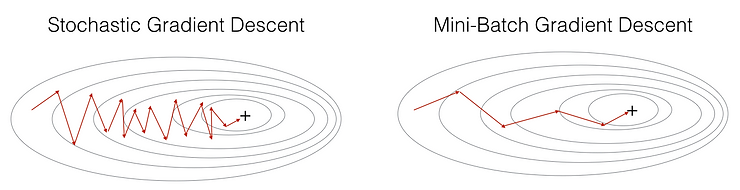
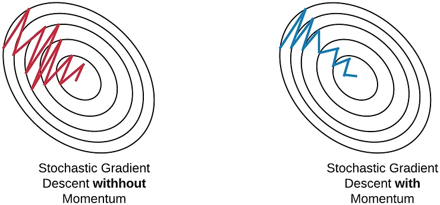
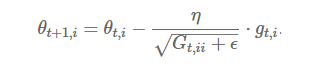
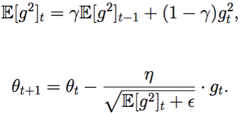
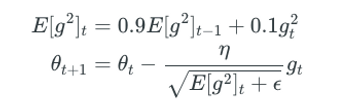
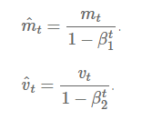
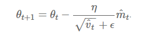

## પરિચય

ડીપ લર્નિંગમાં, **લોસ ફંક્શન**નો કોન્સેપ્ટ મૂળભૂત છે - તે કોઈપણ સમયે મોડેલ કેટલું ખરાબ પ્રદર્શન કરી રહ્યું છે તેનું માપન કરે છે. લોસ વેલ્યુ જેટલી ઓછી, મોડેલનું પ્રદર્શન તેટલું વધુ સારું. મોડેલનું પ્રદર્શન સુધારવા માટે, આપણે આ લોસ ફંક્શનને ઘટાડવાની જરૂર છે, જ્યાં ઓપ્ટિમાઇઝેશન ભૂમિકા ભજવે છે.

**ઓપ્ટિમાઇઝેશન** એ ગાણિતિક અભિવ્યક્તિને ઘટાડવાની (અથવા ક્યારેક વધારવાની) પ્રક્રિયાનો ઉલ્લેખ કરે છે. ડીપ લર્નિંગમાં, **ઓપ્ટિમાઇઝર્સ** એ વિશેષ અલ્ગોરિધમ છે જે ન્યુરલ નેટવર્કના પેરામીટર્સ - મુખ્યત્વે વેઇટ્સ અને બાયસીસ - ને સમય સાથે લોસ ફંક્શનની વેલ્યુ ઘટાડવા માટે એડજસ્ટ કરવા માટે ડિઝાઇન કરવામાં આવ્યા છે.

યોગ્ય ઓપ્ટિમાઇઝર પસંદ કરવાથી ડ્રામેટિક અસર પડી શકે છે:

- તમારું મોડેલ કેટલી ઝડપથી શીખે છે (કન્વર્જન્સ સ્પીડ)
- તે અનસીન ડેટા પર કેટલી અસરકારક રીતે સામાન્યીકરણ કરે છે
- તે સબઓપ્ટિમલ સોલ્યુશન્સ (લોકલ મિનિમા)માં અટકી જાય છે કે નહીં
- ટ્રેનિંગ પ્રોસેસ કેટલી સ્ટેબલ છે

આ લેખ આધુનિક ડીપ લર્નિંગમાં વપરાતી નવ લોકપ્રિય ઓપ્ટિમાઇઝેશન ટેકનિક્સની વિસ્તૃત તુલના પ્રદાન કરે છે:

1. ગ્રેડિયન્ટ ડિસેન્ટ (GD)
2. સ્ટોકેસ્ટિક ગ્રેડિયન્ટ ડિસેન્ટ (SGD)
3. મિની-બેચ સ્ટોકેસ્ટિક ગ્રેડિયન્ટ ડિસેન્ટ (MB-SGD)
4. મોમેન્ટમ સાથે SGD
5. નેસ્ટરોવ એક્સેલરેટેડ ગ્રેડિયન્ટ (NAG)
6. એડેપ્ટિવ ગ્રેડિયન્ટ (AdaGrad)
7. એડાડેલ્ટા (AdaDelta)
8. રૂટ મીન સ્ક્વેર પ્રોપેગેશન (RMSprop)
9. એડેપ્ટિવ મોમેન્ટ એસ્ટિમેશન (Adam)

ચાલો આ દરેક ઓપ્ટિમાઇઝર્સની તપાસ કરીએ, તેમના ગાણિતિક પાયાને સમજીએ, અને તેમની શક્તિઓ અને નબળાઈઓની તુલના કરીએ.

## 1. ગ્રેડિયન્ટ ડિસેન્ટ (GD)

ગ્રેડિયન્ટ ડિસેન્ટ ડીપ લર્નિંગમાં સૌથી મૂળભૂત ઓપ્ટિમાઇઝેશન અલ્ગોરિધમ છે અને મોટાભાગની અન્ય એડવાન્સ્ડ ટેકનિક્સ માટે પાયો પૂરો પાડે છે.

### તે કેવી રીતે કામ કરે છે

ગ્રેડિયન્ટ ડિસેન્ટ નેટવર્કમાં દરેક પેરામીટરના સંદર્ભમાં લોસ ફંક્શનના ગ્રેડિયન્ટ (સ્લોપ)ની ગણતરી કરીને કામ કરે છે. પછી તે ગ્રેડિયન્ટની વિરુદ્ધ દિશામાં આ પેરામીટર્સને અપડેટ કરે છે, જેથી મોડેલને ધીમે ધીમે લોસ ફંક્શનના મિનિમમ વેલ્યુ તરફ જવાની મંજૂરી મળે.

ગ્રેડિયન્ટ ડિસેન્ટ માટે અપડેટ રૂલ છે:

$$\theta = \theta - \alpha \cdot \nabla J(\theta)$$

જ્યાં:

- $\theta$ મોડેલ પેરામીટર્સ (વેઇટ્સ અને બાયસીસ)નું પ્રતિનિધિત્વ કરે છે
- $\alpha$ એ લર્નિંગ રેટ છે (એક હાયપરપેરામીટર જે સ્ટેપ સાઇઝને કંટ્રોલ કરે છે)
- $\nabla J(\theta)$ એ પેરામીટર્સના સંદર્ભમાં લોસ ફંક્શનનું ગ્રેડિયન્ટ છે

સ્ટાન્ડર્ડ ગ્રેડિયન્ટ ડિસેન્ટમાં, જેને "બેચ ગ્રેડિયન્ટ ડિસેન્ટ" પણ કહેવામાં આવે છે, દરેક પેરામીટર અપડેટ કરતા પહેલા સંપૂર્ણ ટ્રેનિંગ ડેટાસેટનો ઉપયોગ કરીને ગ્રેડિયન્ટની ગણતરી કરવામાં આવે છે.

### ફાયદા

1. **કોન્સેપ્ચ્યુઅલ સિમ્પ્લિસિટી**: સમજવા, ઇમ્પ્લિમેન્ટ કરવા અને ડિબગ કરવા માટે સરળ
2. **ગેરંટેડ કન્વર્જન્સ**: કોન્વેક્સ ઓપ્ટિમાઇઝેશન પ્રોબ્લેમ્સ માટે, તે ગ્લોબલ મિનિમમ સુધી પહોંચશે
3. **સ્ટેબિલિટી**: સામાન્ય રીતે સ્ટેબલ અપડેટ્સ પ્રદાન કરે છે કારણ કે તે સંપૂર્ણ ડેટાસેટનો ઉપયોગ કરે છે

### ગેરલાભ

1. **ધીમી કન્વર્જન્સ**: દરેક અપડેટ માટે ડેટાસેટ પરના સંપૂર્ણ પાસની જરૂર પડે છે, જે મોટા ડેટાસેટ્સ માટે અત્યંત ધીમું હોઈ શકે છે
2. **મેમરી ઇન્ટેન્સિવ**: સંપૂર્ણ ડેટાસેટ માટે ગ્રેડિયન્ટ્સની ગણતરી અને સ્ટોરેજની જરૂર પડે છે
3. **લોકલ મિનિમા**: નોન-કોન્વેક્સ પ્રોબ્લેમ્સમાં લોકલ મિનિમામાં ફસાઈ શકે છે
4. **નોન-એડેપ્ટિવ લર્નિંગ**: બધા પેરામીટર્સ માટે એક જ ફિક્સ્ડ લર્નિંગ રેટનો ઉપયોગ કરે છે

## 2. સ્ટોકેસ્ટિક ગ્રેડિયન્ટ ડિસેન્ટ (SGD)

સ્ટોકેસ્ટિક ગ્રેડિયન્ટ ડિસેન્ટ વધુ ફ્રિક્વન્ટ પેરામીટર અપડેટ્સ કરીને સ્ટાન્ડર્ડ ગ્રેડિયન્ટ ડિસેન્ટની ધીમી કન્વર્જન્સ સમસ્યાઓને ઉકેલવાનો પ્રયાસ કરે છે.

### તે કેવી રીતે કામ કરે છે

સંપૂર્ણ ડેટાસેટનો ઉપયોગ કરીને ગ્રેડિયન્ટની ગણતરી કરવાને બદલે, SGD દરેક સ્ટેપ પર ફક્ત એક ટ્રેનિંગ એક્ઝામ્પલનો ઉપયોગ કરીને ગ્રેડિયન્ટની ગણતરી કરે છે. આનો અર્થ એ છે કે 1,000 એક્ઝામ્પલવાળા ડેટાસેટ માટે, સ્ટાન્ડર્ડ GD ફક્ત એક પેરામીટર અપડેટ કરે તે સમયમાં SGD 1,000 પેરામીટર અપડેટ્સ કરશે.

SGD માટે અપડેટ રૂલ છે:

$\theta = \theta - \alpha \cdot \nabla J(\theta; x^{(i)}, y^{(i)})$

જ્યાં:

- $(x^{(i)}, y^{(i)})$ એક સિંગલ ટ્રેનિંગ એક્ઝામ્પલ અને તેના લેબલનું પ્રતિનિધિત્વ કરે છે

### ફાયદા

1. **ઝડપી કન્વર્જન્સ**: સ્ટાન્ડર્ડ GD કરતાં ઘણી વધારે ફ્રિક્વન્સીથી પેરામીટર્સ અપડેટ કરે છે
2. **મેમરી એફિશિયન્સી**: એક સમયે ફક્ત એક એક્ઝામ્પલ પ્રોસેસ કરવાની જરૂર પડે છે
3. **લોકલ મિનિમામાંથી બહાર નીકળવાની ક્ષમતા**: નોઇઝી અપડેટ્સ ઓપ્ટિમાઇઝરને છીછરા લોકલ મિનિમામાંથી બહાર નીકળવામાં મદદ કરી શકે છે

### ગેરલાભ

1. **હાઇ વેરિયન્સ**: પેરામીટર અપડેટ્સ ખૂબ નોઇઝી હોઈ શકે છે, જેના કારણે લોસ ફંક્શનમાં નાટકીય રૂપે ઉતાર-ચઢાવ થઈ શકે છે
2. **ઓવરશૂટિંગ**: નોઇઝી અપડેટ્સને કારણે ઓપ્ટિમલ મિનિમમ ચૂકી શકે છે
3. **લર્નિંગ રેટ ચેલેન્જીસ**: કાળજીપૂર્વક ટ્યુનિંગ અને સામાન્ય રીતે યોગ્ય રીતે કન્વર્જ થવા માટે ડિકેઇંગ લર્નિંગ રેટ શેડ્યુલની જરૂર પડે છે

## 3. મિની-બેચ સ્ટોકેસ્ટિક ગ્રેડિયન્ટ ડિસેન્ટ (MB-SGD)

મિની-બેચ SGD ધીમા પણ સ્ટેબલ સ્ટાન્ડર્ડ ગ્રેડિયન્ટ ડિસેન્ટ અને ઝડપી પણ નોઇઝી સ્ટોકેસ્ટિક ગ્રેડિયન્ટ ડિસેન્ટ વચ્ચે મધ્યમ માર્ગ ઓફર કરે છે.

### તે કેવી રીતે કામ કરે છે

મિની-બેચ SGD ટ્રેનિંગ ડેટાસેટને નાના બેચમાં વિભાજિત કરે છે અને દરેક બેચને પ્રોસેસ કર્યા પછી પેરામીટર અપડેટ્સ કરે છે. આ અભિગમ GD અને SGD બંનેના ફાયદાઓને જોડે છે.

MB-SGD માટે અપડેટ રૂલ છે:

$\theta = \theta - \alpha \cdot \nabla J(\theta; B^{(i)})$

જ્યાં:

- $B^{(i)}$ ટ્રેનિંગ એક્ઝામ્પલના મિની-બેચનું પ્રતિનિધિત્વ કરે છે

### ફાયદા

1. **બેલેન્સ્ડ કન્વર્જન્સ સ્પીડ**: GD કરતાં ઝડપી પરંતુ SGD કરતાં વધુ સ્ટેબલ
2. **એફિશિયન્ટ કમ્પ્યુટેશન**: આધુનિક GPU આર્કિટેક્ચર માટે યોગ્ય છે જે બેચ પ્રોસેસિંગ માટે ઓપ્ટિમાઇઝ થયેલ છે
3. **મોડરેટ મેમરી રિક્વાયરમેન્ટ્સ**: ફક્ત મિની-બેચ માટે પૂરતી મેમરીની જરૂર પડે છે
4. **રિડ્યુસ્ડ વેરિયન્સ**: શુદ્ધ SGD કરતાં ઓછા નોઇઝી અપડેટ્સ પ્રદાન કરે છે

### ગેરલાભ

1. **બેચ સાઇઝ ટ્યુનિંગ**: બેચ સાઇઝ હાયપરપેરામીટરની કાળજીપૂર્વક પસંદગીની જરૂર પડે છે
2. **હજુ પણ ફિક્સ્ડ લર્નિંગ રેટનો ઉપયોગ કરે છે**: અલગ-અલગ પેરામીટર્સ માટે લર્નિંગ રેટને એડેપ્ટ કરતું નથી
3. **હજુ પણ ફસાઈ શકે છે**: હજુ પણ લોકલ મિનિમા અથવા સેડલ પોઇન્ટ્સમાં ફસાઈ શકે છે

## ગ્રેડિયન્ટ-બેઝ્ડ મેથડ્સની સામાન્ય ચેલેન્જીસ

અત્યાર સુધી ચર્ચા કરેલા ગ્રેડિયન્ટ ડિસેન્ટના બધા વેરિયન્ટ્સ કેટલીક સામાન્ય ચેલેન્જીસ શેર કરે છે:

1. **લર્નિંગ રેટ સિલેક્શન**: યોગ્ય લર્નિંગ રેટ પસંદ કરવું ક્રુશિયલ પરંતુ મુશ્કેલ છે
2. **નોન-એડેપ્ટિવ લર્નિંગ**: તેઓ બધા પેરામીટર્સ માટે એક જ લર્નિંગ રેટ લાગુ કરે છે
3. **લોકલ મિનિમા અને સેડલ પોઇન્ટ્સ**: તેઓ સબઓપ્ટિમલ સોલ્યુશન્સમાં ફસાઈ શકે છે
4. **રેવિન્સમાં ધીમી કન્વર્જન્સ**: જ્યારે લોસ સરફેસમાં કેટલાક ડાયમેન્શન્સમાં સ્ટીપ સ્લોપ્સ હોય પરંતુ અન્યમાં ફ્લેટ હોય ત્યારે તેઓ ઓસિલેટ કરી શકે છે

નીચેના ઓપ્ટિમાઇઝર્સ અલગ-અલગ રીતે આ ચેલેન્જીસને ઉકેલવાનો પ્રયાસ કરે છે.

## 4. મોમેન્ટમ સાથે SGD

મોમેન્ટમ સાથે SGD કન્વર્જન્સને ઝડપી બનાવવા અને સ્ટાન્ડર્ડ SGD સાથે થઈ શકે તેવા ઓસિલેશન્સને ઘટાડવા માટે ડિઝાઇન કરવામાં આવ્યું છે.

### તે કેવી રીતે કામ કરે છે

મોમેન્ટમ કરંટ અપડેટ વેક્ટરમાં અગાઉના અપડેટ વેક્ટરનો ફ્રેક્શન ઉમેરીને કામ કરે છે, જેથી પેરામીટર અપડેટ્સ માટે એક પ્રકારની "વેલોસિટી" બને છે. આ ઓપ્ટિમાઇઝરને કન્સિસ્ટન્ટ દિશાઓમાં મૂવમેન્ટ જાળવી રાખવામાં અને ઓસિલેશન્સને ઘટાડવામાં મદદ કરે છે.

મોમેન્ટમ સાથે SGD માટે અપડેટ રૂલ્સ છે:

$v_t = \gamma v_{t-1} + \alpha \cdot \nabla J(\theta)$
$\theta = \theta - v_t$

જ્યાં:

- $v_t$ ટાઇમ સ્ટેપ $t$ પર વેલોસિટી વેક્ટર છે
- $\gamma$ મોમેન્ટમ કોઇફિશિયન્ટ છે (સામાન્ય રીતે 0.9 આસપાસ સેટ કરવામાં આવે છે)

### ફાયદા

1. **ઝડપી કન્વર્જન્સ**: કન્સિસ્ટન્ટ દિશાઓમાં પ્રગતિને ઝડપી બનાવે છે
2. **ઓસિલેશન્સમાં ઘટાડો**: હાઇ કર્વેચરવાળી દિશાઓમાં ઓસિલેશન્સને ઘટાડે છે
3. **લોકલ મિનિમામાંથી બહાર નીકળવાની ક્ષમતા**: મોમેન્ટમ ઓપ્ટિમાઇઝરને છીછરા લોકલ મિનિમામાંથી બહાર નીકળવામાં મદદ કરી શકે છે

### ગેરલાભ

1. **વધારાનો હાયપરપેરામીટર**: મોમેન્ટમ કોઇફિશિયન્ટને ટ્યુન કરવાની જરૂર પડે છે
2. **સંભવિત ઓવરશૂટિંગ**: વધુ પડતા મોમેન્ટમથી, ઓપ્ટિમાઇઝર મિનિમમ ચૂકી શકે છે અને બીજી બાજુ ચઢવાનું ચાલુ રાખી શકે છે
3. **હજુ પણ ફિક્સ્ડ લર્નિંગ રેટનો ઉપયોગ કરે છે**: અલગ-અલગ પેરામીટર્સ માટે લર્નિંગ રેટને એડેપ્ટ કરતું નથી

## 5. નેસ્ટરોવ એક્સેલરેટેડ ગ્રેડિયન્ટ (NAG)

નેસ્ટરોવ એક્સેલરેટેડ ગ્રેડિયન્ટ એ મોમેન્ટમ મેથડનું રિફાઇનમેન્ટ છે જે વધુ ઇન્ટેલિજન્ટ અપડેટ્સ પ્રદાન કરવા માટે કરેક્શન ફેક્ટર ઉમેરે છે.

### તે કેવી રીતે કામ કરે છે

NAG પહેલા અગાઉના એક્યુમ્યુલેટેડ ગ્રેડિયન્ટની દિશામાં મોટો જમ્પ કરે છે (મોમેન્ટમ સ્ટેપ), પછી આ "લુકએહેડ" પોઝિશન પર ગ્રેડિયન્ટની ગણતરી કરે છે, અને કરેક્શન કરે છે. આ એક પ્રકારનું એન્ટિસિપેટરી અપડેટ પ્રદાન કરે છે જે ઓવરશૂટિંગને રોકે છે.

NAG માટે અપડેટ રૂલ્સ છે:

$v_t = \gamma v_{t-1} + \alpha \cdot \nabla J(\theta - \gamma v_{t-1})$
$\theta = \theta - v_t$

### ફાયદા

1. **સુધારેલ કન્વર્જન્સ**: સામાન્ય રીતે સ્ટાન્ડર્ડ મોમેન્ટમ કરતાં ઝડપથી કન્વર્જ થાય છે
2. **બેટર રેસ્પોન્સિવનેસ**: ગ્રેડિયન્ટમાં ફેરફાર માટે વધુ પ્રતિભાવશીલ છે, જે મિનિમમ પર પહોંચતા પહેલા ધીમું પડવાની મંજૂરી આપે છે
3. **થિયોરેટિકલ ગેરંટી**: કોન્વેક્સ પ્રોબ્લેમ્સ માટે બેટર થિયોરેટિકલ કન્વર્જન્સ રેટ્સ પ્રદાન કરે છે

### ગેરલાભ

1. **કોમ્પ્લેક્સિટી**: સ્ટાન્ડર્ડ મોમેન્ટમ કરતાં થોડું વધુ જટિલ ઇમ્પ્લિમેન્ટ કરવાનું છે
2. **હાયપરપેરામીટર ટ્યુનિંગ**: હજુ પણ મોમેન્ટમ કોઇફિશિયન્ટના કાળજીપૂર્વક ટ્યુનિંગની જરૂર પડે છે
3. **નોન-એડેપ્ટિવ લર્નિંગ રેટ્સ**: હજુ પણ બધા પેરામીટર્સ માટે એક જ લર્નિંગ રેટનો ઉપયોગ કરે છે

## 6. એડેપ્ટિવ ગ્રેડિયન્ટ (AdaGrad)

AdaGrad હિસ્ટોરિકલ ગ્રેડિયન્ટ્સના આધારે દરેક પેરામીટર માટે તેમને એડેપ્ટિવલી એડજસ્ટ કરીને લર્નિંગ રેટને મેન્યુઅલી ટ્યુન કરવાના પડકારને સંબોધિત કરે છે.

### તે કેવી રીતે કામ કરે છે

AdaGrad દરેક પેરામીટર માટે ગ્રેડિયન્ટના સ્ક્વેર્સના સમને જાળવે છે. પછી તે દરેક પેરામીટર માટે લર્નિંગ રેટને અલગ-અલગ સ્કેલ કરવા માટે આ એક્યુમ્યુલેશનનો ઉપયોગ કરે છે - મોટા ગ્રેડિયન્ટવાળા પેરામીટર્સને નાના લર્નિંગ રેટ્સ મળે છે, અને નાના ગ્રેડિયન્ટવાળા પેરામીટર્સને મોટા લર્નિંગ રેટ્સ મળે છે.

AdaGrad માટે અપડેટ રૂલ્સ છે:

$G_{t,ii} = G_{t-1,ii} + (\nabla J(\theta_t))_i^2$
$\theta_{t+1,i} = \theta_{t,i} - \frac{\alpha}{\sqrt{G_{t,ii} + \epsilon}} \cdot (\nabla J(\theta_t))_i$

જ્યાં:

- $G_t$ એ ડાયગોનલ મેટ્રિક્સ છે જ્યાં દરેક ડાયગોનલ એલિમેન્ટ $i,i$ એ ટાઇમ સ્ટેપ $t$ સુધી $\theta_i$ના સંદર્ભમાં ગ્રેડિયન્ટના સ્ક્વેર્સનો સરવાળો છે
- $\epsilon$ એ ઝીરોથી ડિવિઝન ટાળવા માટે નાનો સ્મૂધિંગ ટર્મ છે (સામાન્ય રીતે 1e-8)

### ફાયદા

1. **પેરામીટર-સ્પેસિફિક લર્નિંગ રેટ્સ**: દરેક પેરામીટર માટે ઓટોમેટિકલી લર્નિંગ રેટને એડેપ્ટ કરે છે
2. **મેન્યુઅલ લર્નિંગ રેટ ટ્યુનિંગની જરૂર નથી**: ગ્લોબલ લર્નિંગ રેટના મેન્યુઅલ ટ્યુનિંગની જરૂરિયાતને ઘટાડે છે
3. **સ્પાર્સ ફીચર્સ સારી રીતે હેન્ડલ કરે છે**: ખાસ કરીને ઇનફ્રિક્વન્ટ પરંતુ ઇન્ફોર્મેટિવ ફીચર્સ સાથે સ્પાર્સ ડેટા માટે અસરકારક છે

### ગેરલાભ

1. **ડિમિનિશિંગ લર્નિંગ રેટ્સ**: એક્યુમ્યુલેટેડ ગ્રેડિયન્ટ સ્ક્વેર્સ મોનોટોનિકલી વધે છે, જેના કારણે લર્નિંગ રેટ્સ સમય સાથે ખૂબ નાની થઈ જાય છે
2. **ટ્રેનિંગ સ્ટોલ થઈ શકે છે**: આખરે, લર્નિંગ રેટ્સ અસરકારક લર્નિંગ માટે ખૂબ નાની થઈ જાય છે
3. **કમ્પ્યુટેશનલી ખર્ચાળ**: દરેક પેરામીટર માટે વધારાના સ્ટેટ વેરિયેબલ્સ જાળવવાની જરૂર છે

## 7. એડાડેલ્ટા (AdaDelta)

AdaDelta ને AdaGrad માં ડિમિનિશિંગ લર્નિંગ રેટની સમસ્યાને ઉકેલવા માટે વિકસાવવામાં આવી હતી.

### તે કેવી રીતે કામ કરે છે

બધા અગાઉના સ્ક્વેર્ડ ગ્રેડિયન્ટ્સને એક્યુમ્યુલેટ કરવાને બદલે, AdaDelta એક્સપોનેન્શિયલી ડિકેઇંગ એવરેજનો ઉપયોગ કરીને અગાઉના ગ્રેડિયન્ટ્સના એક્યુમ્યુલેશનને ફિક્સ્ડ વિન્ડો સુધી મર્યાદિત કરે છે. તે અગાઉના પેરામીટર અપડેટ્સ અને અગાઉના ગ્રેડિયન્ટ્સના રનિંગ એવરેજના રેશિયોનો ઉપયોગ કરીને ડિફોલ્ટ લર્નિંગ રેટની જરૂરિયાતને પણ દૂર કરે છે.

AdaDelta માટે અપડેટ રૂલ્સ છે:

$E[g^2]_t = \gamma E[g^2]_{t-1} + (1-\gamma) g_t^2$
$\Delta \theta_t = -\frac{\sqrt{E[\Delta \theta^2]_{t-1} + \epsilon}}{\sqrt{E[g^2]_t + \epsilon}} \cdot g_t$
$\theta_{t+1} = \theta_t + \Delta \theta_t$
$E[\Delta \theta^2]_t = \gamma E[\Delta \theta^2]_{t-1} + (1-\gamma) \Delta \theta_t^2$

જ્યાં:

- $E[g^2]_t$ એ ટાઇમ સ્ટેપ $t$ સુધીના સ્ક્વેર્ડ ગ્રેડિયન્ટ્સનો એક્સપોનેન્શિયલી ડિકેઇંગ એવરેજ છે
- $E[\Delta \theta^2]_t$ એ સ્ક્વેર્ડ પેરામીટર અપડેટ્સનો એક્સપોનેન્શિયલી ડિકેઇંગ એવરેજ છે
- $\gamma$ એ મોમેન્ટમ જેવો ડિકે ફેક્ટર છે (સામાન્ય રીતે 0.9 આસપાસ)
- $\epsilon$ એ ઝીરોથી ડિવિઝન ટાળવા માટે નાનો સ્મૂધિંગ ફેક્ટર છે

### ફાયદા

1. **ડિક્લાઇનિંગ લર્નિંગ રેટ્સ નથી**: AdaGrad ની મોનોટોનિકલી ઘટતી લર્નિંગ રેટ્સને ટાળે છે
2. **બેઝ લર્નિંગ રેટ જરૂરી નથી**: ઇનિશિયલ લર્નિંગ રેટ સેટ કરવાની જરૂરિયાતને દૂર કરે છે
3. **મોટા ગ્રેડિયન્ટ્સ સામે રોબસ્ટ**: અચાનક મોટા ગ્રેડિયન્ટ્સ માટે ઓછું સેન્સિટિવ છે

### ગેરલાભ

1. **કમ્પ્યુટેશનલ ઓવરહેડ**: ગ્રેડિયન્ટ્સ અને અપડેટ્સ બંનેના રનિંગ એવરેજ જાળવવાની જરૂર છે
2. **વધારાનો હાયપરપેરામીટર**: ડિકે રેટને ટ્યુન કરવાની જરૂર છે
3. **સ્પાર્સ ડેટા માટે ઓછું અસરકારક**: વધુ સ્પાર્સ ફીચર્સ માટે AdaGrad જેટલું સારું કામ ન કરી શકે

## 8. RMSprop (રૂટ મીન સ્ક્વેર પ્રોપેગેશન)

RMSprop સ્વતંત્ર રીતે વિકસાવવામાં આવ્યું હતું પરંતુ AdaDelta સાથે સમાનતાઓ શેર કરે છે, જે AdaGrad ની ડિમિનિશિંગ લર્નિંગ રેટની સમસ્યાને સંબોધિત કરે છે.

### તે કેવી રીતે કામ કરે છે

AdaDelta ની જેમ, RMSprop ગ્રેડિયન્ટને નોર્મલાઇઝ કરવા માટે સ્ક્વેર્ડ ગ્રેડિયન્ટ્સનો એક્સપોનેન્શિયલી ડિકેઇંગ એવરેજનો ઉપયોગ કરે છે. જોકે, તેને હજુ પણ મેન્યુઅલી સ્પેસિફાઇડ લર્નિંગ રેટની જરૂર છે.

RMSprop માટે અપડેટ રૂલ્સ છે:

$E[g^2]_t = \gamma E[g^2]_{t-1} + (1-\gamma) g_t^2$
$\theta_{t+1} = \theta_t - \frac{\alpha}{\sqrt{E[g^2]_t + \epsilon}} \cdot g_t$

જ્યાં:

- $\gamma$ સામાન્ય રીતે 0.9 પર સેટ કરવામાં આવે છે
- $\alpha$ એ લર્નિંગ રેટ છે, જે અક્સર ડિફોલ્ટથી 0.001 પર સેટ કરવામાં આવે છે

### ફાયદા

1. **ડિમિનિશિંગ લર્નિંગ રેટ્સને રોકે છે**: AdaGrad માં લર્નિંગ રેટ્સના મોનોટોનિક ઘટાડાને ટાળે છે
2. **નોન-સ્ટેશનરી ઓબ્જેક્ટિવ્સ માટે સારું**: RNNs અને બદલાતા ઓબ્જેક્ટિવ્સ સાથે અન્ય મોડેલ્સ માટે સારું કામ કરે છે
3. **ઇફેક્ટિવ સ્ટેપ સાઇઝીસ**: પેરામીટર-સ્પેસિફિક એડેપ્ટિવ લર્નિંગ રેટ્સ પ્રદાન કરે છે

### ગેરલાભ

1. **લર્નિંગ રેટ ટ્યુનિંગની જરૂર છે**: હજુ પણ ગ્લોબલ લર્નિંગ રેટ સ્પેસિફાય કરવાની જરૂર છે
2. **ઇનિશિયલાઇઝેશન માટે સેન્સિટિવ**: પરફોર્મન્સ વેઇટ્સના ઇનિશિયલ સ્કેલિંગ પર આધાર રાખી શકે છે
3. **મર્યાદિત થિયોરેટિકલ સમજ**: અન્ય કેટલીક મેથડ્સની તુલનામાં ઓછું થિયોરેટિકલ એનાલિસિસ

## 9. Adam (એડેપ્ટિવ મોમેન્ટ એસ્ટિમેશન)

Adam મોમેન્ટમ સાથે AdaGrad અને RMSprop બંનેના લાભોને જોડે છે, જે તેને આધુનિક ડીપ લર્નિંગમાં સૌથી લોકપ્રિય ઓપ્ટિમાઇઝર્સમાંનું એક બનાવે છે.

### તે કેવી રીતે કામ કરે છે

Adam બંને જાળવે છે:

- અગાઉના ગ્રેડિયન્ટ્સનો ડિકેઇંગ એવરેજ (ફર્સ્ટ મોમેન્ટ), મોમેન્ટમ જેવો
- અગાઉના સ્ક્વેર્ડ ગ્રેડિયન્ટ્સનો ડિકેઇંગ એવરેજ (સેકન્ડ મોમેન્ટ), RMSprop/AdaDelta જેવો

તેમાં મૂવિંગ એવરેજના ઇનિશિયલાઇઝેશનને ધ્યાનમાં લેવા માટે બાયસ કરેક્શન્સ પણ શામેલ છે.

Adam માટે અપડેટ રૂલ્સ છે:

$m_t = \beta_1 m_{t-1} + (1-\beta_1) g_t$
$v_t = \beta_2 v_{t-1} + (1-\beta_2) g_t^2$
$\hat{m}_t = \frac{m_t}{1-\beta_1^t}$
$\hat{v}_t = \frac{v_t}{1-\beta_2^t}$
$\theta_{t+1} = \theta_t - \frac{\alpha}{\sqrt{\hat{v}_t} + \epsilon} \hat{m}_t$

જ્યાં:

- $m_t$ એ ગ્રેડિયન્ટ્સના ફર્સ્ટ મોમેન્ટ (મીન)નો અંદાજ છે
- $v_t$ એ ગ્રેડિયન્ટ્સના સેકન્ડ મોમેન્ટ (અનસેન્ટર્ડ વેરિયન્સ)નો અંદાજ છે
- $\hat{m}_t$ અને $\hat{v}_t$ એ બાયસ-કરેક્ટેડ અંદાજો છે
- $\beta_1$ અને $\beta_2$ એ મોમેન્ટ અંદાજો માટે ડિકે રેટ્સ છે (સામાન્ય રીતે 0.9 અને 0.999)
- $\epsilon$ એ ન્યુમેરિકલ સ્ટેબિલિટી માટે નાનો કોન્સ્ટન્ટ છે (સામાન્ય રીતે 1e-8)

### ફાયદા

1. **એફિશિયન્ટ કમ્પ્યુટેશન**: વધારાના સ્ટેટ વેરિયેબલ્સ હોવા છતાં કમ્પ્યુટેશનલી એફિશિયન્ટ છે
2. **લો મેમરી રિક્વાયરમેન્ટ્સ**: SGD કરતાં ફક્ત થોડી વધુ મેમરીની જરૂર છે
3. **પેરામીટર-સ્પેસિફિક લર્નિંગ રેટ્સ**: દરેક પેરામીટર માટે લર્નિંગ રેટ્સને એડેપ્ટ કરે છે
4. **મોટા ડેટાસેટ્સ અને પેરામીટર્સ માટે યોગ્ય**: મોટા મોડેલ્સ અને ડેટાસેટ્સને અસરકારક રીતે હેન્ડલ કરે છે
5. **નોન-સ્ટેશનરી ઓબ્જેક્ટિવ્સ માટે યોગ્ય**: નોઇઝી અથવા સ્પાર્સ ગ્રેડિયન્ટ્સ સાથેના પ્રોબ્લેમ્સ માટે સારું કામ કરે છે
6. **બાયસ કરેક્શન**: મોમેન્ટ અંદાજોમાં ઇનિશિયલાઇઝેશન બાયસને સુધારે છે

### ગેરલાભ

1. **કમ્પ્યુટેશનલ ઓવરહેડ**: સરળ મેથડ્સ કરતાં વધુ કમ્પ્યુટેશનલી ઇન્ટેન્સિવ છે
2. **લર્નિંગ રેટ ટ્યુનિંગ**: હજુ પણ ઇનિશિયલ લર્નિંગ રેટના ટ્યુનિંગની જરૂર છે
3. **ક્યારેક પૂર જનરલાઇઝ થઈ શકે છે**: કેટલાક કિસ્સાઓમાં, મોમેન્ટમ સાથે SGD કરતાં ઓછા જનરલાઇઝેબલ સોલ્યુશન્સ તરફ દોરી શકે છે

## તુલનાત્મક વિશ્લેષણ અને વિઝ્યુઅલાઇઝેશન

નીચેની એનિમેશન વિવિધ ઓપ્ટિમાઇઝેશન અલ્ગોરિધમ્સ લોસ લેન્ડસ્કેપમાં કેવી રીતે નેવિગેટ કરે છે તેની વિઝ્યુઅલ તુલના પ્રદાન કરે છે:

આ વિઝ્યુલાઇઝેશન અને આપણા થિયોરેટિકલ એનાલિસિસથી, આપણે ઘણી કી ઇનસાઇટ્સ મેળવી શકીએ છીએ:

1. **SGD (લાલમાં દર્શાવેલ)** સેડલ પોઇન્ટ્સ પર ફસાઈ શકે છે, જે તેને જટિલ લોસ લેન્ડસ્કેપ્સ સાથે ડીપ નેટવર્ક્સ માટે ઓછું યોગ્ય બનાવે છે.

2. મોટાભાગના એડવાન્સ્ડ ઓપ્ટિમાઇઝર્સ આખરે અલગ-અલગ ટ્રેજેક્ટરીઝ અને સ્પીડ સાથે મિનિમામાં કન્વર્જ થાય છે:
   - AdaDelta કન્વર્જ થવા માટે સૌથી ઝડપી પૈકીનું એક હોય છે
   - મોમેન્ટમ-બેઝ્ડ મેથડ્સ સારું જનરલ પરફોર્મન્સ બતાવે છે પરંતુ ધીમી હોઈ શકે છે
   - Adam (એનિમેશનમાં બતાવેલ નથી) સામાન્ય રીતે પ્રેક્ટિસમાં AdaDelta કરતાં પણ ઝડપથી કન્વર્જ થાય છે

3. **સ્પાર્સ ડેટા માટે**, AdaGrad અને AdaDelta ખાસ કરીને અસરકારક હોઈ શકે છે.

4. **મોટાભાગના જનરલ-પર્પઝ ડીપ લર્નિંગ માટે**, Adam ને ઘણીવાર શ્રેષ્ઠ ડિફોલ્ટ પસંદગી માનવામાં આવે છે કારણ કે વિવિધ પ્રકારના સમસ્યાઓમાં તેનું રોબસ્ટ પરફોર્મન્સ હોય છે.

## પ્રેક્ટિકલ રેકમેન્ડેશન્સ

દરેક ઓપ્ટિમાઇઝરની લાક્ષણિકતાઓને આધારે, અહીં કેટલીક પ્રેક્ટિકલ રેકમેન્ડેશન્સ છે:

1. **બિગિનર્સ અથવા જનરલ ઉપયોગ માટે**: Adam થી શરૂઆત કરો. તે રોબસ્ટ છે, મોટાભાગની પરિસ્થિતિઓમાં સારું કામ કરે છે, અને મિનિમલ ટ્યુનિંગની જરૂર છે.

2. **સ્પાર્સ ડેટા પ્રોબ્લેમ્સ માટે**: AdaGrad અથવા સ્પાર્સ Adam જેવા વેરિયન્ટ્સ વિચારો.

3. **બેટર જનરલાઇઝેશન માટે**: કેટલાક પ્રોબ્લેમ્સ માટે મોમેન્ટમ સાથે SGD ઘણીવાર એડેપ્ટિવ મેથડ્સ કરતાં વધુ સારું જનરલાઇઝ થાય છે, ખાસ કરીને કમ્પ્યુટર વિઝનમાં.

4. **RNNs અને ટ્રાન્સફોર્મર્સ માટે**: બદલાતા ઓબ્જેક્ટિવ્સને હેન્ડલ કરવાની તેમની ક્ષમતાને કારણે Adam અથવા RMSprop સામાન્ય રીતે શ્રેષ્ઠ કામ કરે છે.

5. **CNNs માટે**: મોમેન્ટમ સાથે SGD ઘણીવાર સ્ટેટ-ઓફ-ધ-આર્ટ ઇમેજ ક્લાસિફિકેશન મોડેલ્સમાં પસંદ કરવામાં આવે છે.

6. **રિસર્ચ માટે**: AdamW, Lookahead, અથવા RAdam જેવા નવા વેરિયન્ટ્સ પર પ્રયોગ કરવાનું વિચારો જે ઓરિજિનલ અલ્ગોરિધમ્સની કેટલીક મર્યાદાઓને સંબોધિત કરે છે.

## નિષ્કર્ષ

ઓપ્ટિમાઇઝરની પસંદગી ડીપ લર્નિંગ મોડેલ્સની ટ્રેનિંગ ડાયનેમિક્સ અને ફાઇનલ પરફોર્મન્સ પર નોંધપાત્ર અસર કરી શકે છે. જો કે Adam તેની રોબસ્ટનેસ અને સારા જનરલ પરફોર્મન્સને કારણે લોકપ્રિય ડિફોલ્ટ પસંદગી તરીકે ઉભરી આવ્યું છે, દરેક ઓપ્ટિમાઇઝરની શક્તિઓ અને આદર્શ ઉપયોગ કેસ છે.

વિવિધ ઓપ્ટિમાઇઝેશન ટેકનિક્સના ગાણિતિક પાયા અને પ્રેક્ટિકલ ટ્રેડ-ઓફ્સને સમજવાથી ડેટા સાયન્ટિસ્ટ અને મશીન લર્નિંગ એન્જિનિયર્સને ડીપ લર્નિંગ મોડેલ્સ વિકસાવતી વખતે વધુ માહિતીગાર નિર્ણયો લેવામાં સક્ષમ બનાવે છે.

જેમ ડીપ લર્નિંગ વિકસિત થતું રહે છે, તેમ ઓપ્ટિમાઇઝેશન ટેકનિક્સ પણ વિકસિત થતી રહેશે. આ ક્ષેત્રમાં નવીનતમ વિકાસથી અપડેટેડ રહેવું અસરકારક મોડેલ વિકાસનો મહત્વપૂર્ણ ભાગ રહે છે.