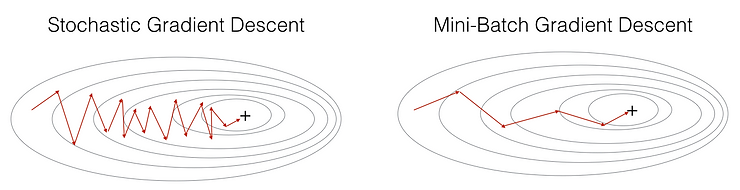
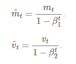

## Introduction

In deep learning, the concept of a **loss function** is fundamental - it quantifies how poorly a model is performing at any given moment. The lower the loss value, the better the model is performing. To improve model performance, we need to minimize this loss function, which is where optimization comes into play.

**Optimization** refers to the process of minimizing (or sometimes maximizing) a mathematical expression. In deep learning, **optimizers** are specialized algorithms designed to adjust the neural network's parameters - primarily the weights and biases - to reduce the loss function's value over time.

Selecting the right optimizer can dramatically impact:

- How quickly your model learns (convergence speed)
- How effectively it generalizes to unseen data
- Whether it gets stuck in suboptimal solutions (local minima)
- How stable the training process is

This article provides a comprehensive comparison of nine popular optimization techniques used in modern deep learning:

1. Gradient Descent (GD)
2. Stochastic Gradient Descent (SGD)
3. Mini-Batch Stochastic Gradient Descent (MB-SGD)
4. SGD with Momentum
5. Nesterov Accelerated Gradient (NAG)
6. Adaptive Gradient (AdaGrad)
7. AdaDelta
8. Root Mean Square Propagation (RMSprop)
9. Adaptive Moment Estimation (Adam)

Let's explore each of these optimizers, understand their mathematical foundations, and compare their strengths and weaknesses.

## 1. Gradient Descent (GD)

Gradient Descent is the most fundamental optimization algorithm in deep learning and serves as the foundation for most other advanced techniques.

### How It Works

Gradient Descent works by calculating the gradient (slope) of the loss function with respect to each parameter in the network. It then updates these parameters in the opposite direction of the gradient, allowing the model to gradually move toward a minimum value of the loss function.

The update rule for Gradient Descent is:

$$\theta = \theta - \alpha \cdot \nabla J(\theta)$$

Where:

- $\theta$ represents the model parameters (weights and biases)
- $\alpha$ is the learning rate (a hyperparameter that controls the step size)
- $\nabla J(\theta)$ is the gradient of the loss function with respect to the parameters

In standard gradient descent, also called "batch gradient descent," the gradient is calculated using the entire training dataset before making each parameter update.

### Advantages

1. **Conceptual simplicity**: Easy to understand, implement, and debug
2. **Guaranteed convergence**: For convex optimization problems, it will reach the global minimum
3. **Stability**: Typically produces stable updates since it uses the full dataset

### Disadvantages

1. **Slow convergence**: Requires a full pass through the dataset for each update, which can be extremely slow for large datasets
2. **Memory intensive**: Must compute and store gradients for the entire dataset
3. **Local minima**: May get trapped in local minima in non-convex problems
4. **No adaptive learning**: Uses the same fixed learning rate for all parameters

## 2. Stochastic Gradient Descent (SGD)

Stochastic Gradient Descent attempts to address the slow convergence issues of standard Gradient Descent by making more frequent parameter updates.

### How It Works

Instead of calculating the gradient using the entire dataset, SGD calculates the gradient using just a single training example at each step. This means that for a dataset with 1,000 examples, SGD would perform 1,000 parameter updates in the time it takes standard GD to perform just one.

The update rule for SGD is:

$$\theta = \theta - \alpha \cdot \nabla J(\theta; x^{(i)}, y^{(i)})$$

Where:

- $(x^{(i)}, y^{(i)})$ represents a single training example and its label

### Advantages

1. **Faster convergence**: Updates parameters much more frequently than standard GD
2. **Memory efficiency**: Only needs to process one example at a time
3. **Potential to escape local minima**: The noisy updates can help the optimizer escape shallow local minima

### Disadvantages

1. **High variance**: Parameter updates can be very noisy, causing the loss function to fluctuate dramatically
2. **Overshooting**: May miss the optimal minimum due to the noisy updates
3. **Learning rate challenges**: Requires careful tuning and typically a decaying learning rate schedule to converge properly

## 3. Mini-Batch Stochastic Gradient Descent (MB-SGD)

Mini-Batch SGD offers a middle ground between the slow but stable standard Gradient Descent and the fast but noisy Stochastic Gradient Descent.

### How It Works

Mini-Batch SGD splits the training dataset into small batches and performs parameter updates after processing each batch. This approach combines the advantages of both GD and SGD.

The update rule for MB-SGD is:

$$\theta = \theta - \alpha \cdot \nabla J(\theta; B^{(i)})$$

Where:

- $B^{(i)}$ represents a mini-batch of training examples

### Advantages

1. **Balanced convergence speed**: Faster than GD but more stable than SGD
2. **Efficient computation**: Well-suited for modern GPU architectures which are optimized for batch processing
3. **Moderate memory requirements**: Needs only enough memory for a mini-batch
4. **Reduced variance**: Provides less noisy updates than pure SGD

### Disadvantages

1. **Batch size tuning**: Requires careful selection of the batch size hyperparameter
2. **Still uses a fixed learning rate**: Does not adapt the learning rate for different parameters
3. **Can still get trapped**: May still get trapped in local minima or saddle points

## Common Challenges with Gradient-Based Methods

All the variants of Gradient Descent discussed so far share some common challenges:

1. **Learning rate selection**: Choosing an appropriate learning rate is crucial but difficult
2. **Non-adaptive learning**: They apply the same learning rate to all parameters
3. **Local minima and saddle points**: They may get trapped in suboptimal solutions
4. **Slow convergence in ravines**: They can oscillate when the loss surface has steep slopes in some dimensions but is flat in others

The following optimizers attempt to address these challenges in different ways.

## 4. SGD with Momentum

SGD with Momentum is designed to accelerate convergence and reduce the oscillations that can occur with standard SGD.

### How It Works

Momentum works by adding a fraction of the previous update vector to the current update vector, creating a sort of "velocity" for the parameter updates. This helps the optimizer maintain movement in consistent directions and dampens oscillations.

The update rules for SGD with Momentum are:

$$v_t = \gamma v_{t-1} + \alpha \cdot \nabla J(\theta)$$
$$\theta = \theta - v_t$$

Where:

- $v_t$ is the velocity vector at time step $t$
- $\gamma$ is the momentum coefficient (typically set to around 0.9)

### Advantages

1. **Faster convergence**: Accelerates progress along consistent directions
2. **Reduced oscillations**: Dampens oscillations in directions with high curvature
3. **Ability to escape local minima**: The momentum can help carry the optimizer out of shallow local minima

### Disadvantages

1. **Additional hyperparameter**: Requires tuning the momentum coefficient
2. **Potential overshooting**: With too much momentum, the optimizer might miss the minimum and continue climbing up the other side
3. **Still uses a fixed learning rate**: Does not adapt learning rates for different parameters

## 5. Nesterov Accelerated Gradient (NAG)

Nesterov Accelerated Gradient is a refinement of the momentum method that adds a correction factor to provide more intelligent updates.

### How It Works

NAG first makes a big jump in the direction of the previous accumulated gradient (the momentum step), then calculates the gradient at this "lookahead" position, and makes a correction. This provides a kind of anticipatory update that prevents overshooting.

The update rules for NAG are:

$$v_t = \gamma v_{t-1} + \alpha \cdot \nabla J(\theta - \gamma v_{t-1})$$
$$\theta = \theta - v_t$$

### Advantages

1. **Improved convergence**: Generally converges faster than standard momentum
2. **Better responsiveness**: More responsive to changes in the gradient, allowing it to slow down before reaching a minimum
3. **Theoretical guarantees**: Provides better theoretical convergence rates for convex problems

### Disadvantages

1. **Complexity**: Slightly more complex to implement than standard momentum
2. **Hyperparameter tuning**: Still requires careful tuning of the momentum coefficient
3. **Non-adaptive learning rates**: Still uses the same learning rate for all parameters

## 6. Adaptive Gradient (AdaGrad)

AdaGrad addresses the challenge of manually tuning learning rates by adaptively adjusting them for each parameter based on historical gradients.

### How It Works

AdaGrad maintains a sum of the squares of the gradients for each parameter. It then uses this accumulation to scale the learning rate differently for each parameter - parameters with larger gradients get smaller learning rates, and parameters with smaller gradients get larger learning rates.

The update rules for AdaGrad are:

$$G_{t,ii} = G_{t-1,ii} + (\nabla J(\theta_t))_i^2$$
$$\theta_{t+1,i} = \theta_{t,i} - \frac{\alpha}{\sqrt{G_{t,ii} + \epsilon}} \cdot (\nabla J(\theta_t))_i$$

Where:

- $G_t$ is a diagonal matrix where each diagonal element $i,i$ is the sum of the squares of the gradients with respect to $\theta_i$ up to time step $t$
- $\epsilon$ is a small smoothing term to avoid division by zero (typically 1e-8)

### Advantages

1. **Parameter-specific learning rates**: Automatically adapts the learning rate for each parameter
2. **No manual learning rate tuning**: Reduces the need for manual tuning of the global learning rate
3. **Handles sparse features well**: Particularly effective for sparse data with infrequent but informative features

### Disadvantages

1. **Diminishing learning rates**: The accumulated gradient squares grow monotonically, causing learning rates to become infinitesimally small over time
2. **Training can stall**: Eventually, the learning rates become too small for effective learning
3. **Computationally expensive**: Requires maintaining additional state variables for each parameter

## 7. AdaDelta

AdaDelta was developed to address the diminishing learning rate problem in AdaGrad.

### How It Works

Instead of accumulating all past squared gradients, AdaDelta limits the accumulation to a fixed window of past gradients using an exponentially decaying average. It also eliminates the need for a default learning rate by using the ratio of the running averages of past parameter updates and past gradients.

The update rules for AdaDelta are:

$$E[g^2]_t = \gamma E[g^2]_{t-1} + (1-\gamma) g_t^2$$
$$\Delta \theta_t = -\frac{\sqrt{E[\Delta \theta^2]_{t-1} + \epsilon}}{\sqrt{E[g^2]_t + \epsilon}} \cdot g_t$$
$$\theta_{t+1} = \theta_t + \Delta \theta_t$$
$$E[\Delta \theta^2]_t = \gamma E[\Delta \theta^2]_{t-1} + (1-\gamma) \Delta \theta_t^2$$

Where:

- $E[g^2]_t$ is the exponentially decaying average of squared gradients up to time step $t$
- $E[\Delta \theta^2]_t$ is the exponentially decaying average of squared parameter updates
- $\gamma$ is a decay factor similar to momentum (typically around 0.9)
- $\epsilon$ is a small smoothing factor to avoid division by zero

### Advantages

1. **No declining learning rates**: Avoids the monotonically decreasing learning rates of AdaGrad
2. **No base learning rate**: Eliminates the need to set an initial learning rate
3. **Robust to large gradients**: Less sensitive to sudden large gradients

### Disadvantages

1. **Computational overhead**: Requires maintaining running averages of both gradients and updates
2. **Additional hyperparameter**: Requires tuning the decay rate
3. **Less effective for sparse data**: May not work as well as AdaGrad for very sparse features

## 8. RMSprop (Root Mean Square Propagation)

RMSprop was developed independently but shares similarities with AdaDelta, addressing the diminishing learning rate problem of AdaGrad.

### How It Works

Like AdaDelta, RMSprop uses an exponentially decaying average of squared gradients to normalize the gradient. However, it still requires a manually specified learning rate.

The update rules for RMSprop are:

$$E[g^2]_t = \gamma E[g^2]_{t-1} + (1-\gamma) g_t^2$$
$$\theta_{t+1} = \theta_t - \frac{\alpha}{\sqrt{E[g^2]_t + \epsilon}} \cdot g_t$$

Where:

- $\gamma$ is typically set to 0.9
- $\alpha$ is the learning rate, often set to 0.001 by default

### Advantages

1. **Prevents diminishing learning rates**: Avoids the monotonic decrease of learning rates in AdaGrad
2. **Good for non-stationary objectives**: Works well for RNNs and other models with changing objectives
3. **Effective step sizes**: Provides parameter-specific adaptive learning rates

### Disadvantages

1. **Requires learning rate tuning**: Still needs a global learning rate to be specified
2. **Sensitive to initialization**: Performance can depend on the initial scaling of the weights
3. **Limited theoretical understanding**: Less theoretical analysis compared to some other methods

## 9. Adam (Adaptive Moment Estimation)

Adam combines the benefits of both AdaGrad and RMSprop, along with momentum, making it one of the most popular optimizers in modern deep learning.

### How It Works

Adam maintains both:

- A decaying average of past gradients (first moment), similar to momentum
- A decaying average of past squared gradients (second moment), similar to RMSprop/AdaDelta

It also includes bias corrections to account for the initialization of the moving averages.

The update rules for Adam are:

$$m_t = \beta_1 m_{t-1} + (1-\beta_1) g_t$$
$$v_t = \beta_2 v_{t-1} + (1-\beta_2) g_t^2$$
$$\hat{m}_t = \frac{m_t}{1-\beta_1^t}$$
$$\hat{v}_t = \frac{v_t}{1-\beta_2^t}$$
$$\theta_{t+1} = \theta_t - \frac{\alpha}{\sqrt{\hat{v}_t} + \epsilon} \hat{m}_t$$

Where:

- $m_t$ is the estimate of the first moment (mean) of the gradients
- $v_t$ is the estimate of the second moment (uncentered variance) of the gradients
- $\hat{m}_t$ and $\hat{v}_t$ are the bias-corrected estimates
- $\beta_1$ and $\beta_2$ are decay rates for the moment estimates (typically 0.9 and 0.999)
- $\epsilon$ is a small constant for numerical stability (typically 1e-8)

### Advantages

1. **Efficient computation**: Computationally efficient despite the additional state variables
2. **Low memory requirements**: Requires only a little more memory than SGD
3. **Parameter-specific learning rates**: Adapts learning rates for each parameter
4. **Well-suited for large datasets and parameters**: Handles large models and datasets effectively
5. **Handles non-stationary objectives**: Works well for problems with noisy or sparse gradients
6. **Bias correction**: Corrects for initialization bias in moment estimates

### Disadvantages

1. **Computational overhead**: More computationally intensive than simpler methods
2. **Learning rate tuning**: Still requires tuning of the initial learning rate
3. **Can sometimes generalize poorly**: In some cases, may lead to less generalizable solutions than SGD with momentum

## Comparative Analysis and Visualization

The animation below provides a visual comparison of how different optimization algorithms navigate the loss landscape:

From this visualization and our theoretical analysis, we can draw several key insights:

1. **SGD (shown in red)** can get stuck at saddle points, making it less suitable for deep networks with complex loss landscapes.

2. Most advanced optimizers eventually converge to minima, but with different trajectories and speeds:
   - AdaDelta tends to be among the fastest to converge
   - Momentum-based methods show good general performance but may be slower
   - Adam (not shown in the animation) typically converges even faster than AdaDelta in practice

3. **For sparse data**, AdaGrad and AdaDelta can be particularly effective.

4. **For most general-purpose deep learning**, Adam is often considered the best default choice due to its robust performance across a wide range of problems.

## Practical Recommendations

Based on the characteristics of each optimizer, here are some practical recommendations:

1. **For beginners or general use**: Start with Adam. It's robust, works well in most situations, and requires minimal tuning.

2. **For sparse data problems**: Consider AdaGrad or variants like sparse Adam.

3. **For better generalization**: SGD with momentum often generalizes better than adaptive methods for some problems, particularly in computer vision.

4. **For RNNs and transformers**: Adam or RMSprop typically work best due to their ability to handle changing objectives.

5. **For CNNs**: SGD with momentum is often preferred in state-of-the-art image classification models.

6. **For research**: Consider experimenting with newer variants like AdamW, Lookahead, or RAdam which address some limitations of the original algorithms.

## Conclusion

The choice of optimizer can significantly impact the training dynamics and final performance of deep learning models. While Adam has emerged as a popular default choice due to its robustness and good general performance, each optimizer has its strengths and ideal use cases.

Understanding the mathematical foundations and practical trade-offs of different optimization techniques enables data scientists and machine learning engineers to make more informed decisions when developing deep learning models.

As deep learning continues to evolve, so too will optimization techniques. Staying current with the latest developments in this field remains an important part of effective model development.