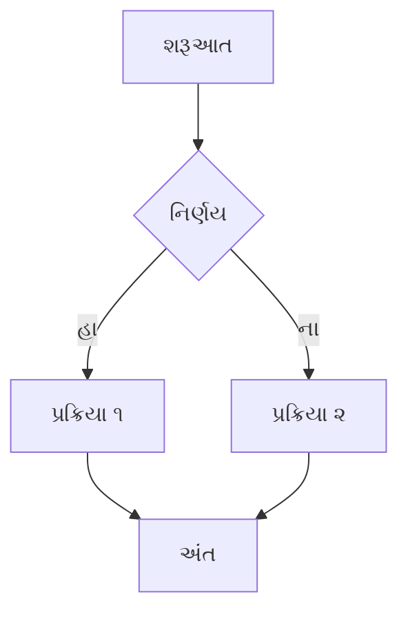

આ **ગુજરાતીમાં** `content/blog` ડિરેક્ટરીમાંથી એક નમૂનારૂપ બ્લોગ પોસ્ટ છે.

## સ્વાગત છે

અમારા દ્વિભાષી બ્લોગમાં આપનું સ્વાગત છે! અમે હ્યુગો-જેવી લવચીક संरचनाનો ઉપયોગ કરીને બહુવિધ ભાષાઓમાં સામગ્રી શેર કરવા માટે ઉત્સાહિત છીએ.

### વિશેષતાઓ
* માર્કડાઉન સામગ્રી
* વિભાગો માટે સબડિરેક્ટરી (જેમ કે આ 'બ્લોગ' વિભાગ)
* અનુવાદ માટે ભાષા પ્રત્યય (ઉદાહરણ તરીકે, `.gu.md`)

આ પાનું `[[...slugParts]]` રૂટીંગનો ઉપયોગ કરે છે.
