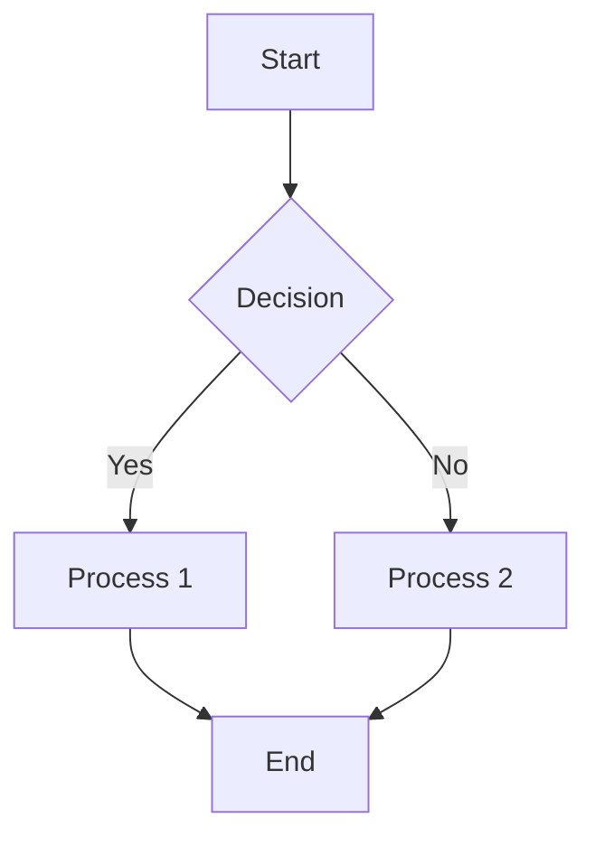

This is a sample blog post in **English** from the `content/blog` directory.

## Welcome

Welcome to our bilingual blog! We are excited to share content in multiple languages using a flexible, Hugo-like structure.

### Features
* Markdown content
* Subdirectory for sections (like this 'blog' section)
* Language suffix for translations (e.g., `.gu.md`)

This page uses `[[...slugParts]]` routing.
