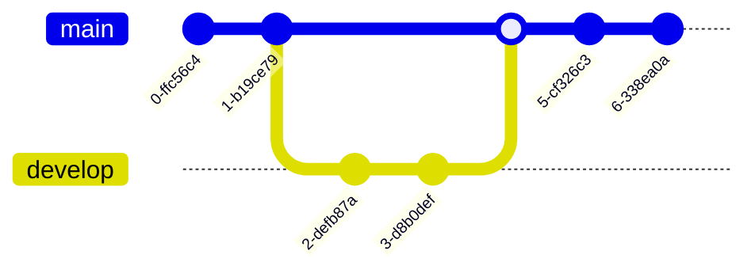

This post demonstrates how to use Mermaid diagrams in Hugo. Mermaid lets you create diagrams and visualizations using text and code.

## Flowchart Example


graph LR;
A[Lemons]-->B[Lemonade];
B-->C[Profit]


## Sequence Diagram Example

## Class Diagram Example

## Gantt Chart Example

### State Diagram

### Pie Chart

### Git Graph

### Entity Relationship Diagram

