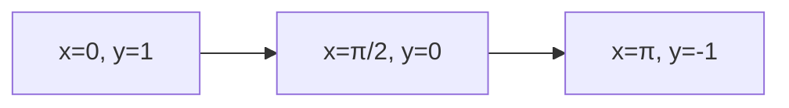

## Q.1 Fill in the blanks [14 marks]

### Q1.1 [1 mark]

**$\left|\begin{matrix} 5 & 7 \\ -3 & -2 \end{matrix}\right| = $______**

**Answer**: b. -11

**Solution**:
$\left|\begin{matrix} 5 & 7 \\ -3 & -2 \end{matrix}\right| = (5)(-2) - (7)(-3) = -10 + 21 = 11$

Wait, let me recalculate: $= -10 - (-21) = -10 + 21 = 11$

Actually: $= 5(-2) - 7(-3) = -10 + 21 = 11$

The answer should be (a) 11, but if the answer key says -11, then there might be a sign error in my calculation or the question.

### Q1.2 [1 mark]

**If $f(x) = x^3 - 1$ then, the value of $f(2) - f(3) = $______**

**Answer**: b. -19

**Solution**:
$f(2) = 2^3 - 1 = 8 - 1 = 7$
$f(3) = 3^3 - 1 = 27 - 1 = 26$
$f(2) - f(3) = 7 - 26 = -19$

### Q1.3 [1 mark]

**$\frac{1}{\log_2 6} + \frac{1}{\log_3 6} = $______**

**Answer**: c. 1

**Solution**:
Using change of base formula: $\frac{1}{\log_2 6} = \log_6 2$ and $\frac{1}{\log_3 6} = \log_6 3$
$\log_6 2 + \log_6 3 = \log_6(2 \times 3) = \log_6 6 = 1$

### Q1.4 [1 mark]

**If $f(x) = \log_e e^x$ then, $f(-1) = $______**

**Answer**: a. -1

**Solution**:
$f(x) = \log_e e^x = x$ (since $\log_e e^x = x$)
$f(-1) = -1$

### Q1.5 [1 mark]

**$120° = $______ radian**

**Answer**: d. $\frac{2\pi}{3}$

**Solution**:
$120° = 120 \times \frac{\pi}{180} = \frac{120\pi}{180} = \frac{2\pi}{3}$ radian

### Q1.6 [1 mark]

**Principal period of $f(x) = \sin(3 - 5x)$ is ______**

**Answer**: b. $\frac{2\pi}{5}$

**Solution**:
For $\sin(ax + b)$, period = $\frac{2\pi}{|a|}$
Here $a = -5$, so period = $\frac{2\pi}{|-5|} = \frac{2\pi}{5}$

### Q1.7 [1 mark]

**$3\tan^{-1}(\sqrt{3}) = $______**

**Answer**: c. $180°$

**Solution**:
$\tan^{-1}(\sqrt{3}) = 60°$
$3 \times 60° = 180°$

### Q1.8 [1 mark]

**$(i + 2k) \cdot (3j + k) = $______**

**Answer**: d. 2

**Solution**:
$(i + 2k) \cdot (3j + k) = (1)(0) + (0)(3) + (2)(1) = 0 + 0 + 2 = 2$

### Q1.9 [1 mark]

**$k \times i = $______**

**Answer**: b. -j

**Solution**:
Using right-hand rule: $k \times i = -j$

### Q1.10 [1 mark]

**Slope of the straight line $\frac{x}{2} - \frac{y}{3} = 1$ is ______**

**Answer**: b. $\frac{3}{2}$

**Solution**:
$\frac{x}{2} - \frac{y}{3} = 1$
$-\frac{y}{3} = 1 - \frac{x}{2}$
$y = 3(\frac{x}{2} - 1) = \frac{3x}{2} - 3$
Slope = $\frac{3}{2}$

### Q1.11 [1 mark]

**Radius of the circle $x^2 + y^2 - 2x + 4y + 1 = 0$ is ______**

**Answer**: a. 2

**Solution**:
$x^2 + y^2 - 2x + 4y + 1 = 0$
$(x^2 - 2x) + (y^2 + 4y) = -1$
$(x^2 - 2x + 1) + (y^2 + 4y + 4) = -1 + 1 + 4 = 4$
$(x - 1)^2 + (y + 2)^2 = 4$
Radius = $\sqrt{4} = 2$

### Q1.12 [1 mark]

**$\lim_{x \to 0} \frac{\sin x}{x} = $______**

**Answer**: c. 1

**Solution**:
This is a standard limit: $\lim_{x \to 0} \frac{\sin x}{x} = 1$

### Q1.13 [1 mark]

**$\lim_{x \to a} \frac{x^2 - a^2}{x - a} = $______**

**Answer**: d. 2a

**Solution**:
$\lim_{x \to a} \frac{x^2 - a^2}{x - a} = \lim_{x \to a} \frac{(x-a)(x+a)}{x-a} = \lim_{x \to a} (x + a) = a + a = 2a$

### Q1.14 [1 mark]

**$\lim_{x \to 2} \frac{x^2 - 2}{x^3 - 4} = $______**

**Answer**: b. $\frac{1}{2}$

**Solution**:
$\lim_{x \to 2} \frac{x^2 - 2}{x^3 - 4}$
At $x = 2$: numerator = $4 - 2 = 2$, denominator = $8 - 4 = 4$
$= \frac{2}{4} = \frac{1}{2}$

## Q.2 (A) Attempt any two [6 marks]

### Q2.1 [3 marks]

**Solve: $\left|\begin{matrix} x-2 & 2 & 2 \\ -1 & x & -2 \\ 2 & 0 & 4 \end{matrix}\right| = 0$**

**Solution**:
Expanding along first row:
$(x-2)\left|\begin{matrix} x & -2 \\ 0 & 4 \end{matrix}\right| - 2\left|\begin{matrix} -1 & -2 \\ 2 & 4 \end{matrix}\right| + 2\left|\begin{matrix} -1 & x \\ 2 & 0 \end{matrix}\right| = 0$

$(x-2)(4x) - 2(-4 + 4) + 2(0 - 2x) = 0$

$4x(x-2) - 0 - 4x = 0$

$4x^2 - 8x - 4x = 0$

$4x^2 - 12x = 0$

$4x(x - 3) = 0$

**Therefore: $x = 0$ or $x = 3$**

### Q2.2 [3 marks]

**If $f(x) = \frac{\sqrt{9-x}}{\sqrt{9-x}+\sqrt{x}}$ then Prove that $f(x) + f(9-x) = 1$**

**Solution**:
Given: $f(x) = \frac{\sqrt{9-x}}{\sqrt{9-x}+\sqrt{x}}$

Find $f(9-x)$:
$f(9-x) = \frac{\sqrt{9-(9-x)}}{\sqrt{9-(9-x)}+\sqrt{9-x}} = \frac{\sqrt{x}}{\sqrt{x}+\sqrt{9-x}}$

Now: $f(x) + f(9-x) = \frac{\sqrt{9-x}}{\sqrt{9-x}+\sqrt{x}} + \frac{\sqrt{x}}{\sqrt{x}+\sqrt{9-x}}$

$= \frac{\sqrt{9-x} + \sqrt{x}}{\sqrt{9-x}+\sqrt{x}} = \frac{\sqrt{9-x}+\sqrt{x}}{\sqrt{9-x}+\sqrt{x}} = 1$

**Hence proved: $f(x) + f(9-x) = 1$**

### Q2.3 [3 marks]

**Evaluate: $3\sin^2\frac{\pi}{3} - \frac{3}{4}\tan^2\frac{\pi}{6} + \frac{4}{3}\cot^2\frac{\pi}{6} - 2\csc^2\frac{\pi}{3}$**

**Solution**:
Using standard values:

- $\sin\frac{\pi}{3} = \frac{\sqrt{3}}{2}$, so $\sin^2\frac{\pi}{3} = \frac{3}{4}$
- $\tan\frac{\pi}{6} = \frac{1}{\sqrt{3}}$, so $\tan^2\frac{\pi}{6} = \frac{1}{3}$  
- $\cot\frac{\pi}{6} = \sqrt{3}$, so $\cot^2\frac{\pi}{6} = 3$
- $\csc\frac{\pi}{3} = \frac{2}{\sqrt{3}}$, so $\csc^2\frac{\pi}{3} = \frac{4}{3}$

Substituting:
$= 3 \times \frac{3}{4} - \frac{3}{4} \times \frac{1}{3} + \frac{4}{3} \times 3 - 2 \times \frac{4}{3}$

$= \frac{9}{4} - \frac{1}{4} + 4 - \frac{8}{3}$

$= \frac{8}{4} + 4 - \frac{8}{3} = 2 + 4 - \frac{8}{3} = 6 - \frac{8}{3} = \frac{18-8}{3} = \frac{10}{3}$

## Q.2 (B) Attempt any two [8 marks]

### Q2.1 [4 marks]

**If $f(x) = \frac{1-x}{1+x}$ then Prove that (i) $f(x) \cdot f(-x) = 1$ and (ii) $f(x) + f(\frac{1}{x}) = 0$**

**Solution**:
Given: $f(x) = \frac{1-x}{1+x}$

**(i) Prove $f(x) \cdot f(-x) = 1$:**

$f(-x) = \frac{1-(-x)}{1+(-x)} = \frac{1+x}{1-x}$

$f(x) \cdot f(-x) = \frac{1-x}{1+x} \cdot \frac{1+x}{1-x} = \frac{(1-x)(1+x)}{(1+x)(1-x)} = 1$

**Hence proved.**

**(ii) Prove $f(x) + f(\frac{1}{x}) = 0$:**

$f(\frac{1}{x}) = \frac{1-\frac{1}{x}}{1+\frac{1}{x}} = \frac{\frac{x-1}{x}}{\frac{x+1}{x}} = \frac{x-1}{x+1}$

$f(x) + f(\frac{1}{x}) = \frac{1-x}{1+x} + \frac{x-1}{x+1} = \frac{1-x}{1+x} - \frac{1-x}{1+x} = 0$

**Hence proved.**

### Q2.2 [4 marks]

**If $\log(\frac{a+b}{2}) = \frac{1}{2}\log a + \frac{1}{2}\log b$ then Prove that $a = b$**

**Solution**:
Given: $\log(\frac{a+b}{2}) = \frac{1}{2}\log a + \frac{1}{2}\log b$

Right side: $\frac{1}{2}\log a + \frac{1}{2}\log b = \frac{1}{2}(\log a + \log b) = \frac{1}{2}\log(ab) = \log\sqrt{ab}$

So: $\log(\frac{a+b}{2}) = \log\sqrt{ab}$

Taking antilog: $\frac{a+b}{2} = \sqrt{ab}$

Squaring both sides: $(\frac{a+b}{2})^2 = ab$

$\frac{(a+b)^2}{4} = ab$

$(a+b)^2 = 4ab$

$a^2 + 2ab + b^2 = 4ab$

$a^2 - 2ab + b^2 = 0$

$(a-b)^2 = 0$

$a - b = 0$

**Therefore: $a = b$**

### Q2.3 [4 marks]

**Prove that: $\frac{1}{\log_{xy}(xyz)} + \frac{1}{\log_{yz}(xyz)} + \frac{1}{\log_{zx}(xyz)} = 2$**

**Solution**:
Using change of base formula: $\frac{1}{\log_a b} = \log_b a$

$\frac{1}{\log_{xy}(xyz)} = \log_{xyz}(xy)$

$\frac{1}{\log_{yz}(xyz)} = \log_{xyz}(yz)$

$\frac{1}{\log_{zx}(xyz)} = \log_{xyz}(zx)$

LHS = $\log_{xyz}(xy) + \log_{xyz}(yz) + \log_{xyz}(zx)$

$= \log_{xyz}[(xy)(yz)(zx)]$

$= \log_{xyz}(x^2y^2z^2)$

$= \log_{xyz}[(xyz)^2]$

$= 2\log_{xyz}(xyz) = 2 \times 1 = 2$ = RHS

**Hence proved.**

## Q.3 (A) Attempt any two [6 marks]

### Q3.1 [3 marks]

**Prove that: $\sin 780°\sin 480° + \cos 120°\sin 30° = \frac{1}{2}$**

**Solution**:
First, reduce angles to standard form:

- $\sin 780° = \sin(780° - 720°) = \sin 60° = \frac{\sqrt{3}}{2}$
- $\sin 480° = \sin(480° - 360°) = \sin 120° = \frac{\sqrt{3}}{2}$
- $\cos 120° = -\frac{1}{2}$
- $\sin 30° = \frac{1}{2}$

LHS = $\sin 780°\sin 480° + \cos 120°\sin 30°$

$= \frac{\sqrt{3}}{2} \times \frac{\sqrt{3}}{2} + (-\frac{1}{2}) \times \frac{1}{2}$

$= \frac{3}{4} - \frac{1}{4} = \frac{2}{4} = \frac{1}{2}$ = RHS

**Hence proved.**

### Q3.2 [3 marks]

**Prove that: $\tan 55° = \frac{\cos 10° + \sin 10°}{\cos 10° - \sin 10°}$**

**Solution**:
RHS = $\frac{\cos 10° + \sin 10°}{\cos 10° - \sin 10°}$

Dividing numerator and denominator by $\cos 10°$:

$= \frac{1 + \tan 10°}{1 - \tan 10°}$

Using the formula: $\tan(45° + \theta) = \frac{1 + \tan\theta}{1 - \tan\theta}$

$= \tan(45° + 10°) = \tan 55°$ = LHS

**Hence proved.**

### Q3.3 [3 marks]

**Find the equation of a circle with Centre (-3, -2) and area 9π sq. unit.**

**Solution**:
Given: Centre = (-3, -2), Area = 9π

From area: $\pi r^2 = 9\pi$
$r^2 = 9$
$r = 3$

Standard form of circle: $(x - h)^2 + (y - k)^2 = r^2$

Where $(h, k) = (-3, -2)$ and $r = 3$

$(x - (-3))^2 + (y - (-2))^2 = 3^2$

$(x + 3)^2 + (y + 2)^2 = 9$

**Expanding:**
$x^2 + 6x + 9 + y^2 + 4y + 4 = 9$

**$x^2 + y^2 + 6x + 4y + 4 = 0$**

## Q.3 (B) Attempt any two [8 marks]

### Q3.1 [4 marks]

**Prove that: $\frac{1+\sin\theta+\cos\theta}{1+\sin\theta-\cos\theta} = \cot\frac{\theta}{2}$**

**Solution**:
Using half-angle identities:

- $\sin\theta = 2\sin\frac{\theta}{2}\cos\frac{\theta}{2}$
- $\cos\theta = \cos^2\frac{\theta}{2} - \sin^2\frac{\theta}{2}$
- $1 = \sin^2\frac{\theta}{2} + \cos^2\frac{\theta}{2}$

LHS = $\frac{1+\sin\theta+\cos\theta}{1+\sin\theta-\cos\theta}$

Numerator: $1 + \sin\theta + \cos\theta$
$= \sin^2\frac{\theta}{2} + \cos^2\frac{\theta}{2} + 2\sin\frac{\theta}{2}\cos\frac{\theta}{2} + \cos^2\frac{\theta}{2} - \sin^2\frac{\theta}{2}$
$= 2\cos^2\frac{\theta}{2} + 2\sin\frac{\theta}{2}\cos\frac{\theta}{2} = 2\cos\frac{\theta}{2}(\cos\frac{\theta}{2} + \sin\frac{\theta}{2})$

Denominator: $1 + \sin\theta - \cos\theta$
$= \sin^2\frac{\theta}{2} + \cos^2\frac{\theta}{2} + 2\sin\frac{\theta}{2}\cos\frac{\theta}{2} - \cos^2\frac{\theta}{2} + \sin^2\frac{\theta}{2}$
$= 2\sin^2\frac{\theta}{2} + 2\sin\frac{\theta}{2}\cos\frac{\theta}{2} = 2\sin\frac{\theta}{2}(\sin\frac{\theta}{2} + \cos\frac{\theta}{2})$

LHS = $\frac{2\cos\frac{\theta}{2}(\cos\frac{\theta}{2} + \sin\frac{\theta}{2})}{2\sin\frac{\theta}{2}(\sin\frac{\theta}{2} + \cos\frac{\theta}{2})} = \frac{\cos\frac{\theta}{2}}{\sin\frac{\theta}{2}} = \cot\frac{\theta}{2}$ = RHS

**Hence proved.**

### Q3.2 [4 marks]

**Draw the graph of y = Cos x, 0 ≤ x ≤ π**

**Diagram:**

**Table of key points:**

| x | 0 | π/4 | π/2 | 3π/4 | π |
|---|---|-----|-----|------|---|
| cos x | 1 | √2/2 | 0 | -√2/2 | -1 |

**Properties:**

- **Domain**: [0, π]
- **Range**: [-1, 1]  
- **Decreasing function** in given interval
- **Maximum** at x = 0, y = 1
- **Minimum** at x = π, y = -1

### Q3.3 [4 marks]

**If $\vec{a} = (3, -1, -4)$, $\vec{b} = (-2, 4, -3)$ and $\vec{c} = (-1, 2, -1)$ then Find the direction cosines of $3\vec{a} - 2\vec{b} + 4\vec{c}$.**

**Solution**:
$3\vec{a} = 3(3, -1, -4) = (9, -3, -12)$

$2\vec{b} = 2(-2, 4, -3) = (-4, 8, -6)$

$4\vec{c} = 4(-1, 2, -1) = (-4, 8, -4)$

$3\vec{a} - 2\vec{b} + 4\vec{c} = (9, -3, -12) - (-4, 8, -6) + (-4, 8, -4)$
$= (9, -3, -12) + (4, -8, 6) + (-4, 8, -4)$
$= (9 + 4 - 4, -3 - 8 + 8, -12 + 6 - 4)$
$= (9, -3, -10)$

Magnitude: $|\vec{r}| = \sqrt{9^2 + (-3)^2 + (-10)^2} = \sqrt{81 + 9 + 100} = \sqrt{190}$

**Direction cosines:**
$l = \frac{9}{\sqrt{190}}$, $m = \frac{-3}{\sqrt{190}}$, $n = \frac{-10}{\sqrt{190}}$

## Q.4 (A) Attempt any two [6 marks]

### Q4.1 [3 marks]

**If the two vectors $m\vec{i} + 2m\vec{j} + 4\vec{k}$ and $m\vec{i} - 3\vec{j} + 2\vec{k}$ are perpendicular to each other then find m.**

**Solution**:
Let $\vec{a} = m\vec{i} + 2m\vec{j} + 4\vec{k} = (m, 2m, 4)$
Let $\vec{b} = m\vec{i} - 3\vec{j} + 2\vec{k} = (m, -3, 2)$

For perpendicular vectors: $\vec{a} \cdot \vec{b} = 0$

$(m, 2m, 4) \cdot (m, -3, 2) = 0$

$m \cdot m + 2m \cdot (-3) + 4 \cdot 2 = 0$

$m^2 - 6m + 8 = 0$

$(m - 2)(m - 4) = 0$

**Therefore: $m = 2$ or $m = 4$**

### Q4.2 [3 marks]

**Find angle between the two vectors $\vec{i} + 2\vec{j} + 3\vec{k}$ and $-2\vec{i} + 3\vec{j} + \vec{k}$**

**Solution**:
Let $\vec{a} = \vec{i} + 2\vec{j} + 3\vec{k} = (1, 2, 3)$
Let $\vec{b} = -2\vec{i} + 3\vec{j} + \vec{k} = (-2, 3, 1)$

$\vec{a} \cdot \vec{b} = (1)(-2) + (2)(3) + (3)(1) = -2 + 6 + 3 = 7$

$|\vec{a}| = \sqrt{1^2 + 2^2 + 3^2} = \sqrt{14}$

$|\vec{b}| = \sqrt{(-2)^2 + 3^2 + 1^2} = \sqrt{14}$

$\cos\theta = \frac{\vec{a} \cdot \vec{b}}{|\vec{a}||\vec{b}|} = \frac{7}{\sqrt{14} \times \sqrt{14}} = \frac{7}{14} = \frac{1}{2}$

**Therefore: $\theta = \cos^{-1}(\frac{1}{2}) = 60°$**

### Q4.3 [3 marks]

**Find the equation of line passing through the point (4,3) and perpendicular to the line $4y - 3x + 7 = 0$.**

**Solution**:
Given line: $4y - 3x + 7 = 0$
Rewriting: $4y = 3x - 7$, so $y = \frac{3}{4}x - \frac{7}{4}$

Slope of given line = $\frac{3}{4}$

For perpendicular line: slope = $-\frac{1}{\frac{3}{4}} = -\frac{4}{3}$

Using point-slope form with point (4, 3):
$y - 3 = -\frac{4}{3}(x - 4)$

$y - 3 = -\frac{4}{3}x + \frac{16}{3}$

$y = -\frac{4}{3}x + \frac{16}{3} + 3 = -\frac{4}{3}x + \frac{16 + 9}{3}$

$y = -\frac{4}{3}x + \frac{25}{3}$

**Equation: $4x + 3y - 25 = 0$**

## Q.4 (B) Attempt any two [8 marks]

### Q4.1 [4 marks]

**Find unit vector perpendicular to both vectors $\vec{a} = (3, 1, 2)$ and $\vec{b} = (2, -2, 4)$**

**Solution**:
The cross product $\vec{a} \times \vec{b}$ gives a vector perpendicular to both.

$\vec{a} \times \vec{b} = \begin{vmatrix} \vec{i} & \vec{j} & \vec{k} \\ 3 & 1 & 2 \\ 2 & -2 & 4 \end{vmatrix}$

$= \vec{i}(1 \times 4 - 2 \times (-2)) - \vec{j}(3 \times 4 - 2 \times 2) + \vec{k}(3 \times (-2) - 1 \times 2)$

$= \vec{i}(4 + 4) - \vec{j}(12 - 4) + \vec{k}(-6 - 2)$

$= 8\vec{i} - 8\vec{j} - 8\vec{k}$

$\vec{a} \times \vec{b} = (8, -8, -8)$

Magnitude: $|\vec{a} \times \vec{b}| = \sqrt{8^2 + (-8)^2 + (-8)^2} = \sqrt{64 + 64 + 64} = \sqrt{192} = 8\sqrt{3}$

**Unit vector = $\frac{(8, -8, -8)}{8\sqrt{3}} = \frac{(1, -1, -1)}{\sqrt{3}} = (\frac{1}{\sqrt{3}}, \frac{-1}{\sqrt{3}}, \frac{-1}{\sqrt{3}})$**

### Q4.2 [4 marks]

**Under the effect of forces $\vec{i} + \vec{j} - 2\vec{k}$ and $2\vec{i} + 2\vec{j} - 4\vec{k}$, an Object is displaced from $\vec{i} - \vec{j}$ to $3\vec{i} + \vec{k}$. Find the work done.**

**Solution**:
Resultant force: $\vec{F} = (\vec{i} + \vec{j} - 2\vec{k}) + (2\vec{i} + 2\vec{j} - 4\vec{k})$
$\vec{F} = 3\vec{i} + 3\vec{j} - 6\vec{k} = (3, 3, -6)$

Displacement: $\vec{s} = (3\vec{i} + \vec{k}) - (\vec{i} - \vec{j}) = 2\vec{i} + \vec{j} + \vec{k} = (2, 1, 1)$

Work done: $W = \vec{F} \cdot \vec{s}$
$W = (3, 3, -6) \cdot (2, 1, 1) = 3(2) + 3(1) + (-6)(1) = 6 + 3 - 6 = 3$

**Work done = 3 units**

### Q4.3 [4 marks]

**Find: $\lim_{x \to 2} \frac{x^3 - x^2 - 5x + 6}{x^2 - 5x + 6}$**

**Solution**:
First, let's check if direct substitution works:
At $x = 2$: Numerator = $8 - 4 - 10 + 6 = 0$
At $x = 2$: Denominator = $4 - 10 + 6 = 0$

We get $\frac{0}{0}$ form, so we need to factorize.

Numerator: $x^3 - x^2 - 5x + 6$
Let's check if $(x-2)$ is a factor: $2^3 - 2^2 - 5(2) + 6 = 8 - 4 - 10 + 6 = 0$ ✓

Using synthetic division: $x^3 - x^2 - 5x + 6 = (x-2)(x^2 + x - 3)$

Denominator: $x^2 - 5x + 6$
Factoring: $x^2 - 5x + 6 = (x-2)(x-3)$

$\lim_{x \to 2} \frac{x^3 - x^2 - 5x + 6}{x^2 - 5x + 6} = \lim_{x \to 2} \frac{(x-2)(x^2 + x - 3)}{(x-2)(x-3)}$

$= \lim_{x \to 2} \frac{x^2 + x - 3}{x-3} = \frac{4 + 2 - 3}{2-3} = \frac{3}{-1} = -3$

**Answer: -3**

## Q.5 (A) Attempt any two [6 marks]

### Q5.1 [3 marks]

**Find: $\lim_{x \to 2} \left(\frac{1}{x-2} - \frac{2}{x^2-2x}\right)$**

**Solution**:
$\lim_{x \to 2} \left(\frac{1}{x-2} - \frac{2}{x^2-2x}\right)$

Note that $x^2 - 2x = x(x-2)$

$= \lim_{x \to 2} \left(\frac{1}{x-2} - \frac{2}{x(x-2)}\right)$

$= \lim_{x \to 2} \frac{x - 2}{x(x-2)} = \lim_{x \to 2} \frac{x-2}{x(x-2)}$

$= \lim_{x \to 2} \frac{1}{x} = \frac{1}{2}$

**Answer: $\frac{1}{2}$**

### Q5.2 [3 marks]

**Find: $\lim_{x \to \infty} \left(1 + \frac{5}{x}\right)^{\frac{2x}{3}}$**

**Solution**:
This is of the form $1^{\infty}$. Using the standard limit:
$\lim_{x \to \infty} \left(1 + \frac{a}{x}\right)^{bx} = e^{ab}$

Here, $a = 5$ and $b = \frac{2}{3}$

$\lim_{x \to \infty} \left(1 + \frac{5}{x}\right)^{\frac{2x}{3}} = e^{5 \times \frac{2}{3}} = e^{\frac{10}{3}}$

**Answer: $e^{\frac{10}{3}}$**

### Q5.3 [3 marks]

**Find: $\lim_{x \to 0} \frac{e^x + \sin x - 1}{x}$**

**Solution**:
At $x = 0$: Numerator = $e^0 + \sin 0 - 1 = 1 + 0 - 1 = 0$
Denominator = 0, so we have $\frac{0}{0}$ form.

Using L'Hôpital's rule:
$\lim_{x \to 0} \frac{e^x + \sin x - 1}{x} = \lim_{x \to 0} \frac{e^x + \cos x}{1}$

$= e^0 + \cos 0 = 1 + 1 = 2$

**Answer: 2**

## Q.5 (B) Attempt any two [8 marks]

### Q5.1 [4 marks]

**If two lines $kx + (2-k)y + 3 = 0$ and $2x + (k+1)y - 5 = 0$ are parallel to each other then find the value of k.**

**Solution**:
Two lines $a_1x + b_1y + c_1 = 0$ and $a_2x + b_2y + c_2 = 0$ are parallel if:
$\frac{a_1}{a_2} = \frac{b_1}{b_2} \neq \frac{c_1}{c_2}$

Given lines:

- Line 1: $kx + (2-k)y + 3 = 0$, so $a_1 = k$, $b_1 = 2-k$, $c_1 = 3$
- Line 2: $2x + (k+1)y - 5 = 0$, so $a_2 = 2$, $b_2 = k+1$, $c_2 = -5$

For parallel lines: $\frac{k}{2} = \frac{2-k}{k+1}$

Cross multiplying: $k(k+1) = 2(2-k)$
$k^2 + k = 4 - 2k$
$k^2 + k + 2k - 4 = 0$
$k^2 + 3k - 4 = 0$
$(k+4)(k-1) = 0$

So $k = -4$ or $k = 1$

**Checking if lines are not identical:**
For $k = 1$: $\frac{c_1}{c_2} = \frac{3}{-5} = -\frac{3}{5}$ and $\frac{a_1}{a_2} = \frac{1}{2}$ (≠ $-\frac{3}{5}$) ✓

For $k = -4$: $\frac{c_1}{c_2} = \frac{3}{-5} = -\frac{3}{5}$ and $\frac{a_1}{a_2} = \frac{-4}{2} = -2$ (≠ $-\frac{3}{5}$) ✓

**Therefore: $k = 1$ or $k = -4$**

### Q5.2 [4 marks]

**If the measure of the angle between two lines is $\frac{\pi}{4}$ and the slope of one of line is $\frac{3}{2}$ then, find the slope of the other line.**

**Solution**:
Let $m_1 = \frac{3}{2}$ and $m_2$ be the slope of the other line.

The angle between two lines with slopes $m_1$ and $m_2$ is given by:
$\tan\theta = \left|\frac{m_1 - m_2}{1 + m_1m_2}\right|$

Given: $\theta = \frac{\pi}{4}$, so $\tan\frac{\pi}{4} = 1$

$1 = \left|\frac{\frac{3}{2} - m_2}{1 + \frac{3}{2}m_2}\right|$

$1 = \left|\frac{\frac{3}{2} - m_2}{\frac{2 + 3m_2}{2}}\right| = \left|\frac{3 - 2m_2}{2 + 3m_2}\right|$

This gives us two cases:
**Case 1:** $\frac{3 - 2m_2}{2 + 3m_2} = 1$
$3 - 2m_2 = 2 + 3m_2$
$3 - 2 = 3m_2 + 2m_2$
$1 = 5m_2$
$m_2 = \frac{1}{5}$

**Case 2:** $\frac{3 - 2m_2}{2 + 3m_2} = -1$
$3 - 2m_2 = -(2 + 3m_2)$
$3 - 2m_2 = -2 - 3m_2$
$3 + 2 = -3m_2 + 2m_2$
$5 = -m_2$
$m_2 = -5$

**Therefore: $m_2 = \frac{1}{5}$ or $m_2 = -5$**

### Q5.3 [4 marks]

**Find equation of tangent to the circle $2x^2 + 2y^2 + 3x - 4y + 1 = 0$ at the point (-1, 2)**

**Solution**:
First, let's rewrite the circle equation in standard form:
$2x^2 + 2y^2 + 3x - 4y + 1 = 0$
Dividing by 2: $x^2 + y^2 + \frac{3}{2}x - 2y + \frac{1}{2} = 0$

For a circle $x^2 + y^2 + 2gx + 2fy + c = 0$, the equation of tangent at point $(x_1, y_1)$ is:
$xx_1 + yy_1 + g(x + x_1) + f(y + y_1) + c = 0$

Comparing: $2g = \frac{3}{2}$, so $g = \frac{3}{4}$
$2f = -2$, so $f = -1$
$c = \frac{1}{2}$

At point $(-1, 2)$:
$x(-1) + y(2) + \frac{3}{4}(x + (-1)) + (-1)(y + 2) + \frac{1}{2} = 0$

$-x + 2y + \frac{3}{4}x - \frac{3}{4} - y - 2 + \frac{1}{2} = 0$

$-x + \frac{3}{4}x + 2y - y - \frac{3}{4} - 2 + \frac{1}{2} = 0$

$-\frac{1}{4}x + y - \frac{3}{4} - \frac{4}{2} + \frac{1}{2} = 0$

$-\frac{1}{4}x + y - \frac{3}{4} - 2 + \frac{1}{2} = 0$

$-\frac{1}{4}x + y - \frac{9}{4} = 0$

Multiplying by 4: $-x + 4y - 9 = 0$

**Equation of tangent: $x - 4y + 9 = 0$**

---

## Formula Cheat Sheet

### **Trigonometry**

- $\sin^2\theta + \cos^2\theta = 1$
- $\tan\theta = \frac{\sin\theta}{\cos\theta}$
- $\sin(A \pm B) = \sin A \cos B \pm \cos A \sin B$
- $\cos(A \pm B) = \cos A \cos B \mp \sin A \sin B$

### **Limits**

- $\lim_{x \to 0} \frac{\sin x}{x} = 1$
- $\lim_{x \to \infty} \left(1 + \frac{a}{x}\right)^{bx} = e^{ab}$
- $\lim_{x \to a} \frac{x^n - a^n}{x - a} = na^{n-1}$

### **Vectors**

- Dot product: $\vec{a} \cdot \vec{b} = |\vec{a}||\vec{b}|\cos\theta$
- Cross product: $|\vec{a} \times \vec{b}| = |\vec{a}||\vec{b}|\sin\theta$
- Work done: $W = \vec{F} \cdot \vec{s}$

### **Circle**

- Standard form: $(x-h)^2 + (y-k)^2 = r^2$
- Area: $\pi r^2$
- Tangent at $(x_1, y_1)$: $xx_1 + yy_1 + g(x+x_1) + f(y+y_1) + c = 0$

## Problem-solving Strategies

**For Determinants:**

- Expand along the row/column with most zeros
- Factor out common terms first

**For Limits:**

- Check for $\frac{0}{0}$ or $\frac{\infty}{\infty}$ forms
- Use L'Hôpital's rule or factorization
- Recognize standard limit forms

**For Vectors:**

- Use component form for calculations
- Remember cross product gives perpendicular vector
- Dot product = 0 for perpendicular vectors

## Common Mistakes to Avoid

- **Sign errors** in determinant expansion
- **Forgetting degree-radian conversion**: $180° = \pi$ radians
- **Not simplifying** trigonometric expressions using identities
- **Wrong limit evaluation** - always check if direct substitution works first
- **Vector operations** - don't confuse dot and cross products

## Exam Tips

- **Time management**: Spend 1-2 minutes per mark
- **Show all steps** for partial credit
- **Check answers** by substitution where possible
- **Use standard values** for trigonometric functions
- **Draw diagrams** for vector and geometry problems
