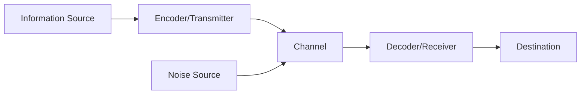

## Question 1(a) [3 marks]

**Select (✓) the most appropriate option from the given options. (Any 3)**

1. The sign of successful communication is when _________.
   **Answer**: d. The Sender gets the desired response from the receiver.

2. The process of converting signal (coded message) into understanding is...
   **Answer**: b. Decoding

3. Use of Tone, Stress, and Intonation of one's voice in Communication is...
   **Answer**: c. Paralanguage

4. David Berlo's ________ Model is an expansion of the Shannon-Weaver Model of Communication.
   **Answer**: b. SMCR: Sender Message Channel Receiver

## Question 1(b) [4 marks]

**Justify Fate and Friendship vs. Duty as the Central Themes of the Story "After Twenty Years".**

**Answer**:
In "After Twenty Years" by O. Henry, fate brings two friends to a fateful encounter where duty conflicts with friendship. Bob waits for Jimmy after 20 years, unaware that his friend is now a policeman who must arrest him. 

**Table: Themes in "After Twenty Years"**

| Theme | Evidence |
|-------|----------|
| Friendship | Bob travels miles to keep a 20-year promise |
| Fate | Ironically reunites friends as criminal and cop |
| Duty | Jimmy chooses legal obligation over friendship |
| Conflict | Personal loyalty versus professional responsibility |

**Mnemonic:** "Friends Face Duty's Divide"

## Question 1(c) [7 marks]

**Write a Brief Note in about 120 words on the following. (Any Two)**

### 1. Shannon-Weaver Model of Communication Process (Explain with Diagram)

**Answer**:
The Shannon-Weaver Model explains how information flows from sender to receiver through a communication channel.

**Diagram:**



- **Information Source**: Creates and decides what message to send
- **Encoder**: Converts message into signals or code
- **Channel**: Medium through which message travels
- **Decoder**: Converts signals back into understandable message
- **Destination**: Person receiving the message
- **Noise**: Any interference disrupting message transmission

**Mnemonic:** "Send Encode Channel Decode Receive"

### 2. Communication: Definition, Need, and Application at Workplace

**Answer**:
Communication is the exchange of information, ideas, and feelings between individuals.

**Table: Communication Essentials**

| Aspect | Details |
|--------|---------|
| Definition | Process of sharing information, ideas, and emotions |
| Need | Enables coordination, problem-solving, and relationship-building |
| Workplace Applications | Team collaboration, customer service, conflict resolution |

- **Essential Need**: Required for instruction, feedback, and coordination
- **Workplace Benefits**: Increases productivity, improves employee engagement
- **Forms Used**: Verbal, written, digital, and non-verbal communications

**Mnemonic:** "Share, Connect, Achieve"

### 3. Barriers to Communication with Illustrations

**Answer**:
Communication barriers prevent effective exchange of messages between sender and receiver.

**Table: Types of Communication Barriers**

| Barrier Type | Examples |
|-------------|----------|
| Physical | Distance, noise, poor technology connection |
| Psychological | Bias, lack of attention, emotional state |
| Language | Jargon, ambiguity, poor translation |
| Cultural | Differing values, norms, and customs |

- **Physical Barriers**: Noisy room preventing clear hearing
- **Psychological Barriers**: Preconceived notions affecting understanding
- **Language Barriers**: Technical terms unknown to the receiver
- **Cultural Barriers**: Different gestures meaning opposite things in two cultures

**Mnemonic:** "PLCS: Physical, Language, Cultural, State-of-mind"

## Alternative Question 1(c) [7 marks]

**Answer the following questions in one or two sentences. (Any Seven)**

1. **What is Encoding in the Process of Communication?**
   Converting thoughts/ideas into symbols, words, or gestures that the receiver can understand.

2. **Define Decoding in the Process of Communication.**
   The process where the receiver interprets the message and converts it into meaningful information.

3. **Why is Feedback essential for a successful Communication?**
   Feedback confirms whether the message was correctly understood and allows the sender to adjust communication if necessary.

4. **Which type of Communication is more effective? Verbal or Non-Verbal?**
   Non-verbal is often more effective as it conveys emotions and attitudes that may not be expressed verbally.

5. **How does Non-Verbal Communication supplement Verbal Communication?**
   It reinforces, contradicts, substitutes, complements, or accents the verbal message, adding layers of meaning.

6. **State the components of Paralanguage serving the purpose of communication.**
   Tone, pitch, volume, rate, quality of voice, and vocal fillers like "um" or "ah."

7. **In which form/s can Visual Communication be represented?**
   Charts, graphs, maps, photographs, videos, signs, symbols, and illustrations.

8. **Explain any two Barriers to Communication.**
   Physical barriers include noise and distance; psychological barriers include prejudice and emotional state.

## Question 2(a) [3 marks]

**Identify Noun/s from the following sentences.**

1. The old **man** is known for his **wisdom**.
2. **Kritika** bought a **handbag** for **herself**.
3. **Aryan** was scolded for his **forgetfulness**.

## Question 2(b) [4 marks]

**Do as directed.**

1. The Examination of Communication Skills in English was **quite** easy.
   (Apply a suitable Adverb from quiet, quite, quietly and Rewrite the Sentence.)

2. **Wow**! That was truly an exquisite performance!
   (Apply a suitable Interjection from Wow, Oh, Ouch and Rewrite the Sentence.)

3. The place is a Seven-Star Resort **where** celebrities are staying.
   (Join these two sentences using a suitable Conjunction from Which, Where, When and Rewrite the revised Sentence.)

4. The **wealthy** woman bought **diamond** jewellery.
   (Rewrite the Sentence and Underline Adjective/s.)

## Question 2(c) [7 marks]

**Fill in the blanks using the appropriate form of the verbs given in brackets.**

1. **Did** she **have** dinner last night? (Do…have, Does….have, Did….have)

2. I **have been** to the Statue of Unity many times. (have been, has been, had been)

3. Meera got three calls from her friend, while she **was having** dinner with her family last night. (is doing, was having, were doing)

4. Mrs. Dhingra **is talking** on the phone at this moment. (has been talking, have been talking, is talking)

5. The roads are completely wet as it **has been raining** since morning. (had rained, has rained, has been raining)

6. Some students **have paid** already their Tuition fees in time. (has…paid, have…paid, have been paying)

7. When we **arrived** at the stadium, the match **had already begun**. (arrive, have begun; arrived, had already began; arrived, had already begun)

## Alternative Question 2(a) [3 marks]

**Fill in the blanks with suitable Pronoun/s.**

1. That purse is mine. I opened **it** to see if there was any money inside. (it's, it, its)

2. Vishala and Viral decided that **they** would go on a trip to Shimla. (she, he, they)

3. Mother baked the cookies **herself**. (itself, herself, themselves)

## Alternative Question 2(b) [4 marks]

**Do as directed.**

1. Rahul has been to Dubai just **once**. (Apply a suitable Adverb from "one, once, or ones" and Rewrite the Sentence.)

2. We will go for sightseeing tomorrow **unless** it rains. (Apply a suitable Conjunction from "if, otherwise, unless" and Rewrite the Sentence.)

3. The modest don't boast **of** their achievements. (Apply a suitable Preposition from "at, of, for" and Rewrite the Sentence.)

4. **Four** cats ran into the backyard. (Underline Adjective/s.)

## Alternative Question 2(c) [7 marks]

**Fill in the blanks using the appropriate form of the verbs given in brackets.**

1. Ritu **has been suffering** from Insomnia since October 2023. (has suffered, have been suffering, has been suffering)

2. Look! The young ones of langurs **are wrestling** like boys. (is wrestling, has wrestled, are wrestling)

3. Meera **is looking for** a job nowadays. (is looking, was looking for, is looking for)

4. He usually **takes** tea, but today he **is drinking** coffee. (is taking…is drinking, takes…is drinking, took…drank)

5. I **had never seen** such a beautiful beach before I went to Miami. (had…saw, has…been seen, had…seen)

6. India **will become** a developed country by 2047. (was, will become, is)

7. The lights suddenly went off, while we **were playing** carrom yesterday. (have played, were playing, are playing)

## Question 3(a) [3 marks]

**Identify the sentence pattern of the sentences given below. (Any Three)**

1. They / worked / hard.
   **Answer**: Subject + Verb + Adverb

2. It / was / a very pleasant talk.
   **Answer**: Subject + Verb + Complement

3. Many students / witnessed / a Play.
   **Answer**: Subject + Verb + Object

4. Leopard / roars.
   **Answer**: Subject + Verb

## Question 3(b) [4 marks]

**Fill in the blanks with a suitable Modal Auxiliary. (Any Four)**

1. There are black clouds. It **may** rain today. (can, may, should)

2. The children **should** obey their parents and teachers. (need, could, should)

3. **May** India win the 2027 Cricket World Cup! (can, may)

4. Kartik **must** have attended the meeting. (Use Certainty indicating Modal Auxiliary)

5. **Could** you lend me your bike for an hour, please? (Use Politeness indicating Modal Auxiliary)

## Question 3(c) [7 marks]

**Fill in the blanks using the appropriate form of the verbs. (Any Seven)**

1. Time and tide **wait** for none. (wait/waits)

2. The director and producer of the movie **were** present yesterday. (was, were)

3. Rakesh as well as his friends **is** invited to the party. (is, are)

4. Neither of the Teams **has** performed their best in IPL. (has, have)

5. As the guests ate much of the Ice cream, a little **was** left for the kids. (was, were)

6. The problems of today's youth **are** many. (is, are)

7. Lots of food **is** wasted globally each year. (is, are)

8. Each of the parcels **weighs** 15 kgs. (weigh, weighs)

## Alternative Question 3(a) [3 marks]

**Identify the sentence pattern of the sentences given below. (Any Three)**

1. She / sings / a song.
   **Answer**: Subject + Verb + Object

2. They / came / suddenly.
   **Answer**: Subject + Verb + Adverb

3. People / cried.
   **Answer**: Subject + Verb

4. We / are / Indians.
   **Answer**: Subject + Verb + Complement

## Alternative Question 3(b) [4 marks]

**Fill in the blanks with a suitable Modal Auxiliary. (Any Four)**

1. Rakhi **had to** keep quiet as the students were reading in the next room. (has to, have to, had to)

2. **Would** you lend me a pen, please? (should, will, must)

3. My father **could** climb a tall tree when he was young. (can, could)

4. One **must not** speak loudly in the hospital. (Use Prohibition indicating Modal Auxiliary)

5. You **need not** worry about her as she is completely recovered from illness now. (Use Absence of Necessity indicating Modal Auxiliary)

## Alternative Question 3(c) [7 marks]

**Fill in the blanks using the appropriate form of the verbs. (Any Seven)**

1. Walnut Brownie with hot chocolate sauce **is** my favorite dish. (is/are)

2. The poet and the statesman **have** arrived. (has/have)

3. Each day and each hour **brings** us a fresh anxiety. (bring/brings)

4. Either Kartik or Kritika **has** eaten all the Wafers. (has/have)

5. Neither you all nor your friend **is** to be blamed. (is/are)

6. More than half of the time **is** over still he hasn't turned up. (is, are)

7. You as well as I **am** responsible for our losses. (am, are)

8. Plenty of shops **accept** payments by a credit card. (accept, accepts)

## Question 4(a) [3 marks]

**Choose the Correct Option: (Any Three)**

1. Pari Tibba/Hill of the Fairies was also known as ___________.
   **Answer**: (d) Burnt Hill

2. Bob and Jimmy were born and brought up in ______________ city of USA.
   **Answer**: (c) New York

3. ________ gives his harness bells a shake to ask if there is some mistake.
   **Answer**: (c) Horse

4. According to the poet, humans should work towards__________.
   **Answer**: (d) Perfection

## Question 4(b) [4 marks]

**Answer the following questions in brief. (20 to 40 Words) (Any Two)**

1. **Comment on the gradual change in the behavior of Birds and Animals towards the Author in the story "Leopard".**

**Answer**:
Initially, birds and animals were wary of the author, fleeing at his approach. Gradually, as he became a regular visitor who posed no threat, they grew accustomed to his presence. Eventually, they accepted him as part of their environment, carrying on their natural activities even when he was nearby.

2. **Where did Jimmy and Bob have their last dinner? What did they promise to each other then?**

**Answer**:
Jimmy and Bob had their last dinner at "Big Joe" Brady's restaurant. They promised to meet again at the same spot exactly twenty years later, regardless of their circumstances or distances traveled, demonstrating their commitment to their friendship.

3. **Why was Bob under arrest? Why didn't Jimmy himself arrest Bob?**

**Answer**:
Bob was under arrest because he was a wanted criminal in Chicago. Jimmy didn't arrest Bob himself because of their friendship; instead, he sent another officer to make the arrest while leaving a note explaining the situation, showing his internal conflict between duty and friendship.

## Question 4(c) [7 marks]

**Write a Brief Note in about 120 words on the following. (Any Two)**

### 1. Author's Two Encounters with the Leopard

**Answer**:
In Ruskin Bond's "Leopard," the author has two significant encounters with the magnificent wild cat.

**Table: The Two Leopard Encounters**

| Encounter | Description | Outcome |
|-----------|-------------|---------|
| First Meeting | Author spots leopard drinking from stream | Mutual watchfulness, respect |
| Second Meeting | Leopard appears unexpectedly on path | Gentle retreat, acknowledgment |

- **First Encounter**: The author observes the leopard drinking from the stream. The animal senses his presence but continues drinking, showing a level of comfort
- **Second Encounter**: The leopard appears on the path ahead of the author. They maintain eye contact before the leopard calmly retreats into the forest

These encounters highlight the delicate relationship between humans and wildlife, with mutual respect allowing for peaceful coexistence.

**Mnemonic:** "Watch, Wait, Withdraw"

### 2. Central Idea of the Poem "Stopping by Woods on a Snowy Evening"

**Answer**:
Robert Frost's poem conveys the tension between appreciating natural beauty and fulfilling life's obligations.

**Table: Central Ideas in the Poem**

| Theme | Evidence |
|-------|----------|
| Natural Beauty | "Woods fill up with snow" |
| Momentary Pause | Stopping between woods and frozen lake |
| Duty vs. Desire | Horse's impatience vs. speaker's wish to stay |
| Life's Responsibilities | "Miles to go before I sleep" |

- **Appreciation of Beauty**: The speaker pauses to admire the serene, snow-filled woods
- **Life's Duties**: Despite the attraction of natural beauty, life's responsibilities call
- **Deeper Meaning**: The repeated line "miles to go before I sleep" suggests both literal journey and life's remaining responsibilities

**Mnemonic:** "Pause, Ponder, Proceed"

### 3. Freedom envisioned by Tagore in "Where the Mind is without Fear"

**Answer**:
In his poem, Tagore envisions an ideal free India characterized by intellectual and spiritual freedom.

**Table: Tagore's Vision of Freedom**

| Aspect | Vision |
|--------|--------|
| Intellectual | Knowledge without borders, free from fear |
| Social | No divisions based on caste, religion, or region |
| Cultural | Truth-seeking without prejudice |
| National | Dignity, rational thinking, and progress |

- **Fearless Mind**: Citizens think and express freely without intimidation
- **Knowledge without Barriers**: Learning transcends narrow domestic walls
- **Truth-Seeking**: Words come from depth of truth, not superficial sources
- **Rational Thinking**: Reason guides actions, not superstition or blind customs

**Mnemonic:** "Freedom Through Knowledge, Truth, and Reason"

## Alternative Question 4(a) [3 marks]

**Choose the Correct Option: (Any Three)**

1. "Where the Mind is without Fear" is written by the Poet __________________.
   **Answer**: (c) Rabindranath Tagore

2. What made Bob realize that the Cop wasn't Jimmy?
   **Answer**: (d) His jaw

3. "Stopping by Woods on a Snowy Evening" is written by the Poet ___________.
   **Answer**: (d) Robert Frost

4. Apart from the author, __________ was the regular visitor of the stream.
   **Answer**: (b) Forktail

## Alternative Question 4(b) [4 marks]

**Answer the following questions in brief. (20 to 40 Words) (Any Two)**

1. **Comment on the Author's approach to the Birds and Animals in "Leopard".**

**Answer**:
The author approached wildlife with patience and respect, never intruding or disturbing their natural behaviors. He maintained appropriate distance, moved slowly, and avoided direct eye contact with threatening gestures. This considerate approach earned him eventual acceptance, allowing him to observe their natural behaviors.

2. **How does the little horse of the poet react to being stopped by the woods? Why?**

**Answer**:
The horse shakes its harness bells questioningly, thinking it unusual to stop without a farmhouse nearby. It's impatient because it's accustomed to practical journeys with definite destinations, not pausing to appreciate natural beauty, and senses they have responsibilities waiting ahead.

3. **Explicate Tagore's Vision of India when he says "Where the world has not been broken up into fragments by narrow domestic walls."**

**Answer**:
Tagore envisions an India free from divisions based on caste, religion, region, or language. He dreams of a unified nation where people don't separate themselves with prejudice or discrimination. These "narrow domestic walls" represent artificial social barriers that prevent national unity and human connection.

## Alternative Question 4(c) [7 marks]

**Write a Short Note in about 120 words on the following. (Any Two)**

### 1. Lessons learnt from the story "After Twenty Years"

**Answer**:
O. Henry's "After Twenty Years" offers profound life lessons through its ironic twist.

**Table: Key Lessons from "After Twenty Years"**

| Lesson | Explanation |
|--------|-------------|
| Life Changes People | Bob and Jimmy's drastically different paths |
| Duty vs. Friendship | Jimmy's moral conflict as policeman and friend |
| Irony of Fate | Friends meeting as criminal and cop |
| Honor in Different Forms | Both men keep their promises differently |

- **Character Evolution**: People change significantly over time, sometimes in unexpected directions
- **Moral Dilemma**: Professional duty may conflict with personal relationships
- **Honor and Integrity**: Jimmy fulfills both his promise (by sending a note) and his duty (by arranging the arrest)
- **Consequences of Choices**: Our decisions shape our destiny, leading us to unforeseen circumstances

**Mnemonic:** "Time Changes Paths, Choices Matter"

### 2. 'India after Independence' envisaged by Rabindranath Tagore

**Answer**:
Though written before independence, Tagore's poem outlines his vision for a free India.

**Table: Tagore's Vision for Independent India**

| Aspect | Vision |
|--------|--------|
| Freedom | Beyond political - includes intellectual and spiritual |
| Society | Unified, without divisive barriers |
| Knowledge | Constantly expanding, driven by reason |
| Character | Truthful, dignified, and perfectionist |

- **Intellectual Freedom**: Minds functioning without fear or oppression
- **Social Harmony**: No artificial divisions based on caste, religion, or region
- **Progressive Thinking**: Clear, logical reasoning guiding national progress
- **Moral Character**: Words emerging from truthfulness, actions from dignity

**Mnemonic:** "Free Minds, United People, Progressive Nation"

### 3. The Author's strong efforts to find out the Forktail's nest in "Leopard"

**Answer**:
In "Leopard," the author's search for the forktail's nest demonstrates his passion for wildlife observation.

**Table: The Forktail Nest Search**

| Aspect | Details |
|--------|---------|
| Bird Characteristics | Small, black and white water bird frequenting stream |
| Search Methodology | Patient observation, tracking movements |
| Challenges | Forktail's secretive nature, difficult terrain |
| Significance | Represents author's deeper connection with wildlife |

- **Persistent Observation**: The author regularly visited the stream to study the forktail's habits
- **Methodical Approach**: He followed the bird's flight patterns, noting where it disappeared
- **Challenges Faced**: Dense vegetation and slippery rocks complicated the search
- **Symbolic Meaning**: The quest represents mankind's desire to understand nature's secrets

**Mnemonic:** "Watch, Follow, Discover"

## Question 5(a) [3 marks]

**Choose the Correct Option: (Any Three)**

1. The language used in business/formal emails should be...
   **Answer**: (c) professional

2. _________ Email is written in response to the Complaints raised by the Clients.
   **Answer**: (a) Adjusting

3. A written letter requesting information on the Product/Material is called..
   **Answer**: (a) Inquiry Letter

4. ___________ is used to send mass emails without disclosing the email IDs of the recipients.
   **Answer**: (c) Bcc

## Question 5(b) [4 marks]

**Do as directed. (Attempt Any One)**

### 1. Elucidate the 7 Cs of Business Communication in about 120 words

**Answer**:
The 7 Cs framework ensures effective business communication through essential principles.

**Table: The 7 Cs of Business Communication**

| Principle | Meaning |
|-----------|---------|
| Clarity | Using simple language with clear purpose |
| Conciseness | Being brief without sacrificing completeness |
| Completeness | Including all necessary information |
| Concreteness | Using specific facts and figures |
| Correctness | Ensuring accuracy in grammar and facts |
| Consideration | Considering audience's perspective |
| Courtesy | Being respectful and thoughtful |

These principles provide a systematic approach for creating messages that achieve their purpose while building positive relationships. Following the 7 Cs helps avoid misunderstandings, saves time, and improves communication effectiveness in professional settings.

**Mnemonic:** "Clear, Concise, Complete Communication Creates Correct Connection"

### 2. Write a request letter to the Head of your respective Department in your College to sanction your leave for a week

**Answer**:

```
[Your Name]
[Your Class/Roll Number]
[College Name]
[Address]
[Date]

The Head of Department
[Department Name]
[College Name]
[Address]

Subject: Request for One Week Leave

Respected Sir/Madam,

I am writing to request a leave of absence for one week from [start date] to [end date] due to [brief reason - family function/medical treatment/personal emergency].

During my absence, I will ensure that I complete all pending assignments upon my return. I have also arranged with my classmates to share their notes with me so that I don't miss any important lessons.

I would be grateful if you could kindly grant me leave for the mentioned period. I shall report back to college on [date of return].

Thank you for your consideration.

Yours sincerely,

[Your Signature]
[Your Name]
[Roll Number]
```

## Question 5(c) [7 marks]

**Draft the following Business Email: (Any One)**

### 1. HYUNDAI MOTORS LTD Email Inquiry for Batteries

**Answer**:

```
From: purchase@hyundaimotors.com
To: sales@envision-energy.com
Subject: Inquiry for Lithium-ion Batteries (Model No. ID89-Z) for Hyundai Karrier EV

Dear Mr. Bruce Craig,

I am writing on behalf of HYUNDAI MOTORS LTD, Mumbai, India, to inquire about your Lithium-ion Batteries (Model No. ID89-Z).

We are planning to launch our new SUV car 'Hyundai Karrier EV' in the Asian Market on May 01, 2024, and require 20,000 units of your futureproof Lithium-ion Batteries (Model No. ID89-Z).

We would appreciate if you could provide us with the following information:

1. Detailed specifications and features of the batteries
2. Unit price and applicable discounts for bulk orders
3. Delivery timeframe and shipping terms
4. Warranty periods and after-sales service options
5. Payment terms and conditions

Please send us your latest catalog and a quotation for the required quantity at your earliest convenience.

Thank you for your prompt attention to this inquiry. We look forward to your response.

Yours sincerely,

Manoj Nalawade
Purchase Manager
HYUNDAI MOTORS LTD
Mumbai, India
Email: purchase@hyundaimotors.com
Tel: [Phone Number]
```

### 2. HYUNDAI MOTORS LTD Order Email for Batteries

**Answer**:

```
From: purchase@hyundaimotors.com
To: sales@envision-energy.com
Subject: Purchase Order: 20,000 Lithium-ion Batteries (Model No. ID89-Z)

Dear Mr. Bruce Craig,

Following our earlier communications and your quotation dated [reference date], we would like to place a firm order for:

Item: Lithium-ion Batteries (Model No. ID89-Z)
Quantity: 20,000 units
Unit Price: [Price as per quotation]
Total Value: [Total amount]

These batteries are required for our new SUV car 'Hyundai Karrier EV' which is scheduled to be launched in the Asian Market on May 01, 2024.

Delivery Requirements:
- Required delivery date: On or before February 29, 2024
- Delivery Address: HYUNDAI MOTORS LTD, [Complete Address], Mumbai, India
- Shipping Method: [Preferred shipping method]

Payment Terms:
- As agreed in your quotation [reference details]
- [Any additional payment details]

Please confirm receipt of this order and provide an estimated shipping schedule at your earliest convenience. Also, kindly send us the invoice with complete bank details for payment processing.

We look forward to a successful business relationship.

Yours sincerely,

Manoj Nalawade
Purchase Manager
HYUNDAI MOTORS LTD
Mumbai, India
Email: purchase@hyundaimotors.com
Tel: [Phone Number]

Purchase Order No.: [Order reference number]
```

## Alternative Question 5(a) [3 marks]

**Choose the Correct Option: (Any Three)**

1. 'Dear Sir/Madam' or 'Respected Sir/Madam' is called ____________.
   **Answer**: (a) Salutation

2. Signature is placed ___________________.
   **Answer**: (a) Below the complimentary close

3. A written communication used to raise your concerns with a product, service or to address other types of grievances is called __________.
   **Answer**: (d) Complaint Letter

4. ________ refers to any additional documents that you've attached to your letter.
   **Answer**: (c) Enclosure

## Alternative Question 5(b) [4 marks]

**Do as directed. (Attempt Any One)**

### 1. Explain the Parts/Format of a Business Letter in about 120 words

**Answer**:
A business letter follows a structured format with specific components arranged in a standard order.

**Table: Parts of a Business Letter**

| Component | Description |
|-----------|-------------|
| Letterhead/Sender's Address | Company information at the top |
| Date | Written below the letterhead |
| Reference (if any) | Letter identification number |
| Inside Address | Recipient's name, designation, and address |
| Salutation | Formal greeting (Dear Sir/Madam) |
| Subject Line | Brief description of letter's purpose |
| Body | Main content divided into paragraphs |
| Complimentary Close | Formal closing phrase (Yours sincerely) |
| Signature | Handwritten signature followed by typed name |
| Designation | Sender's position in the organization |
| Enclosure (if any) | Indication of attached documents |

Each part serves a specific purpose in creating a professional and complete business communication that adheres to formal standards.

**Mnemonic:** "Header, Address, Salutation, Body, Close, Sign"

### 2. Place an order through Email to GLOBAL FURNITURE, Nagpur for Office Furniture for your newly constructed office in SEZ-2, GIDC, Ahmedabad

**Answer**:

```
From: [Your Email]
To: sales@globalfurniture.com
Subject: Purchase Order for Office Furniture - PIONEER CONSULTANCY

Dear Sir/Madam,

We are pleased to place an order for office furniture for our newly constructed office in SEZ-2, GIDC, Ahmedabad. The details are as follows:

Order Details:

1. Executive Desks (Model: GF-ED1001) - 5 units
2. Executive Chairs (Model: GF-EC2002) - 5 units
3. Staff Workstations (Model: GF-SWS3003) - 20 units
4. Staff Chairs (Model: GF-SC4004) - 20 units
5. Conference Table (Model: GF-CT5005) - 1 unit
6. Conference Chairs (Model: GF-CC6006) - 12 units
7. File Cabinets (Model: GF-FC7007) - 10 units
8. Reception Desk (Model: GF-RD8008) - 1 unit

Delivery Address:
PIONEER CONSULTANCY
SEZ-2, GIDC, Ahmedabad - [Pincode]
Contact Person: [Name]
Contact Number: [Phone number]

Delivery Timeline: We request delivery within 3 weeks from the date of this order.

Payment Terms: As discussed, we will make 50% advance payment upon order confirmation and the remaining 50% after successful delivery and installation.

Please confirm receipt of this order and provide an estimated delivery date at your earliest convenience.

Thank you for your attention to this matter.

Yours sincerely,

[Your Name]
[Your Designation]
PIONEER CONSULTANCY
Email: [Your Email]
Tel: [Your Phone Number]
```

## Alternative Question 5(c) [7 marks]

**Draft the following Business Letter: (Any One)**

### 1. Draft a complaint letter to GLOBAL FURNITURE, Nagpur asking for compensation or replacement as you found some of the pieces of furniture delivered in the damaged condition

**Answer**:

```
PIONEER CONSULTANCY
SEZ-2, GIDC, Ahmedabad - [Pincode]
Tel: [Phone Number] | Email: [Email Address]

[Date]

The Customer Service Manager
GLOBAL FURNITURE
[Full Address]
Nagpur - [Pincode]

Subject: Complaint Regarding Damaged Furniture Delivery - Order No. [Order Number]

Dear Sir/Madam,

We regret to inform you that we have received damaged furniture items in our recent order (Order No. [Order Number]) delivered on [Delivery Date].

Upon inspection, we found the following items damaged:

1. Executive Desk (Model: GF-ED1001, Serial No. [Number]) - Scratches on the surface and a broken drawer
2. Staff Chairs (Model: GF-SC4004) - 3 units with damaged armrests
3. File Cabinet (Model: GF-FC7007) - Dent on the right side panel

This is particularly disappointing as we needed these items urgently for our newly established office. The damage has caused inconvenience and delayed our office setup.

We request you to:
- Replace the damaged items at the earliest possible date, or
- Offer appropriate compensation/discount for the damaged goods

We have preserved the original packaging and have photographic evidence of the damage, which can be provided if required.

We have been a loyal customer of GLOBAL FURNITURE and expect a prompt resolution to this matter.

Yours sincerely,

[Your Name]
[Your Designation]
PIONEER CONSULTANCY

Enclosure: Photographs of damaged furniture
```

### 2. GLOBAL FURNITURE, Nagpur has received a complaint from PIONEER CONSULTANCY, SEZ-2, Ahmedabad regarding some of the pieces of furniture delivered in the damaged condition. On behalf of GLOBAL FURNITURE, draft a suitable Adjustment Letter

**Answer**:

```
GLOBAL FURNITURE
[Full Address]
Nagpur - [Pincode]
Tel: [Phone Number] | Email: [Email Address]

[Date]

[Contact Person's Name]
[Designation]
PIONEER CONSULTANCY
SEZ-2, GIDC, Ahmedabad - [Pincode]

Subject: Response to Your Complaint - Order No. [Order Number]

Dear [Contact Person's Name],

Thank you for your letter dated [Complaint Date] regarding the damaged furniture items received in your recent order. We sincerely apologize for the inconvenience caused to you.

At GLOBAL FURNITURE, we take pride in delivering high-quality products to our valued customers, and we regret that we have fallen short of our standards in this instance.

After investigating the matter, we understand that the damage occurred during transportation. Based on your complaint and the evidence provided, we are pleased to offer the following resolution:

1. We will replace all the damaged items (Executive Desk, three Staff Chairs, and File Cabinet) with brand new pieces at no additional cost.
2. The replacement furniture will be delivered to your office within 5 working days.
3. As a goodwill gesture for the inconvenience caused, we are offering a 10% discount on your next order.
4. Our installation team will visit your premises on [Date] to set up the replacement furniture.

Please note that our delivery team will contact you 24 hours before delivery to confirm a convenient time. They will also collect the damaged items during the same visit.

We value your business and are committed to maintaining a long-term relationship with PIONEER CONSULTANCY. Please feel free to contact me directly at [Phone Number] if you have any questions or need further assistance.

Thank you for your understanding and patience.

Yours sincerely,

[Your Name]
Customer Service Manager
GLOBAL FURNITURE

CC: Logistics Department
```

## Review Questions & Answers Summary

Below is a summarized table of key concepts covered in this exam:

| Section | Key Concepts | Important Points |
|---------|-------------|------------------|
| Communication Basics | Shannon-Weaver Model, Encoding/Decoding | Communication requires source, encoder, channel, decoder, receiver |
| Communication Barriers | Physical, Psychological, Language, Cultural | Awareness helps overcome barriers effectively |
| Grammar | Nouns, Pronouns, Adjectives, Adverbs | Proper use maintains clarity in communication |
| Tenses | Present, Past, Future forms | Consistency in tense ensures message clarity |
| Sentence Patterns | S+V, S+V+O, S+V+C, S+V+A | Understanding patterns improves sentence construction |
| Modal Auxiliaries | Can, Could, May, Might, Should, Must | Express ability, possibility, permission, obligation |
| Subject-Verb Agreement | Singular/Plural subjects with matching verbs | Ensures grammatical correctness |
| Literature | "After Twenty Years," "Leopard," poetry themes | Illustrates communication through literary analysis |
| Business Communication | 7 Cs, Letters, Emails | Formats follow specific structural guidelines |

**Study Tips for Weak Students:**

- Focus on identifying parts of speech (nouns, verbs, adjectives) in simple sentences
- Practice subject-verb agreement with basic examples
- Memorize the 7 Cs of communication using the mnemonic
- Learn letter/email formats as templates to follow
- Use mnemonics provided to remember key concepts
- Study the tables in this solution for quick revision
- Review sentence patterns using the simple examples given

Remember: Communication is about clarity and connection. Focus on understanding basic principles rather than complex theories.
