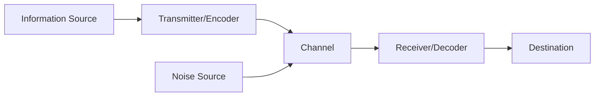

## Question 1(a) [3 marks]

**Choose the correct option: (Any Three)**

1. SMCR Model of Communication was created by __.
   **Answer**: C. David Berlo

2. _____ is NOT a part of verbal communication.
   **Answer**: B. Gesture

3. Factors that influence communication negatively are called _____ to effective communication.
   **Answer**: A. Barriers

4. The response to a sender's message is called ____.
   **Answer**: D. Feedback

## Question 1(b) [4 marks]

**Answer the following questions: (Any Four)**

1. **How can you explain the term 'communication'?**

   **Answer**:
   Communication is the process of exchanging information, ideas, and feelings between individuals through a common system of symbols, signs, or behaviors. It involves a sender transmitting a message through a channel to a receiver who provides feedback.

2. **What can you infer from the term 'encoding'?**

   **Answer**:
   Encoding is the process of converting thoughts and ideas into symbols, words, or gestures that the receiver can understand. It's how the sender transforms the message into a suitable format before transmission through the selected communication channel.

3. **How will you contrast 'verbal communication' and 'non-verbal communication'?**

   **Answer**:
   
   **Table: Verbal vs. Non-verbal Communication**

   | Verbal Communication | Non-verbal Communication |
   |---------------------|--------------------------|
   | Uses words (spoken or written) | Uses body language, gestures, expressions |
   | Can be direct and explicit | Often unconscious and implicit |
   | Limited by language barriers | Transcends language barriers |
   | Primarily conveys information | Primarily conveys emotions and attitudes |

4. **How would you summarise the term 'paralanguage'?**

   **Answer**:
   Paralanguage refers to how we say things rather than what we say. It includes voice qualities (pitch, tone, volume), vocal characterizers (laughing, crying), vocal qualifiers (intensity, rhythm), and vocal segregates (fillers like "um," "ah"). These elements add emotional context to verbal communication.

5. **If a listener does not know/understand a speaker's language, what kind of barrier will it be called?**

   **Answer**:
   This is a semantic barrier or language barrier. It occurs when the sender and receiver use different languages, specialized terminology, or jargon that prevents effective understanding of the message's intended meaning.

## Question 1(c) [7 marks]

**Answer the following questions: (Any Seven)**

1. **What must the horse find 'queer'?**

   **Answer**:
   In "Stopping by Woods on a Snowy Evening," the horse finds it strange (queer) that the speaker has stopped "without a farmhouse near" in the dark woods. The horse is confused by the unscheduled stop in an uninhabited area, especially during a snowy evening.

2. **"He gives his harness bells a shake" – Who is 'he'?**

   **Answer**:
   'He' refers to the horse in the poem. The horse shakes its harness bells as if questioning why they've stopped in the middle of nowhere, reminding the speaker of their responsibilities and journey ahead.

3. **What does Tagore suggest through the phrase "mind is without fear"?**

   **Answer**:
   Through the phrase "mind is without fear," Tagore suggests a society where people can think and express themselves freely without intimidation or oppression. He envisions citizens who aren't afraid to voice their opinions or embrace new ideas due to political, social, or religious pressure.

4. **Whom does Tagore address as 'my Father'?**

   **Answer**:
   Tagore addresses God as 'my Father' in the poem "Where the Mind is Without Fear." This spiritual invocation shows Tagore seeking divine help to achieve his vision of a free, enlightened nation where reason and truth prevail.

5. **What was the appointment made between Bob and Jimmy before twenty years?**

   **Answer**:
   Bob and Jimmy had made an appointment to meet at the same spot (outside what was Big Joe Brady's restaurant) exactly twenty years later at 10 PM, regardless of where life took them. This agreement was made over their last dinner together before parting ways.

6. **Why was Bob under arrest?**

   **Answer**:
   Bob was under arrest because he was a wanted criminal from Chicago. During their twenty years apart, while Jimmy had become a policeman, Bob had chosen a life of crime and had become a notorious criminal with a wanted status, which Jimmy had discovered during his police duty.

7. **What examples of nature can you find to justify 'The Leopard' as a nature-centric prose?**

   **Answer**:
   "The Leopard" contains numerous nature elements: the mountain stream, forktail bird, ravine ecosystem, the leopard itself, jungle sounds, seasonal changes, and descriptions of natural habitats. The author's detailed observations of flora and fauna and their interdependence create a rich nature-centric narrative.

8. **Why were the shikaris roaming in the forest?**

   **Answer**:
   The shikaris (hunters) were roaming in the forest to hunt and kill the leopard and other wild animals. This represents the human threat to wildlife that the author disapproves of, highlighting the conflict between human encroachment and wildlife preservation.

## OR

**Answer the following questions: (Any Seven)**

1. **Which season is described in 'Stopping by Woods'?**

   **Answer**:
   Winter season is described in "Stopping by Woods on a Snowy Evening." This is evident from descriptions of snowfall ("woods fill up with snow"), the "darkest evening of the year" suggesting winter solstice, and the frozen lake mentioned in the poem.

2. **Which promises does the poet talk about in 'Stopping by Woods on a Snowy Evening'?**

   **Answer**:
   The poet doesn't specify what promises he refers to in the line "And miles to go before I sleep." These likely represent social obligations, responsibilities, and commitments that demand his attention. The repeated line emphasizes both literal journey distance and figurative life commitments.

3. **What does the poet mean by "knowledge is free"?**

   **Answer**:
   By "knowledge is free," Tagore envisions a society where education and information are accessible to everyone regardless of social status, caste, gender, or economic condition. He dreams of learning without boundaries, where ideas flow freely without restrictive traditions or prejudices.

4. **What is meant by "narrow domestic walls"?**

   **Answer**:
   "Narrow domestic walls" refers to artificial divisions based on religion, caste, class, language, and region that separate people within a country. Tagore criticizes these artificial barriers that fragment society and hinder national unity and human connection.

5. **How did Bob realise that the cop was not Jimmy?**

   **Answer**:
   Bob realized the cop wasn't Jimmy when the plainclothes officer (the real policeman who arrested him) mentioned that Jimmy had sent him. Additionally, the plainclothes officer matched Jimmy's description of his friend, revealing the uniformed cop had been Jimmy in disguise who couldn't arrest his friend himself.

6. **What does the phrase 'guardian of peace' mean?**

   **Answer**:
   The phrase "guardian of peace" in "After Twenty Years" refers to Jimmy Wells' role as a police officer. It highlights his duty to uphold law and order, protect citizens, and maintain social peace and safety, which ultimately conflicts with his personal loyalty to his friend Bob.

7. **What was the author's attitude towards man in 'The Leopard'?**

   **Answer**:
   In "The Leopard," the author held a critical attitude toward humans who disturbed or harmed wildlife. He disapproved of hunters (shikaris), expressed concern about human encroachment on natural habitats, and preferred animals' company over humans'. He valued people who respected nature's balance.

8. **How was the ravine?**

   **Answer**:
   The ravine in "The Leopard" was described as a deep, secluded valley with a stream running through it. It featured dense vegetation, rocks, and served as a natural habitat for various wildlife including the leopard and forktail. The author portrayed it as a peaceful, untouched sanctuary away from human interference.

## Question 2(a) [3 marks]

**Identify the sentence pattern: (Any Three)**

1. Sumit / is / happy.
   **Answer**: Subject + Verb + Complement (SVC)

2. The monk / opened / his eyes.
   **Answer**: Subject + Verb + Object (SVO)

3. I / like / painting.
   **Answer**: Subject + Verb + Object (SVO)

4. Meena / sang / beautifully.
   **Answer**: Subject + Verb + Adverb (SVA)

## Question 2(b) [4 marks]

**Fill in the blanks by using the appropriate Modal Auxiliary: (Any Four)**

1. Shyam **has to** pay his college fees by tomorrow. (has to, could, may)

2. We **must** respect the national flag. (can, must, may)

3. I **would** prefer tea to coffee. (might, must, would)

4. **May** you live long! (Must, May, Should)

5. You **should** not waste your father's money. (may, should, might)

## Question 2(c) [7 marks]

**Do as directed: (Any Seven)**

1. Vimal is a **sincere** student. (Identify 'adjective')

2. **Manish** was ill yesterday, so **he** did not attend classes. (Identify 'pronoun')

3. These **fruits** are fresh. (Identify 'noun')

4. Asmita sings **melodiously**. (Identify 'adverb')

5. Kandarp will undergo a surgery **in** the next month. (Identify 'preposition')

6. Identify the sentence in present continuous tense – It rains. / It rained. / **It is raining**.

7. The past participle tense form of 'catch' is **caught**. (catched, caught, catch)

8. The word 'will' is placed before a verb in case of a sentence of **Simple Future** tense. (Simple Past, Simple Present, Simple Future)

## OR

## Question 2(a) [3 marks]

**Identify the sentence pattern: (Any Three)**

1. Shital / will write / a letter.
   **Answer**: Subject + Verb + Object (SVO)

2. Dr. Patel / treats / well.
   **Answer**: Subject + Verb + Adverb (SVA)

3. Richa / failed.
   **Answer**: Subject + Verb (SV)

4. Ankit / is / an engineer.
   **Answer**: Subject + Verb + Complement (SVC)

## Question 2(b) [4 marks]

**Fill in the blanks by using the appropriate Modal Auxiliary: (Any Four)**

1. Alpesh **should** exercise regularly to maintain his health and fitness. (could, would, should)

2. The sky is dark. It **may** rain. (should, may, must)

3. Priya told me that she **would** not attend the party. (would, may, should)

4. If you try, you **can** learn English. (can, may, should)

5. I am getting late, so I **need to** go. (can, need to, could)

## Question 2(c) [7 marks]

**Do as directed: (Any Seven)**

1. Ravina **lost** her purse. (Identify 'verb')

2. **Alas!** That great man is no more! (Identify 'interjection')

3. The **brave** soldiers are protecting our country. (Identify 'adjective')

4. You guided the team **nicely**. (Identify 'adverb')

5. The bus will arrive **at** 6 pm. (Identify 'preposition')

6. Identify the sentence in simple past tense. – The students will learn. / The students are learning. / **The students learned**.

7. The past tense form of 'eat' is **ate**. (eats, ate, eaten)

8. The past tense form of 'go' is **went**. (goed, went, gone)

## Question 3(a) [3 marks]

**Fill in the blanks by using a proper verb that agrees to the subject: (Any Three)**

1. Both Kiran and Kaushal **are** good students. (is, are)

2. Your brother **has** done a great job. (have, has)

3. Every man **wishes** to be happy. (wish, wishes)

4. The Collector, along with the Additional Collector, **is** going to visit our Exhibition. (is, are)

## Question 3(b) [4 marks]

**Fill in the blanks by using the appropriate form of the verb given in the bracket: (Any Four)**

1. Kartik **bought** a new mobile on his last birthday. (buys, bought, will buy)

2. The train **is leaving** the platform now. (leaves, is leaving, was leaving)

3. Sumit **has been waiting** for Pritesh since 4 pm. (will wait, has been waiting, is waiting)

4. I **have received** so many certificates during my college life. (have been received, have received, receive)

5. Riya **has** already **decided** to sell her car. (is …. decided, has …. decided, will …. decided)

## Question 3(c) [7 marks]

**Do as directed: (Any Seven)**

1. policy/honesty/best/is/the (Form a correct sentence)
   
   **Answer**: Honesty is the best policy.

2. You have just posted a photo. It is very nice. (Connect the two sentences with a suitable connector - 'which'/ 'why' / 'who')
   
   **Answer**: You have just posted a photo which is very nice.

3. I like all Apple gadgets, but I feel that **they** are a bit overpriced. (Use a suitable 'pronoun')

4. When I was young, I **could** run very fast. (Use a suitable Modal Auxiliary indicating past ability)

5. Why **were** you absent yesterday? (Use a suitable verb that agrees to the subject)

6. We **will visit** the Taj Mahal in the next Diwali vacation. (Use a proper verb form of 'visit')

7. Aakash **has** already **submitted** his notebook to the teacher. (Use a proper verb form of 'submit')

8. The villain killed the hero. (Rewrite the sentence using Simple Future Tense)
   
   **Answer**: The villain will kill the hero.

## OR

## Question 3(a) [3 marks]

**Fill in the blanks by using a proper verb that agrees to the subject: (Any Three)**

1. Mukesh Ambani **lives** in Mumbai. (live, lives)

2. Either Sima or her parents **are** going to attend the party. (is, are)

3. Five hundred rupees **is** a very small amount these days. (is, are)

4. Neither he nor she **is** right. (is, are)

## Question 3(b) [4 marks]

**Fill in the blanks by using the appropriate form of the verb given in the bracket: (Any Four)**

1. The moon **revolves** around the earth. (is revolve, revolves, had revolved)

2. Hey, someone **is calling** you. (will call, is calling, had called)

3. Rasik **was decorating** his house when I called him yesterday. (decorated, was decorating, will decorate)

4. The Chief Minister **will visit** Surat tomorrow. (had visited, will visit, has visited)

5. The thieves **had escaped** before the police arrived. (escaped, were escaping, had escaped)

## Question 3(c) [7 marks]

**Do as directed: (Any Seven)**

1. you/Parth/Does/know/? (Form a correct sentence.)
   
   **Answer**: Does Parth know you?

2. She went to watch a movie. She was not prepared for her exam. (Use 'although')
   
   **Answer**: Although she was not prepared for her exam, she went to watch a movie.

3. Before jumping **into** a pond, you should test the depth of the area. (Use a suitable 'preposition')

4. **Can** you speak German? (Use Modal Auxiliary indicating ability)

5. A group of students **is** making a noise rightnow. (Use a suitable verb that agrees to the subject)

6. Keep silence. The baby **is sleeping**. (Use a proper verb form of 'sleep')

7. Mehul **visits** his grandparents every year. (Use a proper verb form of 'visit')

8. The dogs bark. (Rewrite the statement using Past Continuous Tense.)
   
   **Answer**: The dogs were barking.

## Question 4(a) [3 marks]

**Write a short note: (Any One)**

### 1. Shannon-Weaver model of communication

**Answer**:
The Shannon-Weaver model explains how information transfers from sender to receiver.

**Diagram:**



- **Information Source**: Creates and decides what message to send
- **Encoder/Transmitter**: Converts message into signals or code
- **Channel**: Medium through which message travels
- **Decoder/Receiver**: Converts signals back into understandable message
- **Destination**: Person receiving and interpreting the message
- **Noise**: Interference that disrupts clear transmission

Originally designed for technical communication, this model applies to all forms of human interaction, showing communication as a linear process subject to external interference.

**Mnemonic:** "Source Encodes, Channel Carries, Destination Decodes"

### 2. Facial expressions and Eye contact

**Answer**:
Facial expressions and eye contact are powerful forms of non-verbal communication that often convey emotions more authentically than words.

**Table: Key Aspects of Facial Expressions and Eye Contact**

| Aspect | Function | Cultural Considerations |
|--------|----------|-------------------------|
| Facial Expressions | Convey emotions (happiness, sadness, anger, surprise) | Some expressions universal, others culture-specific |
| Eye Contact | Shows attention, confidence, interest | Duration and intensity vary by culture |
| Micro-expressions | Brief, involuntary expressions revealing true feelings | Often last less than 1/25 of a second |
| Eye Movement | Direction of gaze indicates thinking patterns | Left/right movements connect to brain activity |

These non-verbal cues provide critical context to verbal messages, often revealing true feelings when words might be deceptive. Research shows facial expressions constitute about 55% of the emotional impact in face-to-face communication.

**Mnemonic:** "Face Shows What Words Can't Tell"

## Question 4(b) [4 marks]

**Choose the correct option: (Any Four)**

1. The ___ visited the stream regularly.
   **Answer**: C. forktail

2. Bob and Jimmy were raised in _____ just like two brothers, together.
   **Answer**: B. New York

3. The poet described the woods as _______.
   **Answer**: A. 'lovely, dark and deep'

4. Reason is compared to a clear ____ by Tagore.
   **Answer**: A. stream

5. According to Tagore, human should work towards __
   **Answer**: B. perfection

## Question 4(c) [7 marks]

**Write short notes: (Any Two)**

### 1. The poet's dilemma and decision in 'Stopping by Woods on a Snowy Evening'

**Answer**:
In Robert Frost's poem, the speaker faces a momentary conflict between pausing to appreciate natural beauty and fulfilling responsibilities.

**Table: The Poet's Dilemma**

| Dilemma Aspect | Represented By | Resolution |
|----------------|----------------|------------|
| Attraction to Beauty | "Lovely, dark and deep" woods | Temporary enjoyment |
| Practical Reality | Horse's impatience, shaking bells | Acknowledgment |
| Social Obligations | "Promises to keep" | Takes precedence |
| Inner Conflict | Repeated "miles to go before I sleep" | Decision to continue journey |

The poet is drawn to the tranquil beauty of the snow-filled woods but recognizes that life's responsibilities cannot be ignored indefinitely. This represents the universal human dilemma between appreciating life's moments of beauty and fulfilling obligations.

The decision to move on, indicated by "miles to go before I sleep," shows the poet choosing duty over momentary pleasure, though the repetition of this line suggests a lingering reluctance.

**Mnemonic:** "Beauty Beckons, Duty Calls, Journey Continues"

### 2. The concept of 'heaven' as expressed

**Answer**:
In "Where the Mind is Without Fear," Tagore envisions his ideal "heaven of freedom" not as an afterlife destination but as a transformed nation.

**Table: Attributes of Tagore's "Heaven of Freedom"**

| Characteristic | Line from Poem | Meaning |
|----------------|----------------|---------|
| Fearless Thinking | "Where the mind is without fear" | Intellectual freedom |
| Dignity | "Head is held high" | Self-respect, pride |
| Knowledge Access | "Knowledge is free" | Education for all, regardless of status |
| No Divisions | "Not broken up by narrow domestic walls" | Unity beyond caste, religion, region |
| Truth-Seeking | "Words come out from the depth of truth" | Honesty, integrity in expression |
| Rational Thought | "Clear stream of reason" | Logic over superstition |
| Purposeful Action | "Tireless striving stretches its arms" | Progressive action, hard work |
| Perfection-Seeking | "Into that heaven of freedom" | Continuous self-improvement |

Tagore's concept represents a socio-political ideal where citizens live with dignity and purpose, guided by reason rather than fear or prejudice. This "heaven" is attainable on earth through collective enlightenment and societal reform.

**Mnemonic:** "Freedom, Unity, Reason, Truth, Perfection"

### 3. The key message of 'The Leopard'

**Answer**:
Ruskin Bond's "The Leopard" conveys powerful messages about human-nature relationships and coexistence.

**Table: Key Messages in "The Leopard"**

| Message | Evidence in Story | Significance |
|---------|-------------------|-------------|
| Mutual Respect | Leopard and author's peaceful encounters | Coexistence is possible |
| Environmental Conservation | Author's criticism of hunters | Protection of wildlife |
| Patience & Observation | Author's quiet study of animals | Understanding nature requires time |
| Human Impact | Shikaris threatening wildlife | Human activity endangers nature |
| Nature's Beauty | Detailed descriptions of ravine ecosystem | Appreciating wilderness |

The story advocates for a deeper connection with nature through careful observation rather than domination or exploitation. It suggests that wild animals deserve respect and protection, not fear or hunting.

The leopard symbolizes both the majesty and vulnerability of nature, while the author represents the potential for humans to appreciate wildlife without harming it. This message of conservation and coexistence remains relevant today amid environmental challenges.

**Mnemonic:** "Respect Nature, Protect Wildlife, Observe Patiently"

## OR

## Question 4(a) [3 marks]

**Write a short note: (Any One)**

### 1. Need and Application of communication skills

**Answer**:
Communication skills are essential abilities needed to effectively exchange information and connect with others.

**Table: Need and Applications of Communication Skills**

| Context | Need | Applications |
|---------|------|-------------|
| Professional | Career advancement, leadership | Presentations, negotiations, teamwork |
| Personal | Building relationships | Conflict resolution, emotional support |
| Academic | Knowledge transfer | Discussions, presentations, research |
| Digital | Remote collaboration | Emails, video calls, social media |

- **Workplace Applications**: Clear communication prevents errors, enhances productivity, improves client relationships, and facilitates effective leadership.
- **Educational Settings**: Students with strong communication skills perform better in discussions, group work, and presentations.
- **Personal Life**: Effective communication prevents misunderstandings, strengthens relationships, and helps navigate conflicts.
- **Global Context**: Cross-cultural communication skills are increasingly vital in our interconnected world.

Developing these skills involves active listening, clarity in expression, non-verbal awareness, adaptability to different contexts, and emotional intelligence.

**Mnemonic:** "Connect, Express, Adapt, Lead"

### 2. Barriers to communication

**Answer**:
Communication barriers are obstacles that prevent messages from being properly understood, creating gaps between sender and receiver.

**Table: Major Types of Communication Barriers**

| Barrier Type | Examples | Solutions |
|--------------|----------|-----------|
| Physical | Noise, distance, technical failures | Improve environment, use appropriate channels |
| Psychological | Bias, preconceptions, emotions | Active listening, empathy, self-awareness |
| Semantic | Jargon, language differences | Simplify language, confirm understanding |
| Organizational | Hierarchy, complex structures | Clear communication channels, feedback systems |
| Cultural | Different values, customs | Cultural sensitivity, adaptation |

- **Physical Barriers**: Environmental factors that interfere with transmission (background noise, poor connectivity)
- **Psychological Barriers**: Mental factors affecting reception (stress, biases, different perceptions)
- **Semantic Barriers**: Problems with meaning (ambiguous words, technical terminology)
- **Organizational Barriers**: Workplace issues (unclear roles, information overload)
- **Cultural Barriers**: Different norms and expectations (gestures, etiquette, values)

Overcoming these barriers requires awareness, adaptability, feedback mechanisms, and continuous improvement of communication practices.

**Mnemonic:** "PPSOC: Physical, Psychological, Semantic, Organizational, Cultural"

## Question 4(b) [4 marks]

**Choose the correct option: (Any Four)**

1. The author clapped his hands when he saw the leopard for the first time, because _____.
   **Answer**: D. he wanted to give some courage to himself

2. Bob and Jimmy had their last dinner together at a restaurant named __.
   **Answer**: D. Big Joe Brady's

3. The owner of woods lives in the _____.
   **Answer**: C. village

4. The woods are covered with ___.
   **Answer**: A. snow

5. The poem 'Where the Mind is Without Fear' ends with the line: "…let my country ___".
   **Answer**: B. awake

## Question 4(c) [7 marks]

**Write short notes: (Any Two)**

### 1. The author's pain and concern in 'The Leopard'

**Answer**:
In "The Leopard," Ruskin Bond expresses deep emotional distress and environmental concern regarding human impacts on wildlife.

**Table: Author's Pain and Concern**

| Aspect | Manifestation | Significance |
|--------|---------------|-------------|
| Hunter Threat | Author's anxiety about shikaris | Direct threat to leopard's survival |
| Habitat Destruction | Descriptions of changing landscape | Loss of natural ecosystem |
| Human Encroachment | Increased human presence near ravine | Disruption of animal habitats |
| Endangered Wildlife | Special focus on the leopard's vulnerability | Symbol of threatened nature |
| Environmental Ethics | Criticism of hunting practices | Moral questioning of human actions |

The author's pain stems from witnessing the gradual destruction of a natural paradise and the threat to creatures he has come to respect. His particular concern for the leopard represents broader anxiety about humanity's relationship with nature.

The emotional tone shifts from appreciation of beauty to fear for its survival, creating a powerful environmental message. This concern resonates today amid accelerating habitat loss and species extinction.

**Mnemonic:** "Witness, Worry, Warn about Wildlife Threats"

### 2. Friendship Vs. Duty in 'After Twenty Years'

**Answer**:
O. Henry's "After Twenty Years" presents a powerful moral conflict between personal loyalty and professional obligation.

**Table: Friendship vs. Duty Conflict**

| Aspect | Friendship Side | Duty Side |
|--------|----------------|-----------|
| Bob's Perspective | Traveled miles to keep twenty-year promise | Unaware of moral dilemma |
| Jimmy's Perspective | Values old friendship, can't face arrest | Policeman obligated to uphold law |
| Resolution | Note explains situation, personal touch | Another officer makes the arrest |
| Symbolic Meaning | Past bonds, personal loyalty | Present responsibilities, social order |
| Narrative Impact | Creates story's emotional depth | Drives the ironic twist |

The story presents no easy resolution to this ethical dilemma. Jimmy finds a compromise by arranging for another officer to make the arrest while explaining his actions in a note, showing respect for both friendship and duty.

O. Henry uses this conflict to explore how life choices can transform relationships and create impossible situations where personal and professional values collide. The story resonates because this tension between individual connections and societal responsibilities is universally experienced.

**Mnemonic:** "Promises from Past, Present Principles Prevail"

### 3. The central idea of 'Stopping by Woods on a Snowy Evening'

**Answer**:
Robert Frost's poem explores the tension between momentary appreciation of beauty and ongoing life responsibilities.

**Table: Central Ideas in the Poem**

| Theme | Evidence | Deeper Meaning |
|-------|----------|----------------|
| Natural Beauty | "Woods fill up with snow," "lovely, dark and deep" | Attraction to tranquility and wilderness |
| Responsibilities | "Promises to keep," "miles to go" | Life's ongoing obligations |
| Momentary Pause | Stopping between "woods and frozen lake" | Brief respite from life's journey |
| Inner Conflict | Horse's questioning bell shake | Tension between desire and duty |
| Life Journey | Repeated "miles to go before I sleep" | Continuing path through life toward death |

The central idea revolves around life's brief moments of contemplation amid constant movement toward obligations. The speaker pauses to appreciate beauty but acknowledges the impossibility of remaining in that moment indefinitely.

The repetition of "miles to go before I sleep" carries dual meaning - both the literal journey ahead and the figurative "sleep" of death, suggesting the continuation of life's responsibilities until the end. This creates a meditation on mortality, duty, and the fleeting nature of experience.

**Mnemonic:** "Pause, Ponder, Proceed with Purpose"

## Question 5(a) [3 marks]

**Choose the correct option: (Any Three)**

1. If a person wants to know about various products and schemes offered by a merchant/company, he/she needs to write a/an _____.
   **Answer**: B. Inquiry email

2. _____ indicates other persons receiving the same mail with visible IDs.
   **Answer**: A. CC

3. Catalogue is attached with _____.
   **Answer**: C. Reply to inquiry email

4. In which part of a formal letter/email are the key point written? ___
   **Answer**: B. Body

## Question 5(b) [4 marks]

**Do as directed: (Any One)**

### 1. How would you explain the terms 'courtesy' and 'completeness' a letter/email?

**Answer**:
Courtesy and completeness are two essential principles of effective business communication.

**Table: Courtesy and Completeness in Business Communication**

| Principle | Definition | Implementation |
|-----------|------------|----------------|
| Courtesy | Respectful and considerate tone | Polite language, thoughtful phrasing |
| Completeness | Including all necessary information | Answering all questions, providing context |

**Courtesy** involves treating the recipient with respect and consideration. It manifests through:

- Using polite language ("please," "thank you," "kindly")
- Addressing the recipient appropriately
- Avoiding demanding or accusatory tone
- Showing appreciation for the recipient's time or assistance
- Maintaining a positive attitude even in negative situations

**Completeness** ensures that the communication contains all necessary information. It requires:

- Answering all questions or addressing all points raised
- Including all relevant details (who, what, when, where, why, how)
- Providing necessary background information
- Anticipating potential questions and addressing them proactively
- Including appropriate supporting documents or references

Both principles work together to create effective communication that builds positive relationships while ensuring practical needs are met.

**Mnemonic:** "Respect Fully, Inform Fully"

### 2. Draft an application to your HOD requesting him to grant your medical leave for two weeks.

**Answer**:

```
[Your Name]
[Your Class]
[Your Roll Number]
[Your College Name]
[Date]

The Head of Department
Department of [Your Department]
[College Name]
[City]

Subject: Application for Two Weeks Medical Leave

Respected Sir/Madam,

I am writing to request two weeks of medical leave from [start date] to [end date] due to [brief mention of medical condition]. I have been advised complete rest and medication by Dr. [Doctor's Name] from [Hospital/Clinic Name].

I have attached the medical certificate and prescription for your reference. During my absence, I have arranged with my classmates [Friend's Name] to share notes and assignments with me. I assure you that I will complete all pending work promptly upon my return.

I kindly request you to grant me medical leave for the mentioned period and consider this application favorably.

Thank you for your understanding and support.

Yours sincerely,

[Your Signature]
[Your Name]
[Your Roll Number]

Enclosures:
1. Medical Certificate
2. Doctor's Prescription
```

## Question 5(c) [7 marks]

**Draft a letter: (Any One)**

### 1. You are the Purchase Manager at Ashok Industries, Sanand. Draft a letter to SP Industries, Mumbai, placing an order for 10 pieces of 9 feet lathe machines, asking for the discount also.

**Answer**:

```
ASHOK INDUSTRIES
Industrial Area, Phase II
Sanand - 382110, Gujarat
Tel: 02717-XXXXXX | Email: purchase@ashokind.com

January 2, 2025

The Sales Manager
SP Industries
MIDC Industrial Area
Andheri East, Mumbai - 400093

Subject: Order for 10 Pieces of 9 Feet Lathe Machines

Dear Sir/Madam,

Reference: Your Quotation No. SPI/LM/2024-523 dated December 15, 2024

We are pleased to place an order for the following equipment for our production facility at Sanand:

Item: 9 Feet Precision Lathe Machines
Model: LM-900X
Quantity: 10 pieces
Unit Price: As per your quotation (₹X,XX,XXX per unit)
Specifications:
- Motor Power: 7.5 HP
- Spindle Speed: 50-2000 RPM
- Digital Control Panel
- Hardened Bed with Steady Rest

As we are placing a bulk order, we request you to extend a special discount of 15% on the quoted price. Being a regular customer of your company, we hope you will consider our request favorably.

Payment Terms:
- 30% advance payment with purchase order
- 70% balance upon delivery and successful installation

Delivery Requirements:
- Delivery Date: Within 30 days from the date of order confirmation
- Delivery Address: Ashok Industries, Industrial Area, Phase II, Sanand - 382110, Gujarat
- Mode of Transport: By Road Transport

Please confirm receipt of this order and send us the proforma invoice including the agreed discount at your earliest convenience.

We look forward to your prompt response and timely delivery.

Yours sincerely,

[Signature]
Purchase Manager
Ashok Industries

Enclosure: Copy of Quotation No. SPI/LM/2024-523
```

### 2. Vipul Enterprise, Vapi has received a complaint from Riya Plastics, Rajkot regarding delay in delivery of water tanks. On behalf of Vipul Enterprise, draft a letter of Adjustment.

**Answer**:

```
VIPUL ENTERPRISE
Plot No. 45, GIDC
Vapi - 396195, Gujarat
Tel: 0260-XXXXXX | Email: customercare@vipulenterprise.com

January 2, 2025

The Manager
Riya Plastics
Industrial Area, Phase III
Rajkot - 360003, Gujarat

Subject: Response to Your Complaint Regarding Delayed Delivery of Water Tanks

Reference: Your Complaint Letter No. RP/VE/2024/42 dated December 25, 2024

Dear Sir/Madam,

We sincerely apologize for the delay in delivering your order of 25 water tanks (Order No. VE/WT/24/387) which was scheduled for delivery on December 20, 2024.

After investigating the matter, we found that the delay was caused by an unexpected breakdown of our production equipment, followed by transportation challenges due to the recent highway repairs between Vapi and Rajkot. We understand that this delay has affected your business operations, and we take full responsibility for this inconvenience.

As a gesture of goodwill and to compensate for the inconvenience caused, we are pleased to offer the following adjustments:

1. The remaining water tanks will be delivered to your facility by January 5, 2025, with our premium expedited shipping at no extra cost.

2. We are offering a 10% discount on your current order, which will be adjusted in the final invoice.

3. For your next three orders, we will provide a special 5% loyalty discount.

4. Our technical team will provide a complimentary inspection and maintenance service for all tanks delivered.

We value your business and the trust you have placed in Vipul Enterprise. We have implemented additional quality control measures and improved our logistics planning to ensure such delays do not occur in the future.

Please feel free to contact me directly at 98XXXXXXXX if you have any questions or require further assistance.

We appreciate your understanding and look forward to continuing our business relationship.

Yours sincerely,

[Signature]
Customer Relations Manager
Vipul Enterprise

CC: Logistics Department
```

## OR

## Question 5(a) [3 marks]

**Choose the correct option: (Any Three)**

1. To add/include an important point at the end in the email/letter, _____ is used.
   **Answer**: A. Post Script

2. When can a buyer write a complaint email? _____.
   **Answer**: D. All of these

3. Give full form of C.W.O. _____.
   **Answer**: A. Cash with order

4. Which of the following is an advantage of an e-mail?
   **Answer**: D. All of these

## Question 5(b) [4 marks]

**Do as directed: (Any One)**

### 1. Summarise the terms 'Inside address' and 'Complimentary Close'.

**Answer**:
Inside address and complimentary close are essential components of business letter formatting that serve specific functions.

**Table: Inside Address and Complimentary Close**

| Component | Position | Purpose | Examples |
|-----------|----------|---------|----------|
| Inside Address | Left-aligned, after sender's address & date | Identifies recipient | The Manager, ABC Company, City |
| Complimentary Close | Before signature, aligned with date | Formal ending | Yours sincerely, Yours faithfully |

**Inside Address** appears after the sender's address and date in a business letter. It includes:

- Recipient's name and title (if known)
- Company/organization name
- Complete postal address
- Positioned at the left margin

It serves to identify who will receive the letter and provides necessary information for mailing. The format should match the envelope address exactly.

**Complimentary Close** is the formal ending of a letter that appears before the sender's signature. Common forms include:

- "Yours sincerely" (when recipient's name is known)
- "Yours faithfully" (when addressing by title: "Dear Sir/Madam")
- "Yours truly" (alternative formal closing)

It maintains professional tone and follows standard business etiquette. Only the first word is capitalized, and it always ends with a comma.

**Mnemonic:** "Address Who Receives, Close Before You Sign"

### 2. Draft an email to the Manager of GrowRich Bank, A.G. Road Branch, Delhi to complain about the disrespectful behavior of a staff at the bank.

**Answer**:

```
From: [Your Email]
To: manager@growrichbank-agroad.com
Subject: Complaint Regarding Staff Behavior at A.G. Road Branch

Dear Manager,

Account Number: [Your Account Number]
Visit Date: January 1, 2025
Time: Approximately 11:30 AM

I am writing to express my disappointment regarding the unprofessional behavior I experienced during my recent visit to your A.G. Road Branch on January 1, 2025.

I visited the branch to update my KYC details and inquire about a home loan. While waiting for my turn at counter number 4, the staff member (with name tag "Mr. [Name]") addressed me in a dismissive tone when I asked about the documentation requirements. When I requested clarification on certain forms, he made several condescending remarks in front of other customers, stating that "everyone knows this basic information" and visibly displaying impatience.

This treatment was not only embarrassing but also contradicts the customer service standards I have come to expect from GrowRich Bank over my eight years as a loyal customer.

I request that this matter be investigated and appropriate action be taken to ensure such incidents do not recur. I would appreciate receiving:
1. An acknowledgment of this complaint
2. Information about the steps taken to address this issue
3. Assurance that bank staff receive proper training in customer interaction

I hope this matter receives your prompt attention. I can be reached at [Your Phone Number] should you need any additional information.

Thank you for your consideration.

Sincerely,

[Your Full Name]
Account Holder
Contact: [Your Phone Number]
```

## Question 5(c) [7 marks]

**Draft an email: (Any One)**

### 1. An email of complaint on behalf of Suraj Sharma, who ordered a new laptop before ten days, but has yet not received it from the AtoZ Electronics.

**Answer**:

```
From: suraj.sharma@email.com
To: customerservice@atozelectronics.com
Cc: manager@atozelectronics.com
Subject: Complaint: Non-delivery of Laptop - Order #AZ45678

Dear Customer Service Team,

Order Reference: #AZ45678
Order Date: December 23, 2024
Expected Delivery Date: December 30, 2024
Product: Dell XPS 15 Laptop (16GB RAM, 512GB SSD)
Payment Method: Credit Card (Paid in full: ₹87,500)

I am writing to express my concern regarding the non-delivery of my laptop ordered from your online store ten days ago.

As per your confirmation email dated December 23, 2024, the laptop was supposed to be delivered within 7 working days, which should have been by December 30, 2024. Despite the payment being processed immediately, I have not received the product, nor has there been any communication from your end regarding the delay.

This situation has caused significant inconvenience as I urgently need this laptop for my professional work. I have made several attempts to contact your customer service at 1800-XXX-XXXX, but have been unable to receive any satisfactory response or concrete information about my order status.

I request immediate attention to this matter with the following actions:
1. Expedite the delivery of my laptop within the next 48 hours
2. Provide tracking information via email and SMS
3. Offer a reasonable compensation for the delay and inconvenience caused

If I do not receive the laptop or a satisfactory response by January 5, 2025, I will be compelled to escalate this matter to the consumer forum and seek a full refund.

I look forward to your prompt resolution of this issue.

Sincerely,

Suraj Sharma
Customer ID: SS78945
Mobile: 98XXXXXXXX
Address: 45, Green Park Colony, Sector 18, Gurugram - 122001
```

### 2. An email of inquiry regarding smartboards on behalf of Excellent Coaching Classes to Best Technologies.

**Answer**:

```
From: director@excellentcoaching.edu
To: sales@besttechnologies.com
Subject: Inquiry: Interactive Smartboards for Educational Institution

Dear Sales Team,

I am writing on behalf of Excellent Coaching Classes, a premier coaching institute with five branches across Gujarat specializing in engineering and medical entrance exam preparation. We are looking to upgrade our classrooms with state-of-the-art interactive smartboards to enhance our teaching methodology and student engagement.

We would appreciate if you could provide us with the following information regarding your smartboard products:

1. Available models and their technical specifications:
   - Screen sizes and resolution options
   - Touch technology (infrared, capacitive, etc.)
   - Connectivity options (HDMI, USB, wireless)
   - Software compatibility and features

2. Educational features and capabilities:
   - Pre-loaded educational software and applications
   - Content creation and sharing capabilities
   - Recording and playback functions
   - Multi-user collaboration features

3. Commercial details:
   - Pricing for different models
   - Bulk purchase discounts (we require approximately 20 boards)
   - Warranty period and terms
   - Installation services and charges
   - Annual maintenance contract options

4. Training and support:
   - Training for teaching staff
   - Technical support availability
   - Troubleshooting and maintenance procedures

Additionally, we would like to know if you offer a demonstration of your products at our main facility in Ahmedabad. If possible, we would like to schedule a demo during the coming week.

Please include your product catalog and any relevant brochures with your response. We look forward to your detailed reply at your earliest convenience.

Thank you for your assistance.

Best regards,

Dr. Rajesh Patel
Director
Excellent Coaching Classes
Address: 56, Education Hub, Navrangpura, Ahmedabad - 380009
Tel: 079-XXXXXXXX
Mobile: 98XXXXXXXX
Website: www.excellentcoaching.edu
```

## Summary of Key Concepts

| Topic | Important Points | Learning Tips |
|-------|------------------|---------------|
| Communication Models | SMCR model focuses on Sender, Message, Channel, Receiver | Think S-M-C-R as a sequence |
| Verbal vs. Non-verbal | Words vs. gestures, expressions, tone; complement each other | Notice how tone affects meaning |
| Communication Barriers | Physical, psychological, semantic, organizational, cultural | Remember PPSOC acronym |
| Sentence Patterns | SV, SVO, SVC, SVA - basic English structures | Identify subject and verb first |
| Modal Auxiliaries | Express ability, permission, obligation, possibility | Connect to function (can = ability) |
| Subject-Verb Agreement | Singular subjects take singular verbs | Check subject before choosing verb |
| Parts of Speech | Nouns, verbs, adjectives, adverbs, prepositions, etc. | Watch word function in sentence |
| Tenses | Present, past, future in simple, continuous, perfect forms | Focus on time and aspect |
| Business Letters | Formal structure with sender/receiver details, subject, body | Follow standard format templates |
| Emails | Concise, clear messages with appropriate subject lines | Use proper digital etiquette |
| Literature Analysis | Themes in poems and stories connect to human experiences | Look for author's message and symbolism |

**Study Tips for Weak Students:**

1. **For grammar questions**:
   - Learn one sentence pattern per day
   - Practice identifying parts of speech in simple sentences
   - Make flashcards for modal auxiliaries and their functions

2. **For communication concepts**:
   - Draw simple diagrams of communication models
   - List examples of barriers you've experienced personally
   - Create a chart comparing verbal and non-verbal communication

3. **For literature**:
   - Read summaries first to understand the basic story
   - Focus on main characters and their motivations
   - Identify 1-2 key themes in each piece

4. **For business communication**:
   - Memorize letter and email templates
   - Practice writing at least one email/letter each week
   - Study standard phrases used in formal communication

Remember: Regular practice is more effective than cramming before exams!
