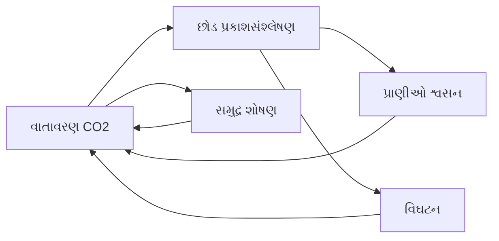
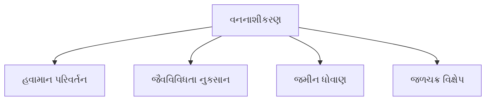
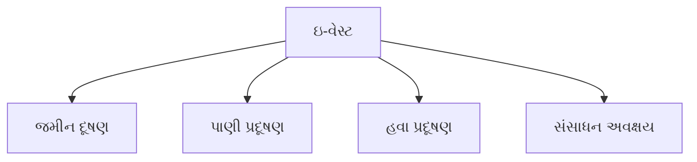
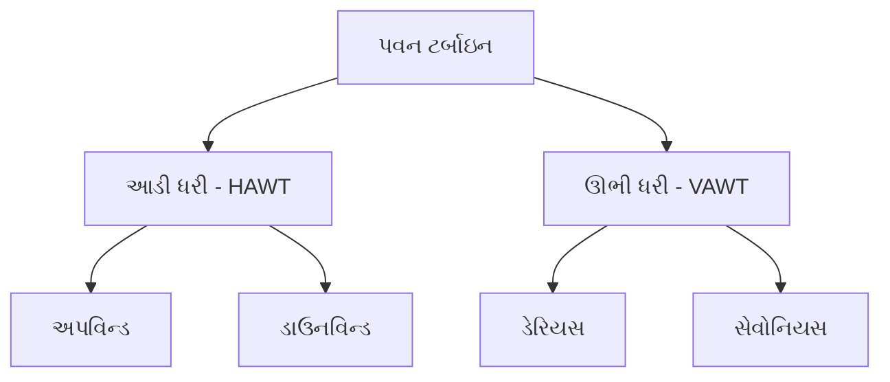
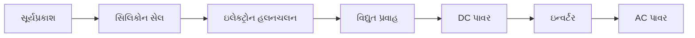
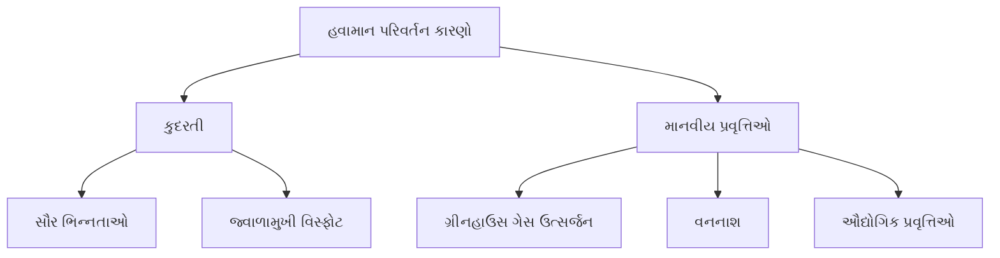
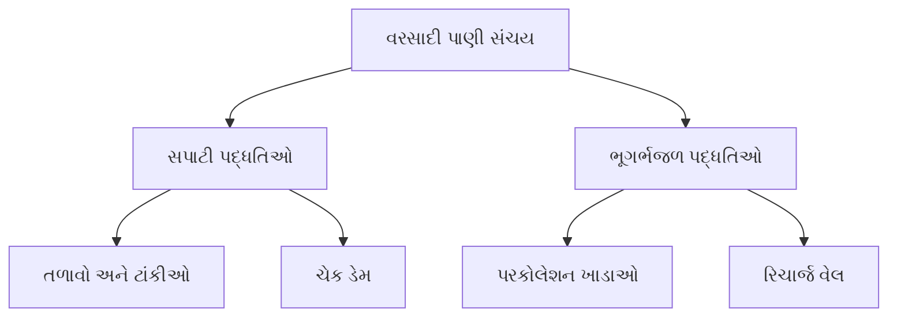
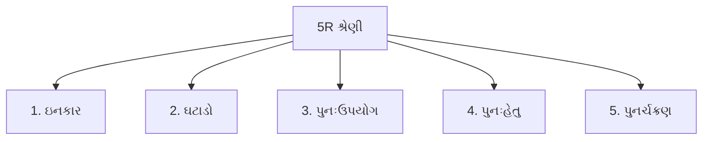

## પ્રશ્ન 1(a) [3 ગુણ]

**ટૂંકનોધ લખો: પારિસ્થિતિક પિરામિડ.**

**જવાબ**:

**કોષ્ટક: પારિસ્થિતિક પિરામિડના પ્રકારો**

| પ્રકાર | વર્ણન | ઉદાહરણ |
|------|-------------|---------|
| **સંખ્યાનો પિરામિડ** | દરેક સ્તરે જીવોની સંખ્યા દર્શાવે છે | વૃક્ષો → જંતુઓ → પક્ષીઓ |
| **બાયોમાસ પિરામિડ** | જીવોનું કુલ દળ દર્શાવે છે | ઉત્પાદક સ્તરે વધુ |
| **ઊર્જા પિરામિડ** | સ્તરોમાં ઊર્જાનો પ્રવાહ દર્શાવે છે | હંમેશા સીધો |

- **ઊર્જા સ્થાનાંતરણ**: માત્ર 10% ઊર્જા આગલા સ્તરમાં જાય છે
- **પોષક સ્તરો**: ઉત્પાદકો, પ્રાથમિક ઉપભોક્તાઓ, ગૌણ ઉપભોક્તાઓ
- **હંમેશા સીધો**: ઊર્જા પિરામિડ ક્યારેય ઊંધો નથી થતો

**મેમરી ટ્રીક:** "સંખ્યા-બાયોમાસ-ઊર્જા ઉપર વહે છે"

## પ્રશ્ન 1(b) [4 ગુણ]

**વૈશ્વિક પારિસ્થિતિકીય ઊછાળ વિશે ટૂંકનોધ લખો.**

**જવાબ**:

વૈશ્વિક પારિસ્થિતિકીય ઊછાળ એ ત્યારે થાય છે જ્યારે માનવતાની માંગ પૃથ્વીની પુનઃઉત્પાદન ક્ષમતા કરતાં વધી જાય છે.

**મુખ્ય ઘટકો:**

| પરિબળ | વર્ણન |
|--------|-------------|
| **પૃથ્વી ઓવરશૂટ દિવસ** | જે દિવસે વાર્ષિક સંસાધન વપરાશ પુનઃઉત્પાદન કરતાં વધે છે |
| **પારિસ્થિતિક પદચિહ્ન** | કુદરતી સંસાધનો પર માનવીય માંગ |
| **બાયોકેપેસિટી** | સંસાધનો પુનઃઉત્પન્ન કરવાની પૃથ્વીની ક્ષમતા |

- **હાલની સ્થિતિ**: વાર્ષિક 1.7 પૃથ્વી જેટલા સંસાધનોનો ઉપયોગ
- **પરિણામો**: હવામાન પરિવર્તન, જૈવવિવિધતા નુકસાન, સંસાધન અવક્ષય
- **ઉકેલો**: ટકાઉ વપરાશ, નવીકરણીય ઊર્જા અપનાવવી

**મેમરી ટ્રીક:** "માંગ પુરવઠા કરતાં વધારે = ઊછાળ"

## પ્રશ્ન 1(c) [7 ગુણ]

**જૈવ-ભૂરાસાયણિક ચક્ર કોને કહે છે? કોઇ પણ બે ચક્ર વિશે વિગત માટે જણાવો.**

**જવાબ**:

જૈવ-ભૂરાસાયણિક ચક્રો એ કુદરતી પ્રક્રિયાઓ છે જે જૈવિક અને અજૈવિક ઘટકો દ્વારા આવશ્યક તત્વોને પુનર્ચક્રિત કરે છે.

**કાર્બન ચક્ર:**



**નાઇટ્રોજન ચક્ર:**

| તબક્કો | પ્રક્રિયા | જીવતંત્ર |
|-------|---------|-----------|
| **નાઇટ્રોજન સ્થિરીકરણ** | N2 → NH3 | રાયઝોબિયમ બેક્ટેરિયા |
| **નાઇટ્રિફિકેશન** | NH3 → NO3 | નાઇટ્રોસોમોનાસ, નાઇટ્રોબેક્ટર |
| **ડિનાઇટ્રિફિકેશન** | NO3 → N2 | ડિનાઇટ્રિફાઇંગ બેક્ટેરિયા |

- **મહત્વ**: પ્રોટીન સંશ્લેષણ અને DNA રચના માટે આવશ્યક
- **માનવીય અસર**: ખાતરો કુદરતી સંતુલન વિખેરે છે
- **સંરક્ષણ**: રાસાયણિક ખાતરનો ઉપયોગ ઘટાડવો

**મેમરી ટ્રીક:** "બેક્ટેરિયા નાઇટ્રોજન ઠીક કરે છે, છોડ વાપરે છે"

## પ્રશ્ન 1(c) OR [7 ગુણ]

**જંગલના નિસર્ગતંત્ર વિશે વિગત માટે જણાવો. વનનાશીકરણની અસરકારક પરિબળો અને જંગલના નિસર્ગતંત્રનું સંરક્ષણ માટેના પરિબળો સમજાવો.**

**જવાબ**:

**જંગલ નિસર્ગતંત્રના ઘટકો:**

| ઘટક | ઉદાહરણો |
|-----------|----------|
| **ઉત્પાદકો** | વૃક્ષો, ઝાડીઓ, ઔષધીઓ |
| **પ્રાથમિક ઉપભોક્તાઓ** | હરણ, સસલાં, જંતુઓ |
| **ગૌણ ઉપભોક્તાઓ** | માંસાહારીઓ, પક્ષીઓ |
| **વિઘટકો** | બેક્ટેરિયા, ફૂગ |

**વનનાશીકરણની અસરો:**



**સંરક્ષણ પદ્ધતિઓ:**

- **વનીકરણ**: નવા વિસ્તારોમાં વૃક્ષો લગાવવા
- **પુનર્વનીકરણ**: વન નષ્ટ થયેલા વિસ્તારોમાં વૃક્ષો લગાવવા
- **સંરક્ષિત વિસ્તારો**: રાષ્ટ્રીય ઉદ્યાનો અને અભયારણ્યો
- **ટકાઉ કાપણી**: નિયંત્રિત લાકડા કાપણી પ્રથાઓ

**મેમરી ટ્રીક:** "લગાવો, સંરક્ષિત કરો, ટકાઉપણાનો અભ્યાસ કરો"

## પ્રશ્ન 2(a) [3 ગુણ]

**પ્રદૂષણ અને પ્રદૂષક ની વ્યાખ્યા આપો.**

**જવાબ**:

**વ્યાખ્યાઓ:**

| શબ્દ | વ્યાખ્યા |
|------|------------|
| **પ્રદૂષણ** | પર્યાવરણમાં હાનિકારક પદાર્થોનો ઉમેરો |
| **પ્રદૂષક** | પર્યાવરણીય દૂષણ લાવનાર પદાર્થ |

- **સ્ત્રોતો**: ઔદ્યોગિક, ઘરેલુ, કૃષિ પ્રવૃત્તિઓ
- **પ્રકારો**: હવા, પાણી, જમીન, ધ્વનિ પ્રદૂષણ
- **અસરો**: આરોગ્યની સમસ્યાઓ, પર્યાવરણતંત્રને નુકસાન

**મેમરી ટ્રીક:** "પ્રદૂષકો પ્રદૂષણ લાવે છે"

## પ્રશ્ન 2(b) [4 ગુણ]

**હવાના પ્રદૂષણને નિયંત્રણ રાખવા માટે ગ્રેવિટી સેટલિંગ ચેમ્બર વિશે ટૂંકનોધ લખો.**

**જવાબ**:

**ગ્રેવિટી સેટલિંગ ચેમ્બર:**

```goat
+------------------+
|  ગંદી હવા  -->   |
|                  |
|   કણો            |
|      ↓           |
|  સંગ્રહ ચેમ્બર    |
|                  |
|  સાફ હવા  -->    |
+------------------+
```

**કાર્યસિદ્ધાંત:**

| પરિમાણ | વર્ણન |
|-----------|-------------|
| **પદ્ધતિ** | કણોનું ગુરુત્વાકર્ષણ સ્થાપન |
| **કાર્યક્ષમતા** | >50 μm કણો માટે 50-70% |
| **વેગ** | ધીમો ગેસ વેગ સ્થાપનને મંજૂરી આપે છે |

- **ઉપયોગો**: સિમેન્ટ, ખાણકામ, ધાતુવિદ્યા ઉદ્યોગો
- **ફાયદા**: સરળ ડિઝાઇન, ઓછો જાળવણી ખર્ચ
- **મર્યાદાઓ**: બારીક કણો માટે બિનઅસરકારક

**મેમરી ટ્રીક:** "ગુરુત્વાકર્ષણ ભારે કણો સ્થાપિત કરે છે"

## પ્રશ્ન 2(c) [7 ગુણ]

**ઘન કચરાનું વ્યવસ્થાપન સમજાવો.**

**જવાબ**:

**ઘન કચરા વ્યવસ્થાપન શ્રેણી:**


**વ્યવસ્થાપન પદ્ધતિઓ:**

| પદ્ધતિ | વર્ણન | ફાયદા |
|--------|-------------|------------|
| **લેન્ડફિલ** | નિયંત્રિત દફન | સરળ, ખર્ચ-અસરકારક |
| **દહન** | ઉચ્ચ તાપમાનમાં બાળવું | વોલ્યુમ ઘટાડો |
| **ખાતર** | જૈવિક વિઘટન | પોષક તત્વોથી ભરપૂર ખાતર |
| **પુનર્ચક્રણ** | સામગ્રી પુનઃપ્રાપ્તિ | સંસાધન સંરક્ષણ |

**ઘટકો:**

- **સંગ્રહ**: ઘર-ઘર પિકઅપ સિસ્ટમ
- **પરિવહન**: કાર્યક્ષમ વાહન માર્ગ
- **ઉપચાર**: વર્ગીકરણ, પ્રક્રિયા, નિકાલ
- **મોનિટરિંગ**: નિયમિત ગુણવત્તા તપાસ

**મેમરી ટ્રીક:** "ભેગું કરો, પરિવહન કરો, ઉપચાર કરો, મોનિટર કરો"

## પ્રશ્ન 2(a) OR [3 ગુણ]

**ઘોંઘાટની નિવારણ અસર જણાવો.**

**જવાબ**:

**ધ્વનિ પ્રદૂષણની અસરો:**

| પ્રકાર | અસરો |
|------|---------|
| **આરોગ્યની અસરો** | સાંભળવાની ખોટ, તાણ, હાઈ બ્લડ પ્રેશર |
| **મનોવૈજ્ઞાનિક** | ચિડાઈ, ઊંઘની અવ્યવસ્થા, ચિંતા |
| **પર્યાવરણીય** | વન્યજીવો વિક્ષેપ, પર્યાવરણતંત્ર નુકસાન |

- **સ્ત્રોતો**: ટ્રાફિક, ઉદ્યોગો, બાંધકામ, એરક્રાફ્ટ
- **માપદંડ**: ડેસિબલ (dB) સ્કેલ
- **નિયંત્રણ**: ધ્વનિ અવરોધ, ધ્વનિ નિયમો

**મેમરી ટ્રીક:** "ધ્વનિ આરોગ્ય અને વસવાટને હાનિ પહોંચાડે છે"

## પ્રશ્ન 2(b) OR [4 ગુણ]

**પાણીનું પ્રદૂષણ એટલે શું? પાણીના મુખ્ય પ્રદૂષકો જણાવો.**

**જવાબ**:

**પાણી પ્રદૂષણ વ્યાખ્યા:**
હાનિકારક પદાર્થો દ્વારા જળાશયોનું દૂષણ જે તેને ઉપયોગ માટે અનુપયુક્ત બનાવે છે.

**મુખ્ય જળ પ્રદૂષકો:**

| વર્ગ | ઉદાહરણો |
|----------|----------|
| **રાસાયણિક** | ભારે ધાતુઓ, જંતુનાશકો, ખાતરો |
| **જૈવિક** | બેક્ટેરિયા, વાયરસ, પરજીવીઓ |
| **ભૌતિક** | છેતરી પાવેલા ઘન પદાર્થો, થર્મલ પ્રદૂષણ |
| **કિરણોત્સર્ગી** | પરમાણુ કચરા સામગ્રી |

- **સ્ત્રોતો**: ઔદ્યોગિક વિસર્જન, ઘરેલુ ગંદુ પાણી, કૃષિ પ્રવાહ
- **અસરો**: રોગ સંક્રમણ, પર્યાવરણતંત્ર વિક્ષેપ
- **નિયંત્રણ**: ઉપચાર પ્લાન્ટ, પ્રદૂષણ નિવારણ

**મેમરી ટ્રીક:** "રાસાયણિક, જૈવિક, ભૌતિક, કિરણોત્સર્ગી"

## પ્રશ્ન 2(c) OR [7 ગુણ]

**ઇ-વેસ્ટ એટલે શું? ઇ-વેસ્ટની પર્યાવરણ અને માનવ સ્વાસ્થ્ય પર અસર વિશે લખો તેના રીસાયક્લિંગ વિશે સમજાવો.**

**જવાબ**:

**ઇ-વેસ્ટ વ્યાખ્યા:**
ઇલેક્ટ્રોનિક વેસ્ટમાં કાઢી નાખવામાં આવેલા વિદ્યુત અને ઇલેક્ટ્રોનિક ઉપકરણોનો સમાવેશ થાય છે.

**પર્યાવરણીય અસર:**



**આરોગ્યની અસર:**

| ઝેરી સામગ્રી | આરોગ્યની અસરો |
|----------------|----------------|
| **સીસું** | ન્યુરસ સિસ્ટમને નુકસાન |
| **પારો** | મગજ અને કિડનીને નુકસાન |
| **કેડમિયમ** | કેન્સર, ફેફસાંને નુકસાન |

**ઇ-વેસ્ટ રીસાયક્લિંગ પ્રક્રિયા:**

- **સંગ્રહ**: નિર્દિષ્ટ સંગ્રહ કેન્દ્રો
- **ડિસમેન્ટલિંગ**: ઘટકોનું મેન્યુઅલ વિભાજન
- **પુનઃપ્રાપ્તિ**: મૂલ્યવાન સામગ્રીઓનું નિષ્કર્ષણ
- **નિકાલ**: ઝેરી પદાર્થોનું સુરક્ષિત સંચાલન

**મેમરી ટ્રીક:** "એકત્ર કરો, ડિસમેન્ટલ કરો, પુનઃપ્રાપ્ત કરો, સુરક્ષિત નિકાલ કરો"

## પ્રશ્ન 3(a) [3 ગુણ]

**BOD એટલે શું? BOD ની અગત્યતા સમજાવો.**

**જવાબ**:

**BOD (Biochemical Oxygen Demand):**

| પરિમાણ | વર્ણન |
|-----------|-------------|
| **વ્યાખ્યા** | કાર્બનિક પદાર્થોને વિઘટિત કરવા માટે સૂક્ષ્મજીવાણુ દ્વારા જરૂરી ઓક્સિજન |
| **એકમ** | mg/L અથવા ppm |
| **ટેસ્ટ સમયગાળો** | 20°C પર 5 દિવસ |

**મહત્વ:**

- **પાણીની ગુણવત્તા**: કાર્બનિક પ્રદૂષણનું સ્તર દર્શાવે છે
- **ઉપચાર કાર્યક્ષમતા**: ઉપચાર પ્લાન્ટની કામગીરી મોનિટર કરે છે
- **પર્યાવરણીય આરોગ્ય**: જલીય પર્યાવરણતંત્રની સ્થિતિ આંકે છે

**મેમરી ટ્રીક:** "બેક્ટેરિયા ઓક્સિજન માંગ પ્રદૂષણ માપે છે"

## પ્રશ્ન 3(b) [4 ગુણ]

**પરંપરાગત અને બિનપરંપરાગત ઊર્જાના સ્ત્રોતની સરખામણી કરો.**

**જવાબ**:

**ઊર્જા સ્ત્રોતોની સરખામણી:**

| પરિમાણ | પરંપરાગત | બિનપરંપરાગત |
|-----------|--------------|------------------|
| **ઉદાહરણો** | કોલસો, તેલ, કુદરતી ગેસ | સૌર, પવન, બાયોમાસ |
| **ઉપલબ્ધતા** | મર્યાદિત અનામત | અમર્યાદિત/નવીકરણીય |
| **પર્યાવરણ** | ઉચ્ચ પ્રદૂષણ | પર્યાવરણ મૈત્રી |
| **કિંમત** | પ્રારંભે સસ્તી | ઉચ્ચ પ્રારંભિક કિંમત |
| **ટકાઉપણું** | બિન-ટકાઉ | ટકાઉ |

- **પરંપરાગત**: ઝડપથી ઘટતા, ગ્રીનહાઉસ ગેસ લાવે છે
- **બિનપરંપરાગત**: સ્વચ્છ, વિપુલ, ભવિષ્યનો ઊર્જા ઉકેલ
- **સંક્રમણ**: નવીકરણીય ઊર્જા તરફ વૈશ્વિક પરિવર્તન

**મેમરી ટ્રીક:** "પરંપરાગત પ્રદૂષિત કરે છે, નવીકરણીય ટકાવે છે"

## પ્રશ્ન 3(c) [7 ગુણ]

**પવનચક્કીનું વર્ગીકરણ કરી આડી ધરી વાળી પવનચક્કી વિશે સમજાવો.**

**જવાબ**:

**પવન ટર્બાઇનનું વર્ગીકરણ:**



**આડી ધરી પવન ટર્બાઇન (HAWT):**

**ઘટકો:**

| ઘટક | કાર્ય |
|-----------|----------|
| **રોટર બ્લેડ** | પવન ઊર્જાને ફરતી ગતિમાં રૂપાંતરિત કરે છે |
| **નેસેલ** | જનરેટર અને ગિયરબોક્સ રાખે છે |
| **ટાવર** | ઇષ્ટ ઊંચાઈ પર ટર્બાઇનને ટેકો આપે છે |
| **ફાઉન્ડેશન** | માળખાકીય સ્થિરતા પ્રદાન કરે છે |

**કાર્યસિદ્ધાંત:**

- **પવનની દિશા**: રોટર અક્ષની સમાંતર
- **બ્લેડ ડિઝાઇન**: એરોડાયનેમિક લિફ્ટ સિદ્ધાંત
- **પાવર જનરેશન**: વેરિયેબલ સ્પીડ ઓપરેશન
- **કાર્યક્ષમતા**: 35-45% ઊર્જા રૂપાંતરણ

**ફાયદા:**

- **ઉચ્ચ કાર્યક્ષમતા**: વધુ સારો પાવર કોએફિશિઅન્ટ
- **પરિપક્વ ટેકનોલોજી**: સુસ્થાપિત ડિઝાઇન
- **ખર્ચ અસરકારક**: ઓછો જાળવણી ખર્ચ

**મેમરી ટ્રીક:** "આડી ઉચ્ચ કાર્યક્ષમતા"

## પ્રશ્ન 3(a) OR [3 ગુણ]

**રીન્યુએબલ એનર્જીની જરૂરિયાત સમજાવો.**

**જવાબ**:

**નવીકરણીય ઊર્જાની જરૂરિયાત:**

| કારણ | વર્ણન |
|--------|-------------|
| **ઊર્જા સુરક્ષા** | આયાત પર નિર્ભરતા ઘટાડવી |
| **પર્યાવરણ સંરક્ષણ** | શૂન્ય કાર્બન ઉત્સર્જન |
| **આર્થિક ફાયદા** | રોજગાર સર્જન, ખર્ચ ઘટાડો |

- **અશ્મિ ઇંધન અવક્ષય**: મર્યાદિત અનામત, વધતી કિંમતો
- **હવામાન પરિવર્તન**: ગ્રીનહાઉસ ગેસ ઘટાડવાની તાત્કાલિક જરૂર
- **ટકાઉ વિકાસ**: ભવિષ્યને સાક્ષાત્કાર કર્યા વગર વર્તમાન જરૂરિયાતો પૂરી કરવી

**મેમરી ટ્રીક:** "સુરક્ષા, પર્યાવરણ, અર્થવ્યવસ્થાને નવીકરણીય જોઈએ"

## પ્રશ્ન 3(b) OR [4 ગુણ]

**ટૂંકનોધ લખો: ભૂ-થર્મલ ઊર્જા.**

**જવાબ**:

**ભૂ-થર્મલ ઊર્જા:**

પૃથ્વીની અંદરની સપાટીની નીચે સંગ્રહિત ગરમીની ઊર્જા જેનો પાવર જનરેશન માટે ઉપયોગ થાય છે.

**પ્રકારો:**

| પ્રકાર | તાપમાન | ઉપયોગ |
|------|-------------|-------------|
| **ઉચ્ચ તાપમાન** | >150°C | પાવર જનરેશન |
| **મધ્યમ તાપમાન** | 90-150°C | સીધું ગરમ કરવું |
| **નીચો તાપમાન** | <90°C | હીટ પમ્પ |

- **સ્ત્રોતો**: ગરમ ઝરણા, ગિઝર, ભૂગર્ભ જળાશયો
- **ફાયદા**: સતત ઉપલબ્ધતા, ઓછું ઉત્સર્જન
- **ઉપયોગો**: વીજ ઉત્પાદન, સ્પેસ હીટિંગ, ઔદ્યોગિક પ્રક્રિયાઓ

**મેમરી ટ્રીક:** "પૃથ્વીની ગરમી ઘરોને પાવર આપે છે"

## પ્રશ્ન 3(c) OR [7 ગુણ]

**સોલર ફોટો વોલ્ટેઇક સેલનો સિદ્ધાંત લખી કાર્યપદ્ધતિ સમજાવો. તેના ઉપયોગો લખો.**

**જવાબ**:

**સોલર ફોટોવોલ્ટેઇક સેલ સિદ્ધાંત:**

ફોટોવોલ્ટેઇક અસરનો ઉપયોગ કરીને સૂર્યપ્રકાશને સીધા વીજળીમાં રૂપાંતરિત કરે છે.

**કાર્ય પ્રક્રિયા:**



**સેલ માળખું:**

| સ્તર | સામગ્રી | કાર્ય |
|-------|----------|----------|
| **ઉપરનો સ્તર** | N-type સિલિકોન | વધારાના ઇલેક્ટ્રોન |
| **નીચેનો સ્તર** | P-type સિલિકોન | ઇલેક્ટ્રોન હોલ |
| **જંક્શન** | P-N જંક્શન | વિદ્યુત ક્ષેત્ર સર્જન |

**કાર્ય પગલાં:**

- **ફોટોન શોષણ**: સિલિકોન દ્વારા પ્રકાશ ઊર્જા શોષાય છે
- **ઇલેક્ટ્રોન ઉત્તેજના**: ઇલેક્ટ્રોન ઊર્જા મેળવે છે અને હલે છે
- **પ્રવાહ જનરેશન**: ઇલેક્ટ્રોન પ્રવાહ વીજળી બનાવે છે
- **બાહ્ય સર્કિટ**: લોડ દ્વારા પ્રવાહ વહે છે

**ઉપયોગો:**

- **રહેણાંક**: છતની સોલર સિસ્ટમ
- **વ્યાપારિક**: સોલર ફાર્મ, સ્ટ્રીટ લાઇટિંગ
- **ઔદ્યોગિક**: રિમોટ પાવર સપ્લાય, સેટેલાઇટ
- **પરિવહન**: સોલર વાહનો, ચાર્જિંગ સ્ટેશન

**ફાયદા:**

- **સ્વચ્છ ઊર્જા**: ઓપરેશન દરમિયાન કોઈ ઉત્સર્જન નહીં
- **ઓછી જાળવણી**: ન્યૂનતમ હલતા ભાગો
- **મોડ્યુલર**: સ્કેલેબલ ઇન્સ્ટોલેશન

**મેમરી ટ્રીક:** "સૂર્ય સિલિકોન પર પ્રહાર કરે છે, પ્રવાહ ચાલુ કરે છે"

## પ્રશ્ન 4(a) [3 ગુણ]

**ગ્રીન હાઉસ અસર સમજાવો.**

**જવાબ**:

**ગ્રીનહાઉસ અસર:**

કુદરતી પ્રક્રિયા જ્યાં ચોક્કસ ગેસો પૃથ્વીના વાતાવરણમાં ગરમીને ફસાવે છે.

**પદ્ધતિ:**

| પગલું | પ્રક્રિયા |
|------|---------|
| **સૌર કિરણોત્સર્ગ** | સૂર્યની ઊર્જા પૃથ્વી સુધી પહોંચે છે |
| **સપાટી શોષણ** | પૃથ્વી શોષે છે અને ગરમ થાય છે |
| **પુનઃકિરણોત્સર્ગ** | પૃથ્વી ઇન્ફ્રારેડ કિરણોત્સર્ગ બહાર કાઢે છે |
| **ગેસ ફસાવણી** | ગ્રીનહાઉસ ગેસો ગરમી ફસાવે છે |

- **કુદરતી અસર**: જીવન માટે પૃથ્વીનું તાપમાન જાળવે છે
- **વધારેલી અસર**: માનવીય પ્રવૃત્તિઓ ગ્રીનહાઉસ ગેસ વધારે છે
- **પરિણામ**: ગ્લોબલ વોર્મિંગ અને હવામાન પરિવર્તન

**મેમરી ટ્રીક:** "ગેસો ગરમી ફસાવે છે, પૃથ્વી ગરમ થાય છે"

## પ્રશ્ન 4(b) [4 ગુણ]

**જળવાયુ પરિવર્તન માટે આંતરરાષ્ટ્રીય કરાર વિશે જણાવો.**

**જવાબ**:

**આંતરરાષ્ટ્રીય હવામાન પ્રોટોકોલ:**

| પ્રોટોકોલ | વર્ષ | ઉદ્દેશ્ય |
|----------|------|-----------|
| **ક્યોટો પ્રોટોકોલ** | 1997 | ગ્રીનહાઉસ ગેસ ઉત્સર્જન ઘટાડવું |
| **પેરિસ એગ્રિમેન્ટ** | 2015 | ગ્લોબલ વોર્મિંગ 1.5°C સુધી મર્યાદિત કરવું |
| **મોન્ટ્રીયલ પ્રોટોકોલ** | 1987 | ઓઝોન સ્તરનું સંરક્ષણ |

**મુખ્ય લક્ષણો:**

- **ઉત્સર્જન લક્ષ્યાંકો**: વિકસિત દેશો માટે બંધનકર્તા પ્રતિબદ્ધતાઓ
- **સ્વચ્છ વિકાસ**: વિકાસશીલ રાષ્ટ્રોમાં ટેકનોલોજી ટ્રાન્સફર
- **કાર્બન ટ્રેડિંગ**: બજાર-આધારિત ઉત્સર્જન ઘટાડાની પદ્ધતિઓ
- **મોનિટરિંગ**: નિયમિત રિપોર્ટિંગ અને ચકાસણી સિસ્ટમ

**મેમરી ટ્રીક:** "ક્યોટો, પેરિસ, મોન્ટ્રીયલ હવામાનનું સંરક્ષણ કરે છે"

## પ્રશ્ન 4(c) [7 ગુણ]

**બાયોગેસ પ્લાન્ટ આકૃતિ સાથે સમજાવો.**

**જવાબ**:

**બાયોગેસ પ્લાન્ટ:**

```goat
    ગેસ આઉટલેટ
        ↑
+---[ગેસ હોલ્ડર]---+
|                  |
|  સ્લરી ચેમ્બર     |
|                  |
+--------+---------+
         |
    ઇનલેટ ટાંકી
         ↓
   કાર્બનિક કચરો
```

**ઘટકો:**

| ઘટક | કાર્ય |
|-----------|----------|
| **ઇનલેટ ટાંકી** | કાર્બનિક કચરો મેળવે છે |
| **ડાઇજેસ્ટર** | એનેરોબિક વિઘટન થાય છે |
| **ગેસ હોલ્ડર** | ઉત્પન્ન થયેલ બાયોગેસ સંગ્રહ કરે છે |
| **આઉટલેટ** | વપરાયેલ સ્લરી કાઢે છે |

**કાર્ય પ્રક્રિયા:**

- **લોડિંગ**: કાર્બનિક કચરો પાણી સાથે મિશ્રિત
- **પાચન**: બેક્ટેરિયા કચરાને એનેરોબિક રીતે વિઘટિત કરે છે
- **ગેસ ઉત્પાદન**: મિથેન અને CO2 ઉત્પન્ન થાય છે
- **સંગ્રહ**: ગેસ હોલ્ડરમાં ઉપયોગ માટે સંગ્રહિત

**કાચો માલ:**

- **પ્રાણી કચરો**: ગાયનું છાણ, પોલ્ટ્રી ડ્રોપિંગ્સ
- **છોડ કચરો**: કૃષિ અવશેષો, રસોડાનો કચરો
- **પાણી**: યોગ્ય સુસંગતતા જાળવે છે

**ઉત્પાદનો:**

- **બાયોગેસ**: રસોઈ/ગરમ કરવા માટે 50-70% મિથેન
- **સ્લરી**: ઉત્તમ કાર્બનિક ખાતર

**ફાયદા:**

- **નવીકરણીય**: સતત ગેસ ઉત્પાદન
- **કચરા વ્યવસ્થાપન**: કચરાને ઊર્જામાં રૂપાંતરિત કરે છે
- **ગ્રામીણ વિકાસ**: ગામો માટે યોગ્ય

**મેમરી ટ્રીક:** "કચરો અંદર, ગેસ બહાર, ખાતર બોનસ"

## પ્રશ્ન 4(a) OR [3 ગુણ]

**ટૂંકનોધ લખો: ગ્રીન હાઉસ ગેસો.**

**જવાબ**:

**ગ્રીનહાઉસ ગેસો:**

| ગેસ | સ્ત્રોત | યોગદાન |
|-----|---------|--------------|
| **કાર્બન ડાયોક્સાઇડ** | અશ્મિ ઇંધન, વનનાશ | 76% |
| **મિથેન** | કૃષિ, લેન્ડફિલ | 16% |
| **નાઇટ્રસ ઓક્સાઇડ** | ખાતરો, દહન | 6% |
| **ફ્લોરિનેટેડ ગેસો** | ઔદ્યોગિક પ્રક્રિયાઓ | 2% |

- **ગુણધર્મો**: ઇન્ફ્રારેડ કિરણોત્સર્ગ શોષે છે અને બહાર કાઢે છે
- **અસર**: ગરમી ફસાવીને ગ્લોબલ વોર્મિંગ લાવે છે
- **નિયંત્રણ**: ઉત્સર્જન ઘટાડવું, વિકલ્પોનો ઉપયોગ

**મેમરી ટ્રીક:** "CO2, CH4, N2O, F-ગેસો પૃથ્વીને ગરમ કરે છે"

## પ્રશ્ન 4(b) OR [4 ગુણ]

**ઓઝોન સ્તરમાં બાકોરા સમજાવો.**

**જવાબ**:

**ઓઝોન સ્તર અવક્ષય:**

માનવીય પ્રવૃત્તિઓને કારણે સ્ટ્રેટોસ્ફિયરમાં ઓઝોન સાંદ્રતામાં ઘટાડો.

**કારણો:**

| પદાર્થ | સ્ત્રોત | અસર |
|-----------|---------|---------|
| **CFCs** | રેફ્રિજરન્ટ્સ, એરોસોલ | ઓઝોન અણુઓ તોડે છે |
| **હેલોન** | ફાયર એક્સ્ટિંગ્યુશર | ઉત્પ્રેરક ઓઝોન વિનાશ |
| **મિથાઇલ બ્રોમાઇડ** | જંતુનાશકો | ઓઝોન સ્તર પાતળું થવું |

**પ્રક્રિયા:**

- **UV વિભાજન**: UV કિરણોત્સર્ગ CFC અણુઓ તોડે છે
- **ક્લોરિન મુક્તિ**: મુક્ત ક્લોરિન અણુઓ મુક્ત થાય છે
- **ઓઝોન વિનાશ**: ક્લોરિન ઓઝોન અણુઓનો નાશ કરે છે
- **સાંકળ પ્રતિક્રિયા**: એક CFC અણુ ઘણા ઓઝોન અણુઓનો નાશ કરે છે

**અસરો**: વધેલું UV કિરણોત્સર્ગ, ત્વચા કેન્સર, પાક નુકસાન

**મેમરી ટ્રીક:** "CFCs ચઢે છે, ક્લોરિન ઓઝોન કાપે છે"

## પ્રશ્ન 4(c) OR [7 ગુણ]

**જળવાયુ પરિવર્તન એટલે શું? જળવાયુ પરિવર્તન માટે જવાબદાર પરિબળો સમજાવો.**

**જવાબ**:

**હવામાન પરિવર્તન વ્યાખ્યા:**
વૈશ્વિક હવામાન પેટર્ન અને તાપમાનમાં લાંબા ગાળાના પરિવર્તનો.

**કારણો:**



**માનવીય કારણો:**

| પ્રવૃત્તિ | યોગદાન |
|----------|--------------|
| **અશ્મિ ઇંધન બર્નિંગ** | CO2 ઉત્સર્જનનું 65% |
| **વનનાશ** | 15% ઉત્સર્જન |
| **ઔદ્યોગિક પ્રક્રિયાઓ** | 20% ઉત્સર્જન |

**અસરો:**

**પર્યાવરણીય અસરો:**

- **તાપમાન વધારો**: વૈશ્વિક સરેરાશ તાપમાન વધારો
- **સમુદ્રી સપાટી વધારો**: થર્મલ વિસ્તરણ અને બરફ પીગળવું
- **હવામાન ચરમસીમાઓ**: વધુ વારંવાર દુષ્કાળ, પૂર

**જૈવિક અસરો:**

- **જાતિઓનું સ્થળાંતર**: પ્રાણીઓ ઠંડા પ્રદેશોમાં જતા રહે છે
- **પર્યાવરણતંત્ર વિક્ષેપ**: ખોરાક સાંકળમાં ફેરફારો
- **જૈવવિવિધતા નુકસાન**: જાતિઓના લુપ્ત થવાના દર વધે છે

**માનવીય અસરો:**

- **કૃષિ**: પાક ઉત્પાદનમાં ફેરફાર, ખોરાક સુરક્ષાની સમસ્યાઓ
- **આરોગ્ય**: ગરમીનો તાણ, રોગ વેક્ટર ફેરફારો
- **અર્થવ્યવસ્થા**: ઇન્ફ્રાસ્ટ્રક્ચર નુકસાન, અનુકૂલન ખર્ચ

**ઘટાડો વ્યૂહરચનાઓ:**

- **નવીકરણીય ઊર્જા**: અશ્મિ ઇંધનમાંથી સંક્રમણ
- **ઊર્જા કાર્યક્ષમતા**: વપરાશ ઘટાડવો
- **કાર્બન સિક્વેસ્ટ્રેશન**: વન સંરક્ષણ, વૃક્ષ રોપણી
- **આંતરરાષ્ટ્રીય સહયોગ**: વૈશ્વિક કરારો અને નીતિઓ

**મેમરી ટ્રીક:** "માનવીય ક્રિયાઓ પૃથ્વીને ગરમ કરે છે, દરેકને અસર થાય છે"

## પ્રશ્ન 5(a) [3 ગુણ]

**"ખેત તલાવડી" વિશે સમજાવો.**

**જવાબ**:

**ખેત તલાવડી (ફાર્મ પોન્ડ):**

સિંચાઈ માટે કૃષિ ક્ષેત્રોમાં નાના જળ સંચય માળખું.

**લક્ષણો:**

| પરિમાણ | વર્ણન |
|-----------|-------------|
| **માપ** | 20m x 20m x 3m ઊંડાઈ |
| **ક્ષમતા** | 1200 ઘન મીટર |
| **કિંમત** | સરકાર દ્વારા સબસિડી આપવામાં આવે છે |

- **હેતુ**: વરસાદી પાણીનો સંગ્રહ, સૂકા સમયે સિંચાઈ
- **ફાયદા**: વધેલી પાક ઉપજ, ભૂગર્ભજળ પુનર્ભરણ
- **બાંધકામ**: પ્લાસ્ટિક શીટ અથવા સિમેન્ટથી લાઇન કરેલ

**મેમરી ટ્રીક:** "ફાર્મ પોન્ડ પાકો માટે વરસાદ સંગ્રહ કરે છે"

## પ્રશ્ન 5(b) [4 ગુણ]

**ગ્રીન બિલ્ડિંગના ઉદ્દેશો અને તેના ફાયદા જણાવો.**

**જવાબ**:

**ગ્રીન બિલ્ડિંગ લક્ષ્યાંકો:**

| લક્ષ્ય | વર્ણન |
|------|-------------|
| **ઊર્જા કાર્યક્ષમતા** | ઊર્જા વપરાશ ઘટાડવો |
| **જળ સંરક્ષણ** | પાણીનો ઉપયોગ ન્યૂનતમ કરવો |
| **સામગ્રી કાર્યક્ષમતા** | ટકાઉ સામગ્રીનો ઉપયોગ |
| **ઇન્ડોર પર્યાવરણ** | હવાની ગુણવત્તા સુધારવી |

**ફાયદા:**

- **પર્યાવરણીય**: ઘટેલું કાર્બન ફૂટપ્રિન્ટ, કચરો ન્યૂનીકરણ
- **આર્થિક**: ઓછા ઓપરેટિંગ ખર્ચ, વધેલી મિલકત કિંમત
- **આરોગ્ય**: વધુ સારી ઇન્ડોર હવાની ગુણવત્તા, કુદરતી પ્રકાશ
- **સામાજિક**: વધેલો રહેવાસીઓનો આરામ, ઉત્પાદકતા

**ગ્રીન બિલ્ડિંગ લક્ષણો:**

- **સોલર પેનલ**: નવીકરણીય ઊર્જા ઉત્પાદન
- **વરસાદી પાણી સંચય**: જળ સંરક્ષણ
- **ગ્રીન રૂફ**: ઇન્સ્યુલેશન અને હવા શુદ્ધિકરણ

**મેમરી ટ્રીક:** "ગ્રીન લક્ષ્યાંકો: ઊર્જા, પાણી, સામગ્રી, પર્યાવરણ"

## પ્રશ્ન 5(c) [7 ગુણ]

**વરસાદના પાણીના સંચયની જુદી જુદી રીતો જણાવો.**

**જવાબ**:

**વરસાદી પાણી સંચયની પદ્ધતિઓ:**

**સપાટી પદ્ધતિઓ:**



**વિગતવાર પદ્ધતિઓ:**

| પદ્ધતિ | વર્ણન | ઉપયોગ |
|--------|-------------|-------------|
| **છતની સંચય** | બિલ્ડિંગની છતમાંથી પાણી એકત્ર કરવું | શહેરી વિસ્તારો |
| **સપાટી પ્રવાહ** | જમીનની સપાટીમાંથી પાણી પકડવું | ગ્રામીણ વિસ્તારો |
| **ચેક ડેમ** | નાળાઓ આરપાર નાના અવરોધો | પર્વતીય પ્રદેશો |
| **પરકોલેશન ટાંકીઓ** | પાણીને ભૂગર્ભમાં જવા દેવાનું | ભૂગર્ભજળ પુનર્ભરણ |

**સિસ્ટમના ઘટકો:**

- **કેચમેન્ટ એરિયા**: વરસાદી પાણી એકત્ર કરતી સપાટી
- **કન્વેયન્સ સિસ્ટમ**: પરિવહન માટે ગટર, પાઇપ
- **સ્ટોરેજ સિસ્ટમ**: પાણી રાખવા માટે ટાંકીઓ, તળાવો
- **ફિલ્ટર સિસ્ટમ**: કચરો અને દૂષિત પદાર્થો કાઢવા

**છતની સંચય પ્રક્રિયા:**

- **સંગ્રહ**: છતની સપાટી પર વરસાદ પડે છે
- **કન્વેયન્સ**: ગટર અને ડાઉનસ્પાઉટ દ્વારા પાણી વહે છે
- **ફર્સ્ટ ફ્લશ**: પ્રારંભિક ગંદું પાણી દિવર્ટ કરવામાં આવે છે
- **સ્ટોરેજ**: સાફ પાણી ટાંકીઓમાં સંગ્રહિત કરવામાં આવે છે
- **વિતરણ**: વિવિધ હેતુઓ માટે પાણીનો ઉપયોગ

**ફાયદા:**

- **જળ સુરક્ષા**: બાહ્ય પુરવઠા પર નિર્ભરતા ઘટાડવી
- **પૂર નિયંત્રણ**: સપાટી પ્રવાહ અને પૂર ઘટાડવો
- **ભૂગર્ભજળ પુનર્ભરણ**: ભૂગર્ભ જળાશયો ફરીથી ભરવા
- **ખર્ચ બચાવવો**: પાણીના બિલ ઘટાડવા

**ડિઝાઇન વિચારણાઓ:**

- **વરસાદ ડેટા**: વાર્ષિક વરસાદી પેટર્ન
- **કેચમેન્ટ એરિયા**: ઉપલબ્ધ છત/જમીન વિસ્તાર
- **સ્ટોરેજ ક્ષમતા**: માંગ અને પુરવઠાના આધારે
- **પાણીની ગુણવત્તા**: ઉપચારની જરૂરિયાતો

**મેમરી ટ્રીક:** "પકડો, પહોંચાડો, સંગ્રહ કરો, ફિલ્ટર કરો, વાપરો"

## પ્રશ્ન 5(a) OR [3 ગુણ]

**લાઇફ સાયકલ એનાલિસિસ (LCA) એટલે શું?**

**જવાબ**:

**લાઇફ સાયકલ એનાલિસિસ (LCA):**

ઉત્પાદનના સંપૂર્ણ જીવન ચક્ર દરમિયાન તેની પર્યાવરણીય અસરોનું વ્યવસ્થિત મૂલ્યાંકન.

**LCA તબક્કાઓ:**

| તબક્કો | વર્ણન |
|-------|-------------|
| **કાચો માલ** | સંસાધન નિષ્કર્ષણ |
| **ઉત્પાદન** | ઉત્પાદન પ્રક્રિયાઓ |
| **ઉપયોગ તબક્કો** | ઉત્પાદનનો ઉપયોગ |
| **જીવનનો અંત** | નિકાલ અથવા રીસાયક્લિંગ |

- **હેતુ**: પર્યાવરણીય હોટસ્પોટ ઓળખવા, વિકલ્પોની સરખામણી કરવી
- **ઉપયોગો**: ઉત્પાદન ડિઝાઇન, નીતિ નિર્ણયો, ઉપભોક્તા પસંદગી

**મેમરી ટ્રીક:** "જીવન ચક્ર: કાચો, બનાવો, વાપરો, નિકાલ કરો"

## પ્રશ્ન 5(b) OR [4 ગુણ]

**જૈવ વૈવિધ્ય કાયદા, 2002 ની મુખ્ય લાક્ષણિકતા જણાવો.**

**જવાબ**:

**જૈવિક વિવિધતા કાયદો, 2002:**

**મુખ્ય લાક્ષણો:**

| લક્ષણ | વર્ણન |
|---------|-------------|
| **ત્રિ-સ્તરીય માળખું** | રાષ્ટ્રીય, રાજ્ય, સ્થાનિક જૈવવિવિધતા બોર્ડ |
| **પૂર્વ મંજૂરી** | બાયો-રિસોર્સ એક્સેસ માટે જરૂરી |
| **લાભ વહેંચણી** | સ્થાનિક સમુદાયો સાથે ન્યાયસંગત વહેંચણી |
| **બાયો-પાઇરસી નિવારણ** | પરંપરાગત જ્ઞાનનું સંરક્ષણ |

**મુખ્ય જોગવાઈઓ:**

- **એક્સેસ નિયમન**: જૈવિક સંસાધનો પર નિયંત્રણ
- **ટકાઉ ઉપયોગ**: ઉપયોગ દ્વારા સંરક્ષણ
- **સમુદાયિક અધિકારો**: સ્થાનિક સમુદાયના યોગદાનને માન્યતા
- **દંડ**: ઉલ્લંઘન માટે કડક સજા

**ઉદ્દેશ્યો**: સંરક્ષણ, ટકાઉ ઉપયોગ, ન્યાયસંગત લાભ વહેંચણી

**મેમરી ટ્રીક:** "જૈવવિવિધતા કાયદો: એક્સેસ, લાભ, સંરક્ષણ, સુરક્ષા"

## પ્રશ્ન 5(c) OR [7 ગુણ]

**5R નો કોન્સેપ્ટ સમજાવો.**

**જવાબ**:

**5R કોન્સેપ્ટ:**

પર્યાવરણીય ટકાઉપણા માટે કચરા વ્યવસ્થાપન શ્રેણી.

**5Rs:**



**વિગતવાર સમજાવટ:**

| R | વ્યાખ્યા | ઉદાહરણો | ફાયદા |
|---|------------|----------|----------|
| **ઇનકાર (Refuse)** | બિનજરૂરી વસ્તુઓ ટાળવી | પ્લાસ્ટિક બેગ, ડિસ્પોઝેબલ | કચરા ઉત્પાદન અટકાવવું |
| **ઘટાડવું (Reduce)** | વપરાશ ન્યૂનીકરણ | ઊર્જા, પાણી, સામગ્રી | સંસાધનની માંગ ઓછી કરવી |
| **પુનઃઉપયોગ (Reuse)** | વસ્તુઓનો વારંવાર ઉપયોગ | કન્ટેનર, કપડાં | ઉત્પાદનનું જીવન લંબાવવું |
| **પુનઃહેતુ (Repurpose)** | વસ્તુઓ માટે નવા ઉપયોગ શોધવા | ટાયર પ્લાન્ટર, બોટલ હસ્તકલા | સર્જનાત્મક કચરો દિવર્ટ કરવું |
| **પુનર્ચક્રણ (Recycle)** | નવા ઉત્પાદનોમાં પ્રક્રિયા કરવી | કાગળ, પ્લાસ્ટિક, ધાતુઓ | સામગ્રી પુનઃપ્રાપ્તિ |

**અમલીકરણ વ્યૂહરચનાઓ:**

**વ્યક્તિગત સ્તરે:**

- **ઇનકાર**: સિંગલ-યુઝ પ્લાસ્ટિકને ના કહો
- **ઘટાડો**: માત્ર જરૂરી વસ્તુઓ ખરીદો
- **પુનઃઉપયોગ**: કન્ટેનર અને સામગ્રીનો પુનઃઉપયોગ કરો
- **પુનઃહેતુ**: સર્જનાત્મક DIY પ્રોજેક્ટ્સ
- **પુનર્ચક્રણ**: યોગ્ય વર્ગીકરણ અને નિકાલ

**સમુદાય સ્તરે:**

- **જાગૃતિ કાર્યક્રમો**: 5R સિદ્ધાંતો વિશે શિક્ષણ
- **ઇન્ફ્રાસ્ટ્રક્ચર**: રીસાયક્લિંગ સુવિધાઓ અને સંગ્રહ સિસ્ટમ
- **નીતિઓ**: કચરા ઘટાડવાને પ્રોત્સાહન આપનાર નિયમો
- **પ્રોત્સાહન**: ટકાઉ પ્રથાઓ માટે પુરસ્કારો

**ઔદ્યોગિક સ્તરે:**

- **ટકાઉપણા માટે ડિઝાઇન**: લાંબા સમય સુધી ચાલતા ઉત્પાદનો
- **સામગ્રી પસંદગી**: રીસાયકલ અને બાયોડિગ્રેડેબલ સામગ્રી
- **પરિપત્ર અર્થવ્યવસ્થા**: બંધ-લૂપ ઉત્પાદન સિસ્ટમ
- **વિસ્તૃત ઉત્પાદક જવાબદારી**: ઉત્પાદક જવાબદારી

**પર્યાવરણીય ફાયદા:**

- **સંસાધન સંરક્ષણ**: ઘટેલી કાચી સામગ્રી નિષ્કર્ષણ
- **ઊર્જા બચત**: ઓછી ઉત્પાદન ઊર્જા જરૂરિયાતો
- **પ્રદૂષણ ઘટાડો**: ઘટેલું કચરો ઉત્પાદન
- **હવામાન સંરક્ષણ**: ઘટેલું ગ્રીનહાઉસ ગેસ ઉત્સર્જન

**આર્થિક ફાયદા:**

- **ખર્ચ બચત**: ઓછો નિકાલ અને સામગ્રી ખર્ચ
- **નોકરી સર્જન**: રીસાયક્લિંગ અને પુનઃઉપયોગ ક્ષેત્રોમાં ગ્રીન જોબ્સ
- **નવીનતા**: ટકાઉ તકનીકોનો વિકાસ
- **બજાર તકો**: નવા બિઝનેસ મોડેલ

**સામાજિક ફાયદા:**

- **સમુદાય સંલગ્નતા**: સામૂહિક પર્યાવરણીય ક્રિયા
- **આરોગ્ય સુધારણા**: સ્વચ્છ પર્યાવરણ
- **શિક્ષણ**: પર્યાવરણીય જાગૃતિ અને જવાબદારી
- **સાંસ્કૃતિક પરિવર્તન**: ટકાઉ જીવનશૈલી અપનાવવી

**પડકારો:**

- **વર્તન પરિવર્તન**: વપરાશની આદતો પર કાબુ મેળવવો
- **ઇન્ફ્રાસ્ટ્રક્ચર**: પર્યાપ્ત રીસાયક્લિંગ સુવિધાઓ
- **આર્થિક અવરોધો**: પ્રારંભિક રોકાણની જરૂરિયાતો
- **નીતિ સમર્થન**: સરકારી નિયમો અને પ્રોત્સાહન

**સફળતાની વાર્તાઓ:**

- **ઝીરો વેસ્ટ શહેરો**: સાન ફ્રાન્સિસ્કો, કામિકાત્સુ
- **કોર્પોરેટ પહેલ**: કંપની 5R કાર્યક્રમો
- **શાળા કાર્યક્રમો**: વિદ્યાર્થી પર્યાવરણીય શિક્ષણ
- **સમુદાય પ્રોજેક્ટ્સ**: સ્થાનિક કચરા ઘટાડવાના પ્રયાસો

**મેમરી ટ્રીક:** "ખરેખર ઘટાડો પુનઃઉપયોગ પુનઃહેતુ પુનર્ચક્રણ"

---
