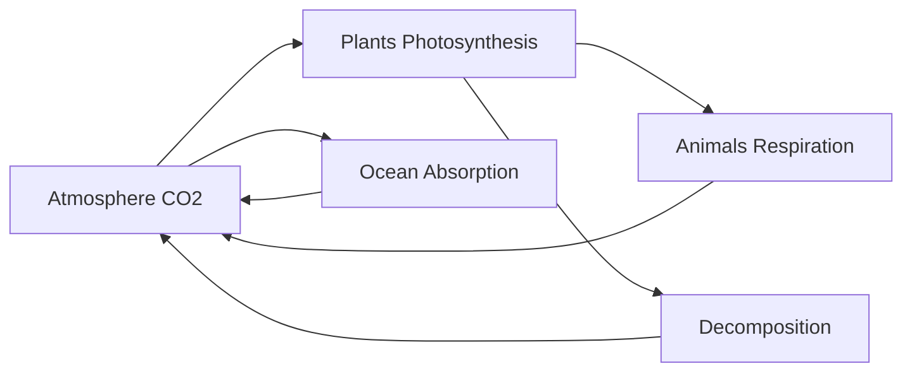
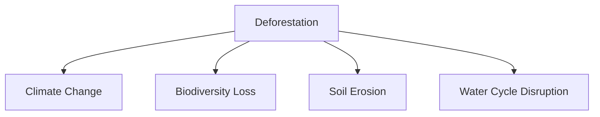
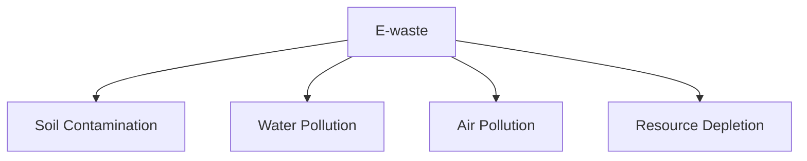
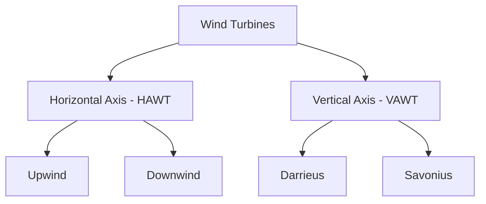
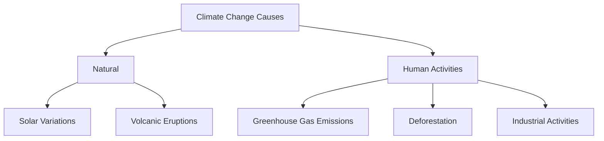
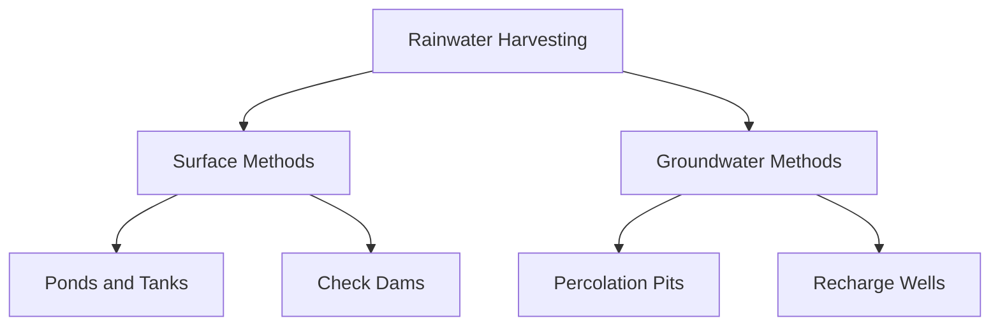
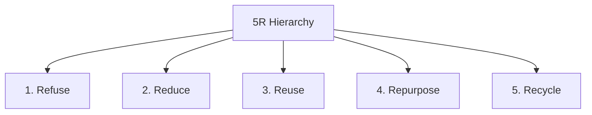

## Question 1(a) [3 marks]

**Write short note: Ecological pyramid.**

**Answer**:

**Table: Types of Ecological Pyramids**

| Type | Description | Example |
|------|-------------|---------|
| **Pyramid of Numbers** | Shows number of organisms at each level | Trees → Insects → Birds |
| **Pyramid of Biomass** | Shows total mass of organisms | Large at producer level |
| **Pyramid of Energy** | Shows energy flow through levels | Always upright |

- **Energy Transfer**: Only 10% energy transfers to next level
- **Trophic Levels**: Producers, primary consumers, secondary consumers
- **Always Upright**: Energy pyramid never inverts

**Mnemonic:** "Number-Biomass-Energy flows UP"

## Question 1(b) [4 marks]

**Describe global ecological overshoot.**

**Answer**:

Global ecological overshoot occurs when humanity's demand exceeds Earth's regenerative capacity.

**Key Components:**

| Factor | Description |
|--------|-------------|
| **Earth Overshoot Day** | Date when annual resource consumption exceeds regeneration |
| **Ecological Footprint** | Human demand on natural resources |
| **Biocapacity** | Earth's ability to regenerate resources |

- **Current Status**: Using 1.7 Earth's worth of resources annually
- **Consequences**: Climate change, biodiversity loss, resource depletion
- **Solutions**: Sustainable consumption, renewable energy adoption

**Mnemonic:** "Demand Exceeds Supply = Overshoot"

## Question 1(c) [7 marks]

**What are the Bio-geochemical cycle? Describe any two cycle of them.**

**Answer**:

Bio-geochemical cycles are natural processes that recycle essential elements through biotic and abiotic components.

**Carbon Cycle:**



**Nitrogen Cycle:**

| Stage | Process | Organisms |
|-------|---------|-----------|
| **Nitrogen Fixation** | N2 → NH3 | Rhizobium bacteria |
| **Nitrification** | NH3 → NO3 | Nitrosomonas, Nitrobacter |
| **Denitrification** | NO3 → N2 | Denitrifying bacteria |

- **Importance**: Essential for protein synthesis and DNA formation
- **Human Impact**: Fertilizers disrupt natural balance
- **Conservation**: Reduce chemical fertilizer use

**Mnemonic:** "Bacteria Fix Nitrogen, Plants Use It"

## Question 1(c) OR [7 marks]

**Describe the forest ecosystem state and explain the effects of deforestation and suggest the methods to conserve forest ecosystem.**

**Answer**:

**Forest Ecosystem Components:**

| Component | Examples |
|-----------|----------|
| **Producers** | Trees, shrubs, herbs |
| **Primary Consumers** | Deer, rabbits, insects |
| **Secondary Consumers** | Carnivores, birds |
| **Decomposers** | Bacteria, fungi |

**Effects of Deforestation:**



**Conservation Methods:**

- **Afforestation**: Planting trees in new areas
- **Reforestation**: Replanting in deforested areas
- **Protected Areas**: National parks and sanctuaries
- **Sustainable Harvesting**: Controlled logging practices

**Mnemonic:** "Plant, Protect, Practice Sustainability"

## Question 2(a) [3 marks]

**Write definition on pollution and pollutant.**

**Answer**:

**Definitions:**

| Term | Definition |
|------|------------|
| **Pollution** | Addition of harmful substances to environment |
| **Pollutant** | Substance causing environmental contamination |

- **Sources**: Industrial, domestic, agricultural activities
- **Types**: Air, water, soil, noise pollution
- **Effects**: Health problems, ecosystem damage

**Mnemonic:** "Pollutants cause Pollution"

## Question 2(b) [4 marks]

**Explain short note on gravity settling chamber equipment to control air pollution.**

**Answer**:

**Gravity Settling Chamber:**

```goat
+------------------+
|  Dirty Air  -->  |
|                  |
|   Particles      |
|      ↓           |
|  Collection      |
|    Chamber       |
|                  |
|  Clean Air  -->  |
+------------------+
```

**Working Principle:**

| Parameter | Description |
|-----------|-------------|
| **Mechanism** | Gravitational settling of particles |
| **Efficiency** | 50-70% for particles >50 μm |
| **Velocity** | Low gas velocity allows settling |

- **Applications**: Cement, mining, metallurgy industries
- **Advantages**: Simple design, low maintenance cost
- **Limitations**: Ineffective for fine particles

**Mnemonic:** "Gravity Settles Heavy Particles"

## Question 2(c) [7 marks]

**Describe solid waste management.**

**Answer**:

**Solid Waste Management Hierarchy:**


**Management Methods:**

| Method | Description | Advantages |
|--------|-------------|------------|
| **Landfill** | Controlled burial | Simple, cost-effective |
| **Incineration** | High-temperature burning | Volume reduction |
| **Composting** | Biological decomposition | Nutrient-rich fertilizer |
| **Recycling** | Material recovery | Resource conservation |

**Components:**

- **Collection**: Door-to-door pickup systems
- **Transportation**: Efficient vehicle routing
- **Treatment**: Sorting, processing, disposal
- **Monitoring**: Regular quality checks

**Mnemonic:** "Collect, Transport, Treat, Monitor"

## Question 2(a) OR [3 marks]

**Write effect on noise pollution.**

**Answer**:

**Effects of Noise Pollution:**

| Type | Effects |
|------|---------|
| **Health Effects** | Hearing loss, stress, hypertension |
| **Psychological** | Irritation, sleep disorders, anxiety |
| **Environmental** | Wildlife disruption, ecosystem damage |

- **Sources**: Traffic, industries, construction, aircraft
- **Measurement**: Decibel (dB) scale
- **Control**: Sound barriers, noise regulations

**Mnemonic:** "Noise Harms Health and Habitat"

## Question 2(b) OR [4 marks]

**What is water pollution? Write list of main water pollutant?**

**Answer**:

**Water Pollution Definition:**
Contamination of water bodies by harmful substances making it unsuitable for use.

**Major Water Pollutants:**

| Category | Examples |
|----------|----------|
| **Chemical** | Heavy metals, pesticides, fertilizers |
| **Biological** | Bacteria, viruses, parasites |
| **Physical** | Suspended solids, thermal pollution |
| **Radioactive** | Nuclear waste materials |

- **Sources**: Industrial discharge, domestic sewage, agricultural runoff
- **Effects**: Disease transmission, ecosystem disruption
- **Control**: Treatment plants, pollution prevention

**Mnemonic:** "Chemical, Biological, Physical, Radioactive"

## Question 2(c) OR [7 marks]

**What is E-waste? Write impact of E-waste on environment and human health. How to recycle E-waste?**

**Answer**:

**E-waste Definition:**
Electronic waste includes discarded electrical and electronic devices.

**Environmental Impact:**



**Health Impact:**

| Toxic Material | Health Effects |
|----------------|----------------|
| **Lead** | Nervous system damage |
| **Mercury** | Brain and kidney damage |
| **Cadmium** | Cancer, lung damage |

**E-waste Recycling Process:**

- **Collection**: Designated collection centers
- **Dismantling**: Manual separation of components
- **Recovery**: Extraction of valuable materials
- **Disposal**: Safe handling of toxic substances

**Mnemonic:** "Collect, Dismantle, Recover, Dispose Safely"

## Question 3(a) [3 marks]

**What is BOD? Give a importance of BOD.**

**Answer**:

**BOD (Biochemical Oxygen Demand):**

| Parameter | Description |
|-----------|-------------|
| **Definition** | Oxygen required by microorganisms to decompose organic matter |
| **Unit** | mg/L or ppm |
| **Test Period** | 5 days at 20°C |

**Importance:**

- **Water Quality**: Indicates organic pollution level
- **Treatment Efficiency**: Monitors treatment plant performance
- **Environmental Health**: Assesses aquatic ecosystem condition

**Mnemonic:** "Bacteria Oxygen Demand measures pollution"

## Question 3(b) [4 marks]

**Give a comparison of conventional and Non conventional energy sources.**

**Answer**:

**Energy Sources Comparison:**

| Parameter | Conventional | Non-Conventional |
|-----------|--------------|------------------|
| **Examples** | Coal, oil, natural gas | Solar, wind, biomass |
| **Availability** | Limited reserves | Unlimited/renewable |
| **Environment** | High pollution | Environment friendly |
| **Cost** | Initially cheap | High initial cost |
| **Sustainability** | Non-sustainable | Sustainable |

- **Conventional**: Depleting rapidly, cause greenhouse gases
- **Non-conventional**: Clean, abundant, future energy solution
- **Transition**: Global shift towards renewable energy

**Mnemonic:** "Conventional Pollutes, Renewable Sustains"

## Question 3(c) [7 marks]

**Give classification of wind turbines and explain horizontal axis wind turbine.**

**Answer**:

**Wind Turbine Classification:**



**Horizontal Axis Wind Turbine (HAWT):**

**Components:**

| Component | Function |
|-----------|----------|
| **Rotor Blades** | Convert wind energy to rotational motion |
| **Nacelle** | Houses generator and gearbox |
| **Tower** | Supports turbine at optimal height |
| **Foundation** | Provides structural stability |

**Working Principle:**

- **Wind Direction**: Parallel to rotor axis
- **Blade Design**: Aerodynamic lift principle
- **Power Generation**: Variable speed operation
- **Efficiency**: 35-45% energy conversion

**Advantages:**

- **High Efficiency**: Better power coefficient
- **Mature Technology**: Well-established design
- **Cost Effective**: Lower maintenance costs

**Mnemonic:** "Horizontal High Efficiency"

## Question 3(a) OR [3 marks]

**Explain need for renewable energy.**

**Answer**:

**Need for Renewable Energy:**

| Reason | Description |
|--------|-------------|
| **Energy Security** | Reduce import dependence |
| **Environmental Protection** | Zero carbon emissions |
| **Economic Benefits** | Job creation, cost reduction |

- **Fossil Fuel Depletion**: Limited reserves, increasing prices
- **Climate Change**: Urgent need to reduce greenhouse gases
- **Sustainable Development**: Meet present needs without compromising future

**Mnemonic:** "Security, Environment, Economy need Renewables"

## Question 3(b) OR [4 marks]

**Write a short note on Geo thermal energy.**

**Answer**:

**Geothermal Energy:**

Heat energy stored beneath Earth's surface used for power generation.

**Types:**

| Type | Temperature | Application |
|------|-------------|-------------|
| **High Temperature** | >150°C | Power generation |
| **Medium Temperature** | 90-150°C | Direct heating |
| **Low Temperature** | <90°C | Heat pumps |

- **Sources**: Hot springs, geysers, underground reservoirs
- **Advantages**: Continuous availability, low emissions
- **Applications**: Electricity generation, space heating, industrial processes

**Mnemonic:** "Earth's Heat Powers Homes"

## Question 3(c) OR [7 marks]

**Explain the principal and working of solar photovoltaic cell. Give its uses.**

**Answer**:

**Solar Photovoltaic Cell Principle:**

Converts sunlight directly into electricity using photovoltaic effect.

**Working Process:**


**Cell Structure:**

| Layer | Material | Function |
|-------|----------|----------|
| **Top Layer** | N-type silicon | Excess electrons |
| **Bottom Layer** | P-type silicon | Electron holes |
| **Junction** | P-N junction | Electric field creation |

**Working Steps:**

- **Photon Absorption**: Light energy absorbed by silicon
- **Electron Excitation**: Electrons gain energy and move
- **Current Generation**: Electron flow creates electricity
- **External Circuit**: Current flows through load

**Applications:**

- **Residential**: Rooftop solar systems
- **Commercial**: Solar farms, street lighting
- **Industrial**: Remote power supply, satellites
- **Transportation**: Solar vehicles, charging stations

**Advantages:**

- **Clean Energy**: No emissions during operation
- **Low Maintenance**: Minimal moving parts
- **Modular**: Scalable installation

**Mnemonic:** "Sun Strikes Silicon, Sparks Current"

## Question 4(a) [3 marks]

**Explain Green house effect.**

**Answer**:

**Greenhouse Effect:**

Natural process where certain gases trap heat in Earth's atmosphere.

**Mechanism:**

| Step | Process |
|------|---------|
| **Solar Radiation** | Sun's energy reaches Earth |
| **Surface Absorption** | Earth absorbs and heats up |
| **Re-radiation** | Earth emits infrared radiation |
| **Gas Trapping** | Greenhouse gases trap heat |

- **Natural Effect**: Maintains Earth's temperature for life
- **Enhanced Effect**: Human activities increase greenhouse gases
- **Result**: Global warming and climate change

**Mnemonic:** "Gases Trap Heat, Earth Heats"

## Question 4(b) [4 marks]

**Write international protocol to prevent climate change management.**

**Answer**:

**International Climate Protocols:**

| Protocol | Year | Objective |
|----------|------|-----------|
| **Kyoto Protocol** | 1997 | Reduce greenhouse gas emissions |
| **Paris Agreement** | 2015 | Limit global warming to 1.5°C |
| **Montreal Protocol** | 1987 | Protect ozone layer |

**Key Features:**

- **Emission Targets**: Binding commitments for developed countries
- **Clean Development**: Technology transfer to developing nations
- **Carbon Trading**: Market-based emission reduction mechanisms
- **Monitoring**: Regular reporting and verification systems

**Mnemonic:** "Kyoto, Paris, Montreal Protect Climate"

## Question 4(c) [7 marks]

**Explain biogas plant with neat sketch.**

**Answer**:

**Biogas Plant:**

```goat
    Gas Outlet
        ↑
+---[Gas Holder]---+
|                  |
|  Slurry Chamber  |
|                  |
+--------+---------+
         |
    Inlet Tank
         ↓
    Organic Waste
```

**Components:**

| Component | Function |
|-----------|----------|
| **Inlet Tank** | Receives organic waste |
| **Digester** | Anaerobic decomposition occurs |
| **Gas Holder** | Stores produced biogas |
| **Outlet** | Removes spent slurry |

**Working Process:**

- **Loading**: Organic waste mixed with water
- **Digestion**: Bacteria decompose waste anaerobically
- **Gas Production**: Methane and CO2 generated
- **Collection**: Gas stored in holder for use

**Raw Materials:**

- **Animal Waste**: Cow dung, poultry droppings
- **Plant Waste**: Agricultural residues, kitchen waste
- **Water**: Maintains proper consistency

**Products:**

- **Biogas**: 50-70% methane for cooking/heating
- **Slurry**: Excellent organic fertilizer

**Advantages:**

- **Renewable**: Continuous gas production
- **Waste Management**: Converts waste to energy
- **Rural Development**: Suitable for villages

**Mnemonic:** "Waste In, Gas Out, Fertilizer Bonus"

## Question 4(a) OR [3 marks]

**Write short note on green house gases.**

**Answer**:

**Greenhouse Gases:**

| Gas | Source | Contribution |
|-----|---------|--------------|
| **Carbon Dioxide** | Fossil fuels, deforestation | 76% |
| **Methane** | Agriculture, landfills | 16% |
| **Nitrous Oxide** | Fertilizers, combustion | 6% |
| **Fluorinated Gases** | Industrial processes | 2% |

- **Properties**: Absorb and emit infrared radiation
- **Impact**: Trap heat causing global warming
- **Control**: Reduce emissions, use alternatives

**Mnemonic:** "CO2, CH4, N2O, F-gases Heat Earth"

## Question 4(b) OR [4 marks]

**Explain ozone layer depletion.**

**Answer**:

**Ozone Layer Depletion:**

Reduction of ozone concentration in stratosphere due to human activities.

**Causes:**

| Substance | Source | Effect |
|-----------|---------|---------|
| **CFCs** | Refrigerants, aerosols | Break down ozone molecules |
| **Halons** | Fire extinguishers | Catalytic ozone destruction |
| **Methyl Bromide** | Pesticides | Ozone layer thinning |

**Process:**

- **UV Breakdown**: UV radiation breaks CFC molecules
- **Chlorine Release**: Free chlorine atoms released
- **Ozone Destruction**: Chlorine destroys ozone molecules
- **Chain Reaction**: One CFC molecule destroys many ozone molecules

**Effects**: Increased UV radiation, skin cancer, crop damage

**Mnemonic:** "CFCs Climb, Chlorine Chops Ozone"

## Question 4(c) OR [7 marks]

**Explain the term "climate changes and state its causes and effects"**

**Answer**:

**Climate Change Definition:**
Long-term shifts in global weather patterns and temperatures.

**Causes:**



**Human Causes:**

| Activity | Contribution |
|----------|--------------|
| **Fossil Fuel Burning** | 65% of CO2 emissions |
| **Deforestation** | 15% of emissions |
| **Industrial Processes** | 20% of emissions |

**Effects:**

**Environmental Effects:**

- **Temperature Rise**: Global average temperature increase
- **Sea Level Rise**: Thermal expansion and ice melting
- **Weather Extremes**: More frequent droughts, floods

**Biological Effects:**

- **Species Migration**: Animals moving to cooler regions
- **Ecosystem Disruption**: Food chain alterations
- **Biodiversity Loss**: Species extinction rates increase

**Human Effects:**

- **Agriculture**: Crop yield changes, food security issues
- **Health**: Heat stress, disease vector changes
- **Economy**: Infrastructure damage, adaptation costs

**Mitigation Strategies:**

- **Renewable Energy**: Transition from fossil fuels
- **Energy Efficiency**: Reduce consumption
- **Carbon Sequestration**: Forest conservation, tree planting
- **International Cooperation**: Global agreements and policies

**Mnemonic:** "Human Actions Heat Earth, Everyone Affected"

## Question 5(a) [3 marks]

**Explain "Khet Talavadi".**

**Answer**:

**Khet Talavadi (Farm Pond):**

Small water harvesting structure in agricultural fields for irrigation.

**Features:**

| Parameter | Description |
|-----------|-------------|
| **Size** | 20m x 20m x 3m depth |
| **Capacity** | 1200 cubic meters |
| **Cost** | Subsidized by government |

- **Purpose**: Rainwater collection, irrigation during dry periods
- **Benefits**: Increased crop yield, groundwater recharge
- **Construction**: Lined with plastic sheets or cement

**Mnemonic:** "Farm Pond Stores Rain for Crops"

## Question 5(b) [4 marks]

**Give goal and advantage of green building.**

**Answer**:

**Green Building Goals:**

| Goal | Description |
|------|-------------|
| **Energy Efficiency** | Reduce energy consumption |
| **Water Conservation** | Minimize water usage |
| **Material Efficiency** | Use sustainable materials |
| **Indoor Environment** | Improve air quality |

**Advantages:**

- **Environmental**: Reduced carbon footprint, waste minimization
- **Economic**: Lower operating costs, increased property value
- **Health**: Better indoor air quality, natural lighting
- **Social**: Enhanced occupant comfort, productivity

**Green Building Features:**

- **Solar Panels**: Renewable energy generation
- **Rainwater Harvesting**: Water conservation
- **Green Roofs**: Insulation and air purification

**Mnemonic:** "Green Goals: Energy, Water, Materials, Environment"

## Question 5(c) [7 marks]

**Explain various methods of rain water harvesting.**

**Answer**:

**Rainwater Harvesting Methods:**

**Surface Methods:**



**Detailed Methods:**

| Method | Description | Application |
|--------|-------------|-------------|
| **Rooftop Harvesting** | Collect water from building roofs | Urban areas |
| **Surface Runoff** | Capture water from ground surface | Rural areas |
| **Check Dams** | Small barriers across streams | Hilly regions |
| **Percolation Tanks** | Allow water to seep underground | Groundwater recharge |

**System Components:**

- **Catchment Area**: Surface collecting rainwater
- **Conveyance System**: Gutters, pipes for transport
- **Storage System**: Tanks, ponds for holding water
- **Filter System**: Remove debris and contaminants

**Rooftop Harvesting Process:**

- **Collection**: Rain falls on roof surface
- **Conveyance**: Water flows through gutters and downspouts
- **First Flush**: Initial dirty water diverted
- **Storage**: Clean water stored in tanks
- **Distribution**: Water used for various purposes

**Benefits:**

- **Water Security**: Reduce dependence on external supply
- **Flood Control**: Reduce surface runoff and flooding
- **Groundwater Recharge**: Replenish underground aquifers
- **Cost Savings**: Reduce water bills

**Design Considerations:**

- **Rainfall Data**: Annual precipitation patterns
- **Catchment Area**: Available roof/ground area
- **Storage Capacity**: Based on demand and supply
- **Water Quality**: Treatment requirements

**Mnemonic:** "Catch, Convey, Store, Filter, Use"

## Question 5(a) OR [3 marks]

**What is Life cycle analysis (LCA)?**

**Answer**:

**Life Cycle Analysis (LCA):**

Systematic evaluation of environmental impacts of a product throughout its entire life cycle.

**LCA Stages:**

| Stage | Description |
|-------|-------------|
| **Raw Material** | Resource extraction |
| **Manufacturing** | Production processes |
| **Use Phase** | Product utilization |
| **End of Life** | Disposal or recycling |

- **Purpose**: Identify environmental hotspots, compare alternatives
- **Applications**: Product design, policy decisions, consumer choices

**Mnemonic:** "Life Cycle: Raw, Make, Use, Dispose"

## Question 5(b) OR [4 marks]

**Give main features of the biological diversity Act, 2002**

**Answer**:

**Biological Diversity Act, 2002:**

**Main Features:**

| Feature | Description |
|---------|-------------|
| **Three-tier Structure** | National, State, Local Biodiversity Boards |
| **Prior Approval** | Required for bio-resource access |
| **Benefit Sharing** | Equitable sharing with local communities |
| **Bio-piracy Prevention** | Protect traditional knowledge |

**Key Provisions:**

- **Access Regulation**: Control over biological resources
- **Sustainable Use**: Conservation through utilization
- **Community Rights**: Recognize local community contributions
- **Penalties**: Strict punishment for violations

**Objectives**: Conservation, sustainable use, equitable benefit sharing

**Mnemonic:** "Biodiversity Act: Access, Benefit, Conserve, Protect"

## Question 5(c) OR [7 marks]

**Explain 5R.**

**Answer**:

**5R Concept:**

Waste management hierarchy for environmental sustainability.

**The 5Rs:**



**Detailed Explanation:**

| R | Definition | Examples | Benefits |
|---|------------|----------|----------|
| **Refuse** | Avoid unnecessary items | Plastic bags, disposables | Prevent waste generation |
| **Reduce** | Minimize consumption | Energy, water, materials | Lower resource demand |
| **Reuse** | Use items multiple times | Containers, clothing | Extend product life |
| **Repurpose** | Find new uses for items | Tire planters, bottle crafts | Creative waste diversion |
| **Recycle** | Process into new products | Paper, plastic, metals | Material recovery |

**Implementation Strategies:**

**Personal Level:**

- **Refuse**: Say no to single-use plastics
- **Reduce**: Buy only necessary items
- **Reuse**: Repurpose containers and materials
- **Repurpose**: Creative DIY projects
- **Recycle**: Proper sorting and disposal

**Community Level:**

- **Awareness Programs**: Education about 5R principles
- **Infrastructure**: Recycling facilities and collection systems
- **Policies**: Regulations promoting waste reduction
- **Incentives**: Rewards for sustainable practices

**Industrial Level:**

- **Design for Durability**: Long-lasting products
- **Material Selection**: Recyclable and biodegradable materials
- **Circular Economy**: Closed-loop production systems
- **Extended Producer Responsibility**: Manufacturer accountability

**Environmental Benefits:**

- **Resource Conservation**: Reduced raw material extraction
- **Energy Savings**: Lower production energy requirements
- **Pollution Reduction**: Decreased waste generation
- **Climate Protection**: Reduced greenhouse gas emissions

**Economic Benefits:**

- **Cost Savings**: Lower disposal and material costs
- **Job Creation**: Green jobs in recycling and reuse sectors
- **Innovation**: Development of sustainable technologies
- **Market Opportunities**: New business models

**Social Benefits:**

- **Community Engagement**: Collective environmental action
- **Health Improvement**: Cleaner environment
- **Education**: Environmental awareness and responsibility
- **Cultural Change**: Sustainable lifestyle adoption

**Challenges:**

- **Behavior Change**: Overcoming consumption habits
- **Infrastructure**: Adequate recycling facilities
- **Economic Barriers**: Initial investment requirements
- **Policy Support**: Government regulations and incentives

**Success Stories:**

- **Zero Waste Cities**: San Francisco, Kamikatsu
- **Corporate Initiatives**: Company 5R programs
- **School Programs**: Student environmental education
- **Community Projects**: Local waste reduction efforts

**Mnemonic:** "Really Reduce Reuse Repurpose Recycle"

---
