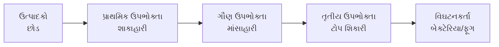
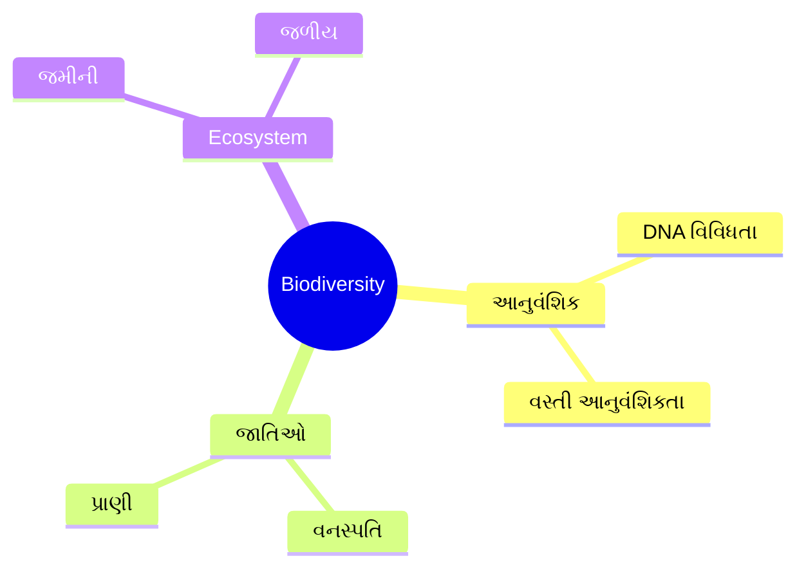
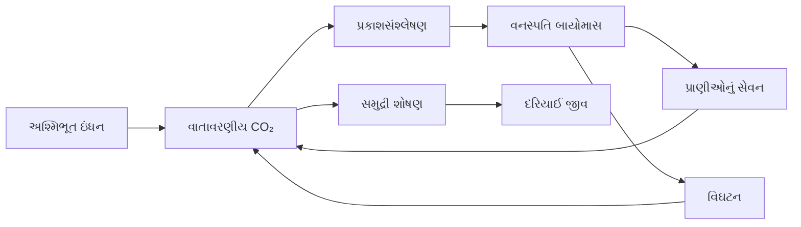
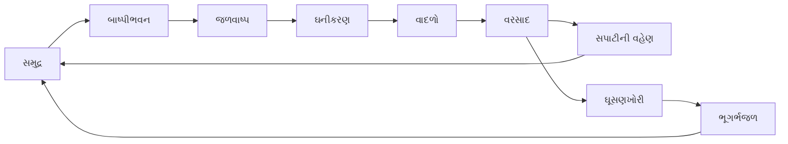
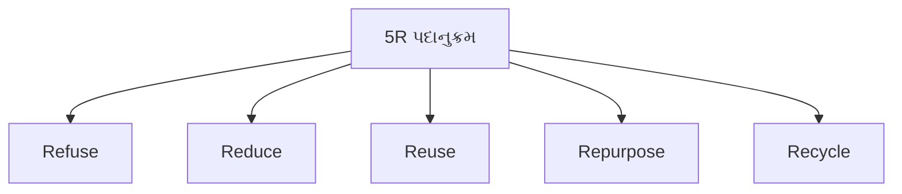

## પ્રશ્ન 1 (કોઈપણ સાત) [14 ગુણ]

### 1. **'પરિસ્થિતિશાસ્ત્ર' અને 'નિવસનતંત્ર' ની વ્યાખ્યા આપો.**

**જવાબ:**
**Ecology** એ જીવિત જીવોના તેમના પર્યાવરણ સાથેના સંબંધોનો વૈજ્ઞાનિક અભ્યાસ છે. **Ecosystem** એ એકમ તરીકે કામ કરતા જીવો અને તેમના ભૌતિક પર્યાવરણનો જૈવિક સમુદાય છે.

**કોષ્ટક:**

| શબ્દ | વ્યાખ્યા | ઉદાહરણ |
|------|----------|---------|
| Ecology | જીવ-પર્યાવરણ સંબંધોનો અભ્યાસ | વન ecology |
| Ecosystem | જીવંત અને નિર્જીવ ઘટકોની પરસ્પર ક્રિયા | તળાવનું ecosystem |

- **જૈવિક ઘટકો**: તંત્રમાં જીવંત જીવો
- **અજૈવિક ઘટકો**: હવા, પાણી, માટી જેવા નિર્જીવ પરિબળો

**મેમરી ટ્રીક:** "દરેક ઘટક એકસાથે રહે છે" (Ecology Creates Living Together)

### 2. **'પ્રદૂષણ' અને 'પ્રદૂષક' ની વ્યાખ્યા આપો.**

**જવાબ:**
**Pollution** એ પર્યાવરણમાં હાનિકારક પદાર્થોનો પ્રવેશ છે જે પ્રતિકૂળ અસરો લાવે છે. **Pollutant** એ કોઈપણ પદાર્થ છે જે વધારે માત્રામાં હાજર હોય ત્યારે પ્રદૂષણ લાવે છે.

**કોષ્ટક:**

| શબ્દ | વ્યાખ્યા | પ્રકારો |
|------|----------|---------|
| Pollution | પર્યાવરણીય દૂષણ | હવા, પાણી, માટી, અવાજ |
| Pollutant | હાનિકારક પદાર્થ | ભૌતિક, રાસાયણિક, જૈવિક |

- **પ્રાથમિક પ્રદૂષકો**: સીધા વિસર્જિત પદાર્થો
- **ગૌણ પ્રદૂષકો**: વાતાવરણમાં પ્રતિક્રિયાઓથી બનેલા

**મેમરી ટ્રીક:** "પ્રદૂષણ સમસ્યાઓ પેદા કરે છે" (Pollution Produces Problems)

### 3. **'અવાજનું પ્રદૂષણ' એટલે શું? ધ્વનિની તીવ્રતાનો એકમ શું છે?**

**જવાબ:**
**Noise pollution** એ અનિચ્છિત અથવા વધુ પડતો અવાજ છે જે માનવીય પ્રવૃત્તિઓને ખલેલ પહોંચાડે છે. ધ્વનિની તીવ્રતાનો એકમ **decibel (dB)** છે.

**કોષ્ટક:**

| અવાજનું સ્તર | સ્રોત | અસર |
|---------------|--------|-----|
| 30-40 dB | પુસ્તકાલય | આરામદાયક |
| 60-70 dB | ટ્રાફિક | હેરાનીજનક |
| 90+ dB | ઉદ્યોગ | હાનિકારક |

- **સાંભળવાની સીમા**: 0 dB
- **પીડાની સીમા**: 120 dB

**મેમરી ટ્રીક:** "Decibel નુકસાન નક્કી કરે છે" (dB Determines Damage)

### 4. **ઘન કચરાનું વ્યવસ્થાપન શું છે? તેના હેતુઓ જણાવો.**

**જવાબ:**
**Solid waste management** એ પર્યાવરણીય અસર ઘટાડવા અને જાહેર આરોગ્યની સુરક્ષા માટે કચરાના ઉત્પાદનથી અંતિમ નિકાલ સુધીનું વ્યવસ્થિત સંચાલન છે.

**હેતુઓ:**

- **જાહેર આરોગ્ય સંરક્ષણ**: રોગ પ્રસારણ અટકાવવું
- **પર્યાવરણ સંરક્ષણ**: પ્રદૂષણ અને દૂષણ ઘટાડવું
- **સંસાધન પુનઃપ્રાપ્તિ**: સામગ્રીનું પુનઃઉપયોગ અને રીસાયકલિંગ
- **ખર્ચ અસરકારકતા**: આર્થિક કચરા નિયંત્રણ

**મેમરી ટ્રીક:** "લોકો સંસાધન સંરક્ષણની અપેક્ષા રાખે છે" (Protection, Environment, Resource, Cost)

### 5. **સોલાર સેલના પ્રકારો સમજાવો.**

**જવાબ:**
Solar cells સૂર્યપ્રકાશને photovoltaic effect દ્વારા સીધી વીજળીમાં રૂપાંતરિત કરે છે.

**કોષ્ટક:**

| પ્રકાર | કાર્યક્ષમતા | કિંમત | ઉપયોગ |
|-------|-------------|-------|---------|
| Monocrystalline | 15-20% | વધુ | આવાસીય |
| Polycrystalline | 13-16% | મધ્યમ | વ્યાવસાયિક |
| Thin Film | 7-13% | ઓછી | વિશાળ પ્રમાણ |

- **Silicon-based**: સૌથી સામાન્ય પ્રકાર
- **Non-silicon**: ઉદીયમાન તકનીકો

**મેમરી ટ્રીક:** "મોટાભાગના લોકો વિચારે છે" (Mono, Poly, Thin-film)

### 6. **'આબોહવા (જલવાયુ) પરિવર્તન' શું છે?**

**જવાબ:**
**Climate change** એ મુખ્યત: માનવીય પ્રવૃત્તિઓ અને greenhouse gas ઉત્સર્જનને કારણે વૈશ્વિક તાપમાન અને હવામાન પેટર્નમાં લાંબા ગાળાના ફેરફારોનો સંદર્ભ આપે છે.

**કારણો:**

- **Greenhouse gases**: CO₂, CH₄, N₂O ઉત્સર્જન
- **વનનાશ**: કાર્બન શોષણમાં ઘટાડો
- **ઔદ્યોગિક પ્રવૃત્તિઓ**: અશ્મિભૂત ઇંધનનું બર્નિંગ

**અસરો:**

- **વધતું તાપમાન**: વૈશ્વિક ઉષ્ણતા
- **દરિયાઈ સ્તરમાં વધારો**: બરફ પીગળવાથી

**મેમરી ટ્રીક:** "પરિવર્તન પરિણામો બનાવે છે" (Change Creates Consequences)

### 7. **C.F.C શું છે?**

**જવાબ:**
**CFC (Chlorofluorocarbon)** એ કાર્બન, ફ્લોરિન અને ક્લોરિન અણુઓ ધરાવતા કૃત્રિમ સંયોજનો છે, જે અગાઉ refrigeration અને aerosols માં વપરાતા હતા.

**ગુણધર્મો:**

- **ઓઝોન નાશક**: stratospheric ozone નાશ કરે છે
- **Greenhouse gas**: વૈશ્વિક ઉષ્ણતામાં યોગદાન
- **સ્થિર સંયોજનો**: લાંબા વાતાવરણીય આયુષ્ય
- **Montreal Protocol**: આંતરરાષ્ટ્રીય પ્રતિબંધ કરાર

**મેમરી ટ્રીક:** "ક્લોરિન ફ્લોરિન કાર્બન" (CFC ઘટકો)

### 8. **ISO-14000 ના ફાયદા આપો.**

**જવાબ:**
**ISO 14000** પર્યાવરણીય વ્યવસ્થાપન પ્રણાલીઓ માટેનું આંતરરાષ્ટ્રીય ધોરણ છે.

**ફાયદા:**

- **પર્યાવરણીય અનુપાલન**: કાનૂની જરૂરિયાતોની પૂર્તિ
- **ખર્ચ ઘટાડો**: કુશળ સંસાધન ઉપયોગ
- **બજાર ફાયદો**: કંપનીની છબીમાં સુધારો
- **જોખમ વ્યવસ્થાપન**: પર્યાવરણીય દુર્ઘટનાઓ અટકાવવી

**કોષ્ટક:**

| ફાયદો | અસર | પરિણામ |
|-------|-----|--------|
| અનુપાલન | કાનૂની સુરક્ષા | દંડ ટાળવો |
| કુશળતા | સંસાધન બચત | ખર્ચ ઘટાડો |
| છબી | બજાર સ્થિતિ | સ્પર્ધાત્મક ફાયદો |

**મેમરી ટ્રીક:** "કંપનીઓ બજાર માન્યતા મેળવે છે" (Compliance, Cost, Market, Risk)

### 9. **ભારતમાં પર્યાવરણ સંબંધિત વિવિધ કાયદાઓની યાદી બનાવો.**

**જવાબ:**
ભારતમાં વ્યાપક પર્યાવરણીય કાયદાકીય માળખું છે.

**મુખ્ય કાયદાઓ:**

- **Air Act (1981)**: હવા પ્રદૂષણ નિયંત્રણ
- **Water Act (1974)**: પાણી પ્રદૂષણ અટકાવવા
- **Environment Protection Act (1986)**: વ્યાપક પર્યાવરણીય કાયદો
- **Wildlife Protection Act (1972)**: જૈવવિવિધતા સંરક્ષણ
- **Forest Conservation Act (1980)**: વન સંરક્ષણ

**મેમરી ટ્રીક:** "તમામ પાણી પર્યાવરણ વન્યજીવ વન" (AWEWF)

### 10. **વરસાદના પાણીના સંચયની વિવિધ પદ્ધતિઓની યાદી બનાવો.**

**જવાબ:**
**Rainwater harvesting** ભવિષ્યના ઉપયોગ માટે વરસાદી પાણીનું સંગ્રહ અને સંચય કરે છે.

**પદ્ધતિઓ:**

- **છતથી સંચય**: છતમાંથી સીધો સંગ્રહ
- **સપાટીની વહેણ સંચય**: જમીનની સપાટીમાંથી
- **રિચાર્જ પિટ્સ**: ભૂગર્ભજળ રિચાર્જિંગ
- **ચેક ડેમ**: નદીના પાણીનો સંગ્રહ

**કોષ્ટક:**

| પદ્ધતિ | ઉપયોગ | ફાયદો |
|--------|-------|-------|
| છત | શહેરી વિસ્તારો | સીધો ઉપયોગ |
| સપાટી | ગ્રામીણ વિસ્તારો | મોટી માત્રા |
| રિચાર્જ | પાણીનું સ્તર | ભૂગર્ભજળ |

**મેમરી ટ્રીક:** "છત સપાટી રિચાર્જ ચેક" (RSRC)

## પ્રશ્ન 2(અ) [3 ગુણ]

### **ટૂંક નોંધ લખો: ફૂડ ચેઇન.**

**જવાબ:**
**Food chain** ecosystem માં વિવિધ trophic levels દ્વારા ઊર્જા અને પોષકતત્વોના પ્રવાહને દર્શાવે છે.



- **ઊર્જા સ્થાનાંતરણ**: આગલા સ્તરે માત્ર 10% જાય છે
- **Biomass પિરામિડ**: ઉચ્ચ સ્તરે ઘટતું જાય છે

**મેમરી ટ્રીક:** "છોડ પ્રાથમિક શક્તિ પૂરી પાડે છે" (Producer to Predator Path)

### અથવા

### **Ecosystem ને અસર કરતાં ઘટકો સમજાવો.**

**જવાબ:**
Ecosystems વિવિધ જૈવિક અને અજૈવિક ઘટકોથી પ્રભાવિત થાય છે.

**ઘટકો:**

- **આબોહવા ઘટકો**: તાપમાન, વરસાદ, ભેજ
- **માટીના ઘટકો**: pH, પોષકતત્વો, રચના
- **જૈવિક ઘટકો**: જાતિઓના સંબંધો, વસ્તીની ઘનતા
- **માનવીય ઘટકો**: પ્રદૂષણ, નિવાસસ્થાન નાશ

**કોષ્ટક:**

| ઘટકનો પ્રકાર | ઘટકો | અસર |
|-------------|-------|-----|
| અજૈવિક | આબોહવા, માટી | નિવાસસ્થાનની સ્થિતિ |
| જૈવિક | જીવો | જાતિઓના સંબંધો |
| માનવજન્ય | માનવીય પ્રવૃત્તિઓ | Ecosystem ખલેલ |

**મેમરી ટ્રીક:** "આબોહવા માટી જીવવિજ્ઞાન માનવો" (CSBH)

## પ્રશ્ન 2(બ) [3 ગુણ]

### **ટૂંક નોંધ લખો: કાલ્પનિક જળ**

**જવાબ:**
**Virtual water** એ માલ અને સેવાઓના ઉત્પાદનમાં વપરાતું છુપાયેલું પાણી છે, જે supply chain માં કુલ પાણીના વપરાશને દર્શાવે છે.

**ઉદાહરણો:**

- **1 kg ઘઉં**: 1,300 લિટર virtual water
- **1 kg બીફ**: 15,400 લિટર virtual water
- **1 કપાસનું t-shirt**: 2,700 લિટર virtual water

- **Water footprint**: કુલ virtual water વપરાશ
- **વેપારની અસરો**: પાણીથી સમૃદ્ધ દેશો virtual water નિકાસ કરે છે

**મેમરી ટ્રીક:** "વર્ચ્યુઅલ વોટર વર્લ્ડવાઇડ" (VWW)

### અથવા

### **'જૈવ-વૈવિધ્ય' એટલે શું? જૈવ-વૈવિધ્યના પ્રકારો જણાવો.**

**જવાબ:**
**Biodiversity** એ પૃથ્વી પર આનુવંશિક, જાતિઓ અને ecosystem સ્તરે જીવન સ્વરૂપોની વિવિધતા છે.

**પ્રકારો:**

- **આનુવંશિક વિવિધતા**: જાતિઓની અંદર વિવિધતા
- **જાતિઓ વિવિધતા**: વિવિધ જાતિઓની સંખ્યા
- **Ecosystem વિવિધતા**: નિવાસસ્થાન અને સમુદાયોની વિવિધતા



**મેમરી ટ્રીક:** "જીન્સ જાતિઓ Ecosystems" (GSE)

## પ્રશ્ન 2(ક) [4 ગુણ]

### **કાર્બનચક્ર સમજાવો.**

**જવાબ:**
**Carbon cycle** પૃથ્વીના વાતાવરણ, જમીન, પાણી અને જીવોમાં કાર્બનની હિલચાલનું વર્ણન કરે છે.



**પ્રક્રિયાઓ:**

- **પ્રકાશસંશ્લેષણ**: છોડ દ્વારા CO₂ શોષણ
- **શ્વસન**: જીવો દ્વારા CO₂ છોડવું
- **વિઘટન**: વાતાવરણમાં કાર્બન પરત આવવું
- **સમુદ્રી આપલે**: દરિયાઈ પાણીમાં CO₂ ઓગળવું

**મેમરી ટ્રીક:** "છોડ શ્વાસ લે છે, મરે છે, સમુદ્ર" (PBDO)

### અથવા

### **જલીયચક્ર દોરો અને સમજાવો**

**જવાબ:**
**Hydrologic cycle** એ વાતાવરણ, જમીન અને મહાસાગરોમાં પાણીની સતત હિલચાલ છે.



**પ્રક્રિયાઓ:**

- **બાષ્પીભવન**: પાણીથી વાષ્પમાં રૂપાંતર
- **ઘનીકરણ**: વાષ્પથી પ્રવાહીમાં રૂપાંતર
- **વરસાદ**: વરસાદ, બરફનું નિર્માણ
- **ઘૂસણખોરી**: ભૂગર્ભજળ રિચાર્જ

**મેમરી ટ્રીક:** "દરેક વાદળ વરસાદ લાવે છે" (ECPR)

## પ્રશ્ન 2(ડ) [4 ગુણ]

### **હવાના પ્રદૂષણને નિયંત્રણમાં વપરાતા સાધનો જણાવો અને કોઈ એક સમજાવો.**

**જવાબ:**
હવા પ્રદૂષણ નિયંત્રણ સાધનો ઔદ્યોગિક ઉત્સર્જનમાંથી પ્રદૂષકો દૂર કરે છે.

**સાધનોની યાદી:**

- **Cyclone separators**: કણીય દૂરીકરણ
- **Electrostatic precipitators**: ઝીણા કણોનો સંગ્રહ
- **Bag filters**: કાપડ ગાળક
- **Scrubbers**: ગેસ શોષણ

**Electrostatic Precipitator:**

```goat
   +----------+
   |    +     |  ઉચ્ચ વોલ્ટેજ ઇલેક્ટ્રોડ
   |    |     |
   |    v     |
   |  ધૂળ     |  ચાર્જ થયેલા કણો
   |  +-+-+   |
   |  |   |   |
   |  v   v   |
   +--+---+---+  સંગ્રહ પ્લેટ (-)
      સાફ ગેસ બહાર
```

- **ચાર્જિંગ**: કણો વિદ્યુત ચાર્જ મેળવે છે
- **સંગ્રહ**: ચાર્જ થયેલા કણો પ્લેટ્સ તરફ આકર્ષાય છે
- **કાર્યક્ષમતા**: ઝીણા કણોનું 99% દૂરીકરણ

**મેમરી ટ્રીક:** "ચાર્જ કલેક્ટ ક્લીન" (CCC)

### અથવા

## પ્રશ્ન 2(ડ) [4 ગુણ]

### **પર્યાવરણીય પ્રદૂષણના પ્રકારો જણાવો અને અવાજના પ્રદૂષણની અસરો જણાવો**

**જવાબ:**
**પર્યાવરણીય પ્રદૂષણના પ્રકારો:**

- **હવા પ્રદૂષણ**: વાતાવરણીય દૂષણ
- **પાણી પ્રદૂષણ**: જળીય દૂષણ
- **માટી પ્રદૂષણ**: જમીનનું દૂષણ
- **અવાજ પ્રદૂષણ**: ધ્વનિ દૂષણ

**Noise Pollution ની અસરો:**

- **આરોગ્યની અસરો**: સાંભળવાની ખોટ, તણાવ, હાયપરટેન્શન
- **માનસિક અસરો**: હેરાનગતિ, ઊંઘનો ખલેલ
- **કામગીરીની અસરો**: ધ્યાન ઘટવું, ઉત્પાદકતા ઘટવી
- **વાતચીતની અસરો**: બોલચાલમાં અવરોધ

**કોષ્ટક:**

| અસરનો પ્રકાર | લક્ષણો | અસર |
|-------------|---------|-----|
| શારીરિક | સાંભળવાનું નુકસાન | કાયમી ખોટ |
| માનસિક | તણાવ, ચિંતા | આરોગ્ય સમસ્યાઓ |
| સામાજિક | વાતચીતની સમસ્યાઓ | સંબંધોમાં તણાવ |

**મેમરી ટ્રીક:** "હવા પાણી માટી અવાજ" (AWSS)

## પ્રશ્ન 3(અ) [3 ગુણ]

### **E-વેસ્ટ શું છે? પર્યાવરણ અને માનવીઓ ઉપર E-વેસ્ટની અસરો જણાવો.**

**જવાબ:**
**E-waste** (Electronic waste) એ હાનિકારક સામગ્રી ધરાવતા ફેંકાયેલા વિદ્યુત અને ઇલેક્ટ્રોનિક ઉપકરણોનો સમાવેશ થાય છે.

**પર્યાવરણીય અસરો:**

- **માટીનું દૂષણ**: ભારે ધાતુઓનું લીકેજ
- **પાણીનું પ્રદૂષણ**: ઝેરી રસાયણોનો વહેણ
- **હવાનું પ્રદૂષણ**: બર્નિંગથી ઝેરી ધુમાડો

**માનવીય અસરો:**

- **આરોગ્ય જોખમો**: લીડ, મર્ક્યુરી વિષાક્તતા
- **શ્વસનની સમસ્યાઓ**: ઝેરી વાયુનો શ્વાસ
- **ચામડીના રોગો**: રસાયણો સાથે સીધો સંપર્ક

**કોષ્ટક:**

| ઘટક | જોખમ | અસર |
|------|------|-----|
| લીડ | ન્યુરોટોક્સિન | મગજનું નુકસાન |
| મર્ક્યુરી | ઝેરી ધાતુ | કિડનીનું નુકસાન |
| કેડમિયમ | કેન્સરકારક | કેન્સરનું જોખમ |

**મેમરી ટ્રીક:** "ઇલેક્ટ્રોનિક સાધનો દરેકને જોખમમાં મૂકે છે" (E4)

### અથવા

### **પ્લાસ્ટિક કચરો શું છે? પ્લાસ્ટિકના કચરાથી થતી અસરો જણાવો.**

**જવાબ:**
**Plastic waste** એ બાયોડિગ્રેડેબલ ન હોવાના કારણે પર્યાવરણમાં ટકી રહેતા ફેંકાયેલા પ્લાસ્ટિક સામગ્રીનો સમાવેશ થાય છે.

**અસરો:**

- **દરિયાઈ પ્રદૂષણ**: સમુદ્રમાં પ્લાસ્ટિકનો સંચય
- **વન્યજીવોની અસર**: પ્રાણીઓને ફસાવવું, ગળવું
- **માટીનું ક્ષીણીકરણ**: ફળદ્રુપતા અને પાણી ઘૂસણમાં ઘટાડો
- **માનવ આરોગ્ય**: ખોરાકના ચેઇનમાં માઇક્રોપ્લાસ્ટિક

**વર્ગીકરણ:**

- **એક વારનો ઉપયોગ**: બેગ, બોટલ, સ્ટ્રો
- **પેકેજિંગ વેસ્ટ**: ખોરાકના કન્ટેનર, આવરણ
- **ઔદ્યોગિક પ્લાસ્ટિક**: ઉત્પાદનનો કચરો

**મેમરી ટ્રીક:** "પ્લાસ્ટિક ટકે છે, સમસ્યાઓ ટકે છે" (PPPP)

## પ્રશ્ન 3(બ) [3 ગુણ]

### **ઘન કચરાના મુખ્ય સ્ત્રોતો આપો.**

**જવાબ:**
**Solid waste** વિવિધ માનવીય પ્રવૃત્તિઓ અને કુદરતી પ્રક્રિયાઓમાંથી ઉત્પન્ન થાય છે.

**સ્ત્રોતો:**

- **આવાસીય**: ઘરેલું કચરો, ખોરાકનો કચરો
- **વ્યાવસાયિક**: ઓફિસ વેસ્ટ, પેકેજિંગ સામગ્રી
- **ઔદ્યોગિક**: ઉત્પાદન કચરો, રસાયણો
- **કૃષિ**: પાકના અવશેષો, પ્રાણીઓનો કચરો
- **મ્યુનિસિપલ**: રસ્તાની સફાઈ, પાર્કની જાળવણી

**કોષ્ટક:**

| સ્ત્રોત | કચરાનો પ્રકાર | વ્યવસ્થાપન |
|--------|-------------|------------|
| ઘરેલું | કાર્બનિક, પ્લાસ્ટિક | સંગ્રહ |
| ઔદ્યોગિક | જોખમી, બિન-જોખમી | સારવાર |
| કૃષિ | બાયોડિગ્રેડેબલ | કમ્પોસ્ટિંગ |

**મેમરી ટ્રીક:** "આવાસીય વ્યાવસાયિક ઔદ્યોગિક કૃષિ મ્યુનિસિપલ" (RCIAM)

### અથવા

### **ઘન કચરાના નિકાલની વિવિધ પદ્ધતિઓ જણાવો અને કોઈપણ એકને સમજાવો.**

**જવાબ:**
**નિકાલની પદ્ધતિઓ:**

- **લેન્ડફિલિંગ**: નિયંત્રિત કચરાનું દફનાવવું
- **ઇન્સિનરેશન**: ઊર્જા પુનઃપ્રાપ્તિ સાથે કચરો બાળવો
- **કમ્પોસ્ટિંગ**: કાર્બનિક કચરાનું વિઘટન
- **રીસાયક્લિંગ**: સામગ્રી પુનઃપ્રાપ્તિ અને પુનઃઉપયોગ

**Sanitary Landfill:**

```goat
    દૈનિક આવરણ
    +----------+
    |  કચરો   |  સંકુચિત સ્તરો
    +----------+  
    |   માટી   |  લાઈનર સિસ્ટમ
    +----------+
    | ડ્રેનેજ  |  લીચેટ સંગ્રહ
    +----------+
```

- **ડિઝાઇન**: લાઈનર સાથે એન્જિનિયર્ડ સિસ્ટમ
- **ઓપરેશન**: દૈનિક આવરણ, સંકુચન
- **પર્યાવરણ સંરક્ષણ**: લીચેટ અને ગેસ નિયંત્રણ

**મેમરી ટ્રીક:** "લેન્ડ ઇન્સિનરેટ કમ્પોસ્ટ રીસાયકલ" (LICR)

## પ્રશ્ન 3(ક) [4 ગુણ]

### **પ્રવાહી ફ્લેટ પ્લેટ કલેક્ટરનું કાર્ય સ્વચ્છ આકૃતિ સાથે સમજાવો.**

**જવાબ:**
**Liquid Flat Plate Collector** પાણી ગરમ કરવા માટે સૌર કિરણોત્સર્ગને ઉષ્મીય ઊર્જામાં રૂપાંતરિત કરે છે.

```goat
    કાચનું આવરણ
    +================+
    |  ~~~~~~~~~~~~  |  હવાનું ગેપ
    +================+
    |  ||||||||||||  |  શોષક પ્લેટ (કાળી)
    |  [----------]  |  પ્રવાહી પાઈપો
    +================+
    |  ઇન્સ્યુલેશન    |  પાછળનું ઇન્સ્યુલેશન
    +================+
         ^      ^
    ઠંડું પાણી  ગરમ પાણી
    ઇનલેટ      આઉટલેટ
```

**કાર્યપ્રણાલી:**

- **સૌર શોષણ**: કાળી શોષક પ્લેટ સૌર ઊર્જા કેપ્ચર કરે છે
- **ગરમી સ્થાનાંતરણ**: શોષાયેલી ગરમી વહેતા પ્રવાહીમાં સ્થાનાંતરિત થાય છે
- **પરિભ્રમણ**: ગરમ પ્રવાહી ઉપર આવે છે, ઠંડો પ્રવાહી અંદર જાય છે
- **ઇન્સ્યુલેશન**: ગરમીના નુકસાનને ન્યૂનતમ કરે છે

**ઘટકો:**

- **પારદર્શક આવરણ**: કન્વેક્શન લોસ ઘટાડે છે
- **શોષક પ્લેટ**: મહત્તમ સૌર શોષણ
- **હીટ ટ્રાન્સફર ફ્લુઇડ**: પાણી અથવા એન્ટિફ્રીઝ સોલ્યુશન

**મેમરી ટ્રીક:** "સૌર શોષણ ગરમી સ્થાનાંતરણ બનાવે છે" (SACHT)

### અથવા

### **સોલાર પોન્ડ પર ટૂંક નોંધ લખો**

**જવાબ:**
**Solar pond** એ મીઠાપાણીનું પૂલ છે જે સૌર કલેક્ટર અને ઉષ્મીય સ્ટોરેજ સિસ્ટમ બંને તરીકે કામ કરે છે.

**રચના:**

- **ઉપરનો ઝોન**: ઓછી મીઠાની સાંદ્રતા
- **મધ્યમ ઝોન**: વધતી મીઠાની ગ્રેડિએન્ટ
- **નીચેનો ઝોન**: વધુ મીઠાની સાંદ્રતા

**કાર્યપ્રણાલી:**

- **ઘનતા ગ્રેડિએન્ટ**: કન્વેક્શન મિશ્રણ અટકાવે છે
- **ગરમી સ્ટોરેજ**: નીચેનો સ્તર ઉષ્મીય ઊર્જા સંગ્રહ કરે છે
- **તાપમાન**: તળિયે 70-85°C સુધી પહોંચી શકે છે

**ઉપયોગો:**

- **વીજ ઉત્પાદન**: વરાળ ઉત્પાદન
- **ઔદ્યોગિક ગરમી**: પ્રોસેસ હીટ સપ્લાય
- **ડિસેલિનેશન**: પાણીની શુદ્ધિકરણ

**મેમરી ટ્રીક:** "મીઠું સૌર ઉષ્મીય સંગ્રહ કરે છે" (SSST)

## પ્રશ્ન 3(ડ) [4 ગુણ]

### **સેવોનિયસ પવનચક્કી સ્વચ્છ આકૃતિ સાથે સમજાવો.**

**જવાબ:**
**Savonius wind turbine** એ S-આકારના રોટર બ્લેડ સાથેનું વર્ટિકલ એક્સિસ વિન્ડ ટર્બાઇન છે.

```goat
    પવનની દિશા →
           |
       +-------+
       |   S   |  S-આકારનો બ્લેડ
       |  ---  |  
       |       |
       +-------+
           |
       જનરેટર
```

**કાર્યપ્રણાલી:**

- **ડ્રેગ સિદ્ધાંત**: પવન બ્લેડ પર વિભેદક ડ્રેગ બનાવે છે
- **પરિભ્રમણ**: S-આકાર સતત પરિભ્રમણ બનાવે છે
- **સેલ્ફ-સ્ટાર્ટિંગ**: ઓછી પવનની ઝડપે શરૂ થાય છે
- **વર્ટિકલ એક્સિસ**: પવનની દિશાથી સ્વતંત્ર

**ફાયદા:**

- **સરળ ડિઝાઇન**: ઓછી જાળવણીની જરૂરિયાતો
- **ઓછો અવાજ**: શાંત ઓપરેશન
- **બધી પવન દિશાઓ**: સર્વદિશીય ક્ષમતા

**ગેરફાયદા:**

- **ઓછી કાર્યક્ષમતા**: HAWT ની સરખામણીમાં 20-30%
- **જગ્યાની જરૂરિયાત**: મોટા વિસ્તારની જરૂર

**મેમરી ટ્રીક:** "S-આકાર ધીમે ધીમે શરૂ થાય છે" (SSS)

### અથવા

### **આડી અરીવાળી તથા ઊભી અરીવાળી પવનચક્કીની તુલના કરો.**

**જવાબ:**
વિન્ડ ટર્બાઇનનું રોટર એક્સિસ ઓરિએન્ટેશનના આધારે વર્ગીકરણ થાય છે.

**તુલના કોષ્ટક:**

| પરિમાણ | આડી અરી (HAWT) | ઊભી અરી (VAWT) |
|---------|-----------------|-----------------|
| કાર્યક્ષમતા | 35-45% | 20-30% |
| પવનની દિશા | પવન સામે મુંહ | કોઈપણ દિશા |
| સ્થાપના | ટાવર જરૂરી | જમીન સ્તરે શક્ય |
| જાળવણી | મુશ્કેલ પહોંચ | સરળ પહોંચ |
| અવાજ | વધુ | ઓછો |
| કિંમત | વધુ | ઓછી |

**HAWT ફીચર્સ:**

- **અપવિન્ડ ડિઝાઇન**: રોટર પવનનો સામનો કરે છે
- **પિચ કન્ટ્રોલ**: બ્લેડ એંગલ એડજસ્ટમેન્ટ
- **યૉ સિસ્ટમ**: પવનની દિશા ટ્રેકિંગ

**VAWT ફીચર્સ:**

- **સર્વદિશીય**: પવન ટ્રેકિંગની જરૂર નથી
- **જમીન સ્થાપના**: સરળ જાળવણી
- **ઓછી પવનની ઝડપ**: વધુ સારી કામગીરી

**મેમરી ટ્રીક:** "આડી ઉચ્ચ, ઊભી વર્સેટાઇલ" (HHVV)

## પ્રશ્ન 4(અ) [3 ગુણ]

### **આબોહવા (જલવાયુ) પરિવર્તનની અસરો જણાવો.**

**જવાબ:**
**Climate change** વૈશ્વિક સ્તરે વ્યાપક પર્યાવરણીય અને સામાજિક-આર્થિક અસરો લાવે છે.

**પર્યાવરણીય અસરો:**

- **તાપમાનમાં વૃદ્ધિ**: વૈશ્વિક સરેરાશ વધારો
- **દરિયાઈ સ્તરમાં વૃદ્ધિ**: ઉષ્મીય વિસ્તરણ અને બરફ પીગળવાથી
- **હવામાનની ચરમસીમાઓ**: તીવ્ર તોફાન, દુષ્કાળ, પૂર
- **ઇકોસિસ્ટમ ફેરફાર**: જાતિઓનું સ્થળાંતર અને લુપ્ત થવું

**સામાજિક-આર્થિક અસરો:**

- **કૃષિ અસર**: પાકના ઉત્પાદનમાં બદલાવ
- **પાણીના સંસાધનો**: ઉપલબ્ધતા અને ગુણવત્તાની સમસ્યાઓ
- **માનવ આરોગ્ય**: ગરમીનો તાણ, રોગનો ફેલાવો
- **આર્થિક નુકસાન**: ઇન્ફ્રાસ્ટ્રક્ચરનું નુકસાન

**કોષ્ટક:**

| અસરનો વર્ગ | ઉદાહરણો | ગંભીરતા |
|------------|----------|---------|
| પર્યાવરણીય | ગ્લેશિયર પીગળવા | ઉચ્ચ |
| કૃષિ | પાકની નિષ્ફળતા | મધ્યમ |
| આરોગ્ય | ગરમીના લહેરા | ઉચ્ચ |

**મેમરી ટ્રીક:** "તાપમાન સમુદ્ર હવામાન ઇકોસિસ્ટમ" (TSWE)

### અથવા

### **ગ્રીન હાઉસ વાયુઓ પર ટૂંક નોંધ લખો.**

**જવાબ:**
**Greenhouse gases** પૃથ્વીના વાતાવરણમાં ગરમી અટકાવે છે, જે greenhouse effect દ્વારા વૈશ્વિક ઉષ્ણતા લાવે છે.

**મુખ્ય Greenhouse Gases:**

- **કાર્બન ડાયોક્સાઇડ (CO₂)**: ઉત્સર્જનના 76%
- **મિથેન (CH₄)**: ઉત્સર્જનના 16%
- **નાઇટ્રસ ઓક્સાઇડ (N₂O)**: ઉત્સર્જનના 6%
- **ફ્લોરિનેટેડ ગેસીસ**: ઉત્સર્જનના 2%

**સ્ત્રોતો:**

- **CO₂**: અશ્મિભૂત ઇંધનનું બર્નિંગ, વનનાશ
- **CH₄**: કૃષિ, લેન્ડફિલ, પશુધન
- **N₂O**: ખાતર, અશ્મિભૂત ઇંધન દહન

**વૈશ્વિક ઉષ્ણતા ક્ષમતા:**

- **CO₂**: સંદર્ભ (GWP = 1)
- **CH₄**: CO₂ કરતાં 25 ગણી
- **N₂O**: CO₂ કરતાં 298 ગણી

**મેમરી ટ્રીક:** "કાર્બન મિથેન નાઇટ્રસ ફ્લોરિન" (CMNF)

## પ્રશ્ન 4(બ) [4 ગુણ]

### **આબોહવા (જલવાયુ) પરિવર્તન સંચાલન સમજાવો.**

**જવાબ:**
**Climate change management** માં greenhouse gas ઉત્સર્જન ઘટાડવા અને આબોહવાની અસરોને અનુકૂળ થવાની વ્યૂહરચનાઓનો સમાવેશ થાય છે.

**શમન વ્યૂહરચનાઓ:**

- **નવીકરણીય ઊર્જા**: સૌર, પવન, હાઇડ્રોઇલેક્ટ્રિક પાવર
- **ઊર્જા કાર્યક્ષમતા**: સુધારેલી બિલ્ડિંગ ડિઝાઇન, LED લાઇટિંગ
- **કાર્બન સિક્વેસ્ટ્રેશન**: વન સંરક્ષણ, વૃક્ષ વાવેતર
- **ટકાઉ પરિવહન**: ઇલેક્ટ્રિક વાહનો, જાહેર પરિવહન

**અનુકૂલન વ્યૂહરચનાઓ:**

- **ઇન્ફ્રાસ્ટ્રક્ચર સ્થિતિસ્થાપકતા**: પૂર સંરક્ષણ, દુષ્કાળ-પ્રતિરોધી પાકો
- **પાણી વ્યવસ્થાપન**: વરસાદી પાણીનો સંગ્રહ, કુશળ સિંચાઈ
- **દરિયાકાંઠા સંરક્ષણ**: દરિયાઈ દિવાલો, મેન્ગ્રોવ પુનઃસ્થાપન
- **કટોકટીની તૈયારી**: પ્રારંભિક ચેતવણી પ્રણાલીઓ

**નીતિગત પગલાં:**

- **કાર્બન કિંમત**: ઉત્સર્જન પર કર
- **નવીકરણીય ઊર્જા લક્ષ્યો**: સ્વચ્છ ઊર્જા લક્ષ્યો
- **બિલ્ડિંગ કોડ**: ઊર્જા કાર્યક્ષમતા માનદંડો

**મેમરી ટ્રીક:** "શમન અનુકૂલન નીતિ" (MAP)

### અથવા

### **ઓઝોન સ્તરની ક્ષતિની અસરો જણાવો.**

**જવાબ:**
**Ozone layer depletion** stratospheric ozone ઘટાડે છે, જે હાનિકારક UV કિરણોત્સર્ગને પૃથ્વી પર પહોંચવા દે છે.

**માનવો પર અસરો:**

- **ચામડીનું કેન્સર**: વધેલા UV-B કિરણોત્સર્ગના સંપર્કથી
- **આંખનું મોતિયો**: આંખના લેન્સને UV નુકસાન
- **રોગપ્રતિકારક શક્તિ ઘટવી**: નબળી રોગપ્રતિકારક પ્રણાલી
- **અકાળે વૃદ્ધાવસ્થા**: ચામડીના નુકસાનને વેગ આપવો

**પર્યાવરણ પર અસરો:**

- **પાકનું નુકસાન**: કૃષિ ઉત્પાદકતામાં ઘટાડો
- **દરિયાઈ ઇકોસિસ્ટમ**: ફાયટોપ્લાંકટોનમાં ઘટાડો
- **સામગ્રીનું ક્ષીણીકરણ**: પ્લાસ્ટિક અને રબરનું નુકસાન
- **આબોહવા પરિવર્તન**: greenhouse gas તરીકે ઓઝોન

**કોષ્ટક:**

| UV પ્રકાર | તરંગલંબાઈ | અસર |
|----------|------------|-----|
| UV-A | 320-400 nm | ચામડીનું વૃદ્ધાવસ્થા |
| UV-B | 280-320 nm | સનબર્ન, કેન્સર |
| UV-C | 200-280 nm | ઓઝોન દ્વારા અવરોધ |

**મેમરી ટ્રીક:** "ચામડી આંખો રોગપ્રતિકારક આબોહવા" (SEIC)

## પ્રશ્ન 4(ક) [7 ગુણ]

### **બાયોગેસ પ્લાન્ટને આકૃતિ સાથે સમજાવો.**

**જવાબ:**
**Biogas plant** કાર્બનિક કચરાના anaerobic digestion દ્વારા મિથેન-સમૃદ્ધ ગેસ ઉત્પન્ન કરે છે.

```goat
         ગેસ આઉટલેટ
             |
    +----------------+
    |    ગેસ ડોમ     |  ગેસ સંગ્રહ
    +----------------+
    |                |
    |   સ્લરી        |  ડાયજેસ્ટર ટેન્ક
    |  (Anaerobic)   |  
    |                |
    +-------+--------+
    ઇનલેટ   |        આઉટલેટ
    પાઇપ    |        પાઇપ
           /|\
          / | \
       કચરો  સ્લરી
       ઇનપુટ આઉટલેટ
```

**ઘટકો:**

- **ડાયજેસ્ટર ટેન્ક**: Anaerobic fermentation ચેમ્બર
- **ગેસ ડોમ**: બાયોગેસ સંગ્રહ અને સ્ટોરેજ
- **ઇનલેટ પાઇપ**: કચરા સામગ્રીનું ફીડિંગ
- **આઉટલેટ પાઇપ**: પચેલા સ્લરીને દૂર કરવું

**પ્રક્રિયા:**

- **હાઇડ્રોલિસિસ**: જટિલ કાર્બનિક પદાર્થો તૂટે છે
- **એસિડોજેનેસિસ**: એસિડ બનાવતા બેક્ટેરિયાની ક્રિયા
- **મિથેનોજેનેસિસ**: મિથેન ઉત્પન્ન કરતા બેક્ટેરિયા
- **ગેસ ઉત્પાદન**: 50-70% મિથેન, 30-40% CO₂

**ઓપરેટિંગ પરિસ્થિતિઓ:**

- **તાપમાન**: 30-40°C શ્રેષ્ઠ
- **pH**: 6.8-7.2 રેન્જ
- **રીટેન્શન ટાઇમ**: 15-30 દિવસ
- **C:N રેશિયો**: 20-30:1 શ્રેષ્ઠ

**ઉપયોગો:**

- **રસોઈ ઇંધન**: ઘરેલું ઊર્જાની જરૂરિયાતો
- **પ્રકાશ**: ગેસ લેમ્પ રોશની
- **વીજળી**: જનરેટર પાવર
- **ખાતર**: પોષક તત્વોથી સમૃદ્ધ સ્લરી

**ફાયદા:**

- **નવીકરણીય ઊર્જા**: ટકાઉ ઇંધન સ્ત્રોત
- **કચરા વ્યવસ્થાપન**: કાર્બનિક કચરાનો ઉપયોગ
- **પર્યાવરણીય ફાયદા**: મિથેન ઉત્સર્જનમાં ઘટાડો
- **આર્થિક ફાયદા**: ઇંધન પર ખર્ચ બચત

**મેમરી ટ્રીક:** "બાયોગેસ ફાયદા: નવીકરણીય કચરા પર્યાવરણ અર્થતંત્ર" (BRWEE)

## પ્રશ્ન 5(અ) [4 ગુણ]

### **'ગ્લોબલ વોર્મિંગ' પર ટૂંક નોંધ લખો.**

**જવાબ:**
**Global warming** માનવીય પ્રવૃત્તિઓને કારણે પૃથ્વીના સરેરાશ સપાટીના તાપમાનમાં લાંબા ગાળાના વધારાનો સંદર્ભ આપે છે.

**કારણો:**

- **Greenhouse gases**: CO₂, CH₄, N₂O ઉત્સર્જન
- **વનનાશ**: કાર્બન શોષણમાં ઘટાડો
- **ઔદ્યોગિક પ્રવૃત્તિઓ**: અશ્મિભૂત ઇંધન દહન
- **પરિવહન**: વાહન ઉત્સર્જન

**અસરો:**

- **તાપમાન વૃદ્ધિ**: પૂર્વ-ઔદ્યોગિક સમયથી 1.1°C
- **બરફ પીગળવો**: આર્કટિક દરિયાઈ બરફ, ગ્લેશિયર સંકુચિત થવા
- **દરિયાઈ સ્તર વૃદ્ધિ**: દરિયાકાંઠાના પૂરનું જોખમ
- **હવામાન ફેરફાર**: ચરમ ઘટનાઓની આવૃત્તિ

**પુરાવા:**

- **તાપમાનના રેકોર્ડ**: તાજેતરના દાયકાઓમાં સૌથી ગરમ વર્ષો
- **બરફ કોર ડેટા**: ઐતિહાસિક CO₂ સ્તરો
- **સેટેલાઇટ માપ**: વૈશ્વિક તાપમાન મોનિટરિંગ

**ઉકેલો:**

- **નવીકરણીય ઊર્જા**: સ્વચ્છ પાવર સ્ત્રોતો
- **ઊર્જા કાર્યક્ષમતા**: ઘટતો વપરાશ
- **કાર્બન કેપ્ચર**: ટેકનોલોજી ડેવલપમેન્ટ
- **આંતરરાષ્ટ્રીય સહયોગ**: પેરિસ એગ્રીમેન્ટ

**મેમરી ટ્રીક:** "Greenhouse ગેસીસ વૈશ્વિક ફેરફાર બનાવે છે" (GGGC)

## પ્રશ્ન 5(બ) [4 ગુણ]

### **'5R નો કન્સેપ્ટ' સમજાવો.**

**જવાબ:**
**5R concept** ટકાઉ સંસાધન ઉપયોગ માટે કચરા વ્યવસ્થાપન પદાનુક્રમ છે.



**5 R's:**

**1. Refuse:**

- **બિનજરૂરી વસ્તુઓ ટાળો**: એકવાર વપરાશની વસ્તુઓને ના કહો
- **ઉદાહરણો**: પ્લાસ્ટિક બેગ, સ્ટ્રો, વધુ પડતું પેકેજિંગ

**2. Reduce:**

- **વપરાશ ઓછો કરો**: ઓછા સંસાધનોનો ઉપયોગ
- **ઉદાહરણો**: ઊર્જા સંરક્ષણ, પાણી બચાવવું

**3. Reuse:**

- **અનેક વાર ઉપયોગ**: ઉત્પાદનનું જીવન વધારવું
- **ઉદાહરણો**: કાચના જાર કન્ટેનર તરીકે, કાગળ બંને બાજુ

**4. Repurpose:**

- **સર્જનાત્મક પુનઃઉપયોગ**: જૂની વસ્તુઓ માટે નવું કાર્ય
- **ઉદાહરણો**: ટાયર પ્લાન્ટર, બોટલ પક્ષી ફીડર

**5. Recycle:**

- **સામગ્રી પુનઃપ્રાપ્તિ**: નવા ઉત્પાદનોમાં પ્રક્રિયા
- **ઉદાહરણો**: કાગળ, પ્લાસ્ટિક, ધાતુ રીસાયક્લિંગ

**ફાયદા:**

- **કચરા ઘટાડો**: લેન્ડફિલ પર ઓછો બોજ
- **સંસાધન સંરક્ષણ**: કુદરતી સંસાધન સાચવણી
- **ખર્ચ બચત**: આર્થિક ફાયદા
- **પર્યાવરણ સંરક્ષણ**: પ્રદૂષણ ઘટાડો

**મેમરી ટ્રીક:** "રિફ્યુઝ રિડ્યુસ રીયુઝ રિપર્પઝ રીસાયકલ" (R5)

## પ્રશ્ન 5(ક) [3 ગુણ]

### **ગ્રીન બિલ્ડિંગના ફાયદા સમજાવો.**

**જવાબ:**
**Green building** પર્યાવરણીય અને માનવીય ફાયદા માટે ટકાઉ ડિઝાઇન અને બાંધકામ પ્રથાઓનો સમાવેશ કરે છે.

**પર્યાવરણીય ફાયદા:**

- **ઊર્જા કાર્યક્ષમતા**: ઘટતો વીજ વપરાશ
- **પાણી સંરક્ષણ**: કુશળ પાણી પ્રણાલીઓ
- **કચરા ઘટાડો**: બાંધકામ અને ઓપરેશનલ કચરા ઓછા કરવા

**આર્થિક ફાયદા:**

- **ઓપરેટિંગ કોસ્ટ બચત**: ઓછા યુટિલિટી બિલ
- **મિલકતના ભાવમાં વધારો**: બજાર પ્રીમિયમ
- **ટેક્સ પ્રોત્સાહન**: સરકારી રિબેટ

**આરોગ્ય ફાયદા:**

- **ઇન્ડોર એર ક્વોલિટી**: વધુ સારી વેન્ટિલેશન સિસ્ટમ
- **કુદરતી લાઇટિંગ**: વધુ સારી રહેવાસીઓની સગવડતા
- **ઝેરી સામગ્રી ઘટાડો**: વધુ સ્વસ્થ વાતાવરણ

**કોષ્ટક:**

| ફાયદાનો પ્રકાર | ઉદાહરણો | અસર |
|-------------|----------|-----|
| પર્યાવરણીય | ઊર્જા બચત | 30-50% ઘટાડો |
| આર્થિક | કોસ્ટ બચત | 20% ઓપરેટિંગ કોસ્ટ |
| આરોગ્ય | હવાની ગુણવત્તા | ઉત્પાદકતા વધારો |

**મેમરી ટ્રીક:** "ગ્રીન બિલ્ડિંગ્સ પર્યાવરણીય આર્થિક આરોગ્ય આપે છે" (GBEEH)

## પ્રશ્ન 5(ડ) [3 ગુણ]

### **ભારતમાં પર્યાવરણ સંબંધિત વિવિધ કાયદાઓ જણાવો અને કોઈપણ એક સમજાવો.**

**જવાબ:**
**ભારતમાં પર્યાવરણીય કાયદાઓ:**

- **Water (Prevention and Control of Pollution) Act, 1974**
- **Air (Prevention and Control of Pollution) Act, 1981**
- **Environment Protection Act, 1986**
- **Wildlife Protection Act, 1972**
- **Forest (Conservation) Act, 1980**
- **Biodiversity Act, 2002**

**Environment Protection Act, 1986:**
**હેતુઓ:**

- **વ્યાપક માળખું**: એકંદર પર્યાવરણ સંરક્ષણ
- **પ્રદૂષણ નિવારણ**: હવા, પાણી, માટી દૂષણ નિયંત્રણ
- **માનદંડ સેટિંગ**: પર્યાવરણીય ગુણવત્તા માનદંડો
- **અમલીકરણ**: ઉલ્લંઘન માટે દંડ

**શક્તિઓ:**

- **કેન્દ્ર સરકાર સત્તા**: પર્યાવરણીય નિયમો
- **નિરીક્ષણ અધિકારો**: ઔદ્યોગિક સુવિધાઓની દેખરેખ
- **બંધ કરવાના આદેશો**: બિન-અનુપાલન કરતા ઉદ્યોગો
- **કટોકટીના પગલાં**: પર્યાવરણીય સંકટોનો પ્રતિસાદ

**મહત્વ:**

- **છત્ર કાયદો**: બધા પર્યાવરણીય પાસાઓને આવરે છે
- **ભોપાલ દુર્ઘટના પછી**: ઔદ્યોગિક અકસ્માતોનો પ્રતિસાદ

**મેમરી ટ્રીક:** "પાણી હવા પર્યાવરણ વન્યજીવ વન જૈવવિવિધતા" (WAEWFB)

---
