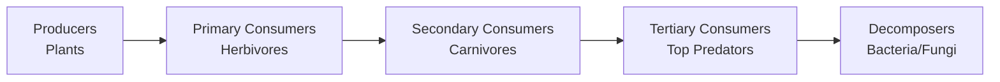
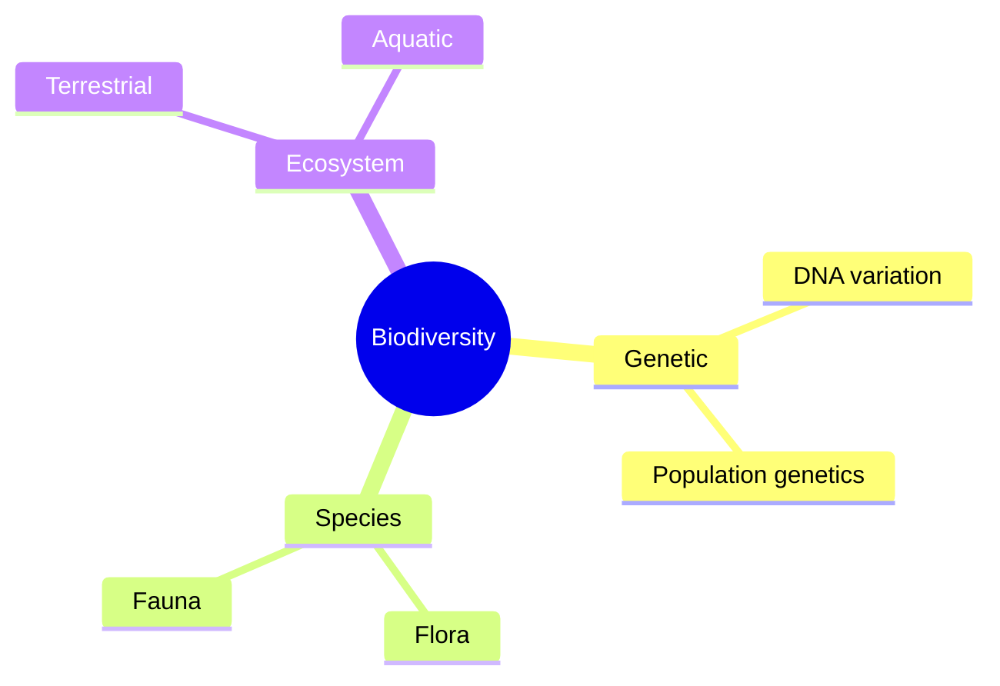
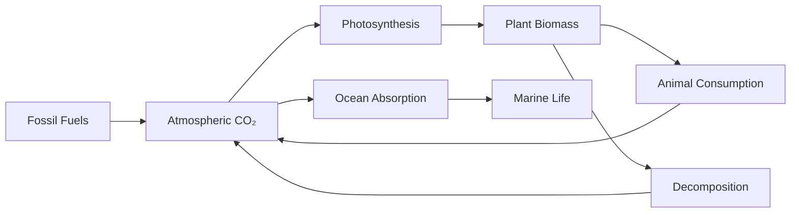
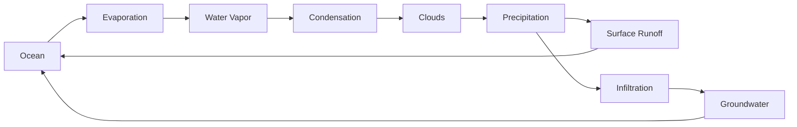
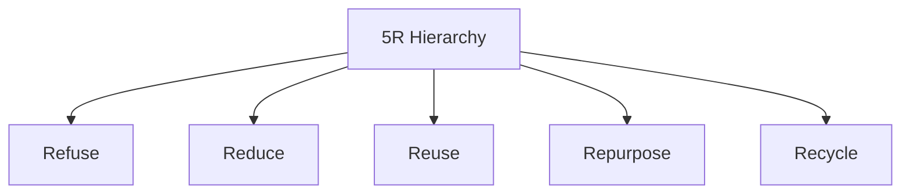

## Question 1 (Any Seven) [14 marks]

### 1. **Define the terms: 'Ecology' and 'Ecosystem'.**

**Answer:**
**Ecology** is the scientific study of relationships between living organisms and their environment. **Ecosystem** is a biological community of interacting organisms and their physical environment functioning as a unit.

**Table:**

| Term | Definition | Example |
|------|------------|---------|
| Ecology | Study of organism-environment relationships | Forest ecology |
| Ecosystem | Living and non-living components interaction | Pond ecosystem |

- **Biotic components**: Living organisms in the system
- **Abiotic components**: Non-living factors like air, water, soil

**Mnemonic:** "Every Component Lives Together" (Ecology Creates Living Together)

### 2. **Define the terms: 'Pollution' and 'Pollutant'.**

**Answer:**
**Pollution** is the introduction of harmful substances into the environment causing adverse effects. **Pollutant** is any substance that causes pollution when present in excessive amounts.

**Table:**

| Term | Definition | Types |
|------|------------|-------|
| Pollution | Environmental contamination | Air, Water, Soil, Noise |
| Pollutant | Harmful substance | Physical, Chemical, Biological |

- **Primary pollutants**: Directly emitted substances
- **Secondary pollutants**: Formed by reactions in atmosphere

**Mnemonic:** "Pollution Produces Problems" (Pollutants Produce Problems)

### 3. **What is noise pollution? What is unit of intensity of sound?**

**Answer:**
**Noise pollution** is unwanted or excessive sound that disrupts human activities and harms living beings. The unit of sound intensity is **decibel (dB)**.

**Table:**

| Sound Level | Source | Effect |
|-------------|--------|--------|
| 30-40 dB | Library | Comfortable |
| 60-70 dB | Traffic | Annoying |
| 90+ dB | Industry | Harmful |

- **Threshold of hearing**: 0 dB
- **Threshold of pain**: 120 dB

**Mnemonic:** "Decibels Determine Damage" (dB Determines Damage)

### 4. **What is solid waste management? Give its objectives.**

**Answer:**
**Solid waste management** is systematic handling of waste from generation to final disposal to minimize environmental impact and protect public health.

**Objectives:**

- **Public health protection**: Prevent disease transmission
- **Environmental protection**: Reduce pollution and contamination
- **Resource recovery**: Recycle and reuse materials
- **Cost effectiveness**: Economic waste handling

**Mnemonic:** "People Expect Resource Conservation" (Protection, Environment, Resource, Cost)

### 5. **Enlist types of solar cells.**

**Answer:**
Solar cells convert sunlight directly into electricity through photovoltaic effect.

**Table:**

| Type | Efficiency | Cost | Application |
|------|------------|------|-------------|
| Monocrystalline | 15-20% | High | Residential |
| Polycrystalline | 13-16% | Medium | Commercial |
| Thin Film | 7-13% | Low | Large scale |

- **Silicon-based**: Most common type
- **Non-silicon**: Emerging technologies

**Mnemonic:** "Most People Think" (Mono, Poly, Thin-film)

### 6. **What is climate change?**

**Answer:**
**Climate change** refers to long-term shifts in global temperatures and weather patterns, primarily caused by human activities and greenhouse gas emissions.

**Causes:**

- **Greenhouse gases**: CO₂, CH₄, N₂O emissions
- **Deforestation**: Reduced carbon absorption
- **Industrial activities**: Fossil fuel burning

**Effects:**

- **Rising temperatures**: Global warming
- **Sea level rise**: Melting ice caps

**Mnemonic:** "Change Creates Consequences" (Climate Change Creates Consequences)

### 7. **What is C.F.C?**

**Answer:**
**CFC (Chlorofluorocarbon)** are synthetic compounds containing carbon, fluorine, and chlorine atoms, previously used in refrigeration and aerosols.

**Properties:**

- **Ozone depleting**: Destroys stratospheric ozone
- **Greenhouse gas**: Contributes to global warming
- **Stable compounds**: Long atmospheric lifetime
- **Montreal Protocol**: International ban agreement

**Mnemonic:** "Chlorine Fluorine Carbon" (CFC components)

### 8. **Give advantages of ISO-14000.**

**Answer:**
**ISO 14000** is international standard for environmental management systems.

**Advantages:**

- **Environmental compliance**: Meet legal requirements
- **Cost reduction**: Efficient resource use
- **Market advantage**: Enhanced company image
- **Risk management**: Prevent environmental incidents

**Table:**

| Benefit | Impact | Result |
|---------|---------|---------|
| Compliance | Legal safety | Avoid penalties |
| Efficiency | Resource saving | Cost reduction |
| Image | Market position | Competitive advantage |

**Mnemonic:** "Companies Gain Market Recognition" (Compliance, Cost, Market, Risk)

### 9. **Enlist various Acts related to environment in India.**

**Answer:**
India has comprehensive environmental legislation framework.

**Major Acts:**

- **Air Act (1981)**: Air pollution control
- **Water Act (1974)**: Water pollution prevention
- **Environment Protection Act (1986)**: Comprehensive environmental law
- **Wildlife Protection Act (1972)**: Biodiversity conservation
- **Forest Conservation Act (1980)**: Forest protection

**Mnemonic:** "All Water Environments Wildlife Forests" (AWEWF)

### 10. **Enlist various methods of rainwater harvesting.**

**Answer:**
**Rainwater harvesting** collects and stores rainwater for future use.

**Methods:**

- **Rooftop harvesting**: Direct collection from roofs
- **Surface runoff harvesting**: From ground surfaces
- **Recharge pits**: Groundwater recharging
- **Check dams**: Stream water collection

**Table:**

| Method | Application | Benefit |
|--------|-------------|---------|
| Rooftop | Urban areas | Direct use |
| Surface | Rural areas | Large volume |
| Recharge | Water table | Groundwater |

**Mnemonic:** "Roofs Surface Recharge Check" (RSRC)

## Question 2(a) [3 marks]

### **Write short note on: Food chain.**

**Answer:**
**Food chain** represents the flow of energy and nutrients through different trophic levels in an ecosystem.



- **Energy transfer**: Only 10% passes to next level
- **Biomass pyramid**: Decreases at higher levels

**Mnemonic:** "Plants Provide Primary Power" (Producer to Predator Path)

### OR

### **Explain factors affecting ecosystem.**

**Answer:**
Ecosystems are influenced by various biotic and abiotic factors.

**Factors:**

- **Climate factors**: Temperature, rainfall, humidity
- **Soil factors**: pH, nutrients, texture
- **Biotic factors**: Species interactions, population density
- **Human factors**: Pollution, habitat destruction

**Table:**

| Factor Type | Components | Impact |
|-------------|------------|--------|
| Abiotic | Climate, Soil | Habitat conditions |
| Biotic | Organisms | Species interactions |
| Anthropogenic | Human activities | Ecosystem disruption |

**Mnemonic:** "Climate Soil Biology Humans" (CSBH)

## Question 2(b) [3 marks]

### **Write short note on: Virtual water**

**Answer:**
**Virtual water** is the hidden water used in production of goods and services, representing total water consumption in supply chain.

**Examples:**

- **1 kg wheat**: 1,300 liters virtual water
- **1 kg beef**: 15,400 liters virtual water
- **1 cotton t-shirt**: 2,700 liters virtual water

- **Water footprint**: Total virtual water consumption
- **Trade implications**: Water-rich countries export virtual water

**Mnemonic:** "Virtual Water Worldwide" (VWW)

### OR

### **What is biodiversity? Give its types.**

**Answer:**
**Biodiversity** is the variety of life forms at genetic, species, and ecosystem levels on Earth.

**Types:**

- **Genetic diversity**: Variation within species
- **Species diversity**: Number of different species
- **Ecosystem diversity**: Variety of habitats and communities



**Mnemonic:** "Genes Species Ecosystems" (GSE)

## Question 2(c) [4 marks]

### **Explain: Carbon cycle**

**Answer:**
**Carbon cycle** describes the movement of carbon through Earth's atmosphere, land, water, and organisms.



**Processes:**

- **Photosynthesis**: CO₂ absorption by plants
- **Respiration**: CO₂ release by organisms
- **Decomposition**: Carbon return to atmosphere
- **Ocean exchange**: CO₂ dissolution in seawater

**Mnemonic:** "Plants Breathe, Die, Ocean" (PBDO)

### OR

### **Draw and explain the hydrologic cycle**

**Answer:**
**Hydrologic cycle** is the continuous movement of water through atmosphere, land, and oceans.



**Processes:**

- **Evaporation**: Water to vapor conversion
- **Condensation**: Vapor to liquid conversion
- **Precipitation**: Rain, snow formation
- **Infiltration**: Groundwater recharge

**Mnemonic:** "Every Cloud Produces Rain" (ECPR)

## Question 2(d) [4 marks]

### **Enlist equipments used to control air pollution and explain any one.**

**Answer:**
Air pollution control equipment removes pollutants from industrial emissions.

**Equipment List:**

- **Cyclone separators**: Particulate removal
- **Electrostatic precipitators**: Fine particle collection
- **Bag filters**: Fabric filtration
- **Scrubbers**: Gas absorption

**Electrostatic Precipitator:**

```goat
   +----------+
   |    +     |  High voltage electrode
   |    |     |
   |    v     |
   |  Dust    |  Charged particles
   |  +-+-+   |
   |  |   |   |
   |  v   v   |
   +--+---+---+  Collection plate (-)
      Clean gas out
```

- **Charging**: Particles acquire electric charge
- **Collection**: Charged particles attracted to plates
- **Efficiency**: 99% removal of fine particles

**Mnemonic:** "Charge Collect Clean" (CCC)

### OR

### **Enlist the types of environmental pollution and give the effects of noise pollution**

**Answer:**
**Environmental pollution types:**

- **Air pollution**: Atmospheric contamination
- **Water pollution**: Aquatic contamination
- **Soil pollution**: Land contamination
- **Noise pollution**: Sound contamination

**Noise Pollution Effects:**

- **Health effects**: Hearing loss, stress, hypertension
- **Psychological effects**: Irritation, sleep disturbance
- **Performance effects**: Reduced concentration, productivity
- **Communication effects**: Speech interference

**Table:**

| Effect Type | Symptoms | Impact |
|-------------|----------|--------|
| Physical | Hearing damage | Permanent loss |
| Mental | Stress, anxiety | Health issues |
| Social | Communication problems | Relationship strain |

**Mnemonic:** "Air Water Soil Sound" (AWSS)

## Question 3(a) [3 marks]

### **What is e-waste? Give effects of e-waste on environment and humans.**

**Answer:**
**E-waste** (Electronic waste) consists of discarded electrical and electronic devices containing hazardous materials.

**Environmental Effects:**

- **Soil contamination**: Heavy metals leaching
- **Water pollution**: Toxic chemical runoff
- **Air pollution**: Burning releases toxic fumes

**Human Effects:**

- **Health hazards**: Lead, mercury poisoning
- **Respiratory problems**: Toxic gas inhalation
- **Skin disorders**: Direct contact with chemicals

**Table:**

| Component | Hazard | Impact |
|-----------|--------|--------|
| Lead | Neurotoxin | Brain damage |
| Mercury | Toxic metal | Kidney damage |
| Cadmium | Carcinogen | Cancer risk |

**Mnemonic:** "Electronic Equipment Endangers Everyone" (E4)

### OR

### **What is plastic waste? Give effects of plastic waste.**

**Answer:**
**Plastic waste** consists of discarded plastic materials that persist in environment due to non-biodegradable nature.

**Effects:**

- **Marine pollution**: Ocean plastic accumulation
- **Wildlife impact**: Entanglement, ingestion by animals
- **Soil degradation**: Reduced fertility and water infiltration
- **Human health**: Microplastics in food chain

**Categories:**

- **Single-use plastics**: Bags, bottles, straws
- **Packaging waste**: Food containers, wrappings
- **Industrial plastic**: Manufacturing waste

**Mnemonic:** "Plastic Persists, Problems Persist" (PPPP)

## Question 3(b) [3 marks]

### **Give main sources of solid waste.**

**Answer:**
**Solid waste** originates from various human activities and natural processes.

**Sources:**

- **Residential**: Household garbage, food waste
- **Commercial**: Office waste, packaging materials
- **Industrial**: Manufacturing waste, chemicals
- **Agricultural**: Crop residues, animal waste
- **Municipal**: Street sweeping, park maintenance

**Table:**

| Source | Waste Type | Management |
|--------|------------|------------|
| Domestic | Organic, Plastic | Collection |
| Industrial | Hazardous, Non-hazardous | Treatment |
| Agricultural | Biodegradable | Composting |

**Mnemonic:** "Residential Commercial Industrial Agricultural Municipal" (RCIAM)

### OR

### **Enlist various methods of solid waste disposal and explain any one.**

**Answer:**
**Disposal Methods:**

- **Landfilling**: Controlled waste burial
- **Incineration**: Waste burning with energy recovery
- **Composting**: Organic waste decomposition
- **Recycling**: Material recovery and reuse

**Sanitary Landfill:**

```goat
    Daily cover
    +----------+
    |  Waste   |  Compacted layers
    +----------+  
    |   Clay   |  Liner system
    +----------+
    | Drainage |  Leachate collection
    +----------+
```

- **Design**: Engineered system with liners
- **Operation**: Daily cover, compaction
- **Environmental protection**: Leachate and gas control

**Mnemonic:** "Land Incinerate Compost Recycle" (LICR)

## Question 3(c) [4 marks]

### **Explain the working of Liquid Flat Plate Collector with a neat sketch.**

**Answer:**
**Liquid Flat Plate Collector** converts solar radiation into thermal energy for heating water.

```goat
    Glass cover
    +================+
    |  ~~~~~~~~~~~~  |  Air gap
    +================+
    |  ||||||||||||  |  Absorber plate (black)
    |  [----------]  |  Fluid tubes
    +================+
    |  Insulation    |  Back insulation
    +================+
         ^      ^
    Cold water  Hot water
    inlet       outlet
```

**Working:**

- **Solar absorption**: Black absorber plate captures solar energy
- **Heat transfer**: Absorbed heat transfers to flowing liquid
- **Circulation**: Heated liquid rises, cool liquid enters
- **Insulation**: Minimizes heat losses

**Components:**

- **Transparent cover**: Reduces convection losses
- **Absorber plate**: Maximum solar absorption
- **Heat transfer fluid**: Water or antifreeze solution

**Mnemonic:** "Solar Absorption Creates Heat Transfer" (SACHT)

### OR

### **Write short note on solar pond**

**Answer:**
**Solar pond** is a pool of saltwater that acts as both solar collector and thermal storage system.

**Structure:**

- **Upper zone**: Low salt concentration
- **Middle zone**: Increasing salt gradient
- **Lower zone**: High salt concentration

**Working:**

- **Density gradient**: Prevents convection mixing
- **Heat storage**: Bottom layer stores thermal energy
- **Temperature**: Can reach 70-85°C at bottom

**Applications:**

- **Power generation**: Steam production
- **Industrial heating**: Process heat supply
- **Desalination**: Water purification

**Mnemonic:** "Salt Stores Solar Thermal" (SSST)

## Question 3(d) [4 marks]

### **Explain Savonious wind mill with a neat sketch.**

**Answer:**
**Savonius wind turbine** is a vertical axis wind turbine with S-shaped rotor blades.

```goat
    Wind direction →
           |
       +-------+
       |   S   |  S-shaped blade
       |  ---  |  
       |       |
       +-------+
           |
       Generator
```

**Working:**

- **Drag principle**: Wind creates differential drag on blades
- **Rotation**: S-shape causes continuous rotation
- **Self-starting**: Starts at low wind speeds
- **Vertical axis**: Independent of wind direction

**Advantages:**

- **Simple design**: Low maintenance requirements
- **Low noise**: Quiet operation
- **All wind directions**: Omnidirectional capability

**Disadvantages:**

- **Lower efficiency**: 20-30% compared to HAWT
- **Space requirement**: Larger area needed

**Mnemonic:** "S-Shape Starts Slowly" (SSS)

### OR

### **Give the comparison between Horizontal Axis and Vertical Axis wind mills.**

**Answer:**
Wind turbines are classified based on rotor axis orientation.

**Comparison Table:**

| Parameter | Horizontal Axis (HAWT) | Vertical Axis (VAWT) |
|-----------|------------------------|----------------------|
| Efficiency | 35-45% | 20-30% |
| Wind direction | Must face wind | Any direction |
| Installation | Tower required | Ground level possible |
| Maintenance | Difficult access | Easy access |
| Noise | Higher | Lower |
| Cost | Higher | Lower |

**HAWT Features:**

- **Upwind design**: Rotor faces wind
- **Pitch control**: Blade angle adjustment
- **Yaw system**: Wind direction tracking

**VAWT Features:**

- **Omnidirectional**: No wind tracking needed
- **Ground installation**: Easier maintenance
- **Lower wind speeds**: Better performance

**Mnemonic:** "Horizontal High, Vertical Versatile" (HHVV)

## Question 4(a) [3 marks]

### **Give effects of climate change.**

**Answer:**
**Climate change** causes widespread environmental and socio-economic impacts globally.

**Environmental Effects:**

- **Temperature rise**: Global average increase
- **Sea level rise**: Thermal expansion and ice melting
- **Weather extremes**: Intense storms, droughts, floods
- **Ecosystem shifts**: Species migration and extinction

**Socio-economic Effects:**

- **Agricultural impact**: Crop yield changes
- **Water resources**: Availability and quality issues
- **Human health**: Heat stress, disease spread
- **Economic losses**: Infrastructure damage

**Table:**

| Impact Category | Examples | Severity |
|-----------------|----------|----------|
| Environmental | Melting glaciers | High |
| Agricultural | Crop failure | Medium |
| Health | Heat waves | High |

**Mnemonic:** "Temperature Sea Weather Ecosystem" (TSWE)

### OR

### **Write a short note on Green House gases.**

**Answer:**
**Greenhouse gases** trap heat in Earth's atmosphere, causing global warming through greenhouse effect.

**Major Greenhouse Gases:**

- **Carbon dioxide (CO₂)**: 76% of emissions
- **Methane (CH₄)**: 16% of emissions
- **Nitrous oxide (N₂O)**: 6% of emissions
- **Fluorinated gases**: 2% of emissions

**Sources:**

- **CO₂**: Fossil fuel burning, deforestation
- **CH₄**: Agriculture, landfills, livestock
- **N₂O**: Fertilizers, fossil fuel combustion

**Global Warming Potential:**

- **CO₂**: Reference (GWP = 1)
- **CH₄**: 25 times CO₂
- **N₂O**: 298 times CO₂

**Mnemonic:** "Carbon Methane Nitrous Fluorine" (CMNF)

## Question 4(b) [4 marks]

### **Explain climate change Management.**

**Answer:**
**Climate change management** involves strategies to reduce greenhouse gas emissions and adapt to climate impacts.

**Mitigation Strategies:**

- **Renewable energy**: Solar, wind, hydroelectric power
- **Energy efficiency**: Improved building designs, LED lighting
- **Carbon sequestration**: Forest conservation, tree planting
- **Sustainable transport**: Electric vehicles, public transport

**Adaptation Strategies:**

- **Infrastructure resilience**: Flood defenses, drought-resistant crops
- **Water management**: Rainwater harvesting, efficient irrigation
- **Coastal protection**: Sea walls, mangrove restoration
- **Emergency preparedness**: Early warning systems

**Policy Measures:**

- **Carbon pricing**: Tax on emissions
- **Renewable energy targets**: Clean energy goals
- **Building codes**: Energy efficiency standards

**Mnemonic:** "Mitigation Adaptation Policy" (MAP)

### OR

### **Give effects of ozone layer depletion.**

**Answer:**
**Ozone layer depletion** reduces stratospheric ozone, allowing harmful UV radiation to reach Earth.

**Effects on Humans:**

- **Skin cancer**: Increased UV-B radiation exposure
- **Eye cataracts**: UV damage to eye lens
- **Immune suppression**: Weakened immune system
- **Premature aging**: Skin damage acceleration

**Effects on Environment:**

- **Crop damage**: Reduced agricultural productivity
- **Marine ecosystem**: Phytoplankton reduction
- **Material degradation**: Plastic and rubber damage
- **Climate change**: Ozone as greenhouse gas

**Table:**

| UV Type | Wavelength | Effect |
|---------|------------|--------|
| UV-A | 320-400 nm | Skin aging |
| UV-B | 280-320 nm | Sunburn, cancer |
| UV-C | 200-280 nm | Blocked by ozone |

**Mnemonic:** "Skin Eyes Immunity Climate" (SEIC)

## Question 4(c) [7 marks]

### **Explain biogas plant with sketch.**

**Answer:**
**Biogas plant** produces methane-rich gas through anaerobic digestion of organic waste.

```goat
         Gas outlet
             |
    +----------------+
    |    Gas dome    |  Gas collection
    +----------------+
    |                |
    |   Slurry       |  Digester tank
    |  (Anaerobic)   |  
    |                |
    +-------+--------+
    Inlet   |        Outlet
    pipe    |        pipe
           /|\
          / | \
       Waste  Slurry
       input  outlet
```

**Components:**

- **Digester tank**: Anaerobic fermentation chamber
- **Gas dome**: Biogas collection and storage
- **Inlet pipe**: Waste material feeding
- **Outlet pipe**: Digested slurry removal

**Process:**

- **Hydrolysis**: Complex organics break down
- **Acidogenesis**: Acid-forming bacteria action
- **Methanogenesis**: Methane-producing bacteria
- **Gas production**: 50-70% methane, 30-40% CO₂

**Operating Conditions:**

- **Temperature**: 30-40°C optimal
- **pH**: 6.8-7.2 range
- **Retention time**: 15-30 days
- **C:N ratio**: 20-30:1 optimal

**Applications:**

- **Cooking fuel**: Household energy needs
- **Lighting**: Gas lamp illumination
- **Electricity**: Generator power
- **Fertilizer**: Nutrient-rich slurry

**Advantages:**

- **Renewable energy**: Sustainable fuel source
- **Waste management**: Organic waste utilization
- **Environmental benefits**: Reduced methane emissions
- **Economic benefits**: Cost savings on fuel

**Mnemonic:** "Biogas Benefits: Renewable Waste Environment Economy" (BRWEE)

## Question 5(a) [4 marks]

### **Write short note on global warming.**

**Answer:**
**Global warming** refers to long-term increase in Earth's average surface temperature due to human activities.

**Causes:**

- **Greenhouse gases**: CO₂, CH₄, N₂O emissions
- **Deforestation**: Reduced carbon absorption
- **Industrial activities**: Fossil fuel combustion
- **Transportation**: Vehicle emissions

**Effects:**

- **Temperature rise**: 1.1°C since pre-industrial times
- **Ice melting**: Arctic sea ice, glaciers shrinking
- **Sea level rise**: Coastal flooding threat
- **Weather changes**: Extreme events frequency

**Evidence:**

- **Temperature records**: Warmest years in recent decades
- **Ice core data**: Historical CO₂ levels
- **Satellite measurements**: Global temperature monitoring

**Solutions:**

- **Renewable energy**: Clean power sources
- **Energy efficiency**: Reduced consumption
- **Carbon capture**: Technology development
- **International cooperation**: Paris Agreement

**Mnemonic:** "Greenhouse Gases Generate Global Change" (GGGC)

## Question 5(b) [4 marks]

### **Explain 5R concept.**

**Answer:**
**5R concept** is waste management hierarchy for sustainable resource utilization.



**The 5 R's:**

**1. Refuse:**

- **Avoid unnecessary items**: Say no to single-use products
- **Examples**: Plastic bags, straws, excessive packaging

**2. Reduce:**

- **Minimize consumption**: Use less resources
- **Examples**: Energy conservation, water saving

**3. Reuse:**

- **Multiple use**: Extend product life
- **Examples**: Glass jars as containers, paper both sides

**4. Repurpose:**

- **Creative reuse**: New function for old items
- **Examples**: Tire planters, bottle bird feeders

**5. Recycle:**

- **Material recovery**: Process into new products
- **Examples**: Paper, plastic, metal recycling

**Benefits:**

- **Waste reduction**: Less landfill burden
- **Resource conservation**: Natural resource preservation
- **Cost savings**: Economic benefits
- **Environmental protection**: Pollution reduction

**Mnemonic:** "Refuse Reduce Reuse Repurpose Recycle" (R5)

## Question 5(c) [3 marks]

### **Explain the benefits of Green building.**

**Answer:**
**Green building** incorporates sustainable design and construction practices for environmental and human benefits.

**Environmental Benefits:**

- **Energy efficiency**: Reduced power consumption
- **Water conservation**: Efficient water systems
- **Waste reduction**: Construction and operational waste minimization

**Economic Benefits:**

- **Operating cost savings**: Lower utility bills
- **Increased property value**: Market premium
- **Tax incentives**: Government rebates

**Health Benefits:**

- **Indoor air quality**: Better ventilation systems
- **Natural lighting**: Improved occupant comfort
- **Toxic material reduction**: Healthier environment

**Table:**

| Benefit Type | Examples | Impact |
|--------------|----------|--------|
| Environmental | Energy saving | 30-50% reduction |
| Economic | Cost savings | 20% operating costs |
| Health | Air quality | Productivity increase |

**Mnemonic:** "Green Buildings Give Environmental Economic Health" (GBEEH)

## Question 5(d) [3 marks]

### **Enlist various Acts related to environment in India and explain any one.**

**Answer:**
**Environmental Acts in India:**

- **Water (Prevention and Control of Pollution) Act, 1974**
- **Air (Prevention and Control of Pollution) Act, 1981**
- **Environment Protection Act, 1986**
- **Wildlife Protection Act, 1972**
- **Forest (Conservation) Act, 1980**
- **Biodiversity Act, 2002**

**Environment Protection Act, 1986:**
**Objectives:**

- **Comprehensive framework**: Overall environmental protection
- **Pollution prevention**: Air, water, soil contamination control
- **Standard setting**: Environmental quality standards
- **Enforcement**: Penalties for violations

**Powers:**

- **Central government authority**: Environmental regulations
- **Inspection rights**: Industrial facilities monitoring
- **Closure orders**: Non-compliant industries
- **Emergency measures**: Environmental hazards response

**Significance:**

- **Umbrella legislation**: Covers all environmental aspects
- **Post-Bhopal disaster**: Response to industrial accidents

**Mnemonic:** "Water Air Environment Wildlife Forest Biodiversity" (WAEWFB)
