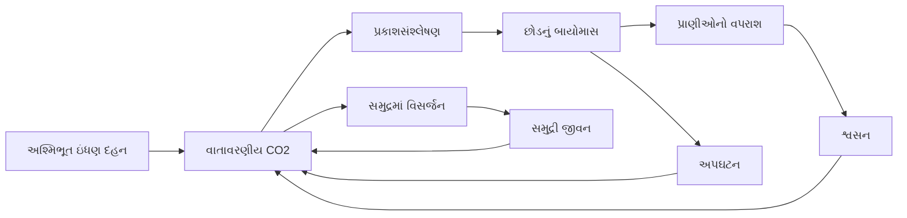
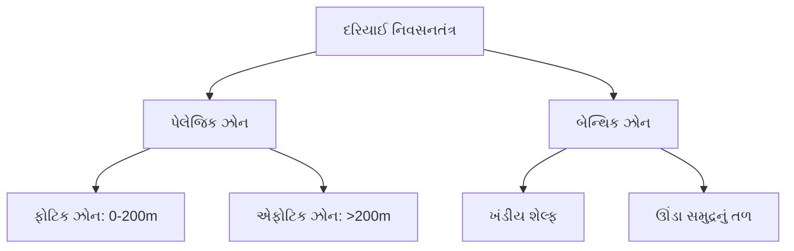
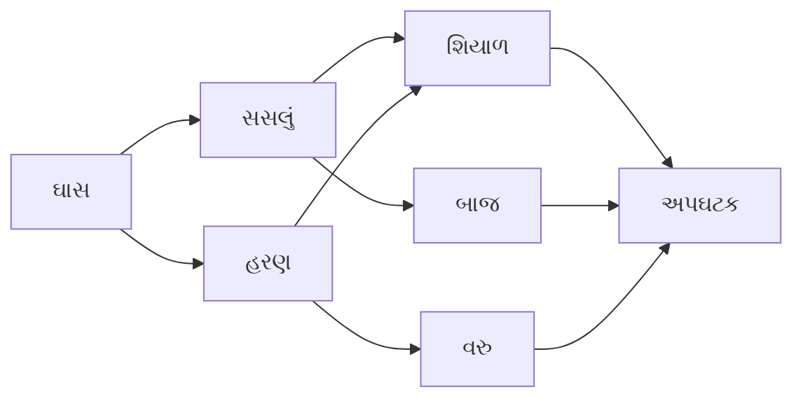
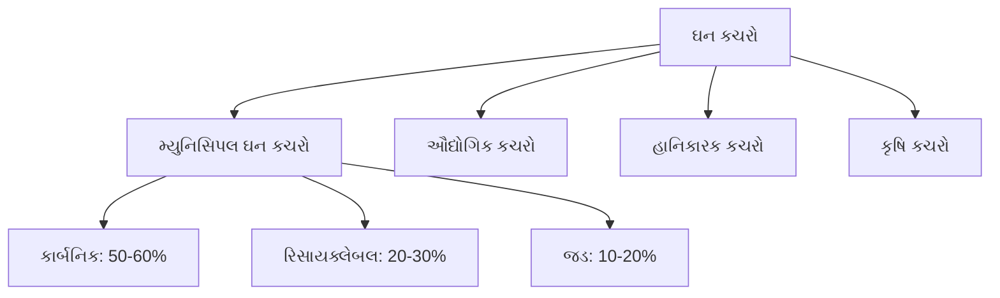
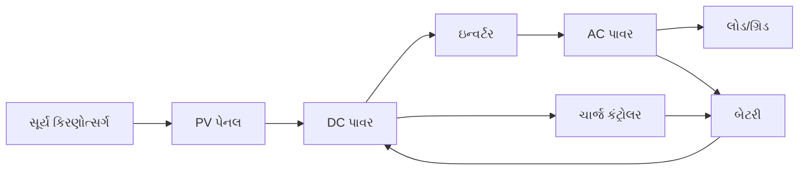
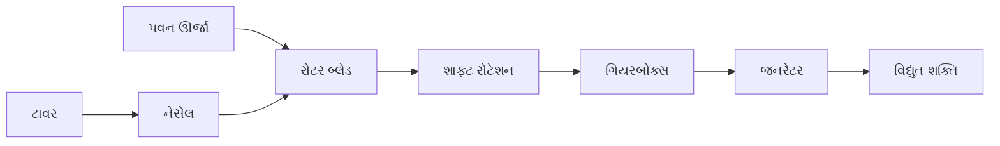
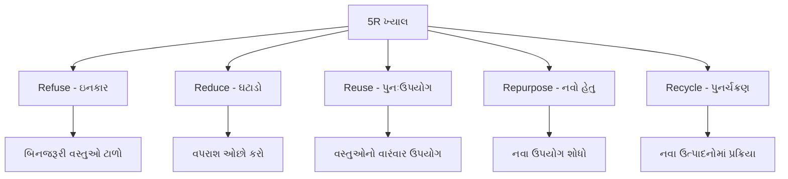
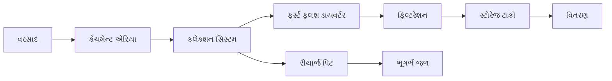

## પ્રશ્ન 1(a) [3 ગુણ]

**વૈશ્વિક પર્યાવરણીય ઉછાળ ક્યારે થાય છે? કારણો સાથે સમજાવો.**

**જવાબ**:

**કોષ્ટક: પર્યાવરણીય ઉછાળની શરતો**

| શરત | વર્ણન | અસર |
|-----|-------|-----|
| સંસાધન ઘટાડો | વપરાશ પુનઃજનન દર કરતા વધારે | ખાધ સંચય |
| વસ્તી દબાણ | માનવ માંગ વહન ક્ષમતા કરતા વધારે | સંસાધન અછત |
| કચરાનો સંગ્રહ | ઉત્પાદન શોષણ ક્ષમતા કરતા વધારે | પર્યાવરણ અધોગતિ |

**પર્યાવરણીય ઉછાળ** ત્યારે થાય છે જ્યારે માનવતાનું પર્યાવરણીય પદચિહ્ન પૃથ્વીની જૈવિક ક્ષમતા કરતા વધી જાય છે.

**મુખ્ય કારણો**:

- **વસ્તી વૃદ્ધિ**: માનવ સંખ્યામાં વધારો
- **વપરાશની પદ્ધતિ**: વ્યક્તિ દીઠ ઊંચો સંસાધન ઉપયોગ
- **ટેકનોલોજીની અસર**: બિનકાર્યક્ષમ સંસાધન ઉપયોગ

**યાદશક્તિ સૂત્ર**: "POP-CON-TECH" (Population-Consumption-Technology)

## પ્રશ્ન 1(b) [4 ગુણ]

**આકૃતિની મદદથી પોષણ કડી સમજાવો.**

**જવાબ**:


**પોષણ કડી** એ ઇકોસિસ્ટમમાં એક ટ્રોફિક સ્તરથી બીજા સ્તરમાં ઉર્જા સ્થાનાંતરણનો રેખીય ક્રમ દર્શાવે છે.

**ઘટકો**:

- **ઉત્પાદકો**: સૂર્ય ઉર્જાને રાસાયણિક ઉર્જામાં રૂપાંતરિત કરે છે
- **પ્રાથમિક ઉપભોક્તા**: ઉત્પાદકોને ખાય છે (શાકાહારી)
- **ગૌણ ઉપભોક્તા**: પ્રાથમિક ઉપભોક્તાને ખાય છે (માંસાહારી)
- **અપઘટક**: મૃત જીવોને વિઘટિત કરે છે

**ઉર્જા પ્રવાહ**: સૂર્યથી ટોચના શિકારી સુધી એક દિશામાં 10% કાર્યક્ષમતા સાથે.

**યાદશક્તિ સૂત્ર**: "PPSD" (Producer-Primary-Secondary-Decomposer)

## પ્રશ્ન 1(c) [7 ગુણ]

**કાર્બન ચક્ર પર ટૂંકી નોંધ લખો.**

**જવાબ**:



**કાર્બન ચક્ર** એ જૈવ-ભૂ-રાસાયણિક પ્રક્રિયા છે જેમાં કાર્બન વાતાવરણ, જીવમંડળ, જળમંડળ અને ભૂમંડળમાં ફરે છે.

**મુખ્ય પ્રક્રિયાઓ**:

- **પ્રકાશસંશ્લેષણ**: છોડ વાતાવરણમાંથી CO2 શોષે છે
- **શ્વસન**: જીવો CO2 પાછું વાતાવરણમાં છોડે છે
- **અપઘટન**: મૃત કાર્બનિક પદાર્થ સંગ્રહિત કાર્બન મુક્ત કરે છે
- **સમુદ્રી વિનિમય**: CO2 સમુદ્રના પાણીમાં ઓગળીને કાર્બોનિક એસિડ બનાવે છે

**માનવીય પ્રભાવ**:

- **અશ્મિભૂત ઇંધણ દહન**: વાતાવરણીય CO2 વધારે છે
- **વનનાશ**: કાર્બન પ્રતિબંધની ક્ષમતા ઘટાડે છે
- **ઔદ્યોગિક પ્રક્રિયાઓ**: વધારાના કાર્બન ઉત્સર્જન

**પર્યાવરણીય મહત્વ**: વાતાવરણીય CO2 સંતુલન જાળવે છે, વૈશ્વિક તાપમાન નિયંત્રિત કરે છે, જીવન પ્રક્રિયાઓને આધાર આપે છે.

**યાદશક્તિ સૂત્ર**: "PRDO-FDI" (Photosynthesis-Respiration-Decomposition-Ocean, Fossil-Deforestation-Industry)

## પ્રશ્ન 1(c) અથવા [7 ગુણ]

**જળીય નિવસનતંત્રનું વર્ગીકરણ કરો. દરિયાઈ નિવસનતંત્ર સમજાવો.**

**જવાબ**:

**કોષ્ટક: જળીય નિવસનતંત્ર વર્ગીકરણ**

| પ્રકાર | લાક્ષણિકતાઓ | ઉદાહરણો |
|------|-------------|---------|
| તાજા પાણીનું | ઓછું મીઠું (<1%) | નદીઓ, તળાવો, તાલાવો |
| દરિયાઈ | વધારે મીઠું (3.5%) | મહાસાગરો, સમુદ્રો |
| ખારા | મિશ્રિત તાજા-ખારા પાણી | નદીમુખો, લગૂન |

**દરિયાઈ નિવસનતંત્રના ઘટકો**:



**દરિયાઈ નિવસનતંત્ર** પૃથ્વીની સપાટીના 71% ભાગને આવરી લે છે, જેમાં જટિલ ખાદ્ય જાળ સાથે ખારા પાણીના મોટા વિસ્તારો છે.

**ઝોન**:

- **પેલેજિક**: ખુલ્લા પાણીનો સ્તંભ જેમાં પ્લાન્કટન, માછલીઓ
- **બેન્થિક**: સમુદ્રનું તળ જેમાં તળિયે રહેતા જીવો
- **આંતરજોવારી**: ભરતી-ઓટના વચ્ચેનો કિનારાનો વિસ્તાર

**મહત્વ**:

- **આબોહવા નિયંત્રણ**: સમુદ્રી પ્રવાહો વૈશ્વિક તાપમાન નિયંત્રિત કરે છે
- **ઓક્સિજન ઉત્પાદન**: દરિયાઈ ફાયટોપ્લાન્કટન વાતાવરણીય ઓક્સિજનના 50% ઉત્પાદન કરે છે
- **આર્થિક મૂલ્ય**: મત્સ્યવ્યવસાય, પરિવહન, પર્યટન

**યાદશક્તિ સૂત્ર**: "PBI-COE" (Pelagic-Benthic-Intertidal, Climate-Oxygen-Economy)

## પ્રશ્ન 2(a) [3 ગુણ]

**પૃથ્વીની વહન ક્ષમતા એટલે શું?**

**જવાબ**:

**કોષ્ટક: વહન ક્ષમતાના કારકો**

| કારક | વર્ણન | મર્યાદા |
|------|-------|---------|
| સંસાધનો | ઉપલબ્ધ જમીન, પાણી, ખનિજો | મર્યાદિત |
| ખાદ્ય ઉત્પાદન | કૃષિ ક્ષમતા | માટી દ્વારા મર્યાદિત |
| કચરા શોષણ | ઇકોસિસ્ટમની કચરા પ્રક્રિયા | સંતૃપ્તિ બિંદુ |

**વહન ક્ષમતા** એ પર્યાવરણને અધોગતિ કર્યા વિના અનિશ્ચિત સમય સુધી ટકાવી શકાય તેવી મહત્તમ વસ્તી માપ છે.

**પૃથ્વીની વહન ક્ષમતા** આ પર આધાર રાખે છે:

- **સંસાધન ઉપલબ્ધતા**: તાજું પાણી, ખેતીલાયક જમીન, ઉર્જા સ્રોતો
- **ટેકનોલોજી સ્તર**: સંસાધન ઉપયોગની કાર્યક્ષમતા
- **વપરાશની પદ્ધતિ**: વ્યક્તિ દીઠ સંસાધન માંગ

**વર્તમાન અંદાજ**: વપરાશ સ્તર અને તકનીકી પ્રગતિના આધારે 4-16 અબજ લોકો.

**યાદશક્તિ સૂત્ર**: "RTC" (Resources-Technology-Consumption)

## પ્રશ્ન 2(b) [4 ગુણ]

**આહાર જાળ એ પોષણ કડી સાથે કેવી રીતે સંબંધિત છે?**

**જવાબ**:



**આહાર જાળ** એ ઇકોસિસ્ટમમાં જટિલ ખાદ્ય સંબંધો દર્શાવતા બહુવિધ પોષણ કડીઓનું પરસ્પર જોડાયેલું જાળ છે.

**આહાર જાળ અને પોષણ કડી વચ્ચેનો સંબંધ**:

- **પોષણ કડી**: ઉર્જા સ્થાનાંતરણનો રેખીય ક્રમ
- **આહાર જાળ**: બહુવિધ પરસ્પર જોડાયેલી પોષણ કડીઓ
- **જટિલતા**: આહાર જાળ વાસ્તવિક ઇકોસિસ્ટમ ક્રિયાપ્રતિક્રિયા દર્શાવે છે
- **સ્થિરતા**: બહુવિધ માર્ગો ઇકોસિસ્ટમ પ્રતિરોધક ક્ષમતા પ્રદાન કરે છે

**મુખ્ય તફાવતો**:

- **માળખું**: કડી રેખીય, જાળ નેટવર્ક આધારિત
- **ઉર્જા પ્રવાહ**: કડી એક માર્ગ, જાળ બહુવિધ માર્ગો
- **પ્રજાતિ ક્રિયાપ્રતિક્રિયા**: જાળ સર્વભક્ષીતા અને વૈકલ્પિક ખાદ્ય દર્શાવે છે

**યાદશક્તિ સૂત્ર**: "LNCR" (Linear-Network, Chain-Resilience)

## પ્રશ્ન 2(c) [7 ગુણ]

**હવા પ્રદૂષણ પર નોંધ લખો.**

**જવાબ**:

**કોષ્ટક: હવા પ્રદૂષણના સ્રોતો અને અસરો**

| પ્રદૂષક | સ્રોત | આરોગ્ય અસર |
|-------|------|-----------|
| PM2.5/PM10 | વાહનો, ઉદ્યોગો | શ્વસન રોગો |
| SO2 | કોલસાનું દહન | એસિડ વરસાદ, અસ્થમા |
| NOx | વાહન એક્ઝોસ્ટ | સ્મોગ રચના |
| CO | અપૂર્ણ દહન | ઓક્સિજનની ઉણપ |

**હવા પ્રદૂષણ** એ વાતાવરણમાં હાનિકારક પદાર્થોથી થતું દૂષણ છે જે માનવ આરોગ્ય અને પર્યાવરણ પર નકારાત્મક અસર કરે છે.

**સ્રોત પ્રમાણે વર્ગીકરણ**:

- **પ્રાથમિક પ્રદૂષક**: સીધું ઉત્સર્જિત (CO, SO2, કણો)
- **ગૌણ પ્રદૂષક**: રાસાયણિક પ્રતિક્રિયા દ્વારા રચાય (ઓઝોન, એસિડ વરસાદ)

**મુખ્ય સ્રોતો**:

- **ગતિશીલ સ્રોતો**: વાહનો, વિમાન, જહાજો
- **સ્થિર સ્રોતો**: પાવર પ્લાન્ટ, ઉદ્યોગો, રહેણાંક હોટિંગ
- **કુદરતી સ્રોતો**: જ્વાળામુખી વિસ્ફોટ, જંગલી આગ, ધૂળના તોફાન

**નિયંત્રણ પગલાં**:

- **તકનીકી**: કેટેલિટિક કન્વર્ટર, સ્ક્રબર, ફિલ્ટર
- **નિયમનકારી**: ઉત્સર્જન ધોરણો, ઇંધણ ગુણવત્તા નિયમો
- **વૈકલ્પિક ઊર્જા**: નવીકરણીય સ્રોતો, ઇલેક્ટ્રિક વાહનો

**આરોગ્ય અસરો**: શ્વસન રોગો, હૃદયરોગ સમસ્યાઓ, કેન્સર, આયુષ્યમાં ઘટાડો.

**પર્યાવરણીય અસરો**: એસિડ વરસાદ, ઓઝોન ઘટાડો, આબોહવા પરિવર્તન, દૃશ્યતામાં ઘટાડો.

**યાદશક્તિ સૂત્ર**: "PSMT-RE-HE" (Primary-Secondary-Mobile-stationary-Technological-Regulatory-Health-Environment)

## પ્રશ્ન 2(a) અથવા [3 ગુણ]

**પ્લાસ્ટિક કચરાની પર્યાવરણ પર ખરાબ અસરો સમજાવો.**

**જવાબ**:

**કોષ્ટક: પ્લાસ્ટિક કચરાની પર્યાવરણીય અસરો**

| અસરનું ક્ષેત્ર | અસર | સમયગાળો |
|-------------|-----|---------|
| દરિયાઈ જીવન | ફસાવટ, ગળવું | કાયમી |
| માટી | માઇક્રોપ્લાસ્ટિક દૂષણ | 500+ વર્ષો |
| ખાદ્ય શૃંખલા | બાયોએક્યુમ્યુલેશન | પેઢીદર પેઢી |

**પ્લાસ્ટિક કચરો** તેની બિન-બાયોડિગ્રેડેબલ પ્રકૃતિને કારણે ગંભીર પર્યાવરણીય અધોગતિનું કારણ બને છે.

**પર્યાવરણીય અસરો**:

- **દરિયાઈ પ્રદૂષણ**: સમુદ્રમાં પ્લાસ્ટિક દરિયાઈ પ્રાણીઓને ફસાવટ અને ગળવાથી મારી નાખે છે
- **માટી દૂષણ**: માઇક્રોપ્લાસ્ટિક માટીની ફળદ્રુપતા અને પાકની વૃદ્ધિને અસર કરે છે
- **ખાદ્ય શૃંખલા વિક્ષેપ**: પ્લાસ્ટિકના કણો જીવોમાં સંચિત થાય છે

**લાંબાગાળાની અસરો**: કાયમી કાર્બનિક પ્રદૂષક, આવાસનો વિનાશ, ઇકોસિસ્ટમ અસંતુલન.

**યાદશક્તિ સૂત્ર**: "MSF" (Marine-Soil-Foodchain)

## પ્રશ્ન 2(b) અથવા [4 ગુણ]

**દૂષિત પાણીના લક્ષણો કયા છે? જળ પ્રદૂષણના મુખ્ય સ્રોતોની યાદી બનાવો.**

**જવાબ**:

**કોષ્ટક: જળ પ્રદૂષણના સૂચકો અને સ્રોતો**

| લક્ષણો | માપન | સ્રોતો |
|-------|------|--------|
| ઊંચું BOD/COD | >5 mg/L | ઔદ્યોગિક ડિસ્ચાર્જ |
| ટર્બિડિટી | ધૂંધળાપણું | કૃષિ અપવાહ |
| pH ફેરફાર | <6.5 અથવા >8.5 | એસિડ ખાણ ડ્રેનેજ |
| દુર્ગંધ | H2S ગંધ | ગટર ડિસ્ચાર્જ |

**દૂષિત પાણીના લક્ષણો**:

- **ભૌતિક**: રંગ ફેરફાર, ટર્બિડિટી, તરતા કચરા, ગંધ
- **રાસાયણિક**: ઊંચું BOD/COD, pH વિચલન, ભારે ધાતુઓ, ઝેરી સંયોજનો
- **જૈવિક**: રોગકારક સૂક્ષ્મજીવો, એલ્ગલ બ્લૂમ, માછલીઓનું મૃત્યુ

**મુખ્ય સ્રોતો**:

- **બિંદુ સ્રોતો**: ઔદ્યોગિક ડિસ્ચાર્જ, ગટર આઉટફોલ, કેન્દ્રિત પ્રાણી ખવડાવવું
- **બિન-બિંદુ સ્રોતો**: કૃષિ અપવાહ, શહેરી વરસાદી પાણી, વાતાવરણીય નિક્ષેપ

**યાદશક્તિ સૂત્ર**: "PCB-PIN" (Physical-Chemical-Biological, Point-Non-point)

## પ્રશ્ન 2(c) અથવા [7 ગુણ]

**ઈ-કચરો શું છે? ઈ-કચરાને પુન:ઉપયોગી કેવી રીતે બનાવી શકાય?**

**જવાબ**:

**કોષ્ટક: ઈ-કચરાનું વર્ગીકરણ**

| શ્રેણી | ઉદાહરણો | હાનિકારક ઘટકો |
|------|---------|-----------------|
| મોટા ઉપકરણો | રેફ્રિજરેટર, વોશિંગ મશીન | CFCs, ભારે ધાતુઓ |
| નાના ઉપકરણો | માઇક્રોવેવ, વેક્યુમ ક્લીનર | પ્લાસ્ટિક, ધાતુઓ |
| IT સાધનો | કમ્પ્યુટર, પ્રિંટર | લેડ, પારો, કેડમિયમ |
| ઉપભોક્તા ઇલેક્ટ્રોનિક્સ | TV, મોબાઇલ ફોન | દુર્લભ પૃથ્વી તત્વો |

**ઈ-કચરાનું વર્ગીકરણ**:

- **સફેદ સામાન**: મોટા ઘરેલું ઉપકરણો
- **બ્રાઉન સામાન**: મનોરંજન ઇલેક્ટ્રોનિક્સ
- **ગ્રે સામાન**: IT અને ટેલિકોમ્યુનિકેશન સાધનો
- **ગ્રીન સામાન**: નવીકરણીય ઊર્જા સાધનો

**ઈ-કચરા રિસાયકલિંગ પ્રક્રિયા**:


**રિસાયકલિંગ પદ્ધતિઓ**:

- **યાંત્રિક**: સામગ્રીનું ભૌતિક વિભાજન
- **ધાતુશાસ્ત્રીય**: ધાતુ પુનઃપ્રાપ્તિ માટે ઊંચા તાપમાનની પ્રક્રિયા
- **રાસાયણિક**: કિંમતી ધાતુઓ માટે લીચિંગ પ્રક્રિયાઓ

**પડકારો**: હાનિકારક સામગ્રી હેન્ડલિંગ, જટિલ રચના, આર્થિક વ્યવહાર્યતા.

**ફાયદાઓ**: સંસાધન સંરક્ષણ, પ્રદૂષણ નિવારણ, રોજગાર સર્જન, ખાણકામની જરૂરિયાત ઘટાડવી.

**યાદશક્તિ સૂત્ર**: "WBGG-CSDSMR" (White-Brown-Gray-Green, Collection-Sorting-Dismantling-Shredding-Separation-Material-Refining)

## પ્રશ્ન 3(a) [3 ગુણ]

**BOD અને COD વચ્ચેનો તફાવત લખો.**

**જવાબ**:

**કોષ્ટક: BOD વિ COD સરખામણી**

| પેરામીટર | BOD | COD |
|----------|-----|-----|
| પૂર્ણ સ્વરૂપ | બાયોકેમિકલ ઓક્સિજન ડિમાન્ડ | કેમિકલ ઓક્સિજન ડિમાન્ડ |
| ટેસ્ટ સમયગાળો | 5 દિવસ | 2-3 કલાક |
| ઓક્સિડેશન પ્રકાર | જૈવિક | રાસાયણિક |
| અપઘટન | ફક્ત બાયોડિગ્રેડેબલ કાર્બનિક | બધા કાર્બનિક સંયોજનો |

**BOD (બાયોકેમિકલ ઓક્સિજન ડિમાન્ડ)**:

- સૂક્ષ્મજીવો દ્વારા વપરાતી ઓક્સિજન માપે છે
- બાયોડિગ્રેડેબલ કાર્બનિક પ્રદૂષણ દર્શાવે છે
- માનક ટેસ્ટ: 20°C પર 5 દિવસ

**COD (કેમિકલ ઓક્સિજન ડિમાન્ડ)**:

- રાસાયણિક ઓક્સિડેશન માટે જરૂરી ઓક્સિજન માપે છે
- કુલ કાર્બનિક પ્રદૂષણ દર્શાવે છે
- મજબૂત ઓક્સિડાઇઝિંગ એજન્ટ વાપરે છે (પોટેશિયમ ડાઇક્રોમેટ)

**યાદશક્તિ સૂત્ર**: "BTCD" (Biological-Time-Chemical-Degradation)

## પ્રશ્ન 3(b) [4 ગુણ]

**ઘન કચરાનું વર્ગીકરણ કરો.**

**જવાબ**:

**કોષ્ટક: ઘન કચરાનું વર્ગીકરણ**

| વર્ગીકરણ | પ્રકાર | ઉદાહરણો |
|----------|------|---------|
| સ્રોત દ્વારા | મ્યુનિસિપલ, ઔદ્યોગિક, કૃષિ | ઘરેલું, ફેક્ટરી, ખેતીનો કચરો |
| રચના દ્વારા | કાર્બનિક, અકાર્બનિક | ખાદ્ય કચરો, પ્લાસ્ટિક |
| જોખમ દ્વારા | હાનિકારક, બિન-હાનિકારક | તબીબી, કાગળ |

**ઘન કચરાનું વર્ગીકરણ**:



**સ્રોત દ્વારા**:

- **મ્યુનિસિપલ**: રહેણાંક, વ્યાપારી, સંસ્થાકીય કચરો
- **ઔદ્યોગિક**: ઉત્પાદન, પ્રક્રિયાકરણ ઉપ-ઉત્પાદનો
- **કૃષિ**: પાક અવશેષો, પ્રાણીઓનો કચરો

**રચના દ્વારા**: કાર્બનિક (બાયોડિગ્રેડેબલ), અકાર્બનિક (બિન-બાયોડિગ્રેડેબલ), રિસાયક્લેબલ સામગ્રી.

**વ્યવસ્થાપન હાયરાર્કી**: ઘટાડો, પુનઃઉપયોગ, રિસાયકલ, પુનઃપ્રાપ્તિ, નિકાલ.

**યાદશક્તિ સૂત્ર**: "MIA-OIR" (Municipal-Industrial-Agricultural, Organic-Inorganic-Recyclable)

## પ્રશ્ન 3(c) [7 ગુણ]

**આકૃતિની મદદથી સોલર ફોટોવોલ્ટેઇક સિસ્ટમ સમજાવો.**

**જવાબ**:



**સોલર ફોટોવોલ્ટેઇક સિસ્ટમ** સેમિકન્ડક્ટર સામગ્રીનો ઉપયોગ કરીને સૂર્યપ્રકાશને સીધા વીજળીમાં રૂપાંતરિત કરે છે.

**ઘટકો**:

- **PV મોડ્યુલ**: સિલિકોન સેલ્સ પ્રકાશને DC વીજળીમાં રૂપાંતરિત કરે છે
- **ઇન્વર્ટર**: DC ને AC પાવરમાં રૂપાંતરિત કરે છે
- **બેટરી સ્ટોરેજ**: વધારાની ઊર્જા પછીના ઉપયોગ માટે સંગ્રહિત કરે છે
- **ચાર્જ કંટ્રોલર**: બેટરી ચાર્જિંગને નિયંત્રિત કરે છે
- **મોનિટરિંગ સિસ્ટમ**: પ્રદર્શન અને ખામીઓને ટ્રેક કરે છે

**કાર્યિંગ સિદ્ધાંત**:

1. **ફોટોવોલ્ટેઇક અસર**: સોલર સેલ્સ ફોટોન્સને શોષે છે
2. **ઇલેક્ટ્રોન ઉત્તેજના**: ઇલેક્ટ્રોન-હોલ જોડી બનાવે છે
3. **કરંટ જનરેશન**: ઇલેક્ટ્રોન પ્રવાહ DC કરંટ બનાવે છે
4. **પાવર કંડિશનિંગ**: ઇન્વર્ટર DC ને AC માં રૂપાંતરિત કરે છે

**પ્રકારો**:

- **ગ્રિડ-કનેક્ટેડ**: યુટિલિટી ગ્રિડ સાથે સમન્વયિત
- **સ્ટેન્ડ-એલોન**: બેટરી બેકઅપ સાથે સ્વતંત્ર સિસ્ટમ
- **હાઇબ્રિડ**: ગ્રિડ-કનેક્ટેડ અને બેટરી સ્ટોરેજનું સંયોજન

**ઉપયોગો**: રહેણાંક છત, વ્યાપારી ઇમારતો, યુટિલિટી-સ્કેલ પાવર પ્લાન્ટ, દૂરના વિસ્તારોમાં વીજકરણ.

**ફાયદાઓ**: સ્વચ્છ ઊર્જા, ઓછા જાળવણી, મોડ્યુલર ડિઝાઇન, લાંબી આયુષ્ય (25+ વર્ષ).

**યાદશક્તિ સૂત્ર**: "PIBCM-PECG" (Panel-Inverter-Battery-Controller-Monitor, Photovoltaic-Electron-Current-Grid)

## પ્રશ્ન 3(a) અથવા [3 ગુણ]

**પરંપરાગત અને બિનપરંપરાગત ઊર્જા સ્રોતોની સરખામણી કરો.**

**જવાબ**:

**કોષ્ટક: ઊર્જા સ્રોતોની સરખામણી**

| પાસું | પરંપરાગત | બિનપરંપરાગત |
|------|---------|------------|
| ઉપલબ્ધતા | મર્યાદિત ભંડાર | અમર્યાદિત/નવીકરણીય |
| પર્યાવરણીય અસર | વધારે પ્રદૂષણ | સ્વચ્છ/ન્યૂનતમ અસર |
| કિંમત | શુરુઆતમાં ઓછી | ઝડપથી ઘટતી |

**પરંપરાગત ઊર્જા સ્રોતો**: કોલસો, તેલ, કુદરતી ગેસ, પરમાણુ શક્તિ - મર્યાદિત સંસાધનો પર્યાવરણીય ચિંતાઓ સાથે.

**બિનપરંપરાગત ઊર્જા સ્રોતો**: સૌર, પવન, હાઇડ્રો, બાયોમાસ - ટકાઉ લાક્ષણિકતાઓ સાથે નવીકરણીય સંસાધનો.

**મુખ્ય તફાવતો**: ઘટાડો વિ નવીકરણીય, પ્રદૂષણ વિ સ્વચ્છ, સ્થાપિત વિ ઉભરતી ટેકનોલોજી.

**યાદશક્તિ સૂત્ર**: "AEC" (Availability-Environmental-Cost)

## પ્રશ્ન 3(b) અથવા [4 ગુણ]

**કુદરતી પરિભ્રમણ આધારિત સોલર વોટર હીટરનું કાર્યિંગ સમજાવો.**

**જવાબ**:

```goat
    +------------------+
    |   સોલર ટાંકી      |
    |   (ગરમ પાણી)     |
    +--------+---------+
             |
    +--------v---------+
    |  સોલર કલેક્ટર   |
    |     (ઠંડું પાણી)  |
    +------------------+
```

**કુદરતી પરિભ્રમણ સોલર વોટર હીટર** બાહ્ય પંપ વિના પાણીના પરિભ્રમણ માટે થર્મોસાઇફોન સિદ્ધાંતનો ઉપયોગ કરે છે.

**કાર્યિંગ સિદ્ધાંત**:

- **સોલર કલેક્શન**: કલેક્ટર સૂર્ય કિરણોત્સર્ગ શોષીને પાણીને ગરમ કરે છે
- **ઘનતાનો તફાવત**: ગરમ પાણી ઓછું ઘન બને છે, કુદરતી રીતે ઉપર આવે છે
- **પરિભ્રમણ**: ટાંકીના તળિયેથી ઠંડું પાણી કલેક્ટરમાં વહે છે
- **સંગ્રહ**: ગરમ પાણી ઇન્સ્યુલેટેડ સ્ટોરેજ ટાંકીમાં એકત્રિત થાય છે

**ઘટકો**: ફ્લેટ પ્લેટ કલેક્ટર, ઇન્સ્યુલેટેડ સ્ટોરેજ ટાંકી, જોડાણ પાઇપ, સેફ્ટી વાલ્વ.

**ફાયદાઓ**: વીજળીની જરૂર નથી, સરળ ડિઝાઇન, ઓછી જાળવણી, ખર્ચ-અસરકારક.

**યાદશક્તિ સૂત્ર**: "SDCS" (Solar-Density-Circulation-Storage)

## પ્રશ્ન 3(c) અથવા [7 ગુણ]

**હોરિઝોન્ટલ એક્સિસ વિન્ડ ટર્બાઇનનો કાર્યસિદ્ધાંત સમજાવો.**

**જવાબ**:



**હોરિઝોન્ટલ એક્સિસ વિન્ડ ટર્બાઇન (HAWT)** એરોડાયનેમિક લિફ્ટ સિદ્ધાંતનો ઉપયોગ કરીને પવનની ગતિ ઊર્જાને વિદ્યુત ઊર્જામાં રૂપાંતરિત કરે છે.

**કાર્યિંગ સિદ્ધાંત**:

1. **પવન કેપ્ચર**: રોટર બ્લેડ એરોડાયનેમિક પ્રોફાઇલ સાથે ડિઝાઇન કરેલા
2. **લિફ્ટ જનરેશન**: બ્લેડ સપાટીઓ પર દબાણનો તફાવત લિફ્ટ બળ બનાવે છે
3. **રોટેશન**: લિફ્ટ બળ રોટરને આડી ધરી આસપાસ ફેરવે છે
4. **સ્પીડ કન્વર્ઝન**: ગિયરબોક્સ રોટેશનલ સ્પીડ 30-50 rpm થી 1500 rpm સુધી વધારે છે
5. **પાવર જનરેશન**: ઊંચી સ્પીડ રોટેશન વિદ્યુત જનરેટર ચલાવે છે

**ઘટકો**:

- **રોટર એસેમ્બલી**: 2-3 બ્લેડ, હબ, પિચ કંટ્રોલ સિસ્ટમ
- **નેસેલ**: ગિયરબોક્સ, જનરેટર, કંટ્રોલ સિસ્ટમ્સ હાઉસ કરે છે
- **ટાવર**: ઓપ્ટિમલ ઊંચાઈ (50-120m) પર નેસેલને સપોર્ટ કરે છે
- **ફાઉન્ડેશન**: માળખાકીય સ્થિરતા માટે કોંક્રિટ બેઝ

**કંટ્રોલ સિસ્ટમ્સ**:

- **યાવ સિસ્ટમ**: ટર્બાઇનને પવનની દિશા તરફ ઓરિએન્ટ કરે છે
- **પિચ કંટ્રોલ**: ઓપ્ટિમલ પવન કેપ્ચર માટે બ્લેડ એંગલ એડજસ્ટ કરે છે
- **બ્રેક સિસ્ટમ**: ઈમર્જન્સી સ્ટોપિંગ મેકેનિઝમ

**ફાયદાઓ**: ઊંચી કાર્યક્ષમતા (35-45%), સાબિત ટેકનોલોજી, સ્કેલની અર્થવ્યવસ્થા.
**ગેરફાયદાઓ**: વિઝ્યુઅલ ઈમ્પેક્ટ, ઘોંઘાટ, પક્ષીઓની અથડામણ, પવનની પરિવર્તનશીલતા.

**પાવર કેલ્ક્યુલેશન**: P = 0.5 × ρ × A × V³ × Cp
જ્યાં: ρ = હવાની ઘનતા, A = સ્વેપ્ટ એરિયા, V = પવનની ઝડપ, Cp = પાવર કોએફિશિયન્ટ

**યાદશક્તિ સૂત્ર**: "WLRSG-RNTP-YPB" (Wind-Lift-Rotation-Speed-Generation, Rotor-Nacelle-Tower-Foundation, Yaw-Pitch-Brake)

## પ્રશ્ન 4(a) [3 ગુણ]

**ભરતી ઊર્જાના લાભ અને ગેરલાભ જણાવો.**

**જવાબ**:

**કોષ્ટક: ભરતી ઊર્જાના ફાયદા અને ગેરફાયદા**

| ફાયદાઓ | ગેરફાયદાઓ |
|--------|----------|
| અનુમાનિત ઊર્જા સ્રોત | મર્યાદિત યોગ્ય સ્થાનો |
| ગ્રીનહાઉસ ગેસ ઉત્સર્જન નથી | ઊંચી પ્રારંભિક મૂડી કિંમત |
| લાંબી આયુષ્ય (100+ વર્ષ) | દરિયાઈ જીવન પર પર્યાવરણીય અસર |

**ભરતી ઊર્જા** પૃથ્વી, ચંદ્ર અને સૂર્ય વચ્ચેના ગુરુત્વાકર્ષણ બળોનો ઉપયોગ કરીને વીજળી ઉત્પન્ન કરે છે.

**ફાયદાઓ**:

- **વિશ્વસનીયતા**: અત્યંત અનુમાનિત ભરતી ચક્ર
- **સ્વચ્છ ઊર્જા**: શૂન્ય ઓપરેશનલ ઉત્સર્જન
- **ટકાઉપણું**: ઇન્ફ્રાસ્ટ્રક્ચર દાયકાઓ ટકે છે

**ગેરફાયદાઓ**:

- **ભૌગોલિક મર્યાદાઓ**: ચોક્કસ કિનારાકીય પરિસ્થિતિઓની જરૂર
- **ઊંચી કિંમતો**: મોંઘું ઇન્સ્ટોલેશન અને જાળવણી
- **ઇકોલોજિકલ ઈમ્પેક્ટ**: દરિયાઈ ઇકોસિસ્ટમ્સને અસર કરે છે

**યાદશક્તિ સૂત્ર**: "RCD-GHE" (Reliable-Clean-Durable, Geographic-High cost-Ecological)

## પ્રશ્ન 4(b) [4 ગુણ]

**બાયોગેસ પ્લાન્ટનો કાર્યસિદ્ધાંત સમજાવો.**

**જવાબ**:


**બાયોગેસ પ્લાન્ટ** કાર્બનિક કચરા સામગ્રીના એનેરોબિક ડાયજેસ્શન દ્વારા મિથેન સમૃદ્ધ ગેસ ઉત્પન્ન કરે છે.

**કાર્યિંગ સિદ્ધાંત**:

1. **ફીડ તૈયારી**: કાર્બનિક કચરો પાણી સાથે મિક્સ (1:1 રેશિયો)
2. **એનેરોબિક ડાયજેસ્શન**: ઓક્સિજન-મુક્ત વાતાવરણમાં બેક્ટેરિયા કાર્બનિક પદાર્થને તોડે છે
3. **ગેસ ઉત્પાદન**: મિથેન (50-70%) અને CO2 (30-40%) ઉત્પન્ન થાય છે
4. **ગેસ કલેક્શન**: બાયોગેસ ગેસ હોલ્ડર ડોમમાં એકત્રિત થાય છે

**પ્રક્રિયાના તબક્કાઓ**:

- **હાયડ્રોલિસિસ**: જટિલ કાર્બનિક પદાર્થો સરળ સંયોજનોમાં તૂટે છે
- **એસિડોજેનેસિસ**: કાર્બનિક એસિડ રચના
- **મિથેનોજેનેસિસ**: મિથેનોજેનિક બેક્ટેરિયા દ્વારા મિથેન ઉત્પાદન

**ઓપ્ટિમલ કંડિશન્સ**: તાપમાન 35-40°C, pH 6.8-7.2, રિટેન્શન ટાઇમ 15-30 દિવસ.

**યાદશક્તિ સૂત્ર**: "FAGH-HAM" (Feed-Anaerobic-Gas-Holder, Hydrolysis-Acidogenesis-Methanogenesis)

## પ્રશ્ન 4(c) [7 ગુણ]

**ગ્રીનહાઉસ અસર સમજાવો.**

**જવાબ**:


**ગ્રીનહાઉસ અસર** એ પ્રક્રિયા છે જેમાં વાતાવરણીય ગેસેસ સૂર્યથી આવતી ગરમીને પકડી રાખે છે, જેનાથી પૃથ્વીની સપાટીનું તાપમાન સામાન્ય કરતાં વધારે થાય છે.

**કુદરતી ગ્રીનહાઉસ અસર**:

- **સૂર્ય કિરણોત્સર્ગ**: સૂર્ય શોર્ટ-વેવ કિરણોત્સર્ગ (દૃશ્ય પ્રકાશ) ઉત્સર્જિત કરે છે
- **સપાટી શોષણ**: પૃથ્વી સૂર્ય ઊર્જા શોષીને ગરમ થાય છે
- **હીટ રી-ઇમિશન**: પૃથ્વી લોંગ-વેવ ઇન્ફ્રારેડ કિરણોત્સર્ગ ઉત્સર્જિત કરે છે
- **ગેસ શોષણ**: ગ્રીનહાઉસ ગેસેસ ઇન્ફ્રારેડ કિરણોત્સર્ગ શોષે છે
- **હીટ રિટેન્શન**: પકડાયેલી ગરમી નીચલા વાતાવરણને ગરમ કરે છે

**ગ્રીનહાઉસ ગેસેસ અને યોગદાન**:

- **કાર્બન ડાયોક્સાઇડ (CO2)**: 76% - અશ્મિભૂત ઇંધણ દહન, વનનાશ
- **મિથેન (CH4)**: 16% - કૃષિ, લેન્ડફિલ, પશુધન
- **નાઇટ્રસ ઓક્સાઇડ (N2O)**: 6% - ફર્ટિલાઇઝર, અશ્મિભૂત ઇંધણ દહન
- **ફ્લોરિનેટેડ ગેસેસ**: 2% - ઔદ્યોગિક પ્રક્રિયાઓ, રેફ્રિજરેશન

**વધેલી ગ્રીનહાઉસ અસર**: માનવીય પ્રવૃત્તિઓ ગ્રીનહાઉસ ગેસની સાંદ્રતા વધારે છે, હીટ ટ્રેપિંગ તીવ્ર બનાવે છે.

**પરિણામો**:

- **ગ્લોબલ ટેમ્પરેચર રાઇઝ**: પ્રિ-ઇન્ડસ્ટ્રિયલ કાળથી સરેરાશ 1.1°C વધારો
- **આબોહવા પરિવર્તન**: બદલાયેલા વરસાદી પેટર્ન, આત્યંતિક હવામાન ઘટનાઓ
- **સમુદ્રી સપાટીમાં વધારો**: થર્મલ વિસ્તરણ અને બરફની ચાદર પીગળવી
- **ઇકોસિસ્ટમ વિક્ષેપ**: પ્રજાતિઓનું સ્થાનાંતરણ, કોરલ બ્લીચિંગ, જંગલની આગ

**શમન વ્યૂહરચનાઓ**:

- **નવીકરણીય ઊર્જા**: અશ્મિભૂત ઇંધણ અવલંબન ઘટાડવું
- **ઊર્જા કાર્યક્ષમતા**: ટેકનોલોજી અને પ્રથાઓમાં સુધારો
- **કાર્બન સિક્વેસ્ટ્રેશન**: વન પુનઃસ્થાપન, કાર્બન કેપ્ચર સ્ટોરેજ
- **આંતરરાષ્ટ્રીય સહકાર**: પેરિસ એગ્રીમેન્ટ, ઉત્સર્જન ઘટાડાના લક્ષ્યો

**યાદશક્તિ સૂત્ર**: "SSAHR-CMNO-GTSE-RECC" (Solar-Surface-Absorption-Heat-Radiation, CO2-Methane-Nitrous-Other, Global-Temperature-Sea-Ecosystem, Renewable-Efficiency-Carbon-Cooperation)

## પ્રશ્ન 4(a) અથવા [3 ગુણ]

**આબોહવા પરિવર્તન શું છે?**

**જવાબ**:

**કોષ્ટક: આબોહવા પરિવર્તનના સૂચકો**

| સૂચક | પરિવર્તન | પુરાવા |
|------|---------|-------|
| તાપમાન | +1.1°C 1880 થી | વૈશ્વિક તાપમાન રેકોર્ડ્સ |
| સમુદ્રી સ્તર | +21 cm 1900 થી | સેટેલાઇટ માપન |
| આર્કટિક બરફ | -13% પ્રતિ દાયકા | સેટેલાઇટ ઇમેજરી |

**આબોહવા પરિવર્તન** એ વૈશ્વિક તાપમાન અને હવામાનની પેટર્નમાં લાંબાગાળાના ફેરફારોનો સંદર્ભ છે, જે મુખ્યત્વે 20મી સદીના મધ્યથી માનવીય પ્રવૃત્તિઓને કારણે થયા છે.

**મુખ્ય લાક્ષણિકતાઓ**:

- **તાપમાન વૃદ્ધિ**: વૈશ્વિક સરેરાશ તાપમાનમાં વધારો
- **હવામાનની આત્યંતિકતા**: વધુ વારંવાર વાવાઝોડા, દુષ્કાળ, પૂર
- **ઇકોસિસ્ટમ ફેરફારો**: પ્રજાતિ સ્થાનાંતરણ, આવાસ નુકસાન

**પ્રાથમિક કારણ**: અશ્મિભૂત ઇંધણ દહન, વનનાશ, ઔદ્યોગિક પ્રક્રિયાઓથી વધેલા ગ્રીનહાઉસ ગેસ ઉત્સર્જન.

**યાદશક્તિ સૂત્ર**: "TSE" (Temperature-Sea level-Ecosystem)

## પ્રશ્ન 4(b) અથવા [4 ગુણ]

**આબોહવા પરિવર્તનને નિયંત્રિત કરવા કયા કયા પગલાં ભરી શકાય?**

**જવાબ**:

**કોષ્ટક: ગ્લોબલ વોર્મિંગ નિયંત્રણ પગલાં**

| શ્રેણી | પગલાં | અસર |
|------|------|-----|
| ઊર્જા | નવીકરણીય સ્રોતો, કાર્યક્ષમતા | CO2 ઉત્સર્જન ઘટાડવું |
| પરિવહન | ઇલેક્ટ્રિક વાહનો, સાર્વજનિક પરિવહન | ઇંધણ વપરાશ ઓછો |
| ઉદ્યોગ | સ્વચ્છ ટેકનોલોજી, કાર્બન કેપ્ચર | ઉત્સર્જન ઘટાડવું |
| વ્યક્તિગત | ઊર્જા બચત, જીવનશૈલીમાં ફેરફાર | સંચિત અસર |

**નિયંત્રણ પગલાં**:

**સરકારી સ્તરે**:

- **નીતિ ફ્રેમવર્ક**: કાર્બન પ્રાઇસિંગ, ઉત્સર્જન ધોરણો
- **નવીકરણીય ઊર્જા**: સોલર, વિન્ડ પાવર પ્રમોશન
- **પબ્લિક ટ્રાન્સપોર્ટ**: માસ ટ્રાન્ઝિટ સિસ્ટમ ડેવલપમેન્ટ

**ઔદ્યોગિક સ્તરે**:

- **સ્વચ્છ ટેકનોલોજી**: કાર્યક્ષમ પ્રક્રિયાઓ, કચરો ઘટાડવો
- **કાર્બન કેપ્ચર**: સ્ટોરેજ અને યુટિલાઇઝેશન ટેકનોલોજીઓ
- **ટકાઉ પ્રથાઓ**: ગ્રીન મેન્યુફેક્ચરિંગ, સર્ક્યુલર ઇકોનોમી

**વ્યક્તિગત સ્તરે**:

- **ઊર્જા બચત**: LED લાઇટ્સ, કાર્યક્ષમ ઉપકરણો
- **પરિવહન**: ચાલવું, સાયક્લિંગ, કારપૂલિંગ
- **જીવનશૈલીમાં ફેરફાર**: ઓછો વપરાશ, રિસાયક્લિંગ

**યાદશક્તિ સૂત્ર**: "PRT-CCS-ECL" (Policy-Renewable-Transport, Carbon-Clean-Sustainable, Energy-Communication-Lifestyle)

## પ્રશ્ન 4(c) અથવા [7 ગુણ]

**આબોહવા પરિવર્તનને હળવું કરવા વૈશ્વિક સ્તરે કયા અગત્યના કરારો થયા છે?**

**જવાબ**:

**કોષ્ટક: મુખ્ય આબોહવા કરારો**

| કરાર | વર્ષ | મુખ્ય લક્ષણો |
|------|-----|------------|
| UNFCCC | 1992 | ફ્રેમવર્ક કન્વેન્શન |
| ક્યોટો પ્રોટોકોલ | 1997 | બંધનકર્તા ઉત્સર્જન લક્ષ્યો |
| પેરિસ એગ્રીમેન્ટ | 2015 | વૈશ્વિક તાપમાન મર્યાદા |

**મહત્વપૂર્ણ વૈશ્વિક આબોહવા કરારો**:

**1. યુનાઇટેડ નેશન્સ ફ્રેમવર્ક કન્વેન્શન ઓન ક્લાઇમેટ ચેન્જ (UNFCCC) - 1992**:

- **ઉદ્દેશ્ય**: ગ્રીનહાઉસ ગેસની સાંદ્રતા સ્થિર કરવી
- **સિદ્ધાંતો**: સામાન્ય પરંતુ વિભેદિત જવાબદારીઓ
- **ફ્રેમવર્ક**: ભાવિ આબોહવા વાટાઘાટોનો આધાર

**2. ક્યોટો પ્રોટોકોલ - 1997**:

- **બંધનકર્તા લક્ષ્યો**: વિકસિત દેશો 5.2% ઉત્સર્જન ઘટાડો (1990 સ્તર)
- **લવચીક મેકેનિઝમ**: ઉત્સર્જન ટ્રેડિંગ, ક્લીન ડેવલપમેન્ટ મેકેનિઝમ
- **કમિટમેન્ટ પીરિયડ**: પ્રથમ (2008-2012), બીજો (2013-2020)

**3. પેરિસ એગ્રીમેન્ટ - 2015**:

- **તાપમાન લક્ષ્ય**: ગ્લોબલ વોર્મિંગને 2°C કરતાં નીચે, પ્રાધાન્ય 1.5°C
- **રાષ્ટ્રીય નિર્ધારિત યોગદાન (NDCs)**: દેશો પોતાના લક્ષ્યો સેટ કરે છે
- **પુનરાવલોકન મેકેનિઝમ**: પાંચ વર્ષીય મૂલ્યાંકન અને વિસ્તૃતિકરણ ચક્ર
- **આબોહવા ફાઇનાન્સ**: વિકાસશીલ દેશો માટે વાર્ષિક $100 બિલિયન

**4. અન્ય મહત્વપૂર્ણ કરારો**:

- **મોન્ટ્રીયલ પ્રોટોકોલ (1987)**: ઓઝોન સ્તર સંરક્ષણ, અપ્રત્યક્ષ આબોહવા લાભો
- **કોપેનહેગન એકોર્ડ (2009)**: ઉત્સર્જન ઘટાડા પર રાજકીય કરાર
- **દોહા એમેન્ડમેન્ટ (2012)**: ક્યોટો પ્રોટોકોલ કમિટમેન્ટ વિસ્તૃત

**અમલીકરણના પડકારો**:

- **અનુપાલન**: સ્વૈચ્છિક બનામ ફરજિયાત પ્રતિબદ્ધતાઓ
- **ફાઇનાન્સિંગ**: શમન અને અનુકૂલન માટે પૂરતું ફંડિંગ
- **ટેકનોલોજી ટ્રાન્સફર**: વિકાસશીલ દેશો માટે સ્વચ્છ ટેકનોલોજી પહોંચ
- **મોનિટરિંગ**: પારદર્શક રિપોર્ટિંગ અને વેરિફિકેશન સિસ્ટમ્સ

**તાજેતરના વિકાસો**:

- **આર્ટિકલ 6 નિયમો**: પેરિસ એગ્રીમેન્ટ હેઠળ આંતરરાષ્ટ્રીય કાર્બન માર્કેટ્સ
- **લોસ એન્ડ ડેમેજ**: આબોહવા-સંવેદનશીલ દેશો માટે સહાય
- **નેટ-ઝીરો કમિટમેન્ટ્સ**: દેશો કાર્બન ન્યુટ્રાલિટીની પ્રતિજ્ઞા લે છે

**યાદશક્તિ સૂત્ર**: "UKPOM-CDOG-TFMC" (UNFCCC-Kyoto-Paris-Other-Montreal, Copenhagen-Doha-Other-Goals, Technology-Finance-Monitoring-Commitments)

## પ્રશ્ન 5(a) [3 ગુણ]

**ઓઝોન સ્તરની ક્ષતિની અસરો સમજાવો.**

**જવાબ**:

**કોષ્ટક: ઓઝોન ઘટાડાની અસરો**

| અસરનું ક્ષેત્ર | અસર | પરિણામ |
|-------------|-----|-------|
| માનવ આરોગ્ય | વધેલું UV-B કિરણોત્સર્ગ | ચામડીનો કેન્સર, મોતિયાંબિંદુ |
| પર્યાવરણ | ઇકોસિસ્ટમ વિક્ષેપ | દરિયાઈ ખાદ્ય શૃંખલાને નુકસાન |
| કૃષિ | પાકને નુકસાન | ખાદ્ય ઉત્પાદનમાં ઘટાડો |

**ઓઝોન સ્તર ઘટાડાના પરિણામે પૃથ્વીની સપાટી પર વધુ અલ્ટ્રાવાયોલેટ-B (UV-B) કિરણોત્સર્ગ પહોંચે છે.

**અસરો**:

- **માનવ આરોગ્ય**: ચામડીના કેન્સરનો દર વધારે, આંખને નુકસાન, રોગપ્રતિકારક તંત્રનું દમન
- **દરિયાઈ ઇકોસિસ્ટમ્સ**: ફાયટોપ્લાન્કટનમાં ઘટાડો સમુદ્રી ખાદ્ય શૃંખલાને અસર કરે છે
- **કૃષિ અસર**: પાકની ઉપજમાં ઘટાડો, છોડની વૃદ્ધિમાં અવરોધ

**કારણ**: ક્લોરોફ્લોરોકાર્બન્સ (CFCs) સ્ટ્રેટોસ્ફિયરમાં ઓઝોન અણુઓનો નાશ કરે છે.

**યાદશક્તિ સૂત્ર**: "HMA" (Human-Marine-Agricultural)

## પ્રશ્ન 5(b) [4 ગુણ]

**ગ્રીનહાઉસ વાયુઓ પર ટૂંકી નોંધ લખો.**

**જવાબ**:

**કોષ્ટક: મુખ્ય ગ્રીનહાઉસ ગેસેસ**

| ગેસ | સ્રોતો | ગ્લોબલ વોર્મિંગ પોટેન્શિયલ |
|-----|--------|-------------------------|
| CO2 | અશ્મિભૂત ઇંધણ, વનનાશ | 1 (સંદર્ભ) |
| CH4 | કૃષિ, લેન્ડફિલ | CO2 કરતાં 25 ગણું |
| N2O | ફર્ટિલાઇઝર, દહન | CO2 કરતાં 298 ગણું |
| F-ગેસેસ | ઔદ્યોગિક પ્રક્રિયાઓ | CO2 કરતાં 1,000-20,000 ગણું |

**ગ્રીનહાઉસ ગેસેસ** એ વાતાવરણીય સંયોજનો છે જે પૃથ્વીની સપાટીથી વિકરાળેલી ગરમીને પકડી રાખે છે.

**મુખ્ય ગ્રીનહાઉસ ગેસેસ**:

- **કાર્બન ડાયોક્સાઇડ (CO2)**: સૌથી વધુ મુખ્ય, અશ્મિભૂત ઇંધણ દહનથી
- **મિથેન (CH4)**: શક્તિશાળી પરંતુ ટૂંકી આયુષ્ય, કૃષિમાંથી
- **નાઇટ્રસ ઓક્સાઇડ (N2O)**: લાંબી આયુષ્ય, ફર્ટિલાઇઝર અને ઉદ્યોગોથી
- **ફ્લોરિનેટેડ ગેસેસ**: ખૂબ શક્તિશાળી, રેફ્રિજરેશન અને ઔદ્યોગિક ઉપયોગથી

**ગુણધર્મો**: ઇન્ફ્રારેડ કિરણોત્સર્ગ શોષે છે, દૃશ્ય પ્રકાશ માટે પારદર્શક, વિવિધ વાતાવરણીય આયુષ્ય.

**ગ્લોબલ વોર્મિંગ પોટેન્શિયલ**: ચોક્કસ સમયગાળા દરમિયાન CO2 ની તુલનામાં ગરમી પકડવાની ક્ષમતા માપે છે.

**યાદશક્તિ સૂત્ર**: "CMNF" (Carbon dioxide-Methane-Nitrous oxide-Fluorinated gases)

## પ્રશ્ન 5(c) [7 ગુણ]

**5R નો ખ્યાલ સમજાવો.**

**જવાબ**:



**5R ખ્યાલ** એ કચરા વ્યવસ્થાપનની હાયરાર્કી છે જે કચરા નિવારણ અને સંસાધન સંરક્ષણને પ્રાથમિકતા આપે છે.

**પ્રાથમિકતાના ક્રમમાં પાંચ R's**:

**1. Refuse - ઇનકાર**:

- **વ્યાખ્યા**: બિનજરૂરી વસ્તુઓ સ્વીકારવાનો ઇનકાર
- **ઉદાહરણો**: સિંગલ-યુઝ પ્લાસ્ટિક, પ્રમોશનલ ફ્રીબીઝ, વધુ પેકેજિંગ
- **અસર**: સ્રોતે કચરાનું ઉત્પાદન અટકાવે છે

**2. Reduce - ઘટાડો**:

- **વ્યાખ્યા**: વપરાશ અને કચરા ઉત્પાદન ઓછું કરવું
- **ઉદાહરણો**: ફક્ત જરૂરી વસ્તુઓ ખરીદવી, ટકાઉ ઉત્પાદનો પસંદ કરવા, ઊર્જા બચત
- **અસર**: સંસાધન નિષ્કર્ષણ અને કચરાના પ્રમાણમાં ઘટાડો

**3. Reuse - પુનઃઉપયોગ**:

- **વ્યાખ્યા**: વસ્તુઓનો તેમના મૂળ સ્વરૂપમાં વારંવાર ઉપયોગ
- **ઉદાહરણો**: સ્ટોરેજ માટે કાચની બરણીઓ, કપડાંનું દાન, ફર્નિચરનો પુનઃઉપયોગ
- **અસર**: ઉત્પાદનની આયુષ્ય વધારે છે, બદલીની જરૂરિયાત ઘટાડે છે

**4. Repurpose - નવો હેતુ**:

- **વ્યાખ્યા**: ફેંકવાને બદલે વસ્તુઓ માટે નવા ઉપયોગો શોધવા
- **ઉદાહરણો**: ટાયર પ્લાન્ટર, બોટલ વેઝ, કાર્ડબોર્ડ ઓર્ગેનાઇઝર
- **અસર**: સર્જનાત્મક કચરા વાળવું, કલાત્મક મૂલ્ય ઉમેરો

**5. Recycle - પુનર્ચક્રણ**:

- **વ્યાખ્યા**: કચરા સામગ્રીને નવા ઉત્પાદનોમાં પ્રક્રિયા કરવી
- **ઉદાહરણો**: કાગળનું રિસાયકલિંગ, ધાતુ પુનઃપ્રાપ્તિ, પ્લાસ્ટિક રિપ્રોસેસિંગ
- **અસર**: સંસાધન પુનઃપ્રાપ્તિ, લેન્ડફિલ ભાર ઘટાડવો

**5R અભિગમના ફાયદાઓ**:

- **પર્યાવરણીય**: ઘટેલું પ્રદૂષણ, સંસાધન સંરક્ષણ, ઇકોસિસ્ટમ સંરક્ષણ
- **આર્થિક**: ખર્ચ બચત, રિસાયકલિંગ ઉદ્યોગમાં રોજગાર સર્જન
- **સામાજિક**: સમુદાયિક જાગરૂકતા, ટકાઉ જીવનશૈલી પ્રોત્સાહન

**અમલીકરણ હાયરાર્કી**: પહેલા ઇનકાર અને ઘટાડા પર ધ્યાન આપો (નિવારણ), પછી પુનઃઉપયોગ અને નવો હેતુ (કચરો વાળવું), અંતે રિસાયકલ (કચરા પ્રક્રિયા).

**પડકારો**: વર્તન પરિવર્તનની જરૂરિયાતો, ઇન્ફ્રાસ્ટ્રક્ચર વિકાસ, આર્થિક પ્રોત્સાહનોનું સંકલન.

**યાદશક્તિ સૂત્ર**: "Real Recycling Requires Refusing Rubbish" (Refuse-Reduce-Reuse-Repurpose-Recycle)

## પ્રશ્ન 5(a) અથવા [3 ગુણ]

**વન્યજીવ સંરક્ષણ કાયદો, 1972 ની નોંધપાત્ર વિશેષતાઓ લખો.**

**જવાબ**:

**કોષ્ટક: વન્યજીવ સંરક્ષણ કાયદો 1972 ની વિશેષતાઓ**

| વિશેષતા | વર્ણન | દંડ |
|--------|-------|-----|
| સંરક્ષિત પ્રજાતિઓ | અનુસૂચિત પ્રાણીઓ/છોડ | દંડ + કેદ |
| શિકાર પ્રતિબંધ | શિકાર પર પ્રતિબંધ | 7 વર્ષ સુધી જેલ |
| વેપાર નિયંત્રણ | વન્યજીવ ઉત્પાદન વેપાર નિયંત્રણ | જપ્તી + દંડ |

**વન્યજીવ સંરક્ષણ કાયદો, 1972** ભારતમાં વન્યજીવ સંરક્ષણ માટે કાનૂની માળખું પ્રદાન કરે છે.

**નોંધપાત્ર વિશેષતાઓ**:

- **પ્રજાતિ સંરક્ષણ**: સંરક્ષણ સ્તર પ્રમાણે પ્રજાતિઓનું છ અનુસૂચીમાં વર્ગીકરણ
- **શિકાર પ્રતિબંધ**: સંરક્ષિત પ્રજાતિઓના શિકાર પર સંપૂર્ણ પ્રતિબંધ
- **આવાસ સંરક્ષણ**: સંરક્ષિત વિસ્તારોનું હોદ્દો અને વ્યવસ્થાપન
- **વેપાર નિયંત્રણ**: વન્યજીવ ઉત્પાદન વાણિજ્યનું નિયંત્રણ

**અમલીકરણ**: વન્યજીવ અપરાધ નિયંત્રણ બ્યુરો, વન વિભાગો, વન્યજીવ અપરાધો માટે વિશેષ અદાલતો.

**સુધારાઓ**: નવી પ્રજાતિઓ સામેલ કરવા અને જોગવાઈઓ મજબૂત બનાવવા માટે નિયમિત અપડેટ્સ.

**યાદશક્તિ સૂત્ર**: "SHTE" (Species-Hunting-Trade-Enforcement)

## પ્રશ્ન 5(b) અથવા [4 ગુણ]

**ભારતમાં પર્યાવરણ નીતિઓ કઇ કઇ છે?**

**જવાબ**:

**કોષ્ટક: ભારતની મુખ્ય પર્યાવરણ નીતિઓ**

| નીતિ | વર્ષ | ફોકસ એરિયા |
|------|-----|------------|
| રાષ્ટ્રીય પર્યાવરણ નીતિ | 2006 | વ્યાપક માળખું |
| રાષ્ટ્રીય જળ નીતિ | 2012 | જળ સંસાધન વ્યવસ્થાપન |
| રાષ્ટ્રીય વન નીતિ | 1988 | વન સંરક્ષણ |
| આબોહવા પરિવર્તન પર રાષ્ટ્રીય કાર્ય યોજના | 2008 | આબોહવા પરિવર્તન શમન |

**મુખ્ય પર્યાવરણ નીતિઓ**:

**રાષ્ટ્રીય પર્યાવરણ નીતિ (2006)**:

- **ઉદ્દેશ્ય**: પર્યાવરણ સંરક્ષણ સાથે ટકાઉ વિકાસ
- **સિદ્ધાંતો**: પ્રદૂષક ચુકવે, સાવચેતીનો અભિગમ
- **અમલીકરણ**: વિભાગો વચ્ચે એકીકરણ

**ક્ષેત્રીય નીતિઓ**:

- **રાષ્ટ્રીય જળ નીતિ**: એકીકૃત જળ સંસાધન વ્યવસ્થાપન
- **રાષ્ટ્રીય વન નીતિ**: 33% વન આવરણનું લક્ષ્ય
- **રાષ્ટ્રીય સોલર મિશન**: નવીકરણીય ઊર્જા પ્રોત્સાહન
- **કચરા વ્યવસ્થાપન નિયમો**: ઘન કચરો, ઈ-કચરો, પ્લાસ્ટિક કચરા વ્યવસ્થાપન

**નિયમનકારી માળખું**: પર્યાવરણ સંરક્ષણ કાયદો, જળ અધિનિયમ, વાયુ અધિનિયમ, વન સંરક્ષણ અધિનિયમ.

**યાદશક્તિ સૂત્ર**: "NWFS" (National-Water-Forest-Solar)

## પ્રશ્ન 5(c) અથવા [7 ગુણ]

**વરસાદી પાણીનો સંચય વિગતે સમજાવો.**

**જવાબ**:



**વરસાદી પાણીનો સંચય** એ ફાયદાકારક હેતુઓ માટે વરસાદી પાણીનું સંગ્રહ, સંચય અને ઉપયોગ છે.

**વરસાદી પાણી સંચય સિસ્ટમના ઘટકો**:

**1. કેચમેન્ટ એરિયા**:

- **કાર્ય**: વરસાદ સંગ્રહ માટેની સપાટી (છત, ખુલ્લા વિસ્તારો)
- **સામગ્રી**: સ્વચ્છ, બિન-ઝેરી હોવી જોઈએ (એસ્બેસ્ટોસ, લેડ પેઇન્ટેડ સપાટીઓ ટાળો)
- **ગણતરી**: સંગ્રહ = કેચમેન્ટ એરિયા × વરસાદ × રનઓફ કોએફિશિયન્ટ

**2. સંગ્રહ અને પરિવહન સિસ્ટમ**:

- **ગટર**: કેચમેન્ટ સપાટીથી પાણીને ચેનલ કરે છે
- **ડાઉનસ્પાઉટ્સ**: ગટર્સથી પાણી લઈ જતા વર્ટિકલ પાઇપ્સ
- **પરિવહન**: વિવિધ ઘટકોને જોડતા પાઇપ્સ

**3. ફર્સ્ટ ફ્લશ ડાયવર્ટર**:

- **હેતુ**: કાટમાળ સાથેનું પ્રારંભિક ગંદું પાણી દૂર કરે છે
- **પ્રકારો**: મેન્યુઅલ વાલ્વ, ઑટોમેટિક ડાયવર્ટર, ફ્લોટિંગ બોલ સિસ્ટમ
- **ક્ષમતા**: સામાન્ય રીતે 100 ચો.મી. છતના વિસ્તાર દીઠ 10-15 લિટર

**4. ફિલ્ટરેશન સિસ્ટમ**:

- **કોર્સ ફિલ્ટર**: પાંદડા, કાટમાળ દૂર કરે છે (મેશ સ્ક્રીન)
- **ફાઇન ફિલ્ટર**: રેતી, કાંકરી, એક્ટિવેટેડ કાર્બન
- **સ્લો સેન્ડ ફિલ્ટર**: પીવાના પાણી માટે જૈવિક ટ્રીટમેન્ટ

**5. સ્ટોરેજ સિસ્ટમ**:

- **સરફેસ સ્ટોરેજ**: જમીન ઉપર ટાંકીઓ, જળાશયો
- **અન્ડરગ્રાઉન્ડ સ્ટોરેજ**: જમીન નીચે સમ્પ્સ, સિસ્ટર્ન્સ
- **સામગ્રી**: ફેરોસિમેન્ટ, પ્લાસ્ટિક, કોંક્રિટ, ફાઇબરગ્લાસ

**વરસાદી પાણી સંચયના પ્રકારો**:

**A. છતની સંચય**:

- **ડાયરેક્ટ સ્ટોરેજ**: તાત્કાલિક ઉપયોગ માટે ટાંકીમાં વરસાદી પાણી સંગ્રહ
- **ઇન્ડાયરેક્ટ રીચાર્જ**: ભૂગર્ભ જળ રીચાર્જ કરવા માટે પાણીને દિશા આપવી

**B. સરફેસ વોટર હાર્વેસ્ટિંગ**:

- **ચેક ડેમ્સ**: સ્ટ્રીમ્સ વચ્ચે નાના અવરોધો
- **પર્કોલેશન ટાંકીઓ**: કૃત્રિમ રીચાર્જ સ્ટ્રક્ચર્સ
- **કન્ટૂર બંડિંગ**: જળ સંચય સાથે માટી સંરક્ષણ

**ફાયદાઓ**:

- **જળ સુરક્ષા**: બાહ્ય જળ સ્રોતો પર નિર્ભરતા ઘટાડે છે
- **ભૂગર્ભ જળ રીચાર્જ**: પાણીના સ્તરમાં ઘટાડો અટકાવે છે
- **પૂર નિયંત્રણ**: સપાટીનો અપવાહ અને શહેરી પૂર ઘટાડે છે
- **ગુણવત્તા સુધારણા**: પ્રદૂષિત વિસ્તારોમાં સામાન્ય રીતે ભૂગર્ભ જળ કરતાં વધુ સારું
- **ખર્ચ-અસરકારક**: જળ પુરવઠા યોજનાઓ કરતાં ઓછું
- **ઊર્જા બચત**: પમ્પિંગ જરૂરિયાતો ઘટાડે છે

**ડિઝાઇન વિચારણાઓ**:

- **વરસાદી પેટર્ન**: મોસમી વિતરણ, તીવ્રતા
- **પાણીની માંગ**: ઘરેલું જરૂરિયાતો, ઉપયોગ પેટર્ન
- **સ્ટોરેજ ક્ષમતા**: સૂકા સમયગાળાના આધારે
- **ગુણવત્તા જરૂરિયાતો**: પીવાના બનામ બિન-પીવાના ઉપયોગ
- **સાઇટ કંડિશન્સ**: જગ્યાની ઉપલબ્ધતા, માટીની પારગમ્યતા

**જાળવણી જરૂરિયાતો**:

- **નિયમિત સફાઈ**: ગટર, ફિલ્ટર, સ્ટોરેજ ટાંકીઓ
- **છતની જાળવણી**: દૂષણ સ્રોતો અટકાવવા
- **સિસ્ટમ નિરીક્ષણ**: લીકેજ, અવરોધો તપાસવા
- **પાણીની ગુણવત્તા પરીક્ષણ**: પીવાના ઉપયોગ માટે સમયાંતરે વિશ્લેષણ

**સરકારી પહેલો**:

- **બિલ્ડિંગ કોડ્સ**: નવા બાંધકામોમાં વરસાદી પાણી સંચય ફરજિયાત
- **સબસિડી**: ઇન્સ્ટોલેશન માટે નાણાકીય પ્રોત્સાહનો
- **જાગૃતિ કાર્યક્રમો**: સમુદાયિક શિક્ષણ અને તાલીમ
- **તકનીકી સહાય**: ડિઝાઇન ગાઇડલાઇન્સ, અમલીકરણ સહાય

**પડકારો**:

- **પ્રારંભિક ખર્ચ**: સંપૂર્ણ સિસ્ટમ માટે સેટઅપ ખર્ચ
- **જાળવણી**: નિયમિત જાળવણીની જરૂરિયાતો
- **જગ્યાની જરૂરિયાતો**: સ્ટોરેજ ટાંકી માટે જગ્યાની જરૂર
- **મોસમી ઉપલબ્ધતા**: મોનસૂન પેટર્ન પર નિર્ભરતા
- **ગુણવત્તાની ચિંતાઓ**: સંભવિત દૂષણ મુદ્દાઓ

**ગણતરીનું ઉદાહરણ**:

- છતનો વિસ્તાર: 100 ચો.મી.
- વાર્ષિક વરસાદ: 1000 મી.મી.
- રનઓફ કોએફિશિયન્ટ: 0.8
- સંચયપાત્ર પાણી = 100 × 1 × 0.8 = 80,000 લિટર/વર્ષ

**યાદશક્તિ સૂત્ર**: "CCFFS-RSBD-WGFQC-RCSMQ" (Catchment-Collection-Flush-Filter-Storage, Rooftop-Surface-Benefits-Design, Water-Groundwater-Flood-Quality-Cost, Regular-Check-System-Maintenance-Quality)
