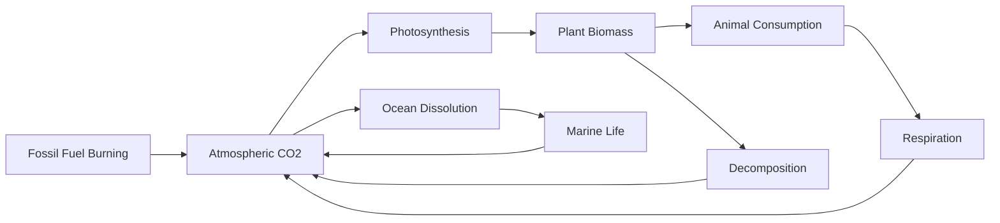
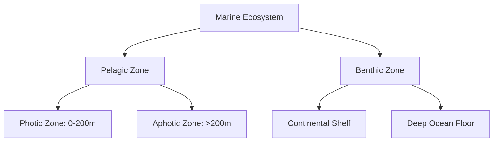
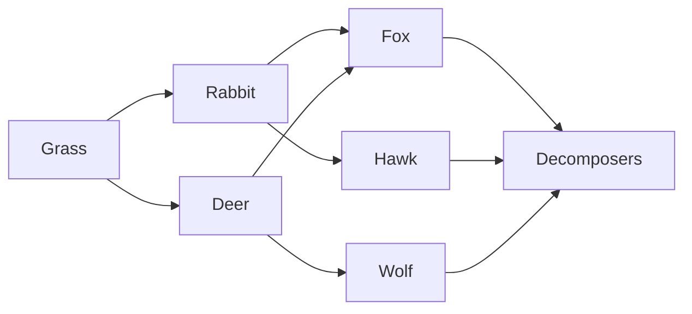
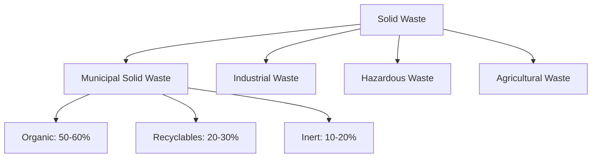
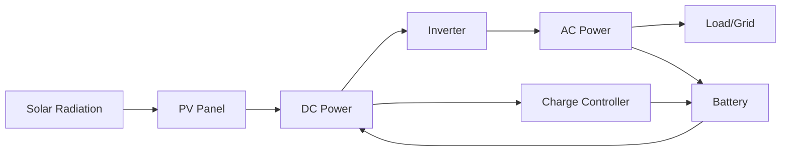
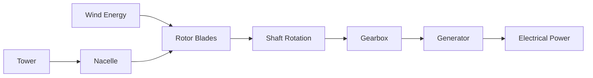
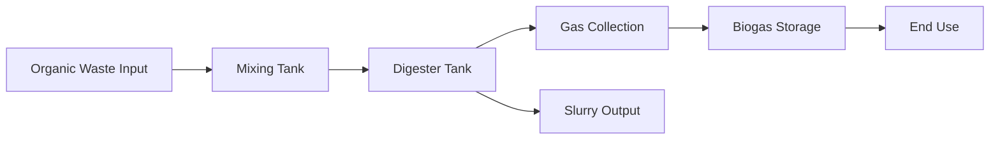
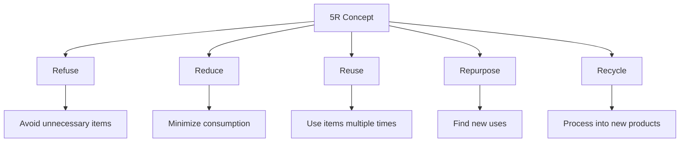
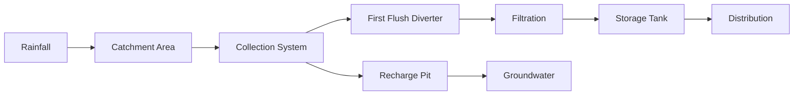

## Question 1(a) [3 marks]

**When ecological overshoot occurs? Explain with reasons.**

**Answer**:

**Table: Ecological Overshoot Conditions**

| Condition | Description | Impact |
|-----------|-------------|---------|
| Resource depletion | Consumption exceeds regeneration rate | Deficit accumulation |
| Population pressure | Human demand surpasses carrying capacity | Resource scarcity |
| Waste accumulation | Production exceeds absorption capacity | Environmental degradation |

**Ecological overshoot** occurs when humanity's ecological footprint exceeds Earth's biocapacity. This happens when we consume resources faster than nature can regenerate them and produce waste faster than ecosystems can absorb it.

**Key reasons include**:

- **Population growth**: Increasing human numbers
- **Consumption patterns**: High per-capita resource use
- **Technology impact**: Inefficient resource utilization

**Mnemonic**: "POP-CON-TECH" (Population-Consumption-Technology)

## Question 1(b) [4 marks]

**Explain food chain using diagram.**

**Answer**:


**Food chain** represents the linear sequence of energy transfer from one trophic level to another in an ecosystem.

**Components**:

- **Producers**: Convert solar energy to chemical energy
- **Primary consumers**: Feed on producers (herbivores)
- **Secondary consumers**: Feed on primary consumers (carnivores)
- **Decomposers**: Break down dead organisms

**Energy flow**: Unidirectional from sun to top predators with 10% efficiency between levels.

**Mnemonic**: "PPSD" (Producer-Primary-Secondary-Decomposer)

## Question 1(c) [7 marks]

**Write a note on: carbon cycle.**

**Answer**:



**Carbon cycle** is the biogeochemical process where carbon moves through atmosphere, biosphere, hydrosphere, and geosphere.

**Major processes**:

- **Photosynthesis**: Plants absorb CO2 from atmosphere
- **Respiration**: Organisms release CO2 back to atmosphere
- **Decomposition**: Dead organic matter releases stored carbon
- **Ocean exchange**: CO2 dissolves in seawater forming carbonic acid

**Human impact**:

- **Fossil fuel combustion**: Increases atmospheric CO2
- **Deforestation**: Reduces carbon sequestration capacity
- **Industrial processes**: Additional carbon emissions

**Environmental significance**: Maintains atmospheric CO2 balance, regulates global temperature, supports life processes.

**Mnemonic**: "PRDO-FDI" (Photosynthesis-Respiration-Decomposition-Ocean, Fossil-Deforestation-Industry)

## Question 1(c) OR [7 marks]

**Classify aquatic ecosystem. Explain marine ecosystem.**

**Answer**:

**Table: Aquatic Ecosystem Classification**

| Type | Characteristics | Examples |
|------|----------------|----------|
| Freshwater | Low salt content (<1%) | Rivers, lakes, ponds |
| Marine | High salt content (3.5%) | Oceans, seas |
| Brackish | Mixed fresh-salt water | Estuaries, lagoons |

**Marine Ecosystem Components**:



**Marine ecosystem** covers 71% of Earth's surface, containing saltwater bodies with complex food webs.

**Zones**:

- **Pelagic**: Open water column with plankton, fish
- **Benthic**: Ocean floor with bottom-dwelling organisms
- **Intertidal**: Shore area between high and low tides

**Importance**:

- **Climate regulation**: Ocean currents moderate global temperature
- **Oxygen production**: Marine phytoplankton produce 50% of atmospheric oxygen
- **Economic value**: Fisheries, transportation, tourism

**Mnemonic**: "PBI-COE" (Pelagic-Benthic-Intertidal, Climate-Oxygen-Economy)

## Question 2(a) [3 marks]

**What is carrying capacity of earth?**

**Answer**:

**Table: Carrying Capacity Factors**

| Factor | Description | Limit |
|--------|-------------|--------|
| Resources | Available land, water, minerals | Finite |
| Food production | Agricultural capacity | Limited by soil |
| Waste absorption | Ecosystem's waste processing | Saturation point |

**Carrying capacity** is the maximum population size an environment can sustain indefinitely without degrading the environment.

**Earth's carrying capacity** depends on:

- **Resource availability**: Fresh water, arable land, energy sources
- **Technology level**: Efficiency of resource utilization
- **Consumption patterns**: Per-capita resource demand

**Current estimates**: Range from 4-16 billion people based on consumption levels and technological advancement.

**Mnemonic**: "RTC" (Resources-Technology-Consumption)

## Question 2(b) [4 marks]

**How food web relates to food chain?**

**Answer**:



**Food web** is an interconnected network of multiple food chains showing complex feeding relationships in an ecosystem.

**Relationship between food web and food chain**:

- **Food chain**: Linear sequence of energy transfer
- **Food web**: Multiple interconnected food chains
- **Complexity**: Food webs show realistic ecosystem interactions
- **Stability**: Multiple pathways provide ecosystem resilience

**Key differences**:

- **Structure**: Chain is linear, web is network-based
- **Energy flow**: Chain shows single pathway, web shows multiple routes
- **Species interaction**: Web demonstrates omnivory and alternative feeding

**Mnemonic**: "LNCR" (Linear-Network, Chain-Resilience)

## Question 2(c) [7 marks]

**Write a note on: air pollution**

**Answer**:

**Table: Air Pollution Sources and Effects**

| Pollutant | Source | Health Effect |
|-----------|--------|--------------|
| PM2.5/PM10 | Vehicles, industries | Respiratory diseases |
| SO2 | Coal burning | Acid rain, asthma |
| NOx | Vehicle exhaust | Smog formation |
| CO | Incomplete combustion | Oxygen deficiency |

**Air pollution** is contamination of atmosphere by harmful substances that cause adverse effects on human health and environment.

**Classification by source**:

- **Primary pollutants**: Directly emitted (CO, SO2, particulates)
- **Secondary pollutants**: Formed through chemical reactions (ozone, acid rain)

**Major sources**:

- **Mobile sources**: Vehicles, aircraft, ships
- **Stationary sources**: Power plants, industries, residential heating
- **Natural sources**: Volcanic eruptions, forest fires, dust storms

**Control measures**:

- **Technological**: Catalytic converters, scrubbers, filters
- **Regulatory**: Emission standards, fuel quality norms
- **Alternative energy**: Renewable sources, electric vehicles

**Health impacts**: Respiratory diseases, cardiovascular problems, cancer, reduced life expectancy.

**Environmental effects**: Acid rain, ozone depletion, climate change, visibility reduction.

**Mnemonic**: "PSMT-RE-HE" (Primary-Secondary-Mobile-stationary-Technological-Regulatory-Health-Environment)

## Question 2(a) OR [3 marks]

**Explain bad effects of plastic waste on environment.**

**Answer**:

**Table: Plastic Waste Environmental Effects**

| Impact Area | Effect | Duration |
|-------------|--------|----------|
| Marine life | Entanglement, ingestion | Persistent |
| Soil | Microplastic contamination | 500+ years |
| Food chain | Bioaccumulation | Generational |

**Plastic waste** causes severe environmental degradation due to its non-biodegradable nature.

**Environmental effects**:

- **Marine pollution**: Ocean plastic kills marine animals through entanglement and ingestion
- **Soil contamination**: Microplastics affect soil fertility and crop growth
- **Food chain disruption**: Plastic particles accumulate in organisms

**Long-term impacts**: Persistent organic pollutants, habitat destruction, ecosystem imbalance.

**Mnemonic**: "MSF" (Marine-Soil-Foodchain)

## Question 2(b) OR [4 marks]

**Which are signs of polluted water? List major sources of water pollution.**

**Answer**:

**Table: Water Pollution Indicators and Sources**

| Signs | Measurement | Sources |
|-------|-------------|---------|
| High BOD/COD | >5 mg/L | Industrial discharge |
| Turbidity | Cloudiness | Agricultural runoff |
| pH changes | <6.5 or >8.5 | Acid mine drainage |
| Foul odor | H2S smell | Sewage discharge |

**Signs of polluted water**:

- **Physical**: Color change, turbidity, floating debris, odor
- **Chemical**: High BOD/COD, pH deviation, heavy metals, toxic compounds
- **Biological**: Pathogenic microorganisms, algal blooms, fish kills

**Major sources**:

- **Point sources**: Industrial discharge, sewage outfalls, concentrated animal feeding
- **Non-point sources**: Agricultural runoff, urban stormwater, atmospheric deposition

**Mnemonic**: "PCB-PIN" (Physical-Chemical-Biological, Point-Non-point)

## Question 2(c) OR [7 marks]

**Classify e-waste. How e-waste is recycled?**

**Answer**:

**Table: E-waste Classification**

| Category | Examples | Hazardous Components |
|----------|----------|---------------------|
| Large appliances | Refrigerators, washing machines | CFCs, heavy metals |
| Small appliances | Microwaves, vacuum cleaners | Plastics, metals |
| IT equipment | Computers, printers | Lead, mercury, cadmium |
| Consumer electronics | TVs, mobile phones | Rare earth elements |

**E-waste classification**:

- **White goods**: Large household appliances
- **Brown goods**: Entertainment electronics
- **Gray goods**: IT and telecommunication equipment
- **Green goods**: Renewable energy equipment

**E-waste recycling process**:


**Recycling methods**:

- **Mechanical**: Physical separation of materials
- **Metallurgical**: High-temperature processing for metal recovery
- **Chemical**: Leaching processes for precious metals

**Challenges**: Hazardous material handling, complex composition, economic viability.

**Benefits**: Resource conservation, pollution prevention, job creation, reduced mining needs.

**Mnemonic**: "WBGG-CSDSMR" (White-Brown-Gray-Green, Collection-Sorting-Dismantling-Shredding-Separation-Material-Refining)

## Question 3(a) [3 marks]

**Distinguish BOD and COD.**

**Answer**:

**Table: BOD vs COD Comparison**

| Parameter | BOD | COD |
|-----------|-----|-----|
| Full form | Biochemical Oxygen Demand | Chemical Oxygen Demand |
| Test duration | 5 days | 2-3 hours |
| Oxidation type | Biological | Chemical |
| Degradation | Biodegradable organics only | All organic compounds |

**BOD (Biochemical Oxygen Demand)**:

- Measures oxygen consumed by microorganisms
- Indicates biodegradable organic pollution
- Standard test: 5 days at 20°C

**COD (Chemical Oxygen Demand)**:

- Measures oxygen required for chemical oxidation
- Indicates total organic pollution
- Uses strong oxidizing agents (potassium dichromate)

**Mnemonic**: "BTCD" (Biological-Time-Chemical-Degradation)

## Question 3(b) [4 marks]

**Classify solid waste.**

**Answer**:

**Table: Solid Waste Classification**

| Classification | Type | Examples |
|----------------|------|----------|
| By source | Municipal, Industrial, Agricultural | Household, Factory, Farm waste |
| By composition | Organic, Inorganic | Food waste, Plastics |
| By hazard | Hazardous, Non-hazardous | Medical, Paper |

**Solid waste classification**:



**By source**:

- **Municipal**: Residential, commercial, institutional waste
- **Industrial**: Manufacturing, processing byproducts
- **Agricultural**: Crop residues, animal waste

**By composition**: Organic (biodegradable), inorganic (non-biodegradable), recyclable materials.

**Management hierarchy**: Reduce, reuse, recycle, recover, dispose.

**Mnemonic**: "MIA-OIR" (Municipal-Industrial-Agricultural, Organic-Inorganic-Recyclable)

## Question 3(c) [7 marks]

**With the use of diagram explain solar photovoltaic System.**

**Answer**:



**Solar Photovoltaic System** converts sunlight directly into electricity using semiconductor materials.

**Components**:

- **PV modules**: Silicon cells convert light to DC electricity
- **Inverter**: Converts DC to AC power
- **Battery storage**: Stores excess energy for later use
- **Charge controller**: Regulates battery charging
- **Monitoring system**: Tracks performance and faults

**Working principle**:

1. **Photovoltaic effect**: Solar cells absorb photons
2. **Electron excitation**: Creates electron-hole pairs
3. **Current generation**: Electrons flow creating DC current
4. **Power conditioning**: Inverter converts DC to AC

**Types**:

- **Grid-connected**: Synchronized with utility grid
- **Stand-alone**: Independent systems with battery backup
- **Hybrid**: Combination of grid-connected and battery storage

**Applications**: Residential rooftops, commercial buildings, utility-scale power plants, remote area electrification.

**Advantages**: Clean energy, low maintenance, modular design, long lifespan (25+ years).

**Mnemonic**: "PIBCM-PECG" (Panel-Inverter-Battery-Controller-Monitor, Photovoltaic-Electron-Current-Grid)

## Question 3(a) OR [3 marks]

**Compare conventional and non-conventional energy sources.**

**Answer**:

**Table: Energy Sources Comparison**

| Aspect | Conventional | Non-conventional |
|--------|-------------|------------------|
| Availability | Limited reserves | Unlimited/renewable |
| Environmental impact | High pollution | Clean/minimal impact |
| Cost | Initially lower | Decreasing rapidly |

**Conventional energy sources**: Coal, oil, natural gas, nuclear power - finite resources with environmental concerns.

**Non-conventional energy sources**: Solar, wind, hydro, biomass - renewable resources with sustainable characteristics.

**Key differences**: Depletion vs renewable, pollution vs clean, established vs emerging technology.

**Mnemonic**: "AEC" (Availability-Environmental-Cost)

## Question 3(b) OR [4 marks]

**Explain working of natural circulation solar water heater.**

**Answer**:

```goat
    +------------------+
    |   Solar Tank     |
    |   (Hot Water)    |
    +--------+---------+
             |
    +--------v---------+
    |  Solar Collector |
    |     (Cold Water) |
    +------------------+
```

**Natural circulation solar water heater** uses thermosiphon principle for water circulation without external pumps.

**Working principle**:

- **Solar collection**: Collector absorbs solar radiation, heating water
- **Density difference**: Hot water becomes less dense, rises naturally
- **Circulation**: Cold water from tank bottom flows to collector
- **Storage**: Hot water accumulates in insulated storage tank

**Components**: Flat plate collector, insulated storage tank, connecting pipes, safety valves.

**Advantages**: No electricity required, simple design, low maintenance, cost-effective.

**Mnemonic**: "SDCS" (Solar-Density-Circulation-Storage)

## Question 3(c) OR [7 marks]

**Explain working principle of horizontal axis wind turbine.**

**Answer**:



**Horizontal Axis Wind Turbine (HAWT)** converts kinetic energy of wind into electrical energy using aerodynamic lift principle.

**Working principle**:

1. **Wind capture**: Rotor blades designed with aerodynamic profile
2. **Lift generation**: Pressure difference across blade surfaces creates lift force
3. **Rotation**: Lift force causes rotor to rotate around horizontal axis
4. **Speed conversion**: Gearbox increases rotational speed from 30-50 rpm to 1500 rpm
5. **Power generation**: High-speed rotation drives electrical generator

**Components**:

- **Rotor assembly**: 2-3 blades, hub, pitch control system
- **Nacelle**: Houses gearbox, generator, control systems
- **Tower**: Supports nacelle at optimal height (50-120m)
- **Foundation**: Concrete base for structural stability

**Control systems**:

- **Yaw system**: Orients turbine to face wind direction
- **Pitch control**: Adjusts blade angle for optimal wind capture
- **Brake system**: Emergency stopping mechanism

**Advantages**: High efficiency (35-45%), proven technology, economies of scale.
**Disadvantages**: Visual impact, noise, bird strikes, wind variability.

**Power calculation**: P = 0.5 × ρ × A × V³ × Cp
Where: ρ = air density, A = swept area, V = wind speed, Cp = power coefficient

**Mnemonic**: "WLRSG-RNTP-YPB" (Wind-Lift-Rotation-Speed-Generation, Rotor-Nacelle-Tower-Foundation, Yaw-Pitch-Brake)

## Question 4(a) [3 marks]

**Write advantages and disadvantages of tidal energy.**

**Answer**:

**Table: Tidal Energy Pros and Cons**

| Advantages | Disadvantages |
|------------|---------------|
| Predictable energy source | Limited suitable locations |
| No greenhouse gas emissions | High initial capital cost |
| Long lifespan (100+ years) | Environmental impact on marine life |

**Tidal energy** harnesses gravitational forces between Earth, moon, and sun to generate electricity.

**Advantages**:

- **Reliability**: Highly predictable tidal cycles
- **Clean energy**: Zero operational emissions
- **Durability**: Infrastructure lasts decades

**Disadvantages**:

- **Geographic limitations**: Requires specific coastal conditions
- **High costs**: Expensive installation and maintenance
- **Ecological impact**: Affects marine ecosystems

**Mnemonic**: "RCD-GHE" (Reliable-Clean-Durable, Geographic-High cost-Ecological)

## Question 4(b) [4 marks]

**Explain working principle of biogas plant.**

**Answer**:



**Biogas plant** produces methane-rich gas through anaerobic digestion of organic waste materials.

**Working principle**:

1. **Feed preparation**: Organic waste mixed with water (1:1 ratio)
2. **Anaerobic digestion**: Bacteria break down organic matter in oxygen-free environment
3. **Gas production**: Methane (50-70%) and CO2 (30-40%) generated
4. **Gas collection**: Biogas collected in gas holder dome

**Process stages**:

- **Hydrolysis**: Complex organics broken into simple compounds
- **Acidogenesis**: Organic acids formation
- **Methanogenesis**: Methane production by methanogenic bacteria

**Optimal conditions**: Temperature 35-40°C, pH 6.8-7.2, retention time 15-30 days.

**Mnemonic**: "FAGH-HAM" (Feed-Anaerobic-Gas-Holder, Hydrolysis-Acidogenesis-Methanogenesis)

## Question 4(c) [7 marks]

**Explain green house effect.**

**Answer**:


**Greenhouse effect** is the process where atmospheric gases trap heat from sun, warming Earth's surface beyond normal temperature.

**Natural greenhouse effect**:

- **Solar radiation**: Sun emits short-wave radiation (visible light)
- **Surface absorption**: Earth absorbs solar energy, heats up
- **Heat re-emission**: Earth emits long-wave infrared radiation
- **Gas absorption**: Greenhouse gases absorb infrared radiation
- **Heat retention**: Trapped heat warms lower atmosphere

**Greenhouse gases and contributions**:

- **Carbon dioxide (CO2)**: 76% - fossil fuel burning, deforestation
- **Methane (CH4)**: 16% - agriculture, landfills, livestock
- **Nitrous oxide (N2O)**: 6% - fertilizers, fossil fuel combustion
- **Fluorinated gases**: 2% - industrial processes, refrigeration

**Enhanced greenhouse effect**: Human activities increase greenhouse gas concentrations, intensifying heat trapping.

**Consequences**:

- **Global temperature rise**: Average 1.1°C increase since pre-industrial times
- **Climate change**: Altered precipitation patterns, extreme weather events
- **Sea level rise**: Thermal expansion and ice sheet melting
- **Ecosystem disruption**: Species migration, coral bleaching, forest fires

**Mitigation strategies**:

- **Renewable energy**: Reduce fossil fuel dependence
- **Energy efficiency**: Improve technology and practices
- **Carbon sequestration**: Forest restoration, carbon capture storage
- **International cooperation**: Paris Agreement, emission reduction targets

**Mnemonic**: "SSAHR-CMNO-GTSE-RECC" (Solar-Surface-Absorption-Heat-Radiation, CO2-Methane-Nitrous-Other, Global-Temperature-Sea-Ecosystem, Renewable-Efficiency-Carbon-Cooperation)

## Question 4(a) OR [3 marks]

**What is climate change?**

**Answer**:

**Table: Climate Change Indicators**

| Indicator | Change | Evidence |
|-----------|--------|----------|
| Temperature | +1.1°C since 1880 | Global temperature records |
| Sea level | +21 cm since 1900 | Satellite measurements |
| Arctic ice | -13% per decade | Satellite imagery |

**Climate change** refers to long-term shifts in global temperatures and weather patterns, primarily caused by human activities since mid-20th century.

**Key characteristics**:

- **Temperature rise**: Global average temperature increase
- **Weather extremes**: More frequent hurricanes, droughts, floods
- **Ecosystem changes**: Species migration, habitat loss

**Primary cause**: Increased greenhouse gas emissions from fossil fuel burning, deforestation, industrial processes.

**Mnemonic**: "TSE" (Temperature-Sea level-Ecosystem)

## Question 4(b) OR [4 marks]

**Write some of measures to control global warming.**

**Answer**:

**Table: Global Warming Control Measures**

| Category | Measures | Impact |
|----------|----------|---------|
| Energy | Renewable sources, efficiency | Reduce CO2 emissions |
| Transport | Electric vehicles, public transport | Lower fuel consumption |
| Industry | Clean technology, carbon capture | Emission reduction |
| Individual | Energy conservation, lifestyle changes | Cumulative effect |

**Control measures**:

**Government level**:

- **Policy frameworks**: Carbon pricing, emission standards
- **Renewable energy**: Solar, wind power promotion
- **Public transport**: Mass transit system development

**Industrial level**:

- **Clean technology**: Efficient processes, waste reduction
- **Carbon capture**: Storage and utilization technologies
- **Sustainable practices**: Green manufacturing, circular economy

**Individual level**:

- **Energy conservation**: LED lights, efficient appliances
- **Transportation**: Walking, cycling, carpooling
- **Lifestyle changes**: Reduced consumption, recycling

**Mnemonic**: "PRT-CCS-ECL" (Policy-Renewable-Transport, Carbon-Clean-Sustainable, Energy-Communication-Lifestyle)

## Question 4(c) OR [7 marks]

**Which are some important agreements for mitigating climate change at global level?**

**Answer**:

**Table: Major Climate Agreements**

| Agreement | Year | Key Features |
|-----------|------|-------------|
| UNFCCC | 1992 | Framework convention |
| Kyoto Protocol | 1997 | Binding emission targets |
| Paris Agreement | 2015 | Global temperature limit |

**Important global climate agreements**:

**1. United Nations Framework Convention on Climate Change (UNFCCC) - 1992**:

- **Objective**: Stabilize greenhouse gas concentrations
- **Principles**: Common but differentiated responsibilities
- **Framework**: Foundation for future climate negotiations

**2. Kyoto Protocol - 1997**:

- **Binding targets**: Developed countries reduce emissions by 5.2% (1990 levels)
- **Flexible mechanisms**: Emissions trading, clean development mechanism
- **Commitment periods**: First (2008-2012), Second (2013-2020)

**3. Paris Agreement - 2015**:

- **Temperature goal**: Limit global warming to well below 2°C, preferably 1.5°C
- **Nationally Determined Contributions (NDCs)**: Countries set own targets
- **Review mechanism**: Five-year assessment and enhancement cycles
- **Climate finance**: $100 billion annually for developing countries

**4. Other significant agreements**:

- **Montreal Protocol (1987)**: Ozone layer protection, indirect climate benefits
- **Copenhagen Accord (2009)**: Political agreement on emission reductions
- **Doha Amendment (2012)**: Extended Kyoto Protocol commitments

**Implementation challenges**:

- **Compliance**: Voluntary vs mandatory commitments
- **Financing**: Adequate funding for mitigation and adaptation
- **Technology transfer**: Clean technology access for developing countries
- **Monitoring**: Transparent reporting and verification systems

**Recent developments**:

- **Article 6 rules**: International carbon markets under Paris Agreement
- **Loss and damage**: Support for climate-vulnerable countries
- **Net-zero commitments**: Countries pledging carbon neutrality

**Mnemonic**: "UKPOM-CDOG-TFMC" (UNFCCC-Kyoto-Paris-Other-Montreal, Copenhagen-Doha-Other-Goals, Technology-Finance-Monitoring-Commitments)

## Question 5(a) [3 marks]

**Explain effects of ozone layer depletion.**

**Answer**:

**Table: Ozone Depletion Effects**

| Impact Area | Effect | Consequence |
|-------------|--------|-------------|
| Human health | Increased UV-B radiation | Skin cancer, cataracts |
| Environment | Ecosystem disruption | Marine food chain damage |
| Agriculture | Crop damage | Reduced food production |

**Ozone layer depletion** results in increased ultraviolet-B (UV-B) radiation reaching Earth's surface.

**Effects**:

- **Human health**: Higher skin cancer rates, eye damage, immune system suppression
- **Marine ecosystems**: Phytoplankton reduction affects ocean food chains
- **Agricultural impact**: Reduced crop yields, plant growth inhibition

**Cause**: Chlorofluorocarbons (CFCs) destroy ozone molecules in stratosphere.

**Mnemonic**: "HMA" (Human-Marine-Agricultural)

## Question 5(b) [4 marks]

**Write short note on greenhouse gases.**

**Answer**:

**Table: Major Greenhouse Gases**

| Gas | Sources | Global Warming Potential |
|-----|---------|-------------------------|
| CO2 | Fossil fuels, deforestation | 1 (reference) |
| CH4 | Agriculture, landfills | 25 times CO2 |
| N2O | Fertilizers, combustion | 298 times CO2 |
| F-gases | Industrial processes | 1,000-20,000 times CO2 |

**Greenhouse gases** are atmospheric compounds that trap heat radiated from Earth's surface.

**Major greenhouse gases**:

- **Carbon dioxide (CO2)**: Most abundant, from fossil fuel burning
- **Methane (CH4)**: Potent but shorter-lived, from agriculture
- **Nitrous oxide (N2O)**: Long-lived, from fertilizers and industry
- **Fluorinated gases**: Very potent, from refrigeration and industrial uses

**Properties**: Absorb infrared radiation, transparent to visible light, varying atmospheric lifespans.

**Global warming potential**: Measures heat-trapping capacity relative to CO2 over specific time periods.

**Mnemonic**: "CMNF" (Carbon dioxide-Methane-Nitrous oxide-Fluorinated gases)

## Question 5(c) [7 marks]

**Explain Concept of 5R.**

**Answer**:



**5R Concept** is a waste management hierarchy that prioritizes waste prevention and resource conservation.

**The Five R's in order of priority**:

**1. Refuse**:

- **Definition**: Avoid accepting unnecessary items
- **Examples**: Single-use plastics, promotional freebies, excessive packaging
- **Impact**: Prevents waste generation at source

**2. Reduce**:

- **Definition**: Minimize consumption and waste production
- **Examples**: Buy only needed items, choose durable products, energy conservation
- **Impact**: Decreases resource extraction and waste volume

**3. Reuse**:

- **Definition**: Use items multiple times in their original form
- **Examples**: Glass jars for storage, clothing donation, furniture repurposing
- **Impact**: Extends product lifespan, reduces replacement needs

**4. Repurpose**:

- **Definition**: Find new applications for items instead of discarding
- **Examples**: Tire planters, bottle vases, cardboard organizers
- **Impact**: Creative waste diversion, artistic value addition

**5. Recycle**:

- **Definition**: Process waste materials into new products
- **Examples**: Paper recycling, metal recovery, plastic reprocessing
- **Impact**: Resource recovery, reduced landfill burden

**Benefits of 5R approach**:

- **Environmental**: Reduced pollution, resource conservation, ecosystem protection
- **Economic**: Cost savings, job creation in recycling industry
- **Social**: Community awareness, sustainable lifestyle promotion

**Implementation hierarchy**: Focus on refuse and reduce first (prevention), then reuse and repurpose (waste diversion), finally recycle (waste processing).

**Challenges**: Behavioral change requirements, infrastructure development, economic incentives alignment.

**Mnemonic**: "Real Recycling Requires Refusing Rubbish" (Refuse-Reduce-Reuse-Repurpose-Recycle)

## Question 5(a) OR [3 marks]

**Write salient features of wild life protection act, 1972.**

**Answer**:

**Table: Wildlife Protection Act 1972 Features**

| Feature | Description | Penalty |
|---------|-------------|---------|
| Protected species | Scheduled animals/plants | Fine + imprisonment |
| Hunting ban | Prohibition of hunting | Up to 7 years jail |
| Trade regulation | Wildlife product trade control | Confiscation + fine |

**Wildlife Protection Act, 1972** provides legal framework for conservation of wildlife in India.

**Salient features**:

- **Species protection**: Six schedules categorizing species by protection level
- **Hunting prohibition**: Complete ban on hunting of protected species
- **Habitat conservation**: Protected areas designation and management
- **Trade control**: Regulation of wildlife product commerce

**Enforcement**: Wildlife Crime Control Bureau, forest departments, special courts for wildlife offenses.

**Amendments**: Regular updates to include new species and strengthen provisions.

**Mnemonic**: "SHTE" (Species-Hunting-Trade-Enforcement)

## Question 5(b) OR [4 marks]

**Which are the environmental policies in India?**

**Answer**:

**Table: Major Environmental Policies in India**

| Policy | Year | Focus Area |
|--------|------|------------|
| National Environment Policy | 2006 | Comprehensive framework |
| National Water Policy | 2012 | Water resource management |
| National Forest Policy | 1988 | Forest conservation |
| National Action Plan on Climate Change | 2008 | Climate change mitigation |

**Major environmental policies**:

**National Environment Policy (2006)**:

- **Objective**: Sustainable development with environmental protection
- **Principles**: Polluter pays, precautionary approach
- **Implementation**: Integration across sectors

**Sectoral policies**:

- **National Water Policy**: Integrated water resource management
- **National Forest Policy**: 33% forest cover target
- **National Solar Mission**: Renewable energy promotion
- **Waste Management Rules**: Solid waste, e-waste, plastic waste management

**Regulatory framework**: Environment Protection Act, Water Act, Air Act, Forest Conservation Act.

**Mnemonic**: "NWFS" (National-Water-Forest-Solar)

## Question 5(c) OR [7 marks]

**Explain rainwater harvesting in detail.**

**Answer**:



**Rainwater harvesting** is the collection, storage, and utilization of rainwater for beneficial purposes.

**Components of rainwater harvesting system**:

**1. Catchment area**:

- **Function**: Surface for rain collection (rooftops, open areas)
- **Material**: Should be clean, non-toxic (avoid asbestos, lead-painted surfaces)
- **Calculation**: Collection = Catchment area × Rainfall × Runoff coefficient

**2. Collection and conveyance system**:

- **Gutters**: Channel water from catchment surface
- **Downspouts**: Vertical pipes carrying water from gutters
- **Transportation**: Pipes connecting different components

**3. First flush diverter**:

- **Purpose**: Removes initial dirty water containing debris
- **Types**: Manual valve, automatic diverter, floating ball system
- **Capacity**: Usually 10-15 liters per 100 sq.m of roof area

**4. Filtration system**:

- **Coarse filter**: Removes leaves, debris (mesh screen)
- **Fine filter**: Sand, gravel, activated carbon
- **Slow sand filter**: Biological treatment for drinking water

**5. Storage system**:

- **Surface storage**: Tanks, reservoirs above ground
- **Underground storage**: Sumps, cisterns below ground
- **Material**: Ferrocement, plastic, concrete, fiberglass

**Types of rainwater harvesting**:

**A. Rooftop harvesting**:

- **Direct storage**: Rainwater stored in tanks for immediate use
- **Indirect recharge**: Water directed to recharge groundwater

**B. Surface water harvesting**:

- **Check dams**: Small barriers across streams
- **Percolation tanks**: Artificial recharge structures
- **Contour bunding**: Soil conservation with water harvesting

**Benefits**:

- **Water security**: Reduces dependence on external water sources
- **Groundwater recharge**: Prevents water table decline
- **Flood control**: Reduces surface runoff and urban flooding
- **Quality improvement**: Generally better than groundwater in polluted areas
- **Cost-effective**: Lower than water supply schemes
- **Energy saving**: Reduces pumping requirements

**Design considerations**:

- **Rainfall pattern**: Seasonal distribution, intensity
- **Water demand**: Household requirements, usage patterns
- **Storage capacity**: Based on dry period duration
- **Quality requirements**: Potable vs non-potable use
- **Site conditions**: Space availability, soil permeability

**Maintenance requirements**:

- **Regular cleaning**: Gutters, filters, storage tanks
- **Roof maintenance**: Prevent contamination sources
- **System inspection**: Check for leaks, blockages
- **Water quality testing**: Periodic analysis for potable use

**Government initiatives**:

- **Building codes**: Mandatory rainwater harvesting in new constructions
- **Subsidies**: Financial incentives for installation
- **Awareness programs**: Community education and training
- **Technical support**: Design guidelines, implementation assistance

**Challenges**:

- **Initial cost**: Setup expenses for complete system
- **Maintenance**: Regular upkeep requirements
- **Space requirements**: Storage tank space needs
- **Seasonal availability**: Dependence on monsoon patterns
- **Quality concerns**: Potential contamination issues

**Calculation example**:

- Roof area: 100 sq.m
- Annual rainfall: 1000 mm
- Runoff coefficient: 0.8
- Harvestable water = 100 × 1 × 0.8 = 80,000 liters/year

**Mnemonic**: "CCFFS-RSBD-WGFQC-RCSMQ" (Catchment-Collection-Flush-Filter-Storage, Rooftop-Surface-Benefits-Design, Water-Groundwater-Flood-Quality-Cost, Regular-Check-System-Maintenance-Quality)
