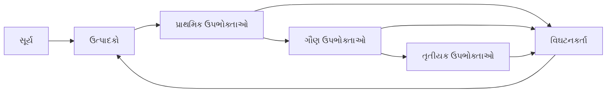
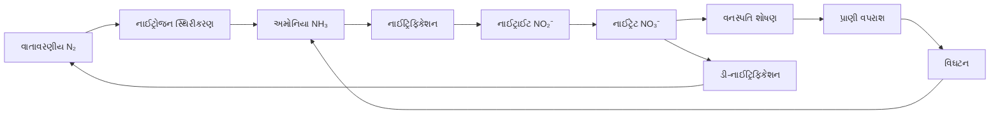
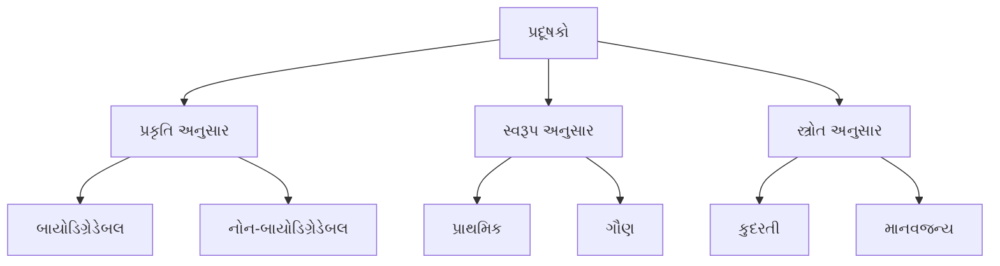
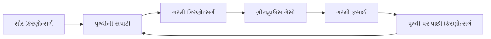

## પ્રશ્ન 1(અ) [03 ગુણ]

**ઇકોલોજીકલ ફૂટપ્રિન્ટ સમજાવો.**

**જવાબ:**

ઇકોલોજીકલ ફૂટપ્રિન્ટ એ વ્યક્તિઓ, સમુદાયો અથવા દેશો દ્વારા પ્રકૃતિ પરની માંગને જૈવિક રીતે ઉત્પાદક જમીન અને પાણીના વિસ્તારના સંદર્ભમાં માપે છે.

**કોષ્ટક: ઇકોલોજીકલ ફૂટપ્રિન્ટના ઘટકો**

| ઘટક | વર્ણન |
|-----------|-------------|
| **કાર્બન ફૂટપ્રિન્ટ** | CO₂ ઉત્સર્જન શોષવા માટે જરૂરી જમીન |
| **કૃષિ જમીન** | ખોરાક ઉત્પાદન માટે વિસ્તાર |
| **ચરાઈ જમીન** | પશુધન માટે વિસ્તાર |
| **વન ઉત્પાદનો** | લાકડા અને કાગળ માટે વિસ્તાર |
| **નિર્મિત જમીન** | આધારભૂત સુવિધાઓ અને શહેરી વિસ્તારો |

- **વૈશ્વિક હેક્ટર**: માપન માટે માનક એકમ
- **ઓવરશૂટ**: જ્યારે ફૂટપ્રિન્ટ બાયોકેપેસિટી કરતાં વધે
- **ટકાઉપણું**: વપરાશ અને પુનઃઉત્પાદન વચ્ચે સંતુલન

**મેમરી ટ્રીક:** "CGFBB" - Carbon, Cropland, Grazing, Forest, Built-up

---

## પ્રશ્ન 1(બ) [04 ગુણ]

**એલ્ટોનિયન પિરામિડ સમજાવો.**

**જવાબ:**

એલ્ટોનિયન પિરામિડ (સંખ્યાનો પિરામિડ) ઇકોસિસ્ટમમાં દરેક પોષક સ્તરે જીવોની સંખ્યા દર્શાવે છે, જે ચાર્લ્સ એલ્ટન દ્વારા પ્રસ્તાવિત કરવામાં આવ્યો હતો.

**આકૃતિ:**

```goat
Tertiary Consumers
(થોડા - 10)
         
Secondary Consumers  
(મધ્યમ - 100)
      
Primary Consumers
(ઘણા - 1000)
     
Producers
(સૌથી વધુ - 10000)
```

**કોષ્ટક: પિરામિડના પ્રકારો**

| પ્રકાર | આધાર | આકાર |
|------|-------|-------|
| **સંખ્યા** | વ્યક્તિગત ગણતરી | સામાન્ય રીતે સીધો |
| **બાયોમાસ** | કુલ વજન | ઊંધો પણ હોઈ શકે |
| **ઊર્જા** | ઊર્જા પ્રવાહ | હંમેશા સીધો |

- **પોષક સ્તરો**: ખોરાક શૃંખલામાં ખોરાકની સ્થિતિ
- **10% નિયમ**: માત્ર 10% ઊર્જા આગલા સ્તરે સ્થાનાંતરિત થાય
- **અપવાદો**: વૃક્ષ ઇકોસિસ્ટમ ઊંધો સંખ્યા પિરામિડ દર્શાવે

**મેમરી ટ્રીક:** "ELTON" - Energy Loss Through Organism Numbers

---

## પ્રશ્ન 1(ક) [07 ગુણ]

**ઇકો-સિસ્ટમ તેના વર્ગીકરણ અને ઘટક સાથે સમજાવો.**

**જવાબ:**

ઇકોસિસ્ટમ એ પ્રકૃતિની એક કાર્યાત્મક એકમ છે જ્યાં જીવંત સજીવો એકબીજા સાથે અને તેમના ભૌતિક વાતાવરણ સાથે ક્રિયાપ્રતિક્રિયા કરે છે, જેમાં ઊર્જા પ્રવાહ અને પોષક ચક્રણ સામેલ છે.

**કોષ્ટક: ઇકોસિસ્ટમના ઘટકો**

| ઘટક | પ્રકાર | ઉદાહરણો |
|-----------|------|----------|
| **અજૈવિક** | નિર્જીવ | હવા, પાણી, માટી, આબોહવા |
| **જૈવિક** | સજીવ | છોડ, પ્રાણીઓ, સૂક્ષ્મજીવો |
| **ઉત્પાદકો** | સ્વપોષક | લીલા છોડ, શેવાળ |
| **ઉપભોક્તાઓ** | પરપોષક | શાકાહારી, માંસાહારી, સર્વાહારી |
| **વિઘટનકર્તા** | પુનર્ચક્રીકરણકર્તા | બેક્ટેરિયા, ફૂગ |

**ઇકોસિસ્ટમનું વર્ગીકરણ:**

**કુદરતી ઇકોસિસ્ટમ:**

- **સ્થલીય**: જંગલ, ઘાસના મેદાનો, રણ
- **જળીય**: તાજા પાણી (તળાવ, નદી), દરિયાઈ (મહાસાગર, સમુદ્ર)

**કૃત્રિમ ઇકોસિસ્ટમ:**

- **કૃષિ**: પાકના ખેતરો, બગીચાઓ
- **શહેરી**: ઉદ્યાનો, કૃત્રિમ તળાવો

**આકૃતિ: ઊર્જા પ્રવાહ**



- **ઊર્જા પ્રવાહ**: સૂર્યથી વિઘટનકર્તા સુધી એક દિશામાં
- **પોષક ચક્રણ**: તત્વોની ચક્રીય હિલચાલ
- **ખોરાક શૃંખલા**: રેખીય ઊર્જા સ્થાનાંતરણ
- **ખોરાક જાળ**: પરસ્પર જોડાયેલી ખોરાક શૃંખલાઓ

**મેમરી ટ્રીક:** "PEACE" - Producers, Energy, Animals, Cycles, Environment

---

## પ્રશ્ન 1(ક અથવા) [07 ગુણ]

**નાઈટ્રોજન ચક્ર સમજાવો.**

**જવાબ:**

નાઈટ્રોજન ચક્ર એ બાયોજિયોકેમિકલ ચક્ર છે જે વાતાવરણ, સ્થલીય અને જળીય પ્રણાલીઓમાં ફરતા વખતે નાઈટ્રોજન સંયોજનોને વિવિધ રાસાયણિક સ્વરૂપોમાં રૂપાંતરિત કરે છે.

**આકૃતિ: નાઈટ્રોજન ચક્ર**



**કોષ્ટક: નાઈટ્રોજન ચક્રની પ્રક્રિયાઓ**

| પ્રક્રિયા | રૂપાંતરણ | સજીવો |
|---------|------------|-----------|
| **સ્થિરીકરણ** | N₂ → NH₃ | રાઈઝોબિયમ, એઝોટોબેક્ટર |
| **નાઈટ્રિફિકેશન** | NH₃ → NO₂⁻ → NO₃⁻ | નાઈટ્રોસોમોનાસ, નાઈટ્રોબેક્ટર |
| **આત્મસાત્કરણ** | NO₃⁻ → પ્રોટીન | છોડવા |
| **વિઘટન** | પ્રોટીન → NH₃ | બેક્ટેરિયા, ફૂગ |
| **ડી-નાઈટ્રિફિકેશન** | NO₃⁻ → N₂ | એનેરોબિક બેક્ટેરિયા |

- **જૈવિક સ્થિરીકરણ**: કુલ સ્થિરીકરણનો 80%
- **ઔદ્યોગિક સ્થિરીકરણ**: ખાતર માટે હેબર પ્રક્રિયા
- **વીજળી**: કુદરતી વાતાવરણીય સ્થિરીકરણ
- **પ્રદૂષણ**: વધારાના નાઈટ્રેટ યુટ્રોફિકેશન કારણે

**મેમરી ટ્રીક:** "FNADD" - Fixation, Nitrification, Assimilation, Decomposition, Denitrification

---

## પ્રશ્ન 2(અ) [03 ગુણ]

**વેસ્ટ વોટર ક્વોલિટી પેરામીટરની યાદી બનાવો.**

**જવાબ:**

**કોષ્ટક: વેસ્ટ વોટર ક્વોલિટી પેરામીટર**

| ભૌતિક | રાસાયણિક | જૈવિક |
|----------|----------|------------|
| **ટર્બિડિટી** | **BOD** | **કોલિફોર્મ ગણતરી** |
| **રંગ** | **COD** | **પેથોજેનિક બેક્ટેરિયા** |
| **ગંધ** | **pH** | **શેવાળ** |
| **તાપમાન** | **DO** | **વાયરસ** |
| **કુલ ઘન પદાર્થો** | **અમોનિયા** | **પ્રોટોઝોઆ** |

- **પ્રાથમિક પેરામીટર**: BOD, COD, pH, સસ્પેન્ડેડ સોલિડ્સ
- **ગૌણ પેરામીટર**: ભારે ધાતુઓ, પોષક તત્વો
- **સૂચક સજીવો**: મળના દૂષણ માટે E.coli

**મેમરી ટ્રીક:** "PCB" - Physical, Chemical, Biological parameters

---

## પ્રશ્ન 2(બ) [04 ગુણ]

**ઈ-કચરાનું વર્ગીકરણ અને અસરો સમજાવો.**

**જવાબ:**

ઈલેક્ટ્રોનિક કચરો (ઈ-વેસ્ટ) એ હાનિકારક સામગ્રી ધરાવતા છોડી દેવાયેલા વિદ્યુત અને ઈલેક્ટ્રોનિક સાધનોનો સંદર્ભ આપે છે.

**કોષ્ટક: ઈ-વેસ્ટ વર્ગીકરણ**

| કેટેગરી | ઉદાહરણો | હાનિકારક સામગ્રી |
|----------|----------|-------------------|
| **મોટા ઉપકરણો** | રેફ્રિજરેટર, વોશિંગ મશીન | CFCs, ભારે ધાતુઓ |
| **નાના ઉપકરણો** | માઈક્રોવેવ, ટોસ્ટર | લીડ, મર્ક્યુરી |
| **IT સાધનો** | કમ્પ્યુટર, પ્રિન્ટર | કેડમિયમ, ક્રોમિયમ |
| **ટેલિકોમ સાધનો** | મોબાઈલ ફોન, કેબલ | બેરિલિયમ, ફ્લેમ રિટાર્ડન્ટ |
| **કન્ઝ્યુમર ઈલેક્ટ્રોનિક્સ** | ટીવી, રેડિયો | પોલિવિનાઈલ ક્લોરાઈડ (PVC) |

**ઈ-વેસ્ટની અસરો:**

- **પર્યાવરણીય**: માટી અને પાણીનું પ્રદૂષણ, હવાનું દૂષણ
- **આરોગ્ય**: કેન્સર, ન્યુરોલોજિકલ વિકાર, શ્વસન સમસ્યાઓ
- **સંસાધન ક્ષય**: સોના, ચાંદી જેવી મૂલ્યવાન ધાતુઓનું નુકસાન
- **ઇકોસિસ્ટમ નુકસાન**: ખોરાક શૃંખલામાં બાયોએક્યુમ્યુલેશન

**મેમરી ટ્રીક:** "LSITC" - Large, Small, IT, Telecom, Consumer electronics

---

## પ્રશ્ન 2(ક) [07 ગુણ]

**ઈલેક્ટ્રોસ્ટેટિક પ્રીસીપીટેટર સમજાવો.**

**જવાબ:**

ઈલેક્ટ્રોસ્ટેટિક પ્રીસીપીટેટર (ESP) એ હવા પ્રદૂષણ નિયંત્રણ ઉપકરણ છે જે વિદ્યુત ચાર્જનો ઉપયોગ કરીને ઔદ્યોગિક ગેસ પ્રવાહમાંથી કણોનો દ્રવ્ય દૂર કરે છે.

**આકૃતિ: ESP કામગીરી**

```goat
ગંદો ગેસ →  |─────────────────| → સાફ ગેસ
ઇનપુટ       | + ઇલેક્ટ્રોડ    |   આઉટપુટ
             |                 |
             | - કલેક્શન      |
             |   પ્લેટ         |
             |                 |
             | ધૂળ કલેક્શન    |
             | હોપર          |
             |_________________|
```

**કોષ્ટક: ESP ઘટકો અને કાર્યો**

| ઘટક | કાર્ય | સામગ્રી |
|-----------|----------|----------|
| **ડિસચાર્જ ઈલેક્ટ્રોડ** | કોરોના ડિસચાર્જ બનાવે | ટંગસ્ટન વાયર |
| **કલેક્શન પ્લેટ** | ચાર્જ કરેલા કણોને આકર્ષે | સ્ટીલ પ્લેટ્સ |
| **હાઈ વોલ્ટેજ સપ્લાઈ** | 30-100 kV DC પ્રદાન કરે | ટ્રાન્સફોર્મર-રેક્ટિફાયર |
| **રેપર સિસ્ટમ** | એકત્રિત ધૂળ દૂર કરે | યાંત્રિક વાઈબ્રેટર |
| **હોપર** | પડેલા કણો એકત્રિત કરે | સ્ટીલ કન્ટેનર |

**કામકાજનો સિદ્ધાંત:**

1. **આયનીકરણ**: હાઈ વોલ્ટેજ કોરોના ડિસચાર્જ બનાવે
2. **ચાર્જિંગ**: કણો નકારાત્મક ચાર્જ મેળવે
3. **કલેક્શન**: ચાર્જ કરેલા કણો સકારાત્મક પ્લેટ્સ તરફ જાય
4. **દૂર કરવું**: રેપિંગ એકત્રિત ધૂળને છૂટી કરે

**ઉપયોગો:**

- **પાવર પ્લાન્ટ્સ**: કોલસાથી ચાલતા બોઈલર
- **સિમેન્ટ ઉદ્યોગ**: ભઠ્ઠાના ગેસ સફાઈ
- **સ્ટીલ ઉદ્યોગ**: બ્લાસ્ટ ફર્નેસ ગેસ
- **કેમિકલ પ્લાન્ટ્સ**: પ્રોસેસ ગેસ ટ્રીટમેન્ટ

**ફાયદાઓ:**

- **ઉચ્ચ કાર્યક્ષમતા**: બારીક કણો માટે 99%+ દૂર કરવું
- **ઓછું પ્રેશર ડ્રોપ**: ઊર્જા કાર્યક્ષમ કામગીરી
- **ઉચ્ચ તાપમાન સંભાળે**: 400°C સુધી

**મેમરી ટ્રીક:** "CHARGE" - Corona, High-voltage, Attract, Rapper, Gas, Efficiency

---

## પ્રશ્ન 2(અ અથવા) [03 ગુણ]

**સમજાવો (1) BOD (2) COD**

**જવાબ:**

**કોષ્ટક: BOD vs COD**

| પેરામીટર | BOD | COD |
|-----------|-----|-----|
| **પૂરું નામ** | બાયોકેમિકલ ઓક્સિજન ડિમાન્ડ | કેમિકલ ઓક્સિજન ડિમાન્ડ |
| **પદ્ધતિ** | જૈવિક ઓક્સિડેશન | રાસાયણિક ઓક્સિડેશન |
| **સમય** | 20°C પર 5 દિવસ | 2-3 કલાક |
| **ઓક્સિડાઈઝિંગ એજન્ટ** | સૂક્ષ્મજીવો | પોટેશિયમ ડાઈક્રોમેટ |

**(1) BOD (બાયોકેમિકલ ઓક્સિજન ડિમાન્ડ):**

- **વ્યાખ્યા**: કાર્બનિક પદાર્થને વિઘટન કરવા માટે સૂક્ષ્મજીવો દ્વારા જરૂરી ઓક્સિજન
- **પ્રમાણભૂત પરિસ્થિતિઓ**: 5 દિવસ, 20°C, અંધકારની સ્થિતિ
- **એકમો**: mg/L અથવા ppm

**(2) COD (કેમિકલ ઓક્સિજન ડિમાન્ડ):**

- **વ્યાખ્યા**: કાર્બનિક પદાર્થને રાસાયણિક રીતે ઓક્સિડાઈઝ કરવા માટે ઓક્સિજન સમકક્ષ
- **ઓક્સિડાઈઝિંગ એજન્ટ**: અમ્લીય માધ્યમમાં K₂Cr₂O₇
- **BOD કરતાં ઊંચું**: બિન-બાયોડિગ્રેડેબલ સંયોજનો સામેલ

**મેમરી ટ્રીક:** "BTCO" - Biological Time, Chemical Oxidation

---

## પ્રશ્ન 2(બ અથવા) [04 ગુણ]

**ઇ-કચરાનું રિસાયકલ સમજાવો.**

**જવાબ:**

ઇ-વેસ્ટ રિસાયક્લિંગ એ હાનિકારક પદાર્થોના સુરક્ષિત નિકાલ સાથે ઇલેક્ટ્રોનિક કચરામાંથી મૂલ્યવાન સામગ્રી પુનઃપ્રાપ્ત કરવાની પ્રક્રિયા છે.

**કોષ્ટક: ઇ-વેસ્ટ રિસાયક્લિંગ પ્રક્રિયા**

| તબક્કો | પ્રક્રિયા | પુનઃપ્રાપ્તિ |
|-------|---------|----------|
| **કલેક્શન** | ઘરો, ઓફિસોમાંથી એકત્રીકરણ | સંપૂર્ણ ઉપકરણો |
| **ડિસમેન્ટલિંગ** | ઘટકોનું મેન્યુઅલ વિભાજન | પ્લાસ્ટિક, ધાતુઓ, સર્કિટ બોર્ડ |
| **શ્રેડિંગ** | યાંત્રિક કદ ઘટાડો | મિશ્ર સામગ્રી પ્રવાહ |
| **વિભાજન** | ચુંબકીય, ઘનતા, ઓપ્ટિકલ સોર્ટિંગ | ફેરસ, નોન-ફેરસ ધાતુઓ |
| **શુદ્ધિકરણ** | રાસાયણિક પ્રક્રિયા | શુદ્ધ ધાતુઓ (Au, Ag, Cu, Pd) |

**રિસાયક્લિંગ પદ્ધતિઓ:**

- **યાંત્રિક**: ભૌતિક વિભાજન અને કદ ઘટાડો
- **પાયરોમેટલર્જી**: ઉચ્ચ તાપમાન ધાતુ પુનઃપ્રાપ્તિ
- **હાઇડ્રોમેટલર્જી**: રાસાયણિક લીચિંગ પ્રક્રિયાઓ
- **બાયોટેકનોલોજી**: સૂક્ષ્મજીવીય ધાતુ નિષ્કર્ષણ

**ફાયદાઓ:**

- **સંસાધન સંરક્ષણ**: કિંમતી ધાતુઓની પુનઃપ્રાપ્તિ
- **પર્યાવરણ સંરક્ષણ**: માટી અને પાણીનું દૂષણ અટકાવે
- **આર્થિક મૂલ્ય**: નોકરીઓ સર્જન અને આવક ઉત્પાદન
- **ઊર્જા બચત**: પ્રાથમિક ઉત્પાદન કરતાં ઓછી ઊર્જા

**મેમરી ટ્રીક:** "CDSPR" - Collection, Dismantling, Shredding, Separation, Refining

---

## પ્રશ્ન 2(ક અથવા) [07 ગુણ]

**પ્રદૂષણ અને તેના સ્ત્રોતને વ્યાખ્યાયિત કરો. પ્રદૂષકોનું વર્ગીકરણ સમજાવો.**

**જવાબ:**

**વ્યાખ્યા:** પ્રદૂષણ એ પર્યાવરણમાં હાનિકારક પદાર્થો અથવા ઊર્જાનો પ્રવેશ છે, જે હવા, પાણી, માટી અથવા સજીવોમાં પ્રતિકૂળ ફેરફારોનું કારણ બને છે.

**કોષ્ટક: પ્રદૂષણના સ્ત્રોતો**

| સ્ત્રોત પ્રકાર | ઉદાહરણો | બહાર પાડવામાં આવતા પ્રદૂષકો |
|-------------|----------|-------------------|
| **પોઈન્ટ સોર્સ** | ઔદ્યોગિક ચીમની, ગટર આઉટફોલ | ચોક્કસ સ્થાન ડિસચાર્જ |
| **નોન-પોઈન્ટ સોર્સ** | કૃષિ રનઓફ, શહેરી વરસાદી પાણી | ફેલાયેલા વિસ્તારનું પ્રદૂષણ |
| **મોબાઈલ સોર્સ** | વાહનો, જહાજો, વિમાનો | એક્ઝોસ્ટ એમિશન |
| **સ્ટેશનરી સોર્સ** | પાવર પ્લાન્ટ, ફેક્ટરીઓ | સ્ટેક એમિશન |

**પ્રદૂષકોનું વર્ગીકરણ:**

**1. પ્રકૃતિ અનુસાર:**

**કોષ્ટક: પ્રકૃતિ અનુસાર પ્રદૂષક વર્ગીકરણ**

| પ્રકાર | લાક્ષણિકતાઓ | ઉદાહરણો |
|------|-----------------|----------|
| **બાયોડિગ્રેડેબલ** | કુદરતી રીતે વિઘટિત થાય | કાર્બનિક કચરો, ગટરનું પાણી |
| **નોન-બાયોડિગ્રેડેબલ** | પર્યાવરણમાં ટકી રહે | પ્લાસ્ટિક, ભારે ધાતુઓ |
| **ધીમે વિઘટિત થતા** | વર્ષો સુધી વિઘટિત થાય | જંતુનાશકો, કિરણોત્સર્ગી સામગ્રી |

**2. સ્વરૂપ અનુસાર:**

- **પ્રાથમિક**: સીધા ઉત્સર્જિત (SO₂, CO, કણો)
- **ગૌણ**: પ્રતિક્રિયાઓ દ્વારા રચાય (O₃, અમ્લ વરસાદ, ધુમ્મસ)

**3. સ્ત્રોત અનુસાર:**

- **કુદરતી**: જ્વાળામુખી વિસ્ફોટ, જંગલની આગ
- **માનવજન્ય**: માનવ પ્રવૃત્તિઓ, ઔદ્યોગિક પ્રક્રિયાઓ

**આકૃતિ: પ્રદૂષણ વર્ગીકરણ**



**પ્રદૂષણની અસરો:**

- **પર્યાવરણીય**: ઇકોસિસ્ટમ વિક્ષેપ, પ્રજાતિઓનું લુપ્ત થવું
- **આરોગ્ય**: શ્વસન રોગો, કેન્સર, આનુવંશિક વિકાર
- **આર્થિક**: આરોગ્ય સંભાળના ખર્ચ, ઘટતી ઉત્પાદકતા
- **સામાજિક**: જીવનની ગુણવત્તામાં ઘટાડો

**મેમરી ટ્રીક:** "BNS-PFC" - Biodegradable, Non-biodegradable, Slowly degradable - Primary, Form, Classification

---

## પ્રશ્ન 3(અ) [03 ગુણ]

**સૌર કોષની કામગીરી જણાવો.**

**જવાબ:**

સૌર કોષ અર્ધવાહક સામગ્રીનો ઉપયોગ કરીને ફોટોવોલ્ટેઇક અસર દ્વારા પ્રકાશ ઊર્જાને સીધી વિદ્યુત ઊર્જામાં રૂપાંતરિત કરે છે.

**કોષ્ટક: સૌર કોષની કામગીરી પ્રક્રિયા**

| પગલું | પ્રક્રિયા | પરિણામ |
|------|---------|--------|
| **ફોટોન શોષણ** | પ્રકાશ અર્ધવાહક પર પડે | ઇલેક્ટ્રોન ઉત્તેજના |
| **ઇલેક્ટ્રોન-હોલ ઉત્પાદન** | ઊર્જા બોન્ડ તોડે | મુક્ત ચાર્જ વાહકો |
| **ચાર્જ વિભાજન** | આંતરિક વિદ્યુત ક્ષેત્ર | ઇલેક્ટ્રોન n-બાજુ, હોલ p-બાજુ |
| **કરંટ કલેક્શન** | બાહ્ય સર્કિટ જોડાણ | વિદ્યુત પ્રવાહ |

- **p-n જંક્શન**: આંતરિક વિદ્યુત ક્ષેત્ર બનાવે
- **ડિપ્લેશન રીજન**: ચાર્જ વિભાજન સાથેનો વિસ્તાર
- **બાહ્ય લોડ**: વિદ્યુત સર્કિટ પૂર્ણ કરે

**મેમરી ટ્રીક:** "PECS" - Photon, Electron, Charge, Separation

---

## પ્રશ્ન 3(બ) [04 ગુણ]

**આડી ધરી અને ઉભી ધરી વિન્ડ મિલ્સ વચ્ચેની સરખામણી આપો.**

**જવાબ:**

**કોષ્ટક: HAWT vs VAWT સરખામણી**

| પેરામીટર | આડી ધરી (HAWT) | ઉભી ધરી (VAWT) |
|-----------|----------------------|-------------------|
| **બ્લેડ અભિગમ** | આડા ભ્રમણ | ઉભા ભ્રમણ |
| **પવનની દિશા** | પવનનો સામનો કરવો જોઈએ | કોઈપણ દિશાથી સ્વીકારે |
| **કાર્યક્ષમતા** | ઊંચી (35-45%) | નીચી (20-35%) |
| **ઊંચાઈ** | ટાવર પર માઉન્ટ, ઊંચું | જમીન સ્તરે સ્થાપના |
| **જાળવણી** | મુશ્કેલ, ઊંચી ઊંચાઈ | સરળ, જમીન સુલભ |
| **અવાજ** | મધ્યમ | ઓછો |
| **કિંમત** | પ્રારંભિક ઊંચી | ઓછી સ્થાપના |
| **પાવર આઉટપુટ** | મોટા પાયે ઊંચું | નાના પાયે યોગ્ય |

**ફાયદાઓ:**
**HAWT**: ઊંચી કાર્યક્ષમતા, સાબિત ટેકનોલોજી, બહેતર પાવર-ટુ-વેઈટ રેશિયો
**VAWT**: સર્વદિશીય, સરળ જાળવણી, શાંત કામગીરી, શહેરી મિત્ર

**ઉપયોગો:**
**HAWT**: મોટા વિન્ડ ફાર્મ, યુટિલિટી-સ્કેલ પાવર જનરેશન
**VAWT**: શહેરી વિસ્તારો, નાના પાયાના ઉપયોગો, વિતરિત જનરેશન

**મેમરી ટ્રીક:** "HEAVEN" - Height, Efficiency, Accessibility, Versatility, Economics, Noise

---

## પ્રશ્ન 3(ક) [07 ગુણ]

**બાયોગેસ પ્લાન્ટનું બાંધકામ અને કાર્ય આકૃતી સાથે સમજાવો.**

**જવાબ:**

બાયોગેસ પ્લાન્ટ મેથેનોજેનિક બેક્ટેરિયા દ્વારા કાર્બનિક કચરા સામગ્રીના એનેરોબિક પાચન દ્વારા મેથેન-સમૃદ્ધ ગેસ ઉત્પન્ન કરે છે.

**આકૃતિ: બાયોગેસ પ્લાન્ટ**

```goat
                ગેસ આઉટલેટ
                    ↑
    ફીડ ઇનલેટ → [ડાયજેસ્ટર] → સ્લરી આઉટલેટ
                    ↓
               ગેસ હોલ્ડર
                    ↑
              ભૂગર્ભ ચેમ્બર
```

**કોષ્ટક: બાયોગેસ પ્લાન્ટના ઘટકો**

| ઘટક | કાર્ય | સામગ્રી |
|-----------|----------|----------|
| **ડાયજેસ્ટર** | એનેરોબિક ફર્મેન્ટેશન ચેમ્બર | કોંક્રીટ/સ્ટીલ |
| **ગેસ હોલ્ડર** | ગેસ સ્ટોરેજ અને પ્રેશર રેગ્યુલેશન | સ્ટીલ/પ્લાસ્ટિક |
| **ઇનલેટ ચેમ્બર** | ફીડ સામગ્રી પ્રવેશ | ચણતર |
| **આઉટલેટ ચેમ્બર** | સ્લરી ડિસચાર્જ | ચણતર |
| **મિક્સિંગ ટેન્ક** | કાચી સામગ્રી તૈયારી | કોંક્રીટ |

**બાંધકામની વિગતો:**

**ભૂગર્ભ ડાયજેસ્ટર:**

- **આકાર**: બેલનાકાર અથવા ગુંબજ આકાર
- **ક્ષમતા**: ઘરેલુ પ્લાન્ટ માટે 10-100 m³
- **દિવાલની જાડાઈ**: 10-15 સેમી કોંક્રીટ
- **ઇન્સ્યુલેશન**: ગરમીનું નુકસાન અટકાવે

**કામકાજની પ્રક્રિયા:**

**કોષ્ટક: બાયોગેસ ઉત્પાદનના તબક્કાઓ**

| તબક્કો | પ્રક્રિયા | અવધિ | ઉત્પાદનો |
|-------|---------|----------|----------|
| **હાઇડ્રોલિસિસ** | મોટા અણુઓનું વિભાજન | 1-3 દિવસ | સાદી શર્કરા, એમિનો એસિડ |
| **એસિડોજેનેસિસ** | એસિડ રચના | 3-7 દિવસ | કાર્બનિક એસિડ, આલ્કોહોલ |
| **મેથેનોજેનેસિસ** | મેથેન ઉત્પાદન | 15-30 દિવસ | CH₄ (60%), CO₂ (40%) |

**ઓપરેટિંગ પરિસ્થિતિઓ:**

- **તાપમાન**: 30-40°C (મેસોફિલિક)
- **pH**: 6.8-7.2 (તટસ્થ)
- **C:N રેશિયો**: 25-30:1 શ્રેષ્ઠ
- **રિટેન્શન ટાઈમ**: 20-30 દિવસ

**ઉપયોગો:**

- **રસોઈ**: સ્વચ્છ બર્નિંગ ઇંધન
- **લાઈટિંગ**: ગેસ લેમ્પ
- **હીટિંગ**: સ્પેસ અને વોટર હીટિંગ
- **વિજળી**: જનરેટર સેટ

**ફાયદાઓ:**

- **નવીકરણીય ઊર્જા**: ટકાઉ ઇંધન સ્ત્રોત
- **કચરા વ્યવસ્થાપન**: કાર્બનિક કચરાનો નિકાલ
- **ખાતર ઉત્પાદન**: પોષક તત્વોથી ભરપૂર સ્લરી
- **પર્યાવરણીય ફાયદાઓ**: ગ્રીનહાઉસ ગેસ ઘટાડે

**મેમરી ટ્રીક:** "BIGHM" - Biological, Input, Gas, Holder, Methane

---

## પ્રશ્ન 3(અ અથવા) [03 ગુણ]

**ફ્લેટ પ્લેટ કલેક્ટરના ફાયદાઓની યાદી બનાવો.**

**જવાબ:**

**કોષ્ટક: ફ્લેટ પ્લેટ કલેક્ટરના ફાયદાઓ**

| કેટેગરી | ફાયદાઓ |
|----------|------------|
| **તકનીકી** | સાદી ડિઝાઈન, કોઈ હિલતા ભાગો નથી, ઓછી જાળવણી |
| **આર્થિક** | ઓછી કિંમત, મોટા પાયે ઉત્પાદન શક્ય |
| **ઓપરેશનલ** | વેરવિખેર પ્રકાશ સાથે કામ કરે, સીધા અને પરોક્ષ બંને રેડિએશન સંભાળે |
| **ટકાઉપણું** | લાંબું જીવન (15-20 વર્ષ), હવામાન પ્રતિરોધક |
| **વર્સેટિલિટી** | બહુવિધ ઉપયોગો, મોડ્યુલર ઇન્સ્ટોલેશન |

**મુખ્ય ફાયદાઓ:**

- **વિશ્વસનીયતા**: જટિલ મિકેનિઝમ અથવા નિયંત્રણોની જરૂર નથી
- **કાર્યક્ષમતા**: શ્રેષ્ઠ પરિસ્થિતિઓમાં 40-60% થર્મલ કાર્યક્ષમતા
- **ઇન્સ્ટોલેશન**: છત અથવા જમીન પર સરળ માઉન્ટિંગ

**મેમરી ટ્રીક:** "TEODV" - Technical, Economic, Operational, Durability, Versatility

---

## પ્રશ્ન 3(બ અથવા) [04 ગુણ]

**પવન ચક્કી ક્ષેત્ર શું છે? તેના ફાયદાઓની યાદી આપો.**

**જવાબ:**

**વ્યાખ્યા:** વિન્ડ ફાર્મ એ વ્યાવસાયિક વિજળી ઉત્પાદન માટે એક જ સ્થાને સ્થાપિત વિન્ડ ટર્બાઇનનું જૂથ છે, જે ટ્રાન્સમિશન લાઇન દ્વારા વિદ્યુત ગ્રિડ સાથે જોડાયેલ હોય છે.

**કોષ્ટક: વિન્ડ ફાર્મના ફાયદાઓ**

| કેટેગરી | ફાયદાઓ |
|----------|------------|
| **પર્યાવરણીય** | સ્વચ્છ ઊર્જા, શૂન્ય ઉત્સર્જન, કાર્બન ફૂટપ્રિન્ટ ઘટાડે |
| **આર્થિક** | નોકરીઓ સર્જન, ઓછા ઓપરેટિંગ ખર્ચ, જમીન માલિકો માટે આવક |
| **તકનીકી** | સ્કેલેબલ ક્ષમતા, ગ્રિડ સ્થિરતા, ઊર્જા સ્વતંત્રતા |
| **સામાજિક** | ગ્રામીણ વિકાસ, સમુદાયિક ફાયદાઓ, શૈક્ષણિક તકો |

**વિશિષ્ટ ફાયદાઓ:**

- **જમીનના ઉપયોગની કાર્યક્ષમતા**: ટર્બાઇન વચ્ચે ખેતી ચાલુ રાખી શકાય
- **ઝડપી ઇન્સ્ટોલેશન**: પરંપરાગત પાવર પ્લાન્ટ કરતાં ઝડપી
- **અનુમાનિત કિંમતો**: નિશ્ચિત ઇંધન કિંમત (પવન મફત છે)
- **મોડ્યુલર વિસ્તરણ**: ક્ષમતા ક્રમશઃ વધારી શકાય

**ઉપયોગો:**

- **ઓનશોર**: જમીન આધારિત ઇન્સ્ટોલેશન
- **ઓફશોર**: વધુ પવનની ઝડપ માટે સમુદ્ર આધારિત
- **વિતરિત**: નાના પાયાના સમુદાયિક પ્રોજેક્ટ્સ

**મેમરી ટ્રીક:** "ECTS" - Environmental, Economic, Technical, Social benefits

---

## પ્રશ્ન 3(ક અથવા) [07 ગુણ]

**ટૂંકમાં સમજાવો (1) ભૂઉષ્મીય ઊર્જા (2) ભરતી ઊર્જા**

**જવાબ:**

**(1) ભૂઉષ્મીય ઊર્જા:**

ભૂઉષ્મીય ઊર્જા વિજળી ઉત્પાદન અને સીધા હીટિંગ ઉપયોગો માટે પૃથ્વીના આંતરિક ગરમીનો ઉપયોગ કરે છે.

**કોષ્ટક: ભૂઉષ્મીય ઊર્જા સિસ્ટમ**

| પ્રકાર | તાપમાન | ઉપયોગો |
|------|-------------|--------------|
| **ઉચ્ચ તાપમાન** | >150°C | વિજળી ઉત્પાદન |
| **મધ્યમ તાપમાન** | 90-150°C | સીધું હીટિંગ, કૂલિંગ |
| **નીચા તાપમાન** | <90°C | હીટ પંપ, કૃષિ |

**કાર્યસિદ્ધાંત:**

- **ગરમીનો સ્ત્રોત**: પૃથ્વીના કોરમાં કિરણોત્સર્ગી ક્ષય
- **નિષ્કર્ષણ**: ગરમ પાણી/વરાળ મેળવવા માટે કૂવા ખોદવા
- **રૂપાંતરણ**: વરાળ વિજળી માટે ટર્બાઇન ચલાવે
- **રી-ઇન્જેક્શન**: પાણી રિઝર્વોયરમાં પાછું મોકલવું

**(2) ભરતી ઊર્જા:**

ભરતી ઊર્જા અનુમાનિત ભરતીની હિલચાલનો ઉપયોગ કરીને સમુદ્રી ભરતીની ગતિશીલ અને સ્થિતિશીલ ઊર્જાને વિજળીમાં રૂપાંતરિત કરે છે.

**કોષ્ટક: ભરતી ઊર્જા તકનીકો**

| તકનીક | સિદ્ધાંત | ઇન્સ્ટોલેશન |
|------------|-----------|--------------|
| **ટાઇડલ બેરેજ** | ભરતીની શ્રેણીની સ્થિતિશીલ ઊર્જા | નદીમુખ પર ડેમ |
| **ટાઇડલ સ્ટ્રીમ** | ભરતીના પ્રવાહની ગતિશીલ ઊર્જા | પાણીની અંદર ટર્બાઇન |
| **ટાઇડલ લેગૂન** | કૃત્રિમ બંધ વિસ્તાર | બ્રેકવોટર બાંધકામ |

**ફાયદાઓ:**
**ભૂઉષ્મીય**: બેઝલોડ પાવર, ઓછા ઉત્સર્જન, નાનું ફૂટપ્રિન્ટ, વિશ્વસનીય
**ભરતી**: અનુમાનિત, ઉચ્ચ ઊર્જા ઘનતા, લાંબું જીવનકાળ, ઇંધન ખર્ચ નહીં

**પડકારો:**
**ભૂઉષ્મીય**: સ્થાન વિશિષ્ટ, ઉચ્ચ પ્રારંભિક કિંમત, પ્રેરિત ભૂકંપ
**ભરતી**: ઉચ્ચ મૂડી ખર્ચ, પર્યાવરણીય અસર, મર્યાદિત સ્થાનો

**મેમરી ટ્રીક:** "GT-POWER" - Geothermal Temperature, Tidal Predictable Ocean Water Energy Resource

---

## પ્રશ્ન 4(અ) [03 ગુણ]

**નવીનીકરણીય ઊર્જાની જરૂરિયાત વ્યાખ્યાયિત કરો**

**જવાબ:**

**કોષ્ટક: નવીનીકરણીય ઊર્જાની જરૂરિયાત**

| ચાલક | કારણો |
|--------|---------|
| **પર્યાવરણીય** | આબોહવા પરિવર્તન ઘટાડો, પ્રદૂષણ ઘટાડો |
| **આર્થિક** | ઊર્જા સુરક્ષા, કિંમત સ્થિરતા, નોકરીઓ સર્જન |
| **તકનીકી** | અવશેષ ઇંધણોનો ક્ષય, તકનીકી પ્રગતિ |
| **સામાજિક** | ગ્રામીણ વિકાસ, આરોગ્યને ફાયદાઓ, ઊર્જા પહોંચ |

**મુખ્ય જરૂરિયાતો:**

- **આબોહવા પ્રતિબદ્ધતાઓ**: પેરિસ એગ્રીમેન્ટ લક્ષ્યો પૂરા કરવા
- **ઊર્જા સ્વતંત્રતા**: આયાત નિર્ભરતા ઘટાડવી
- **ટકાઉ વિકાસ**: લાંબાગાળાની ઊર્જા સુરક્ષા

**મેમરી ટ્રીક:** "EETS" - Environmental, Economic, Technical, Social needs

---

## પ્રશ્ન 4(બ) [04 ગુણ]

**ઓઝોન સ્તરના અવક્ષયને સમજાવો.**

**જવાબ:**

ઓઝોન સ્તરનો અવક્ષય માનવ નિર્મિત રસાયણો, ખાસ કરીને ક્લોરોફ્લોરોકાર્બન (CFCs) ને કારણે સ્ટ્રેટોસ્ફિયરમાં ઓઝોન સાંદ્રતાનો ઘટાડો છે.

**કોષ્ટક: ઓઝોન અવક્ષય પ્રક્રિયા**

| તબક્કો | પ્રક્રિયા | રાસાયણિક પ્રતિક્રિયા |
|-------|---------|------------------|
| **CFC મુક્તિ** | ઔદ્યોગિક ઉત્સર્જન | CFCs સ્ટ્રેટોસ્ફિયરમાં ઉગે |
| **UV વિભાજન** | ફોટોડિસોસિએશન | CFC + UV → Cl + અન્ય ઉત્પાદનો |
| **ઓઝોન વિનાશ** | કેટેલિટિક ચક્ર | Cl + O₃ → ClO + O₂ |
| **શૃંખલા પ્રતિક્રિયા** | સતત પ્રક્રિયા | ClO + O → Cl + O₂ |

**કારણો:**

- **પ્રાથમિક**: CFCs, હેલોન્સ, મેથાઈલ બ્રોમાઈડ
- **ગૌણ**: HCFCs, નાઈટ્રસ ઓક્સાઈડ, કાર્બન ટેટ્રાક્લોરાઈડ

**અસરો:**

- **વધેલ UV-B રેડિએશન**: ત્વચા કેન્સર, મોતિયો
- **પર્યાવરણીય અસર**: પાકની ઉપજ ઘટાડો, દરિયાઈ ઇકોસિસ્ટમ નુકસાન
- **આબોહવા અસરો**: બદલાયેલ વાતાવરણીય પરિભ્રમણ

**ઉકેલો:**

- **મોન્ટ્રીલ પ્રોટોકોલ**: આંતરરાષ્ટ્રીય એગ્રીમેન્ટ (1987)
- **CFC ફેઝ-આઉટ**: ઓઝોન-ફ્રેન્ડલી વિકલ્પો સાથે બદલવું
- **HCFC સંક્રમણ**: અસ્થાયી વિકલ્પો તબક્કાવાર બંધ

**મેમરી ટ્રીક:** "CURE" - CFCs, UV, Reactions, Effects

---

## પ્રશ્ન 4(ક) [07 ગુણ]

**સમજાવો: (1) ગ્રીનહાઉસ અસર (2) આબોહવા પરિવર્તન વ્યવસ્થાપન**

**જવાબ:**

**(1) ગ્રીનહાઉસ અસર:**

કુદરતી પ્રક્રિયા જ્યાં ચોક્કસ વાતાવરણીય ગેસો સૂર્યથી ગરમીને ફસાવે છે, જીવન માટે યોગ્ય પૃથ્વીનું તાપમાન જાળવે છે.

**આકૃતિ: ગ્રીનહાઉસ અસર**



**કોષ્ટક: ગ્રીનહાઉસ ગેસો**

| ગેસ | સ્ત્રોતો | યોગદાન | જીવનકાળ |
|-----|---------|--------------|----------|
| **CO₂** | અવશેષ ઇંધણ, વનનાશ | 76% | 300-1000 વર્ષ |
| **CH₄** | કૃષિ, લેન્ડફિલ | 16% | 12 વર્ષ |
| **N₂O** | ખાતર, દહન | 6% | 120 વર્ષ |
| **F-ગેસો** | ઔદ્યોગિક પ્રક્રિયાઓ | 2% | વિવિધ |

**વધેલી ગ્રીનહાઉસ અસર:**

- **કારણ**: માનવ પ્રવૃત્તિઓથી વધેલ GHG સાંદ્રતા
- **પરિણામ**: વૈશ્વિક તાપમાન વધારો, આબોહવા પરિવર્તન
- **ફીડબેક લૂપ્સ**: ગરમ થવાની અસરોને વધારે

**(2) આબોહવા પરિવર્તન વ્યવસ્થાપન:**

શમન અને અનુકૂલન વ્યૂહરચના દ્વારા આબોહવા પરિવર્તનને સંબોધવા માટે વ્યાપક અભિગમ.

**કોષ્ટક: આબોહવા પરિવર્તન વ્યવસ્થાપન વ્યૂહરચનાઓ**

| વ્યૂહરચના | અભિગમ | ઉદાહરણો |
|----------|----------|----------|
| **શમન** | GHG ઉત્સર્જન ઘટાડો | નવીકરણીય ઊર્જા, ઊર્જા કાર્યક્ષમતા |
| **અનુકૂલન** | આબોહવા અસરોને સમાયોજન | સીવોલ, દુષ્કાળ પ્રતિરોધી પાકો |
| **ટેકનોલોજી** | નવાચાર ઉકેલો | કાર્બન કેપ્ચર, સ્માર્ટ ગ્રિડ |
| **નીતિ** | નિયમનકારી ફ્રેમવર્ક | કાર્બન પ્રાઈસિંગ, ઉત્સર્જન ધોરણો |
| **આંતરરાષ્ટ્રીય** | વૈશ્વિક સહયોગ | પેરિસ એગ્રીમેન્ટ, આબોહવા ફાઈનાન્સ |

**શમન પગલાં:**

- **ઊર્જા ક્ષેત્ર**: નવીકરણીય ઊર્જા જમાવટ, કાર્યક્ષમતા સુધારા
- **પરિવહન**: ઇલેક્ટ્રિક વાહનો, સાર્વજનિક પરિવહન, બાયોફ્યુઅલ
- **ઉદ્યોગ**: પ્રક્રિયા ઓપ્ટિમાઇઝેશન, લો-કાર્બન ટેકનોલોજી
- **ઇમારતો**: ગ્રીન કન્સ્ટ્રક્શન, સ્માર્ટ સિસ્ટમ
- **કૃષિ**: ટકાઉ પ્રથાઓ, ઘટાડેલ ઉત્સર્જન

**અનુકૂલન પગલાં:**

- **ઇન્ફ્રાસ્ટ્રક્ચર**: આબોહવા-પ્રત્યાસ્થ ડિઝાઇન, પૂર સંરક્ષણ
- **ઇકોસિસ્ટમ**: સંરક્ષણ, પુનઃસ્થાપન, કોરિડોર
- **પાણીના સંસાધનો**: કાર્યક્ષમ ઉપયોગ, સંગ્રહ, ગુણવત્તા વ્યવસ્થાપન
- **આરોગ્ય**: રોગ સર્વેલન્સ, ગરમીની લહેર તૈયારી

**વ્યવસ્થાપન ફ્રેમવર્ક:**

1. **મૂલ્યાંકન**: આબોહવા જોખમ અને નબળાઈ વિશ્લેષણ
2. **આયોજન**: એકીકૃત વ્યૂહરચના અને કાર્ય યોજનાઓ
3. **અમલીકરણ**: પ્રોજેક્ટ અમલ અને મોનિટરિંગ
4. **મૂલ્યાંકન**: પ્રદર્શન મૂલ્યાંકન અને ગોઠવણ

**મેમરી ટ્રીક:** "GEMMA" - Gases, Enhanced, Mitigation, Management, Adaptation

---

## પ્રશ્ન 4(અ અથવા) [03 ગુણ]

**આબોહવા પરિવર્તનને અસર કરતા પરિબળોની ચર્ચા કરો.**

**જવાબ:**

**કોષ્ટક: આબોહવા પરિવર્તન પરિબળો**

| પરિબળ પ્રકાર | ઉદાહરણો | અસર |
|-------------|----------|--------|
| **કુદરતી** | સૌર વેરિએશન, જ્વાળામુખી વિસ્ફોટ | નજીવો પ્રભાવ |
| **માનવજન્ય** | GHG ઉત્સર્જન, જમીન ઉપયોગ પરિવર્તન | મુખ્ય ચાલક |
| **ફીડબેક** | બરફ-એલ્બેડો, પાણીની વરાળ | વિસ્તૃતીકરણ |

**મુખ્ય પરિબળો:**

- **ગ્રીનહાઉસ ગેસ સાંદ્રતા**: ગરમ થવાનો પ્રાથમિક ચાલક
- **એરોસોલ્સ**: ઠંડક અસર, કેટલાક ગરમ થવાને છુપાવે
- **જમીન ઉપયોગ પરિવર્તન**: વનનાશ, શહેરીકરણ અસરો

**મેમરી ટ્રીક:** "NAF" - Natural, Anthropogenic, Feedback factors

---

## પ્રશ્ન 4(બ અથવા) [04 ગુણ]

**ક્લાઈમેટ ચેન્જ સમજાવો**

**જવાબ:**

આબોહવા પરિવર્તન 20મી સદીના મધ્યથી મુખ્યત્વે માનવ પ્રવૃત્તિઓને કારણે વૈશ્વિક તાપમાન અને હવામાન પેટર્નમાં લાંબાગાળાના ફેરફારોનો સંદર્ભ આપે છે.

**કોષ્ટક: આબોહવા પરિવર્તન સૂચકાંકો**

| સૂચકાંક | અવલોકિત ફેરફારો | વલણ |
|-----------|------------------|-------|
| **તાપમાન** | 1880 થી +1.1°C | વધતું |
| **સમુદ્ર સ્તર** | 1880 થી 21-24 સેમી | વધતું |
| **આર્કટિક બરફ** | દર દાયકાએ 13% નુકસાન | ઘટતું |
| **વરસાદ** | પ્રાદેશિક વિવિધતાઓ | બદલાતા પેટર્ન |

**કારણો:**

- **પ્રાથમિક**: અવશેષ ઇંધણોથી ગ્રીનહાઉસ ગેસ ઉત્સર્જન
- **ગૌણ**: વનનાશ, ઔદ્યોગિક પ્રક્રિયાઓ, કૃષિ

**અસરો:**

- **ભૌતિક**: આત્યંતિક હવામાન, સમુદ્ર સ્તર વધારો, બરફ નુકસાન
- **જૈવિક**: પ્રજાતિઓનું સ્થળાંતર, ઇકોસિસ્ટમ વિક્ષેપ
- **માનવ**: ખોરાક સુરક્ષા, પાણીના સંસાધનો, આરોગ્ય

**પુરાવા:**

- **તાપમાન રેકોર્ડ**: વૈશ્વિક ગરમ થવાનો વલણ
- **બરફના કોર ડેટા**: ઐતિહાસિક CO₂ સ્તર
- **સેટેલાઇટ અવલોકનો**: બરફની ચાદરમાં ફેરફાર

**મેમરી ટ્રીક:** "CHIP" - Causes, Human impacts, Indicators, Physical evidence

---

## પ્રશ્ન 4(ક અથવા) [07 ગુણ]

**ગ્લોબલ વોર્મિંગ પર ટૂંકી નોંધ લખો.**

**જવાબ:**

ગ્લોબલ વોર્મિંગ એ માનવ પ્રવૃત્તિઓથી વધેલી ગ્રીનહાઉસ અસરને કારણે પૃથ્વીના સરેરાશ સપાટીના તાપમાનમાં લાંબાગાળાનો વધારો છે.

**કોષ્ટક: ગ્લોબલ વોર્મિંગના ઘટકો**

| પાસું | વિગતો | અસર |
|--------|---------|--------|
| **વ્યાખ્યા** | વૈશ્વિક સરેરાશ તાપમાનમાં વધારો | પૂર્વ-ઔદ્યોગિક કાળથી +1.1°C |
| **પ્રાથમિક કારણ** | અવશેષ ઇંધણોથી CO₂ ઉત્સર્જન | 410+ ppm વાતાવરણીય CO₂ |
| **સમયરેખા** | 1950 ના દાયકાથી ઝડપી | 10,000 વર્ષમાં સૌથી ઝડપી ગરમ થવું |
| **પ્રાદેશિક વિવિધતા** | આર્કટિક ગરમ થવું વૈશ્વિક સરેરાશ કરતાં 2x | ધ્રુવીય વિસ્તૃતીકરણ |

**ગ્લોબલ વોર્મિંગના કારણો:**

**કોષ્ટક: ઉત્સર્જન સ્ત્રોતો**

| ક્ષેત્ર | યોગદાન | મુખ્ય પ્રવૃત્તિઓ |
|--------|--------------|----------------|
| **ઊર્જા** | 73% | વિજળી, ગરમી, પરિવહન |
| **કૃષિ** | 18% | પશુધન, ચોખાની ખેતી |
| **ઔદ્યોગિક** | 5% | સિમેન્ટ, સ્ટીલ, રસાયણો |
| **કચરો** | 3% | લેન્ડફિલ, ગંદા પાણી |
| **જમીન ઉપયોગ** | 1% | વનનાશ, વિકાસ |

**પરિણામો:**

- **ભૌતિક અસરો**: સમુદ્ર સ્તર વધારો, ગ્લેશિયર પીછેહઠ, પર્માફ્રોસ્ટ પીગળવું
- **હવામાન પેટર્ન**: વધુ વારંવાર ગરમીની લહેરો, બદલાયેલ વરસાદ
- **ઇકોસિસ્ટમ અસરો**: પ્રજાતિઓનું લુપ્ત થવું, વસવાટ નુકસાન, કોરલ બ્લીચિંગ
- **માનવ અસરો**: કૃષિ વિક્ષેપ, પાણીની અછત, આરોગ્ય જોખમો

**ફીડબેક મિકેનિઝમ:**

- **બરફ-એલ્બેડો ફીડબેક**: ઓછું બરફ → વધુ ગરમી શોષણ
- **પાણીની વરાળ ફીડબેક**: ગરમ હવા વધુ ભેજ ધરાવે
- **પર્માફ્રોસ્ટ ફીડબેક**: પીગળવાથી સંગ્રહિત કાર્બન મુક્ત થાય

**ઉકેલો:**

- **શમન**: ગ્રીનહાઉસ ગેસ ઉત્સર્જન ઘટાડવું
- **નવીકરણીય ઊર્જા**: સૌર, પવન, હાઇડ્રોઇલેક્ટ્રિક પાવર
- **ઊર્જા કાર્યક્ષમતા**: ઇમારતો, પરિવહન, ઉદ્યોગ
- **કાર્બન સીક્વેસ્ટ્રેશન**: જંગલો, માટી, તકનીકી કેપ્ચર
- **નીતિ પગલાં**: કાર્બન પ્રાઇસિંગ, નિયમો, પ્રોત્સાહનો

**આંતરરાષ્ટ્રીય પ્રતિસાદ:**

- **UNFCCC**: આબોહવા પરિવર્તન પર ફ્રેમવર્ક કન્વેન્શન
- **ક્યોટો પ્રોટોકોલ**: પ્રથમ બંધનકર્તા ઉત્સર્જન ઘટાડા કરાર
- **પેરિસ એગ્રીમેન્ટ**: વર્તમાન વૈશ્વિક આબોહવા સમજૂતી (2015)
- **IPCC રિપોર્ટ્સ**: વૈજ્ઞાનિક મૂલ્યાંકન અને માર્ગદર્શન

**ભાવિ અનુમાનો:**

- **તાપમાન વધારો**: ઉત્સર્જનના આધારે 2100 સુધીમાં 1.5-4.5°C
- **સમુદ્ર સ્તર વધારો**: 2100 સુધીમાં 0.43-2.84 મીટર
- **ટિપિંગ પોઇન્ટ્સ**: આબોહવા પ્રણાલીમાં અપરિવર્તનીય ફેરફારો

**મેમરી ટ્રીક:** "GWCF" - Global Warming Causes Consequences Feedback

---

## પ્રશ્ન 5(અ) [03 ગુણ]

**"ઇકો ટુરીઝમ" ની વિભાવના સમજાવો**

**જવાબ:**

ઇકો-ટુરીઝમ એ કુદરતી વિસ્તારોમાં જવાબદાર મુસાફરી છે જે પર્યાવરણનું સંરક્ષણ કરે છે, સ્થાનિક લોકોના કલ્યાણને ટકાવી રાખે છે, અને અર્થઘટન અને શિક્ષણ સામેલ કરે છે.

**કોષ્ટક: ઇકો-ટુરીઝમના સિદ્ધાંતો**

| સિદ્ધાંત | વર્ણન |
|-----------|-------------|
| **સંરક્ષણ** | કુદરતી વસવાટ અને વન્યજીવનનું સંરક્ષણ |
| **સમુદાય** | સ્થાનિક સમુદાયોને આર્થિક ફાયદો |
| **શિક્ષણ** | પર્યાવરણીય જાગૃતિ અને શિક્ષણ |
| **ટકાઉપણું** | લાંબાગાળાનું પર્યાવરણ સંરક્ષણ |
| **જવાબદારી** | નકારાત્મક અસરો ઘટાડવી |

- **પ્રકૃતિ આધારિત**: કુદરતી વાતાવરણ પર ધ્યાન
- **ઓછી અસર**: ન્યૂનતમ પર્યાવરણીય વિક્ષેપ
- **સાંસ્કૃતિક આદર**: સ્થાનિક પરંપરાઓ અને રિવાજોનું મૂલ્ય

**મેમરી ટ્રીક:** "ECERS" - Environment, Community, Education, Responsibility, Sustainability

---

## પ્રશ્ન 5(બ) [04 ગુણ]

**પરંપરાગત અને બિનપરંપરાગત ઉર્જા સ્ત્રોતની સરખામણી.**

**જવાબ:**

**કોષ્ટક: પરંપરાગત વિ બિનપરંપરાગત ઉર્જા સ્ત્રોતો**

| પેરામીટર | પરંપરાગત | બિનપરંપરાગત |
|-----------|--------------|------------------|
| **ઉદાહરણો** | કોલસો, તેલ, કુદરતી ગેસ, ન્યુક્લિયર | સૌર, પવન, હાઇડ્રો, બાયોમાસ |
| **ઉપલબ્ધતા** | મર્યાદિત ભંડાર | વિપુલ અને નવીકરણીય |
| **પર્યાવરણીય અસર** | ઉચ્ચ પ્રદૂષણ, CO₂ ઉત્સર્જન | સ્વચ્છ, ન્યૂનતમ ઉત્સર્જન |
| **કિંમત** | શરૂઆતમાં ઓછી, વધતી કિંમતો | ઉચ્ચ પ્રારંભિક, ઘટતી કિંમતો |
| **ટેકનોલોજી** | પરિપક્વ, સ્થાપિત | વિકસતી, સુધરતી |
| **વિશ્વસનીયતા** | સતત પુરવઠો | હવામાન આધારિત |
| **ઇન્ફ્રાસ્ટ્રક્ચર** | સુસ્થાપિત | વિકાસ જરૂરી |
| **ક્ષય** | ખતમ થતા સંસાધનો | અખૂટ સ્ત્રોતો |

**ફાયદાઓ:**
**પરંપરાગત**: વિશ્વસનીય પુરવઠો, સ્થાપિત ઇન્ફ્રાસ્ટ્રક્ચર, ઉચ્ચ ઊર્જા ઘનતા
**બિનપરંપરાગત**: ટકાઉ, સ્વચ્છ, નોકરીઓ સર્જન, ઊર્જા સ્વતંત્રતા

**પડકારો:**
**પરંપરાગત**: પર્યાવરણ નુકસાન, કિંમત અસ્થિરતા, મર્યાદિત સંસાધનો
**બિનપરંપરાગત**: તૂટક તૂટક, સંગ્રહની જરૂર, પ્રારંભિક રોકાણ

**મેમરી ટ્રીક:** "CATERED" - Conventional Available Technology Established Reliable Environmental Depletion

---

## પ્રશ્ન 5(ક) [07 ગુણ]

**સમજાવો (1) પાણી અધિનિયમ, 1974 (2) પર્યાવરણ અધિનિયમ, 1986**

**જવાબ:**

**(1) પાણી (પ્રદૂષણ નિવારણ અને નિયંત્રણ) અધિનિયમ, 1974:**

ભારતમાં પાણીના પ્રદૂષણને અટકાવવા અને નિયંત્રિત કરવા અને પાણીની સ્વચ્છતા જાળવવા/પુનઃસ્થાપિત કરવા માટે વ્યાપક કાયદો.

**કોષ્ટક: પાણી અધિનિયમ 1974 - મુખ્ય જોગવાઈઓ**

| પાસું | વિગતો |
|--------|---------|
| **ઉદ્દેશ્ય** | પાણીના પ્રદૂષણને અટકાવવું અને નિયંત્રિત કરવું |
| **સત્તા** | કેન્દ્રીય અને રાજ્ય પ્રદૂષણ નિયંત્રણ બોર્ડ |
| **કવરેજ** | તમામ જળ સ્ત્રોતો - નદીઓ, પ્રવાહો, કૂવા, ભૂગર્ભજળ |
| **દંડ** | ઉલ્લંઘન માટે દંડ અને કેદ |

**મુખ્ય વિશેષતાઓ:**

- **પ્રદૂષણ નિયંત્રણ બોર્ડ**: કેન્દ્રીય અને રાજ્ય સ્તરે સ્થાપના
- **સંમતિ મિકેનિઝમ**: ઉદ્યોગો માટે નો-ઓબ્જેક્શન સર્ટિફિકેટ
- **ધોરણો**: પાણીની ગુણવત્તા ધોરણો અને વહેતા પાણીની મર્યાદાઓ
- **મોનિટરિંગ**: જળ સ્ત્રોતોની નિયમિત તપાસ અને નમૂના લેવું
- **કટોકટીની જોગવાઈઓ**: પ્રદૂષણની કટોકટીઓ સંભાળવાની સત્તા

**બોર્ડની સત્તાઓ:**

- **આયોજન**: પ્રદૂષણ નિવારણ અને નિયંત્રણ કાર્યક્રમો
- **ધોરણ સેટિંગ**: પાણીની ગુણવત્તા અને ડિસચાર્જ ધોરણો
- **સંમતિ આપવી**: કચરો છોડવાની પરવાનગી
- **મોનિટરિંગ**: પાણીની ગુણવત્તા દેખરેખ
- **અમલીકરણ**: ઉલ્લંઘનકર્તાઓ સામે કાનૂની કાર્યવાહી

**(2) પર્યાવરણ (સંરક્ષણ) અધિનિયમ, 1986:**

ભારતમાં પર્યાવરણ સંરક્ષણ અને સુધારા માટે ફ્રેમવર્ક પૂરો પાડતો છત્ર કાયદો, ભોપાલ গેસ દુર્ઘટના પછી ઘડવામાં આવ્યો.

**કોષ્ટક: પર્યાવરણ અધિનિયમ 1986 - મુખ્ય જોગવાઈઓ**

| પાસું | વિગતો |
|--------|---------|
| **ઉદ્દેશ્ય** | વ્યાપક પર્યાવરણ સંરક્ષણ |
| **વ્યાપ્તિ** | હવા, પાણી, જમીન પ્રદૂષણ અને જોખમી પદાર્થો |
| **સત્તા** | કેન્દ્ર સરકાર અને નિયુક્ત એજન્સીઓ |
| **દંડ** | 5 વર્ષ સુધીની કેદ અને/અથવા ₹1 લાખ સુધીનો દંડ |

**મુખ્ય વિશેષતાઓ:**

- **સામાન્ય સત્તાઓ**: પર્યાવરણ સંરક્ષણ માટે કેન્દ્ર સરકારની સત્તા
- **ધોરણો**: હવા, પાણી, માટી માટે પર્યાવરણીય ગુણવત્તા ધોરણો
- **અસર મૂલ્યાંકન**: પ્રોજેક્ટ્સ માટે પર્યાવરણીય મંજૂરી
- **જોખમી પદાર્થો**: હેન્ડલિંગ અને નિકાલનું નિયમન
- **જનભાગીદારી**: માહિતી અને ભાગીદારીનો અધિકાર

**મહત્વના નિયમો:**

- **EIA નોટિફિકેશન 2006**: પર્યાવરણીય અસર મૂલ્યાંકન
- **હેજાર્ડસ વેસ્ટ રૂલ્સ**: વ્યવસ્થાપન અને હેન્ડલિંગ
- **અવાજ પ્રદૂષણ નિયમો**: આસપાસના અવાજના ધોરણો
- **કોસ્ટલ રેગ્યુલેશન ઝોન**: દરિયાકાંઠાના વિસ્તારનું સંરક્ષણ

**સરખામણી:**

**કોષ્ટક: પાણી અધિનિયમ વિ પર્યાવરણ અધિનિયમ**

| પાસું | પાણી અધિનિયમ 1974 | પર્યાવરણ અધિનિયમ 1986 |
|--------|----------------|----------------------|
| **વ્યાપ્તિ** | માત્ર પાણી પ્રદૂષણ | તમામ પર્યાવરણીય માધ્યમો |
| **અભિગમ** | ક્ષેત્રીય | વ્યાપક |
| **અમલીકરણ** | PCBs | કેન્દ્ર સરકાર |
| **દંડ** | મધ્યમ | કડક |

**અમલીકરણ મિકેનિઝમ:**

- **મોનિટરિંગ**: નિયમિત તપાસ અને અનુપાલન તપાસ
- **કાનૂની કાર્યવાહી**: ઉલ્લંઘનકર્તાઓની કાર્યવાહી
- **બંધ કરવાના આદેશો**: પ્રદૂષક એકમો બંધ કરવા
- **વળતર**: પર્યાવરણીય નુકસાનનું મૂલ્યાંકન

**મેમરી ટ્રીક:** "WEPCA" - Water Environmental Protection Comprehensive Act

---

## પ્રશ્ન 5(અ અથવા) [03 ગુણ]

**"કાર્બન ક્રેડિટ" ખ્યાલ સમજાવો**

**જવાબ:**

કાર્બન ક્રેડિટ એ ઉત્સર્જન ઘટાડા અથવા કાર્બન સીક્વેસ્ટ્રેશન પ્રોજેક્ટ્સ દ્વારા વાતાવરણમાંથી એક ટન CO₂ સમકક્ષ ઘટાડેલ અથવા દૂર કરેલનું પ્રતિનિધિત્વ કરતું વેપારીલાયક પ્રમાણપત્ર છે.

**કોષ્ટક: કાર્બન ક્રેડિટ મિકેનિઝમ**

| ઘટક | વર્ણન |
|-----------|-------------|
| **એકમ** | 1 ક્રેડિટ = 1 ટન CO₂ સમકક્ષ |
| **ઉત્પાદન** | ઉત્સર્જન ઘટાડા/દૂર કરવાના પ્રોજેક્ટ્સ |
| **વેપાર** | કાર્બન બજારોમાં ખરીદી/વેચાણ |
| **ચકાસણી** | તૃતીય-પક્ષ માન્યતા જરૂરી |

- **CDM**: ક્યોટો પ્રોટોકોલ હેઠળ ક્લીન ડેવલપમેન્ટ મિકેનિઝમ
- **સ્વૈચ્છિક બજારો**: ખાનગી ક્ષેત્રની પહેલ
- **અનુપાલન બજારો**: નિયમનકારી જરૂરિયાતો

**મેમરી ટ્રીક:** "CUTV" - Credit Unit Trading Verification

---

## પ્રશ્ન 5(બ અથવા) [04 ગુણ]

**"સોલિડ વેસ્ટ મેનેજમેન્ટ" ટૂંકમાં સમજાવો**

**જવાબ:**

ઘન કચરા વ્યવસ્થાપન એ માનવ પ્રવૃત્તિઓ દ્વારા છોડી દેવાયેલી ઘન સામગ્રીનું વ્યવસ્થિત એકત્રીકરણ, પરિવહન, પ્રક્રિયા, રિસાયક્લિંગ અને નિકાલ છે.

**કોષ્ટક: ઘન કચરા વ્યવસ્થાપન હાયરાર્કી**

| પ્રાથમિકતા | પદ્ધતિ | વર્ણન |
|----------|--------|-------------|
| **1મી** | **ઘટાડવું** | કચરાનું ઉત્પાદન ઘટાડવું |
| **2જી** | **પુનઃઉપયોગ** | વસ્તુઓનો બહુવિધ વાર ઉપયોગ |
| **3જી** | **રિસાયકલ** | કચરાને નવા ઉત્પાદનોમાં રૂપાંતરિત કરવું |
| **4થી** | **પુનઃપ્રાપ્તિ** | કચરામાંથી ઊર્જા પુનઃપ્રાપ્તિ |
| **5મી** | **નિકાલ** | સુરક્ષિત લેન્ડફિલિંગ |

**વ્યવસ્થાપન પ્રક્રિયા:**

- **એકત્રીકરણ**: ઘરે-ઘરે પિકઅપ, સ્ત્રોતે વિભાજન
- **પરિવહન**: ટ્રાન્સફર સ્ટેશન, બલ્ક ટ્રાન્સપોર્ટ
- **ટ્રીટમેન્ટ**: કમ્પોસ્ટિંગ, રિસાયક્લિંગ, ઇન્સિનરેશન
- **નિકાલ**: સેનિટરી લેન્ડફિલ, વેસ્ટ-ટુ-એનર્જી

**ટેકનોલોજીઓ:**

- **કમ્પોસ્ટિંગ**: કાર્બનિક કચરાનું વિઘટન
- **ઇન્સિનરેશન**: ઊર્જા પુનઃપ્રાપ્તિ સાથે ઉચ્ચ તાપમાન બર્નિંગ
- **એનેરોબિક પાચન**: કાર્બનિક કચરામાંથી બાયોગેસ ઉત્પાદન
- **મટેરિયલ રિકવરી**: સામગ્રીનું વિભાજન અને રિસાયક્લિંગ

**પડકારો:**

- **વધતી માત્રા**: વસ્તી અને વપરાશ વૃદ્ધિ
- **મિશ્ર કચરો**: સ્ત્રોતે વિભાજનનો અભાવ
- **ઇન્ફ્રાસ્ટ્રક્ચર**: અપૂરતી એકત્રીકરણ અને ટ્રીટમેન્ટ સુવિધાઓ
- **ફાઇનાન્સિંગ**: ઉચ્ચ મૂડી અને ઓપરેશનલ ખર્ચ

**મેમરી ટ્રીક:** "CTTD" - Collection, Transportation, Treatment, Disposal

---

## પ્રશ્ન 5(ક અથવા) [07 ગુણ]

**"5R" ની વિભાવના સમજાવો.**

**જવાબ:**

5R વિભાવના એ વ્યાપક કચરા વ્યવસ્થાપન હાયરાર્કી છે જે પાંચ પરસ્પર જોડાયેલ વ્યૂહરચનાઓ દ્વારા ટકાઉ વપરાશ અને કચરા ઘટાડાને પ્રોત્સાહન આપે છે.

**કોષ્ટક: 5R કચરા વ્યવસ્થાપન હાયરાર્કી**

| R | વ્યૂહરચના | વ્યાખ્યા | ઉદાહરણો |
|---|----------|------------|----------|
| **1. નકારવું** | બિનજરૂરી વસ્તુઓ નકારવી | કચરો બનાવતા ઉત્પાદનોથી બચવું | પ્લાસ્ટિક બેગ, ડિસ્પોઝેબલ વસ્તુઓને ના કહેવું |
| **2. ઘટાડવું** | વપરાશ ઘટાડવો | સંસાધનોનો ઓછો ઉપયોગ | માત્ર જરૂરી વસ્તુઓ ખરીદવી, ટકાઉ ઉત્પાદનો પસંદ કરવા |
| **3. પુનઃઉપયોગ** | વસ્તુઓનો બહુવિધ વાર ઉપયોગ | ઉત્પાદનનું જીવનકાળ વધારવું | કન્ટેનરનો પુનઃઉપયોગ, જૂના કપડા દાન કરવા |
| **4. પુનર્નિર્દેશન** | સર્જનાત્મક વૈકલ્પિક ઉપયોગો | કચરાને ઉપયોગી વસ્તુઓમાં રૂપાંતરિત કરવું | બોટલને પ્લાન્ટર બનાવવા, ટાયરને ઝૂલા બનાવવા |
| **5. રિસાયકલ** | કચરાને નવા ઉત્પાદનોમાં પ્રક્રિયા કરવી | સામગ્રી પુનઃપ્રાપ્તિ અને પુનઃપ્રક્રિયા | કાગળ, પ્લાસ્ટિક, ધાતુ રિસાયક્લિંગ |

**વિગતવાર સમજૂતી:**

**1. નકારવું:**

- **વિભાવના**: કચરા સામે પ્રથમ સંરક્ષણ રેખા
- **અમલીકરણ**: ઉપભોક્તાની પસંદગી અને જાગૃતિ
- **અસર**: સ્ત્રોતે કચરાનું ઉત્પાદન અટકાવે
- **ઉદાહરણો**: સિંગલ-યુઝ પ્લાસ્ટિક નકારવા, બિનજરૂરી પેકેજિંગ

**2. ઘટાડવું:**

- **વિભાવના**: સંસાધન વપરાશ અને કચરા ઉત્પાદન ઘટાડવું
- **વ્યૂહરચના**: કાર્યક્ષમ ઉપયોગ, ટકાઉપણાં પર ધ્યાન, શેરિંગ ઇકોનોમી
- **ફાયદાઓ**: ઓછું પર્યાવરણીય ફૂટપ્રિન્ટ, ખર્ચ બચત
- **ઉપયોગો**: ઊર્જા કાર્યક્ષમતા, પાણી સંરક્ષણ, ન્યૂનતમ પેકેજિંગ

**3. પુનઃઉપયોગ:**

- **વિભાવના**: પુનઃપ્રક્રિયા વિના ઉત્પાદનનું જીવન વધારવું
- **પદ્ધતિઓ**: સીધો પુનઃઉપયોગ, સમારકામ અને જાળવણી, પુનર્વિતરણ
- **ફાયદાઓ**: ઊર્જા બચત, આર્થિક ફાયદાઓ, સર્જનાત્મકતા
- **ઉદાહરણો**: સંગ્રહ માટે કાચના જાર, ફર્નિચર પુનઃસ્થાપન

**4. પુનર્નિર્દેશન:**

- **વિભાવના**: વિવિધ કાર્યો માટે સર્જનાત્મક રૂપાંતરણ
- **નવાચાર**: ડિઝાઇન વિચારસરણી અને સર્જનાત્મકતા
- **સમુદાયિક પાસું**: મેકર સ્પેસ, DIY સંસ્કૃતિ
- **પર્યાવરણીય ફાયદો**: લેન્ડફિલમાંથી કચરો વાળવું

**5. રિસાયકલ:**

- **વિભાવના**: સામગ્રી પુનઃપ્રાપ્તિ અને પુનઃપ્રક્રિયા
- **પ્રકારો**: યાંત્રિક, રાસાયણિક, જૈવિક રિસાયક્લિંગ
- **ઇન્ફ્રાસ્ટ્રક્ચર**: એકત્રીકરણ, સોર્ટિંગ, પ્રક્રિયા સુવિધાઓ
- **બજારો**: રિસાયકલ કરેલી સામગ્રી માટે અંત-ઉપયોગ ઉપયોગો

**અમલીકરણ ફ્રેમવર્ક:**

**કોષ્ટક: 5R અમલીકરણ સ્તરો**

| સ્તર | હિસ્સેદારો | ક્રિયાઓ | પરિણામો |
|-------|--------------|---------|----------|
| **વ્યક્તિગત** | ઉપભોક્તાઓ, પરિવારો | સભાન પસંદગીઓ, જીવનશૈલી ફેરફારો | ઘટાડેલ વ્યક્તિગત ફૂટપ્રિન્ટ |
| **સમુદાય** | પડોશીઓ, શાળાઓ | સ્થાનિક કાર્યક્રમો, જાગૃતિ અભિયાન | સમુદાયિક જોડાણ |
| **વ્યવસાય** | કંપનીઓ, ઉદ્યોગો | સર્ક્યુલર ઇકોનોમી, ટકાઉ ડિઝાઇન | સંસાધન કાર્યક્ષમતા |
| **સરકાર** | નીતિ ઘડવૈયાઓ, નિયમનકારો | નિયમો, પ્રોત્સાહનો, ઇન્ફ્રાસ્ટ્રક્ચર | સિસ્ટમ-વ્યાપી ફેરફાર |

**5R અભિગમના ફાયદાઓ:**

- **પર્યાવરણીય**: ઘટાડેલ પ્રદૂષણ, સંસાધન સંરક્ષણ, આબોહવા સંરક્ષણ
- **આર્થિક**: ખર્ચ બચત, નોકરીઓ સર્જન, નવી વ્યવસાયિક તકો
- **સામાજિક**: સમુદાયિક જોડાણ, શિક્ષણ, વર્તન પરિવર્તન
- **સંસાધન સુરક્ષા**: કુમારી સામગ્રી પર ઘટાડેલ નિર્ભરતા

**પડકારો:**

- **ઉપભોક્તા વર્તન**: સ્થાપિત આદતો અને પસંદગીઓ બદલવી
- **ઇન્ફ્રાસ્ટ્રક્ચર**: પૂરતી એકત્રીકરણ અને પ્રક્રિયા સુવિધાઓ
- **અર્થશાસ્ત્ર**: રિસાયકલ કરેલા ઉત્પાદનોની બજાર વ્યવહાર્યતા
- **નીતિ સમર્થન**: સહાયક નિયમો અને આર્થિક સાધનો

**સફળતાના પરિબળો:**

- **શિક્ષણ**: જાગૃતિ અને ક્ષમતા નિર્માણ કાર્યક્રમો
- **ઇન્ફ્રાસ્ટ્રક્ચર**: પૂરતી કચરા વ્યવસ્થાપન પ્રણાલી
- **નીતિ**: સહાયક નિયમો અને આર્થિક સાધનો
- **ટેકનોલોજી**: કચરા પ્રક્રિયા અને ઉત્પાદન ડિઝાઇનમાં નવાચાર
- **સહયોગ**: બહુ-હિસ્સેદાર ભાગીદારી

**સર્ક્યુલર ઇકોનોમી કનેક્શન:**
5R વિભાવના સર્ક્યુલર ઇકોનોમી સિદ્ધાંતોનો પાયો બનાવે છે, જ્યાં કચરો નવા ઉત્પાદન ચક્ર માટે ઇનપુટ બને છે, સંસાધન નિષ્કર્ષણ અને પર્યાવરણીય અસર ઘટાડે છે.

**માપ અને મોનિટરિંગ:**

- **કચરા ઘટાડાના મેટ્રિક્સ**: નિકાલમાંથી વાળેલી માત્રા
- **સામગ્રી પુનઃપ્રાપ્તિ દરો**: રિસાયકલ/પુનઃઉપયોગ કરેલા કચરાની ટકાવારી
- **પર્યાવરણીય સૂચકાંકો**: કાર્બન ફૂટપ્રિન્ટ, સંસાધન વપરાશ
- **આર્થિક મેટ્રિક્સ**: ખર્ચ બચત, નોકરીઓ સર્જન, આવક ઉત્પાદન

**વૈશ્વિક ઉદાહરણો:**

- **ઝીરો વેસ્ટ શહેરો**: સાન ફ્રાન્સિસ્કો, લજુબલજાના, કામીકાત્સુ
- **વિસ્તૃત ઉત્પાદક જવાબદારી**: EU પેકેજિંગ નિયમો
- **ડિપોઝિટ સિસ્ટમ**: જર્મની, કેનાડામાં બોટલ રિટર્ન કાર્યક્રમો
- **શેરિંગ ઇકોનોમી**: ટૂલ લાઇબ્રેરી, કપડા સ્વેપ, રિપેર કેફે

**ભાવિ દિશાઓ:**

- **ડિજિટલ પ્લેટફોર્મ**: કચરા ઘટાડા અને શેરિંગ માટે એપ્સ
- **એડવાન્સ્ડ રિસાયક્લિંગ**: કેમિકલ રિસાયક્લિંગ, AI-પાવર્ડ સોર્ટિંગ
- **બાયોપ્લાસ્ટિક્સ**: પરંપરાગત પ્લાસ્ટિકના બાયોડિગ્રેડેબલ વિકલ્પો
- **નીતિ ઉત્ક્રાંતિ**: સમારકામનો અધિકાર, વિસ્તૃત ઉત્પાદક જવાબદારી

**મેમરી ટ્રીક:** "R5-POWER" - Refuse, Reduce, Reuse, Repurpose, Recycle - Protect Our World's Environmental Resources
