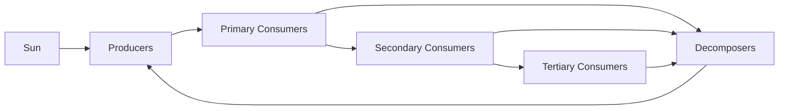
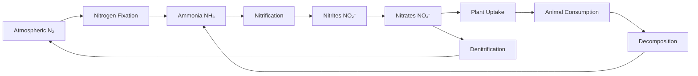
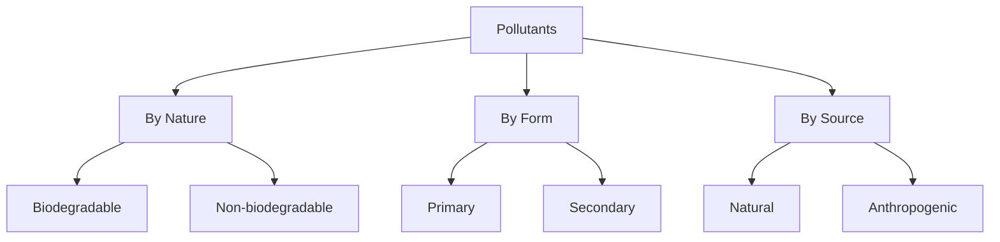

## Question 1(a) [03 marks]

**Explain ecological footprint.**

**Answer:**

Ecological footprint measures the demand on nature by individuals, communities, or nations in terms of biologically productive land and water area required to sustain their lifestyle.

**Table: Components of Ecological Footprint**

| Component | Description |
|-----------|-------------|
| **Carbon Footprint** | Land needed to absorb CO₂ emissions |
| **Cropland** | Area for food production |
| **Grazing Land** | Area for livestock |
| **Forest Products** | Area for timber and paper |
| **Built-up Land** | Infrastructure and urban areas |

- **Global hectares**: Standard unit for measurement
- **Overshoot**: When footprint exceeds biocapacity
- **Sustainability**: Balance between consumption and regeneration

**Mnemonic:** "CGFBB" - Carbon, Cropland, Grazing, Forest, Built-up

---

## Question 1(b) [04 marks]

**Explain Eltonian pyramid.**

**Answer:**

Eltonian pyramid (Pyramid of Numbers) shows the number of organisms at each trophic level in an ecosystem, proposed by Charles Elton.

**Diagram:**

```goat
Tertiary Consumers
(Few - 10)
         
Secondary Consumers  
(Moderate - 100)
      
Primary Consumers
(Many - 1000)
     
Producers
(Maximum - 10000)
```

**Table: Pyramid Types**

| Type | Basis | Shape |
|------|-------|-------|
| **Numbers** | Individual count | Usually upright |
| **Biomass** | Total weight | Can be inverted |
| **Energy** | Energy flow | Always upright |

- **Trophic levels**: Feeding positions in food chain
- **10% rule**: Only 10% energy transfers to next level
- **Exceptions**: Tree ecosystem shows inverted number pyramid

**Mnemonic:** "ELTON" - Energy Loss Through Organism Numbers

---

## Question 1(c) [07 marks]

**Explain Eco-system with its classification and component.**

**Answer:**

Ecosystem is a functional unit of nature where living organisms interact with each other and their physical environment, involving energy flow and nutrient cycling.

**Table: Ecosystem Components**

| Component | Type | Examples |
|-----------|------|----------|
| **Abiotic** | Non-living | Air, water, soil, climate |
| **Biotic** | Living | Plants, animals, microorganisms |
| **Producers** | Autotrophs | Green plants, algae |
| **Consumers** | Heterotrophs | Herbivores, carnivores, omnivores |
| **Decomposers** | Recyclers | Bacteria, fungi |

**Classification of Ecosystems:**

**Natural Ecosystems:**

- **Terrestrial**: Forest, grassland, desert
- **Aquatic**: Freshwater (pond, river), Marine (ocean, sea)

**Artificial Ecosystems:**

- **Agricultural**: Crop fields, gardens
- **Urban**: Parks, artificial lakes

**Diagram: Energy Flow**



- **Energy flow**: Unidirectional from sun to decomposers
- **Nutrient cycling**: Cyclical movement of elements
- **Food chains**: Linear energy transfer
- **Food webs**: Interconnected food chains

**Mnemonic:** "PEACE" - Producers, Energy, Animals, Cycles, Environment

---

## Question 1(c OR) [07 marks]

**Explain Nitrogen cycle.**

**Answer:**

Nitrogen cycle is the biogeochemical cycle that converts nitrogen compounds through various chemical forms as it circulates through atmosphere, terrestrial and aquatic systems.

**Diagram: Nitrogen Cycle**



**Table: Nitrogen Cycle Processes**

| Process | Conversion | Organisms |
|---------|------------|-----------|
| **Fixation** | N₂ → NH₃ | Rhizobium, Azotobacter |
| **Nitrification** | NH₃ → NO₂⁻ → NO₃⁻ | Nitrosomonas, Nitrobacter |
| **Assimilation** | NO₃⁻ → Proteins | Plants |
| **Decomposition** | Proteins → NH₃ | Bacteria, fungi |
| **Denitrification** | NO₃⁻ → N₂ | Anaerobic bacteria |

- **Biological fixation**: 80% of total fixation
- **Industrial fixation**: Haber process for fertilizers
- **Lightning**: Natural atmospheric fixation
- **Pollution**: Excess nitrates cause eutrophication

**Mnemonic:** "FNADD" - Fixation, Nitrification, Assimilation, Decomposition, Denitrification

---

## Question 2(a) [03 marks]

**List the waste water quality parameter.**

**Answer:**

**Table: Wastewater Quality Parameters**

| Physical | Chemical | Biological |
|----------|----------|------------|
| **Turbidity** | **BOD** | **Coliform count** |
| **Color** | **COD** | **Pathogenic bacteria** |
| **Odor** | **pH** | **Algae** |
| **Temperature** | **DO** | **Virus** |
| **Total Solids** | **Ammonia** | **Protozoa** |

- **Primary parameters**: BOD, COD, pH, suspended solids
- **Secondary parameters**: Heavy metals, nutrients
- **Indicator organisms**: E.coli for fecal contamination

**Mnemonic:** "PCB" - Physical, Chemical, Biological parameters

---

## Question 2(b) [04 marks]

**Explain E-waste classification and effects.**

**Answer:**

Electronic waste (E-waste) refers to discarded electrical and electronic equipment containing hazardous materials.

**Table: E-waste Classification**

| Category | Examples | Hazardous Materials |
|----------|----------|-------------------|
| **Large Appliances** | Refrigerators, washing machines | CFCs, heavy metals |
| **Small Appliances** | Microwaves, toasters | Lead, mercury |
| **IT Equipment** | Computers, printers | Cadmium, chromium |
| **Telecom Equipment** | Mobile phones, cables | Beryllium, flame retardants |
| **Consumer Electronics** | TVs, radios | Polyvinyl chloride (PVC) |

**Effects of E-waste:**

- **Environmental**: Soil and water pollution, air contamination
- **Health**: Cancer, neurological disorders, respiratory problems
- **Resource depletion**: Loss of valuable metals like gold, silver
- **Ecosystem damage**: Bioaccumulation in food chain

**Mnemonic:** "LSITC" - Large, Small, IT, Telecom, Consumer electronics

---

## Question 2(c) [07 marks]

**Explain Electrostatic precipitators.**

**Answer:**

Electrostatic precipitators (ESP) are air pollution control devices that remove particulate matter from industrial gas streams using electrical charges.

**Diagram: ESP Working**

```goat
Dirty Gas →  |─────────────────| → Clean Gas
Input        | + Electrode     |   Output
             |                 |
             | - Collection    |
             |   Plate         |
             |                 |
             | Dust Collection |
             | Hopper          |
             |_________________|
```

**Table: ESP Components and Functions**

| Component | Function | Material |
|-----------|----------|----------|
| **Discharge Electrode** | Creates corona discharge | Tungsten wire |
| **Collection Plate** | Attracts charged particles | Steel plates |
| **High Voltage Supply** | Provides 30-100 kV DC | Transformer-rectifier |
| **Rapper System** | Removes collected dust | Mechanical vibrator |
| **Hopper** | Collects fallen particles | Steel container |

**Working Principle:**

1. **Ionization**: High voltage creates corona discharge
2. **Charging**: Particles acquire negative charge
3. **Collection**: Charged particles move to positive plates
4. **Removal**: Rapping dislodges collected dust

**Applications:**

- **Power plants**: Coal-fired boilers
- **Cement industry**: Kiln gas cleaning
- **Steel industry**: Blast furnace gas
- **Chemical plants**: Process gas treatment

**Advantages:**

- **High efficiency**: 99%+ removal for fine particles
- **Low pressure drop**: Energy efficient operation
- **Handles high temperatures**: Up to 400°C

**Mnemonic:** "CHARGE" - Corona, High-voltage, Attract, Rapper, Gas, Efficiency

---

## Question 2(a OR) [03 marks]

**Explain (1) BOD (2) COD**

**Answer:**

**Table: BOD vs COD**

| Parameter | BOD | COD |
|-----------|-----|-----|
| **Full Form** | Biochemical Oxygen Demand | Chemical Oxygen Demand |
| **Method** | Biological oxidation | Chemical oxidation |
| **Time** | 5 days at 20°C | 2-3 hours |
| **Oxidizing Agent** | Microorganisms | Potassium dichromate |

**(1) BOD (Biochemical Oxygen Demand):**

- **Definition**: Oxygen required by microorganisms to decompose organic matter
- **Standard conditions**: 5 days, 20°C, dark conditions
- **Units**: mg/L or ppm

**(2) COD (Chemical Oxygen Demand):**

- **Definition**: Oxygen equivalent to oxidize organic matter chemically
- **Oxidizing agent**: K₂Cr₂O₇ in acidic medium
- **Higher than BOD**: Includes non-biodegradable compounds

**Mnemonic:** "BTCO" - Biological Time, Chemical Oxidation

---

## Question 2(b OR) [04 marks]

**Explain Recycle of E waste.**

**Answer:**

E-waste recycling is the process of recovering valuable materials from electronic waste while safely disposing of hazardous substances.

**Table: E-waste Recycling Process**

| Stage | Process | Recovery |
|-------|---------|----------|
| **Collection** | Gathering from households, offices | Whole devices |
| **Dismantling** | Manual separation of components | Plastics, metals, circuit boards |
| **Shredding** | Mechanical size reduction | Mixed material streams |
| **Separation** | Magnetic, density, optical sorting | Ferrous, non-ferrous metals |
| **Refining** | Chemical processing | Pure metals (Au, Ag, Cu, Pd) |

**Recycling Methods:**

- **Mechanical**: Physical separation and size reduction
- **Pyrometallurgy**: High-temperature metal recovery
- **Hydrometallurgy**: Chemical leaching processes
- **Biotechnology**: Microbial metal extraction

**Benefits:**

- **Resource conservation**: Recovery of precious metals
- **Environmental protection**: Prevents soil and water contamination
- **Economic value**: Job creation and revenue generation
- **Energy savings**: Less energy than primary production

**Mnemonic:** "CDSPR" - Collection, Dismantling, Shredding, Separation, Refining

---

## Question 2(c OR) [07 marks]

**Define pollution and its source. Explain the classification of pollutants.**

**Answer:**

**Definition:** Pollution is the introduction of harmful substances or energy into the environment, causing adverse changes to air, water, soil, or living organisms.

**Table: Sources of Pollution**

| Source Type | Examples | Pollutants Released |
|-------------|----------|-------------------|
| **Point Sources** | Industrial chimneys, sewage outfalls | Specific location discharge |
| **Non-point Sources** | Agricultural runoff, urban stormwater | Diffuse area pollution |
| **Mobile Sources** | Vehicles, ships, aircraft | Exhaust emissions |
| **Stationary Sources** | Power plants, factories | Stack emissions |

**Classification of Pollutants:**

**1. By Nature:**

**Table: Pollutant Classification by Nature**

| Type | Characteristics | Examples |
|------|-----------------|----------|
| **Biodegradable** | Decompose naturally | Organic waste, sewage |
| **Non-biodegradable** | Persist in environment | Plastics, heavy metals |
| **Slowly degradable** | Decompose over years | Pesticides, radioactive materials |

**2. By Form:**

- **Primary**: Directly emitted (SO₂, CO, particulates)
- **Secondary**: Formed by reactions (O₃, acid rain, smog)

**3. By Source:**

- **Natural**: Volcanic eruptions, forest fires
- **Anthropogenic**: Human activities, industrial processes

**Diagram: Pollution Classification**



**Effects of Pollution:**

- **Environmental**: Ecosystem disruption, species extinction
- **Health**: Respiratory diseases, cancer, genetic disorders
- **Economic**: Healthcare costs, reduced productivity
- **Social**: Quality of life degradation

**Mnemonic:** "BNS-PFC" - Biodegradable, Non-biodegradable, Slowly degradable - Primary, Form, Classification

---

## Question 3(a) [03 marks]

**State the working of solar cell.**

**Answer:**

Solar cell converts light energy directly into electrical energy through photovoltaic effect using semiconductor materials.

**Table: Solar Cell Working Process**

| Step | Process | Result |
|------|---------|--------|
| **Photon Absorption** | Light hits semiconductor | Electron excitation |
| **Electron-Hole Generation** | Energy breaks bonds | Free charge carriers |
| **Charge Separation** | Built-in electric field | Electrons to n-side, holes to p-side |
| **Current Collection** | External circuit connection | Electrical current flow |

- **p-n junction**: Creates internal electric field
- **Depletion region**: Area with charge separation
- **External load**: Completes electrical circuit

**Mnemonic:** "PECS" - Photon, Electron, Charge, Separation

---

## Question 3(b) [04 marks]

**Give the comparison between Horizontal Axis and Vertical Axis wind mills.**

**Answer:**

**Table: HAWT vs VAWT Comparison**

| Parameter | Horizontal Axis (HAWT) | Vertical Axis (VAWT) |
|-----------|----------------------|-------------------|
| **Blade Orientation** | Horizontal rotation | Vertical rotation |
| **Wind Direction** | Must face wind | Accepts from any direction |
| **Efficiency** | Higher (35-45%) | Lower (20-35%) |
| **Height** | Tower mounted, high | Ground level installation |
| **Maintenance** | Difficult, high altitude | Easy, ground accessible |
| **Noise** | Moderate | Lower |
| **Cost** | Higher initial | Lower installation |
| **Power Output** | Higher for large scale | Suitable for small scale |

**Advantages:**
**HAWT**: Higher efficiency, proven technology, better power-to-weight ratio
**VAWT**: Omnidirectional, easier maintenance, quieter operation, urban friendly

**Applications:**
**HAWT**: Large wind farms, utility-scale power generation
**VAWT**: Urban areas, small-scale applications, distributed generation

**Mnemonic:** "HEAVEN" - Height, Efficiency, Accessibility, Versatility, Economics, Noise

---

## Question 3(c) [07 marks]

**Explain construction and working of Biogas plant with sketch.**

**Answer:**

Biogas plant produces methane-rich gas through anaerobic digestion of organic waste materials by methanogenic bacteria.

**Diagram: Biogas Plant**

```goat
                Gas Outlet
                    ↑
    Feed Inlet → [Digester] → Slurry Outlet
                    ↓
               Gas Holder
                    ↑
              Underground Chamber
```

**Table: Biogas Plant Components**

| Component | Function | Material |
|-----------|----------|----------|
| **Digester** | Anaerobic fermentation chamber | Concrete/steel |
| **Gas Holder** | Gas storage and pressure regulation | Steel/plastic |
| **Inlet Chamber** | Feed material entry | Masonry |
| **Outlet Chamber** | Slurry discharge | Masonry |
| **Mixing Tank** | Raw material preparation | Concrete |

**Construction Details:**

**Underground Digester:**

- **Shape**: Cylindrical or dome-shaped
- **Capacity**: 10-100 m³ for household plants
- **Wall thickness**: 10-15 cm concrete
- **Insulation**: Prevents heat loss

**Working Process:**

**Table: Biogas Production Stages**

| Stage | Process | Duration | Products |
|-------|---------|----------|----------|
| **Hydrolysis** | Large molecules breakdown | 1-3 days | Simple sugars, amino acids |
| **Acidogenesis** | Acid formation | 3-7 days | Organic acids, alcohols |
| **Methanogenesis** | Methane production | 15-30 days | CH₄ (60%), CO₂ (40%) |

**Operating Conditions:**

- **Temperature**: 30-40°C (mesophilic)
- **pH**: 6.8-7.2 (neutral)
- **C:N ratio**: 25-30:1 optimal
- **Retention time**: 20-30 days

**Applications:**

- **Cooking**: Clean burning fuel
- **Lighting**: Gas lamps
- **Heating**: Space and water heating
- **Electricity**: Generator sets

**Advantages:**

- **Renewable energy**: Sustainable fuel source
- **Waste management**: Organic waste disposal
- **Fertilizer production**: Nutrient-rich slurry
- **Environmental benefits**: Reduces greenhouse gases

**Mnemonic:** "BIGHM" - Biological, Input, Gas, Holder, Methane

---

## Question 3(a OR) [03 marks]

**List the advantages of flat plate collector.**

**Answer:**

**Table: Flat Plate Collector Advantages**

| Category | Advantages |
|----------|------------|
| **Technical** | Simple design, no moving parts, low maintenance |
| **Economic** | Low cost, mass production possible |
| **Operational** | Works with diffuse light, handles both direct and indirect radiation |
| **Durability** | Long life (15-20 years), weather resistant |
| **Versatility** | Multiple applications, modular installation |

**Key Benefits:**

- **Reliability**: No complex mechanisms or controls required
- **Efficiency**: 40-60% thermal efficiency in optimal conditions
- **Installation**: Easy mounting on roofs or ground

**Mnemonic:** "TEODV" - Technical, Economic, Operational, Durability, Versatility

---

## Question 3(b OR) [04 marks]

**What is wind farm? List its advantages.**

**Answer:**

**Definition:** Wind farm is a group of wind turbines installed in the same location for commercial electricity generation, connected to electrical grid through transmission lines.

**Table: Wind Farm Advantages**

| Category | Advantages |
|----------|------------|
| **Environmental** | Clean energy, zero emissions, reduces carbon footprint |
| **Economic** | Job creation, low operating costs, revenue for landowners |
| **Technical** | Scalable capacity, grid stability, energy independence |
| **Social** | Rural development, community benefits, educational opportunities |

**Specific Benefits:**

- **Land use efficiency**: Farming can continue between turbines
- **Quick installation**: Faster than conventional power plants
- **Predictable costs**: Fixed fuel cost (wind is free)
- **Modular expansion**: Capacity can be increased incrementally

**Applications:**

- **Onshore**: Land-based installations
- **Offshore**: Ocean-based for higher wind speeds
- **Distributed**: Small-scale community projects

**Mnemonic:** "ECTS" - Environmental, Economic, Technical, Social benefits

---

## Question 3(c OR) [07 marks]

**Explain in brief (1) Geothermal energy (2) Tidal energy**

**Answer:**

**(1) Geothermal Energy:**

Geothermal energy harnesses heat from Earth's interior for electricity generation and direct heating applications.

**Table: Geothermal Energy Systems**

| Type | Temperature | Applications |
|------|-------------|--------------|
| **High Temperature** | >150°C | Electricity generation |
| **Medium Temperature** | 90-150°C | Direct heating, cooling |
| **Low Temperature** | <90°C | Heat pumps, agriculture |

**Working Principle:**

- **Heat source**: Radioactive decay in Earth's core
- **Extraction**: Wells drilled to access hot water/steam
- **Conversion**: Steam drives turbines for electricity
- **Reinjection**: Water returned to reservoir

**(2) Tidal Energy:**

Tidal energy converts kinetic and potential energy of ocean tides into electricity using predictable tidal movements.

**Table: Tidal Energy Technologies**

| Technology | Principle | Installation |
|------------|-----------|--------------|
| **Tidal Barrage** | Potential energy of tidal range | Dam across estuary |
| **Tidal Stream** | Kinetic energy of tidal currents | Underwater turbines |
| **Tidal Lagoon** | Artificial impoundment | Breakwater construction |

**Advantages:**
**Geothermal**: Baseload power, low emissions, small footprint, reliable
**Tidal**: Predictable, high energy density, long lifespan, no fuel costs

**Challenges:**
**Geothermal**: Location specific, high initial cost, induced seismicity
**Tidal**: High capital cost, environmental impact, limited locations

**Mnemonic:** "GT-POWER" - Geothermal Temperature, Tidal Predictable Ocean Water Energy Resource

---

## Question 4(a) [03 marks]

**Explain Need of Renewable energy.**

**Answer:**

**Table: Need for Renewable Energy**

| Driver | Reasons |
|--------|---------|
| **Environmental** | Climate change mitigation, reduced pollution |
| **Economic** | Energy security, price stability, job creation |
| **Technical** | Depleting fossil fuels, technological advancement |
| **Social** | Rural development, health benefits, energy access |

**Key Needs:**

- **Climate commitments**: Meet Paris Agreement targets
- **Energy independence**: Reduce import dependence
- **Sustainable development**: Long-term energy security

**Mnemonic:** "EETS" - Environmental, Economic, Technical, Social needs

---

## Question 4(b) [04 marks]

**Explain Depletion of ozone layer.**

**Answer:**

Ozone layer depletion is the reduction of ozone concentration in stratosphere due to human-made chemicals, particularly chlorofluorocarbons (CFCs).

**Table: Ozone Depletion Process**

| Stage | Process | Chemical Reaction |
|-------|---------|------------------|
| **CFC Release** | Industrial emissions | CFCs rise to stratosphere |
| **UV Breakdown** | Photodissociation | CFC + UV → Cl + other products |
| **Ozone Destruction** | Catalytic cycle | Cl + O₃ → ClO + O₂ |
| **Chain Reaction** | Continuous process | ClO + O → Cl + O₂ |

**Causes:**

- **Primary**: CFCs, halons, methyl bromide
- **Secondary**: HCFCs, nitrous oxide, carbon tetrachloride

**Effects:**

- **Increased UV-B radiation**: Skin cancer, cataracts
- **Environmental impact**: Reduced crop yields, marine ecosystem damage
- **Climate effects**: Altered atmospheric circulation

**Solutions:**

- **Montreal Protocol**: International agreement (1987)
- **CFC phase-out**: Replacement with ozone-friendly alternatives
- **HCFC transition**: Temporary substitutes being phased out

**Mnemonic:** "CURE" - CFCs, UV, Reactions, Effects

---

## Question 4(c) [07 marks]

**Explain: (1) Greenhouse effect (2) climate change management**

**Answer:**

**(1) Greenhouse Effect:**

Natural process where certain atmospheric gases trap heat from sun, maintaining Earth's temperature suitable for life.

**Diagram: Greenhouse Effect**


**Table: Greenhouse Gases**

| Gas | Sources | Contribution | Lifetime |
|-----|---------|--------------|----------|
| **CO₂** | Fossil fuels, deforestation | 76% | 300-1000 years |
| **CH₄** | Agriculture, landfills | 16% | 12 years |
| **N₂O** | Fertilizers, combustion | 6% | 120 years |
| **F-gases** | Industrial processes | 2% | Varies |

**Enhanced Greenhouse Effect:**

- **Cause**: Increased GHG concentrations from human activities
- **Result**: Global temperature rise, climate change
- **Feedback loops**: Amplify warming effects

**(2) Climate Change Management:**

Comprehensive approach to address climate change through mitigation and adaptation strategies.

**Table: Climate Change Management Strategies**

| Strategy | Approach | Examples |
|----------|----------|----------|
| **Mitigation** | Reduce GHG emissions | Renewable energy, energy efficiency |
| **Adaptation** | Adjust to climate impacts | Sea walls, drought-resistant crops |
| **Technology** | Innovation solutions | Carbon capture, smart grids |
| **Policy** | Regulatory frameworks | Carbon pricing, emissions standards |
| **International** | Global cooperation | Paris Agreement, climate finance |

**Mitigation Measures:**

- **Energy sector**: Renewable energy deployment, efficiency improvements
- **Transport**: Electric vehicles, public transport, biofuels
- **Industry**: Process optimization, low-carbon technologies
- **Buildings**: Green construction, smart systems
- **Agriculture**: Sustainable practices, reduced emissions

**Adaptation Measures:**

- **Infrastructure**: Climate-resilient design, flood protection
- **Ecosystem**: Conservation, restoration, corridors
- **Water resources**: Efficient use, storage, quality management
- **Health**: Disease surveillance, heat wave preparedness

**Management Framework:**

1. **Assessment**: Climate risk and vulnerability analysis
2. **Planning**: Integrated strategies and action plans
3. **Implementation**: Project execution and monitoring
4. **Evaluation**: Performance assessment and adjustment

**Mnemonic:** "GEMMA" - Gases, Enhanced, Mitigation, Management, Adaptation

---

## Question 4(a OR) [03 marks]

**Discuss Factors affecting climate change.**

**Answer:**

**Table: Climate Change Factors**

| Factor Type | Examples | Impact |
|-------------|----------|--------|
| **Natural** | Solar variations, volcanic eruptions | Minor influence |
| **Anthropogenic** | GHG emissions, land use change | Major driver |
| **Feedback** | Ice-albedo, water vapor | Amplification |

**Key Factors:**

- **Greenhouse gas concentrations**: Primary driver of warming
- **Aerosols**: Cooling effect, masks some warming
- **Land use changes**: Deforestation, urbanization effects

**Mnemonic:** "NAF" - Natural, Anthropogenic, Feedback factors

---

## Question 4(b OR) [04 marks]

**Explain climate change.**

**Answer:**

Climate change refers to long-term shifts in global temperatures and weather patterns, primarily caused by human activities since mid-20th century.

**Table: Climate Change Indicators**

| Indicator | Observed Changes | Trend |
|-----------|------------------|-------|
| **Temperature** | +1.1°C since 1880 | Rising |
| **Sea Level** | 21-24 cm since 1880 | Rising |
| **Arctic Ice** | 13% per decade loss | Declining |
| **Precipitation** | Regional variations | Changing patterns |

**Causes:**

- **Primary**: Greenhouse gas emissions from fossil fuels
- **Secondary**: Deforestation, industrial processes, agriculture

**Impacts:**

- **Physical**: Extreme weather, sea level rise, ice loss
- **Biological**: Species migration, ecosystem disruption
- **Human**: Food security, water resources, health

**Evidence:**

- **Temperature records**: Global warming trend
- **Ice core data**: Historical CO₂ levels
- **Satellite observations**: Ice sheet changes

**Mnemonic:** "CHIP" - Causes, Human impacts, Indicators, Physical evidence

---

## Question 4(c OR) [07 marks]

**Write short note on Global warming.**

**Answer:**

Global warming is the long-term increase in Earth's average surface temperature due to enhanced greenhouse effect from human activities.

**Table: Global Warming Components**

| Aspect | Details | Impact |
|--------|---------|--------|
| **Definition** | Increase in global average temperature | +1.1°C since pre-industrial |
| **Primary Cause** | CO₂ emissions from fossil fuels | 410+ ppm atmospheric CO₂ |
| **Timeline** | Accelerated since 1950s | Fastest warming in 10,000 years |
| **Regional Variation** | Arctic warming 2x global average | Polar amplification |

**Causes of Global Warming:**

**Table: Emission Sources**

| Sector | Contribution | Main Activities |
|--------|--------------|----------------|
| **Energy** | 73% | Electricity, heat, transport |
| **Agriculture** | 18% | Livestock, rice cultivation |
| **Industrial** | 5% | Cement, steel, chemicals |
| **Waste** | 3% | Landfills, wastewater |
| **Land Use** | 1% | Deforestation, development |

**Consequences:**

- **Physical impacts**: Sea level rise, glacier retreat, permafrost thaw
- **Weather patterns**: More frequent heatwaves, altered precipitation
- **Ecosystem effects**: Species extinction, habitat loss, coral bleaching
- **Human impacts**: Agricultural disruption, water scarcity, health risks

**Feedback Mechanisms:**

- **Ice-albedo feedback**: Less ice → more heat absorption
- **Water vapor feedback**: Warmer air holds more moisture
- **Permafrost feedback**: Thawing releases stored carbon

**Solutions:**

- **Mitigation**: Reduce greenhouse gas emissions
- **Renewable energy**: Solar, wind, hydroelectric power
- **Energy efficiency**: Buildings, transport, industry
- **Carbon sequestration**: Forests, soil, technological capture
- **Policy measures**: Carbon pricing, regulations, incentives

**International Response:**

- **UNFCCC**: Framework Convention on Climate Change
- **Kyoto Protocol**: First binding emission reduction agreement
- **Paris Agreement**: Current global climate accord (2015)
- **IPCC Reports**: Scientific assessment and guidance

**Future Projections:**

- **Temperature rise**: 1.5-4.5°C by 2100 depending on emissions
- **Sea level rise**: 0.43-2.84 m by 2100
- **Tipping points**: Irreversible changes in climate system

**Mnemonic:** "GWCF" - Global Warming Causes Consequences Feedback

---

## Question 5(a) [03 marks]

**Explain the concept of "Eco Tourism"**

**Answer:**

Eco-tourism is responsible travel to natural areas that conserves environment, sustains well-being of local people, and involves interpretation and education.

**Table: Eco-tourism Principles**

| Principle | Description |
|-----------|-------------|
| **Conservation** | Protect natural habitats and wildlife |
| **Community** | Benefit local communities economically |
| **Education** | Environmental awareness and learning |
| **Sustainability** | Long-term environmental protection |
| **Responsibility** | Minimize negative impacts |

- **Nature-based**: Focus on natural environments
- **Low-impact**: Minimal environmental disturbance
- **Cultural respect**: Value local traditions and customs

**Mnemonic:** "ECERS" - Environment, Community, Education, Responsibility, Sustainability

---

## Question 5(b) [04 marks]

**Comparison of conventional and nonconventional energy source.**

**Answer:**

**Table: Conventional vs Non-conventional Energy Sources**

| Parameter | Conventional | Non-conventional |
|-----------|--------------|------------------|
| **Examples** | Coal, oil, natural gas, nuclear | Solar, wind, hydro, biomass |
| **Availability** | Limited reserves | Abundant and renewable |
| **Environmental Impact** | High pollution, CO₂ emissions | Clean, minimal emissions |
| **Cost** | Initially lower, rising prices | High initial, decreasing costs |
| **Technology** | Mature, established | Developing, improving |
| **Reliability** | Consistent supply | Weather dependent |
| **Infrastructure** | Well-established | Requires development |
| **Depletion** | Exhaustible resources | Inexhaustible sources |

**Advantages:**
**Conventional**: Reliable supply, established infrastructure, high energy density
**Non-conventional**: Sustainable, clean, job creation, energy independence

**Challenges:**
**Conventional**: Environmental damage, price volatility, finite resources
**Non-conventional**: Intermittency, storage needs, initial investment

**Mnemonic:** "CATERED" - Conventional Available Technology Established Reliable Environmental Depletion

---

## Question 5(c) [07 marks]

**Explain (1) The water Act, 1974 (2) The Environment Act, 1986**

**Answer:**

**(1) The Water (Prevention and Control of Pollution) Act, 1974:**

Comprehensive legislation to prevent and control water pollution and maintain/restore wholesomeness of water in India.

**Table: Water Act 1974 - Key Provisions**

| Aspect | Details |
|--------|---------|
| **Objective** | Prevent and control water pollution |
| **Authority** | Central and State Pollution Control Boards |
| **Coverage** | All water bodies - rivers, streams, wells, groundwater |
| **Penalties** | Fines and imprisonment for violations |

**Key Features:**

- **Pollution Control Boards**: Establishment at central and state levels
- **Consent mechanism**: No-objection certificates for industries
- **Standards**: Water quality standards and effluent discharge limits
- **Monitoring**: Regular inspection and sampling of water bodies
- **Emergency provisions**: Power to handle pollution emergencies

**Powers of Boards:**

- **Planning**: Pollution prevention and control programs
- **Standard setting**: Water quality and discharge standards
- **Consent granting**: Permission for waste discharge
- **Monitoring**: Water quality surveillance
- **Enforcement**: Legal action against violators

**(2) The Environment (Protection) Act, 1986:**

Umbrella legislation providing framework for environmental protection and improvement in India, enacted after Bhopal gas tragedy.

**Table: Environment Act 1986 - Key Provisions**

| Aspect | Details |
|--------|---------|
| **Objective** | Comprehensive environmental protection |
| **Scope** | Air, water, land pollution and hazardous substances |
| **Authority** | Central Government and designated agencies |
| **Penalties** | Imprisonment up to 5 years and/or fine up to ₹1 lakh |

**Key Features:**

- **General powers**: Central government authority for environmental protection
- **Standards**: Environmental quality standards for air, water, soil
- **Impact assessment**: Environmental clearance for projects
- **Hazardous substances**: Regulation of handling and disposal
- **Public participation**: Right to information and participation

**Important Rules:**

- **EIA Notification 2006**: Environmental Impact Assessment
- **Hazardous Waste Rules**: Management and handling
- **Noise Pollution Rules**: Ambient noise standards
- **Coastal Regulation Zone**: Coastal area protection

**Comparison:**

**Table: Water Act vs Environment Act**

| Aspect | Water Act 1974 | Environment Act 1986 |
|--------|----------------|----------------------|
| **Scope** | Water pollution only | All environmental media |
| **Approach** | Sectoral | Comprehensive |
| **Implementation** | PCBs | Central Government |
| **Penalties** | Moderate | Stringent |

**Enforcement Mechanisms:**

- **Monitoring**: Regular inspection and compliance checking
- **Legal action**: Prosecution of violators
- **Closure orders**: Shutting down polluting units
- **Compensation**: Environmental damage assessment

**Mnemonic:** "WEPCA" - Water Environmental Protection Comprehensive Act

---

## Question 5(a OR) [03 marks]

**Explain the concept "Carbon Credit"**

**Answer:**

Carbon credit is a tradeable certificate representing one tonne of CO₂ equivalent reduced or removed from atmosphere through emission reduction or carbon sequestration projects.

**Table: Carbon Credit Mechanism**

| Component | Description |
|-----------|-------------|
| **Unit** | 1 credit = 1 tonne CO₂ equivalent |
| **Generation** | Emission reduction/removal projects |
| **Trading** | Buy/sell in carbon markets |
| **Verification** | Third-party validation required |

- **CDM**: Clean Development Mechanism under Kyoto Protocol
- **Voluntary markets**: Private sector initiatives
- **Compliance markets**: Regulatory requirements

**Mnemonic:** "CUTV" - Credit Unit Trading Verification

---

## Question 5(b OR) [04 marks]

**Explain in brief "Solid waste Management"**

**Answer:**

Solid waste management is systematic collection, transport, processing, recycling, and disposal of solid materials discarded by human activities.

**Table: Solid Waste Management Hierarchy**

| Priority | Method | Description |
|----------|--------|-------------|
| **1st** | **Reduce** | Minimize waste generation |
| **2nd** | **Reuse** | Use items multiple times |
| **3rd** | **Recycle** | Convert waste to new products |
| **4th** | **Recovery** | Energy recovery from waste |
| **5th** | **Disposal** | Safe landfilling |

**Management Process:**

- **Collection**: Door-to-door pickup, segregation at source
- **Transportation**: Transfer stations, bulk transport
- **Treatment**: Composting, recycling, incineration
- **Disposal**: Sanitary landfills, waste-to-energy

**Technologies:**

- **Composting**: Organic waste decomposition
- **Incineration**: High-temperature burning with energy recovery
- **Anaerobic digestion**: Biogas production from organic waste
- **Material recovery**: Separation and recycling of materials

**Challenges:**

- **Increasing quantities**: Population and consumption growth
- **Mixed waste**: Lack of source segregation
- **Infrastructure**: Inadequate collection and treatment facilities
- **Financing**: High capital and operational costs

**Mnemonic:** "CTTD" - Collection, Transportation, Treatment, Disposal

---

## Question 5(c OR) [07 marks]

**Explain the concept of "5R"**

**Answer:**

The 5R concept is a comprehensive waste management hierarchy that promotes sustainable consumption and waste reduction through five interconnected strategies.

**Table: 5R Waste Management Hierarchy**

| R | Strategy | Definition | Examples |
|---|----------|------------|----------|
| **1. Refuse** | Reject unnecessary items | Avoid products that create waste | Say no to plastic bags, disposable items |
| **2. Reduce** | Minimize consumption | Use less of resources | Buy only needed items, choose durable products |
| **3. Reuse** | Use items multiple times | Extend product lifespan | Repurpose containers, donate old clothes |
| **4. Repurpose** | Creative alternative uses | Transform waste into useful items | Convert bottles to planters, tires to swings |
| **5. Recycle** | Process waste into new products | Material recovery and reprocessing | Paper, plastic, metal recycling |

**Detailed Explanation:**

**1. Refuse:**

- **Concept**: First line of defense against waste
- **Implementation**: Consumer choice and awareness
- **Impact**: Prevents waste generation at source
- **Examples**: Refusing single-use plastics, unnecessary packaging

**2. Reduce:**

- **Concept**: Minimize resource consumption and waste generation
- **Strategies**: Efficient use, durability focus, sharing economy
- **Benefits**: Lower environmental footprint, cost savings
- **Applications**: Energy efficiency, water conservation, minimal packaging

**3. Reuse:**

- **Concept**: Extend product life without reprocessing
- **Methods**: Direct reuse, repair and maintenance, redistribution
- **Advantages**: Energy savings, economic benefits, creativity
- **Examples**: Glass jars for storage, furniture restoration

**4. Repurpose:**

- **Concept**: Creative transformation for different functions
- **Innovation**: Design thinking and creativity
- **Community aspect**: Maker spaces, DIY culture
- **Environmental benefit**: Waste diversion from landfills

**5. Recycle:**

- **Concept**: Material recovery and reprocessing
- **Types**: Mechanical, chemical, biological recycling
- **Infrastructure**: Collection, sorting, processing facilities
- **Markets**: End-use applications for recycled materials

**Implementation Framework:**

**Table: 5R Implementation Levels**

| Level | Stakeholders | Actions | Outcomes |
|-------|--------------|---------|----------|
| **Individual** | Consumers, households | Conscious choices, lifestyle changes | Reduced personal footprint |
| **Community** | Neighborhoods, schools | Local programs, awareness campaigns | Community engagement |
| **Business** | Companies, industries | Circular economy, sustainable design | Resource efficiency |
| **Government** | Policy makers, regulators | Regulations, incentives, infrastructure | System-wide change |

**Benefits of 5R Approach:**

- **Environmental**: Reduced pollution, resource conservation, climate protection
- **Economic**: Cost savings, job creation, new business opportunities
- **Social**: Community engagement, education, behavioral change
- **Resource security**: Reduced dependence on virgin materials

**Challenges:**

- **Consumer behavior**: Changing established habits and preferences
- **Infrastructure**: Adequate collection and processing facilities
- **Economics**: Market viability of recycled products
- **Policy support**: Regulatory framework and incentives

**Success Factors:**

- **Education**: Awareness and capacity building programs
- **Infrastructure**: Adequate waste management systems
- **Policy**: Supportive regulations and economic instruments
- **Technology**: Innovation in waste processing and product design
- **Collaboration**: Multi-stakeholder partnerships

**Circular Economy Connection:**
The 5R concept forms the foundation of circular economy principles, where waste becomes input for new production cycles, minimizing resource extraction and environmental impact.

**Measurement and Monitoring:**

- **Waste reduction metrics**: Quantity diverted from disposal
- **Material recovery rates**: Percentage of waste recycled/reused
- **Environmental indicators**: Carbon footprint, resource consumption
- **Economic metrics**: Cost savings, job creation, revenue generation

**Global Examples:**

- **Zero Waste Cities**: San Francisco, Ljubljana, Kamikatsu
- **Extended Producer Responsibility**: EU packaging regulations
- **Deposit Systems**: Bottle return programs in Germany, Canada
- **Sharing Economy**: Tool libraries, clothing swaps, repair cafes

**Future Directions:**

- **Digital platforms**: Apps for waste reduction and sharing
- **Advanced recycling**: Chemical recycling, AI-powered sorting
- **Bioplastics**: Biodegradable alternatives to conventional plastics
- **Policy evolution**: Right to repair, extended producer responsibility

**Mnemonic:** "R5-POWER" - Refuse, Reduce, Reuse, Repurpose, Recycle - Protect Our World's Environmental Resources
