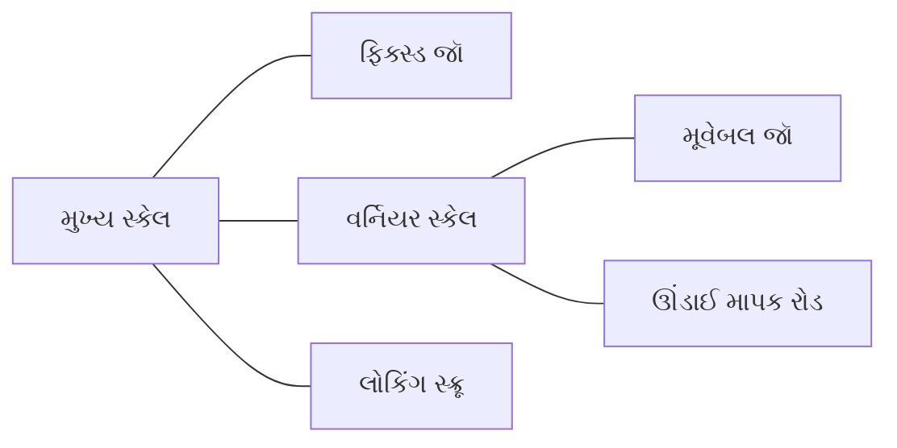
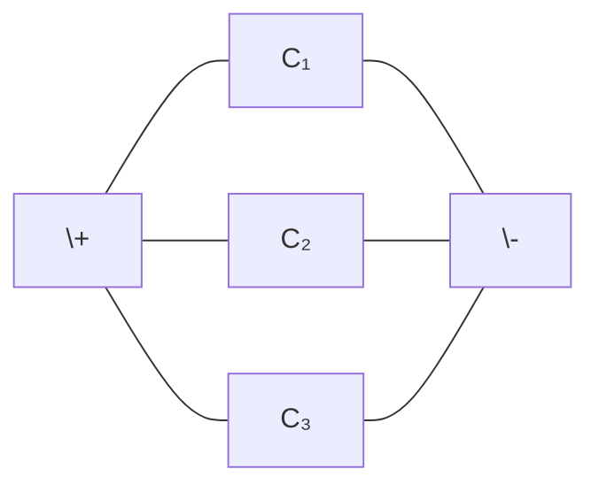
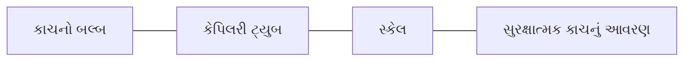
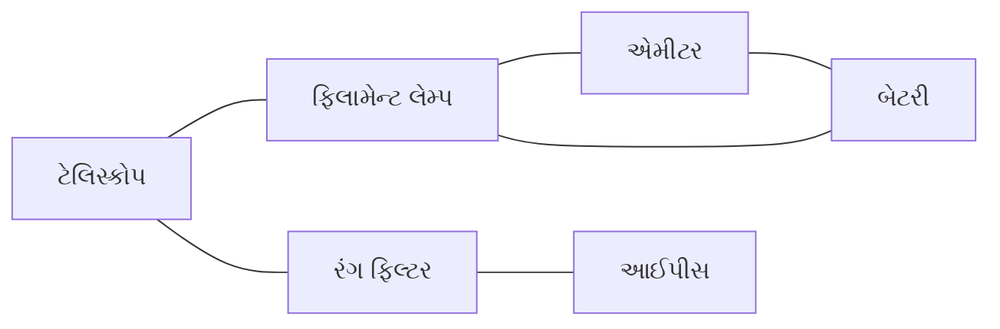
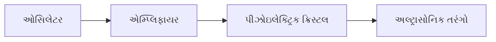
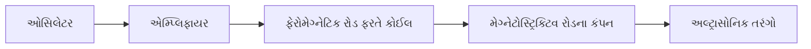
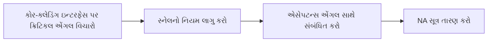

## પ્રશ્ન 1(અ) [3 ગુણ]

**SI માં બેઝ યુનિટ તેમના સિમ્બોલ સાથે લખો.**

**જવાબ**:

| ભૌતિક રાશિ | એકમ | સિમ્બોલ |
|-----------|-----|--------|
| લંબાઈ | મીટર | m |
| દ્રવ્યમાન | કિલોગ્રામ | kg |
| સમય | સેકન્ડ | s |
| વિદ્યુત પ્રવાહ | એમ્પિયર | A |
| તાપમાન | કેલ્વિન | K |
| પદાર્થનું પ્રમાણ | મોલ | mol |
| પ્રકાશ તીવ્રતા | કેન્ડેલા | cd |

**મેમરી ટ્રીક:** "લાંબુ માપ તાપમાન અશક્તિ પ્રકાશે કેવી માનવતા"

## પ્રશ્ન 1(બ) [4 ગુણ]

**વર્નિયર કેલિપરની રચના અને કાર્ય સમજાવો. તેની લઘુત્તમ માપ શક્તિ અને શૂન્ય ત્રુટી સમજાવો.**

**જવાબ**:

**વર્નિયર કેલિપરની રચના:**



- **મુખ્ય સ્કેલ**: મિલિમીટરમાં અંકિત ફિક્સ થયેલો સ્કેલ
- **વર્નિયર સ્કેલ**: મુખ્ય સ્કેલ કરતાં થોડા નાના વિભાગો ધરાવતો સરકી શકે તેવો સ્કેલ
- **ફિક્સ્ડ જૉ**: મુખ્ય સ્કેલ સાથે જોડાયેલો
- **મૂવેબલ જૉ**: વર્નિયર સ્કેલ સાથે જોડાયેલો
- **ઊંડાઈ માપક રોડ**: ઊંડાઈ માપવા માટે
- **લોકિંગ સ્ક્રૂ**: માપન વખતે સ્થિતિ ફિક્સ કરવા માટે

**કાર્ય**: વસ્તુને બે જૉ વચ્ચે મૂકવામાં આવે છે, મૂવેબલ જૉને વસ્તુને સારી રીતે પકડવા માટે એડજસ્ટ કરવામાં આવે છે. મુખ્ય સ્કેલ વાંચન અને વર્નિયર સ્કેલના સંપાતી મૂલ્યને ઉમેરીને માપ નોંધવામાં આવે છે.

**લઘુત્તમ માપ શક્તિ**: વર્નિયર કેલિપર દ્વારા માપી શકાતું સૌથી નાનું માપ.
LC = મુખ્ય સ્કેલ પર 1 વિભાગ ÷ વર્નિયર સ્કેલ પર વિભાગોની સંખ્યા

**શૂન્ય ત્રુટી**: જ્યારે જૉ બંધ હોય ત્યારે કેલિપર શૂન્ય સિવાયનું વાંચન બતાવે તે ત્રુટી.

- **ધન ત્રુટી**: વાંચનમાંથી બાદ કરવી
- **ઋણ ત્રુટી**: વાંચનમાં ઉમેરવી

**મેમરી ટ્રીક:** "વર્નિયર ચોક્કસ માપ લેતા સમયે ત્રુટીઓ ટાળે"

## પ્રશ્ન 1(ક)(i) [4 ગુણ]

**ચોકસાઈ અને સચોટતા વચ્ચેનો તફાવત લખો.**

**જવાબ**:

| ચોકસાઈ | સચોટતા |
|--------|---------|
| માપનું સાચા મૂલ્યની નજીકતા | માપની પુનરાવર્તનીયતા |
| પદ્ધતિગત ત્રુટીઓથી પ્રભાવિત | અનિયમિત ત્રુટીઓથી પ્રભાવિત |
| માપનના સરેરાશ દ્વારા દર્શાવાય છે | માપના પ્રમાણિત વિચલન દ્વારા દર્શાવાય છે |
| કેલિબ્રેશન દ્વારા સુધારી શકાય | વધુ સારા ઉપકરણો વાપરીને સુધારી શકાય |
| ઉદાહરણ: જો સાચું મૂલ્ય 10 cm હોય, તો 9.9, 10.1, અને 10.0 cm ના માપ ચોક્કસ છે | ઉદાહરણ: 9.8, 9.8, 9.8 cm ના માપ સચોટ છે પણ સાચું મૂલ્ય 10 cm હોય તો ચોક્કસ નથી |

**મેમરી ટ્રીક:** "ચોક્સાઈ ચોક્કસ સાચા મૂલ્યે, સચોટતા સરખાં સમાન વાંચને"

## પ્રશ્ન 1(ક)(ii) [2 ગુણ]

**માઇક્રોમીટર સ્ક્રૂ ગેજની પિચ 0.5 mm છે અને તેના વર્તુળાકાર સ્કેલ પર 50 વિભાગો છે. તેની લઘુત્તમ માપ શક્તિ શોધો.**

**જવાબ**:

**સૂત્ર**: લઘુત્તમ માપ શક્તિ = પિચ ÷ વર્તુળાકાર સ્કેલ પર વિભાગોની સંખ્યા

**ગણતરી**:
LC = 0.5 mm ÷ 50 = 0.01 mm

**માઇક્રોમીટર સ્ક્રૂ ગેજની લઘુત્તમ માપ શક્તિ = 0.01 mm**

## પ્રશ્ન 1(ક)(iii) [1 ગુણ]

**ઉષ્માનું SI એકમ શું છે?**

**જવાબ**:

ઉષ્માનું SI એકમ **જૂલ (J)** છે

## પ્રશ્ન 1(ક)(i) [4 ગુણ] (OR)

**નિરપેક્ષ અને સાપેક્ષ ત્રુટીઓની ગણતરી કેવી રીતે કરવામાં આવે છે?**

**જવાબ**:

**નિરપેક્ષ ત્રુટિ (Δa)**: માપેલા મૂલ્ય અને સાચા મૂલ્ય વચ્ચેનો તફાવત

- ઘણા માપો માટે, તે માપેલા મૂલ્ય અને સરેરાશ મૂલ્ય વચ્ચેનો તફાવત છે

**નિરપેક્ષ ત્રુટિની ગણતરી**:

- **એક માપ માટે**: Δa = |માપેલું મૂલ્ય - સાચું મૂલ્ય|
- **ઘણા માપો માટે**: 
  1. સરેરાશ ગણો (am)
  2. દરેક માપ માટે: Δai = |ai - am|
  3. સરેરાશ નિરપેક્ષ ત્રુટિ: Δa = (Δa1 + Δa2 + ... + Δan) ÷ n

**સાપેક્ષ ત્રુટિ (εr)**: નિરપેક્ષ ત્રુટિનો સાચા મૂલ્ય સાથેનો ગુણોત્તર

- εr = નિરપેક્ષ ત્રુટિ ÷ સાચું મૂલ્ય = Δa ÷ સાચું મૂલ્ય

**ટકાવારી ત્રુટિ (εp)**: ટકાવારીમાં વ્યક્ત થયેલી સાપેક્ષ ત્રુટિ

- εp = સાપેક્ષ ત્રુટિ × 100 = (Δa ÷ સાચું મૂલ્ય) × 100%

**મેમરી ટ્રીક:** "નિરપેક્ષ નિશ્ચિત મૂલ્યની ગણતરી, સાપેક્ષ સાચા સંદર્ભે સંબંધિત"

## પ્રશ્ન 1(ક)(ii) [2 ગુણ] (OR)

**વર્નિયર કેલિપરનો મુખ્ય સ્કેલ mm માં અંકિત કરવામાં આવેલ છે અને તેના વર્નિયર સ્કેલ પર 50 વિભાગો છે. તેની લઘુત્તમ માપ શક્તિ શોધો.**

**જવાબ**:

**સૂત્ર**: લઘુત્તમ માપ શક્તિ = મુખ્ય સ્કેલ પર 1 વિભાગ ÷ વર્નિયર સ્કેલ પર વિભાગોની સંખ્યા

**ગણતરી**:
મુખ્ય સ્કેલ પર 1 વિભાગ = 1 mm
LC = 1 mm ÷ 50 = 0.02 mm

**વર્નિયર કેલિપરની લઘુત્તમ માપ શક્તિ = 0.02 mm**

## પ્રશ્ન 1(ક)(iii) [1 ગુણ] (OR)

**ઉષ્મા પ્રસરણના કયા પ્રકારમાં માધ્યમની જરૂર નથી?**

**જવાબ**:

**વિકિરણ (Radiation)** ઉષ્મા પ્રસરણ માટે માધ્યમની જરૂર નથી.

## પ્રશ્ન 2(અ) [3 ગુણ]

**વિદ્યુત ક્ષેત્ર રેખાઓની લાક્ષણિકતાઓ લખો.**

**જવાબ**:

**વિદ્યુત ક્ષેત્ર રેખાઓની લાક્ષણિકતાઓ**:

1. વિદ્યુત ક્ષેત્ર રેખાઓ ધન ચાર્જથી શરૂ થાય છે અને ઋણ ચાર્જ પર સમાપ્ત થાય છે
2. ક્ષેત્ર રેખાઓ ક્યારેય એકબીજાને છેદતી નથી
3. ક્ષેત્ર રેખાઓ હંમેશા વાહકની સપાટી પર લંબરૂપ હોય છે
4. ક્ષેત્ર રેખાઓની સંખ્યા ચાર્જના જથ્થા સાથે પ્રમાણસર હોય છે
5. નજીકની ક્ષેત્ર રેખાઓ મજબૂત વિદ્યુત ક્ષેત્ર સૂચવે છે
6. ક્ષેત્ર રેખાઓ સતત વક્ર હોય છે
7. ક્ષેત્ર રેખાઓ લંબાઈમાં સંકોચાય છે અને પહોળાઈમાં વિસ્તરે છે

**આકૃતિ**:

```goat
     +           -
      \         /
       \       /
        \     /
         \   /
          \ /
           X
```

**મેમરી ટ્રીક:** "વિદ્યુત ક્ષેત્ર: ધનથી શરૂ, ઋણે સમાપ્ત, ક્યારેય છેદાતી નથી"

## પ્રશ્ન 2(બ) [4 ગુણ]

**ઇલેક્ટ્રોસ્ટેટિક બળ માટે કુલંબનો વ્યસ્ત વર્ગનો નિયમને સમજાવો.**

**જવાબ**:

**કુલંબનો વ્યસ્ત વર્ગનો નિયમ**: બે બિંદુ ચાર્જ વચ્ચેનું ઇલેક્ટ્રોસ્ટેટિક બળ ચાર્જના જથ્થાના ગુણાકાર સાથે સીધું પ્રમાણસર અને તેમની વચ્ચેના અંતરના વર્ગ સાથે વ્યસ્ત પ્રમાણસર હોય છે.

**ગણિતીય સ્વરૂપ**:
F = k(q₁q₂)/r²

જ્યાં:

- F = ઇલેક્ટ્રોસ્ટેટિક બળ (ન્યૂટનમાં)
- k = ઇલેક્ટ્રોસ્ટેટિક અચળાંક (9×10⁹ N·m²/C²)
- q₁, q₂ = ચાર્જના જથ્થા (કુલંબમાં)
- r = ચાર્જ વચ્ચેનું અંતર (મીટરમાં)

**ગુણધર્મો**:

- **સદિશ રાશિ**: બળ બે ચાર્જને જોડતી રેખા પર કાર્ય કરે છે
- **આકર્ષક/અપાકર્ષક**: સમાન ચાર્જ એકબીજાને અપાકર્ષિત કરે છે, વિપરીત ચાર્જ આકર્ષિત કરે છે
- **કેન્દ્રીય બળ**: ન્યૂટનના ત્રીજા નિયમને અનુસરે છે
- **માધ્યમ પર આધાર**: ચાર્જ વચ્ચેના માધ્યમ પર આધાર રાખે છે (k બદલાય છે)

**આકૃતિ**:

```
     q₁           q₂
      O-----------O
      ←───F₁²───→ ←───F₂¹───
         r
```

**મેમરી ટ્રીક:** "ચાર્જ અંતરના વર્ગ સાથે વ્યસ્ત સંબંધ ધરાવે"

## પ્રશ્ન 2(ક)(i) [4 ગુણ]

**શ્રેણી અને સમાંતર સંયોજનમાં જોડાયેલા કેપેસિટર્સની સમતુલ્ય કેપેસીટન્સ માટે સૂત્ર મેળવો.**

**જવાબ**:

**શ્રેણી સંયોજન માટે**:


જ્યારે કેપેસિટર્સ શ્રેણી સંયોજનમાં જોડાય છે:

- દરેક કેપેસિટર પર સમાન ચાર્જ Q હોય છે
- વિભવાંતર દરેક કેપેસિટર વચ્ચે વહેંચાય છે
- V = V₁ + V₂ + V₃

દરેક કેપેસિટર માટે: V₁ = Q/C₁, V₂ = Q/C₂, V₃ = Q/C₃

કુલ વોલ્ટેજ: V = Q/C₁ + Q/C₂ + Q/C₃ = Q(1/C₁ + 1/C₂ + 1/C₃)

સમતુલ્ય કેપેસિટન્સ માટે: V = Q/Ceq

તેથી: 1/Ceq = 1/C₁ + 1/C₂ + 1/C₃

**સમાંતર સંયોજન માટે**:



જ્યારે કેપેસિટર્સ સમાંતર સંયોજનમાં જોડાય છે:

- દરેક કેપેસિટર પર સમાન વિભવાંતર V હોય છે
- કુલ ચાર્જ દરેક કેપેસિટર વચ્ચે વહેંચાય છે
- Q = Q₁ + Q₂ + Q₃

દરેક કેપેસિટર માટે: Q₁ = C₁V, Q₂ = C₂V, Q₃ = C₃V

કુલ ચાર્જ: Q = C₁V + C₂V + C₃V = (C₁ + C₂ + C₃)V

સમતુલ્ય કેપેસિટન્સ માટે: Q = CeqV

તેથી: Ceq = C₁ + C₂ + C₃

**મેમરી ટ્રીક:** "શ્રેણીમાં વ્યસ્ત કેપેસિટન્સની સરવાળો, સમાંતરમાં કેપેસિટન્સનો સરવાળો"

## પ્રશ્ન 2(ક)(ii) [2 ગુણ]

**8 μF અને 9 μF કેપેસિટન્સ ધરાવતા બે કેપેસિટર્સ સમાંતર સંયોજનમાં જોડાયેલા છે. સમતુલ્ય કેપેસિટન્સ શોધો.**

**જવાબ**:

**સમાંતર સંયોજન માટે સૂત્ર**: Ceq = C₁ + C₂

**આપેલ**:

- C₁ = 8 μF
- C₂ = 9 μF

**ગણતરી**:
Ceq = 8 μF + 9 μF = 17 μF

**આથી, સમતુલ્ય કેપેસિટન્સ = 17 μF**

## પ્રશ્ન 2(ક)(iii) [1 ગુણ]

**LASER નું પૂરું નામ લખો.**

**જવાબ**:

**LASER**: Light Amplification by Stimulated Emission of Radiation
(પ્રકાશનું ઉત્તેજિત ઉત્સર્જન દ્વારા પ્રવર્ધન)

## પ્રશ્ન 2(અ) [3 ગુણ] (OR)

**કેપેસિટર શું છે? કેપેસિટન્સને વ્યાખ્યાયિત કરો અને તેનું એકમ લખો.**

**જવાબ**:

**કેપેસિટર**: એક ઉપકરણ જે વિદ્યુત ક્ષેત્રના સ્વરૂપમાં વિદ્યુત ચાર્જ અને વિદ્યુત ઊર્જા સંગ્રહિત કરે છે.

**કેપેસિટન્સ**: કેપેસિટરની વિદ્યુત ચાર્જ સંગ્રહિત કરવાની ક્ષમતા. તે લાગુ કરેલ વિભવાંતર સાથે સંગ્રહિત ચાર્જના ગુણોત્તર તરીકે વ્યાખ્યાયિત થાય છે.

**ગણિતીય સ્વરૂપ**:
C = Q/V

જ્યાં:

- C = કેપેસિટન્સ
- Q = કેપેસિટર પર સંગ્રહિત ચાર્જ
- V = કેપેસિટર પરનો વિભવાંતર

**કેપેસિટન્સનું એકમ**: ફેરડ (F)

**આકૃતિ**:

```
    +++++++  |  -------
           |   |
           |   |
        ---+---+---
           |   |
           |   |
    +++++++  |  -------
```

**મેમરી ટ્રીક:** "કેપેસિટર ચાર્જ સંગ્રહે, વોલ્ટેજ વિભાજિત કરે"

## પ્રશ્ન 2(બ) [4 ગુણ] (OR)

**વિદ્યુત ક્ષેત્રની તીવ્રતા અને વિદ્યુત સ્થિતિમાન સમજાવો.**

**જવાબ**:

**વિદ્યુત ક્ષેત્રની તીવ્રતા**:

- **વ્યાખ્યા**: તે બિંદુ પર મૂકાયેલા એકમ ધન ચાર્જને લાગતું બળ
- **સૂત્ર**: E = F/q
- **એકમ**: ન્યૂટન/કુલંબ (N/C) અથવા વોલ્ટ/મીટર (V/m)
- **સદિશ રાશિ**: જેમાં તીવ્રતા અને દિશા બંને હોય છે
- **દિશા**: ધન ચાર્જ પર લાગતા બળની દિશા જેવી જ

**વિદ્યુત સ્થિતિમાન**:

- **વ્યાખ્યા**: અનંતથી તે બિંદુ સુધી એકમ ધન ચાર્જને લાવવા માટે કરેલું કાર્ય
- **સૂત્ર**: V = W/q
- **એકમ**: વોલ્ટ (V) અથવા જૂલ/કુલંબ (J/C)
- **અદિશ રાશિ**: ફક્ત તીવ્રતા ધરાવે છે
- **ક્ષેત્ર સાથે સંબંધ**: E = -dV/dr (ક્ષેત્ર સ્થિતિમાનનો નકારાત્મક ગ્રેડિયન્ટ છે)

**સરખામણીનું કોષ્ટક**:

| ગુણધર્મ | વિદ્યુત ક્ષેત્ર | વિદ્યુત સ્થિતિમાન |
|---------|---------------|------------------|
| વ્યાખ્યા | એકમ ચાર્જ દીઠ બળ | એકમ ચાર્જ દીઠ કાર્ય |
| પ્રકૃતિ | સદિશ | અદિશ |
| એકમ | N/C અથવા V/m | V અથવા J/C |
| નિર્ભરતા | 1/r² સાથે બદલાય | 1/r સાથે બદલાય |
| દિશા | ધન ચાર્જથી દૂર | કોઈ દિશા નથી |

**મેમરી ટ્રીક:** "વિદ્યુત ક્ષેત્ર બળ આપે; સ્થિતિમાન ઊર્જા આપે"

## પ્રશ્ન 2(ક)(i) [4 ગુણ] (OR)

**સમાંતર પ્લેટ કેપેસિટરના કેપેસીટન્સના સૂત્રનો ઉપયોગ કરીને પ્લેટનો ક્ષેત્રફળ, પ્લેટો વચ્ચેનું અંતર અને પ્લેટો વચ્ચે ડાઇલેક્ટ્રિક સામગ્રીની ઉપસ્થિતિની તેની કેપેસિટન્સ પર અસરને સમજાવો.**

**જવાબ**:

**સમાંતર પ્લેટ કેપેસિટરના કેપેસિટન્સનું સૂત્ર**:
C = ε₀εᵣA/d

જ્યાં:

- C = કેપેસિટન્સ
- ε₀ = નિર્વાત અવકાશની પરમિટિવિટી (8.85×10⁻¹² F/m)
- εᵣ = ડાઇલેક્ટ્રિકની સાપેક્ષ પરમિટિવિટી
- A = પ્લેટોના ઓવરલેપનો ક્ષેત્રફળ
- d = પ્લેટો વચ્ચેનું અંતર

**પ્લેટના ક્ષેત્રફળની અસર (A)**:

- કેપેસિટન્સ પ્લેટના ક્ષેત્રફળ સાથે સીધું પ્રમાણસર છે
- ક્ષેત્રફળ વધારતાં → કેપેસિટન્સ વધે છે
- ક્ષેત્રફળ બમણો કરતાં → કેપેસિટન્સ બમણું થાય છે

**અંતરની અસર (d)**:

- કેપેસિટન્સ પ્લેટો વચ્ચેના અંતર સાથે વ્યસ્ત પ્રમાણસર છે
- અંતર વધારતાં → કેપેસિટન્સ ઘટે છે
- અંતર બમણું કરતાં → કેપેસિટન્સ અડધું થાય છે

**ડાઇલેક્ટ્રિક સામગ્રીની અસર (εᵣ)**:

- કેપેસિટન્સ ડાઇલેક્ટ્રિકની સાપેક્ષ પરમિટિવિટી સાથે સીધું પ્રમાણસર છે
- ડાઇલેક્ટ્રિક દાખલ કરતાં → કેપેસિટન્સ વધે છે
- ડાઇલેક્ટ્રિક અચળાંક આ વધારાનું માપ કરે છે: C(ડાઇલેક્ટ્રિક સાથે) = εᵣ × C(ડાઇલેક્ટ્રિક વગર)

**આકૃતિ**:

```
    +++++++  |  -------
           |   |
       A   | d |
        ---+---+---
           |εᵣ |
           |   |
    +++++++  |  -------
```

**મેમરી ટ્રીક:** "ક્ષેત્રફળ વધારે, અંતર ઘટાડે, ડાઇલેક્ટ્રિક ગુણાકારે"

## પ્રશ્ન 2(ક)(ii) [2 ગુણ] (OR)

**0.5 μF ના કેપેસિટરની પ્લેટો વચ્ચેનો વોલ્ટેજ 150 V છે. પ્લેટો પર ઇલેક્ટ્રિક ચાર્જનું મૂલ્ય શોધો.**

**જવાબ**:

**સૂત્ર**: Q = CV

**આપેલ**:

- કેપેસિટન્સ (C) = 0.5 μF = 0.5 × 10⁻⁶ F
- વોલ્ટેજ (V) = 150 V

**ગણતરી**:
Q = CV = 0.5 × 10⁻⁶ × 150 = 75 × 10⁻⁶ C = 75 μC

**આથી, પ્લેટો પરનો ચાર્જ = 75 μC**

## પ્રશ્ન 2(ક)(iii) [1 ગુણ] (OR)

**ઓપ્ટિકલ ફાઇબરના બે ભાગ કોર અને ક્લેડિંગ માંથી, કયો ભાગ મોટો રીફ્રેક્ટિવ ઇન્ડેક્સ ધરાવે છે?**

**જવાબ**:

**કોર (core)** ક્લેડિંગ કરતાં વધારે રીફ્રેક્ટિવ ઇન્ડેક્સ ધરાવે છે.

## પ્રશ્ન 3(અ) [3 ગુણ]

**ઉષ્માવહન અને ઉષ્માનયનને વ્યાખ્યાયિત કરો.**

**જવાબ**:

**ઉષ્માવહન**:

- કણોની વાસ્તવિક ગતિ વિના પદાર્થ મારફતે ઉષ્માનું સ્થાનાંતરણ
- સીધા અણુઓના સંઘર્ષને કારણે થાય છે
- ઉષ્મા ઉચ્ચ તાપમાનથી ઓછા તાપમાન તરફ વહે છે
- ધાતુઓ ઉષ્માના સારા વાહક છે
- ઉદાહરણ: ધાતુના સળિયા દ્વારા ઉષ્મા પ્રસરણ, રસોઈના વાસણ

**ઉષ્માનયન**:

- પદાર્થની વાસ્તવિક ગતિ દ્વારા ઉષ્માનું સ્થાનાંતરણ
- પ્રવાહીઓ (દ્રવ્યો અને વાયુઓ)માં થાય છે
- ઉષ્માનયન પ્રવાહોની રચના સમાવે છે
- ઉદાહરણ: રૂમ હીટર, સમુદ્રનો પવન, ઉકળતું પાણી

**આકૃતિ**:

```
ઉષ્માવહન:
ગરમ     ઠંડુ
|->->->->|

ઉષ્માનયન:
      ↑
    ←   →
      ↓
    ઉષ્મા
```

**મેમરી ટ્રીક:** "વહન વાહક જોડે; ઉષ્માનયન દ્રવ્યને ફેરવે"

## પ્રશ્ન 3(બ) [4 ગુણ]

**પારાના થર્મોમીટરનું રચના અને કાર્ય સમજાવો.**

**જવાબ**:

**પારાના થર્મોમીટરની રચના**:



- **કાચનો બલ્બ**: પારો ધરાવે છે, સંગ્રહ તરીકે કાર્ય કરે છે
- **કેપિલરી ટ્યુબ**: બલ્બ સાથે જોડાયેલી પાતળી કાચની નળી
- **સ્કેલ**: તાપમાન માપવા માટે અંશાંકિત
- **સુરક્ષાત્મક કાચનું આવરણ**: કેપિલરી ટ્યુબ અને સ્કેલને સુરક્ષિત રાખે છે

**કાર્યસિદ્ધાંત**:

1. પારાના થર્મલ વિસ્તરણ પર આધારિત
2. તાપમાન વધતાં, પારો વિસ્તરે છે અને કેપિલરીમાં ઉપર ચઢે છે
3. તાપમાન ઘટતાં, પારો સંકોચાય છે અને તેનું સ્તર નીચે જાય છે
4. પારાના સ્તર પરથી સ્કેલ પરથી તાપમાન વાંચવામાં આવે છે

**તાપમાન શ્રેણી**: -38.83°C થી 356.73°C (પારાના ઠારણ બિંદુથી ઉત્કલન બિંદુ)

**ફાયદાઓ**:

- ઉચ્ચ ચોકસાઈ
- રેખીય વિસ્તરણ
- કેપિલરીમાં સ્પષ્ટ દેખાય છે

**મર્યાદાઓ**:

- ખૂબ ઓછા તાપમાનને માપી શકતું નથી
- પારો ઝેરી છે
- રિમોટ સેન્સિંગ માટે વાપરી શકાતું નથી

**મેમરી ટ્રીક:** "પારો કેપિલરીમાં ફરે છે, તાપમાન બતાવે છે"

## પ્રશ્ન 3(ક)(i) [4 ગુણ]

**ઉષ્માવાહકતાના નિયમો લખો અને ઉષ્માવાહકતા અંકનું સૂત્ર મેળવો.**

**જવાબ**:

**ઉષ્માવાહકતાના નિયમો**:

1. ઉષ્મા પ્રવાહ તાપમાન તફાવત (ΔT) સાથે સીધો પ્રમાણસર છે
2. ઉષ્મા પ્રવાહ આડછેદના ક્ષેત્રફળ (A) સાથે સીધો પ્રમાણસર છે
3. ઉષ્મા પ્રવાહ લંબાઈ (L) સાથે વ્યસ્ત પ્રમાણસર છે
4. ઉષ્મા પ્રવાહ સમય (t) સાથે સીધો પ્રમાણસર છે

**ઉષ્માવાહકતા અંકની તારણ**:

ફૂરિયરના નિયમ અનુસાર:
Q ∝ A × t × ΔT/L

પ્રમાણસરતા અચળાંક K સાથે સમીકરણમાં રૂપાંતરિત કરતાં:
Q = K × A × t × ΔT/L

ફરીથી ગોઠવતાં:
K = (Q × L)/(A × t × ΔT)

જ્યાં:

- Q = વાહિત ઉષ્મા (જૂલમાં)
- L = વાહકની લંબાઈ (મીટરમાં)
- A = આડછેદનું ક્ષેત્રફળ (m² માં)
- t = સમય (સેકન્ડમાં)
- ΔT = તાપમાન તફાવત (કેલ્વિનમાં)
- K = ઉષ્માવાહકતા અંક (W/m·K માં)

**આકૃતિ**:

```
ગરમ         ઠંડુ
T₁ ---------T₂
    લંબાઈ L
    ક્ષેત્રફળ A
    ઉષ્મા Q
```

**મેમરી ટ્રીક:** "ઉષ્મા ઝડપથી વહે જ્યારે ક્ષેત્રફળ મોટું, તાપમાન વધુ, લંબાઈ ઓછી"

## પ્રશ્ન 3(ક)(ii) [2 ગુણ]

**એક કાચની વિંડોનું કુલ ક્ષેત્રફળ 0.5m² છે. જો કાચની જાડાઈ 0.6cm, અંદરનું તાપમાન 30°C અને બહારનું તાપમાન 20°C છે તો વિંડો દ્વારા પ્રતિ કલાક થતી ઉષ્માનું વહનનું ગણતરી કરો. કાચ માટે ઉષ્માવાહકતા અંક 1.0 Wm⁻¹K⁻¹ છે.**

**જવાબ**:

**સૂત્ર**: Q = (K × A × t × ΔT)/L

**આપેલ**:

- ક્ષેત્રફળ (A) = 0.5 m²
- જાડાઈ (L) = 0.6 cm = 0.006 m
- અંદરનું તાપમાન (T₁) = 30°C
- બહારનું તાપમાન (T₂) = 20°C
- તાપમાન તફાવત (ΔT) = 10°C = 10 K
- ઉષ્માવાહકતા અંક (K) = 1.0 W/m·K
- સમય (t) = 1 કલાક = 3600 સેકન્ડ

**ગણતરી**:
Q = (1.0 × 0.5 × 3600 × 10)/0.006
Q = (18000)/0.006
Q = 3,000,000 J = 3000 kJ

**આથી, વાહિત ઉષ્મા = 3000 kJ પ્રતિ કલાક**

## પ્રશ્ન 3(ક)(iii) [1 ગુણ]

**ઓપ્ટિકલ ફાઈબર દ્વારા પ્રકાશના પ્રસરણ માટે પ્રકાશના કયા ગુણધર્મ જવાબદાર છે?**

**જવાબ**:

**સંપૂર્ણ આંતરિક પરાવર્તન (Total Internal Reflection - TIR)** ઓપ્ટિકલ ફાઈબર દ્વારા પ્રકાશના પ્રસરણ માટે જવાબદાર છે.

## પ્રશ્ન 3(અ) [3 ગુણ] (OR)

**ઉષ્માધારિતા અને વિશિષ્ટ ઉષ્મા ને વ્યાખ્યાયિત કરો.**

**જવાબ**:

**ઉષ્માધારિતા**:

- કોઈ પદાર્થના તાપમાનમાં 1°C અથવા 1K વધારવા માટે જરૂરી ઉષ્મા ઊર્જાનો જથ્થો
- પદાર્થના દ્રવ્યમાન અને સામગ્રી પર આધાર રાખે છે
- સૂત્ર: C = Q/ΔT
- એકમ: જૂલ/કેલ્વિન (J/K)

**વિશિષ્ટ ઉષ્મા**:

- કોઈ પદાર્થના 1 kg ના તાપમાનમાં 1°C અથવા 1K વધારવા માટે જરૂરી ઉષ્મા ઊર્જાનો જથ્થો
- સામગ્રીનો ગુણધર્મ, દ્રવ્યમાન પર આધાર રાખતો નથી
- સૂત્ર: c = Q/(m×ΔT)
- એકમ: જૂલ/કિગ્રા·કેલ્વિન (J/kg·K)

**સંબંધ**: ઉષ્માધારિતા (C) = દ્રવ્યમાન (m) × વિશિષ્ટ ઉષ્મા (c)

**સરખામણીનું કોષ્ટક**:

| ગુણધર્મ | ઉષ્માધારિતા | વિશિષ્ટ ઉષ્મા |
|---------|-------------|-------------|
| વ્યાખ્યા | પદાર્થના 1 ડિગ્રી તાપમાન વધારવા માટે જરૂરી ઉષ્મા | એકમ દ્રવ્યમાન દીઠ 1 ડિગ્રી તાપમાન વધારવા માટે જરૂરી ઉષ્મા |
| સંકેત | C | c |
| એકમ | J/K | J/kg·K |
| આધાર | દ્રવ્યમાન અને સામગ્રી | ફક્ત સામગ્રી |
| સૂત્ર | Q/ΔT | Q/(m×ΔT) |

**મેમરી ટ્રીક:** "ઉષ્માધારિતા પૂર્ણ પદાર્થ માટે, વિશિષ્ટ ઉષ્મા એક કિલોગ્રામ માટે"

## પ્રશ્ન 3(બ) [4 ગુણ] (OR)

**ઓપ્ટિકલ પાયરોમીટરનું રચના અને કાર્ય સમજાવો.**

**જવાબ**:

**ઓપ્ટિકલ પાયરોમીટરની રચના**:



- **ટેલિસ્કોપ**: ગરમ પદાર્થને જોવા માટે
- **ફિલામેન્ટ લેમ્પ**: અંશાંકિત ટંગસ્ટન ફિલામેન્ટ
- **રિઓસ્ટેટ**: ફિલામેન્ટ મારફતે પ્રવાહ એડજસ્ટ કરવા માટે
- **એમીટર**: પ્રવાહ માપવા માટે
- **રેડ ફિલ્ટર**: તરંગલંબાઈઓને મેળવવા માટે
- **આઈપીસ**: જોવા માટે

**કાર્યસિદ્ધાંત**:

1. ગરમ પદાર્થની ચળકાટને સ્ટાન્ડર્ડ લેમ્પ ફિલામેન્ટ સાથે સરખાવવા પર આધારિત
2. પદાર્થને ટેલિસ્કોપ દ્વારા જોવામાં આવે છે
3. ફિલામેન્ટની ચળકાટ પદાર્થની ચળકાટ સાથે મેળ ખાય ત્યાં સુધી પ્રવાહ એડજસ્ટ કરવામાં આવે છે
4. મેળ બિંદુ પર, ફિલામેન્ટ પદાર્થની પૃષ્ઠભૂમિ સામે "અદ્રશ્ય" થાય છે
5. અંશાંકિત સ્કેલ અથવા એમીટર વાંચન પરથી તાપમાન નક્કી કરવામાં આવે છે

**તાપમાન શ્રેણી**: 700°C થી 3000°C

**ફાયદાઓ**:

- સંપર્ક વિનાનું માપન
- ઉચ્ચ તાપમાન માપન
- ચાલતા પદાર્થો માટે યોગ્ય

**મેમરી ટ્રીક:** "પાયરોમીટર ચળકાટની સરખામણી કરીને તાપમાન માપે છે"

## પ્રશ્ન 3(ક)(i) [4 ગુણ] (OR)

**ઘન પદાર્થોના રેખીય ઉષ્મીય વિસ્તરણને વ્યાખ્યાયિત કરો અને રેખીય ઉષ્મીય વિસ્તરણ ગુણાંકનું સૂત્ર મેળવો.**

**જવાબ**:

**રેખીય ઉષ્મીય વિસ્તરણ**:
તાપમાનમાં વધારો થતાં ઘન પદાર્થની લંબાઈમાં થતો વધારો

**રેખીય ઉષ્મીય વિસ્તરણ ગુણાંક (α)**:
તાપમાનમાં એકમ ફેરફાર દીઠ લંબાઈમાં થતો ભાગાત્મક ફેરફાર

**તારણ**:

નાના તાપમાન ફેરફાર માટે:

- લંબાઈમાં ફેરફાર (ΔL) મૂળ લંબાઈ (L₀) સાથે સીધો પ્રમાણસર છે
- ΔL તાપમાન ફેરફાર (ΔT) સાથે સીધો પ્રમાણસર છે

તેથી: ΔL ∝ L₀ × ΔT

પ્રમાણસરતા અચળાંક α સાથે સમીકરણમાં રૂપાંતરિત કરતાં:
ΔL = α × L₀ × ΔT

ફરીથી ગોઠવતાં:
α = ΔL/(L₀ × ΔT)

જ્યાં:

- ΔL = લંબાઈમાં ફેરફાર (મીટરમાં)
- L₀ = મૂળ લંબાઈ (મીટરમાં)
- ΔT = તાપમાન ફેરફાર (કેલ્વિન અથવા સેલ્સિયસમાં)
- α = રેખીય ઉષ્મીય વિસ્તરણ ગુણાંક (પ્રતિ °C અથવા પ્રતિ K)

**અંતિમ લંબાઈ**: L = L₀(1 + αΔT)

**આકૃતિ**:

```
ગરમ કરતા પહેલાં:
|----L₀----|

ગરમ કર્યા પછી:
|------L------|
```

**મેમરી ટ્રીક:** "રેખીય વિસ્તરણ લંબાઈ વધારે ગરમી વધતાં"

## પ્રશ્ન 3(ક)(ii) [2 ગુણ] (OR)

**0°C પર સ્ટીલના સળિયાની લંબાઈ 150 cm છે. 200°C પર તેની લંબાઈ કેટલી હશે જો તેનો રેખીય ઉષ્મીય વિસ્તરણનો ગુણાંક 12 × 10⁻⁶ પ્રતિ °C હો**

**જવાબ**:

**સૂત્ર**: L = L₀(1 + αΔT)

**આપેલ**:

- મૂળ લંબાઈ (L₀) = 150 cm
- મૂળ તાપમાન = 0°C
- અંતિમ તાપમાન = 200°C
- તાપમાન ફેરફાર (ΔT) = 200°C
- રેખીય ઉષ્મીય વિસ્તરણ ગુણાંક (α) = 12 × 10⁻⁶ પ્રતિ °C

**ગણતરી**:
L = 150(1 + 12 × 10⁻⁶ × 200)
L = 150(1 + 24 × 10⁻⁴)
L = 150(1 + 0.0024)
L = 150 × 1.0024
L = 150.36 cm

**આથી, સ્ટીલના સળિયાની અંતિમ લંબાઈ = 150.36 cm**

## પ્રશ્ન 3(ક)(iii) [1 ગુણ] (OR)

**સામાન્ય પ્રકાશના ઉત્સર્જન માટે કયા પ્રકારના ઉત્સર્જન જવાબદાર છે?**

**જવાબ**:

**સ્વયંસ્ફૂર્ત ઉત્સર્જન (Spontaneous emission)** સામાન્ય પ્રકાશના ઉત્સર્જન માટે જવાબદાર છે.

## પ્રશ્ન 4(અ) [3 ગુણ]

**તરંગની કંપવિસ્તાર, આવૃત્તિ અને આવર્તકાળને વ્યાખ્યાયિત કરો.**

**જવાબ**:

**કંપવિસ્તાર**:

- માધ્યમના કણોનું સમતોલન સ્થિતિથી મહત્તમ વિસ્થાપન
- તરંગની ઊર્જા દર્શાવે છે
- 'A' દ્વારા દર્શાવાય છે
- મીટરમાં (m) માપવામાં આવે છે

**આવૃત્તિ**:

- એકમ સમયમાં થતાં સંપૂર્ણ સ્પંદનોની સંખ્યા
- 'f' અથવા 'ν' દ્વારા દર્શાવાય છે
- હર્ટ્ઝ (Hz) અથવા સ્પંદન પ્રતિ સેકન્ડમાં માપવામાં આવે છે
- તરંગલંબાઈ (λ) અને વેગ (v) સાથે સંબંધિત: f = v/λ

**આવર્તકાળ**:

- એક સ્પંદન પૂર્ણ કરવા માટે લાગતો સમય
- 'T' દ્વારા દર્શાવાય છે
- સેકન્ડ (s)માં માપવામાં આવે છે
- આવૃત્તિ સાથે સંબંધિત: T = 1/f

**આકૃતિ**:

```
    કંપવિસ્તાર
        ↕
        |    /\      /\
        |   /  \    /  \
--------+--/----\--/----\---> સમય
        |  \    /  \    /
        |   \  /    \  /
        |    \/      \/
        |<--T-->|
```

**મેમરી ટ્રીક:** "કંપવિસ્તાર ઊર્જા સૂચવે, આવૃત્તિ ચક્ર સૂચવે, આવર્તકાળ એક ચક્રનો સમય સૂચવે"

## પ્રશ્ન 4(બ) [4 ગુણ]

**લંબગત અને સંગત તરંગો વચ્ચેનો તફાવત લખો.**

**જવાબ**:

| ગુણધર્મ | લંબગત તરંગો | સંગત તરંગો |
|---------|-------------|------------|
| કણોની ગતિની દિશા | તરંગના પ્રસરણની દિશાને લંબરૂપ | તરંગના પ્રસરણની દિશાને સમાંતર |
| રચના | શિખર અને ખીણો | સંકોચન અને વિરલીકરણ |
| ઉદાહરણો | પ્રકાશ તરંગો, પાણીના તરંગો, વિદ્યુતચુંબકીય તરંગો | ધ્વનિ તરંગો, ભૂકંપીય પી-તરંગો |
| માધ્યમની જરૂરીયાત | નિર્વાતમાં પ્રસરી શકે છે (દા.ત., પ્રકાશ) | ભૌતિક માધ્યમની જરૂર પડે છે |
| ધ્રુવીભવન | ધ્રુવીભૂત થઈ શકે છે | ધ્રુવીભૂત થઈ શકતા નથી |
| વેગ | ઘન માધ્યમમાં સામાન્ય રીતે વધારે ઝડપી | ઘન માધ્યમમાં સામાન્ય રીતે ધીમા |
| ગાણિતિક સૂત્ર | y = A sin(kx - ωt) | s = A sin(kx - ωt) |

**આકૃતિ**:

```
લંબગત:
  ^  ^     ^
 / \/ \   / \
/     \ /    \
---------->
પ્રસરણની દિશા

સંગત:
|||||   |||||   |||||
    |||||   |||||
---------->
પ્રસરણની દિશા
```

**મેમરી ટ્રીક:** "લંબગત લંબરૂપ ગતિમાં, સંગત સમાંતર ગતિમાં"

## પ્રશ્ન 4(ક)(i) [5 ગુણ]

**પીઝોઇલેક્ટ્રિક પદ્ધતિનો ઉપયોગ કરીને અલ્ટ્રાસોનિક તરંગ કેવી રીતે ઉત્પન્ન થાય છે?**

**જવાબ**:

**પીઝોઇલેક્ટ્રિક પદ્ધતિ દ્વારા અલ્ટ્રાસોનિક તરંગ ઉત્પન્ન કરવી**:



**કાર્યસિદ્ધાંત**:

1. પીઝોઇલેક્ટ્રિક ઇફેક્ટ પર આધારિત - યાંત્રિક દબાણના પ્રતિભાવમાં વિદ્યુત ચાર્જ ઉત્પન્ન કરવો અને તેનાથી ઉલટું
2. પીઝોઇલેક્ટ્રિક ક્રિસ્ટલ (ક્વાર્ટ્ઝ, ટુરમેલાઇન, રોશેલ સોલ્ટ) પર ઉચ્ચ-આવૃત્તિ AC વોલ્ટેજ લાગુ કરવામાં આવે છે
3. ક્રિસ્ટલ લાગુ કરેલ વોલ્ટેજની સમાન આવૃત્તિએ કંપન કરે છે
4. જ્યારે આવૃત્તિ ક્રિસ્ટલની કુદરતી આવૃત્તિ સાથે મેળ ખાય, ત્યારે અનુનાદ થાય છે
5. મહત્તમ કંપવિસ્તારના કંપનો અલ્ટ્રાસોનિક તરંગો ઉત્પન્ન કરે છે

**ઘટકો**:

- **ઓસિલેટર**: ઉચ્ચ-આવૃત્તિ વિદ્યુત આંદોલનો ઉત્પન્ન કરે છે
- **એમ્પ્લિફાયર**: આંદોલનોના કંપવિસ્તાર વધારે છે
- **પીઝોઇલેક્ટ્રિક ક્રિસ્ટલ**: વિદ્યુત ઊર્જાને યાંત્રિક કંપનોમાં રૂપાંતરિત કરે છે
- **માઉન્ટિંગ**: ક્રિસ્ટલને યોગ્ય રીતે સપોર્ટ કરે છે

**આવૃત્તિ શ્રેણી**: 20 kHz થી અનેક MHz

**ફાયદાઓ**:

- ઉચ્ચ કાર્યક્ષમતા
- ચોક્કસ આવૃત્તિ નિયંત્રણ
- નાનો કદ
- કોઈ હલનચલન કરતા ભાગો નથી

**મેમરી ટ્રીક:** "પીઝો પરિવર્તિત થાય છે જ્યારે વિદ્યુત પ્રવાહ પસાર થાય છે"

## પ્રશ્ન 4(ક)(ii) [2 ગુણ]

**ધ્વનિ તરંગના કોઈપણ બે ગુણધર્મો સમજાવો.**

**જવાબ**:

**1. ધ્વનિનું પરાવર્તન**:

- ધ્વનિ તરંગો અવરોધકો પરથી પરાવર્તિત થાય છે
- પરાવર્તનના નિયમને અનુસરે છે: આપાત કોણ = પરાવર્તિત કોણ
- દૂરના પદાર્થો પરથી પરાવર્તિત થઈને પડઘો ઉત્પન્ન કરે છે
- ઉપયોગો: સોનાર, પડઘા સ્થાનિકરણ, ધ્વનિક ડિઝાઈન

**2. ધ્વનિનું વક્રીભવન**:

- એક માધ્યમથી બીજા માધ્યમમાં જતાં ધ્વનિ તરંગોનું વળવું
- વિવિધ માધ્યમોમાં ધ્વનિના વેગમાં ફેરફારને કારણે થાય છે
- ઉદાહરણો: ગુંબજોમાં ધ્વનિ કેન્દ્રિત થવી, રાત્રે ધ્વનિ વધુ સારી રીતે સંભળાવી
- ઉપયોગો: ધ્વનિક લેન્સ, મેડિકલ અલ્ટ્રાસાઉન્ડ

**આકૃતિ**:

```
પરાવર્તન:        વક્રીભવન:
  \  |              /|
   \ |             / |
    \|            /  |
----|----       ---|---
    |/           /|
    |           / |
    |          /  |
```

**મેમરી ટ્રીક:** "ધ્વનિ પરાવર્તિત થાય, વળાંક લે, પ્રસરણ કરે"

## પ્રશ્ન 4(અ) [3 ગુણ] (OR)

**તરંગની તરંગલંબાઇ, કલા અને વેગને વ્યાખ્યાયિત કરો.**

**જવાબ**:

**તરંગલંબાઈ**:

- કલામાં રહેલા બે ક્રમિક બિંદુઓ વચ્ચેનું અંતર
- એક સંપૂર્ણ દોલન દરમિયાન પ્રવાસ કરેલું અંતર
- 'λ' (લેમ્ડા) દ્વારા દર્શાવાય છે
- મીટર (m)માં માપવામાં આવે છે
- આવૃત્તિ (f) અને વેગ (v) સાથે સંબંધિત: λ = v/f

**કલા**:

- કોઈ ચોક્કસ બિંદુ અને સમયે દોલનની સ્થિતિ
- રેડિયન અથવા ડિગ્રીમાં માપવામાં આવે છે
- સંપૂર્ણ ચક્ર = 2π રેડિયન અથવા 360°
- એક જ કલા ધરાવતા બિંદુઓ એકસરખા કલામાં છે
- π રેડિયન (180°) થી અલગ હોય તે બિંદુઓ વિરુદ્ધ કલામાં છે

**વેગ**:

- માધ્યમમાં તરંગના પ્રસરણનો દર
- 'v' દ્વારા દર્શાવાય છે
- મીટર પ્રતિ સેકંડ (m/s)માં માપવામાં આવે છે
- તરંગલંબાઈ અને આવૃત્તિ સાથે સંબંધિત: v = λf
- તરંગની લાક્ષણિકતાઓ પર નહીં પણ માધ્યમના ગુણધર્મો પર આધાર રાખે છે

**આકૃતિ**:

```
    |<---λ--->|
    |         |
    /\        /\        /\
   /  \      /  \      /  \
--/----\----/----\----/----\-->
  \    /    \    /    \    /
   \  /      \  /      \  /
    \/        \/        \/
    
    |---v·t---|
```

**મેમરી ટ્રીક:** "તરંગલંબાઈ એક ચક્રની લંબાઈ, કલા સ્થિતિ બતાવે, વેગ પ્રસરણની ઝડપ દર્શાવે"

## પ્રશ્ન 4(બ) [4 ગુણ] (OR)

**તરંગોની સહાયક અને વિનાશક વ્યતિકરણ સમજાવો.**

**જવાબ**:

**વ્યતિકરણ**: અવકાશમાં એક જ બિંદુ પર બે અથવા વધુ તરંગોના અધ્યારોપણને કારણે નવી તરંગ પેટર્ન ઉત્પન્ન થવી

**સહાયક વ્યતિકરણ**:

- જ્યારે તરંગો એકસરખા કલામાં મળે (શિખર સાથે શિખર મળે) ત્યારે થાય છે
- કલા તફાવત = 0, 2π, 4π, ... (0°, 360°, 720°, ...)
- પથ તફાવત = nλ (n = 0, 1, 2, ...)
- પરિણામે વ્યક્તિગત તરંગો કરતાં મોટી કંપવિસ્તાર થાય છે
- પરિણામી કંપવિસ્તાર = વ્યક્તિગત કંપવિસ્તારનો સરવાળો

**વિનાશક વ્યતિકરણ**:

- જ્યારે તરંગો વિરુદ્ધ કલામાં મળે (શિખર સાથે ખીણ મળે) ત્યારે થાય છે
- કલા તફાવત = π, 3π, 5π, ... (180°, 540°, 900°, ...)
- પથ તફાવત = (n+1/2)λ (n = 0, 1, 2, ...)
- પરિણામે વ્યક્તિગત તરંગો કરતાં નાની કંપવિસ્તાર થાય છે
- જો કંપવિસ્તાર સમાન હોય તો સંપૂર્ણ રદ્દીકરણ થાય છે

**આકૃતિ**:

```
સહાયક:                 વિનાશક:
  /\    /\                  /\    \/
 /  \  /  \                /  \  /  \
/    \/    \              /    \/    \
--------------            --------------
      |                         |
      \/                        |
     /  \                       |
    /    \                 --------- 
   /      \
  /        \
```

**મેમરી ટ્રીક:** "સહાયક શિખર-શિખર મેળવે; વિનાશક શિખર-ખીણ મેળવે"

## પ્રશ્ન 4(ક)(i) [5 ગુણ] (OR)

**મેગ્નેટોસ્ટ્રિક્શન પદ્ધતિનો ઉપયોગ કરીને અલ્ટ્રાસોનિક તરંગ કેવી રીતે ઉત્પન્ન થાય છે?**

**જવાબ**:

**મેગ્નેટોસ્ટ્રિક્શન પદ્ધતિ દ્વારા અલ્ટ્રાસોનિક તરંગ ઉત્પન્ન કરવી**:



**કાર્યસિદ્ધાંત**:

1. મેગ્નેટોસ્ટ્રિક્શન ઇફેક્ટ પર આધારિત - ચુંબકીય ક્ષેત્રમાં મૂકતાં ફેરોમેગ્નેટિક પદાર્થોમાં પરિમાણમાં ફેરફાર
2. જ્યારે ચુંબકીય ક્ષેત્ર લાગુ કરવામાં આવે, ત્યારે રોડ સંકોચાય છે
3. જ્યારે ક્ષેત્ર દૂર કરવામાં આવે, ત્યારે રોડ તેના મૂળ કદ સુધી પાછો ફેલાય છે
4. પ્રત્યાવર્તી પ્રવાહ પ્રત્યાવર્તી ચુંબકીય ક્ષેત્ર ઉત્પન્ન કરે છે
5. રોડ લાગુ કરેલ પ્રવાહની આવૃત્તિએ કંપન કરે છે
6. આ કંપનો અલ્ટ્રાસોનિક તરંગો ઉત્પન્ન કરે છે

**ઘટકો**:

- **ઓસિલેટર**: ઉચ્ચ-આવૃત્તિ વિદ્યુત આંદોલનો ઉત્પન્ન કરે છે
- **એમ્પ્લિફાયર**: આંદોલનોના કંપવિસ્તાર વધારે છે
- **કોઈલ**: પ્રવાહ પસાર થાય ત્યારે ચુંબકીય ક્ષેત્ર ઉત્પન્ન કરે છે
- **ફેરોમેગ્નેટિક રોડ**: નિકલ, આયર્ન-નિકલ મિશ્રધાતુ, અથવા ફેરાઇટ્સ
- **માઉન્ટિંગ**: રોડને યોગ્ય રીતે સપોર્ટ કરે છે

**આવૃત્તિ શ્રેણી**: 20 kHz થી 100 kHz (પીઝોઇલેક્ટ્રિક પદ્ધતિ કરતાં ઓછી)

**ફાયદાઓ**:

- ઉચ્ચ પાવર ને હેન્ડલ કરે છે
- ઉચ્ચ-તીવ્રતાવાળા ઉપયોગો માટે યોગ્ય
- મજબૂત બાંધણી
- નીચી આવૃત્તિઓ પર સારી રીતે કામ કરે છે

**મર્યાદાઓ**:

- નીચી આવૃત્તિઓ સુધી મર્યાદિત
- પીઝોઇલેક્ટ્રિક પદ્ધતિ કરતાં ઓછી કાર્યક્ષમતા
- ઉચ્ચ આવૃત્તિઓએ રોડનું હીટિંગ

**મેમરી ટ્રીક:** "ચુંબકત્વથી સામગ્રી ફેરફાર પામે, અલ્ટ્રાસોનિક તરંગો બનાવે"

## પ્રશ્ન 4(ક)(ii) [2 ગુણ] (OR)

**પ્રકાશ તરંગના કોઈપણ બે ગુણધર્મો સમજાવો.**

**જવાબ**:

**1. પ્રકાશનું પરાવર્તન**:

- જ્યારે પ્રકાશ સપાટી પર પડે ત્યારે પાછો ફેંકાય છે
- પરાવર્તનના નિયમને અનુસરે છે: આપાત કોણ = પરાવર્તિત કોણ
- સ્મૂધ સપાટીઓ પરથી નિયમિત પરાવર્તન
- ખરબચડી સપાટીઓ પરથી વિસરિત પરાવર્તન
- ઉપયોગો: અરીસા, રિફ્લેક્ટર્સ, ઓપ્ટિકલ ઉપકરણો

**2. પ્રકાશનું વક્રીભવન**:

- એક માધ્યમથી બીજા માધ્યમમાં જતાં પ્રકાશનું વળવું
- સ્નેલના નિયમને અનુસરે છે: n₁sin(θ₁) = n₂sin(θ₂)
- વિવિધ માધ્યમોમાં પ્રકાશની ઝડપમાં ફેરફારને કારણે થાય છે
- ઉદાહરણો: પાણીમાં લાકડીનો વાંકો દેખાવ
- ઉપયોગો: લેન્સ, પ્રિઝમ, ઓપ્ટિકલ ફાઈબર

**આકૃતિ**:

```
પરાવર્તન:        વક્રીભવન:
  \  |              /|
   \ |             / |
    \|            /  |
----|----       ---|---
    |/           /|
    |           / |
    |          /  |
```

**મેમરી ટ્રીક:** "પ્રકાશ અરીસામાં પરાવર્તિત થાય અને માધ્યમમાં વક્રીભવન પામે"

## પ્રશ્ન 5(અ) [3 ગુણ]

**લેસરની લાક્ષણિકતાઓ લખો.**

**જવાબ**:

**લેસરની લાક્ષણિકતાઓ**:

| લાક્ષણિકતા | વર્ણન |
|------------|-------|
| એકવર્ણીય | એક તરંગલંબાઈ/રંગ (ખૂબ સાંકડી આવૃત્તિ શ્રેણી) |
| સંસક્ત | બધા તરંગો એક જ કલામાં, ઉચ્ચ વ્યતિકરણ ઉત્પન્ન કરે છે |
| દિશાત્મક | અત્યંત સમાંતર, લાંબા અંતર પર પણ નહીવત વિસરણ |
| ઉચ્ચ તીવ્રતા | સાંકડા કિરણમાં કેન્દ્રિત ઊર્જા |
| ઉચ્ચ શુદ્ધતા | સામાન્ય પ્રકાશની તુલનામાં અત્યંત શુદ્ધ રંગ |

**આકૃતિ**:

```
સામાન્ય પ્રકાશ:            લેસર:
  ---                        -------
 /   \                      |       |
/     \                     |       |
-------                     |       |
વિવિધ તરંગલંબાઈઓ            -------
અને દિશાઓ                 એક તરંગલંબાઈ,
                          એક દિશા
```

**મેમરી ટ્રીક:** "લેસર પ્રકાશ: એકવર્ણીય, સંસક્ત, દિશાત્મક, તીવ્ર"

## પ્રશ્ન 5(બ) [4 ગુણ]

**એન્જિનિયરિંગ અને મેડિકલ ક્ષેત્રે લેસરના મહત્વની ચર્ચા કરો.**

**જવાબ**:

**એન્જિનિયરિંગ ક્ષેત્રે લેસરનું મહત્વ**:

1. **ઉત્પાદન**:
   - ધાતુઓનું ચોક્કસ કટિંગ અને વેલ્ડિંગ
   - 3D પ્રિન્ટિંગ અને રેપિડ પ્રોટોટાઇપિંગ
   - સામગ્રી પર એન્ગ્રેવિંગ અને માર્કિંગ

2. **માપન અને પરીક્ષણ**:
   - અંતર માપન (LIDAR)
   - એલાઇનમેન્ટ અને લેવલિંગ
   - નોન-ડિસ્ટ્રક્ટિવ ટેસ્ટિંગ
   - હોલોગ્રાફી દ્વારા સ્ટ્રેસ એનાલિસિસ

3. **સંચાર**:
   - ફાઇબર ઓપ્ટિક સંચાર
   - ફ્રી-સ્પેસ ઓપ્ટિકલ કમ્યુનિકેશન
   - ડેટા સ્ટોરેજ (CD/DVD/Blu-ray)

4. **સામગ્રી પ્રક્રિયા**:
   - હીટ ટ્રીટમેન્ટ
   - સપાટી સખત કરવી
   - માઇક્રોમશીનિંગ

**મેડિકલ ક્ષેત્રે લેસરનું મહત્વ**:

1. **સર્જરી**:
   - રક્તવિહીન કટિંગ (લેસર સ્કાલ્પેલ)
   - નેત્ર સર્જરી (LASIK)
   - ત્વચાને લગતી પ્રક્રિયાઓ
   - ટ્યુમર દૂર કરવા

2. **નિદાન**:
   - લેસર ઇમેજિંગ
   - સ્પેક્ટ્રોસ્કોપી
   - ફ્લો સાયટોમેટ્રી
   - ઓપ્ટિકલ કોહેરન્સ ટોમોગ્રાફી

3. **થેરાપી**:
   - કેન્સર માટે ફોટોડાયનેમિક થેરાપી
   - લો-લેવલ લેસર થેરાપી
   - દર્દ વ્યવસ્થાપન
   - કોસ્મેટિક પ્રક્રિયાઓ (વાળ દૂર કરવા, ત્વચા યુવાન બનાવવા)

4. **દંત ચિકિત્સા**:
   - ખાડા શોધવા
   - દાંત સફેદ કરવા
   - પેઢાની સર્જરી

**મેમરી ટ્રીક:** "લેસર ઉત્પાદન સુધારે, માપન કરે, માહિતી મોકલે, દર્દીઓને સારા કરે"

## પ્રશ્ન 5(ક)(i) [5 ગુણ]

**લેસરના ઉત્પાદન માટે પોપ્યુલેશન ઇન્વર્જન અને મેટાસ્ટેબલ સ્ટેટનું શું મહત્વ છે?**

**જવાબ**:

**પોપ્યુલેશન ઇન્વર્જન**:

- **વ્યાખ્યા**: એવી સ્થિતિ જ્યાં ગ્રાઉન્ડ સ્ટેટ કરતાં ઉત્તેજિત અવસ્થામાં વધારે અણુઓ હોય (સામાન્ય સમતુલનથી ઉલટું)
- **મહત્વ**:
  1. લેસર ક્રિયા માટે આવશ્યક શરત
  2. ઉત્તેજિત ઉત્સર્જન શોષણ કરતાં પ્રભાવશાળી બને તેવું વાતાવરણ બનાવે છે
  3. પ્રકાશનું વર્ધન સક્ષમ બનાવે છે (નકારાત્મક શોષણ)
  4. તેના વગર, ઉત્સર્જિત ફોટોન શોષિત થશે, જે લેસર ક્રિયાને અટકાવશે
  5. ઉત્તેજિત ઉત્સર્જનની શ્રૃંખલા પ્રતિક્રિયા માટે જરૂરી છે

**આકૃતિ**:

```
સામાન્ય:              પોપ્યુલેશન ઇન્વર્જન:
  -----                  -----
  |   | થોડા અણુઓ       ||||||| ઘણા અણુઓ
  -----                  -----
     ↑                      ↓
     |                      |
  -----                  -----
  ||||||| ઘણા અણુઓ        |   | થોડા અણુઓ
  -----                  -----
ગ્રાઉન્ડ સ્ટેટ           ગ્રાઉન્ડ સ્ટેટ
```

**મેટાસ્ટેબલ સ્ટેટ**:

- **વ્યાખ્યા**: પ્રમાણમાં લાંબા જીવનકાળ (10⁻³ થી 10⁻⁷ સેકન્ડ) વાળી ઉત્તેજિત ઊર્જા અવસ્થા
- **મહત્વ**:
  1. ઉત્તેજિત અણુઓનું સંચય કરવાની મંજૂરી આપે છે (અસ્થાયી ઊર્જા સંગ્રહ)
  2. પોપ્યુલેશન ઇન્વર્જન સ્થાપિત કરવા માટે સમય આપે છે
  3. લાંબો જીવનકાળ ઝડપી સ્વયંસ્ફૂર્ત ઉત્સર્જનને રોકે છે
  4. સ્વયંસ્ફૂર્ત ઉત્સર્જન કરતાં ઉત્તેજિત ઉત્સર્જન પ્રભાવશાળી થાય તે સુનિશ્ચિત કરે છે
  5. સતત લેસર કાર્ય માટે આવશ્યક છે

**ઊર્જા સ્તર આકૃતિ**:

```
          |
  E₃ ----|---- ટૂંકા-જીવનકાળ વાળી ઉત્તેજિત અવસ્થા
          |
          v ઝડપી સંક્રમણ (નોન-રેડિયેટિવ)
          |
  E₂ ----|---- મેટાસ્ટેબલ સ્ટેટ (લાંબો જીવનકાળ)
          |
          v ઉત્તેજિત ઉત્સર્જન (લેસર)
          |
  E₁ ----|---- ગ્રાઉન્ડ સ્ટેટ
```

**મેમરી ટ્રીક:** "પોપ્યુલેશન ઇન્વર્જન ઉત્તેજિત અવસ્થામાં અણુઓ રાખે; મેટાસ્ટેબલ સ્ટેટ આ પરિસ્થિતિ લાંબો સમય ટકાવે"

## પ્રશ્ન 5(ક)(ii) [2 ગુણ]

**ગ્રેડેડ ઈન્ડેક્સ ઓપ્ટિકલ ફાઈબર સમજાવો.**

**જવાબ**:

**ગ્રેડેડ ઈન્ડેક્સ ઓપ્ટિકલ ફાઈબર**:

- **બંધારણ**: કેન્દ્રથી પરિધિ તરફ ક્રમશઃ ઘટતા રીફ્રેક્ટિવ ઈન્ડેક્સ સાથેનો કોર
- **રીફ્રેક્ટિવ ઈન્ડેક્સ પ્રોફાઈલ**: પરવલયિક પેટર્નને અનુસરે છે: n(r) = n₁(1 - αr²)
- **પ્રકાશનું પ્રસરણ**: પ્રકાશ ઝિગઝાગ પેટર્નને બદલે વક્ર માર્ગોમાં પ્રવાસ કરે છે
- **પદ્ધતિ**: પરિધિની નજીકનો પ્રકાશ કેન્દ્ર કરતાં વધુ ઝડપથી પ્રવાસ કરે છે, જે લાંબા માર્ગ માટે વળતર આપે છે
- **ફાયદાઓ**:
  1. સ્ટેપ ઈન્ડેક્સ ફાઈબરની તુલનામાં ઓછું મોડલ ડિસ્પર્શન
  2. ઉચ્ચ બેન્ડવિડ્થ
  3. ઓછું સિગ્નલ વિકૃતિકરણ
  4. મધ્યમ અંતરના સંચાર માટે યોગ્ય

**આડછેદન આકૃતિ**:

```
       ક્લેડિંગ
    ┌───────────┐
    │ ╭───────╮ │
    │ │       │ │
    │ │ કોર   │ │
    │ │       │ │
    │ ╰───────╯ │
    └───────────┘

રીફ્રેક્ટિવ ઈન્ડેક્સ પ્રોફાઈલ:
    │     ╱╲
    │    /  \
n   │   /    \
    │  /      \
    │ /        \
    │/          \
    └────────────
      અંતર
```

**મેમરી ટ્રીક:** "ગ્રેડેડ ઈન્ડેક્સ ક્રમશઃ કોરમાંથી ક્લેડિંગની તરફ બદલાય, ડિસ્પર્શન ઘટાડે"

## પ્રશ્ન 5(અ) [3 ગુણ] (OR)

**પ્રકાશનું વક્રીભવનને વ્યાખ્યાયિત કરો અને સ્નેલનો નિયમ લખો.**

**જવાબ**:

**પ્રકાશનું વક્રીભવન**:

- જ્યારે પ્રકાશ એક પારદર્શક માધ્યમથી બીજા માધ્યમમાં પસાર થાય ત્યારે તેનું વળવું
- વિવિધ માધ્યમોમાં પ્રકાશની ગતિમાં ફેરફારને કારણે થાય છે
- દિશા બદલાય છે પરંતુ આવૃત્તિ એક સરખી રહે છે
- ઝડપ સાથે તરંગલંબાઈ બદલાય છે

**સ્નેલનો નિયમ**:

- વક્રીભવનને નિયંત્રિત કરતો ગાણિતિક સંબંધ
- આપાત અને વક્રીભવન કોણના સાઇન્સનો ગુણોત્તર રીફ્રેક્ટિવ ઈન્ડેક્સના ગુણોત્તર સાથે સમાન હોય છે
- સૂત્ર: n₁sin(θ₁) = n₂sin(θ₂)
- જ્યાં:
  * n₁ = પ્રથમ માધ્યમનો રીફ્રેક્ટિવ ઈન્ડેક્સ
  * n₂ = બીજા માધ્યમનો રીફ્રેક્ટિવ ઈન્ડેક્સ
  * θ₁ = આપાત કોણ
  * θ₂ = વક્રીભવન કોણ

**આકૃતિ**:

```
માધ્યમ 1 (n₁)
    \   |
     \  | θ₁
      \ |
-------|---------
       |\ 
       | \ θ₂
       |  \
માધ્યમ 2 (n₂)
```

**મેમરી ટ્રીક:** "સાઇન ગુણોત્તર ઈન્ડેક્સ ગુણોત્તર સાથે સમાન" અથવા "n₁Sin₁ = n₂Sin₂"

## પ્રશ્ન 5(બ) [4 ગુણ] (OR)

**ઇજનેરી અને મેડિકલ ક્ષેત્રે ઓપ્ટિકલ ફાઈબરના મહત્વની ચર્ચા કરો.**

**જવાબ**:

**ઇજનેરી ક્ષેત્રે ઓપ્ટિકલ ફાઈબરનું મહત્વ**:

1. **સંચાર**:
   - હાઈ-સ્પીડ ઇન્ટરનેટ ટ્રાન્સમિશન
   - લાંબા અંતર દૂરસંચાર
   - સુરક્ષિત ડેટા ટ્રાન્સમિશન (ટેપ કરવામાં મુશ્કેલ)
   - કોપર કેબલ્સ કરતાં વધુ બેન્ડવિડ્થ

2. **સેન્સર્સ અને ઇન્સ્ટ્રુમેન્ટેશન**:
   - તાપમાન, દબાણ, તાણ માપન
   - સ્ટ્રક્ચરલ હેલ્થ મોનિટરિંગ
   - રાસાયણિક અને જૈવિક સેન્સિંગ
   - ભૂકંપીય શોધ

3. **ઔદ્યોગિક ઉપયોગો**:
   - જોખમી વિસ્તારોનું દૂરસ્થ નિરીક્ષણ
   - ઔદ્યોગિક પ્રક્રિયા નિયંત્રણ
   - પાવર સિસ્ટમ મોનિટરિંગ
   - ખનન અને પેટ્રોલિયમ શોધ

4. **કમ્પ્યુટિંગ**:
   - ઘટકો વચ્ચે હાઈ-સ્પીડ ડેટા ટ્રાન્સફર
   - ઓપ્ટિકલ ઇન્ટરકનેક્ટ્સ
   - ક્વોન્ટમ કમ્પ્યુટિંગ જોડાણો

**મેડિકલ ક્ષેત્રે ઓપ્ટિકલ ફાઈબરનું મહત્વ**:

1. **નિદાન**:
   - આંતરિક અંગોના પરીક્ષણ માટે એન્ડોસ્કોપી
   - ન્યૂનતમ આક્રમક સર્જરી માટે લેપ્રોસ્કોપી
   - રક્તવાહિનીઓના પરીક્ષણ માટે એન્જિયોસ્કોપી
   - શ્વસન માર્ગના પરીક્ષણ માટે બ્રોન્કોસ્કોપી

2. **સર્જરી**:
   - ચોક્કસ ઓપરેશન માટે લેસર પ્રકાશ વિતરણ
   - ફોટોડાયનેમિક થેરાપી
   - માઇક્રોસર્જરી માર્ગદર્શન
   - દૂરસ્થ સર્જરી મોનિટરિંગ

3. **ઇમેજિંગ**:
   - ઓપ્ટિકલ કોહેરન્સ ટોમોગ્રાફી
   - કોન્ફોકલ માઇક્રોસ્કોપી
   - ઓપ્ટોજેનેટિક્સ
   - મેડિકલ સ્પેક્ટ્રોસ્કોપી

4. **સારવાર**:
   - ત્વચાની સ્થિતિઓ માટે ફોટોથેરાપી
   - લેસર સારવાર વિતરણ
   - રિયલ-ટાઇમ મોનિટરિંગ માટે બાયોસેન્સિંગ
   - લક્ષિત દવા વિતરણ

**મેમરી ટ્રીક:** "ઓપ્ટિકલ ફાઈબર જોડાણ કરે, માપે, દેખાડે, સારવાર કરે"

## પ્રશ્ન 5(ક)(i) [5 ગુણ] (OR)

**ઓપ્ટિકલ ફાઈબરની ન્યુમરિકલ એપર્ચર અને એસેપટન્સ એન્ગલ માટે સૂત્ર મેળવો.**

**જવાબ**:

**ન્યુમરિકલ એપર્ચર (NA) તારણ**:



**સ્ટેપ 1**: કોર-ક્લેડિંગ ઇન્ટરફેસ પર ક્રિટિકલ એંગલ (θc) વિચારો

- ક્રિટિકલ એંગલ પર, વક્રીભવન પામેલા કિરણ ઇન્ટરફેસ સાથે ઘસાય છે
- sin(θc) = n₂/n₁ (જ્યાં n₁ = કોર ઈન્ડેક્સ, n₂ = ક્લેડિંગ ઈન્ડેક્સ)

**સ્ટેપ 2**: કોરમાં પ્રવાસ કરતા કિરણ માટે, સંપૂર્ણ આંતરિક પરાવર્તન માટેની શરત લાગુ કરો

- કિરણ ક્રિટિકલ એંગલ કરતાં મોટા ખૂણે પડવું જોઈએ
- કોરમાં મહત્તમ ખૂણો: 90° - θc

**સ્ટેપ 3**: હવામાંથી (n₀ = 1) દાખલ થતા કિરણ માટે, સ્નેલનો નિયમ લાગુ કરો

- n₀sin(θₐ) = n₁sin(θ₁)
- sin(θₐ) = n₁sin(θ₁)
- જ્યાં θₐ એસેપટન્સ એંગલ છે

**સ્ટેપ 4**: θ₁ નું મહત્તમ મૂલ્ય (90° - θc) વાપરો

- sin(θₐ) = n₁sin(90° - θc) = n₁cos(θc)

**સ્ટેપ 5**: sin(θc) = n₂/n₁ પ્રતિસ્થાપિત કરો

- cos(θc) = √(1 - sin²(θc)) = √(1 - (n₂/n₁)²)

**સ્ટેપ 6**: તેથી:

- sin(θₐ) = n₁√(1 - (n₂/n₁)²) = √(n₁² - n₂²)

**અંતિમ સૂત્ર**:

- ન્યુમરિકલ એપર્ચર (NA) = sin(θₐ) = √(n₁² - n₂²)
- જ્યાં θₐ એસેપટન્સ એંગલ છે

**આકૃતિ**:

```
              θₐ
               \
 હવા (n₀)       \
-----------------\-----------
                  \
 કોર (n₁)         \_____ θ₁
                    \
                     \
----------------------------
 ક્લેડિંગ (n₂)
```

**મેમરી ટ્રીક:** "NA એસેપટન્સ એંગલ સૂચવે; √(n₁² - n₂²) મહત્તમ સાઇન દર્શાવે"

## પ્રશ્ન 5(ક)(ii) [2 ગુણ] (OR)

**સ્ટેપ ઈન્ડેક્સ ઓપ્ટિકલ ફાઈબર સમજાવો.**

**જવાબ**:

**સ્ટેપ ઈન્ડેક્સ ઓપ્ટિકલ ફાઈબર**:

- **બંધારણ**: એકસમાન રીફ્રેક્ટિવ ઈન્ડેક્સ ધરાવતો કોર જે ઓછા એકસમાન રીફ્રેક્ટિવ ઈન્ડેક્સ ધરાવતા ક્લેડિંગથી ઘેરાયેલો હોય છે
- **રીફ્રેક્ટિવ ઈન્ડેક્સ પ્રોફાઈલ**: કોર અને ક્લેડિંગ વચ્ચે અણધારી સંક્રમણ (પગથિયું)
- **પ્રકાશનું પ્રસરણ**: પ્રકાશ સંપૂર્ણ આંતરિક પરાવર્તન દ્વારા ઝિગઝાગ માર્ગમાં પ્રવાસ કરે છે
- **પ્રકારો**:
  1. સિંગલ-મોડ: નાનો કોર (8-10 μm), પ્રકાશનો એક મોડ વહન કરે છે
  2. મલ્ટિ-મોડ: મોટો કોર (50-100 μm), પ્રકાશના ઘણા મોડ્સ વહન કરે છે

**લાક્ષણિકતાઓ**:

- સરળ બંધારણ
- ગ્રેડેડ ઈન્ડેક્સ કરતાં ઓછી બેન્ડવિડ્થ
- મલ્ટિ-મોડમાં મોડલ ડિસ્પર્શનથી પીડાય છે
- કેટલાક કિરણો માટે લાંબો માર્ગ પલ્સ ફેલાવાનું કારણ બને છે

**આડછેદન આકૃતિ**:

```
       ક્લેડિંગ (n₂)
    ┌───────────┐
    │ ┌───────┐ │
    │ │       │ │
    │ │ કોર    │ │
    │ │ (n₁)  │ │
    │ └───────┘ │
    └───────────┘

રીફ્રેક્ટિવ ઈન્ડેક્સ પ્રોફાઈલ:
    │ ┌──┐
    │ │  │
n   │ │  │
    │ │  │
    │ │  │
    │ └──┘
    └─────────
      અંતર
```

**મેમરી ટ્રીક:** "સ્ટેપ ઈન્ડેક્સ ફાઈબરમાં અચાનક પરિવર્તન થાય ઈન્ડેક્સમાં"
