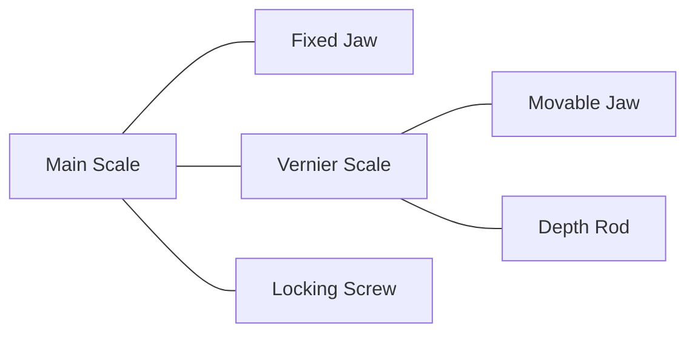
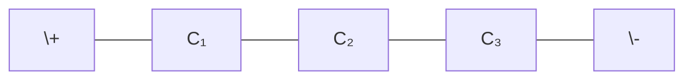
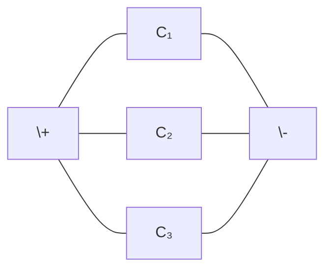
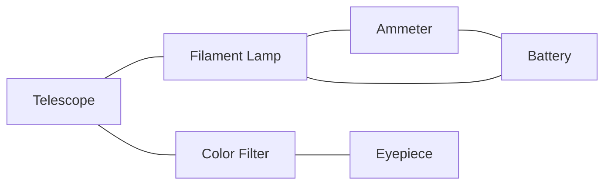
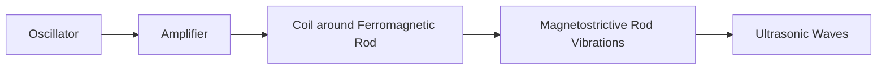
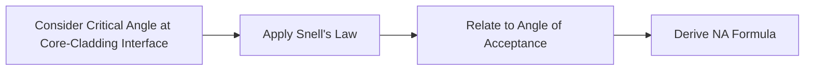

## Question 1(a) [3 marks]

**Write base units with their symbols in SI.**

**Answer**:

| Physical Quantity | Base Unit | Symbol |
|------------------|-----------|--------|
| Length | meter | m |
| Mass | kilogram | kg |
| Time | second | s |
| Electric current | ampere | A |
| Temperature | kelvin | K |
| Amount of substance | mole | mol |
| Luminous intensity | candela | cd |

**Mnemonic:** "Learn Measurements Through Accurate Techniques Like Modern Scientists"

## Question 1(b) [4 marks]

**Explain construction and working of a vernier caliper. Explain its least count and zero error.**

**Answer**:

**Construction of Vernier Caliper:**



- **Main scale**: Fixed scale with millimeter divisions
- **Vernier scale**: Sliding scale with divisions slightly smaller than main scale
- **Fixed jaw**: Connected to main scale
- **Movable jaw**: Attached to vernier scale
- **Depth rod**: For measuring depths
- **Locking screw**: To fix position during measurement

**Working**: Object is placed between jaws, movable jaw is adjusted to hold object firmly. Reading is taken by noting main scale reading and adding vernier coincidence value.

**Least Count**: Smallest measurement possible with vernier caliper.
LC = 1 division on main scale ÷ Number of divisions on vernier scale

**Zero Error**: Error when caliper shows non-zero reading with jaws closed.

- **Positive error**: Subtract from reading
- **Negative error**: Add to reading

**Mnemonic:** "Very Careful Measurements Leave Count Errors Zero"

## Question 1(c)(i) [4 marks]

**Distinguish between accuracy and precision.**

**Answer**:

| Accuracy | Precision |
|----------|-----------|
| Closeness of measurement to true value | Repeatability of measurement |
| Affected by systematic errors | Affected by random errors |
| Represented by mean of measurements | Represented by standard deviation |
| Improved by calibration | Improved by using better instruments |
| Example: If true value is 10 cm, measurements of 9.9, 10.1, and 10.0 cm are accurate | Example: Measurements of 9.8, 9.8, 9.8 cm are precise but not accurate if true value is 10 cm |

**Mnemonic:** "Accurate measurements Are Always At true value, Precise measurements Produce Perfect repeatability"

## Question 1(c)(ii) [2 marks]

**Pitch of a micrometer screw gauge is 0.5 mm and there are 50 divisions on its circular scale. Find its least count.**

**Answer**:

**Formula**: Least Count = Pitch ÷ Number of divisions on circular scale

**Calculation**:
LC = 0.5 mm ÷ 50 = 0.01 mm

**Least Count of micrometer screw gauge = 0.01 mm**

## Question 1(c)(iii) [1 mark]

**What is SI unit of heat?**

**Answer**:

SI unit of heat is **Joule (J)**

## Question 1(c)(i) [4 marks] (OR)

**How are absolute and relative errors calculated?**

**Answer**:

**Absolute Error (Δa)**: Difference between measured value and true value

- For multiple measurements, it's difference between measured value and mean value

**Calculation of Absolute Error**:

- **Single measurement**: Δa = |Measured value - True value|
- **Multiple measurements**: 
  1. Calculate mean (am)
  2. For each measurement: Δai = |ai - am|
  3. Mean absolute error: Δa = (Δa1 + Δa2 + ... + Δan) ÷ n

**Relative Error (εr)**: Ratio of absolute error to true value

- εr = Absolute error ÷ True value = Δa ÷ True value

**Percentage Error (εp)**: Relative error expressed as percentage

- εp = Relative error × 100 = (Δa ÷ True value) × 100%

**Mnemonic:** "Absolute Always measures Actual deviation; Relative References the total value"

## Question 1(c)(ii) [2 marks] (OR)

**Main scale of a vernier caliper is calibrated in mm and there are 50 divisions on its vernier scale. Find its least count.**

**Answer**:

**Formula**: Least Count = 1 division on main scale ÷ Number of divisions on vernier scale

**Calculation**:
1 division on main scale = 1 mm
LC = 1 mm ÷ 50 = 0.02 mm

**Least Count of vernier caliper = 0.02 mm**

## Question 1(c)(iii) [1 mark] (OR)

**In which of the mode of heat transfer, medium is not required?**

**Answer**:

**Radiation** does not require a medium for heat transfer.

## Question 2(a) [3 marks]

**Write characteristics of electric field lines.**

**Answer**:

**Characteristics of Electric Field Lines**:

1. Electric field lines start from positive charge and end on negative charge
2. Field lines never cross each other
3. Field lines are always perpendicular to the surface of conductor
4. Number of field lines is proportional to magnitude of charge
5. Closer field lines indicate stronger electric field
6. Field lines are continuous curves
7. Field lines contract longitudinally and expand laterally

**Diagram**:

```goat
     +           -
      \         /
       \       /
        \     /
         \   /
          \ /
           X
```

**Mnemonic:** "Electric Field Lines: Start Positive, End Negative, Cross Never"

## Question 2(b) [4 marks]

**Explain Coulomb's inverse square law for electrostatic forces.**

**Answer**:

**Coulomb's Inverse Square Law**: The electrostatic force between two point charges is directly proportional to the product of magnitudes of charges and inversely proportional to the square of distance between them.

**Mathematical Form**:
F = k(q₁q₂)/r²

Where:

- F = electrostatic force (in Newtons)
- k = electrostatic constant (9×10⁹ N·m²/C²)
- q₁, q₂ = magnitudes of charges (in Coulombs)
- r = distance between charges (in meters)

**Properties**:

- **Vector Quantity**: Force acts along the line joining the two charges
- **Attractive/Repulsive**: Like charges repel, unlike charges attract
- **Central Force**: Follows Newton's third law
- **Medium Dependence**: Depends on the medium between charges (k changes)

**Diagram**:

```
     q₁           q₂
      O-----------O
      ←───F₁²───→ ←───F₂¹───
         r
```

**Mnemonic:** "Charges Attract/Repel Leveraging Distance Squared"

## Question 2(c)(i) [4 marks]

**Derive formula for equivalent capacitance of capacitors connected in series and parallel combination.**

**Answer**:

**For Series Combination**:



When capacitors are connected in series:

- Same charge Q appears on each capacitor
- Potential difference distributes across capacitors
- V = V₁ + V₂ + V₃

For each capacitor: V₁ = Q/C₁, V₂ = Q/C₂, V₃ = Q/C₃

Total voltage: V = Q/C₁ + Q/C₂ + Q/C₃ = Q(1/C₁ + 1/C₂ + 1/C₃)

For equivalent capacitance: V = Q/Ceq

Therefore: 1/Ceq = 1/C₁ + 1/C₂ + 1/C₃

**For Parallel Combination**:



When capacitors are connected in parallel:

- Same potential difference V across each capacitor
- Total charge distributes among capacitors
- Q = Q₁ + Q₂ + Q₃

For each capacitor: Q₁ = C₁V, Q₂ = C₂V, Q₃ = C₃V

Total charge: Q = C₁V + C₂V + C₃V = (C₁ + C₂ + C₃)V

For equivalent capacitance: Q = CeqV

Therefore: Ceq = C₁ + C₂ + C₃

**Mnemonic:** "Series Sums Reciprocals, Parallel Puts Capacitance Together"

## Question 2(c)(ii) [2 marks]

**Two capacitors of capacitances 8 μF and 9 μF are connected in parallel combination. Find equivalent capacitance.**

**Answer**:

**Formula for parallel combination**: Ceq = C₁ + C₂

**Given**:

- C₁ = 8 μF
- C₂ = 9 μF

**Calculation**:
Ceq = 8 μF + 9 μF = 17 μF

**Therefore, equivalent capacitance = 17 μF**

## Question 2(c)(iii) [1 mark]

**Write full name of "LASER".**

**Answer**:

**LASER**: Light Amplification by Stimulated Emission of Radiation

## Question 2(a) [3 marks] (OR)

**What is a capacitor? Define capacitance and write its unit.**

**Answer**:

**Capacitor**: A device that stores electric charge and electrical energy in the form of electric field.

**Capacitance**: The ability of a capacitor to store electric charge. It is defined as the ratio of charge stored to the potential difference applied.

**Mathematical Form**:
C = Q/V

Where:

- C = capacitance
- Q = charge stored on capacitor
- V = potential difference across capacitor

**Unit of Capacitance**: Farad (F)

**Diagram**:

```
    +++++++  |  -------
           |   |
           |   |
        ---+---+---
           |   |
           |   |
    +++++++  |  -------
```

**Mnemonic:** "Capacitors Collect Charge, Volts Vary Fastidiously"

## Question 2(b) [4 marks] (OR)

**Explain intensity of electric field and electric potential.**

**Answer**:

**Electric Field Intensity**:

- **Definition**: Force experienced by unit positive charge placed at that point
- **Formula**: E = F/q
- **Unit**: Newton/Coulomb (N/C) or Volt/meter (V/m)
- **Vector Quantity**: Has both magnitude and direction
- **Direction**: Same as force on positive charge

**Electric Potential**:

- **Definition**: Work done to bring unit positive charge from infinity to that point
- **Formula**: V = W/q
- **Unit**: Volt (V) or Joule/Coulomb (J/C)
- **Scalar Quantity**: Has only magnitude
- **Relation with field**: E = -dV/dr (field is negative gradient of potential)

**Comparison Table**:

| Property | Electric Field | Electric Potential |
|----------|----------------|-------------------|
| Definition | Force per unit charge | Work done per unit charge |
| Nature | Vector | Scalar |
| Unit | N/C or V/m | V or J/C |
| Dependence | Varies as 1/r² | Varies as 1/r |
| Direction | Away from +ve charge | No direction |

**Mnemonic:** "Electric Field Forces charges; Potential Provides energy"

## Question 2(c)(i) [4 marks] (OR)

**Using formula of capacitance of a parallel plate capacitor, explain effect of plate area, separation between plates and presence of dielectric material between the plates on its capacitance.**

**Answer**:

**Formula for capacitance of parallel plate capacitor**:
C = ε₀εᵣA/d

Where:

- C = capacitance
- ε₀ = permittivity of free space (8.85×10⁻¹² F/m)
- εᵣ = relative permittivity of dielectric
- A = area of overlap between plates
- d = distance between plates

**Effect of Plate Area (A)**:

- Capacitance is directly proportional to area of plates
- Increasing area → Increases capacitance
- Doubling area → Doubles capacitance

**Effect of Separation (d)**:

- Capacitance is inversely proportional to distance between plates
- Increasing separation → Decreases capacitance
- Doubling separation → Halves capacitance

**Effect of Dielectric Material (εᵣ)**:

- Capacitance is directly proportional to relative permittivity of dielectric
- Inserting dielectric → Increases capacitance
- Dielectric constant measures this increase: C(with dielectric) = εᵣ × C(without dielectric)

**Diagram**:

```
    +++++++  |  -------
           |   |
       A   | d |
        ---+---+---
           |εᵣ |
           |   |
    +++++++  |  -------
```

**Mnemonic:** "Area Amplifies, Distance Diminishes, Dielectrics Double"

## Question 2(c)(ii) [2 marks] (OR)

**Voltage between plates of a capacitor of capacitance 0.5 μF is 150 V. Find magnitude of electric charge on plates.**

**Answer**:

**Formula**: Q = CV

**Given**:

- Capacitance (C) = 0.5 μF = 0.5 × 10⁻⁶ F
- Voltage (V) = 150 V

**Calculation**:
Q = CV = 0.5 × 10⁻⁶ × 150 = 75 × 10⁻⁶ C = 75 μC

**Therefore, charge on plates = 75 μC**

## Question 2(c)(iii) [1 mark] (OR)

**Of the two parts of an optical fiber, the core and the cladding, which one has larger refractive index?**

**Answer**:

The **core** has a larger refractive index than the cladding.

## Question 3(a) [3 marks]

**Define conduction and convection of heat.**

**Answer**:

**Heat Conduction**:

- Transfer of heat through matter without actual movement of particles
- Occurs due to direct molecular collisions
- Heat flows from higher to lower temperature region
- Metals are good conductors of heat
- Examples: Heat transfer through metal rod, cooking pot

**Heat Convection**:

- Transfer of heat through actual movement of matter
- Occurs in fluids (liquids and gases)
- Involves formation of convection currents
- Examples: Room heater, sea breeze, boiling water

**Diagram**:

```
Conduction:
Hot     Cold
|->->->->|

Convection:
      ↑
    ←   →
      ↓
    Heat
```

**Mnemonic:** "Conduction Connects molecules; Convection Carries material"

## Question 3(b) [4 marks]

**Explain construction and working of mercury thermometer.**

**Answer**:

**Construction of Mercury Thermometer**:


- **Glass bulb**: Contains mercury, acts as reservoir
- **Capillary tube**: Thin glass tube connected to bulb
- **Scale**: Calibrated with temperature markings
- **Protective glass cover**: Protects capillary tube and scale

**Working Principle**:

1. Based on thermal expansion of mercury
2. When temperature increases, mercury expands and rises in capillary
3. When temperature decreases, mercury contracts and level falls
4. Temperature is read from scale at mercury level

**Temperature Range**: -38.83°C to 356.73°C (mercury's freezing to boiling point)

**Advantages**:

- High accuracy
- Linear expansion
- Clearly visible in capillary

**Limitations**:

- Cannot measure very low temperatures
- Mercury is toxic
- Cannot be used for remote sensing

**Mnemonic:** "Mercury Moves Through Capillary, Showing Temperature"

## Question 3(c)(i) [4 marks]

**State laws of thermal conductivity and derive formula of coefficient of thermal conductivity.**

**Answer**:

**Laws of Thermal Conductivity**:

1. Heat flow is directly proportional to temperature difference (ΔT)
2. Heat flow is directly proportional to cross-sectional area (A)
3. Heat flow is inversely proportional to length (L)
4. Heat flow is directly proportional to time (t)

**Derivation of Coefficient of Thermal Conductivity**:

According to Fourier's law:
Q ∝ A × t × ΔT/L

Converting to equation with proportionality constant K:
Q = K × A × t × ΔT/L

Rearranging:
K = (Q × L)/(A × t × ΔT)

Where:

- Q = Heat conducted (in Joules)
- L = Length of conductor (in meters)
- A = Cross-sectional area (in m²)
- t = Time (in seconds)
- ΔT = Temperature difference (in Kelvin)
- K = Coefficient of thermal conductivity (in W/m·K)

**Diagram**:

```
Hot         Cold
T₁ ---------T₂
    Length L
    Area A
    Heat Q
```

**Mnemonic:** "Heat Transfers Faster when Area Larger, Temperature higher, Length shorter"

## Question 3(c)(ii) [2 marks]

**The total area of glass window pane is 0.5m². Calculate amount of heat conducted per hour through the pane if thickness of glass is 0.6cm, the inside temperature is 30°C and outside temperature is 20°C. Coefficient of thermal conductivity of glass is 1.0 Wm⁻¹K⁻¹.**

**Answer**:

**Formula**: Q = (K × A × t × ΔT)/L

**Given**:

- Area (A) = 0.5 m²
- Thickness (L) = 0.6 cm = 0.006 m
- Inside temperature (T₁) = 30°C
- Outside temperature (T₂) = 20°C
- Temperature difference (ΔT) = 10°C = 10 K
- Coefficient of thermal conductivity (K) = 1.0 W/m·K
- Time (t) = 1 hour = 3600 seconds

**Calculation**:
Q = (1.0 × 0.5 × 3600 × 10)/0.006
Q = (18000)/0.006
Q = 3,000,000 J = 3000 kJ

**Therefore, heat conducted = 3000 kJ per hour**

## Question 3(c)(iii) [1 mark]

**Which property of light is responsible for transmission of light through optical fibre?**

**Answer**:

**Total Internal Reflection (TIR)** is responsible for transmission of light through optical fiber.

## Question 3(a) [3 marks] (OR)

**Define heat capacity and specific heat.**

**Answer**:

**Heat Capacity**:

- Amount of heat energy required to raise temperature of an object by 1°C or 1K
- Depends on mass and material of object
- Formula: C = Q/ΔT
- Unit: Joule/Kelvin (J/K)

**Specific Heat**:

- Amount of heat energy required to raise temperature of 1 kg of substance by 1°C or 1K
- Property of material, independent of mass
- Formula: c = Q/(m×ΔT)
- Unit: Joule/kg·K (J/kg·K)

**Relation**: Heat capacity (C) = mass (m) × specific heat (c)

**Comparison Table**:

| Property | Heat Capacity | Specific Heat |
|----------|---------------|---------------|
| Definition | Heat per degree for object | Heat per degree per unit mass |
| Symbol | C | c |
| Unit | J/K | J/kg·K |
| Depends on | Mass and material | Only material |
| Formula | Q/ΔT | Q/(m×ΔT) |

**Mnemonic:** "Heat Capacity for Complete object, Specific heat for Single kilogram"

## Question 3(b) [4 marks] (OR)

**Explain construction and working of optical pyrometer.**

**Answer**:

**Construction of Optical Pyrometer**:



- **Telescope**: To view hot object
- **Filament lamp**: Calibrated tungsten filament
- **Rheostat**: To adjust current through filament
- **Ammeter**: To measure current
- **Red filter**: To match wavelengths
- **Eyepiece**: For viewing

**Working Principle**:

1. Based on comparing brightness of hot object with standard lamp filament
2. Object is viewed through telescope
3. Current adjusted until filament brightness matches object brightness
4. At match point, filament "disappears" against object background
5. Temperature determined from calibrated scale or ammeter reading

**Temperature Range**: 700°C to 3000°C

**Advantages**:

- Non-contact measurement
- High temperature measurement
- Suitable for moving objects

**Mnemonic:** "Pyrometer Produces Perfect Temperature by Brightness Comparison"

## Question 3(c)(i) [4 marks] (OR)

**Define linear thermal expansion of solids and derive formula of coefficient linear thermal expansion.**

**Answer**:

**Linear Thermal Expansion**:
Increase in length of a solid material when its temperature increases

**Coefficient of Linear Thermal Expansion (α)**:
Fractional change in length per unit change in temperature

**Derivation**:

For small temperature changes:

- Change in length (ΔL) is directly proportional to original length (L₀)
- ΔL is directly proportional to change in temperature (ΔT)

Therefore: ΔL ∝ L₀ × ΔT

Converting to equation with proportionality constant α:
ΔL = α × L₀ × ΔT

Rearranging:
α = ΔL/(L₀ × ΔT)

Where:

- ΔL = Change in length (in meters)
- L₀ = Original length (in meters)
- ΔT = Change in temperature (in Kelvin or Celsius)
- α = Coefficient of linear thermal expansion (per °C or per K)

**Final length**: L = L₀(1 + αΔT)

**Diagram**:

```
Before heating:
|----L₀----|

After heating:
|------L------|
```

**Mnemonic:** "Linear Expansion Numerically Gives Total Length Increase"

## Question 3(c)(ii) [2 marks] (OR)

**Length of a steel rod at 0°C is 150 cm. What will be its length at 200°C, if its coefficient of linear thermal expansion is 12 × 10⁻⁶ per °C.**

**Answer**:

**Formula**: L = L₀(1 + αΔT)

**Given**:

- Original length (L₀) = 150 cm
- Original temperature = 0°C
- Final temperature = 200°C
- Temperature change (ΔT) = 200°C
- Coefficient of linear expansion (α) = 12 × 10⁻⁶ per °C

**Calculation**:
L = 150(1 + 12 × 10⁻⁶ × 200)
L = 150(1 + 24 × 10⁻⁴)
L = 150(1 + 0.0024)
L = 150 × 1.0024
L = 150.36 cm

**Therefore, final length of steel rod = 150.36 cm**

## Question 3(c)(iii) [1 mark] (OR)

**Which type of emission of radiation is responsible for emission of ordinary light?**

**Answer**:

**Spontaneous emission** is responsible for emission of ordinary light.

## Question 4(a) [3 marks]

**Define amplitude, frequency and time period of a wave.**

**Answer**:

**Amplitude**:

- Maximum displacement of medium particles from equilibrium position
- Represents energy of wave
- Denoted by 'A'
- Measured in meters (m)

**Frequency**:

- Number of complete oscillations per unit time
- Denoted by 'f' or 'ν'
- Measured in hertz (Hz) or cycles per second
- Related to wavelength (λ) and velocity (v): f = v/λ

**Time Period**:

- Time taken to complete one oscillation
- Denoted by 'T'
- Measured in seconds (s)
- Related to frequency: T = 1/f

**Diagram**:

```
    Amplitude
        ↕
        |    /\      /\
        |   /  \    /  \
--------+--/----\--/----\---> Time
        |  \    /  \    /
        |   \  /    \  /
        |    \/      \/
        |<--T-->|
```

**Mnemonic:** "Amplitude Adjusts energy, Frequency Finds cycles, Time-period Tracks one cycle"

## Question 4(b) [4 marks]

**Write difference between transverse and longitudinal waves.**

**Answer**:

| Property | Transverse Waves | Longitudinal Waves |
|----------|------------------|-------------------|
| Direction of particle motion | Perpendicular to wave propagation | Parallel to wave propagation |
| Formation of | Crests and troughs | Compressions and rarefactions |
| Examples | Light waves, water waves, electromagnetic waves | Sound waves, seismic P-waves |
| Medium requirement | Can travel through vacuum (e.g., light) | Requires material medium |
| Polarization | Can be polarized | Cannot be polarized |
| Speed | Generally faster in solids | Generally slower in solids |
| Mathematical representation | y = A sin(kx - ωt) | s = A sin(kx - ωt) |

**Diagram**:

```
Transverse:
  ^  ^     ^
 / \/ \   / \
/     \ /    \
---------->
Direction of propagation

Longitudinal:
|||||   |||||   |||||
    |||||   |||||
---------->
Direction of propagation
```

**Mnemonic:** "Transverse Travels perpendicular, Longitudinal Lies along length"

## Question 4(c)(i) [5 marks]

**How is ultrasonic wave produced using piezoelectric method?**

**Answer**:

**Piezoelectric Method for Ultrasonic Wave Production**:


**Working Principle**:

1. Based on piezoelectric effect - generating electric charge in response to mechanical stress and vice versa
2. High-frequency AC voltage applied across piezoelectric crystal (quartz, tourmaline, Rochelle salt)
3. Crystal vibrates at same frequency as applied voltage
4. When frequency matches natural frequency of crystal, resonance occurs
5. Maximum amplitude vibrations generate ultrasonic waves

**Components**:

- **Oscillator**: Generates high-frequency electrical oscillations
- **Amplifier**: Increases amplitude of oscillations
- **Piezoelectric crystal**: Converts electrical energy to mechanical vibrations
- **Mounting**: Supports crystal properly

**Frequency Range**: 20 kHz to several MHz

**Advantages**:

- High efficiency
- Precise frequency control
- Compact size
- No moving parts

**Mnemonic:** "Piezo Produces waves when Properly Pulsed with electricity"

## Question 4(c)(ii) [2 marks]

**Explain any two properties of sound wave.**

**Answer**:

**1. Reflection of Sound**:

- Sound waves bounce back from obstacles
- Follows law of reflection: angle of incidence = angle of reflection
- Creates echo when reflected from distant objects
- Applications: Sonar, echo location, acoustic design

**2. Refraction of Sound**:

- Bending of sound waves when passing from one medium to another
- Caused by change in speed of sound in different media
- Examples: Sound focusing in domes, sound heard better at night
- Applications: Acoustic lenses, medical ultrasound

**Diagram**:

```
Reflection:        Refraction:
  \  |              /|
   \ |             / |
    \|            /  |
----|----       ---|---
    |/           /|
    |           / |
    |          /  |
```

**Mnemonic:** "Sound Shows Remarkable Refractions During travel"

## Question 4(a) [3 marks] (OR)

**Define wavelength, phase and velocity of a wave.**

**Answer**:

**Wavelength**:

- Distance between two consecutive points in phase
- Distance traveled during one complete oscillation
- Denoted by 'λ' (lambda)
- Measured in meters (m)
- Related to frequency (f) and velocity (v): λ = v/f

**Phase**:

- State of oscillation at a specific point and time
- Measured in radians or degrees
- Full cycle = 2π radians or 360°
- Points having same phase are in phase
- Points differing by π radians (180°) are in opposite phase

**Velocity**:

- Rate at which wave propagates through medium
- Denoted by 'v'
- Measured in meters per second (m/s)
- Related to wavelength and frequency: v = λf
- Depends on properties of medium, not on wave characteristics

**Diagram for wavelength, phase and velocity**:

```
    |<---λ--->|
    |         |
    /\        /\        /\
   /  \      /  \      /  \
--/----\----/----\----/----\-->
  \    /    \    /    \    /
   \  /      \  /      \  /
    \/        \/        \/
    
    |---v·t---|
```

**Mnemonic:** "Wavelength Wraps one cycle, Phase Portrays position, Velocity Values propagation speed"

## Question 4(b) [4 marks] (OR)

**Explain constructive and destructive interference of waves.**

**Answer**:

**Interference**: Superposition of two or more waves at same point in space resulting in a new wave pattern

**Constructive Interference**:

- Occurs when waves meet in phase (crest meets crest)
- Phase difference = 0, 2π, 4π, ... (0°, 360°, 720°, ...)
- Path difference = nλ (n = 0, 1, 2, ...)
- Results in amplitude larger than individual waves
- Resultant amplitude = sum of individual amplitudes

**Destructive Interference**:

- Occurs when waves meet in opposite phase (crest meets trough)
- Phase difference = π, 3π, 5π, ... (180°, 540°, 900°, ...)
- Path difference = (n+1/2)λ (n = 0, 1, 2, ...)
- Results in amplitude smaller than individual waves
- Complete cancellation if amplitudes are equal

**Diagram**:

```
Constructive:             Destructive:
  /\    /\                  /\    \/
 /  \  /  \                /  \  /  \
/    \/    \              /    \/    \
--------------            --------------
      |                         |
      \/                        |
     /  \                       |
    /    \                 --------- 
   /      \
  /        \
```

**Mnemonic:** "Constructive Creates Larger waves; Destructive Diminishes wave height"

## Question 4(c)(i) [5 marks] (OR)

**How is ultrasonic wave produced using magnetostriction method?**

**Answer**:

**Magnetostriction Method for Ultrasonic Wave Production**:



**Working Principle**:

1. Based on magnetostriction effect - dimensional change in ferromagnetic materials when placed in magnetic field
2. When magnetic field is applied, rod contracts
3. When field is removed, rod expands back to original size
4. Alternating current creates alternating magnetic field
5. Rod vibrates at frequency of applied current
6. These vibrations generate ultrasonic waves

**Components**:

- **Oscillator**: Generates high-frequency electrical oscillations
- **Amplifier**: Increases amplitude of oscillations
- **Coil**: Creates magnetic field when current passes
- **Ferromagnetic rod**: Nickel, iron-nickel alloy, or ferrites
- **Mounting**: Supports rod properly

**Frequency Range**: 20 kHz to 100 kHz (lower than piezoelectric method)

**Advantages**:

- Handles high power
- Suitable for high-intensity applications
- Rugged construction
- Works well at lower frequencies

**Limitations**:

- Limited to lower frequencies
- Lower efficiency than piezoelectric method
- Heating of rod at high frequencies

**Mnemonic:** "Magnetic Materials Move Minutely Making ultrasonic waves"

## Question 4(c)(ii) [2 marks] (OR)

**Explain any two properties of light wave.**

**Answer**:

**1. Reflection of Light**:

- Light bounces back when it strikes a surface
- Follows law of reflection: angle of incidence = angle of reflection
- Specular reflection from smooth surfaces
- Diffuse reflection from rough surfaces
- Applications: Mirrors, reflectors, optical instruments

**2. Refraction of Light**:

- Bending of light when passing from one medium to another
- Follows Snell's law: n₁sin(θ₁) = n₂sin(θ₂)
- Caused by change in speed of light in different media
- Examples: Bent appearance of stick in water
- Applications: Lenses, prisms, fiber optics

**Diagram**:

```
Reflection:        Refraction:
  \  |              /|
   \ |             / |
    \|            /  |
----|----       ---|---
    |/           /|
    |           / |
    |          /  |
```

**Mnemonic:** "Light Likes to Reflect from mirrors and Refract through media"

## Question 5(a) [3 marks]

**Write characteristics of LASER.**

**Answer**:

**Characteristics of LASER**:

| Characteristic | Description |
|----------------|-------------|
| Monochromatic | Single wavelength/color (very narrow frequency range) |
| Coherent | All waves in same phase, creating high interference |
| Directional | Highly collimated, minimal divergence over long distances |
| High intensity | Concentrated energy in narrow beam |
| High purity | Extremely pure color compared to ordinary light |

**Diagram**:

```
Ordinary Light:            LASER:
  ---                        -------
 /   \                      |       |
/     \                     |       |
-------                     |       |
Different                   -------
wavelengths                 Single wavelength,
& directions                single direction
```

**Mnemonic:** "LASER Light: Monochromatic, Coherent, Directional, Intense"

## Question 5(b) [4 marks]

**Discuss importance of LASER in engineering and medical field.**

**Answer**:

**Importance of LASER in Engineering**:

1. **Manufacturing**:
   - Precision cutting and welding of metals
   - 3D printing and rapid prototyping
   - Engraving and marking materials

2. **Measurement and Testing**:
   - Distance measurement (LIDAR)
   - Alignment and leveling
   - Non-destructive testing
   - Holography for stress analysis

3. **Communications**:
   - Fiber optic communications
   - Free-space optical communication
   - Data storage (CD/DVD/Blu-ray)

4. **Material Processing**:
   - Heat treatment
   - Surface hardening
   - Micromachining

**Importance of LASER in Medical Field**:

1. **Surgery**:
   - Bloodless cutting (laser scalpel)
   - Ophthalmic surgery (LASIK)
   - Dermatological procedures
   - Tumor removal

2. **Diagnostics**:
   - Laser imaging
   - Spectroscopy
   - Flow cytometry
   - Optical coherence tomography

3. **Therapy**:
   - Photodynamic therapy for cancer
   - Low-level laser therapy
   - Pain management
   - Cosmetic procedures (hair removal, skin rejuvenation)

4. **Dentistry**:
   - Cavity detection
   - Teeth whitening
   - Gum surgery

**Mnemonic:** "LASER Enhances Manufacturing, Measures precisely, Communicates data, Heals patients"

## Question 5(c)(i) [5 marks]

**What is importance of population inversion and metastable state for production of LASER?**

**Answer**:

**Population Inversion**:

- **Definition**: State where more atoms are in excited state than in ground state (reverse of normal equilibrium)
- **Importance**:
  1. Essential condition for laser action to occur
  2. Creates environment for stimulated emission to dominate over absorption
  3. Enables amplification of light (negative absorption)
  4. Without it, emitted photons would be absorbed, preventing laser action
  5. Required for chain reaction of stimulated emission

**Diagram**:

```
Normal:              Population Inversion:
  -----                  -----
  |   | Few atoms        ||||||| Many atoms
  -----                  -----
     ↑                      ↓
     |                      |
  -----                  -----
  ||||||| Many atoms     |   | Few atoms
  -----                  -----
Ground state          Ground state
```

**Metastable State**:

- **Definition**: Excited energy state with relatively long lifetime (10⁻³ to 10⁻⁷ seconds)
- **Importance**:
  1. Allows accumulation of excited atoms (temporary energy reservoir)
  2. Provides time for population inversion to establish
  3. Long lifetime prevents rapid spontaneous emission
  4. Ensures stimulated emission dominates over spontaneous emission
  5. Essential for continuous laser operation

**Energy Level Diagram**:

```
          |
  E₃ ----|---- Short-lived excited state
          |
          v Fast transition (non-radiative)
          |
  E₂ ----|---- Metastable state (long lifetime)
          |
          v Stimulated emission (LASER)
          |
  E₁ ----|---- Ground state
```

**Mnemonic:** "Population Inversion Makes Electrons Stay high; Metastable maintains this Situation Longer"

## Question 5(c)(ii) [2 marks]

**Explain graded index optical fibre.**

**Answer**:

**Graded Index Optical Fiber**:

- **Structure**: Core with gradually decreasing refractive index from center to periphery
- **Refractive Index Profile**: Follows parabolic pattern: n(r) = n₁(1 - αr²)
- **Light Propagation**: Light travels in curved paths rather than zigzag pattern
- **Mechanism**: Light near periphery travels faster than at center, compensating for longer path
- **Advantages**:
  1. Reduced modal dispersion compared to step index fiber
  2. Higher bandwidth
  3. Less signal distortion
  4. Suitable for medium-distance communication

**Cross-sectional Diagram**:

```
       Cladding
    ┌───────────┐
    │ ╭───────╮ │
    │ │       │ │
    │ │ Core  │ │
    │ │       │ │
    │ ╰───────╯ │
    └───────────┘

Refractive Index Profile:
    │     ╱╲
    │    /  \
n   │   /    \
    │  /      \
    │ /        \
    │/          \
    └────────────
      Distance
```

**Mnemonic:** "Graded Index Gradually Improves transmission by Smoothing dispersion"

## Question 5(a) [3 marks] (OR)

**Define refraction of light and write Snell's law.**

**Answer**:

**Refraction of Light**:

- Bending of light when it passes from one transparent medium to another
- Occurs due to change in speed of light in different media
- Direction changes but frequency remains same
- Wavelength changes with speed

**Snell's Law**:

- Mathematical relationship governing refraction
- States that ratio of sines of angles of incidence and refraction equals ratio of refractive indices
- Formula: n₁sin(θ₁) = n₂sin(θ₂)
- Where:
  * n₁ = Refractive index of first medium
  * n₂ = Refractive index of second medium
  * θ₁ = Angle of incidence
  * θ₂ = Angle of refraction

**Diagram**:

```
Medium 1 (n₁)
    \   |
     \  | θ₁
      \ |
-------|---------
       |\ 
       | \ θ₂
       |  \
Medium 2 (n₂)
```

**Mnemonic:** "Sine ratios Equal Index ratios" or "n₁Sin₁ = n₂Sin₂"

## Question 5(b) [4 marks] (OR)

**Discuss importance of optical fibre in engineering and medical field.**

**Answer**:

**Importance of Optical Fiber in Engineering**:

1. **Communications**:
   - High-speed internet transmission
   - Long-distance telecommunications
   - Secure data transmission (difficult to tap)
   - Higher bandwidth than copper cables

2. **Sensors and Instrumentation**:
   - Temperature, pressure, strain measurement
   - Structural health monitoring
   - Chemical and biological sensing
   - Seismic detection

3. **Industrial Applications**:
   - Remote inspection of hazardous areas
   - Industrial process control
   - Power system monitoring
   - Mining and petroleum exploration

4. **Computing**:
   - High-speed data transfer between components
   - Optical interconnects
   - Quantum computing connections

**Importance of Optical Fiber in Medical Field**:

1. **Diagnostics**:
   - Endoscopy for internal organ examination
   - Laparoscopy for minimally invasive surgery
   - Angioscopy for blood vessel examination
   - Bronchoscopy for respiratory tract examination

2. **Surgery**:
   - Laser light delivery for precise operations
   - Photodynamic therapy
   - Microsurgery guidance
   - Remote surgery monitoring

3. **Imaging**:
   - Optical coherence tomography
   - Confocal microscopy
   - Optogenetics
   - Medical spectroscopy

4. **Treatment**:
   - Phototherapy for skin conditions
   - Laser treatment delivery
   - Biosensing for real-time monitoring
   - Targeted drug delivery

**Mnemonic:** "Optical Fibers Connect, Sense, Visualize, and Treat"

## Question 5(c)(i) [5 marks] (OR)

**Derive formula for numerical aperture and angle of acceptance of optical fibre.**

**Answer**:

**Numerical Aperture (NA) Derivation**:



**Step 1**: Consider critical angle (θc) at core-cladding interface

- At critical angle, refracted ray grazes along interface
- sin(θc) = n₂/n₁ (where n₁ = core index, n₂ = cladding index)

**Step 2**: For a ray traveling in core, apply condition for total internal reflection

- Ray must strike at angle greater than critical angle
- Maximum angle in core: 90° - θc

**Step 3**: For ray entering from air (n₀ = 1), apply Snell's law

- n₀sin(θₐ) = n₁sin(θ₁)
- sin(θₐ) = n₁sin(θ₁)
- Where θₐ is acceptance angle

**Step 4**: Use maximum value of θ₁ (90° - θc)

- sin(θₐ) = n₁sin(90° - θc) = n₁cos(θc)

**Step 5**: Substitute sin(θc) = n₂/n₁

- cos(θc) = √(1 - sin²(θc)) = √(1 - (n₂/n₁)²)

**Step 6**: Therefore:

- sin(θₐ) = n₁√(1 - (n₂/n₁)²) = √(n₁² - n₂²)

**Final Formula**:

- Numerical Aperture (NA) = sin(θₐ) = √(n₁² - n₂²)
- Where θₐ is angle of acceptance

**Diagram**:

```
              θₐ
               \
 Air (n₀)       \
-----------------\-----------
                  \
 Core (n₁)        \_____ θ₁
                    \
                     \
----------------------------
 Cladding (n₂)
```

**Mnemonic:** "NA Notes Acceptance angle; √(n₁² - n₂²) Shows maximum sine"

## Question 5(c)(ii) [2 marks] (OR)

**Explain step index optical fibre.**

**Answer**:

**Step Index Optical Fiber**:

- **Structure**: Core with uniform refractive index surrounded by cladding with lower uniform refractive index
- **Refractive Index Profile**: Sharp transition (step) between core and cladding
- **Light Propagation**: Light travels in zigzag path by total internal reflection
- **Types**:
  1. Single-mode: Small core (8-10 μm), carries one mode of light
  2. Multi-mode: Large core (50-100 μm), carries multiple modes

**Characteristics**:

- Simple construction
- Lower bandwidth than graded index
- Suffers from modal dispersion in multi-mode
- Longer path for some rays causes pulse spreading

**Cross-sectional Diagram**:

```
       Cladding (n₂)
    ┌───────────┐
    │ ┌───────┐ │
    │ │       │ │
    │ │ Core  │ │
    │ │ (n₁)  │ │
    │ └───────┘ │
    └───────────┘

Refractive Index Profile:
    │ ┌──┐
    │ │  │
n   │ │  │
    │ │  │
    │ │  │
    │ └──┘
    └─────────
      Distance
```

**Mnemonic:** "Step Index Shows Two distinct Indices with Perfect boundary"
