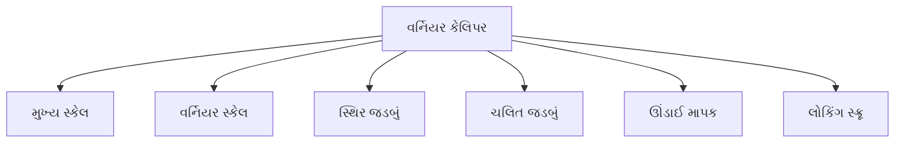
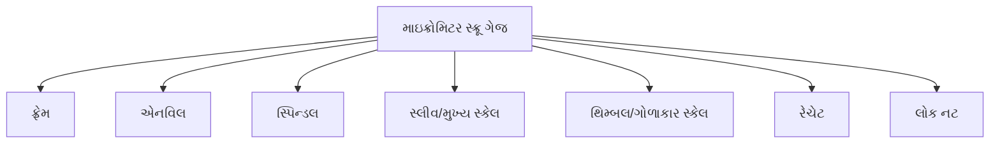
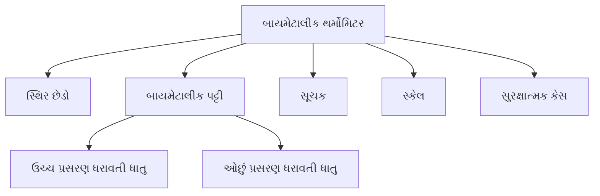
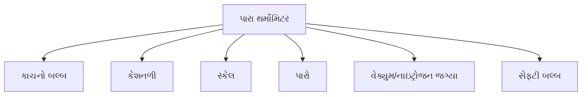
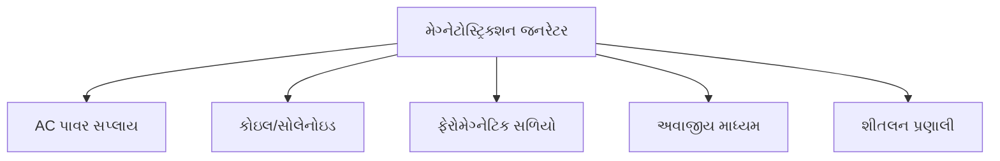

## પ્રશ્ન 1(a) [3 ગુણ]

**સાધિત ભૌતિક રાશીની વ્યાખ્યા લખો અને તેના કોઈ પણ ત્રણ ઉદાહરણોને એકમ અને ચિન્હ સાથે લખો.**

**જવાબ**:
સાધિત ભૌતિક રાશીઓ એ છે જે મૂળભૂત ભૌતિક રાશીઓના ગુણાકાર અથવા ભાગાકાર દ્વારા મેળવવામાં આવે છે.

**કોષ્ટક: સાધિત ભૌતિક રાશીઓના ઉદાહરણો**

| સાધિત રાશી | S.I. એકમ | ચિહ્ન |
|------------|----------|------|
| બળ | ન્યૂટન (N) | F |
| ઊર્જા | જૂલ (J) | E |
| વિદ્યુત પ્રવાહ | એમ્પિયર (A) | I |

**યાદરાખવાનું સૂત્ર:** "FEI: બળ-ઊર્જા-વિદ્યુત પ્રવાહ મૂળભૂતમાંથી નિકળે છે"

## પ્રશ્ન 1(b) [4 ગુણ]

**ધાતુના સળિયાની લંબાઈ 12°C તાપમાને 64.522 cm છે અને 90°C તાપમાને 64.576 cm છે. તો સળિયાના રેખીય વિસ્તરણ ગુણાંક શોધો.**

**જવાબ**:
**સૂત્ર:** α = (L₂ - L₁)/[L₁ × (T₂ - T₁)]

**ગણતરી:**

- પ્રારંભિક લંબાઈ (L₁) = 64.522 cm
- અંતિમ લંબાઈ (L₂) = 64.576 cm
- પ્રારંભિક તાપમાન (T₁) = 12°C
- અંતિમ તાપમાન (T₂) = 90°C

α = (64.576 - 64.522)/[64.522 × (90 - 12)]
α = 0.054/(64.522 × 78)
α = 0.054/5032.716
α = 1.073 × 10⁻⁵ /°C

**યાદરાખવાનું સૂત્ર:** "લંબાઈમાં ફેરફાર પર મૂળ લંબાઈ અને તાપમાન ફેરફારનો ભાગ"

## પ્રશ્ન 1(c) [7 ગુણ]

**વર્નિયર કેલિપર્સનો સિદ્ધાંત, રચના અને કાર્ય પદ્ધતિ તેની આકૃતિ સાથે સમજાવો.**

**જવાબ**:
**સિદ્ધાંત**: વર્નિયર કેલિપર વર્નિયર સ્કેલના સિદ્ધાંત પર કામ કરે છે, જે મુખ્ય સ્કેલ કરતાં વધુ ચોકસાઈથી માપન કરવા દે છે.

**રચના:**



**કાર્યપદ્ધતિ:**

- **શૂન્ય ત્રુટિની તપાસ**: જડબાંઓ બંધ કરી વર્નિયરનો શૂન્ય મુખ્ય સ્કેલના શૂન્ય સાથે મેળ ખાય છે કે કેમ તે જોવું
- **બહારનું માપન**: વસ્તુને સ્થિર અને ચલિત જડબાં વચ્ચે મૂકો
- **વાંચન પ્રક્રિયા**: મુખ્ય સ્કેલ વાંચન + (મેળ ખાતા વર્નિયર વિભાગ × લઘુત્તમ માપ)
- **લઘુત્તમ માપ** = (મુખ્ય સ્કેલનો સૌથી નાનો વિભાગ)/(વર્નિયર સ્કેલના વિભાગોની સંખ્યા)

**આકૃતિ:**

```goat
                 ┌───────┐            
 મુખ્ય સ્કેલ ───▶│       │◀── વર્નિયર સ્કેલ
  (મીમીમાં)      │   ┌───┴───┐     
     0    5    10   15      20    25    30
     |....|....|....|....|....|....|....|
     |    0    5    |0    5    |    
     └────┬─────────┘           
          │                  
      સ્થિર જડબું        ચલિત જડબું
```

**યાદરાખવાનું સૂત્ર:** "મુખ્ય સ્કેલ વાંચન વત્તા વર્નિયર ભાગ ગુણિયે લઘુત્તમ માપ"

## પ્રશ્ન 1(c) OR [7 ગુણ]

**માઇક્રોમિટર સ્ક્રૂ ગેજનો સિદ્ધાંત, રચના અને કાર્ય પદ્ધતિ તેની આકૃતિ સાથે સમજાવો.**

**જવાબ**:
**સિદ્ધાંત**: માઇક્રોમિટર સ્ક્રૂ ગેજ સ્ક્રૂની ગતિના સિદ્ધાંત પર કામ કરે છે - ફરતી ગતિને સીધી રેખાની ગતિમાં પરિવર્તિત કરવામાં આવે છે.

**રચના:**



**કાર્યપદ્ધતિ:**

- **શૂન્ય ત્રુટિની તપાસ**: એનવિલ અને સ્પિન્ડલ બંધ કરી, ગોળાકાર સ્કેલનો શૂન્ય સંદર્ભ રેખા સાથે ગોઠવાય છે કે કેમ તપાસો
- **માપન પ્રક્રિયા**: વસ્તુને એનવિલ અને સ્પિન્ડલ વચ્ચે મૂકો
- **વાંચન**: મુખ્ય સ્કેલ વાંચન + (ગોળાકાર સ્કેલ વાંચન × લઘુત્તમ માપ)
- **લઘુત્તમ માપ** = પીચ/ગોળાકાર સ્કેલના વિભાગોની સંખ્યા

**આકૃતિ:**

```goat
                     રેચેટ
                        ▲
                        │
        ફ્રેમ            │        થિમ્બલ/ગોળાકાર સ્કેલ
          ┌─────────────┴─────┐  ┌───┐
          │                   │  │   │
એનવિલ ──▶ O═══════════════════O══O   │
          │     │             │  │   │
          └─────┼─────────────┘  └───┘
                │                   │
                ▼                   ▼
            સ્પિન્ડલ             સ્લીવ/મુખ્ય સ્કેલ
```

**યાદરાખવાનું સૂત્ર:** "PST: પીચને સ્કેલથી ભાગીએ તો થિમ્બલનો લઘુત્તમ માપ મળે"

## પ્રશ્ન 2(a) [3 ગુણ]

**જો માઇક્રોમિટર સ્ક્રૂ ગેજની પિચ 1 mm હોય અને ગોળાકાર સ્કેલના કુલ 100 વિભાગ હોય તો ગોળાનો વ્યાસ શોધો. ગોળાકાર સ્કેલની ધાર મુખ્ય સ્કેલના 7 અને 8 mm વચ્ચે આવે છે અને ગોળાકાર સ્કેલના 65મો વિભાગ મુખ્ય સ્કેલની આડી રેખા સાથે મળે છે.**

**જવાબ**:
**સૂત્ર:** વ્યાસ = મુખ્ય સ્કેલ વાંચન + (ગોળાકાર સ્કેલ વાંચન × લઘુત્તમ માપ)

**ગણતરી:**

- મુખ્ય સ્કેલ વાંચન = 7 mm
- ગોળાકાર સ્કેલ વાંચન = 65 વિભાગ
- લઘુત્તમ માપ = પીચ/વિભાગોની સંખ્યા = 1/100 = 0.01 mm

વ્યાસ = 7 + (65 × 0.01) = 7 + 0.65 = 7.65 mm

**યાદરાખવાનું સૂત્ર:** "MSR + (CSR × LC) આપે છે અંતિમ માપણી"

## પ્રશ્ન 2(b) [4 ગુણ]

**કળા તફાવત અને સુસબદ્ધતા ને સમજાવો.**

**જવાબ**:
**કળા તફાવત:**
સમાન આવૃત્તિના બે તરંગો વચ્ચે કળા કોણનો તફાવત.

**કોષ્ટક: કળા તફાવતની લાક્ષણિકતાઓ**

| કળા તફાવત | વ્યતિકરણનો પ્રકાર | પરિણામ |
|-----------|-----------------|--------|
| 0° અથવા 360° | રચનાત્મક | મહત્તમ કંપવિસ્તાર |
| 180° | વિનાશક | લઘુત્તમ કંપવિસ્તાર |

**સુસબદ્ધતા:**
તરંગોની એવી ગુણવત્તા જેમાં કળા સંબંધ સતત રહે છે.

**સુસબદ્ધતાના પ્રકારો:**

- **સમયગત સુસબદ્ધતા**: આવૃત્તિ સ્થિરતા સાથે સંબંધિત
- **અવકાશી સુસબદ્ધતા**: તરંગાગ્ર એકરૂપતા સાથે સંબંધિત

**યાદરાખવાનું સૂત્ર:** "સતત કળા સંબંધ બનાવે સુસબદ્ધ તરંગો"

## પ્રશ્ન 2(c) [7 ગુણ]

**કેપેસિટર, કેપેસીટન્સ તથા સમાંતર પ્લેટ કેપેસિટરના કેપેસીટન્સ પર ડાઇલેટ્રિક મધ્યમની અસર સમજાવો.**

**જવાબ**:
**કેપેસિટર**: એવું ઉપકરણ જે વિદ્યુત ક્ષેત્રમાં વિદ્યુત ચાર્જ અને વિદ્યુત ઊર્જાને સંગ્રહિત કરે છે.

**કેપેસીટન્સ**: સંગ્રહિત ચાર્જનો લાગુ પોટેન્શિયલ તફાવત સાથેનો ગુણોત્તર.

**સૂત્ર:** C = Q/V

**સમાંતર પ્લેટ કેપેસિટર:**
કેપેસીટન્સ સૂત્ર: C = ε₀A/d

- ε₀ = મુક્ત અવકાશની પરાવૈદ્યુતાંક
- A = પ્લેટનું ક્ષેત્રફળ
- d = પ્લેટ વચ્ચેનું અંતર

**ડાઇલેક્ટ્રિકની અસર:**

- કેપેસીટન્સને K ગણો વધારે છે (K = ડાઇલેક્ટ્રિક અચળાંક)
- નવું સૂત્ર: C = Kε₀A/d

**આકૃતિ:**

```goat
    ┌───────────────┐  │
    │      ++++     │  │
    │      ++++     │  │ d
    │      ++++     │  │
    └───────────────┘  │
           │           
           │          
           V          
    ┌───────────────┐
    │      ----     │
    │      ----     │ ◄── ડાઇલેક્ટ્રિક
    │      ----     │
    └───────────────┘
           │
           │
    ક્ષેત્રફળ = A
```

**યાદરાખવાનું સૂત્ર:** "KIDS: K વધારે ડાઇલેક્ટ્રિક સંગ્રહ"

## પ્રશ્ન 2(a) OR [3 ગુણ]

**જો કોઈ બે નળાકારની લંબાઈ (6.52±0.01) cm અને (4.48±0.02) cm છે. તો તેમની લંબાઈના તફાવત ની પ્રતિશત ત્રુટિ મેળવો.**

**જવાબ**:
**ગણતરી:**

- પ્રથમ નળાકારની લંબાઈ (L₁) = 6.52 ± 0.01 cm
- બીજા નળાકારની લંબાઈ (L₂) = 4.48 ± 0.02 cm
- લંબાઈનો તફાવત (ΔL) = L₁ - L₂ = 6.52 - 4.48 = 2.04 cm

**તફાવતમાં નિરપેક્ષ ત્રુટિ** = √[(0.01)² + (0.02)²] = √(0.0001 + 0.0004) = √0.0005 = 0.022 cm

**પ્રતિશત ત્રુટિ** = (નિરપેક્ષ ત્રુટિ/માપેલી કિંમત) × 100
                    = (0.022/2.04) × 100 = 1.08%

**યાદરાખવાનું સૂત્ર:** "તફાવતની ગણતરી માટે ત્રુટિઓને વર્ગમાં ઉમેરો"

## પ્રશ્ન 2(b) OR [4 ગુણ]

**જરૂરી આકૃતિ સાથે વ્યતિકરણના પ્રકાર સમજાવો.**

**જવાબ**:
**વ્યતિકરણના પ્રકારો:**

**કોષ્ટક: વ્યતિકરણ પ્રકારો**

| પ્રકાર | કળા તફાવત | પરિણામ | તરંગ કંપવિસ્તાર |
|-------|-----------|---------|--------------|
| રચનાત્મક | 0°, 360°, 720°... | પ્રબલીકરણ | મહત્તમ |
| વિનાશક | 180°, 540°, 900°... | રદ્દીકરણ | ન્યૂનતમ |

**રચનાત્મક વ્યતિકરણ:**
જ્યારે શિખર શિખરને મળે અથવા ખીણ ખીણને મળે ત્યારે.

**વિનાશક વ્યતિકરણ:**
જ્યારે શિખર ખીણને મળે ત્યારે.

**આકૃતિ:**

```goat
રચનાત્મક વ્યતિકરણ:
    ⟋⟍⟋⟍⟋⟍     તરંગ 1
    ⟋⟍⟋⟍⟋⟍     તરંગ 2
    ⟋⟍⟋⟍⟋⟍
     ⬍⬍⬍⬍      પરિણામ: મોટો કંપવિસ્તાર
     
વિનાશક વ્યતિકરણ:
    ⟋⟍⟋⟍⟋⟍     તરંગ 1
    ⟍⟋⟍⟋⟍⟋     તરંગ 2
    --------- પરિણામ: સીધી રેખા (રદ્દીકરણ)
```

**યાદરાખવાનું સૂત્ર:** "શિખર + શિખર = રચનાત્મક, શિખર + ખીણ = વિનાશક"

## પ્રશ્ન 2(c) OR [7 ગુણ]

**બિંદુવત્ વિદ્યુતભારને કારણે વિદ્યુતસ્થિતિમાન માટેનું સમીકરણ તેની આકૃતિ સાથે તારવો.**

**જવાબ**:
**બિંદુ ચાર્જને કારણે પોટેન્શિયલ:**

**સૂત્ર વિકાસ:**

- **વ્યાખ્યા**: એક પરીક્ષણ ચાર્જને અનંતથી તે બિંદુ સુધી લાવવા માટે એકમ ચાર્જ દીઠ કરેલું કાર્ય
- **સમીકરણ**: V = W/q₀ = ∫(F·dr)

**પગલે પગલે તારણ:**

1. ચાર્જો વચ્ચેનું બળ (કુલોમ્બનો નિયમ): F = (1/4πε₀) × (Qq/r²)
2. પરીક્ષણ ચાર્જ ખસેડવામાં કરેલું કાર્ય: W = ∫(F·dr)
3. ત્રિજ્યા ગતિ માટે: W = (Q/4πε₀) × ∫(1/r²)dr, ∞ થી r સુધી
4. સંકલન: W = (Q/4πε₀) × [-1/r]ᵣ∞
5. અંતિમ પરિણામ: V = W/q₀ = (1/4πε₀) × (Q/r)

**અંતિમ સૂત્ર:** V = (1/4πε₀) × (Q/r)

**આકૃતિ:**

```goat
              P (પોટેન્શિયલ
                 જ્યાં ગણવાનું છે)
              *
              │
              │
              │r
              │
              │
        Q     │
        ●─────┘
   મૂળ બિંદુ પર ચાર્જ
```

**યાદરાખવાનું સૂત્ર:** "POD: Potential Over Distance અંતર પર પોટેન્શિયલ"

## પ્રશ્ન 3(a) [3 ગુણ]

**ઘર્ષણ અને ઇન્ડક્શન દ્વારા થતાં ચાર્જિંગ ને ટૂંકમાં સમજાવો.**

**જવાબ**:
**ઘર્ષણ દ્વારા ચાર્જિંગ:**
બે અલગ પદાર્થોને એકબીજા સાથે ઘસવાની પ્રક્રિયા.

**ઘર્ષણ ચાર્જિંગના પગલાં:**

- ઇલેક્ટ્રોન એક પદાર્થથી બીજા પદાર્થમાં સ્થાનાંતરિત થાય છે
- ઇલેક્ટ્રોન ગુમાવતો પદાર્થ ધન ચાર્જિત થાય છે
- ઇલેક્ટ્રોન મેળવતો પદાર્થ ઋણ ચાર્જિત થાય છે

**ઇન્ડક્શન દ્વારા ચાર્જિંગ:**
સીધા સંપર્ક વિના ચાર્જિંગની પ્રક્રિયા.

**ઇન્ડક્શન ચાર્જિંગના પગલાં:**

- ચાર્જિત પદાર્થને તટસ્થ વાહક નજીક લાવો
- તટસ્થ વાહકમાં ચાર્જનું પુનઃવિતરણ
- વાહકને ગ્રાઉન્ડ કરી ગ્રાઉન્ડ દૂર કરો
- ચાર્જિત પદાર્થને દૂર કરો

**યાદરાખવાનું સૂત્ર:** "FTEE: ઘર્ષણ થી ઇલેક્ટ્રોન સરળતાથી ફેરવાય"

## પ્રશ્ન 3(b) [4 ગુણ]

**એક ટ્યુનીંગ ફોર્ક જેની આવૃત્તિ 256 Hz છે અને ગતિ 340 m/s છે. તેની (a) તરંગલંબાઈ અને (b) 50 કંપનમાં કાપેલું અંતર શોધો.**

**જવાબ**:
**સૂત્રો:**

- તરંગલંબાઈ (λ) = ગતિ (v) / આવૃત્તિ (f)
- અંતર (d) = કંપનોની સંખ્યા (n) × તરંગલંબાઈ (λ)

**ગણતરી:**
(a) તરંગલંબાઈ (λ) = v/f = 340/256 = 1.328 m

(b) અંતર (d) = n × λ = 50 × 1.328 = 66.4 m

**યાદરાખવાનું સૂત્ર:** "VFD: ગતિ, આવૃત્તિ અને અંતર એકબીજા સાથે જોડાયેલા છે"

## પ્રશ્ન 3(c) [7 ગુણ]

**બાયમેટાલીક થર્મોમિટરનો સિદ્ધાંત અને રચના ને આકૃતિ સાથે સમજાવો. તેના ફયદા તથા ગેરફયદા લખો.**

**જવાબ**:
**સિદ્ધાંત**: જુદી જુદી ધાતુઓ ગરમ થવા પર અલગ અલગ પ્રમાણમાં પ્રસરે છે, જેના કારણે પટ્ટી વળે છે.

**રચના:**



**કાર્યપદ્ધતિ:**

- તાપમાન બદલાવાથી અલગ-અલગ પ્રસરણ દર થાય છે
- બાયમેટાલિક પટ્ટી ઓછા પ્રસરણ ગુણાંક વાળી ધાતુ તરફ વળે છે
- સૂચકની ગતિ તાપમાન દર્શાવે છે

**આકૃતિ:**

```goat
          સૂચક
             │
             ▼
        ┌────┴─────┐
સ્કેલ ───┤          │
        │          │
        │ ┌────────┘
        │ │
        └─┘
          ▲
          │
    બાયમેટાલિક પટ્ટી
 (બે અલગ ધાતુઓ જોડેલી)
 
 ઊંચા તાપમાને:
          
          ┌────────┐
          │        │
          │ ┌──────┘
          │ │
          └─┘
            \
             \ (અલગ-અલગ પ્રસરણને
              \  કારણે વળી જાય છે)
```

**ફાયદા:**

- સરળ, મજબૂત રચના
- વીજળી પુરવઠાની જરૂર નથી
- વિશાળ તાપમાન શ્રેણી

**ગેરફાયદા:**

- અન્ય પ્રકારો કરતાં ઓછી ચોકસાઈ
- ધીમી પ્રતિક્રિયા સમય
- યાંત્રિક ઘસારાને આધીન

**યાદરાખવાનું સૂત્ર:** "BEDS: બાયમેટાલિક તત્વો વિરૂપિત થાય તાણથી"

## પ્રશ્ન 3(a) OR [3 ગુણ]

**બિંદુવત વિદ્યુતભારથી ઉદ્ભવતા વિદ્યુતક્ષેત્ર ને સમજાવો.**

**જવાબ**:
**બિંદુ ચાર્જ પર કરેલું કાર્ય:**
વિદ્યુત ક્ષેત્ર E માં બિંદુ ચાર્જ q ને હલાવવામાં કરેલું કાર્ય.

**સૂત્ર:** W = q(Vₐ - Vᵦ) = qΔV

જ્યાં:

- q = ખસેડાતો ચાર્જ
- Vₐ = પ્રારંભિક સ્થિતિનું પોટેન્શિયલ
- Vᵦ = અંતિમ સ્થિતિનું પોટેન્શિયલ
- ΔV = પોટેન્શિયલ તફાવત

**મુખ્ય લક્ષણો:**

- કાર્ય માર્ગથી સ્વતંત્ર છે
- વિદ્યુત ક્ષેત્રની વિરુદ્ધ ખસેડવામાં કાર્ય ધનાત્મક છે
- વિદ્યુત ક્ષેત્રની દિશામાં ખસેડવામાં કાર્ય ઋણાત્મક છે

**યાદરાખવાનું સૂત્ર:** "PEW: પોટેન્શિયલ તફાવત × વિદ્યુત ચાર્જ = કાર્ય"

## પ્રશ્ન 3(b) OR [4 ગુણ]

**એક ધ્વનિનું તરંગ જેની ગતિ 0.33 km/s છે અને આવૃત્તિ 660 Hz છે. તે તરંગ 75 કંપન માં કેટલું અંતર કાપશે?**

**જવાબ**:
**સૂત્રો:**

- તરંગલંબાઈ (λ) = ગતિ (v) / આવૃત્તિ (f)
- અંતર (d) = કંપનોની સંખ્યા (n) × તરંગલંબાઈ (λ)

**ગણતરી:**

- ગતિનું રૂપાંતર: v = 0.33 km/s = 330 m/s
- તરંગલંબાઈ: λ = v/f = 330/660 = 0.5 m
- અંતર: d = n × λ = 75 × 0.5 = 37.5 m

**યાદરાખવાનું સૂત્ર:** "FVW: આવૃત્તિમાં ગતિ ગુણતાં તરંગલંબાઈ મળે"

## પ્રશ્ન 3(c) OR [7 ગુણ]

**પારાવાળા થર્મોમિટરનો સિદ્ધાંત અને રચના આકૃતિ સાથે સમજાવો. તેના ફાયદા અને ગેર ફાયદા લખો.**

**જવાબ**:
**સિદ્ધાંત**: પારા થર્મોમિટર પારાના તાપીય પ્રસરણના સિદ્ધાંત પર કામ કરે છે.

**રચના:**



**કાર્યપદ્ધતિ:**

- પારો ગરમ થવાથી પ્રસરે છે
- પ્રસરણથી પારો કેશનળીમાં ઉપર ચઢે છે
- પારાના સ્તંભની ઊંચાઈ તાપમાન દર્શાવે છે

**આકૃતિ:**

```goat
      ┌─────┐
      │     │ ◄── સ્કેલ
      │     │
      │  │  │ ◄── કેશનળી
      │  │  │
      │  │  │
      │  │  │
      │ ┌┴┐ │ ◄── પારાનો બલ્બ
      │ └─┘ │
      └─────┘
```

**ફાયદા:**

- ઉચ્ચ ચોકસાઈ
- વિશાળ તાપમાન શ્રેણી (-38°C થી 357°C)
- પારાનું રૈખિક પ્રસરણ
- પારાના દોરાની સારી દૃશ્યતા

**ગેરફાયદા:**

- પારો ઝેરી છે
- નાજુક કાચની રચના
- -38°C નીચે વાપરી શકાતું નથી
- તાપમાન ફેરફારોમાં ધીમી પ્રતિક્રિયા

**યાદરાખવાનું સૂત્ર:** "MELT: પારો પ્રસરે રૈખિક તાપમાન સાથે"

## પ્રશ્ન 4(a) [3 ગુણ]

**સરખા માપના બે ધનઆયનને 5×10⁻¹⁰ m અંતરથી અલગ રાખવામા આવ્યા છે. તેમના વચ્ચે લાગતું વિદ્યુત બળ 3.7 × 10⁻⁹ N જેટલું છે. તો દરેક એટમ માથી કેટલા ઇલેક્ટ્રોન નીકળશે.**

**જવાબ**:
**સૂત્ર:** F = (1/4πε₀) × (q₁q₂/r²)

**ગણતરી:**

- F = 3.7 × 10⁻⁹ N
- r = 5 × 10⁻¹⁰ m
- q₁ = q₂ = ne (n = ઇલેક્ટ્રોનની સંખ્યા, e = ઇલેક્ટ્રોન ચાર્જ)
- 1/4πε₀ = 9 × 10⁹ Nm²/C²
- e = 1.6 × 10⁻¹⁹ C

3.7 × 10⁻⁹ = (9 × 10⁹) × (n²e²/(5 × 10⁻¹⁰)²)
3.7 × 10⁻⁹ = (9 × 10⁹) × (n² × (1.6 × 10⁻¹⁹)²/25 × 10⁻²⁰)
ઉકેલ: n = 1 (દરેક પરમાણુમાંથી 1 ઇલેક્ટ્રોન નીકળ્યો)

**યાદરાખવાનું સૂત્ર:** "FACE: બળ અસર કરે ચાર્જ સમાન રીતે"

## પ્રશ્ન 4(b) [4 ગુણ]

**સ્નેલનો નિયમ લખો અને તેનું સૂત્ર મેળવો.**

**જવાબ**:
**સ્નેલનો નિયમ**: આપાત કોણના સાઇનનો વક્રીભવન કોણના સાઇન સાથેનો ગુણોત્તર આપેલા માધ્યમના જોડા માટે અચળાંક છે.

**સૂત્ર:** (sin i)/(sin r) = n₂/n₁ = અચળાંક

**તારણના પગલાં:**

1. પ્રકાશ વિવિધ માધ્યમોમાં વિવિધ ઝડપે પ્રવાસ કરે છે
2. જ્યારે પ્રકાશ એક માધ્યમથી બીજા માધ્યમમાં પસાર થાય, ત્યારે તે દિશા બદલે છે
3. ફર્મેટના ન્યૂનતમ સમયના સિદ્ધાંતનો ઉપયોગ કરીને
4. ગતિઓનો ગુણોત્તર વક્રીભવન સૂચકાંકોના ગુણોત્તર સમાન છે
5. અંતિમ સૂત્ર: n₁sin i = n₂sin r

**આકૃતિ:**

```goat
        માધ્યમ 1 (n₁)
        │
        │         i
લંબરેખા  │        /
        │       /
────────┼──────/───────
        │     /
        │    /
        │   /  r
        │  /
        માધ્યમ 2 (n₂)
```

**યાદરાખવાનું સૂત્ર:** "SINIS: SIN I પર SIN R બરાબર વક્રીભવનાંક ગુણોત્તર"

## પ્રશ્ન 4(c) [7 ગુણ]

**અલ્ટ્રાસોનિક તરંગોના કોઈ પણ ત્રણ ઉપયોગો સમજાવો.**

**જવાબ**:
**અલ્ટ્રાસોનિક તરંગોના ઉપયોગો:**

**કોષ્ટક: અલ્ટ્રાસોનિક ઉપયોગો**

| ઉપયોગ | સિદ્ધાંત | ઉપયોગિતા |
|-------|---------|----------|
| મેડિકલ ઇમેજિંગ | પેશીઓથી પરાવર્તન | આંતરિક અંગોનું વિઝ્યુઅલાઇઝેશન |
| NDT (બિન-વિનાશક પરીક્ષણ) | ખામીઓથી પરાવર્તન | સામગ્રીમાં ખામીઓ શોધવી |
| સફાઈ | કેવિટેશન અસર | ઘરેણાં, સર્જિકલ સાધનો સાફ કરવા |

**1. મેડિકલ ઇમેજિંગ (સોનોગ્રાફી):**

- આવૃત્તિઓ: 1-10 MHz
- સિદ્ધાંત: પલ્સ-ઇકો તકનીક
- ઉપયોગો: ગર્ભસ્થ શિશુનું ઇમેજિંગ, અંગોનું સ્કેનિંગ, રક્ત પ્રવાહનું માપન

**2. ઔદ્યોગિક NDT:**

- સામગ્રીમાં તિરાડો, છિદ્રો અને ખામીઓ શોધે છે
- ઉત્પાદનમાં ગુણવત્તા નિયંત્રણ
- સામગ્રીની જાડાઈનું માપન

**3. અલ્ટ્રાસોનિક સફાઈ:**

- સૂક્ષ્મ બુદબુદો (કેવિટેશન) બનાવે છે
- સપાટીઓ પરથી દૂષિત પદાર્થોને દૂર કરે છે
- ઘરેણાં, ઑપ્ટિકલ ઘટકો, સર્જિકલ સાધનો માટે વપરાય છે

**યાદરાખવાનું સૂત્ર:** "MIC: મેડિકલ, ઔદ્યોગિક, સફાઈ ઉપયોગો"

## પ્રશ્ન 4(a) OR [3 ગુણ]

**ત્રણ કેપેસિટર જેમના મૂલ્ય 5 µF, 10 µF અને 15 µF છે, તેમના શ્રેણી તથા સમાંતર જોડાણ માટેનો સમતુલ્ય કેપેસીટન્સ મેળવો.**

**જવાબ**:
**સમાંતર જોડાણ:**
Cₚ = C₁ + C₂ + C₃ = 5 + 10 + 15 = 30 µF

**શ્રેણી જોડાણ:**
1/Cₛ = 1/C₁ + 1/C₂ + 1/C₃
1/Cₛ = 1/5 + 1/10 + 1/15
1/Cₛ = 0.2 + 0.1 + 0.067 = 0.367
Cₛ = 1/0.367 = 2.72 µF

**યાદરાખવાનું સૂત્ર:** "ASAP: શ્રેણીમાં ઉમેરો, સમાંતરમાં વ્યસ્ત ઉમેરો"

## પ્રશ્ન 4(b) OR [4 ગુણ]

**ઓપ્ટિકલ ફાઇબરની બનાવટને તેની આકૃતિ સાથે સમજાવો.**

**જવાબ**:
**ઓપ્ટિકલ ફાઇબરની રચના:**

**ઘટકો:**

- કોર: પ્રકાશ સંચરણ માધ્યમ
- ક્લેડિંગ: ઓછા વક્રીભવનાંક સાથેનું બાહ્ય સ્તર
- બફર કોટિંગ: રક્ષણાત્મક પ્લાસ્ટિક આવરણ

**પરિમાણો:**

- કોર વ્યાસ: 8-50 μm (સિંગલ મોડ), 50-100 μm (મલ્ટિમોડ)
- ક્લેડિંગ વ્યાસ: 125-140 μm
- કોર વક્રીભવનાંક > ક્લેડિંગ વક્રીભવનાંક

**આકૃતિ:**

```goat
આડછેદ:
         ┌───────────┐
         │     ┌─────┴─────┐
         │     │     │     │
         │     │     │     │
         │     │     │     │
         │     └─────┬─────┘
         └───────────┘
          │     │     │
   બફર   │ ક્લેડિંગ  │ કોર
          │     │     │

લંબછેદ:
  ┌──────────────────────────────┐
  │ ┌────────────────────────┐   │
  │ │                        │   │
  │ │           કોર          │   │
  │ │                        │   │  પ્રકાશ
  │ └────────────────────────┘   │  કિરણ
  └──────────────────────────────┘   ↘
              ક્લેડિંગ                ⟍⟋⟍⟋⟍⟋
                                    ⟍⟋⟍⟋⟍⟋
```

**યાદરાખવાનું સૂત્ર:** "CBC: કોર-બફર-ક્લેડિંગ અંદરથી બહાર"

## પ્રશ્ન 4(c) OR [7 ગુણ]

**મગ્નેટોસ્ટ્રીકશન પદ્ધતિ દ્વારા અલ્ટ્રાસોનિક તરંગનું ઉત્પાદન સમજાવો.**

**જવાબ**:
**મેગ્નેટોસ્ટ્રિક્શન પદ્ધતિ:**
ફેરોમેગ્નેટિક પદાર્થોના ચુંબકીય ક્ષેત્રમાં મૂકવાથી તેના પરિમાણમાં ફેરફાર થવાના ગુણધર્મનો ઉપયોગ કરીને અલ્ટ્રાસોનિક તરંગો પેદા કરવાની પ્રક્રિયા.

**સિદ્ધાંત:**
ફેરોમેગ્નેટિક પદાર્થો ચુંબકીત થવા પર લંબાઈમાં ફેરફાર કરે છે, જે યાંત્રિક કંપનો પેદા કરે છે અને અલ્ટ્રાસોનિક તરંગો ઉત્પન્ન કરે છે.

**રચના:**



**કાર્યપ્રક્રિયા:**

1. AC કરંટ સોલેનોઇડમાંથી પસાર થાય છે
2. પરિવર્તનશીલ ચુંબકીય ક્ષેત્ર ઉત્પન્ન થાય છે
3. ફેરોમેગ્નેટિક સળિયો ફૂલે છે અને સંકોચાય છે
4. કંપનો માધ્યમમાં પ્રસારિત થાય છે
5. અલ્ટ્રાસોનિક તરંગો ઉત્પન્ન થાય છે

**આકૃતિ:**

```goat
    ┌───────────────────┐
    │                   │
    │  AC પાવર સપ્લાય   │
    │                   │
    └─────────┬─────────┘
              │
              ▼
    ┌─────────────────────┐
    │                     │
    │  ┌───┐      ┌───┐   │
    │  │   │      │   │   │
    │  │   │      │   │   │
    │  │   │      │   │   │
    │  └───┘      └───┘   │
    │   કોઇલ      કોઇલ    │
    │                     │
    └──────────┬──────────┘
               │
      ┌────────┴────────┐
      │ ફેરોમેગ્નેટિક    │ ─→ અલ્ટ્રાસોનિક
      │ સળિયો (નિકલ)    │    તરંગો
      └─────────────────┘
```

**ફાયદા:**

- સરળ બંધારણ
- ઉચ્ચ શક્તિ આઉટપુટ
- પ્રવાહીઓ માટે યોગ્ય

**ગેરફાયદા:**

- 100 kHz નીચેની આવૃત્તિઓ સુધી મર્યાદિત
- ગરમી અસરો
- ઓછી કાર્યક્ષમતા

**યાદરાખવાનું સૂત્ર:** "FAME: ફેરોમેગ્નેટિક પરિવર્તિત ચુંબકીય અસર"

## પ્રશ્ન 5(a) [3 ગુણ]

**ઉષ્મા પ્રસરણના ત્રણ પ્રકારને ટૂંકમાં સમજાવો.**

**જવાબ**:
**ઉષ્મા પ્રસરણના ત્રણ પ્રકારો:**

**કોષ્ટક: ઉષ્મા પ્રસરણ મોડ્સ**

| પ્રકાર | માધ્યમની આવશ્યકતા | ઉદાહરણ |
|-------|-------------------|---------|
| વહન | ભૌતિક સંપર્ક | ધાતુના સળિયા દ્વારા ઉષ્મા |
| સંવહન | પ્રવાહી માધ્યમ | ગરમ હવા ઊપર ચઢવી |
| વિકિરણ | કોઈ માધ્યમની જરૂર નથી | સૂર્યથી ઉષ્મા |

**1. વહન:**

- સીધા અણુઓના અથડામણ દ્વારા પ્રસરણ
- પદાર્થની જથ્થાબંધ ગતિવિધિ નથી
- ઘન પદાર્થોમાં સારું, ખાસ કરીને ધાતુઓમાં

**2. સંવહન:**

- પ્રવાહી ગતિ દ્વારા પ્રસરણ
- ઘનતામાં તફાવતની જરૂર પડે છે
- કુદરતી અથવા દબાણપૂર્વક સંવહન

**3. વિકિરણ:**

- વિદ્યુત ચુંબકીય તરંગો દ્વારા પ્રસરણ
- નિર્વાતમાં કામ કરે છે
- તાપમાન અને સપાટી ગુણધર્મો પર આધાર રાખે છે

**યાદરાખવાનું સૂત્ર:** "CCR: વહન સંપર્ક, સંવહન પ્રવાહ, વિકિરણ કિરણો"

## પ્રશ્ન 5(b) [4 ગુણ]

**એક ઓપ્ટિકલ ફાઇબરના કોર અને ક્લેડિંગના વક્રીભવાંક અનુક્રમે 1.55 અને 1.5 છે. તો તેનો ન્યુમેરિકલ એપર્ચર અને એકપ્ટન્સ એંગલ શોધો.**

**જવાબ**:
**સૂત્રો:**

- ન્યુમેરિકલ એપર્ચર (NA) = √(n₁² - n₂²)
- સ્વીકૃતિ કોણ (θₐ) = sin⁻¹(NA)

**ગણતરી:**

- કોર વક્રીભવનાંક (n₁) = 1.55
- ક્લેડિંગ વક્રીભવનાંક (n₂) = 1.5

NA = √(1.55² - 1.5²)
NA = √(2.4025 - 2.25)
NA = √0.1525
NA = 0.391

સ્વીકૃતિ કોણ (θₐ) = sin⁻¹(0.391)
θₐ = 23.03°

**યાદરાખવાનું સૂત્ર:** "CORE: કોર ઓપ્ટિકલ રેફ્રેક્ટિવ-ઇન્ડેક્સ ચોક્કસપણે ગણો"

## પ્રશ્ન 5(c) [7 ગુણ]

**ઓપ્ટિકલ ફાઈબરના કોઈ પણ ત્રણ ઉપયોગો સમજાવો.**

**જવાબ**:
**ઓપ્ટિકલ ફાઇબરના ઉપયોગો:**

**કોષ્ટક: મુખ્ય ઓપ્ટિકલ ફાઇબર ઉપયોગો**

| ઉપયોગ | ફાયદો | ઉદાહરણ |
|-------|-------|--------|
| સંચાર | ઉચ્ચ બેન્ડવિડ્થ | ઇન્ટરનેટ, ફોન નેટવર્ક |
| મેડિકલ | લવચીકતા, ઇમેજિંગ | એન્ડોસ્કોપી |
| સેન્સર | ઇએમઆઈથી રક્ષણ | તાપમાન સેન્સિંગ |

**1. સંચાર નેટવર્ક:**

- ટેલિકોમ્યુનિકેશન અને ઇન્ટરનેટ
- કોપર કેબલ્સ કરતાં વધુ બેન્ડવિડ્થ
- લાંબા અંતર પર ઓછું સિગ્નલ ઘટાડો
- ટેપિંગ સામે વધુ સુરક્ષિત

**2. મેડિકલ એપ્લિકેશન:**

- મિનિમલ ઇન્વેસિવ પ્રક્રિયાઓ માટે એન્ડોસ્કોપી
- ફોટોડાયનેમિક થેરાપી માટે પ્રકાશ ડિલિવરી
- દંત પ્રક્રિયાઓ
- સર્જિકલ પ્રકાશ

**3. સેન્સિંગ એપ્લિકેશન:**

- તાપમાન અને દબાણ સેન્સર
- માળખાકીય મોનિટરિંગ માટે સ્ટ્રેન ગેજ
- રાસાયણિક સેન્સર
- નેવિગેશન માટે જાયરોસ્કોપ

**યાદરાખવાનું સૂત્ર:** "CMS: સંચાર, મેડિકલ, સેન્સિંગ ઉપયોગો"

## પ્રશ્ન 5(a) OR [3 ગુણ]

**વિશિષ્ટ ઉષ્માને વિસ્તારથી સમજાવો.**

**જવાબ**:
**વિશિષ્ટ ઉષ્મા:**
1 કિલોગ્રામ પદાર્થનું તાપમાન 1 કેલ્વિન (અથવા 1°C) વધારવા માટે જરૂરી ઉષ્મા.

**સૂત્ર:** Q = mcΔT

જ્યાં:

- Q = ઉષ્મા ઊર્જા (J)
- m = દ્રવ્યમાન (kg)
- c = વિશિષ્ટ ઉષ્મા ક્ષમતા (J/kg·K)
- ΔT = તાપમાન ફેરફાર (K)

**એકમો:** J/kg·K અથવા J/kg·°C

**મહત્વ:**

- પદાર્થોની થર્મલ જડતા માપે છે
- ઉચ્ચ વિશિષ્ટ ઉષ્માનો અર્થ પદાર્થને ગરમ કરવા માટે વધુ ઊર્જાની જરૂર પડે છે
- પાણીની અસામાન્ય રીતે ઉચ્ચ વિશિષ્ટ ઉષ્મા છે (4,186 J/kg·K)

**યાદરાખવાનું સૂત્ર:** "STEM: વિશિષ્ટ ઉષ્મા માપે તાપમાન ફેરફાર ઊર્જા અને દ્રવ્યમાન દીઠ"

## પ્રશ્ન 5(b) OR [4 ગુણ]

**એક ઓપ્ટિકલ ફાઇબરના કોર અને ક્લેડિંગના વક્રીભવાંક અનુક્રમે 1.48 અને 1.45 છે. તો તેનો એકપ્ટન્સ એંગલ અને ક્રાંતિકોણ શોધો.**

**જવાબ**:
**સૂત્રો:**

- ન્યુમેરિકલ એપર્ચર (NA) = √(n₁² - n₂²)
- સ્વીકૃતિ કોણ (θₐ) = sin⁻¹(NA)
- ક્રાંતિક કોણ (θc) = sin⁻¹(n₂/n₁)

**ગણતરી:**

- કોર વક્રીભવનાંક (n₁) = 1.48
- ક્લેડિંગ વક્રીભવનાંક (n₂) = 1.45

NA = √(1.48² - 1.45²)
NA = √(2.1904 - 2.1025)
NA = √0.0879
NA = 0.296

સ્વીકૃતિ કોણ (θₐ) = sin⁻¹(0.296)
θₐ = 17.2°

ક્રાંતિક કોણ (θc) = sin⁻¹(n₂/n₁)
θc = sin⁻¹(1.45/1.48)
θc = sin⁻¹(0.9797)
θc = 78.4°

**યાદરાખવાનું સૂત્ર:** "NA થી AA મળે, ગુણોત્તર થી ક્રાંતિક કોણ મળે"

## પ્રશ્ન 5(c) OR [7 ગુણ]

**ઈજનેરી અને મેડીકલ ક્ષેત્રમાં LASER ના ઉપયોગો સમજાવો.**

**જવાબ**:
**LASER ના ઉપયોગો:**

**કોષ્ટક: LASER ઉપયોગો**

| ક્ષેત્ર | ઉપયોગ | ઉદાહરણ |
|--------|---------|---------|
| ઇજનેરી | કટિંગ/વેલ્ડિંગ | ધાતુ ફેબ્રિકેશન |
| ઇજનેરી | માપન | અંતર માપન |
| મેડિકલ | સર્જરી | આંખની સર્જરી (LASIK) |
| મેડિકલ | થેરાપી | કેન્સર સારવાર |

**ઇજનેરી ઉપયોગો:**

**1. મટિરિયલ પ્રોસેસિંગ:**

- ધાતુ, પ્લાસ્ટિક, સિરામિક્સનું ચોક્કસ કટિંગ
- અસમાન સામગ્રીની વેલ્ડિંગ
- સપાટી ટ્રીટમેન્ટ અને હાર્ડનિંગ
- 3D પ્રિન્ટિંગ અને રેપિડ પ્રોટોટાઇપિંગ

**2. મેટ્રોલોજી અને માપન:**

- ઉચ્ચ ચોકસાઈ સાથે અંતર માપન
- બાંધકામ અને ઉત્પાદનમાં એલાઇનમેન્ટ
- સપાટી વિશ્લેષણ માટે ઇન્ટરફેરોમેટ્રી
- 3D ઇમેજિંગ માટે હોલોગ્રાફી

**મેડિકલ ઉપયોગો:**

**1. સર્જિકલ પ્રક્રિયાઓ:**

- આંખની સર્જરી (LASIK, મોતિયા નિકાલ)
- મિનિમલી ઇન્વેસિવ પ્રક્રિયાઓ
- ત્વચાની સારવાર
- દંત પ્રક્રિયાઓ

**2. થેરાપ્યુટિક ઉપયોગો:**

- કેન્સર માટે ફોટોડાયનેમિક થેરાપી
- દર્દ માટે લો-લેવલ લેસર થેરાપી
- વાસ્ક્યુલર જખમોની સારવાર
- કોસ્મેટિક પ્રક્રિયાઓ

**આકૃતિ:**

```goat
ઇજનેરી ઉપયોગો:
   LASER ──► મટિરિયલ પ્રોસેસિંગ
     │
     ├───► માપન
     │
     └───► સંચાર

મેડિકલ ઉપયોગો:
   LASER ──► સર્જિકલ પ્રક્રિયાઓ
     │
     ├───► નિદાન સાધનો
     │
     └───► થેરાપ્યુટિક સારવાર
```

**યાદરાખવાનું સૂત્ર:** "SMART: સર્જરી, માપન, વિશ્લેષણ, રિપેર, અને ટ્રીટમેન્ટ"
