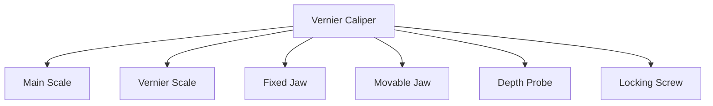
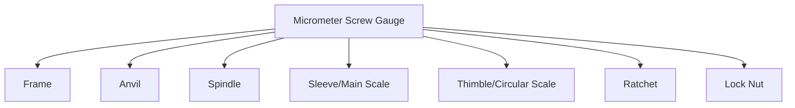
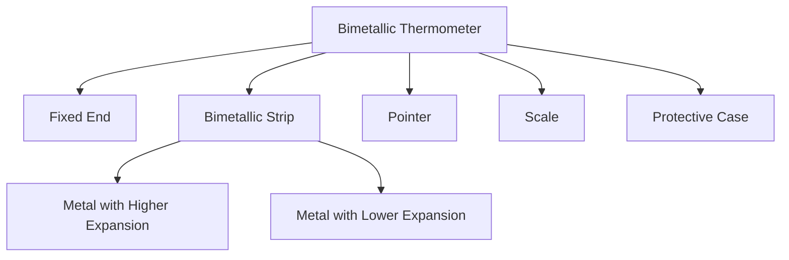
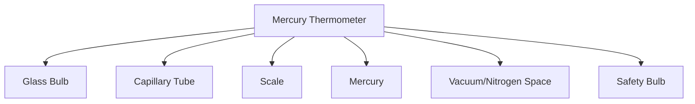
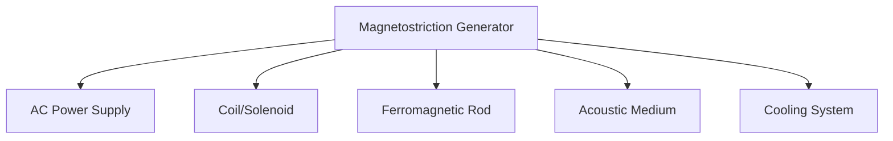

## Question 1(a) [3 marks]

**Define derived physical quantities and give three examples with their S.I. unit and symbol.**

**Answer**:
Derived physical quantities are those which are obtained by multiplication or division of fundamental physical quantities.

**Table: Examples of Derived Physical Quantities**

| Derived Quantity | S.I. Unit | Symbol |
|------------------|-----------|--------|
| Force | Newton (N) | F |
| Energy | Joule (J) | E |
| Electric Current | Ampere (A) | I |

**Mnemonic:** "FEI: Force-Energy-Current derive from fundamentals"

## Question 1(b) [4 marks]

**The length of a metal rod is 64.522 cm at 12°C temperature and 64.576 cm at 90°C temperature. Find the coefficient of linear expansion of the metal rod.**

**Answer**:
**Formula:** α = (L₂ - L₁)/[L₁ × (T₂ - T₁)]

**Calculation:**

- Initial length (L₁) = 64.522 cm
- Final length (L₂) = 64.576 cm
- Initial temperature (T₁) = 12°C
- Final temperature (T₂) = 90°C

α = (64.576 - 64.522)/[64.522 × (90 - 12)]
α = 0.054/(64.522 × 78)
α = 0.054/5032.716
α = 1.073 × 10⁻⁵ /°C

**Mnemonic:** "Change in Length over Original Length times Change in Temperature"

## Question 1(c) [7 marks]

**Explain with figure: The principle, construction and working of a vernier calliper.**

**Answer**:
**Principle**: Vernier caliper works on the principle of vernier scale, which allows measurements with accuracy greater than the main scale.

**Construction:**



**Working:**

- **Zero error check**: Close jaws and note if zero of vernier coincides with zero of main scale
- **External measurement**: Place object between fixed and movable jaws
- **Reading process**: Note main scale reading + (coinciding vernier division × least count)
- **Least count** = (Smallest division on main scale)/(Number of divisions on vernier scale)

**Diagram:**

```goat
                 ┌───────┐            
 Main Scale ───▶│       │◀── Vernier Scale
  (in mm)       │   ┌───┴───┐     
     0    5    10   15      20    25    30
     |....|....|....|....|....|....|....|
     |    0    5    |0    5    |    
     └────┬─────────┘           
          │                  
      Fixed Jaw        Movable Jaw
```

**Mnemonic:** "Main Scale Reading Plus Vernier Division Times Least Count"

## Question 1(c) OR [7 marks]

**Explain with figure: The principle, construction and working of a micrometre screw gauge.**

**Answer**:
**Principle**: Micrometer screw gauge works on the principle of screw motion - rotational motion is converted into linear motion.

**Construction:**



**Working:**

- **Zero error check**: Close anvil and spindle, note if zero of circular scale aligns with reference line
- **Measurement process**: Place object between anvil and spindle
- **Reading**: Main scale reading + (Circular scale reading × Least count)
- **Least Count** = Pitch/Number of divisions on circular scale

**Diagram:**

```goat
                     Ratchet
                        ▲
                        │
        Frame           │        Thimble/Circular Scale
          ┌─────────────┴─────┐  ┌───┐
          │                   │  │   │
Anvil ──▶ O═══════════════════O══O   │
          │     │             │  │   │
          └─────┼─────────────┘  └───┘
                │                   │
                ▼                   ▼
            Spindle             Sleeve/Main Scale
```

**Mnemonic:** "PST: Pitch divided by Scale gives Thimble's least count"

## Question 2(a) [3 marks]

**Find the diameter of a sphere if pitch of micrometer screw gauge is 1 mm and there are 100 divisions on circular scale. The edge of circular scale lies between 7 and 8 mm of the main scale and 65th division of the circular scale coincides with the horizontal line of the main scale.**

**Answer**:
**Formula:** Diameter = Main scale reading + (Circular scale reading × Least count)

**Calculation:**

- Main scale reading = 7 mm
- Circular scale reading = 65 divisions
- Least count = Pitch/Number of divisions = 1/100 = 0.01 mm

Diameter = 7 + (65 × 0.01) = 7 + 0.65 = 7.65 mm

**Mnemonic:** "MSR + (CSR × LC) gives the final measurement"

## Question 2(b) [4 marks]

**Explain phase difference and coherence.**

**Answer**:
**Phase Difference:**
The difference in phase angle between two waves of the same frequency.

**Table: Phase Difference Characteristics**

| Phase Difference | Interference Type | Result |
|------------------|-------------------|--------|
| 0° or 360° | Constructive | Maximum amplitude |
| 180° | Destructive | Minimum amplitude |

**Coherence:**
Property of waves that have a constant phase relationship.

**Types of Coherence:**

- **Temporal coherence**: Related to frequency stability
- **Spatial coherence**: Related to wavefront uniformity

**Mnemonic:** "Constant Phase Relationship Creates Coherent waves"

## Question 2(c) [7 marks]

**Explain capacitor, its capacitance and the effect of dielectric material on the capacitance of parallel plate capacitor.**

**Answer**:
**Capacitor**: Device that stores electric charge and electrical energy in an electric field.

**Capacitance**: Ratio of charge stored to potential difference applied.

**Formula:** C = Q/V

**Parallel Plate Capacitor:**
Capacitance formula: C = ε₀A/d

- ε₀ = Permittivity of free space
- A = Area of plates
- d = Distance between plates

**Effect of Dielectric:**

- Increases capacitance by K times (K = dielectric constant)
- New formula: C = Kε₀A/d

**Diagram:**

```goat
    ┌───────────────┐  │
    │      ++++     │  │
    │      ++++     │  │ d
    │      ++++     │  │
    └───────────────┘  │
           │           
           │          
           V          
    ┌───────────────┐
    │      ----     │
    │      ----     │ ◄── Dielectric
    │      ----     │
    └───────────────┘
           │
           │
    Area = A
```

**Mnemonic:** "KIDS: K Increases Dielectric Storage"

## Question 2(a) OR [3 marks]

**If the lengths of two cylinders are (6.52±0.01) cm and (4.48±0.02) cm respectively. Find the difference in their length with percentage error.**

**Answer**:
**Calculation:**

- Length of first cylinder (L₁) = 6.52 ± 0.01 cm
- Length of second cylinder (L₂) = 4.48 ± 0.02 cm
- Difference in length (ΔL) = L₁ - L₂ = 6.52 - 4.48 = 2.04 cm

**Absolute error in difference** = √[(0.01)² + (0.02)²] = √(0.0001 + 0.0004) = √0.0005 = 0.022 cm

**Percentage error** = (Absolute error/Measured value) × 100
                    = (0.022/2.04) × 100 = 1.08%

**Mnemonic:** "Add errors in quadrature for difference calculations"

## Question 2(b) OR [4 marks]

**Explain the types of interference with relevant figures.**

**Answer**:
**Types of Interference:**

**Table: Interference Types**

| Type | Phase Difference | Result | Wave Amplitude |
|------|------------------|--------|---------------|
| Constructive | 0°, 360°, 720°... | Reinforcement | Maximum |
| Destructive | 180°, 540°, 900°... | Cancellation | Minimum |

**Constructive Interference:**
When crest meets crest or trough meets trough.

**Destructive Interference:**
When crest meets trough.

**Diagram:**

```goat
Constructive Interference:
    ⟋⟍⟋⟍⟋⟍     Wave 1
    ⟋⟍⟋⟍⟋⟍     Wave 2
    ⟋⟍⟋⟍⟋⟍
     ⬍⬍⬍⬍      Result: Larger amplitude
     
Destructive Interference:
    ⟋⟍⟋⟍⟋⟍     Wave 1
    ⟍⟋⟍⟋⟍⟋     Wave 2
    --------- Result: Flat line (cancellation)
```

**Mnemonic:** "Crest + Crest = Constructive, Crest + Trough = Destructive"

## Question 2(c) OR [7 marks]

**Derive the expression for potential due to point charge with necessary figure.**

**Answer**:
**Potential at a point due to point charge:**

**Formula development:**

- **Definition**: Work done per unit charge to bring a test charge from infinity to that point
- **Expression**: V = W/q₀ = ∫(F·dr)

**Step-by-step derivation:**

1. Force between charges (Coulomb's law): F = (1/4πε₀) × (Qq/r²)
2. Work done moving test charge: W = ∫(F·dr)
3. For radial motion: W = (Q/4πε₀) × ∫(1/r²)dr from ∞ to r
4. Integrating: W = (Q/4πε₀) × [-1/r]ᵣ∞
5. Final result: V = W/q₀ = (1/4πε₀) × (Q/r)

**Final formula:** V = (1/4πε₀) × (Q/r)

**Diagram:**

```goat
              P (Point where
                potential is calculated)
              *
              │
              │
              │r
              │
              │
        Q     │
        ●─────┘
   Point Charge at origin
```

**Mnemonic:** "POD: Potential Over Distance equals charge over r"

## Question 3(a) [3 marks]

**Explain in brief charging by friction and induction methods.**

**Answer**:
**Charging by Friction:**
Process of charging by rubbing two different materials together.

**Steps in friction charging:**

- Electrons transfer from one material to another
- Material losing electrons becomes positively charged
- Material gaining electrons becomes negatively charged

**Charging by Induction:**
Process of charging without direct contact.

**Steps in induction charging:**

- Bring charged body near a neutral conductor
- Redistribution of charges in neutral body
- Ground the conductor and remove ground
- Remove the charged body

**Mnemonic:** "FTEE: Friction Transfers Electrons Easily"

## Question 3(b) [4 marks]

**A tuning fork vibrates at frequency of 256 Hz. If its velocity is 340 m/s, find (a) wavelength and (b) distance travelled by it in 50 oscillations.**

**Answer**:
**Formulas:**

- Wavelength (λ) = Velocity (v) / Frequency (f)
- Distance (d) = Number of oscillations (n) × Wavelength (λ)

**Calculation:**
(a) Wavelength (λ) = v/f = 340/256 = 1.328 m

(b) Distance (d) = n × λ = 50 × 1.328 = 66.4 m

**Mnemonic:** "VFD: Velocity, Frequency and Distance are connected"

## Question 3(c) [7 marks]

**Write the principle and construction of a bimetallic thermometer with a labelled diagram. Also mention its advantages and disadvantages.**

**Answer**:
**Principle**: Different metals expand differently when heated, causing the strip to bend.

**Construction:**



**Working:**

- Temperature change causes different expansion rates
- Bimetallic strip bends toward metal with lower expansion coefficient
- Pointer movement indicates temperature

**Diagram:**

```goat
          Pointer
             │
             ▼
        ┌────┴─────┐
Scale ──┤          │
        │          │
        │ ┌────────┘
        │ │
        └─┘
          ▲
          │
    Bimetallic Strip
 (Two different metals laminated)
 
 At higher temperature:
          
          ┌────────┐
          │        │
          │ ┌──────┘
          │ │
          └─┘
            \
             \ (bends due to 
              \ different expansion)
```

**Advantages:**

- Simple, robust design
- No power supply needed
- Wide temperature range

**Disadvantages:**

- Less accurate than other types
- Slow response time
- Subject to mechanical wear

**Mnemonic:** "BEDS: Bimetallic Elements Deform with Stress"

## Question 3(a) OR [3 marks]

**Explain work done on a point charge in an electric field.**

**Answer**:
**Work Done on Point Charge:**
The work done to move a point charge q in an electric field E.

**Formula:** W = q(Vₐ - Vᵦ) = qΔV

Where:

- q = charge being moved
- Vₐ = potential at initial position
- Vᵦ = potential at final position
- ΔV = potential difference

**Key properties:**

- Work is independent of path taken
- Work is positive when moving against electric field
- Work is negative when moving along electric field

**Mnemonic:** "PEW: Potential difference × Electric charge = Work"

## Question 3(b) OR [4 marks]

**What will be the distance travelled by a sound wave in 75 vibrations if its speed is 0.33 km/s and frequency is 660 Hz.**

**Answer**:
**Formulas:**

- Wavelength (λ) = Velocity (v) / Frequency (f)
- Distance (d) = Number of vibrations (n) × Wavelength (λ)

**Calculation:**

- Convert velocity: v = 0.33 km/s = 330 m/s
- Wavelength: λ = v/f = 330/660 = 0.5 m
- Distance: d = n × λ = 75 × 0.5 = 37.5 m

**Mnemonic:** "FVW: Frequency into Velocity gives Wavelength"

## Question 3(c) OR [7 marks]

**Write the principle and construction of a Mercury thermometer with a labelled diagram. Also mention its advantages and disadvantages.**

**Answer**:
**Principle**: Mercury thermometer works on the principle of thermal expansion of mercury when heated.

**Construction:**



**Working:**

- Mercury expands when heated
- Expansion causes mercury to rise in capillary
- Height of mercury column indicates temperature

**Diagram:**

```goat
      ┌─────┐
      │     │ ◄── Scale
      │     │
      │  │  │ ◄── Capillary Tube
      │  │  │
      │  │  │
      │  │  │
      │ ┌┴┐ │ ◄── Mercury Bulb
      │ └─┘ │
      └─────┘
```

**Advantages:**

- High accuracy
- Wide temperature range (-38°C to 357°C)
- Linear expansion of mercury
- Good visibility of mercury thread

**Disadvantages:**

- Mercury is toxic
- Fragile glass construction
- Cannot be used below -38°C
- Slow response to temperature changes

**Mnemonic:** "MELT: Mercury Expands Linearly with Temperature"

## Question 4(a) [3 marks]

**The electric force between two positive ions of equal magnitude separated by distance 5×10⁻¹⁰ m from eachother is 3.7 × 10⁻⁹ N. How many electrons would have been removed from each atom.**

**Answer**:
**Formula:** F = (1/4πε₀) × (q₁q₂/r²)

**Calculation:**

- F = 3.7 × 10⁻⁹ N
- r = 5 × 10⁻¹⁰ m
- q₁ = q₂ = ne (n = number of electrons, e = electron charge)
- 1/4πε₀ = 9 × 10⁹ Nm²/C²
- e = 1.6 × 10⁻¹⁹ C

3.7 × 10⁻⁹ = (9 × 10⁹) × (n²e²/(5 × 10⁻¹⁰)²)
3.7 × 10⁻⁹ = (9 × 10⁹) × (n² × (1.6 × 10⁻¹⁹)²/25 × 10⁻²⁰)
Solving: n = 1 (1 electron removed from each atom)

**Mnemonic:** "FACE: Force Affects Charge Equally"

## Question 4(b) [4 marks]

**State Snell's law and derive its formula.**

**Answer**:
**Snell's Law**: The ratio of sine of angle of incidence to sine of angle of refraction is constant for a given pair of media.

**Formula:** (sin i)/(sin r) = n₂/n₁ = constant

**Derivation steps:**

1. Light travels at different speeds in different media
2. When light passes from one medium to another, it changes direction
3. Using Fermat's principle of least time
4. Ratio of speeds equals ratio of refractive indices
5. Final formula: n₁sin i = n₂sin r

**Diagram:**

```goat
        Medium 1 (n₁)
        │
        │         i
Normal  │        /
        │       /
────────┼──────/───────
        │     /
        │    /
        │   /  r
        │  /
        Medium 2 (n₂)
```

**Mnemonic:** "SINIS: SIN I over SIN R equals refractive index ratio"

## Question 4(c) [7 marks]

**Explain any three applications of Ultrasonic waves.**

**Answer**:
**Applications of Ultrasonic Waves:**

**Table: Ultrasonic Applications**

| Application | Principle | Use |
|-------------|-----------|-----|
| Medical Imaging | Reflection from tissues | Visualize internal organs |
| NDT (Non-Destructive Testing) | Reflection from defects | Find flaws in materials |
| Cleaning | Cavitation effect | Clean jewelry, surgical instruments |

**1. Medical Imaging (Sonography):**

- Frequencies: 1-10 MHz
- Principle: Pulse-echo technique
- Uses: Fetal imaging, organ scanning, blood flow measurement

**2. Industrial NDT:**

- Detects cracks, voids, and flaws in materials
- Quality control in manufacturing
- Thickness measurement of materials

**3. Ultrasonic Cleaning:**

- Creates microscopic bubbles (cavitation)
- Removes contaminants from surfaces
- Used for jewelry, optical components, surgical instruments

**Mnemonic:** "MIC: Medical, Industrial, Cleaning applications"

## Question 4(a) OR [3 marks]

**Obtain the equivalent capacitance for series and parallel combinations of 3 capacitors having capacitances 5 µF, 10 µF and 15 µF respectively.**

**Answer**:
**Parallel Combination:**
Cₚ = C₁ + C₂ + C₃ = 5 + 10 + 15 = 30 µF

**Series Combination:**
1/Cₛ = 1/C₁ + 1/C₂ + 1/C₃
1/Cₛ = 1/5 + 1/10 + 1/15
1/Cₛ = 0.2 + 0.1 + 0.067 = 0.367
Cₛ = 1/0.367 = 2.72 µF

**Mnemonic:** "ASAP: Add for Series, Add inverse for Parallel"

## Question 4(b) OR [4 marks]

**Explain the construction of an optical fibre with a neat diagram.**

**Answer**:
**Construction of Optical Fiber:**

**Components:**

- Core: Light transmission medium
- Cladding: Outer layer with lower refractive index
- Buffer coating: Protective plastic covering

**Parameters:**

- Core diameter: 8-50 μm (single mode), 50-100 μm (multimode)
- Cladding diameter: 125-140 μm
- Core refractive index > Cladding refractive index

**Diagram:**

```goat
Cross-section:
         ┌───────────┐
         │     ┌─────┴─────┐
         │     │     │     │
         │     │     │     │
         │     │     │     │
         │     └─────┬─────┘
         └───────────┘
          │     │     │
   Buffer │ Cladding │ Core
          │     │     │

Longitudinal view:
  ┌──────────────────────────────┐
  │ ┌────────────────────────┐   │
  │ │                        │   │
  │ │           Core         │   │  Light
  │ │                        │   │  ray
  │ └────────────────────────┘   │  ↘
  └──────────────────────────────┘   ⟍⟋⟍⟋⟍⟋
              Cladding               ⟍⟋⟍⟋⟍⟋
```

**Mnemonic:** "CBC: Core-Buffer-Cladding from inside out"

## Question 4(c) OR [7 marks]

**Explain production of ultrasonic waves by magnetostriction method.**

**Answer**:
**Magnetostriction Method:**
The process of generating ultrasonic waves using the property of ferromagnetic materials to change dimensions when placed in a magnetic field.

**Principle:**
Ferromagnetic materials change length when magnetized, producing mechanical vibrations that create ultrasonic waves.

**Construction:**



**Working Process:**

1. AC current passes through solenoid
2. Alternating magnetic field produced
3. Ferromagnetic rod expands and contracts
4. Vibrations transmitted to medium
5. Ultrasonic waves generated

**Diagram:**

```goat
    ┌───────────────────┐
    │                   │
    │  AC Power Supply  │
    │                   │
    └─────────┬─────────┘
              │
              ▼
    ┌─────────────────────┐
    │                     │
    │  ┌───┐      ┌───┐   │
    │  │   │      │   │   │
    │  │   │      │   │   │
    │  │   │      │   │   │
    │  └───┘      └───┘   │
    │   Coil       Coil   │
    │                     │
    └──────────┬──────────┘
               │
      ┌────────┴────────┐
      │ Ferromagnetic   │ ─→ Ultrasonic
      │ Rod (Nickel)    │    Waves
      └─────────────────┘
```

**Advantages:**

- Simple construction
- High power output
- Suitable for liquids

**Disadvantages:**

- Limited to frequencies below 100 kHz
- Heating effects
- Lower efficiency

**Mnemonic:** "FAME: Ferromagnetic Alternating Magnetic Effect"

## Question 5(a) [3 marks]

**Explain in brief the three modes of heat transfer.**

**Answer**:
**Three Modes of Heat Transfer:**

**Table: Heat Transfer Modes**

| Mode | Medium Requirement | Example |
|------|-------------------|---------|
| Conduction | Physical contact | Heat through metal rod |
| Convection | Fluid medium | Hot air rising |
| Radiation | No medium needed | Heat from sun |

**1. Conduction:**

- Transfer through direct molecular collision
- No bulk movement of matter
- Good in solids, especially metals

**2. Convection:**

- Transfer through fluid movement
- Requires density differences
- Natural or forced convection

**3. Radiation:**

- Transfer through electromagnetic waves
- Works in vacuum
- Depends on temperature and surface properties

**Mnemonic:** "CCR: Conduction Contact, Convection Current, Radiation Rays"

## Question 5(b) [4 marks]

**Calculate the numerical aperture and acceptance angle of an optical fibre if the refractive indices of core and cladding of an optical fibre are 1.55 and 1.5 respectively.**

**Answer**:
**Formulas:**

- Numerical Aperture (NA) = √(n₁² - n₂²)
- Acceptance angle (θₐ) = sin⁻¹(NA)

**Calculation:**

- Core refractive index (n₁) = 1.55
- Cladding refractive index (n₂) = 1.5

NA = √(1.55² - 1.5²)
NA = √(2.4025 - 2.25)
NA = √0.1525
NA = 0.391

Acceptance angle (θₐ) = sin⁻¹(0.391)
θₐ = 23.03°

**Mnemonic:** "CORE: Calculate Optical Refractive-index Exactly"

## Question 5(c) [7 marks]

**Explain any three applications of optical fibres.**

**Answer**:
**Applications of Optical Fibers:**

**Table: Major Optical Fiber Applications**

| Application | Advantage | Example |
|-------------|-----------|---------|
| Communications | High bandwidth | Internet, phone networks |
| Medical | Flexibility, imaging | Endoscopy |
| Sensors | Immunity to EMI | Temperature sensing |

**1. Communication Networks:**

- Telecommunications and internet
- Higher bandwidth than copper cables
- Less signal attenuation over long distances
- More secure against tapping

**2. Medical Applications:**

- Endoscopy for minimally invasive procedures
- Light delivery for photodynamic therapy
- Dental procedures
- Surgical illumination

**3. Sensing Applications:**

- Temperature and pressure sensors
- Strain gauges for structural monitoring
- Chemical sensors
- Gyroscopes for navigation

**Mnemonic:** "CMS: Communication, Medical, Sensing applications"

## Question 5(a) OR [3 marks]

**Give a detailed explanation of specific heat.**

**Answer**:
**Specific Heat:**
Amount of heat required to raise the temperature of 1 kg of a substance by 1 Kelvin (or 1°C).

**Formula:** Q = mc∆T

Where:

- Q = Heat energy (J)
- m = Mass (kg)
- c = Specific heat capacity (J/kg·K)
- ∆T = Temperature change (K)

**Units:** J/kg·K or J/kg·°C

**Significance:**

- Measures thermal inertia of materials
- Higher specific heat means material requires more energy to heat up
- Water has unusually high specific heat (4,186 J/kg·K)

**Mnemonic:** "STEM: Specific heat measures Temperature change per Energy and Mass"

## Question 5(b) OR [4 marks]

**If the refractive indices of core and cladding of an optical fibre are 1.48 and 1.45 respectively. Calculate its acceptance angle and critical angle.**

**Answer**:
**Formulas:**

- Numerical Aperture (NA) = √(n₁² - n₂²)
- Acceptance angle (θₐ) = sin⁻¹(NA)
- Critical angle (θc) = sin⁻¹(n₂/n₁)

**Calculation:**

- Core refractive index (n₁) = 1.48
- Cladding refractive index (n₂) = 1.45

NA = √(1.48² - 1.45²)
NA = √(2.1904 - 2.1025)
NA = √0.0879
NA = 0.296

Acceptance angle (θₐ) = sin⁻¹(0.296)
θₐ = 17.2°

Critical angle (θc) = sin⁻¹(n₂/n₁)
θc = sin⁻¹(1.45/1.48)
θc = sin⁻¹(0.9797)
θc = 78.4°

**Mnemonic:** "NA leads to AA, ratio leads to Critical Angle"

## Question 5(c) OR [7 marks]

**Explain the applications of LASER in engineering and medical field.**

**Answer**:
**Applications of LASER:**

**Table: LASER Applications**

| Field | Application | Example |
|-------|-------------|---------|
| Engineering | Cutting/Welding | Metal fabrication |
| Engineering | Measurements | Distance measurement |
| Medical | Surgery | Eye surgery (LASIK) |
| Medical | Therapy | Cancer treatment |

**Engineering Applications:**

**1. Material Processing:**

- Precision cutting of metals, plastics, ceramics
- Welding of dissimilar materials
- Surface treatment and hardening
- 3D printing and rapid prototyping

**2. Metrology and Measurement:**

- Distance measurement with high precision
- Alignment in construction and manufacturing
- Interferometry for surface analysis
- Holography for 3D imaging

**Medical Applications:**

**1. Surgical Procedures:**

- Eye surgery (LASIK, cataract removal)
- Minimally invasive procedures
- Dermatological treatments
- Dental procedures

**2. Therapeutic Uses:**

- Photodynamic therapy for cancer
- Low-level laser therapy for pain
- Treatment of vascular lesions
- Cosmetic procedures

**Diagram:**

```goat
Engineering Applications:
   LASER ──► Material Processing
     │
     ├───► Measurements
     │
     └───► Communications

Medical Applications:
   LASER ──► Surgical Procedures
     │
     ├───► Diagnostic Tools
     │
     └───► Therapeutic Treatments
```

**Mnemonic:** "SMART: Surgery, Measurement, Analysis, Repair, and Treatment"
