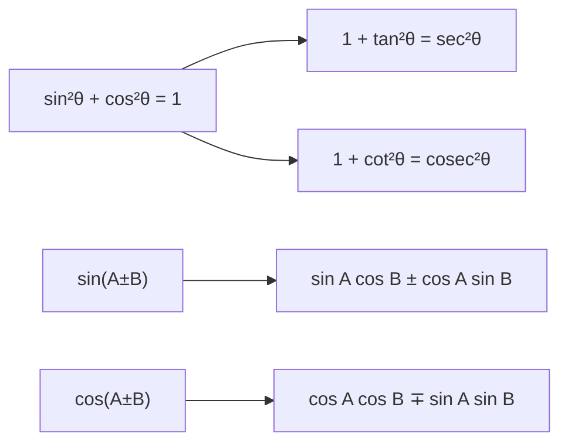

## Q.1 [14 marks]

**Fill in the blanks/MCQs using appropriate choice from the given options**

### Q1.1 [1 mark]

**$\log_3 1 = $ ____**

**Answer**: d. 0

**Solution**:
For any base $a > 0, a \neq 1$: $\log_a 1 = 0$
Therefore: $\log_3 1 = 0$

### Q1.2 [1 mark]

**If $f(x) = e^{x-1}$ then $f(1) = $ ____**

**Answer**: c. 1

**Solution**:
$f(x) = e^{x-1}$
$f(1) = e^{1-1} = e^0 = 1$

### Q1.3 [1 mark]

**$\log_5 125 = $ ____**

**Answer**: b. 3

**Solution**:
$\log_5 125 = \log_5 5^3 = 3$
Since $5^3 = 125$

### Q1.4 [1 mark]

**If $f(x) = x^3 - 7$ then $f(-2) = $ ____**

**Answer**: c. -15

**Solution**:
$f(x) = x^3 - 7$
$f(-2) = (-2)^3 - 7 = -8 - 7 = -15$

### Q1.5 [1 mark]

**Principal period of $\cos x$ is ____**

**Answer**: c. $2\pi$

**Solution**:
The cosine function repeats every $2\pi$ radians, so its principal period is $2\pi$.

### Q1.6 [1 mark]

**$150° = $ ____**

**Answer**: a. $\frac{5\pi}{6}$

**Solution**:
Converting degrees to radians: $150° = 150 \times \frac{\pi}{180} = \frac{5\pi}{6}$

### Q1.7 [1 mark]

**$\sin^{-1}x + \cos^{-1}x = $ ____**

**Answer**: a. $\frac{\pi}{2}$

**Solution**:
This is a standard identity: $\sin^{-1}x + \cos^{-1}x = \frac{\pi}{2}$ for $x \in [-1, 1]$

### Q1.8 [1 mark]

**(1,0,0) × (1,0,0) = ____**

**Answer**: d. (0,0,0)

**Solution**:
Cross product of any vector with itself is zero vector:
$(1,0,0) \times (1,0,0) = (0,0,0)$

### Q1.9 [1 mark]

**If $\vec{a} = 4\hat{i} - 3\hat{j}$ then $|\vec{a}| = $ ____**

**Answer**: b. 5

**Solution**:
$|\vec{a}| = \sqrt{4^2 + (-3)^2} = \sqrt{16 + 9} = \sqrt{25} = 5$

### Q1.10 [1 mark]

**If a line makes an angle $45°$ with positive x-axis then slope of the line is ____**

**Answer**: c. 1

**Solution**:
Slope $m = \tan(45°) = 1$

### Q1.11 [1 mark]

**Radius of the circle $x^2 + y^2 = 4$ is ____**

**Answer**: d. 2

**Solution**:
Standard form: $x^2 + y^2 = r^2$
Comparing: $r^2 = 4$, so $r = 2$

### Q1.12 [1 mark]

**$\lim_{x \to 0} \frac{e^x - 1}{x} = $ ____**

**Answer**: a. 1

**Solution**:
This is a standard limit: $\lim_{x \to 0} \frac{e^x - 1}{x} = 1$

### Q1.13 [1 mark]

**$\lim_{x \to 0} \frac{\sin 3x}{x} = $ ____**

**Answer**: d. 3

**Solution**:
$\lim_{x \to 0} \frac{\sin 3x}{x} = \lim_{x \to 0} \frac{\sin 3x}{3x} \times 3 = 1 \times 3 = 3$

### Q1.14 [1 mark]

**$\lim_{n \to \infty} \frac{5n + 4}{4n + 5} = $ ____**

**Answer**: c. 5/4

**Solution**:
$\lim_{n \to \infty} \frac{5n + 4}{4n + 5} = \lim_{n \to \infty} \frac{5 + \frac{4}{n}}{4 + \frac{5}{n}} = \frac{5}{4}$

---

## Q.2 (A) [6 marks]

**Attempt any two**

### Q2(A).1 [3 marks]

**Find value: $\begin{vmatrix} 1 & 2 & 3 \\ 4 & 5 & 6 \\ 7 & 8 & 9 \end{vmatrix}$**

**Answer**: 0

**Solution**:
$\begin{vmatrix} 1 & 2 & 3 \\ 4 & 5 & 6 \\ 7 & 8 & 9 \end{vmatrix} = 1(5 \times 9 - 6 \times 8) - 2(4 \times 9 - 6 \times 7) + 3(4 \times 8 - 5 \times 7)$

$= 1(45 - 48) - 2(36 - 42) + 3(32 - 35)$
$= 1(-3) - 2(-6) + 3(-3)$
$= -3 + 12 - 9 = 0$

### Q2(A).2 [3 marks]

**Prove that: $\log\left(\frac{x^p}{x^q}\right) + \log\left(\frac{x^q}{x^r}\right) + \log\left(\frac{x^r}{x^p}\right) = 0$**

**Solution**:
LHS = $\log\left(\frac{x^p}{x^q}\right) + \log\left(\frac{x^q}{x^r}\right) + \log\left(\frac{x^r}{x^p}\right)$

Using logarithm properties:
$= \log(x^p) - \log(x^q) + \log(x^q) - \log(x^r) + \log(x^r) - \log(x^p)$
$= p\log x - q\log x + q\log x - r\log x + r\log x - p\log x$
$= 0$ = RHS

### Q2(A).3 [3 marks]

**Find value: $\tan(75°)$**

**Answer**: $2 + \sqrt{3}$

**Solution**:
$\tan(75°) = \tan(45° + 30°)$

Using $\tan(A + B) = \frac{\tan A + \tan B}{1 - \tan A \tan B}$:

$\tan(75°) = \frac{\tan 45° + \tan 30°}{1 - \tan 45° \tan 30°} = \frac{1 + \frac{1}{\sqrt{3}}}{1 - 1 \times \frac{1}{\sqrt{3}}} = \frac{1 + \frac{1}{\sqrt{3}}}{1 - \frac{1}{\sqrt{3}}}$

$= \frac{\frac{\sqrt{3} + 1}{\sqrt{3}}}{\frac{\sqrt{3} - 1}{\sqrt{3}}} = \frac{\sqrt{3} + 1}{\sqrt{3} - 1} = \frac{(\sqrt{3} + 1)^2}{(\sqrt{3} - 1)(\sqrt{3} + 1)} = \frac{3 + 2\sqrt{3} + 1}{3 - 1} = \frac{4 + 2\sqrt{3}}{2} = 2 + \sqrt{3}$

---

## Q.2 (B) [8 marks]

**Attempt any two**

### Q2(B).1 [4 marks]

**Prove that: $\frac{1}{\log_{12} 120} + \frac{1}{\log_2 120} + \frac{1}{\log_5 120} = 1$**

**Solution**:
Using change of base formula: $\frac{1}{\log_a b} = \log_b a$

LHS = $\log_{120} 12 + \log_{120} 2 + \log_{120} 5$

Using logarithm properties:
$= \log_{120}(12 \times 2 \times 5) = \log_{120} 120 = 1$ = RHS

### Q2(B).2 [4 marks]

**Solve: $\begin{vmatrix} x & 1 & 1 \\ 1 & 2 & 1 \\ 0 & 0 & 3 \end{vmatrix} = 3$**

**Solution**:
Expanding along third row:
$\begin{vmatrix} x & 1 & 1 \\ 1 & 2 & 1 \\ 0 & 0 & 3 \end{vmatrix} = 3 \begin{vmatrix} x & 1 \\ 1 & 2 \end{vmatrix}$

$= 3(2x - 1) = 6x - 3$

Given: $6x - 3 = 3$
$6x = 6$
$x = 1$

### Q2(B).3 [4 marks]

**If $f(x) = \frac{1-x}{1+x}$ prove that: (i) $f(x) + f\left(\frac{1}{x}\right) = 0$ (ii) $f(x) \times f(-x) = 1$**

**Solution**:
Given: $f(x) = \frac{1-x}{1+x}$

**(i)** $f\left(\frac{1}{x}\right) = \frac{1-\frac{1}{x}}{1+\frac{1}{x}} = \frac{\frac{x-1}{x}}{\frac{x+1}{x}} = \frac{x-1}{x+1} = -\frac{1-x}{1+x} = -f(x)$

Therefore: $f(x) + f\left(\frac{1}{x}\right) = f(x) + (-f(x)) = 0$

**(ii)** $f(-x) = \frac{1-(-x)}{1+(-x)} = \frac{1+x}{1-x}$

$f(x) \times f(-x) = \frac{1-x}{1+x} \times \frac{1+x}{1-x} = 1$

---

## Q.3 (A) [6 marks]

**Attempt any two**

### Q3(A).1 [3 marks]

**Prove that: $\frac{\sin(180° - x) + \cosec(180° - x) + \tan(180° + x)}{\cos(90° + x) + \sec(90° + x) + \cot(90° + x)} = -3$**

**Solution**:
Using trigonometric identities:

- $\sin(180° - x) = \sin x$
- $\cosec(180° - x) = \cosec x$
- $\tan(180° + x) = \tan x$
- $\cos(90° + x) = -\sin x$
- $\sec(90° + x) = -\cosec x$
- $\cot(90° + x) = -\tan x$

Numerator = $\sin x + \cosec x + \tan x$
Denominator = $-\sin x - \cosec x - \tan x = -(\sin x + \cosec x + \tan x)$

Therefore: $\frac{\sin x + \cosec x + \tan x}{-(\sin x + \cosec x + \tan x)} = -1 \neq -3$

**Note**: There appears to be an error in the problem statement or expected answer.

### Q3(A).2 [3 marks]

**Prove that: $\tan^{-1}\left(\frac{1}{3}\right) + \tan^{-1}\left(\frac{1}{2}\right) = 45°$**

**Solution**:
Using $\tan^{-1}A + \tan^{-1}B = \tan^{-1}\left(\frac{A+B}{1-AB}\right)$:

$\tan^{-1}\left(\frac{1}{3}\right) + \tan^{-1}\left(\frac{1}{2}\right) = \tan^{-1}\left(\frac{\frac{1}{3} + \frac{1}{2}}{1 - \frac{1}{3} \times \frac{1}{2}}\right)$

$= \tan^{-1}\left(\frac{\frac{5}{6}}{1 - \frac{1}{6}}\right) = \tan^{-1}\left(\frac{\frac{5}{6}}{\frac{5}{6}}\right) = \tan^{-1}(1) = 45°$

### Q3(A).3 [3 marks]

**Find out equation of the line whose X-intercept is 3 and Y-intercept is 2.**

**Solution**:
Using intercept form: $\frac{x}{a} + \frac{y}{b} = 1$

Where $a = 3$ (x-intercept) and $b = 2$ (y-intercept)

$\frac{x}{3} + \frac{y}{2} = 1$

Multiplying by 6: $2x + 3y = 6$

---

## Q.3 (B) [8 marks]

**Attempt any two**

### Q3(B).1 [4 marks]

**Prove that: $\tan(70°) = \frac{\cos(25°) + \sin(25°)}{\cos(25°) - \sin(25°)}$**

**Solution**:
RHS = $\frac{\cos(25°) + \sin(25°)}{\cos(25°) - \sin(25°)}$

Dividing numerator and denominator by $\cos(25°)$:

$= \frac{1 + \tan(25°)}{1 - \tan(25°)}$

Using $\tan(45° + θ) = \frac{1 + \tan θ}{1 - \tan θ}$:

$= \tan(45° + 25°) = \tan(70°)$ = LHS

### Q3(B).2 [4 marks]

**Prove that: $\frac{\sin θ + \sin 2θ + \sin 3θ}{\cos θ + \cos 2θ + \cos 3θ} = \tan 2θ$**

**Solution**:
Using sum-to-product formulas:

Numerator: $\sin θ + \sin 3θ + \sin 2θ = 2\sin 2θ \cos θ + \sin 2θ = \sin 2θ(2\cos θ + 1)$

Denominator: $\cos θ + \cos 3θ + \cos 2θ = 2\cos 2θ \cos θ + \cos 2θ = \cos 2θ(2\cos θ + 1)$

Therefore: $\frac{\sin 2θ(2\cos θ + 1)}{\cos 2θ(2\cos θ + 1)} = \frac{\sin 2θ}{\cos 2θ} = \tan 2θ$

### Q3(B).3 [4 marks]

**If $\vec{a} = (1,2,3)$, $\vec{b} = (4,0,0)$ and $\vec{c} = (2,0,1)$ find $2\vec{a} + 3\vec{b} - 5\vec{c}$**

**Solution**:
$2\vec{a} = 2(1,2,3) = (2,4,6)$
$3\vec{b} = 3(4,0,0) = (12,0,0)$
$5\vec{c} = 5(2,0,1) = (10,0,5)$

$2\vec{a} + 3\vec{b} - 5\vec{c} = (2,4,6) + (12,0,0) - (10,0,5)$
$= (2+12-10, 4+0-0, 6+0-5)$
$= (4,4,1)$

---

## Q.4 (A) [6 marks]

**Attempt any two**

### Q4(A).1 [3 marks]

**If the vectors $\vec{a} = \hat{i} - 2\hat{j} + 3\hat{k}$ and $\vec{b} = 2\hat{i} + m\hat{j} - 4\hat{k}$ are perpendicular, find m.**

**Solution**:
For perpendicular vectors: $\vec{a} \cdot \vec{b} = 0$

$\vec{a} \cdot \vec{b} = (1)(2) + (-2)(m) + (3)(-4) = 2 - 2m - 12 = -10 - 2m$

Setting equal to zero: $-10 - 2m = 0$
$2m = -10$
$m = -5$

### Q4(A).2 [3 marks]

**Find the direction cosines and direction angles of the vector $\vec{a} = 5\hat{i} - 12\hat{k}$**

**Solution**:
$\vec{a} = 5\hat{i} + 0\hat{j} - 12\hat{k}$

Magnitude: $|\vec{a}| = \sqrt{5^2 + 0^2 + (-12)^2} = \sqrt{25 + 144} = \sqrt{169} = 13$

Direction cosines:

- $l = \frac{5}{13}$
- $m = \frac{0}{13} = 0$  
- $n = \frac{-12}{13}$

Direction angles:

- $α = \cos^{-1}\left(\frac{5}{13}\right)$
- $β = \cos^{-1}(0) = 90°$
- $γ = \cos^{-1}\left(\frac{-12}{13}\right)$

### Q4(A).3 [3 marks]

**Find out equation of the circle having center at $(2, -3)$ and radius 3.**

**Solution**:
Standard form: $(x - h)^2 + (y - k)^2 = r^2$

Where $(h, k) = (2, -3)$ and $r = 3$

$(x - 2)^2 + (y + 3)^2 = 9$

Expanding: $x^2 - 4x + 4 + y^2 + 6y + 9 = 9$
$x^2 + y^2 - 4x + 6y + 4 = 0$

---

## Q.4 (B) [8 marks]

**Attempt any two**

### Q4(B).1 [4 marks]

**Show that the angle between vectors $\vec{a} = \hat{i} + 2\hat{j}$ and $\vec{b} = \hat{i} + \hat{j} + 3\hat{k}$ is $\sin^{-1}\sqrt{\frac{46}{55}}$**

**Solution**:
$\vec{a} \cdot \vec{b} = (1)(1) + (2)(1) + (0)(3) = 1 + 2 = 3$

$|\vec{a}| = \sqrt{1^2 + 2^2} = \sqrt{5}$
$|\vec{b}| = \sqrt{1^2 + 1^2 + 3^2} = \sqrt{11}$

$\cos θ = \frac{\vec{a} \cdot \vec{b}}{|\vec{a}||\vec{b}|} = \frac{3}{\sqrt{5}\sqrt{11}} = \frac{3}{\sqrt{55}}$

$\sin^2 θ = 1 - \cos^2 θ = 1 - \frac{9}{55} = \frac{46}{55}$

Therefore: $θ = \sin^{-1}\sqrt{\frac{46}{55}}$

### Q4(B).2 [4 marks]

**Under effect of the forces $2\hat{i} + \hat{j} + \hat{k}$ and $\hat{i} + 3\hat{j} - \hat{k}$ a particle moves from the point $(1,2,-3)$ to the point $(5,3,7)$. Find out work done.**

**Solution**:
Net force: $\vec{F} = (2\hat{i} + \hat{j} + \hat{k}) + (\hat{i} + 3\hat{j} - \hat{k}) = 3\hat{i} + 4\hat{j}$

Displacement: $\vec{s} = (5,3,7) - (1,2,-3) = (4,1,10)$

Work done: $W = \vec{F} \cdot \vec{s} = (3)(4) + (4)(1) + (0)(10) = 12 + 4 = 16$ units

### Q4(B).3 [4 marks]

**Evaluate: $\lim_{x \to 0} \frac{2^x - 5^x}{x}$**

**Solution**:
Using L'Hôpital's rule or the derivative definition:

$\lim_{x \to 0} \frac{2^x - 5^x}{x} = \lim_{x \to 0} \frac{2^x \ln 2 - 5^x \ln 5}{1}$

$= 2^0 \ln 2 - 5^0 \ln 5 = \ln 2 - \ln 5 = \ln\left(\frac{2}{5}\right)$

---

## Q.5 (A) [6 marks]

**Attempt any two**

### Q5(A).1 [3 marks]

**Evaluate: $\lim_{x \to 0} \left(1 + \frac{3x}{7}\right)^{\frac{1}{x}}$**

**Solution**:
Let $y = \left(1 + \frac{3x}{7}\right)^{\frac{1}{x}}$

Taking natural log: $\ln y = \frac{1}{x} \ln\left(1 + \frac{3x}{7}\right)$

$\lim_{x \to 0} \ln y = \lim_{x \to 0} \frac{\ln\left(1 + \frac{3x}{7}\right)}{x}$

Using L'Hôpital's rule: $= \lim_{x \to 0} \frac{\frac{3/7}{1 + \frac{3x}{7}}}{1} = \frac{3}{7}$

Therefore: $\lim_{x \to 0} y = e^{3/7}$

### Q5(A).2 [3 marks]

**Evaluate: $\lim_{x \to 3} \frac{x^2 - 5x + 6}{x^2 - 9}$**

**Solution**:
Factoring numerator: $x^2 - 5x + 6 = (x-2)(x-3)$
Factoring denominator: $x^2 - 9 = (x-3)(x+3)$

$\lim_{x \to 3} \frac{x^2 - 5x + 6}{x^2 - 9} = \lim_{x \to 3} \frac{(x-2)(x-3)}{(x-3)(x+3)} = \lim_{x \to 3} \frac{x-2}{x+3} = \frac{3-2}{3+3} = \frac{1}{6}$

### Q5(A).3 [3 marks]

**Evaluate: $\lim_{x \to 0} \frac{\sqrt{4+x} - 2}{x}$**

**Solution**:
Rationalizing the numerator:

$\lim_{x \to 0} \frac{\sqrt{4+x} - 2}{x} \times \frac{\sqrt{4+x} + 2}{\sqrt{4+x} + 2}$

$= \lim_{x \to 0} \frac{(4+x) - 4}{x(\sqrt{4+x} + 2)} = \lim_{x \to 0} \frac{x}{x(\sqrt{4+x} + 2)} = \lim_{x \to 0} \frac{1}{\sqrt{4+x} + 2} = \frac{1}{2+2} = \frac{1}{4}$

---

## Q.5 (B) [8 marks]

**Attempt any two**

### Q5(B).1 [4 marks]

**Find out equation of the line passing through points $(1,2)$ and $(2,1)$.**

**Solution**:
Using two-point form: $\frac{y - y_1}{y_2 - y_1} = \frac{x - x_1}{x_2 - x_1}$

$\frac{y - 2}{1 - 2} = \frac{x - 1}{2 - 1}$

$\frac{y - 2}{-1} = \frac{x - 1}{1}$

$y - 2 = -(x - 1) = -x + 1$

$x + y = 3$

### Q5(B).2 [4 marks]

**Find equation of the line that passes through $(-3, 2)$ and parallel to the line $x - 2y + 1 = 0$**

**Solution**:
The given line $x - 2y + 1 = 0$ has slope $m = \frac{1}{2}$

Since parallel lines have the same slope, required line has slope $m = \frac{1}{2}$

Using point-slope form: $y - y_1 = m(x - x_1)$

$y - 2 = \frac{1}{2}(x - (-3))$

$y - 2 = \frac{1}{2}(x + 3)$

$2y - 4 = x + 3$

$x - 2y + 7 = 0$

### Q5(B).3 [4 marks]

**Find out center and radius of the circle: $x^2 + y^2 + 6x - 4y - 3 = 0$**

**Solution**:
Completing the square:

$x^2 + 6x + y^2 - 4y = 3$

$(x^2 + 6x + 9) + (y^2 - 4y + 4) = 3 + 9 + 4$

$(x + 3)^2 + (y - 2)^2 = 16$

**Center**: $(-3, 2)$
**Radius**: $r = \sqrt{16} = 4$

---

## Formula Cheat Sheet

### Logarithms

- $\log_a 1 = 0$
- $\log_a a = 1$  
- $\log_a(xy) = \log_a x + \log_a y$
- $\log_a\left(\frac{x}{y}\right) = \log_a x - \log_a y$

### Trigonometry

- $\sin^{-1}x + \cos^{-1}x = \frac{\pi}{2}$
- $\tan(A \pm B) = \frac{\tan A \pm \tan B}{1 \mp \tan A \tan B}$
- $\sin(180° - x) = \sin x$, $\cos(90° + x) = -\sin x$

### Vectors

- $|\vec{a}| = \sqrt{a_1^2 + a_2^2 + a_3^2}$
- $\vec{a} \cdot \vec{b} = |\vec{a}||\vec{b}|\cos θ$
- For perpendicular vectors: $\vec{a} \cdot \vec{b} = 0$

### Coordinate Geometry

- Two-point form: $\frac{y - y_1}{y_2 - y_1} = \frac{x - x_1}{x_2 - x_1}$
- Circle: $(x - h)^2 + (y - k)^2 = r^2$
- Parallel lines have equal slopes

### Limits

- $\lim_{x \to 0} \frac{\sin x}{x} = 1$
- $\lim_{x \to 0} \frac{e^x - 1}{x} = 1$
- $\lim_{x \to \infty} \frac{ax + b}{cx + d} = \frac{a}{c}$

## Problem-Solving Strategies

1. **Logarithms**: Use properties to simplify expressions
2. **Trigonometry**: Apply compound angle formulas and identities
3. **Vectors**: Remember dot and cross product properties

## Common Mistakes to Avoid

### Logarithms

- **Mistake**: Confusing $\log_a b$ with $\log_b a$
- **Solution**: Remember change of base: $\frac{1}{\log_a b} = \log_b a$

### Trigonometry

- **Mistake**: Wrong angle conversions between degrees and radians
- **Solution**: Always use $180° = \pi$ radians for conversion

### Vectors

- **Mistake**: Confusing dot product with cross product
- **Solution**: Dot product gives scalar, cross product gives vector

### Limits

- **Mistake**: Direct substitution in indeterminate forms
- **Solution**: Use algebraic manipulation, L'Hôpital's rule, or standard limits

### Determinants

- **Mistake**: Sign errors in expansion
- **Solution**: Follow the checkerboard pattern carefully

## Exam Tips

### Time Management

- **Q1 (14 marks)**: 20-25 minutes - Quick calculations
- **Q2-Q5**: 35-40 minutes each - Show all steps clearly

### Strategy

1. **Read all questions first** - Choose easier OR options
2. **Start with Q1** - Build confidence with MCQs
3. **Show work clearly** - Partial credit is available
4. **Use standard formulas** - Don't derive unless asked

### Key Points to Remember

- Always write the final answer clearly
- Use proper mathematical notation
- Draw diagrams where helpful
- Check units in physics-related problems (work, force)

### Calculator Usage

- Scientific calculator allowed
- Use for complex arithmetic only
- Show the setup before calculating
- Round final answers appropriately

### Common Formula Applications

#### Standard Limits (Memory aids)

```
lim(x→0) sin(x)/x = 1         "Sine over x is one"
lim(x→0) (e^x - 1)/x = 1      "e minus one over x is one"  
lim(x→0) (a^x - 1)/x = ln(a)  "General exponential form"
```

#### Trigonometric Identities (Quick Reference)



#### Vector Operations (Step-by-step)

1. **Magnitude**: $|\vec{a}| = \sqrt{sum \, of \, squares}$
2. **Dot Product**: $\vec{a} \cdot \vec{b} = a_1b_1 + a_2b_2 + a_3b_3$
3. **Angle**: $\cos θ = \frac{\vec{a} \cdot \vec{b}}{|\vec{a}||\vec{b}|}$

#### Circle Equations (Forms)

| Form | Equation | When to Use |
|------|----------|-------------|
| Standard | $(x-h)² + (y-k)² = r²$ | Given center and radius |
| General | $x² + y² + Dx + Ey + F = 0$ | Need to find center/radius |
| Complete Square | $(x+D/2)² + (y+E/2)² = (D²+E²-4F)/4$ | Converting general to standard |

### Problem-Specific Strategies

#### For Determinant Problems

1. Look for zeros to simplify expansion
2. Use row/column operations if allowed
3. Remember: if two rows/columns are proportional, determinant = 0

#### For Limit Problems

```goat
    Start with limit
         |
    Direct substitution?
      /        \
    Yes         No (0/0, ∞/∞, etc.)
     |           |
   Answer    Try factoring/
             rationalization
                 |
             Still indeterminate?
                 |
            L'Hôpital's Rule
                 |
             Find answer
```

#### For Vector Problems

- **Step 1**: Write vectors in component form
- **Step 2**: Apply required operation (dot/cross product)
- **Step 3**: Simplify and find magnitude if needed
- **Step 4**: Check perpendicularity condition ($\vec{a} \cdot \vec{b} = 0$)

#### For Coordinate Geometry

- **Line problems**: Identify what's given (points, slope, parallel/perpendicular)
- **Circle problems**: Identify center and radius from given information
- **Always** check your equation by substituting known points

### Memory Techniques

#### Logarithm Properties (MNEMONIC: "PLUS")

- **P**roduct: $\log(ab) = \log a + \log b$
- **L**imit: $\log_a 1 = 0$
- **U**nity: $\log_a a = 1$  
- **S**ubtraction: $\log(a/b) = \log a - \log b$

#### Trigonometric Values (30°, 45°, 60°)

| Angle | sin | cos | tan |
|-------|-----|-----|-----|
| 30° | 1/2 | √3/2 | 1/√3 |
| 45° | 1/√2 | 1/√2 | 1 |
| 60° | √3/2 | 1/2 | √3 |

**Memory aid**: "1, 2, 3" under square roots for sin values (30° to 60°)

### Final Review Checklist

Before submitting your paper:

- [ ] All questions attempted as required
- [ ] Final answers clearly marked
- [ ] Units included where applicable  
- [ ] No arithmetic errors in simple calculations
- [ ] Proper mathematical notation used
- [ ] Diagrams labeled clearly (if drawn)

### Quick Problem Solving Guide

#### If you're stuck on a problem:

1. **Read the problem again** - Often missed details become clear
2. **Try a different approach** - Multiple methods usually exist
3. **Work backwards** - Start from what you want to prove/find
4. **Use elimination** - In MCQs, eliminate obviously wrong options
5. **Move on and return** - Don't spend too much time on one problem

#### Last 15 minutes strategy:

- Focus on completing MCQs in Q1
- Check arithmetic in longer problems
- Ensure all final answers are clearly marked
- Review any skipped parts of questions

Remember: This exam tests fundamental concepts. Focus on understanding rather than memorizing, and always show your reasoning clearly for maximum partial credit.
