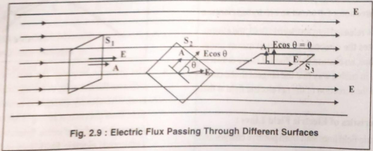
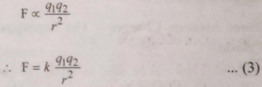
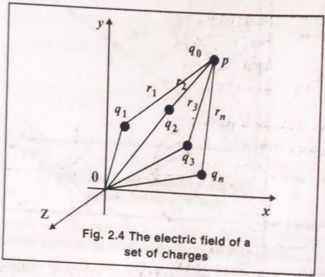
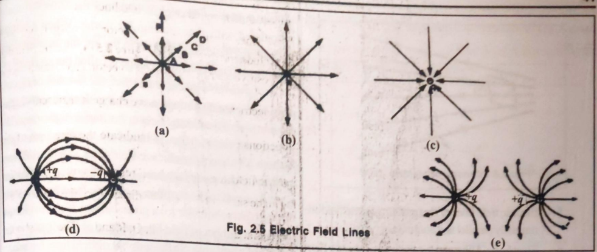
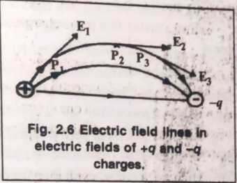
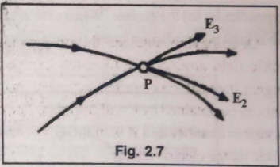
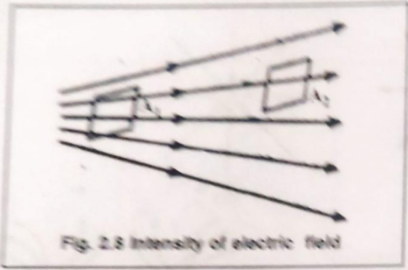

# Unit-2. Electrostatics - Solutions

## Part A: Definitions with Standard Units (1 or 2 marks)

### (1) Give definitions with its standard unit:

#### **Electric Field (E):**

**Definition:** The electric field at a point is defined as the force experienced by a unit positive charge placed at that point. It represents the effect of an electric charge in the surrounding space.

**Mathematical Formula:**

```
E = F / q₀
```

Where:

- E = Electric field intensity
- F = Electric force experienced
- q₀ = Test charge (very small positive charge)

For a point charge Q at distance r:

```
E = kQ / r²  or  E = Q / (4πε₀r²)
```

**SI Unit:** Newton per Coulomb (N/C) or Volt per meter (V/m)

**Direction:** Electric field is a vector quantity. It points away from positive charges and towards negative charges.

---

#### **Electric Potential (V):**

**Definition:** The electric potential at a point in an electric field is defined as the amount of work done in bringing a unit positive charge from infinity to that point without acceleration.

**Mathematical Formula:**

```
V = W / q
```

Where:

- V = Electric potential
- W = Work done
- q = Charge

For a point charge Q at distance r:

```
V = kQ / r  or  V = Q / (4πε₀r)
```

**SI Unit:** Volt (V) or Joule per Coulomb (J/C)

**Note:** Electric potential is a scalar quantity.

---

#### **Electric Potential Difference (ΔV or V):**

**Definition:** The potential difference between two points in an electric field is defined as the work done in moving a unit positive charge from one point to another against the electric field.

**Mathematical Formula:**

```
V₂ - V₁ = W / q

or

ΔV = W / q
```

Where:

- V₂ - V₁ = Potential difference between points 2 and 1
- W = Work done
- q = Charge moved

**Relation with Electric Field:**

```
V = -E × d  (for uniform field)
```

**SI Unit:** Volt (V)

**Note:** Potential difference is also called voltage.

---

#### **Electric Flux (Φ):**

**Definition:** Electric flux through a surface is defined as the total number of electric field lines passing perpendicularly through that surface. It measures the quantity of electric field passing through a given area.



*Figure: Electric flux through different orientations of surface area in electric field*

**Mathematical Formula:**

```
Φ = E · A = EA cos θ
```

Where:

- Φ = Electric flux
- E = Electric field intensity
- A = Area of the surface
- θ = Angle between electric field and normal to the surface

**Special Cases:**

- When θ = 0° (perpendicular): Φ = EA (maximum)
- When θ = 90° (parallel): Φ = 0 (minimum)

**SI Unit:** Newton meter² per Coulomb (N·m²/C) or Volt meter (V·m)

---

#### **Capacitor:**

**Definition:** A capacitor is an electrical device that stores electrical energy in the form of electric charge. It consists of two conducting plates separated by an insulating material (dielectric).

**Construction:** Two parallel conducting plates separated by a small distance with air or dielectric material between them.

**Function:** 

- Stores electric charge and energy
- Blocks DC and allows AC
- Used in filtering, timing circuits, energy storage

**Types:**

1. Fixed capacitors (paper, mica, ceramic, electrolytic)
2. Variable capacitors
3. Parallel plate capacitors
4. Spherical capacitors
5. Cylindrical capacitors

---

#### **Capacitance (C):**

**Definition:** Capacitance is the ability of a capacitor to store electric charge. It is defined as the ratio of charge stored on one plate to the potential difference between the plates.

**Mathematical Formula:**

```
C = Q / V
```

Where:

- C = Capacitance
- Q = Charge stored on one plate
- V = Potential difference between plates

**For Parallel Plate Capacitor:**

```
C = ε₀εᵣA / d = ε₀KA / d
```

Where:

- ε₀ = Permittivity of free space = 8.85 × 10⁻¹² F/m
- εᵣ or K = Relative permittivity (dielectric constant)
- A = Area of each plate
- d = Distance between plates

**SI Unit:** Farad (F)

**Practical Units:** 

- Microfarad (μF) = 10⁻⁶ F
- Nanofarad (nF) = 10⁻⁹ F
- Picofarad (pF) = 10⁻¹² F

**Note:** Capacitance depends on:

1. Area of plates (C ∝ A)
2. Distance between plates (C ∝ 1/d)
3. Dielectric medium (C ∝ K)

---

## Part B: Detailed Answers (2 or 3 marks)

### (1) Explain Coulomb's law with mathematical formula.

**Answer:**

**Coulomb's Law:** French scientist Charles Augustin de Coulomb (1736-1806) conducted experiments to find the force between two electric charges and formulated Coulomb's law.



*Figure: Electric force between two point charges q₁ and q₂*

**Statement:** "The electric force (Coulombian force) between two stationary point charges is directly proportional to the product of their charges and inversely proportional to the square of the distance between them. This force acts along the line joining the two charges."

**Mathematical Formula:**

```
F ∝ q₁q₂  (Force is directly proportional to product of charges)

F ∝ 1/r²  (Force is inversely proportional to square of distance)

Combining both:

F = k(q₁q₂)/r²
```

**Where:**

- F = Electric force between charges (N)
- q₁, q₂ = Magnitudes of two point charges (C)
- r = Distance between the charges (m)
- k = Coulomb's constant = 9 × 10⁹ N·m²/C²

**Alternative Form:**

```
F = (1/4πε₀) × (q₁q₂)/r²
```

Where:

- ε₀ = Permittivity of free space = 8.85 × 10⁻¹² C²/N·m²
- k = 1/(4πε₀) = 8.9875 × 10⁹ ≈ 9 × 10⁹ N·m²/C²

**In a Medium:**

```
F = (1/4πε₀εᵣ) × (q₁q₂)/r² = k(q₁q₂)/(εᵣr²)
```

Where:

- εᵣ = Relative permittivity or dielectric constant (K)

**Nature of Force:**

1. **Like charges:** If both charges are of the same sign (both positive or both negative), the force is **repulsive** (pushes them apart)

2. **Unlike charges:** If charges are of opposite signs (one positive, one negative), the force is **attractive** (pulls them together)

**Vector Form:**

```
F⃗₁₂ = k(q₁q₂)/r² × r̂₁₂
```

Where r̂₁₂ is the unit vector from q₁ to q₂.

**Key Points:**

1. Coulomb's law is valid only for **stationary point charges**
2. It is a **fundamental law** of nature
3. Similar to Newton's law of gravitation in form
4. Electric force is **much stronger** than gravitational force (~10³⁹ times)
5. The law can be applied to large charged objects if the distance between them is much larger than their size
6. Permittivity (ε) represents the resistance of the medium that impedes the electric field

**Comparison with Gravitational Force:**

| Property | Gravitational Force | Electric Force |
|----------|-------------------|----------------|
| Formula | F = Gm₁m₂/r² | F = kq₁q₂/r² |
| Nature | Always attractive | Attractive or repulsive |
| Strength | Very weak | Very strong |
| Depends on | Mass | Charge |
| Constant | G = 6.67×10⁻¹¹ | k = 9×10⁹ |

---

### (2) Explain characteristics of Electric field lines with figures.

**Answer:**

**Electric Field Lines:** Michael Faraday introduced the concept of electric field lines (also called "electric lines of force"). The geometric representation of an electric field is called electric field lines.

**Definition:** An electric field line is a curve drawn in an electric field such that the tangent to the curve at any point gives the direction of the net electric field at that point.



*Figure: Electric field lines for positive and negative charges*



*Figure: Electric field lines between positive and negative charges showing force direction*

**Characteristics of Electric Field Lines:**

**1. Origin and Termination:**

- Electric field lines **start from positive charges** and **end at negative charges**
- For isolated positive charge: lines radiate outward to infinity
- For isolated negative charge: lines come from infinity and converge inward
   
```
Positive Charge (+Q):          Negative Charge (-Q):
        ↗  ↑  ↖                      ↙  ↓  ↘
      ↗    |    ↖                  ↙    |    ↘
    →  (+Q)  ←                →  (-Q)  ←
      ↘    |    ↗                  ↖    |    ↗
        ↘  ↓  ↗                      ↖  ↑  ↙
```

**2. Direction of Electric Field:**

- The **tangent** at any point on an electric field line indicates the **direction of the electric field** at that point
- It shows the direction in which a positive test charge would move if placed at that point



*Figure: Tangent at points P₁ and P₂ showing electric field direction E₁ and E₂*

**3. Non-Intersection:**

- **Two electric field lines never intersect or cross each other**
- If they intersect, there would be two directions of electric field at that point, which is impossible
- A charge at the intersection would experience force in two directions simultaneously, which contradicts the definition



*Figure: Two field lines cannot intersect as it would give two field directions at point P*

**4. Field Intensity and Line Density:**

- The **density** (closeness) of electric field lines indicates the **strength of the electric field**
- **Closely spaced lines** → Strong electric field (high intensity)
- **Widely spaced lines** → Weak electric field (low intensity)
- Number of lines passing through a unit area is proportional to field strength



*Figure: More field lines through A₁ indicates stronger field than through A₂*

**5. Uniform Electric Field:**

- Electric field lines of a **uniform electric field** are:
  - Mutually **parallel**
  - **Equidistant** from each other
  - Example: Field between two parallel charged plates

```
Uniform Electric Field:
    ++++++++++++++++
    ║ ║ ║ ║ ║ ║ ║ ║
    ║ ║ ║ ║ ║ ║ ║ ║
    ║ ║ ║ ║ ║ ║ ║ ║
    ───────────────
```

**6. Imaginary Nature:**

- Electric field lines are **imaginary**, but **electric field is real**
- They are a visual tool to represent the field
- Actual field exists continuously in space

**7. Perpendicular to Conducting Surface:**

- Electric field lines are always **perpendicular** to the conducting surface
- This applies both when leaving and entering the charge
- **Reason:** Electric field parallel to conducting surface is zero
- No electric force exists parallel to the conducting surface

**8. Open Curves:**

- Electric field lines **do not form closed loops**
- They always have a beginning (positive charge) and end (negative charge)
- Unlike magnetic field lines which form closed loops

**Examples of Field Line Patterns:**

**a) Two Positive Charges:**

```
     ↗  ↑  ↖            ↗  ↑  ↖
   ↗    |    ↖        ↗    |    ↖
 →  (+Q)      ↔    ↔      (+Q)  ←
   ↘    |    ↗        ↘    |    ↗
     ↘  ↓  ↗            ↘  ↓  ↗
```

*Field lines repel each other, never connect*

**b) Positive and Negative Charges (Dipole):**

```
     ↗  →  →  →  →  ↘
   ↗              ↘
 (+Q) → → → → → (-Q)
   ↘              ↗
     ↘  →  →  →  →  ↗
```

*Field lines flow from + to -*

**Summary Table:**

| Characteristic | Description |
|---------------|-------------|
| Start Point | Positive charge |
| End Point | Negative charge |
| Direction | Tangent at any point |
| Intersection | Never cross |
| Density | Indicates field strength |
| Conductor | Perpendicular to surface |
| Nature | Imaginary lines, real field |
| Closed Loop | No, always open curves |

---

### (3) Write short note on parallel plate capacitor.

**Answer:**

**Parallel Plate Capacitor:** A parallel plate capacitor consists of two large conducting plates of equal area placed parallel to each other and separated by a small distance with air or a dielectric medium between them.

**Construction:**

```
    ++++++++++++++++  ← Plate 1 (+Q charge)
         ↓ ↓ ↓
    ║ ║ ║ ║ ║ ║ ║   ← Electric field (uniform)
         ↓ ↓ ↓
    ────────────────  ← Plate 2 (-Q charge)
         ↑
      Distance d
    
    ←───── A ─────→  (Area of each plate)
```

**Components:**

1. **Two Conducting Plates:**
   - Made of metal (copper, aluminum)
   - Same area A
   - Placed parallel to each other

2. **Dielectric Medium:**
   - Insulating material between plates
   - Air, paper, mica, ceramic, plastic, etc.
   - Prevents direct contact and discharge

3. **Separation (d):**
   - Small distance between plates
   - Typically much smaller than plate dimensions
   - d << √A

**Working Principle:**

When connected to a battery:

1. One plate gets **positive charge (+Q)**
2. Other plate gets **equal negative charge (-Q)**
3. Electric field is established between plates
4. Energy is stored in the electric field

**Electric Field:**

Inside the capacitor (between plates):

```
E = σ/ε₀ = Q/(ε₀A)
```

Where:

- σ = Surface charge density = Q/A
- ε₀ = Permittivity of free space

**Potential Difference:**

```
V = Ed = Qd/(ε₀A)
```

**Capacitance:**

The capacitance of a parallel plate capacitor is given by:

```
C = Q/V = ε₀A/d
```

**With Dielectric:**

```
C = ε₀εᵣA/d = ε₀KA/d = εA/d
```

Where:

- C = Capacitance (F)
- ε₀ = 8.85 × 10⁻¹² F/m
- εᵣ or K = Dielectric constant
- A = Area of each plate (m²)
- d = Distance between plates (m)
- ε = ε₀εᵣ = Permittivity of medium

**Factors Affecting Capacitance:**

1. **Area of Plates (A):**
   - C ∝ A
   - Larger area → More charge storage → Higher capacitance

2. **Distance Between Plates (d):**
   - C ∝ 1/d
   - Smaller distance → Stronger field → Higher capacitance

3. **Dielectric Medium:**
   - C ∝ K (dielectric constant)
   - Higher K → Higher capacitance
   - Air: K = 1, Paper: K ≈ 3.7, Mica: K ≈ 5.5

**Energy Stored:**

The energy stored in a parallel plate capacitor:

```
U = (1/2)QV = (1/2)CV² = Q²/(2C)
```

**Characteristics:**

1. **Uniform Electric Field:**
   - Field between plates is uniform (except at edges)
   - Parallel and equally spaced field lines

2. **High Capacitance:**
   - Relatively high capacitance for given size
   - Depends on area, separation, and dielectric

3. **Linear Device:**
   - Q ∝ V (charge proportional to voltage)
   - Constant capacitance

**Applications:**

1. **Energy Storage:**
   - Camera flash circuits
   - Power supplies

2. **Filtering:**
   - Smoothing voltage in power supplies
   - Signal processing

3. **Timing Circuits:**
   - Oscillators
   - Timers

4. **Coupling/Decoupling:**
   - Blocking DC, allowing AC
   - Separating circuit stages

5. **Tuning:**
   - Radio and TV circuits
   - Resonant circuits

**Advantages:**

- Simple construction
- Predictable capacitance
- Can handle high voltages
- Low cost
- Reliable

**Limitations:**

- Fixed capacitance (unless variable design)
- Limited voltage rating
- Can discharge rapidly (short circuit hazard)
- Electrolytic types have polarity

**Practical Considerations:**

1. **Fringing Effect:**
   - Field lines curve at edges
   - Formula assumes negligible edge effects
   - Valid when d << √A

2. **Breakdown Voltage:**
   - Maximum voltage before dielectric breaks down
   - Depends on dielectric strength and thickness

3. **Leakage Current:**
   - Small current through dielectric
   - Causes gradual discharge

---

### (4) Explain series connection of capacitors in detail.

**Answer:**

**Series Connection of Capacitors:** When capacitors are connected end-to-end such that the negative plate of one capacitor is connected to the positive plate of the next capacitor, they are said to be connected in series.

**Circuit Diagram:**

```
    ───┤├─────┤├─────┤├───
       C₁     C₂     C₃
       
    +  -  +  -  +  -
    Q  Q  Q  Q  Q  Q
```

**Alternative Representation:**

```
         C₁        C₂        C₃
    +───┤├───+───┤├───+───┤├───+
    │        -   +       -   +   │
   ━┷━                          ━┷━
    V                            -
```

**Characteristics of Series Connection:**

**1. Same Charge on All Capacitors:**

- When connected to a battery, the same charge Q flows through each capacitor
- Charge on each capacitor: **Q₁ = Q₂ = Q₃ = Q**
   
   **Reason:** When a charge +Q is stored on the positive plate of C₁, it induces -Q on its negative plate. This -Q repels equal amount from the positive plate of C₂, leaving +Q on it, and so on.

**2. Different Potential Differences:**

- Total voltage divides among capacitors
- V = V₁ + V₂ + V₃
   
   Where:

- V₁ = Q/C₁ (voltage across C₁)
- V₂ = Q/C₂ (voltage across C₂)
- V₃ = Q/C₃ (voltage across C₃)

**3. Equivalent Capacitance:**
   
   The total or equivalent capacitance (Cₛ) of capacitors in series is given by:
   
   ```
   1/Cₛ = 1/C₁ + 1/C₂ + 1/C₃ + ... + 1/Cₙ
   ```

**Derivation:**

Starting with the definition of capacitance:

```
C = Q/V  →  V = Q/C
```

For series connection:

```
V = V₁ + V₂ + V₃

V = Q/C₁ + Q/C₂ + Q/C₃

V = Q(1/C₁ + 1/C₂ + 1/C₃)
```

If Cₛ is the equivalent capacitance:

```
V = Q/Cₛ
```

Comparing:

```
Q/Cₛ = Q(1/C₁ + 1/C₂ + 1/C₃)

1/Cₛ = 1/C₁ + 1/C₂ + 1/C₃
```

**For Two Capacitors in Series:**

```
1/Cₛ = 1/C₁ + 1/C₂ = (C₁ + C₂)/(C₁C₂)

Cₛ = (C₁C₂)/(C₁ + C₂)

Cₛ = Product / Sum
```

**For n Equal Capacitors (C each) in Series:**

```
1/Cₛ = n/C

Cₛ = C/n
```

**Important Points:**

1. **Equivalent Capacitance Decreases:**
   - Cₛ < smallest individual capacitance
   - Series connection reduces total capacitance

2. **Effective Distance Increases:**
   - Series connection is like increasing plate separation
   - Since C ∝ 1/d, capacitance decreases

3. **Voltage Distribution:**
   - Smaller capacitor gets larger voltage
   - V ∝ 1/C
   - V₁/V₂ = C₂/C₁

4. **Same Energy Distribution:**
   - Energy in each: U₁ = Q²/(2C₁)
   - Total energy: U = Q²/(2Cₛ)

**Example Calculation:**

For C₁ = 10 μF, C₂ = 20 μF, C₃ = 30 μF in series:

```
1/Cₛ = 1/10 + 1/20 + 1/30
1/Cₛ = (6 + 3 + 2)/60 = 11/60
Cₛ = 60/11 = 5.45 μF
```

**Applications:**

1. **Voltage Division:**
   - Obtaining different voltages from single source
   - High voltage rating circuits

2. **Increased Voltage Rating:**
   - Total voltage rating = sum of individual ratings
   - Used when higher voltage handling needed

3. **Fine Tuning:**
   - Achieving specific capacitance values
   - Precision applications

**Advantages:**

- Same charge on all capacitors
- Higher voltage handling capability
- Simple voltage division

**Disadvantages:**

- Reduced total capacitance
- If one capacitor fails (open circuit), entire circuit fails
- Unequal voltage distribution

**Comparison with Parallel:**

| Property | Series | Parallel |
|----------|--------|----------|
| Charge | Same (Q) | Different (Q = Q₁+Q₂+Q₃) |
| Voltage | Different (V = V₁+V₂+V₃) | Same (V) |
| Capacitance | 1/C = 1/C₁+1/C₂+1/C₃ | C = C₁+C₂+C₃ |
| Effect | Decreases | Increases |

---

### (5) Explain parallel connection of capacitors in detail.

**Answer:**

**Parallel Connection of Capacitors:** When all the positive plates of capacitors are connected to one common point and all negative plates are connected to another common point, the capacitors are said to be connected in parallel.

**Circuit Diagram:**

```
         C₁    C₂    C₃
    +────┤├────┤├────┤├────+
    │                       │
   ━┷━                     ━┷━
    V                       -
```

**Alternative Representation:**

```
         ┌───┤├─── C₁
    +────┤
    │    ├───┤├─── C₂
   ━┷━   │
    V    └───┤├─── C₃
         │
    ─────┴───────── -
```

**Characteristics of Parallel Connection:**

**1. Same Potential Difference:**

- All capacitors have the same voltage across them
- **V₁ = V₂ = V₃ = V**
   
   **Reason:** All positive plates connected to same point (positive terminal) and all negative plates to another point (negative terminal)

**2. Different Charges:**

- Total charge divides among capacitors
- Each stores charge according to its capacitance
- **Q = Q₁ + Q₂ + Q₃**
   
   Where:

- Q₁ = C₁V (charge on C₁)
- Q₂ = C₂V (charge on C₂)
- Q₃ = C₃V (charge on C₃)

**3. Equivalent Capacitance:**
   
   The total or equivalent capacitance (Cₚ) of capacitors in parallel is given by:
   
   ```
   Cₚ = C₁ + C₂ + C₃ + ... + Cₙ
   ```

**Derivation:**

Starting with the definition of capacitance:

```
Q = CV
```

For parallel connection:

```
Q = Q₁ + Q₂ + Q₃

Q = C₁V + C₂V + C₃V

Q = V(C₁ + C₂ + C₃)
```

If Cₚ is the equivalent capacitance:

```
Q = CₚV
```

Comparing:

```
CₚV = V(C₁ + C₂ + C₃)

Cₚ = C₁ + C₂ + C₃
```

**For n Equal Capacitors (C each) in Parallel:**

```
Cₚ = nC
```

**Important Points:**

1. **Equivalent Capacitance Increases:**
   - Cₚ > largest individual capacitance
   - Parallel connection increases total capacitance

2. **Effective Area Increases:**
   - Parallel connection is like increasing plate area
   - Since C ∝ A, capacitance increases

3. **Charge Distribution:**
   - Larger capacitor stores more charge
   - Q ∝ C
   - Q₁/Q₂ = C₁/C₂

4. **Current Distribution:**
   - Total current: I = I₁ + I₂ + I₃
   - Each branch carries different current

5. **Energy Storage:**
   - Energy in each: U₁ = ½C₁V²
   - Total energy: U = ½CₚV²
   - U = U₁ + U₂ + U₃

**Example Calculation:**

For C₁ = 10 μF, C₂ = 20 μF, C₃ = 30 μF in parallel:

```
Cₚ = C₁ + C₂ + C₃
Cₚ = 10 + 20 + 30
Cₚ = 60 μF
```

If V = 12V, charges are:

```
Q₁ = C₁V = 10 × 12 = 120 μC
Q₂ = C₂V = 20 × 12 = 240 μC
Q₃ = C₃V = 30 × 12 = 360 μC
Total Q = 120 + 240 + 360 = 720 μC
```

Verification:

```
Q = CₚV = 60 × 12 = 720 μC ✓
```

**Applications:**

1. **Increased Capacitance:**
   - Getting higher capacitance from smaller units
   - When large capacitance needed

2. **Increased Current Capacity:**
   - Current divided among capacitors
   - Reduces stress on individual capacitors

3. **Power Factor Correction:**
   - Banks of capacitors in parallel
   - Industrial power systems

4. **Energy Storage:**
   - More energy stored than individual capacitors
   - UPS systems, electric vehicles

5. **Filtering:**
   - Multiple frequency filtering
   - Different capacitors for different frequencies

**Advantages:**

- Increased total capacitance
- Same voltage across all
- If one fails (short circuit), others continue working
- Redundancy and reliability
- Easy to add or remove capacitors

**Disadvantages:**

- Takes more space
- Higher cost (more capacitors)
- If one shorts, entire circuit affected

**Comparison Table:**

| Property | Series | Parallel |
|----------|--------|----------|
| **Connection** | End-to-end | All +ve together, all -ve together |
| **Charge** | Q₁ = Q₂ = Q₃ = Q | Q = Q₁ + Q₂ + Q₃ |
| **Voltage** | V = V₁ + V₂ + V₃ | V₁ = V₂ = V₃ = V |
| **Capacitance** | 1/C = 1/C₁ + 1/C₂ + 1/C₃ | C = C₁ + C₂ + C₃ |
| **Effect on C** | Decreases (C < smallest) | Increases (C > largest) |
| **Analogy** | Like increasing d | Like increasing A |
| **Use** | High voltage circuits | High capacitance needs |

**Practical Example - Three Identical Capacitors:**

For C₁ = C₂ = C₃ = C = 10 μF:

**Series:**

```
Cₛ = C/n = 10/3 = 3.33 μF
```

**Parallel:**

```
Cₚ = nC = 3 × 10 = 30 μF
```

This shows parallel gives 9 times more capacitance than series!

**Mixed Connections:**

Real circuits often use both series and parallel combinations:

```
Example: (C₁ ∥ C₂) in series with C₃
```

Step 1: Find parallel combination

```
C₁₂ = C₁ + C₂
```

Step 2: Combine in series with C₃

```
1/Cₜₒₜₐₗ = 1/C₁₂ + 1/C₃
```

---

### (6) Explain effect of dielectric material on the capacitance of parallel plate.

**Answer:**

**Dielectric Material:** A dielectric is an insulating (non-conducting) material that can be polarized by an electric field. When placed between the plates of a capacitor, it significantly affects the capacitance.

**Common Dielectric Materials:**

- Air (K = 1.0)
- Paper (K ≈ 3.7)
- Mica (K ≈ 5.5)
- Glass (K ≈ 4.5-10)
- Ceramic (K ≈ 6-1000)
- Polyester (K ≈ 3.3)
- Teflon (K ≈ 2.1)

**Effect of Dielectric on Capacitance:**

**1. Without Dielectric (Air/Vacuum):**

Capacitance of parallel plate capacitor:

```
C₀ = ε₀A/d
```

Where:

- C₀ = Capacitance with air/vacuum
- ε₀ = 8.85 × 10⁻¹² F/m (permittivity of free space)
- A = Area of plates
- d = Distance between plates

**2. With Dielectric Material:**

When dielectric is inserted:

```
C = ε₀εᵣA/d = ε₀KA/d

C = KC₀
```

Where:

- C = New capacitance with dielectric
- εᵣ or K = Relative permittivity (dielectric constant)
- K > 1 for all materials except vacuum

**Dielectric Constant (K):**

```
K = C/C₀ = Capacitance with dielectric / Capacitance without dielectric
```

**Key Observation:**

- **Capacitance increases by factor K**
- **K is always ≥ 1** (K = 1 for vacuum)
- Higher K → Higher capacitance

**How Dielectric Increases Capacitance:**

**Physical Mechanism:**

1. **Polarization:**
   - Dielectric molecules align in electric field
   - Positive charges slightly toward negative plate
   - Negative charges slightly toward positive plate

```
Without Dielectric:         With Dielectric:
+++++++++++                 +++++++++++
║ ║ ║ ║ ║                  ⊕ ⊖ ⊕ ⊖ ⊕ ⊖
║ ║ ║ ║ ║     →            ⊖ ⊕ ⊖ ⊕ ⊖ ⊕
───────────                 ⊖ ⊕ ⊖ ⊕ ⊖ ⊕
                            ───────────
    E₀                           E
```

2. **Induced Surface Charges:**
   - Negative charges appear on dielectric surface near positive plate
   - Positive charges appear on surface near negative plate
   - These are called bound charges (cannot move freely)

3. **Reduced Electric Field:**
   - Internal electric field opposes applied field
   - Net field: E = E₀/K
   - External field partially cancelled

4. **Same Charge, Lower Voltage:**
   - Voltage: V = Ed
   - Since E decreases, V decreases
   - V = V₀/K
   - Capacitance: C = Q/V increases

**Mathematical Analysis:**

**At Constant Charge (Q constant):**

Without dielectric:

```
V₀ = Q/C₀
E₀ = V₀/d
```

With dielectric:

```
E = E₀/K
V = Ed = (E₀/K)d = V₀/K
C = Q/V = Q/(V₀/K) = K(Q/V₀) = KC₀
```

**At Constant Voltage (Battery connected):**

Without dielectric:

```
Q₀ = C₀V
```

With dielectric:

```
C = KC₀
Q = CV = KC₀V = KQ₀
```

More charge flows from battery!

**Effects of Dielectric:**

| Property | Without Dielectric | With Dielectric (K) | Change |
|----------|-------------------|-------------------|--------|
| **Capacitance** | C₀ | KC₀ | Increases K times |
| **Electric Field** | E₀ | E₀/K | Decreases K times |
| **Voltage** (Q constant) | V₀ | V₀/K | Decreases K times |
| **Charge** (V constant) | Q₀ | KQ₀ | Increases K times |
| **Energy** (Q constant) | U₀ | U₀/K | Decreases K times |
| **Energy** (V constant) | U₀ | KU₀ | Increases K times |

**Energy Considerations:**

**Case 1: Battery Disconnected (Q constant):**

```
U₀ = Q²/(2C₀)
U = Q²/(2C) = Q²/(2KC₀) = U₀/K
```

Energy decreases! Where does it go?

- Converted to mechanical work (dielectric pulled in)
- Heat due to molecular alignment

**Case 2: Battery Connected (V constant):**

```
U₀ = ½C₀V²
U = ½CV² = ½(KC₀)V² = KU₀
```

Energy increases! From where?

- Battery supplies additional energy
- Work done in polarizing dielectric

**Advantages of Using Dielectric:**

1. **Increased Capacitance:**
   - Get more capacitance without increasing size
   - C = KC₀ where K can be 2-1000

2. **Higher Breakdown Voltage:**
   - Dielectric can withstand higher fields than air
   - Prevents spark/discharge between plates
   - Typical: Air ~3 kV/mm, Mica ~200 kV/mm

3. **Reduced Physical Size:**
   - For given capacitance, can reduce area or increase distance
   - More compact capacitors

4. **Mechanical Support:**
   - Keeps plates at fixed distance
   - Prevents short circuit
   - Structural stability

5. **Protection:**
   - Prevents moisture, dust entry
   - Longer life

**Practical Applications:**

1. **Commercial Capacitors:**
   - Paper: K ≈ 3.7 (cheap, low voltage)
   - Mica: K ≈ 5.5 (precision, stable)
   - Ceramic: K up to 1000 (compact, high C)

2. **Electrolytic Capacitors:**
   - Aluminum oxide: K ≈ 8
   - Tantalum oxide: K ≈ 25
   - Very high capacitance in small size

3. **Variable Capacitors:**
   - Changing dielectric position changes C
   - Used in radio tuning

**Breakdown and Dielectric Strength:**

**Dielectric Strength:** Maximum electric field a dielectric can withstand before breaking down (conducting).

```
E_max = V_max/d
```

| Material | Dielectric Strength (kV/mm) |
|----------|---------------------------|
| Air | 3 |
| Paper | 16 |
| Mica | 200 |
| Teflon | 60 |
| Glass | 30 |

**Summary Formula:**

```
C = ε₀εᵣA/d = ε₀KA/d = εA/d

Where:
- ε = ε₀εᵣ = absolute permittivity of medium
- ε₀ = 8.85 × 10⁻¹² F/m
- εᵣ = K = dielectric constant (≥ 1)
```

**Conclusion:**

Inserting a dielectric between capacitor plates:
✓ Increases capacitance by factor K
✓ Decreases electric field by factor K
✓ Increases breakdown voltage
✓ Makes capacitors more compact
✓ Provides mechanical support and protection

This makes dielectric materials essential for practical capacitor design and applications.

---

## Part C: Numerical Solutions (3 marks)

### (1) Two charges with value of 20 µC and 10 µC are separated 0.02 m distance in air. Find electric force or coulomb force between these charges. K value is 9 × 10⁹ N m²/C².

**Given:**

- Charge 1: q₁ = 20 μC = 20 × 10⁻⁶ C
- Charge 2: q₂ = 10 μC = 10 × 10⁻⁶ C
- Distance: r = 0.02 m = 2 × 10⁻² m
- Coulomb's constant: k = 9 × 10⁹ N·m²/C²
- Medium: Air (εᵣ = 1)

**To Find:**

- Electric force: F = ?

**Formula:**

```
F = k(q₁q₂)/r²
```

**Solution:**

```
F = k(q₁q₂)/r²

F = (9 × 10⁹) × (20 × 10⁻⁶) × (10 × 10⁻⁶) / (0.02)²

F = (9 × 10⁹) × (200 × 10⁻¹²) / (4 × 10⁻⁴)

F = (1800 × 10⁻³) / (4 × 10⁻⁴)

F = (1800 × 10⁻³) × (10⁴/4)

F = 1800 × 10¹ / 4

F = 18000 / 4

F = 4500 N

F = 4.5 × 10³ N
```

**Alternative Method:**

```
F = (9 × 10⁹) × (20 × 10⁻⁶) × (10 × 10⁻⁶) / (2 × 10⁻²)²

F = (9 × 20 × 10) × 10⁹⁻⁶⁻⁶ / (4 × 10⁻⁴)

F = 1800 × 10⁻³ / (4 × 10⁻⁴)

F = 1800/4 × 10⁻³⁺⁴

F = 450 × 10¹

F = 4500 N
```

**Answer:** The electric force (Coulomb force) between the two charges is **4500 N or 4.5 × 10³ N**.

**Nature of Force:** Since both charges are positive, the force is **repulsive**.

---

### (2) 1600 Joule of work is done in moving a charge 25 coulomb from one point to the other. Calculate the potential difference between the points.

**Given:**

- Work done: W = 1600 J
- Charge moved: q = 25 C

**To Find:**

- Potential difference: V = ?

**Formula:**

```
V = W/q
```

Where:

- V = Potential difference (Volt)
- W = Work done (Joule)
- q = Charge (Coulomb)

**Solution:**

```
V = W/q

V = 1600/25

V = 64 V
```

**Answer:** The potential difference between the two points is **64 Volts**.

**Physical Meaning:** 

- 64 Joules of work is needed to move 1 Coulomb of charge between these points
- This also means the electric potential at the first point is 64 V higher than at the second point

---

### (3) A capacitor gets a charge 60 µC when it is connected to a battery of e.m.f. 12 V. Calculate the capacitance of the capacitor.

**Given:**

- Charge stored: Q = 60 μC = 60 × 10⁻⁶ C
- Voltage applied: V = 12 V

**To Find:**

- Capacitance: C = ?

**Formula:**

```
C = Q/V
```

Where:

- C = Capacitance (Farad)
- Q = Charge stored (Coulomb)
- V = Voltage (Volt)

**Solution:**

```
C = Q/V

C = (60 × 10⁻⁶)/12

C = 5 × 10⁻⁶ F

C = 5 μF
```

**Answer:** The capacitance of the capacitor is **5 μF (microfarad)** or **5 × 10⁻⁶ F**.

**Verification:**

```
Q = CV = 5 × 10⁻⁶ × 12 = 60 × 10⁻⁶ C = 60 μC ✓
```

---

### (4) Three capacitors of 10µF are connected in series and parallel connections in circuit. Find out total capacitance in both cases.

**Given:**

- Three identical capacitors
- C₁ = C₂ = C₃ = C = 10 μF
- n = 3 (number of capacitors)

**To Find:**

- (a) Total capacitance in series: Cₛ = ?
- (b) Total capacitance in parallel: Cₚ = ?

**Case (a): Series Connection**

**Formula:**

```
For n identical capacitors in series:
Cₛ = C/n
```

Or using general formula:

```
1/Cₛ = 1/C₁ + 1/C₂ + 1/C₃
```

**Solution:**

**Method 1 (Direct):**

```
Cₛ = C/n

Cₛ = 10/3

Cₛ = 3.33 μF
```

**Method 2 (General formula):**

```
1/Cₛ = 1/C₁ + 1/C₂ + 1/C₃

1/Cₛ = 1/10 + 1/10 + 1/10

1/Cₛ = 3/10

Cₛ = 10/3

Cₛ = 3.33 μF
```

**Answer (Series):** Total capacitance in series = **3.33 μF** or **10/3 μF**

---

**Case (b): Parallel Connection**

**Formula:**

```
For n identical capacitors in parallel:
Cₚ = nC
```

Or using general formula:

```
Cₚ = C₁ + C₂ + C₃
```

**Solution:**

**Method 1 (Direct):**

```
Cₚ = nC

Cₚ = 3 × 10

Cₚ = 30 μF
```

**Method 2 (General formula):**

```
Cₚ = C₁ + C₂ + C₃

Cₚ = 10 + 10 + 10

Cₚ = 30 μF
```

**Answer (Parallel):** Total capacitance in parallel = **30 μF**

---

**Summary:**

| Connection | Formula | Total Capacitance |
|------------|---------|-------------------|
| **Series** | Cₛ = C/n | 3.33 μF |
| **Parallel** | Cₚ = nC | 30 μF |

**Observation:** 

- Parallel gives 9 times more capacitance than series (30/3.33 ≈ 9)
- Series: Cₛ < individual capacitance
- Parallel: Cₚ > individual capacitance

---

### (5) Plate area of one parallel plate capacitor is 10 mm², which are separated with 1mm distance in air. Calculate capacitance of capacitor.

**Given:**

- Area of plates: A = 10 mm² = 10 × 10⁻⁶ m² = 10⁻⁵ m²
- Distance between plates: d = 1 mm = 1 × 10⁻³ m = 10⁻³ m
- Medium: Air (εᵣ = 1, K = 1)
- Permittivity of free space: ε₀ = 8.85 × 10⁻¹² F/m

**To Find:**

- Capacitance: C = ?

**Formula:**

```
C = ε₀εᵣA/d = ε₀A/d  (for air, εᵣ = 1)
```

**Solution:**

```
C = ε₀A/d

C = (8.85 × 10⁻¹²) × (10⁻⁵) / (10⁻³)

C = 8.85 × 10⁻¹²⁻⁵⁺³

C = 8.85 × 10⁻¹⁴ F
```

**Converting to picofarads:**

```
C = 8.85 × 10⁻¹⁴ F
C = 0.0885 × 10⁻¹² F
C = 0.0885 pF
```

**Answer:** The capacitance of the capacitor is **8.85 × 10⁻¹⁴ F** or **0.0885 pF (picofarad)**.

**Note:** This is a very small capacitance due to the small plate area. Practical capacitors have much larger plate areas.

---

### (6) The distance between the plates is 1mm, if we want to get capacitance of 1F, how much area of plate should be?

**Given:**

- Distance between plates: d = 1 mm = 10⁻³ m
- Required capacitance: C = 1 F
- Medium: Air (assuming air, εᵣ = 1)
- Permittivity of free space: ε₀ = 8.85 × 10⁻¹² F/m

**To Find:**

- Area of plates: A = ?

**Formula:**

```
C = ε₀A/d
```

Rearranging for A:

```
A = Cd/ε₀
```

**Solution:**

```
A = Cd/ε₀

A = (1) × (10⁻³) / (8.85 × 10⁻¹²)

A = 10⁻³ / (8.85 × 10⁻¹²)

A = (1/8.85) × 10⁻³⁺¹²

A = 0.113 × 10⁹ m²

A = 1.13 × 10⁸ m²

A = 113 × 10⁶ m²

A = 113,000,000 m²
```

**Converting to square kilometers:**

```
A = 113 × 10⁶ m²
A = 113 km²
```

**Answer:** The area of the plate should be **1.13 × 10⁸ m²** or approximately **113 km²**.

**Physical Interpretation:** 
This enormous area (about 10.6 km × 10.6 km) demonstrates why:

1. **1 Farad is a huge capacitance** - rarely used in practice
2. **Practical capacitors** use microfarads (μF), nanofarads (nF), or picofarads (pF)
3. **Dielectric materials** with high K values are essential to achieve reasonable capacitance in practical sizes
4. **Electrolytic capacitors** can achieve high capacitance (up to mF) by using very thin dielectric layers and special construction

**With Dielectric:**
If we use a dielectric with K = 1000:

```
A = Cd/(ε₀K) = 113 × 10⁶/1000 = 113,000 m² ≈ 0.113 km²
```

Still very large, but more practical!

---

### (7) As per the below circuit, calculate total capacitance value.

**Note:** Since the circuit diagram is referenced but not visible in the text, I'll provide solutions for common circuit configurations:

---

**Case A: Series-Parallel Combination**

Assuming circuit: (C₁ ∥ C₂) in series with C₃

Example: C₁ = 10 μF, C₂ = 20 μF, C₃ = 30 μF

```
        ┌───┤├─── C₁ (10μF)
    +───┤           
        └───┤├─── C₂ (20μF)
        │
    ────┤├──────── C₃ (30μF)
```

**Solution:**

**Step 1:** Find parallel combination of C₁ and C₂

```
C₁₂ = C₁ + C₂
C₁₂ = 10 + 20 = 30 μF
```

**Step 2:** Combine C₁₂ in series with C₃

```
1/Cₜₒₜₐₗ = 1/C₁₂ + 1/C₃
1/Cₜₒₜₐₗ = 1/30 + 1/30
1/Cₜₒₜₐₗ = 2/30
Cₜₒₜₐₗ = 30/2 = 15 μF
```

**Answer:** Total capacitance = **15 μF**

---

**Case B: Series-Parallel Combination (Alternative)**

Assuming circuit: (C₁ in series with C₂) parallel with C₃

Example: C₁ = 6 μF, C₂ = 6 μF, C₃ = 4 μF

```
    ┌───┤├───┤├───┐
    │   C₁    C₂  │
+───┤            ├───
    │    C₃      │
    └─────┤├─────┘
```

**Solution:**

**Step 1:** Find series combination of C₁ and C₂

```
1/C₁₂ = 1/C₁ + 1/C₂
1/C₁₂ = 1/6 + 1/6 = 2/6
C₁₂ = 6/2 = 3 μF
```

**Step 2:** Combine C₁₂ in parallel with C₃

```
Cₜₒₜₐₗ = C₁₂ + C₃
Cₜₒₜₐₗ = 3 + 4 = 7 μF
```

**Answer:** Total capacitance = **7 μF**

---

**Case C: Complex Network**

Assuming bridge network or Wheatstone arrangement

**General Approach:**

1. **Identify series and parallel sections**
2. **Simplify step by step** from outermost to innermost
3. **Use equivalent capacitance formulas** at each step
4. **Continue until single equivalent capacitance** remains

**Steps:**

- Mark parallel combinations and add: C = C₁ + C₂ + ...
- Mark series combinations and use: 1/C = 1/C₁ + 1/C₂ + ...
- Replace simplified sections with equivalent values
- Repeat until circuit reduces to single capacitor

---

**Common Circuit Configurations:**

**Configuration 1: Three in Series**

```
───┤├───┤├───┤├───
   C₁   C₂   C₃

Result: 1/C = 1/C₁ + 1/C₂ + 1/C₃
```

**Configuration 2: Three in Parallel**

```
   ┌──┤├──┐
   │  C₁  │
───┤──┤├──┤───
   │  C₂  │
   └──┤├──┘
      C₃

Result: C = C₁ + C₂ + C₃
```

**Configuration 3: Mixed (Two in Series, then Parallel with Third)**

```
    ┌──┤├──┤├──┐
    │  C₁  C₂ │
+───┤        ├───
    │   C₃   │
    └───┤├───┘

Step 1: C₁₂ = (C₁C₂)/(C₁+C₂)
Step 2: Cₜₒₜₐₗ = C₁₂ + C₃
```

**Please provide the specific circuit diagram for an exact solution!**

---

## Additional Important Formulas

### Electric Charge:

```
Q = ne  (n = 1, 2, 3, ...)
e = 1.6 × 10⁻¹⁹ C (elementary charge)
```

### Coulomb's Law:

```
F = kq₁q₂/r²
k = 9 × 10⁹ N·m²/C²
ε₀ = 8.85 × 10⁻¹² F/m
k = 1/(4πε₀)
```

### Electric Field:

```
E = F/q₀ = kQ/r²
E (uniform) = V/d
```

### Electric Potential:

```
V = kQ/r
V = W/q
ΔV = V₂ - V₁
```

### Electric Flux:

```
Φ = E·A = EA cos θ
```

### Capacitance:

```
C = Q/V
C (parallel plate) = ε₀εᵣA/d
C (with dielectric) = KC₀
```

### Series Capacitors:

```
1/Cₛ = 1/C₁ + 1/C₂ + 1/C₃ + ...
For 2: Cₛ = C₁C₂/(C₁+C₂)
For n equal: Cₛ = C/n
```

### Parallel Capacitors:

```
Cₚ = C₁ + C₂ + C₃ + ...
For n equal: Cₚ = nC
```

### Energy in Capacitor:

```
U = ½QV = ½CV² = Q²/(2C)
```

### Constants:

```
e = 1.6 × 10⁻¹⁹ C
k = 9 × 10⁹ N·m²/C²
ε₀ = 8.85 × 10⁻¹² F/m
1 μF = 10⁻⁶ F
1 nF = 10⁻⁹ F
1 pF = 10⁻¹² F
```

---

*End of Solutions*
