## 2.1 Introduction:

proportional to the squareofthe distance betweenthem,

The importanceofoxygen to the body is the sameas heimportance of electric powerto technology. Electricityis called the "Mother of Technology",where isthe foundation ofelectricity. The most important property felectric charge is that it can betransferred from one object to another. You know that when twosuitable objects are rubbed against each other, electric charge is transferred on both of them. For example, aglassrod becomes positively charged by losing electrons when it isrubbedwith silk, thesilkbecomes negatively chargedby getting electrons this case.

## Fg G GLYPH&lt;26&gt; GLYPH&lt;26&gt; Accordingtothis, when two clectrons ane R?

While wearingortaking offashirt, t-shirt or sweater1 in adry environment (mostlyin winter) you mighthaveheard a cracking sound with/without a spark.

Sparkling sparkswith acrackling soundis experienced whilecovering awoolen blanket on awinter night. Everybody has experienced unnoticingfelt a shock while holding metal handle ofthe door ofthe house,openingthe doorof the car or holding the metalrod in the bus. Lightning flashes in the skywith the thunder of the clouds. All these happen because oftransfer ofelectricity due to anyreason anyhow. Here the electric charge that is fixed on the object is called staticcharges and the study oftheir effects is called static

"Electric Charge"1 cm apart, they exert a gravitationalforce of 5.5 x1067 N force called electric force of Fe =2.24 x 10*N exists oneach other. However,at thesame distance, a repulsive than the gravitational force. Thus,electric force is very between two electrons. Electricforce is 10S times greater strong. Even whentwo protons are placed at a distance of while|(apart ftromeach other) I cm,anelectricrepulsive force of inan equal value exists. However, the electric force of attraction betweenaproton and an electron at a distance of cm seems to be of equalvalue. Thus just as mass is the main cause of gravitationalforce, the property of particies due to which an electricforce exists between them is called the electric charge' oftheparticle. The force acting between two like charges is repulsive and it is attractive betweentwo, theunlike charges. From the abovediscussion, it isclear that the magnitude of thecharge onanelectron andaproton is the same but they are of the opposite type. Conventionally charge of an electron is considered negative and that of a proton is positive. However, if thesign convention of electronic charge (onproton andelectron) is changed, it makes no difference whatsoever to the field of scienceand technology!! And, the value ofthis charge ise= 1.6x 10-19 C.TheSIunit of electric charge is coulomb, abbreviated asC.

electricity. When electric charges aremade to move by applying some force, the movement ofcharges is called electric current and the study of effects produced by an electric| current is called current electricity.

## Electric Charge :

charged. Sincethe charge on an electron is e=1.6 x 10-19 C, the value of 1 Coulombcharge or number of electrons in l coulomb(1C) electric charge,

Only electrons aretransferred during any chemical process orwhen acharge is transferred. Thus,the substance whichreceives electrons becomes negatively charged and the substance which loses electrons becomes positively In general, every object is neutral.

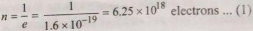

## 2.2.1 Quantization of Electric Charge :

Experiments show that the magnitudeofan electric charge is always an integer multiple of thefundamental charge (charge eof an electron or proton). The unit of charge is Coulomb. .Thus,

2.2 You know that every substance is made up ofatoms Or molecules. Each atom is made up of electrons moving in xed orbits around its nucleus. There are positively charged protons andIneutral neutrons inside the nucleus. Thus, every substance is made up of electrons, protons and neutrons, Called Fundamental Particles, Here,the mass of an electron S M =9.lx 10-31 kg,themass of a proton and aneutron are considØred I to be nearly the same, i.e. M, GLYPH&lt;26&gt; M,1.6 x 10-27 kg. gravitation

As you know about Newton's law of gravitation (Every particle/body in the universe attracts every other with a force whose magnitude is directly proportional to the product oftheir masses and inversely particle/body

5 /2026-27 Modern Physics

Q=ne

2) where n =1, 2, 3,...neN),

This is known as thequantization of electric charge. The value of the basic unit of chargeorelementary charge is

## e=1.6x 10-19 coulomb

Ifa body contains n, electrons andn,protons, the total amountofcharge on the body is q= n,(e) +t n(-e) =(n,-n)e

called the conversation of charges For example, byn |aglass rod with apiece ofsilk cloth (thesetwo objects basically neutral sotheir total charge is zero), the e glassn becomes positively charged andthe silk cloth becom negatively charged. Thus, thetotal sum of the clect chargeson them remains zero.Inother words,only th processes arepossible, in an isolated system, inwhich clectric chargeis conserved.

## 2.2.3 Charging- by FrictionorInduction :

Asny,ny? are integers,their difference must also bean integer.Thus,the charge on anybody is alwaysan integral multiple of e, and can beincreased or decreased also in stens ofe. As

Thus, any charged body or charged particle can possess charge equal to - 1e, t2e, +3eand so on.

i.e., the possible values of chargeare q=te

q=+2e

=tlx1.6 x 1019C

=+1.6

=t2x1.6 x 1019C=t 3.2x x 10-19 C

q =+3e =t3x

Aswe havejustseen,rubbingtheglassrod withasik cloth, both areelectricaly charged; glass rod is positively charged and silk cloth is negatively charged. The charging means generating (placing) electricity onany object. Takea comb and apply it to dryhair. Whena comb is applied to dry hair and then kept closer to a tiny piece of paper, it will attract thepaper. This is so because the piece of paperand the comb both possess oppositekinds of electric charges. 10CThus,an electric charge can be generatedby rubbingan 101C| object andthe object can be charged.

1.6 x 101C=t4.8 x andsoon.Thevalues ofcharge lying in between these values are not possible.

Thecauseof quantization is that only integral number ofelectrons canbe transferred from one body to another, on ubbing. For example, when one electron is transterred, the| (suchas clothes, grain, oil, etc.) and charges acquired bythetwo bodies will be q =le=+1.6 x 10-19 C. Similarly, when n electrons are transferred, the charge acquired by the two bodies will be q =tne=tnx 1.6 x 10-19 C.

## 2.2.2 Conservationof Electric Charge :

enter from outside nor escape from inside is called an The system in which an electric charge can neither electrically isolated system, The algebraic sum of the electric charges (total electric charge) in an electrically isolated system always remains constant, irespective that takes place in the system. For example,let a systemof zero total charge. Suddenly, a positive charge is generated in this system. Since the algebraic sum of chargeis to be constant (here, zero), the charge before and after the process should Iremain the same. When a positive charge issphere loses generated in a process, a negative charge should also be generated inthe process, sothat the total charge zero. Thus, this rule of keeping thetotal charge constant is generate directly into the ground. There is another wayto charge an object other th friction and thatis induction. Suppose a metal sphere somehow positively charged (+0) and placed on an insulatin of any processstand. When the similar but the electrically neutral sphere is madeto touch the first sphere or both spheres are metal connected with a conducting wire, the positive charge of the first sphere is equalized by the electrons on the second sphere. Since both the spheres are identical, the second Q/2 negative charge and becomes positively charged. The chargeon thefirst sphere is also Q/2 remainsQ2. Thus, a neutral sphereis also electrically charged when it comesin contact witha charged sphere.

Similarly, the friction between the metallic body of a moving truck and the atmosphericair causesthe body tobe charged. Thiselectric chargecan also spark, whichcan be very dangerous forits petrol tank, to the combustiblegoods other vehicles running around such as petrol tankers.So often a chain of iron attached to the body of the truck is kept slidingon theroad so that the electric charge generated/accumulated I on the vehicle body passes to the ground. The vehicle tiresare made by adding carbontothe rubberso that the electricity flows

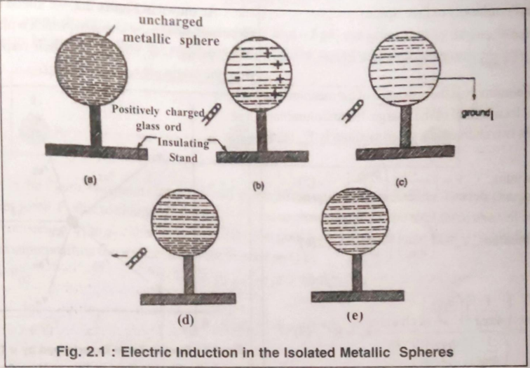

anddeduced that "Theelectric force (Couloumbianforce) between twostationary pointcharges is directly proportional When this rod is kept closer to to the product oftheir charges andinversely proportionalto the square ofthe distancebetween them."This is Coulomb's | law. This force is along the line ofjoining the two charges.

Let two stationary point charges q and q2 are separated bya distance r. The coulombianelectricforce between them,

When there is vacuum or air medium between the charges,the electric force constant orcoulomb'sconstant k= 8.9875x10 9x 10° Nm†c2 in SIsystem. In CGSs system, k=l dyne cmC2.

An electrically neutral metal sphere is placed onthe insulating stand (Figure-2.1). A glass rod is positively charged bynubbing with silk. the sphere, electrons ofthe sphereare attracted towards the part of the surface where the positively charged glass rod is kept closer. The positive charge isexposed on the back surface of the sphere. As soon as the rear surface ofthe sphere is grounded with conducting wire, the electrons from the ground rush to the surface of the sphere and the positive charge become electricaly neutral onreceivingtheseelectrons. The negativecharge stillremains on the surface towards the rod (Fig -2.lc and d). Now removing the rod from the phere, the remaining negative charge onthe sphere is evenly distributed over thesphere (Fig 2.1-e). Thus,the sphere can De charged without bringing into direct contact with the Charged glass rod. This method is called "Induction".

Here, it is interesting thatthe glass rod does not lose any electric charge and the sphere gets charged. Whileinthe direct contactmethod, discussed above, the second sphere receives the same charge as thecharged sphere loses. This is the main differencebetween charging an object using the method.

direct tcontact methodand the induction

2.2.4 Coulomb's

l

Law: French scientist Charles Coulomb conducted many experimentsto find I theforce between two electric charges

Coulomb'slaw is a basic law ofnature. This is true only for static point (electric) charges. However,this rulecan also be applied to large charged objccts, if the distance between themis much largerthan their size.

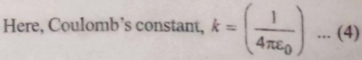

<!-- formula-not-decoded -->

Where,Pemittivity ofFree Space,

<!-- formula-not-decoded -->

Here, Permittivity is the resistance of the medium that impedestheelectric field of the charge. If the Columbian force between two chargesin agiven medium is F,then,

<!-- formula-not-decoded -->

<!-- formula-not-decoded -->

Where, GLYPH&lt;26&gt;, =Relative Permittivity of medium or dielectric constant (K).

Permittivity of medium (GLYPH&lt;26&gt;) Permittivity of Free Space or Vacuum (Eo) =K

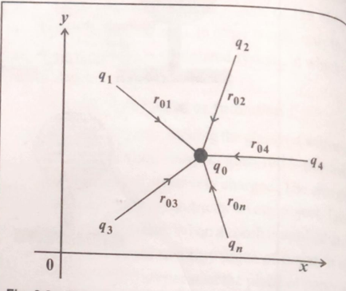

Fig. 2.2 : Electric Force Experienced by a Test Charge in the Electric Field of Two or More Charges.

Here,the force acting between goand

<!-- formula-not-decoded -->

Similarly, the force exerted between goand q,wil =k 0andtheforceexerted between goand

Since the relative permeability ofthe medium (GLYPH&lt;26&gt;,), is abways greater than one,the Columbian force (F) ina given be, medium is lessthan the force exerted in avacuum(F). Thus, GLYPH&lt;26&gt;&gt;13F &lt;F

## 2.2.5 Force between Charges - The Superposition Principle:

<!-- formula-not-decoded -->

Coulomb's law can be used to obtain the electric (Coulombian) force acting betweentwo electric charges. But, if more thantwoelectric charges are present, the net electricforceacting on anyoneofthem can be obtained by superposition in addition to Coulomb'slaw. The net electric force between them can be obtained by summing the individual forces exerted between each pair of electric charges. Thisis calledthe superposition principle.

Therefore, the total net force exerted on the tes charge is obtained by summing each of those forces.

:.

n=1,2,3, -

F=F +F, + Ft...+F,;

<!-- formula-not-decoded -->

<!-- formula-not-decoded -->

.:.

2.2

thi

So

Phy, e As shown in Figure2.2, weintend to ,find the force exerted on a test charge qo which is placedi in the of 41: 2 93 . 4,charges and their respective dista fromthe origin are ro1, o2: o3 . Or E

fi

A

L.2.6 Illustrations :

Example-1 :1 Twopoint charges having magnitude 10 uC and-5 uC areseparated by 30cm. Where should a third point charge be placed sothat theresultantelectric force acting on it becomes zero?

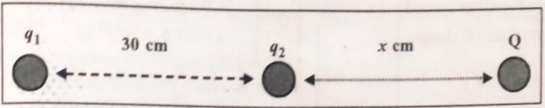

Solution :

As shown in the figure, two point charges q, and g,are 30cm apart fromeach other. The test charge Q.in their field, experiences force F, dueto charge g and force F, dueto chargeg2. Also, thetotalforceexerted on Q will be zero on the line connecting q, to g, eitherintheright directionfrom 92 Orx distance apart fromg, in the left direction. According to the superposition theory, the total forceexerted on Q is,

F=Fo +Fo2

9, =10uC=10x 10-6C

<!-- formula-not-decoded -->

<!-- formula-not-decoded -->

10x 10-6

-5x 10-6

-=0

(0.3

+GLYPH&lt;26&gt;)

- 10r2- 5(0.3 +GLYPH&lt;26&gt;)20
- 2x2- (0.3 + x) =0
- 2r2- (0.09+ 0.6 x+)=0
- x'-0.6x -0.09 =0

This is a ax'+ bx +c=0 type quadratic equation with the solutions x = -btyb-4ac 2a where a =1, b=0.6

and c=-0.09.

X=

<!-- formula-not-decoded -->

0.725 m GLYPH&lt;26&gt;H -0.125 -5C charges upon a charge Q will be zero at a distance the total electric

Solution:

m 72.5cm and -12.50 cm Thus, electric force exerted byg,=10 pCand 4, of 72.5 cm tothe right side from g, and 12.5 cm tothe left side from 41 Example-2 : Calculate charge on an object that has 20 extra electrons.

Numberofelectrons, n =20, Charge of an electrone e=-1.6x 10-19C

The total electrical charge of 20 electrons q= ne =(20)(-1.6 x 10-19) =-3.2 x 10-18C

<!-- formula-not-decoded -->

=30cm=30×10m =0.3 m ro1 = 0.3 +x ron x m

Example-3 :An object emits 10electrons per second.Sohow long willit take to emit 1 Ccharge ?

Solution:

q-ne=(109) (1.6 x 10-19) =1.6x 10-10 C/s

Electric charge produced per second =1.6 x 10-10 C

Time required to produce 1C charge

1 =6.25 x 10s L.6x 10-10

6.25 x 10s 3.154 x 10 =198.16 years

Example-4: Theelectric force between twopositiveions of equal magnitudeat adistance of 5¯ from each e is 3.7 x 10-9 N. How many electrons would have been removed from each atom ?

Solution:

Let q = 42 =Q

Electric force . F kGLYPH&lt;26&gt;92 -GLYPH&lt;26&gt; GLYPH&lt;26&gt;U:QrFA

<!-- formula-not-decoded -->

Q=(5 x 10-10)(0.6449 x 10-9) =3.22x 10-19C

No. of electrons,n= GLYPH&lt;26&gt;\_3.22 x 10-19c -2.01 2 electrons L6x 10-19

Example-5: Find the ratio of gravitational forceto electrostatic force between the protonsin the nucle an atom and the electrons revolving around it in an orbit of averager radius. Mass of a proton and electron arem, =1.67 x 10-27 kg and m,=9,11 x 10 kg respectively. The fundamental charge of pr and electron is 1.6 x 10-19 C. Gravitational constant G=6.67x 10-11 Nm†/kg-† and Coulombiancon k-8.9875 x 10 Nm' C. 10-19

Solution :

Between proton and electron, the Gravitational force is FG = G and Electrostaticforce is

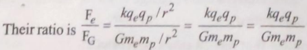

(8.8975 x 10) 1.6x 10-19,2 (6.67 x 10) (9.11x 103l 1.67 x107) 8.8975 x 1.6 x 1.6 6.67 x 9.1| x1.67 x 10-38+l1431+27

Force, F =3.7 x 109 N

Distance, r= 5 A0=5x 10-10 m

No. of electrons,n=?

Coulombian constant, k=8.8975 x 10 Nmc-2

Charge ofan electron, e=-1.6 x 10-19 C

Number of electrons, n =10electron/se

Charge of an electron e=-1.6x 10-19 C

Electrostatics

Electrostatics

22.7776

x10*

101.4754

=0.2245x 10*0

=2.245 x 10

This shows that electrostatic forces are~ 2.25x 1039 imes higher than gravitational forces.

## 23 Electric Field:

Coulomb's law determines the electric force acting berween (two electrically) charged objects. However, if the number of fcharged objects s (or electric charges) is large and the charge on eachis different t then this calculation becomes very complex andtedious.

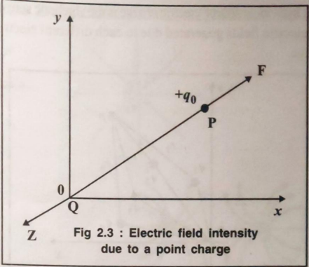

The SIunit of an electric field is newton/coulomb Ata given point, if the test charge does not showsexperienceelectric force,then the electric field of the charge somewherenear thatpoint canbe said to bezero.

In equation (9),F is the electrical force actingbetween O and do

<!-- formula-not-decoded -->

Where rdistance is the distance betweencharge Q andpoint P wherethe electric field is to be measured.

Suppose a charge (orsetof charges) Qisatacertain point in space. Thetest charge qo placed at r distance, will experience electric force according to coulomb's law. What emains there around Qifgo is removed? One can smell the Noomingflowers whenagardenis nearby. Onefeels heat up(N/C). toacertain distance aroundthe fire. So,everything their effect in the nearest area. Similarly, Electriccharge also Koduces its own effect in its immediate vicinity in space.This effect is felt morenear the charge and gradually reduced with distance. Thus the electricfield dependsonly onthe distance from a givencharge. This effect ofanelectriccharge felt in the vicinity ofspaceis called the (intensityof) electric field. The Sl unit of (intensityof) electric field is newton/coulomb NC), The calculation of the force betweenelectric charges has become quite easydue to electricfield concept. experience ,

## 23.1Electric Field (Intensity) of a PointCharge :

As shown in Figure2.3, let a point electriccharge Q be placed at the origin Oofthe axes.Now a positive test |to measure theelectric Charge t gois placed at the point P at a distance rin the40 Vicnity of ChargeO will exert a repulsive forceon it in the drecion of O to P.Position of)should not be changed due to g, Test charge experiences an electricforcethat depends only uponthe electric field (intensity) ofQatthe rdistance vay from it. The test charge ga, is very small (40-GLYPH&lt;26&gt;0), otherwise electric field of o may react with that of Q. Therefore we cannot findlelectric field of charge Q. Also note that qo cannot be less than theelementary charge ofan electron (orproton) (=1.6x 1019 C). Thus, by placing a positive charge 9% at point P at a distancer from 0, it EGLYPH&lt;26&gt;periences an electric force in the electric field ofQ. This is simply y called the electric field of Q.

It was Faraday who first conceptualized the electric field. The charge (or a set of charges) that produces an electric field is calledthe source charge andthe charge used field is called thetestcharge. Taking =1C in equation (10), E =F occurs. From this. the electric field can be defined as follows.

The force experienced by a unit positive charge ata electric field i (orelectric field intensity)E at that point. distance rfrom a charge Q (orasystem ofcharges) is called

## the2.3.2 Electric Field Due to System of Charges :

One can calculate the net electric force acting on a charge using the superposition principle. In the same way, the total electric field produced by a set of electric charges can alsobe found. Lookat Figure 2.4.

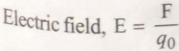

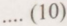

We can to findout the net electric field generated by the set ofthe source charges q1,92:43, 4, at respectively r, , 3 at point P. Thus the resultantelectric field at point Pdueto . , distance away fromthe testcharge placed

.. (10)

i

t

.

The geometric representation electric fieldis called electric fieldlnes.

each individual source electric charge is the algebraicsum of"electric force lines". eieeriC fields generated due to each different electric charge.

E-GLYPH&lt;26&gt;, E2 Kg2, E = kq4. E, = kGLYPH&lt;26&gt;n 2 E4

Accordingto the superposition principle,

E-E, + E + E, +...tE, =k 93 91 + 92 + 9n 2 Yn

<!-- formula-not-decoded -->

Once having obtained the information about the electric field around (dueto) a test charge(ora setof charges), thetotal force exerted on thetest charge at a given point can be obtained byF =gE formula. The electric field is a vector quantity and it is in the direction of the force exerted on the electric charge.

## 2.3.3 Electric Field Lines:

It was Michael Faraday whoexplained the concept of electricfield lines. Faraday named these electric field lines as

Sinceelectric field is a vectorquantity, it ha magnitudeand direction. Iin Figure2.5(a)electricfe toa positive charge is shown as a yector. Here, using ve

ABelectric fieldof tgpositive chargeis represented directions of AB and CD indicate the direction ofs

electric field at points A and C respectively. ABand are in the samedirection. Thedirection ofthe electric f%

changesat different points P, Q,Rand S.The CD shon

|than ABandthis indicates that electricfield decreases moves awayfromthe electriccharge. Connecting vecta like AB and CD,on the sameline gives the electric fiet linein that direction. Connecting vectors on the samelin givea fieldofelectricity in one direcGLYPH&lt;26&gt;ion. The electricfiek lines ofthe tq charge obtained by this way are shown Figure2.5 (b).

Michael Faraday, explained the conceptof electri field lines. Faraday named these electric field lines *electr: lines". The geometric representation ofan electric field is calledelectric field lines.

From Figure-2.5, it is clear that the electric field o point +g charge is in the radial direction away from tha electriGLYPH&lt;26&gt; charge and, similarly, the electric field of"gcharg is inwardin theradial direction,as shownin Figure-2.5 (c) The electric field always exits (starts from) +g and hangs on (ends at) -qas shown inFigure2.5(d). The electricfield of two positivecharges is due to repulsion between them,s shownin Figure2.5 (e).

€

[

1

f

f

e

a

a

t

p

As shown in Figure-2.6, electric field lines in the electric field due to +q and 9charges are drawn.An electric field line represents the direction of the

force exerted,on asingle positive charge at afixed point on it. At point P, the force is exerted in the direction of the tangent (in the directionofE,).Similarly, at the pointP,the

force is in the direction of E,andso on. In fact,when a positive charge is released intoanelectric field, the electric field line indicates the direction in which it moves under electric force:Thus, an electric field line isa curve drawnin an electric field, in suchaway thatthe tangent to the curve at any point is in the direction ofthe net electric field at that point.

## Characteristics ofElectric Field Lines :

1. Electic field lines start frompositivecharges and end at negative charges. 1 .
2. GLYPH&lt;26&gt;. Thetangent drawn at any point on the electric field lines indicates the direction of theelectric field at that point.
3. Two electtic field linesnever cross (intersect) cach other. As shown in Figure-2.7, if two electric field lines intersecteach other at any point,then tg charge at thatpoint experiences

the force in both E, and E, directions,which is not possible.i.e. at the intersection point of two electric field lines, two tangents can be drawnwhich indicate twodirectionsofelectric field and this is impossible.

4. The distance betweenthe electric field lines indicates the intensity oftheelectric field in that area. The closely (Densely) arranged electric field lines indicates a strong (high) electric field (intensity) and vice versa. Spaciously arranged (scattered)electric field lines indicates weak (poor)electric field (intensity) andviceversa.As per Figure 2.8,the numberofelectric field lines passing through aplane A,is higher than those through a plane A,.Therefore, (the intensity of) the electric field is higher in A, than that in A.

ofwaerNing though it is clled the uso assa wih that vvtangular hae, When a INve an (tlickering) rotates in the ais,the amount NSSNSGLYPH&lt;26&gt;Nenticular oits plane is called the air flu Aswehave discusse earlier, the numberofele

- mtaly alniqunisnt
- Eln feldlines areimaginary buteltie

iokd lines passing thrgh a given area determines wh the intensiy ofthe clie tickd in that ara is high orloy oNetef electrie tux is based on the sameprin Nigure 2.9 shows the clectrie field lines and the ditle surtaces (whosesurtace area is A)The electrie fhuy quantity equal to the nunber of electric tield lines pas through (peendicular to)a given surface area.An ele field is the number field lines passing perpendicular to fieksure ofa unit area. Sothe numberoffield lineshaving areaA is equal to EA.

- 7 Elect Field lines aralways perpendicular to he ondaing surenbohcasskaving the ciecicchange or entering the clectric charge. This is the reason whv the electrie field in the rection paralel to the conducting surface is z Thatisclecncforcedoesnot exist parallel otheconducting surface
- &amp; Elecnie field linesdo not fom closed paths.

## 234Electric Flux:

Flux is the amount of matter passing through (perpendicarto)the surface. When a rectangular frame of wie is keptperpendicular to the flow ofwater, the amount theelectrie field E andthe surface S.Actually, angle formed between the normal tothesurfaceandtheele:t field E.

Considerthe third single surface S;placed in the direction parallel to the electric field E in Eiomre 2.9. Her theangle between the direction perpendicular to S,and E is=90° sothe electric flux associated witb the surfaceb

=EA cos

=EAcos90o =EA(0)=0 1

Thus,electric flux passing perpendicular to surfàcx area A

EA

* (13)

= EA cos

(14)

Let a surface S,is kept slanting to electric ficeld shownin Figure 2.9. Theelectric tlux passing perpendicl to S,is =EA cos @ where is the angle fomed betwe

o

f

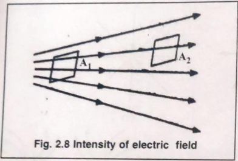

5. Electric field lines of the uniform electric field are mutually parallel and equidistant.
6. Electric field lines are imaginary,but electric is reality.

of water passing through it is called the flux of wa associated with that rectangular frame. When a paper-fan (flickering) rotates intheair, the amount o passing perpendicular to its plane is called the air fv

Aswehave discussed earlier, the number of ele field lines passing through a given area determines whet the intensity theelectric field in that area is high or low concept of electric flux is based on the same princip Figure 2.9 showsthe electric field lines andthe difh surfaces (whose surface area is A). The electric fluy: quantityequal tothe number of electric field lines passi, through (perpendicular to) a given surface area.An ele field is the numberoffield lines passing perpendicular tot fieldsurface a unit area. So the number offield lines having: area A is equal to EA. 7

7. Electric Field lines are always perpendicular to the conducting surface-inboth cases,leavingthe electric charge orentering the electric charge. This is the reason why the electric field in the direction parallel to the conducting surface is zero.That is, electric forcedoes not exist paralel to the conducting surface.
2. 8 Electricfield lines donot form closed paths.

## 2.3.4 Electric Flux :

Thus, electric flux passing perpendicular to surface area A

= E.A

- EA cos GLYPH&lt;26&gt;

.... (13)

... (14)

Let a surface S,is kept slanting to electricfielda shownin Figure 2.9. The electric flux passing perpendicul to S,is (=EA cos whereO is the angle formed betwer the electric field E andthe surfaceS.Actually, angle i formedbetweenthe normalto the surface and the electn E.

Flux is the amount of matter passing through (perpendicular to)the surface. When a rectangular frameof wire is kept perpendicular to the flow ofwater, the amount field

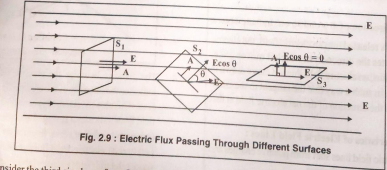

Consider the third single surface

Splaced in the direction parallelto the electric field theangle betweenthe direction

perpendicular to S, andE 9=EAcos 0=EA cos 900 = EA(0) =0

E in Figure 2.9. Her is =90° sothe electric flux

associated with the surface

o

f

o

f

p

Similarly, the e angle between thedirection perpendicular to S, and E is = 0o so the electric fluxX associated with S, is,

EA cos =EA cos 00= EA(1) =EA =

This is denoted by Equation(13). Thus,placing any surface in an electric field,if the angle between the normal to the s surface andthe electric fieldis 0, then the flux(ie.the number of suspended electric lines from that surface) nGLYPH&lt;26&gt;ated with that surface , can be equated to EA cos AElectrical flux is a scalar quantity and its SIunit is V,,or NmC.

If the flux associated with asurface is zeromeans the number of electric field lines passing through thatsurface is GLYPH&lt;26&gt;r0..e. the electric field line does not pass through that surface.

When a rectangular wire-frameis kept slanting in the water flow,the water flowing through it is less than the same frame is kept perpendicular in the water flow. Because when the frame is kept parallel to the water flow, no water passes through it. Similarly, when a paper-fan is kept perpendicular to (in front of flowing) wind/air flow, it rotates fast. When it is tilted it slowed down, and when it is in the direction ofthe wind, it almost stops rotating. Thus, the conceptofflux is very useful for understanding many lawsandtheir applications in electronics.

OA = rA, OB = and AB =r. The work done upon a unitpositive charge to move it from point A to point B is the product offorce and displacement.

<!-- formula-not-decoded -->

... (15)

The electric force is applied to chargeq= q,=+1C by electriccharge q1 =Q

<!-- formula-not-decoded -->

<!-- formula-not-decoded -->

## 24 Electric Potential :

Ifthe charge displacement is in the opposite direction to the electric force,

So far we have only discussed static electricity.We have also observed that when an electric charge is placed in the electric field of another charge, it experiences electric torce F. Now, ifthe electric charge is ableto move due to this force, it will start moving and in such amotion, the workWork SSaid to be done by this force. Ifanobject moves underthe efect of a force, it is said that work is done on it by that lorce. The work done on any object is stored in that object hefom ofitspotential energy. Thisposition indicates the dnount offorce exerted on the forceat that point or the amount of energy in that force at that point.

<!-- formula-not-decoded -->

A negative sign is taken in Equation (17)when the IS required to be done upon the charge for the | GLYPH&lt;26&gt;ISplacement agalmst the clectric field by theextemal force The above equation is for work done on a unit positive charge. Ifthe charge is tqthen the work to be done is

<!-- formula-not-decoded -->

## 2.4.1 Work done on Charge in Electric Field

One thing to keepin mind here is that whicheverpath is taken fromA to B,the magnitude of workdone is the same asEquation (16) or Equation (17). That is, the magnitude exists in theO wok dependson the two endpoints only.Also.the work to be done from A to B is thesameas the workto be done from B toanirespective of the path between(joining) them.

<!-- formula-not-decoded -->

a Asshown inFigure 2.10.an electric field vicinity of an axis due to an electric charge Q placed at origin O. $ Suppose a unit of positive charge (q= +1C)is to be moved I from point A to point B, where, the distances

Thus, the total workdoneby going from A to Band returning from B to A is zero, irrespective of any path chosen. Such a force field is called a conservativeforce field. Gravitational forcefield and electric forcefield are both such conservative force fields. In the aboveequations, E is the electric field (intensity) passing through points A and B. Here, point A and B are assumedto be very close so that the electric field at both points is almost the same.

## 2.4.2 Electric Potential :

As discussed above, the work done by and in the electric field in moving a unit positive charge (+1C)from one point to other, depends only on the location (position)of thesetwo points,butnoton the path connecting them. Now supposeif we displace (move)aunit positive charge frompoint A to B, then from point A to C,then from A to D ...etc. in the electric field, then the work done by the electric field will be obtained as...

*

(20

The work doneon ch

Electric charge

VA

VA

=

Electric

-GLYPH&lt;26&gt;

potential

W

9o

The unitofElectric potential:

<!-- formula-not-decoded -->

Onethingto keep in mind is that the potential at p firstAis not important. But only the potential difference( betweenthe given points A and B matters, which are follows.

<!-- formula-not-decoded -->

<!-- formula-not-decoded -->

When two charged objects are broughtintoconta each other, the charge will betransmitted from o objectathigher potential to another object at lower potent his conduction will takeplace until the potentials the

Hereif point A is taken as a reference point then the above-mentioned work depends on the location (position) With of that point (B,C,D, ...), only. For the sake of simplicity, taking suchareference point at infinite distances from the source ofthe electric field, is the work required to bring theobjects are equal. unit positive electric charge from thatpoint to apoint in the fieldis given by,

<!-- formula-not-decoded -->

If the electric charge is shifted in the opposite direction to the electricforce, the work done upon it is,

<!-- formula-not-decoded -->

Such a position-based work is called "electric potential" at that point. 'Work required to be done against the electric field in bringing a unit positive1S charge from infinity to the givenpoint in the electric field of a charge (orofa group of charges) is called electric potential atthat point."

As stated earlier, apoint is taken asa reference. potentials ofthe rest ofthe points are calculated by takingt potential of the earth's surface to bezero.

As discussed earlier in Equation (22), the poten difference between two points is given by,

VA-V

Er

Electric potentialis denoted by V. Thus,the electric potentialat a point A

Vg

=-Er

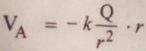

Herethe electric field generated duetoelectric cha assumedto be uniform. If the electric field GLYPH&lt;26&gt;ue to a po charge is taken,then it is different atdifferent points as show in Figure 2.5 (b)or Figure2.5 (c).In sucha nonunifor electric field, the potentials at different points are unequal. Figure 2.11 shows the electric field of sucha a sing point charge +Qatthe different points at different distanc Inorder to calculate electric potential (V)at point A 2 distance ra fromthe positive charge +0, the work doneo the test charge q, when it is brought froman infinite distan to the electric field ofcharge +Q,is calculated. The distan betweenpoint A andany point of infinite distance isv als

## 2.4.3 Potential dueto a Point Charge:

...(21)

o

f

large. Since the potential at this distance is nonuniform, the total distance iis dividedinto micro-segments AB, BC, CD.. ete. Now,the work done on each segmentis obtained byconsidering the electric field in each segment almost equal. Ih total work &lt; doneis obtained by summing all such works doneon each total segment.

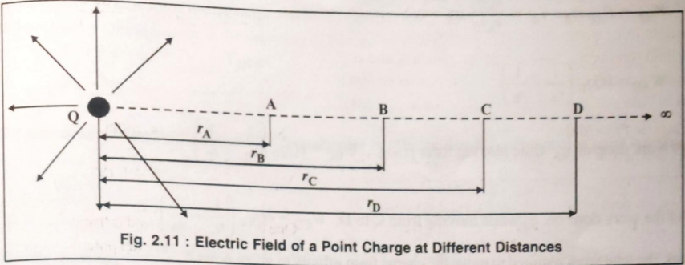

The force exerted on charge due to +Qcharge at pointA =FA =k Qg0 TA

The force exerted on cherge due to +Q charge at point B=Fg =k Qg0

The average force exerted during the transitionfrom point Ato pointB FAB GLYPH&lt;26&gt;' 2

<!-- formula-not-decoded -->

And (rGLYPH&lt;26&gt; -B=A-2rA'B 8

If points A and B are taken very close to each other, then (rGLYPH&lt;26&gt; -acan beignored relativeto 2ra'a A-R† 0 2 \_ YA

- A'B2rA'B

... (24)

From Equation (23) and (24).

<!-- formula-not-decoded -->

<!-- formula-not-decoded -->

kQqo rA B

The workdoneongowhile moving from A to B

<!-- formula-not-decoded -->

<!-- formula-not-decoded -->

The work doneon gowhile moving from B to C, WRC =kQg 4) 'B

And the workdone on gowhile moving fromC to D, Wcp k90 2)

Thus,the total work required to move the charge from infinity to given point A, WWAR + WRC+Wen +..GLYPH&lt;26&gt;W

.:

<!-- formula-not-decoded -->

<!-- formula-not-decoded -->

<!-- formula-not-decoded -->

... (26)

According to the definition of electric potential, the workdoneper unit positive charge is called the electric potent atthat point.

<!-- formula-not-decoded -->

...(27)

<!-- formula-not-decoded -->

... (28)

Using Equation (28),the electric potential dueto positive charge +Q,atpoint A that isrdistance awayfromit,ca bedetermined.

V= kQ

. (29)

electr

The potential ofa positive charge is positive and negative fora negative charge. It is easier to find the potentialo a given electric field than to find its intensity E.the superposition principleis well applicable in the case ofelectric potent also. Inorderto find the electric potentialdueto many point-charges, the potentialdueto every point charge is to be fou andthen their algebraic sumis taken. Just as wefind the potential V from the electric field E,it is easierto findthe field E fromthepotential V.Let us seethat.

Phys

Electrostatics

## 244 Electric Potential from Electric Flxtric

W=Fr=E q=(VA-V

Field: Consider twopoints A and B inthe same electric field as shownin Figure2 2.12, where V &gt;V aNe to bring the unit positive charge qo from Bto Ais W=qo (V-V. To movethe charge go from Bto A,the work against electric force in an electric field. Now the work ak =force x Displacement in the direction of Force.

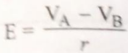

0

IEB is taken asa reference point and VGLYPH&lt;26&gt;=0 is taken for simplicity then V,=Potential ofpoint A with respeot o 6

. (30)

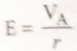

Broadly speaking, E =

.. (31)

The electric field (intensity) E of at agivenpoint,is obtained bytheratio of potential difference (V)ofthat point to edistance of electric charge(s) from the givenpoint. The Sl unit of E fromEquation(31)is also volts per meter Nn Thus the intensity oftheelectricfield at a given point can bemeasured in N/C orV/m.

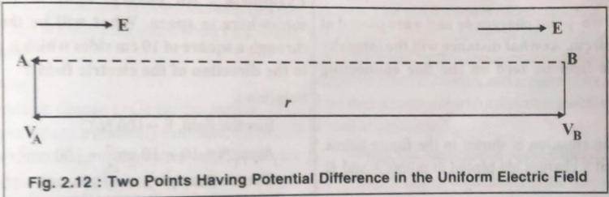

The following points are clear from the gaphed discussion.

## above-2.4.5 Illustrations:

Example-6: The sameelectric charge +qis placed on is positivethefourcorners A,B, C, D of a regular pentagon as shown in the figure. Find the value of the electricfield thepentagon ifthe distance from each potentialthanangle of the pentagon to center O is r.

- Ifthework done on electric charge (W&gt;0) then it is said that the work is doneon electriccharge by an external force, and thatat the center point is said to beat higher electric 1

## Solution :

- other points. 2 If the work done on electric charge is negative (W &lt;0). then it is said that the electric chargepoint is E,,Ep moves by working with theenergy stored in the electric charge. i.e. Thework is done by electric charge, and that point is said to be at the lowest
- electric potentialthan other points. 3. If the work done on electric charge is zero (W=0), then it issaidthat the potential ofthat point is taken to be the same as that of other points.

Supposethat theelectric field at point Oduetoeach , Eç,Ep and Eg respectively. As shown in the figure, the electric field due to a positive charge is in the directionout of the electric charge. So,the electric field at point O,due to the charge placed at point A, will be in the direction of AA'.The samewill happen to the electric field of the other four charges.Therefore,the total electric field at point O due to all the five charges, sincethe distance of point lo fromeach angle is equal(r), will be zero,

1

.

o

f

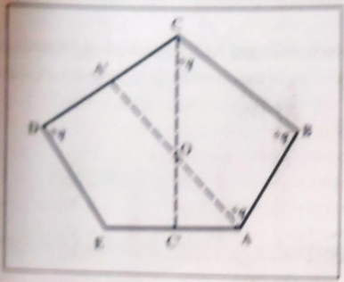

Th e d cece fd ptOillbeqdv ecletri feldegenred by he er fo hargss bu in heqarge peint Eisin dhe direetim of E w,where

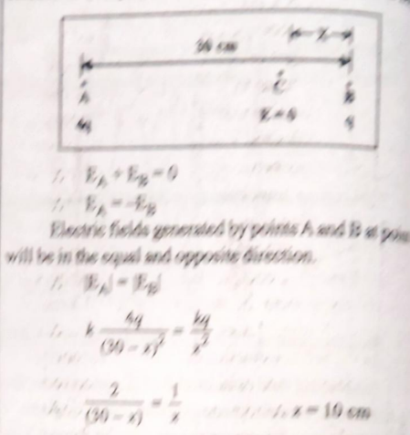

EampleiTwo pont chargs4ysndqare placed atmewhere in space,What distance of em.Afwhat distance will the intensisy of the electre field be zero on the will be the fluzpas hroug # quareof 16 em sides whieh is yerpendie ine connectinytothe direetion of the edectrie fleld ?

Salution

The gvensituation is shown in the figrs below Suppoe 4yandqcharyes are plaed at pointsA and 5,

Electrie fied, -100UC

19

Eiericfu, EA100 x100 104NiC

Eample 9ifhedistance of pint A from fo chargss of 2y and49 us20m and40m respectivey, cakulal the potential difference atpoint A,Ala, otain the wrk to be dons upon he charges on bringing6.2Can 64Chargesfrom infinitedistance to polnt A,

Inthe given situation, thepotentialat pointA, V

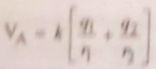

4,-4uC4x 10C

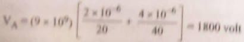

Ifhework is doneon charyesforbinging emfrominfinite dianceto yont A are W and W; respectly th W,Val I00 02 -360 W,Va IRo0 x(04)7201

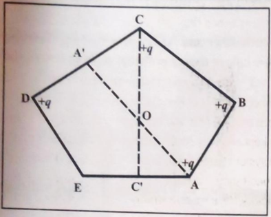

Thus,E,+Eg +EctEp +Eg =0 E,+Eg tEc +Ep =-Eg

Thus,thetotal electric field at point Owill beequal to theelectric fields generated bythe other four charges but in opposite directions.Now,the electric field at point O due to thetqcharge at point E is in the directionofE to O,where Eg kq.

Modern Ph

|respectively.On the lineconnecting them, supposet electric field at point C at a distancex from point

(Bisz

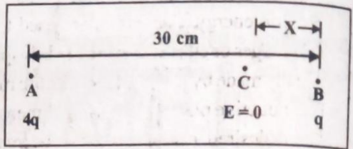

EGLYPH&lt;26&gt; +Eg

0

EA

Electric fields generated bypoints A andBat poin will bein the equal and opposite direction.

E= |Eg

<!-- formula-not-decoded -->

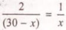

..x=10cm

Example-8:An electric field of 100 N/C exit somewhere in space. What will be the flux passin throughasquareof 10cm sideswhich is perpendicula to the direction of the electric field ?

Example-7:Two-point charges 4qand qareplaced at GLYPH&lt;26&gt; distance of 30 cm.At what distance will the intensity | of the electrie field be zero on the line connecting them ?

## Solution :

Electric field, E =100 N/C

## Solution:

The given situation is shown in the figure below. Suppose 4qand g charges are placed at points A and B,

Area,A = 10 x 10 cm† =100cm† = 104 m

Electric flux, = EA=100 ×100x 104| Nmc

Example-9: Ifthe distance of point A from twoçharges of 2uC and 40 is 20 m and 40m respectively,calculat the potential difference atpoint A,Als0, obtain the work to be done upon the charges on bringing 0.2 Cand - 0.4 C chargesfrom infinite distance to point A. Solution:

In the givensituation,the potentialat point A, VGLYPH&lt;26&gt; = Kq2 kq1

k=9x 109

Nm?

C2

91-2uC =2x10-6c

92 = 4uC=4 x 106C

<!-- formula-not-decoded -->

<!-- formula-not-decoded -->

If the work is done on charges for bringing them from infinite distahce to pointA are W,andW, respectivelythet.

W =VA41 =1800 x 0.2 =360J

W,=Vp92 -1800x (0.4) =-720 J

## 2.5 Capacitor and Capacitance: 1.5.1 Introduction to Capacitors:

capacitor is a simple device that stores electric charge and electric energy. Capacitors are used tostore more electrical charges or electrical energy in less space.A capacitor is usually r made by placing a dieelectric medium between twoconductive plates of the same dimension. A capacitor of the desired capacitance can be made by changing the distance between theplates andits dimensions. Capacitors are an important component in almost all eloctrical, electronicand micro-electronic circuits. Differenconductors, types of capacitors are used inall devices for generating, carrying and storing energy. One or more capacitors are important component in the circuits like Ultrasonic. Microwave, Radio, Laser, etc. for the production, amplification, andtransmission ofsoundor electromagnetic waves. Capacitors are used to tune radio receivers and televisions over the appropriate frequency band. Capacitors are used in almost all decoration and entertainment devices related to soundand light. Capacitors are an important part of alltypes of circuits ofmeasuringinstruments forscientific research and testing. A capacitor Capacitors

## 2.5.2 Capacitance :

As the positive charge (+0)on the surface ofan isolated conductive sphere is gradually increased., the electric| potential (V)ón the surface ofthe sphere andtheelectric field (E)arpund the sphere also goon increasing accordingly. Inthis process,at one stage, the sphere becomes electrically saturated, means the spherecan no longer store more electricity thanits capacity.So;the electric field due to the sphere becomes sufficiently strong that it can ionize the Sumounding air particles that the insulating property ofthe air gets destroyed. Because, at thispoint, an electric charge n addition to its capacity leaks fromthe sphere and causes Ionization (separation of atomic positive andnegative electrie charges) of the surrounding air. Throughout this process, the Tatio (Q/V) )of the electriccharge (Q onthesphere andits Magnitude (V)remains constant. This ratio is called its pacitance (C,Here. conductors of any shapecan be laken insteadof spheres.

Electric charge (Q)

Capacitance

(C) =

Electroc Potential ()

:.C=QN

(32)

Modern Physics /7| 2026-27

conductors when they are placed at a short distanceapart Potential Difference (pd) arises between two from each other and same magnitude(Q coulomb) Opposite charge (one ispositivelycharged and another is negatively charged) is stored upon them. Here,the ratio of electric charge(Qcoulomb) and potential diference (Vvolt) between thetwo identical but oppositelycharged conductive plates kept at a very smalldistance apart is called capacitance of the system made upofthese conductors. The magnitude of capacitance depends on the dimensions of the two their relative arrangenment,the dielectric medium between themandthedistance between the two.

## 2.5.3 Capacitor :

When a positively charged conductor (positive plate) anda negatively charged conductor (negative plate) are separated bya distance less than their dimensions (length and breadth) andadielectric medium is placed between the two,and both conductors are connected to thetwo terminals of the battery, a potential difference(V)is formedbetween the two. This mechanismis calledcapacitor. The charge(O ofa positiveplateis calledthe charge onthe capacitor.(A device formed bytwo conductive plates bearing equal but opposite electric charge; andseparated by a distance less than their dimensions with a dielectric material between them is called capacitor. )

Here, the capacitance of the capacitor,C= Q/V

The Slunit of capacitance is the coulomb/volt called farad(F).Sincefarad (F) is a very largeunit for measuring the capacitÆnce of real capacitors, in practice microfarad (microfaräd; l uF =106 F), nano farad(nanofarad; InF = 10-9 F)andpicofarad (picofarad; IpF=10-12F) are used.

A capacitor is a device designed to store a large amountof electric charge and hence electric energy in asmall space. In general, a system in which the two oppositely charged platesseparated bya dielectric medium is called a capacitor. Mostly, plates of a capacitor are charged by attaching them to different terminals of the battery. The electric charge ontwoplates of a capacitoris usually taken as +Qand -Qwith their electric potentialsare V,and V, respectively. Here, the potential differencebetweenthetwo plates is V=V,-V,andtheelectric chrge of thecapacitor is said to be Q.

o

f

called a spherical capacitor. In the cylGLYPH&lt;26&gt;ndrical capacilo conductor plates areused.

## conductor.2.5.5Parallel Plate Capacitor and Its Capacitang,

The capacitance of a charged conductor can be significantly increased by bringing an uncharged earth-cylindrical connectedconductorcloser to that charged When twoconductive plates are separated by a dielectric medium in thisway is called acapacitor.

Thecapacitors with fixed capacitance are denoted by 7I-symbol while the capacitors with variable capacitance are denotedby symbols.

As an interesting case, a single conducting sphere of radius Randhaving chargeQ with potential difference of V= kQ R can also be consider as a capacitor, because it also has some capacity to store electric charge. Forsuch a capacitor, imagine another sphere at infinite distance having -Qchargewill havezero potential difference (V = 0). The potential difference betweenthe proposed sphereand the imaginary sphereat infinite distance will also be V - kQR. So, the capacitance of the sphere will be,

Parallel plate capacitors are the most widely lsed a parallel plate capacitor, two parallel conducting pla the samearea (A)are separated at veryshot distange from each other where a dielectric medium (insul material)is placed betweenthe two plates. Herethedisa betweentwo plates is kept very short in comparison tok dimensions (length,width orradius) of thatplate(&lt;

C-GLYPH&lt;26&gt;GLYPH&lt;26&gt; R =AEg R, where a, is absolute V (kQR) k

(vacuum) peneability.

CapacitanceC is independent of Q or V, but it dependsonlyon the shape,size and separtion of twoplates besides the dielectricmaterial ofthe capacitor.

## 2.5.4 Types ofCapacitors[Only forInformation] :

Thereare different types of capacitorsdepending on| the material used in their fabrication.Suchas:Electrolytic Capacitor, Mica Capacitor, PaperCapacitor, Film Capacito, Non-Polarized Capacitor and Ceramic Capacitor. An Electrolyticcapacitor uses athin metallic film as anodeand apaste ofelectrolyte chemical asacathode, wherethe thin layer of oxide is dielectric. A mica capacitor is madebyo sandwiching a thin micasheet between the conductor plates. A Paper capacitor is madeby placing a waxpaperbetween tin plates.A film capacitor is madeby placing a plasticfilm betweena thin films ofconductive metal. A nonpolarized capacitor is made by placing plastic foil in it or two electrolytic capacitors are arranged in seris connection.tothe negative Ceramic capacitors contain ceramic diclectric material.

Let us derive the formulafor the capacitance o medium,as shown in Figure2.13. The charge ofone pla paralel plate capacitor with vacuum or as a dieleti is +Qand that of theother is -Q.Thedistance between plates (d) stoo short fortheirlinear length sothat f&lt;

Areaof capacitor =AM2

Distance between two plates of the capacitor

Capacitor plate charge =Qcoulomb

Chargedensity =gQ/A coulomb/metre

The uniform electric field in the region between plates duetopositiveplatein the direction frompositive pl nlale is E. =a)e

Theuniform clectricfieldin the region betwecn |Plalces dueto negtive plate in the direction frompositiveGLYPH&lt;26&gt; to the negative plate is E,=o/2 E:

conductiveplate used in it are :In a ParallelPlate Capacitor Thetypes of capacitors depending on the shape of the , the flat conductor plates are keptparallel to each other.A capacitor in which the conductive plates arespherical is

t

N

I

S

Since both the electricfieldsare in the samedirection, electric field

<!-- formula-not-decoded -->

<!-- formula-not-decoded -->

<!-- formula-not-decoded -->

<!-- formula-not-decoded -->

## Combinations Capacitors:

In the regions on the other side of thecapacitor plates,2.5.6 GLYPH&lt;26&gt;ctic fields E and E2 being equal and in opposite | direction, t the resultant electric field becomes zero.

<!-- formula-not-decoded -->

The potentialdifference between the two plates is, V= E.d

<!-- formula-not-decoded -->

Now,the capacaitance of the capacitor is C V

The capacitance ofa parallel plate capacitor depends on theplatearea dielectric meduim andthe distance between two plates.

of There are two types of connections ofdifferent capacitors having capacitances. Two ormore capacitors can be connected in series combination orparallelcombination. Equivalent, effectiveor resultantcapacitance (C)ofa system formedbyseries combination orparallel combination oftwo or more capacitors can be foun.

## Series Combination ofCapacitors:

As shown in Figure 2.14, capacitors having capacitances C,.C,.C,, C4 .Cyare connected inseries byconducting wires and potentialdifferenceVis givento the system.Weintend to obtain the resultant capacitance C, in the series combination of capacitors.

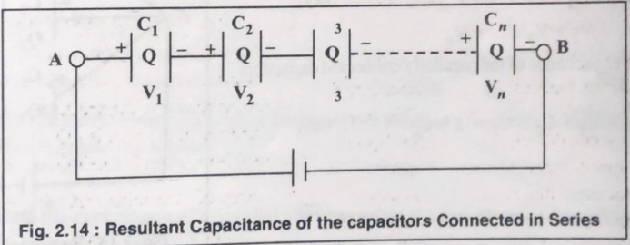

Let the left side plate ofcapacitor C, is givena +Q charge. Electrostatic induction gives a-Q charge ontheinside and +Q charge on the outside of theright sideplate of capacitor C,. This +Qelectric charge is transmitted to the plate on the left. And this process continues. (In the sameway a negatively charged electron-current flowsinthe opposite direction.) Thus, each capacitor will receive an equal charge of +Qmagnitude. Since the capacitance of each capacitor different, the potential difference with respect to each capacitor is different.If potential difference across C,,Co.Cau V,V,,VGLYPH&lt;26&gt;, .. V,, respectively. Then V, = Q/C, V,=Q/C,,V,= Q/C...

are In series combination ofcapacitors,the net (effective)potential difference (V) is the sun total ofindividual potentiat difference across each capacitor.

V=V +V,+ V,+...+V,

...(40)

Ihe resultant capacitance in the series combination of capacitors is C, =

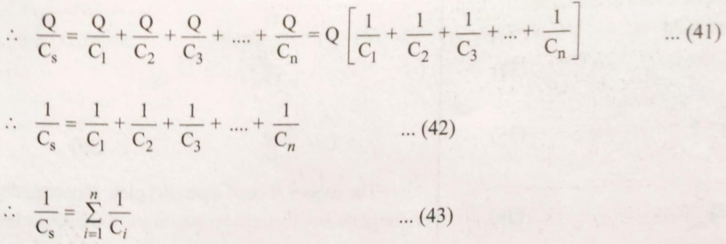

The value ofthe effective (netor equivalent) capacitance C, of the series connection of capacitorsis obhi summing themultiplicative inverseofthe capacitance values of each of the capacitors.The value of efectivecana in seriesconnection iseven smaller than the smallest value of capacitance in the combination.

## Parallel CombinationofCapacitors :

As shown in Figure 2.15,capacitorshaving capacitances C,. C,.C.C4 ..,. C,are connected parallel to ea byconducting wires andpotentialdifferenceV is given to the two common joiningpoints ofall capacitors.Weine obtain the resultantcapacitance C,in theparallel combination ofcapacitors. In parallel combination of capacito potential difference(V)between the plates ofevery capacitoris the same andit is equal to the potentialdifference be, their common points, howeverthe electric charge oneach capacitor is different.

<!-- formula-not-decoded -->

.

The effective capacitance ofthe parallelly connected capacitors

<!-- formula-not-decoded -->

<!-- formula-not-decoded -->

be,

GLYPH&lt;26&gt;lectre the forc

T

W

If the

Co -

The medium

(

dielectricc

Cm=

When charge

stora

2.5.8 Illust

Example-1

f1mm sid

SeriesSolution:

Fig. 2.15: Resultant Capacitance d the capacitors Connected in

The value ofthe effective (netor equivalent) capacitance C,of the parallel connection of capacitorsis obtans summingthe capacitance cach ofthesecapacitors. Thevalue of effective capacitance is evenhigher than thelargest ofcapacitançe in the combination.

In a series or parallel connection capacitor,the electric current is generated only wherethebatteryis connet the capacitor plate. In the rest ofthe plates, only the shifting ofthe charge occurs.

## 2.5.7 Effect of Dielectric Material on the Capacitanceof Parallel Plate Capacitor:

Any insulating medium is called dielectric medium.Faraday found that placing aninsulatingsubstance betwe plates ofa capacitorincreases its capacitance.

According to Coulomb'slaw, when twocharges q andq,are rdistance apart fromeach other in vacuum vacuum the force ofattraction between them is, F,= I9192 where E is the absolute permittivity. 2

Capac

C

Eo

8.8.

=8.85

If the samecharges q and q,arekeptr distance apart from each other in the medium of eelectrical permntuvigs force attraction between them is,Fm = 1 9192 the fo

<!-- formula-not-decoded -->

Where,&amp;,is called the relative (electric) permittivityordielectricconstant (K) of themedium.

E, orK =

Capacitance when a dielectric medium is inserted betweentwo plates of the capacitor

Capacitance when there is air between two plates of the samecapacitor

<!-- formula-not-decoded -->

<!-- formula-not-decoded -->

If there is an air or vacuum asa dielectricmedium betweenthe two plates ofthecapacitor, then its capacitance wil be, Co =E, A/d ..(51)

Theratio ofthe permittivity ofthe medium (e)to that ofthe vacuum (E)is called the relative permittivity ofthe medium (e,)or dielectricconstant(K),where Kis alwaysgreater than 1. Instead ofairifa medium of permittivity GLYPH&lt;26&gt; and dielectric constant K is placedbeween two plates ofacapacitor, its capacitance will be,

<!-- formula-not-decoded -->

<!-- formula-not-decoded -->

..(52)

When amedium ofdielectric constant K is placed betweentwo plates ofa capacitor, is capacitance andhence its charge storage capacity is increased by K times.

## 2.5.8 Illustrations :

Example-10 : Calculatethe capacitanceofa parallel plate capacitor if 1 mm distance is kept between the plates of 1 mm sides.

## Solution :

Capacitance ofaparallel plate capacitor,

<!-- formula-not-decoded -->

<!-- formula-not-decoded -->

=8.85 x 10-9F=8.85 nF

Side=Length =Width =1 mm= 103m Area of each plate, A = Imm?- 10-6m† Distance between two plates, d = 1 mm = 103m Absolute permittivity, E-8.85 x 10-12 F/m

What should bethel length and width of two parallel plates separated by a distance Example-11: a capacitor to obtain lF capacitance ?

of 1

mm;

## Solution :

Area of each plate in the parallel plate capacitor,

<!-- formula-not-decoded -->

Length =Width =Sideof the capacitor

<!-- formula-not-decoded -->

Each plate should have atleast 10km sides.

Example-12:Caleulate the capacitance of twoplates of 100cm x 100cm of a parallel plate capacitorseparate by a 2 mm thick glass plate of dielectricconstant, K=4.

Area ofeach capacitor plate

Solution :

A =100x 100=10cm† =l m2

Capacitance due to medium ofdielectric consant K is given by,

Distance btweentwoplates,

$$C= Keo A d$$

d =2mm=2x 103 m

Dielectric constant, K=GLYPH&lt;26&gt;,=4

$$..C= 4x8.85 x 1012x| =1.77 x 10-8 2x 10-3 farad$$

Absolute permittivity,

Ep 8.85 x 10-12 F/m

Example-13: In a parallel plate capacitor the area of the plate is 200 and the distance between theplatesis 1 mm.() If capacitor is given In C charge, calculate the potential difference between the two plates. (i)I distance between two plates is increased up to 2 mm without changing its charge, what will be potential difference ?(iii) What will be the electric field between the plates ?

Solution :

Capacitance of parallel plate capacitor, C=EAld

<!-- formula-not-decoded -->

=0.177 x 10-9 F=0.177 nF

- (1)Potentialdifference between two platesofthe capacito,

<!-- formula-not-decoded -->

- (2) Ifthe distance between two plates is increased upto 2mm, the potentialdifference between the plateswill bedouble.

.:. V=5.65 x 2 =|1.3 V

<!-- formula-not-decoded -->

Distance betweentwo plates, d=1mm =10-3 m

Plate area, A =200cm† =2x 10-2m2

Electric charge on a plate,

Q=1nC = 1 x 109C

Absolute permittivity,E =8.85x10-12 F/m

Distance between two plates,d=Imm= 10-3. Absolute Permittivity, En 8.85 x 10-12 F/m Length =Width =Side of theplate =?

<!-- formula-not-decoded -->

Example-14 :Thecapacitance of aparallel plate capacaitor with air asdielectric medium is 8pF.Calculate the capacitance of the capacitor, if the distance between plates is halved and a material of dielectric constant (K=6)will be providedto you.

## Solution :

Initially, when the distance between two plates of a capacitaor is d, then its capacitance will be Co =&amp;A/d=8pF Dielectric material with constant, K =g=6

<!-- formula-not-decoded -->

Now,capacitance ofthe capacitor when the distance between its two plates is d/2 and adielectric material of K=6 is placed betweenthem,

<!-- formula-not-decoded -->

C=2x 6x 8 =96 pF

Example-15 :The capacitance ofa parallel plate capacitor is 5E.Its capacitance is 60uF if a dielectric object is placed betweenits two plates. Multiply the constant of dielectric matter.

Solution :

<!-- formula-not-decoded -->

When there is no dielectric medium (K=1)its capacitance, C =5uF

<!-- formula-not-decoded -->

When there is medium ofunknown dielectric constant (K =?)is placed betweentwo plates of capacitor,its capacitance, C=60uF

<!-- formula-not-decoded -->

<!-- formula-not-decoded -->

.. The dielectric constant of thematerial, K= 12

Example-16 :Obtain equivalent capacitance for series and parallel combinationof 3capacitors having capacitances 5uF,10 uF and 15uF respectively, where a potential difference of4V is givenby the battery.

Solution:

Equivalent capcacitance for the series

Equivalent capeacitance for theparallel combination , Cp GLYPH&lt;26&gt;

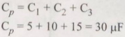

$$1 1 6+3+2 11 + 30 15 30 1= Cs 5 10$$

C=30/11=2.72 uF

Example-17 :When a slab with a dielectric constant of K=3 is placed between two plates of a capacitor capacitance is 15 uF. Ifthere is air between the plates of this capacitor, what will be its capacity ?

Solution :K=CmCo

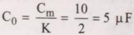

## SUMMARY

- Every substance (atom)is basically made up of electrons,protons and neutrons,calledFundamental Particles.
- The mass of an electron is M,=9.1x 10-31 Kg,the mass ofa proton and a neutron are considered to be nearly the same, i.e. M, M,=1.6x 10-27 kg.
- There are two types of electric charges-Positive and Negative. The force actingbetween two like charges isrepulsiveandit is attractive between unlike charges.
- When two suitable objects are rubbed together, electric charge is transferred to them. For example, while rubbing a glass rod with a silk cloth,the glass rod becomespositively charged by losing electrons and silk becomes negatively charged by getting electrons.
- Thecharge that is fixed on anobject is called static charge and the study oftheir effects is called static electricity.
- Two objectscan becharged byrubbing them together (friction). When an electrically charged object is brought closure to another object, it can be charged byinduction.
- When electric charges are madeto movebyapplying someforce, the movement ofcharges iscalledelectric current and the study of effects produced by an electric current is calledcurrent electricity.
- A repulsive force called electric force of F =2.24 x 10-24 N exists betweentwo electrons.
- Electric force is 105 timesgreaterthan the gravitaio force. The property of particles due to which electric force exists between them is called the elech. charge oftheparticle. A specificproperty of mat due to which a much more powerful force exis between two objects than the gravitational for (1043 times higher) is called electric charge.
- The magnitude of all electric charges found in natur are always in integral multiple of a fundamenti charge. This fundamental charge is e=1.6x 10-9 coloumb (C)that is egqual to the charge on anelectron ora proton. This is calledthe quantisation ofelectri: charge Q =ne.
- The charge of anelectron is e,=-1.6x 10-19Cand the charge of aproton is e, =1.6 x 10-19 C.
- The net electric charge in an isolatedsystem remains the same before and after any reaction or procesS takes place in it. The net electric charge (orthe algebraicsumof charges) in an electrically isolated system remains constant, irrespective ofanyprocesS takes place.This is the quantization ofelectric
- charge. Theelectric force (Coulombian force) betweentwo stationary point charges is directly proportional tothe product of their charges and inversely proportional to the square ofthe distance betweenthem,"This is Coulomb'slaw.This forceisalong theline ofjoining the two charges.
- If 4192&gt;0, repulsive force exists between the two charges andfor g1 92&lt;0, there is an attractive force between the charges.
- The electric(Coulombian) force between two stationary point charges qGLYPH&lt;26&gt;and g,separated by a distance r is 9192 point

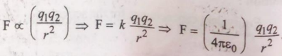

given byF=k where Coulombian constant

<!-- formula-not-decoded -->

area, then the electric forceF =qEapplied toanother charge at one point in that area can be found.

According t Super Position Principle. Ek GLYPH&lt;26&gt;GLYPH&lt;26&gt;.

- GLYPH&lt;26&gt; The(intensity of) electric field ata distance risE=
- Electric field is a vector quantity having unit N/C in SI; and it is in the direction ofthe force exerted on the electriccharge. 2

(S) and k= 1 dyne cm C2(CGS). Also,PermittivityGLYPH&lt;26&gt; of Free Space, E 1 -8.854 x 10-12 C2/Nm†. 4Tk

- TheRelative Permittivity (e)orDielectric constant (K)ofthe givenmedium &gt; 1. Where,

er

Permittivity of medium (:)

=K

Permittivity of Free Space or Vacuim (e)

- Since the relative permeability ofthe mediun (E,), is always greater than one, the Columbian force (F) in a given medium is less thanthe force'exerted in a vacuum (F). Thus GLYPH&lt;26&gt;, &gt; 1GLYPH&lt;26&gt;F, &lt;F.
- Superposition Principle: The netelectric force between more than two electric charges in space can be obtained by taking the algebraic sum of all the individual forces exerted betweeneach pair ofelectric charges. This is called the superposition principle. (Coulomb's law can be used to obtain the electric (Coulombian) forceacting between two stationary eleGLYPH&lt;26&gt;tric point charges.)
- Theforce experienced by (acting on)a unit positive charge (go) at agivenpoint at a certain distance from acharge Q(orasystem ofcharges) in the electric field Is called intensity of electric field (orelectric intensity) a
- E atthat point. A charge experiences electric force by another charge Ura system of charges (Q)in thevicinity area is called (ntensity o)electric field due to that charge (or the Systern of charges). Ifwe know the electric field Eenerated by a charge or a set ofcharges in a given
- An electric field of point tq charge is in the radial direction away fromthat electric chargeand,similarly, the electrie field of-q charge is inward in the radial direction. The electric fieldalways exits (starts from) tq and hangs on (endsat) +q.
- Electric field (force) lines start from the positive charge and end on a negative charge. The tangent drawn at any point on the electric field line indicates the direction of the electric field atthat point. Two electric field lines never intersect each other. The distance between the electric field lines indicates the intensity of the electric field in that area. The closely (Densely) arranged electricfield lines indicates a strong(high) electric field (intensity) and vice versa. Spaciously arranged (scattered)electricfield lines indicates weak (poor) electric field (intensity) and vice versa. Field linesofthe homogeneous (uniform) electric field are parallel to each other and at equal distances from each other. Electric field lines are imaginary,but electric field is reality. Electric Field lines are always perpendicular to the conducting surface.
- The electric flux () is the number of electric fieldlines passing perpendicular to a given surfacearea. o= E.A. =EAcos0.Electric flux is a scalar quantity and its SI unit is Vm or Nm†/C.
- Some work is to be done on the electric charge to make it move in the electric field. The work doneon the unit electricchargeto move it in the electric field is called electric potential at that point. The electric potential at distance rfrom thechargeqin its electric field is V=kq/r.

- The potential difference (PD)due to charge (q)GLYPH&lt;26&gt; between two pointsat rdistance is as follows.
- A capacitor is a device designed to store a large amountofelectric chargeand hence electric energy in asmall space.
- Whena positively chargedconductor (positive plate) and a negatively charged conductor (negative plate) are separated by a distance less than their dimensions (length and breadth) andadielectric medium is placed between the two,andboth conductors are connected to the twoterminals of the battery, a potential difference (V)is formed between the two. This mechanismis called capacitor.
- Thecharge (Q) of apositive plate is called the charge onthe capacitor.
- The value of capacitance depends on the dimensions (shape, size andarea) ofthe two conducting plates andthe distance between them. It also depends on the dielectric medium.The distancebetween twoplates in acapacitor is kept very short in comparison to the dimensions (length/ width/radius) of the plates t&lt;A.
- Capacitance(C)= Electric charge (Q)Potential difference (V)
- TheSIunit of capacitance is the coulomb/volt called farad (F). Sincefarad (F)is a very large unit for measuring the capacitance of realcapacitors, in practice microfarad (microfarad; 1 uF = 10-6 F), nanofarad(nanofarad; 1nF = 10-9F) and picofarad (picofarad; I pF =10-12F) are used.
- The capacitors with fixed capacitance are denoted by -||-symbol while the capacitors with variable capacitance are denoted by symbols.
- In aparallel plate capacitor, two parallel conducting plates ofthesame area (A) are separated at very short distance (d) from each other where a dielectric medium (insulating material) is placed betweenthe twoplates.

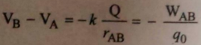

Modern Phy

Asingle conducting sphereofradius R and ha charge Qwith potential difference eofV also be considered as a capacitor, where an imaginary conducting sphere having Q charge have zero potential difference (V=0)at inf distance. The capacitance of the sphere will 4

<!-- formula-not-decoded -->

where E,is absolute (vacuum)pemeability. In the area inside the parallel plate capacitor, electric field originatingfrom +veto -ve and o ve to +ve charged plates is in one direction. E,-E\_ =G/28.Theresultant electric field wilk

E-E, +E,

AEo

In the regions on the other

si of thecapacitorplates,electric fields E, and E, bei equal and in opposite direction, the resultant eleth field becomeszero.

- The capacitance of a parallel plate capacite C=A d
- Connection of C,C,, C3, ...C, capacitors 1 +.... + 1 1 É4 Cn Cs
- Thevalue ofthe effective capacitance ofthesenis connection ofcapacitors is obtained bysumming t multiplicative inverse of thecapacitance values each individual capacitors. The value of efect capacitance in seriesconnection is even smallerth the smallest value of capacitance in the
- combinatio The net/effective capacitance C, of the parall connection of Cj, C,, Cqs ... C, capacitors

Cp- +C++Cnand Cp

GLYPH&lt;26&gt;C.

- Thevalue ofthe effective (netor equivalent) capacita C,of the parallel connection of capacitorsis obtait bysumming the capacitance each ofthese capacito The value of effective capacitance is evenhigher th the largest value ofcapacitance in the combinatiot

s

d

i

e

l

c

t

r

c

a

p

i

t

o

r

,

c

a

p

i

t

n

e

C

a

p

c

i

t

n

e

c

a

p

i

t

o

r

C

a

p

c

i

t

n

e

d

i

e

l

c

t

r

i

n

s

e

r

t

d

c

a

p

i

t

o

r

d

i

e

l

c

t

r

c

o

n

s

t

a

p

e

r

m

i

t

v

y

p

e

r

m

i

t

v

y

c

a

p

i

t

o

r

i

n

c

r

e

a

s

c

a

p

i

t

n

e

.

i

n

s

u

l

a

t

g

d

i

e

l

c

t

r

i

n

s

u

l

a

t

g

s

u

b

t

a

n

c

e