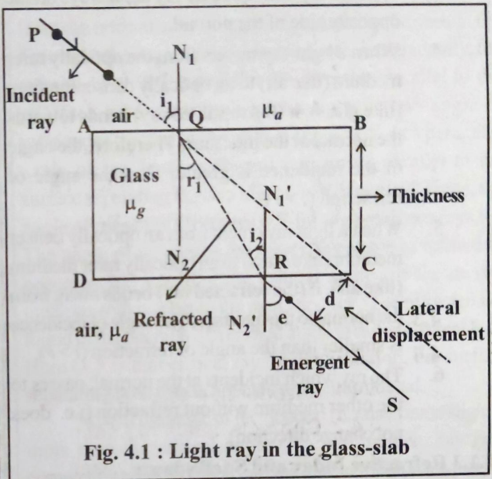
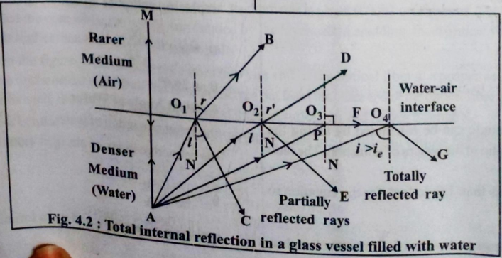
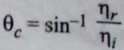
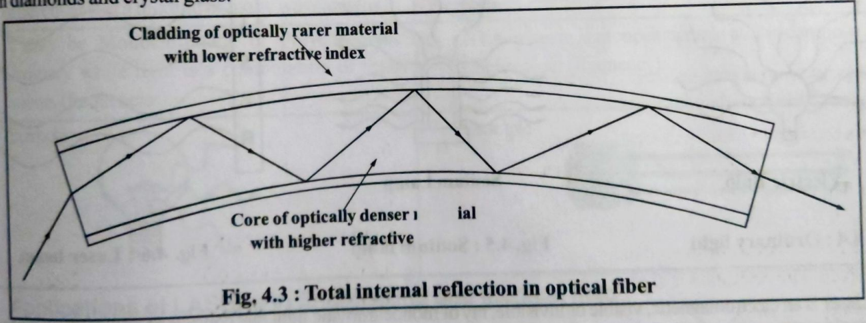
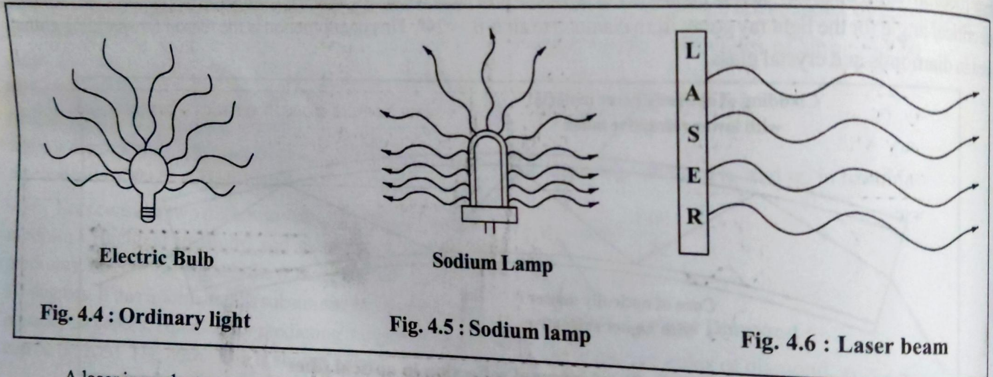
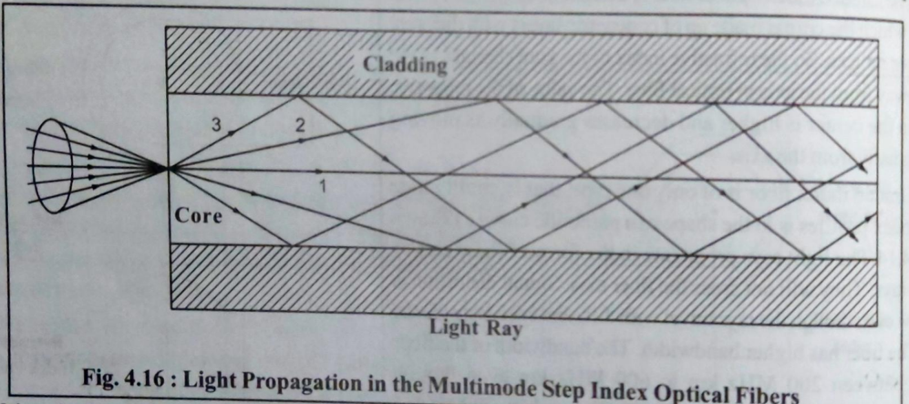
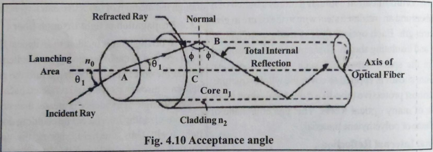

# Unit-4. LASER and Fiber Optics - Medium Solutions

## Part A: Short Answers (1-2 marks)

### (1) State Snell's law of refraction

When light passes from one medium to another, the ratio of sine of angle of incidence to sine of angle of refraction is constant (refractive index).

**Mathematical Form:**

```
sin i / sin r = μ₂/μ₁ = constant
```

Where:

- i = angle of incidence
- r = angle of refraction
- μ₁, μ₂ = refractive indices of first and second medium


*Figure: Light refraction at interface between two media*

---

### (2) What is LASER?

**LASER** = **L**ight **A**mplification by **S**timulated **E**mission of **R**adiation

A device that produces intense, coherent, monochromatic, and directional beam of light through stimulated emission.

**Key Properties:**

- **Monochromatic:** Single wavelength/color
- **Coherent:** Waves in phase (constant phase difference)
- **Directional:** Highly collimated beam (low divergence)
- **Intense:** High power concentration

---

### (3) Define refractive index and give its values for different materials

**Refractive Index (μ):** Ratio of speed of light in vacuum to speed of light in medium.

```
μ = c/v = sin i / sin r
```

**Common Values:**

| Material | Refractive Index (μ) |
|----------|---------------------|
| Vacuum | 1.0000 |
| Air | 1.0003 |
| Water | 1.33 |
| Glass | 1.5 - 1.9 |
| Diamond | 2.42 |

**Physical Meaning:** Higher μ → Light travels slower → More bending

---

### (4) Define critical angle

**Critical Angle (θc):** Angle of incidence in denser medium for which angle of refraction in rarer medium becomes 90°.

**Condition:** Light travels from denser to rarer medium

**Formula:**

```
sin θc = μ₂/μ₁ = 1/μ (when μ₂ = 1 for air)

θc = sin⁻¹(1/μ)
```


*Figure: Critical angle and total internal reflection*

**Examples:**

- Glass (μ=1.5): θc = 41.8°
- Water (μ=1.33): θc = 48.8°
- Diamond (μ=2.42): θc = 24.4°

---

### (5) State the principle of optical fiber

**Principle:** Total Internal Reflection (TIR)

Light propagates through optical fiber by undergoing successive total internal reflections at the core-cladding interface.

**Conditions for TIR:**

1. Light travels from denser (core) to rarer (cladding) medium
2. Angle of incidence > critical angle
3. μ_core > μ_cladding

```
When i > θc → Total reflection occurs
No refraction, light trapped inside core
```

---

## Part B: Detailed Answers (2-3 marks)

### (1) Refraction of light - definition and examples

**Definition:** Bending of light when it passes from one transparent medium to another due to change in speed.


*Figure: Refraction in different media*

**Causes:**

- Different optical densities
- Change in speed of light (v = c/μ)
- Light bends towards normal (rarer → denser)
- Light bends away from normal (denser → rarer)

**Examples:**

1. **Swimming Pool:** Bottom appears raised due to water-to-air refraction
2. **Atmospheric Refraction:** Stars appear at different positions, twinkling
3. **Prism:** White light splits into spectrum (dispersion)
4. **Lenses:** Converging/diverging light through refraction
5. **Mirage:** Hot air acts as rarer medium, causing apparent water on roads

---

### (2) Total Internal Reflection and conditions

**Definition:** When light traveling from denser to rarer medium is completely reflected back into denser medium (no refraction).


*Figure: Total internal reflection at critical angle*

**Essential Conditions:**

1. **Medium:** Light must travel from optically denser to rarer medium (μ₁ > μ₂)
2. **Angle:** Angle of incidence must be greater than critical angle (i > θc)

**Applications:**

- Optical fibers for communication
- Periscopes and binoculars (prisms)
- Brilliance of diamonds
- Mirage and looming effects
- Endoscopy in medical field

---

### (3) Difference between LASER light and ordinary light


*Figure: Comparison of LASER and ordinary light characteristics*

| Property | LASER Light | Ordinary Light |
|----------|-------------|----------------|
| **Monochromaticity** | Single wavelength | Multiple wavelengths (polychromatic) |
| **Coherence** | All waves in phase (spatial & temporal) | Random phase (incoherent) |
| **Directionality** | Highly directional (0.01° divergence) | Spreads in all directions |
| **Intensity** | Very high intensity | Low intensity |
| **Source** | Stimulated emission | Spontaneous emission |
| **Power** | High power density | Low power density |
| **Wavelength** | Fixed (e.g., 632.8 nm for He-Ne) | Broad spectrum (400-700 nm) |

**Key Advantage:** LASER can travel long distances without spreading, making it ideal for communication and precision applications.

---

### (4) Construction and working of optical fiber


*Figure: Cross-section of optical fiber showing core, cladding, and jacket*

**Construction (Three Layers):**

1. **Core (Inner):**
   - Central light-carrying region
   - Made of glass/silica (high μ)
   - Diameter: 8-100 μm
   - High refractive index (μ₁ ≈ 1.48)

2. **Cladding (Middle):**
   - Surrounds the core
   - Lower refractive index (μ₂ ≈ 1.46)
   - Thickness: 125 μm
   - Enables TIR at core-cladding boundary

3. **Jacket (Outer):**
   - Protective polymer coating
   - Provides mechanical strength
   - Prevents moisture and damage

**Working Principle:**

1. Light enters core at specific angle (< acceptance angle)
2. Strikes core-cladding boundary at angle > critical angle
3. Undergoes total internal reflection
4. Multiple reflections carry light through fiber
5. Light exits at far end with minimal loss

**Condition:** μ_core > μ_cladding (typically 1.48 > 1.46)

---

### (5) Types of optical fibers

**Based on Core Diameter & Refractive Index:**

**1. Single Mode Fiber (SMF):**

- Very small core diameter (8-10 μm)
- Only one ray path (mode) allowed
- Used for long-distance, high-speed transmission
- Low signal dispersion
- Applications: Telephone, cable TV, internet backbone

**2. Multi-Mode Fiber (MMF):**

- Larger core diameter (50-100 μm)
- Multiple ray paths possible
- Two subtypes:

   **a) Step Index Fiber:**
  - Uniform core refractive index
  - Sharp change at core-cladding boundary
  - Higher dispersion
  - Shorter distances

   **b) Graded Index Fiber:**
  - Core refractive index varies (maximum at center, minimum at edge)
  - Rays travel at different speeds
  - Reduces dispersion
  - Better performance than step index


*Figure: Types of optical fibers - single mode, step index, and graded index*

---

### (6) Acceptance angle and acceptance cone

**Acceptance Angle (θₐ):** Maximum angle to the fiber axis at which light can enter the core and still propagate through total internal reflection.


*Figure: Acceptance angle and acceptance cone in optical fiber*

**Formula:**

```
sin θₐ = √(μ₁² - μ₂²) = NA (Numerical Aperture)

For air: sin θₐ = √(μ_core² - μ_cladding²)
```

**Acceptance Cone:** 3D cone of light that can enter and propagate through fiber

- Cone angle = 2θₐ
- Larger NA → Larger acceptance cone → More light collection

**Significance:**

- Determines light-gathering capability
- Higher NA → Easier coupling but more dispersion
- Typical values: 0.1 to 0.5

---

### (7) Numerical Aperture (NA)

**Definition:** Measure of light-gathering ability of an optical fiber. It's the sine of acceptance angle.

**Formula:**

```
NA = sin θₐ = √(μ₁² - μ₂²) = √(n_core² - n_cladding²)

Alternative: NA = μ₁√(2Δ)
where Δ = (μ₁ - μ₂)/μ₁ (relative refractive index difference)
```

**Physical Meaning:**

- Higher NA → Better light collection
- Lower NA → Less dispersion, better for long distance
- Typical range: 0.1 - 0.5

**Trade-off:**

- Large NA: Good coupling, high dispersion
- Small NA: Poor coupling, low dispersion

---

### (8) Advantages of optical fiber communication

**Technical Advantages:**

1. **Wide Bandwidth:** Can carry millions of channels simultaneously (THz bandwidth)
2. **Low Attenuation:** Signal loss < 0.2 dB/km (can transmit 100+ km without amplification)
3. **No Interference:** Immune to electromagnetic interference (EMI) and radio frequency interference (RFI)
4. **No Cross-talk:** Multiple fibers in cable don't interfere with each other
5. **Security:** Difficult to tap, no radiation leakage

**Physical Advantages:**

6. **Light Weight:** Glass fiber is lighter than copper cables
7. **Small Size:** Compact, easy to install
8. **Flexibility:** Can bend around corners
9. **Corrosion Resistant:** Not affected by moisture or chemicals

**Economic Advantages:**

10. **Cost-Effective:** Lower installation and maintenance costs for long distances
11. **Abundant Material:** Silica (sand) is readily available

---

### (9) Applications of optical fiber

**1. Communication:**

- Telephone networks (local and long-distance)
- Internet backbone and broadband
- Cable television (CATV)
- Video conferencing
- Military and secure communications

**2. Medical (Endoscopy):**

- Internal body examination (stomach, intestines)
- Minimally invasive surgery
- Laser surgery delivery
- Medical imaging

**3. Sensing:**

- Temperature sensors
- Pressure sensors
- Rotation sensors (gyroscopes)
- Structural health monitoring

**4. Industrial:**

- Computer networking (LAN, data centers)
- Automotive (car lighting, sensors)
- Lighting and decoration
- Remote sensing

**5. Defense:**

- Secure communications
- Missile guidance
- Surveillance systems

---

## Part C: Numerical Problems (3 marks)

### (1) Calculate critical angle for glass-air interface (μ = 1.5)

**Given:** μ = 1.5 (glass), air μ = 1

**Formula:**

```
sin θc = 1/μ = 1/1.5 = 0.6667

θc = sin⁻¹(0.6667) = 41.81° ≈ 42°
```

**Answer: Critical angle = 41.81°**

---

### (2) Wavelength of light in glass (λ₀ = 6000 Å, μ = 1.5)

**Given:** λ₀ = 6000 Å (in vacuum/air), μ = 1.5

**Concept:** Wavelength decreases in denser medium

**Formula:**

```
λ = λ₀/μ = 6000/1.5 = 4000 Å
```

**Answer: λ = 4000 Å**

**Note:** Frequency remains constant, only wavelength and speed change

---

### (3) Numerical Aperture (μ_core = 1.50, μ_cladding = 1.48)

**Given:** μ₁ = 1.50, μ₂ = 1.48

**Formula:**

```
NA = √(μ₁² - μ₂²)
NA = √(1.50² - 1.48²)
NA = √(2.25 - 2.1904)
NA = √0.0596 = 0.244
```

**Answer: NA = 0.244**

---

### (4) Acceptance angle for NA = 0.39

**Given:** NA = 0.39

**Formula:**

```
sin θₐ = NA = 0.39
θₐ = sin⁻¹(0.39) = 22.95° ≈ 23°
```

**Answer: Acceptance angle = 22.95°**

**Acceptance cone angle = 2θₐ = 45.9°**

---

### (5) NA and acceptance angle (μ_core = 1.53, μ_cladding = 1.50)

**Given:** μ₁ = 1.53, μ₂ = 1.50

**Step 1: Calculate NA**

```
NA = √(μ₁² - μ₂²)
NA = √(1.53² - 1.50²)
NA = √(2.3409 - 2.25)
NA = √0.0909 = 0.3015
```

**Step 2: Calculate acceptance angle**

```
sin θₐ = NA = 0.3015
θₐ = sin⁻¹(0.3015) = 17.54°
```

**Answers:** 

- **NA = 0.30**
- **Acceptance angle = 17.54°**

---

## Quick Reference

### Important Formulas

```
Snell's Law: μ₁ sin i = μ₂ sin r
Refractive Index: μ = c/v = sin i / sin r
Critical Angle: sin θc = μ₂/μ₁ = 1/μ (for air)
Numerical Aperture: NA = √(μ₁² - μ₂²) = sin θₐ
Acceptance Angle: θₐ = sin⁻¹(NA)
Wavelength in medium: λ = λ₀/μ
Relative RI difference: Δ = (μ₁ - μ₂)/μ₁
Alternative NA: NA = μ₁√(2Δ)
```

### Key Constants

```
Speed of light (c): 3 × 10⁸ m/s
1 Angstrom (Å): 10⁻¹⁰ m
1 nanometer (nm): 10⁻⁹ m
1 micrometer (μm): 10⁻⁶ m
Visible light: 400-700 nm
```

---

*Medium Solutions - Unit 4*
