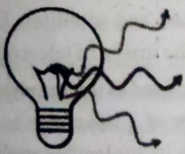
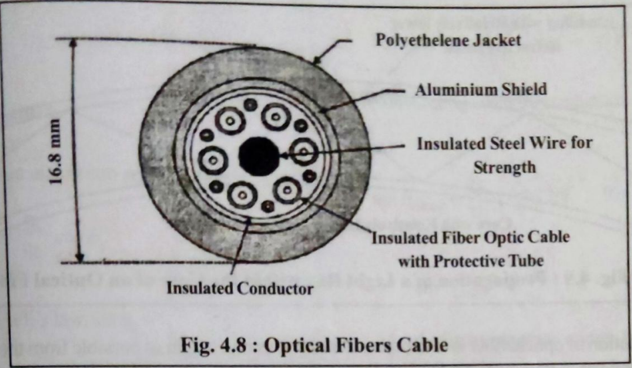
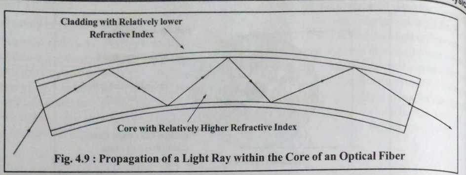
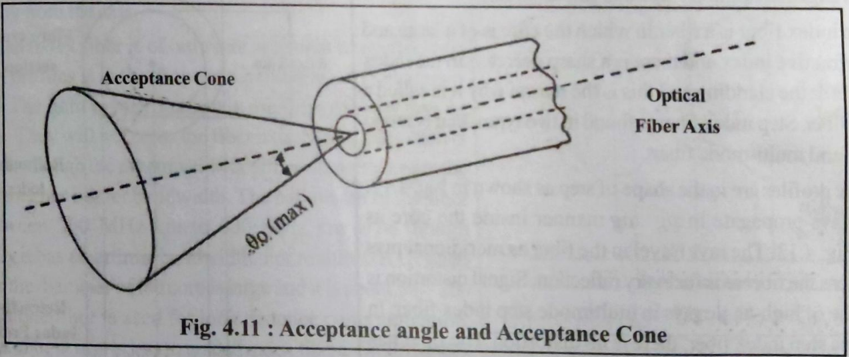

# Unit-4. LASER and Fiber Optics - Solutions

## Part A: Short Answers (1 or 2 marks)

### (1) Write Snell's law

**Answer:** Snell's law states that when light passes from one medium to another, the ratio of sine of angle of incidence to the sine of angle of refraction is constant and equal to the ratio of refractive indices of the two media.

**Mathematical form:**

```
n₁ sin θ₁ = n₂ sin θ₂
```

or

```
sin i / sin r = n₂ / n₁ = constant
```

Where:

- n₁ = refractive index of first medium
- n₂ = refractive index of second medium
- θ₁ (or i) = angle of incidence
- θ₂ (or r) = angle of refraction

---

### (2) Write full form of LASER

**Answer:** LASER stands for **Light Amplification by Stimulated Emission of Radiation**.

- **L** - Light
- **A** - Amplification
- **S** - Stimulated
- **E** - Emission
- **R** - Radiation

---

### (3) What is monochromatic light and polychromatic light?

**Answer:**

**Monochromatic Light:** Light consisting of only one wavelength or single color. It has a single frequency and energy. Example: Laser light, sodium vapor lamp light.

**Polychromatic Light:** Light consisting of multiple wavelengths or many colors. It contains waves of different frequencies. Example: White light, sunlight.

---

### (4) Write properties of laser light

**Answer:** Properties of laser light are:

1. **Monochromaticity** - Single wavelength/color (single frequency light)
2. **Coherence** - All waves are in phase (temporal and spatial coherence)
3. **Directionality** - Highly directional beam, propagates in one specific direction with minimal divergence
4. **High Intensity** - Concentrated energy in a narrow beam, very powerful and bright
5. **Polarization** - Waves vibrate in a single plane
6. **Low Divergence** - Beam remains parallel even after traveling long distances
7. **Focused Beam** - Can be focused to a very small area, depositing energy in a tiny spot
8. **High Speed** - Travels at tremendous velocity (speed of light)

---

### (5) Define: Absolute refractive index, Critical angle

**Answer:**

**Absolute Refractive Index:** The ratio of speed of light in vacuum (or air) to the speed of light in that medium.

```
n = c / v
```

Where:

- n = absolute refractive index
- c = speed of light in vacuum (3 × 10⁸ m/s)
- v = speed of light in the medium

**Critical Angle:** The angle of incidence in the denser medium for which the angle of refraction in the rarer medium becomes 90°. Beyond this angle, total internal reflection occurs.

```
sin θc = n₂ / n₁  (where n₁ > n₂)
```

---

## Part B: Detailed Answers (2 or 3 marks)

### (1) Explain refraction of light with figure and examples

**Answer:**

**Refraction of Light:** The phenomenon of change in direction (bending) of light when it passes from one transparent medium to another is called refraction. This occurs because the speed of light varies in different media.

**Diagram:**


**ASCII Representation:**

```
    Air (Rarer Medium - n₁)
         |
      PQ |  ← Normal N₁
    i ↗  |  
   P/___Q|______________ AB (Glass Surface)
     ↘  |
   r  ↘ |  Glass (Denser Medium)
       ↘|  
        R  ← Refracted Ray QR
        |
        |  ← Normal N₂
     e ↗|  
      / |______________ CD (Glass Surface)
     /  |
    S   |  Air (Rarer Medium)
        ↓  Emergent Ray RS
```

**Explanation:**

- When light travels from rarer to denser medium (air to glass), it bends towards the normal (θ₂ < θ₁)
- When light travels from denser to rarer medium (glass to air), it bends away from the normal (θ₂ > θ₁)
- The bending occurs because light travels at different speeds in different media

**Examples:**

1. A pencil partially immersed in water appears bent
2. A coin at the bottom of a water-filled vessel appears raised
3. Twinkling of stars due to atmospheric refraction
4. Formation of mirages in deserts
5. Lenses in spectacles correct vision through refraction

---

### (2) Explain refractive index. What is absolute refractive index?

**Answer:**

**Refractive Index:** It is a measure of how much light slows down when it passes through a medium. It determines the bending of light rays at the interface between two media.

**Types:**

1. **Relative Refractive Index:** The ratio of speed of light in first medium to speed of light in second medium.

   ```
   n₂₁ = v₁ / v₂ = n₂ / n₁
   ```

2. **Absolute Refractive Index:** The ratio of speed of light in vacuum (or air) to the speed of light in that medium.

   ```
   n = c / v
   ```

   Where:
   - c = 3 × 10⁸ m/s (speed of light in vacuum)
   - v = speed of light in the medium

**Properties:**

- Always greater than 1 for any medium (except vacuum where n = 1)
- Higher refractive index means light travels slower in that medium
- Depends on wavelength of light (causes dispersion)

**Refractive Indices of Common Materials (at 20°C):**

| Medium | Refractive Index |
|--------|------------------|
| Vacuum/Air | 1.000 |
| Ice (0°C) | 1.31 |
| Water | 1.333 |
| Ethyl Alcohol | 1.362 |
| Glycerine | 1.473 |
| Glass/Benzene | 1.501 |
| Quartz | 1.554 |
| Polystyrene | 1.595 |
| Diamond | 2.417 |

**Key Points:**

- Optically denser medium has higher refractive index
- Optically rarer medium has lower refractive index
- Higher n means light travels slower in that medium

---

### (3) Explain total internal reflection in detail with figure

**Answer:**

**Total Internal Reflection (TIR):** When light traveling from a denser medium to a rarer medium is completely reflected back into the denser medium at the interface, the phenomenon is called total internal reflection.

**Conditions for TIR:**

1. Light must travel from denser to rarer medium (n₁ > n₂)
2. Angle of incidence must be greater than critical angle (i > θc)

**Diagram from Textbook:**


*Figure: Total internal reflection in water showing light rays at different angles - some refracted, one at critical angle, and some totally reflected*


*Figure: Derivation of critical angle formula using Snell's law*

**ASCII Representation:**

```
        Denser Medium (Water - n₁)  |    Rarer Medium (Air - n₂)
                                    |
    A        B         C            |
     \       |        /             |
      \      |       /              |
    θ₁ \     |θc    / θ₃            |
        \    |     /                |
         \   |    /                 |    
          \  |   /                  |
___________\◄|__/___________________| 90° (Critical Ray)
            \|_/                    |
             X                      |
            /|\                     |
           / | \                    |
          /  |  \                   |
         /   |   \                  |
       r₁   TIR  r₃                 |
     (Reflected)  (Totally Reflected)|
                                    |
```

**Explanation:**

- Ray A: i < θc → Refraction occurs (bends away from normal)
- Ray B: i = θc → Refracted ray grazes along the surface (r = 90°)
- Ray C: i > θc → Total internal reflection occurs

**Critical Angle Formula:**

```
sin θc = n₂ / n₁  (where n₁ > n₂)

or

θc = sin⁻¹(n₂ / n₁)
```

**Examples of Critical Angles:**

1. **Glass-Air Interface:**
   - n₁ (glass) = 1.50, n₂ (air) = 1.00
   - θc = sin⁻¹(1.00/1.50) = sin⁻¹(0.667) = **41.1°**

2. **Water-Air Interface:**
   - n₁ (water) = 1.33, n₂ (air) = 1.00
   - θc = sin⁻¹(1.00/1.33) = sin⁻¹(0.752) = **48.75°**

3. **Diamond-Air Interface:**
   - n₁ (diamond) = 2.42, n₂ (air) = 1.00
   - θc = sin⁻¹(1.00/2.42) = sin⁻¹(0.413) = **24.4°**
   - This small critical angle explains diamond's brilliant sparkle

**Applications:**

1. Optical fibers for data transmission
2. Prisms in periscopes and binoculars
3. Brilliance of diamonds (due to very small critical angle)
4. Mirage formation in deserts
5. Endoscopy in medical field
6. Sparkling of crystal glass

---

### (4) Give difference between common light and laser light

**Answer:**

| Property | Common Light | Laser Light |
|----------|-------------|-------------|
| **Monochromaticity** | Polychromatic (multiple wavelengths) | Monochromatic (single wavelength) |
| **Coherence** | Non-coherent (waves out of phase) | Highly coherent (waves in phase) |
| **Directionality** | Spreads in all directions | Highly directional, narrow beam |
| **Divergence** | High divergence | Very low divergence (parallel beam) |
| **Intensity** | Low intensity | Very high intensity |
| **Source** | Spontaneous emission | Stimulated emission |
| **Polarization** | Unpolarized or randomly polarized | Polarized |
| **Energy** | Low energy density | High energy density |
| **Phase relationship** | Random phase | Constant phase relationship |
| **Example** | Bulb, tube light, sunlight | He-Ne laser, CO₂ laser, ruby laser |

**Visual Comparison from Textbook:**




**ASCII Representation:**

```
Figure 4.4 - Normal Bulb Light:
    ╱─────╲  (Multiple wavelengths)
   ╱   λ₁  ╲ (spreads in all directions)
  │  λ₂ λ₃ │ 
   ╲  λ₄   ╱
    ╲─────╱

Figure 4.5 - Sodium Lamp (Monochromatic):
    ╱─────╲  (Single wavelength λ)
   ╱   λ   ╲ (spreads in all directions)
  │    λ   │ 
   ╲   λ   ╱
    ╲─────╱

Figure 4.6 - Laser Light:
       ║║║  (Single wavelength λ)
       ║║║  (Parallel, unidirectional)
    ═══╬╬╬═══
       ║║║
       ║║║
```

---

### (5) Write at least 6 applications of laser light in various fields in detail

**Answer:**

**Applications of LASER:**

1. **Medical Field:**
   - **Laser Surgery:** Precision cutting in eye surgery (LASIK), tumor removal
   - **Laser Therapy:** Treatment of kidney stones, dental procedures
   - **Endoscopy:** Internal examination using fiber optic cables with laser
   - **Bloodless Surgery:** Cauterization of blood vessels during cutting

2. **Communication:**
   - **Optical Fiber Communication:** High-speed internet, telephone networks
   - **Satellite Communication:** Long-distance signal transmission
   - **Data transfer:** Laser beams carry more information than radio waves

3. **Industrial Applications:**
   - **Cutting and Welding:** Precision cutting of metals, fabrics, plastics
   - **Drilling:** Making micro-holes in hard materials like diamonds
   - **Surface Treatment:** Heat treatment, hardening of metals
   - **3D Printing:** Laser sintering and stereolithography

4. **Military and Defense:**
   - **Range Finders:** Measuring distance to targets accurately
   - **Guided Missiles:** Laser-guided weapons systems
   - **LIDAR:** Detection and ranging for surveillance
   - **Anti-missile systems:** Destroying incoming projectiles

5. **Scientific Research:**
   - **Spectroscopy:** Analyzing material composition
   - **Holography:** Creating 3D images
   - **Laser Cooling:** Cooling atoms to near absolute zero
   - **Plasma Physics:** Creating high-temperature plasmas

6. **Entertainment and Commercial:**
   - **Laser Light Shows:** Concerts, events, displays
   - **Barcode Scanners:** Retail checkout systems
   - **CD/DVD/Blu-ray Players:** Reading optical discs
   - **Laser Printers:** High-quality printing

7. **Measurement and Instrumentation:**
   - **Precision Measurement:** Interferometry for extremely accurate measurements
   - **Surveying:** Land surveying and construction alignment
   - **Speed Detection:** Traffic speed radars

---

### (6) Describe types of optical fiber in detail

**Answer:**

Optical fibers are classified based on two criteria:

**A. Based on Mode of Propagation:**

**1. Single Mode Fiber (SMF):**

- **Core diameter:** Very small (8-10 μm)
- **Cladding diameter:** 125 μm
- **Mode:** Only one mode (fundamental mode) propagates
- **Transmission:** Light travels straight along the axis
- **Dispersion:** Very low intermodal dispersion
- **Bandwidth:** Very high (>100 GHz)
- **Distance:** Long distance (>50 km)
- **Cost:** Expensive
- **Applications:** Long-haul telecommunications, cable TV, internet backbone

```
Single Mode Fiber:
    ═══════════════════════►
    ═══════════════════════► (Straight path)
    ═══════════════════════►
    |     Core (8-10μm)    |
```

**2. Multi Mode Fiber (MMF):**

- **Core diameter:** Large (50-62.5 μm)
- **Cladding diameter:** 125 μm
- **Mode:** Multiple modes propagate simultaneously
- **Transmission:** Light takes multiple paths (zigzag)
- **Dispersion:** High intermodal dispersion
- **Bandwidth:** Lower than SMF (up to 1 GHz)
- **Distance:** Short distance (<2 km)
- **Cost:** Less expensive
- **Applications:** LANs, short-distance communication, building networks

```
Multi Mode Fiber:
    ═══╱╲╱╲╱╲╱╲╱╲══► (Multiple paths)
    ═══════════════►
    ══╲╱╲╱╲╱╲╱═════►
    | Core (50-62.5μm) |
```

**B. Based on Refractive Index Profile:**

**1. Step Index Fiber:**

- **Profile:** Uniform refractive index in core, sharp boundary with cladding
- **Core RI:** Constant (n₁)
- **Cladding RI:** Constant (n₂), where n₁ > n₂
- **Types:** Can be single mode or multimode
- **Dispersion:** High in multimode version
- **Applications:** Short-distance, low-cost applications

```
Refractive Index Profile:
    n₁ |████████|
       |████████|
    n₂ |        |________
       └────────┴────────► radius
          core  cladding
```

**2. Graded Index Fiber:**

- **Profile:** Refractive index gradually decreases from center to edge of core
- **Core RI:** Maximum at center, decreases parabolically toward edges
- **Cladding RI:** Constant (n₂)
- **Types:** Always multimode
- **Dispersion:** Lower than step index (paths equalized)
- **Applications:** Medium-distance, higher bandwidth applications


*Figure: Comparison of refractive index profiles and light propagation in step-index and graded-index optical fibers*

```
Step Index - Refractive Index Profile:
    n₁ |████████|
       |████████|
    n₂ |        |________
       └────────┴────────► radius
          core  cladding
    
    Light Path: ══╲╱╲╱╲╱══► (zigzag)

Graded Index - Refractive Index Profile:
    n₁ |   ╱══╲   |
       |  ╱    ╲  |
    n₂ | ╱      ╲ |________
       └─────────┴────────► radius
          core   cladding

    Light Path: ══╱══╲══╱══╲══► (sinusoidal)
```

**Comparison Table:**

| Parameter | Step Index (MM) | Graded Index (MM) | Single Mode |
|-----------|----------------|-------------------|-------------|
| Core Diameter | 50-200 μm | 50-62.5 μm | 8-10 μm |
| Bandwidth | Low | Medium | Very High |
| Dispersion | High | Medium | Very Low |
| Distance | Short | Medium | Long |
| Cost | Low | Medium | High |

---

### (7) Write applications of optical fiber in various fields in detail

**Answer:**


*Figure: Optical fiber being used for data transmission based on total internal reflection principle*

**Applications of Optical Fiber:**

**1. Telecommunications:**

- **Long-Distance Communication:** Intercontinental submarine cables
- **Telephone Networks:** Voice transmission over fiber optic cables
- **Internet Backbone:** High-speed internet infrastructure (FTTH - Fiber to the Home)
- **Mobile Networks:** Backhaul connections between cell towers
- **Advantages:** High bandwidth, low signal loss, immune to electromagnetic interference

**2. Medical Field:**

- **Endoscopy:** Internal examination of body organs (gastroscopy, colonoscopy)
- **Laser Surgery:** Delivering laser beams precisely to target tissues
- **Photodynamic Therapy:** Cancer treatment using light-activated drugs
- **Medical Imaging:** Fiber optic microscopy and imaging systems
- **Advantages:** Flexibility, minimal invasion, precise light delivery

**3. Industrial Applications:**

- **Sensors:** Temperature sensors, pressure sensors in harsh environments
- **Lighting:** Fiber optic lighting for displays, decorations, and hazardous areas
- **Inspection:** Inspecting hard-to-reach areas in machinery and structures
- **Process Control:** Monitoring industrial processes in real-time
- **Advantages:** Immunity to electrical noise, safe in explosive environments

**4. Military and Defense:**

- **Secure Communication:** Difficult to tap, no electromagnetic emission
- **Battlefield Networks:** Lightweight, reliable communication systems
- **Navigation Systems:** Fiber optic gyroscopes for aircraft and missiles
- **Sonar Systems:** Underwater detection and communication
- **Advantages:** Secure, lightweight, resistant to jamming

**5. Cable Television (CATV):**

- **Broadcast:** Distributing TV signals to multiple subscribers
- **Video on Demand:** High-quality video streaming services
- **Interactive TV:** Two-way communication for interactive services
- **Advantages:** High bandwidth, multiple channels, better picture quality

**6. Computer Networking:**

- **Local Area Networks (LANs):** High-speed data transfer in offices and campuses
- **Data Centers:** Interconnecting servers and storage systems
- **Storage Networks:** SANs (Storage Area Networks)
- **Advantages:** High data rates, long distances without repeaters

**7. Automotive Industry:**

- **Vehicle Networks:** Connecting various electronic systems in cars
- **Safety Systems:** ABS, airbag deployment sensors
- **Entertainment:** In-vehicle multimedia distribution
- **Advantages:** Lightweight, immune to electromagnetic interference

**8. Aerospace:**

- **Aircraft Systems:** Flight control, avionics communication
- **Spacecraft:** Data transmission in satellites
- **Flight Data Recorders:** Black boxes using fiber optic technology
- **Advantages:** Lightweight, reliable in extreme conditions

**9. Scientific Research:**

- **Spectroscopy:** Delivering light to and from spectrometers
- **Laser Systems:** Beam delivery in laboratories
- **Astronomy:** Connecting telescopes to analysis instruments
- **Particle Physics:** Timing and triggering systems in detectors

**10. Oil and Gas Industry:**

- **Downhole Monitoring:** Temperature and pressure sensors in oil wells
- **Pipeline Monitoring:** Detecting leaks and intrusions
- **Seismic Sensing:** Distributed acoustic sensing for exploration
- **Advantages:** Operates in high-temperature, high-pressure environments

---

### (8) Explain construction of optical fiber with figure

**Answer:**

**Construction of Optical Fiber:**

An optical fiber consists of three main parts:


**Cross-Sectional View:**

```
    ╔═══════════════════════════════════╗
    ║  Buffer Coating/Sheath/Jacket     ║
    ║    (Protective plastic layer)     ║
    ║  ╔═════════════════════════════╗  ║
    ║  ║      Cladding               ║  ║
    ║  ║   (Glass/Plastic, n₂)       ║  ║
    ║  ║   ┌─────────────────────┐   ║  ║
    ║  ║   │      Core           │   ║  ║
    ║  ║   │  (Glass/Plastic)    │   ║  ║
    ║  ║   │   (n₁ > n₂)         │   ║  ║
    ║  ║   │  ~50-200 μm (MM)    │   ║  ║
    ║  ║   │  ~8-10 μm (SM)      │   ║  ║
    ║  ║   └─────────────────────┘   ║  ║
    ║  ║      ~125 μm diameter       ║  ║
    ║  ╚═════════════════════════════╝  ║
    ║        ~250-900 μm total          ║
    ╚═══════════════════════════════════╝

Longitudinal View:

    ═══════════════════════════════════════►
    Light propagates through core via TIR
    ═══════════════════════════════════════►
```



*Figure: Cross-section of a typical telecommunication optical fiber cable showing 6 optical fibers, insulated copper wires, central steel wire for strength, and aluminum sheath*

**Detailed Structure:**

**1. Core (Inner Part):**

- **Material:** Ultra-pure silica glass (SiO₂) or plastic
- **Diameter:**
  - Single mode: 8-10 μm
  - Multimode: 50-62.5 μm
- **Refractive Index:** High (n₁ ≈ 1.48-1.50)
- **Doping:** May be doped with germania (GeO₂) to increase refractive index
- **Function:** Carries light signals through total internal reflection

**2. Cladding (Middle Part):**

- **Material:** Silica glass with lower refractive index
- **Diameter:** 125 μm (standard)
- **Refractive Index:** Lower than core (n₂ ≈ 1.46)
- **Function:**
  - Provides optical confinement by reflecting light back into core
  - Reduces light loss
  - Adds mechanical strength

**3. Protective Jacket/Buffer Coating (Outer Part):**

- **Material:** Plastic polymer (polyimide, acrylate, or PVC)
- **Thickness:** 250-900 μm
- **Function:**
  - Protects fiber from physical damage
  - Provides mechanical strength
  - Prevents moisture ingress
  - Color coding for identification

**Additional Layers (in cables):**

- **Strength Members:** Kevlar or steel wires for tensile strength
- **Outer Sheath:** Additional plastic covering for environmental protection

**Diagram with Light Propagation:**



**ASCII Representation:**

```
    Incident Light
         ↓
    ╔═══│═══════════════════════╗
    ║   ↓                       ║
    ║  ╔↓═══╲               ╗   ║  
    ║  ║  ═══╲═════╱       ║   ║  Cladding (n₂)
    ║  ║   ═══╲═══╱═══     ║   ║  
    ║  ║    ═══X═══╱       ║   ║  Core (n₁ > n₂)
    ║  ║     ══╱═══════    ║   ║  
    ║  ║      ╱═════════   ║   ║  Cladding (n₂)
    ║  ╚═════════════════════╝  ║
    ║    TIR at core-cladding   ║  Buffer Coating
    ║      interface (θ > θc)   ║
    ╚═══════════════════════════╝
                              →  Output Light
```

**Acceptance Angle and Numerical Aperture:**


*Figure: Light ray entering optical fiber at acceptance angle θₐ, showing refraction at fiber end and total internal reflection at core-cladding interface*



*Figure: Acceptance cone showing the solid angle (2θₐ) within which light can enter and propagate through the fiber*

**Key Points:**

- Core has higher refractive index than cladding (n₁ > n₂)
- Light is confined to core by total internal reflection
- Typical core/cladding ratio determines fiber characteristics
- Multiple fibers bundled together form fiber optic cables
- The difference in refractive indices (Δn = n₁ - n₂) is small (~0.01-0.02)
- **Acceptance Angle (θₐ):** Maximum angle at which light can enter the fiber and still propagate via TIR
- **Numerical Aperture (NA):** sin θₐ = √(n₁² - n₂²) - measures light-gathering capacity
- Larger NA means better light-gathering ability
- Typical NA values range from 0.13 to 0.50

---

### (9) Describe advantages of optical fiber over coaxial cable

**Answer:**

**Advantages of Optical Fiber over Coaxial Cable:**

**1. Higher Bandwidth:**

- **Optical Fiber:** Can carry data at rates of Terabits per second (Tbps)
- **Coaxial Cable:** Limited to Megabits to Gigabits per second
- **Reason:** Light has much higher frequency than electrical signals
- **Impact:** Supports more simultaneous communications

**2. Lower Signal Attenuation (Loss):**

- **Optical Fiber:** 0.2-0.5 dB/km loss
- **Coaxial Cable:** 10-30 dB/km loss
- **Benefit:** Signals travel longer distances without amplification/repeaters
- **Result:** Fewer repeaters needed, lower installation and maintenance costs

**3. Immunity to Electromagnetic Interference (EMI):**

- **Optical Fiber:** Not affected by electromagnetic fields, radio frequency interference
- **Coaxial Cable:** Susceptible to EMI, crosstalk from nearby cables
- **Advantage:** Cleaner signals, fewer errors
- **Applications:** Suitable for electrically noisy environments (factories, power plants)

**4. Higher Security:**

- **Optical Fiber:** Difficult to tap without detection; no electromagnetic radiation
- **Coaxial Cable:** Can be tapped easily; radiates electromagnetic signals
- **Benefit:** More secure for sensitive data transmission
- **Use Cases:** Military, banking, government communications

**5. Lighter and Smaller:**

- **Optical Fiber:** Weighs ~10-20 g/km; diameter ~125 μm
- **Coaxial Cable:** Weighs ~100-300 g/km; diameter ~5-10 mm
- **Advantages:**
  - Easier to install in tight spaces
  - Lower transportation costs
  - More cables in same conduit

**6. Non-Conductive:**

- **Optical Fiber:** Made of glass/plastic; doesn't conduct electricity
- **Coaxial Cable:** Metal conductor; can conduct electricity
- **Benefits:**
  - No spark hazard in flammable environments
  - No ground loop problems
  - Safe during lightning strikes
  - Can be used in high-voltage environments

**7. Better Signal Quality:**

- **Optical Fiber:** Digital signals maintain integrity over long distances
- **Coaxial Cable:** Analog signals degrade with distance
- **Result:** Less signal distortion, better data integrity

**8. Longer Distance Transmission:**

- **Optical Fiber:** Up to 100+ km without repeaters
- **Coaxial Cable:** Maximum ~1-2 km without amplification
- **Benefit:** Reduced infrastructure costs

**9. Corrosion Resistance:**

- **Optical Fiber:** Glass/plastic not affected by moisture, chemicals
- **Coaxial Cable:** Metal conductors can corrode
- **Longevity:** Longer lifespan in harsh environments

**10. Future-Proof:**

- **Optical Fiber:** Bandwidth can be upgraded without changing cables (upgrade equipment only)
- **Coaxial Cable:** Limited upgrade potential
- **Economic:** Better long-term investment

**Comparison Table:**

| Feature | Optical Fiber | Coaxial Cable |
|---------|--------------|---------------|
| Bandwidth | Very High (Tbps) | Moderate (Mbps-Gbps) |
| Attenuation | 0.2-0.5 dB/km | 10-30 dB/km |
| Distance | 100+ km | 1-2 km |
| EMI Immunity | Excellent | Poor |
| Weight | Light (~10-20 g/km) | Heavy (~100-300 g/km) |
| Size | Small (125 μm) | Large (5-10 mm) |
| Security | Very High | Low |
| Cost | Higher initial | Lower initial |
| Installation | Requires expertise | Easier |
| Durability | High | Moderate |

**Disadvantages of Optical Fiber:**

1. Higher initial installation cost
2. Requires specialized equipment and training
3. More fragile (glass fibers can break)
4. Difficult to splice and terminate
5. Cannot carry electrical power (unlike copper)

---

## Part C: Numerical Solutions (3 marks)

### (1) Velocity of light in air is 3 × 10⁸ m/s and in liquid 1.8 × 10⁸ m/s, so find out refractive index of liquid

**Given:**

- Velocity of light in air, c = 3 × 10⁸ m/s
- Velocity of light in liquid, v = 1.8 × 10⁸ m/s

**To Find:**

- Refractive index of liquid, n = ?

**Formula:**

```
n = c / v
```

**Solution:**

```
n = c / v
n = (3 × 10⁸) / (1.8 × 10⁸)
n = 3 / 1.8
n = 1.67
```

**Answer:** The refractive index of the liquid is **1.67**

---

### (2) Velocity of light in air is 3 × 10⁸ m/s and in glass 2 × 10⁸ m/s, so find out refractive index of glass

**Given:**

- Velocity of light in air, c = 3 × 10⁸ m/s
- Velocity of light in glass, v = 2 × 10⁸ m/s

**To Find:**

- Refractive index of glass, n = ?

**Formula:**

```
n = c / v
```

**Solution:**

```
n = c / v
n = (3 × 10⁸) / (2 × 10⁸)
n = 3 / 2
n = 1.5
```

**Answer:** The refractive index of the glass is **1.5**

---

### (3) Light enters in glass medium from air. Glass has refractive index is 1.56. So find velocity of light in glass

**Given:**

- Velocity of light in air, c = 3 × 10⁸ m/s
- Refractive index of glass, n = 1.56

**To Find:**

- Velocity of light in glass, v = ?

**Formula:**

```
n = c / v
Therefore, v = c / n
```

**Solution:**

```
v = c / n
v = (3 × 10⁸) / 1.56
v = 1.923 × 10⁸ m/s
```

**Answer:** The velocity of light in glass is **1.923 × 10⁸ m/s** or **1.92 × 10⁸ m/s**

---

### (4) One optical fiber has value of refractive indices are 1.563 and 1.498, respectively. Calculate acceptance angle of optical fiber

**Given:**

- Refractive index of core, n₁ = 1.563
- Refractive index of cladding, n₂ = 1.498
- Refractive index of air, n₀ = 1

**To Find:**

- Acceptance angle, θₐ = ?

**Formulas:**

```
Numerical Aperture (NA) = √(n₁² - n₂²)
Acceptance Angle: sin θₐ = NA / n₀
```

**Solution:**

**Step 1:** Calculate Numerical Aperture (NA)

```
NA = √(n₁² - n₂²)
NA = √(1.563² - 1.498²)
NA = √(2.4430 - 2.2440)
NA = √0.1990
NA = 0.446
```

**Step 2:** Calculate Acceptance Angle

```
sin θₐ = NA / n₀
sin θₐ = 0.446 / 1
sin θₐ = 0.446
θₐ = sin⁻¹(0.446)
θₐ = 26.5°
```

**Answer:**

- **Numerical Aperture (NA) = 0.446**
- **Acceptance Angle (θₐ) = 26.5°**

---

### (5) An optical fiber has value of refractive indices are 1.48 and 1.45, respectively. Calculate acceptance angle and numerical aperture of optical fiber

**Given:**

- Refractive index of core, n₁ = 1.48
- Refractive index of cladding, n₂ = 1.45
- Refractive index of air, n₀ = 1

**To Find:**

- Numerical Aperture (NA) = ?
- Acceptance angle, θₐ = ?

**Formulas:**

```
Numerical Aperture (NA) = √(n₁² - n₂²)
Acceptance Angle: sin θₐ = NA / n₀
```

**Solution:**

**Step 1:** Calculate Numerical Aperture (NA)

```
NA = √(n₁² - n₂²)
NA = √(1.48² - 1.45²)
NA = √(2.1904 - 2.1025)
NA = √0.0879
NA = 0.2965
NA ≈ 0.297
```

**Step 2:** Calculate Acceptance Angle

```
sin θₐ = NA / n₀
sin θₐ = 0.297 / 1
sin θₐ = 0.297
θₐ = sin⁻¹(0.297)
θₐ = 17.27°
θₐ ≈ 17.3°
```

**Answer:**

- **Numerical Aperture (NA) = 0.297 or 0.30**
- **Acceptance Angle (θₐ) = 17.3°**

**Note:** Numerical Aperture (NA) is an important parameter that indicates:

- The light-gathering capacity of the optical fiber
- The larger the NA, the more light can enter the fiber
- Maximum half-angle at which light can enter the fiber core

---

## Additional Important Formulas

### Refractive Index

```
n = c / v = sin i / sin r = λ₀ / λₘ
```

### Critical Angle

```
sin θc = n₂ / n₁  (where n₁ > n₂)
```

### Numerical Aperture

```
NA = √(n₁² - n₂²) = n₀ sin θₐ
```

Where:

- n₁ = core refractive index
- n₂ = cladding refractive index
- n₀ = refractive index of medium from which light enters (usually air, n₀ = 1)
- θₐ = acceptance angle

### Fractional Refractive Index Change

```
Δ = (n₁ - n₂) / n₁
```

### For small Δ

```
NA ≈ n₁√(2Δ)
```

---

*End of Solutions*
