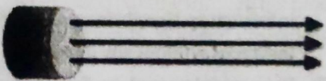
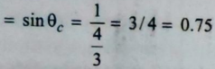

## Applications of Optical Fibers Applications

## 4.1 Refraction, Refractive Index and Snell's law

As long as a ray oflight ttravelsina single medium, its |ncident irection does I not change. That is, it moves ina straight line. ray Buhen aray oflight passes fromonetransparent medium nnother transparent medium, its velocity changes. When elicht ray enters obliquely fromonetransparent medium to mother transparentmedium, it deviates from the original irection at the surface separating the two media.This D ahenomenon is called refraction.

## 4.1.1 Refraction

As we know, the speed oflight varies in different nediums. Optically rarer media,such as vacuum orair, have higher velocity, while other denser transparent mediahave lower velocity., Hencethe phenomenon of refraction occurs when aray of light travels fromonemedium to another.The Tay refracted light is called a refracted ray.

In the previous standards, you have studied the Eracion oflight bythe experiment with a transparentglass-|the UbOid). Without repeating thatexperiment, let us once Jaln understand the samephenomenon ofrefraction.

When a light-ray is refiracted over two parallel refracting surfaces, the Emergent Ray is shifted from the direction of incidentray as shown in the figure. Such atransfer of light rays is called the lateral shift.

As showninthe figure 4.1. PO is an incident ray. It msthe angle ofincident i, with the normal. This incident Tay PQ travels fromthesurface AB ofthe glass slab, from a optically rarer medium like airto an optically denser n ike glass. Soits velocity decreases and it bends hne normal andmakes the angleofrefraction r, shere QR IS a refracted ray. The refracted ray QR acts as aincident ray for the surface CD of the glass slab andforms aihangle with the normal. Now when a light ray enters from aoptically denser medium like glasstoan optically rarer Redium like air, its velocity increases, and it bends away tam the norma. This is howthe RS ray exits fromthe glass That is why is called an Emergent Ray. In the figure, ishie angleof emergence.

Due to this lateral shift as a result ofrefraction, the pencil placed in a glass filled with water appears to be slanted from its surface. Anything placed atthe bottom of a vessel filled with water or at the bottom of aswimming pool appears to beslightly upper than its original location. These phenomena are caused by therefraction oflight. It is difficult to pierce afish in a river as its location looks diferent from where it is due to the refraction oflight.

respect to that of the first medium(n21) is defined asthe ratio The refractive index of the second medium with of the sine ofthe angle of incidencei inthe first medium tothe sine ofthe angle of refraction inthe: second medium. The Refractive indexhas no unit as it is t theratio of twosimilar quantities. quantities.

## 4.1.2 Laws of Refraction

1. The incident ray PGLYPH&lt;26&gt;. the refracted ray QR and the normal N,Q N,to the interface of two transparentmedia at the pointofincidence,all lie in the same plane.
2. Incidentray and refracted ray both are in different opticalmedia.
3. Incident ray andrefractedray are always onthe opposite side ofthe normal.
4. 4 When alight-ray travelsfrom the opticallyrarer medium (likeair) to an opticallydenser medium (likeglass),it (the refracted ray) bends towards the normalat the interface. Therefore, the angle ofthe incidence is greater than the angle of refraction (i&gt;).
5. 5 When alight ray enters froman optically denser medium (likeglass) to an optically rarer medium (likeair), it (the refractedray) bends awayfrom thenormal tothe interface. Theangleof incidence is smaller than the angle ofrefraction
6. (i &gt;r). 6 Theray which incidentsatthe normal, passes to the other medium without refraction (i.e. does notchange direction).

## 4.1.3 Refractive Indexand Snell's law

Theratio ofthe sine of an angleof incidenceto the sine ofanangle of refraction is always constant forthe given two media. It is termed asa refractiveindex. Its symbolis u (Mu). Sometimesn (Ita)is also written. It is known as Snell's law.It can be written in the formof a formula as follows:

## 4.1.4 Absolute RefractiveIndex

(4)

medium 1relative toava The refractive index ofa (or air)is called the absolute erefractive indexof the met However, the absolute refractive i index is generally re to only as the refractive index. .Itis represented byt the t of the velocity (Speed) oflight in vacuum(c) to the velag (speed) of lightin (v) in the givenmedium. =n =chv .

- =n=Refractive index
- =velocity of light rays in a vacuum.
- =velocity oflightrays in medium. V
- V1 =Velocity oflight rays in medium-1 =
- -Refractive indexofmedium-1 n1
- V2 =Velocity of light rays in medium-2 =
- -Refractive index of medium-2 Where, n, =cv and n2 = chv

Therefore, n 21= clv2 GLYPH&lt;26&gt; cly

121

GLYPH&lt;26&gt;

V2

From equations (02) and (05)...

H21

=n21 =

sinr sin i -12 M

=

V2 Therefore, nGLYPH&lt;26&gt; sin i= n, sinr constant

i

... (6) Equation (6) is also called the Snell's law. Ifa ray of light is refracted fromair into glass,it is called the refractive index of glass relative to air.

- Mganna

<!-- formula-not-decoded -->

Suppose the refractive index ofthe first medium is ni and thatof the second medium is na. Therefractive index medium-2 relative to medium-1is denoted by u or n1.its

Mga =1/Mag The optically denser a medium is, the moore ofrefractiveindex is. The optically rarer a mnedium is, the lesser refractive index is.

<!-- formula-not-decoded -->

The refractive index of light can be represented as the ratio ofthe velocities oflight in its twomedia. If the velocities of light in medium-1 and medium-2 are v respectively, then their ratio is called the refractive index of medium 1 relative to medium 2.

From the aboveequation (4) it can be said thatthe refractive index of the medium : and the velocity of lightin the medium are both inversely proportional to each other. Therefore, as the medium becomes optical denser, its d the velocity of light i refractive indexgoes increasing and and vmedium decreases. tin the

The absolute refractive index of some media is shown in Table 4.1 below for information only

So

.(5)

i

t

s

o

f

Table4.1 :Some established data regardingmedium and its refractive index (20°C]

## Glycerine 42 Total internal reflection and Critical | angle

| Medium        |   RefractiveIndex | Medium        | RefractiveIndex   |
|---------------|-------------------|---------------|-------------------|
| Air Vacuum    |             1     | Glass/Benzene | 1.501             |
| lce [0°C]     |             1.31  | Quartz        | 1.554             |
| Water         |             1.333 | Diamond       | 2.471             |
| Ethyl Alcohol |             1.362 | Polystyrene   | 1.595             |
|               |             1.473 |               |                   |

## 42.1 Total Internal Reflection

This phenomenon is based ontheprinciple of refraction light. The figure below willbe helpful to understand theincidence total intemal reflection.

Asshowninfigure 4.2, a water container is filled with clear transparentwater. Alight source, fixed at the bottom of thecontaineremits light rays in all directions.These are partially reflected andpartially transmitted.

When a ray of light enters from anopticallv denser medium (here,water) to an optically rarer medium (air), it moves awayfrom the normalat the interface.The AM ray ISa normal ray that comes out without being refracted The ray A0,forms the angle ofincidence alongthe normal, which is slightly refracted and emitted in the form of ray O,B (away from the nomal) and partiallyreflected back to the waterin the form of O,C ray. The ray AO,formsangle of eidence () with thenormal, whichis slight vrefractedandAO41S therayexits in the form of 0,D(awayfromthe normal) returns to the water in the form of O,Eray after beinglarger than partially reflected. Asthe angle ofincidence increases, so doesthe angle of refraction. AndthŁray of light moves away fromthe nornalafterbeing refracted, as can be seenin the figure.As the angle of incidence is increased gradually, the refracted ray O,F travels in the direction parallel to the interfaceseparating both media for a certain angle of () equalto the critical angle (0,).Ataparticular angleof incidence, refracted ray moves parallel to the Surface separating the two media. In this particular case, the angle of refractionbecomes 900 forthe incidence ray 0,f. The angle ofincidence for which the angleof refraction raysheeomes 90o is called the critical angle of the denser meaium with respect to the rarer medium. The refracted ray foundin theposition ofa critical angleis called Critical Ray. Here OF is that critical ray. Inthis situation, the surface Separating both media appears to be illuminated.

Now, iftheangle ofincidence (i) is raisedevenslightly more than the critical angle(0),the incident ray gets this case).That is, here, asshown in the figure,incident ray, completely reflectedbackintothe denser medium (water, in Tully reflected and returned backto the water in the form of O,G This phenomenon is called total internal andeflectionThisphenomenon is trueforanyangle of incidence the critical angle. In this situation, the surface separating both mediaacts as aperfect mirror. Total Internal reflection also obeys the laws ofreflection.

## 4.2.2 Critical Angle

In theprevious paragraph, thephenomenon of total internal reflection was introduced. Total internal reflection (TIR)is the phenomenon that involves the reflection ofall the off the boundary

Inour introduction to TIR, we usedtheexample of incident light light traveling through water towards the boundary with lessdense material such as air. Whentheangle of incidence along the boundary, having an angle of refraction of 90-dense in water reaches acertain critical value, the refracted raylies degrees, This angle ofincidence is known asthe critical angle; it is the largest angle ofincidence forwhich refraction can still occur. For any angle of incidence greater than the critical angle, light will undergo total internal reflection.

So thecritical angle is defined as the angle ofincidence that provides an angle of refraction of90-degrees. Make particular notethat the eritical angle is an angle ofincidence value. For the water-air boundary, the critical angle is 48.6-degrees. For the crown glass-water boundary, the critical angle is 61.0-degrees.The actual value ofthe critical angle is dependent upon the combination of materials present on each side ofthe boundary.

Let's consider two different media -creatively named medium i(incident medium) and medium r(refractive medium). The critical angle is the 0,that gives a 0, value of 90-degrees. If this information is substituted into Snell's Law equation, a generic equation for predictingthe critical angle can bederived. The derivation is shown below.

n,sin 0, n, sin 0, n, sin 0,mn, sin 900

n, sin0,n,

<!-- formula-not-decoded -->

<!-- formula-not-decoded -->

The critical angle can be calculated by taking the inverse-sine of theratio ofthe indices ofrefraction. The ratio of is a value lessthan 1.0. In fact, for the equation to

evengiveacorect answer, theratioof mustbe less than ni

L.0. Since TIR only occurs if the refractive medium is dense than the incident medium, the value of n, mu greater thanthevalue of n Ifat any time the values for numerator and denominator become accidentally swich the critical angle value cannot be calculated MathematicGLYPH&lt;26&gt; this would involve finding theinverse-sine of a numbe greater than 1.00, which is not possible. Physically, t wouldinvolve findingthe critical angle fora situationin whi the light is traveling from the lessdense medium into the mo medium, which again, is not possible

This equation for the critical angle can be used predict the critical angle forany boundary. provjded indices of refraction of the twomaterials on each sid, boundary are known. Examples of its use areshown beloW

## Critical Angle of Glass

We know that the refractive index of glass, n, =159 And, the refractive index of air, n, =1.00

<!-- formula-not-decoded -->

replacing values ofn, and n, in formula

<!-- formula-not-decoded -->

6=41.10

## Critical Angle ofDiamond

therefractive index of diamond, n, =2.42 the refractive index of air,n, =1.00

<!-- formula-not-decoded -->

replacing values of n, and n, in formula

<!-- formula-not-decoded -->

0,=24.40

Critical AngleofWater :

the refractiveindex of water,n,= 1.33. therefractive index of air, n, =1.00

replacing values of n, and n, in formula

(sin 90° |)

ASER

e sin-1

.00

1.33

## 8= 48.750 Conditions for Total Internal Reflection

3 Necessary The twonecessary conditions for the total internal reflection are:

- o Thelight musttravel fromanopticallydenser medium to an optically rarer medium.
- The angle of incidence in denser medium must be greaterthan the critical angle for the pair of media.

## I Applications of Total Internal Reflection in Optical Fibers

The bright glitter andsparkling of Crystal glasSs anddiamond glitter are attributed to the total internal reflection. Anal internal reflection in nature gives the illusion of a mirage in the desert. Similarly, looming occurs due to total internal wlection inthepolar or extremely cold regions. That means sailors seethe steamer orship hanging upside down in the used in communication andthe medical field worksonthe principle of total internal reflection.

The optical fibres One thing to note here is that the total internal reflection does not occur when any light ray enters from an optically mediumto anopticallydenser medium. Forobjectswith a large refractive index,the critical angle is less. For example, be aritical angle for the light ray going from diamond to air is ,=24°.This phenomenon is the reason for sparkling glitter en indiamonds andcrystal glass.

Optical fibres are now widely used to send audio or video signalsover long distances. Optical fibres can transmit ignals fromoneplace to another using the phenomenonoftotal internal reflection. They are in the form oflong and thin ores high-quality glass,quartz and plastic materials. Its diameter is about 0.000l centimetres. The central-axialpart GLYPH&lt;26&gt;this fibre is called the core while the core is Suroundedby the layercalled cladding. In an optical tiber , the refactive index of cladding material.

Tis curved ortwisted, the ray oflight Optical fiber is widely used in communication. In addition, it has various uses in various fields such asengineering tield, medical, military field, ctc.

of the core is higher than that Asshown in the figure, when a light ray enters into oneend ofthe optical fiber at a proper acceptance angle, it dergoes multiple total internal reflections andfinally emerges out from the other end ofthe optical fiber. Evenif the optical undergoes total intermal reflectionand passes through it.

## 4 LASER

## 4.1 Introduction to LASER

invention of thelaser,the Diamond Jubilee ofthe laser. Wedn The year 2020 marks the60th anniversary offthe t When we shopin a big shopping mall, the laser-based code gun/scanner is used. The optical mouse, connected toa computer, is also an example of a laser device The rea ven know and we have used laser technology unknowingly. When we send an e-mail,&amp; write process of the CDs/DVDs used ina musicsystem is done bya laser beam only. worldwide fiber optic network based on laser Starts working. Lasertechnologyhas numerous applications int the presen and is likelyto lead to many more revolutionary discoveries in the future. What is this laser ?

LASER is the abbreviation of"LightAmplification by Stimulated Emission of Radiation".

- L-Light
- A-Amplification
- S-Stimulated
- E-Emission
- R-Radiation

## 4.4.2 Characteristics ofLaser

Alaser is an electromagnetic,visibleor invisible, ray of monochromatic light that consists ofan extremely powertu, intense, bright, focused and coherent unidirectional beam of light rays thattravels by tremendous velocity in air or vacun. Alaser beam is highly energetic andhas unique propertiesover conventional ordinary light rays. The light of a nomalbu has all the wavelengths, as shownin figure 4.4, which propagates in all directions. The monochromatic (single waveleng light of a sodium lamp has only one wavelength which spreads in all directions (Figure 4.5). whilethe laser light has ony one wavelength, asshown in figure4.6, which propagates in one powerful direction.

- (1) Alaserisan intense, powerful and coherent beam oflight raysthat travel at a tremendous speed. (2) The laserlight is highly directional, which means laser light is emitted as a direction.

'specific

- (3) Inalaser beam,the rays are

relatively narrow beam in a specit:

- parallel to each other. (4) The laser beam propagatesin only one straight direction
- cross-section ofits beam. (5) Laser isa strong, concentrated
- without angular divergence, so D even after reaching ve) long distances, there is hardly any changein the

and highly focused deposit

alot beam. It can

of energy withina

small arel

- Laser lightis coherent, i.e. All photons inalaser beam arein thesame phase.
- laser beam contains only monochromaticlight (Single wavelength).
- 8) Laser light tis usually emitted byintense pulses. Ruby and other solid crystalIdiodes produce lasers thr pulses. But, a gas laser can emit continuous waves. pulses:

## The differences between LASER and ordinary light: differences

| The differences LASER and ordinary light: Ordinary Light Beam                                                                                  | LASER Light Beam                                                            |
|------------------------------------------------------------------------------------------------------------------------------------------------|-----------------------------------------------------------------------------|
| Soreads in all directions from the place of origin. (Divergent)                                                                                | 1. Spreads in the same direction. (Non-diverger Unidirectional)             |
| Diergent) Intensity decreases gradually as it travels long|2. istances and spreadwith the distance                                             | Eventravelling long distances rarely changes its cro section.               |
| onvex lens or a concave mirror is needed to omyert ordinarylightinto aparallel beam. However, is divergenceis greater thanthat of laser light. | 3. Laserlight is made up of parallelrays.                                   |
| Has lowintensity and low brightness.                                                                                                           | 4. Has more intensity and has more brightness.                              |
| Not coherent,that is, the phase of all photons is different as it is amixtureofmany wavelengths.                                               | 5. Coherent,meaning that all photons have the sa phase.                     |
| t may be Monochromatic or Polychromatic.6. Ordinary white light is a combination of many colours (frequencies).                                | A Laser beamis monochromatic asit is composed of single colour (frequency). |
| 1 Bxample                                                                                                                                      | 7. Example                                                                  |

## 5 Applicationsof LASERs in Engineering and Medical field

At present, Laserhas been used in many ways in everyfield ofmodern society such asconsumer electronic Tationtechnology, science. industry, entertainment, defence, medical etc. Fordifferentpurposes, diferent lasers hay usedwith correspondingpower.The followingtable showsdiferent laser powerrequirements corresponding ications.

Laser

Energy

Corresponding Application

Laser Energy

Corresponding Application

&lt;lmW

5-10 mW

-250 mW

IW-20W

100W-3000W

LaserPointer

DVDPlayer/DVD ROM

Drive

DVDburner/Writer

Micro-Machining

Aspecial type ofC0, laser,

usedin industrial laser cutting.

~5mW

~100mW

1W

30 W -100W

300W -500W

(Up to

1000 W)

CD-ROM Drive

High Speed CD Burner

Holographic Versatile Disc

Special types ofCO, surgical

lasers

HomeuseLaser

Printer (Commercial LaserPrinter)

## 4.5.1 Applications of Lasers in Engineering And Technology

9.

1. Industrial welding and drilling:Lasers are also used to make holes ofa certain precise size in a given specific place orto make a series ofsuchholes in any object, to cut andweld each type of sheet. Lasers are now widelyused to make orweld metaltins. Lasers are also usedto heat objects.
2. Civil engineering : Lasers are used in surveying. Engineers use lasersto align long tunnels in a straight path.
3. Precision markinginvolves "laser" markingwhere specific measurementsare required. Lasers are used| 10. for everything frommarking to measurement.
4. Laser hardening is donetoharden the material.
5. 5 Inelectronics:
6. The speed andefficiency of a computercanbe increased by passing the laserthrough optical fibers. A Laser beam is used to transmit information signals intoopticalfibers over long distanceswithout any distortion.
7. ) In Consumer Electronics, Laser is used in barcode guns/ scanners usedin supermarkets, CDplayers, DVD player/rewriters, laser printers, laser pointers,scanners, thermometers etc. )
8. () It is widely used in fast and precision laser printers.
6. Communication :The laser beam is used forlong distancecontinuous transmission through optical fibers byconverting infonation signals into optical signals. It isused in audio &amp;/or video broadcasting like Television. Lasers are used to communicate messages on Earth and in space.
7. Environment engincering:Lasers are usefulto measure andcontrol airpollution aswell aswater pollution.
8. Chemicalindustryandmaterial science: ) Inphoto-chemistry, lasers are useful to monitor ultrafast chemical reactions.
12. () Lasercaninitiate and accelerate somechemical reactions and achieve moreyieldat low production Cost.
13. (i) Small new molecules can beobtained bybreaking large molecules withalaser.

## Defenceengineering

- ) Laser radar is used inthe military. Itcan intercer the messages of the enemies and thus know the movements of the enemies. It can be usedto knowthe exact location and distance of enemy cannons, missiles and submarines.
- (i) The laser can also be used as a weapon, but because of the risk of severe disability: suchas blindness caused bythelaser, it is a morally controversial non-lethal weapon and has led ths banon the manufacture of'suchlaserweapons hy the "Protocol on Blinding Laser Weapons"
- With the help of laser,photographyproducing thres. dimensional colour imagescalledHolography can be obtained, which has diversified the field of entertainment. Thistechnologyis currently usedin Laser Shows'" in various locations.

11. Scientific research:

- ) InAstronomy :The cross-section of the laser beam rarely changes even after reaching very long distances. Solasers are used to measure the exact distances of celestialobjects like the sun, moon, stars and satellites. Lasers are used to sharpen the image of telescopes.
- () Lasers are used to test the physical andchemical properties ofa substanceas well as to detect defects in its molecularstructure. It is usedto breakmoleculesand form new materials.It is useful to studythe structure of crystals and materials.
- (m) It is used in the exploration of underset subterrancan objects.
- (iv) To checkwhetherthe value ofgravity consta "G"is constant, the laser is used.
- (v) For accurate measurement toflight velocity, the laser beam is used.
- (vi) Lasers are used for high-speed photograpy
- (vi) It is used to studythe spectrum of objects. They are usedto findoutthe fundamental properties any material. It is usedin laser fluorescence e a and laser spectroscopy. Lasers are used for spectroscopic analysis of materials. Thus, it is used to determine the atomic and molecular molecular

LASER

- configuration ofmaterials. It is used to know the erystal structure.
- (v) To findI andstudy the hidden or unseen fingerprint in forensic science.
- (x) Laser is useful l in the nuclear fusion process, as it can create extreme temperature.
- In the study of the Raman phenomenon: Nobel Prize-winning Indian scientist C.V. Raman invented Raman spectroscopy based on the laser. Raman spectroscopy is based on the scatteringof light after colliding with different atoms. This method is currently used bychemical andpharmaceutical companies.Raman lasers are used to answerquestions like how fuel burns, howmuch energy is generated,how much pollution is spread, etc. Raman lasers are also used to obtain information about bones.

## 452 Applications ofLasers in the medical field

In the medical field, laser is very useful. The laser beamcan be used to take photos ofthe internal parts ofthe bodywith amicrocamera, which candiagnose the disease and guide the surgery. Using laser, the surgery can be bloodless without anyproblems.

- 0 The basic information and structure of many biomolecules can be understood with laser. The structureof proteins and DNA can bedetected with a laser.
- () The'structure andproperties of microorganisms can bestudied using a laser.
- (v) In a cataract removal operation, a laser beam is used.
- (vi) In an operation to remove the tumour, a laser beam is used.
- (vi) Removal of kidney stones can be done by applying a laser beam.
- (viü) In removing tooth decay, the laser is very useful.
- (ix) A laser beam is used in cosmetic surgery, to beautify the skin, in the treatment of acne, to removeunwanted scars,warts and hair fromthe face and body.
- (x) When a person becomes ill or is about to become ill, the patient's diseased organ have cells with changed chemical quality. Theybecome chemically abnormal than healthy cells. Raman spectroscopy also changes asthe cell-structure changes. Thus, information on the patient's diseased organs is obtained in a few seconds without taking a dose of dangerous X-rays. Thus, the symptoms of breast cancer, tooth decay andosteoporosis can be known in advance.
- (xi) Cholesterol levels can be determined by laser testing ofblood passing through the blood vessels abovethe armpits, without collecting a blood sample.
- (i) Using lasertechniques, biological studies have beencarried out in enzymes, proteins, cellular components and isolated cells, microorganisms, tissue culture, isolated physiological systems, individual organs etc. Lasers are used to prepare the dedicated instrument for genetic studies.

## the laser is focused4.5.3 Hazards ofLasers

Some lasers are completely non-hazardous, e.g.The CD player is safe as the laser is enclosed. Some lasers are safe during normalusage, e.g. Laser pointer, in which blinking eyes prevents damage. While some lasers should be it the process of used with extreme caution,otherwise a useful laser can be a harmful one.e.g.the retina of theeye is exposed to a laser | beyond safe level , result in peGLYPH&lt;26&gt;anent damage in a few brokenseconds. Many lasers (mostly industrial lasers) bum the skin anddamage the eye. For such purposes, eve protection can beprovided by goggles when working with a laser.

- (m) Particles of an atom can beaccelerated at a high energy level with a laserbeam. This concept is used to treat cancer. For this, ohthe tumour. When the photonof the laser passes through the body, its energy is given to the healthy cells aswell as cancer cells, but all the energy is deposited at the endpoint i.e. the tumour. In simpleterms, we call dissolving or burning a cancerous tumour.
- (N) In. the operation ofremoving the eye number (Lasik surgery), as well as inrepairing the retina.alaser beam of specificwavelength and power is used.

## 4.6 Fiber Optics

## 4.6.1 Introduction - Fiber Optics

When we usetelephone, mobilephone, cable (D-to H)TV orinternet, knowinglyor unknowingly we use fiber optic cable. Fiber optics is a branch of optics that studiesthe propagation oflight waves by dielectric in a transparent mediumoptically denser than air. e.g. Optical fiber. In this chapter, we will look at how these tiny fibers of glass or plastic are made and how light is transmitted through them.

An optical fiber is a cylindrical dielectric wavegid as thick as human hair, made of glass and Vor plastic. asignal ofinformation intheform 1ofalight ray is insenteta one end, exits at the other end, allowing the light waves propagate along its length through the totalintemal retlectn at its walls. During the continuous propagation withina optical fiber, the motion ofalight ray follow the zig-zagP and lanegligibly small portion of thelight is likely to be dissipated through the sidewalls, but most of the ligh emerges at the other end.

## 4.6.2 Structureof Optical Fiber

As shown in Figure 4.7, optical fibers are mainly consists of the following three parts:

confine thelight t 1 to the core. Sheath or Buffer coating:It is the outermos protective part. It protects the core and cladding from damage dueto moisture and wears by providing excellemt mechanical strength. It is usually made up o of opaque plasti passed through it. It directs back the light ray into the cort, resultsin total internal reflection phenomenon. Claddings the middlelayer, which serves to

Core :Core isthe innermost cylindrical wire-like region. It is about50 um (50 x10m)in diameter. Thecore is made up of dielectric material like glass or plastic.The Refractive index ofthe coreis greater thanthat ofcladding. The light ray propagates through the core region undergoing a zigzag path duetothe total intenal reflection phenomenon.material.

Cladding:t is the middle part. Thecore is surrounded by an outer coaxial cylindrical layer of cladding, which is made up of optical material like glass or plastic. The refractive indexof the cladding is always smaller than that of the core (Mcorecladdino). Thethickness of the cladding is equal to or greater than the wavelength ofthe lightto be |jacket.

Optical fiber is formed Ias a single fiber or int the fori of a flexible group of fibersi.e. in the form of a cable. The numberof fibersin a single jacketis called a Fiber Bundle Each of these fibers carries light independently. The entire structure is covered with a polyurethaneor polyethylen

i

t

SER

n, exceeds the critical angle, the refractedray will go back completely to the medium ofrefactive index n1, even index n,is transparent.

## 4.6.4 Propagation of light through fiber

## 3Total Internal Reflection

The whole structure formedfromthe abovesectionsindex saled cable. Figure4.8 shows the cross-section of a mial telecommunication cable. It features abunch of 6 though the medium ofrefractive mal ibers andaninsulatedsteel wire in the centreto give mper strength. Each optical fiber ismade up ofa core, alding andinsulating sheath.There are 6wires of insulated per in the space between 6 such optical fibers. An laminiurm sheathis applied to cover the wholestructure. eutermostprotective tube-likecylindricaljacket holds cable of many optical fibers. This jacket is made of Miyurchane orpolyethylene material.

You have studied total intemal reflection in this Chapter. agin, let's refresh it in terms ofiber optics. When light|other end. es from one medium witha higher refractive index (1) her with alower refractive animaginary nomal drawn at the interface.As thegreater than the critical ntangle increasesin medium having refractive index eretfractedray in medium having refractiveindex n2reflection es away fromthe normal.

When light ray is incident to an optical fiber, it travels from one end to the other through total internal reflection within the core. The light entered into the core does not GLYPH&lt;26&gt;issipate through its wall and reflectedbackinto the core when the angle of incidence is greaterthan critical angle at the core-cladding interface. The cladding does not absorb light at all. Thus, the light entering the optical fiber is continuously reflectedfromthe interfaceconnecting the core-cladding as shown in Figure 4.9 and carries it to the eangle ofincidence. for which the angle ofrefraction ecomes 90, is called the critical angle (0).

Foraparticular angle (Critical angle)the refracted ray Ago into the medium of the refractive index n,but will inthe direction ofthesurface connecting thetwo if the angleof incidence fromthe medium ofrefractive

When aLight ray enters into the optical fiber core and index (n),it movesawaystriking thecore-cladding interface at an angle ofincidence angle, is reflected backinto the core and light confines in the optical fiber dueto the total internal phenomenon.Iftheangle of incidentand angle of reflection are equal (and both greaterthan the critical angle too), the light ray continues to follow the zig-zag path down the lengthof the fiber because the light ray is trapped within the core due tothetotal internal I reflection. If thelight ray striking the core-cladding interfaces atan angle less than the media.critical angle, it passesinto the claddingand is transmitted out.

The main function of opticalfiberis to accept and transmit as much lightaspossible from the light source.lts j gatheringability depends on its core size and numericalaperture. The numericalaperture ofa fiber depends on acceptance angleand fractional refractive index change.

## 4.6.5 Acceptance angle

Asshown in figure 4.10, light is incident at the launching end of anoptical fiber.

Suppose the refractive index ofthe core is n and the refractive index of thecladdingis n,, where nj&gt;2 T refractive index of themedium from which the lightenters into the core is no. Suppose light-ray strikes along the axs theoptical fiber atanangle of incidence. The beam is refracted at the angleand make an angle with the core-clads: interface; with, is the critical angle. core-claddi

Applyingsnail rule to the surface of the optical fiber launching end, sin 6. (1) sin, no Now if wegoon increasing the angleofincidence one suchvalue will beobtained that &lt;, and the ro cscape out ofthe sidewall of the fiber.When &lt;¢.themaximum value of0,is obtained.

.... ... (2) Substituting sin 0, fromequation (2) into equation (1) we have,

Here, n, &gt;n,so if &gt;, the interface has a total internal reflection ofthebeam.As long as¢&gt; 4, the will remain in the fiber. Now let's calculate the angle of incidence forwhich, 0,and light ray remainswithin the

It canbe seen from AABC that., sin 6,=sin (90° ) =cos

O

,

.:

cOs no

<!-- formula-not-decoded -->

Now, 0, becomesmaximum when =¢.

<!-- formula-not-decoded -->

Again, fromSnell's law, sin, =

And, cos .=(1-sin /2

-[1-(n/m,j2

And finally, ,= sin (n?-n2)2

<!-- formula-not-decoded -->

Substituting cos $fromequation (5) into equation (4)

<!-- formula-not-decoded -->

<!-- formula-not-decoded -->

Mostlythe incident ray comes from air. So,applying No Iand for air ,max we have, 00

<!-- formula-not-decoded -->

Thus, NA = sin

And , NA -(GLYPH&lt;26&gt;2-n2)2

.. (10)

Also, NA =n cos Pc

...(11)

This angle 9,is called the acceptance angle for optical iber. The acceptance angle of an optical fiber is the maximumvalue of the angleat which the light ray travels through the fiber-core(without leaking) relativeto the axis of the fiber. Thelightrays givenat an angleofmore than, aues arerefracted in the cladding andhence loses the corresponding light energy. The larger the diameter of the Core, the higher the value of the acceptance angle. Asshown FIgure 4.11, theraysoflight at a solid angle200are dcceptable and also transmitted to thefiber. Therefore, this Cone is said to be an acceptance cone.

## 4.6.6 Numerical Aperture

Thesine value of theacceptance angle is known to be he numerical aperture.

Numerical aperture determines the light gathering capacity ofan optical fiber.A numerical aperture givesa measure ofhow muchlightan optical |fiber can accept. Itcan be seen from Equation (10) that the numerical aperture NA)dependsonly on the refractiveindices of the coreand thecladding. The higherthe valueofnumerical laperture (NA),the greater its ability to accept light from a light source. Generally, NA ranges from 0.13 to 0.50.NA is unitless.

.(3)

gives,

3

Modern

Physi oftheoptical fiberis written by placing a slash() between the diameters of core and A dading Here, thesizeofthe n25, i.e.50um core diameterand 125 uGLYPH&lt;26&gt;m cladding diameter.Laseror LED is used as the light sourse

## MultimodePropagation : (Only for information)

If the light ispropagated in morethan one mode in an optical fiber, it iscalled multi-mode p propagation. Due b nany modes, the pulse that is caried inthefiberis slightly stretched asthedistance increases This is calledi i dispersicn There aretwotypes of multi-modelight rayspropagation in optical fibers.

## Multimode Step index Optical fibers

The construction of both multimodestep-indexfiberand single-mode step-index fiberare mostly similar, bts main differenceis that thecore diameter ofthe multimode step-index fiberis relatively large. The core diametv ultimode optical fiber range from 50 um to200um,which is much larger thanthe wavelength of light they cary Hee thelightrays inthe optical fiber occupy manyzigzag paths.Light rays propagate from one end to the otherby mulbine total internal reflections. Multi-mode step-indexoptical fibers areused in data links where low bandwidth is requinei

Step Index Optical Fibers

## Multimode Graded Index Optical Fibers

Thediameter of core in graded-index multimode fiber is somewhat between 50to 200micrometer. Thelarg diameter ofthecore allows multipleraysto propagate through the fiber.

The light wavethat travels insidethe fiberchanges its behaviour with time while travelling inside it. As we ha\e already discussedthat the r refractive index of thecore at the axis is i comparativelylarger than atthe other part inside edense Thuswhenlight is allowedis propagate insidethe fiber, then it travels from lessdense medium to more medium. However, we are aware of thefactthat for TIR totake place thelight musttravel from denser torarer medium. So,thelight ray despitebeing reflected getsrefracted inside thecore.

Hence,the light on travelling gets scontinuously refracted and bends.Thusin caseof graded-index multimode fibet propagate in theform of skew rays S or helical rays the light rays donot propagate by followingastraight line, rather they propagate in Theywillnotcrossthefiberaxis.thisis due to the graduallychange inthe

## 1Diference between step-index fiber and graded-indexfiber

| Basis of Comparison       | StepIndex Optical Fiber                                                                                                                                               | Graded Index OpticalFiber                                                                                                                                               |
|---------------------------|-----------------------------------------------------------------------------------------------------------------------------------------------------------------------|-------------------------------------------------------------------------------------------------------------------------------------------------------------------------|
| Description Description   | Stepindex fiberis afiber inwhichthecore is ofaunifom refractive index andthere is a sharp decrease in the index of refraction at the cladding.                        | Gradedindex fiber is a type offiberwhere the refractiveindex of the core is maximum at the center core and then it decreases gradually towards core-cladding interface. |
| Types                     | Step index fiber is found in twotypes,that| Graded index is mono mode fiberandmulti mode fiber.                                                                       | fiber is of onlyone type, that is, multi mode fiber.                                                                                                                    |
| Index Profiles            | Indexprofilesare in the shape ofstep.                                                                                                                                 | Indexprofiles is in the shapeofa parabolic curve                                                                                                                        |
| Light Rays Propagation    | The light rayspropagate in zig-zag manner inside the core.                                                                                                            | The light rays propagate in the form of skew raysorhelical rays. Theywillnot cross thefiber axis.                                                                       |
| Signal Distortion         | Signal distortionis more in case ofhigh- angle rays in multimode stepindex fiber. single mode step index fiber, there is no distortion.                               | Signal distortion is very low eventhoughthe Inraystravel with different speeds inside the fiber.                                                                        |
| Bandwidth Size            | The fiber has lower bandwidth. The bandwidth ofmulti-mode step-index fiber is about 50MHz, while thebandwidth of a single-mode step-index fiber is more than 1000MHz. | The fiber has higher bandwidth. The bandwidth of this fiber is between 200MHz to 600 MHZ. However, theoretically, it is infinite bandwidth                              |
| |Diameter Of The Core     | Thediameter of thecore is between 200um in thecase ofmultimode fiber and 10um in thecase of single mode fiber.                                                        | 50-The diameter ofthe core is about 50-200um in the case of multimode fiber.                                                                                            |
| Aplication                | Usedfor shortdistance communication.                                                                                                                                  | Usedforlong distancecommunication.                                                                                                                                      |
| Attenuation Of Light Rays | Attenuation of light rays is more in multimode step index fibers but for single mode stepindex fibers, it is very less.                                               | Attenuation oflight raysis less in graded index fibers.                                                                                                                 |
| Cost                      | Less expensive                                                                                                                                                        | Highlyexpensive.                                                                                                                                                        |
| Numerical Aperture        | Single-mode step-index fibers have a lowerNA numerical aperture (NA), while multimode step-index fibers have a higher numerical aperture (NA).                        | ofgraded index fibers is less.                                                                                                                                          |

## 4.8 Advantages of opticalfibersover Coaxial | cables

Radio waves and microwavesare used to carry infonation in electronic communication. Duetotheir limited bandwidth, their information (data)carryingcapacity is low, soit is not sufficient for modern needs. If light waves are used insteadofradio wavesandmicrowaves, the numberof signals increases considerably and can be transmitted simultancously.

Optical fiber has many advantages over conventional Coaxial cables.

- (1) Opticalfibers are cheaper. Optical fiber is made from silica (SiO,), which is found in abundance very cheaply.
- (2) Optical fiber is small in size, light in weight, flexible and has good mechanicalstrength. Duetoits small size, a cable of a given diameter can be bundled (inthe formofacable)with more opticalfibersthan acopper wire. Which allows moretelephone linesfromasinglecableormore TV channels from a singlecable to reach ourTV.
- (3) Optical fiber is not harmful. If a normal conductor wire breaks accidentally, a short circuit occurs in the high voltage line and the sparks cause great damage to the combustible gases in the area.While such accidents donot occur due to the insulatingproperties of optical fiber.
- (4) Electromagnetic radio frequency interferences (EMI) and radio frequency interferences (RFI) donot affect optical fibers. Photons are electrically neutral and therefore do not experience the effects of background noise caused by disturbances of high voltage, electricity or electromagnetic interference (EMI) or radio frequency interference (RFI) like plain conductive wires.
- (5) Optical fiber reduces the possibility of backgroundand cross-talks. In communication through copper wire cable, the signal keeps

Physiea

- moving fromone circuit t 1 toanother,, resufting other calls being heard in the background well.Thelight waves passing through the o fiber do nottleak. Becauseof this,. even if alt optical fiber clusters are taken as a cable, the possibility of cross-talk is less.
- (6) Optical fiber has higher bandwidth.Ther of transmission ofanyinformation data is rela to its signal frequency. Thefrequency oflight very high i.e. of theorder of 10l4 to 10!5 H While the frequency of radio waves is in the order of1oandthe frequcncy of microwaveGLYPH&lt;26&gt; 108 Hz 101°Hz. Therefore the rate d transmission of information bylight is higher tha that ofradio waves or microwaves.A typical telephone cable, made up of900 conducting wires, can handle 10,000calls, whilel mn optical fiber can handle 50,000 calls. Thus, optical fiber can carry large amounts of information.
- (7) Optical fiber has low transmission loss per unit length and noise-free
- safety is maintained. (9) Optical fiber is more efficient than electrical conducting wire, as it requires fewer repeaters and saves both maintenanceand costs.
- transmission. (8) In Optical fiber,light signals doesnotspread outmuch sosignal
- (10)The tensile strength of the optical iber very high. And it can be bend.
- years. (12) Optical fiber is temperature resistant. That is, unlike copper wire, it can withstand high
- (11) Optical fiber can be used for a long timt Optical fiber lasts for 20-30 years, while coppe wire lasts for 12-15
- temperatures. (13) Optical fiber transmits digitall informatio through digital signals, which is especi useful in computers. especially

## ASER and Fiber Optics

109

| Sr. No.   | Optical Fiber Cables                                                                                                                                                                       | Conventional Metallic Coaxial Cables                                                                                                                                                         |
|-----------|--------------------------------------------------------------------------------------------------------------------------------------------------------------------------------------------|----------------------------------------------------------------------------------------------------------------------------------------------------------------------------------------------|
| 01        | Raw materialsSiO, is low cost and easily available everywhere on the earth.                                                                                                                | Raw material metalsarecostly and restrictively available from mines.                                                                                                                         |
| 02        | Cheaper and economical production.                                                                                                                                                         | Costly production.                                                                                                                                                                           |
| 03        | Smaller size& lighter inweight yet strong.                                                                                                                                                 | flexible and The diameter is higher thanoptical fiber. Not lighter in weight.Not so flexible &strong.                                                                                        |
| 04        | Signaldegradation & transmission loss is Signal negligible at long distances also.                                                                                                         | degradation and transmission loss are very considerable and heavierat longdistances.                                                                                                         |
| 05        | Less power loss. So,it requires low power to transmit the signals. Moreover, less number oftransmission. repeaters is required.                                                            | Power loss is considerably heavy for long-distanc So, repeaters are required at certain distances.                                                                                           |
| 06        | Optical fibresare immuneto unaffectedby induced coupling of electromagnetic signals and hence no cross talks possible.                                                                     | The electromagneticcoupling or induced signals from nearby cablesresult in cross talks.                                                                                                      |
| 07        | Large bandwidth is available. More|Little communication channelsare available &more datacan be transferred at a larger speed. Data is travelled in form oflight rays.                      | data can be transferred at lower speed requires heavy power inputbecause data is carried in the form of electric signals.                                                                    |
| 08        | The light signals in an optical fiber do not interfere with anotheroptical fiber in the same cable due to good isolation among them. So, clearer reception of audio-video quality results. | In conventional metallic wires,data is transferred in the form of electrical signalswhich can interfere to the electrical signals of the nearest metallic wire by electromagnetic induction. |
| 09        | Ontical fibers are made up of diclectricmaterial hence no disturbances ofclectromagnetic or otherkinds of disturbances.                                                                    | Metallicconventional cables experience all kinds of disturbances like electromagnetic induction from electric field or lightning in sky etc..                                                |
| 10        | Optical fiber cablesassurespecdytransfer andThe conventional metallic good reception of data.                                                                                              | cablecan transfer data speedy but reception quality is not satisfactory every time.                                                                                                          |
|           | Fibre optics can tolerate large variations in temperature, humidity&atmosphericchanges. They are less affected by gases & chemicals. They are corrosion resistive,                         | The conventional metallic cables are not comosionresistive because they do not bear the effect of pollution, |temperature- atmosphericchanges.                                               |
| 12        | Thelifespan of optical                                                                                                                                                                     | fibers sis 20to 30years.The lifespan of conventional metallic cables is10 to15 |years.                                                                                                       |
| 13        | Optical fiber data comnmunication is safe, inexpensive, casy, speedy and pollution-free. Does not require rare natural resources.                                                          | Data communicationthrough conventional metallic cable |isexpensive,complex and not pollution-free. Requires rare natural resources like metal and plastic sometimes.                         |

## Applications of FibersIn Different

## 4.9 Optical| Fields

There are many applications of optical fibers in emany versatile applicationsof different ficlds. Optical fibers have in different fields of science, technology andour day to day life.

Physie services, industrial plants and office buildings, univeri campusessandelectric companies. Optical fiber provià large bandwidth forcommunication. Itis therefore capeb handling a large number of channels. Optical fiber canb usedfor thetransmission of digital data generated} by devca suchascomputersand sensors.

## 4.9.1 Applicationsof Optical Field

## FibersIn Engineering

## Optical fiber sensors

Optical fibers are used in thermometers (80°C 700°C), smoke detectors, pollution detectors,liquid level detectors, security alarn systems, electronic instrumentation systems, industrial automation controls, pressure sensors for various uses, Current, Resistance and voltages Sensors, Electromagnetic field sensors, magnetic field sensors etc. Optical fibers can be used as sensors to measurestrain, temperature, pressure andother quantitiesby modifying a fiber.Fibers have many uses in remote sensing. Insome applications,the sensor is itself amodified opticalfiber. In other cases, optical fibersare used to connect a non-fiber optic sensor to a measurement system. Optical fiber interferometers are used for measurements of heat flux and unsteady temperature in turbo-machinery test rigs.

Optical fiber communicationis classified into two sections:

- (1) Local and medium-range systems: Local and medium-range system:In asmal business or bank-like organization where shom distancesystems are used, infomation is delivem to different places through LAN (local area network). Many computersare networkedh optical fiber through a common channel to transni andprocess information. This is called opticil fiberdata bus, which is cheaper than a nomal multi-wire data bus, as well as the ability to cay information is much higher.

- (2) Long-haulsystem : Long haul systems are those whereoptical fiber networks spreadacros the city or telephone cables connecting different countries spread far andwideover longdistances

## 4.9.2 Applications of Optical Fibers in the Medical Field

Optical fibers guided endóscopeis used to inspect organs for diagnostíc purposes. Also,it is used m Echo-Cardiogram.

In every laser surgery,optical fiber is used as a guidng medium.It is usedto detect tumours, stone etc. in the body. In ophthalmology, a laser beamguided by optical ibre is used tore-attachthe detached retina or removecataracs correct the visual impairment ofthe eye by removinS shortlong sight numbers.

In cardiology, optical energy of a laser beam transmitted through opticalfiber and blockage or clottiny" the arteryis dissolved and

Engineers use optical fibersto detect damagesand faults whichare hard to reach places. An optical endoscope is a long thin imaging diagnostic device made up ofa coherent bundle ofoptical fibers with alens and cameraat oneendandits other end is connected to computer system.internal It is used forvisual inspection ofinternal parts ofa human body through asmall hole. The industrial endoscopes are used for inspecting anything difficult to reach such asjet engine interiors. It is used for mechanical imaging as inspecting mechanical welds in pipes and engines (of aeroplanes, rockets, space shuttles, cars, etc.).They are used for safety measures and lighting purposes in automobilesor both inthe interior andexterior. Theyare used in airbags and tractioncontrol.They are also used for research andtesting purposes in industries.

## Applications in communicationsystems

Thegreatest impact of developments in fiber optics has heen on telecommunication engineering and infomation technology. Optical fiber is widely used bycable television evaporated. Theyare used inthe treatment of cancer by focusi rays directto burnthe cancer tumour.

## ASER and Fiber Optics

[umple-]

Numericals based on refraction: pample-1 A : :A light ray entersfrom the air into glass medium of a refractive index of 1.50. What will be the ped oflight in theglass medium ? The velocity of light in air is 3 x 10fi m/s. olution :

Data Given :

Refractive index of glass n =1.50

Velocity oflight c =3 x 108 m/s

Velocity of light in the glass medium y=?

Absolute Refractive index ofglass =clv

..

y= c/n v=3x 108/1.50

v=2 x 108 m/s

Erample-2 :Alight ray enters into medium of waterwith an absolute refractive index of 1.33 from the air. If he angle of refraction oflight in water is 17'30', what will be the angleof incidence of light at the surface separating the two media ?

## Solution

Taking air as medium 1 and waterasmedium 2,

Data given :

Refractive index of air =n =1

Angle of refraction =0,= 17030'

Snell's law:n sin 0, =1, sin 0,

- 1xsin GLYPH&lt;26&gt;, 1.33 x sin 17030
- sin , = 1.33 x 0.3 =0.4
- =23036'

.. 0,=sin(0.4) Lxample-3: If the relative refractive index of diamond with respect to glass is 1.62 and the absolute refractive ndex of glass is 1.5, then calculate theabsoluterefractive index of a diamond.

## Solution

Data given:

of diamondwith respect to glass

Dea of air with respect to diamond nde =Refractive index Absolute refractive index of glass =1.5

Nad-Refractive index Absolute refractive index of diamond=?

Ddo

Now, ndg

- .. 1.5 xnoX 1.62 =1
- 1.5 x 1.62 =1/nadnda
- :. . nd=2.43

Refractive index of water =1.33

Angle of incidence =, -?

1.62

## Example-4: The critical anglefor the air-glass interface is 45°. Findthe refractive index of the glass

Solution:

Given: Critical angle 0,=45°.

Refractive index of glass =?

<!-- formula-not-decoded -->

Ans: The refractive index of glass is 1.414

Example-5:The critical angle fora medium is 40'. Find the refractive index of themedium.

Solution:

Given:

Critical angleGLYPH&lt;26&gt;.400.

<!-- formula-not-decoded -->

Ans.

: The refractive index of mediumis 1.56

Example-6: Find ceritical angle of water air interface

Solution:

Given: Refractive index of water w.r.t. air, ,n,,=4/3

Critical angle 0,=?

<!-- formula-not-decoded -->

. =sin(0.75) = 48°36

Critical angle of water air interface =48036

Example-7 : If the refractive indices of the core and cladding of an optical fiber are 1.563 and L498 respectively, calculate its acceptance angle.

Solution:

Datagiven:

Refractive index of thecore n,=1.563

Refractive index of cladding n,=1.498

Numerical Aperture,

NA =(n1?-n)2 =[(1.563)-(1.498)°j12

- = 2.4430- 2.2440=Vo.199

-0,4460

Acceptance Angle,

n,

=4/3.

ssin

(n-n)2= sin- (NA)

1

1

n

(0.4460)

sin

- 26°30 :If the refractive indicesof the core and cladding ofa step-index optical fiber are 1.48 and 1.45 Caleulate its (1) aceptance angle(2)numerical aperture (3)eritical angleatthe core-cladding thely.

rtice.

Don

Data given:

Refractive index

of core n=1.48

Refractive Refractive index of cladding n,=1.45 Refractive

Aperture,

-[(1.48)-(145)°= /2.1904 - 2.1025 =Vo.879=0.2965 Acceptance Angle,, = sin (n- n3) =sin-'NA)

Numerical NA =(11-n)12

= sin-' (0.2965) =(17.24)0 =17° (0.24 x 60)' =17°24

We know that, sin =n2 /n1

Critical Angle o

=sin(12/n)

=sin(1.445/1.48) =sin(0.97635)

=sin (sin 77.51 ) = (77.5 1)0 =77030

Iample-9 : If the refractive indices ofthe core and claddingof an optical fiber are 1.55and 1.5 respectively.

Calculate its NA.

Sution :

Datagiven :

Refractiveindex of core nj=1.55

Refractive index of cladding n,1.5

Numerical Aperture, NA =(n-n2)2

=[(1.55) -(1.50) j=J2.4025- 2.2500 =o.1525 =0.3905

dample-10 :Thenumericalapertureofan optical fiber is 0.39, If the difference between the refractive indices dits core andthecladdingis 0.05, findthe refractive index ofthe core. Solution:

Data given:

The difference betweenrefractive indices of core and cladding =nGLYPH&lt;26&gt;-n20.05

Numerical Aperture, NA=0.39

Refractive index ofcore=?

, +0.05 71

...)

Numerical laperture, NA =(n2-n,71/2

Modern

Physics

/2026-27

0.39 =(n1 -n2)2(n t n) | 15

Physi

Substituting from equation (i) in above result,

0.39 = (n,+ 0.05 + n)l2 (n,+ 0.05 -n)2

Squaring both sides,

(0.39)=(2n, +

0.05)(0.05)

0.1521/0.05 =2n,+0.05

3.042 =2n,+0.05

n2(3.042 -0.05)/2

n21.496

..(1)

Substitutingfrom equation (ii) in equation (i) results in,

n =n+0.05=1.496 + 0.05 = 1.546

n = 1.546

Example-11 : If the core material of anoptical fiber has a refractive index of 1.48 and the cladding mat. has a refractive index of 1.45,calculate its numericalaperture and acceptance angle.

## Solution

Datagiven:

Refractive index of core n, =1.45

Refractive index of claddingn, = 1.44

Numerical Aperture, NA =(n,2- n)l2=[(1.45-(1.44)j2

= J2.1025 - 2.0736= V0.0289

=0.17 Acceptance Angle,, sin (n - n=sin(NA)

=sin (0.17)

=(9.78)o =9047"

## SUMMARY

## Laws of Refraction

refracted ray bends away from the normal to t interface. The angle ofincidence is smaller than angle of refraction(i&lt; ).

1. The incident ray, the refracted ray and the normal to the interface of two transparentmediaat the point of incidence,all are in the same plane.
2. Incident ray and refractedray are in different optical media and on the opposite side ofthe normal.
3. When a light-raypasses through an optically rarer (thin)medium (likeair) to an opticallydenser (thick) medium (likeglass), the efracted ray bends towards the nornal to the interface. Therefore, the angle ofthe incidence is greater than the angle of refraction (i &gt; n).
4. When a light ray passes through a denser medium (like glass) to an optically rarer medium (like air), the
5. The ray whichincidents at the normal, returms int samedirection (but does not change direction).

- O. Snell'slaw :Ratio of sineofthe angle of incidence the sine of theangle of refraction is always constart the given two media. It is termed as refractive inds Its symbol is u (Mu). Sometimes u (Ita) is as written. 6

The refractive index of lightcan be representeo ratio of the velocities of light in its two media. If velocities of light in medium-1 and medium-2 and v2 respectively, thentheir ratio is called refractive index of medium I relative to medium
