## પ્રશ્ન 1(અ) [3 ગુણ]

**ઓહમના નિયમને તેની મર્યાદા અને ઉપયોગિતા સાથે સમજાવો.**

**જવાબ:**

**ટેબલ: ઓહમના નિયમનો સારાંશ**

| પાસું | વર્ણન |
|------|-------|
| **વિધાન** | વાહક દ્વારા પસાર થતો કરંટ વોલ્ટેજના સીધા પ્રમાણમાં હોય છે |
| **સૂત્ર** | V = I × R |
| **એકમો** | V (વોલ્ટ), I (એમ્પિયર), R (ઓહ્મ) |

**મર્યાદાઓ:**

- **તાપમાન આધારિત**: તાપમાન સાથે અવરોધ બદલાય છે
- **બિન-રેખીય પદાર્થો**: સેમિકન્ડક્ટર, ડાયોડ પર લાગુ નહીં
- **AC સર્કિટ**: રિએક્ટિવ કોમ્પોનન્ટ્સ માટે બદલેલા સ્વરૂપની જરૂર

**ઉપયોગિતા:**

- **સર્કિટ વિશ્લેષણ**: અજાણા વોલ્ટેજ, કરંટ અથવા અવરોધની ગણતરી
- **પાવર ગણતરી**: P = V²/R, P = I²R

**મેમરી ટ્રીક:** "વોલ્ટેજ ઇઝ રિયલી ઇમ્પોર્ટન્ટ" (V = I × R)

## પ્રશ્ન 1(બ) [4 ગુણ]

**ફેરાડેના ઇલેક્ટ્રોમેગ્નેટિક ઇન્ડક્શનના નિયમને જરૂરી આકૃતિ સાથે સમજાવો.**

**જવાબ:**

**ફેરાડેના નિયમો:**

- **પ્રથમ નિયમ**: જ્યારે વાહક દ્વારા મેગ્નેટિક ફ્લક્સ બદલાય ત્યારે EMF પેદા થાય છે
- **બીજો નિયમ**: EMF નું મેગ્નિટ્યૂડ ફ્લક્સ ચેન્જના દર સમાન હોય છે

**ગાણિતિક અભિવ્યક્તિ:**

```
e = -N × (dΦ/dt)
```

**આકૃતિ:**

```goat
    +-------+
    |   N   |  N વળાંકો સાથે કોઇલ
    |       |
    +---+---+
        |
        |  ફરતું ચુંબક
    +---v---+
    | S | N |  
    +-------+
       ↕
   ગતિની દિશા
```

**ઉપયોગિતા:**

- **ટ્રાન્સફોર્મર**: મ્યુચ્યુઅલ ઇન્ડક્શન સિદ્ધાંત
- **જનરેટર**: મિકેનિકલથી ઇલેક્ટ્રિકલ એનર્જી કન્વર્ઝન
- **ઇન્ડક્ટર**: સેલ્ફ-ઇન્ડ્યૂસ્ડ EMF કરંટ ચેન્જનો વિરોધ કરે છે

**મેમરી ટ્રીક:** "ફ્લક્સ ચેન્જ જનરેટ્સ EMF" (dΦ/dt = EMF)

## પ્રશ્ન 1(ક) [7 ગુણ]

**કિર્ચહોફના વોલ્ટેજના નિયમ અને કિર્ચહોફના કરંટના નિયમને જરૂરી આકૃતિ સાથે સમજાવો.**

**જવાબ:**

**ટેબલ: કિર્ચહોફના નિયમોની તુલના**

| નિયમ | વિધાન | ગાણિતિક સ્વરૂપ | ઉપયોગ |
|------|-------|-----------------|--------|
| **KVL** | બંધ લૂપમાં વોલ્ટેજનો સરવાળો = 0 | ΣV = 0 | સિરીઝ સર્કિટ |
| **KCL** | નોડ પર કરંટનો સરવાળો = 0 | ΣI = 0 | પેરેલલ સર્કિટ |

**KVL આકૃતિ:**

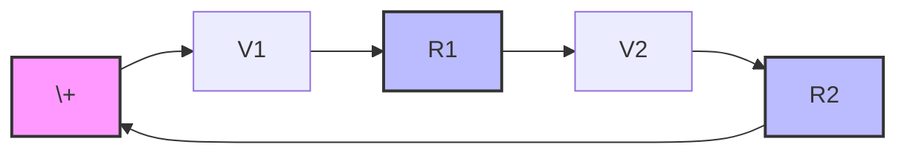

**KCL આકૃતિ:**

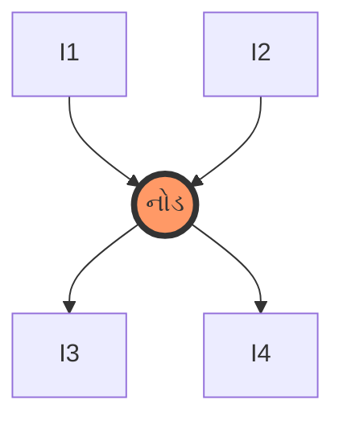

**મુખ્ય મુદ્દાઓ:**

- **KVL**: બીજગણિતીય સરવાળો વોલ્ટેજ પોલેરિટી ધ્યાનમાં રાખે છે
- **KCL**: કરંટની દિશાઓ ધ્યાનમાં રાખે છે (આવતો વિ જતો)
- **ઉપયોગિતા**: સર્કિટ વિશ્લેષણ, અજાણા મૂલ્યો શોધવા

**મેમરી ટ્રીક:** "વોલ્ટેજ લૂપ્સ, કરંટ નોડ્સ" (KVL લૂપ માટે, KCL નોડ માટે)

## પ્રશ્ન 1(ક અથવા) [7 ગુણ]

**સ્ટેટિકલી ઇન્ડ્યૂસ્ડ EMF અને ડાયનેમિકલી ઇન્ડ્યૂસ્ડ EMF વચ્ચેનો તફાવત સમજાવો.**

**જવાબ:**

**ટેબલ: સ્ટેટિક વિ ડાયનેમિક EMF**

| પેરામીટર | સ્ટેટિકલી ઇન્ડ્યૂસ્ડ EMF | ડાયનેમિકલી ઇન્ડ્યૂસ્ડ EMF |
|-----------|-------------------------|----------------------------|
| **કારણ** | બદલાતું મેગ્નેટિક ફીલ્ડ | વાહક અને ફીલ્ડ વચ્ચે સંબંધિત ગતિ |
| **ફીલ્ડ** | સમય-બદલાતું, વાહક સ્થિર | સ્થિર ફીલ્ડ, વાહક ગતિશીલ |
| **ઉદાહરણો** | ટ્રાન્સફોર્મર, ઇન્ડક્ટર | જનરેટર, મોટર |
| **સૂત્ર** | e = -N(dΦ/dt) | e = BLv |
| **ઉપયોગિતા** | AC સર્કિટ, પાવર સપ્લાય | પાવર જનરેશન, મોટર્સ |

**સ્ટેટિક EMF ના પ્રકારો:**

- **સેલ્ફ-ઇન્ડ્યૂસ્ડ**: એક જ કોઇલ ફ્લક્સ ચેન્જ બનાવે અને અનુભવે છે
- **મ્યુચ્યુઅલી ઇન્ડ્યૂસ્ડ**: એક કોઇલ બીજી કોઇલને અસર કરે છે

**ડાયનેમિક EMF ના પરિબળો:**

- **મેગ્નેટિક ફીલ્ડ સ્ટ્રેન્થ (B)**: ટેસ્લા
- **કન્ડક્ટર લેન્થ (L)**: મીટર
- **વેલોસિટી (v)**: m/s

**મેમરી ટ્રીક:** "સ્ટેટિક સ્ટેઝ, ડાયનેમિક ડાન્સ" (સ્ટેટિક = સ્થિર, ડાયનેમિક = ગતિ)

## પ્રશ્ન 2(અ) [3 ગુણ]

**ટ્રાન્સફોર્મરમાં થતાં વિવિધ પ્રકારના લોસ સમજાવો.**

**જવાબ:**

**ટેબલ: ટ્રાન્સફોર્મર લોસ**

| લોસનો પ્રકાર | કારણ | સ્થાન | લક્ષણો |
|-------------|------|--------|---------|
| **આયર્ન લોસ** | હિસ્ટેરેસિસ + એડી કરંટ | કોર | સ્થિર, ફ્રિક્વન્સી આધારિત |
| **કોપર લોસ** | I²R હીટિંગ | વાઇન્ડિંગ | લોડ સાથે બદલાતું |
| **સ્ટ્રે લોસ** | લીકેજ ફ્લક્સ | એકંદર | ન્યૂનતમ |

**આયર્ન લોસ:**

- **હિસ્ટેરેસિસ લોસ**: મેગ્નેટિક ડોમેઇન રિવર્સલ એનર્જી
- **એડી કરંટ લોસ**: કોરમાં ફરતા કરંટ

**કોપર લોસ:**

- **પ્રાઇમરી વાઇન્ડિંગ**: I₁²R₁
- **સેકન્ડરી વાઇન્ડિંગ**: I₂²R₂

**મેમરી ટ્રીક:** "આયર્ન કોર, કોપર કોઇલ" (મુખ્ય લોસનું સ્થાન)

## પ્રશ્ન 2(બ) [4 ગુણ]

**ટ્રાન્સફોર્મરનો કાર્ય સિદ્ધાંત સમજાવો.**

**જવાબ:**

**કાર્ય સિદ્ધાંત:**
સામાન્ય મેગ્નેટિક કોર દ્વારા પ્રાઇમરી અને સેકન્ડરી વાઇન્ડિંગ વચ્ચે **મ્યુચ્યુઅલ ઇલેક્ટ્રોમેગ્નેટિક ઇન્ડક્શન**.

**આકૃતિ:**

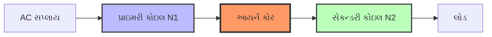

**ઓપરેશન સ્ટેપ્સ:**

- **સ્ટેપ 1**: પ્રાઇમરીમાં AC કરંટ બદલાતું ફ્લક્સ બનાવે છે
- **સ્ટેપ 2**: ફ્લક્સ કોર દ્વારા સેકન્ડરી સાથે લિંક થાય છે
- **સ્ટેપ 3**: બદલાતું ફ્લક્સ સેકન્ડરીમાં EMF ઇન્ડ્યૂસ કરે છે
- **સ્ટેપ 4**: સેકન્ડરી EMF લોડ દ્વારા કરંટ ચલાવે છે

**મુખ્ય સંબંધો:**

- **વોલ્ટેજ રેશિયો**: V₂/V₁ = N₂/N₁
- **કરંટ રેશિયો**: I₁/I₂ = N₂/N₁

**મેમરી ટ્રીક:** "પ્રાઇમરી પ્રોડ્યૂસ, સેકન્ડરી સપ્લાય" (એનર્જી ટ્રાન્સફરની દિશા)

## પ્રશ્ન 2(ક) [7 ગુણ]

**ટ્રાન્સફોર્મરનું EMF સૂત્ર તારવો.**

**જવાબ:**

**આપેલા પેરામીટર:**

- **N₁**: પ્રાઇમરી ટર્ન્સ, **N₂**: સેકન્ડરી ટર્ન્સ
- **Φₘ**: મેક્સિમમ ફ્લક્સ, **f**: ફ્રિક્વન્સી

**EMF ડેરિવેશન:**

**સ્ટેપ 1: ફ્લક્સ વેરિએશન**

```
Φ = Φₘ sin(2πft)
```

**સ્ટેપ 2: ફ્લક્સ ચેન્જનો દર**

```
dΦ/dt = 2πfΦₘ cos(2πft)
```

**સ્ટેપ 3: મેક્સિમમ રેટ**

```
(dΦ/dt)ₘₐₓ = 2πfΦₘ
```

**સ્ટેપ 4: RMS EMF સૂત્ર**

```
E₁ = 4.44 × f × N₁ × Φₘ
E₂ = 4.44 × f × N₂ × Φₘ
```

**ટેબલ: EMF સૂત્રના ભાગો**

| પ્રતીક | પેરામીટર | એકમો |
|-------|-----------|-------|
| **E** | RMS EMF | વોલ્ટ |
| **f** | ફ્રિક્વન્સી | Hz |
| **N** | ટર્ન્સની સંખ્યા | - |
| **Φₘ** | મેક્સિમમ ફ્લક્સ | વેબર |
| **4.44** | ફોર્મ ફેક્ટર કોન્સ્ટન્ટ | - |

**ટ્રાન્સફોર્મેશન રેશિયો:**

```
K = E₂/E₁ = N₂/N₁
```

**મેમરી ટ્રીક:** "ફોર-ફોર્ટી-ફોર ફ્લક્સ ફોર્મ્યુલા" (4.44 ફેક્ટર)

## પ્રશ્ન 2(અ અથવા) [3 ગુણ]

**ટ્રાન્સફોર્મરની ઉપયોગિતા સમજાવો.**

**જવાબ:**

**ટેબલ: ટ્રાન્સફોર્મર એપ્લિકેશન્સ**

| ઉપયોગિતા | હેતુ | વોલ્ટેજ લેવલ |
|----------|-----|---------------|
| **પાવર ટ્રાન્સમિશન** | ટ્રાન્સમિશન લોસ ઘટાડવા | સ્ટેપ-અપ (400kV) |
| **ડિસ્ટ્રિબ્યુશન** | ગ્રાહકો માટે સુરક્ષિત વોલ્ટેજ | સ્ટેપ-ડાઉન (230V) |
| **આઇસોલેશન** | ઇલેક્ટ્રિકલ આઇસોલેશન | 1:1 રેશિયો |
| **ઇલેક્ટ્રોનિક સર્કિટ** | DC પાવર સપ્લાય | સ્ટેપ-ડાઉન |

**ઇન્ડસ્ટ્રિયલ એપ્લિકેશન્સ:**

- **વેલ્ડિંગ ટ્રાન્સફોર્મર**: હાઇ કરંટ, લો વોલ્ટેજ
- **ઇન્સ્ટ્રુમેન્ટ ટ્રાન્સફોર્મર**: મેઝરમેન્ટ અને પ્રોટેક્શન
- **ઓડિયો ટ્રાન્સફોર્મર**: ઇમ્પીડન્સ મેચિંગ

**મેમરી ટ્રીક:** "પાવર ડિસ્ટ્રિબ્યુશન આઇસોલેશન ઇલેક્ટ્રોનિક્સ" (મુખ્ય એપ્લિકેશન વિસ્તારો)

## પ્રશ્ન 2(બ અથવા) [4 ગુણ]

**DC મોટર માટે બેક EMF અને ટોર્કનું સૂત્ર લખો.**

**જવાબ:**

**બેક EMF સૂત્ર:**

```
Eb = (φ × Z × N × P) / (60 × A)
```

**સરળ સ્વરૂપ:**

```
Eb = K × φ × N
```

**ટોર્ક સૂત્ર:**

```
T = (φ × Z × Ia × P) / (2π × A)
```

**સરળ સ્વરૂપ:**

```
T = K × φ × Ia
```

**ટેબલ: પ્રતીકોની વ્યાખ્યા**

| પ્રતીક | પેરામીટર | એકમો |
|--------|-----------|-------|
| **Eb** | બેક EMF | વોલ્ટ |
| **T** | ટોર્ક | N-m |
| **φ** | ફ્લક્સ પર પોલ | વેબર |
| **N** | સ્પીડ | RPM |
| **Ia** | આર્મેચર કરંટ | એમ્પિયર |
| **K** | મોટર કોન્સ્ટન્ટ | - |

**મેમરી ટ્રીક:** "બેક EMF વિરોધ કરે, ટોર્ક પ્રસ્તાવિત કરે" (EMF સપ્લાયનો વિરોધ, ટોર્ક રોટેશન ચલાવે)

## પ્રશ્ન 2(ક અથવા) [7 ગુણ]

**DC મોટરની રચના અને કાર્ય પદ્ધતિ આકૃતિ સાથે સમજાવો.**

**જવાબ:**

**રચનાના ભાગો:**

**ટેબલ: DC મોટરના પાર્ટ્સ**

| કોમ્પોનન્ટ | કાર્ય | મટીરિયલ |
|-----------|------|----------|
| **સ્ટેટર** | મેગ્નેટિક ફીલ્ડ પ્રદાન કરે છે | કાસ્ટ આયર્ન/સ્ટીલ |
| **રોટર/આર્મેચર** | ફરતો ભાગ | સિલિકોન સ્ટીલ લેમિનેશન્સ |
| **કોમ્યુટેટર** | કરંટ દિશા બદલવા | કોપર સેગમેન્ટ્સ |
| **બ્રશેસ** | કરંટ સંગ્રહ | કાર્બન |
| **ફીલ્ડ વાઇન્ડિંગ** | ઇલેક્ટ્રોમેગ્નેટ | કોપર વાયર |

**રચના આકૃતિ:**

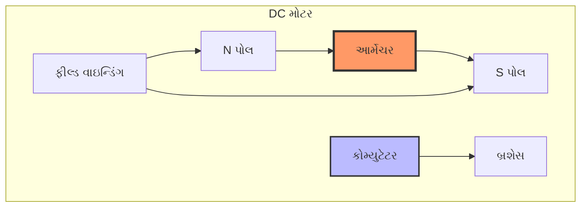

**કાર્ય સિદ્ધાંત:**

- **સ્ટેપ 1**: આર્મેચર કન્ડક્ટર દ્વારા કરંટ પસાર થાય છે
- **સ્ટેપ 2**: મેગ્નેટિક ફીલ્ડ કરંટ સાથે ઇન્ટરેક્ટ થાય છે
- **સ્ટેપ 3**: ફ્લેમિંગના ડાબા હાથના નિયમ દ્વારા બળ પેદા થાય છે
- **સ્ટેપ 4**: કોમ્યુટેટર કરંટની દિશા બદલે છે
- **સ્ટેપ 5**: સતત રોટેશન જાળવાય છે

**બળનું સૂત્ર:**

```
F = B × I × L
```

**મેમરી ટ્રીક:** "કરંટ ક્રિએટ્સ સર્ક્યુલર મોશન" (કરંટ ઇન્ટરેક્શન રોટેશન પેદા કરે છે)

## પ્રશ્ન 3(અ) [3 ગુણ]

**ટ્રાન્સફોર્મરની રચના સમજાવો.**

**જવાબ:**

**ટેબલ: ટ્રાન્સફોર્મર કન્સ્ટ્રક્શન**

| કોમ્પોનન્ટ | મટીરિયલ | કાર્ય |
|-----------|----------|------|
| **કોર** | સિલિકોન સ્ટીલ લેમિનેશન્સ | મેગ્નેટિક ફ્લક્સ પાથ |
| **પ્રાઇમરી વાઇન્ડિંગ** | કોપર/એલ્યુમિનિયમ | ઇનપુટ એનર્જી |
| **સેકન્ડરી વાઇન્ડિંગ** | કોપર/એલ્યુમિનિયમ | આઉટપુટ એનર્જી |
| **ઇન્સ્યુલેશન** | વાર્નિશ/પેપર | ઇલેક્ટ્રિકલ આઇસોલેશન |
| **ટાંકી** | સ્ટીલ | ઓઇલ કન્ટેઇનમેન્ટ અને કૂલિંગ |

**કોરના પ્રકારો:**

- **શેલ ટાઇપ**: વાઇન્ડિંગ કોર દ્વારા ઘેરાયેલું
- **કોર ટાઇપ**: કોર વાઇન્ડિંગ દ્વારા ઘેરાયેલો

**કૂલિંગ મેથડ્સ:**

- **એર કૂલિંગ**: નાના ટ્રાન્સફોર્મર
- **ઓઇલ કૂલિંગ**: મોટા ટ્રાન્સફોર્મર રેડિએટર સાથે

**મેમરી ટ્રીક:** "કોર કેરીઝ કરંટ કેરફુલી" (કોર ડિઝાઇનનું મહત્વ)

## પ્રશ્ન 3(બ) [4 ગુણ]

**DC મોટરની ઉપયોગિતા સમજાવો.**

**જવાબ:**

**ટેબલ: DC મોટર એપ્લિકેશન્સ**

| મોટરનો પ્રકાર | સ્પીડ લક્ષણ | ઉપયોગિતા |
|-------------|-------------|----------|
| **શન્ટ** | સ્થિર સ્પીડ | ફેન, પંપ, લેથ |
| **સિરીઝ** | બદલાતી સ્પીડ | ટ્રેક્શન, ક્રેન |
| **કમ્પાઉન્ડ** | મધ્યમ વેરિએશન | એલિવેટર, કોમ્પ્રેસર |

**ઇન્ડસ્ટ્રિયલ એપ્લિકેશન્સ:**

- **શન્ટ મોટર**: મશીન ટૂલ્સ જેને સ્થિર સ્પીડ જોઇએ
- **સિરીઝ મોટર**: ઇલેક્ટ્રિક વાહનો, ભારે લોડ સ્ટાર્ટિંગ
- **કમ્પાઉન્ડ મોટર**: રોલિંગ મિલ્સ, પંચ પ્રેસ

**ફાયદાઓ:**

- **સરળ સ્પીડ કન્ટ્રોલ**: વોલ્ટેજ/ફીલ્ડ કન્ટ્રોલ
- **ઉચ્ચ સ્ટાર્ટિંગ ટોર્ક**: સિરીઝ મોટર
- **રિવર્સિબલ ઓપરેશન**: ફીલ્ડ/આર્મેચર પોલેરિટી બદલો

**મેમરી ટ્રીક:** "શન્ટ સ્ટેઝ, સિરીઝ સ્પીડ્સ" (સ્પીડ લક્ષણો)

## પ્રશ્ન 3(ક) [7 ગુણ]

**DC મોટરના વિવિધ પ્રકાર સમજાવો.**

**જવાબ:**

**ટેબલ: DC મોટર વર્ગીકરણ**

| પ્રકાર | ફીલ્ડ કનેક્શન | સ્પીડ-ટોર્ક | ઉપયોગિતા |
|------|-------------|------------|----------|
| **શન્ટ** | આર્મેચરને સમાંતર | સ્થિર સ્પીડ, નીચો સ્ટાર્ટિંગ ટોર્ક | ફેન, પંપ |
| **સિરીઝ** | આર્મેચર સાથે સિરીઝ | બદલાતી સ્પીડ, ઉચ્ચ સ્ટાર્ટિંગ ટોર્ક | ટ્રેક્શન |
| **કમ્પાઉન્ડ** | સિરીઝ અને શન્ટ બંને | મધ્યમ લક્ષણો | સામાન્ય હેતુ |

**શન્ટ મોટર આકૃતિ:**

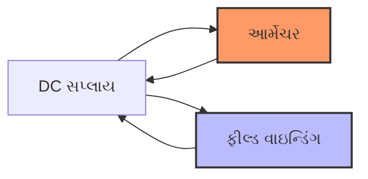

**લક્ષણો:**

- **શન્ટ**: સ્પીડ ∝ (V - IaRa)/φ
- **સિરીઝ**: ઉચ્ચ સ્ટાર્ટિંગ ટોર્ક, સ્પીડ લોડ સાથે બદલાય છે
- **કમ્પાઉન્ડ**: બંને પ્રકારના ફાયદાઓ સંયોજિત

**સ્પીડ કન્ટ્રોલ મેથડ્સ:**

- **આર્મેચર કન્ટ્રોલ**: આર્મેચર વોલ્ટેજ બદલો
- **ફીલ્ડ કન્ટ્રોલ**: ફીલ્ડ કરંટ બદલો
- **રેઝિસ્ટન્સ કન્ટ્રોલ**: બાહ્ય રેઝિસ્ટન્સ ઉમેરો

**મેમરી ટ્રીક:** "શન્ટ સ્ટેડી, સિરીઝ સ્ટ્રોંગ, કમ્પાઉન્ડ કમ્બાઇન્ડ" (મુખ્ય લક્ષણો)

## પ્રશ્ન 3(અ અથવા) [3 ગુણ]

**ટ્રાન્સફોર્મરનો ટ્રાન્સફોર્મેશન રેશિયો સમજાવો.**

**જવાબ:**

**વ્યાખ્યા:**
ટ્રાન્સફોર્મેશન રેશિયો (K) એ સેકન્ડરી અને પ્રાઇમરી વોલ્ટેજ અથવા ટર્ન્સનો રેશિયો છે.

**ગાણિતિક અભિવ્યક્તિ:**

```
K = N₂/N₁ = E₂/E₁ = V₂/V₁
```

**ટેબલ: ટ્રાન્સફોર્મેશન રેશિયોના પ્રકારો**

| રેશિયો | પ્રકાર | વોલ્ટેજ ચેન્જ | ઉપયોગિતા |
|-------|------|-------------|----------|
| **K > 1** | સ્ટેપ-અપ | વધારે છે | પાવર ટ્રાન્સમિશન |
| **K < 1** | સ્ટેપ-ડાઉન | ઘટાડે છે | ડિસ્ટ્રિબ્યુશન |
| **K = 1** | આઇસોલેશન | સમાન | સુરક્ષા આઇસોલેશન |

**કરંટ સંબંધ:**

```
I₁/I₂ = N₂/N₁ = K
```

**પાવર સંબંધ:**

```
P₁ = P₂ (આદર્શ ટ્રાન્સફોર્મર)
```

**મેમરી ટ્રીક:** "ટર્ન્સ ટેલ ટ્રાન્સફોર્મેશન" (ટર્ન્સ રેશિયો વોલ્ટેજ રેશિયો નક્કી કરે છે)

## પ્રશ્ન 3(બ અથવા) [4 ગુણ]

**ઓટો ટ્રાન્સફોર્મરની ઉપયોગિતા સમજાવો.**

**જવાબ:**

**ટેબલ: ઓટો ટ્રાન્સફોર્મર એપ્લિકેશન્સ**

| ઉપયોગિતા | ફાયદો | વોલ્ટેજ રેન્જ |
|----------|-------|--------------|
| **મોટર સ્ટાર્ટિંગ** | સ્ટાર્ટિંગ કરંટ ઘટાડે છે | રેટેડનો 50-80% |
| **વોલ્ટેજ રેગ્યુલેશન** | બારીક વોલ્ટેજ એડજસ્ટમેન્ટ | ±10% વેરિએશન |
| **લેબોરેટરી** | વેરિએબલ વોલ્ટેજ સોર્સ | ઇનપુટનો 0-110% |
| **પાવર સિસ્ટમ** | ઇકોનોમિક ટ્રાન્સમિશન | નજીકના વોલ્ટેજ રેશિયો |

**ફાયદાઓ:**

- **ઇકોનોમી**: ઓછું કોપર અને આયર્ન જરૂરી
- **એફિશિયન્સી**: બે-વાઇન્ડિંગ ટ્રાન્સફોર્મર કરતાં વધારે
- **સાઇઝ**: કોમ્પેક્ટ ડિઝાઇન
- **રેગ્યુલેશન**: બેહતર વોલ્ટેજ રેગ્યુલેશન

**મર્યાદાઓ:**

- **આઇસોલેશન નથી**: સામાન્ય ઇલેક્ટ્રિકલ કનેક્શન
- **સુરક્ષા**: વધારે ફોલ્ટ કરંટ

**મેમરી ટ્રીક:** "ઓટો એડજસ્ટ્સ એડવાન્ટેજિયસલી" (ઓટોમેટિક વોલ્ટેજ એડજસ્ટમેન્ટ ફાયદો)

## પ્રશ્ન 3(ક અથવા) [7 ગુણ]

**DC શન્ટ મોટર માટે સ્પીડ કન્ટ્રોલ કરવાની રીતો સમજાવો.**

**જવાબ:**

**ટેબલ: સ્પીડ કન્ટ્રોલ મેથડ્સ**

| મેથડ | રેન્જ | એફિશિયન્સી | ઉપયોગિતા |
|------|------|-----------|----------|
| **આર્મેચર કન્ટ્રોલ** | રેટેડ સ્પીડથી નીચે | ઉચ્ચ | પ્રિસાઇઝ સ્પીડ કન્ટ્રોલ |
| **ફીલ્ડ કન્ટ્રોલ** | રેટેડ સ્પીડથી ઉપર | ઉચ્ચ | કોન્સ્ટન્ટ પાવર ડ્રાઇવ્સ |
| **રેઝિસ્ટન્સ કન્ટ્રોલ** | રેટેડ સ્પીડથી નીચે | નીચી | સરળ એપ્લિકેશન્સ |

**આર્મેચર કન્ટ્રોલ આકૃતિ:**

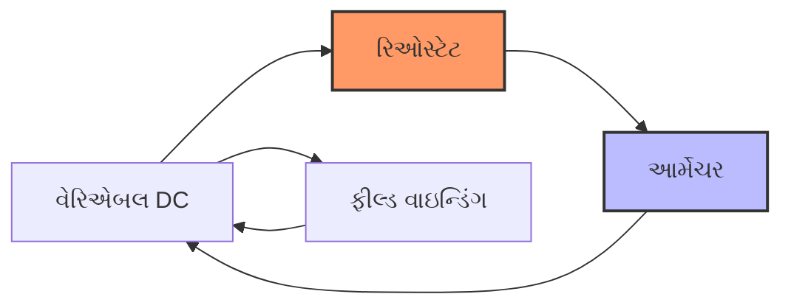

**સ્પીડ સૂત્રો:**

- **આર્મેચર કન્ટ્રોલ**: N ∝ (V - IaRa)/φ
- **ફીલ્ડ કન્ટ્રોલ**: N ∝ V/φ
- **રેઝિસ્ટન્સ કન્ટ્રોલ**: N ∝ (V - Ia(Ra + Rext))/φ

**આધુનિક મેથડ્સ:**

- **ચોપર કન્ટ્રોલ**: PWM વોલ્ટેજ કન્ટ્રોલ
- **વોર્ડ-લિયોનાર્ડ સિસ્ટમ**: મોટર-જનરેટર સેટ
- **ઇલેક્ટ્રોનિક કન્ટ્રોલ**: થાઇરિસ્ટર/IGBT ડ્રાઇવ્સ

**લક્ષણો:**

- **સ્મૂથ કન્ટ્રોલ**: સ્ટેપલેસ સ્પીડ વેરિએશન
- **એફિશિયન્સી**: આર્મેચર કન્ટ્રોલ સૌથી એફિશિયન્ટ
- **કોસ્ટ**: ફીલ્ડ કન્ટ્રોલ ઇકોનોમિકલ

**મેમરી ટ્રીક:** "આર્મેચર એક્યુરેટ, ફીલ્ડ ફાસ્ટ, રેઝિસ્ટન્સ રફ" (કન્ટ્રોલ લક્ષણો)

## પ્રશ્ન 4(અ) [3 ગુણ]

**અલ્ટરનેટિંગ EMF નું વેક્ટર નિરૂપણ સમજાવો.**

**જવાબ:**

**વેક્ટર રિપ્રેઝન્ટેશન:**
અલ્ટરનેટિંગ EMF ને સ્થિર મેગ્નિટ્યૂડ અને એંગ્યુલર વેલોસિટી સાથે ફરતા વેક્ટર (ફેઝર) તરીકે દર્શાવી શકાય છે.

**ગાણિતિક સ્વરૂપ:**

```
e = Em sin(ωt + φ)
```

**આકૃતિ:**

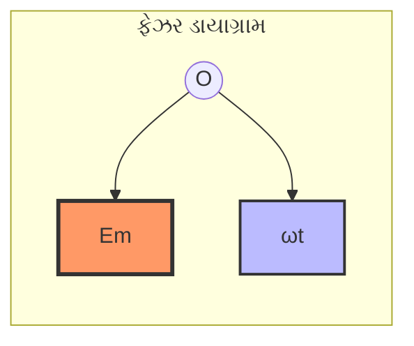

**ટેબલ: વેક્ટર પેરામીટર**

| પેરામીટર | પ્રતીક | એકમો | વર્ણન |
|-----------|--------|-------|-------|
| **મેગ્નિટ્યૂડ** | Em | વોલ્ટ | મેક્સિમમ EMF |
| **એંગ્યુલર વેલોસિટી** | ω | rad/s | રોટેશન સ્પીડ |
| **ફેઝ એંગલ** | φ | ડિગ્રી | પ્રારંભિક ફેઝ |
| **ફ્રિક્વન્સી** | f = ω/2π | Hz | સાઇકલ પર સેકન્ડ |

**ફાયદાઓ:**

- **વિઝ્યુઅલ રિપ્રેઝન્ટેશન**: ફેઝ સંબંધો સમજવા સરળ
- **ગાણિતિક સરળીકરણ**: જટિલ ગણતરીઓ સરળ બનાવે છે

**મેમરી ટ્રીક:** "વેક્ટર્સ વિઝ્યુઅલાઇઝ વોલ્ટેજ વેરિએશન" (ફેઝર રિપ્રેઝન્ટેશન ફાયદાઓ)

## પ્રશ્ન 4(બ) [4 ગુણ]

**અલ્ટરનેટિંગ કરંટના સંદર્ભમાં નીચેના પદોની વ્યાખ્યા આપો: RMS વેલ્યુ, એવરેજ વેલ્યુ, ફ્રિક્વન્સી, ટાઇમ પિરિયડ**

**જવાબ:**

**ટેબલ: AC પેરામીટર વ્યાખ્યા**

| પદ | વ્યાખ્યા | સૂત્ર | એકમો |
|----|--------|-------|-------|
| **RMS વેલ્યુ** | સમાન હીટિંગ પેદા કરતો અસરકારક મૂલ્ય | Im/√2 | એમ્પિયર |
| **એવરેજ વેલ્યુ** | અર્ધ સાઇકલ પર સરેરાશ મૂલ્ય | 2Im/π | એમ્પિયર |
| **ફ્રિક્વન્સી** | સેકન્ડ દીઠ સાઇકલની સંખ્યા | f = 1/T | Hz |
| **ટાઇમ પિરિયડ** | એક સંપૂર્ણ સાઇકલ માટેનો સમય | T = 1/f | સેકન્ડ |

**ગાણિતિક સંબંધો:**

- **ફોર્મ ફેક્ટર**: RMS/Average = π/2√2 = 1.11
- **પીક ફેક્ટર**: Peak/RMS = √2 = 1.414
- **એંગ્યુલર ફ્રિક્વન્સી**: ω = 2πf

**પ્રેક્ટિકલ વેલ્યુઝ:**

- **RMS કરંટ**: પાવર ગણતરીઓ માટે વપરાય છે
- **એવરેજ કરંટ**: DC સમકક્ષ માટે વપરાય છે
- **ફ્રિક્વન્સી**: 50 Hz (ભારત), 60 Hz (યુએસએ)

**મેમરી ટ્રીક:** "રિયલી મીન સ્ક્વેર, એવરેજ ફ્રિક્વન્સી ટાઇમ" (મુખ્ય AC પેરામીટર)

## પ્રશ્ન 4(ક) [7 ગુણ]

**સ્ટાર જોડાણમાં લાઇન વોલ્ટેજ અને ફેઇઝ વોલ્ટેજ તથા લાઇન કરંટ અને ફેઇઝ કરંટ વચ્ચેનો સંબંધ દર્શાવતા સૂત્ર તારવો.**

**જવાબ:**

**સ્ટાર કનેક્શન આકૃતિ:**

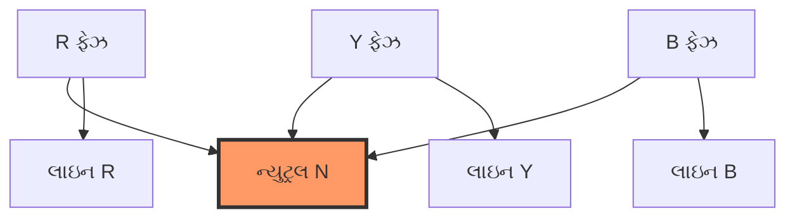

**વોલ્ટેજ સંબંધો:**

**ફેઝ વોલ્ટેજ:** VR, VY, VB (ન્યુટ્રલ સંદર્ભે)
**લાઇન વોલ્ટેજ:** VRY, VYB, VBR (લાઇન વચ્ચે)

**ફેઝર વિશ્લેષણ:**

```
VRY = VR - VY
```

**બેલેન્સ્ડ સિસ્ટમ માટે:**

- ફેઝ વોલ્ટેજ મેગ્નિટ્યૂડમાં સમાન: VR = VY = VB = Vph
- ફેઝ ડિફરન્સ = 120°

**વેક્ટર એડિશન:**
ફેઝર ડાયાગ્રામ અને કોસાઇન નિયમનો ઉપયોગ કરીને:

```
VL = √(Vph² + Vph² - 2Vph·Vph·cos(120°))
VL = √(2Vph² + Vph²) = √3 × Vph
```

**અંતિમ સંબંધો:**

**ટેબલ: સ્ટાર કનેક્શન સંબંધો**

| પેરામીટર | સંબંધ |
|-----------|-------|
| **લાઇન વોલ્ટેજ** | VL = √3 × Vph |
| **લાઇન કરંટ** | IL = Iph |
| **પાવર** | P = √3 × VL × IL × cosφ |

**કરંટ સંબંધો:**
સ્ટાર કનેક્શનમાં, લાઇન કરંટ ફેઝ કરંટ સમાન હોય છે:

```
IL = Iph
```

**મેમરી ટ્રીક:** "સ્ટાર સ્કેલ્સ વોલ્ટેજ, સેમ કરંટ" (વોલ્ટેજ માટે √3 ફેક્ટર, કરંટ અપરિવર્તિત)

## પ્રશ્ન 4(અ અથવા) [3 ગુણ]

**અલ્ટરનેટિંગ કરંટનું વેક્ટર નિરૂપણ સમજાવો.**

**જવાબ:**

**વેક્ટર રિપ્રેઝન્ટેશન:**
AC કરંટને મેગ્નિટ્યૂડ અને ફેઝ એંગલ સાથે ફરતા ફેઝર તરીકે દર્શાવાય છે.

**ગાણિતિક અભિવ્યક્તિ:**

```
i = Im sin(ωt + φ)
```

**ફેઝર ડાયાગ્રામ:**

```goat
     Im
      ↗
     /|
    / |
   /  |φ  
  O---+---→ રેફરન્સ
      ωt
```

**ટેબલ: કરંટ વેક્ટર એલિમેન્ટ્સ**

| એલિમેન્ટ | પ્રતીક | વર્ણન |
|----------|--------|-------|
| **મેગ્નિટ્યૂડ** | Im | પીક કરંટ વેલ્યુ |
| **ફેઝ** | φ | લીડિંગ/લેગિંગ એંગલ |
| **એંગ્યુલર વેલોસિટી** | ω | રોટેશન સ્પીડ |
| **RMS વેલ્યુ** | I = Im/√2 | અસરકારક કરંટ |

**ઉપયોગિતા:**

- **સર્કિટ વિશ્લેષણ**: વોલ્ટેજ અને કરંટ વચ્ચે ફેઝ સંબંધો
- **પાવર ગણતરીઓ**: રિયલ અને રિએક્ટિવ પાવર કોમ્પોનન્ટ્સ

**મેમરી ટ્રીક:** "કરંટ સર્કલ્સ કન્ટિન્યુઅસલી" (ફરતા ફેઝર કન્સેપ્ટ)

## પ્રશ્ન 4(બ અથવા) [4 ગુણ]

**અલ્ટરનેટિંગ કરંટના સંદર્ભમાં નીચેના પદોની વ્યાખ્યા આપો: ફોર્મ ફેક્ટર, પીક ફેક્ટર, કોણીય વેગ, એમ્પ્લિટ્યૂડ**

**જવાબ:**

**ટેબલ: AC કરંટ પેરામીટર**

| પદ | વ્યાખ્યા | સૂત્ર | સામાન્ય મૂલ્ય |
|----|--------|-------|----------------|
| **ફોર્મ ફેક્ટર** | RMS/Average વેલ્યુ રેશિયો | Irms/Iavg | 1.11 (સાઇન વેવ) |
| **પીક ફેક્ટર** | Peak/RMS વેલ્યુ રેશિયો | Im/Irms | 1.414 (સાઇન વેવ) |
| **એંગ્યુલર વેલોસિટી** | ફેઝ ચેન્જનો દર | ω = 2πf | 314 rad/s (50Hz) |
| **એમ્પ્લિટ્યૂડ** | મેક્સિમમ ઇન્સ્ટન્ટેનિયસ વેલ્યુ | Im | પીક કરંટ |

**ગાણિતિક સંબંધો:**

- **ફોર્મ ફેક્ટર**: વેવફોર્મ શેપ દર્શાવે છે
- **પીક ફેક્ટર**: ક્રેસ્ટ ફેક્ટર દર્શાવે છે
- **એંગ્યુલર વેલોસિટી**: ફ્રિક્વન્સી અને ફેઝ લિંક કરે છે
- **એમ્પ્લિટ્યૂડ**: RMS અને એવરેજ વેલ્યુઝ નક્કી કરે છે

**પ્રેક્ટિકલ મહત્વ:**

- **ડિઝાઇન વિચારણાઓ**: ઇન્સ્યુલેશન માટે પીક ફેક્ટર
- **વેવફોર્મ વિશ્લેષણ**: ડિસ્ટોર્શન માટે ફોર્મ ફેક્ટર
- **સિંક્રોનાઇઝેશન**: ટાઇમિંગ માટે એંગ્યુલર વેલોસિટી

**મેમરી ટ્રીક:** "ફોર્મ પીક એંગ્યુલર એમ્પ્લિટ્યૂડ" (ચાર મુખ્ય ફેક્ટર)

## પ્રશ્ન 4(ક અથવા) [7 ગુણ]

**ડેલ્ટા જોડાણમાં લાઇન વોલ્ટેજ અને ફેઇઝ વોલ્ટેજ તથા લાઇન કરંટ અને ફેઇઝ કરંટ વચ્ચેનો સંબંધ દર્શાવતા સૂત્ર તારવો.**

**જવાબ:**

**ડેલ્ટા કનેક્શન આકૃતિ:**

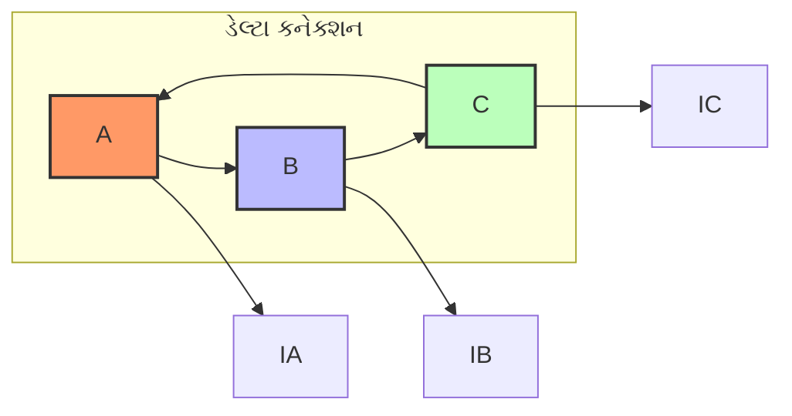

**વોલ્ટેજ સંબંધો:**
ડેલ્ટા કનેક્શનમાં, લાઇન વોલ્ટેજ ફેઝ વોલ્ટેજ સમાન હોય છે:

```
VL = Vph
```

**કરંટ વિશ્લેષણ:**
દરેક લાઇન કરંટ બે ફેઝ કરંટનો વેક્ટર સમ છે.

**લાઇન કરંટ IA માટે:**

```
IA = IAB - ICA
```

**ફેઝર વિશ્લેષણ:**
બેલેન્સ્ડ સિસ્ટમ માટે ફેઝ કરંટ મેગ્નિટ્યૂડમાં સમાન:

- IAB = ICA = ICB = Iph
- કરંટ વચ્ચે ફેઝ ડિફરન્સ = 120°

**વેક્ટર સબટ્રેક્શન:**

```
IA = IAB - ICA = IAB - (-ICA)
```

ફેઝર ડાયાગ્રામનો ઉપયોગ કરીને:

```
IL = √(Iph² + Iph² - 2Iph·Iph·cos(60°))
IL = √(2Iph² - Iph²) = √3 × Iph
```

**અંતિમ સંબંધો:**

**ટેબલ: ડેલ્ટા કનેક્શન સંબંધો**

| પેરામીટર | સંબંધ |
|-----------|-------|
| **લાઇન વોલ્ટેજ** | VL = Vph |
| **લાઇન કરંટ** | IL = √3 × Iph |
| **પાવર** | P = √3 × VL × IL × cosφ |

**મેમરી ટ્રીક:** "ડેલ્ટા ડબલ્સ કરંટ, સેમ વોલ્ટેજ" (કરંટ માટે √3 ફેક્ટર, વોલ્ટેજ અપરિવર્તિત)

## પ્રશ્ન 5(અ) [3 ગુણ]

**શુદ્ધ અવરોધ ધરાવતા પરિપથ માંથી અલ્ટરનેટિંગ કરંટની વર્તણૂક જરૂરી આકૃતિ અને વેવફોર્મ સાથે સમજાવો.**

**જવાબ:**

**સર્કિટ આકૃતિ:**

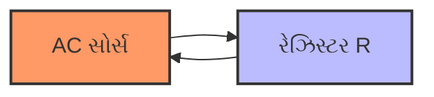

**વેવફોર્મ:**

```goat
    V,I
     ↑
     |    /\      /\
     |   /  \    /  \
     |  /    \  /    \
  ---+--------\/------\/-→ t
     |        /\      /
     |       /  \    /
     |      /    \  /
     
  V અને I સમાન ફેઝમાં
```

**ટેબલ: રેઝિસ્ટર દ્વારા AC**

| પેરામીટર | સંબંધ | ફેઝ |
|-----------|-------|-----|
| **ઓહમનો નિયમ** | V = IR | સમાન ફેઝ |
| **પાવર** | P = VI = I²R | હંમેશા પોઝિટિવ |
| **ઇમ્પીડન્સ** | Z = R | શુદ્ધ રેઝિસ્ટિવ |

**લક્ષણો:**

- **કરંટ અને વોલ્ટેજ સમાન ફેઝમાં**: કોઈ ફેઝ ડિફરન્સ નથી
- **પાવર વપરાશ**: સતત પાવર ડિસિપેશન
- **રેઝિસ્ટન્સ અપરિવર્તિત**: DC વેલ્યુ સમાન

**મેમરી ટ્રીક:** "રેઝિસ્ટર રિફ્યુઝ ફેઝ શિફ્ટ" (કોઈ ફેઝ ડિફરન્સ નથી)

## પ્રશ્ન 5(બ) [4 ગુણ]

**અલ્ટરનેટિંગ કરંટના સંદર્ભમાં નીચેના પદોની વ્યાખ્યા આપો: ઇમ્પીડન્સ, ફેઝ એંગલ, પાવર ફેક્ટર, રિએક્ટિવ પાવર**

**જવાબ:**

**ટેબલ: AC સર્કિટ પેરામીટર**

| પદ | વ્યાખ્યા | સૂત્ર | એકમો |
|----|--------|-------|-------|
| **ઇમ્પીડન્સ** | AC કરંટનો કુલ વિરોધ | Z = √(R² + X²) | ઓહ્મ |
| **ફેઝ એંગલ** | V અને I વચ્ચેનો કોણ | φ = tan⁻¹(X/R) | ડિગ્રી |
| **પાવર ફેક્ટર** | ફેઝ એંગલનો કોસાઇન | PF = cosφ = R/Z | - |
| **રિએક્ટિવ પાવર** | રિએક્ટિવ કોમ્પોનન્ટમાં પાવર | Q = VI sinφ | VAR |

**પાવર સંબંધો:**

- **એક્ટિવ પાવર**: P = VI cosφ (વોટ)
- **રિએક્ટિવ પાવર**: Q = VI sinφ (VAR)
- **એપેરન્ટ પાવર**: S = VI (VA)

**પાવર ત્રિકોણ:**

```
S² = P² + Q²
```

**પ્રેક્ટિકલ મહત્વ:**

- **ઉચ્ચ પાવર ફેક્ટર**: કાર્યક્ષમ પાવર ઉપયોગ
- **નીચો પાવર ફેક્ટર**: સમાન પાવર માટે વધારે કરંટ
- **રિએક્ટિવ પાવર**: કોઈ નેટ એનર્જી ટ્રાન્સફર નથી

**મેમરી ટ્રીક:** "ઇમ્પીડન્સ ફેઝ પાવર ક્વાડ્રેચર" (ચાર મુખ્ય AC પેરામીટર)

## પ્રશ્ન 5(ક) [7 ગુણ]

**જુદા જુદા પ્રકારના પ્રોટેક્ટિવ ડિવાઇસના નામ લખો અને કોઈ પણ એક પ્રોટેક્ટિવ ડિવાઇસની રચના તથા કાર્ય વિસ્તારથી સમજાવો.**

**જવાબ:**

**ટેબલ: પ્રોટેક્ટિવ ડિવાઇસ**

| ડિવાઇસ | પ્રોટેક્શન વિરુદ્ધ | ઉપયોગિતા |
|--------|-------------------|----------|
| **ફ્યુઝ** | ઓવરકરંટ | લો/મિડિયમ વોલ્ટેજ |
| **MCB** | ઓવરલોડ, શોર્ટ સર્કિટ | ઘરેલું/કોમર્શિયલ |
| **ELCB** | અર્થ લીકેજ | સુરક્ષા પ્રોટેક્શન |
| **રિલે** | વિવિધ ફોલ્ટ | ઇન્ડસ્ટ્રિયલ સિસ્ટમ |
| **સર્જ એરેસ્ટર** | ઓવરવોલ્ટેજ | ટ્રાન્સમિશન લાઇન |

**MCB (મિનિએચર સર્કિટ બ્રેકર) - વિગતવાર સમજૂતી:**

**રચના:**

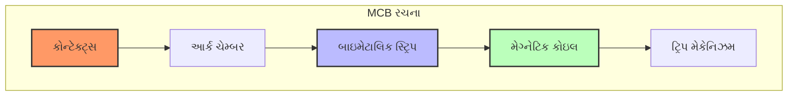

**કોમ્પોનન્ટ્સ:**

- **ફિક્સ્ડ અને મૂવિંગ કોન્ટેક્ટ્સ**: કરંટ વહન કરતા ભાગો
- **બાઇમેટાલિક સ્ટ્રિપ**: થર્મલ પ્રોટેક્શન
- **ઇલેક્ટ્રોમેગ્નેટિક કોઇલ**: મેગ્નેટિક પ્રોટેક્શન
- **આર્ક ક્વેન્ચિંગ ચેમ્બર**: આર્ક એક્સ્ટિન્કશન
- **ઓપરેટિંગ મેકેનિઝમ**: મેન્યુઅલ/ઓટોમેટિક ઓપરેશન

**કાર્ય સિદ્ધાંત:**

**ઓવરલોડ પ્રોટેક્શન:**

- કરંટ બાઇમેટાલિક સ્ટ્રિપ ગરમ કરે છે
- સ્ટ્રિપ વળે છે અને ટ્રિપ મેકેનિઝમ ઓપરેટ કરે છે
- ટેમ્પરરી ઓવરલોડ્સ વિરુદ્ધ પ્રોટેક્શન માટે ટાઇમ-ડિલે લક્ષણ

**શોર્ટ સર્કિટ પ્રોટેક્શન:**

- ઉચ્ચ ફોલ્ટ કરંટ મજબૂત મેગ્નેટિક ફીલ્ડ બનાવે છે
- ઇલેક્ટ્રોમેગ્નેટિક ફોર્સ ટ્રિપ મેકેનિઝમ ઓપરેટ કરે છે
- સુરક્ષા માટે ઇન્સ્ટન્ટેનિયસ ઓપરેશન

**ફાયદાઓ:**

- **પુનઃઉપયોગ**: ફોલ્ટ ક્લિયરન્સ પછી રીસેટ
- **વિશ્વસનીય ઓપરેશન**: ડ્યુઅલ પ્રોટેક્શન મેકેનિઝમ
- **સરળ મેન્ટેનન્સ**: સુલભ કોન્ટેક્ટ્સ

**મેમરી ટ્રીક:** "MCB મેગ્નેટિકલી કન્ટ્રોલ્સ બોથ" (થર્મલ અને મેગ્નેટિક પ્રોટેક્શન)

## પ્રશ્ન 5(અ અથવા) [3 ગુણ]

**શુદ્ધ ઇન્ડક્ટર ધરાવતા પરિપથ માંથી અલ્ટરનેટિંગ કરંટની વર્તણૂક સમજાવો.**

**જવાબ:**

**આપેલ:** L ઇન્ડક્ટન્સ સાથે શુદ્ધ ઇન્ડક્ટર, લાગુ વોલ્ટેજ v = Vm sin(ωt)

**વોલ્ટેજ-કરંટ સંબંધ:**

```
v = L × (di/dt)
```

**લાગુ વોલ્ટેજ સબસ્ટિટ્યૂટ કરીને:**

```
Vm sin(ωt) = L × (di/dt)
```

**ઇન્ટીગ્રેશન:**

```
di = (Vm/L) sin(ωt) dt
i = -(Vm/ωL) cos(ωt) + C
```

**સ્ટેડી સ્ટેટમાં, C = 0:**

```
i = -(Vm/ωL) cos(ωt)
i = (Vm/ωL) sin(ωt - 90°)
```

**ટેબલ: શુદ્ધ ઇન્ડક્ટર લક્ષણો**

| પેરામીટર | મૂલ્ય | ફેઝ સંબંધ |
|-----------|------|------------|
| **કરંટ એમ્પ્લિટ્યૂડ** | Im = Vm/ωL | કરંટ વોલ્ટેજથી 90° પાછળ |
| **ઇન્ડક્ટિવ રિએક્ટન્સ** | XL = ωL = 2πfL | ફ્રિક્વન્સી આધારિત |
| **પાવર** | P = 0 (એવરેજ) | કોઈ નેટ પાવર વપરાશ નથી |

**મેમરી ટ્રીક:** "ઇન્ડક્ટર ઇમ્પીડ્સ, કરંટ લેગ્સ" (XL કરંટનો વિરોધ, 90° લેગ)

## પ્રશ્ન 5(બ અથવા) [4 ગુણ]

**AC સર્કિટમાં પાવર અને પાવર ટ્રાયએંગલ સમજાવો.**

**જવાબ:**

**પાવરના પ્રકારો:**

**ટેબલ: AC પાવર કોમ્પોનન્ટ્સ**

| પાવરનો પ્રકાર | પ્રતીક | સૂત્ર | એકમો | વર્ણન |
|-------------|--------|-------|-------|-------|
| **એક્ટિવ પાવર** | P | VI cosφ | વોટ | ઉપયોગી પાવર |
| **રિએક્ટિવ પાવર** | Q | VI sinφ | VAR | પરિભ્રમણ પાવર |
| **એપેરન્ટ પાવર** | S | VI | VA | કુલ પાવર |

**પાવર ત્રિકોણ:**

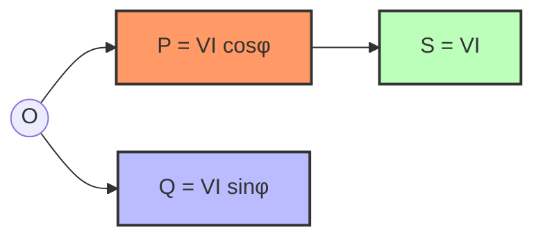

**ગાણિતિક સંબંધો:**

```
S² = P² + Q²
Power Factor = P/S = cosφ
```

**મહત્વ:**

- **એક્ટિવ પાવર**: ઉપયોગી કાર્ય કરે છે (હીટિંગ, મિકેનિકલ)
- **રિએક્ટિવ પાવર**: મેગ્નેટિક/ઇલેક્ટ્રિક ફીલ્ડ જાળવે છે
- **પાવર ફેક્ટર**: કાર્યક્ષમતા સૂચક

**મેમરી ટ્રીક:** "પાવર ટ્રાયએંગલ: પ્લીઝ ક્વાલિફાય સ્ટુડન્ટ્સ" (P, Q, S કોમ્પોનન્ટ્સ)

## પ્રશ્ન 5(ક અથવા) [7 ગુણ]

**એક લેમ્પને એક જગ્યાએથી કન્ટ્રોલ કરવો તેમજ દાદર માટેનું વાયરિંગ ડાયાગ્રામ સાથે સમજાવો.**

**જવાબ:**

**1. એક જગ્યાએથી લેમ્પ કન્ટ્રોલ:**

**સર્કિટ આકૃતિ:**

```goat
Live ----[S]----[Lamp]----+
                          |
Neutral ------------------+

S = સિંગલ પોલ સિંગલ થ્રો સ્વિચ
```

**કોમ્પોનન્ટ્સ:**

- **SPST સ્વિચ**: સિંગલ પોલ, સિંગલ થ્રો
- **લાઇવ વાયર કન્ટ્રોલ**: સુરક્ષા માટે સ્વિચ લાઇવ વાયરમાં
- **સરળ ઓન/ઓફ**: બેસિક કન્ટ્રોલ મેકેનિઝમ

**2. સીડીનું વાયરિંગ (ટુ-વે કન્ટ્રોલ):**

**સર્કિટ આકૃતિ:**

```goat
Live ----[S1]----+----[S2]----[Lamp]----+
            \    |    /                 |
             \   |   /                  |
              \  |  /                   |
               \ | /                    |
                \|/                     |
Neutral --------------------------------+

S1, S2 = બે-દિશા સ્વિચ (SPDT)
```

**ટેબલ: સીડીના કન્ટ્રોલ માટે સ્વિચ પોઝિશન**

| S1 પોઝિશન | S2 પોઝિશન | લેમ્પ સ્ટેટસ |
|------------|------------|------------|
| **ઉપર** | ઉપર | ચાલુ |
| **ઉપર** | નીચે | બંધ |
| **નીચે** | ઉપર | બંધ |
| **નીચે** | નીચે | ચાલુ |

**કાર્ય સિદ્ધાંત:**

- **બે-દિશા સ્વિચ**: SPDT (સિંગલ પોલ ડબલ થ્રો)
- **કોમન ટર્મિનલ**: લાઇવ અને લેમ્પ સાથે જોડાયેલું
- **સ્ટ્રેપર્સ**: સ્વિચો વચ્ચે લિંક
- **ટોગલ એક્શન**: કોઈ પણ સ્વિચ લેમ્પ કન્ટ્રોલ કરી શકે છે

**ઉપયોગિતા:**

- **સીડીની લાઇટિંગ**: ઉપર અને નીચેથી કન્ટ્રોલ
- **લાંબા કોરિડોર**: બંને છેડેથી કન્ટ્રોલ
- **બેડરૂમ લાઇટિંગ**: બેડ અને દરવાજાથી કન્ટ્રોલ

**ફાયદાઓ:**

- **સુવિધા**: અનેક સ્થળોએથી કન્ટ્રોલ
- **એનર્જી સેવિંગ**: સરળ સ્વિચિંગ વેસ્ટેજ ઘટાડે છે
- **સુરક્ષા**: અંધારામાં ચાલવાની જરૂર નથી

**ઇન્સ્ટોલેશન પોઇન્ટ્સ:**

- **યોગ્ય અર્થિંગ**: તમામ મેટલ પાર્ટ્સ અર્થ કરેલા
- **કેબલ રેટિંગ**: પર્યાપ્ત કરંટ કેપેસિટી
- **સ્વિચ ઊંચાઈ**: ફ્લોરથી સ્ટાન્ડર્ડ 4 ફૂટ

**મેમરી ટ્રીક:** "ટુ-વે ટોગલ્સ, ટુ પ્લેસિસ" (બે સ્વિચ, બે સ્થળો)
