## Question 1(a) [3 marks]

**Explain ohm's law with its limitation and application.**

**Answer:**

**Table: Ohm's Law Summary**

| Aspect | Description |
|--------|------------|
| **Statement** | Current through conductor is directly proportional to voltage |
| **Formula** | V = I × R |
| **Units** | V (Volts), I (Amperes), R (Ohms) |

**Limitations:**

- **Temperature dependency**: Resistance changes with temperature
- **Non-linear materials**: Does not apply to semiconductors, diodes
- **AC circuits**: Modified form needed for reactive components

**Applications:**

- **Circuit analysis**: Calculate unknown voltage, current, or resistance
- **Power calculations**: P = V²/R, P = I²R

**Mnemonic:** "Voltage Is Really Important" (V = I × R)

## Question 1(b) [4 marks]

**Explain faraday's law of electromagnetic induction with necessary figure.**

**Answer:**

**Faraday's Laws:**

- **First Law**: EMF is induced when magnetic flux changes through conductor
- **Second Law**: Magnitude of EMF equals rate of flux change

**Mathematical Expression:**

```
e = -N × (dΦ/dt)
```

**Diagram:**

```goat
    +-------+
    |   N   |  Coil with N turns
    |       |
    +---+---+
        |
        |  Moving magnet
    +---v---+
    | S | N |  
    +-------+
       ↕
   Motion direction
```

**Applications:**

- **Transformers**: Mutual induction principle
- **Generators**: Mechanical to electrical energy conversion
- **Inductors**: Self-induced EMF opposes current changes

**Mnemonic:** "Flux Change Generates EMF" (dΦ/dt = EMF)

## Question 1(c) [7 marks]

**Explain kirchhoff's voltage law and kirchhoff's current law with necessary diagram.**

**Answer:**

**Table: Kirchhoff's Laws Comparison**

| Law | Statement | Mathematical Form | Application |
|-----|-----------|-------------------|-------------|
| **KVL** | Sum of voltages in closed loop = 0 | ΣV = 0 | Series circuits |
| **KCL** | Sum of currents at node = 0 | ΣI = 0 | Parallel circuits |

**KVL Diagram:**

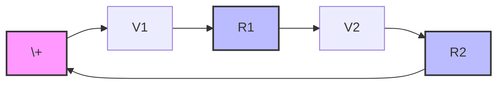

**KCL Diagram:**

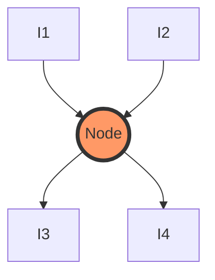

**Key Points:**

- **KVL**: Algebraic sum considers voltage polarities
- **KCL**: Considers current directions (incoming vs outgoing)
- **Applications**: Circuit analysis, finding unknown values

**Mnemonic:** "Voltage Loops, Current Nodes" (KVL for loops, KCL for nodes)

## Question 1(c OR) [7 marks]

**Differentiate statically induced emf and dynamically induced emf**

**Answer:**

**Table: Static vs Dynamic EMF**

| Parameter | Statically Induced EMF | Dynamically Induced EMF |
|-----------|------------------------|-------------------------|
| **Cause** | Changing magnetic field | Relative motion between conductor and field |
| **Field** | Time-varying, conductor stationary | Steady field, conductor moving |
| **Examples** | Transformer, inductor | Generator, motor |
| **Formula** | e = -N(dΦ/dt) | e = BLv |
| **Applications** | AC circuits, power supplies | Power generation, motors |

**Static EMF Types:**

- **Self-induced**: Same coil creates and experiences flux change
- **Mutually induced**: One coil affects another coil

**Dynamic EMF Factors:**

- **Magnetic field strength (B)**: Tesla
- **Conductor length (L)**: Meters  
- **Velocity (v)**: m/s

**Mnemonic:** "Static Stays, Dynamic Dances" (Static = stationary, Dynamic = motion)

## Question 2(a) [3 marks]

**Explain various types of losses in transformer.**

**Answer:**

**Table: Transformer Losses**

| Loss Type | Cause | Location | Characteristics |
|-----------|--------|----------|-----------------|
| **Iron Loss** | Hysteresis + Eddy currents | Core | Constant, frequency dependent |
| **Copper Loss** | I²R heating | Windings | Variable with load |
| **Stray Loss** | Leakage flux | Overall | Minimal |

**Iron Losses:**

- **Hysteresis loss**: Magnetic domain reversal energy
- **Eddy current loss**: Circulating currents in core

**Copper Losses:**

- **Primary winding**: I₁²R₁
- **Secondary winding**: I₂²R₂

**Mnemonic:** "Iron Core, Copper Coil" (Location of main losses)

## Question 2(b) [4 marks]

**Explain working principle of transformer.**

**Answer:**

**Working Principle:**
**Mutual electromagnetic induction** between primary and secondary windings through common magnetic core.

**Diagram:**


**Operation Steps:**

- **Step 1**: AC current in primary creates alternating flux
- **Step 2**: Flux links secondary through core
- **Step 3**: Changing flux induces EMF in secondary
- **Step 4**: Secondary EMF drives current through load

**Key Relations:**

- **Voltage ratio**: V₂/V₁ = N₂/N₁
- **Current ratio**: I₁/I₂ = N₂/N₁

**Mnemonic:** "Primary Produces, Secondary Supplies" (Energy transfer direction)

## Question 2(c) [7 marks]

**Derive emf equation of transformer.**

**Answer:**

**Given Parameters:**

- **N₁**: Primary turns, **N₂**: Secondary turns
- **Φₘ**: Maximum flux, **f**: Frequency

**EMF Derivation:**

**Step 1: Flux Variation**

```
Φ = Φₘ sin(2πft)
```

**Step 2: Rate of Flux Change**

```
dΦ/dt = 2πfΦₘ cos(2πft)
```

**Step 3: Maximum Rate**

```
(dΦ/dt)ₘₐₓ = 2πfΦₘ
```

**Step 4: RMS EMF Formula**

```
E₁ = 4.44 × f × N₁ × Φₘ
E₂ = 4.44 × f × N₂ × Φₘ
```

**Table: EMF Equation Components**

| Symbol | Parameter | Units |
|--------|-----------|-------|
| **E** | RMS EMF | Volts |
| **f** | Frequency | Hz |
| **N** | Number of turns | - |
| **Φₘ** | Maximum flux | Weber |
| **4.44** | Form factor constant | - |

**Transformation Ratio:**

```
K = E₂/E₁ = N₂/N₁
```

**Mnemonic:** "Four-Forty-Four Flux Formula" (4.44 factor)

## Question 2(a OR) [3 marks]

**Write application of transformer.**

**Answer:**

**Table: Transformer Applications**

| Application | Purpose | Voltage Level |
|-------------|---------|---------------|
| **Power transmission** | Reduce transmission losses | Step-up (400kV) |
| **Distribution** | Safe voltage for consumers | Step-down (230V) |
| **Isolation** | Electrical isolation | 1:1 ratio |
| **Electronic circuits** | DC power supplies | Step-down |

**Industrial Applications:**

- **Welding transformers**: High current, low voltage
- **Instrument transformers**: Measurement and protection
- **Audio transformers**: Impedance matching

**Mnemonic:** "Power Distribution Isolation Electronics" (Main application areas)

## Question 2(b OR) [4 marks]

**Write equation for back emf and torque of D.C motor.**

**Answer:**

**Back EMF Equation:**

```
Eb = (φ × Z × N × P) / (60 × A)
```

**Simplified Form:**

```
Eb = K × φ × N
```

**Torque Equation:**

```
T = (φ × Z × Ia × P) / (2π × A)
```

**Simplified Form:**

```
T = K × φ × Ia
```

**Table: Symbol Definitions**

| Symbol | Parameter | Units |
|--------|-----------|-------|
| **Eb** | Back EMF | Volts |
| **T** | Torque | N-m |
| **φ** | Flux per pole | Weber |
| **N** | Speed | RPM |
| **Ia** | Armature current | Amperes |
| **K** | Motor constant | - |

**Mnemonic:** "Back EMF opposes, Torque proposes" (EMF opposes supply, torque drives rotation)

## Question 2(c OR) [7 marks]

**Explain construction and working of D.C. motor with necessary figure**

**Answer:**

**Construction Components:**

**Table: DC Motor Parts**

| Component | Function | Material |
|-----------|----------|----------|
| **Stator** | Provides magnetic field | Cast iron/steel |
| **Rotor/Armature** | Rotating part | Silicon steel laminations |
| **Commutator** | Current direction reversal | Copper segments |
| **Brushes** | Current collection | Carbon |
| **Field windings** | Electromagnets | Copper wire |

**Construction Diagram:**

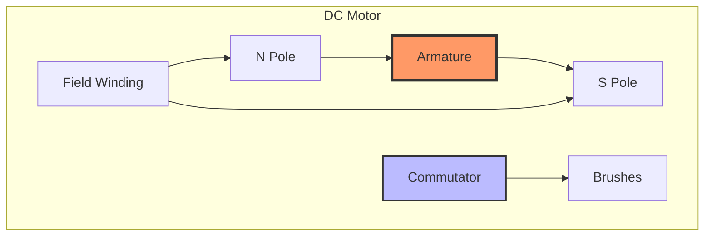

**Working Principle:**

- **Step 1**: Current flows through armature conductors
- **Step 2**: Magnetic field interacts with current
- **Step 3**: Force generated by Fleming's left-hand rule
- **Step 4**: Commutator reverses current direction
- **Step 5**: Continuous rotation maintained

**Force Equation:**

```
F = B × I × L
```

**Mnemonic:** "Current Creates Circular motion" (Current interaction produces rotation)

## Question 3(a) [3 marks]

**Explain construction of transformer.**

**Answer:**

**Table: Transformer Construction**

| Component | Material | Function |
|-----------|----------|----------|
| **Core** | Silicon steel laminations | Magnetic flux path |
| **Primary winding** | Copper/Aluminum | Input energy |
| **Secondary winding** | Copper/Aluminum | Output energy |
| **Insulation** | Varnish/Paper | Electrical isolation |
| **Tank** | Steel | Oil containment & cooling |

**Core Types:**

- **Shell type**: Windings surrounded by core
- **Core type**: Core surrounded by windings

**Cooling Methods:**

- **Air cooling**: Small transformers
- **Oil cooling**: Large transformers with radiators

**Mnemonic:** "Core Carries Current Carefully" (Core design importance)

## Question 3(b) [4 marks]

**Explain application of DC motor**

**Answer:**

**Table: DC Motor Applications**

| Motor Type | Speed Characteristic | Applications |
|------------|---------------------|--------------|
| **Shunt** | Constant speed | Fans, pumps, lathes |
| **Series** | Variable speed | Traction, cranes |
| **Compound** | Moderate variation | Elevators, compressors |

**Industrial Applications:**

- **Shunt motors**: Machine tools requiring constant speed
- **Series motors**: Electric vehicles, starting heavy loads
- **Compound motors**: Rolling mills, punch presses

**Advantages:**

- **Easy speed control**: Voltage/field control
- **High starting torque**: Series motors
- **Reversible operation**: Change field/armature polarity

**Mnemonic:** "Shunt Stays, Series Speeds" (Speed characteristics)

## Question 3(c) [7 marks]

**Explain different types of DC motor.**

**Answer:**

**Table: DC Motor Classification**

| Type | Field Connection | Speed-Torque | Applications |
|------|------------------|--------------|-------------|
| **Shunt** | Parallel to armature | Constant speed, low starting torque | Fans, pumps |
| **Series** | Series with armature | Variable speed, high starting torque | Traction |
| **Compound** | Both series & shunt | Moderate characteristics | General purpose |

**Shunt Motor Diagram:**

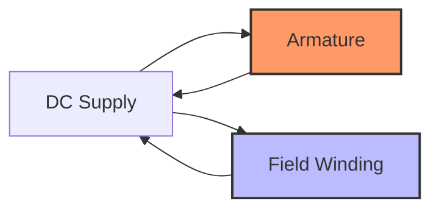

**Characteristics:**

- **Shunt**: Speed ∝ (V - IaRa)/φ
- **Series**: High starting torque, speed varies with load
- **Compound**: Combines advantages of both types

**Speed Control Methods:**

- **Armature control**: Vary armature voltage
- **Field control**: Vary field current
- **Resistance control**: Add external resistance

**Mnemonic:** "Shunt Steady, Series Strong, Compound Combined" (Key characteristics)

## Question 3(a OR) [3 marks]

**Explain transformation ratio of transformer.**

**Answer:**

**Definition:**
Transformation ratio (K) is the ratio of secondary to primary voltage or turns.

**Mathematical Expression:**

```
K = N₂/N₁ = E₂/E₁ = V₂/V₁
```

**Table: Transformation Ratio Types**

| Ratio | Type | Voltage Change | Applications |
|-------|------|----------------|-------------|
| **K > 1** | Step-up | Increases | Power transmission |
| **K < 1** | Step-down | Decreases | Distribution |
| **K = 1** | Isolation | Same | Safety isolation |

**Current Relationship:**

```
I₁/I₂ = N₂/N₁ = K
```

**Power Relationship:**

```
P₁ = P₂ (Ideal transformer)
```

**Mnemonic:** "Turns Tell Transformation" (Turns ratio determines voltage ratio)

## Question 3(b OR) [4 marks]

**Write application of autotransformer.**

**Answer:**

**Table: Autotransformer Applications**

| Application | Advantage | Voltage Range |
|-------------|-----------|---------------|
| **Motor starting** | Reduced starting current | 50-80% of rated |
| **Voltage regulation** | Fine voltage adjustment | ±10% variation |
| **Laboratory** | Variable voltage source | 0-110% of input |
| **Power systems** | Economic transmission | Close voltage ratios |

**Advantages:**

- **Economy**: Less copper and iron required
- **Efficiency**: Higher than two-winding transformer
- **Size**: Compact design
- **Regulation**: Better voltage regulation

**Limitations:**

- **No isolation**: Common electrical connection
- **Safety**: Higher fault current

**Mnemonic:** "Auto Adjusts Advantageously" (Automatic voltage adjustment benefit)

## Question 3(c OR) [7 marks]

**Explain speed control of DC shunt motor**

**Answer:**

**Table: Speed Control Methods**

| Method | Range | Efficiency | Applications |
|--------|--------|------------|-------------|
| **Armature control** | Below rated speed | High | Precise speed control |
| **Field control** | Above rated speed | High | Constant power drives |
| **Resistance control** | Below rated speed | Low | Simple applications |

**Armature Control Diagram:**

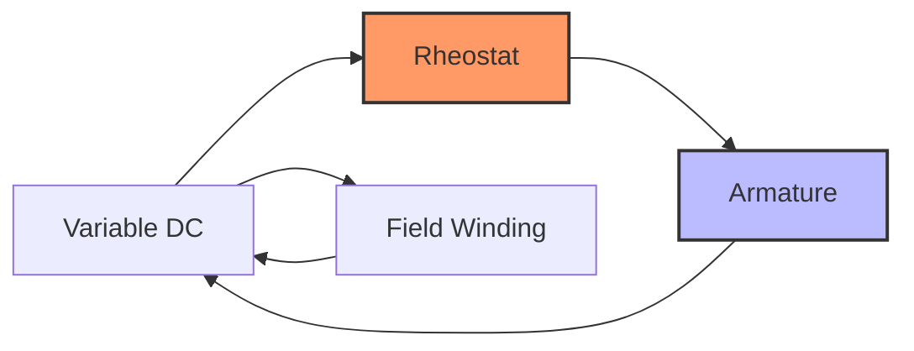

**Speed Equations:**

- **Armature control**: N ∝ (V - IaRa)/φ
- **Field control**: N ∝ V/φ
- **Resistance control**: N ∝ (V - Ia(Ra + Rext))/φ

**Modern Methods:**

- **Chopper control**: PWM voltage control
- **Ward-Leonard system**: Motor-generator set
- **Electronic control**: Thyristor/IGBT drives

**Characteristics:**

- **Smooth control**: Stepless speed variation
- **Efficiency**: Armature control most efficient
- **Cost**: Field control economical

**Mnemonic:** "Armature Accurate, Field Fast, Resistance Rough" (Control characteristics)

## Question 4(a) [3 marks]

**Explain vector representation of alternating EMF.**

**Answer:**

**Vector Representation:**
Alternating EMF can be represented as a rotating vector (phasor) with constant magnitude and angular velocity.

**Mathematical Form:**

```
e = Em sin(ωt + φ)
```

**Diagram:**

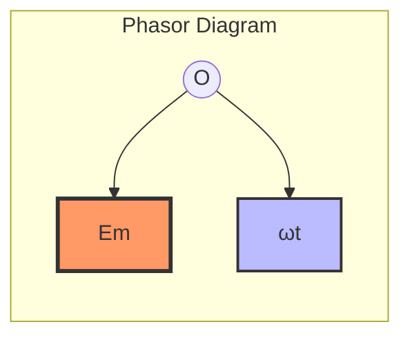

**Table: Vector Parameters**

| Parameter | Symbol | Units | Description |
|-----------|--------|-------|-------------|
| **Magnitude** | Em | Volts | Maximum EMF |
| **Angular velocity** | ω | rad/s | Rotation speed |
| **Phase angle** | φ | Degrees | Initial phase |
| **Frequency** | f = ω/2π | Hz | Cycles per second |

**Advantages:**

- **Visual representation**: Easy to understand phase relationships
- **Mathematical simplification**: Complex calculations made easier

**Mnemonic:** "Vectors Visualize Voltage Variation" (Phasor representation benefits)

## Question 4(b) [4 marks]

**Define following terms w.r.t Alternating current: RMS value, Average value, Frequency, Time period**

**Answer:**

**Table: AC Parameters Definition**

| Term | Definition | Formula | Units |
|------|------------|---------|-------|
| **RMS Value** | Effective value producing same heating | Im/√2 | Amperes |
| **Average Value** | Mean value over half cycle | 2Im/π | Amperes |
| **Frequency** | Number of cycles per second | f = 1/T | Hz |
| **Time Period** | Time for one complete cycle | T = 1/f | Seconds |

**Mathematical Relations:**

- **Form Factor**: RMS/Average = π/2√2 = 1.11
- **Peak Factor**: Peak/RMS = √2 = 1.414
- **Angular frequency**: ω = 2πf

**Practical Values:**

- **RMS current**: Used for power calculations
- **Average current**: Used for DC equivalent
- **Frequency**: 50 Hz (India), 60 Hz (USA)

**Mnemonic:** "Really Mean Square, Average Frequency Time" (Key AC parameters)

## Question 4(c) [7 marks]

**Derive equation for relation between line and phase voltage and current in star connection**

**Answer:**

**Star Connection Diagram:**

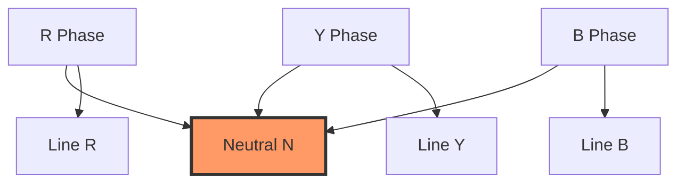

**Voltage Relations:**

**Phase Voltages:** VR, VY, VB (with respect to neutral)
**Line Voltages:** VRY, VYB, VBR (between lines)

**Phasor Analysis:**

```
VRY = VR - VY
```

**For balanced system:**

- Phase voltages are equal in magnitude: VR = VY = VB = Vph
- Phase difference = 120°

**Vector Addition:**
Using phasor diagram and cosine rule:

```
VL = √(Vph² + Vph² - 2Vph·Vph·cos(120°))
VL = √(2Vph² + Vph²) = √3 × Vph
```

**Final Relations:**

**Table: Star Connection Relations**

| Parameter | Relationship |
|-----------|-------------|
| **Line Voltage** | VL = √3 × Vph |
| **Line Current** | IL = Iph |
| **Power** | P = √3 × VL × IL × cosφ |

**Current Relations:**
In star connection, line current equals phase current:

```
IL = Iph
```

**Mnemonic:** "Star Scales Voltage, Same current" (√3 factor for voltage, current unchanged)

## Question 4(a OR) [3 marks]

**Explain vector representation of alternating current.**

**Answer:**

**Vector Representation:**
AC current represented as rotating phasor with magnitude and phase angle.

**Mathematical Expression:**

```
i = Im sin(ωt + φ)
```

**Phasor Diagram:**

```goat
     Im
      ↗
     /|
    / |
   /  |φ  
  O---+---→ Reference
      ωt
```

**Table: Current Vector Elements**

| Element | Symbol | Description |
|---------|--------|-------------|
| **Magnitude** | Im | Peak current value |
| **Phase** | φ | Leading/lagging angle |
| **Angular velocity** | ω | Rotation speed |
| **RMS value** | I = Im/√2 | Effective current |

**Applications:**

- **Circuit analysis**: Phase relationships between voltage and current
- **Power calculations**: Real and reactive power components

**Mnemonic:** "Current Circles Continuously" (Rotating phasor concept)

## Question 4(b OR) [4 marks]

**Define following terms w.r.t Alternating current: Form factor, Peak factor, Angular velocity, Amplitude**

**Answer:**

**Table: AC Current Parameters**

| Term | Definition | Formula | Typical Value |
|------|------------|---------|---------------|
| **Form Factor** | RMS/Average value ratio | Irms/Iavg | 1.11 (sine wave) |
| **Peak Factor** | Peak/RMS value ratio | Im/Irms | 1.414 (sine wave) |
| **Angular Velocity** | Rate of phase change | ω = 2πf | 314 rad/s (50Hz) |
| **Amplitude** | Maximum instantaneous value | Im | Peak current |

**Mathematical Relations:**

- **Form factor**: Indicates waveform shape
- **Peak factor**: Shows crest factor
- **Angular velocity**: Links frequency and phase
- **Amplitude**: Determines RMS and average values

**Practical Significance:**

- **Design considerations**: Peak factors for insulation
- **Waveform analysis**: Form factors for distortion
- **Synchronization**: Angular velocity for timing

**Mnemonic:** "Form Peak Angular Amplitude" (Four key factors)

## Question 4(c OR) [7 marks]

**Derive equation for relation between line and phase voltage and current in delta connection**

**Answer:**

**Delta Connection Diagram:**

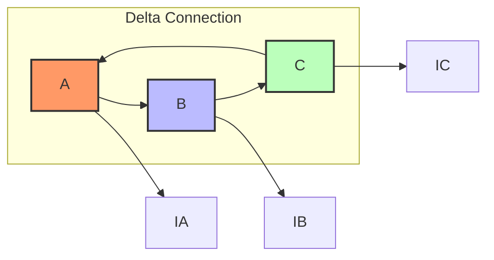

**Voltage Relations:**
In delta connection, line voltage equals phase voltage:

```
VL = Vph
```

**Current Analysis:**
Each line current is vector sum of two phase currents.

**For Line Current IA:**

```
IA = IAB - ICA
```

**Phasor Analysis:**
For balanced system with phase currents equal in magnitude:

- IAB = ICA = ICB = Iph
- Phase difference between currents = 120°

**Vector Subtraction:**

```
IA = IAB - ICA = IAB - (-ICA)
```

Using phasor diagram:

```
IL = √(Iph² + Iph² - 2Iph·Iph·cos(60°))
IL = √(2Iph² - Iph²) = √3 × Iph
```

**Final Relations:**

**Table: Delta Connection Relations**

| Parameter | Relationship |
|-----------|-------------|
| **Line Voltage** | VL = Vph |
| **Line Current** | IL = √3 × Iph |
| **Power** | P = √3 × VL × IL × cosφ |

**Mnemonic:** "Delta Doubles current, Same voltage" (√3 factor for current, voltage unchanged)

## Question 5(a) [3 marks]

**Explain AC through pure resistor with necessary circuit and waveform.**

**Answer:**

**Circuit Diagram:**

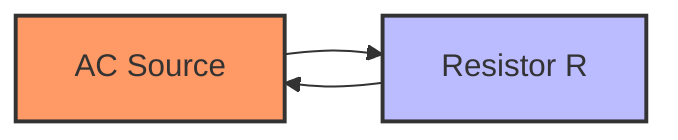

**Waveform:**

```goat
    V,I
     ↑
     |    /\      /\
     |   /  \    /  \
     |  /    \  /    \
  ---+--------\/------\/-→ t
     |        /\      /
     |       /  \    /
     |      /    \  /
     
  V and I in phase
```

**Table: AC through Resistor**

| Parameter | Relationship | Phase |
|-----------|-------------|-------|
| **Ohm's Law** | V = IR | Same phase |
| **Power** | P = VI = I²R | Always positive |
| **Impedance** | Z = R | Purely resistive |

**Characteristics:**

- **Current and voltage in phase**: No phase difference
- **Power consumption**: Continuous power dissipation
- **Resistance unchanged**: Same as DC value

**Mnemonic:** "Resistor Refuses phase Shift" (No phase difference)

## Question 5(b) [4 marks]

**Define following terms w.r.t Alternating current: Impedance, Phase angle, Power factor, Reactive power**

**Answer:**

**Table: AC Circuit Parameters**

| Term | Definition | Formula | Units |
|------|------------|---------|-------|
| **Impedance** | Total opposition to AC current | Z = √(R² + X²) | Ohms |
| **Phase Angle** | Angle between V and I | φ = tan⁻¹(X/R) | Degrees |
| **Power Factor** | Cosine of phase angle | PF = cosφ = R/Z | - |
| **Reactive Power** | Power in reactive components | Q = VI sinφ | VAR |

**Power Relations:**

- **Active Power**: P = VI cosφ (Watts)
- **Reactive Power**: Q = VI sinφ (VAR)
- **Apparent Power**: S = VI (VA)

**Power Triangle:**

```
S² = P² + Q²
```

**Practical Significance:**

- **High power factor**: Efficient power utilization
- **Low power factor**: Higher current for same power
- **Reactive power**: No net energy transfer

**Mnemonic:** "Impedance Phase Power Quadrature" (Four key AC parameters)

## Question 5(c) [7 marks]

**Enlist different protective device and explain construction and working of any one protective device.**

**Answer:**

**Table: Protective Devices**

| Device | Protection Against | Application |
|--------|-------------------|-------------|
| **Fuse** | Overcurrent | Low/Medium voltage |
| **MCB** | Overload, Short circuit | Domestic/Commercial |
| **ELCB** | Earth leakage | Safety protection |
| **Relay** | Various faults | Industrial systems |
| **Surge arrester** | Overvoltage | Transmission lines |

**MCB (Miniature Circuit Breaker) - Detailed Explanation:**

**Construction:**

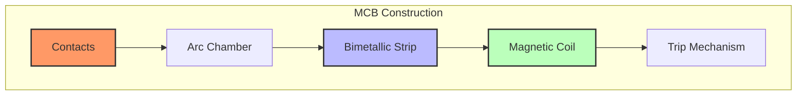

**Components:**

- **Fixed and moving contacts**: Current carrying parts
- **Bimetallic strip**: Thermal protection
- **Electromagnetic coil**: Magnetic protection
- **Arc quenching chamber**: Arc extinction
- **Operating mechanism**: Manual/automatic operation

**Working Principle:**

**Overload Protection:**

- Current heats bimetallic strip
- Strip bends and trips mechanism
- Time-delay characteristic protects against temporary overloads

**Short Circuit Protection:**

- High fault current creates strong magnetic field
- Electromagnetic force operates trip mechanism
- Instantaneous operation for safety

**Advantages:**

- **Reusable**: Reset after fault clearance
- **Reliable operation**: Dual protection mechanism
- **Easy maintenance**: Accessible contacts

**Mnemonic:** "MCB Magnetically Controls Both" (Thermal and magnetic protection)

## Question 5(a OR) [3 marks]

**Derive equation of AC current passing through pure inductor**

**Answer:**

**Given:** Pure inductor with inductance L, applied voltage v = Vm sin(ωt)

**Voltage-Current Relationship:**

```
v = L × (di/dt)
```

**Substituting applied voltage:**

```
Vm sin(ωt) = L × (di/dt)
```

**Integration:**

```
di = (Vm/L) sin(ωt) dt
i = -(Vm/ωL) cos(ωt) + C
```

**At steady state, C = 0:**

```
i = -(Vm/ωL) cos(ωt)
i = (Vm/ωL) sin(ωt - 90°)
```

**Table: Pure Inductor Characteristics**

| Parameter | Value | Phase Relationship |
|-----------|-------|-------------------|
| **Current amplitude** | Im = Vm/ωL | Current lags voltage by 90° |
| **Inductive reactance** | XL = ωL = 2πfL | Frequency dependent |
| **Power** | P = 0 (average) | No net power consumption |

**Mnemonic:** "Inductor Impedes, Current lags" (XL opposes current, 90° lag)

## Question 5(b OR) [4 marks]

**Explain concept of power and power triangle in AC circuit.**

**Answer:**

**Types of Power:**

**Table: AC Power Components**

| Power Type | Symbol | Formula | Units | Description |
|------------|--------|---------|-------|-------------|
| **Active Power** | P | VI cosφ | Watts | Useful power |
| **Reactive Power** | Q | VI sinφ | VAR | Circulating power |
| **Apparent Power** | S | VI | VA | Total power |

**Power Triangle:**

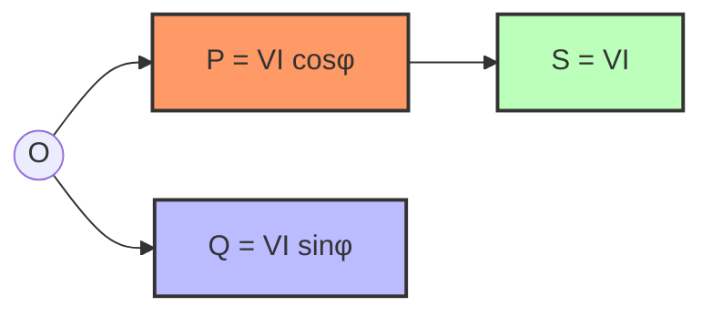

**Mathematical Relations:**

```
S² = P² + Q²
Power Factor = P/S = cosφ
```

**Significance:**

- **Active power**: Does useful work (heating, mechanical)
- **Reactive power**: Maintains magnetic/electric fields
- **Power factor**: Efficiency indicator

**Mnemonic:** "Power Triangle: Please Qualify Students" (P, Q, S components)

## Question 5(c OR) [7 marks]

**Explain wiring of lamp control from one place and staircase type.**

**Answer:**

**1. Lamp Control from One Place:**

**Circuit Diagram:**

```goat
Live ----[S]----[Lamp]----+
                          |
Neutral ------------------+

S = Single Pole Single Throw Switch
```

**Components:**

- **SPST Switch**: Single pole, single throw
- **Live wire control**: Switch in live wire for safety
- **Simple on/off**: Basic control mechanism

**2. Staircase Wiring (Two-Way Control):**

**Circuit Diagram:**

```goat
Live ----[S1]----+----[S2]----[Lamp]----+
            \    |    /                 |
             \   |   /                  |
              \  |  /                   |
               \ | /                    |
                \|/                     |
Neutral --------------------------------+

S1, S2 = Two-way switches (SPDT)
```

**Table: Switch Positions for Staircase Control**

| S1 Position | S2 Position | Lamp Status |
|-------------|-------------|-------------|
| **Up** | Up | ON |
| **Up** | Down | OFF |
| **Down** | Up | OFF |
| **Down** | Down | ON |

**Working Principle:**

- **Two-way switches**: SPDT (Single Pole Double Throw)
- **Common terminal**: Connected to live and lamp
- **Strappers**: Link switches together
- **Toggle action**: Either switch can control lamp

**Applications:**

- **Staircase lighting**: Control from top and bottom
- **Long corridors**: Control from both ends
- **Bedroom lighting**: Control from bed and door

**Advantages:**

- **Convenience**: Control from multiple locations
- **Energy saving**: Easy switching reduces wastage
- **Safety**: No need to walk in dark

**Installation Points:**

- **Proper earthing**: All metal parts earthed
- **Cable rating**: Adequate current capacity
- **Switch height**: Standard 4 feet from floor

**Mnemonic:** "Two-way Toggles, Two places" (Two switches, two locations)
