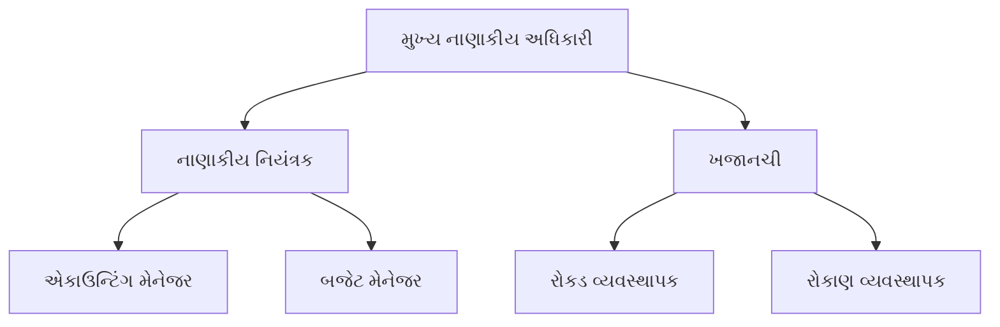

## પ્રશ્ન 1(અ) [3 ગુણ]

**ઉદ્યોગસાહસિક અને ઇન્ટ્રાપ્રિન્યોર વચ્ચેનો તફાવત સમજાવો.**

**જવાબ**:

| **પાસું** | **ઉદ્યોગસાહસિક** | **ઇન્ટ્રાપ્રિન્યોર** |
|------------|------------------|------------------|
| **વ્યાખ્યા** | નવા વ્યવસાય બનાવે છે | વર્તમાન કંપનીમાં કામ કરે છે |
| **જોખમ** | પોતાનું નાણાકીય જોખમ લે છે | મર્યાદિત જોખમ, કંપની જવાબદાર |
| **સંસાધનો** | પોતાના સંસાધનોનું આયોજન | કંપનીના સંસાધનોનો ઉપયોગ |
| **સ્વતંત્રતા** | સંપૂર્ણ સ્વતંત્રતા | કંપનીની નીતિ અનુસાર કામ |
| **ફાયદો** | બધો નફો મળે છે | પગાર અને બોનસ મળે છે |

**મેમરી ટ્રીક:** "બાહ્ય જોખમ વ્યક્તિગત સફળતા બનાવે બાંધકામ જોખમ સંસ્થાકીય સફળતા"

---

## પ્રશ્ન 1(બ) [4 ગુણ]

**ઉદ્યોગસાહસિક માટે 7-M સંસાધનો સમજાવો.**

**જવાબ**:

ઉદ્યોગસાહસિકતાની સફળતા માટે જરૂરી 7-M સંસાધનો:

| **સંસાધન** | **વિગત** |
|--------------|-----------------|
| **Men (માણસો)** | મનુષ્ય બળ અને કુશળ કર્મચારીઓ |
| **Money (પૈસા)** | નાણાકીય મૂડી અને ફંડિંગ સ્રોતો |
| **Material (સામગ્રી)** | કાચો માલ અને ભૌતિક ઇનપુટ |
| **Machine (મશીન)** | સાધનો અને ટેકનોલોજી |
| **Method (પદ્ધતિ)** | ઉત્પાદન પ્રક્રિયા અને તકનીકો |
| **Market (બજાર)** | લક્ષ્ય ગ્રાહકો અને માંગ |
| **Management (વ્યવસ્થાપન)** | નેતૃત્વ અને સંગઠનાત્મક કુશળતા |

**મેમરી ટ્રીક:** "મારા માણસો મશીન પૈસા વ્યવસ્થાપન સામગ્રી બજાર"

---

## પ્રશ્ન 1(ક) [7 ગુણ]

**સ્ટાર્ટ અપ ઇન્ડિયા યોજના હેઠળ સ્ટાર્ટ અપ તરીકે માન્યતા મેળવવા માટેની તબક્કાવાર પ્રક્રિયાનું વર્ણન કરો.**

**જવાબ**:

**તબક્કાવાર નોંધણી પ્રક્રિયા:**

**જરૂરી દસ્તાવેજો:**

- **ઇન્કોર્પોરેશન પ્રમાણપત્ર**: કંપની નોંધણીનો પુરાવો
- **પાર્ટનરશિપ ડીડ**: LLP એન્ટિટી માટે  
- **સપોર્ટ પત્ર**: ઇન્ક્યુબેટર/એક્સેલેરેટર તરફથી
- **ભલામણ પત્ર**: સરકારી સંસ્થા તરફથી
- **બિઝનેસ પ્લાન**: વિસ્તૃત વ્યવસાયિક વર્ણન

**માન્યતા પછીના મુખ્ય ફાયદા:**

- 3 વર્ષ માટે કર મુક્તિ
- પેટન્ટ નોંધણીમાં ઝડપી પ્રક્રિયા
- સરકારી ટેન્ડરમાં પ્રાધાન્ય

**મેમરી ટ્રીક:** "DPIIT સ્ટાર્ટઅપ્સને અદ્ભુત માન્યતા લાભ આપે છે"

---

## પ્રશ્ન 1(ક) અથવા [7 ગુણ]

**સૂક્ષ્મ, લઘુ અને મધ્યમ ઉદ્યોગોને વ્યાખ્યાયિત કરો. રાષ્ટ્રના આર્થિક વિકાસમાં MSME ની ભૂમિકા સમજાવો.**

**જવાબ**:

**MSME વર્ગીકરણ સારણી:**

| **શ્રેણી** | **રોકાણ મર્યાદા** | **ટર્નઓવર મર્યાદા** |
|-----------|------------------|-------------------|
| **સૂક્ષ્મ** | ₹1 કરોડ સુધી | ₹5 કરોડ સુધી |
| **લઘુ** | ₹10 કરોડ સુધી | ₹50 કરોડ સુધી |
| **મધ્યમ** | ₹50 કરોડ સુધી | ₹250 કરોડ સુધી |

**આર્થિક વિકાસમાં ભૂમિકા:**

- **રોજગાર સર્જન**: કુલ રોજગારનો 45% ભાગ બનાવે છે
- **નિકાસ યોગદાન**: કુલ નિકાસમાં 40% યોગદાન
- **GDP હિસ્સો**: ભારતની GDPમાં 30% હિસ્સો
- **નવીનતા હબ**: જમીની સ્તરે નવીનતાને પ્રોત્સાહન
- **પ્રાદેશિક સંતુલન**: શહેરી-ગ્રામ્ય અંતર ઘટાડે છે

**મેમરી ટ્રીક:** "MSME બનાવે રોજગાર, નિકાસ, GDP, નવીનતા, પ્રાદેશિક-સંતુલન"

---

## પ્રશ્ન 2(અ) [3 ગુણ]

**બિઝનેસ આઇડિયાને વ્યાખ્યાયિત કરો અને તેના વિવિધ સ્રોતોની યાદી બનાવો.**

**જવાબ**:

**બિઝનેસ આઇડિયાની વ્યાખ્યા:** બજારની તકો ઓળખીને અને ઉકેલો સૂચવીને વ્યવસાય શરૂ કરવાની કલ્પના.

**બિઝનેસ આઇડિયાના સ્રોતો:**

- **વ્યક્તિગત અનુભવ**: પોતાની કુશળતા અને રુચિઓ
- **બજારની ખાલી જગ્યા**: અપૂર્ણ ગ્રાહક જરૂરિયાતો
- **ટેકનોલોજી ટ્રેન્ડ્સ**: નવા તકનીકી વિકાસ
- **સામાજિક સમસ્યાઓ**: સમુદાયિક મુદ્દાઓ જેના ઉકેલ જોઈએ
- **ફ્રેન્ચાઇઝિંગ**: સાબિત વ્યવસાયિક મોડલ

**મેમરી ટ્રીક:** "વ્યક્તિગત બજાર ટેકનોલોજી સામાજિક ફ્રેન્ચાઇઝ"

---

## પ્રશ્ન 2(બ) [4 ગુણ]

**SWOT વિશ્લેષણ પર ટૂંકી નોંધ લખો.**

**જવાબ**:

**SWOT વિશ્લેષણના ઘટકો:**

| **આંતરિક પરિબળો** | **બાહ્ય પરિબળો** |
|---------------------|----------------------|
| **શક્તિઓ** - આંતરિક ફાયદા | **તકો** - બાહ્ય તકો |
| **નબળાઈઓ** - આંતરિક મર્યાદાઓ | **ધમકીઓ** - બાહ્ય પડકારો |

**હેતુ:**

- **વ્યૂહાત્મક આયોજન**: વ્યવસાયિક નિર્ણયોનું માર્ગદર્શન
- **જોખમ મૂલ્યાંકન**: સંભવિત સમસ્યાઓ ઓળખે છે
- **સંસાધન વિતરણ**: અસ્કયામતોનો મહત્તમ ઉપયોગ
- **સ્પર્ધાત્મક વિશ્લેષણ**: બજારની સ્થિતિ સમજે છે

**મેમરી ટ્રીક:** "મજબૂત નબળી તકો ધમકી આપે છે"

---

## પ્રશ્ન 2(ક) [7 ગુણ]

**ઉત્પાદન જીવન ચક્ર (PLC) ના વિવિધ તબક્કાઓ સમજાવો.**

**જવાબ**:

**PLC તબક્કાઓની સારણી:**

| **તબક્કો** | **લક્ષણો** | **માર્કેટિંગ વ્યૂહરચના** |
|-----------|-------------------|----------------------|
| **પરિચય** | ઓછું વેચાણ, વધારે ખર્ચ | જાગૃતિ બનાવવી |
| **વૃદ્ધિ** | ઝડપી વેચાણ વૃદ્ધિ | બજાર હિસ્સો વધારવો |
| **પરિપક્વતા** | ઉચ્ચ વેચાણ, તીવ્ર સ્પર્ધા | બજાર સ્થિતિ બચાવવી |
| **ઘટાડો** | વેચાણ અને નફામાં ઘટાડો | લાભ લેવો અથવા છોડી દેવું |

**મુખ્ય પરિબળો:**

- **વેચાણ વોલ્યુમ**: જીવનચક્ર દરમિયાન બદલાય છે
- **નફાના માર્જિન**: તબક્કા પ્રમાણે બદલાય છે
- **સ્પર્ધાનું સ્તર**: સમય સાથે વધે છે
- **માર્કેટિંગ ફોકસ**: દરેક તબક્કા સાથે બદલાય છે

**મેમરી ટ્રીક:** "પરિચય વૃદ્ધિ પરિપક્વ ઘટે છે"

---

## પ્રશ્ન 2(અ) અથવા [3 ગુણ]

**પ્રોજેક્ટ રિપોર્ટની મૂળભૂત બાબતો શું છે?**

**જવાબ**:

**મૂળભૂત ઘટકો:**

- **એક્ઝિક્યુટિવ સમરી**: પ્રોજેક્ટની સામાન્ય માહિતી અને મુખ્ય બાબતો
- **બજાર વિશ્લેષણ**: માંગ અને સ્પર્ધાનો અભ્યાસ
- **તકનીકી વિગતો**: ઉત્પાદન પ્રક્રિયા અને ટેકનોલોજી
- **નાણાકીય અંદાજો**: ખર્ચનો અંદાજ અને આવકનું આયોજન
- **જોખમ મૂલ્યાંકન**: સંભવિત પડકારો અને તેના ઉકેલો

**મેમરી ટ્રીક:** "દરેક બજાર તકનીકી નાણાકીય જોખમ"

---

## પ્રશ્ન 2(બ) અથવા [4 ગુણ]

**ઈ-કોમર્સના ફાયદા અને ગેરફાયદા સમજાવો.**

**જવાબ**:

**ઈ-કોમર્સના ફાયદા અને પડકારો:**

| **ફાયદા** | **નુકસાનો** |
|-----------|--------------|
| વૈશ્વિક પહોંચ અને 24/7 ઉપલબ્ધતા | સુરક્ષા અને ગોપનીયતાની ચિંતા |
| ઓછા ઓપરેશનલ ખર્ચ | વ્યક્તિગત સ્પર્શનો અભાવ |
| બજારમાં સરળ પ્રવેશ | ટેકનોલોજી પર નિર્ભરતા |
| બહેતર ગ્રાહક ટ્રેકિંગ | ડિલિવરી અને લોજિસ્ટિક્સની સમસ્યાઓ |

**મેમરી ટ્રીક:** "વૈશ્વિક ઓછા સરળ બહેતર બનાવે સુરક્ષા વ્યક્તિગત ટેકનોલોજી ડિલિવરી"

---

## પ્રશ્ન 2(ક) અથવા [7 ગુણ]

**બજાર સંશોધન માટે પ્રશ્નાવલી ડિઝાઇનના વિવિધ પગલાં સમજાવો.**

**જવાબ**:

**પ્રશ્નાવલી ડિઝાઇન પ્રક્રિયા:**

**પ્રશ્ન ડિઝાઇનના તબક્કાઓ:**

- **ઉદ્દેશ્ય નિર્ધારણ**: સ્પષ્ટ સંશોધન લક્ષ્યો
- **માહિતી આયોજન**: જરૂરી ડેટાના પ્રકારો
- **પ્રશ્ન ફોર્મેટિંગ**: ખુલ્લા/બંધ પ્રશ્નો
- **ભાષા પસંદગી**: સરળ અને સ્પષ્ટ
- **ક્રમ આયોજન**: તાર્કિક પ્રવાહ
- **પરીક્ષણ તબક્કો**: પાઇલટ અભ્યાસ
- **અંતિમ સમીક્ષા**: ભૂલ સુધારો

**મેમરી ટ્રીક:** "ઉદ્દેશ્ય માહિતી ફોર્મેટ ભાષા ક્રમ પરીક્ષણ સમીક્ષા"

---

## પ્રશ્ન 3(અ) [3 ગુણ]

**મેનેજમેન્ટ અને એડમિનિસ્ટ્રેશન વચ્ચે તફાવત કરો.**

**જવાબ**:

| **પાસું** | **મેનેજમેન્ટ** | **એડમિનિસ્ટ્રેશન** |
|-----------|-----------------|-------------------|
| **સ્તર** | મધ્યમ અને નીચલા સ્તરે | ઉચ્ચ સ્તરે |
| **કાર્ય** | નીતિઓનો અમલ | નીતિ ઘડતર |
| **કુશળતા** | તકનીકી અને માનવીય કુશળતા | વૈચારિક કુશળતા |
| **સત્તા** | મર્યાદિત સત્તા | અંતિમ સત્તા |

**મેમરી ટ્રીક:** "મધ્યમ અમલ તકનીકી મર્યાદિત બનાવે ઉચ્ચ નીતિ વૈચારિક અંતિમ"

---

## પ્રશ્ન 3(બ) [4 ગુણ]

**ખાનગી કંપની અને હેર કંપની વચ્ચે તફાવત કરો.**

**જવાબ**:

| **લક્ષણ** | **ખાનગી કંપની** | **હેર કંપની** |
|-----------|------------------|---------------|
| **સભ્યો** | 2 થી 200 સભ્યો | ઓછામાં ઓછા 7, મહત્તમ મર્યાદા નથી |
| **શેર ટ્રાન્સફર** | મર્યાદિત ટ્રાન્સફર | મુક્ત ટ્રાન્સફર |
| **જાહેર ઇશ્યૂ** | જાહેરમાં શેર ઇશ્યૂ કરી શકતી નથી | જાહેરમાં ઇશ્યૂ કરી શકે છે |
| **માહિતી જાહેરાત** | મર્યાદિત જાહેરાત જરૂરિયાતો | વ્યાપક જાહેરાત |

**મેમરી ટ્રીક:** "ખાનગી મર્યાદિત રાખે છે, હેર છૂટ આપે છે"

---

## પ્રશ્ન 3(ક) [7 ગુણ]

**વ્યવસાયિક પ્રથા માટે બ્રેક-ઇવન વિશ્લેષણ સમજાવો.**

**જવાબ**:

**બ્રેક-ઇવન ફોર્મ્યુલા:**
બ્રેક-ઇવન પોઇન્ટ = સ્થિર ખર્ચ ÷ (એકમ દીઠ વેચાણ કિંમત - એકમ દીઠ ચલ ખર્ચ)

**ઘટકો:**

- **સ્થિર ખર્ચ**: ભાડું, પગાર, વીમો
- **ચલ ખર્ચ**: કાચો માલ, મજૂરી
- **વેચાણ કિંમત**: એકમ દીઠ આવક
- **યોગદાન માર્જિન**: કિંમત માઈનસ ચલ ખર્ચ

**ફાયદા:**

- **નફો આયોજન**: જરૂરી ન્યૂનતમ વેચાણ નક્કી કરે છે
- **કિંમત નિર્ધારણ**: કિંમત નક્કી કરવામાં મદદ કરે છે
- **ખર્ચ નિયંત્રણ**: ખર્ચનું માળખું ઓળખે છે
- **રોકાણ નિર્ણયો**: પ્રોજેક્ટની વ્યવહારિકતા મૂલ્યાંકન કરે છે

**મેમરી ટ્રીક:** "સ્થિર ચલ વેચાણ યોગદાન બનાવે નફો કિંમત ખર્ચ રોકાણ"

---

## પ્રશ્ન 3(અ) અથવા [3 ગુણ]

**નેતૃત્વ શું છે? તેના લક્ષણો આપો.**

**જવાબ**:

**નેતૃત્વની વ્યાખ્યા:** સામાન્ય લક્ષ્યો હાંસલ કરવા તરફ અન્ય લોકોને પ્રભાવિત અને માર્ગદર્શન આપવાની ક્ષમતા.

**નેતૃત્વના લક્ષણો:**

- **દ્રષ્ટિ**: સ્પષ્ટ ભવિષ્યની દિશા
- **સંવાદ**: અસરકારક અંતર્ક્રિયા કુશળતા
- **પ્રામાણિકતા**: પ્રામાણિક અને નૈતિક વર્તન
- **આત્મવિશ્વાસ**: નિર્ણયોમાં સ્વયં-વિશ્વાસ
- **સહાનુભૂતિ**: અન્યોના દ્રષ્ટિકોણને સમજવું

**મેમરી ટ્રીક:** "દ્રષ્ટિવાન સંવાદકર્તા પ્રામાણિકતા, આત્મવિશ્વાસ, સહાનુભૂતિ સાથે"

---

## પ્રશ્ન 3(બ) અથવા [4 ગુણ]

**વ્યવસ્થાપનના કાર્યોની યાદી બનાવો અને આયોજન સમજાવો.**

**જવાબ**:

**વ્યવસ્થાપનના કાર્યો:**

- **આયોજન**: ઉદ્દેશ્યો અને વ્યૂહરચના નક્કી કરવી
- **સંગઠન**: સંસાધનો અને માળખાની વ્યવસ્થા
- **સ્ટાફિંગ**: લોકોને ભરતી અને વ્યવસ્થાપન
- **નિર્દેશન**: કર્મચારીઓને નેતૃત્વ અને પ્રેરણા
- **નિયંત્રણ**: કામગીરીની દેખરેખ અને સુધારો

**આયોજન પ્રક્રિયા:**
આયોજનમાં લક્ષ્યો નક્કી કરવા, વ્યૂહરચના વિકસાવવી અને ભવિષ્યની પ્રવૃત્તિઓ માટે કાર્ય યોજના બનાવવાનો સમાવેશ થાય છે.

**મેમરી ટ્રીક:** "લોકો સંગઠિત સ્ટાફ નિર્દેશિત નિયંત્રિત"

---

## પ્રશ્ન 3(ક) અથવા [7 ગુણ]

**જોઇન્ટ સ્ટોક કંપનીની વિશેષતાઓ સમજાવો અને તેના ફાયદા લખો.**

**જવાબ**:

**જોઇન્ટ સ્ટોક કંપનીની વિશેષતાઓ:**

| **વિશેષતા** | **વર્ણન** |
|-------------|------------|
| **અલગ કાનૂની અસ્તિત્વ** | સ્વતંત્ર કાનૂની દરજ્જો |
| **મર્યાદિત જવાબદારી** | સભ્યોની જવાબદારી મર્યાદિત |
| **હસ્તાંતરિત શેરો** | માલિકીનું સરળ હસ્તાંતરણ |
| **શાશ્વત ઉત્તરાધિકાર** | સતત અસ્તિત્વ |
| **કોમન સીલ** | સત્તાવાર હસ્તાક્ષર |

**ફાયદા:**

- **મોટી મૂડી**: પર્યાપ્ત ભંડોળ એકત્રિત કરી શકે છે
- **જોખમ વિતરણ**: મર્યાદિત જવાબદારીનું સુરક્ષા
- **વ્યવસાયિક વ્યવસ્થાપન**: કુશળ મેનેજરો
- **વિશ્વસનીયતા**: જાહેર વિશ્વાસ અને માન્યતા
- **વૃદ્ધિની તકો**: વિસ્તરણની શક્યતાઓ

**મેમરી ટ્રીક:** "અલગ મર્યાદિત હસ્તાંતરિત શાશ્વત કોમન આપે મોટી જોખમ વ્યવસાયિક વિશ્વસનીય વૃદ્ધિ"

---

## પ્રશ્ન 4(અ) [3 ગુણ]

**નવા ઉદ્યોગસાહસિક વિકાસમાં સહાય માટે કોઈપણ ત્રણ રાજ્ય અથવા રાષ્ટ્રીય સ્તરની નાણાકીય સંસ્થાઓની નોંધણી કરો.**

**જવાબ**:

**નાણાકીય સંસ્થાઓ:**

- **SIDBI**: સ્મોલ ઇન્ડસ્ટ્રીઝ ડેવલપમેન્ટ બેન્ક ઓફ ઇન્ડિયા
- **NABARD**: નેશનલ બેન્ક ફોર એગ્રિકલ્ચર એન્ડ રુરલ ડેવલપમેન્ટ
- **NSIC**: નેશનલ સ્મોલ ઇન્ડસ્ટ્રીઝ કોર્પોરેશન
- **રાજ્ય નાણાકીય નિગમો**: રાજ્ય-સ્તરીય ભંડોળ પુરવઠો
- **MUDRA**: માઇક્રો યુનિટ્સ ડેવલપમેન્ટ & રિફાઇનાન્સ એજન્સી

**મેમરી ટ્રીક:** "SIDBI NABARD NSIC રાજ્ય MUDRA"

---

## પ્રશ્ન 4(બ) [4 ગુણ]

**સ્ટાર્ટઅપ મેન્ટર શું છે? મેન્ટર રાખવાના ફાયદા શું છે?**

**જવાબ**:

**સ્ટાર્ટઅપ મેન્ટરની વ્યાખ્યા:** અનુભવી વ્યવસાયિક જે ઉદ્યોગસાહસિકોને સલાહ, કનેક્શન અને સહાયતા સાથે માર્ગદર્શન આપે છે.

**મેન્ટરશિપના ફાયદા:**

| **ફાયદો** | **વર્ણન** |
|-----------|------------|
| **અનુભવ શેરિંગ** | ભૂતકાળની ભૂલોથી શીખવું |
| **નેટવર્ક એક્સેસ** | ઉદ્યોગના કનેક્શનો |
| **વ્યૂહાત્મક માર્ગદર્શન** | વ્યવસાયિક દિશાની સલાહ |
| **કુશળતા વિકાસ** | વ્યક્તિગત વૃદ્ધિ સહાયતા |

**મેમરી ટ્રીક:** "અનુભવ નેટવર્ક વ્યૂહરચના કુશળતા"

---

## પ્રશ્ન 4(ક) [7 ગુણ]

**વિવિધ પ્રકારના નેતૃત્વ મોડલો સમજાવો.**

**જવાબ**:

**નેતૃત્વ મોડલો:**

| **મોડલ** | **લક્ષણો** | **લાગુ પાડવાનું** |
|-----------|-------------|-----------------|
| **સત્તાવાદી** | કેન્દ્રીય નિર્ણય લેવાની | કટોકટીની પરિસ્થિતિઓ |
| **લોકશાહી** | સહભાગી અભિગમ | ટીમ વાતાવરણ |
| **લેસેઝ-ફેર** | હાથ છોડીને કામ | સર્જનાત્મક પ્રોજેક્ટ્સ |
| **પરિવર્તનકારી** | પ્રેરણાદાયક નેતૃત્વ | પરિવર્તન વ્યવસ્થાપન |
| **વ્યવહારિક** | પુરસ્કાર આધારિત સિસ્ટમ | નિયમિત કામકાજ |

**પસંદગીના પરિબળો:**

- **પરિસ્થિતિ**: સંદર્ભ શૈલી નક્કી કરે છે
- **ટીમની પરિપક્વતા**: અનુભવનું સ્તર મહત્વપૂર્ણ
- **સંસ્થાકીય સંસ્કૃતિ**: કંપનીના મૂલ્યો
- **કાર્યની જટિલતા**: કામનું સ્વરૂપ

**મેમરી ટ્રીક:** "સત્તાવાદી લોકશાહી લેસેઝ પરિવર્તનકારી વ્યવહારિક સાથે પરિસ્થિતિ ટીમ સંસ્થાકીય કાર્ય"

---

## પ્રશ્ન 4(અ) અથવા [3 ગુણ]

**સ્ટાર્ટઅપ ઇન્ક્યુબેટર્સ પર ટૂંકી નોંધ લખો.**

**જવાબ**:

**સ્ટાર્ટઅપ ઇન્ક્યુબેટર્સ:** એવી સંસ્થાઓ જે પ્રારંભિક તબક્કાના સ્ટાર્ટઅપ્સને સંસાધનો, માર્ગદર્શન અને ભંડોળ સાથે સહાયતા કરે છે.

**આપવામાં આવતી સેવાઓ:**

- **ઓફિસ સ્પેસ**: સાઝી કામકાજની સુવિધાઓ
- **મેન્ટરશિપ**: નિષ્ણાત માર્ગદર્શન અને સલાહ
- **ફંડિંગ**: સીડ કેપિટલ અને રોકાણ
- **નેટવર્કિંગ**: ઉદ્યોગના કનેક્શનો
- **તાલીમ**: કુશળતા વિકાસ કાર્યક્રમો

**મેમરી ટ્રીક:** "ઓફિસ મેન્ટરશિપ ફંડિંગ નેટવર્કિંગ તાલીમ"

---

## પ્રશ્ન 4(બ) અથવા [4 ગુણ]

**IPR શું છે? તેનું મહત્વ લખો.**

**જવાબ**:

**IPR ની વ્યાખ્યા:** બૌદ્ધિક સંપત્તિ અધિકારો મનના સર્જનને સુરક્ષિત કરે છે જેમાં શોધ, ડિઝાઇન અને કલાત્મક કૃતિઓનો સમાવેશ થાય છે.

**મહત્વ:**

| **ફાયદો** | **વર્ણન** |
|-----------|------------|
| **નવીનતા સુરક્ષા** | સર્જનાત્મક વિચારોનું રક્ષણ |
| **વ્યાપારિક મૂલ્ય** | વ્યવસાયિક અસ્કયામતો બનાવે છે |
| **બજાર લાભ** | સ્પર્ધાત્મક તફાવત |
| **આવક ઉત્પાદન** | લાઇસન્સિંગની તકો |

**મેમરી ટ્રીક:** "નવીનતા વ્યાપારિક બજાર આવક"

---

## પ્રશ્ન 4(ક) અથવા [7 ગુણ]

**નાણાકીય સંગઠન વ્યવસ્થાપન વિશે ચર્ચા કરો.**

**જવાબ**:

**નાણાકીય સંગઠન માળખું:**

**મુખ્ય કાર્યો:**

- **નાણાકીય આયોજન**: બજેટ તૈયારી અને અંદાજ
- **ફંડ મેનેજમેન્ટ**: મૂડી માળખું અને તરલતા
- **જોખમ વ્યવસ્થાપન**: નાણાકીય જોખમ મૂલ્યાંકન
- **કામગીરી દેખરેખ**: નાણાકીય વિશ્લેષણ અને રિપોર્ટિંગ
- **અનુપાલન**: નિયમનકારી આવશ્યકતાઓનું પાલન
- **રોકાણ નિર્ણયો**: મૂડી વિતરણ વ્યૂહરચના

**સંગઠનાત્મક ફાયદા:**

- **સ્પષ્ટ જવાબદારી**: નિર્ધારિત ભૂમિકાઓ અને જવાબદારીઓ
- **કાર્યક્ષમ કામકાજ**: સુવ્યવસ્થિત નાણાકીય પ્રક્રિયાઓ
- **બહેતર નિયંત્રણ**: વર્ધિત નાણાકીય દેખરેખ
- **વ્યૂહાત્મક સહાયતા**: માહિતિગર નિર્ણય લેવાની

**મેમરી ટ્રીક:** "આયોજન ફંડ જોખમ કામગીરી અનુપાલન રોકાણ આપે સ્પષ્ટ કાર્યક્ષમ બહેતર વ્યૂહાત્મક"

---

## પ્રશ્ન 5(અ) [3 ગુણ]

**પ્રોજેક્ટ પ્લાનિંગ શું છે? તેના હેતુઓ લખો.**

**જવાબ**:

**પ્રોજેક્ટ પ્લાનિંગની વ્યાખ્યા:** પ્રોજેક્ટના વ્યાપ, ઉદ્દેશ્યો અને લક્ષ્યો હાંસલ કરવા માટે જરૂરી પગલાંને વ્યાખ્યાયિત કરવાની પ્રક્રિયા.

**હેતુઓ:**

- **લક્ષ્ય નિર્ધારણ**: સ્પષ્ટ ઉદ્દેશ્યની વ્યાખ્યા
- **સંસાધન વિતરણ**: સંસાધનોનો કાર્યક્ષમ ઉપયોગ
- **સમય વ્યવસ્થાપન**: શેડ્યૂલ વિકાસ
- **જોખમ ઘટાડવું**: સમસ્યાની અપેક્ષા
- **ગુણવત્તા ખાતરી**: ધોરણ જાળવણી

**મેમરી ટ્રીક:** "લક્ષ્ય સંસાધન સમય જોખમ ગુણવત્તા"

---

## પ્રશ્ન 5(બ) [4 ગુણ]

**પ્રોજેક્ટ ખર્ચ અંદાજ પર ટૂંકી નોંધ લખો.**

**જવાબ**:

**ખર્ચ અંદાજના ઘટકો:**

| **ખર્ચનો પ્રકાર** | **ઉદાહરણો** |
|------------------|--------------|
| **પ્રત્યક્ષ ખર્ચ** | સામગ્રી, મજૂરી, સાધનો |
| **અપ્રત્યક્ષ ખર્ચ** | ઓવરહેડ, પ્રશાસન |
| **સ્થિર ખર્ચ** | ભાડું, વીમો, પગાર |
| **ચલ ખર્ચ** | કાચો માલ, યુટિલિટીઝ |

**અંદાજની પદ્ધતિઓ:**

- **બોટમ-અપ**: વિસ્તૃત પ્રવૃત્તિ ખર્ચ
- **ટોપ-ડાઉન**: ઉચ્ચ-સ્તરનો અંદાજ
- **સમાન**: ઐતિહાસિક પ્રોજેક્ટ સરખામણી
- **પેરામેટ્રિક**: ગાણિતિક મોડેલો

**મેમરી ટ્રીક:** "પ્રત્યક્ષ અપ્રત્યક્ષ સ્થિર ચલ વાપરીને બોટમ ટોપ સમાન પેરામેટ્રિક"

---

## પ્રશ્ન 5(ક) [7 ગુણ]

**વ્યવસાયમાં શક્યતા વિશ્લેષણ શું છે? શક્યતા અભ્યાસમાં આવરી લેવામાં આવતા વિવિધ વિશ્લેષણ સમજાવો.**

**જવાબ**:

**શક્યતા વિશ્લેષણની વ્યાખ્યા:** અમલીકરણ પહેલાં પ્રોજેક્ટની વ્યવહારિકતાનું વ્યવસ્થિત મૂલ્યાંકન.

**શક્યતા વિશ્લેષણના પ્રકારો:**

| **વિશ્લેષણનો પ્રકાર** | **ફોકસ ક્ષેત્ર** | **મુખ્ય પ્રશ્નો** |
|------------------|---------------|-------------------|
| **તકનીકી** | ટેકનોલોજી અને પ્રક્રિયાઓ | શું તે બનાવી શકાય? |
| **આર્થિક** | નાણાકીય વ્યવહારિકતા | શું તે નફાકારક છે? |
| **બજાર** | માંગ અને સ્પર્ધા | શું તે વેચાશે? |
| **કાનૂની** | નિયમનકારી અનુપાલન | શું તે કાયદેસર છે? |
| **કામકાજી** | અમલીકરણ ક્ષમતા | શું આપણે તેનું સંચાલન કરી શકીએ? |
| **શેડ્યૂલ** | સમયની મર્યાદાઓ | શું આપણે સમયસર પહોંચાડી શકીએ? |

**ફાયદા:**

- **જોખમ ઘટાડવું**: શરૂઆતમાં સંભવિત સમસ્યાઓ ઓળખે છે
- **સંસાધન ઑપ્ટિમાઇઝેશન**: વ્યર્થ રોકાણને અટકાવે છે
- **નિર્ણય સહાયતા**: આગળ વધવા/ન વધવાના નિર્ણયો માટે ડેટા પ્રદાન કરે છે
- **હિસ્સેદારોનો વિશ્વાસ**: રોકાણકારોનો વિશ્વાસ વધારે છે

**પ્રક્રિયા પ્રવાહ:**

1. પ્રોજેક્ટનો વ્યાપ અને ઉદ્દેશ્યો વ્યાખ્યાયિત કરવા
2. વિવિધ શક્યતા વિશ્લેષણ હાથ ધરવા
3. પરિણામો અને વિકલ્પોનું મૂલ્યાંકન કરવું
4. અમલીકરણની ભલામણ કરવી

**મેમરી ટ્રીક:** "તકનીકી આર્થિક બજાર કાનૂની કામકાજી શેડ્યૂલ ઘટાડે જોખમ, ઑપ્ટિમાઇઝ સંસાધન, સહાય નિર્ણય, બનાવે વિશ્વાસ"

---

## પ્રશ્ન 5(અ) અથવા [3 ગુણ]

**નાદારી શું છે? વ્યવસાયમાં નાદારીનાં કારણો લખો.**

**જવાબ**:

**નાદારીની વ્યાખ્યા:** કાનૂની પ્રક્રિયા જ્યાં વ્યક્તિઓ અથવા વ્યવસાયો કે જેઓ દેવું ચૂકવવામાં અસમર્થ છે તેઓ લેણદારોથી રાહત માંગે છે.

**વ્યવસાયિક નાદારીના કારણો:**

- **નબળું નાણાકીય વ્યવસ્થાપન**: અપૂરતું કેશ ફ્લો નિયંત્રણ
- **બજારી સ્પર્ધા**: બજાર હિસ્સાની હાનિ
- **આર્થિક મંદી**: બાહ્ય આર્થિક પરિબળો
- **અતિ-વિસ્તરણ**: યોગ્ય આયોજન વિના ઝડપી વૃદ્ધિ
- **ઉચ્ચ દેવાનો બોજ**: વધુ પડતા ધિરાણ ખર્ચ

**મેમરી ટ્રીક:** "નબળું બજાર આર્થિક અતિ ઉચ્ચ"

---

## પ્રશ્ન 5(બ) અથવા [4 ગુણ]

**નિશ્ચિત ખર્ચ અને ચલ ખર્ચ વચ્ચેનો તફાવત જણાવો.**

**જવાબ**:

| **પાસું** | **નિશ્ચિત ખર્ચ** | **ચલ ખર્ચ** |
|-----------|------------------|---------------|
| **સ્વભાવ** | સ્થિર રહે છે | ઉત્પાદન સાથે બદલાય છે |
| **ઉદાહરણો** | ભાડું, વીમો, પગાર | કાચો માલ, મજૂરી |
| **વર્તન** | આઉટપુટથી સ્વતંત્ર | સીધા પ્રમાણમાં |
| **નિયંત્રણ** | બદલવું મુશ્કેલ | સંચાલન સરળ |

**મેમરી ટ્રીક:** "નિશ્ચિત રહે છે, ચલ બદલાય છે"

---

## પ્રશ્ન 5(ક) અથવા [7 ગુણ]

**વિવિધ વ્યવસાયિક નીતિશાસ્ત્ર અને તેમના મહત્વનું વર્ણન કરો.**

**જવાબ**:

**વ્યવસાયિક નીતિશાસ્ત્રના પ્રકારો:**

| **નીતિશાસ્ત્રનું ક્ષેત્ર** | **વર્ણન** | **પ્રથાઓ** |
|-----------------|------------|-------------|
| **કોર્પોરેટ જવાબદારી** | સમાજ પ્રત્યે કંપનીની ફરજ | CSR પ્રવૃત્તિઓ, પર્યાવરણીય કાળજી |
| **કર્મચારી સંબંધો** | કામદારો સાથે ન્યાયી વર્તન | સમાન તકો, સુરક્ષા |
| **ગ્રાહક સંબંધો** | ક્લાયન્ટ્સ સાથે પ્રામાણિક વ્યવહાર | ગુણવત્તાયુક્ત ઉત્પાદનો, ન્યાયી કિંમત |
| **સપ્લાયર સંબંધો** | નૈતિક પ્રાપ્તિ | ન્યાયી કરારો, સમયસર ચુકવણી |
| **પર્યાવરણીય નીતિશાસ્ત્ર** | ટકાઉ પ્રથાઓ | કચરો ઘટાડવો, લીલી ટેકનોલોજી |

**મહત્વ:**

- **પ્રતિષ્ઠા નિર્માણ**: સકારાત્મક બ્રાન્ડ ઇમેજ બનાવે છે
- **હિસ્સેદારોનો વિશ્વાસ**: બધા પક્ષોમાં વિશ્વાસ નિર્માણ કરે છે
- **કાનૂની અનુપાલન**: નિયમનકારી મુદ્દાઓને ટાળે છે
- **કર્મચારી પ્રેરણા**: કામના વાતાવરણમાં સુધારો
- **લાંબા ગાળાની સફળતા**: ટકાઉ વૃદ્ધિની ખાતરી
- **સ્પર્ધાત્મક લાભ**: સ્પર્ધકોથી અલગ પાડે છે

**અમલીકરણ માળખું:**

1. નૈતિક કોડ્સ અને નીતિઓ વિકસાવવી
2. કર્મચારીઓને નીતિશાસ્ત્રની તાલીમ આપવી
3. રિપોર્ટિંગ મેકેનિઝમ સ્થાપિત કરવું
4. નૈતિક પ્રથાઓનું દેખરેખ અને મૂલ્યાંકન કરવું
5. જરૂર પડ્યે સુધારાત્મક પગલાં લેવા

**વ્યવસાય માટેના ફાયદા:**

- **જોખમ વ્યવસ્થાપન**: નૈતિક કૌભાંડોને અટકાવે છે
- **ગ્રાહક વફાદારી**: સ્થાયી સંબંધો બનાવે છે
- **રોકાણકારોનો વિશ્વાસ**: નૈતિક રોકાણકારોને આકર્ષે છે
- **નિયમનકારી સહાય**: સરકાર સાથે સારા સંબંધો જાળવે છે

**મેમરી ટ્રીક:** "કોર્પોરેટ કર્મચારી ગ્રાહક સપ્લાયર પર્યાવરણીય બનાવે પ્રતિષ્ઠા વિશ્વાસ કાનૂની પ્રેરણા સફળતા સ્પર્ધાત્મક જોખમ ગ્રાહક રોકાણકાર નિયમનકારી દ્વારા"
