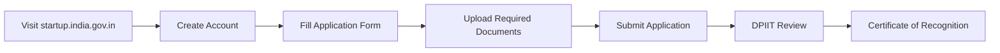
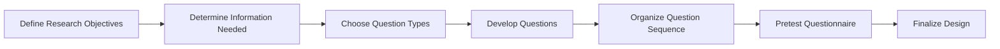
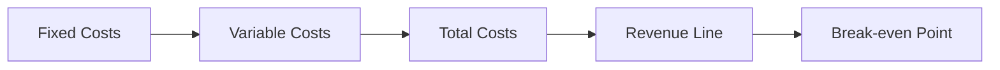
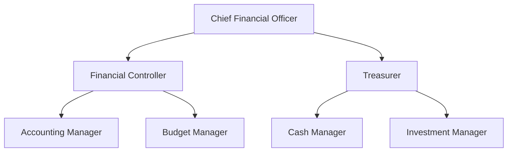

## Question 1(a) [3 marks]

**Differentiate between Entrepreneur and Intrapreneur.**

**Answer**:

| **Aspect** | **Entrepreneur** | **Intrapreneur** |
|------------|------------------|------------------|
| **Definition** | Creates new business ventures | Works within existing organization |
| **Risk** | Bears personal financial risk | Limited risk, company bears it |
| **Resources** | Arranges own resources | Uses company's resources |
| **Independence** | Complete freedom | Works under company policies |
| **Rewards** | Gets all profits | Gets salary and incentives |

**Mnemonic:** "ERIS vs IRIS" (External Risk Individual Success vs Internal Risk Institutional Success)

---

## Question 1(b) [4 marks]

**Explain 7-M resources for an Entrepreneur.**

**Answer**:

The 7-M resources essential for entrepreneurial success are:

| **Resource** | **Description** |
|--------------|-----------------|
| **Men** | Human resources and skilled workforce |
| **Money** | Financial capital and funding sources |
| **Material** | Raw materials and physical inputs |
| **Machine** | Equipment and technology needed |
| **Method** | Production processes and techniques |
| **Market** | Target customers and demand |
| **Management** | Leadership and organizational skills |

**Mnemonic:** "My Men Make Money Managing Material Markets"

---

## Question 1(c) [7 marks]

**Describe Step-by-Step procedure for recognition as Start up under Start up India Scheme.**

**Answer**:

**Step-by-Step Registration Process:**

**Required Documents:**

- **Certificate of Incorporation**: Company registration proof
- **Partnership Deed**: For LLP entities  
- **Letter of Support**: From incubator/accelerator
- **Recommendation Letter**: From government body
- **Business Plan**: Detailed venture description

**Key Benefits After Recognition:**

- Tax exemptions for 3 years
- Fast-track patent registration
- Government tender preferences

**Mnemonic:** "DPIIT Gives Startups Amazing Recognition Benefits"

---

## Question 1(c) OR [7 marks]

**Define Micro, Small and Medium Enterprise. Explain the role of MSME in the economic development of the nation.**

**Answer**:

**MSME Classification Table:**

| **Category** | **Investment Limit** | **Turnover Limit** |
|--------------|---------------------|-------------------|
| **Micro** | Up to ₹1 crore | Up to ₹5 crores |
| **Small** | Up to ₹10 crores | Up to ₹50 crores |
| **Medium** | Up to ₹50 crores | Up to ₹250 crores |

**Role in Economic Development:**

- **Employment Generation**: Creates 45% of total employment
- **Export Contribution**: Contributes 40% to total exports
- **GDP Share**: Accounts for 30% of India's GDP
- **Innovation Hub**: Promotes grassroots innovation
- **Regional Balance**: Reduces urban-rural divide

**Mnemonic:** "MSME Makes Employment, Exports, GDP, Innovation, Regional-balance"

---

## Question 2(a) [3 marks]

**Define Business idea and Enlist its various sources.**

**Answer**:

**Business Idea Definition:** A concept for starting a business venture that identifies market opportunities and proposes solutions.

**Sources of Business Ideas:**

- **Personal Experience**: Own skills and interests
- **Market Gaps**: Unmet customer needs
- **Technology Trends**: New technological developments
- **Social Problems**: Community issues needing solutions
- **Franchising**: Proven business models

**Mnemonic:** "Personal Market Technology Social Franchise"

---

## Question 2(b) [4 marks]

**Write short notes on SWOT analysis.**

**Answer**:

**SWOT Analysis Components:**

| **Internal Factors** | **External Factors** |
|---------------------|----------------------|
| **Strengths** - Internal advantages | **Opportunities** - External chances |
| **Weaknesses** - Internal limitations | **Threats** - External challenges |

**Purpose:**

- **Strategic Planning**: Guides business decisions
- **Risk Assessment**: Identifies potential problems
- **Resource Allocation**: Optimizes use of assets
- **Competitive Analysis**: Understands market position

**Mnemonic:** "Strong Weak Opportunities Threaten"

---

## Question 2(c) [7 marks]

**Explain various stages of Product Life Cycle (PLC).**

**Answer**:

**PLC Stages Table:**

| **Stage** | **Characteristics** | **Marketing Strategy** |
|-----------|-------------------|----------------------|
| **Introduction** | Low sales, high costs | Create awareness |
| **Growth** | Rapid sales increase | Build market share |
| **Maturity** | Peak sales, intense competition | Defend market position |
| **Decline** | Falling sales and profits | Harvest or divest |

**Key Factors:**

- **Sales Volume**: Changes throughout lifecycle
- **Profit Margins**: Vary by stage
- **Competition Level**: Increases over time
- **Marketing Focus**: Shifts with each stage

**Mnemonic:** "Introduction Grows Mature Declines"

---

## Question 2(a) OR [3 marks]

**What are the essentials of a Project Report?**

**Answer**:

**Essential Components:**

- **Executive Summary**: Project overview and highlights
- **Market Analysis**: Demand and competition study
- **Technical Details**: Production process and technology
- **Financial Projections**: Cost estimates and revenue forecasts
- **Risk Assessment**: Potential challenges and mitigation

**Mnemonic:** "Every Market Technical Financial Risk"

---

## Question 2(b) OR [4 marks]

**Enlist the advantages and disadvantages of e-commerce.**

**Answer**:

**E-commerce Benefits & Challenges:**

| **Advantages** | **Disadvantages** |
|----------------|-------------------|
| Global reach and 24/7 availability | Security and privacy concerns |
| Lower operational costs | Lack of personal touch |
| Easy market entry | Technology dependence |
| Better customer tracking | Delivery and logistics issues |

**Mnemonic:** "Global Low Easy Better vs Security Lack Technology Delivery"

---

## Question 2(c) OR [7 marks]

**Explain various steps of questionnaire design for Market Research.**

**Answer**:

**Questionnaire Design Process:**

**Question Design Steps:**

- **Objective Setting**: Clear research goals
- **Information Planning**: Required data types
- **Question Formatting**: Open/closed ended
- **Language Selection**: Simple and clear
- **Sequence Planning**: Logical flow
- **Testing Phase**: Pilot study
- **Final Review**: Error correction

**Mnemonic:** "Objectives Information Format Language Sequence Test Review"

---

## Question 3(a) [3 marks]

**Differentiate between Management and Administration.**

**Answer**:

| **Aspect** | **Management** | **Administration** |
|------------|----------------|-------------------|
| **Level** | Middle and lower levels | Top level |
| **Function** | Implementation of policies | Policy formulation |
| **Skills** | Technical and human skills | Conceptual skills |
| **Authority** | Limited authority | Ultimate authority |

**Mnemonic:** "Middle Implementation Technical Limited vs Top Policy Conceptual Ultimate"

---

## Question 3(b) [4 marks]

**Differentiate between Private Company and Public Company.**

**Answer**:

| **Feature** | **Private Company** | **Public Company** |
|-------------|--------------------|--------------------|
| **Members** | 2 to 200 members | Minimum 7, no maximum |
| **Share Transfer** | Restricted transfer | Free transferability |
| **Public Issue** | Cannot issue shares publicly | Can issue to public |
| **Disclosure** | Limited disclosure requirements | Extensive disclosure |

**Mnemonic:** "Private Restricts, Public Permits"

---

## Question 3(c) [7 marks]

**Explain Break-even analysis for a business practice.**

**Answer**:

**Break-even Formula:**
Break-even Point = Fixed Costs ÷ (Selling Price per unit - Variable Cost per unit)

**Components:**

- **Fixed Costs**: Rent, salaries, insurance
- **Variable Costs**: Raw materials, labor
- **Selling Price**: Revenue per unit
- **Contribution Margin**: Price minus variable cost

**Benefits:**

- **Profit Planning**: Determines minimum sales needed
- **Price Setting**: Helps in pricing decisions
- **Cost Control**: Identifies cost structure
- **Investment Decisions**: Evaluates project viability

**Mnemonic:** "Fixed Variable Selling Contribution makes Profit Price Cost Investment"

---

## Question 3(a) OR [3 marks]

**What is Leadership? Give its characteristics.**

**Answer**:

**Leadership Definition:** The ability to influence and guide others toward achieving common goals.

**Leadership Characteristics:**

- **Vision**: Clear future direction
- **Communication**: Effective interaction skills
- **Integrity**: Honest and ethical behavior
- **Confidence**: Self-assurance in decisions
- **Empathy**: Understanding others' perspectives

**Mnemonic:** "Visionary Communicators with Integrity, Confidence, Empathy"

---

## Question 3(b) OR [4 marks]

**Enlist functions of management and explain planning.**

**Answer**:

**Management Functions:**

- **Planning**: Setting objectives and strategies
- **Organizing**: Arranging resources and structure
- **Staffing**: Recruiting and managing people
- **Directing**: Leading and motivating employees
- **Controlling**: Monitoring and correcting performance

**Planning Process:**
Planning involves setting goals, developing strategies, and creating action plans for future activities.

**Mnemonic:** "People Organize Staff Direct Control"

---

## Question 3(c) OR [7 marks]

**Explain the features of a Joint Stock Company and write down its advantage.**

**Answer**:

**Joint Stock Company Features:**

| **Feature** | **Description** |
|-------------|-----------------|
| **Separate Legal Entity** | Independent legal status |
| **Limited Liability** | Members' liability is limited |
| **Transferable Shares** | Easy ownership transfer |
| **Perpetual Succession** | Continuous existence |
| **Common Seal** | Official signature |

**Advantages:**

- **Large Capital**: Can raise substantial funds
- **Risk Distribution**: Limited liability protection
- **Professional Management**: Skilled managers
- **Credibility**: Public trust and recognition
- **Growth Opportunities**: Expansion possibilities

**Mnemonic:** "Separate Limited Transferable Perpetual Common gives Large Risk Professional Credibility Growth"

---

## Question 4(a) [3 marks]

**Enlist any three State or National level Financial Institutions for support in developing new enterprise.**

**Answer**:

**Financial Institutions:**

- **SIDBI**: Small Industries Development Bank of India
- **NABARD**: National Bank for Agriculture and Rural Development
- **NSIC**: National Small Industries Corporation
- **State Financial Corporations**: State-level funding
- **MUDRA**: Micro Units Development & Refinance Agency

**Mnemonic:** "SIDBI NABARD NSIC State MUDRA"

---

## Question 4(b) [4 marks]

**What is Startup Mentor? What are the benefits of keeping Mentor.**

**Answer**:

**Startup Mentor Definition:** An experienced professional who guides entrepreneurs with advice, connections, and support.

**Benefits of Mentorship:**

| **Benefit** | **Description** |
|-------------|-----------------|
| **Experience Sharing** | Learn from past mistakes |
| **Network Access** | Industry connections |
| **Strategic Guidance** | Business direction advice |
| **Skill Development** | Personal growth support |

**Mnemonic:** "Experience Network Strategy Skills"

---

## Question 4(c) [7 marks]

**Explain different types of Leadership models.**

**Answer**:

**Leadership Models:**

| **Model** | **Characteristics** | **Application** |
|-----------|-------------------|-----------------|
| **Autocratic** | Centralized decision-making | Crisis situations |
| **Democratic** | Participative approach | Team environments |
| **Laissez-faire** | Hands-off style | Creative projects |
| **Transformational** | Inspirational leadership | Change management |
| **Transactional** | Reward-based system | Routine operations |

**Selection Factors:**

- **Situation**: Context determines style
- **Team Maturity**: Experience level matters
- **Organizational Culture**: Company values
- **Task Complexity**: Nature of work

**Mnemonic:** "Autocratic Democratic Laissez Transformational Transactional with Situation Team Organizational Task"

---

## Question 4(a) OR [3 marks]

**Write short notes on Startup Incubators.**

**Answer**:

**Startup Incubators:** Organizations that support early-stage startups with resources, mentorship, and funding.

**Services Provided:**

- **Office Space**: Shared working facilities
- **Mentorship**: Expert guidance and advice
- **Funding**: Seed capital and investment
- **Networking**: Industry connections
- **Training**: Skill development programs

**Mnemonic:** "Office Mentorship Funding Networking Training"

---

## Question 4(b) OR [4 marks]

**What is IPR? Write down its importance.**

**Answer**:

**IPR Definition:** Intellectual Property Rights protect creations of the mind including inventions, designs, and artistic works.

**Importance:**

| **Benefit** | **Description** |
|-------------|-----------------|
| **Innovation Protection** | Safeguards creative ideas |
| **Commercial Value** | Creates business assets |
| **Market Advantage** | Competitive differentiation |
| **Revenue Generation** | Licensing opportunities |

**Mnemonic:** "Innovation Commercial Market Revenue"

---

## Question 4(c) OR [7 marks]

**Discuss the Financial organization Management.**

**Answer**:

**Financial Organization Structure:**

**Key Functions:**

- **Financial Planning**: Budget preparation and forecasting
- **Fund Management**: Capital structure and liquidity
- **Risk Management**: Financial risk assessment
- **Performance Monitoring**: Financial analysis and reporting
- **Compliance**: Regulatory requirements adherence
- **Investment Decisions**: Capital allocation strategies

**Organizational Benefits:**

- **Clear Accountability**: Defined roles and responsibilities
- **Efficient Operations**: Streamlined financial processes
- **Better Control**: Enhanced financial oversight
- **Strategic Support**: Informed decision making

**Mnemonic:** "Planning Fund Risk Performance Compliance Investment gives Clear Efficient Better Strategic"

---

## Question 5(a) [3 marks]

**What is project planning? Write down its purposes.**

**Answer**:

**Project Planning Definition:** The process of defining project scope, objectives, and steps needed to achieve goals.

**Purposes:**

- **Goal Setting**: Clear objective definition
- **Resource Allocation**: Efficient use of resources
- **Time Management**: Schedule development
- **Risk Mitigation**: Problem anticipation
- **Quality Assurance**: Standard maintenance

**Mnemonic:** "Goals Resources Time Risk Quality"

---

## Question 5(b) [4 marks]

**Write short notes on Project cost estimation.**

**Answer**:

**Cost Estimation Components:**

| **Cost Type** | **Examples** |
|---------------|--------------|
| **Direct Costs** | Materials, labor, equipment |
| **Indirect Costs** | Overhead, administration |
| **Fixed Costs** | Rent, insurance, salaries |
| **Variable Costs** | Raw materials, utilities |

**Estimation Methods:**

- **Bottom-up**: Detailed activity costing
- **Top-down**: High-level approximation
- **Analogous**: Historical project comparison
- **Parametric**: Mathematical models

**Mnemonic:** "Direct Indirect Fixed Variable using Bottom Top Analogous Parametric"

---

## Question 5(c) [7 marks]

**What is feasibility analysis in business? Explain various analysis covered in feasibility study.**

**Answer**:

**Feasibility Analysis Definition:** Systematic evaluation of project viability before implementation.

**Types of Feasibility Analysis:**

| **Analysis Type** | **Focus Area** | **Key Questions** |
|-------------------|----------------|-------------------|
| **Technical** | Technology and processes | Can it be built? |
| **Economic** | Financial viability | Is it profitable? |
| **Market** | Demand and competition | Will it sell? |
| **Legal** | Regulatory compliance | Is it legal? |
| **Operational** | Implementation capability | Can we manage it? |
| **Schedule** | Time constraints | Can we deliver on time? |

**Benefits:**

- **Risk Reduction**: Identifies potential problems early
- **Resource Optimization**: Prevents wasteful investments
- **Decision Support**: Provides data for go/no-go decisions
- **Stakeholder Confidence**: Builds investor trust

**Process Flow:**

1. Define project scope and objectives
2. Conduct various feasibility analyses
3. Evaluate results and alternatives
4. Make implementation recommendation

**Mnemonic:** "Technical Economic Market Legal Operational Schedule reduces Risk, Optimizes Resources, Supports Decisions, builds Confidence"

---

## Question 5(a) OR [3 marks]

**What is bankruptcy? Write down the reasons of bankruptcy in business.**

**Answer**:

**Bankruptcy Definition:** Legal process where individuals or businesses unable to pay debts seek relief from creditors.

**Reasons for Business Bankruptcy:**

- **Poor Financial Management**: Inadequate cash flow control
- **Market Competition**: Loss of market share
- **Economic Recession**: External economic factors
- **Over-expansion**: Rapid growth without proper planning
- **High Debt Burden**: Excessive borrowing costs

**Mnemonic:** "Poor Market Economic Over High"

---

## Question 5(b) OR [4 marks]

**Distinguish between fixed cost and variable cost.**

**Answer**:

| **Aspect** | **Fixed Cost** | **Variable Cost** |
|------------|----------------|-------------------|
| **Nature** | Remains constant | Changes with production |
| **Examples** | Rent, insurance, salaries | Raw materials, labor |
| **Behavior** | Independent of output | Directly proportional |
| **Control** | Difficult to change | Easier to manage |

**Mnemonic:** "Fixed Remains, Variable Changes"

---

## Question 5(c) OR [7 marks]

**Describe various business ethics and their importance.**

**Answer**:

**Business Ethics Types:**

| **Ethics Area** | **Description** | **Practices** |
|-----------------|-----------------|---------------|
| **Corporate Responsibility** | Company's duty to society | CSR activities, environmental care |
| **Employee Relations** | Fair treatment of workers | Equal opportunities, safety |
| **Customer Relations** | Honest dealing with clients | Quality products, fair pricing |
| **Supplier Relations** | Ethical procurement | Fair contracts, timely payments |
| **Environmental Ethics** | Sustainable practices | Waste reduction, green technology |

**Importance:**

- **Reputation Building**: Creates positive brand image
- **Stakeholder Trust**: Builds confidence among all parties
- **Legal Compliance**: Avoids regulatory issues
- **Employee Motivation**: Improves workplace culture
- **Long-term Success**: Ensures sustainable growth
- **Competitive Advantage**: Differentiates from competitors

**Implementation Framework:**

1. Develop ethical codes and policies
2. Provide ethics training to employees
3. Establish reporting mechanisms
4. Monitor and evaluate ethical practices
5. Take corrective actions when needed

**Benefits for Business:**

- **Risk Management**: Prevents ethical scandals
- **Customer Loyalty**: Builds lasting relationships
- **Investor Confidence**: Attracts ethical investors
- **Regulatory Support**: Maintains good government relations

**Mnemonic:** "Corporate Employee Customer Supplier Environmental builds Reputation Trust Legal Motivation Success Competitive through Risk Customer Investor Regulatory"
