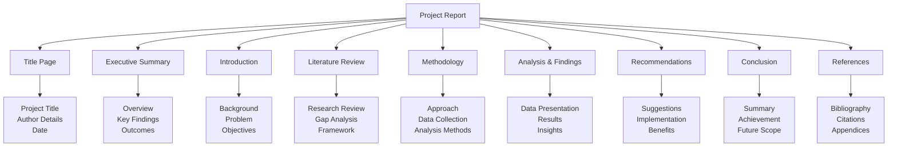

# Gujarati Translation

## પ્રશ્ન 1(અ) [3 ગુણ]

**આંત્રપ્રેન્યોરશિપ અને ઈન્ટ્રાપ્રેન્યોરશિપ વચ્ચે સરખામણી આપો.**

**જવાબ:**

| **પાસું** | **આંત્રપ્રેન્યોરશિપ** | **ઈન્ટ્રાપ્રેન્યોરશિપ** |
|----------|-------------------|---------------------|
| **વ્યાખ્યા** | પોતાનો વ્યવસાય શરૂ કરવો | હાલની સંસ્થામાં નવીનતા |
| **જોખમ** | વ્યક્તિગત નાણાકીય જોખમ | સંસ્થા જોખમ લે છે |
| **સંસાધનો** | પોતાના/ઉધાર લીધેલા | કંપની પૂરા પાડે છે |

**મેમરી ટ્રીક:** "બાહ્ય વિરુદ્ધ આંતરિક નવીનતા"

## પ્રશ્ન 1(બ) [4 ગુણ]

**ઉદ્યોગસાહસિકતાની લાક્ષણિકતાઓ અને કાર્યોની ચર્ચા કરો**

**જવાબ:**

**લાક્ષણિકતાઓ:**

- **જોખમ લેવાની ક્ષમતા**: હિસાબી વ્યાપારી જોખમો લેવાની તૈયારી
- **નવીનતા**: નવા ઉત્પાદનો, સેવાઓ અથવા પ્રક્રિયાઓ બનાવવી
- **નેતૃત્વ કુશળતા**: ટીમને માર્ગદર્શન અને પ્રેરણા આપવાની ક્ષમતા

**કાર્યો:**

- **રોજગાર સર્જન**: સમાજ માટે રોજગારની તકો બનાવવી
- **આર્થિક વિકાસ**: GDP અને રાષ્ટ્રીય વૃદ્ધિમાં યોગદાન
- **નવીનતાનું કેન્દ્ર**: નવી ટેકનોલોજી અને ઉકેલો રજૂ કરવા

**મેમરી ટ્રીક:** "જોખમ નવીનતા નેતૃત્વ રોજગાર વિકાસ નવીનતા"

## પ્રશ્ન 1(ક) [7 ગુણ]

**7-M સંસાધનોને ઓળખો અને વિગતવાર ચર્ચા કરો.**

**જવાબ:**

| **સંસાધન** | **વર્ણન** | **મહત્વ** |
|------------|-----------|-----------|
| **Man (માનવી)** | માનવ સંસાધનો અને કર્મચારીઓ | કામકાજ માટે મુખ્ય સંપત્તિ |
| **Money (પૈસા)** | નાણાકીય મૂડી અને ભંડોળ | વ્યાપારી કામકાજ માટે જરૂરી |
| **Material (સામગ્રી)** | કાચો માલ અને પુરવઠો | ઉત્પાદન આવશ્યકતાઓ |
| **Machine (મશીન)** | સાધનો અને ટેકનોલોજી | કામકાજની કાર્યક્ષમતા |
| **Method (પદ્ધતિ)** | પ્રક્રિયાઓ અને કાર્યવિધિઓ | વ્યવસ્થિત અભિગમ |
| **Market (બજાર)** | ગ્રાહક આધાર અને માંગ | આવકનું ઉત્પાદન |
| **Management (સંચાલન)** | આયોજન અને સંકલન | એકંદર વ્યાપારી નિયંત્રણ |

**મેમરી ટ્રીક:** "અનેક આધુનિક મેનેજરો પૈસા બનાવવા બજારોનું સંચાલન કરે છે"

## પ્રશ્ન 1(ક) OR [7 ગુણ]

**સ્ટાર્ટ અપ ઇન્ડિયા નોંધણી પ્રક્રિયા લખો.**

**જવાબ:**

**સ્ટાર્ટ-અપ ઇન્ડિયા નોંધણીના પગલાં:**

1. **ઓનલાઇન નોંધણી**: www.startupindia.gov.in ની મુલાકાત લો
2. **દસ્તાવેજ તૈયારી**: 
   - નિગમીકરણનું પ્રમાણપત્ર
   - એન્ટિટીનું PAN કાર્ડ
   - વ્યવસાયનું સંક્ષિપ્ત વર્ણન
3. **પાત્રતાના માપદંડો**:
   - એન્ટિટીની ઉંમર 10 વર્ષથી ઓછી
   - વાર્ષિક ટર્નઓવર ₹100 કરોડથી ઓછું
   - નવીનતા/સુધારા તરફ કામ કરવું
4. **અરજી સબમિશન**: જરૂરી દસ્તાવેજો સાથે ઓનલાઇન ફોર્મ ભરવો
5. **ચકાસણી પ્રક્રિયા**: સરકારી સમીક્ષા અને મંજૂરી
6. **પ્રમાણપત્ર આપવું**: માન્યતા પ્રમાણપત્ર પ્રાપ્ત કરવું

**ફાયદાઓ:**

- **કર મુક્તિ** સતત 3 વર્ષ માટે
- **ઝડપી પેટન્ટ** અરજી પ્રક્રિયા
- **કમ્પ્લાયન્સ ઘટાડો** લેબર અને પર્યાવરણ કાયદા હેઠળ

**મેમરી ટ્રીક:** "ઓનલાઇન દસ્તાવેજ પાત્રતા અરજી ચકાસણી પ્રમાણપત્ર ફાયદાઓ"

## પ્રશ્ન 2(અ) [3 ગુણ]

**બજાર સંશોધનની પદ્ધતિઓની સૂચિ બનાવો.**

**જવાબ:**

**પ્રાથમિક સંશોધન પદ્ધતિઓ:**

- **સર્વે**: ગ્રાહક ડેટા એકત્રિત કરવા માટે પ્રશ્નાવલી
- **ઇન્ટરવ્યુ**: લક્ષ્ય પ્રેક્ષકો સાથે સીધી વાતચીત
- **ફોકસ ગ્રુપ**: પ્રતિસાદ માટે જૂથ ચર્ચાઓ

**દ્વિતીયક સંશોધન પદ્ધતિઓ:**

- **ઓનલાઇન સંશોધન**: ઇન્ટરનેટ આધારિત ડેટા સંગ્રહ
- **પ્રકાશિત અહેવાલો**: ઉદ્યોગ વિશ્લેષણ અને અભ્યાસો
- **સરકારી ડેટા**: સત્તાવાર સ્ત્રોતોથી આંકડાકીય માહિતી

**મેમરી ટ્રીક:** "સર્વે ઇન્ટરવ્યુ ફોકસ ઓનલાઇન પ્રકાશિત સરકારી"

## પ્રશ્ન 2(બ) [4 ગુણ]

**ઉત્પાદન જીવન ચક્ર દોરો અને સમજાવો.**

**જવાબ:**

```goat
Introduction → Growth → Maturity → Decline
     |          |         |         |
   Low Sales  Rising    Peak Sales  Declining
   High Costs Profits   Saturation   Sales
```

**તબક્કાઓ:**

- **પરિચય**: ઊંચા માર્કેટિંગ ખર્ચ સાથે ઉત્પાદન લોન્ચ
- **વૃદ્ધિ**: ઝડપી વેચાણ વધારો અને બજારમાં સ્વીકૃતિ
- **પરિપક્વતા**: તીવ્ર સ્પર્ધા સાથે ટોચના વેચાણ
- **ઘટાડો**: માંગમાં ઘટાડો અને અંતે તબક્કાબંધ

**મેમરી ટ્રીક:** "હું મારા સપના વધારું છું"

## પ્રશ્ન 2(ક) [7 ગુણ]

**માર્કેટિંગના 4 P ને ઓળખો અને ચર્ચા કરો.**

**જવાબ:**

| **P** | **તત્વ** | **વર્ણન** | **મુખ્ય વિચારણાઓ** |
|-------|---------|-----------|---------------------|
| **Product (ઉત્પાદન)** | ઓફર કરવામાં આવતા માલ/સેવાઓ | લક્ષણો, ગુણવત્તા, બ્રાન્ડિંગ | ગ્રાહકની જરૂરિયાતોની સંતુષ્ટિ |
| **Price (કિંમત)** | ગ્રાહકને ખર્ચ | કિંમત વ્યૂહરચના, છૂટ | સ્પર્ધાત્મક સ્થિતિ |
| **Place (સ્થળ)** | વિતરણ ચેનલ્સ | ઉત્પાદન ક્યાં વેચાય છે | ગ્રાહકો માટે પહોંચ |
| **Promotion (પ્રમોશન)** | માર્કેટિંગ કમ્યુનિકેશન | જાહેરાત, વેચાણ પ્રમોશન | બ્રાન્ડ જાગૃતિ સર્જન |

**એકીકરણ:** અસરકારક માર્કેટિંગ વ્યૂહરચના માટે તમામ 4 P એ એકસાથે કામ કરવું પડે છે.

**મેમરી ટ્રીક:** "લોકો ઉત્પાદનો યોગ્ય રીતે ખરીદે છે"

## પ્રશ્ન 2(અ) OR [3 ગુણ]

**B2B, ઈ-કોમર્સ અને GeM ની ચર્ચા કરો.**

**જવાબ:**

| **પ્રકાર** | **સંપૂર્ણ નામ** | **વર્ણન** |
|-----------|----------------|-----------|
| **B2B** | Business to Business | કંપનીઓ વચ્ચેનો વેપાર |
| **E-commerce** | Electronic Commerce | ઓનલાઇન ખરીદી અને વેચાણ |
| **GeM** | Government e-Marketplace | સરકારી પ્રાપ્તિ પોર્ટલ |

**મુખ્ય લક્ષણો:**

- **B2B**: મોટા પ્રમાણમાં વ્યવહારો, લાંબા ગાળાના સંબંધો
- **E-commerce**: ડિજિટલ પ્લેટફોર્મ, વૈશ્વિક પહોંચ
- **GeM**: પારદર્શક સરકારી ખરીદી, સ્પર્ધાત્મક કિંમત

**મેમરી ટ્રીક:** "વ્યવસાયો ઇલેક્ટ્રોનિક રીતે ખરીદે, સરકાર ઈ-માર્કેટ"

## પ્રશ્ન 2(બ) OR [4 ગુણ]

**વ્યવસાય બનાવવા અને શરૂ કરવા માટેની યોજનાઓ પર એક નોંધ લખો**

**જવાબ:**

**વ્યાપાર સર્જન યોજનાઓ:**

**બજાર વિશ્લેષણ:**

- **લક્ષ્ય ગ્રાહકો**: પ્રાથમિક પ્રેક્ષકોને ઓળખવા
- **સ્પર્ધા અભ્યાસ**: હાલના ખેલાડીઓનું વિશ્લેષણ
- **બજારનું કદ**: સંભવિત આવકનું નિર્ધારણ

**નાણાકીય આયોજન:**

- **મૂડીની જરૂરિયાતો**: પ્રારંભિક રોકાણની જરૂર
- **આવકના અંદાજો**: અપેક્ષિત આવકના સ્ત્રોતો
- **બ્રેક-ઇવન વિશ્લેષણ**: નફાકારકતાની સમયમર્યાદા

**કામકાજનું સેટઅપ:**

- **સ્થળ પસંદગી**: વ્યૂહાત્મક સ્થિતિ
- **સંસાધન ફાળવણી**: માનવ અને ભૌતિક સંસાધનો
- **કાનૂની અનુપાલન**: લાઇસન્સ અને નોંધણીઓ

**મેમરી ટ્રીક:** "બજાર નાણા કામકાજ = વ્યાપારની સફળતા"

## પ્રશ્ન 2(ક) OR [7 ગુણ]

**જોખમ અને SWOT વિશ્લેષણની કલ્પના સમજાવો.**

**જવાબ:**

**જોખમની કલ્પના:**
જોખમ એ અનિશ્ચિતતા છે જે વ્યાપારી પરિણામોને સકારાત્મક અને નકારાત્મક બંને રીતે અસર કરી શકે છે.

**વ્યાપારિક જોખમોના પ્રકારો:**

- **નાણાકીય જોખમ**: રોકડ પ્રવાહ અને ભંડોળની સમસ્યાઓ
- **બજાર જોખમ**: માંગની વધઘટ અને સ્પર્ધા
- **કામકાજી જોખમ**: ઉત્પાદન અને સેવા વિતરણની સમસ્યાઓ

**SWOT વિશ્લેષણ:**

| **આંતરિક પરિબળો** | **બાહ્ય પરિબળો** |
|-------------------|------------------|
| **શક્તિઓ (Strengths)** | **તકો (Opportunities)** |
| - મુખ્ય ક્ષમતાઓ | - બજાર વૃદ્ધિ |
| - અનન્ય સંસાધનો | - નવી ટેકનોલોજીઓ |
| **નબળાઈઓ (Weaknesses)** | **ધમકીઓ (Threats)** |
| - કુશળતાના ગાબડા | - સ્પર્ધા |
| - સંસાધન મર્યાદાઓ | - આર્થિક ફેરફારો |

**જોખમ ઘટાડવાની વ્યૂહરચનાઓ:**

- **વૈવિધ્યકરણ**: વિવિધ ક્ષેત્રોમાં જોખમો ફેલાવવા
- **વીમો**: બીમા કંપનીઓને જોખમ સ્થાનાંતરિત કરવું
- **આકસ્મિક આયોજન**: અણધાર્યા પરિસ્થિતિઓ માટે તૈયારી

**મેમરી ટ્રીક:** "બળવાન નબળા તકો ધમકાવે = SWOT"

## પ્રશ્ન 3(અ) [3 ગુણ]

**સહકારી પ્રકારની સંસ્થા પર ટૂંકી નોંધ લખો.**

**જવાબ:**

**સહકારી સંસ્થા:**

- **વ્યાખ્યા**: પરસ્પર લાભ માટે લોકોનું સ્વૈચ્છિક સંગઠન
- **માલિકી**: સભ્યો દ્વારા સામૂહિક માલિકી
- **નિયંત્રણ**: સમાન મતદાન અધિકારો સાથે લોકશાહી સંચાલન

**લાક્ષણિકતાઓ:**

- **સભ્ય સહભાગિતા**: નિર્ણય લેવામાં સક્રિય સંડોવણી
- **નફાની વહેંચણી**: સભ્યો વચ્ચે લાભોનું વિતરણ
- **સામાજિક હેતુ**: સમુદાયિક કલ્યાણ પર ધ્યાન

**ઉદાહરણો:** કૃષિ સહકારી મંડળીઓ, ક્રેડિટ યુનિયનો, હાઉસિંગ સોસાયટીઓ

**મેમરી ટ્રીક:** "સામૂહિક માલિકી સાથે લોકશાહી સંચાલન"

## પ્રશ્ન 3(બ) [4 ગુણ]

**મેનેજમેન્ટના કાર્યોની સૂચિ આપો અને તે બધાને વ્યાખ્યાયિત કરો.**

**જવાબ:**

| **કાર્ય** | **વ્યાખ્યા** | **મુખ્ય પ્રવૃત્તિઓ** |
|----------|-------------|---------------------|
| **આયોજન (Planning)** | ઉદ્દેશ્યો અને વ્યૂહરચનાઓ નક્કી કરવી | લક્ષ્ય નિર્ધારણ, આગાહી, બજેટ |
| **સંગઠન (Organizing)** | સંસાધનો અને માળખાંની ગોઠવણી | વિભાગીકરણ, સોંપણી, સંકલન |
| **સ્ટાફિંગ (Staffing)** | માનવ સંસાધન વ્યવસ્થાપન | ભરતી, તાલીમ, કામગીરી મૂલ્યાંકન |
| **દિશા નિર્દેશન (Directing)** | કર્મચારીઓનું નેતૃત્વ અને પ્રેરણા | સંવાદ, નેતૃત્વ, દેખરેખ |
| **નિયંત્રણ (Controlling)** | કામગીરીનું નિરીક્ષણ અને સુધારો | કામગીરી માપન, પ્રતિસાદ, સુધારણા |

**મેમરી ટ્રીક:** "યોગ્ય સંગઠન સ્ટાફ દિશા નિયંત્રણને સમર્થન આપે છે"

## પ્રશ્ન 3(ક) [7 ગુણ]

**માલિકીના પ્રકારોનું વર્ણન કરો અને કોઈપણ ત્રણને વિગતવાર સમજાવો.**

**જવાબ:**

**વ્યાપારિક માલિકીના પ્રકારો:**

| **પ્રકાર** | **માલિકી** | **જવાબદારી** | **નિયંત્રણ** |
|-----------|-------------|---------------|-------------|
| **એકલ માલિકી** | એક માલિક | અમર્યાદિત | સંપૂર્ણ |
| **ભાગીદારી** | 2+ ભાગીદારો | અમર્યાદિત | વહેંચાયેલ |
| **કંપની** | શેરધારકો | મર્યાદિત | બોર્ડ ઓફ ડિરેક્ટર્સ |
| **સહકારી** | સભ્યો | મર્યાદિત | લોકશાહી |

**વિગતવાર સમજૂતી:**

**1. એકલ માલિકી:**

- **ફાયદાઓ**: સરળ રચના, સંપૂર્ણ નિયંત્રણ, કર લાભો
- **નુકસાનો**: અમર્યાદિત જવાબદારી, મર્યાદિત સંસાધનો, વ્યાપારિક નિરંતરતાની સમસ્યાઓ
- **અનુકૂળ**: નાના વ્યવસાયો, વ્યાવસાયિક સેવાઓ

**2. ભાગીદારી:**

- **ફાયદાઓ**: વહેંચાયેલા સંસાધનો, વિશિષ્ટ કુશળતા, સરળ રચના
- **નુકસાનો**: અમર્યાદિત જવાબદારી, સંઘર્ષની સંભાવના, વહેંચાયેલા નફા
- **પ્રકારો**: સામાન્ય ભાગીદારી, મર્યાદિત ભાગીદારી

**3. કંપની:**

- **ફાયદાઓ**: મર્યાદિત જવાબદારી, શાશ્વત અસ્તિત્વ, સરળ મૂડી ઊભી કરવી
- **નુકસાનો**: જટિલ નિયમો, બેવડો કર, નિયંત્રણ ગુમાવવું
- **પ્રકારો**: ખાનગી મર્યાદિત, જાહેર મર્યાદિત

**મેમરી ટ્રીક:** "એકલા ભાગીદારો કંપનીઓ સહકાર કરે છે"

## પ્રશ્ન 3(અ) OR [3 ગુણ]

**વિવિધ લીડરશિપ મોડલ્સ સમજાવો.**

**જવાબ:**

**નેતૃત્વ મોડલ્સ:**

| **મોડેલ** | **અભિગમ** | **શ્રેષ્ઠ ઉપયોગ** |
|-----------|------------|------------------|
| **સ્વૈરાચારી** | નેતા બધા નિર્ણયો લે છે | કટોકટીની પરિસ્થિતિઓ, ઝડપી નિર્ણયો જરૂરી |
| **લોકશાહી** | સહભાગિતાપૂર્ણ નિર્ણય લેવું | ટીમનું ઇનપુટ મૂલ્યવાન, સમય ઉપલબ્ધ |
| **છૂટક હાથ** | હાથ છોડીને અભિગમ | અનુભવી ટીમ, સર્જનાત્મક કામ |

**આધુનિક મોડલ્સ:**

- **રૂપાંતરણીય**: પ્રેરણાદાયક દ્રષ્ટિ અને પરિવર્તન
- **વ્યવહારિક**: પુરસ્કાર-સજા આધારિત
- **પરિસ્થિતિગત**: પરિસ્થિતિ મુજબ શૈલી સ્વીકારવી

**મેમરી ટ્રીક:** "સ્વૈરાચારી લોકશાહી છૂટક રૂપાંતર વ્યવહાર પરિસ્થિતિ"

## પ્રશ્ન 3(બ) OR [4 ગુણ]

**વહીવટ અને સંચાલન વચ્ચેનો તફાવત આપો**

**જવાબ:**

| **પાસું** | **વહીવટ (Administration)** | **સંચાલન (Management)** |
|----------|---------------------------|-------------------------|
| **ધ્યાન** | નીતિ નિર્માણ | નીતિ અમલીકરણ |
| **સ્તર** | ઉચ્ચ સ્તરનું કાર્ય | મધ્યમ સ્તરનું કાર્ય |
| **પ્રકૃતિ** | આયોજન અને વિચારણા | કરવું અને અમલ |
| **અવકાશ** | વ્યાપક સંગઠનાત્મક | વિશિષ્ટ વિભાગીય |

**મુખ્ય તફાવતો:**

- **વહીવટ**: વ્યૂહાત્મક, લાંબા ગાળાનું, કલ્પનાત્મક
- **સંચાલન**: કામકાજી, ટૂંકા ગાળાનું, વ્યાવહારિક

**સંબંધ:** વહીવટ દિશા નક્કી કરે છે, સંચાલન યોજનાઓનો અમલ કરે છે

**મેમરી ટ્રીક:** "વહીવટ આયોજન કરે, સંચાલન અમલ કરે"

## પ્રશ્ન 3(ક) OR [7 ગુણ]

**ઉદ્યોગ, વાણિજ્ય અને વ્યવસાય વચ્ચેના તફાવતની કલ્પના સમજાવો.**

**જવાબ:**

| **કલ્પના** | **વ્યાખ્યા** | **પ્રાથમિક પ્રવૃત્તિ** | **ઉદાહરણો** |
|------------|-------------|----------------------|-------------|
| **ઉદ્યોગ** | માલનું ઉત્પાદન | ઉત્પાદન, પ્રક્રિયા | સ્ટીલ, કાપડ, રસાયણો |
| **વાણિજ્ય** | માલનું વિતરણ | વેપાર, પરિવહન | જથ્થાબંધ, છૂટક, લોજિસ્ટિક્સ |
| **વ્યવસાય** | એકંદર આર્થિક પ્રવૃત્તિ | ઉત્પાદન + વિતરણ | સંપૂર્ણ એન્ટરપ્રાઇઝ કામકાજ |

**ઉદ્યોગના વર્ગો:**

- **પ્રાથમિક**: કાચા માલનું નિષ્કર્ષણ (ખાણકામ, કૃષિ)
- **દ્વિતીયક**: ઉત્પાદન અને પ્રક્રિયા
- **તૃતીયક**: સેવાઓ (બેંકિંગ, શિક્ષણ, આરોગ્ય)

**વાણિજ્યના કાર્યો:**

- **વેપાર**: ખરીદી અને વેચાણની પ્રવૃત્તિઓ
- **સહાયક**: સહાયક સેવાઓ (પરિવહન, વીમો, બેંકિંગ)

**વ્યવસાયિક એકીકરણ:**

- **વર્ટિકલ**: ઉદ્યોગ + વાણિજ્ય એકીકરણ
- **હોરિઝોન્ટલ**: સમાન સ્તરે વૈવિધ્યકરણ

**મેમરી ટ્રીક:** "ઉદ્યોગ બનાવે, વાણિજ્ય વિતરિત કરે, વ્યવસાય એકીકૃત કરે"

## પ્રશ્ન 4(અ) [3 ગુણ]

**આ શબ્દો સમજાવો: 1.કરાર 2.કોપીરાઈટ**

**જવાબ:**

| **શબ્દ** | **વ્યાખ્યા** | **મુખ્ય લક્ષણો** |
|---------|-------------|------------------|
| **કરાર** | પક્ષો વચ્ચેનો કાનૂની કરાર | બંધનકર્તા, લાગુ કરી શકાય, પરસ્પર જવાબદારીઓ |
| **કોપીરાઈટ** | બૌદ્ધિક સંપદા સુરક્ષા | સર્જનાત્મક કાર્યો, વિશેષ અધિકારો, મર્યાદિત અવધિ |

**કરારના તત્વો:**

- **ઓફર અને સ્વીકૃતિ**: સ્પષ્ટ શરતો પર સંમતિ
- **વિચારણા**: પક્ષો વચ્ચે મૂલ્યનું આદાનપ્રદાન
- **કાનૂની ક્ષમતા**: પક્ષો કાનૂની રીતે સક્ષમ હોવા જોઈએ

**કોપીરાઈટ સુરક્ષા:**

- **અવધિ**: સામાન્ય રીતે જીવનકાળ + 70 વર્ષ
- **અધિકારો**: પુનઃઉત્પાદન, વિતરણ, જાહેર પ્રદર્શન
- **નોંધણી**: આવશ્યક નથી પરંતુ ભલામણ કરવામાં આવે છે

**મેમરી ટ્રીક:** "કરાર બંધે, કોપીરાઈટ સુરક્ષિત કરે"

## પ્રશ્ન 4(બ) [4 ગુણ]

**સ્ટાર્ટઅપ ઇન્ક્યુબેશન સેન્ટર અને મોડાલિટીઝ પર એક નોંધ આપો.**

**જવાબ:**

**સ્ટાર્ટઅપ ઇન્ક્યુબેશન સેન્ટર્સ:**

- **હેતુ**: પ્રારંભિક તબક્કાના સ્ટાર્ટઅપ્સને સંસાધનો અને માર્ગદર્શન સાથે સહાય
- **સેવાઓ**: માર્ગદર્શન, ભંડોળ, કાર્યક્ષેત્ર, નેટવર્કિંગ
- **અવધિ**: સામાન્ય રીતે 6 મહિનાથી 2 વર્ષ

**મુખ્ય મોડાલિટીઝ:**

**પૂર્વ-ઇન્ક્યુબેશન:**

- **આઈડિયા વેલિડેશન**: બજાર સંશોધન અને શક્યતા
- **ટીમ રચના**: મુખ્ય ટીમ બનાવવી
- **પ્રોટોટાઇપ વિકાસ**: MVP બનાવવું

**ઇન્ક્યુબેશન તબક્કો:**

- **બિઝનેસ મોડેલ સુધારણા**: આવકના મોડેલનો વિકાસ
- **બજાર પરીક્ષણ**: ગ્રાહક વેલિડેશન
- **ભંડોળ તૈયારી**: રોકાણકાર પિચ તૈયારી

**પોસ્ટ-ઇન્ક્યુબેશન:**

- **એલ્યુમ્નાઈ નેટવર્ક**: સતત સહાય અને જોડાણો
- **ફોલો-અપ ભંડોળ**: સિરીઝ A તૈયારી
- **સ્કેલિંગ સહાય**: વૃદ્ધિ વ્યૂહરચના સહાયતા

**મેમરી ટ્રીક:** "પૂર્વ-ઇન્ક્યુબેટ, ઇન્ક્યુબેટ, પોસ્ટ-સપોર્ટ સ્ટાર્ટઅપ્સ"

## પ્રશ્ન 4(ક) [7 ગુણ]

**રાજ્ય સ્તરની એજન્સીઓની યાદી બનાવો જે સ્ટાર્ટ-અપ્સને સમર્થન આપે છે અને તેમની કાર્યક્ષમતાનું વર્ણન કરો**

**જવાબ:**

**ગુજરાત રાજ્ય સહાય એજન્સીઓ:**

| **એજન્સી** | **સંપૂર્ણ નામ** | **મુખ્ય કાર્યો** |
|------------|-----------------|-------------------|
| **SSIP** | Student Startup & Innovation Policy | વિદ્યાર્થી ઉદ્યોગસાહસિક સહાય, ભંડોળ |
| **iHub Gujarat** | Innovation Hub Gujarat | ઇન્ક્યુબેશન, માર્ગદર્શન, નેટવર્કિંગ |
| **GUSEC** | Gujarat University Startup & Entrepreneurship Council | યુનિવર્સિટી સ્તરે સ્ટાર્ટઅપ પ્રમોશન |
| **GIDC** | Gujarat Industrial Development Corporation | ઔદ્યોગિક ઇન્ફ્રાસ્ટ્રક્ચર, જમીન ફાળવણી |

**વિગતવાર કાર્યક્ષમતાઓ:**

**SSIP Gujarat:**

- **ભંડોળ સહાય**: વિદ્યાર્થી સ્ટાર્ટઅપ્સ માટે ₹2 લાખ સુધી
- **ઇન્ક્યુબેશન સુવિધાઓ**: કાર્યક્ષેત્ર અને સાધનોની પહોંચ
- **માર્ગદર્શન કાર્યક્રમો**: ઉદ્યોગ નિષ્ણાત માર્ગદર્શન
- **IPR સહાય**: પેટન્ટ ફાઇલિંગ સહાયતા

**iHub Gujarat:**

- **સ્ટાર્ટઅપ ઇકોસિસ્ટમ**: સંપૂર્ણ ઉદ્યોગસાહસિકતા સહાય
- **ટેકનોલોજી ટ્રાન્સફર**: સંશોધનથી બજાર તરફ રૂપાંતરણ
- **રોકાણકાર જોડાણો**: ભંડોળ સુવિધા
- **ઉદ્યોગ ભાગીદારી**: કોર્પોરેટ સહયોગ

**GUSEC:**

- **વિદ્યાર્થી સંડોવણી**: કેમ્પસ ઉદ્યોગસાહસિકતા કાર્યક્રમો
- **કુશળતા વિકાસ**: ઉદ્યોગસાહસિકતા શિક્ષણ
- **સ્પર્ધા આયોજન**: સ્ટાર્ટઅપ હરિફાઈ અને પિચ
- **નેટવર્ક બિલ્ડિંગ**: એલ્યુમ્નાઈ ઉદ્યોગસાહસિક જોડાણો

**GIDC:**

- **ઇન્ફ્રાસ્ટ્રક્ચર**: ઔદ્યોગિક જમીન અને સુવિધાઓ
- **પોલિસી સપોર્ટ**: સરકારી યોજનાઓ અને પ્રોત્સાહનો
- **વન-સ્ટોપ સર્વિસ**: તમામ લાઇસન્સ અને ક્લિયરન્સ
- **ઇન્ડસ્ટ્રીયલ પાર્ક**: વિશિષ્ટ ઉદ્યોગ ક્લસ્ટર્સ

**પ્રભાવ માપદંડ:**

- **વાર્ષિક સમર્થિત સ્ટાર્ટઅપ્સની સંખ્યા**
- **સમર્થિત સાહસો દ્વારા રોજગાર સર્જન**
- **ઇન્ક્યુબેટેડ કંપનીઓનું આવક ઉત્પાદન**
- **સ્નાતક સ્ટાર્ટઅપ્સની સફળતા દર**

**મેમરી ટ્રીક:** "SSIP iHub GUSEC GIDC ગુજરાત સ્ટાર્ટઅપ્સને સપોર્ટ કરે"

## પ્રશ્ન 4(અ) OR [3 ગુણ]

**આ શબ્દો સમજાવો: 1.IPR 2.ટ્રેડમાર્ક્સ**

**જવાબ:**

| **શબ્દ** | **સંપૂર્ણ નામ/વ્યાખ્યા** | **સુરક્ષા અવકાશ** |
|---------|-------------------------|-------------------|
| **IPR** | Intellectual Property Rights | વિચારો, શોધો, સર્જનાત્મક કાર્યો |
| **ટ્રેડમાર્ક્સ** | બ્રાન્ડ ઓળખ ચિહ્નો | નામો, લોગો, પ્રતીકો, સ્લોગન્સ |

**IPR વર્ગો:**

- **પેટન્ટ્સ**: તકનીકી શોધો (20 વર્ષ)
- **કોપીરાઈટ્સ**: સર્જનાત્મક અભિવ્યક્તિઓ (જીવનકાળ + 70 વર્ષ)
- **ટ્રેડમાર્ક્સ**: બ્રાન્ડ ઓળખકર્તા (10 વર્ષ, નવીકરણ યોગ્ય)

**ટ્રેડમાર્કની લક્ષણો:**

- **વિશિષ્ટતા**: અનન્ય બ્રાન્ડ ઓળખ
- **વ્યાપારિક ઉપયોગ**: વ્યાપારિક ઓળખાણનો હેતુ
- **નોંધણી**: નોંધણી દ્વારા કાનૂની સુરક્ષા

**મેમરી ટ્રીક:** "IPR સુરક્ષિત કરે, ટ્રેડમાર્ક્સ ઓળખે"

## પ્રશ્ન 4(બ) OR [4 ગુણ]

**સ્ટાર્ટ-અપમાં રોકાણકારની ભૂમિકા વ્યાખ્યાયિત કરો.**

**જવાબ:**

**સ્ટાર્ટઅપ્સમાં રોકાણકારની ભૂમિકાઓ:**

**નાણાકીય સહાય:**

- **સીડ ફંડિંગ**: બિઝનેસ લોન્ચ માટે પ્રારંભિક મૂડી
- **ગ્રોથ કેપિટલ**: વિસ્તરણ અને સ્કેલિંગ ફંડ્સ
- **બ્રિજ ફાઇનાન્સિંગ**: રાઉન્ડ્સ વચ્ચે વચગાળાનું ભંડોળ

**વ્યૂહાત્મક માર્ગદર્શન:**

- **બિઝનેસ માર્ગદર્શન**: ઉદ્યોગ અનુભવ શેરિંગ
- **નેટવર્ક એક્સેસ**: ગ્રાહકો અને ભાગીદારો સાથે જોડાણો
- **બજાર અંતર્દૃષ્ટિ**: ઉદ્યોગ જ્ઞાન અને વલણો

**કામકાજી સહાય:**

- **ટીમ બિલ્ડિંગ**: ભરતી અને પ્રતિભા સંપાદનની સલાહ
- **ટેકનોલોજી માર્ગદર્શન**: તકનીકી આર્કિટેક્ચર સૂચનો
- **કાનૂની અનુપાલન**: નિયમનકારી અને અનુપાલન સહાય

**જોખમ વ્યવસ્થાપન:**

- **ડ્યુ ડિલિજન્સ**: બિઝનેસ મોડેલ વેલિડેશન
- **પ્રદર્શન મોનિટરિંગ**: નિયમિત પ્રગતિ ટ્રેકિંગ
- **એક્ઝિટ સ્ટ્રેટેજી**: રોકાણ પુનઃપ્રાપ્તિ માટે આયોજન

**રોકાણકારોના પ્રકારો:**

- **એન્જલ ઇન્વેસ્ટર્સ**: વ્યક્તિગત ઉચ્ચ નેટવર્થ રોકાણકારો
- **વેન્ચર કેપિટલ**: વ્યાવસાયિક રોકાણ કંપનીઓ
- **કોર્પોરેટ ઇન્વેસ્ટર્સ**: વ્યૂહાત્મક ઉદ્યોગ ખેલાડીઓ

**મેમરી ટ્રીક:** "નાણા વ્યૂહરચના કામકાજ જોખમ = રોકાણકાર ભૂમિકાઓ"

## પ્રશ્ન 4(ક) OR [7 ગુણ]

**રાષ્ટ્રીય સ્તરની એજન્સીઓની યાદી બનાવો જે સ્ટાર્ટ-અપ્સને સમર્થન આપે છે અને તેમની કાર્યક્ષમતાનું વર્ણન કરો.**

**જવાબ:**

**રાષ્ટ્રીય સ્ટાર્ટઅપ સહાય એજન્સીઓ:**

| **એજન્સી** | **મંત્રાલય/વિભાગ** | **પ્રાથમિક ફોકસ** |
|------------|---------------------|-------------------|
| **Startup India** | DPIIT, વાણિજ્ય મંત્રાલય | નીતિ ફ્રેમવર્ક અને ઇકોસિસ્ટમ |
| **BIRAC** | બાયોટેકનોલોજી વિભાગ | બાયોટેકનોલોજી નવીનતા |
| **TDB** | વિજ્ઞાન અને ટેકનોલોજી વિભાગ | ટેકનોલોજી વિકાસ |
| **SIDBI** | નાણાકીય સેવાઓ | MSME અને સ્ટાર્ટઅપ ભંડોળ |

**વિગતવાર કાર્યક્ષમતાઓ:**

**Startup India:**

- **નીતિ ઘડતર**: રાષ્ટ્રીય સ્ટાર્ટઅપ નીતિ ફ્રેમવર્ક
- **માન્યતા કાર્યક્રમ**: સત્તાવાર સ્ટાર્ટઅપ પ્રમાણપત્ર
- **કર લાભો**: પાત્ર સ્ટાર્ટઅપ્સ માટે 3-વર્ષની કર મુક્તિ
- **નિયમનકારી સહાય**: સિંગલ-પોઇન્ટ ક્લિયરન્સ સિસ્ટમ
- **ભંડોળ સુવિધા**: Fund of Funds યોજના (₹10,000 કરોડ)

**BIRAC (Biotechnology Industry Research Assistance Council):**

- **બાયોટેક નવીનતા**: બાયોટેક સ્ટાર્ટઅપ્સ અને સંશોધનને સમર્થન
- **ભંડોળ યોજનાઓ**: SBIRI, SPARSH, BIG કાર્યક્રમો
- **ઉદ્યોગ ભાગીદારી**: શિક્ષણ-ઉદ્યોગ સહયોગ
- **ટેકનોલોજી અનુવાદ**: સંશોધનથી બજાર તરફ રૂપાંતરણ

**TDB (Technology Development Board):**

- **ટેકનોલોજી કોમર્શિયલાઇઝેશન**: સંશોધનને ઉત્પાદનોમાં રૂપાંતરિત કરવું
- **નાણાકીય સહાય**: ટેકનોલોજી વિકાસ માટે લોન અને ગ્રાન્ટ
- **ઉદ્યોગ સહાય**: ઉત્પાદન ટેકનોલોજી સહાયતા
- **નવીનતા પ્રમોશન**: તકનીકી નવીનતાને સમર્થન

**SIDBI (Small Industries Development Bank of India):**

- **નાણાકીય સહાય**: લોન અને ક્રેડિટ સુવિધાઓ
- **MSME ફોકસ**: નાના અને મધ્યમ ઉદ્યોગ વિકાસ
- **સ્ટાર્ટઅપ ભંડોળ**: વેન્ચર કેપિટલ અને ગ્રોથ કેપિટલ
- **ઇકોસિસ્ટમ વિકાસ**: ઇન્ક્યુબેટર અને એક્સેલેરેટર સહાય

**અતિરિક્ત એજન્સીઓ:**

- **NSTEDB**: National Science & Technology Entrepreneurship Development Board
- **MSME**: Micro, Small and Medium Enterprises મંત્રાલય
- **Atal Innovation Mission**: નવીનતા અને ઉદ્યોગસાહસિકતા પ્રમોશન

**સફળતાના મેટ્રિક્સ:**

- **સ્ટાર્ટઅપ નોંધણીઓ**: 70,000+ માન્યતા પ્રાપ્ત સ્ટાર્ટઅપ્સ
- **રોજગાર સર્જન**: લાખો રોજગારની તકો
- **ભંડોળ સુવિધા**: અબજો રોકાણ એકત્રીકરણ
- **ઇકોસિસ્ટમ વિકાસ**: હજારો ઇન્ક્યુબેટર અને એક્સેલેરેટર

**મેમરી ટ્રીક:** "Startup BIRAC TDB SIDBI = રાષ્ટ્રીય સહાય પ્રણાલી"

## પ્રશ્ન 5(અ) [3 ગુણ]

**આ શરતો સમજાવો: 1.બ્રેક ઇવન પોઇન્ટ 2.રોકાણ પર વળતર 3.વેચાણ પર વળતર.**

**જવાબ:**

| **શરત** | **ફોર્મુલા** | **અર્થ** |
|---------|-------------|----------|
| **બ્રેક ઇવન પોઇન્ટ** | નિશ્ચિત ખર્ચ ÷ (કિંમત - ચલ ખર્ચ) | બધા ખર્ચને આવરવા માટેના એકમો |
| **રોકાણ પર વળતર** | (લાભ-ખર્ચ) ÷ ખર્ચ × 100 | રોકાણ કરેલી મૂડી પર ટકાવારી વળતર |
| **વેચાણ પર વળતર** | ચોખ્ખી આવક ÷ વેચાણ × 100 | નફાના માર્જિનની ટકાવારી |

**બ્રેક ઇવન વિશ્લેષણ:**

- **નિશ્ચિત ખર્ચ**: ભાડું, પગાર, વીમો
- **ચલ ખર્ચ**: કાચો માલ, એકમ દીઠ ઉપયોગિતાઓ
- **યોગદાન માર્જિન**: એકમ દીઠ કિંમત માઈનસ ચલ ખર્ચ

**ROI મહત્વ:**

- **રોકાણ કાર્યક્ષમતા**: રોકાણની કામગીરી માપે છે
- **તુલના સાધન**: વિવિધ રોકાણ વિકલ્પોની તુલના
- **નિર્ણય લેવું**: ભાવિ રોકાણના નિર્ણયોનું માર્ગદર્શન

**ROS મહત્વ:**

- **નફાકારકતાનું માપદંડ**: કામકાજની કાર્યક્ષમતા દર્શાવે છે
- **ઉદ્યોગ તુલના**: સ્પર્ધકો સાથે બેન્ચમાર્ક
- **વલણ વિશ્લેષણ**: સમય સાથે કામગીરી ટ્રેક કરવું

**મેમરી ટ્રીક:** "બ્રેક ઇવન રોકાણ વેચાણ પર વળતર"

## પ્રશ્ન 5(બ) [4 ગુણ]

**આયાત-નિકાસ નીતિ પર ટૂંકી નોંધ લખો**

**જવાબ:**

**ભારતની આયાત-નિકાસ નીતિ (EXIM નીતિ):**

**ઉદ્દેશ્યો:**

- **વેપાર પ્રમોશન**: આંતરરાષ્ટ્રીય વેપારનું પ્રમાણ વધારવું
- **નિકાસ વૃદ્ધિ**: નિકાસ કમાણી અને સ્પર્ધાત્મકતા વધારવી
- **આર્થિક વિકાસ**: ઉત્પાદન અને રોજગાર સર્જનને સમર્થન

**મુખ્ય લક્ષણો:**

**નિકાસ પ્રમોશન:**

- **નિકાસ પ્રોત્સાહનો**: ડ્યુટી ડ્રોબેક, MEIS યોજનાઓ
- **વિશેષ આર્થિક ઝોન**: કરમુક્ત નિકાસ ઉત્પાદન
- **નિકાસ ફાઇનાન્સિંગ**: ક્રેડિટ સુવિધાઓ અને વીમો

**આયાત વ્યવસ્થાપન:**

- **આયાત લાઇસન્સિંગ**: સંવેદનશીલ વસ્તુઓની નિયંત્રિત આયાત
- **ડ્યુટી સ્ટ્રક્ચર**: ટેરિફ દરો અને કસ્ટમ પ્રક્રિયાઓ
- **ગુણવત્તા ધોરણો**: BIS અને અન્ય ગુણવત્તા આવશ્યકતાઓ

**વેપાર સુવિધા:**

- **ડિજિટલ પ્લેટફોર્મ**: ઓનલાઇન નિકાસ-આયાત પ્રક્રિયાઓ
- **સિંગલ વિન્ડો**: એકીકૃત ક્લિયરન્સ પ્રણાલી
- **વેપાર કરારો**: દ્વિપક્ષીય અને બહુપક્ષીય કરારો

**વર્તમાન ફોકસ ક્ષેત્રો:**

- **મેક ઇન ઇન્ડિયા**: સ્થાનિક ઉત્પાદનને પ્રોત્સાહન
- **ડિજિટલ ઇન્ડિયા**: ટેકનોલોજી-સક્ષમ વેપાર પ્રક્રિયાઓ
- **આત્મનિર્ભર ભારત**: સ્વનિર્ભરતા અને આયાત વિકલ્પ

**મેમરી ટ્રીક:** "નિકાસ આયાત નીતિ વેપાર સુવિધાને પ્રોત્સાહન આપે છે"

## પ્રશ્ન 5(ક) [7 ગુણ]

**CSR અને આર્થિક કામગીરી વચ્ચેના જોડાણનું વર્ણન કરો.**

**જવાબ:**

**કોર્પોરેટ સામાજિક જવાબદારી (CSR) અને આર્થિક કામગીરીનું કડી:**

**પ્રત્યક્ષ આર્થિક લાભો:**

| **CSR પ્રવૃત્તિ** | **આર્થિક અસર** | **માપદંડ** |
|------------------|----------------|-----------|
| **કર્મચારી કલ્યાણ** | ઊંચી ઉત્પાદકતા, ઓછું ટર્નઓવર | ખર્ચ બચત, કાર્યક્ષમતા વધારો |
| **પર્યાવરણ પહેલ** | સંસાધન કાર્યક્ષમતા, કચરો ઘટાડો | ખર્ચ ઘટાડો, ટકાઉપણું |
| **સમુદાય વિકાસ** | બજાર વિસ્તરણ, બ્રાન્ડ વફાદારી | આવક વૃદ્ધિ, ગ્રાહક જાળવણી |

**પરોક્ષ આર્થિક લાભો:**

**બ્રાન્ડ વેલ્યુ એન્હાન્સમેન્ટ:**

- **ગ્રાહક વફાદારી**: પુનરાવર્તિત ખરીદીઓ અને રેફરલ્સમાં વધારો
- **પ્રીમિયમ પ્રાઇસિંગ**: નૈતિક ઉત્પાદનો માટે ઊંચી કિંમતો વસૂલવાની ક્ષમતા
- **બજાર ભિન્નતા**: સભાન બજારોમાં સ્પર્ધાત્મક લાભ

**જોખમ વ્યવસ્થાપન:**

- **નિયમનકારી અનુપાલન**: દંડ અને કાનૂની ખર્ચથી બચવું
- **પ્રતિષ્ઠા સુરક્ષા**: સામાજિક મુદ્દાઓથી બ્રાન્ડ નુકસાન અટકાવવું
- **હિતધારક સંબંધો**: રોકાણકારો અને ભાગીદારો સાથે વિશ્વાસ નિર્માણ

**લાંબા ગાળાની આર્થિક કામગીરી:**

**ટકાઉ વૃદ્ધિ:**

- **નવીનતાનું ચાલક**: CSR પહેલો ઘણીવાર નવીન ઉકેલો તરફ દોરી જાય છે
- **બજાર પ્રવેશ**: આંતરરાષ્ટ્રીય બજારો માટે ESG માપદંડો પૂરા કરવા
- **રોકાણ આકર્ષણ**: ESG-કેન્દ્રિત રોકાણકારો જવાબદાર કંપનીઓને પસંદ કરે છે

**સંશોધન પુરાવા:**

- **કામગીરી સહસંબંધ**: અભ્યાસો CSR અને નાણાકીય કામગીરી વચ્ચે સકારાત્મક સહસંબંધ દર્શાવે છે
- **રોકાણકાર પસંદગી**: ESG-અનુપાલિત કંપનીઓ વધુ રોકાણ આકર્ષે છે
- **બજાર મૂલ્યાંકન**: જવાબદાર કંપનીઓનું ઘણીવાર ઊંચું બજાર મૂલ્યાંકન હોય છે

**CSR-આર્થિક કામગીરી ચક્ર:**

- **CSR માં રોકાણ** → **કામકાજી સુધારાઓ** → **નાણાકીય કામગીરી** → **વધુ CSR રોકાણ**

**અમલીકરણ વ્યૂહરચના:**

- **વ્યૂહાત્મક ગોઠવણી**: CSR ને વ્યાપારિક ઉદ્દેશ્યો સાથે સંરેખિત કરવી
- **માપન પ્રણાલીઓ**: સામાજિક અને આર્થિક બંને અસરોને ટ્રેક કરવી
- **હિતધારક સંડોવણી**: CSR આયોજનમાં તમામ હિતધારકોને સામેલ કરવા
- **સતત સુધારણા**: CSR કાર્યક્રમોની નિયમિત સમીક્ષા અને વૃદ્ધિ

**પડકારો:**

- **ટૂંકા ગાળાના ખર્ચ**: પ્રારંભિક રોકાણ તાત્કાલિક નફાને અસર કરી શકે છે
- **માપન મુશ્કેલી**: સામાજિક અસરનું પ્રમાણીકરણ જટિલ હોઈ શકે છે
- **હિતધારક અપેક્ષાઓ**: વિવિધ હિતધારક માંગણીઓમાં સંતુલન

**સફળતાના પરિબળો:**

- **નેતૃત્વ પ્રતિબદ્ધતા**: CSR પહેલો માટે ટોચના સંચાલનનું સમર્થન
- **એકીકરણ**: CSR ને વ્યાપારિક વ્યૂહરચના અને કામકાજમાં જોડવું
- **પારદર્શિતા**: CSR અસરની નિયમિત રિપોર્ટિંગ અને સંવાદ
- **નવીનતા**: વ્યાપારિક નવીનતા માટે CSR નો ઉપયોગ કરવો

**મેમરી ટ્રીક:** "CSR ટકાઉ વળતર બનાવે છે"

## પ્રશ્ન 5(અ) OR [3 ગુણ]

**નાદારી અને અવગણના પર એક નોંધ લખો.**

**જવાબ:**

**નાદારી:**

- **વ્યાખ્યા**: કાનૂની પ્રક્રિયા જ્યારે વ્યવસાય નાણાકીય જવાબદારીઓ પૂરી કરી શકતો નથી
- **પ્રકારો**: સ્વૈચ્છિક (સ્વ-પ્રારંભિત) અથવા અનૈચ્છિક (લેણદાર-પ્રારંભિત)
- **પ્રક્રિયા**: કોર્ટની દેખરેખ હેઠળ સંપત્તિ લિક્વિડેશન અથવા પુનર્ગઠન

**અવગણવાની વ્યૂહરચનાઓ:**

- **રોકડ પ્રવાહ વ્યવસ્થાપન**: પર્યાપ્ત કાર્યકારી મૂડી જાળવવી
- **દેવું પુનઃરચના**: લેણદારો સાથે ચુકવણીની શરતોની વાટાઘાટ
- **ખર્ચ ઘટાડો**: બિનજરૂરી ખર્ચ કાપવો અને કાર્યક્ષમતા સુધારવી

**કાનૂની ફ્રેમવર્ક:**

- **નાદારી અને નાદારી કોડ (IBC)**: ભારતીય નાદારી કાયદો
- **રિઝોલ્યુશન પ્રક્રિયા**: રિઝોલ્યુશન માટે 180-દિવસની સમયમર્યાદા
- **હિતધારક સુરક્ષા**: લેણદારો અને દેવાદારો માટે સંતુલિત અભિગમ

**મેમરી ટ્રીક:** "નાદાર વ્યવસાયો રોકડ નિયંત્રણ દ્વારા ટાળે છે"

## પ્રશ્ન 5(બ) OR [4 ગુણ]

**બિઝનેસ એથિક્સનું મહત્વ લખો**

**જવાબ:**

**બિઝનેસ એથિક્સનું મહત્વ:**

**હિતધારક વિશ્વાસ:**

- **ગ્રાહક વિશ્વાસ**: નૈતિક પ્રથાઓ ગ્રાહક વફાદારી બનાવે છે
- **રોકાણકાર શ્રદ્ધા**: પારદર્શી કામકાજ રોકાણ આકર્ષે છે
- **કર્મચારી સંતુષ્ટિ**: નૈતિક કાર્યક્ષેત્ર જાળવણી સુધારે છે

**કાનૂની અનુપાલન:**

- **નિયમનકારી પાલન**: કાનૂની દંડ અને પ્રતિબંધોથી બચવું
- **જોખમ ઘટાડો**: નૈતિક કૌભાંડ અને કટોકટીઓ અટકાવવી
- **પ્રતિષ્ઠા સુરક્ષા**: સકારાત્મક બ્રાન્ડ છબી જાળવવી

**સ્પર્ધાત્મક લાભ:**

- **બજાર ભિન્નતા**: નૈતિક બ્રાન્ડ્સ બજારમાં અલગ પડે છે
- **પ્રીમિયમ પોઝિશનિંગ**: નૈતિક ઉત્પાદનો ઊંચી કિંમતો મેળવી શકે છે
- **ટકાઉ વૃદ્ધિ**: નૈતિક પ્રથાઓ દ્વારા લાંબા ગાળાની સફળતા

**સામાજિક અસર:**

- **સમુદાય વિકાસ**: સામાજિક કલ્યાણમાં યોગદાન
- **પર્યાવરણ જવાબદારી**: ટકાઉ વ્યાપારિક પ્રથાઓ
- **આર્થિક યોગદાન**: ન્યાયી વ્યાપારિક પ્રથાઓ આર્થિક વૃદ્ધિને સમર્થન આપે છે

**મેમરી ટ્રીક:** "નૈતિકતા વિશ્વાસ, અનુપાલન, લાભ, સામાજિક અસર બનાવે છે"

## પ્રશ્ન 5(ક) OR [7 ગુણ]

**પ્રોજેક્ટ રિપોર્ટ લેખનના પગલાં અને ફોર્મેટ આપો**

**જવાબ:**

**પ્રોજેક્ટ રિપોર્ટ લેખનના પગલાં:**

**લેખન પૂર્વે તબક્કો:**

1. **પ્રોજેક્ટ આયોજન**: અવકાશ, ઉદ્દેશ્યો અને ડિલિવરેબલ્સ વ્યાખ્યાયિત કરવા
2. **ડેટા સંગ્રહ**: સંબંધિત માહિતી અને સંશોધન એકત્રિત કરવું
3. **વિશ્લેષણ**: એકત્રિત કરેલા ડેટાને પ્રક્રિયા અને વિશ્લેષણ કરવું
4. **માળખું આયોજન**: સામગ્રીને તાર્કિક રીતે ગોઠવવી

**લેખન તબક્કો:**
5. **ડ્રાફ્ટ તૈયારી**: ફોર્મેટ અનુસાર પ્રારંભિક વર્ઝન લખવું
6. **સામગ્રી વિકાસ**: વિગતો સાથે દરેક વિભાગનું વિસ્તરણ
7. **સમીક્ષા અને સુધારણા**: ચોકસાઈ અને સંપૂર્ણતા માટે તપાસવું
8. **અંતિમ ફોર્મેટિંગ**: સુસંગત ફોર્મેટિંગ અને શૈલી લાગુ કરવી

**પ્રોજેક્ટ રિપોર્ટ ફોર્મેટ:**

```
1. શીર્ષક પૃષ્ઠ (TITLE PAGE)
   - પ્રોજેક્ટ શીર્ષક
   - લેખક નામ(ઓ)
   - સંસ્થા/સંગઠન
   - સબમિશનની તારીખ

2. કાર્યકારી સારાંશ (EXECUTIVE SUMMARY)
   - પ્રોજેક્ટ ઝાંખી (1-2 પૃષ્ઠો)
   - મુખ્ય તારણો અને ભલામણો
   - અપેક્ષિત પરિણામો

3. સામગ્રી સૂચિ (TABLE OF CONTENTS)
   - અધ્યાય/વિભાગ શીર્ષકો
   - પૃષ્ઠ નંબરો
   - આકૃતિઓ અને કોષ્ટકોની સૂચિ

4. પરિચય (INTRODUCTION)
   - પૃષ્ઠભૂમિ અને સંદર્ભ
   - સમસ્યા નિવેદન
   - ઉદ્દેશ્યો અને અવકાશ
   - પદ્ધતિશાસ્ત્રની ઝાંખી

5. સાહિત્ય સમીક્ષા (LITERATURE REVIEW)
   - હાલના સંશોધન અને અભ્યાસો
   - ગેપ વિશ્લેષણ
   - સૈદ્ધાંતિક ફ્રેમવર્ક

6. પદ્ધતિશાસ્ત્ર (METHODOLOGY)
   - સંશોધન અભિગમ
   - ડેટા સંગ્રહ પદ્ધતિઓ
   - વિશ્લેષણ તકનીકો
   - મર્યાદાઓ

7. વિશ્લેષણ અને તારણો (ANALYSIS AND FINDINGS)
   - ડેટા પ્રસ્તુતિ
   - પરિણામો અને અર્થઘટન
   - મુખ્ય અંતર્દૃષ્ટિ

8. ભલામણો (RECOMMENDATIONS)
   - કાર્યવાહીલાયક સૂચનો
   - અમલીકરણ યોજના
   - અપેક્ષિત લાભો

9. નિષ્કર્ષ (CONCLUSION)
   - તારણોનો સારાંશ
   - ઉદ્દેશ્યોની સિદ્ધિ
   - ભાવિ અવકાશ

10. સંદર્ભો (REFERENCES)
    - ગ્રંથસૂચિ
    - ટાંકવામાં આવેલા સ્ત્રોતો
    - પરિશિષ્ટો (જો કોઈ હોય)
```

**લેખન માર્ગદર્શિકા:**

**સામગ્રી ગુણવત્તા:**

- **સ્પષ્ટતા**: સરળ, સ્પષ્ટ ભાષાનો ઉપયોગ
- **ચોકસાઈ**: તથ્યલક્ષી શુદ્ધતા સુનિશ્ચિત કરવી
- **સંબંધિતતા**: માત્ર સુસંગત માહિતી સામેલ કરવી
- **તાર્કિક પ્રવાહ**: સુસંગત માળખું જાળવવો

**ફોર્મેટિંગ ધોરણો:**

- **ફોન્ટ**: Times New Roman 12pt અથવા Arial 11pt
- **સ્પેસિંગ**: 1.5 લાઇન સ્પેસિંગ
- **માર્જિન**: બધી બાજુએ 1 ઇંચ
- **પૃષ્ઠ નંબરિંગ**: આખા દસ્તાવેજમાં સુસંગત

**દૃશ્ય તત્વો:**

- **કોષ્ટકો**: ડેટા પ્રસ્તુતિ માટે
- **ચાર્ટ/ગ્રાફ**: ટ્રેન્ડ વિશ્લેષણ માટે
- **ડાયાગ્રામ**: પ્રક્રિયા સમજૂતી માટે
- **છબીઓ**: કલ્પના સ્પષ્ટીકરણ માટે



**ગુણવત્તા ચેકલિસ્ટ:**

- **સંપૂર્ણતા**: બધા જરૂરી વિભાગો સામેલ
- **સુસંગતતા**: આખા દસ્તાવેજમાં એકસમાન ફોર્મેટિંગ
- **ચોકસાઈ**: તથ્યો અને આંકડાઓ ચકાસાયેલા
- **સંબંધિતતા**: ઉદ્દેશ્યો સાથે સંરેખિત સામગ્રી

**સામાન્ય ભૂલો ટાળવી:**

- **સાહિત્યિક ચોરી**: હંમેશા સ્ત્રોતોને યોગ્ય રીતે ટાંકવા
- **નબળું માળખું**: તાર્કિક પ્રવાહ જાળવવો
- **અસુસંગત ફોર્મેટિંગ**: માનક માર્ગદર્શિકા અનુસરવી
- **અપર્યાપ્ત વિશ્લેષણ**: પર્યાપ્ત ગહનતા પ્રદાન કરવી

**સમીક્ષા પ્રક્રિયા:**

1. **સ્વ-સમીક્ષા**: લેખક ભૂલો અને સંપૂર્ણતા તપાસે છે
2. **સાથીદાર સમીક્ષા**: સામગ્રી અને સ્પષ્ટતા પર સહકર્મીઓનો પ્રતિસાદ
3. **નિષ્ણાત સમીક્ષા**: વિષય વિશેષજ્ઞ માન્યતા
4. **અંતિમ પ્રૂફરીડિંગ**: વ્યાકરણ અને ફોર્મેટિંગ તપાસ

**મેમરી ટ્રીક:** "શીર્ષક કાર્યકારી પરિચય સાહિત્ય પદ્ધતિ વિશ્લેષણ ભલામણો નિષ્કર્ષ સંદર્ભો"
