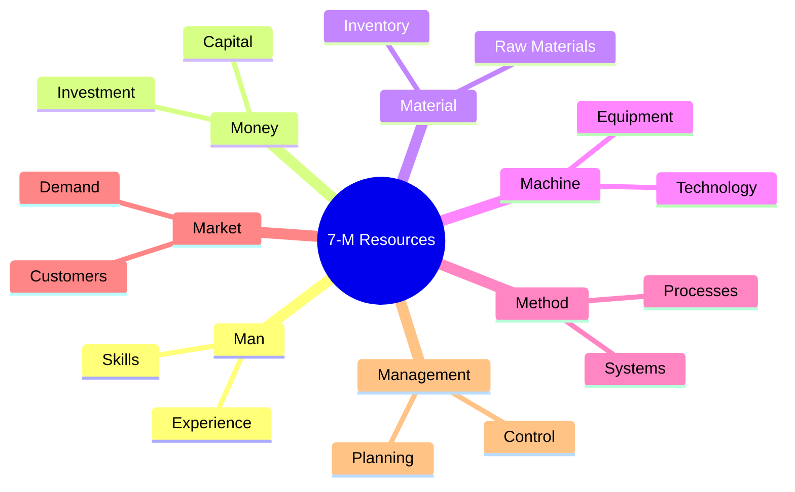
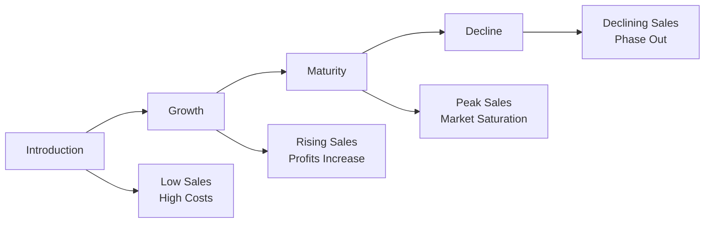
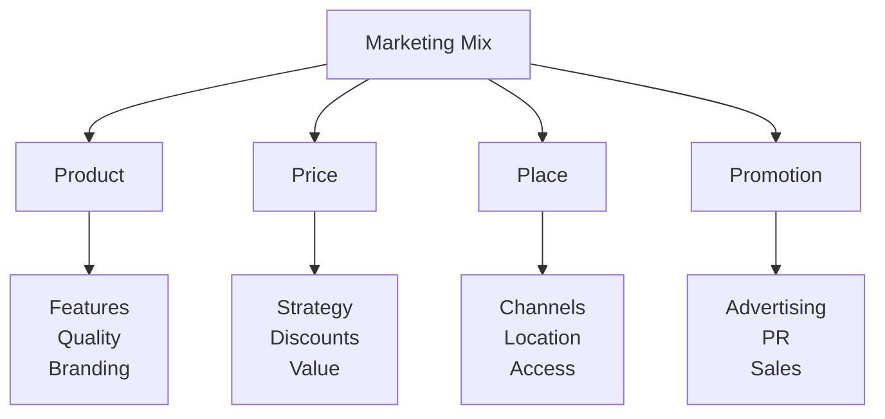
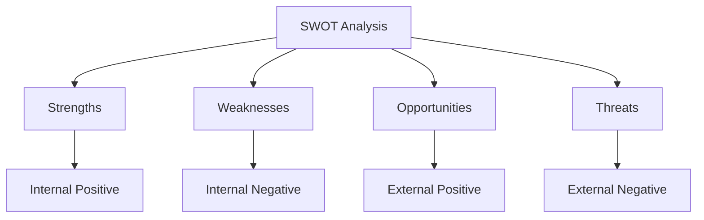
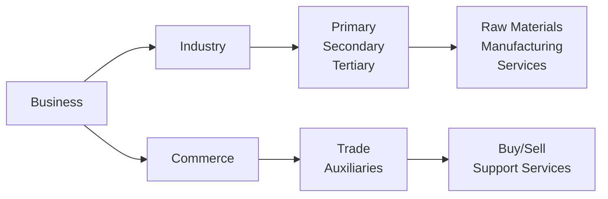
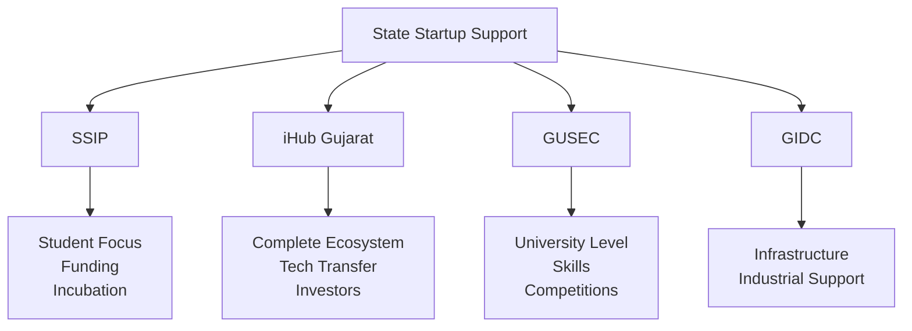
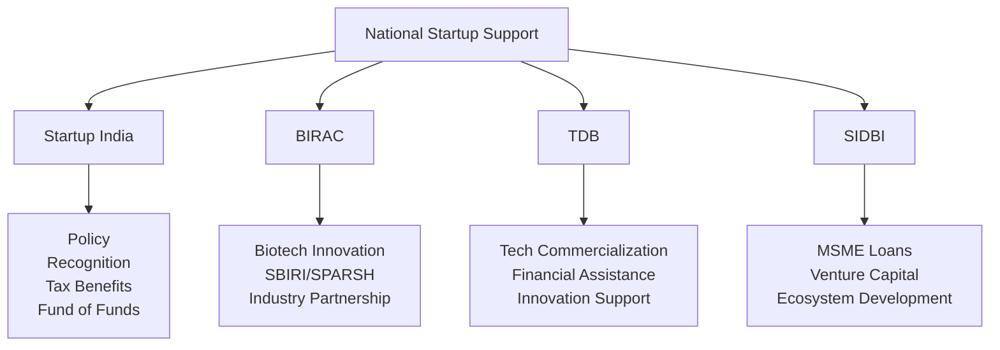
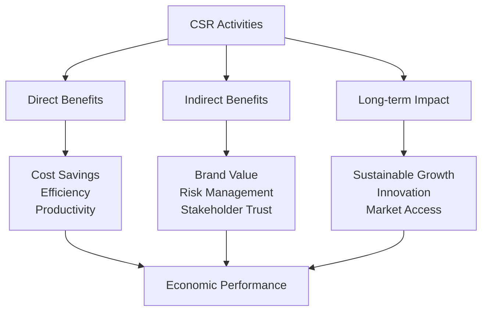
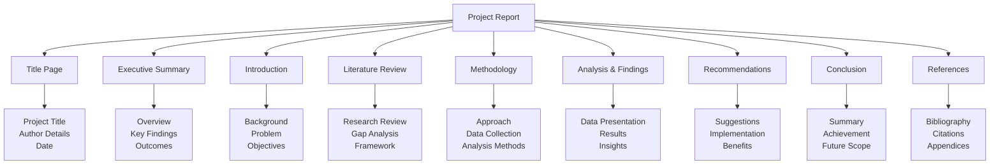

## Question 1(a) [3 marks]

**Give Comparison between Entrepreneurship and Intrapreneurship.**

**Answer:**

| **Aspect** | **Entrepreneurship** | **Intrapreneurship** |
|------------|---------------------|---------------------|
| **Definition** | Starting own business with personal risk | Innovation within existing organization |
| **Risk** | Personal financial risk | Organization bears risk |
| **Resources** | Own/borrowed resources | Company provides resources |

**Mnemonic:** "EXternal vs INternal innovation"

## Question 1(b) [4 marks]

**Discuss characteristics and functions of Entrepreneurship**

**Answer:**

**Characteristics:**

- **Risk-taking ability**: Willingness to take calculated business risks
- **Innovation**: Creating new products, services, or processes
- **Leadership skills**: Ability to guide and motivate teams

**Functions:**

- **Job Creation**: Generates employment opportunities for society
- **Economic Development**: Contributes to GDP and national growth
- **Innovation catalyst**: Introduces new technologies and solutions

**Mnemonic:** "RIL Creates Jobs Economically & Innovatively"

## Question 1(c) [7 marks]

**Identify and discuss 7-M Resources in detail.**

**Answer:**

| **Resource** | **Description** | **Importance** |
|-------------|-----------------|----------------|
| **Man** | Human resources and workforce | Core asset for operations |
| **Money** | Financial capital and funding | Essential for business operations |
| **Material** | Raw materials and supplies | Production requirements |
| **Machine** | Equipment and technology | Operational efficiency |
| **Method** | Processes and procedures | Systematic approach |
| **Market** | Customer base and demand | Revenue generation |
| **Management** | Planning and coordination | Overall business control |



**Mnemonic:** "Many Modern Managers Make Money Managing Markets"

## Question 1(c) OR [7 marks]

**Write down the Start Up India Registration process.**

**Answer:**

**Start-up India Registration Steps:**

1. **Online Registration**: Visit www.startupindia.gov.in
2. **Document Preparation**: 
   - Certificate of Incorporation
   - PAN Card of entity
   - Brief description of business
3. **Eligibility Criteria**:
   - Entity age less than 10 years
   - Annual turnover less than ₹100 crore
   - Working towards innovation/improvement
4. **Application Submission**: Complete online form with required documents
5. **Verification Process**: Government review and approval
6. **Certificate Issuance**: Receive recognition certificate

**Benefits:**

- **Tax exemptions** for 3 consecutive years
- **Fast-track patent** application process
- **Compliance reduction** under labor and environment laws

**Mnemonic:** "Online Documents Eligibility Application Verification Certificate Benefits"

## Question 2(a) [3 marks]

**List Methods of Market Research.**

**Answer:**

**Primary Research Methods:**

- **Surveys**: Questionnaires to collect customer data
- **Interviews**: Direct interaction with target audience
- **Focus Groups**: Group discussions for feedback

**Secondary Research Methods:**

- **Online Research**: Internet-based data collection
- **Published Reports**: Industry analysis and studies
- **Government Data**: Statistical information from official sources

**Mnemonic:** "Survey Interview Focus Online Published Government"

## Question 2(b) [4 marks]

**Draw and Explain Product Life Cycle.**

**Answer:**



**Stages:**

- **Introduction**: Product launch with high marketing costs
- **Growth**: Rapid sales increase and market acceptance
- **Maturity**: Peak sales with intense competition
- **Decline**: Decreasing demand and eventual phase-out

**Mnemonic:** "I Grow My Dreams"

## Question 2(c) [7 marks]

**Identify and discuss 4 P's of Marketing.**

**Answer:**

| **P** | **Element** | **Description** | **Key Considerations** |
|-------|-------------|-----------------|----------------------|
| **Product** | Goods/Services offered | Features, quality, branding | Customer needs satisfaction |
| **Price** | Cost to customer | Pricing strategy, discounts | Competitive positioning |
| **Place** | Distribution channels | Where product is sold | Accessibility to customers |
| **Promotion** | Marketing communication | Advertising, sales promotion | Brand awareness creation |



**Integration:** All 4 P's must work together for effective marketing strategy.

**Mnemonic:** "People Purchase Products Properly"

## Question 2(a) OR [3 marks]

**Discuss B2B, E-commerce and GeM.**

**Answer:**

| **Type** | **Full Form** | **Description** |
|----------|---------------|-----------------|
| **B2B** | Business to Business | Trade between companies |
| **E-commerce** | Electronic Commerce | Online buying and selling |
| **GeM** | Government e-Marketplace | Government procurement portal |

**Key Features:**

- **B2B**: Bulk transactions, long-term relationships
- **E-commerce**: Digital platforms, global reach
- **GeM**: Transparent government purchases, competitive pricing

**Mnemonic:** "Businesses Buy Electronically, Government e-Markets"

## Question 2(b) OR [4 marks]

**Write a note on the plans for creating and starting the business**

**Answer:**

**Business Creation Plans:**

**Market Analysis:**

- **Target customers**: Identify primary audience
- **Competition study**: Analyze existing players
- **Market size**: Determine potential revenue

**Financial Planning:**

- **Capital requirements**: Initial investment needed
- **Revenue projections**: Expected income streams
- **Break-even analysis**: Profitability timeline

**Operational Setup:**

- **Location selection**: Strategic positioning
- **Resource allocation**: Human and material resources
- **Legal compliance**: Licenses and registrations

**Mnemonic:** "Market Finance Operations = Business Success"

## Question 2(c) OR [7 marks]

**Explain the concept of Risk and SWOT analysis.**

**Answer:**

**Risk Concept:**
Risk is uncertainty that can affect business outcomes, both positively and negatively.

**Types of Business Risks:**

- **Financial Risk**: Cash flow and funding issues
- **Market Risk**: Demand fluctuations and competition
- **Operational Risk**: Production and service delivery problems

**SWOT Analysis:**

| **Internal Factors** | **External Factors** |
|---------------------|---------------------|
| **Strengths** | **Opportunities** |
| - Core competencies | - Market growth |
| - Unique resources | - New technologies |
| **Weaknesses** | **Threats** |
| - Skill gaps | - Competition |
| - Resource limitations | - Economic changes |



**Risk Mitigation Strategies:**

- **Diversification**: Spread risks across different areas
- **Insurance**: Transfer risk to insurance companies
- **Contingency planning**: Prepare for unexpected situations

**Mnemonic:** "Strong Weak Opportunities Threaten = SWOT"

## Question 3(a) [3 marks]

**Write short note on cooperative type organization.**

**Answer:**

**Cooperative Organization:**

- **Definition**: Voluntary association of people for mutual benefit
- **Ownership**: Collectively owned by members
- **Control**: Democratic management with equal voting rights

**Characteristics:**

- **Member participation**: Active involvement in decision-making
- **Profit sharing**: Benefits distributed among members
- **Social purpose**: Focus on community welfare

**Examples:** Agricultural cooperatives, credit unions, housing societies

**Mnemonic:** "Collective Ownership with Democratic Management"

## Question 3(b) [4 marks]

**Give a list of functions of management and define all of them.**

**Answer:**

| **Function** | **Definition** | **Key Activities** |
|-------------|----------------|-------------------|
| **Planning** | Setting objectives and strategies | Goal setting, forecasting, budgeting |
| **Organizing** | Arranging resources and structure | Departmentation, delegation, coordination |
| **Staffing** | Human resource management | Recruitment, training, performance evaluation |
| **Directing** | Leading and motivating employees | Communication, leadership, supervision |
| **Controlling** | Monitoring and correcting performance | Performance measurement, feedback, correction |

**Mnemonic:** "Proper Organization Supports Directed Control"

## Question 3(c) [7 marks]

**Describe types of Ownership and explain any three in detail.**

**Answer:**

**Types of Business Ownership:**

| **Type** | **Ownership** | **Liability** | **Control** |
|----------|---------------|---------------|-------------|
| **Sole Proprietorship** | Single owner | Unlimited | Complete |
| **Partnership** | 2+ partners | Unlimited | Shared |
| **Company** | Shareholders | Limited | Board of Directors |
| **Cooperative** | Members | Limited | Democratic |

**Detailed Explanation:**

**1. Sole Proprietorship:**

- **Advantages**: Easy formation, complete control, tax benefits
- **Disadvantages**: Unlimited liability, limited resources, business continuity issues
- **Suitable for**: Small businesses, professional services

**2. Partnership:**

- **Advantages**: Shared resources, specialized skills, easy formation
- **Disadvantages**: Unlimited liability, conflict potential, shared profits
- **Types**: General partnership, limited partnership

**3. Company:**

- **Advantages**: Limited liability, perpetual existence, easier capital raising
- **Disadvantages**: Complex regulations, double taxation, loss of control
- **Types**: Private limited, public limited

**Mnemonic:** "Single Partners Companies Cooperate"

## Question 3(a) OR [3 marks]

**Explain different Leadership Models.**

**Answer:**

**Leadership Models:**

| **Model** | **Approach** | **Best Used When** |
|-----------|--------------|-------------------|
| **Autocratic** | Leader makes all decisions | Crisis situations, quick decisions needed |
| **Democratic** | Participative decision-making | Team input valuable, time available |
| **Laissez-faire** | Hands-off approach | Experienced team, creative work |

**Modern Models:**

- **Transformational**: Inspiring vision and change
- **Transactional**: Reward-punishment based
- **Situational**: Adapts style to situation

**Mnemonic:** "Auto Demo Laissez Transform Transact Situate"

## Question 3(b) OR [4 marks]

**Give the difference between Administration and Management**

**Answer:**

| **Aspect** | **Administration** | **Management** |
|------------|-------------------|----------------|
| **Focus** | Policy formulation | Policy implementation |
| **Level** | Top level function | Middle level function |
| **Nature** | Planning and thinking | Doing and executing |
| **Scope** | Broader organizational | Specific departmental |

**Key Differences:**

- **Administration**: Strategic, long-term, conceptual
- **Management**: Operational, short-term, practical

**Relationship:** Administration sets direction, Management executes plans

**Mnemonic:** "Admin Plans, Management Implements"

## Question 3(c) OR [7 marks]

**Explain the concept of difference between industry, commerce and business.**

**Answer:**

| **Concept** | **Definition** | **Primary Activity** | **Examples** |
|-------------|----------------|---------------------|--------------|
| **Industry** | Production of goods | Manufacturing, processing | Steel, textiles, chemicals |
| **Commerce** | Distribution of goods | Trading, transportation | Wholesale, retail, logistics |
| **Business** | Overall economic activity | Production + distribution | Complete enterprise operations |

**Industry Categories:**

- **Primary**: Raw material extraction (mining, agriculture)
- **Secondary**: Manufacturing and processing
- **Tertiary**: Services (banking, education, healthcare)

**Commerce Functions:**

- **Trade**: Buying and selling activities
- **Auxiliaries**: Supporting services (transport, insurance, banking)

**Business Integration:**

- **Vertical**: Industry + Commerce integration
- **Horizontal**: Same level diversification



**Mnemonic:** "Industry Creates, Commerce Distributes, Business Integrates"

## Question 4(a) [3 marks]

**Explain following terms: 1.Contracts 2.Copyrights**

**Answer:**

| **Term** | **Definition** | **Key Features** |
|----------|----------------|------------------|
| **Contracts** | Legal agreement between parties | Binding, enforceable, mutual obligations |
| **Copyrights** | Intellectual property protection | Creative works, exclusive rights, limited duration |

**Contract Elements:**

- **Offer and acceptance**: Clear terms agreed upon
- **Consideration**: Value exchange between parties
- **Legal capacity**: Parties must be legally capable

**Copyright Protection:**

- **Duration**: Generally lifetime + 70 years
- **Rights**: Reproduction, distribution, public performance
- **Registration**: Not mandatory but recommended

**Mnemonic:** "Contracts Bind, Copyrights Protect"

## Question 4(b) [4 marks]

**Give a note on startup incubation center and Modalities.**

**Answer:**

**Startup Incubation Centers:**

- **Purpose**: Support early-stage startups with resources and guidance
- **Services**: Mentorship, funding, workspace, networking
- **Duration**: Typically 6 months to 2 years

**Key Modalities:**

**Pre-incubation:**

- **Idea validation**: Market research and feasibility
- **Team formation**: Building core team
- **Prototype development**: MVP creation

**Incubation Phase:**

- **Business model refinement**: Revenue model development
- **Market testing**: Customer validation
- **Funding preparation**: Investor pitch preparation

**Post-incubation:**

- **Alumni network**: Continued support and connections
- **Follow-up funding**: Series A preparation
- **Scaling support**: Growth strategy assistance

**Mnemonic:** "Pre-incubate, Incubate, Post-support Startups"

## Question 4(c) [7 marks]

**List State level agencies which supports start-ups and describe their functionalities**

**Answer:**

**Gujarat State Support Agencies:**

| **Agency** | **Full Form** | **Key Functions** |
|------------|---------------|-------------------|
| **SSIP** | Student Startup & Innovation Policy | Student entrepreneur support, funding |
| **iHub Gujarat** | Innovation Hub Gujarat | Incubation, mentorship, networking |
| **GUSEC** | Gujarat University Startup & Entrepreneurship Council | University-level startup promotion |
| **GIDC** | Gujarat Industrial Development Corporation | Industrial infrastructure, land allocation |

**Detailed Functionalities:**

**SSIP Gujarat:**

- **Funding support**: Up to ₹2 lakh for student startups
- **Incubation facilities**: Workspace and equipment access
- **Mentorship programs**: Industry expert guidance
- **IPR support**: Patent filing assistance

**iHub Gujarat:**

- **Startup ecosystem**: Complete entrepreneurship support
- **Technology transfer**: Research to market conversion
- **Investor connections**: Funding facilitation
- **Industry partnerships**: Corporate collaboration

**GUSEC:**

- **Student engagement**: Campus entrepreneurship programs
- **Skill development**: Entrepreneurship education
- **Competition organization**: Startup contests and pitches
- **Network building**: Alumni entrepreneur connections



**Impact Measurement:**

- **Number of startups supported** annually
- **Job creation** through supported ventures
- **Revenue generation** of incubated companies
- **Success rate** of graduated startups

**Mnemonic:** "SSIP iHub GUSEC GIDC Support Gujarat Startups"

## Question 4(a) OR [3 marks]

**Explain following terms: 1.IPR 2.Trademarks**

**Answer:**

| **Term** | **Full Form/Definition** | **Protection Scope** |
|----------|-------------------------|---------------------|
| **IPR** | Intellectual Property Rights | Ideas, inventions, creative works |
| **Trademarks** | Brand identification marks | Names, logos, symbols, slogans |

**IPR Categories:**

- **Patents**: Technical inventions (20 years)
- **Copyrights**: Creative expressions (lifetime + 70 years)
- **Trademarks**: Brand identifiers (10 years, renewable)

**Trademark Features:**

- **Distinctiveness**: Unique brand identification
- **Commercial use**: Business identification purpose
- **Registration**: Legal protection through registration

**Mnemonic:** "IPR Protects, Trademarks Identify"

## Question 4(b) OR [4 marks]

**Define the role of Investor in start-up.**

**Answer:**

**Investor Roles in Startups:**

**Financial Support:**

- **Seed funding**: Initial capital for business launch
- **Growth capital**: Expansion and scaling funds
- **Bridge financing**: Interim funding between rounds

**Strategic Guidance:**

- **Business mentorship**: Industry experience sharing
- **Network access**: Connections to customers and partners
- **Market insights**: Industry knowledge and trends

**Operational Support:**

- **Team building**: Hiring and talent acquisition advice
- **Technology guidance**: Technical architecture suggestions
- **Legal compliance**: Regulatory and compliance support

**Risk Management:**

- **Due diligence**: Business model validation
- **Performance monitoring**: Regular progress tracking
- **Exit strategy**: Planning for investment recovery

**Types of Investors:**

- **Angel investors**: Individual high-net-worth investors
- **Venture capital**: Professional investment firms
- **Corporate investors**: Strategic industry players

**Mnemonic:** "Finance Strategy Operations Risk = Investor Roles"

## Question 4(c) OR [7 marks]

**List National level agencies which support start-ups and describe their functionalities.**

**Answer:**

**National Startup Support Agencies:**

| **Agency** | **Ministry/Department** | **Primary Focus** |
|------------|------------------------|-------------------|
| **Startup India** | DPIIT, Commerce Ministry | Policy framework and ecosystem |
| **BIRAC** | Department of Biotechnology | Biotechnology innovation |
| **TDB** | Department of Science & Technology | Technology development |
| **SIDBI** | Financial Services | MSME and startup funding |

**Detailed Functionalities:**

**Startup India:**

- **Policy formulation**: National startup policy framework
- **Recognition program**: Official startup certification
- **Tax benefits**: 3-year tax exemption for eligible startups
- **Regulatory support**: Single-point clearance system
- **Funding facilitation**: Fund of Funds scheme (₹10,000 crores)

**BIRAC (Biotechnology Industry Research Assistance Council):**

- **Biotech innovation**: Supporting biotech startups and research
- **Funding schemes**: SBIRI, SPARSH, BIG programs
- **Industry partnerships**: Academia-industry collaboration
- **Technology translation**: Research to market conversion

**TDB (Technology Development Board):**

- **Technology commercialization**: Converting research to products
- **Financial assistance**: Loans and grants for technology development
- **Industry support**: Manufacturing technology assistance
- **Innovation promotion**: Supporting technological innovation

**SIDBI (Small Industries Development Bank of India):**

- **Financial support**: Loans and credit facilities
- **MSME focus**: Small and medium enterprise development
- **Startup funding**: Venture capital and growth capital
- **Ecosystem development**: Incubator and accelerator support



**Additional Agencies:**

- **NSTEDB**: National Science & Technology Entrepreneurship Development Board
- **MSME**: Ministry of Micro, Small and Medium Enterprises
- **Atal Innovation Mission**: Innovation and entrepreneurship promotion

**Success Metrics:**

- **Startup registrations**: Over 70,000 recognized startups
- **Job creation**: Millions of employment opportunities
- **Funding facilitated**: Billions in investment mobilization
- **Ecosystem development**: Thousands of incubators and accelerators

**Mnemonic:** "Startup BIRAC TDB SIDBI = National Support System"

## Question 5(a) [3 marks]

**Explain following terms: 1.Break Even point 2.Return on Investment 3.Return on Sales.**

**Answer:**

| **Term** | **Formula** | **Meaning** |
|----------|-------------|-------------|
| **Break Even Point** | Fixed Costs ÷ (Price - Variable Cost) | Units to cover all costs |
| **Return on Investment** | (Gain-Cost) ÷ Cost × 100 | Percentage return on invested capital |
| **Return on Sales** | Net Income ÷ Sales × 100 | Profit margin percentage |

**Break Even Analysis:**

- **Fixed costs**: Rent, salaries, insurance
- **Variable costs**: Raw materials, utilities per unit
- **Contribution margin**: Price minus variable cost per unit

**ROI Importance:**

- **Investment efficiency**: Measures investment performance
- **Comparison tool**: Compare different investment options
- **Decision making**: Guide future investment decisions

**ROS Significance:**

- **Profitability measure**: Shows operational efficiency
- **Industry comparison**: Benchmark against competitors
- **Trend analysis**: Track performance over time

**Mnemonic:** "Break Even Returns On Investment Sales"

## Question 5(b) [4 marks]

**Write a short note on Import-Export Policy**

**Answer:**

**India's Import-Export Policy (EXIM Policy):**

**Objectives:**

- **Trade promotion**: Increase international trade volume
- **Export growth**: Boost export earnings and competitiveness
- **Economic development**: Support manufacturing and job creation

**Key Features:**

**Export Promotion:**

- **Export incentives**: Duty drawback, MEIS schemes
- **Special Economic Zones**: Tax-free export manufacturing
- **Export financing**: Credit facilities and insurance

**Import Management:**

- **Import licensing**: Controlled import of sensitive items
- **Duty structure**: Tariff rates and customs procedures
- **Quality standards**: BIS and other quality requirements

**Trade Facilitation:**

- **Digital platforms**: Online export-import procedures
- **Single window**: Unified clearance system
- **Trade agreements**: Bilateral and multilateral agreements

**Current Focus Areas:**

- **Make in India**: Promoting domestic manufacturing
- **Digital India**: Technology-enabled trade processes
- **Atmanirbhar Bharat**: Self-reliance and import substitution

**Mnemonic:** "Export Import Policy Promotes Trade Facilitation"

## Question 5(c) [7 marks]

**Describe the connection between CSR and Economic Performance.**

**Answer:**

**Corporate Social Responsibility (CSR) and Economic Performance Link:**

**Direct Economic Benefits:**

| **CSR Activity** | **Economic Impact** | **Measurement** |
|------------------|-------------------|-----------------|
| **Employee welfare** | Higher productivity, lower turnover | Cost savings, efficiency gains |
| **Environmental initiatives** | Resource efficiency, waste reduction | Cost reduction, sustainability |
| **Community development** | Market expansion, brand loyalty | Revenue growth, customer retention |

**Indirect Economic Benefits:**

**Brand Value Enhancement:**

- **Customer loyalty**: Increased repeat purchases and referrals
- **Premium pricing**: Ability to charge higher prices for ethical products
- **Market differentiation**: Competitive advantage in conscious markets

**Risk Management:**

- **Regulatory compliance**: Avoiding penalties and legal costs
- **Reputation protection**: Preventing brand damage from social issues
- **Stakeholder relations**: Building trust with investors and partners

**Long-term Economic Performance:**

**Sustainable Growth:**

- **Innovation driver**: CSR initiatives often lead to innovative solutions
- **Market access**: Meeting ESG criteria for international markets
- **Investment attraction**: ESG-focused investors prefer responsible companies



**Research Evidence:**

- **Performance correlation**: Studies show positive correlation between CSR and financial performance
- **Investor preference**: ESG-compliant companies attract more investment
- **Market valuation**: Responsible companies often have higher market valuations

**CSR-Economic Performance Cycle:**

- **Investment in CSR** → **Operational improvements** → **Financial performance** → **More CSR investment**

**Implementation Strategy:**

- **Strategic alignment**: Align CSR with business objectives
- **Measurement systems**: Track both social and economic impacts
- **Stakeholder engagement**: Involve all stakeholders in CSR planning
- **Continuous improvement**: Regular review and enhancement of CSR programs

**Challenges:**

- **Short-term costs**: Initial investment may impact immediate profits
- **Measurement difficulty**: Quantifying social impact can be complex
- **Stakeholder expectations**: Balancing different stakeholder demands

**Success Factors:**

- **Leadership commitment**: Top management support for CSR initiatives
- **Integration**: Embedding CSR into business strategy and operations
- **Transparency**: Regular reporting and communication of CSR impact
- **Innovation**: Using CSR as a driver for business innovation

**Mnemonic:** "CSR Creates Sustainable Returns"

## Question 5(a) OR [3 marks]

**Write a note on Bankruptcy and Avoidance.**

**Answer:**

**Bankruptcy:**

- **Definition**: Legal process when business cannot meet financial obligations
- **Types**: Voluntary (self-initiated) or Involuntary (creditor-initiated)
- **Process**: Asset liquidation or reorganization under court supervision

**Avoidance Strategies:**

- **Cash flow management**: Maintain adequate working capital
- **Debt restructuring**: Negotiate payment terms with creditors
- **Cost reduction**: Cut unnecessary expenses and improve efficiency

**Legal Framework:**

- **Insolvency and Bankruptcy Code (IBC)**: Indian bankruptcy law
- **Resolution process**: 180-day timeline for resolution
- **Stakeholder protection**: Balanced approach for creditors and debtors

**Mnemonic:** "Bankrupt Businesses Avoid Through Cash Control"

## Question 5(b) OR [4 marks]

**Write an importance of Business Ethics.**

**Answer:**

**Importance of Business Ethics:**

**Stakeholder Trust:**

- **Customer confidence**: Ethical practices build customer loyalty
- **Investor faith**: Transparent operations attract investment
- **Employee satisfaction**: Ethical workplace improves retention

**Legal Compliance:**

- **Regulatory adherence**: Avoiding legal penalties and sanctions
- **Risk mitigation**: Preventing ethical scandals and crises
- **Reputation protection**: Maintaining positive brand image

**Competitive Advantage:**

- **Market differentiation**: Ethical brands stand out in marketplace
- **Premium positioning**: Ethical products can command higher prices
- **Sustainable growth**: Long-term success through ethical practices

**Social Impact:**

- **Community development**: Contributing to societal welfare
- **Environmental responsibility**: Sustainable business practices
- **Economic contribution**: Fair business practices support economic growth

**Mnemonic:** "Ethics Builds Trust, Compliance, Advantage, Social Impact"

## Question 5(c) OR [7 marks]

**Give the steps and format of project report writing**

**Answer:**

**Project Report Writing Steps:**

**Pre-Writing Phase:**

1. **Project planning**: Define scope, objectives, and deliverables
2. **Data collection**: Gather relevant information and research
3. **Analysis**: Process and analyze collected data
4. **Structure planning**: Organize content logically

**Writing Phase:**
5. **Draft preparation**: Write initial version following format
6. **Content development**: Elaborate each section with details
7. **Review and revision**: Check for accuracy and completeness
8. **Final formatting**: Apply consistent formatting and style

**Project Report Format:**

```
1. TITLE PAGE
   - Project title
   - Author name(s)
   - Institution/Organization
   - Date of submission

2. EXECUTIVE SUMMARY
   - Project overview (1-2 pages)
   - Key findings and recommendations
   - Expected outcomes

3. TABLE OF CONTENTS
   - Chapter/section headings
   - Page numbers
   - List of figures and tables

4. INTRODUCTION
   - Background and context
   - Problem statement
   - Objectives and scope
   - Methodology overview

5. LITERATURE REVIEW
   - Existing research and studies
   - Gap analysis
   - Theoretical framework

6. METHODOLOGY
   - Research approach
   - Data collection methods
   - Analysis techniques
   - Limitations

7. ANALYSIS AND FINDINGS
   - Data presentation
   - Results and interpretation
   - Key insights

8. RECOMMENDATIONS
   - Actionable suggestions
   - Implementation plan
   - Expected benefits

9. CONCLUSION
   - Summary of findings
   - Achievement of objectives
   - Future scope

10. REFERENCES
    - Bibliography
    - Sources cited
    - Appendices (if any)
```

**Writing Guidelines:**

**Content Quality:**

- **Clarity**: Use simple, clear language
- **Accuracy**: Ensure factual correctness
- **Relevance**: Include only pertinent information
- **Logical flow**: Maintain coherent structure

**Formatting Standards:**

- **Font**: Times New Roman 12pt or Arial 11pt
- **Spacing**: 1.5 line spacing
- **Margins**: 1 inch on all sides
- **Page numbering**: Consistent throughout

**Visual Elements:**

- **Tables**: For data presentation
- **Charts/Graphs**: For trend analysis
- **Diagrams**: For process illustration
- **Images**: For concept clarification



**Quality Checklist:**

- **Completeness**: All required sections included
- **Consistency**: Uniform formatting throughout
- **Accuracy**: Facts and figures verified
- **Relevance**: Content aligned with objectives

**Common Mistakes to Avoid:**

- **Plagiarism**: Always cite sources properly
- **Poor structure**: Maintain logical flow
- **Inconsistent formatting**: Follow standard guidelines
- **Inadequate analysis**: Provide sufficient depth

**Review Process:**

1. **Self-review**: Author checks for errors and completeness
2. **Peer review**: Colleague feedback on content and clarity
3. **Expert review**: Subject matter expert validation
4. **Final proofreading**: Grammar and formatting check

**Mnemonic:** "Title Executive Introduction Literature Methodology Analysis Recommendations Conclusion References"
