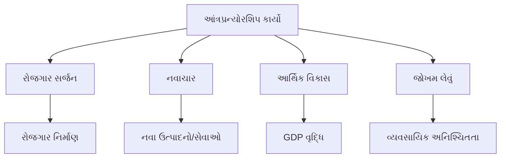
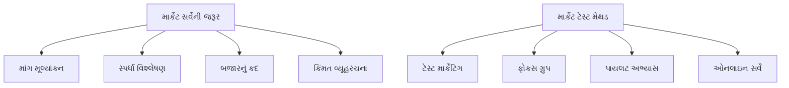
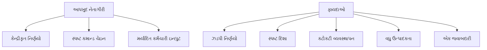
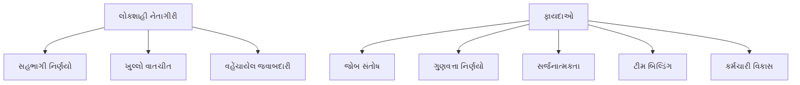
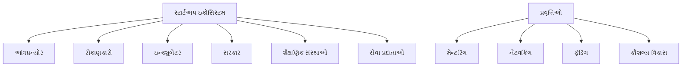
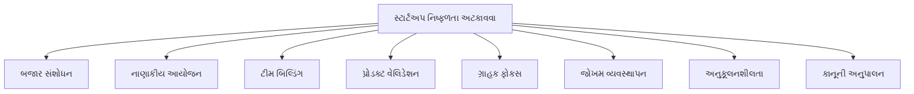
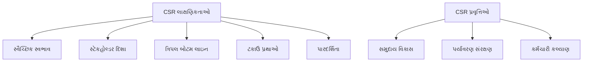
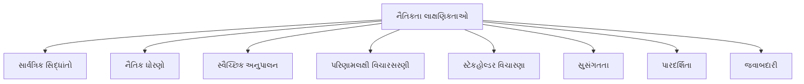

## પ્રશ્ન 1(અ) [3 ગુણ]

**આંત્રપ્રન્યોર અને મેનેજર વચ્ચેનો તફાવત આપો.**

**જવાબ**:

| પાસાં | આંત્રપ્રન્યોર | મેનેજર |
|-------|-------------|---------|
| **મુખ્ય ભૂમિકા** | નવા વ્યવસાય અને તકો બનાવે છે | હાલની કામગીરીનું સંચાલન કરે છે |
| **જોખમ લેવું** | ઉચ્ચ જોખમ લેનાર, અનિશ્ચિતતા સહન કરે છે | ઓછું થી મધ્યમ જોખમ, માર્ગદર્શિકા અનુસરે છે |
| **નિર્ણય લેવું** | ઝડપી, સહજ નિર્ણયો | વ્યવસ્થિત, નીતિ આધારિત નિર્ણયો |
| **ધ્યાન** | નવાચાર અને વૃદ્ધિ | કાર્યક્ષમતા અને નિયંત્રણ |
| **પારિતોષિક** | નફો અને માલિકી | પગાર અને લાભો |

**મેમરી ટ્રીક:** "CRIFO" - Creates Risk Innovation Focus Ownership

## પ્રશ્ન 1(બ) [4 ગુણ]

**આંત્રપ્રન્યોરશિપના કોઈપણ ચાર મુખ્ય કાર્યો સમજાવો.**

**જવાબ**:

- **રોજગાર સર્જન**: આંત્રપ્રન્યોર નવા વ્યવસાયો સ્થાપે છે, જેથી અન્ય લોકો માટે રોજગારની તકો બને છે
- **નવાચાર**: તેઓ બજારની જરૂરિયાતો પૂરી કરવા નવા ઉત્પાદનો, સેવાઓ અથવા પ્રક્રિયાઓ રજૂ કરે છે
- **આર્થિક વિકાસ**: સંપત્તિ પેદા કરે છે, GDPમાં યોગદાન આપે છે અને આર્થિક વૃદ્ધિને ઉત્તેજિત કરે છે
- **જોખમ લેવું**: સંભવિત નફા માટે વ્યવસાયિક અનિશ્ચિતતા અને નાણાકીય જોખમો સ્વીકારે છે

**ડાયાગ્રામ:**



**મેમરી ટ્રીક:** "રોનાજો" - રોજગાર નવાચાર આર્થિક જોખમ

## પ્રશ્ન 1(ક) [7 ગુણ]

**MSMEs ભારત દેશના આર્થિક વિકાસ માટે કેઈ રીતે અગત્યના છે?**

**જવાબ**:

| યોગદાનનું ક્ષેત્ર | મહત્વ |
|------------------|-------|
| **રોજગાર નિર્માણ** | કૃષિ પછી બીજા ક્રમનો સૌથી મોટો રોજગાર દાતા |
| **ઔદ્યોગિક ઉત્પાદન** | મેન્યુફેક્ચરિંગ આઉટપુટમાં 45% યોગદાન |
| **નિકાસ આવક** | કુલ નિકાસમાં 40% હિસ્સો |
| **GDP યોગદાન** | ભારતના GDPમાં લગભગ 30% યોગદાન |
| **ગ્રામીણ વિકાસ** | સંતુલિત પ્રાદેશિક વૃદ્ધિને પ્રોત્સાહન |

- **મેન્યુફેક્ચરિંગ લવચીકતા**: બજારના ફેરફારો અને ગ્રાહકની જરૂરિયાતોને ઝડપથી અનુકૂલન
- **નવાચાર હબ**: મોટા ઉદ્યોગોને સપ્લાયર અને વેન્ડર તરીકે આધાર આપે છે
- **ઉદ્યમિતા વિકાસ**: વ્યક્તિગત વ્યવસાય માલિકી અને સ્વરોજગારને પ્રોત્સાહન

**મેમરી ટ્રીક:** "રો-ઔ-ની-જી-ગ્રા" - રોજગાર ઔદ્યોગિક નિકાસ જીડીપી ગ્રામીણ

## પ્રશ્ન 1(ક) OR [7 ગુણ]

**ડિપ્લોમાના વિદ્યાર્થીને પોતાનું સ્ટાર્ટ-અપ શરૂ કરવામાં સ્ટુડેન્ટ સ્ટાર્ટ-અપ એન્ડ ઇનોવેશન પોલીસી (SSIP) કેવી રીતે મદદરૂપ થાય છે?**

**જવાબ**:

| SSIP લાભો | વર્ણન |
|------------|-------|
| **નાણાકીય સહાય** | સીડ ફંડિંગ અને ₹2 લાખ સુધીની ગ્રાન્ટ |
| **ઇન્ક્યુબેશન સેન્ટર** | ગુજરાતભરમાં 50+ ઇન્ક્યુબેશન સેન્ટરની સુવિધા |
| **માર્ગદર્શન** | ઉદ્યોગ નિષ્ણાતોનું માર્ગદર્શન અને સલાહ |
| **માળખાકીય સુવિધા** | મફત કો-વર્કિંગ સ્પેસ અને સાધનોની સુવિધા |
| **કૌશલ્ય વિકાસ** | ઉદ્યમિતા તાલીમ કાર્યક્રમો |

- **શૈક્ષણિક એકીકરણ**: સ્ટાર્ટ-અપ પ્રવૃત્તિઓને શૈક્ષણિક ક્રેડિટ તરીકે ગણવામાં આવે છે
- **IPR સહાય**: પેટન્ટ ફાઇલિંગ અને બૌદ્ધિક સંપદા સુરક્ષામાં મદદ
- **બજાર પહોંચ**: રોકાણકારો અને ઉદ્યોગ ભાગીદારો સાથે નેટવર્કિંગની તકો

**મેમરી ટ્રીક:** "ના-ઇ-મા-મા-કૌ" - નાણાકીય ઇન્ક્યુબેશન માર્ગદર્શન માળખાકીય કૌશલ્ય

## પ્રશ્ન 2(અ) [3 ગુણ]

**પ્રોજેક્ટ રિપોર્ટ એટલે શું? પ્રોજેક્ટના અમલીકરણમાં તેનું મહત્વ સમજાવો.**

**જવાબ**:

**પ્રોજેક્ટ રિપોર્ટ** એ એક વ્યાપક દસ્તાવેજ છે જેમાં પ્રસ્તાવિત વ્યવસાયિક સાહસની તકનીકી, નાણાકીય અને વ્યાપારિક પાસાઓની વિગતવાર માહિતી હોય છે.

**મહત્વ:**

- **લોન મંજૂરી**: બેંકોને ધિરાણ નિર્ણયો માટે પ્રોજેક્ટ રિપોર્ટની જરૂર હોય છે
- **સંસાધન આયોજન**: સંસાધનો અને માનવબળની યોગ્ય ફાળવણીમાં મદદ કરે છે
- **જોખમ મૂલ્યાંકન**: સંભવિત પડકારો અને તેના ઉકેલની ઓળખ કરે છે

**મેમરી ટ્રીક:** "લોસાજો" - લોન સંસાધન જોખમ

## પ્રશ્ન 2(બ) [4 ગુણ]

**બ્રેક-ઈવન પોઈન્ટ (in terms of sales revenue)ની ગણતરી કેઈ રીતે કરશો? તેનું graphical representation ઉદાહરણ સહિત આપો.**

**જવાબ**:

**સૂત્ર:** બ્રેક-ઈવન પોઈન્ટ (વેચાણ) = સ્થિર ખર્ચ ÷ યોગદાન માર્જિન રેશિયો

જ્યાં: યોગદાન માર્જિન રેશિયો = (વેચાણ - વેરિયેબલ કોસ્ટ) ÷ વેચાણ

**ઉદાહરણ:**

- સ્થિર ખર્ચ = ₹50,000
- યુનિટ દીઠ વેચાણ કિંમત = ₹100
- યુનિટ દીઠ વેરિયેબલ કોસ્ટ = ₹60
- યુનિટ દીઠ યોગદાન = ₹40
- યોગદાન માર્જિન રેશિયો = 40%
- બ્રેક-ઈવન વેચાણ = ₹50,000 ÷ 0.40 = ₹1,25,000

**ડાયાગ્રામ:**

```goat
    આવક/ખર્ચ (₹)
         |
    2,00,000 |     /
             |    /  કુલ આવક
    1,50,000 |   /
             |  /
    1,25,000 |./_____ બ્રેક-ઈવન પોઈન્ટ
             |/     
    1,00,000 |      કુલ ખર્ચ
             |     /
     50,000  |____/_____ સ્થિર ખર્ચ
             |
             +------------------------> વેચાયેલા યુનિટ
             0   500  1,250  2,000
```

**મેમરી ટ્રીક:** "સ્થ-યો-રે" - સ્થિર યોગદાન રેશિયો

## પ્રશ્ન 2(ક) [7 ગુણ]

**માર્કેટ સર્વેની જરૂરિયાત સમજાવો તથા માર્કેટ સર્વેની માર્કેટ ટેસ્ટ મેથડ સમજાવો.**

**જવાબ**:

**માર્કેટ સર્વેની જરૂરિયાત:**

| હેતુ | વર્ણન |
|-----|-------|
| **માંગ મૂલ્યાંકન** | ગ્રાહકોની જરૂરિયાતો અને પસંદગીઓ સમજવી |
| **સ્પર્ધા વિશ્લેષણ** | સ્પર્ધકોની વ્યૂહરચના અને કિંમતોનો અભ્યાસ |
| **બજારનું કદ** | કુલ સંબોધિત બજારનો અંદાજ |
| **કિંમત વ્યૂહરચના** | શ્રેષ્ઠ કિંમત બિંદુઓ નક્કી કરવા |

**માર્કેટ ટેસ્ટ મેથડ:**

- **ટેસ્ટ માર્કેટિંગ**: મર્યાદિત ભૌગોલિક વિસ્તારમાં ઉત્પાદન લોન્ચ કરવું
- **ફોકસ ગ્રુપ**: લક્ષ્ય ગ્રાહકો સાથે ચર્ચા કરવી
- **પાયલટ અભ્યાસ**: પસંદ કરેલા ગ્રાહકો સાથે ઓછા પાયે ઉત્પાદન પરીક્ષણ
- **ઓનલાઇન સર્વે**: વ્યાપક પહોંચ માટે ડિજિટલ પ્રશ્નાવલી



**મેમરી ટ્રીક:** "મા-સ્પ-બ-કિ" - માંગ સ્પર્ધા બજાર કિંમત

## પ્રશ્ન 2(અ) OR [3 ગુણ]

**માર્કેટિંગ પ્લાન એટલે શું? ટૂંકમાં સમજાવો.**

**જવાબ**:

**માર્કેટિંગ પ્લાન** એ એક વ્યૂહરચનાત્મક દસ્તાવેજ છે જેમાં વ્યવસાય તેના ઉત્પાદનો અથવા સેવાઓને લક્ષ્ય ગ્રાહકોને કેવી રીતે પ્રમોટ અને વેચશે તેની રૂપરેખા હોય છે.

**ઘટકો:**

- **બજાર વિશ્લેષણ**: ગ્રાહક વસ્તી વિષયક અને વર્તન અભ્યાસ
- **માર્કેટિંગ મિક્સ**: ઉત્પાદ, કિંમત, સ્થાન, પ્રમોશન વ્યૂહરચના
- **બજેટ ફાળવણી**: માર્કેટિંગ પ્રવૃત્તિઓ માટે નાણાકીય સંસાધનો

**મેમરી ટ્રીક:** "બ-મા-બ" - બજાર માર્કેટિંગ બજેટ

## પ્રશ્ન 2(બ) OR [4 ગુણ]

**ગુજરાતના કોઈ શહેરી વિસ્તારમાં e-bike મેન્યુફેક્ચર કરતી કંપનીનું SWOT analysis કરો.**

**જવાબ**:

| SWOT વિશ્લેષણ | E-bike મેન્યુફેક્ચરિંગ કંપની |
|----------------|----------------------------|
| **શક્તિઓ (Strengths)** | • ઇલેક્ટ્રિક વાહનો માટે સરકારી સહાય<br>• વધતી પર્યાવરણીય જાગૃતિ<br>• પેટ્રોલ વાહનો કરતાં ઓછો ઓપરેટિંગ ખર્ચ |
| **નબળાઈઓ (Weaknesses)** | • ઉચ્ચ પ્રારંભિક રોકાણ<br>• મર્યાદિત ચાર્જિંગ ઇન્ફ્રાસ્ટ્રક્ચર<br>• બેટરી રિપ્લેસમેન્ટ ખર્ચ |
| **તકો (Opportunities)** | • FAME યોજના સબસિડી<br>• શહેરી પ્રદૂષણની ચિંતા<br>• વધતા ઇંધણ ભાવ |
| **જોખમો (Threats)** | • સ્થાપિત પ્લેયર્સ તરફથી સ્પર્ધા<br>• ટેકનોલોજી અપ્રચલિતતા<br>• આર્થિક મંદીથી ખરીદ શક્તિ પર અસર |

**મેમરી ટ્રીક:** "સ-ન-ત-જો" - શક્તિઓ નબળાઈઓ તકો જોખમો

## પ્રશ્ન 2(ક) OR [7 ગુણ]

**ઇનોવેશન એટલે શું? કોઈપણ પ્રોડક્ટ અથવા પ્રોસેસ અથવા સર્વિસના ઓછામાં ઓછા પાંચ ઇનોવેશન્સનું લિસ્ટ આપો.**

**જવાબ**:

**ઇનોવેશન** એ નવા અથવા સુધારેલા ઉત્પાદનો, સેવાઓ અથવા પ્રક્રિયાઓ બનાવવાની પ્રક્રિયા છે જે ગ્રાહકોને મૂલ્ય અને સંસ્થાઓને સ્પર્ધાત્મક લાભ પૂરો પાડે છે.

**પાંચ ઉત્પાદન/સેવા ઇનોવેશન:**

| ઇનોવેશન | પ્રકાર | વર્ણન |
|----------|-------|-------|
| **UPI પેમેન્ટ સિસ્ટમ** | સેવા | ડિજિટલ પેમેન્ટ પ્લેટફોર્મ જેણે વ્યવહારોમાં ક્રાંતિ લાવી |
| **ટેસ્લા ઇલેક્ટ્રિક કાર** | ઉત્પાદ | સ્વાયત્ત સુવિધાઓ સાથે ટકાઉ ઓટોમોટિવ ટેકનોલોજી |
| **નેટફ્લિક્સ સ્ટ્રીમિંગ** | સેવા | માંગ મુજબ મનોરંજન ડિલિવરી મોડલ |
| **3D પ્રિન્ટિંગ** | પ્રક્રિયા | એડિટિવ મેન્યુફેક્ચરિંગ ટેકનોલોજી |
| **ઝૂમ વિડિયો કોલિંગ** | સેવા | વર્ચ્યુઅલ મીટિંગ માટે રિમોટ કમ્યુનિકેશન પ્લેટફોર્મ |

- **મૂલ્ય સર્જન**: દરેક ઇનોવેશને હાલની ગ્રાહક સમસ્યાઓનો ઉકેલ લાવ્યો
- **બજાર વિક્ષેપ**: પરંપરાગત બિઝનેસ મોડલ અને વપરાશકર્તા વર્તનમાં ફેરફાર કર્યો
- **ટેકનોલોજી એકીકરણ**: વર્ધિત વપરાશકર્તા અનુભવ માટે બહુવિધ ટેકનોલોજીઓનું સંયોજન

**મેમરી ટ્રીક:** "UNT3Z" - UPI Netflix Tesla 3D Zoom

## પ્રશ્ન 3(અ) [3 ગુણ]

**ભાગીદારી પેઢી પર ટૂંકનોંધ લખો.**

**જવાબ**:

**ભાગીદારી પેઢી** એ એક વ્યવસાયિક માળખું છે જ્યાં બે અથવા વધુ વ્યક્તિઓ નફા માટે સંયુક્ત રીતે વ્યવસાયનું માલિકી અને સંચાલન કરે છે.

**મુખ્ય લક્ષણો:**

- **વહેંચાયેલ માલિકી**: બહુવિધ ભાગીદારો મૂડી અને કુશળતાનું યોગદાન આપે છે
- **સંયુક્ત જવાબદારી**: ભાગીદારો વ્યવસાયિક દેવા માટે વ્યક્તિગત રીતે જવાબદાર છે
- **નફાની વહેંચણી**: ભાગીદારી કરાર અનુસાર કમાણીનું વિતરણ

**મેમરી ટ્રીક:** "વ-સ-ન" - વહેંચાયેલ સંયુક્ત નફો

## પ્રશ્ન 3(બ) [4 ગુણ]

**મેનેજમેન્ટના 'staffing' કાર્યમાં સમાવિષ્ટ વિવિધ activities સમજાવો.**

**જવાબ**:

| Staffing પ્રવૃત્તિ | વર્ણન | ઉદાહરણ |
|-------------------|-------|----------|
| **ભરતી (Recruitment)** | સંભવિત ઉમેદવારોને આકર્ષવા | LinkedIn પર નોકરીની જાહેરાત પોસ્ટ કરવી |
| **પસંદગી (Selection)** | યોગ્ય ઉમેદવારોની પસંદગી | ઇન્ટરવ્યુ અને યોગ્યતા પરીક્ષા લેવી |
| **તાલીમ (Training)** | કૌશલ્ય વિકાસ કાર્યક્રમો | નવા કર્મચારીની ઓરિએન્ટેશન સેશન |
| **કામગીરી મૂલ્યાંકન** | કર્મચારીની કામગીરીનું મૂલ્યાંકન | વાર્ષિક કામગીરી સમીક્ષા |

- **નિયુક્તિ**: યોગ્ય વ્યક્તિને યોગ્ય જગ્યાએ સોંપવું
- **પ્રમોશન**: કામગીરી અને અનુભવ આધારે કારકિર્દી વૃદ્ધિ
- **વળતર**: ન્યાયપૂર્ણ વેતન અને લાભોના પેકેજ નક્કી કરવા

**મેમરી ટ્રીક:** "ભ-પ-તા-કા-ની-પ્ર-વ" - ભરતી પસંદગી તાલીમ કામગીરી નિયુક્તિ પ્રમોશન વળતર

## પ્રશ્ન 3(ક) [7 ગુણ]

**આપખુદ નેતાગીરી સમજાવો અને તેના ફાયદાઓ જણાવો.**

**જવાબ**:

**આપખુદ નેતાગીરી** એ એક મેનેજમેન્ટ શૈલી છે જ્યાં નેતા ટીમના સભ્યોની સલાહ લીધા વિના સ્વતંત્ર રીતે તમામ નિર્ણયો લે છે.

**લાક્ષણિકતાઓ:**

- **કેન્દ્રીકૃત નિર્ણય લેવું**: નેતા પાસે સંપૂર્ણ સત્તા અને નિયંત્રણ
- **સ્પષ્ટ કમાન્ડ ચેઇન**: સુ-વ્યાખ્યાયિત વંશવેલો અને રિપોર્ટિંગ માળખું
- **મર્યાદિત કર્મચારી ઇનપુટ**: નિર્ણય લેવાની પ્રક્રિયામાં ન્યૂનતમ સહભાગિતા

**ફાયદાઓ:**

| ફાયદો | વર્ણન |
|-------|-------|
| **ઝડપી નિર્ણયો** | લાંબી સલાહમશવરા વિના ઝડપી સમસ્યા-સમાધાન |
| **સ્પષ્ટ દિશા** | કર્મચારીઓ બરાબર જાણે છે કે શું અપેક્ષિત છે |
| **કટોકટી વ્યવસ્થાપન** | તાત્કાલિક કાર્યવાહીની જરૂર હોય તેવી કટોકટી દરમિયાન અસરકારક |
| **ઉત્પાદકતા** | માળખાકીય કાર્ય વાતાવરણને કારણે વધુ આઉટપુટ |
| **જવાબદારી** | પરિણામો માટે એક જ બિંદુની જવાબદારી |



**મેમરી ટ્રીક:** "ઝ-સ્પ-ક-ઉ-જ" - ઝડપી સ્પષ્ટ કટોકટી ઉત્પાદકતા જવાબદારી

## પ્રશ્ન 3(અ) OR [3 ગુણ]

**જોઈન્ટ સ્ટોક કંપની પર ટૂંકનોંધ લખો.**

**જવાબ**:

**જોઈન્ટ સ્ટોક કંપની** એ એક વ્યવસાયિક સંસ્થા છે જ્યાં મૂડી બહુવિધ શેરહોલ્ડરોની માલિકીના શેરોમાં વહેંચાયેલું હોય છે.

**મુખ્ય લક્ષણો:**

- **મર્યાદિત જવાબદારી**: શેરહોલ્ડરોની જવાબદારી તેમના રોકાણ સુધી મર્યાદિત
- **ટ્રાન્સફરેબલ શેર**: માલિકી સહજતાથી ખરીદી-વેચી શકાય
- **અલગ કાનૂની એન્ટિટી**: કંપની તેના માલિકોથી સ્વતંત્ર રીતે અસ્તિત્વ ધરાવે છે

**મેમરી ટ્રીક:** "મ-ટ્રા-અ" - મર્યાદિત ટ્રાન્સફરેબલ અલગ

## પ્રશ્ન 3(બ) OR [4 ગુણ]

**મેનેજમેન્ટના 'organizing' કાર્યમાં સમાવિષ્ટ વિવિધ activities સમજાવો.**

**જવાબ**:

| Organizing પ્રવૃત્તિ | વર્ણન | ઉદાહરણ |
|---------------------|-------|----------|
| **જોબ ડિઝાઇન** | ભૂમિકાઓ અને જવાબદારીઓ વ્યાખ્યાયિત કરવી | માર્કેટિંગ મેનેજર માટે જોબ ડિસ્ક્રિપ્શન બનાવવું |
| **વિભાગીકરણ** | સમાન પ્રવૃત્તિઓનું જૂથીકરણ | HR, ફાઇનાન્સ અને ઓપરેશન્સ વિભાગ બનાવવા |
| **સત્તા સોંપણી** | સત્તા અને જવાબદારી સોંપવી | મેનેજર ટીમ લીડ્સને બજેટ મંજૂરી સોંપે છે |
| **સંકલન** | સરળ વર્કફ્લો સુનિશ્ચિત કરવું | સાપ્તાહિક આંતર-વિભાગીય મીટિંગ્સ |

- **સંસાધન ફાળવણી**: નાણાકીય અને માનવ સંસાધનોનું કાર્યક્ષમ વિતરણ
- **નિયંત્રણ વિસ્તાર**: મેનેજર દીઠ ઉપકર્મચારીઓની સંખ્યા નક્કી કરવી
- **કમાન્ડની એકતા**: દરેક કર્મચારી એક ઉપરી અધિકારીને રિપોર્ટ કરે

**મેમરી ટ્રીક:** "જો-વિ-સ-સં-સં-ની-ક" - જોબ વિભાગીકરણ સત્તા સંકલન સંસાધન નિયંત્રણ કમાન્ડ

## પ્રશ્ન 3(ક) OR [7 ગુણ]

**લોકશાહી નેતાગીરી સમજાવો અને તેના ફાયદાઓ જણાવો.**

**જવાબ**:

**લોકશાહી નેતાગીરી** એ એક મેનેજમેન્ટ શૈલી છે જ્યાં નેતાઓ નિર્ણય લેવાની પ્રક્રિયાઓમાં ટીમના સભ્યોને સામેલ કરે છે અને સહભાગિતાને પ્રોત્સાહન આપે છે.

**લાક્ષણિકતાઓ:**

- **સહભાગી નિર્ણય લેવું**: ટીમના સભ્યો સમસ્યા-સમાધાનમાં યોગદાન આપે છે
- **ખુલ્લો વાતચીત**: નેતાઓ અને કર્મચારીઓ વચ્ચે દ્વિ-માર્ગી વાતચીત
- **વહેંચાયેલ જવાબદારી**: પરિણામો અને પરિણામોની સામૂહિક માલિકી

**ફાયદાઓ:**

| ફાયદો | વર્ણન |
|-------|-------|
| **વધુ જોબ સંતોષ** | કર્મચારીઓ મૂલ્યવાન અને સાંભળ્યા હોવાનું અનુભવે છે |
| **વધુ સારા ગુણવત્તાના નિર્ણયો** | બહુવિધ દ્રષ્ટિકોણ નિર્ણયની ગુણવત્તા સુધારે છે |
| **સુધારેલ સર્જનાત્મકતા** | વિવિધ વિચારો અને નવાચારી ઉકેલો |
| **ટીમ બિલ્ડિંગ** | મજબૂત સહયોગ અને વિશ્વાસ |
| **કર્મચારી વિકાસ** | સહભાગિતા દ્વારા કૌશલ્ય વૃદ્ધિ |



**મેમરી ટ્રીક:** "જો-ગુ-સ-ટી-ક" - જોબ ગુણવત્તા સર્જનાત્મકતા ટીમ કર્મચારી

## પ્રશ્ન 4(અ) [3 ગુણ]

**જિલ્લા ઉદ્યોગ કેન્દ્રના વિવિધ કાર્યો લખો.**

**જવાબ**:

- **નોંધણી સેવાઓ**: MSME નોંધણી અને વિવિધ લાઇસન્સ મંજૂરીઓ
- **નાણાકીય સહાય**: લોન અને સરકારી યોજના અરજીઓ માટે માર્ગદર્શન
- **તકનીકી સહાય**: તકનીકી માર્ગદર્શન અને સલાહકારી સેવાઓ પૂરી પાડવી

**મેમરી ટ્રીક:** "નો-ના-ત" - નોંધણી નાણાકીય તકનીકી

## પ્રશ્ન 4(બ) [4 ગુણ]

**રાજ્ય કક્ષાના કોઈપણ બે ઇન્ક્યુબેટરના નામ આપી તેમના કાર્યો લખો.**

**જવાબ**:

| ઇન્ક્યુબેટર | કાર્યો |
|-------------|-------|
| **i-HUB ગુજરાત** | • સ્ટાર્ટઅપ મેન્ટરિંગ અને એક્સેલેરેશન કાર્યક્રમો<br>• ફંડિંગ સપોર્ટ અને રોકાણકારો સાથે કનેક્શન<br>• ઇન્ફ્રાસ્ટ્રક્ચર અને કો-વર્કિંગ સ્પેસ સુવિધાઓ |
| **CIIE અમદાવાદ** | • ટેકનોલોજી કોમર્શિયલાઇઝેશન સપોર્ટ<br>• ઇન્ડસ્ટ્રી-એકેડેમિયા સહયોગ<br>• વધતા સ્ટાર્ટઅપ્સ માટે સ્કેલ-અપ કાર્યક્રમો |

**સામાન્ય કાર્યો:**

- **મેન્ટરશિપ કાર્યક્રમો**: ઉદ્યોગ વ્યાવસાયિકો તરફથી નિષ્ણાત માર્ગદર્શન
- **નેટવર્કિંગ ઇવેન્ટ્સ**: સ્ટાર્ટઅપ્સને રોકાણકારો અને ભાગીદારો સાથે જોડવા

**મેમરી ટ્રીક:** "મે-ફં-ઇન-ને" - મેન્ટરિંગ ફંડિંગ ઇન્ફ્રાસ્ટ્રક્ચર નેટવर્કિંગ

## પ્રશ્ન 4(ક) [7 ગુણ]

**સ્ટાર્ટ-અપ ઇકો સિસ્ટમ એટલે શું? તેના વિવિધ કાર્યો અને ઘટકોનું લિસ્ટ આપો.**

**જવાબ**:

**સ્ટાર્ટ-અપ ઇકોસિસ્ટમ** એ પરસ્પર જોડાયેલ સંસ્થાઓ, વ્યક્તિઓ અને સંસાધનોનું નેટવર્ક છે જે ઉદ્યમિતા અને સ્ટાર્ટઅપ વિકાસને સમર્થન આપે છે.

**મુખ્ય ઘટકો:**

| ઘટક | વર્ણન |
|-----|-------|
| **આંત્રપ્રન્યોર** | નવા સાહસો શરૂ કરતા દ્રષ્ટિકોણ ધરાવતા વ્યક્તિઓ |
| **રોકાણકારો** | ફંડિંગ પૂરું પાડતા એન્જેલ રોકાણકારો, VCs |
| **ઇન્ક્યુબેટર/એક્સેલેરેટર** | પ્રારંભિક તબક્કાના સ્ટાર્ટઅપ્સ માટે સહાયક સંસ્થાઓ |
| **સરકાર** | નીતિ નિર્માતાઓ અને નિયમનકારી સંસ્થાઓ |
| **શૈક્ષણિક સંસ્થાઓ** | યુનિવર્સિટીઓ અને સંશોધન કેન્દ્રો |
| **સેવા પ્રદાતાઓ** | કાનૂની, એકાઉન્ટિંગ, કન્સલ્ટિંગ ફર્મ |

**પ્રવૃત્તિઓ:**

- **મેન્ટરિંગ સેશન**: અનુભવી આંત્રપ્રન્યોર તરફથી નિયમિત માર્ગદર્શન
- **નેટવર્કિંગ ઇવેન્ટ્સ**: સ્ટાર્ટઅપ મીટઅપ્સ અને રોકાણકાર પિચ સેશન
- **ફંડિંગ રાઉન્ડ્સ**: સીડ, સિરીઝ A, B ફંડિંગ તકો
- **કૌશલ્ય વિકાસ**: તકનીકી અને બિઝનેસ તાલીમ કાર્યક્રમો



**મેમરી ટ્રીક:** "આં-રો-ઇ-સ-શૈ-સે" - આંત્રપ્રન્યોર રોકાણકારો ઇન્ક્યુબેટર સરકાર શૈક્ષણિક સેવા

## પ્રશ્ન 4(અ) OR [3 ગુણ]

**સ્મોલ ઇન્ડસ્ટ્રીઝ ડેવલોપમેન્ટ બેન્ક ઓફ ઇન્ડિયા (SIDBI)ના વિવિધ કાર્યો જણાવો.**

**જવાબ**:

- **નાણાકીય સેવાઓ**: MSMEs અને સ્ટાર્ટઅપ્સને પ્રત્યક્ષ અને અપ્રત્યક્ષ ધિરાણ
- **વિકાસ સેવાઓ**: ક્ષમતા નિર્માણ અને કૌશલ્ય વિકાસ કાર્યક્રમો
- **પ્રમોશનલ પ્રવૃત્તિઓ**: બજાર વિકાસ અને ટેકનોલોજી અપગ્રેડેશન સપોર્ટ

**મેમરી ટ્રીક:** "ના-વિ-પ્ર" - નાણાકીય વિકાસ પ્રમોશનલ

## પ્રશ્ન 4(બ) OR [4 ગુણ]

**રાષ્ટ્રીય કક્ષાના કોઈપણ બે ઇન્ક્યુબેટરના નામ આપી તેમના કાર્યો લખો.**

**જવાબ**:

| ઇન્ક્યુબેટર | કાર્યો |
|-------------|-------|
| **T-Hub હૈદરાબાદ** | • ભારતનું સૌથી મોટું સ્ટાર્ટઅપ ઇન્ક્યુબેટર<br>• ટેકનોલોજી ઇનોવેશન અને R&D સપોર્ટ<br>• ગ્લોબલ માર્કેટ એક્સેસ કાર્યક્રમો |
| **NASSCOM 10,000 સ્ટાર્ટઅપ્સ** | • સમગ્ર ભારતમાં સ્ટાર્ટઅપ એક્સેલેરેશન કાર્યક્રમ<br>• કોર્પોરેટ પાર્ટનરશિપ સુવિધા<br>• ઇકોસિસ્ટમ બિલ્ડિંગ અને નીતિ વકીલાત |

**સામાન્ય કાર્યો:**

- **એક્સેલેરેશન કાર્યક્રમો**: સઘન સ્ટાર્ટઅપ વિકાસ અને મેન્ટરિંગ
- **કોર્પોરેટ કનેક્શન્સ**: સ્ટાર્ટઅપ્સને મોટા એન્ટરપ્રાઇઝ ભાગીદારો સાથે જોડવા

**મેમરી ટ્રીક:** "ટે-ઇ-ગ્લો-એ-કો" - ટેકનોલોજી ઇનોવેશન ગ્લોબલ એક્સેલેરેશન કોર્પોરેટ

## પ્રશ્ન 4(ક) OR [7 ગુણ]

**સ્ટાર્ટ-અપને નિષ્ફળ જતું અટકાવવા કયાં પગલા લેવા જોઈએ? ટૂંકમાં સમજાવો.**

**જવાબ**:

**સ્ટાર્ટઅપ નિષ્ફળતા અટકાવવાના પગલાં:**

| પગલું | વર્ણન |
|------|-------|
| **બજાર સંશોધન** | ગ્રાહકોની જરૂરિયાતો અને બજારની માંગની સંપૂર્ણ સમજ |
| **નાણાકીય આયોજન** | યોગ્ય કેશ ફ્લો મેનેજમેન્ટ અને ફંડિંગ વ્યૂહરચના |
| **ટીમ બિલ્ડિંગ** | કુશળ અને પ્રતિબદ્ધ ટીમના સભ્યોની નિમણૂક |
| **પ્રોડક્ટ વેલિડેશન** | સંપૂર્ણ લોન્ચ પહેલાં પ્રોડક્ટ-માર્કેટ ફિટનું પરીક્ષણ |
| **ગ્રાહક ફોકસ** | સતત ગ્રાહક પ્રતિસાદ અને સંતોષ |

- **જોખમ વ્યવસ્થાપન**: સંભવિત જોખમો અને નિવારણ વ્યૂહરચનાની ઓળખ
- **અનુકૂલનશીલતા**: બજારના ફેરફારો આધારે પિવટ કરવાની લવચીકતા
- **કાનૂની અનુપાલન**: યોગ્ય નોંધણી અને નિયમનકારી પાલન



**મેમરી ટ્રીક:** "બ-ના-ટી-પ્ર-ગ્રા-જો-અ-કા" - બજાર નાણાકીય ટીમ પ્રોડક્ટ ગ્રાહક જોખમ અનુકૂલનશીલતા કાનૂની

## પ્રશ્ન 5(અ) [3 ગુણ]

**રોકાણ પર વળતર (ROI)ની ગણતરી કેઈ રીતે થાય છે તે બતાવો.**

**જવાબ**:

**ROI સૂત્ર:** ROI = (નેટ પ્રોફિટ ÷ કુલ રોકાણ) × 100

**ઉદાહરણ:**

- રોકાણ = ₹1,00,000
- નેટ પ્રોફિટ = ₹20,000
- ROI = (20,000 ÷ 1,00,000) × 100 = 20%

**મેમરી ટ્રીક:** "ને-કુ-સો" - નેટ કુલ સો

## પ્રશ્ન 5(બ) [4 ગુણ]

**શક્તા અભ્યાસમાં ટેકનીકલ એનાલીસીસની અગત્ય સમજાવો.**

**જવાબ**:

| મહત્વ | વર્ણન |
|-------|-------|
| **ટેકનોલોજી આકારણી** | તકનીકી વ્યવહાર્યતા અને જરૂરિયાતોનું મૂલ્યાંકન |
| **સંસાધન આયોજન** | મશીનરી, સાધનો અને ઇન્ફ્રાસ્ટ્રક્ચરની જરૂરિયાતો નક્કી કરવી |
| **પ્રક્રિયા ડિઝાઇન** | શ્રેષ્ઠ ઉત્પાદન પદ્ધતિઓ અને વર્કફ્લો |
| **ગુણવત્તા ધોરણો** | ઉત્પાદન ઉદ્યોગ વિશિષ્ટતાઓને પૂર્ણ કરે તેની ખાતરી |

**મેમરી ટ્રીક:** "ટે-સં-પ્ર-ગુ" - ટેકનોલોજી સંસાધન પ્રક્રિયા ગુણવત્ત

## પ્રશ્ન 5(ક) [7 ગુણ]

**કોપોરેટ સામાજિક જવાબદારીની લાક્ષણિકતાઓ વર્ણવો.**

**જવાબ**:

**કોપોરેટ સામાજિક જવાબદારી (CSR)** એ વ્યાવસાયિક પ્રથાઓનો સંદર્ભ છે જેમાં એવી પહેલોનો સમાવેશ થાય છે જે સમાજને લાભ આપે છે અને નૈતિક કામગીરી પ્રત્યે પ્રતિબદ્ધતા દર્શાવે છે.

**મુખ્ય લાક્ષણિકતાઓ:**

| લાક્ષણિકતા | વર્ણન |
|-------------|-------|
| **સ્વૈચ્છિક સ્વભાવ** | કાનૂની જરૂરિયાતોથી આગળ, સ્વ-લાદેલી પ્રતિબદ્ધતાઓ |
| **સ્ટેકહોલ્ડર દિશા** | માત્ર શેરહોલ્ડરો જ નહીં, પણ તમામ સ્ટેકહોલ્ડરો પરની અસરનો વિચાર |
| **ત્રિપલ બોટમ લાઇન** | લોકો, પ્લેનેટ અને પ્રોફિટ પર ધ્યાન |
| **ટકાઉ પ્રથાઓ** | લાંબા ગાળાની પર્યાવરણીય અને સામાજિક ટકાઉપણું |
| **પારદર્શિતા** | ખુલ્લા રિપોર્ટિંગ અને જવાબદારી |

- **સમુદાય વિકાસ**: શિક્ષણ, આરોગ્યસંભાળ અને ઇન્ફ્રાસ્ટ્રક્ચર પ્રોજેક્ટ્સ
- **પર્યાવરણ સંરક્ષણ**: પ્રદૂષણ નિયંત્રણ અને સંસાધન સંરક્ષણ
- **કર્મચારી કલ્યાણ**: ન્યાયપૂર્ણ વેતન, સુરક્ષિત કાર્ય પરિસ્થિતિઓ, કૌશલ્ય વિકાસ



**મેમરી ટ્રીક:** "સ્વ-સ્ટે-ત્રિ-ટ-પા" - સ્વૈચ્છિક સ્ટેકહોલ્ડર ત્રિપલ ટકાઉ પારદર્શિતા

## પ્રશ્ન 5(અ) OR [3 ગુણ]

**વેચાણ પર વળતર (ROS)ની ગણતરી કેઈ રીતે થાય છે તે બતાવો.**

**જવાબ**:

**ROS સૂત્ર:** ROS = (નેટ પ્રોફિટ ÷ નેટ સેલ્સ) × 100

**ઉદાહરણ:**

- નેટ સેલ્સ = ₹5,00,000
- નેટ પ્રોફિટ = ₹50,000
- ROS = (50,000 ÷ 5,00,000) × 100 = 10%

**મેમરી ટ્રીક:** "ને-સે-સો" - નેટ સેલ્સ સો

## પ્રશ્ન 5(બ) OR [4 ગુણ]

**શક્તા અભ્યાસમાં માર્કેટ એનાલીસીસની અગત્ય સમજાવો.**

**જવાબ**:

| મહત્વ | વર્ણન |
|-------|-------|
| **માંગ પૂર્વાનુમાન** | ભવિષ્યના બજારના આકાર અને વૃદ્ધિનો અંદાજ |
| **સ્પર્ધા આકારણી** | સ્પર્ધાત્મક વાતાવરણની સમજ |
| **કિંમત વ્યૂહરચના** | શ્રેષ્ઠ કિંમત બિંદુઓ નક્કી કરવા |
| **બજાર વિભાજન** | લક્ષ્ય ગ્રાહક જૂથોની ઓળખ |

**મેમરી ટ્રીક:** "મા-સ્પ-કિ-બ" - માંગ સ્પર્ધા કિંમત બજાર

## પ્રશ્ન 5(ક) OR [7 ગુણ]

**નૈતિકતાની લાક્ષણિકતાઓ વર્ણવો.**

**જવાબ**:

**નૈતિકતા** એ નૈતિક સિદ્ધાંતો છે જે વ્યક્તિગત અને વ્યાવસાયિક સંદર્ભોમાં વર્તન અને નિર્ણય લેવાનું શાસન કરે છે.

**મુખ્ય લાક્ષણિકતાઓ:**

| લાક્ષણિકતા | વર્ણન |
|-------------|-------|
| **સાર્વત્રિક સિદ્ધાંતો** | સંસ્કૃતિઓ અને પરિસ્થિતિઓમાં લાગુ પડે છે |
| **નૈતિક ધોરણો** | સાચા અને ખોટાની વિભાવનાઓ પર આધારિત |
| **સ્વૈચ્છિક અનુપાલન** | બાહ્ય બળને બદલે આંતરિક પ્રેરણા |
| **પરિણામલક્ષી વિચારસરણી** | પરિણામો અને પ્રભાવોનો વિચાર |
| **સ્ટેકહોલ્ડર વિચારણા** | બધા અસરગ્રસ્ત પક્ષોનો હિસાબ |

- **સુસંગતતા**: નૈતિક વર્તન તમામ પરિસ્થિતિઓમાં સ્થિર રહે છે
- **પારદર્શિતા**: ખુલ્લી અને પ્રામાણિક વાતચીત અને ક્રિયાઓ
- **જવાબદારી**: નિર્ણયો અને તેમના પરિણામો માટે જવાબદારી લેવી



**મેમરી ટ્રીક:** "સા-નૈ-સ્વ-પ-સ્ટે-સુ-પા-જ" - સાર્વત્રિક નૈતિક સ્વૈચ્છિક પરિણામલક્ષી સ્ટેકહોલ્ડર સુસંગતતા પારદર્શિતા જવાબદારી
