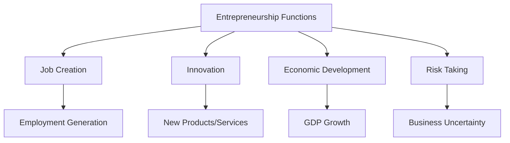
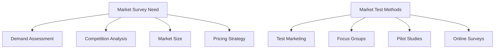
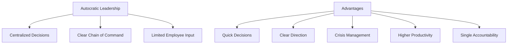
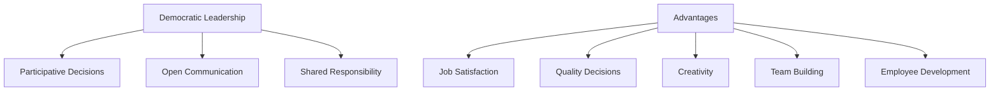
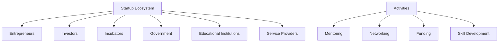
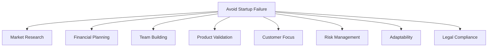
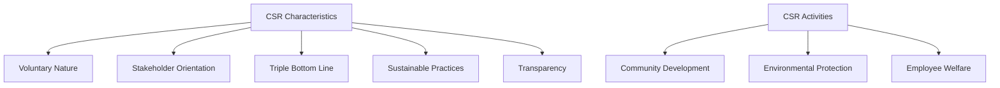
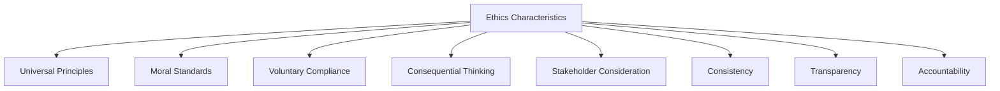

## Question 1(a) [3 marks]

**Distinguish between Entrepreneur and Manager.**

**Answer**:

| Aspect | Entrepreneur | Manager |
|--------|-------------|---------|
| **Primary Role** | Creates new ventures and opportunities | Administers existing operations |
| **Risk Taking** | High risk-taker, bears uncertainty | Low to moderate risk, follows guidelines |
| **Decision Making** | Quick, intuitive decisions | Systematic, policy-based decisions |
| **Focus** | Innovation and growth | Efficiency and control |
| **Rewards** | Profit and ownership | Salary and benefits |

**Mnemonic:** "CRIFO" - Creates Risk Innovation Focus Ownership

## Question 1(b) [4 marks]

**Explain any four functions of Entrepreneurship.**

**Answer**:

- **Job Creation**: Entrepreneurs establish new businesses, creating employment opportunities for others
- **Innovation**: They introduce new products, services, or processes to meet market needs
- **Economic Development**: Generate wealth, contribute to GDP, and stimulate economic growth
- **Risk Taking**: Accept business uncertainties and financial risks for potential profits

**Diagram:**



**Mnemonic:** "JIER" - Job Innovation Economic Risk

## Question 1(c) [7 marks]

**How MSMEs are important in the development of economy of India?**

**Answer**:

| Contribution Area | Importance |
|------------------|------------|
| **Employment Generation** | Second largest employer after agriculture |
| **Industrial Production** | Contributes 45% of manufacturing output |
| **Export Earnings** | Accounts for 40% of total exports |
| **GDP Contribution** | Contributes around 30% to India's GDP |
| **Rural Development** | Promotes balanced regional growth |

- **Manufacturing Flexibility**: Quick adaptation to market changes and customer requirements
- **Innovation Hub**: Supports large industries as suppliers and vendors
- **Entrepreneurship Development**: Encourages individual business ownership and self-employment

**Mnemonic:** "EIGER-MIE" - Employment Industrial GDP Export Rural Manufacturing Innovation Entrepreneurship

## Question 1(c) OR [7 marks]

**How Student Start-up and Innovation Policy (SSIP) helps diploma students to start their own start-up?**

**Answer**:

| SSIP Benefits | Description |
|---------------|-------------|
| **Financial Support** | Seed funding and grants up to ₹2 lakhs |
| **Incubation Centers** | Access to 50+ incubation centers across Gujarat |
| **Mentorship** | Industry expert guidance and counseling |
| **Infrastructure** | Free co-working spaces and equipment access |
| **Skill Development** | Entrepreneurship training programs |

- **Academic Integration**: Start-up activities counted as academic credits
- **IPR Support**: Help in patent filing and intellectual property protection
- **Market Access**: Networking opportunities with investors and industry partners

**Mnemonic:** "FIMSAIM" - Financial Incubation Mentorship Skill Academic IPR Market

## Question 2(a) [3 marks]

**What is project report? Show its importance in project implementation.**

**Answer**:

A **project report** is a comprehensive document containing detailed information about a proposed business venture including technical, financial, and commercial aspects.

**Importance:**

- **Loan Approval**: Banks require project reports for financing decisions
- **Resource Planning**: Helps in proper allocation of resources and manpower
- **Risk Assessment**: Identifies potential challenges and mitigation strategies

**Mnemonic:** "LRR" - Loan Resource Risk

## Question 2(b) [4 marks]

**How the Break-Even Point (in terms of sales revenue) is calculated? Also show graphical representation with example.**

**Answer**:

**Formula:** Break-Even Point (Sales) = Fixed Costs ÷ Contribution Margin Ratio

Where: Contribution Margin Ratio = (Sales - Variable Costs) ÷ Sales

**Example:**

- Fixed Costs = ₹50,000
- Selling Price per unit = ₹100
- Variable Cost per unit = ₹60
- Contribution per unit = ₹40
- Contribution Margin Ratio = 40%
- Break-Even Sales = ₹50,000 ÷ 0.40 = ₹1,25,000

**Diagram:**

```goat
    Revenue/Costs (₹)
         |
    2,00,000 |     /
             |    /  Total Revenue
    1,50,000 |   /
             |  /
    1,25,000 |./_____ Break-Even Point
             |/     
    1,00,000 |      Total Costs
             |     /
     50,000  |____/_____ Fixed Costs
             |
             +------------------------> Units Sold
             0   500  1,250  2,000
```

**Mnemonic:** "FCR" - Fixed Costs Contribution Ratio

## Question 2(c) [7 marks]

**Explain the need of market survey and also explain the market test method of market survey.**

**Answer**:

**Need of Market Survey:**

| Purpose | Description |
|---------|-------------|
| **Demand Assessment** | Understand customer needs and preferences |
| **Competition Analysis** | Study competitor strategies and pricing |
| **Market Size** | Estimate total addressable market |
| **Pricing Strategy** | Determine optimal price points |

**Market Test Method:**

- **Test Marketing**: Launch product in limited geographic area
- **Focus Groups**: Conduct discussions with target customers
- **Pilot Studies**: Small-scale product trials with selected customers
- **Online Surveys**: Digital questionnaires for broader reach



**Mnemonic:** "DCMP-TFPO" - Demand Competition Market Pricing Test Focus Pilot Online

## Question 2(a) OR [3 marks]

**What is marketing plan? Explain in brief.**

**Answer**:

A **marketing plan** is a strategic document outlining how a business will promote and sell its products or services to target customers.

**Components:**

- **Market Analysis**: Customer demographics and behavior study
- **Marketing Mix**: Product, Price, Place, Promotion strategies
- **Budget Allocation**: Financial resources for marketing activities

**Mnemonic:** "AMB" - Analysis Mix Budget

## Question 2(b) OR [4 marks]

**Prepare SWOT analysis for a company manufacturing e-bike in urban region in Gujarat.**

**Answer**:

| SWOT Analysis | E-bike Manufacturing Company |
|---------------|----------------------------|
| **Strengths** | • Government support for electric vehicles<br>• Growing environmental awareness<br>• Lower operating costs than petrol vehicles |
| **Weaknesses** | • High initial investment<br>• Limited charging infrastructure<br>• Battery replacement costs |
| **Opportunities** | • FAME scheme subsidies<br>• Urban pollution concerns<br>• Rising fuel prices |
| **Threats** | • Competition from established players<br>• Technology obsolescence<br>• Economic slowdown affecting purchasing power |

**Mnemonic:** "SWOT-GILH" - Strengths Weaknesses Opportunities Threats Government Infrastructure Low High

## Question 2(c) OR [7 marks]

**What is innovation? List any five innovations of any product or process or service.**

**Answer**:

**Innovation** is the process of creating new or improved products, services, or processes that provide value to customers and competitive advantage to organizations.

**Five Product/Service Innovations:**

| Innovation | Type | Description |
|------------|------|-------------|
| **UPI Payment System** | Service | Digital payment platform revolutionizing transactions |
| **Tesla Electric Cars** | Product | Sustainable automotive technology with autonomous features |
| **Netflix Streaming** | Service | On-demand entertainment delivery model |
| **3D Printing** | Process | Additive manufacturing technology |
| **Zoom Video Calling** | Service | Remote communication platform for virtual meetings |

- **Value Creation**: Each innovation solved existing customer problems
- **Market Disruption**: Changed traditional business models and user behavior
- **Technology Integration**: Combined multiple technologies for enhanced user experience

**Mnemonic:** "UNTZI-VTM" - UPI Netflix Tesla Zoom Innovation Value Technology Market

## Question 3(a) [3 marks]

**Write short note on partnership firm.**

**Answer**:

A **partnership firm** is a business structure where two or more individuals jointly own and operate a business for profit.

**Key Features:**

- **Shared Ownership**: Multiple partners contribute capital and expertise
- **Joint Liability**: Partners are personally liable for business debts
- **Profit Sharing**: Earnings distributed according to partnership agreement

**Mnemonic:** "SJP" - Shared Joint Profit

## Question 3(b) [4 marks]

**Explain the various activities involved in 'staffing' function of management with example.**

**Answer**:

| Staffing Activity | Description | Example |
|------------------|-------------|---------|
| **Recruitment** | Attracting potential candidates | Posting job advertisements on LinkedIn |
| **Selection** | Choosing suitable candidates | Conducting interviews and aptitude tests |
| **Training** | Skill development programs | New employee orientation sessions |
| **Performance Appraisal** | Evaluating employee performance | Annual performance reviews |

- **Placement**: Assigning right person to right job position
- **Promotion**: Career advancement based on performance and experience
- **Compensation**: Determining fair wages and benefits package

**Mnemonic:** "RSTPPC" - Recruitment Selection Training Performance Placement Promotion Compensation

## Question 3(c) [7 marks]

**Explain the autocratic leadership and state its advantages.**

**Answer**:

**Autocratic Leadership** is a management style where the leader makes all decisions independently without consulting team members.

**Characteristics:**

- **Centralized Decision Making**: Leader has complete authority and control
- **Clear Chain of Command**: Well-defined hierarchy and reporting structure
- **Limited Employee Input**: Minimal participation in decision-making process

**Advantages:**

| Advantage | Description |
|-----------|-------------|
| **Quick Decisions** | Faster problem-solving without lengthy consultations |
| **Clear Direction** | Employees know exactly what is expected |
| **Crisis Management** | Effective during emergencies requiring immediate action |
| **Productivity** | Higher output due to structured work environment |
| **Accountability** | Single point of responsibility for outcomes |



**Mnemonic:** "QCCPA" - Quick Clear Crisis Productivity Accountability

## Question 3(a) OR [3 marks]

**Write short note on joint stock company.**

**Answer**:

A **joint stock company** is a business organization where capital is divided into shares owned by multiple shareholders.

**Key Features:**

- **Limited Liability**: Shareholders' liability limited to their investment
- **Transferable Shares**: Ownership can be easily bought and sold
- **Separate Legal Entity**: Company exists independently of its owners

**Mnemonic:** "LTS" - Limited Transferable Separate

## Question 3(b) OR [4 marks]

**Explain the various activities involved in 'organizing' function of management with example.**

**Answer**:

| Organizing Activity | Description | Example |
|-------------------|-------------|---------|
| **Job Design** | Defining roles and responsibilities | Creating job descriptions for marketing manager |
| **Departmentalization** | Grouping similar activities | Forming HR, Finance, and Operations departments |
| **Delegation** | Assigning authority and responsibility | Manager delegating budget approval to team leads |
| **Coordination** | Ensuring smooth workflow | Weekly inter-department meetings |

- **Resource Allocation**: Distributing financial and human resources efficiently
- **Span of Control**: Determining number of subordinates per manager
- **Unity of Command**: Each employee reports to one superior

**Mnemonic:** "JDDCRSU" - Job Departmentalization Delegation Coordination Resource Span Unity

## Question 3(c) OR [7 marks]

**Explain the democratic leadership and state its advantages.**

**Answer**:

**Democratic Leadership** is a management style where leaders involve team members in decision-making processes and encourage participation.

**Characteristics:**

- **Participative Decision Making**: Team members contribute to problem-solving
- **Open Communication**: Two-way communication between leaders and employees
- **Shared Responsibility**: Collective ownership of outcomes and results

**Advantages:**

| Advantage | Description |
|-----------|-------------|
| **Higher Job Satisfaction** | Employees feel valued and heard |
| **Better Quality Decisions** | Multiple perspectives improve decision quality |
| **Improved Creativity** | Diverse ideas and innovative solutions |
| **Team Building** | Stronger collaboration and trust |
| **Employee Development** | Skills enhancement through participation |



**Mnemonic:** "JQCTE" - Job Quality Creativity Team Employee

## Question 4(a) [3 marks]

**State various functions of District Industries center.**

**Answer**:

- **Registration Services**: MSME registration and various license approvals
- **Financial Assistance**: Guidance for loans and government scheme applications
- **Technical Support**: Providing technical guidance and consultancy services

**Mnemonic:** "RFT" - Registration Financial Technical

## Question 4(b) [4 marks]

**Identify any two state level incubators and write their functions.**

**Answer**:

| Incubator | Functions |
|-----------|-----------|
| **i-HUB Gujarat** | • Startup mentoring and acceleration programs<br>• Funding support and investor connections<br>• Infrastructure and co-working space facilities |
| **CIIE Ahmedabad** | • Technology commercialization support<br>• Industry-academia collaboration<br>• Scale-up programs for growing startups |

**Common Functions:**

- **Mentorship Programs**: Expert guidance from industry professionals
- **Networking Events**: Connecting startups with investors and partners

**Mnemonic:** "MFIN" - Mentoring Funding Infrastructure Networking

## Question 4(c) [7 marks]

**What is start-up eco system? List various activities and elements of start-up eco system.**

**Answer**:

**Start-up Ecosystem** is a interconnected network of organizations, individuals, and resources that support entrepreneurship and startup development.

**Key Elements:**

| Element | Description |
|---------|-------------|
| **Entrepreneurs** | Visionary individuals starting new ventures |
| **Investors** | Angel investors, VCs providing funding |
| **Incubators/Accelerators** | Support organizations for early-stage startups |
| **Government** | Policy makers and regulatory bodies |
| **Educational Institutions** | Universities and research centers |
| **Service Providers** | Legal, accounting, consulting firms |

**Activities:**

- **Mentoring Sessions**: Regular guidance from experienced entrepreneurs
- **Networking Events**: Startup meetups and investor pitch sessions
- **Funding Rounds**: Seed, Series A, B funding opportunities
- **Skill Development**: Technical and business training programs



**Mnemonic:** "EIGEES-MNFS" - Entrepreneurs Investors Government Education Service Mentoring Networking Funding Skill

## Question 4(a) OR [3 marks]

**State various functions of Small industries Development Bank of India (SIDBI).**

**Answer**:

- **Financial Services**: Direct and indirect lending to MSMEs and startups
- **Development Services**: Capacity building and skill development programs
- **Promotional Activities**: Market development and technology upgradation support

**Mnemonic:** "FDP" - Financial Development Promotional

## Question 4(b) OR [4 marks]

**Identify any two national level incubators and write their functions.**

**Answer**:

| Incubator | Functions |
|-----------|-----------|
| **T-Hub Hyderabad** | • India's largest startup incubator<br>• Technology innovation and R&D support<br>• Global market access programs |
| **NASSCOM 10,000 Startups** | • Pan-India startup acceleration program<br>• Corporate partnership facilitation<br>• Ecosystem building and policy advocacy |

**Common Functions:**

- **Acceleration Programs**: Intensive startup development and mentoring
- **Corporate Connections**: Linking startups with large enterprise partners

**Mnemonic:** "TIGAC" - Technology Innovation Global Acceleration Corporate

## Question 4(c) OR [7 marks]

**Which steps should be taken to avoid failure of start-up? Explain in brief.**

**Answer**:

**Steps to Avoid Startup Failure:**

| Step | Description |
|------|-------------|
| **Market Research** | Thorough understanding of customer needs and market demand |
| **Financial Planning** | Proper cash flow management and funding strategies |
| **Team Building** | Hiring skilled and committed team members |
| **Product Validation** | Testing product-market fit before full launch |
| **Customer Focus** | Continuous customer feedback and satisfaction |

- **Risk Management**: Identifying potential threats and mitigation strategies
- **Adaptability**: Flexibility to pivot based on market changes
- **Legal Compliance**: Proper registration and regulatory adherence



**Mnemonic:** "MFTPCRAL" - Market Financial Team Product Customer Risk Adaptability Legal

## Question 5(a) [3 marks]

**How Return on Investment (ROI) is calculated?**

**Answer**:

**ROI Formula:** ROI = (Net Profit ÷ Total Investment) × 100

**Example:**

- Investment = ₹1,00,000
- Net Profit = ₹20,000
- ROI = (20,000 ÷ 1,00,000) × 100 = 20%

**Mnemonic:** "NTH" - Net Total Hundred

## Question 5(b) [4 marks]

**Show the significance of technical analysis in feasibility study.**

**Answer**:

| Significance | Description |
|--------------|-------------|
| **Technology Assessment** | Evaluating technical viability and requirements |
| **Resource Planning** | Determining machinery, equipment, and infrastructure needs |
| **Process Design** | Optimal production methods and workflow |
| **Quality Standards** | Ensuring product meets industry specifications |

**Mnemonic:** "TRPQ" - Technology Resource Process Quality

## Question 5(c) [7 marks]

**Explain the characteristics of corporate social responsibility.**

**Answer**:

**Corporate Social Responsibility (CSR)** refers to business practices involving initiatives that benefit society and demonstrate commitment to ethical operations.

**Key Characteristics:**

| Characteristic | Description |
|----------------|-------------|
| **Voluntary Nature** | Beyond legal requirements, self-imposed commitments |
| **Stakeholder Orientation** | Considering impact on all stakeholders, not just shareholders |
| **Triple Bottom Line** | Focus on People, Planet, and Profit |
| **Sustainable Practices** | Long-term environmental and social sustainability |
| **Transparency** | Open reporting and accountability |

- **Community Development**: Education, healthcare, and infrastructure projects
- **Environmental Protection**: Pollution control and resource conservation
- **Employee Welfare**: Fair wages, safe working conditions, skill development



**Mnemonic:** "VSTST-CEE" - Voluntary Stakeholder Triple Sustainable Transparency Community Environmental Employee

## Question 5(a) OR [3 marks]

**How Return on Sales (ROS) is calculated?**

**Answer**:

**ROS Formula:** ROS = (Net Profit ÷ Net Sales) × 100

**Example:**

- Net Sales = ₹5,00,000
- Net Profit = ₹50,000
- ROS = (50,000 ÷ 5,00,000) × 100 = 10%

**Mnemonic:** "NSH" - Net Sales Hundred

## Question 5(b) OR [4 marks]

**Show the significance of market analysis in feasibility study.**

**Answer**:

| Significance | Description |
|--------------|-------------|
| **Demand Forecasting** | Estimating future market size and growth |
| **Competition Assessment** | Understanding competitive landscape |
| **Pricing Strategy** | Determining optimal price points |
| **Market Segmentation** | Identifying target customer groups |

**Mnemonic:** "DCPM" - Demand Competition Pricing Market

## Question 5(c) OR [7 marks]

**Explain the characteristics of ethics.**

**Answer**:

**Ethics** are moral principles that govern behavior and decision-making in personal and professional contexts.

**Key Characteristics:**

| Characteristic | Description |
|----------------|-------------|
| **Universal Principles** | Apply across cultures and situations |
| **Moral Standards** | Based on concepts of right and wrong |
| **Voluntary Compliance** | Internal motivation rather than external force |
| **Consequential Thinking** | Considering outcomes and impacts |
| **Stakeholder Consideration** | Accounting for all affected parties |

- **Consistency**: Ethical behavior remains constant across situations
- **Transparency**: Open and honest communication and actions
- **Accountability**: Taking responsibility for decisions and their consequences



**Mnemonic:** "UMVCSCTA" - Universal Moral Voluntary Consequential Stakeholder Consistency Transparency Accountability
