## પ્રશ્ન 1(અ) [3 માર્ક્સ]

**નીચેનાની વ્યાખ્યા સમજાવો. (૧) રેસીસ્તંસ (૨) ઈલેક્ટ્રીકલ એનર્જી (૩) ઈલેક્ટ્રીકલ પાવર**

**જવાબ**:

| શબ્દ | વ્યાખ્યા |
|------|------------|
| **રેસીસ્તંસ** | પદાર્થનો ગુણ જે વીજ પ્રવાહના પ્રવાહનો વિરોધ કરે છે, ઓહમ (Ω)માં માપવામાં આવે છે |
| **ઈલેક્ટ્રીકલ એનર્જી** | વીજળી દ્વારા કાર્ય કરવાની ક્ષમતા, જૂલ (J) અથવા કિલોવોટ-કલાક (kWh)માં માપવામાં આવે છે |
| **ઈલેક્ટ્રીકલ પાવર** | વીજળીની ઊર્જાના સ્થાનાંતરણ અથવા રૂપાંતરણનો દર, વોટ (W)માં માપવામાં આવે છે |

**મેમરી ટ્રીક:** "RIP" - Resistance Impedes Path, Energy Is Potential, Power Is Performance

## પ્રશ્ન 1(બ) [4 માર્ક્સ]

**ઓહ્મ ના નિયમ નું વિધાન લખી સમજાઓ. તેની મર્યાદા લખો.**

**જવાબ**:

**ઓહ્મનો નિયમ**: કોઈ વાહક મારફતે વહેતો પ્રવાહ વાહકના બે છેડા વચ્ચેના વિભવાંતરના સમપ્રમાણમાં અને વાહકના અવરોધના વ્યસ્ત પ્રમાણમાં હોય છે.

ગાણિતિક રીતે: V = IR, જ્યાં:

- V = વોલ્ટેજ (વોલ્ટ)
- I = પ્રવાહ (એમ્પિયર)
- R = અવરોધ (ઓહમ)

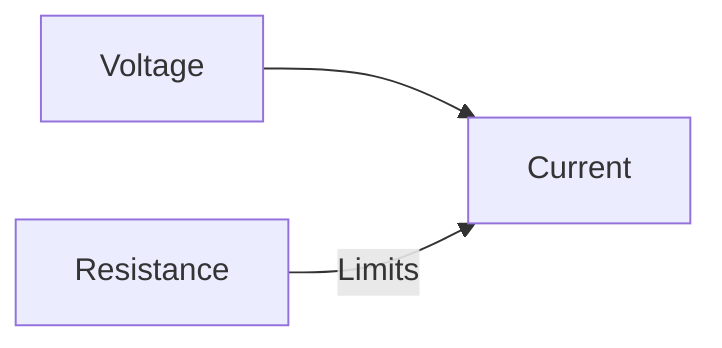

**ઓહ્મના નિયમની મર્યાદાઓ**:

- બિન-રેખીય ઉપકરણો (અર્ધવાહકો, ગેસ ડિસ્ચાર્જ ટ્યુબ) માટે લાગુ પડતો નથી
- ઉચ્ચ તાપમાને લાગુ પડતો નથી
- એકતરફી તત્વો (ડાયોડ) માટે માન્ય નથી
- સમય-પરિવર્તિત પ્રવાહો માટે નિષ્ફળ જાય છે

**મેમરી ટ્રીક:** "VIRO" - Voltage Is Resistance times Output current

## પ્રશ્ન 1(ક) [7 માર્ક્સ]

**બેટ્રીની શ્રેણી અને સમાંતર જોડાણ સમજાવો.**

**જવાબ**:

**બેટ્રીનું શ્રેણી જોડાણ:**


**શ્રેણી જોડાણની લાક્ષણિકતાઓ:**

- **કુલ વોલ્ટેજ** = વ્યક્તિગત વોલ્ટેજનો સરવાળો (V = V₁ + V₂ + ... + Vₙ)
- **પ્રવાહ** = બધી બેટરીઓમાં સમાન
- **ઉપયોગો**: ઉચ્ચ વોલ્ટેજની જરૂરિયાતો
- **આંતરિક અવરોધ**: વધે છે (Rₛ = r₁ + r₂ + ... + rₙ)

**બેટ્રીનું સમાંતર જોડાણ:**

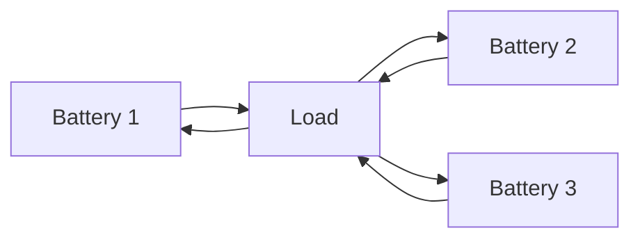

**સમાંતર જોડાણની લાક્ષણિકતાઓ:**

- **વોલ્ટેજ** = વ્યક્તિગત બેટરી જેટલું જ (જો સમાન હોય તો)
- **કુલ પ્રવાહ** = વ્યક્તિગત પ્રવાહોનો સરવાળો (I = I₁ + I₂ + ... + Iₙ)
- **ઉપયોગો**: વધુ પ્રવાહ ક્ષમતાની જરૂર છે
- **આંતરિક અવરોધ**: ઘટે છે (1/Rₚ = 1/r₁ + 1/r₂ + ... + 1/rₙ)

**મેમરી ટ્રીક:** "VSCP" - Voltage Sums in Series, Current Parallels

## પ્રશ્ન 1(ક) OR [7 માર્ક્સ]

**રેસિસ્ટરની શ્રેણી અને સમાંતર જોડાણ સમજાવો.**

**જવાબ**:

**રેસિસ્ટરનું શ્રેણી જોડાણ:**

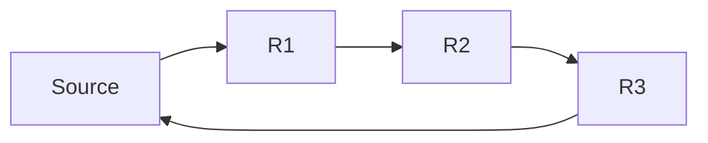

**શ્રેણી જોડાણની લાક્ષણિકતાઓ:**

- **સમતુલ્ય અવરોધ** = વ્યક્તિગત અવરોધોનો સરવાળો (Rₛ = R₁ + R₂ + ... + Rₙ)
- **પ્રવાહ** = બધા રેસિસ્ટરોમાં સમાન
- **વોલ્ટેજ** = અવરોધના મૂલ્યોના પ્રમાણમાં રેસિસ્ટરો પર વિભાજિત
- **પાવર** વોલ્ટેજ વિતરણ અનુસાર વહેંચાયેલો

**રેસિસ્ટરનું સમાંતર જોડાણ:**

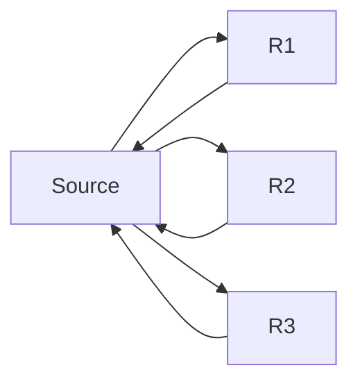

**સમાંતર જોડાણની લાક્ષણિકતાઓ:**

- **સમતુલ્ય અવરોધ**: 1/Rₚ = 1/R₁ + 1/R₂ + ... + 1/Rₙ
- **વોલ્ટેજ** = બધા રેસિસ્ટરોમાં સમાન
- **પ્રવાહ** = અવરોધના મૂલ્યોના વ્યસ્ત પ્રમાણમાં વિભાજિત
- **કુલ પ્રવાહ** = વ્યક્તિગત પ્રવાહોનો સરવાળો

**મેમરી ટ્રીક:** "RISE-VICE" - Resistance Increases in Series, Voltage Is Constant in Every parallel

## પ્રશ્ન 2(અ) [3 માર્ક્સ]

**વ્યાખ્યા આપો (૧) એમ્પલીટ્યુડ (૨) આવૃત્તિ (૩) ટાઈમ પિરીયડ**

**જવાબ**:

| શબ્દ | વ્યાખ્યા |
|------|------------|
| **એમ્પલીટ્યુડ** | વેવફોર્મનું તેના મધ્ય સ્થાનથી મહત્તમ વિચલન, વોલ્ટ અથવા એમ્પિયરમાં માપવામાં આવે છે |
| **આવૃત્તિ** | એક સેકન્ડમાં થતા પૂર્ણ ચક્રોની સંખ્યા, હર્ટઝ (Hz)માં માપવામાં આવે છે |
| **ટાઈમ પિરીયડ** | વેવફોર્મના એક ચક્રને પૂર્ણ કરવા માટે લાગતો સમય, સેકન્ડ (s)માં માપવામાં આવે છે |

**મેમરી ટ્રીક:** "AFT" - Amplitude is the Full height, Time period is the Total cycle

## પ્રશ્ન 2(બ) [4 માર્ક્સ]

**10Ω, 20Ω અને 30Ω રેસિસ્ટર શ્રેણીમાં જોડાયેલા છે અને તેમને 100V સપ્લાય આપવામાં આવે છે. શોધો (1) સમતુલ્ય પ્રતિરોધ (2) સર્કિટ કરંટ (3) દરેક રેસિસ્ટરમાં વોલ્ટેજ ડ્રોપ. (4) દરેક રેસિસ્ટરમાં પાવર લોસ.**

**જવાબ**:

**આકૃતિ:**

```goat
     +--[10Ω]--[20Ω]--[30Ω]--+
     |                        |
   (100V)                     |
     |                        |
     +------------------------+
```

**ઉકેલ:**

| પરિમાણ | ગણતરી | પરિણામ |
|-----------|-------------|--------|
| સમતુલ્ય અવરોધ | R = 10Ω + 20Ω + 30Ω | 60Ω |
| સર્કિટ કરંટ | I = 100V/60Ω | 1.67A |
| 10Ω માં વોલ્ટેજ | V₁ = 1.67A × 10Ω | 16.7V |
| 20Ω માં વોલ્ટેજ | V₂ = 1.67A × 20Ω | 33.3V |
| 30Ω માં વોલ્ટેજ | V₃ = 1.67A × 30Ω | 50.0V |
| 10Ω માં પાવર | P₁ = 1.67² × 10 | 27.8W |
| 20Ω માં પાવર | P₂ = 1.67² × 20 | 55.6W |
| 30Ω માં પાવર | P₃ = 1.67² × 30 | 83.4W |

**મેમરી ટ્રીક:** "REÇVP" - Resistances Equivalent Causes Voltage and Power division

## પ્રશ્ન 2(ક) [7 માર્ક્સ]

**વેવ ફોર્મ અને વેક્ટર ડાયાગ્રામ સાથે શુદ્ધ રેસિસ્ટર માં A.C સમજાવો.**

**જવાબ**:

શુદ્ધ અવરોધી સર્કિટમાં AC સપ્લાય સાથે:

**મુખ્ય લાક્ષણિકતાઓ:**

- કરંટ અને વોલ્ટેજ એકબીજા સાથે **ઇન-ફેઝ** (એક-તબક્કામાં) હોય છે
- સર્કિટ ઓહ્મના નિયમનું પાલન કરે છે: V = IR
- પાવર હંમેશા હકારાત્મક હોય છે (P = VI)
- કોઈ રિએક્ટિવ પાવરનો વપરાશ નથી
- પાવર ફેક્ટર = 1 (cos φ = 1)

**વેવફોર્મ:**

```goat
    │    ╭─╮   ╭─╮   ╭─╮   ╭─╮
    │   ╱   ╲ ╱   ╲ ╱   ╲ ╱   ╲
    │  ╱     V     V     V     ╲
────┼─╱───────────────────────╲─────
    │╱       ╱╲       ╱╲       ╲
    V       V  ╲     V  ╲       V
    │      ╱    ╲   ╱    ╲
    │     ╱      ╲ ╱      ╲
    │    ╰─╯     ╰─╯      ╰─╯

    --- Voltage waveform
    --- Current waveform (identical phase)
```

**વેક્ટર ડાયાગ્રામ:**

```goat
         │
         │
         V (voltage)
         │
         │
─────────┼────────→
         │        I (current)
         │
         │
```

**મેમરી ટ્રીક:** "PARVIP" - Pure AC Resistor has Voltage In Phase with current

## પ્રશ્ન 2(અ) OR [3 માર્ક્સ]

**વ્યાખ્યાયિત કરો: (1) સાઈકલ (2) ફોર્મ ફેક્ટર (3) પીક ફેક્ટર**

**જવાબ**:

| શબ્દ | વ્યાખ્યા |
|------|------------|
| **સાઈકલ** | આવર્તી વેવફોર્મનું એક પૂર્ણ પુનરાવર્તન શરૂઆતના બિંદુથી તે જ બિંદુ સુધી |
| **ફોર્મ ફેક્ટર** | AC વેવફોર્મના RMS મૂલ્યનો સરેરાશ મૂલ્ય સાથેનો ગુણોત્તર (સાઇન વેવ માટે = 1.11) |
| **પીક ફેક્ટર** | AC વેવફોર્મના મહત્તમ મૂલ્યનો RMS મૂલ્ય સાથેનો ગુણોત્તર (સાઇન વેવ માટે = 1.414) |

**મેમરી ટ્રીક:** "CFP" - Cycle Finishes a Pattern, Form Factor = Vrms/Vavg, Peak Factor = Vmax/Vrms

## પ્રશ્ન 2(બ) OR [4 માર્ક્સ]

**20Ω, 30Ω અને 50Ω રેસિસ્ટર સમાંતર રીતે જોડાયેલા છે અને તેમને 60V સપ્લાય આપવામાં આવે છે. તો (1) દરેક રેસિસ્ટરમાંથી પસાર થતો પ્રવાહ (2) કુલ કરંટ (3) સમતુલ્ય પ્રતિરોધ (4) દરેક રેસિસ્ટરમાં પાવર લોસ. શોધો.**

**જવાબ**:

**આકૃતિ:**

```goat
         ┌─[20Ω]─┐
         │       │
     +───┼───────┼───+
     │   │       │   │
    (60V) ├─[30Ω]─┤  │
     │   │       │   │
     │   └─[50Ω]─┘   │
     │               │
     +───────────────+
```

**ઉકેલ:**

| પરિમાણ | ગણતરી | પરિણામ |
|-----------|-------------|--------|
| 20Ω માં કરંટ | I₁ = 60V/20Ω | 3A |
| 30Ω માં કરંટ | I₂ = 60V/30Ω | 2A |
| 50Ω માં કરંટ | I₃ = 60V/50Ω | 1.2A |
| કુલ કરંટ | I = 3A + 2A + 1.2A | 6.2A |
| સમતુલ્ય અવરોધ | 1/Req = 1/20 + 1/30 + 1/50 | 9.68Ω |
| 20Ω માં પાવર | P₁ = 60V × 3A | 180W |
| 30Ω માં પાવર | P₂ = 60V × 2A | 120W |
| 50Ω માં પાવર | P₃ = 60V × 1.2A | 72W |

**મેમરી ટ્રીક:** "VICTIM" - Voltage Is Constant, Total current Is the Measure (in parallel)

## પ્રશ્ન 2(ક) OR [7 માર્ક્સ]

**વેવફોર્મ અને વેક્ટર ડાયાગ્રામ સાથે શુદ્ધ કેપેસિટરમાં A.C સમજાવો.**

**જવાબ**:

શુદ્ધ કેપેસિટીવ સર્કિટમાં AC સપ્લાય સાથે:

**મુખ્ય લાક્ષણિકતાઓ:**

- કરંટ વોલ્ટેજથી 90° **આગળ** હોય છે
- કેપેસિટીવ રિએક્ટન્સ Xc = 1/(2πfC)
- માત્ર રિએક્ટિવ પાવર (એક્ટિવ પાવર નહીં)
- પાવર ફેક્ટર = 0 (લેગિંગ)
- સંપૂર્ણ ચક્ર દરમિયાન સરેરાશ પાવર = 0

**વેવફોર્મ:**

```goat
           Current
    │      ╭─╮     ╭─╮     ╭─╮     ╭─╮
    │     ╱   ╲   ╱   ╲   ╱   ╲   ╱   ╲
    │    ╱     ╲ ╱     ╲ ╱     ╲ ╱     ╲
────┼───╱───────V───────V───────V───────╲─
    │  ╱         ╲       ╲       ╲       ╲
    │ ╱           ╲       ╲       ╲       ╲
    │╱             ╲       ╲       ╲       ╲
    V               ╰─╮     ╰─╮     ╰─╮     ╰
    │                 │       │       │
    │                 │       │       │
    │                 │       │       │
    │                 V       V       V     
    │                ╱ ╲     ╱ ╲     ╱ ╲   Voltage
    │               ╱   ╲   ╱   ╲   ╱   ╲ 
    │              ╱     ╲ ╱     ╲ ╱     ╲
```

**વેક્ટર ડાયાગ્રામ:**

```goat
         │ I (current)
         │
         │
         │
─────────┼────────→
         │
         │
         │
         V V (voltage)
```

**મેમરી ટ્રીક:** "CLEAR-90" - Capacitive Load has Electrical Angle Reaching 90° (current leads voltage)

## પ્રશ્ન 3(અ) [3 માર્ક્સ]

**અલ્તેનિતંગ વેવફોર્મ માટે આરએમએસ વેલ્યુ અને એવરેજ વેલ્યુની વ્યાખ્યા આપો તથા તેમની ફોર્મ્યુલા લખો.**

**જવાબ**:

| શબ્દ | વ્યાખ્યા | ફોર્મ્યુલા |
|------|------------|---------|
| **RMS વેલ્યુ** | રૂટ મીન સ્ક્વેર વેલ્યુ - સમાન હીટિંગ ઈફેક્ટ આપતું DC મૂલ્ય | Vrms = 0.707 × Vmax (સાઇન વેવ માટે) |
| **એવરેજ વેલ્યુ** | અર્ધા ચક્ર દરમિયાન તમામ ઇન્સ્ટન્ટેનિયસ મૂલ્યોનું સરેરાશ મૂલ્ય | Vavg = 0.637 × Vmax (સાઇન વેવ માટે) |

**મેમરી ટ્રીક:** "RAM" - RMS Averages the Mean square (RMS = 0.707×Vmax, AVG = 0.637×Vmax)

## પ્રશ્ન 3(બ) [4 માર્ક્સ]

**એ.સી.કરંટ i=25 sin(314t). તો (૧) આર.એમ.એસ કીમત (૨) એવરેજ વેલ્યુ (૩) આવૃત્તિ (૪) ટાઈમ પીરીયડ**

**જવાબ**:

**આપેલ સમીકરણ:** i = 25 sin(314t)

| પરિમાણ | ગણતરી | પરિણામ |
|-----------|-------------|--------|
| મહત્તમ મૂલ્ય | Imax = 25 A | 25 A |
| RMS મૂલ્ય | Irms = Imax/√2 = 25/1.414 | 17.68 A |
| સરેરાશ મૂલ્ય | Iavg = 2Imax/π = 2×25/3.14 | 15.92 A |
| કોણીય આવૃત્તિ | ω = 314 rad/s | 314 rad/s |
| આવૃત્તિ | f = ω/2π = 314/6.28 | 50 Hz |
| સમય અવધિ | T = 1/f = 1/50 | 0.02 s |

**મેમરી ટ્રીક:** "SMART" - Sine's Maximum divided by root 2 equals RMS Then 2/π for Average

## પ્રશ્ન 3(ક) [7 માર્ક્સ]

**અવરોધોનું સ્ટાર જોડાણ સમજાઓ અને સ્ટાર જોડાણમાં વોલ્ટેજ અને કરંત વચ્ચેના સંબંધ નું સમીકરણ તારવો.**

**જવાબ**:

**સ્ટાર (Y) જોડાણ:**

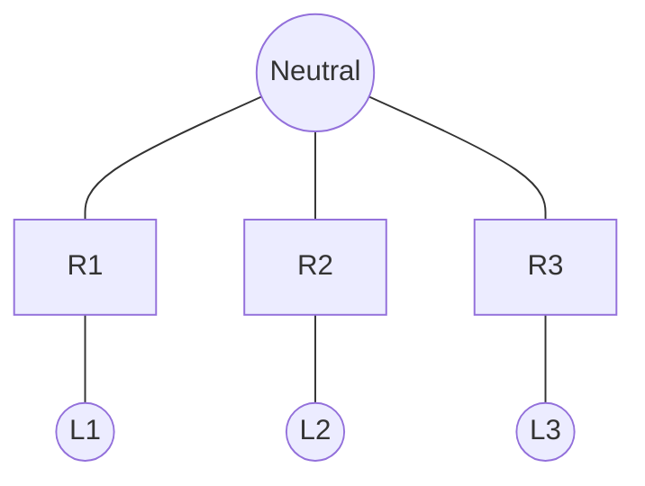

**સ્ટાર જોડાણની લાક્ષણિકતાઓ:**

- ત્રણ અવરોધો સામાન્ય બિંદુ (ન્યૂટ્રલ) પર જોડાયેલા છે
- લાઈન વોલ્ટેજ (VL) = √3 × ફેઝ વોલ્ટેજ (Vph)
- લાઈન કરંટ (IL) = ફેઝ કરંટ (Iph)
- સંતુલિત લોડ માટે: IL = Iph
- કુલ પાવર = 3 × ફેઝ પાવર

**ગાણિતિક સંબંધ:**

- ફેઝ વોલ્ટેજ: Vph = VL/√3
- ફેઝ કરંટ: Iph = IL
- સંતુલિત અવરોધી લોડ માટે: Iph = Vph/R
- તેથી: IL = VL/(√3×R)

**મેમરી ટ્રીક:** "SLIP-3" - Star Line current Is Phase current, Line voltage is Phase voltage times root-3

## પ્રશ્ન 3(અ) OR [3 માર્ક્સ]

**અલ્તેનિતંગ E.M.F. કેવી રીતે ઉત્પન્ન થાય છે તે સમજાઓ.**

**જવાબ**:

**અલ્ટરનેટિંગ EMF ઉત્પાદન:**

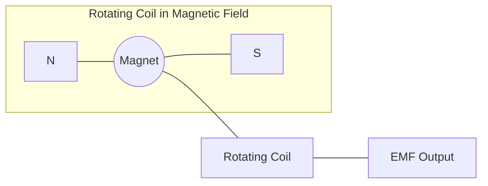

**પ્રક્રિયા:**

- કોઇલ એકસમાન ચુંબકીય ક્ષેત્રમાં ફરે છે
- ફેરફારના ખૂણા સાથે ફ્લક્સ લિંકેજ બદલાય છે
- ફ્લક્સના પરિવર્તનનો દર EMF પ્રેરિત કરે છે
- EMF સાઇન પેટર્ન અનુસરે છે: e = Emax sin(ωt)
- આવૃત્તિ રોટેશન સ્પીડ પર આધારિત છે

**મેમરી ટ્રીક:** "FRAME" - Flux Rotation Alternates Magnetic EMF

## પ્રશ્ન 3(બ) OR [4 માર્ક્સ]

**અલ્ટરનેતિંગ EMF= e=100 sin2π50t. તો (૧) EMF ની મેક્સિમમ વેલ્યુ (૨) આવૃત્તિ (૩) ટાઈમ પીરીયડ (૪) એગ્યુંલર આવૃત્તિ શોધો.**

**જવાબ**:

**આપેલ સમીકરણ:** e = 100 sin2π50t

| પરિમાણ | ગણતરી | પરિણામ |
|-----------|-------------|--------|
| મહત્તમ EMF | Emax = 100 V | 100 V |
| કોણીય આવૃત્તિ | ω = 2π50 = 314 rad/s | 314 rad/s |
| આવૃત્તિ | f = 50 Hz (સીધા સમીકરણમાંથી) | 50 Hz |
| સમય અવધિ | T = 1/f = 1/50 | 0.02 s |

**મેમરી ટ્રીક:** "FAST" - Frequency And period are reciprocals, Sin's Top value is maximum

## પ્રશ્ન 3(ક) OR [7 માર્ક્સ]

**અવરોધોનું ડેલ્ટા જોડાણ સમજાઓ અને ડેલ્ટા જોડાણમાં વોલ્ટેજ અને કરંત વચ્ચેના સંબંધ નું સમીકરણ તારવો.**

**જવાબ**:

**ડેલ્ટા (Δ) જોડાણ:**

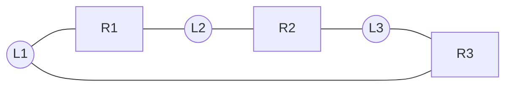

**ડેલ્ટા જોડાણની લાક્ષણિકતાઓ:**

- ત્રણ અવરોધો બંધ લૂપમાં જોડાયેલા છે
- લાઈન વોલ્ટેજ (VL) = ફેઝ વોલ્ટેજ (Vph)
- લાઈન કરંટ (IL) = √3 × ફેઝ કરંટ (Iph)
- સંતુલિત લોડ માટે: Vph = VL
- કુલ પાવર = 3 × ફેઝ પાવર

**ગાણિતિક સંબંધ:**

- ફેઝ વોલ્ટેજ: Vph = VL
- ફેઝ કરંટ: Iph = Vph/R
- લાઈન કરંટ: IL = √3 × Iph
- તેથી: IL = √3 × VL/R

**મેમરી ટ્રીક:** "DELVIr3" - Delta Equal Line Voltage, Its line current equals phase current times root-3

## પ્રશ્ન 4(અ) [3 માર્ક્સ]

**વ્યાખ્યા આપો (૧) એમ.એમ.એફ (૨) રીલક્તંસ (૩) ફ્લક્સ**

**જવાબ**:

| શબ્દ | વ્યાખ્યા |
|------|------------|
| **એમ.એમ.એફ. (મેગ્નેટોમોટિવ ફોર્સ)** | ચુંબકીય સર્કિટમાં ચુંબકીય ફ્લક્સ ઉત્પન્ન કરતું બળ, એમ્પિયર-ટર્ન્સ (AT)માં માપવામાં આવે છે |
| **રિલક્ટન્સ** | ચુંબકીય અવરોધનું સમકક્ષ, ચુંબકીય ફ્લક્સનો વિરોધ, AT/Wb માં માપવામાં આવે છે |
| **ફ્લક્સ** | કોઈ સપાટીમાંથી પસાર થતું કુલ ચુંબકીય ક્ષેત્ર, વેબર (Wb)માં માપવામાં આવે છે |

**મેમરી ટ્રીક:** "MFR" - MMF Flows against Reluctance like current flows against resistance

## પ્રશ્ન 4(બ) [4 માર્ક્સ]

**એ.સી. સર્કિટ માં એપેરંટ, એક્ટીવ તથા રીએક્ટીવ પાવર સમજાઓ**

**જવાબ**:

| પાવર પ્રકાર | પ્રતીક અને એકમ | વ્યાખ્યા |
|------------|---------------|------------|
| **એપેરંટ પાવર** | S (VA) | એક્ટિવ અને રિએક્ટિવ પાવરનો વેક્ટર સરવાળો |
| **એક્ટિવ પાવર** | P (W) | લોડ દ્વારા વપરાયેલો વાસ્તવિક કાર્ય-ઉત્પાદક પાવર |
| **રિએક્ટિવ પાવર** | Q (VAR) | સ્ત્રોત અને લોડ વચ્ચે આંદોલિત થતો પાવર |

**પાવર ત્રિકોણ:**

```goat
          ^ Q (Reactive Power)
          │
          │
          │
          │           S (Apparent Power)
          │         /
          │        /
          │       /
          │      /
          │     /
          │    θ
          │   /
          └──/───────────>
             P (Active Power)
```

**સંબંધો:**

- S = √(P² + Q²)
- P = S × cos θ
- Q = S × sin θ
- પાવર ફેક્ટર = cos θ = P/S

**મેમરી ટ્રીક:** "SPARQ" - S is Power Apparent, Real is P, Q is reactive

## પ્રશ્ન 4(ક) [7 માર્ક્સ]

**ઇલેક્ટ્રિક સર્કિટ તથા મેગનેટિક સર્કિટની સરખામણી કરો.**

**જવાબ**:

| પરિમાણ | ઇલેક્ટ્રિક સર્કિટ | મેગ્નેટિક સર્કિટ |
|-----------|-----------------|------------------|
| **બળ** | EMF (V) | MMF (AT) |
| **વિરોધ** | રેઝિસ્ટન્સ (Ω) | રિલક્ટન્સ (AT/Wb) |
| **પ્રવાહ** | કરંટ (A) | ફ્લક્સ (Wb) |
| **ઓહ્મનો નિયમ** | V = IR | MMF = Φ × S |
| **માધ્યમ** | કન્ડક્ટર | ફેરોમેગ્નેટિક મટીરિયલ |
| **ઊર્જા** | ઇલેક્ટ્રિક ફીલ્ડમાં સંગ્રહિત | મેગ્નેટિક ફીલ્ડમાં સંગ્રહિત |
| **લીકેજ** | નગણ્ય | નોંધપાત્ર |
| **પાથ** | કન્ડક્ટર્સ | સામાન્ય રીતે બંધ લૂપ |
| **મટીરિયલ પ્રોપર્ટી** | કન્ડક્ટિવિટી | પર્મિએબિલિટી |
| **કરંટ ફ્લો** | ઇલેક્ટ્રોન ફ્લો | કોઈ પાર્ટિકલ ફ્લો નહીં |

**મેમરી ટ્રીક:** "VIRO-MSΦS" - Voltage Is to Resistance as MMF is to Reluctance, Our φ flows Similar

## પ્રશ્ન 4(અ) OR [3 માર્ક્સ]

**ફ્લેમિંગના ડાબા હાથના નિયમ નું વિધાન લખી સમજાઓ.**

**જવાબ**:

**ફ્લેમિંગનો ડાબા હાથનો નિયમ:** ચુંબકીય ક્ષેત્રમાં મૂકેલા કરંટ વહન કરતા વાહક દ્વારા અનુભવાતા બળની દિશા શોધવા માટે વપરાય છે.


**ઉપયોગ:**

- અંગૂઠો → બળની દિશા (F)
- તર્જની → ચુંબકીય ક્ષેત્રની દિશા (B)
- મધ્યમા → કરંટની દિશા (I)
- આંગળીઓ એકબીજાથી લંબ હોય ત્યારે જ કામ કરે છે

**મેમરી ટ્રીક:** "FBI-Left" - Force, B-field, and I-current directions are shown by the Left hand

## પ્રશ્ન 4(બ) OR [4 માર્ક્સ]

**પાવર ત્રિકોણ દોરો અને તેના દરેક ભાગ સમજાઓ.**

**જવાબ**:

**પાવર ત્રિકોણ:**

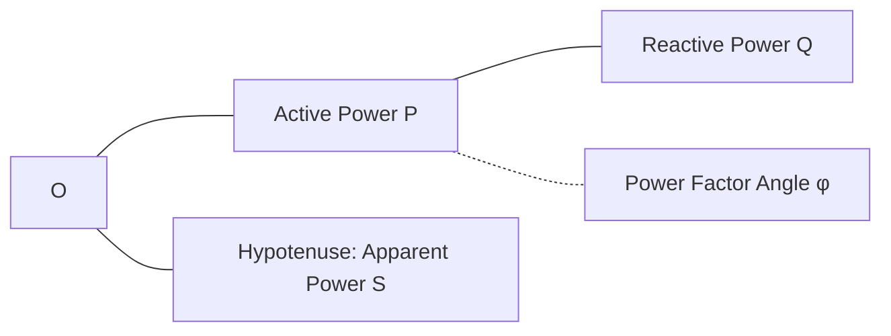

**ઘટકો:**

| ઘટક | પ્રતીક | એકમ | અર્થ |
|-----------|--------|------|---------|
| **એક્ટિવ પાવર** | P | વોટ (W) | ઉપયોગી કાર્ય કરતો વાસ્તવિક પાવર |
| **રિએક્ટિવ પાવર** | Q | VAR | સ્ત્રોત અને લોડ વચ્ચે આંદોલિત પાવર |
| **એપેરંટ પાવર** | S | VA | P અને Q નો વેક્ટર સરવાળો |
| **પાવર ફેક્ટર** | cos φ | - | એક્ટિવથી એપેરંટ પાવરનો ગુણોત્તર (P/S) |

**સંબંધો:**

- S² = P² + Q²
- P = S × cos φ
- Q = S × sin φ

**મેમરી ટ્રીક:** "SPQR" - S is Pythagoras of P and Q, Ratio of P/S is power factor

## પ્રશ્ન 4(ક) OR [7 માર્ક્સ]

**સ્ટેટિકલી અને ડાઈનેમીકલી ઉત્પન્ન થતા ઈ.એમ.એફ.ની સરખામણી કરો.**

**જવાબ**:

| પરિમાણ | સ્ટેટિકલી ઇન્ડ્યુસ્ડ EMF | ડાયનેમિકલી ઇન્ડ્યુસ્ડ EMF |
|-----------|------------------------|--------------------------|
| **વ્યાખ્યા** | પ્રાથમિક કોઇલમાં કરંટના પરિવર્તનને કારણે પ્રેરિત EMF | વાહક અને ચુંબકીય ક્ષેત્ર વચ્ચે સાપેક્ષ ગતિને કારણે પ્રેરિત EMF |
| **મેકેનિઝમ** | લિંકેજ ફ્લક્સમાં પરિવર્તન | ચુંબકીય ફ્લક્સનું કટિંગ |
| **મૂવમેન્ટ** | ભૌતિક હલનચલનની જરૂર નથી | સાપેક્ષ ગતિની જરૂર છે |
| **ઉદાહરણો** | ટ્રાન્સફોર્મર, ઇન્ડક્ટર | જનરેટર, મોટર |
| **ફેરાડેનો નિયમ** | e = -N(dΦ/dt) | e = Blv |
| **એપ્લિકેશન** | ગતિ વિના પાવર ટ્રાન્સફર | ગતિ દ્વારા પાવર જનરેશન |
| **એનર્જી કન્વર્ઝન** | ઇલેક્ટ્રિકલથી મેગ્નેટિક અને પાછું | મિકેનિકલથી ઇલેક્ટ્રિકલ અથવા ઉલટું |

**મેમરી ટ્રીક:** "STIM-DMOV" - STatically Induced needs Magnetic flux change, Dynamically needs MOVement

## પ્રશ્ન 5(અ) [3 માર્ક્સ]

**વ્યાખ્યા આપો.(૧) સોલાર સેલ (૨) સોલર પેનલ (૩) સોલાર એરે**

**જવાબ**:

| શબ્દ | વ્યાખ્યા |
|------|------------|
| **સોલાર સેલ** | મૂળભૂત ફોટોવોલ્ટાઇક એકમ જે સૂર્યપ્રકાશને સીધો જ વીજળીમાં રૂપાંતરિત કરે છે |
| **સોલર પેનલ** | સોલાર સેલનો સમૂહ જે એક ફ્રેમમાં શ્રેણી/સમાંતર જોડાયેલા હોય છે |
| **સોલાર એરે** | એકસાથે જોડાયેલા અનેક સોલર પેનલો જે મોટી વીજળી-ઉત્પાદક એકમ બનાવે છે |

**મેમરી ટ્રીક:** "CPA" - Cell Produces electricity, Panel Arrays cells, Array is collection of panels

## પ્રશ્ન 5(બ) [4 માર્ક્સ]

**HAWT અને VAWT વચ્ચે નો તફાવત લખો.**

**જવાબ**:

| પરિમાણ | હોરિઝોન્ટલ એક્સિસ વિન્ડ ટર્બાઇન (HAWT) | વર્ટિકલ એક્સિસ વિન્ડ ટર્બાઇન (VAWT) |
|-----------|-------------------------------------|------------------------------------|
| **અક્ષનું ઓરિએન્ટેશન** | જમીનની સમાંતર | જમીનને લંબ |
| **કાર્યક્ષમતા** | ઉચ્ચ (35-45%) | નીચી (15-30%) |
| **પવનની દિશા** | પવનની સામે ફેસ કરવાની જરૂર | કોઈપણ દિશાના પવન સાથે કામ કરે છે |
| **જનરેટર સ્થાન** | ટાવરના ટોચ પર | જમીનના સ્તર પર મૂકી શકાય છે |
| **જગ્યાની જરૂરિયાત** | વધારે | ઓછી |
| **અવાજ** | વધારે | ઓછો |
| **ઉદાહરણો** | પ્રોપેલર-પ્રકાર, વ્યાપારિક ધોરણે વ્યાપકપણે વપરાય છે | ડેરિઅસ, સેવોનિયસ ડિઝાઇન |

**મેમરી ટ્રીક:** "HAVE" - Horizontal Aligns with wind, Vertical Enjoys omnidirectional wind

## પ્રશ્ન 5(ક) [7 માર્ક્સ]

**સોલાર પાવર પ્લાન્ટ નો બ્લોક ડાયાગ્રામ દોરી સમજાઓ.**

**જવાબ**:

**સોલાર પાવર સિસ્ટમ બ્લોક ડાયાગ્રામ:**

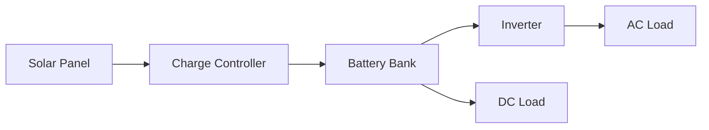

**ઘટકો:**

1. **સોલાર પેનલ**: સૂર્યપ્રકાશનું DC વીજળીમાં રૂપાંતરણ
2. **ચાર્જ કંટ્રોલર**: બેટરી ચાર્જિંગનું નિયમન, ઓવરચાર્જિંગ રોકે
3. **બેટરી બેંક**: સૂર્યપ્રકાશ ન હોય ત્યારે ઉપયોગ માટે ઊર્જા સંગ્રહ
4. **ઇન્વર્ટર**: ઘરેલું ઉપકરણો માટે DC થી AC પાવરમાં રૂપાંતરણ
5. **લોડ્સ**: AC લોડ્સ (ઉપકરણો) અને DC લોડ્સ (LED લાઇટ્સ, વગેરે)

**વૈકલ્પિક ઘટકો:**

- **મોનિટરિંગ સિસ્ટમ**: પાવર ઉત્પાદન/વપરાશ ટ્રેક કરે છે
- **ગ્રિડ કનેક્શન**: વધારાની વીજળી વેચવાની મંજૂરી આપે છે

**મેમરી ટ્રીક:** "SCBIL" - Solar Collects, Battery Inverts for Loads

## પ્રશ્ન 5(અ) OR [3 માર્ક્સ]

**આપણા ગ્રહ માટે ગ્રીન એનર્જીની જરૂરિયાત સમજાઓ.**

**જવાબ**:

**ગ્રીન એનર્જીની જરૂરિયાત:**

1. **ટકાઉપણું**: ફોસિલ ફ્યુઅલ્સની જેમ જ નહીં, પુનઃપ્રાપ્ય સ્ત્રોતો ખલાસ થતા નથી
2. **પ્રદૂષણ ઘટાડો**: ફોસિલ ફ્યુઅલ્સના બળવાથી હવા અને પાણીના પ્રદૂષણને ઘટાડે છે
3. **જળવાયુ પરિવર્તન**: ગ્લોબલ વોર્મિંગ પેદા કરતા ગ્રીનહાઉસ ગેસ ઉત્સર્જન ઘટાડે છે
4. **ઊર્જા સુરક્ષા**: આયાત કરેલા ફ્યુઅલ્સ પર નિર્ભરતા ઘટાડે છે
5. **આર્થિક લાભ**: નોકરીઓ સર્જે છે અને પ્રદૂષણ સંબંધિત આરોગ્ય ખર્ચ ઘટાડે છે

**મેમરી ટ્રીક:** "SPECS" - Sustainable, Pollution-free, Economic, Climate-friendly, Secure

## પ્રશ્ન 5(બ) OR [4 માર્ક્સ]

**ગ્રીન એનર્જીનું વર્ગીકરણ કરો અને કોઈ પણ એક સમજાઓ.**

**જવાબ**:

**ગ્રીન એનર્જી સ્ત્રોતોનું વર્ગીકરણ:**

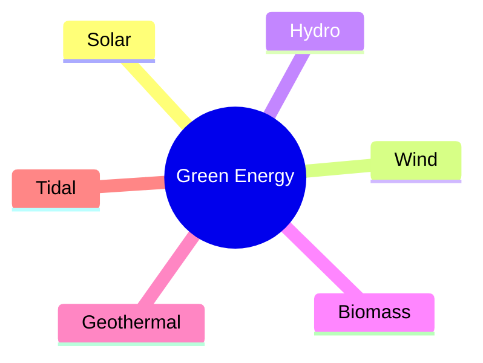

**સોલાર એનર્જી વિસ્તૃત રીતે:**

- **કાર્ય સિદ્ધાંત**: ફોટોવોલ્ટાઇક ઇફેક્ટ સૂર્યપ્રકાશને વીજળીમાં રૂપાંતરિત કરે છે
- **ઘટકો**: સોલાર સેલ, પેનલ, ઇન્વર્ટર, બેટરી
- **ઉપયોગો**: રહેણાંક પાવર, ઔદ્યોગિક ઉપયોગ, પરિવહન
- **ફાયદા**: કોઈ પ્રદૂષણ નહીં, પુષ્કળ સ્ત્રોત, ઓછી જાળવણી
- **મર્યાદાઓ**: હવામાન પર આધારિત, સ્ટોરેજની જરૂર, પ્રારંભિક ખર્ચ

**મેમરી ટ્રીક:** "SWHBGT" - Sun Wind Hydro Biomass Geothermal Tidal are green energy types

## પ્રશ્ન 5(ક) OR [7 માર્ક્સ]

**વિન્ડ પાવર સીસ્ટમ નું ઓપરેશન બ્લોક ડાયાગ્રામ સાથે સમજાઓ.**

**જવાબ**:

**વિન્ડ પાવર સિસ્ટમ બ્લોક ડાયાગ્રામ:**

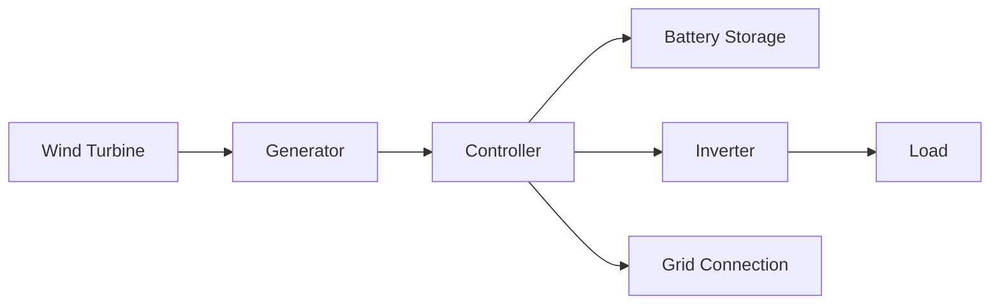

**ઓપરેશન:**

1. **વિન્ડ ટર્બાઇન**: પવનની ગતિજ ઊર્જાને યાંત્રિક ઊર્જામાં રૂપાંતરિત કરે છે
2. **જનરેટર**: યાંત્રિક રોટેશનને વીજ ઊર્જામાં રૂપાંતરિત કરે છે
3. **કંટ્રોલર**: પાવર આઉટપુટનું નિયમન કરે છે અને ઉચ્ચ પવનોથી રક્ષણ કરે છે
4. **બેટરી**: વધારાની ઊર્જા સંગ્રહિત કરે છે (ઓફ-ગ્રિડ સિસ્ટમ માટે)
5. **ઇન્વર્ટર**: વપરાશ માટે DC થી AC માં રૂપાંતરણ કરે છે
6. **ગ્રિડ કનેક્શન**: વધારાના પાવરને ગ્રિડમાં ફીડ કરે છે અથવા જરૂર પડે ત્યારે ખેંચે છે

**વિન્ડ ટર્બાઇનના પ્રકારો:**

- હોરિઝોન્ટલ એક્સિસ (HAWT): મુખ્ય વ્યાપારિક પ્રકાર
- વર્ટિકલ એક્સિસ (VAWT): શહેરી સેટિંગ્સ માટે વધુ સારું

**વિન્ડ સ્પીડ જરૂરિયાતો:**

- કટ-ઇન સ્પીડ: 3-5 m/s
- રેટેડ આઉટપુટ: 12-15 m/s
- કટ-આઉટ સ્પીડ: 25 m/s (સુરક્ષા માટે)

**મેમરી ટ્રીક:** "WGCBIL" - Wind Generates, Controller Balances, Inverter Loads
