## Question 1(a) [3 marks]

**Define the following term (1) Resistance (2) Electrical energy (3) Electrical Power**

**Answer**:

| Term | Definition |
|------|------------|
| **Resistance** | The property of a material that opposes the flow of electric current, measured in ohms (Ω) |
| **Electrical Energy** | The ability to do work by electrical means, measured in joules (J) or kilowatt-hours (kWh) |
| **Electrical Power** | The rate at which electrical energy is transferred or converted, measured in watts (W) |

**Mnemonic:** "RIP" - Resistance Impedes Path, Energy Is Potential, Power Is Performance

## Question 1(b) [4 marks]

**State and Explain Ohm's Law & write limitations of it.**

**Answer**:

**Ohm's Law**: The current flowing through a conductor is directly proportional to the voltage across the conductor and inversely proportional to its resistance.

Mathematically: V = IR, where:

- V = Voltage (volts)
- I = Current (amperes)
- R = Resistance (ohms)

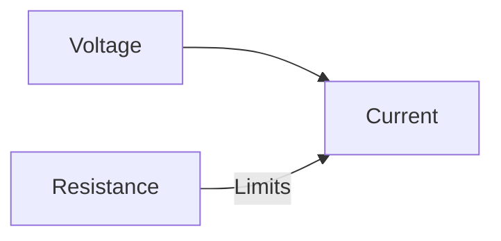

**Limitations of Ohm's Law**:

- Not applicable to non-linear devices (semiconductors, gas discharge tubes)
- Doesn't hold at high temperatures
- Not valid for unilateral elements (diodes)
- Fails for time-varying currents

**Mnemonic:** "VIRO" - Voltage Is Resistance times Output current

## Question 1(c) [7 marks]

**Explain series and parallel connection of batteries.**

**Answer**:

**Series Connection of Batteries:**


**Characteristics of Series Connection:**

- **Total Voltage** = Sum of individual voltages (V = V₁ + V₂ + ... + Vₙ)
- **Current** = Same through all batteries
- **Applications**: Higher voltage requirements
- **Internal Resistance**: Increases (Rₛ = r₁ + r₂ + ... + rₙ)

**Parallel Connection of Batteries:**

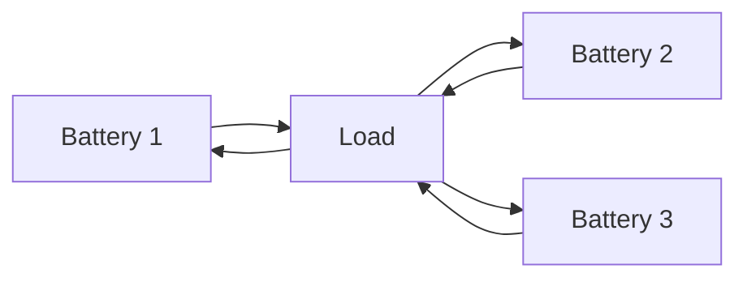

**Characteristics of Parallel Connection:**

- **Voltage** = Same as individual battery (if identical)
- **Total Current** = Sum of individual currents (I = I₁ + I₂ + ... + Iₙ)
- **Applications**: Higher current capacity required
- **Internal Resistance**: Decreases (1/Rₚ = 1/r₁ + 1/r₂ + ... + 1/rₙ)

**Mnemonic:** "VSCP" - Voltage Sums in Series, Current Parallels

## Question 1(c) OR [7 marks]

**Explain series and parallel connection of Resistors.**

**Answer**:

**Series Connection of Resistors:**

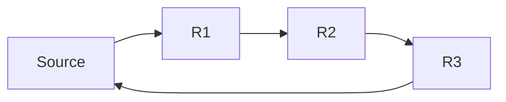

**Characteristics of Series Connection:**

- **Equivalent Resistance** = Sum of individual resistances (Rₛ = R₁ + R₂ + ... + Rₙ)
- **Current** = Same through all resistors
- **Voltage** = Divided across resistors proportional to resistance values
- **Power** divided as per voltage distribution

**Parallel Connection of Resistors:**

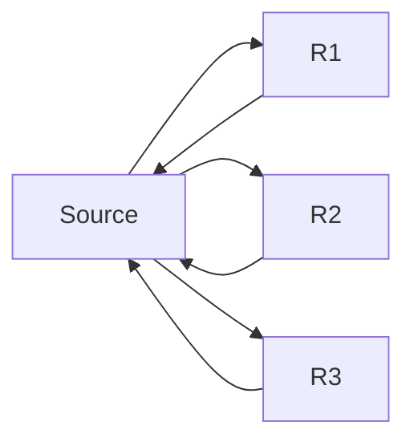

**Characteristics of Parallel Connection:**

- **Equivalent Resistance**: 1/Rₚ = 1/R₁ + 1/R₂ + ... + 1/Rₙ
- **Voltage** = Same across all resistors
- **Current** = Divided inverse-proportionally to resistance values
- **Total Current** = Sum of individual currents

**Mnemonic:** "RISE-VICE" - Resistance Increases in Series, Voltage Is Constant in Every parallel

## Question 2(a) [3 marks]

**Define: (1) Amplitude (2) Frequency (3) Time period**

**Answer**:

| Term | Definition |
|------|------------|
| **Amplitude** | Maximum displacement of a waveform from its mean position, measured in volts or amperes |
| **Frequency** | Number of complete cycles occurring in one second, measured in hertz (Hz) |
| **Time Period** | Time taken to complete one cycle of waveform, measured in seconds (s) |

**Mnemonic:** "AFT" - Amplitude is the Full height, Time period is the Total cycle

## Question 2(b) [4 marks]

**10Ω, 20Ω and 30Ω resistors are connected in series and 100V supply is given to them. Find (1) Equivalent resistance (2) Circuit current (3) Voltage drop across each Resistor (4) Power loss in each resistor.**

**Answer**:

**Diagram:**

```goat
     +--[10Ω]--[20Ω]--[30Ω]--+
     |                        |
   (100V)                     |
     |                        |
     +------------------------+
```

**Solution:**

| Parameter | Calculation | Result |
|-----------|-------------|--------|
| Equivalent Resistance | R = 10Ω + 20Ω + 30Ω | 60Ω |
| Circuit Current | I = 100V/60Ω | 1.67A |
| Voltage across 10Ω | V₁ = 1.67A × 10Ω | 16.7V |
| Voltage across 20Ω | V₂ = 1.67A × 20Ω | 33.3V |
| Voltage across 30Ω | V₃ = 1.67A × 30Ω | 50.0V |
| Power in 10Ω | P₁ = 1.67² × 10 | 27.8W |
| Power in 20Ω | P₂ = 1.67² × 20 | 55.6W |
| Power in 30Ω | P₃ = 1.67² × 30 | 83.4W |

**Mnemonic:** "REÇVP" - Resistances Equivalent Causes Voltage and Power division

## Question 2(c) [7 marks]

**Explain A.C Through pure Resistor with wave form & vector diagram.**

**Answer**:

In a pure resistive circuit with AC supply:

**Key Characteristics:**

- Current and voltage are **in phase** with each other
- Circuit follows Ohm's Law: V = IR
- Power is always positive (P = VI)
- No reactive power consumed
- Power factor = 1 (cos φ = 1)

**Waveform:**

```goat
    │    ╭─╮   ╭─╮   ╭─╮   ╭─╮
    │   ╱   ╲ ╱   ╲ ╱   ╲ ╱   ╲
    │  ╱     V     V     V     ╲
────┼─╱───────────────────────╲─────
    │╱       ╱╲       ╱╲       ╲
    V       V  ╲     V  ╲       V
    │      ╱    ╲   ╱    ╲
    │     ╱      ╲ ╱      ╲
    │    ╰─╯     ╰─╯      ╰─╯

    --- Voltage waveform
    --- Current waveform (identical phase)
```

**Vector Diagram:**

```goat
         │
         │
         V (voltage)
         │
         │
─────────┼────────→
         │        I (current)
         │
         │
```

**Mnemonic:** "PARVIP" - Pure AC Resistor has Voltage In Phase with current

## Question 2(a) OR [3 marks]

**Define: (1) cycle (2) Form factor (3) Peak factor**

**Answer**:

| Term | Definition |
|------|------------|
| **Cycle** | One complete repetition of a periodic waveform from start point to same point again |
| **Form Factor** | Ratio of RMS value to average value of AC waveform (For sine wave = 1.11) |
| **Peak Factor** | Ratio of maximum value to RMS value of AC waveform (For sine wave = 1.414) |

**Mnemonic:** "CFP" - Cycle Finishes a Pattern, Form Factor = Vrms/Vavg, Peak Factor = Vmax/Vrms

## Question 2(b) OR [4 marks]

**20Ω, 30Ω and 50Ω resistors are connected in parallel and 60V supply is given to them. Find (1) Current in each Resistor. (2) Total current (3) Equivalent resistance (4) Power loss in each resistor.**

**Answer**:

**Diagram:**

```goat
         ┌─[20Ω]─┐
         │       │
     +───┼───────┼───+
     │   │       │   │
    (60V) ├─[30Ω]─┤  │
     │   │       │   │
     │   └─[50Ω]─┘   │
     │               │
     +───────────────+
```

**Solution:**

| Parameter | Calculation | Result |
|-----------|-------------|--------|
| Current in 20Ω | I₁ = 60V/20Ω | 3A |
| Current in 30Ω | I₂ = 60V/30Ω | 2A |
| Current in 50Ω | I₃ = 60V/50Ω | 1.2A |
| Total Current | I = 3A + 2A + 1.2A | 6.2A |
| Equivalent Resistance | 1/Req = 1/20 + 1/30 + 1/50 | 9.68Ω |
| Power in 20Ω | P₁ = 60V × 3A | 180W |
| Power in 30Ω | P₂ = 60V × 2A | 120W |
| Power in 50Ω | P₃ = 60V × 1.2A | 72W |

**Mnemonic:** "VICTIM" - Voltage Is Constant, Total current Is the Measure (in parallel)

## Question 2(c) OR [7 marks]

**Explain A.C Through pure capacitor with wave form & vector diagram.**

**Answer**:

In a pure capacitive circuit with AC supply:

**Key Characteristics:**

- Current **leads** voltage by 90° 
- Capacitive reactance Xc = 1/(2πfC)
- Only reactive power (no active power)
- Power factor = 0 (lagging)
- Average power over complete cycle = 0

**Waveform:**

```goat
           Current
    │      ╭─╮     ╭─╮     ╭─╮     ╭─╮
    │     ╱   ╲   ╱   ╲   ╱   ╲   ╱   ╲
    │    ╱     ╲ ╱     ╲ ╱     ╲ ╱     ╲
────┼───╱───────V───────V───────V───────╲─
    │  ╱         ╲       ╲       ╲       ╲
    │ ╱           ╲       ╲       ╲       ╲
    │╱             ╲       ╲       ╲       ╲
    V               ╰─╮     ╰─╮     ╰─╮     ╰
    │                 │       │       │
    │                 │       │       │
    │                 │       │       │
    │                 V       V       V     
    │                ╱ ╲     ╱ ╲     ╱ ╲   Voltage
    │               ╱   ╲   ╱   ╲   ╱   ╲ 
    │              ╱     ╲ ╱     ╲ ╱     ╲
```

**Vector Diagram:**

```goat
         │ I (current)
         │
         │
         │
─────────┼────────→
         │
         │
         │
         V V (voltage)
```

**Mnemonic:** "CLEAR-90" - Capacitive Load has Electrical Angle Reaching 90° (current leads voltage)

## Question 3(a) [3 marks]

**Define RMS value and average value related to alternating waveform write formula of it.**

**Answer**:

| Term | Definition | Formula |
|------|------------|---------|
| **RMS Value** | Root Mean Square value - equivalent DC value producing the same heating effect | Vrms = 0.707 × Vmax for sine wave |
| **Average Value** | Mean value of all instantaneous values over half cycle | Vavg = 0.637 × Vmax for sine wave |

**Mnemonic:** "RAM" - RMS Averages the Mean square (RMS = 0.707×Vmax, AVG = 0.637×Vmax)

## Question 3(b) [4 marks]

**If A.C. current is represented by equation i=25 sin(314t). Calculate (1) R.m.s. value (2) Average value (3) Frequency (4) Time period**

**Answer**:

**Given equation:** i = 25 sin(314t)

| Parameter | Calculation | Result |
|-----------|-------------|--------|
| Maximum value | Imax = 25 A | 25 A |
| RMS value | Irms = Imax/√2 = 25/1.414 | 17.68 A |
| Average value | Iavg = 2Imax/π = 2×25/3.14 | 15.92 A |
| Angular frequency | ω = 314 rad/s | 314 rad/s |
| Frequency | f = ω/2π = 314/6.28 | 50 Hz |
| Time period | T = 1/f = 1/50 | 0.02 s |

**Mnemonic:** "SMART" - Sine's Maximum divided by root 2 equals RMS Then 2/π for Average

## Question 3(c) [7 marks]

**Explain star connection of resistors and Derive equation shows relationship between voltage and current in star connection.**

**Answer**:

**Star (Y) Connection:**

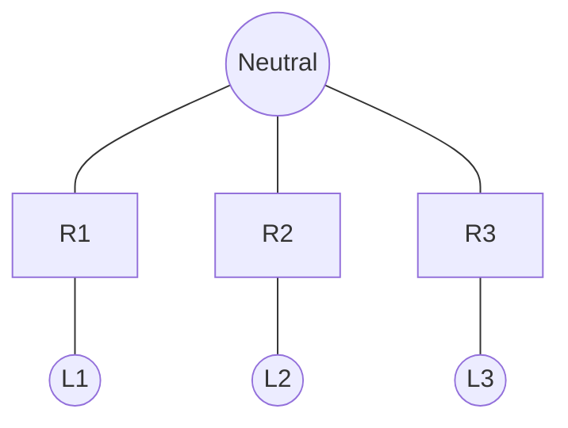

**Characteristics of Star Connection:**

- Three resistors connected at common point (neutral)
- Line voltage (VL) = √3 × Phase voltage (Vph)
- Line current (IL) = Phase current (Iph)
- For balanced load: IL = Iph
- Total power = 3 × Phase power

**Mathematical Relationship:**

- Phase voltage: Vph = VL/√3
- Phase current: Iph = IL
- For balanced resistive load: Iph = Vph/R
- Therefore: IL = VL/(√3×R)

**Mnemonic:** "SLIP-3" - Star Line current Is Phase current, Line voltage is Phase voltage times root-3

## Question 3(a) OR [3 marks]

**Explain generation of alternating E.M.F.**

**Answer**:

**Generation of Alternating EMF:**

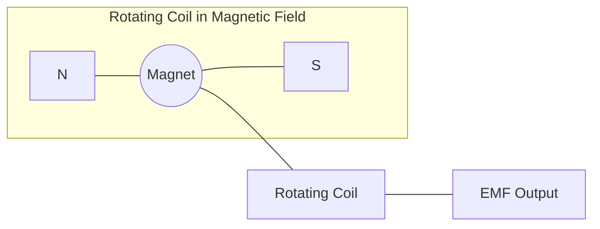

**Process:**

- Coil rotates in uniform magnetic field
- Flux linkage changes with angle of rotation
- Rate of change of flux induces EMF
- EMF follows sinusoidal pattern: e = Emax sin(ωt)
- Frequency depends on rotation speed

**Mnemonic:** "FRAME" - Flux Rotation Alternates Magnetic EMF

## Question 3(b) OR [4 marks]

**An alternating EMF is expressed by e= 100 sin2π50t. Find out (1) Max value of EMF (2) Frequency (3) Time period (4) Angular Frequency**

**Answer**:

**Given equation:** e = 100 sin2π50t

| Parameter | Calculation | Result |
|-----------|-------------|--------|
| Maximum EMF | Emax = 100 V | 100 V |
| Angular Frequency | ω = 2π50 = 314 rad/s | 314 rad/s |
| Frequency | f = 50 Hz (directly from equation) | 50 Hz |
| Time Period | T = 1/f = 1/50 | 0.02 s |

**Mnemonic:** "FAST" - Frequency And period are reciprocals, Sin's Top value is maximum

## Question 3(c) OR [7 marks]

**Explain star connection and Derive equation shows relationship between voltage and current in delta connection.**

**Answer**:

**Delta (Δ) Connection:**

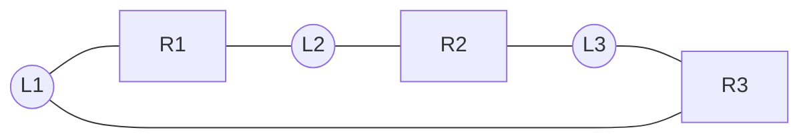

**Characteristics of Delta Connection:**

- Three resistors connected in closed loop
- Line voltage (VL) = Phase voltage (Vph)
- Line current (IL) = √3 × Phase current (Iph)
- For balanced load: Vph = VL
- Total power = 3 × Phase power

**Mathematical Relationship:**

- Phase voltage: Vph = VL
- Phase current: Iph = Vph/R
- Line current: IL = √3 × Iph
- Therefore: IL = √3 × VL/R

**Mnemonic:** "DELVIr3" - Delta Equal Line Voltage, Its line current equals phase current times root-3

## Question 4(a) [3 marks]

**Define (1) M.M.F. (2) Reluctance (3) flux**

**Answer**:

| Term | Definition |
|------|------------|
| **M.M.F. (Magnetomotive Force)** | The force that produces magnetic flux in a magnetic circuit, measured in ampere-turns (AT) |
| **Reluctance** | The magnetic equivalent of resistance, opposition to magnetic flux, measured in AT/Wb |
| **Flux** | The total magnetic field passing through a surface, measured in webers (Wb) |

**Mnemonic:** "MFR" - MMF Flows against Reluctance like current flows against resistance

## Question 4(b) [4 marks]

**Explain Apparent, Active and Reactive power in A.C circuits.**

**Answer**:

| Power Type | Symbol & Unit | Definition |
|------------|---------------|------------|
| **Apparent Power** | S (VA) | Vector sum of active and reactive power |
| **Active Power** | P (W) | Actual work-producing power consumed by the load |
| **Reactive Power** | Q (VAR) | Power that oscillates between source and load |

**Power Triangle:**

```goat
          ^ Q (Reactive Power)
          │
          │
          │
          │           S (Apparent Power)
          │         /
          │        /
          │       /
          │      /
          │     /
          │    θ
          │   /
          └──/───────────>
             P (Active Power)
```

**Relationships:**

- S = √(P² + Q²)
- P = S × cos θ
- Q = S × sin θ
- Power factor = cos θ = P/S

**Mnemonic:** "SPARQ" - S is Power Apparent, Real is P, Q is reactive

## Question 4(c) [7 marks]

**Compare electric and magnetic circuit.**

**Answer**:

| Parameter | Electric Circuit | Magnetic Circuit |
|-----------|-----------------|------------------|
| **Force** | EMF (V) | MMF (AT) |
| **Opposition** | Resistance (Ω) | Reluctance (AT/Wb) |
| **Flow** | Current (A) | Flux (Wb) |
| **Ohm's Law** | V = IR | MMF = Φ × S |
| **Medium** | Conductor | Ferromagnetic material |
| **Energy** | Stored in electric field | Stored in magnetic field |
| **Leakage** | Negligible | Significant |
| **Path** | Conductors | Usually closed loop |
| **Material Property** | Conductivity | Permeability |
| **Current Flow** | Electron flow | No particle flow |

**Mnemonic:** "VIRO-MSΦS" - Voltage Is to Resistance as MMF is to Reluctance, Our φ flows Similar

## Question 4(a) OR [3 marks]

**State and explain Fleming's left hand rule.**

**Answer**:

**Fleming's Left Hand Rule:** Used to find the direction of the force experienced by a current-carrying conductor placed in a magnetic field.


**Application:**

- Thumb → Direction of Force (F)
- Forefinger → Direction of magnetic Field (B)
- Middle finger → Direction of Current (I)
- Only works when fingers are perpendicular to each other

**Mnemonic:** "FBI-Left" - Force, B-field, and I-current directions are shown by the Left hand

## Question 4(b) OR [4 marks]

**Draw power triangle and explain each component of it.**

**Answer**:

**Power Triangle:**

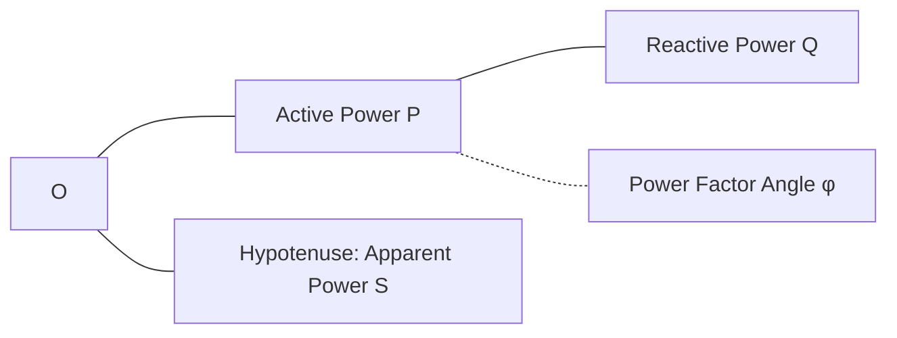

**Components:**

| Component | Symbol | Unit | Meaning |
|-----------|--------|------|---------|
| **Active Power** | P | Watt (W) | Real power doing useful work |
| **Reactive Power** | Q | VAR | Power oscillating between source and load |
| **Apparent Power** | S | VA | Vector sum of P and Q |
| **Power Factor** | cos φ | - | Ratio of active to apparent power (P/S) |

**Relationships:**

- S² = P² + Q²
- P = S × cos φ
- Q = S × sin φ

**Mnemonic:** "SPQR" - S is Pythagoras of P and Q, Ratio of P/S is power factor

## Question 4(c) OR [7 marks]

**Differentiate statically and dynamically induced E.M.F.**

**Answer**:

| Parameter | Statically Induced EMF | Dynamically Induced EMF |
|-----------|------------------------|--------------------------|
| **Definition** | EMF induced due to change in current in the primary coil | EMF induced due to relative motion between conductor and magnetic field |
| **Mechanism** | Change in linkage flux | Cutting of magnetic flux |
| **Movement** | No physical movement required | Requires relative motion |
| **Examples** | Transformer, inductor | Generator, motor |
| **Faraday's Law** | e = -N(dΦ/dt) | e = Blv |
| **Application** | Power transfer without motion | Power generation through motion |
| **Energy Conversion** | Electrical to magnetic and back | Mechanical to electrical or vice versa |

**Mnemonic:** "STIM-DMOV" - STatically Induced needs Magnetic flux change, Dynamically needs MOVement

## Question 5(a) [3 marks]

**Define (1) solar cell (2) solar panel (3) solar array**

**Answer**:

| Term | Definition |
|------|------------|
| **Solar Cell** | Basic photovoltaic unit that converts sunlight directly into electricity through semiconductor material |
| **Solar Panel** | Collection of solar cells connected in series/parallel in a frame |
| **Solar Array** | Multiple solar panels connected together to form a larger electricity-generating unit |

**Mnemonic:** "CPA" - Cell Produces electricity, Panel Arrays cells, Array is collection of panels

## Question 5(b) [4 marks]

**Differentiate HAWT and VAWT.**

**Answer**:

| Parameter | Horizontal Axis Wind Turbine (HAWT) | Vertical Axis Wind Turbine (VAWT) |
|-----------|-------------------------------------|------------------------------------|
| **Axis Orientation** | Parallel to ground | Perpendicular to ground |
| **Efficiency** | Higher (35-45%) | Lower (15-30%) |
| **Wind Direction** | Needs to face the wind | Works with wind from any direction |
| **Generator Location** | At the top of tower | Can be placed at ground level |
| **Space Required** | More | Less |
| **Noise** | Higher | Lower |
| **Examples** | Propeller-type, widely used commercially | Darrieus, Savonius designs |

**Mnemonic:** "HAVE" - Horizontal Aligns with wind, Vertical Enjoys omnidirectional wind

## Question 5(c) [7 marks]

**Draw and explain the Block diagram of solar power system.**

**Answer**:

**Solar Power System Block Diagram:**

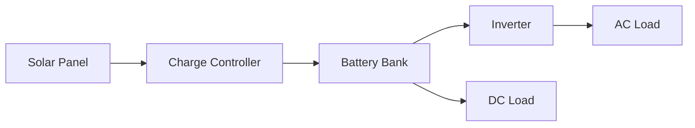

**Components:**

1. **Solar Panels**: Convert sunlight to DC electricity
2. **Charge Controller**: Regulates battery charging, prevents overcharging
3. **Battery Bank**: Stores energy for use when sunlight isn't available
4. **Inverter**: Converts DC to AC power for household appliances
5. **Loads**: AC loads (appliances) and DC loads (LED lights, etc.)

**Optional Components:**

- **Monitoring System**: Tracks power generation/consumption
- **Grid Connection**: Allows selling excess electricity

**Mnemonic:** "SCBIL" - Solar Collects, Battery Inverts for Loads

## Question 5(a) OR [3 marks]

**Explain the need of green energy for our planet.**

**Answer**:

**Need for Green Energy:**

1. **Sustainability**: Renewable sources won't deplete unlike fossil fuels
2. **Pollution Reduction**: Minimizes air and water pollution from burning fossil fuels
3. **Climate Change**: Reduces greenhouse gas emissions that cause global warming
4. **Energy Security**: Decreases dependence on imported fuels
5. **Economic Benefits**: Creates jobs and reduces health costs related to pollution

**Mnemonic:** "SPECS" - Sustainable, Pollution-free, Economic, Climate-friendly, Secure

## Question 5(b) OR [4 marks]

**Classify green energy and explain any one in detail.**

**Answer**:

**Classification of Green Energy Sources:**

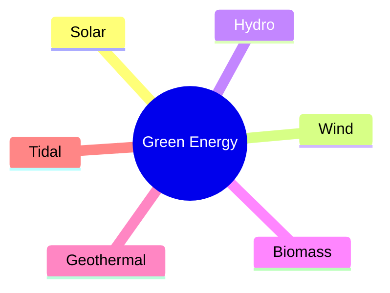

**Solar Energy in Detail:**

- **Working Principle**: Photovoltaic effect converts sunlight to electricity
- **Components**: Solar cells, panels, inverters, batteries
- **Applications**: Residential power, industrial use, transportation
- **Advantages**: No pollution, abundant source, low maintenance
- **Limitations**: Weather dependent, requires storage, initial cost

**Mnemonic:** "SWHBGT" - Sun Wind Hydro Biomass Geothermal Tidal are green energy types

## Question 5(c) OR [7 marks]

**Explain block diagram of wind power system and explain the operation of wind power system.**

**Answer**:

**Wind Power System Block Diagram:**

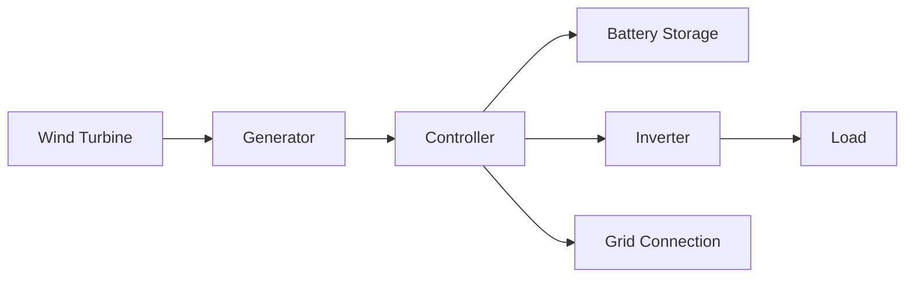


**Operation:**

1. **Wind Turbine**: Converts wind's kinetic energy to mechanical energy
2. **Generator**: Transforms mechanical rotation to electrical energy
3. **Controller**: Regulates power output and protects from high winds
4. **Battery**: Stores excess energy (for off-grid systems)
5. **Inverter**: Converts DC to AC for consumption
6. **Grid Connection**: Feeds excess power to grid or draws when needed

**Types of Wind Turbines:**

- Horizontal Axis (HAWT): Main commercial type
- Vertical Axis (VAWT): Better for urban settings

**Wind Speed Requirements:**

- Cut-in speed: 3-5 m/s
- Rated output: 12-15 m/s
- Cut-out speed: 25 m/s (for safety)

**Mnemonic:** "WGCBIL" - Wind Generates, Controller Balances, Inverter Loads
