## પ્રશ્ન 1(અ) [3 માર્ક્સ]

**EMF, ઇલેક્ટ્રિક કરંટ અને પાવરની વ્યાખ્યા લખો. તથા તેઓના એકમ પણ લખો.**

**જવાબ**:

| શબ્દ | વ્યાખ્યા | એકમ |
|------|------------|------|
| **EMF (ઇલેક્ટ્રોમોટિવ ફોર્સ)** | એકમ ચાર્જ દીઠ સ્ત્રોત દ્વારા પૂરી પાડવામાં આવતી ઊર્જા | વોલ્ટ (V) |
| **ઇલેક્ટ્રિક કરંટ** | ઇલેક્ટ્રિક ચાર્જના પ્રવાહનો દર | એમ્પિયર (A) |
| **પાવર** | જે દરે ઇલેક્ટ્રિકલ ઊર્જાનું સ્થાનાંતર થાય છે | વોટ (W) |

**મેમરી ટ્રીક:** "EVA" - EMF વોલ્ટમાં, કરંટ એમ્પિયરમાં, પાવર વોટમાં

## પ્રશ્ન 1(બ) [4 માર્ક્સ]

**અનુક્રમે ૧૦૦૦ Ω, ૨૦૦૦ Ω અને ૩૦૦૦ Ω નો રેઝિસ્ટન્સ ધરાવતા ત્રણ રેઝિસ્ટરને સિરીઝમાં જોડવામાં આવેલ છે. આ સિરીઝ જોડાણનો સમકક્ષ રેઝિસ્ટન્સ શોધો. હવે આ જ ત્રણ રેઝિસ્ટન્સને પેરેલલમાં જોડવામાં આવેલ છે. આ પેરેલલ જોડાણનો સમકક્ષ રેઝિસ્ટન્સ શોધો.**

**જવાબ**:

**સિરીઝ જોડાણ માટે:**

```
Req = R1 + R2 + R3
Req = 1000 Ω + 2000 Ω + 3000 Ω
Req = 6000 Ω
```

**પેરેલલ જોડાણ માટે:**

```
1/Req = 1/R1 + 1/R2 + 1/R3
1/Req = 1/1000 + 1/2000 + 1/3000
1/Req = 0.001 + 0.0005 + 0.00033
1/Req = 0.00183
Req = 545.45 Ω
```

**આકૃતિ:**

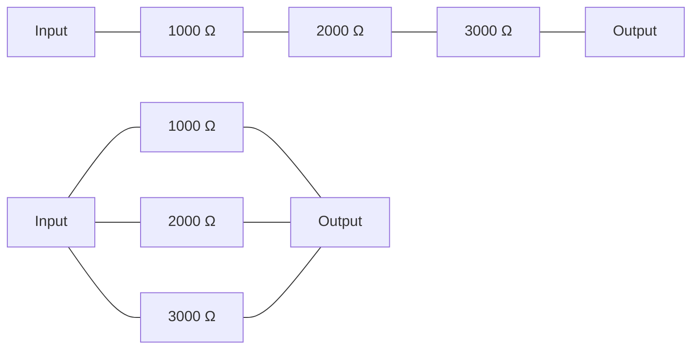

**મેમરી ટ્રીક:** "Series Sum, Parallel Product/Sum" - સિરીઝમાં સીધા જ સરવાળો, પેરેલલમાં વ્યસ્ત સરવાળો

## પ્રશ્ન 1(ક) [7 માર્ક્સ]

**રેઝિસ્ટર, કેપેસિટર અને ઇન્ડક્ટરની વ્યાખ્યા લખો. તેઓના સિમ્બોલ દોરો અને તેઓના એકમ લખો. તથા આ દરેક ડિવાઇસનો ઇલેક્ટ્રિક સર્કિટમાં શું ઉપયોગ છે તે લખો.**

**જવાબ**:

| ઘટક | વ્યાખ્યા | સિમ્બોલ | એકમ | સર્કિટમાં ઉપયોગ |
|-----------|------------|--------|------|----------------|
| **રેઝિસ્ટર** | એવું ઘટક જે ઇલેક્ટ્રિક કરંટના પ્રવાહનો વિરોધ કરે છે | ⊥⊥⊥ | ઓહ્મ (Ω) | કરંટને મર્યાદિત કરે છે, વોલ્ટેજ વિભાજન કરે છે, ગરમી ઉત્પન્ન કરે છે |
| **કેપેસિટર** | એવું ઘટક જે ઇલેક્ટ્રિક ચાર્જ સંગ્રહિત કરે છે | ⊢⊣ | ફેરડ (F) | DC બ્લોક કરે છે, AC પસાર કરે છે, ઊર્જા સંગ્રહ, ફિલ્ટરિંગ |
| **ઇન્ડક્ટર** | એવું ઘટક જે ચુંબકીય ક્ષેત્રમાં ઊર્જા સંગ્રહિત કરે છે | ⊗⊗⊗ | હેનરી (H) | AC બ્લોક કરે છે, DC પસાર કરે છે, ઊર્જા સંગ્રહ, ફિલ્ટરિંગ |

**આકૃતિ:**

```goat
+-----+    +-----+     +-----+
|     |    |     |     |  ⊗  |
| ⊥⊥⊥ |    | ⊢⊣ |     |  ⊗  |
|     |    |     |     |  ⊗  |
+-----+    +-----+     +-----+
Resistor   Capacitor   Inductor
```

**મેમરી ટ્રીક:** "RCI" - રેઝિસ્ટર કરંટ નિયંત્રિત કરે છે, કેપેસિટર ચાર્જ સંગ્રહે છે, ઇન્ડક્ટર ચુંબકીય ઊર્જા સંગ્રહે છે

## પ્રશ્ન 1(ક OR) [7 માર્ક્સ]

**ઓહમનો નિયમ તથા ઓહમના નિયમનું સમીકરણ સર્કિટ ડાયાગ્રામની મદદથી લખો. ઓહમના નિયમના ઉપયોગો લખો. તથા ઓહમના નિયમની મર્યાદા લખો.**

**જવાબ**:

**ઓહમનો નિયમ:** કોઈ વાહક માંથી પસાર થતો કરંટ, તેના છેડા પરના વોલ્ટેજના સીધા પ્રમાણમાં અને તેના અવરોધના વ્યસ્ત પ્રમાણમાં હોય છે.

**સમીકરણ:** V = I × R

**સર્કિટ ડાયાગ્રામ:**


**ઓહમના નિયમના ઉપયોગો:**

- સર્કિટમાં કરંટ, વોલ્ટેજ, અથવા અવરોધની ગણતરી કરવા
- ઇલેક્ટ્રિકલ અને ઇલેક્ટ્રોનિક સર્કિટની ડિઝાઇન કરવા
- પાવરની ગણતરી કરવા (P = V × I = I² × R = V²/R)
- વોલ્ટેજ ડિવાઇડર અને કરંટ ડિવાઇડરનો ઉપયોગ કરીને સર્કિટનું વિશ્લેષણ

**ઓહમના નિયમની મર્યાદા:**

- નોન-લિનિયર ઉપકરણો (ડાયોડ, ટ્રાન્ઝિસ્ટર) માટે લાગુ પડતો નથી
- ઉચ્ચ ફ્રિક્વન્સી AC સર્કિટ માટે માન્ય નથી
- બિન-ધાતુ વાહકો માટે લાગુ પડતો નથી
- પરિવર્તનશીલ પરિસ્થિતિઓમાં લાગુ પડતો નથી

**મેમરી ટ્રીક:** "VIR" - વોલ્ટેજ = કરંટ × અવરોધ

## પ્રશ્ન 2(અ) [3 માર્ક્સ]

**જરૂરી ડાયાગ્રામ અને સમીકરણની મદદથી ઓલ્ટરનેટિંગ EMF કઈ રીતે ઉત્પન્ન કરવામાં આવે છે તે સમજાવો.**

**જવાબ**:

ઓલ્ટરનેટિંગ EMF ત્યારે ઉત્પન્ન થાય છે જ્યારે વાહક ચુંબકીય ક્ષેત્રમાં ફરે છે.

**સમીકરણ:** e = E₀ sin(ωt) = E₀ sin(2πft)

જ્યાં:

- e = તત્કાલિક EMF
- E₀ = મહત્તમ EMF
- ω = કોણીય વેગ (2πf)
- f = આવૃત્તિ
- t = સમય

**આકૃતિ:**


**મેમરી ટ્રીક:** "RCBS" - ચુંબકીય ક્ષેત્રમાં કોઇલનું ફરવું સાઇનસોઇડલ EMF ઉત્પન્ન કરે છે

## પ્રશ્ન 2(બ) [4 માર્ક્સ]

**જરૂરી સર્કિટ ડાયાગ્રામ અને સમીકરણની મદદથી શુદ્ધ કેપેસિટર સાથે AC વૉલ્ટેજની વર્તણૂક સમજાવો.**

**જવાબ**:

**શુદ્ધ કેપેસિટર સાથે AC ની વર્તણૂક:**

- શુદ્ધ કેપેસિટરમાં કરંટ વોલ્ટેજથી 90° આગળ હોય છે
- કેપેસિટિવ રિએક્ટન્સ (Xc) = 1/(2πfC)
- જેમ ફ્રિક્વન્સી વધે છે, તેમ રિએક્ટન્સ ઘટે છે
- ચાર્જિંગ દરમિયાન ઇલેક્ટ્રિક ફીલ્ડમાં ઊર્જા સંગ્રહે છે

**સર્કિટ અને વેવફોર્મ:**

```goat
    +       +
    |       |
 AC |       | C
    |       |
    +       +

 Voltage
    |    /\
    |   /  \
    |  /    \    Current
    | /      \    /\
    |/        \  /  \
----+----------\/----\----+---->
    |\        /|      \  /
    | \      / |       \/
    |  \    /  |
    |   \  /   |
    |    \/    |
```

**સમીકરણ:** I = C × dV/dt

**મેમરી ટ્રીક:** "CIVIC" - કેપેસિટરમાં કરંટ વોલ્ટેજથી 90° આગળ હોય છે

## પ્રશ્ન 2(ક) [7 માર્ક્સ]

**એક AC વૉલ્ટેજને 300 Sin (628t) V વડે દર્શાવવામાં આવેલ છે. આ વૉલ્ટેજ માટે (i) એમ્પલીટ્યુડ (ii) આવૃત્તિ (ફ્રિક્વન્સી) (iii) ટાઈમ પિરિયડ (iv) એવરેજ વેલ્યૂ (v) RMS વેલ્યૂ (vi) ફોર્મ ફેક્ટર અને (vii) પીક ફેક્ટર ની વેલ્યૂ શોધો.**

**જવાબ**:

આપેલ છે: v = 300 Sin(628t) V

| પરિમાણ | સૂત્ર | ગણતરી | પરિણામ |
|-----------|---------|-------------|--------|
| **એમ્પલીટ્યુડ** | V₀ | 300 V | 300 V |
| **કોણીય આવૃત્તિ** | ω | 628 rad/s | 628 rad/s |
| **આવૃત્તિ** | f = ω/2π | 628/2π = 628/6.28 | 100 Hz |
| **ટાઈમ પિરિયડ** | T = 1/f | 1/100 | 0.01 s |
| **એવરેજ વેલ્યૂ** | Vavg = 2V₀/π | 2×300/π = 600/3.14 | 191 V |
| **RMS વેલ્યૂ** | Vrms = V₀/√2 | 300/1.414 | 212.16 V |
| **ફોર્મ ફેક્ટર** | FF = Vrms/Vavg | 212.16/191 | 1.11 |
| **પીક ફેક્ટર** | PF = V₀/Vrms | 300/212.16 | 1.414 |

**મેમરી ટ્રીક:** "FART FAFP" - ફ્રિક્વન્સી = કોણીય આવૃત્તિ/2π, RMS = પીક/√2, ટાઈમ પિરિયડ = 1/f, ફોર્મ ફેક્ટર = 1.11, એવરેજ = 2Vₘ/π, પીક ફેક્ટર = 1.414

## પ્રશ્ન 2(અ OR) [3 માર્ક્સ]

**3-ફેઝ ઓલ્ટરનેટિંગ EMF કઈ રીતે ઉત્પન્ન કરવામાં આવે છે તે સમજાવો.**

**જવાબ**:

3-ફેઝ ઓલ્ટરનેટિંગ EMF ચુંબકીય ક્ષેત્રમાં 120° અંતરે મૂકેલી ત્રણ અલગ કોઇલનો ઉપયોગ કરીને ઉત્પન્ન થાય છે.

**મુખ્ય મુદ્દાઓ:**

- ત્રણ સમાન કોઇલ 120° અંતરે મૂકવામાં આવે છે
- દરેક કોઇલ સાઇનુસોઇડલ EMF ઉત્પન્ન કરે છે
- ફેઝને R, Y, અને B (અથવા U, V, W) તરીકે લેબલ કરવામાં આવે છે
- કોઈપણ બે ફેઝ વચ્ચેનો ફેઝ તફાવત 120° છે

**આકૃતિ:**

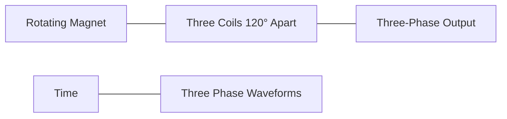

**મેમરી ટ્રીક:** "THREE" - ત્રણ કોઇલ 120° અંતરે ફરતી EMF ઉત્પન્ન કરે છે

## પ્રશ્ન 2(બ OR) [4 માર્ક્સ]

**જરૂરી સર્કિટ ડાયાગ્રામ અને સમીકરણની મદદથી શુદ્ધ ઇન્ડક્ટર સાથે AC વૉલ્ટેજની વર્તણૂક સમજાવો.**

**જવાબ**:

**શુદ્ધ ઇન્ડક્ટર સાથે AC ની વર્તણૂક:**

- શુદ્ધ ઇન્ડક્ટરમાં કરંટ વોલ્ટેજથી 90° પાછળ હોય છે
- ઇન્ડક્ટિવ રિએક્ટન્સ (XL) = 2πfL
- જેમ ફ્રિક્વન્સી વધે છે, તેમ રિએક્ટન્સ વધે છે
- ચુંબકીય ક્ષેત્રમાં ઊર્જા સંગ્રહે છે

**સર્કિટ અને વેવફોર્મ:**

```goat
    +       +
    |       |
 AC |       | L
    |       |
    +       +

 Voltage
    |    /\
    |   /  \
    |  /    \
    | /      \    Current
    |/        \    /\
----+----------\--/--\----+---->
    |\          \/    \  /
    | \         /|     \/
    |  \       / |
    |   \     /  |
    |    \   /   |
    |     \ /    |
    |      V     |
```

**સમીકરણ:** V = L × dI/dt

**મેમરી ટ્રીક:** "VLIC" - ઇન્ડક્ટરમાં વોલ્ટેજ કરંટથી 90° આગળ હોય છે

## પ્રશ્ન 2(ક OR) [7 માર્ક્સ]

**3-ફેઝ AC માટે ફેઝ વૉલ્ટેજ, લાઇન વૉલ્ટેજ, ફેઝ કરંટ અને લાઇન કરંટની વ્યાખ્યા લખો. (i) સ્ટાર (Y) કનેક્શન માટે જો ફેઝ વૉલ્ટેજની વેલ્યૂ 100V હોય તો લાઇન વૉલ્ટેજની વેલ્યૂ શોધો. તથા સ્ટાર (Y) કનેક્શન માટે જો ફેઝ કરંટની વેલ્યૂ 5A હોય તો લાઇન કરંટની વેલ્યૂ શોધો (ii) ડેલ્ટા (Δ) કનેક્શન માટે જો ફેઝ વૉલ્ટેજની વેલ્યૂ 100V હોય તો લાઇન વૉલ્ટેજની વેલ્યૂ શોધો. તથા ડેલ્ટા (Δ) કનેક્શન માટે જો ફેઝ કરંટની વેલ્યૂ 5A હોય તો લાઇન કરંટની વેલ્યૂ શોધો.**

**જવાબ**:

| શબ્દ | વ્યાખ્યા |
|------|------------|
| **ફેઝ વૉલ્ટેજ** | સિંગલ ફેઝ ઘટક પરનો વૉલ્ટેજ |
| **લાઇન વૉલ્ટેજ** | કોઈપણ બે લાઇન વચ્ચેનો વૉલ્ટેજ |
| **ફેઝ કરંટ** | ફેઝ ઘટકમાંથી વહેતો કરંટ |
| **લાઇન કરંટ** | લાઇનમાંથી વહેતો કરંટ |

**સ્ટાર (Y) કનેક્શન:**

- લાઇન વૉલ્ટેજ = √3 × ફેઝ વૉલ્ટેજ
- લાઇન કરંટ = ફેઝ કરંટ

ગણતરી:

- લાઇન વૉલ્ટેજ = √3 × 100 = 173.2 V
- લાઇન કરંટ = 5 A

**ડેલ્ટા (Δ) કનેક્શન:**

- લાઇન વૉલ્ટેજ = ફેઝ વૉલ્ટેજ
- લાઇન કરંટ = √3 × ફેઝ કરંટ

ગણતરી:

- લાઇન વૉલ્ટેજ = 100 V
- લાઇન કરંટ = √3 × 5 = 8.66 A

**આકૃતિ:**

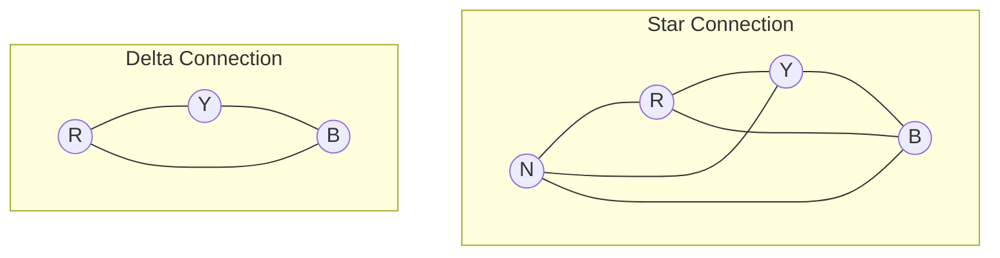

**મેમરી ટ્રીક:** "SLIP" - સ્ટાર કનેક્શનમાં: લાઇન વૉલ્ટેજ = √3 × ફેઝ વૉલ્ટેજ, ડેલ્ટામાં: ફેઝ વૉલ્ટેજ = લાઇન વૉલ્ટેજ

## પ્રશ્ન 3(અ) [3 માર્ક્સ]

**જરૂરી ડાયાગ્રામ અને સમીકરણની મદદથી ફેરાડેના ઇલેક્ટ્રોમેગ્નેટિક ઇન્ડકશનના નિયમોને લખો અને સમજાવો.**

**જવાબ**:

**ફેરાડેના નિયમો:**

1. **પ્રથમ નિયમ:** જ્યારે વાહક ચુંબકીય ફ્લક્સને કાપે છે, ત્યારે EMF ઇન્ડ્યુસ થાય છે
2. **બીજો નિયમ:** ઇન્ડ્યુસ થયેલા EMF નો પરિમાણ ચુંબકીય ફ્લક્સના પરિવર્તનના દર સાથે પ્રમાણમાં હોય છે

**સમીકરણ:** e = -N × (dΦ/dt)
જ્યાં: e = ઇન્ડ્યુસ EMF, N = આંટાની સંખ્યા, dΦ/dt = ફ્લક્સ પરિવર્તનનો દર

**આકૃતિ:**

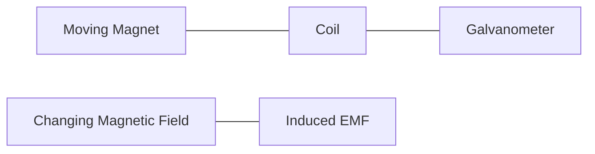

**મેમરી ટ્રીક:** "FIRE" - ફ્લક્સમાં પરિવર્તન EMF ઇન્ડ્યુસ કરે છે

## પ્રશ્ન 3(બ) [4 માર્ક્સ]

**ઓલ્ટરનેટિંગ ક્વોન્ટિટી માટે એમ્પલિટ્યુડ, ફ્રિક્વન્સી (આવૃત્તિ), ટાઈમ પિરિયડ અને RMS વેલ્યૂની વ્યાખ્યા લખો.**

**જવાબ**:

| પરિમાણ | વ્યાખ્યા | સૂત્ર |
|-----------|------------|---------|
| **એમ્પલિટ્યુડ** | ઓલ્ટરનેટિંગ ક્વોન્ટિટીનું મહત્તમ મૂલ્ય | Vₘ |
| **ફ્રિક્વન્સી** | એક સેકન્ડમાં પૂર્ણ થતા ચક્રોની સંખ્યા | f = 1/T |
| **ટાઈમ પિરિયડ** | એક ચક્ર પૂર્ણ કરવા માટે લાગતો સમય | T = 1/f |
| **RMS મૂલ્ય** | અસરકારક મૂલ્ય, સમાન હીટિંગ ઉત્પન્ન કરતા DC ના બરાબર | Vrms = Vₘ/√2 = 0.707Vₘ |

**આકૃતિ:**

```goat
    Amplitude
        ^
        |    /|\
        |   / | \
        |  /  |  \
        | /   |   \
        |/    |    \
--------+-----+-----\-------+---->
        |\    |     /\      |
        | \   |    /  \     |
        |  \  |   /    \    |
        |   \ |  /      \   |
        |    \|/         \  |
        |                 \ |
        |                  \|
        |                   
        |<-Time Period T ->|
```

**મેમરી ટ્રીક:** "AFTR" - એમ્પલિટ્યુડ મહત્તમ છે, ફ્રિક્વન્સી દર સેકન્ડે ચક્રો, ટાઈમ પિરિયડ 1/f છે, RMS મહત્તમ મૂલ્યનો 0.707 ગણો

## પ્રશ્ન 3(ક) [7 માર્ક્સ]

**સેલ્ફ ઇન્ડકટન્સ અને મ્યુચ્યુઅલ ઇન્ડકટન્સ સમજાવો. (i) જો કોઈલને 2 A કરંટ આપવાથી તેમાં 5 μWb-turns જેટલું મેગ્નેટિક ફલ્સ કોઇલમાં ઇનડયૂસ થતું હોય તો કોઇલનું સેલ્ફ ઇન્ડકટન્સ શોધો (ii) કોઇલનું સેલ્ફ ઇન્ડકટન્સ શોધો જો આપેલ કોઇલના ભૌતિક પરિમાણો નીચે પ્રમાણે આપેલ હોય: કોઇલના ટર્નસ 10, કોઇલના મટિરિયલની રિલેટિવ પરમીએબીલીટી 3, કોઇલની લંબાઈ 5 cm અને કોઇલનો ક્રોસ સેક્શનલ એરિયા 2 cm² હોય.**

**જવાબ**:

**સેલ્ફ ઇન્ડકટન્સ:** કોઇલનો એવો ગુણધર્મ જે તેમાંથી પસાર થતા કરંટમાં પરિવર્તનનો વિરોધ પોતાનામાં EMF ઉત્પન્ન કરીને કરે છે.

**મ્યુચ્યુઅલ ઇન્ડકટન્સ:** એક કોઇલનો એવો ગુણધર્મ જેનાથી તેમાંથી પસાર થતા કરંટમાં પરિવર્તનને કારણે બીજી કોઇલમાં EMF ઉત્પન્ન થાય છે.

**ભાગ (i):**

```
સેલ્ફ ઇન્ડકટન્સ (L) = ફ્લક્સ લિંકેજ / કરંટ
L = 5 μWb-turns / 2 A
L = 2.5 μH
```

**ભાગ (ii):**

```
L = (μₒ × μᵣ × N² × A) / l
L = (4π × 10⁻⁷ × 3 × 10² × 2 × 10⁻⁴) / (5 × 10⁻²)
L = (4π × 3 × 100 × 2 × 10⁻⁷) / (5 × 10⁻²)
L = (24π × 10⁻⁵) / (5 × 10⁻²)
L = 24π × 10⁻³ / 5
L = 4.8π × 10⁻³
L = 15.07 μH
```

**આકૃતિ:**


**મેમરી ટ્રીક:** "SLIM" - સેલ્ફ ઇન્ડકટન્સ પોતાના ફ્લક્સથી, ઇન્ડકશન બે કોઇલ વચ્ચે મ્યુચ્યુઅલ

## પ્રશ્ન 3(અ OR) [3 માર્ક્સ]

**ડાયનેમિકલી ઇનડયૂસડ ઈએમએફની વ્યાખ્યા લખો. જરૂરી ડાયાગ્રામ અને સમીકરણની મદદથી ડાયનેમિકલી ઇનડયૂસડ ઈએમએફને સમજાવો.**

**જવાબ**:

**ડાયનેમિકલી ઇનડયૂસડ EMF:** વાહક અને ચુંબકીય ક્ષેત્ર વચ્ચેના સાપેક્ષ ગતિને કારણે વાહકમાં ઉત્પન્ન થતું EMF.

**સમીકરણ:** e = Blv
જ્યાં: e = ઇન્ડ્યુસ EMF, B = ચુંબકીય ફ્લક્સ ઘનતા, l = વાહકની લંબાઈ, v = વાહકનો વેગ

**આકૃતિ:**

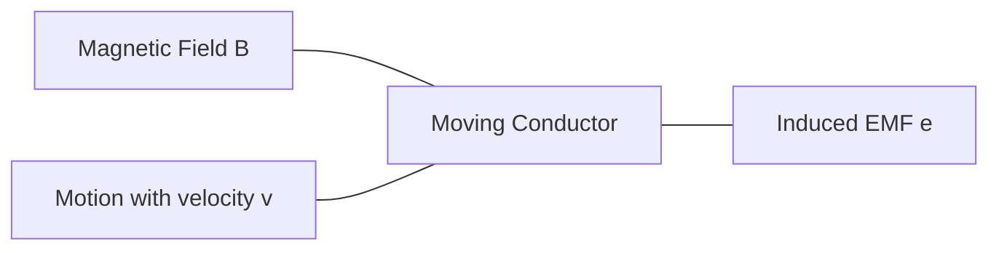

**મેમરી ટ્રીક:** "MOVE" - ચુંબકીય ક્ષેત્રમાં વાહકની ગતિ વોલ્ટેજ ઉત્પન્ન કરે છે

## પ્રશ્ન 3(બ OR) [4 માર્ક્સ]

**ઓલ્ટરનેટિંગ ક્વોન્ટિટી માટે સાઇકલ, ફોર્મ ફેક્ટર અને પીક ફેક્ટરની વ્યાખ્યા લખો. તથા સાઈનુંસોઈડલ ક્વોન્ટિટી માટે ફોર્મ ફેક્ટર અને પીક ફેક્ટરની વેલ્યૂ લખો.**

**જવાબ**:

| શબ્દ | વ્યાખ્યા | સાઇનુસોઇડલ તરંગ માટે મૂલ્ય |
|------|------------|---------------------------|
| **સાઇકલ** | ઓલ્ટરનેટિંગ ક્વોન્ટિટીનું એક સંપૂર્ણ આંદોલન | - |
| **ફોર્મ ફેક્ટર** | RMS મૂલ્ય અને સરેરાશ મૂલ્યનો ગુણોત્તર | 1.11 |
| **પીક ફેક્ટર** | મહત્તમ મૂલ્ય અને RMS મૂલ્યનો ગુણોત્તર | 1.414 |

**આકૃતિ:**

```goat
    ^
    |    /|\
    |   / | \     One Cycle
    |  /  |  \    <----------->
    | /   |   \
    |/    |    \
----+-----+-----\-------+---->
    |\    |     /\      |
    | \   |    /  \     |
    |  \  |   /    \    |
    |   \ |  /      \   |
    |    \|/         \  |
    |                 \ |
    |                  \|
    
    Form Factor = Vrms/Vavg = 1.11
    Peak Factor = Vm/Vrms = 1.414
```

**મેમરી ટ્રીક:** "CFP" - સાઇકલ એક આંદોલન, ફોર્મ ફેક્ટર 1.11, પીક ફેક્ટર 1.414

## પ્રશ્ન 3(ક OR) [7 માર્ક્સ]

**લેન્ઝનો નિયમ લખો અને સમજાવો. જનરેટર માટે ફ્લેમિંગનો જમણા હાથનો નિયમ લખો અને સમજાવો. જો 4 μH સેલ્ફ ઇન્ડકટન્સ ધરાવતા ઇન્ડક્ટરમાંથી 3 A કરંટ પસાર થતો હોય તો તે ઇન્ડક્ટરમાં સંગ્રહ થયેલ ઉર્જા શોધો.**

**જવાબ**:

**લેન્ઝનો નિયમ:** ઇન્ડ્યુસ થયેલા EMF ની દિશા એવી હોય છે કે તે ચુંબકીય ફ્લક્સમાં થતા પરિવર્તનનો વિરોધ કરે છે.

**ફ્લેમિંગનો જમણા હાથનો નિયમ:**

- અંગૂઠો: વાહકની ગતિની દિશા
- પ્રથમ આંગળી: ચુંબકીય ક્ષેત્રની દિશા
- મધ્યમા આંગળી: ઇન્ડ્યુસ થયેલા કરંટની દિશા

**ઊર્જાની ગણતરી:**

```
ઇન્ડક્ટરમાં સંગ્રહિત ઊર્જા (W) = (1/2) × L × I²
W = (1/2) × 4 × 10⁻⁶ × 3²
W = (1/2) × 4 × 10⁻⁶ × 9
W = 18 × 10⁻⁶ / 2
W = 9 × 10⁻⁶ જુલ
W = 9 μJ
```

**આકૃતિ:**

```goat
   Fleming's Right Hand Rule:
   
   Thumb (Motion) →
   Index (Field) ↑
   Middle (Current) ↻
   
   Lenz's Law:
   
   N[===>]S  →  (Conductor)
   Induced current opposes motion
```

**મેમરી ટ્રીક:** "LOF" - લેન્ઝનો નિયમ ફ્લક્સ પરિવર્તનનો વિરોધ કરે છે, ફ્લેમિંગનો નિયમ - અંગૂઠો ગતિ, પ્રથમ ક્ષેત્ર, મધ્યમા કરંટ

## પ્રશ્ન 4(અ) [3 માર્ક્સ]

**PV સેલની વ્યાખ્યા લખો. PV સેલનું કાર્ય સમજાવો.**

**જવાબ**:

**PV સેલ:** ફોટોવોલ્ટેઇક સેલ એક અર્ધવાહક ઉપકરણ છે જે પ્રકાશ ઊર્જાને સીધી જ વિદ્યુત ઊર્જામાં રૂપાંતરિત કરે છે.

**કાર્ય:**

- સૂર્યપ્રકાશમાંથી ફોટોન્સ શોષે છે
- અર્ધવાહકમાં ઇલેક્ટ્રોન-હોલ જોડી બનાવે છે
- p-n જંક્શન પર પોટેન્શિયલ તફાવત ઉત્પન્ન કરે છે
- સૌર ઊર્જાને વિદ્યુત ઊર્જામાં રૂપાંતરિત કરે છે

**આકૃતિ:**

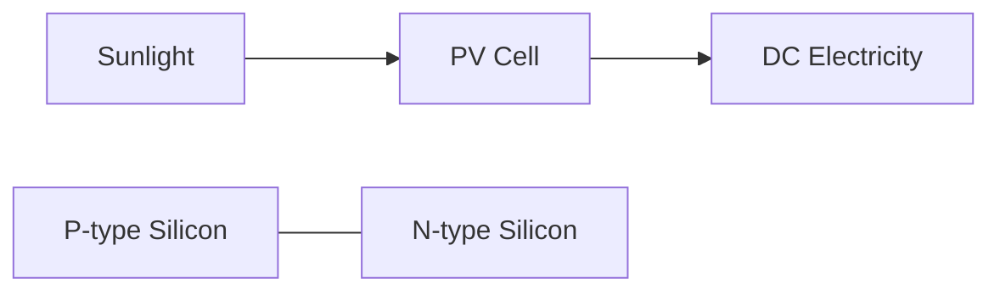

**મેમરી ટ્રીક:** "PASE" - PV સેલ સૂર્યપ્રકાશ શોષે છે અને વીજળી ઉત્પન્ન કરે છે

## પ્રશ્ન 4(બ) [4 માર્ક્સ]

**ગ્રીન એનર્જીનું વર્ગીકરણ સમજાવો.**

**જવાબ**:

| ગ્રીન એનર્જી પ્રકાર | સ્ત્રોત | ઉદાહરણ ઉપયોગો |
|-------------------|--------|----------------------|
| **સૌર ઊર્જા** | સૂર્ય | PV પેનલ, સોલર થર્મલ |
| **પવન ઊર્જા** | વાયુ પ્રવાહ | પવન ટર્બાઇન |
| **જળ ઊર્જા** | વહેતું પાણી | ડેમ, ભરતી-ઓટ, મોજાં |
| **બાયોમાસ ઊર્જા** | જૈવિક પદાર્થ | બાયોફ્યુઅલ, બાયોગેસ |
| **ભૂતાપીય ઊર્જા** | પૃથ્વીની ગરમી | ભૂતાપીય પ્લાન્ટ |

**આકૃતિ:**

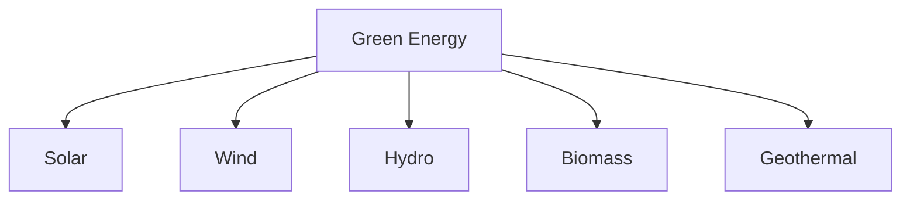

**મેમરી ટ્રીક:** "SWHBG" - સૂર્ય, વાયુ, હાઇડ્રો, બાયોમાસ, ભૂતાપીય ઊર્જા સ્ત્રોત

## પ્રશ્ન 4(ક) [7 માર્ક્સ]

**સોલર પાવર સિસ્ટમનો બ્લોક ડાયગ્રામ દોરો અને સમજાવો.**

**જવાબ**:

**સોલર પાવર સિસ્ટમના ઘટકો:**

| ઘટક | કાર્ય |
|-----------|----------|
| **સોલર પેનલ** | સૂર્યપ્રકાશને DC વીજળીમાં રૂપાંતરિત કરે છે |
| **ચાર્જ કંટ્રોલર** | બેટરી ચાર્જિંગનું નિયમન કરે છે અને ઓવરચાર્જિંગ અટકાવે છે |
| **બેટરી બેંક** | પછીના ઉપયોગ માટે વીજળી સંગ્રહિત કરે છે |
| **ઇન્વર્ટર** | ઘરગથ્થુ ઉપકરણો માટે DC ને AC માં રૂપાંતરિત કરે છે |
| **ડિસ્ટ્રિબ્યુશન પેનલ** | વીજળીને લોડ્સમાં વિતરિત કરે છે |
| **ગ્રિડ કનેક્શન** | વૈકલ્પિક યુટિલિટી ગ્રિડ કનેક્શન |

**બ્લોક ડાયાગ્રામ:**

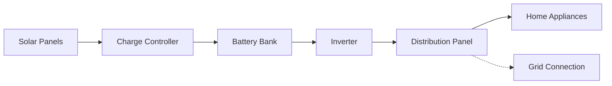

**મેમરી ટ્રીક:** "SCBIDG" - સોલર પેનલ, ચાર્જ કંટ્રોલર, બેટરીઝ, ઇન્વર્ટર, ડિસ્ટ્રિબ્યુશન, ગ્રિડ

## પ્રશ્ન 4(અ OR) [3 માર્ક્સ]

**ગ્રીન એનર્જી, કન્વેન્શનલ એનર્જી અને રિન્યુએબલ એનર્જીની વ્યાખ્યા લખો.**

**જવાબ**:

| શબ્દ | વ્યાખ્યા |
|------|------------|
| **ગ્રીન એનર્જી** | કુદરતી રીતે પુનઃપ્રાપ્ત થતા સ્ત્રોતોમાંથી મેળવવામાં આવતી ઊર્જા જે પર્યાવરણ પર ન્યૂનતમ પ્રભાવ ધરાવે છે |
| **કન્વેન્શનલ એનર્જી** | પરંપરાગત ફોસિલ ફ્યુઅલ સ્ત્રોતો જેવા કે કોલસો, તેલ અને કુદરતી ગેસમાંથી મેળવવામાં આવતી ઊર્જા |
| **રિન્યુએબલ એનર્જી** | એવા સ્ત્રોતોમાંથી મેળવવામાં આવતી ઊર્જા જે માનવ સમયમર્યાદામાં કુદરતી રીતે પુનઃપૂર્તિ થાય છે |

**આકૃતિ:**

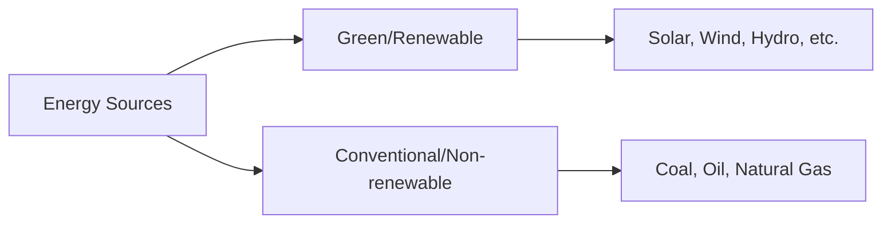

**મેમરી ટ્રીક:** "GCR" - ગ્રીન સ્વચ્છ છે, કન્વેન્શનલ કાર્બન છોડે છે, રિન્યુએબલ પુનઃપૂર્ણ થાય છે

## પ્રશ્ન 4(બ OR) [4 માર્ક્સ]

**ગ્રીન એનર્જીની ઉપયોગિતા સમજાવો.**

**જવાબ**:

**ગ્રીન એનર્જીની આવશ્યકતા:**

| જરૂરિયાત | સમજૂતી |
|------|-------------|
| **પર્યાવરણ સંરક્ષણ** | પ્રદૂષણ અને ગ્રીનહાઉસ ગેસ ઉત્સર્જન ઘટાડે છે |
| **સંસાધન સંરક્ષણ** | મર્યાદિત ફોસિલ ફ્યુઅલ સંસાધનોનું સંરક્ષણ કરે છે |
| **ઊર્જા સુરક્ષા** | આયાતી ફ્યુઅલ પર નિર્ભરતા ઘટાડે છે |
| **આર્થિક લાભ** | નોકરીઓ બનાવે છે અને લાંબા ગાળે ઊર્જા ખર્ચ ઘટાડે છે |
| **ટકાઉ વિકાસ** | ભવિષ્યની પેઢીઓને જોખમમાં મૂક્યા વિના વર્તમાન જરૂરિયાતો પૂરી કરે છે |

**આકૃતિ:**

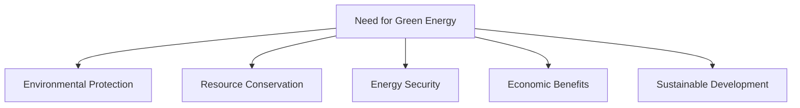

**મેમરી ટ્રીક:** "ERESS" - પર્યાવરણ, સંસાધનો, ઊર્જા સુરક્ષા, બચત, ટકાઉપણું

## પ્રશ્ન 4(ક OR) [7 માર્ક્સ]

**વિન્ડ પાવર સિસ્ટમનો બ્લોક ડાયાગ્રામ ટર્બાઈનના પ્રકાર સહિત દોરો અને સમજાવો.**

**જવાબ**:

**વિન્ડ પાવર સિસ્ટમના ઘટકો:**

| ઘટક | કાર્ય |
|-----------|----------|
| **વિન્ડ ટર્બાઈન** | પવન ઊર્જાને યાંત્રિક ઊર્જામાં રૂપાંતરિત કરે છે |
| **ગિયરબોક્સ** | ફરવાની ગતિ વધારે છે |
| **જનરેટર** | યાંત્રિક ઊર્જાને વિદ્યુત ઊર્જામાં રૂપાંતરિત કરે છે |
| **કંટ્રોલર** | સિસ્ટમનું નિરીક્ષણ અને નિયંત્રણ કરે છે |
| **ટ્રાન્સફોર્મર** | ટ્રાન્સમિશન માટે વોલ્ટેજ વધારે છે |
| **ગ્રિડ કનેક્શન** | યુટિલિટી ગ્રિડ સાથે જોડાય છે |

**વિન્ડ ટર્બાઈનના પ્રકાર:**

1. **હોરિઝોન્ટલ એક્સિસ વિન્ડ ટર્બાઈન (HAWT)** - બ્લેડ્સ આડી ધરી પર ફરે છે
2. **વર્ટિકલ એક્સિસ વિન્ડ ટર્બાઈન (VAWT)** - બ્લેડ્સ ઊભી ધરી પર ફરે છે

**બ્લોક ડાયાગ્રામ:**

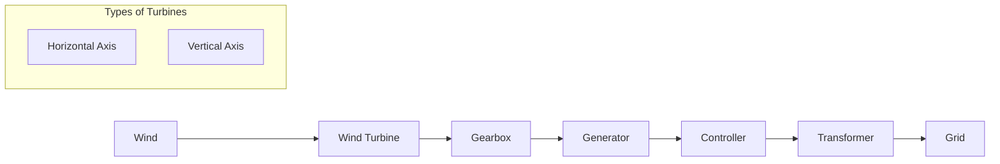

**મેમરી ટ્રીક:** "WGGTC" - વિન્ડ ટર્બાઈન ફેરવે છે, ગિયરબોક્સ ગતિ વધારે છે, જનરેટર વીજળી ઉત્પન્ન કરે છે, ટ્રાન્સફોર્મર વોલ્ટેજ વધારે છે, કંટ્રોલર મેનેજ કરે છે

## પ્રશ્ન 5(અ) [3 માર્ક્સ]

**અવરોધના રેઝિસ્ટન્સને અસર કરતાં પરિબળો સમજાવો.**

**જવાબ**:

**રેઝિસ્ટન્સને અસર કરતા પરિબળો:**

| પરિબળ | અસર |
|--------|--------|
| **તાપમાન** | ધાતુઓમાં તાપમાન વધવાથી રેઝિસ્ટન્સ વધે છે |
| **લંબાઈ** | રેઝિસ્ટન્સ વાહકની લંબાઈના સીધા પ્રમાણમાં હોય છે |
| **ક્રોસ-સેક્શનલ ક્ષેત્રફળ** | રેઝિસ્ટન્સ ક્ષેત્રફળના વ્યસ્ત પ્રમાણમાં હોય છે |
| **મટીરિયલ** | વિવિધ પદાર્થોની વિશિષ્ટ અવરોધકતા અલગ હોય છે |

**સમીકરણ:** R = ρ × (l/A)

જ્યાં:

- R = રેઝિસ્ટન્સ
- ρ = અવરોધકતા
- l = લંબાઈ
- A = ક્રોસ-સેક્શનલ ક્ષેત્રફળ

**મેમરી ટ્રીક:** "TLAM" - તાપમાન, લંબાઈ, ક્ષેત્રફળ, મટીરિયલ રેઝિસ્ટન્સને અસર કરે છે

## પ્રશ્ન 5(બ) [4 માર્ક્સ]

**પાવર ત્રિકોણની મદદથી એક્ટિવ પાવર, રીએક્ટિવ પાવર, અપેરેન્ટ પાવર અને પાવર ફેક્ટરની વ્યાખ્યા લખો. તથા તેઓના એકમ લખો.**

**જવાબ**:

| પાવર પ્રકાર | વ્યાખ્યા | સૂત્ર | એકમ |
|------------|------------|---------|------|
| **એક્ટિવ પાવર (P)** | વાસ્તવિક વપરાયેલ પાવર | P = VI cosφ | વોટ (W) |
| **રીએક્ટિવ પાવર (Q)** | સ્ત્રોત અને લોડ વચ્ચે આંદોલિત થતો પાવર | Q = VI sinφ | વોલ્ટ-એમ્પિયર રીએક્ટિવ (VAR) |
| **અપેરેન્ટ પાવર (S)** | વોલ્ટેજ અને કરંટનો ગુણાકાર | S = VI | વોલ્ટ-એમ્પિયર (VA) |
| **પાવર ફેક્ટર (PF)** | એક્ટિવ પાવર અને અપેરેન્ટ પાવરનો ગુણોત્તર | PF = P/S = cosφ | કોઈ એકમ નહીં (0 થી 1) |

**પાવર ત્રિકોણ:**

```goat
            Q (VAR)
            |
            |
            |
            |       S (VA)
            |     /
            |   /
            | /
            +--------------- P (W)
           /|
       PF=cosφ
```

**મેમરી ટ્રીક:** "ARSP" - એક્ટિવ વાસ્તવિક પાવર વોટમાં, રીએક્ટિવ સંગ્રહિત પાવર VAR માં, S કુલ VA, PF cosφ છે

## પ્રશ્ન 5(ક) [7 માર્ક્સ]

**કિર્ચોફનો વૉલ્ટેજનો નિયમ અને કિર્ચોફનો કરંટનો નિયમ લખો અને સર્કિટ ડાયાગ્રામની મદદથી સમજાવો.**

**જવાબ**:

**કિર્ચોફનો વૉલ્ટેજનો નિયમ (KVL):** સર્કિટના કોઈપણ બંધ લૂપમાં તમામ વૉલ્ટેજનો બીજગણિતીય સરવાળો શૂન્ય હોય છે.

**કિર્ચોફનો કરંટનો નિયમ (KCL):** કોઈપણ જંક્શન પર પ્રવેશતા અને બહાર નીકળતા તમામ કરંટનો બીજગણિતીય સરવાળો શૂન્ય હોય છે.

| નિયમ | સમીકરણ | ઉપયોગ |
|-----|----------|-------------|
| **KVL** | ∑V = 0 | જટિલ સર્કિટમાં વૉલ્ટેજ શોધવા |
| **KCL** | ∑I = 0 | કરંટનું વિતરણ શોધવા |

**સર્કિટ ડાયાગ્રામ:**

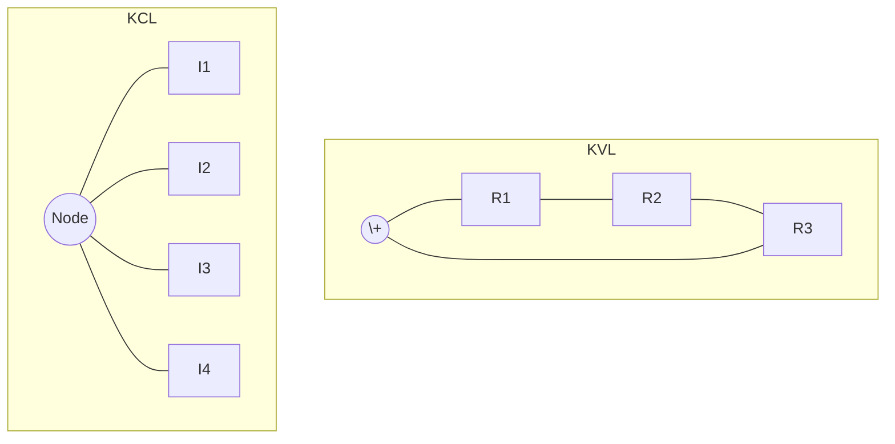

**KVL ઉદાહરણ:** V₁ + V₂ + V₃ = 0

**KCL ઉદાહરણ:** I₁ + I₂ = I₃ + I₄

**મેમરી ટ્રીક:** "VCL" - બંધ લૂપમાં વૉલ્ટેજનો સરવાળો શૂન્ય, જંક્શન પર કરંટનો સરવાળો શૂન્ય

## પ્રશ્ન 5(અ OR) [3 માર્ક્સ]

**ઈએમએફ અને પોટેન્શિયલ ડિફરન્સ વચ્ચેનો તફાવત લખો તથા સેલ અને બેટરી વચ્ચેનો તફાવત લખો.**

**જવાબ**:

| EMF vs. પોટેન્શિયલ ડિફરન્સ | સેલ vs. બેટરી |
|------------------------------|------------------|
| **EMF**: સ્ત્રોત દ્વારા એકમ ચાર્જ દીઠ પૂરી પાડવામાં આવતી ઊર્જા | **સેલ**: રાસાયણિક ઊર્જાને વિદ્યુત ઊર્જામાં રૂપાંતરિત કરતું એકલ એકમ |
| **પોટેન્શિયલ ડિફરન્સ**: બાહ્ય સર્કિટમાં વપરાયેલી ઊર્જા | **બેટરી**: સિરીઝ અથવા પેરેલલમાં જોડાયેલા બે કે વધુ સેલનો સમૂહ |
| EMF ખુલ્લી સર્કિટમાં પણ અસ્તિત્વમાં હોય છે | સેલમાં ઓછો વોલ્ટેજ હોય છે (સામાન્ય રીતે 1.5V અથવા 2V) |
| પોટેન્શિયલ ડિફરન્સ માત્ર બંધ સર્કિટમાં અસ્તિત્વમાં હોય છે | બેટરીમાં વધુ વોલ્ટેજ આઉટપુટ હોય છે |

**આકૃતિ:**

```goat
EMF Source          Cell vs Battery
  +---+              +---+    +---+---+---+
  |   |              |   |    |   |   |   |
  | E |              | 1 |    | 1 | 2 | 3 |
  |   |              |   |    |   |   |   |
  +---+              +---+    +---+---+---+
                     Cell     Battery (Series)
```

**મેમરી ટ્રીક:** "ESOP" - EMF સ્ત્રોતની ઊર્જા છે, ખુલ્લી સર્કિટમાં પણ; પોટેન્શિયલ ડિફરન્સ કાર્યરત ઊર્જા છે

## પ્રશ્ન 5(બ OR) [4 માર્ક્સ]

**શુદ્ધ અવરોધ, શુદ્ધ કેપેસિટર અને શુદ્ધ ઇન્ડક્ટર માટે AC વૉલ્ટેજ અને AC કરંટ વચ્ચેનો સંબંધ લખો. શુદ્ધ અવરોધ, શુદ્ધ કેપેસિટર અને શુદ્ધ ઇન્ડક્ટર માટે AC વૉલ્ટેજ અને AC કરંટનો વેક્ટર ડાયાગ્રામ દોરો. તથા શુદ્ધ અવરોધ, શુદ્ધ કેપેસિટર અને શુદ્ધ ઇન્ડક્ટર માટે પાવર ફેક્ટરની વેલ્યૂ લખો.**

**જવાબ**:

| ઘટક | સંબંધ | ફેઝ તફાવત | પાવર ફેક્ટર |
|-----------|----------|------------------|--------------|
| **શુદ્ધ રેઝિસ્ટર** | V = IR | એકસરખા ફેઝમાં (0°) | 1 |
| **શુદ્ધ કેપેસિટર** | I = C(dV/dt) | કરંટ વોલ્ટેજથી 90° આગળ | 0 (આગળ) |
| **શુદ્ધ ઇન્ડક્ટર** | V = L(dI/dt) | કરંટ વોલ્ટેજથી 90° પાછળ | 0 (પાછળ) |

**વેક્ટર ડાયાગ્રામ:**

```goat
   Resistor         Capacitor        Inductor
     V,I               I               V
      ^                ^               ^
      |                |               |
      |                |               |
      |                |               |
      +------>        -+->           --+--
                       V               I
```

**મેમરી ટ્રીક:** "RCI" - રેઝિસ્ટરમાં કરંટ એકસરખા ફેઝમાં, કેપેસિટરમાં કરંટ આગળ, ઇન્ડક્ટરમાં કરંટ પાછળ

## પ્રશ્ન 5(ક OR) [7 માર્ક્સ]

**મટિરિયલ માટે ટેમ્પરેચર કોએફિસિયન્ટની વ્યાખ્યા લખો અને તેનો એકમ લખો. વાહક ઉપર તાપમાનની અસર ટેમ્પરેચર કોએફિસિયન્ટની મદદથી સમજાવો.**

**જવાબ**:

**ટેમ્પરેચર કોએફિસિયન્ટ:** તાપમાનમાં એક ડિગ્રી પરિવર્તન દીઠ રેઝિસ્ટન્સમાં થતો આંશિક ફેરફાર.

**એકમ:** પ્રતિ ડિગ્રી સેલ્સિયસ (°C⁻¹) અથવા પ્રતિ કેલ્વિન (K⁻¹)

**તાપમાનની રેઝિસ્ટન્સ પર અસર:**

**સમીકરણ:** R₂ = R₁[1 + α(T₂ - T₁)]

જ્યાં:

- R₁ = T₁ તાપમાને રેઝિસ્ટન્સ
- R₂ = T₂ તાપમાને રેઝિસ્ટન્સ
- α = ટેમ્પરેચર કોએફિસિયન્ટ
- T₁, T₂ = પ્રારંભિક અને અંતિમ તાપમાન

**વાહકો (ધાતુઓ) માટે:**

- તાપમાન વધવાથી રેઝિસ્ટન્સ વધે છે (ધન α)
- તાપમાન ઘટવાથી રેઝિસ્ટન્સ ઘટે છે

**અર્ધવાહકો માટે:**

- તાપમાન વધવાથી રેઝિસ્ટન્સ ઘટે છે (ઋણ α)

**કોષ્ટક:**

| મટીરિયલ | ટેમ્પરેચર કોએફિસિયન્ટ (α) પ્રતિ °C | વર્તણૂક |
|----------|-----------------------------------|----------|
| તાંબુ | 0.0043 | તાપમાન વધવાથી રેઝિસ્ટન્સ વધે છે |
| એલ્યુમિનિયમ | 0.0039 | તાપમાન વધવાથી રેઝિસ્ટન્સ વધે છે |
| નાઇક્રોમ | 0.0004 | તાપમાન સાથે નાનો ફેરફાર |
| સિલિકોન | -0.07 | તાપમાન વધવાથી રેઝિસ્ટન્સ ઘટે છે |

**આકૃતિ:**


**મેમરી ટ્રીક:** "TRIP" - તાપમાન રેઝિસ્ટન્સને કોએફિસિયન્ટના પ્રમાણમાં વધારે છે
