## Question 1(a) [3 marks]

**Define EMF, electric current and power. Also write their units.**

**Answer**:

| Term | Definition | Unit |
|------|------------|------|
| **EMF (Electromotive Force)** | The energy supplied by a source per unit charge | Volt (V) |
| **Electric Current** | The rate of flow of electric charge | Ampere (A) |
| **Power** | The rate at which electrical energy is transferred | Watt (W) |

**Mnemonic:** "EVA" - EMF in Volts, Current in Amperes, Power in Watts

## Question 1(b) [4 marks]

**Three resistors having resistances of 1000 Ω, 2000 Ω and 3000 Ω respectively are connected in series. Find the equivalent resistance of this series connection. Now these three resistors are connected in parallel. Find the equivalent resistance of this parallel connection.**

**Answer**:

**For Series Connection:**

```
Req = R1 + R2 + R3
Req = 1000 Ω + 2000 Ω + 3000 Ω
Req = 6000 Ω
```

**For Parallel Connection:**

```
1/Req = 1/R1 + 1/R2 + 1/R3
1/Req = 1/1000 + 1/2000 + 1/3000
1/Req = 0.001 + 0.0005 + 0.00033
1/Req = 0.00183
Req = 545.45 Ω
```

**Diagram:**

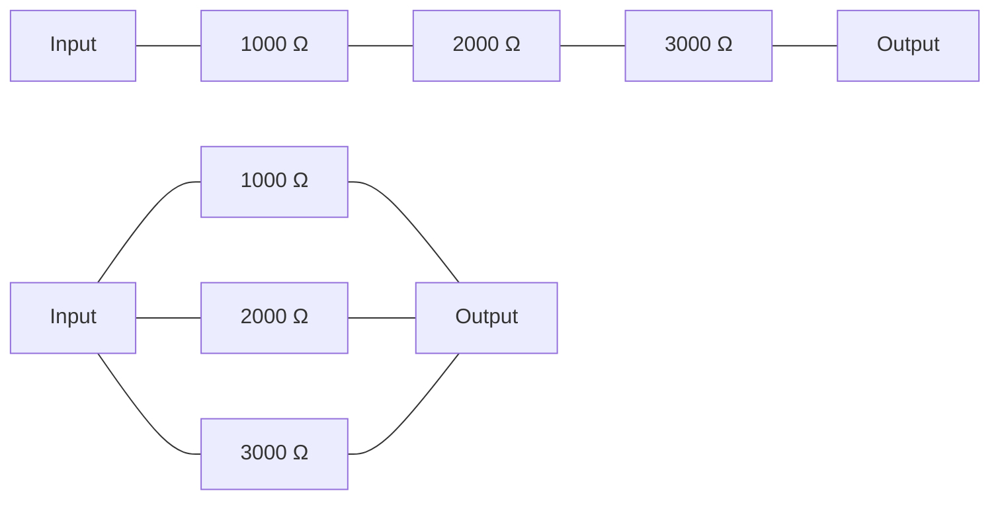

**Mnemonic:** "Series Sum, Parallel Product/Sum" - In series add directly, in parallel take reciprocal sum

## Question 1(c) [7 marks]

**Write the definition of Resistor, Capacitor and Inductor. Draw their symbols and write their units. Also write the use of each device in electrical circuit.**

**Answer**:

| Component | Definition | Symbol | Unit | Use in Circuit |
|-----------|------------|--------|------|----------------|
| **Resistor** | A component that opposes the flow of electric current | ⊥⊥⊥ | Ohm (Ω) | Limits current, divides voltage, generates heat |
| **Capacitor** | A component that stores electric charge | ⊢⊣ | Farad (F) | Blocks DC, passes AC, energy storage, filtering |
| **Inductor** | A component that stores energy in magnetic field | ⊗⊗⊗ | Henry (H) | Blocks AC, passes DC, energy storage, filtering |

**Diagram:**

```goat
+-----+    +-----+     +-----+
|     |    |     |     |  ⊗  |
| ⊥⊥⊥ |    | ⊢⊣ |     |  ⊗  |
|     |    |     |     |  ⊗  |
+-----+    +-----+     +-----+
Resistor   Capacitor   Inductor
```

**Mnemonic:** "RCI" - Resistor Controls current, Capacitor stores charge, Inductor stores magnetic energy

## Question 1(c OR) [7 marks]

**State Ohm's law and write the equation of Ohm's law with circuit diagram. Write applications of Ohm's law. Also write the limitation of Ohm's law.**

**Answer**:

**Ohm's Law:** The current flowing through a conductor is directly proportional to the voltage across it and inversely proportional to its resistance.

**Equation:** V = I × R

**Circuit Diagram:**


**Applications of Ohm's Law:**

- Calculating current, voltage, or resistance in circuits
- Designing electrical and electronic circuits
- Power calculations (P = V × I = I² × R = V²/R)
- Circuit analysis using voltage divider and current divider

**Limitations of Ohm's Law:**

- Not applicable for non-linear devices (diodes, transistors)
- Not valid for high-frequency AC circuits
- Not valid for non-metallic conductors
- Does not apply during transient conditions

**Mnemonic:** "VIR" - Voltage equals current times resistance

## Question 2(a) [3 marks]

**Explain the generation of alternating EMF with the help of necessary diagram and equation.**

**Answer**:

Alternating EMF is generated when a conductor rotates in a magnetic field.

**Equation:** e = E₀ sin(ωt) = E₀ sin(2πft)

Where:

- e = instantaneous EMF
- E₀ = maximum EMF
- ω = angular velocity (2πf)
- f = frequency
- t = time

**Diagram:**

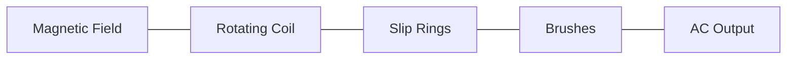

**Mnemonic:** "RCBS" - Rotation of Coil in magnetic field produces sinusoidal EMF

## Question 2(b) [4 marks]

**Explain the behavior of pure capacitor with AC supply with necessary circuit diagram and equation.**

**Answer**:

**Behavior of Pure Capacitor with AC:**

- Current leads voltage by 90° in a pure capacitor
- Capacitive reactance (Xc) = 1/(2πfC)
- As frequency increases, reactance decreases
- Stores energy in electric field during charging

**Circuit and Waveform:**

```goat
    +       +
    |       |
 AC |       | C
    |       |
    +       +

 Voltage
    |    /\
    |   /  \
    |  /    \    Current
    | /      \    /\
    |/        \  /  \
----+----------\/----\----+---->
    |\        /|      \  /
    | \      / |       \/
    |  \    /  |
    |   \  /   |
    |    \/    |
```

**Equation:** I = C × dV/dt

**Mnemonic:** "CIVIC" - Capacitor's current Is ahead of Voltage by 90° In Circuit

## Question 2(c) [7 marks]

**An AC voltage is expressed as 300 Sin (628t) V. Find (i) Amplitude (ii) Frequency (iii) Time period (iv) Average value (v) RMS Value (vi) Form Factor and (vii) Peak Factor for this AC voltage.**

**Answer**:

Given: v = 300 Sin(628t) V

| Parameter | Formula | Calculation | Result |
|-----------|---------|-------------|--------|
| **Amplitude** | V₀ | 300 V | 300 V |
| **Angular Frequency** | ω | 628 rad/s | 628 rad/s |
| **Frequency** | f = ω/2π | 628/2π = 628/6.28 | 100 Hz |
| **Time Period** | T = 1/f | 1/100 | 0.01 s |
| **Average Value** | Vavg = 2V₀/π | 2×300/π = 600/3.14 | 191 V |
| **RMS Value** | Vrms = V₀/√2 | 300/1.414 | 212.16 V |
| **Form Factor** | FF = Vrms/Vavg | 212.16/191 | 1.11 |
| **Peak Factor** | PF = V₀/Vrms | 300/212.16 | 1.414 |

**Mnemonic:** "FART FAFP" - Frequency is Angular frequency divided by 2π, RMS is peak divided by root 2, Time period is 1/f, Form factor is 1.11, Average is 2Vₘ/π, Peak factor is 1.414

## Question 2(a OR) [3 marks]

**Explain the generation of 3-phase alternating EMF.**

**Answer**:

3-phase alternating EMF is generated using three separate coils placed 120° apart in a magnetic field.

**Key Points:**

- Three identical coils are placed 120° apart
- Each coil produces sinusoidal EMF
- Phases are labeled as R, Y, and B (or U, V, W)
- Phase difference between any two phases is 120°

**Diagram:**

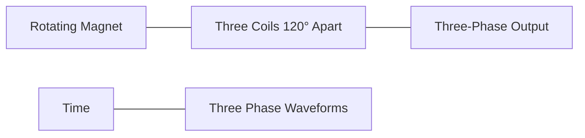

**Mnemonic:** "THREE" - Three coils Have 120° Rotating EMF Each

## Question 2(b OR) [4 marks]

**Explain the behavior of pure inductor with AC supply with necessary circuit diagram and equation.**

**Answer**:

**Behavior of Pure Inductor with AC:**

- Current lags voltage by 90° in a pure inductor
- Inductive reactance (XL) = 2πfL
- As frequency increases, reactance increases
- Stores energy in magnetic field

**Circuit and Waveform:**

```goat
    +       +
    |       |
 AC |       | L
    |       |
    +       +

 Voltage
    |    /\
    |   /  \
    |  /    \
    | /      \    Current
    |/        \    /\
----+----------\--/--\----+---->
    |\          \/    \  /
    | \         /|     \/
    |  \       / |
    |   \     /  |
    |    \   /   |
    |     \ /    |
    |      V     |
```

**Equation:** V = L × dI/dt

**Mnemonic:** "VLIC" - Voltage Leads current by 90° In inductor Circuit

## Question 2(c OR) [7 marks]

**Define phase voltage, line voltage, phase current and line current for 3-phase AC. (i) Calculate the line voltage for star (Y) connection if the phase voltage is 100V. Also find the line current for star (Y) connection if the phase current is 5A (ii) Calculate the line voltage for delta (Δ) connection if the phase voltage is 100V. Also find the line current for delta (Δ) connection if the phase current is 5A.**

**Answer**:

| Term | Definition |
|------|------------|
| **Phase Voltage** | Voltage across a single phase element |
| **Line Voltage** | Voltage between any two lines |
| **Phase Current** | Current flowing through a phase element |
| **Line Current** | Current flowing through a line |

**Star (Y) Connection:**

- Line voltage = √3 × Phase voltage
- Line current = Phase current

Calculations:

- Line voltage = √3 × 100 = 173.2 V
- Line current = 5 A

**Delta (Δ) Connection:**

- Line voltage = Phase voltage
- Line current = √3 × Phase current

Calculations:

- Line voltage = 100 V
- Line current = √3 × 5 = 8.66 A

**Diagram:**

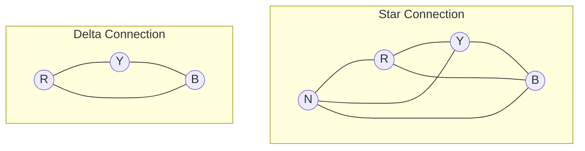

**Mnemonic:** "SLIP" - Star: Line voltage is √3 times Phase voltage, In Delta: Phase voltage equals Line voltage

## Question 3(a) [3 marks]

**State and explain Faraday's laws of electromagnetic induction with necessary diagram and equations.**

**Answer**:

**Faraday's Laws:**

1. **First Law:** When a conductor cuts magnetic flux, EMF is induced
2. **Second Law:** The magnitude of induced EMF is proportional to the rate of change of magnetic flux

**Equation:** e = -N × (dΦ/dt)
Where: e = induced EMF, N = number of turns, dΦ/dt = rate of change of flux

**Diagram:**

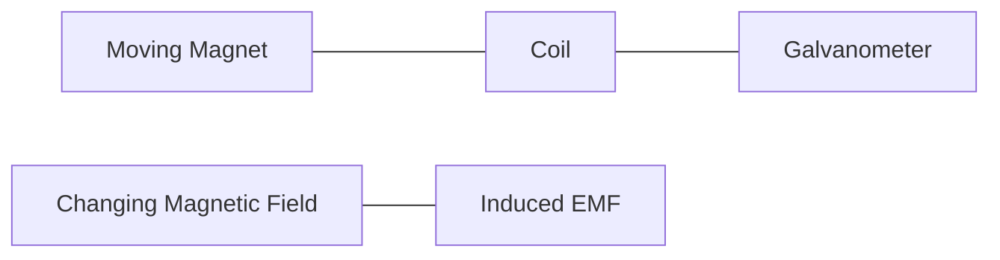

**Mnemonic:** "FIRE" - Flux change Induces Rapid EMF

## Question 3(b) [4 marks]

**Define amplitude, frequency, time duration and RMS value for alternating quantity.**

**Answer**:

| Parameter | Definition | Formula |
|-----------|------------|---------|
| **Amplitude** | Maximum value of the alternating quantity | Vₘ |
| **Frequency** | Number of complete cycles per second | f = 1/T |
| **Time Period** | Time taken to complete one cycle | T = 1/f |
| **RMS Value** | Effective value, equivalent to DC causing same heating | Vrms = Vₘ/√2 = 0.707Vₘ |

**Diagram:**

```goat
    Amplitude
        ^
        |    /|\
        |   / | \
        |  /  |  \
        | /   |   \
        |/    |    \
--------+-----+-----\-------+---->
        |\    |     /\      |
        | \   |    /  \     |
        |  \  |   /    \    |
        |   \ |  /      \   |
        |    \|/         \  |
        |                 \ |
        |                  \|
        |                   
        |<-Time Period T ->|
```

**Mnemonic:** "AFTR" - Amplitude is peak, Frequency is cycles per second, Time period is 1/f, RMS is 0.707 times peak

## Question 3(c) [7 marks]

**Explain self inductance and mutual inductance. (i) Find the self induction of the coil if total magnetic flux linked with the coil is 5 μWb-turns (micro Wb-turns) for 2 A current given to the coil (ii) Find the self induction of the coil, if the parameters of the coils are as follows: number of turns is 10, relative permeability of the material used for coil is 3, length of the coil is 5 cm and cross sectional area of coil is 2 cm².**

**Answer**:

**Self Inductance:** Property of a coil to oppose change in current through it by inducing EMF in itself.

**Mutual Inductance:** Property of one coil to induce EMF in another coil due to change in current.

**Part (i):**

```
Self inductance (L) = Flux linkage / Current
L = 5 μWb-turns / 2 A
L = 2.5 μH
```

**Part (ii):**

```
L = (μₒ × μᵣ × N² × A) / l
L = (4π × 10⁻⁷ × 3 × 10² × 2 × 10⁻⁴) / (5 × 10⁻²)
L = (4π × 3 × 100 × 2 × 10⁻⁷) / (5 × 10⁻²)
L = (24π × 10⁻⁵) / (5 × 10⁻²)
L = 24π × 10⁻³ / 5
L = 4.8π × 10⁻³
L = 15.07 μH
```

**Diagram:**

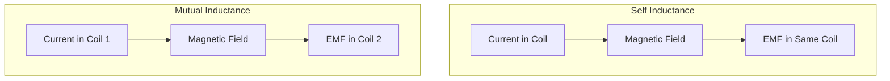

**Mnemonic:** "SLIM" - Self inductance Linked with own flux, Induction Mutual between two coils

## Question 3(a OR) [3 marks]

**Define dynamically induced EMF. Explain it with the help of necessary diagram and equation.**

**Answer**:

**Dynamically Induced EMF:** EMF induced in a conductor due to relative motion between the conductor and magnetic field.

**Equation:** e = Blv
Where: e = induced EMF, B = magnetic flux density, l = length of conductor, v = velocity of conductor

**Diagram:**

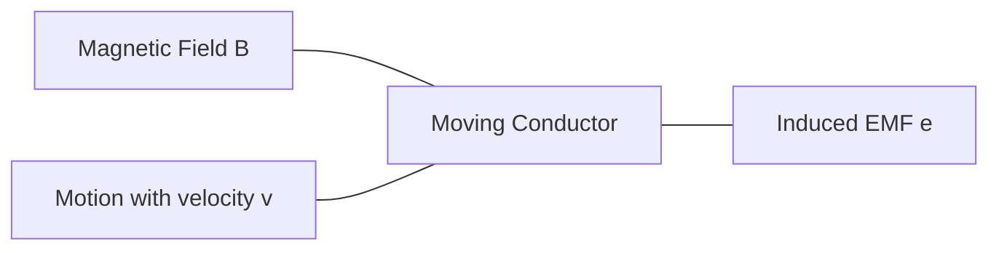

**Mnemonic:** "MOVE" - Motion Of conductor in magnetic field produces Voltage Effect

## Question 3(b OR) [4 marks]

**Define cycle, Form Factor and Peak Factor for alternating quantity. Write the value of Form Factor and Peak Factor for sinusoidal alternating quantity.**

**Answer**:

| Term | Definition | Value for Sinusoidal Wave |
|------|------------|---------------------------|
| **Cycle** | One complete oscillation of an alternating quantity | - |
| **Form Factor** | Ratio of RMS value to average value | 1.11 |
| **Peak Factor** | Ratio of maximum value to RMS value | 1.414 |

**Diagram:**

```goat
    ^
    |    /|\
    |   / | \     One Cycle
    |  /  |  \    <----------->
    | /   |   \
    |/    |    \
----+-----+-----\-------+---->
    |\    |     /\      |
    | \   |    /  \     |
    |  \  |   /    \    |
    |   \ |  /      \   |
    |    \|/         \  |
    |                 \ |
    |                  \|
    
    Form Factor = Vrms/Vavg = 1.11
    Peak Factor = Vm/Vrms = 1.414
```

**Mnemonic:** "CFP" - Cycle is one oscillation, Form factor is 1.11, Peak factor is 1.414

## Question 3(c OR) [7 marks]

**State and explain Lenz's law. State and explain Fleming's right hand rule for generator. Find the energy stored in inductor having self inductance of 4 μH, if 3 A of current is flowing through the inductor.**

**Answer**:

**Lenz's Law:** The direction of induced EMF is such that it opposes the change in magnetic flux that produces it.

**Fleming's Right Hand Rule:**

- Thumb: Direction of motion of conductor
- Index finger: Direction of magnetic field
- Middle finger: Direction of induced current

**Energy Calculation:**

```
Energy stored in inductor (W) = (1/2) × L × I²
W = (1/2) × 4 × 10⁻⁶ × 3²
W = (1/2) × 4 × 10⁻⁶ × 9
W = 18 × 10⁻⁶ / 2
W = 9 × 10⁻⁶ Joules
W = 9 μJ
```

**Diagram:**

```goat
   Fleming's Right Hand Rule:
   
   Thumb (Motion) →
   Index (Field) ↑
   Middle (Current) ↻
   
   Lenz's Law:
   
   N[===>]S  →  (Conductor)
   Induced current opposes motion
```

**Mnemonic:** "LOF" - Lenz's law Opposes Flux change, Fleming's rule - thumb Motion, index Field, middle Current

## Question 4(a) [3 marks]

**Define PV cell. Explain the function of PV cell.**

**Answer**:

**PV Cell:** Photovoltaic cell is a semiconductor device that converts light energy directly into electrical energy.

**Function:**

- Absorbs photons from sunlight
- Creates electron-hole pairs in semiconductor
- Generates potential difference at p-n junction
- Converts solar energy to electrical energy

**Diagram:**

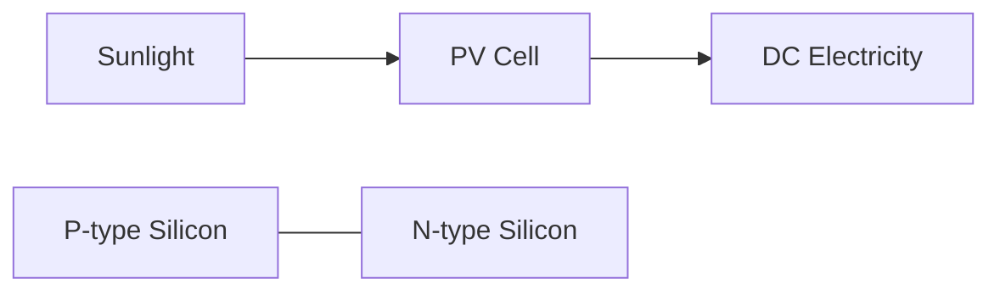

**Mnemonic:** "PASE" - PV cell Absorbs Sunlight to generate Electricity

## Question 4(b) [4 marks]

**Explain the classification of green energy.**

**Answer**:

| Green Energy Type | Source | Example Applications |
|-------------------|--------|----------------------|
| **Solar Energy** | Sun | PV panels, solar thermal |
| **Wind Energy** | Air currents | Wind turbines |
| **Hydro Energy** | Flowing water | Dams, tidal, wave |
| **Biomass Energy** | Organic matter | Biofuels, biogas |
| **Geothermal Energy** | Earth's heat | Geothermal plants |

**Diagram:**

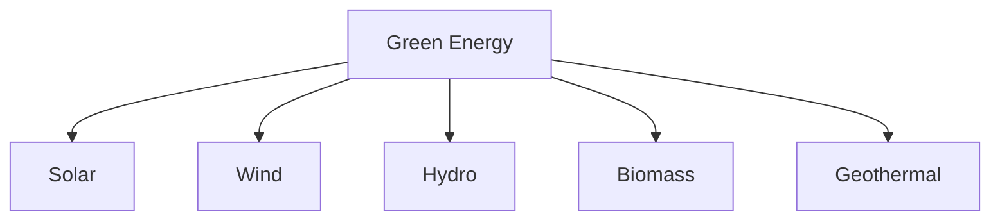

**Mnemonic:** "SWHBG" - Sun, Wind, Hydro, Biomass, Geothermal energy sources

## Question 4(c) [7 marks]

**Draw and explain the block diagram of solar power system.**

**Answer**:

**Solar Power System Components:**

| Component | Function |
|-----------|----------|
| **Solar Panel** | Converts sunlight to DC electricity |
| **Charge Controller** | Regulates battery charging and prevents overcharging |
| **Battery Bank** | Stores electricity for later use |
| **Inverter** | Converts DC to AC for household appliances |
| **Distribution Panel** | Distributes electricity to loads |
| **Grid Connection** | Optional connection to utility grid |

**Block Diagram:**

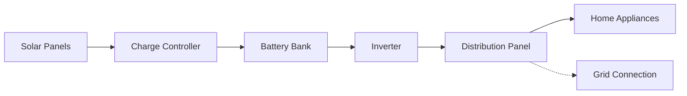

**Mnemonic:** "SCBIDG" - Solar panels, Charge controller, Batteries, Inverter, Distribution, Grid

## Question 4(a OR) [3 marks]

**Define green energy, conventional energy and renewable energy.**

**Answer**:

| Term | Definition |
|------|------------|
| **Green Energy** | Energy from naturally replenished sources with minimal environmental impact |
| **Conventional Energy** | Energy from traditional fossil fuel sources like coal, oil, and natural gas |
| **Renewable Energy** | Energy from sources that are naturally replenished on a human timescale |

**Diagram:**

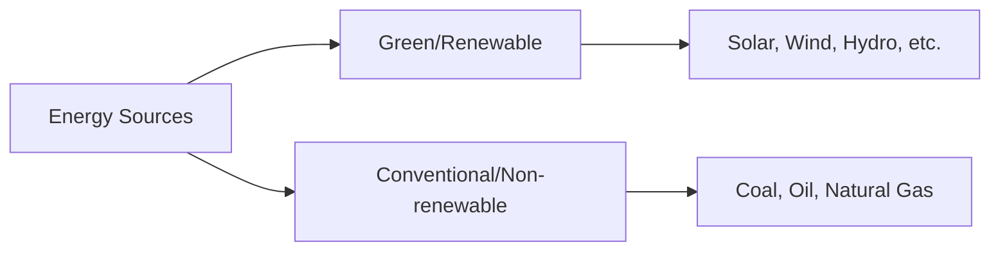

**Mnemonic:** "GCR" - Green is Clean, Conventional is Carbon-emitting, Renewable is Replenished

## Question 4(b OR) [4 marks]

**Explain the need of green energy.**

**Answer**:

**Need for Green Energy:**

| Need | Explanation |
|------|-------------|
| **Environmental Protection** | Reduces pollution and greenhouse gas emissions |
| **Resource Conservation** | Preserves limited fossil fuel resources |
| **Energy Security** | Reduces dependence on imported fuels |
| **Economic Benefits** | Creates jobs and reduces energy costs long-term |
| **Sustainable Development** | Meets present needs without compromising future generations |

**Diagram:**

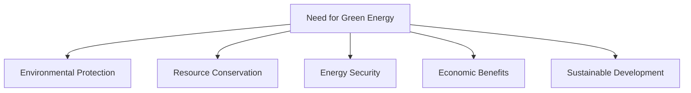

**Mnemonic:** "ERESS" - Environment, Resources, Energy security, Savings, Sustainability

## Question 4(c OR) [7 marks]

**Draw and explain the block diagram of wind power system with types of turbines.**

**Answer**:

**Wind Power System Components:**

| Component | Function |
|-----------|----------|
| **Wind Turbine** | Converts wind energy to mechanical energy |
| **Gearbox** | Increases the rotational speed |
| **Generator** | Converts mechanical energy to electrical energy |
| **Controller** | Monitors and controls the system |
| **Transformer** | Steps up voltage for transmission |
| **Grid Connection** | Connects to the utility grid |

**Types of Wind Turbines:**

1. **Horizontal Axis Wind Turbine (HAWT)** - Blades rotate around horizontal axis
2. **Vertical Axis Wind Turbine (VAWT)** - Blades rotate around vertical axis

**Block Diagram:**

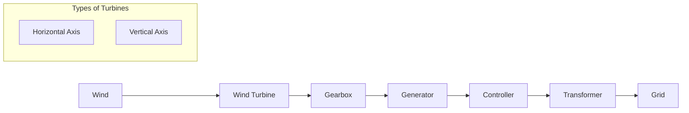

**Mnemonic:** "WGGTC" - Wind turns turbine, Gearbox speeds up, Generator produces electricity, Transformer steps up, Controller manages

## Question 5(a) [3 marks]

**Explain the factors affecting the value of resistance of a resistor.**

**Answer**:

**Factors Affecting Resistance:**

| Factor | Effect |
|--------|--------|
| **Temperature** | Resistance increases with temperature in metals |
| **Length** | Resistance is directly proportional to length |
| **Cross-sectional Area** | Resistance is inversely proportional to area |
| **Material** | Different materials have different resistivities |

**Equation:** R = ρ × (l/A)

Where:

- R = Resistance
- ρ = Resistivity
- l = Length
- A = Cross-sectional area

**Mnemonic:** "TLAM" - Temperature, Length, Area, Material affect resistance

## Question 5(b) [4 marks]

**Define active power, reactive power, apparent power and power factor with the help of power triangle. Write their units.**

**Answer**:

| Power Type | Definition | Formula | Unit |
|------------|------------|---------|------|
| **Active Power (P)** | Actual power consumed | P = VI cosφ | Watt (W) |
| **Reactive Power (Q)** | Power oscillating between source and load | Q = VI sinφ | Volt-Ampere Reactive (VAR) |
| **Apparent Power (S)** | Product of voltage and current | S = VI | Volt-Ampere (VA) |
| **Power Factor (PF)** | Ratio of active power to apparent power | PF = P/S = cosφ | No unit (0 to 1) |

**Power Triangle:**

```goat
            Q (VAR)
            |
            |
            |
            |       S (VA)
            |     /
            |   /
            | /
            +--------------- P (W)
           /|
       PF=cosφ
```

**Mnemonic:** "ARSP" - Active is Real power in Watts, Reactive is Stored power in VAR, S is total VA, PF is cosφ

## Question 5(c) [7 marks]

**State and explain Kirchhoff's Voltage Law (KVL) and Kirchhoff's Current Law (KCL) with the help of circuit diagram.**

**Answer**:

**Kirchhoff's Voltage Law (KVL):** The algebraic sum of all voltages around any closed loop in a circuit is zero.

**Kirchhoff's Current Law (KCL):** The algebraic sum of all currents entering and leaving a node is zero.

| Law | Equation | Application |
|-----|----------|-------------|
| **KVL** | ∑V = 0 | Finding voltage in complex circuits |
| **KCL** | ∑I = 0 | Finding current distribution |

**Circuit Diagrams:**

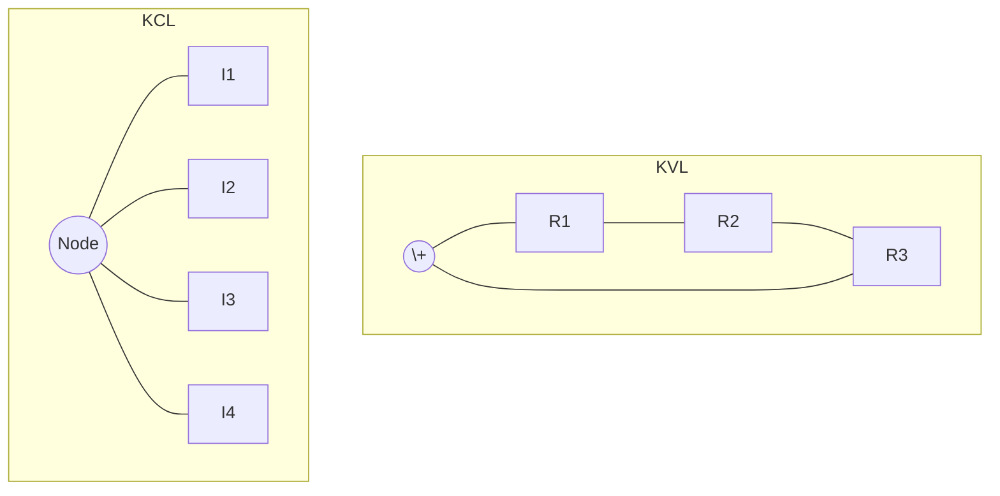

**KVL Example:** V₁ + V₂ + V₃ = 0

**KCL Example:** I₁ + I₂ = I₃ + I₄

**Mnemonic:** "VCL" - Voltage around Closed Loop is zero, Currents at a point sum to zero

## Question 5(a OR) [3 marks]

**Write the difference between EMF and potential difference. Also write the difference between cell and battery.**

**Answer**:

| EMF vs. Potential Difference | Cell vs. Battery |
|------------------------------|------------------|
| **EMF**: Energy supplied by source per unit charge | **Cell**: Single unit that converts chemical energy to electrical energy |
| **Potential Difference**: Energy consumed in external circuit | **Battery**: Collection of two or more cells connected in series or parallel |
| EMF exists even in open circuit | Cell has lower voltage (typically 1.5V or 2V) |
| Potential difference exists only in closed circuit | Battery has higher voltage output |

**Diagram:**

```goat
EMF Source          Cell vs Battery
  +---+              +---+    +---+---+---+
  |   |              |   |    |   |   |   |
  | E |              | 1 |    | 1 | 2 | 3 |
  |   |              |   |    |   |   |   |
  +---+              +---+    +---+---+---+
                     Cell     Battery (Series)
```

**Mnemonic:** "ESOP" - EMF is Source energy, Open circuit too; Potential difference is Operating energy

## Question 5(b OR) [4 marks]

**Write the relation between AC voltage and AC current for pure resistor, pure capacitor and pure inductor. Draw the vector diagram of AC voltage and AC current for pure resistor, pure capacitor and pure inductor. Also write the value of power factor for pure resistor, pure capacitor and pure inductor.**

**Answer**:

| Component | Relation | Phase Difference | Power Factor |
|-----------|----------|------------------|--------------|
| **Pure Resistor** | V = IR | In phase (0°) | 1 |
| **Pure Capacitor** | I = C(dV/dt) | Current leads voltage by 90° | 0 (leading) |
| **Pure Inductor** | V = L(dI/dt) | Current lags voltage by 90° | 0 (lagging) |

**Vector Diagrams:**

```goat
   Resistor         Capacitor        Inductor
     V,I               I               V
      ^                ^               ^
      |                |               |
      |                |               |
      |                |               |
      +------>        -+->           --+--
                       V               I
```

**Mnemonic:** "RCI" - Resistor Current In phase, Capacitor current leads, Inductor current lags

## Question 5(c OR) [7 marks]

**Define temperature coefficient of material and write its unit. Explain the effect of temperature on resistance of conductor with the help of temperature coefficient of conductor.**

**Answer**:

**Temperature Coefficient:** The fractional change in resistance per degree change in temperature.

**Unit:** per degree Celsius (°C⁻¹) or per Kelvin (K⁻¹)

**Effect of Temperature on Resistance:**

**Equation:** R₂ = R₁[1 + α(T₂ - T₁)]

Where:

- R₁ = Resistance at temperature T₁
- R₂ = Resistance at temperature T₂
- α = Temperature coefficient
- T₁, T₂ = Initial and final temperatures

**For Conductors (Metals):**

- Resistance increases with temperature (positive α)
- Resistance decreases when temperature decreases

**For Semiconductors:**

- Resistance decreases with temperature (negative α)

**Table:**

| Material | Temperature Coefficient (α) per °C | Behavior |
|----------|-----------------------------------|----------|
| Copper | 0.0043 | Resistance increases with temperature |
| Aluminum | 0.0039 | Resistance increases with temperature |
| Nichrome | 0.0004 | Small change with temperature |
| Silicon | -0.07 | Resistance decreases with temperature |

**Diagram:**

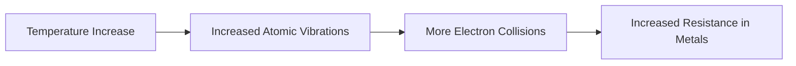

**Mnemonic:** "TRIP" - Temperature Raises resistance In Proportion to coefficient
