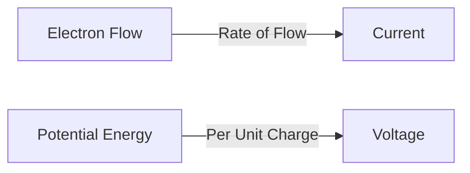
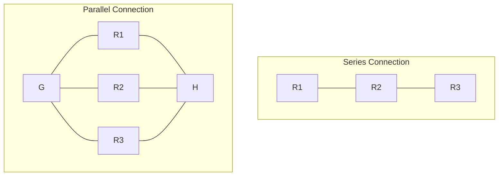
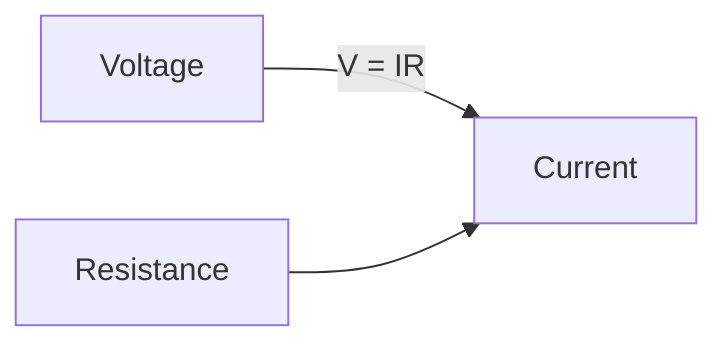
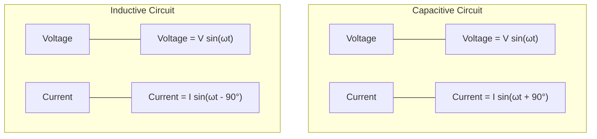
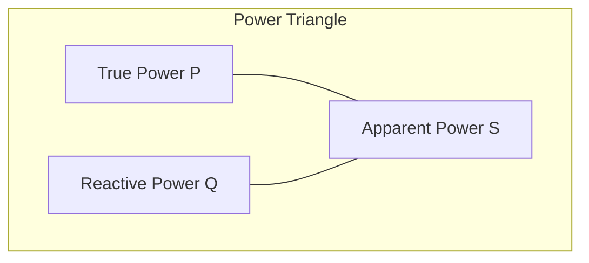
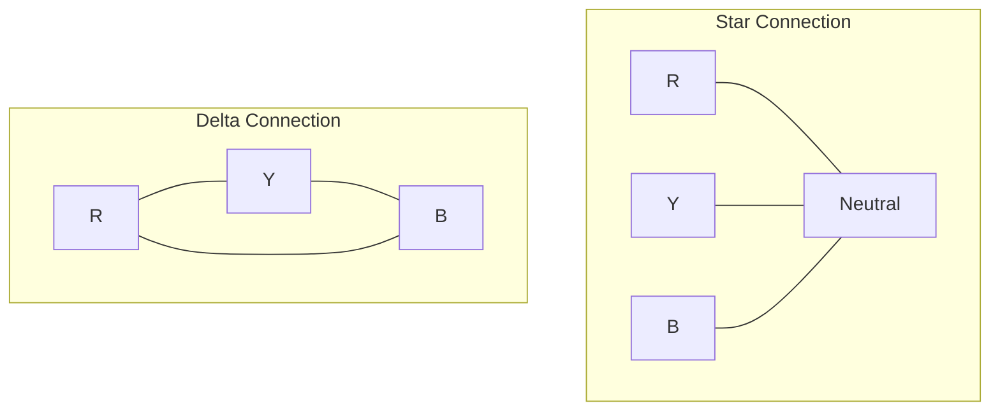
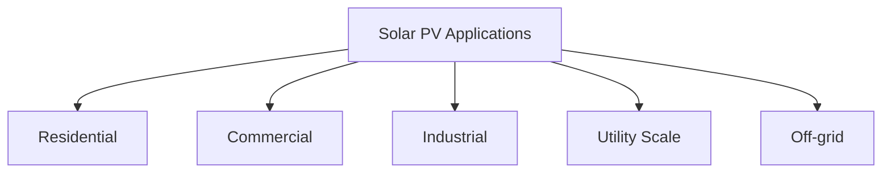
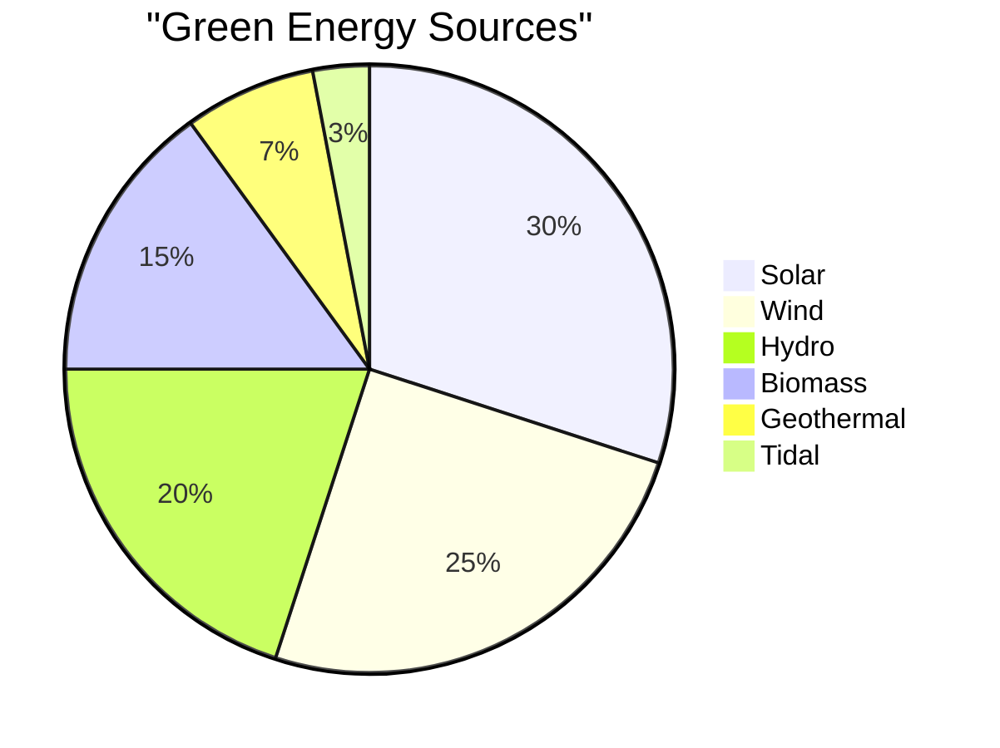

## પ્રશ્ન 1(a) [3 માર્ક્સ]

**પાવર અને એનર્જી વ્યાખ્યાયિત કરો.**

**જવાબ**:

- **પાવર**: કાર્ય કરવાનો દર અથવા એકમ સમય દીઠ ઊર્જાનો વપરાશ. વોટ્સ (W)માં માપવામાં આવે છે.
- **એનર્જી**: કાર્ય કરવાની ક્ષમતા અથવા કરેલ કાર્ય. જૂલ (J) અથવા વોટ-કલાક (Wh)માં માપવામાં આવે છે.

**કોષ્ટક: પાવર vs એનર્જી**

| પેરામીટર | વ્યાખ્યા | ફોર્મ્યુલા | એકમ |
|-----------|------------|---------|------|
| પાવર | ઊર્જા ટ્રાન્સફરનો દર | P = W/t | વોટ (W) |
| એનર્જી | કાર્ય કરવાની ક્ષમતા | E = P × t | જૂલ (J) અથવા વોટ-કલાક (Wh) |

**મેમરી ટ્રીક:** "પાવર પ્રવૃત્તિ કરે, એનર્જી એકત્રિત થાય"

## પ્રશ્ન 1(b) [4 માર્ક્સ]

**વિદ્યુત્પ્રવાહ અને વિદ્યુત પોટેંશિયલ વ્યાખ્યાયિત કરો.**

**જવાબ**:

**આકૃતિ:**



- **વિદ્યુત્પ્રવાહ**: એકમ સમય દીઠ વહેતો વિદ્યુત ચાર્જ. એમ્પિયર (A)માં માપવામાં આવે છે.
- **વિદ્યુત પોટેંશિયલ**: એક બિંદુથી બીજા બિંદુ પર ચાર્જ ખસેડવા માટે એકમ ચાર્જ દીઠ કરવામાં આવતું કાર્ય. વોલ્ટ (V)માં માપવામાં આવે છે.

**મેમરી ટ્રીક:** "કરંટ ચાર્જનું વહન, પોટેંશિયલ પ્રેરણા"

## પ્રશ્ન 1(c) [7 માર્ક્સ]

**ઉદાહરણો સાથે કેસીએલ અને કેવીએલ સમજાવો.**

**જવાબ**:

**આકૃતિ:**

```goat
+-----+        i1
      |        ↓
      |    R1
      +-----/\/\/\----+
      |               |
      |               |
     +++              |
     | | V1       R2  |
     +++          /\/\/\
      |               |
      |               |
      +---------------+
         i2 ↑    ↑ i3
            \    /
             \  /
              \/
              R3
              |
              |
             ---
              -
```

**કિરચોફનો કરંટ નિયમ (KCL):**

- નોડમાં પ્રવેશતા કરંટનો સરવાળો તેમાંથી બહાર નીકળતા કરંટના સરવાળા સમાન હોય છે.
- ઉદાહરણ: નોડ X પર, i1 + i2 = i3

**કિરચોફનો વોલ્ટેજ નિયમ (KVL):**

- કોઈપણ બંધ લૂપમાં વોલ્ટેજ ડ્રોપ્સનો સરવાળો શૂન્ય છે.
- ઉદાહરણ: V1 - V(R1) - V(R2) = 0

**મેમરી ટ્રીક:** "કરંટ આવે-જાય, વોલ્ટેજ લૂપ-સરવાળો શૂન્ય થાય"

## પ્રશ્ન 1(c) OR [7 માર્ક્સ]

**રેસિસ્ટર્સ માટે વિવિધ પ્રકારનાં જોડાણો સમજાવો.**

**જવાબ**:

**આકૃતિ:**



**કોષ્ટક: શ્રેણી vs સમાંતર જોડાણ**

| પેરામીટર | શ્રેણી જોડાણ | સમાંતર જોડાણ |
|-----------|-------------------|---------------------|
| કુલ અવરોધ | Req = R1 + R2 + R3 + ... | 1/Req = 1/R1 + 1/R2 + 1/R3 + ... |
| કરંટ | બધા અવરોધો માટે સમાન | દરેક માર્ગમાં વહેંચાય છે |
| વોલ્ટેજ | અવરોધો વચ્ચે વહેંચાય છે | બધા અવરોધો માટે સમાન |
| ઉપયોગ | વોલ્ટેજ ડિવાઇડર | કરંટ વહેંચણી |

**મેમરી ટ્રીક:** "શ્રેણી સરવાળો, સમાંતર ભાગાકાર"

## પ્રશ્ન 2(a) [3 માર્ક્સ]

**અવરોધ અને અવરોધકતાને વ્યાખ્યાયિત કરો. તેમના એકમો પણ જણાવો.**

**જવાબ**:

- **અવરોધ**: કરંટ પ્રવાહમાં અડચણ, ઓહ્મ (Ω)માં માપવામાં આવે છે. R = V/I.
- **અવરોધકતા**: પદાર્થની એક ગુણધર્મ જે એકમ દિમેન્શન દીઠ અવરોધ દર્શાવે છે, ઓહ્મ-મીટર (Ω·m)માં માપવામાં આવે છે. ρ = RA/L.

**મેમરી ટ્રીક:** "અવરોધ અટકાવે, અવરોધકતા અભિલક્ષણ"

## પ્રશ્ન 2(b) [4 માર્ક્સ]

**વિદ્યુત કોષને વ્યાખ્યાયિત કરો અને વિવિધ પ્રકારના વિદ્યુત કોષના નામ લખો.**

**જવાબ**:

**આકૃતિ:**

```goat
    +--------+
    |        |
    | +    - |
    |  \  /  |
    |   \/   |
    |        |
    +--------+
      Battery
```

- **વિદ્યુત કોષ**: એક ઉપકરણ જે રાસાયણિક ઊર્જાને વિદ્યુત ઊર્જામાં રૂપાંતરિત કરીને વોલ્ટેજ ઉત્પન્ન કરે છે.

**વિદ્યુત કોષના પ્રકારો:**

1. **પ્રાથમિક કોષ**: ડ્રાય સેલ, આલ્કલાઇન સેલ, મર્ક્યુરી સેલ
2. **દ્વિતીય કોષ**: લેડ-એસિડ, નિકલ-કેડમિયમ, લિથિયમ-આયન

**મેમરી ટ્રીક:** "પ્રાથમિક એક વાર પ્રવૃત્તિ, દ્વિતીય વારંવાર પુનઃચાર્જ"

## પ્રશ્ન 2(c) [7 માર્ક્સ]

**ઉપરોક્ત સર્કિટના કુલ સમકક્ષ અવરોધની ગણતરી કરો જેમા R1=5Ω, R2=3Ω, R3=4Ω, R4=1Ω, R5=2Ω લો.**

**જવાબ**:

**આકૃતિ:**

```goat
                  R1
                /\/\/\
       +-------+      +------+
       |                     |
       |                     |
       |                     |
    R2 /\          R3       /\ R5
       \/         /\/\/\    \/
       |       +--+      +--+
       |       |            |
       +-------+            |
                            |
                R4          |
               /\/\/\       |
       +-------+      +-----+
       |                    |
       +--------------------+
```

**પગલાવાર ઉકેલ:**

1. R2 અને R3 શ્રેણીમાં છે: R23 = R2 + R3 = 3Ω + 4Ω = 7Ω
2. R23 અને R4 સમાંતરમાં છે: 1/R234 = 1/7 + 1/1 = (1+7)/7 = 8/7
   આથી, R234 = 7/8 = 0.875Ω
3. R1, R234, અને R5 શ્રેણીમાં છે:
   Req = R1 + R234 + R5 = 5Ω + 0.875Ω + 2Ω = 7.875Ω

**આથી, સમકક્ષ અવરોધ = 7.875Ω**

**મેમરી ટ્રીક:** "શ્રેણી-સરવાળો, સમાંતર-ગુણાકાર ભાગ્યા સરવાળો"

## પ્રશ્ન 2(a) OR [3 માર્ક્સ]

**જો 100 વોટનો બલ્બ 30 દિવસ માટે દરરોજ 10 કલાક ચલાવે તો એનર્જીની કિંમત શોધો. એનર્જી નો દર રૂપિયા 5/એકમ છે.**

**જવાબ**:

**કોષ્ટક: એનર્જી ગણતરી**

| પેરામીટર | મૂલ્ય | ગણતરી |
|-----------|-------|-------------|
| પાવર | 100W = 0.1kW | આપેલ છે |
| ઓપરેટિંગ કલાકો | 10 કલાક/દિવસ × 30 દિવસ = 300 કલાક | આપેલ છે |
| વપરાયેલ એનર્જી | 0.1kW × 300h = 30kWh = 30 એકમ | E = P × t |
| દર | રૂ. 5/એકમ | આપેલ છે |
| કુલ કિંમત | 30 એકમ × રૂ. 5/એકમ = રૂ. 150 | કિંમત = એકમો × દર |

**આથી, એનર્જીની કિંમત = રૂ. 150**

**મેમરી ટ્રીક:** "એનર્જી × દર = વીજળી બિલનો ભાર"

## પ્રશ્ન 2(b) OR [4 માર્ક્સ]

**ઓહમનો નિયમ લખો અને કોઈપણ સર્કિટમાં કરંટની ગણતરી કરવા માટે ઓહ્મના નિયમ નો ઉપયોગ સમજાવો.**

**જવાબ**:

**આકૃતિ:**



**ઓહમનો નિયમ:** વાહકમાંથી વહેતો કરંટ વોલ્ટેજના સીધા પ્રમાણમાં અને અવરોધના વ્યસ્ત પ્રમાણમાં હોય છે.

**ફોર્મ્યુલા: V = IR અથવા I = V/R અથવા R = V/I**

**ઉપયોગ:** સર્કિટમાં કરંટ શોધવા માટે, ઘટક પરના વોલ્ટેજને તેના અવરોધ વડે ભાગો (I = V/R).

**મેમરી ટ્રીક:** "વોલ્ટેજ ઇન્વાઇટ કરે, અવરોધ અટકાવે"

## પ્રશ્ન 2(c) OR [7 માર્ક્સ]

**સાબિત કરો કે સંપૂર્ણ કેપેસિટીવ સર્કિટમાં કરંટ વોલ્ટેજ થી 90° આગળ હોઇ છે, અને સંપૂર્ણ રીતે ઇંડક્ટીવ સર્કિટમાં કરંટ વોલ્ટેજ થી 90° પાછળ હોઇ છે.**

**જવાબ**:

**આકૃતિઓ:**



**કેપેસિટીવ સર્કિટ માટે:**

- વોલ્ટેજ સમીકરણ: v = V sin(ωt)
- કરંટ: i = C × dv/dt = ωCV cos(ωt) = I sin(ωt + 90°)
- કરંટ વોલ્ટેજથી 90° આગળ હોય છે

**ઇંડક્ટીવ સર્કિટ માટે:**

- વોલ્ટેજ સમીકરણ: v = L × di/dt = ωLI cos(ωt) = V sin(ωt + 90°)
- કરંટ: i = I sin(ωt)
- કરંટ વોલ્ટેજથી 90° પાછળ હોય છે

**મેમરી ટ્રીક:** "ELI the ICE man" - EL (ઇન્ડક્ટર)માં, I લગ્સ E; ICE (કેપેસિટર)માં, I લીડ્સ E

## પ્રશ્ન 3(a) [3 માર્ક્સ]

**સાયકલ, ફોર્મ ફેક્ટર અને એમ્પ્લિટ્યુડને વ્યાખ્યાયિત કરો.**

**જવાબ**:

**આકૃતિ:**

```goat
    ^
    |    /\      /\
    |   /  \    /  \
A---|--/----\--/----\--
    | /      \/      \
    |/                \
    +-------------------->
         |------|
          cycle
```

- **સાયકલ**: વેવફોર્મનું એક સંપૂર્ણ પુનરાવર્તન.
- **ફોર્મ ફેક્ટર**: RMS મૂલ્યનો સરેરાશ મૂલ્ય સાથેનો ગુણોત્તર. સાઇન વેવ માટે = 1.11.
- **એમ્પ્લિટ્યુડ**: વેવફોર્મનું તેના સરેરાશ સ્થાનથી મહત્તમ વિચલન.

**મેમરી ટ્રીક:** "સાયકલ સંપૂર્ણ, ફોર્મ ફેક્ટર ફોર્મ્યુલા, એમ્પ્લિટ્યુડ ઉચ્ચતમ"

## પ્રશ્ન 3(b) [4 માર્ક્સ]

**આરએમએસ અને સરેરાશ મૂલ્ય વ્યાખ્યાયિત કરો. સાઇન વેવફોર્મનું આરએમએસ અને સરેરાશ મૂલ્ય નુ સૂત્ર લખો.**

**જવાબ**:

**કોષ્ટક: RMS vs સરેરાશ મૂલ્ય**

| પેરામીટર | વ્યાખ્યા | સાઇન વેવ માટે ફોર્મ્યુલા |
|-----------|------------|----------------------|
| RMS મૂલ્ય | વર્ગ કરેલા મૂલ્યોના સરેરાશનો વર્ગમૂળ | Vrms = Vm/√2 = 0.707 Vm |
| સરેરાશ મૂલ્ય | અર્ધ સાયકલ પર તમામ ક્ષણિક મૂલ્યોની સરેરાશ | Vavg = 2Vm/π = 0.637 Vm |

- **RMS (રૂટ મીન સ્ક્વેર)**: સમાન હીટિંગ અસર ઉત્પન્ન કરતું સમકક્ષ DC મૂલ્ય.
- **સરેરાશ મૂલ્ય**: અર્ધ સાયકલ પર તમામ ક્ષણિક મૂલ્યોની સરેરાશ.

**મેમરી ટ્રીક:** "RMS રિલેટ્સ ટુ હીટિંગ, એવરેજ એડ્સ એન્ડ ડિવાઇડ્સ"

## પ્રશ્ન 3(c) [7 માર્ક્સ]

**એપરંટ પાવર, ટ્રુ પાવર અને રિયેક્ટીવ પાવર સમજાવો. તેમના માપનના એકમ જણાવો.**

**જવાબ**:

**આકૃતિ:**



**કોષ્ટક: પાવરના પ્રકારો**

| પાવર પ્રકાર | વ્યાખ્યા | ફોર્મ્યુલા | એકમ |
|------------|------------|---------|------|
| એપરંટ પાવર (S) | કુલ પૂરો પાડેલો પાવર | S = VI | VA (વોલ્ટ-એમ્પિયર) |
| ટ્રુ પાવર (P) | ખરેખર વપરાયેલો પાવર | P = VI cos φ | W (વોટ) |
| રિયેક્ટીવ પાવર (Q) | સ્ત્રોત અને લોડ વચ્ચે આવતો-જતો પાવર | Q = VI sin φ | VAR (વોલ્ટ-એમ્પિયર રિયેક્ટીવ) |

**પાવર ટ્રાયએંગલ:** S² = P² + Q²

**મેમરી ટ્રીક:** "એક્ટિવ પરફોર્મ્સ વર્ક, રિયેક્ટીવ રિટર્ન્સ એનર્જી, એપરંટ એડ્સ વેક્ટર્સ"

## પ્રશ્ન 3(a) OR [3 માર્ક્સ]

**3-ફેઝ વોલ્ટેજના ગાણિતિક અભિવ્યક્તિઓ લખો.**

**જવાબ**:

**થ્રી-ફેઝ વોલ્ટેજની અભિવ્યક્તિઓ:**

**કોષ્ટક: 3-ફેઝ વોલ્ટેજ**

| ફેઝ | અભિવ્યક્તિ |
|-------|------------|
| R-ફેઝ | VR = Vm sin(ωt) |
| Y-ફેઝ | VY = Vm sin(ωt - 120°) |
| B-ફેઝ | VB = Vm sin(ωt - 240°) |

જ્યાં Vm મહત્તમ વોલ્ટેજ છે અને ω એન્ગ્યુલર ફ્રિક્વન્સી છે.

**મેમરી ટ્રીક:** "લાલ લીડર, પીળો 120° પાછળ, વાદળી 240° પાછળ"

## પ્રશ્ન 3(b) OR [4 માર્ક્સ]

**ક્રેસ્ટ ફેક્ટર વ્યાખ્યાયિત કરો અને સાઇન વેવ માટે ક્રેસ્ટ ફેક્ટર ની કિમત લખો.**

**જવાબ**:

**આકૃતિ:**

```goat
    ^
    |    /\      /\
    |   /  \    /  \
----|--/----\--/----\--
    | /      \/      \
    |/                \
    +-------------------->
    
    Peak value
    |--------|
    |   RMS  |
    |   value|
```

- **ક્રેસ્ટ ફેક્ટર**: વેવફોર્મના પીક મૂલ્યનો RMS મૂલ્ય સાથેનો ગુણોત્તર.
- **ફોર્મ્યુલા**: ક્રેસ્ટ ફેક્ટર = પીક મૂલ્ય / RMS મૂલ્ય
- **સાઇન વેવ માટે**: ક્રેસ્ટ ફેક્ટર = 1/0.707 = 1.414

**મેમરી ટ્રીક:** "ક્રેસ્ટ કમ્પેર્સ પીક ટુ RMS"

## પ્રશ્ન 3(c) OR [7 માર્ક્સ]

**વિવિધ 3-ફેઝ વિદ્યુત જોડાણોનું વર્ણન કરો.**

**જવાબ**:

**આકૃતિ:**



**કોષ્ટક: સ્ટાર vs ડેલ્ટા જોડાણ**

| પેરામીટર | સ્ટાર (Y) જોડાણ | ડેલ્ટા (Δ) જોડાણ |
|-----------|---------------------|----------------------|
| લાઇન વોલ્ટેજ (VL) | √3 × ફેઝ વોલ્ટેજ | ફેઝ વોલ્ટેજ જેટલું જ |
| લાઇન કરંટ (IL) | ફેઝ કરંટ જેટલો જ | √3 × ફેઝ કરંટ |
| ન્યુટ્રલ વાયર | હાજર | ગેરહાજર |
| ઉપયોગ | અસંતુલિત લોડ્સ, રહેણાંક | સંતુલિત લોડ્સ, ઔદ્યોગિક |

**મેમરી ટ્રીક:** "સ્ટાર શોઝ ન્યુટ્રલ, ડેલ્ટા ડિલિવર્સ હાયર કરંટ"

## પ્રશ્ન 4(a) [3 માર્ક્સ]

**જો આરએમએસ મૂલ્ય 230V હોય તો સાઇનયુસાઇડલ વોલ્ટેજની પીક-ટુ-પીક કિંમતની ગણતરી કરો.**

**જવાબ**:

**કોષ્ટક: ગણતરીના પગલાં**

| પેરામીટર | ફોર્મ્યુલા | ગણતરી |
|-----------|---------|-------------|
| RMS મૂલ્ય | આપેલ છે | 230V |
| પીક મૂલ્ય | Vm = √2 × Vrms | Vm = √2 × 230 = 325.27V |
| પીક-ટુ-પીક મૂલ્ય | Vp-p = 2 × Vm | Vp-p = 2 × 325.27 = 650.54V |

**આથી, પીક-ટુ-પીક મૂલ્ય = 650.54V**

**મેમરી ટ્રીક:** "RMS થી પીક - √2 વડે ગુણો, પીક થી પીક-ટુ-પીક - બમણું કરો"

## પ્રશ્ન 4(b) [4 માર્ક્સ]

**આપેલા એસી પ્રવાહ i = 142.14sin628t માટે ફ્રીક્વંસી અને ટાઇમ પિરિયડ શોધો.**

**જવાબ**:

**કોષ્ટક: ગણતરીના પગલાં**

| પેરામીટર | ફોર્મ્યુલા | ગણતરી |
|-----------|---------|-------------|
| આપેલ સમીકરણ | i = 142.14 sin(628t) | ω = 628 rad/s |
| ફ્રીક્વંસી | f = ω/(2π) | f = 628/(2π) = 100 Hz |
| ટાઇમ પિરિયડ | T = 1/f | T = 1/100 = 0.01 s = 10 ms |

**આથી, ફ્રીક્વંસી = 100 Hz અને ટાઇમ પિરિયડ = 0.01 s**

**મેમરી ટ્રીક:** "ફ્રીક્વંસી ફ્રોમ ઓમેગા ડિવાઇડ 2π, ટાઇમ ટેક્સ ઇન્વર્સ"

## પ્રશ્ન 4(c) [7 માર્ક્સ]

**ફ્લેમિંગના ડાબા હાથનો નિયમ અને જમણા હાથનો નિયમ સમજાવો.**

**જવાબ**:

**આકૃતિ:**

```goat
Left Hand Rule           Right Hand Rule
    F                        F
    ^                        ^
    |                        |
    |                        |
    +-->B                    +-->B
   /                        /
  /                        /
 I                        I
```

**ફ્લેમિંગનો ડાબા હાથનો નિયમ (મોટર):**

- ચુંબકીય ક્ષેત્રમાં વિદ્યુત પ્રવાહ વહનકર્તા પર લાગતા **બળ**ની દિશા નક્કી કરવા માટે વપરાય છે.
- ડાબા હાથને અંગૂઠો, પ્રથમ અને મધ્ય આંગળીઓને કાટખૂણે રાખો.
- અંગૂઠો: ગતિ (બળ)
- પ્રથમ આંગળી: ચુંબકીય ક્ષેત્ર
- મધ્ય આંગળી: વિદ્યુત પ્રવાહ

**ફ્લેમિંગનો જમણા હાથનો નિયમ (જનરેટર):**

- જ્યારે વાહક ચુંબકીય ક્ષેત્રમાં ગતિ કરે છે ત્યારે **પ્રેરિત વિદ્યુત પ્રવાહ**ની દિશા નક્કી કરવા માટે વપરાય છે.
- જમણા હાથને અંગૂઠો, પ્રથમ અને મધ્ય આંગળીઓને કાટખૂણે રાખો.
- અંગૂઠો: વાહકની ગતિ
- પ્રથમ આંગળી: ચુંબકીય ક્ષેત્ર
- મધ્ય આંગળી: પ્રેરિત વિદ્યુત પ્રવાહ

**મેમરી ટ્રીક:** "ડાબો દર્શાવે મોટર, જમણો જણાવે જનરેટર"

## પ્રશ્ન 4(a) OR [3 માર્ક્સ]

**0.6 ટેસ્લાના મેગ્નેટિક ફીલ્ડમાં 30 મીટર/સેકંડ ગતિ સાથે 1 મીટરની લંબાઈ નો વાહક ક્ષેત્ર સાથે 30° નો કોણ બનાવે છે. તેમાં ઉત્ત્પન્ન થતુ ડાયનેમીક ઇએમએફની ગણતરી કરો. (sin 30°=0.5 નો ઉપયોગ કરો)**

**જવાબ**:

**કોષ્ટક: આપેલ પેરામીટર્સ**

| પેરામીટર | મૂલ્ય |
|-----------|-------|
| લંબાઈ (l) | 1 મીટર |
| ગતિ (v) | 30 m/s |
| ચુંબકીય ક્ષેત્ર (B) | 0.6 Tesla |
| કોણ (θ) | 30° |

**ફોર્મ્યુલા:** E = Blv sin θ

**ગણતરી:**
E = 0.6 × 1 × 30 × 0.5 = 9 volts

**આથી, પ્રેરિત EMF = 9 volts**

**મેમરી ટ્રીક:** "EMF ઈમર્જિસ ફ્રોમ ફિલ્ડ, વેલોસિટી એન્ડ લેન્થ વિથ એંગલ"

## પ્રશ્ન 4(b) OR [4 માર્ક્સ]

**લેન્ઝનો નિયમ લખો અને સમજાવો.**

**જવાબ**:

**આકૃતિ:**

```goat
    +--------+
    |   N    |  Moving
    |   |    |  Magnet
    |   v    |
    +--------+
        |
        v
    +--------+
    |        |  Induced
    |   ↺    |  Current
    |        |
    +--------+
      Coil
```

**લેન્ઝનો નિયમ:** પ્રેરિત EMF અથવા વિદ્યુત પ્રવાહની દિશા હંમેશા એવી હોય છે કે તે તેને ઉત્પન્ન કરતા કારણનો વિરોધ કરે છે.

**ઉપયોગ:** જ્યારે ચુંબક કોઈલની નજીક આવે છે, ત્યારે પ્રેરિત વિદ્યુત પ્રવાહ એક ચુંબકીય ક્ષેત્ર બનાવે છે જે આવતા ચુંબકને પાછો ધક્કો મારે છે.

**મેમરી ટ્રીક:** "લેન્ઝ લાઇક્સ ટુ ઓપોઝ"

## પ્રશ્ન 4(c) OR [7 માર્ક્સ]

**સ્થિર અને ગતિશીલ રીતે પ્રેરિત ઇએમએફ સમજાવો.**

**જવાબ**:

**કોષ્ટક: સ્થિર vs ગતિશીલ પ્રેરિત EMF**

| પેરામીટર | સ્થિર પ્રેરિત EMF | ગતિશીલ પ્રેરિત EMF |
|-----------|------------------------|--------------------------|
| વ્યાખ્યા | કરંટ/ફ્લક્સમાં ફેરફાર થવાથી પ્રેરિત EMF | ચુંબકીય ક્ષેત્રમાં વાહકની ગતિથી પ્રેરિત EMF |
| ભૌતિક ક્રિયા | સ્થિર વાહક, બદલાતું ક્ષેત્ર | સ્થિર ક્ષેત્રમાં ગતિશીલ વાહક |
| ઉદાહરણ | ટ્રાન્સફોર્મર | જનરેટર |
| ફોર્મ્યુલા | e = -N dΦ/dt | e = Blv sin θ |

**મેમરી ટ્રીક:** "સ્ટેટિક સ્ટેઝ બટ ફ્લક્સ ચેન્જીસ, ડાયનેમિક ડ્રાઇવ્ઝ થ્રુ ફિલ્ડ"

## પ્રશ્ન 5(a) [3 માર્ક્સ]

**પીવી સેલ સમજાવો.**

**જવાબ**:

**આકૃતિ:**

```goat
    Sun Rays
       |||
       vvv
    +-------+
    |  N    |
    |-------| <- P-N Junction
    |  P    |
    +-------+
       | |
       | |
       Load
```

- **PV સેલ**: ફોટોવોલ્ટિક અસરનો ઉપયોગ કરીને સૂર્યપ્રકાશને સીધા વીજળીમાં રૂપાંતરિત કરતું ઉપકરણ.
- **કાર્યપ્રણાલી**: સૂર્યપ્રકાશ અર્ધવાહક પદાર્થમાં ઇલેક્ટ્રોન્સને ઉત્તેજિત કરે છે, જેનાથી વોલ્ટેજ તફાવત ઉત્પન્ન થાય છે.
- **સામગ્રી**: સામાન્ય રીતે P-N જંક્શન સાથે સિલિકોનમાંથી બનાવવામાં આવે છે.

**મેમરી ટ્રીક:** "ફોટોન્સ વિઝિટ, કરંટ ક્રિએટેડ"

## પ્રશ્ન 5(b) [4 માર્ક્સ]

**પીવી સોલર પેનલ અને એરેસ સમજાવો.**

**જવાબ**:

**આકૃતિ:**


**કોષ્ટક: સોલર સિસ્ટમ હાયરાર્કી**

| ઘટક | વર્ણન |
|-----------|-------------|
| PV સેલ | સૂર્યપ્રકાશને વીજળીમાં રૂપાંતરિત કરતું મૂળભૂત એકમ (0.5V - 0.6V) |
| PV પેનલ | શ્રેણી/સમાંતરમાં જોડાયેલા અનેક સેલ (સામાન્ય રીતે 12V, 24V) |
| PV એરે | જરૂરી વોલ્ટેજ/કરંટ મેળવવા માટે જોડાયેલા અનેક પેનલ |

**મેમરી ટ્રીક:** "સેલ્સ કમ્બાઇન ઇન્ટુ પેનલ્સ, પેનલ્સ પ્રોડ્યુસ એરેસ"

## પ્રશ્ન 5(c) [7 માર્ક્સ]

**વિન્ડ પાવર સિસ્ટમનો બ્લોક ડાયાગ્રામ દોરો અને સમજાવો.**

**જવાબ**:

**આકૃતિ:**


**વિન્ડ પાવર સિસ્ટમના ઘટકો:**

1. **વિન્ડ ટર્બાઇન**: પવનની ઊર્જાને યાંત્રિક ઊર્જામાં રૂપાંતરિત કરે છે
2. **ગિયરબોક્સ**: જનરેટર માટે રોટેશનલ સ્પીડ વધારે છે
3. **જનરેટર**: યાંત્રિક ઊર્જાને વિદ્યુત ઊર્જામાં રૂપાંતરિત કરે છે
4. **પાવર ઇલેક્ટ્રોનિક્સ**: વિદ્યુત આઉટપુટને નિયંત્રિત અને નિયમિત કરે છે
5. **ટ્રાન્સફોર્મર**: ટ્રાન્સમિશન/ડિસ્ટ્રિબ્યુશન માટે વોલ્ટેજ વધારે/ઘટાડે છે
6. **કંટ્રોલ સિસ્ટમ**: સમગ્ર ઓપરેશનનું મોનિટરિંગ અને ઓપ્ટિમાઇઝેશન કરે છે

**મેમરી ટ્રીક:** "વિન્ડ ટર્ન્સ ગિયર્સ, જનરેટિંગ ઇલેક્ટ્રિકલ રિટર્ન્સ"

## પ્રશ્ન 5(a) OR [3 માર્ક્સ]

**ગ્રીન એનર્જી ના ફાયદા જણાવો.**

**જવાબ**:

**કોષ્ટક: ગ્રીન એનર્જીના ફાયદા**

| ફાયદા શ્રેણી | ઉદાહરણો |
|------------------|----------|
| પર્યાવરણીય | પ્રદૂષણ ઘટાડે છે, કાર્બન ફૂટપ્રિન્ટ ઘટાડે છે |
| આર્થિક | નોકરીઓ સર્જે છે, ઊર્જા પર આધારિતતા ઘટાડે છે |
| આરોગ્ય | હવાની ગુણવત્તા સુધારે છે, આરોગ્ય સમસ્યાઓ ઘટાડે છે |
| ટકાઉપણું | નવીનીકરણીય, અખૂટ સ્ત્રોત |

**મેમરી ટ્રીક:** "ક્લીન એનર્જી ક્રિએટ્સ ઇકોનોમિક સેલ્વેશન"

## પ્રશ્ન 5(b) OR [4 માર્ક્સ]

**સોલર PV ના ઉપયોગો ટુંકમા સમજાવો.**

**જવાબ**:

**આકૃતિ:**



**સોલર PV ઉપયોગો:**

1. **રહેણાંક**: રૂફટોપ સિસ્ટમ, સોલર વોટર હીટર
2. **વ્યાપારી**: બિલ્ડિંગ ઇન્ટીગ્રેટેડ PV, સોલર પાર્કિંગ
3. **ઔદ્યોગિક**: પ્રોસેસ હીટિંગ, પાવર જનરેશન
4. **યુટિલિટી સ્કેલ**: સોલર ફાર્મ, ગ્રીડ સપોર્ટ
5. **ઓફ-ગ્રિડ**: ગ્રામીણ વિદ્યુતીકરણ, રિમોટ એપ્લિકેશન્સ

**મેમરી ટ્રીક:** "રેસિડેન્સીસ, કોમર્સ, ઇન્ડસ્ટ્રી યુટિલાઇઝ સોલર"

## પ્રશ્ન 5(c) OR [7 માર્ક્સ]

**ગ્રીન એનર્જી ના વિવિધ પ્રકારો સમજાવો.**

**જવાબ**:

**કોષ્ટક: ગ્રીન એનર્જીના પ્રકારો**

| પ્રકાર | સ્ત્રોત | ઉપયોગો |
|------|--------|--------------|
| સોલર | સૂર્ય | PV સિસ્ટમ, થર્મલ પ્લાન્ટ |
| વિન્ડ | હવાની ગતિ | વિન્ડ ટર્બાઇન, વિન્ડમિલ |
| હાઇડ્રો | વહેતા પાણી | ડેમ, રન-ઓફ-રિવર સિસ્ટમ |
| બાયોમાસ | જૈવિક પદાર્થ | દહન, બાયોગેસ ઉત્પાદન |
| જીયોથર્મલ | પૃથ્વીની ગરમી | ડાયરેક્ટ હીટિંગ, પાવર પ્લાન્ટ |
| ટાઇડલ | સમુદ્રના ભરતી-ઓટ | બેરેજ સિસ્ટમ, ટાઇડલ ટર્બાઇન |

**આકૃતિ:**



**મેમરી ટ્રીક:** "સૂર્ય, પવન, જળ, બાયોમાસ, જીયોથર્મલ, ટાઇડલ - સરળ માર્ગે હરિત ભવિષ્ય"
