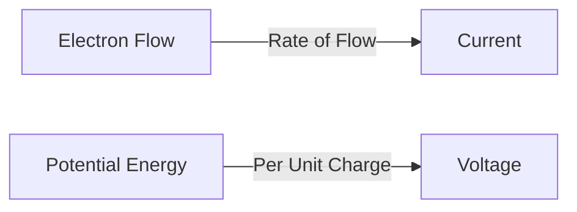
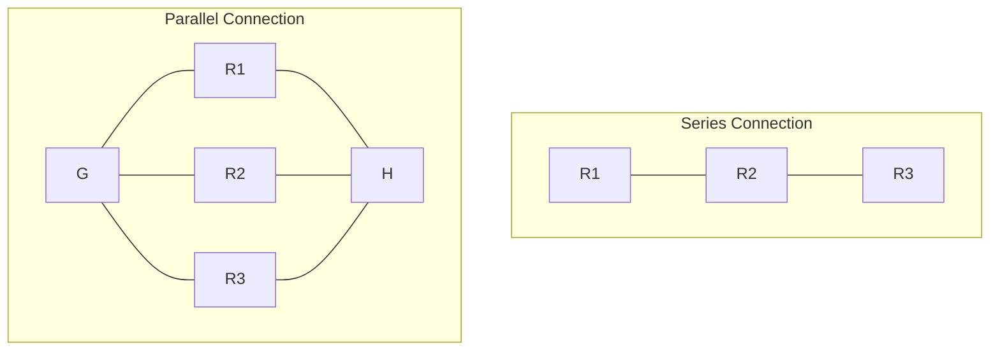
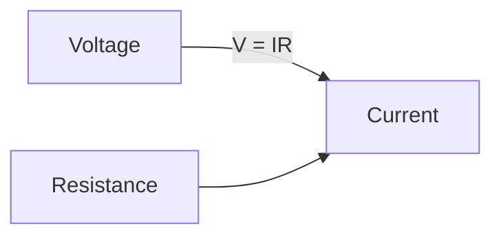
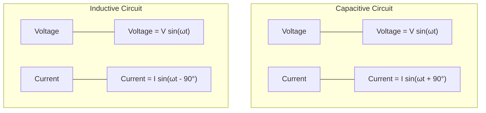
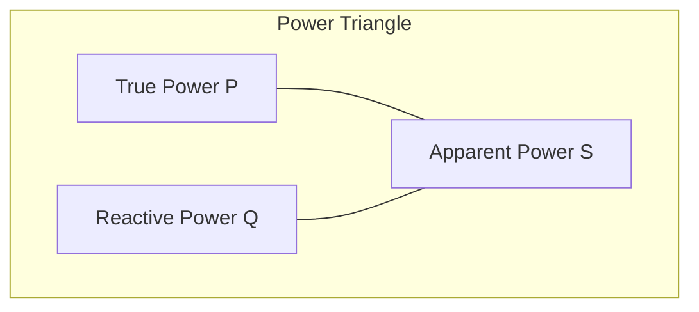
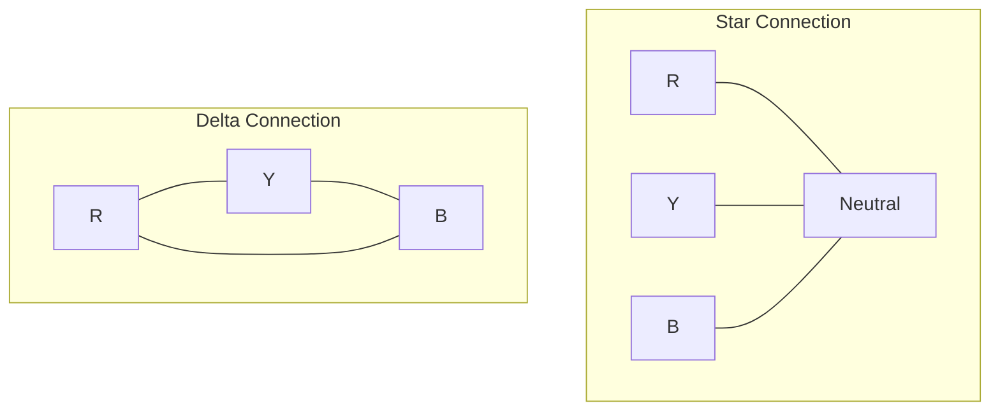
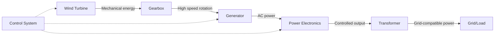
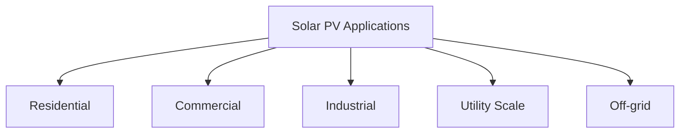
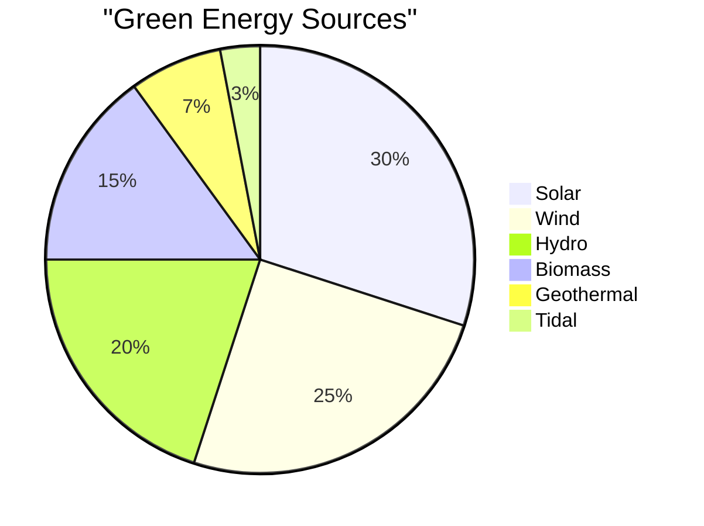

## Question 1(a) [3 marks]

**Define Power & Energy.**

**Answer**:

- **Power**: Rate of doing work or energy consumption per unit time. Measured in Watts (W).
- **Energy**: Ability to do work or the work done. Measured in Joules (J) or Watt-hours (Wh).

**Table: Power vs Energy**

| Parameter | Definition | Formula | Unit |
|-----------|------------|---------|------|
| Power | Rate of energy transfer | P = W/t | Watt (W) |
| Energy | Capacity to do work | E = P × t | Joule (J) or Watt-hour (Wh) |

**Mnemonic:** "Power Performs, Energy Endures"

## Question 1(b) [4 marks]

**Define current and electrical potential.**

**Answer**:

**Diagram:**



- **Current**: Flow of electric charge per unit time. Measured in Amperes (A).
- **Electrical Potential**: Work done per unit charge to move a charge from one point to another. Measured in Volts (V).

**Mnemonic:** "Current Charges, Potential Pushes"

## Question 1(c) [7 marks]

**Explain KCL and KVL with examples.**

**Answer**:

**Diagram:**

```goat
+-----+        i1
      |        ↓
      |    R1
      +-----/\/\/\----+
      |               |
      |               |
     +++              |
     | | V1       R2  |
     +++          /\/\/\
      |               |
      |               |
      +---------------+
         i2 ↑    ↑ i3
            \    /
             \  /
              \/
              R3
              |
              |
             ---
              -
```

**Kirchhoff's Current Law (KCL):** 

- Sum of currents entering a node equals sum of currents leaving it.
- Example: At node X, i1 + i2 = i3

**Kirchhoff's Voltage Law (KVL):**

- Sum of voltage drops around any closed loop equals zero.
- Example: V1 - V(R1) - V(R2) = 0

**Mnemonic:** "Currents Come-Leave, Voltages Voyage-Loop"

## Question 1(c) OR [7 marks]

**Explain different types of connections for Resistors.**

**Answer**:

**Diagram:**



**Table: Series vs Parallel Connection**

| Parameter | Series Connection | Parallel Connection |
|-----------|-------------------|---------------------|
| Total Resistance | Req = R1 + R2 + R3 + ... | 1/Req = 1/R1 + 1/R2 + 1/R3 + ... |
| Current | Same through all resistors | Divides through each path |
| Voltage | Divides across resistors | Same across all resistors |
| Application | Voltage dividers | Current division |

**Mnemonic:** "Series Sum, Parallel Parts"

## Question 2(a) [3 marks]

**Define Resistance and Resistivity. Also state their unit of measurement.**

**Answer**:

- **Resistance**: Opposition to current flow, measured in Ohms (Ω). R = V/I.
- **Resistivity**: Material property indicating resistance per unit dimension, measured in Ohm-meter (Ω·m). ρ = RA/L.

**Mnemonic:** "Resistance Restricts, Resistivity Relates to material"

## Question 2(b) [4 marks]

**Define cell and write names of different types of cell.**

**Answer**:

**Diagram:**

```goat
    +--------+
    |        |
    | +    - |
    |  \  /  |
    |   \/   |
    |        |
    +--------+
      Battery
```

- **Cell**: Device that converts chemical energy into electrical energy creating a voltage.

**Types of Cells:**

1. **Primary cells**: Dry cell, Alkaline cell, Mercury cell
2. **Secondary cells**: Lead-acid, Nickel-Cadmium, Lithium-ion

**Mnemonic:** "Primary Produces once, Secondary Serves repeatedly"

## Question 2(c) [7 marks]

**Calculate total equivalent resistance of the above circuit if R1=5Ω, R2=3Ω, R3=4Ω, R4=1Ω, R5=2Ω.**

**Answer**:

**Diagram:**

```goat
                  R1
                /\/\/\
       +-------+      +------+
       |                     |
       |                     |
       |                     |
    R2 /\          R3       /\ R5
       \/         /\/\/\    \/
       |       +--+      +--+
       |       |            |
       +-------+            |
                            |
                R4          |
               /\/\/\       |
       +-------+      +-----+
       |                    |
       +--------------------+
```

**Step-by-step solution:**

1. R2 and R3 are in series: R23 = R2 + R3 = 3Ω + 4Ω = 7Ω
2. R23 and R4 are in parallel: 1/R234 = 1/7 + 1/1 = (1+7)/7 = 8/7
   Therefore, R234 = 7/8 = 0.875Ω
3. R1, R234, and R5 are in series: 
   Req = R1 + R234 + R5 = 5Ω + 0.875Ω + 2Ω = 7.875Ω

**Therefore, equivalent resistance = 7.875Ω**

**Mnemonic:** "Series-Sum, Parallel-Product over Sum"

## Question 2(a) OR [3 marks]

**Find the cost of energy if 100W bulb operated 10 hours daily for 30 days. Rate of energy is Rupees 5/unit.**

**Answer**:

**Table: Energy Calculation**

| Parameter | Value | Calculation |
|-----------|-------|-------------|
| Power | 100W = 0.1kW | Given |
| Operating hours | 10 hours/day × 30 days = 300 hours | Given |
| Energy consumed | 0.1kW × 300h = 30kWh = 30 units | E = P × t |
| Rate | Rs. 5/unit | Given |
| Total cost | 30 units × Rs. 5/unit = Rs. 150 | Cost = Units × Rate |

**Therefore, cost of energy = Rs. 150**

**Mnemonic:** "Energy × Rate = Electric bill fate"

## Question 2(b) OR [4 marks]

**State ohm's law and explain the use ohm's law to calculate current in any circuit.**

**Answer**:

**Diagram:**



**Ohm's Law:** Current flowing through a conductor is directly proportional to voltage and inversely proportional to resistance.

**Formula: V = IR or I = V/R or R = V/I**

**Application:** To find current in a circuit, measure voltage across a component and divide by its resistance (I = V/R).

**Mnemonic:** "Volts Invite current, Resistance Restricts"

## Question 2(c) OR [7 marks]

**Show that the current in a purely capacitive circuit leads the applied voltage by 90° and the current in a purely inductive circuit lags the applied voltage by 90°.**

**Answer**:

**Diagrams:**



**For Capacitive Circuit:**

- Voltage equation: v = V sin(ωt)
- Current: i = C × dv/dt = ωCV cos(ωt) = I sin(ωt + 90°)
- Current leads voltage by 90°

**For Inductive Circuit:**

- Voltage equation: v = L × di/dt = ωLI cos(ωt) = V sin(ωt + 90°)
- Current: i = I sin(ωt)
- Current lags voltage by 90°

**Mnemonic:** "ELI the ICE man" - In EL (inductor), I lags E; in ICE (capacitor), I leads E

## Question 3(a) [3 marks]

**Define cycle, form factor and amplitude.**

**Answer**:

**Diagram:**

```goat
    ^
    |    /\      /\
    |   /  \    /  \
A---|--/----\--/----\--
    | /      \/      \
    |/                \
    +-------------------->
         |------|
          cycle
```

- **Cycle**: One complete repetition of a waveform.
- **Form Factor**: Ratio of RMS value to average value. For sine wave = 1.11.
- **Amplitude**: Maximum displacement of a waveform from its mean position.

**Mnemonic:** "Cycles Complete, Form Factors Find ratio, Amplitude Achieves maximum"

## Question 3(b) [4 marks]

**Define RMS and Average value. Write expression of RMS and average value of sinusoidal waveform.**

**Answer**:

**Table: RMS vs Average Value**

| Parameter | Definition | Formula for Sine Wave |
|-----------|------------|----------------------|
| RMS Value | Square root of mean of squared values | Vrms = Vm/√2 = 0.707 Vm |
| Average Value | Mean of all instantaneous values over half cycle | Vavg = 2Vm/π = 0.637 Vm |

- **RMS (Root Mean Square)**: Equivalent DC value that produces same heating effect.
- **Average Value**: Mean of all instantaneous values over a half cycle.

**Mnemonic:** "RMS Relates to heating, Average Adds and divides"

## Question 3(c) [7 marks]

**Explain the terms Apparent power, True Power and Reactive power. State their unit of measurement.**

**Answer**:

**Diagram:**



**Table: Types of Power**

| Power Type | Definition | Formula | Unit |
|------------|------------|---------|------|
| Apparent Power (S) | Total power supplied | S = VI | VA (Volt-Ampere) |
| True Power (P) | Actual power consumed | P = VI cos φ | W (Watt) |
| Reactive Power (Q) | Power oscillating between source and load | Q = VI sin φ | VAR (Volt-Ampere Reactive) |

**Power Triangle:** S² = P² + Q²

**Mnemonic:** "Active Performs work, Reactive Returns energy, Apparent Adds vectors"

## Question 3(a) OR [3 marks]

**Write mathematical expressions of 3-phase voltages.**

**Answer**:

**Three-phase voltage expressions:**

**Table: 3-Phase Voltages**

| Phase | Expression |
|-------|------------|
| R-phase | VR = Vm sin(ωt) |
| Y-phase | VY = Vm sin(ωt - 120°) |
| B-phase | VB = Vm sin(ωt - 240°) |

Where Vm is the maximum voltage and ω is the angular frequency.

**Mnemonic:** "Red phase Reference, Yellow lags 120°, Blue brings up 240°"

## Question 3(b) OR [4 marks]

**Define crest factor and state value of crest factor for sine wave.**

**Answer**:

**Diagram:**

```goat
    ^
    |    /\      /\
    |   /  \    /  \
----|--/----\--/----\--
    | /      \/      \
    |/                \
    +-------------------->
    
    Peak value
    |--------|
    |   RMS  |
    |   value|
```

- **Crest Factor**: Ratio of peak value to RMS value of a waveform.
- **Formula**: Crest Factor = Peak Value / RMS Value
- **For sine wave**: Crest Factor = 1/0.707 = 1.414

**Mnemonic:** "Crest Compares peak to RMS"

## Question 3(c) OR [7 marks]

**Describe different three phase electrical connections.**

**Answer**:

**Diagram:**



**Table: Star vs Delta Connection**

| Parameter | Star (Y) Connection | Delta (Δ) Connection |
|-----------|---------------------|----------------------|
| Line Voltage (VL) | √3 × Phase Voltage | Same as Phase Voltage |
| Line Current (IL) | Same as Phase Current | √3 × Phase Current |
| Neutral Wire | Present | Absent |
| Application | Unbalanced loads, Residential | Balanced loads, Industrial |

**Mnemonic:** "Star Shows neutral, Delta Delivers higher current"

## Question 4(a) [3 marks]

**Calculate the peak to peak value of a sinusoidal voltage if RMS value is 230V.**

**Answer**:

**Table: Calculation Steps**

| Parameter | Formula | Calculation |
|-----------|---------|-------------|
| RMS Value | Given | 230V |
| Peak Value | Vm = √2 × Vrms | Vm = √2 × 230 = 325.27V |
| Peak-to-Peak Value | Vp-p = 2 × Vm | Vp-p = 2 × 325.27 = 650.54V |

**Therefore, peak-to-peak value = 650.54V**

**Mnemonic:** "RMS to Peak - multiply by √2, Peak to Peak - double it"

## Question 4(b) [4 marks]

**An alternating current is given by i=142.14sin628t find frequency and time period.**

**Answer**:

**Table: Calculation Steps**

| Parameter | Formula | Calculation |
|-----------|---------|-------------|
| Given equation | i = 142.14 sin(628t) | ω = 628 rad/s |
| Frequency | f = ω/(2π) | f = 628/(2π) = 100 Hz |
| Time Period | T = 1/f | T = 1/100 = 0.01 s = 10 ms |

**Therefore, frequency = 100 Hz and time period = 0.01 s**

**Mnemonic:** "Frequency From omega divide 2π, Time takes inverse"

## Question 4(c) [7 marks]

**State and explain Fleming's left hand rule and right hand rule.**

**Answer**:

**Diagram:**

```goat
Left Hand Rule           Right Hand Rule
    F                        F
    ^                        ^
    |                        |
    |                        |
    +-->B                    +-->B
   /                        /
  /                        /
 I                        I
```

**Fleming's Left Hand Rule (Motor):**

- Used to determine direction of **force** on a current-carrying conductor in a magnetic field.
- Hold left hand with thumb, fore and middle fingers at right angles.
- Thumb: Motion (Force)
- Forefinger: Magnetic field
- Middle finger: Current

**Fleming's Right Hand Rule (Generator):**

- Used to determine direction of **induced current** when a conductor moves in a magnetic field.
- Hold right hand with thumb, fore and middle fingers at right angles.
- Thumb: Motion of conductor
- Forefinger: Magnetic field
- Middle finger: Induced current

**Mnemonic:** "Left Lifts motors, Right Raises generators"

## Question 4(a) OR [3 marks]

**A conductor of length 1 metre moves with speed of 30m/s in magnetic field of 0.6 Tesla making angle of 30° with the field. Calculate dynamically EMF induced in it. (use sin 30°=0.5)**

**Answer**:

**Table: Given Parameters**

| Parameter | Value |
|-----------|-------|
| Length (l) | 1 meter |
| Speed (v) | 30 m/s |
| Magnetic Field (B) | 0.6 Tesla |
| Angle (θ) | 30° |

**Formula:** E = Blv sin θ

**Calculation:** 
E = 0.6 × 1 × 30 × 0.5 = 9 volts

**Therefore, induced EMF = 9 volts**

**Mnemonic:** "EMF Emerges from Field, velocity and Length with angle"

## Question 4(b) OR [4 marks]

**State & explain Lenz's law.**

**Answer**:

**Diagram:**

```goat
    +--------+
    |   N    |  Moving
    |   |    |  Magnet
    |   v    |
    +--------+
        |
        v
    +--------+
    |        |  Induced
    |   ↺    |  Current
    |        |
    +--------+
      Coil
```

**Lenz's Law:** The direction of induced EMF or current is always such that it opposes the cause that produces it.

**Application:** When a magnet approaches a coil, induced current creates a magnetic field that repels the approaching magnet.

**Mnemonic:** "Lenz Likes to Oppose"

## Question 4(c) OR [7 marks]

**Explain Statically and dynamically induced EMF.**

**Answer**:

**Table: Statically vs Dynamically Induced EMF**

| Parameter | Statically Induced EMF | Dynamically Induced EMF |
|-----------|------------------------|--------------------------|
| Definition | EMF induced due to change in current/flux | EMF induced due to movement of conductor in magnetic field |
| Physical action | Fixed conductor, changing field | Moving conductor in fixed field |
| Example | Transformer | Generator |
| Formula | e = -N dΦ/dt | e = Blv sin θ |

**Mnemonic:** "Static Stays but flux Changes, Dynamic Drives through field"

## Question 5(a) [3 marks]

**Explain PV Cell.**

**Answer**:

**Diagram:**

```goat
    Sun Rays
       |||
       vvv
    +-------+
    |  N    |
    |-------| <- P-N Junction
    |  P    |
    +-------+
       | |
       | |
       Load
```

- **PV Cell**: Device that converts sunlight directly into electricity using photovoltaic effect.
- **Working**: Sunlight excites electrons in semiconductor material, creating voltage difference.
- **Material**: Typically made from silicon with P-N junction.

**Mnemonic:** "Photons Visit, Current Created"

## Question 5(b) [4 marks]

**Explain the solar PV panel and arrays.**

**Answer**:

**Diagram:**


**Table: Solar System Hierarchy**

| Component | Description |
|-----------|-------------|
| PV Cell | Basic unit that converts sunlight to electricity (0.5V - 0.6V) |
| PV Panel | Multiple cells connected in series/parallel (typically 12V, 24V) |
| PV Array | Multiple panels connected to achieve required voltage/current |

**Mnemonic:** "Cells Combine into Panels, Panels Produce Arrays"

## Question 5(c) [7 marks]

**Draw and explain block diagram of wind power system.**

**Answer**:

**Diagram:**



**Components of Wind Power System:**

1. **Wind Turbine**: Converts wind energy to mechanical energy
2. **Gearbox**: Increases rotational speed for generator
3. **Generator**: Converts mechanical energy to electrical energy
4. **Power Electronics**: Controls and regulates electrical output
5. **Transformer**: Steps up/down voltage for transmission/distribution
6. **Control System**: Monitors and optimizes overall operation

**Mnemonic:** "Wind Turns Gears, Generating Electrical Returns"

## Question 5(a) OR [3 marks]

**State the benefits of green energy.**

**Answer**:

**Table: Benefits of Green Energy**

| Benefit Category | Examples |
|------------------|----------|
| Environmental | Reduces pollution, Minimizes carbon footprint |
| Economic | Creates jobs, Reduces energy dependency |
| Health | Improves air quality, Reduces health issues |
| Sustainability | Renewable, Inexhaustible sources |

**Mnemonic:** "Clean Energy Creates Economic Salvation"

## Question 5(b) OR [4 marks]

**Explain Solar PV applications in brief.**

**Answer**:

**Diagram:**



**Solar PV Applications:**

1. **Residential**: Rooftop systems, Solar water heaters
2. **Commercial**: Building integrated PV, Solar parking
3. **Industrial**: Process heating, Power generation
4. **Utility Scale**: Solar farms, Grid support
5. **Off-grid**: Rural electrification, Remote applications

**Mnemonic:** "Residences, Commerce, Industry Utilize Solar"

## Question 5(c) OR [7 marks]

**Explain different types of Green energy.**

**Answer**:

**Table: Types of Green Energy**

| Type | Source | Applications |
|------|--------|--------------|
| Solar | Sun | PV systems, Thermal plants |
| Wind | Moving air | Wind turbines, Windmills |
| Hydro | Flowing water | Dams, Run-of-river systems |
| Biomass | Organic matter | Combustion, Biogas production |
| Geothermal | Earth's heat | Direct heating, Power plants |
| Tidal | Ocean tides | Barrage systems, Tidal turbines |

**Diagram:**



**Mnemonic:** "Sun, Wind, Hydro, Biomass, Geothermal, Tidal - Simple Ways Humans Build Green Tomorrow"
