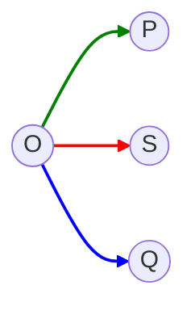
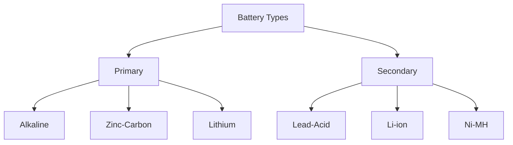
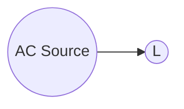
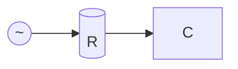
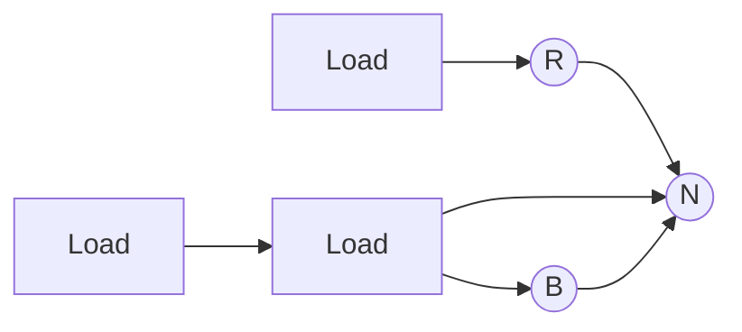
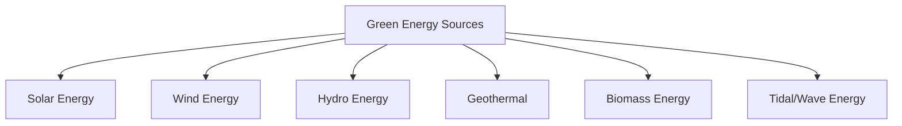
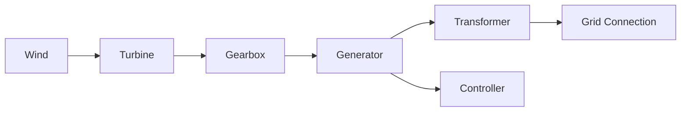
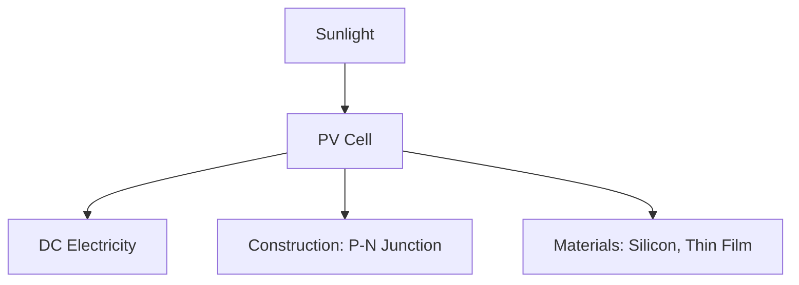
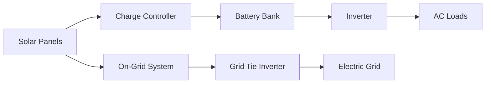

## પ્રશ્ન ૧(અ) [૩ ગુણ]

**વિદ્યુત પ્રવાહ, પાવર, અને ઊર્જા ની વ્યાખ્યા આપો.**

**જવાબ**:

| શબ્દ | વ્યાખ્યા |
|------|------------|
| **વિદ્યુત પ્રવાહ** | વાહક દ્વારા વિદ્યુત ચાર્જનો પ્રવાહ દર (એમ્પિયર, A માં માપવામાં આવે છે) |
| **વિદ્યુત પાવર** | વિદ્યુત ઊર્જાના ટ્રાન્સફર અથવા વપરાશનો દર (વોટ, W માં માપવામાં આવે છે) |
| **ઊર્જા** | કાર્ય કરવાની ક્ષમતા, પાવર ગુણાકાર સમય તરીકે માપવામાં આવે છે (જૂલ અથવા વોટ-કલાક) |

**મેમરી ટ્રીક:** "CPE: Charge-Per-second, Product-of-VI, Energy-over-time"

## પ્રશ્ન ૧(બ) [૪ ગુણ]

**વાહક, અવાહક અને મિશ્ર ધાતુના અવરોધના મૂલ્ય પર તાપમાનની અસર સમજાવો.**

**જવાબ**:

| મટીરિયલનો પ્રકાર | તાપમાનની અસર | સમીકરણ |
|---------------|-------------------|----------|
| **શુદ્ધ ધાતુઓ** | તાપમાન વધતાં અવરોધ વધે છે | R₂ = R₁[1 + α(T₂-T₁)] |
| **મિશ્ર ધાતુઓ** | તાપમાન સાથે થોડોક વધારો (ઓછો α) | R₂ = R₁[1 + α(T₂-T₁)] |
| **અવાહકો** | તાપમાન વધતાં અવરોધ ઘટે છે | R₂ = R₁e^(β(1/T₂-1/T₁)) |

જ્યાં α તાપમાન ગુણાંક, T તાપમાન, અને R અવરોધ છે

**મેમરી ટ્રીક:** "MAI: Metals Add, Alloys Increase-little, Insulators Invert"

## પ્રશ્ન ૧(ક) [૭ ગુણ]

**KVL અને KCL ઉદાહરણ સાથે સમજાવો.**

**જવાબ**:

**કિરચોફના નિયમો:**

| નિયમ | વિધાન | સમીકરણ | સર્કિટ ઉદાહરણ |
|-----|-----------|----------|----------------|
| **KCL** | નોડમાં પ્રવેશતા કરંટનો સરવાળો નોડમાંથી નીકળતા કરંટના સરવાળા બરાબર હોય છે | ∑Iin = ∑Iout | ```mermaid graph TD; A((Node)); I1-->A; I2-->A; A-->I3; A-->I4; ``` |
| **KVL** | બંધ લૂપમાં વોલ્ટેજ ડ્રોપનો સરવાળો વોલ્ટેજ રાઈઝના સરવાળા બરાબર હોય છે | ∑V = 0 | ```mermaid graph LR; A((+))-->B((-))); B-->C((+)); C-->D((+)); D-->A; linkStyle 0 stroke:red,stroke-width:2px; linkStyle 1 stroke:green,stroke-width:2px; linkStyle 2 stroke:blue,stroke-width:2px; linkStyle 3 stroke:orange,stroke-width:2px; ``` |

**ઉદાહરણ**: 

- **KCL**: નોડ A પર, જો I₁ = 5A અને I₂ = 3A પ્રવેશે છે, તો I₃ + I₄ = 8A બહાર નીકળવું જોઈએ
- **KVL**: જો 12V બેટરી અને રેઝિસ્ટર R₁(4Ω) અને R₂(8Ω)ના લૂપમાં, 12V = I×(4Ω+8Ω)

**મેમરી ટ્રીક:** "CLAN: Currents Leave And eNter equally, Voltage Around Loop is Null"

## પ્રશ્ન ૧(ક) OR [૭ ગુણ]

**જરૂરી સૂત્ર સાથે અવરોધનું શ્રેણી અને સમાંતર જોડાણ સમજાવો.**

**જવાબ**:

| જોડાણ | સર્કિટ ડાયાગ્રામ | સમીકરણ | કરંટ/વોલ્ટેજ સંબંધ |
|------------|-----------------|----------|--------------------------|
| **શ્રેણી** | ```mermaid graph LR; A---B[(R₁)]---C[(R₂)]---D[(R₃)]---E; ``` | Req = R₁ + R₂ + R₃ + ... + Rn | બધા અવરોધોમાં સમાન કરંટ |
| **સમાંતર** | ```mermaid graph TD; A---B; A---C[(R₁)]---B; A---D[(R₂)]---B; A---E[(R₃)]---B; ``` | 1/Req = 1/R₁ + 1/R₂ + 1/R₃ + ... + 1/Rn | બધા અવરોધોમાં સમાન વોલ્ટેજ |

- **શ્રેણી**: કુલ અવરોધ વધે છે, કરંટ ઘટે છે
- **સમાંતર**: કુલ અવરોધ ઘટે છે, કરંટ વધે છે

**મેમરી ટ્રીક:** "SPARC: Series Plus All Resistors, parallel Combines with reciprocals"

## પ્રશ્ન ૨(અ) [૩ ગુણ]

**અવરોધના મૂલ્યને અસર કરતાં પરિબળો લખો.**

**જવાબ**:

| પરિબળ | અવરોધ પર અસર | સંબંધ |
|--------|----------------------|----------|
| **લંબાઈ (l)** | સીધો સંબંધ | R ∝ l |
| **ક્રોસ-સેક્શનલ એરિયા (A)** | વ્યસ્ત સંબંધ | R ∝ 1/A |
| **મટિરિયલ (ρ)** | રેઝિસ્ટિવિટી પર આધાર રાખે છે | R ∝ ρ |
| **તાપમાન (T)** | સામાન્ય રીતે તાપમાન સાથે વધે છે | R ∝ T |

**મેમરી ટ્રીક:** "LAMT: Length Adds, Area Minimizes, Material matters, Temperature transforms"

## પ્રશ્ન ૨(બ) [૪ ગુણ]

**પાવર ત્રિકોણ દોરી એક્ટિવ અને રીઍક્ટિવ પાવરની વ્યાખ્યા આપો.**

**જવાબ**:

**પાવર ત્રિકોણ:**



| પાવરનો પ્રકાર | વ્યાખ્યા | એકમ | ફોર્મ્યુલા |
|------------|------------|------|---------|
| **એક્ટિવ પાવર (P)** | ઉપકરણ દ્વારા વપરાતી વાસ્તવિક પાવર | વોટ (W) | P = VI cos φ |
| **રીઍક્ટિવ પાવર (Q)** | સ્ત્રોત અને લોડ વચ્ચે આંદોલિત થતી પાવર | VAR | Q = VI sin φ |
| **એપેરન્ટ પાવર (S)** | એક્ટિવ અને રીઍક્ટિવ પાવરનો વેક્ટર સરવાળો | VA | S = VI |

**મેમરી ટ્રીક:** "PAWS: Power Active Works, Apparent is Slant-hypotenuse, reactive Qoscillates"

## પ્રશ્ન ૨(ક) [૭ ગુણ]

**સેલ અને બેટરી સમજાવો. વિવિધ રેટિંગ અને બેટરીના પ્રકારોની યાદી બનાવો.**

**જવાબ**:

**સેલ અને બેટરી:**

| શબ્દ | વ્યાખ્યા |
|------|------------|
| **સેલ** | મૂળભૂત ઇલેક્ટ્રોકેમિકલ એકમ જે રાસાયણિક ઊર્જાને વિદ્યુત ઊર્જામાં રૂપાંતરિત કરે છે |
| **બેટરી** | શ્રેણી અથવા સમાંતરમાં જોડાયેલા એક કે વધુ સેલનો સમૂહ |

**બેટરી રેટિંગ:**

| રેટિંગ | વર્ણન | એકમ |
|--------|-------------|------|
| **વોલ્ટેજ** | પોટેન્શિયલ ડિફરન્સ | વોલ્ટ (V) |
| **કેપેસિટી** | સંગ્રહિત ચાર્જની માત્રા | એમ્પિયર-કલાક (Ah) |
| **ઊર્જા** | કુલ ઉપલબ્ધ ઊર્જા | વોટ-કલાક (Wh) |
| **C-રેટ** | ડિસ્ચાર્જ/ચાર્જ દર | C |
| **સાયકલ લાઇફ** | ચાર્જ/ડિસ્ચાર્જ સાયકલની સંખ્યા | - |

**બેટરીના પ્રકારો:**



**મેમરી ટ્રીક:** "CAVE: Cells Are Voltage Elements, batteries Bundle And TallY Energy"

## પ્રશ્ન ૨(અ) OR [૩ ગુણ]

**અવરોધ, વહન અને વાહકતાની વ્યાખ્યા આપો.**

**જવાબ**:

| શબ્દ | વ્યાખ્યા | એકમ | ફોર્મ્યુલા |
|------|------------|------|---------|
| **અવરોધ (R)** | વિદ્યુત પ્રવાહનો વિરોધ | ઓહ્મ (Ω) | R = ρl/A |
| **વહન (G)** | વિદ્યુત પ્રવાહની સરળતા | સિમેન્સ (S) | G = 1/R |
| **વાહકતા (σ)** | વિદ્યુત પ્રવાહને પસાર કરવાની મટિરિયલની ક્ષમતા | S/m | σ = 1/ρ |

જ્યાં ρ રેઝિસ્ટિવિટી, l લંબાઈ, અને A ક્રોસ-સેક્શનલ એરિયા છે

**મેમરી ટ્રીક:** "RCG: Resist Current Gladly, Conduct Generously, σ Gets current through"

## પ્રશ્ન ૨(બ) OR [૪ ગુણ]

**શુદ્ધ ઈંડક્ટિવ સર્કિટ માટે સાબિત કરો કે કરંટ એ વોલ્ટેજ કરતા 90° પાછળ હોય છે.**

**જવાબ**:

**શુદ્ધ ઈંડક્ટિવ સર્કિટ માટે:**



**ગાણિતિક સાબિતી:**

- આપેલ વોલ્ટેજ: v = Vm sin(ωt)
- ઇન્ડક્ટર માટે: v = L(di/dt)
- આથી: L(di/dt) = Vm sin(ωt)
- ઇન્ટિગ્રેટ કરતાં: i = -(Vm/ωL)cos(ωt) = (Vm/ωL)sin(ωt-90°)

**વેવફોર્મ:**

```goat
    v    i
    |    |
    |\  /|
    | \/ |
    | /\ |
    |/  \|
    |    |
    |    |
    |    |
    +----+
       t
```

**મેમરી ટ્રીક:** "ELI: Voltage Leads current In inductor by 90 degrees"

## પ્રશ્ન ૨(ક) OR [૭ ગુણ]

**અવરોધ, ઈંડક્ટર અને કેપેસીટર તેમના સૂત્ર સાથે સમજાવો.**

**જવાબ**:

| ઘટક | સિમ્બોલ | વર્ણન | ફોર્મ્યુલા | ઊર્જા સંગ્રહ |
|-----------|--------|-------------|---------|---------------|
| **અવરોધ** | ```mermaid graph LR; A---B[(___/\/\/\___)]---C``` | કરંટ પ્રવાહનો વિરોધ કરે છે | V = IR | સંગ્રહ નથી |
| **ઈંડક્ટર** | ```mermaid graph LR; A---B[(_mmmmm_)]---C``` | કરંટમાં ફેરફારનો વિરોધ કરે છે | V = L(di/dt) | E = ½LI² |
| **કેપેસીટર** | ```mermaid graph LR; A---B[(_⎥⎥_)]---C``` | વોલ્ટેજમાં ફેરફારનો વિરોધ કરે છે | I = C(dv/dt) | E = ½CV² |

**AC સર્કિટ પર અસર:**

- **અવરોધ**: કરંટ વોલ્ટેજ સાથે એક ફેઝમાં (cos θ = 1)
- **ઈંડક્ટર**: કરંટ વોલ્ટેજથી 90° પાછળ (cos θ = 0)
- **કેપેસીટર**: કરંટ વોલ્ટેજથી 90° આગળ (cos θ = 0)

**મેમરી ટ્રીક:** "RIC: Resistor Impedes Current, Inductor Catches current-changes, Capacitor Controls voltage-changes"

## પ્રશ્ન ૩(અ) [૩ ગુણ]

**A.C. સિગ્નલની R.M.S અને એવરેજ મૂલ્યની વ્યાખ્યા આપો અને સમજાવો.**

**જવાબ**:

| મૂલ્ય | વ્યાખ્યા | સાઇન વેવ માટે ફોર્મ્યુલા | સંબંધ |
|-------|------------|----------------------|----------|
| **RMS મૂલ્ય** | સ્ક્વેર કરેલા મૂલ્યોના મીનનો સ્ક્વેર રૂટ | Vrms = Vmax/√2 = 0.707Vmax | DC સમાન હીટિંગ ઇફેક્ટ આપે છે |
| **એવરેજ મૂલ્ય** | અર્ધ સાયકલ પર રેક્ટિફાઇડ સિગ્નલનું મીન | Vavg = 2Vmax/π = 0.637Vmax | બેટરી ચાર્જિંગ એપ્લિકેશન માટે ઉપયોગી |

**મેમરી ટ્રીક:** "RAM: Rms-Average Method: Root-mean-square And Mean-of-absolute"

## પ્રશ્ન ૩(બ) [૪ ગુણ]

**વૈકલ્પિક EMF કેવી રીતે ઉત્પન્ન થાય છે તે જરૂરી આકૃતિ સાથે સમજાવો.**

**જવાબ**:

**વૈકલ્પિક EMF ઉત્પાદન:**


**આકૃતિ:**

```goat
    N       S
    |       |
    +-------+
      |   |
      |   |
      |___|
       \ /
        |
        v
```

- કોઈલ સમાન ચુંબકીય ક્ષેત્રમાં ફરે છે
- EMF = NBAlω sin(ωt)
- કોઈલ ફરતી વખતે, ફ્લક્સ કટિંગની દિશા બદલાય છે
- સાઇન વેવ ઉત્પન્ન થાય છે e = Emax sin(ωt)

**મેમરી ટ્રીક:** "FARM: Flux And Rotation Make alternating voltage"

## પ્રશ્ન ૩(ક) [૭ ગુણ]

**શુધ્ધ આવરોધીય AC સરકીટનું એસી એનાલિસિસ કરો.**

**જવાબ**:

**શુદ્ધ અવરોધિય સર્કિટ:**



| પેરામીટર | ફોર્મ્યુલા | વેવફોર્મ સંબંધ |
|-----------|---------|----------------------|
| **આપેલ વોલ્ટેજ** | v = Vm sin(ωt) | કરંટ અને વોલ્ટેજ એક ફેઝમાં |
| **કરંટ** | i = v/R = (Vm/R)sin(ωt) | ઓહ્મના નિયમનું પાલન કરે છે |
| **પાવર** | p = vi = Vm Im sin²(ωt) | હંમેશા સકારાત્મક |
| **એવરેજ પાવર** | P = Vrms × Irms = V²/R | સ્થિર મૂલ્ય |

**વેવફોર્મ:**

```goat
    v,i  p
    |    |
    |\  /"\
    | \/ | \
    | /\ | /
    |/  \|/
    |    |
    |    |
    |    |
    +----+
       t
```

**મેમરી ટ્રીક:** "VIPS: Voltage In-Phase with current, Same waveform, Power always Positive"

## પ્રશ્ન ૩(અ) OR [૩ ગુણ]

**એસી વિદ્યુતપ્રવાહ I=28.28sin(2Π50t). વિદ્યુત પ્રવાહનું RMS મૂલ્ય શોધો.**

**જવાબ**:

**આપેલુ:**

- I = 28.28sin(2Π50t)
- તેથી, Im = 28.28A

**ઉકેલ:**

| સ્ટેપ | કેલ્ક્યુલેશન |
|------|-------------|
| 1. પીક વેલ્યૂ ઓળખો | Im = 28.28A |
| 2. RMS ફોર્મ્યુલા લાગુ કરો | Irms = Im/√2 |
| 3. ગણતરી કરો | Irms = 28.28/√2 = 28.28/1.414 = 20A |

**આથી, કરંટની RMS મૂલ્ય = 20A**

**મેમરી ટ્રીક:** "PER: Peak to Effective by Root-2"

## પ્રશ્ન ૩(બ) OR [૪ ગુણ]

**જો Vav=60 V હોય તો વૉલ્ટેજનું RMS અને મહત્તમ મૂલ્ય શોધો.**

**જવાબ**:

**આપેલુ:**

- એવરેજ મૂલ્ય (Vav) = 60V

**ઉકેલ:**

| સ્ટેપ | ફોર્મ્યુલા | કેલ્ક્યુલેશન |
|------|---------|-------------|
| 1. Vav અને Vm વચ્ચેનો સંબંધ | Vav = 2Vm/π = 0.637Vm | Vm = Vav/0.637 = 60/0.637 |
| 2. મહત્તમ મૂલ્ય ગણો | Vm = Vav × (π/2) | Vm = 60 × (π/2) = 60 × 1.57 = 94.2V |
| 3. RMS મૂલ્ય ગણો | Vrms = Vm/√2 = 0.707Vm | Vrms = 0.707 × 94.2 = 66.6V |

**આથી, મહત્તમ મૂલ્ય = 94.2V અને RMS મૂલ્ય = 66.6V**

**મેમરી ટ્રીક:** "AVR: Average to peak Via multiplying by (π/2), Rms is peak/√2"

## પ્રશ્ન ૩(ક) OR [૭ ગુણ]

**ફેઈઝ ડાયાગ્રામની મદદથી સ્ટાર જોડાણનું લાઈન અને ફેઈસ વૉલ્ટેજનું સમીકરણ તારવો.**

**જવાબ**:

**સ્ટાર જોડાણ:**



**ફેઝર ડાયાગ્રામ:**

```goat
     VRY
      ^
     /|\
    / | \
   /  |  \
  /   |   \
VRB   |    VYB
```

**ડેરિવેશન:**

- ફેઝ વોલ્ટેજ: VRN, VYN, VBN (120° અલગ)
- લાઈન વોલ્ટેજ: VRY = VRN - VYN
- બેલેન્સ સિસ્ટમ માટે ફેઝ વોલ્ટેજનું મેગ્નિટ્યૂડ Vp સાથે:
- VRY = VRN - VYN = Vp∠0° - Vp∠-120° = Vp(1 - ∠-120°) = √3Vp∠30°

**સંબંધ:**

- લાઈન વોલ્ટેજ (VL) = √3 × ફેઝ વોલ્ટેજ (Vp)
- લાઈન વોલ્ટેજ ફેઝ વોલ્ટેજથી 30° આગળ રહે છે

**મેમરી ટ્રીક:** "PALS: Phase to Line in Star: multiply by Square-root-3"

## પ્રશ્ન ૪(અ) [૩ ગુણ]

**Faraday અને Lenzનો નિયમ તેના સૂત્ર સાથે લખો.**

**જવાબ**:

| નિયમ | વિધાન | સમીકરણ |
|-----|-----------|------------|
| **ફેરાડેનો નિયમ** | પ્રેરિત EMF ચુંબકીય ફ્લક્સના પરિવર્તનના દરના સમપ્રમાણમાં હોય છે | e = -N(dΦ/dt) |
| **લેન્ઝનો નિયમ** | પ્રેરિત EMF તેને ઉત્પન્ન કરતા કારણનો વિરોધ કરે છે (સૂત્રમાં નેગેટિવ સાઇન) | ફ્લક્સ પરિવર્તનની વિરુદ્ધ દિશા |

**મેમરી ટ્રીક:** "FORC: Faraday's flux Over Rate Change, Lenz Opposes the Reason for Change"

## પ્રશ્ન ૪(બ) [૪ ગુણ]

**સિંગલ ફેઈસ સપ્લાયની સરખામણીમાં 3-ફેઈસ સપ્લાયના 4 ફાયદા લખો.**

**જવાબ**:

| 3-ફેઈસ સપ્લાયના સિંગલ-ફેઈસ કરતાં ફાયદા | સમજૂતી |
|----------------------------------------|-------------|
| **ઉચ્ચ પાવર ઘનત્વ** | 3-ફેઈસ સમાન વાયર સાઈઝ સાથે 1.732 ગણો વધુ પાવર આપે છે |
| **સ્થિર પાવર ડિલિવરી** | સિંગલ-ફેઈસની જેમ પાવરમાં ઉછાળા નહીં |
| **નાના કન્ડક્ટર** | સમાન પાવર ટ્રાન્સફર માટે ઓછા કોપરની જરૂર |
| **સેલ્ફ-સ્ટાર્ટિંગ મોટર** | મોટર માટે કોઈ સ્ટાર્ટિંગ મેકેનિઝમની જરૂર નથી |

**વધારાના: વધુ કાર્યક્ષમ ટ્રાન્સમિશન, ઓછા હાર્મોનિક્સ, બેલેન્સ્ડ લોડિંગ**

**મેમરી ટ્રીક:** "PCCS: Power higher, Constant delivery, Copper less, Self-starting motors"

## પ્રશ્ન ૪(ક) [૭ ગુણ]

**Flemingનો જમણા હાથનો અને ડાબા હાથનો નિયમ સમજાવો.**

**જવાબ**:

**ફ્લેમિંગના હાથના નિયમો:**

| નિયમ | ઉપયોગ | હાથની સ્થિતિ | આકૃતિ |
|------|-------------|--------------|---------|
| **જમણા હાથનો નિયમ (જનરેટર)** | પ્રેરિત EMFની દિશા નક્કી કરે છે | **અંગૂઠો**: ગતિ<br>**તર્જની**: ક્ષેત્ર<br>**મધ્યમા**: કરંટ/EMF | ```goat

    F ^
      |
    --+-- > M
      |
      v
      C
    ``` |
| **ડાબા હાથનો નિયમ (મોટર)** | ગતિ/બળની દિશા નક્કી કરે છે | **અંગૂઠો**: ગતિ/બળ<br>**તર્જની**: ક્ષેત્ર<br>**મધ્યમા**: કરંટ | ```goat
    F ^
      |
    --+-- > M
      |
      v
      C
    ``` |

- **જનરેટર**: યાંત્રિક ઊર્જાનું વિદ્યુત ઊર્જામાં રૂપાંતર
- **મોટર**: વિદ્યુત ઊર્જાનું યાંત્રિક ઊર્જામાં રૂપાંતર

**મેમરી ટ્રીક:** "FBI-MFC: Field-B-Induced current for right hand, Motion-Field-Current for left"

## પ્રશ્ન ૪(અ) OR [૩ ગુણ]

**ઈલેક્ટ્રોમેગ્નેટિક ઈન્ડક્સનની ઘટના સમજાવો.**

**જવાબ**:

**ઈલેક્ટ્રોમેગ્નેટિક ઈન્ડક્શન:**


**મુખ્ય પરિબળો:**

- સાપેક્ષ ગતિ અથવા ફ્લક્સમાં ફેરફારની જરૂર
- EMF ફ્લક્સના ફેરફારના દરના સમપ્રમાણમાં
- દિશા લેન્ઝના નિયમ દ્વારા નિર્ધારિત

**મેમરી ટ્રીક:** "MICE: Motion Induces Current via Electromagnetic induction"

## પ્રશ્ન ૪(બ) OR [૪ ગુણ]

**3-ફેઈસ વૈકલ્પિક ઈ. એમ. એફ. કેવી રીતે ઉત્પન થાય છે સમજાવો.**

**જવાબ**:

**3-ફેઈસ EMF ઉત્પાદન:**


**થ્રી ફેઈસ વેવફોર્મ:**

```goat
    +       R
    |   /\    /\
    |  /  \  /  \
    | /    \/    \
----+---------------
    |\    /\    /
    | \  /  \  /
    |  \/    \/  
    +       Y
    |   /\    /\
    |  /  \  /  \
    | /    \/    \
----+---------------
    |\    /\    /
    | \  /  \  /
    |  \/    \/
    +       B
```

- ત્રણ સમાન કોઈલ્સ 120° અંતરે ગોઠવાયેલી
- ત્રણ સમાન EMF ઉત્પન્ન કરે છે જે સમયમાં 120° અંતરે હોય છે
- EMFs: eR = Emax sin(ωt), eY = Emax sin(ωt-120°), eB = Emax sin(ωt-240°)

**મેમરી ટ્રીક:** "CPS: Coils Produce Shifted waveforms at 120 degrees"

## પ્રશ્ન ૪(ક) OR [૭ ગુણ]

**Statically induced E.M.F અને dynamically induced E.M.F વચ્ચેનો તફાવત લખો.**

**જવાબ**:

| પેરામીટર | સ્ટેટિકલી ઈન્ડ્યુસ્ડ EMF | ડાયનેમિકલી ઈન્ડ્યુસ્ડ EMF |
|-----------|------------------------|-------------------------|
| **વ્યાખ્યા** | સ્થિર વાહકમાં ફ્લક્સના ફેરફારને કારણે પ્રેરિત EMF | ચુંબકીય ક્ષેત્રમાં વાહકની ગતિને કારણે પ્રેરિત EMF |
| **ગતિ** | વાહક અને ક્ષેત્ર વચ્ચે કોઈ સાપેક્ષ ગતિ નહીં | સાપેક્ષ ગતિ હાજર |
| **ફેરફારનો સ્ત્રોત** | પ્રાથમિક સર્કિટમાં કરંટમાં ફેરફાર | વાહકની ભૌતિક ગતિ |
| **ઉદાહરણો** | ટ્રાન્સફોર્મર, ઈન્ડક્ટર | જનરેટર, આલ્ટરનેટર |
| **ગાણિતિક સમીકરણ** | e = -N(dΦ/dt) કરંટમાં ફેરફારને કારણે | e = Blv (B=ફ્લક્સ ઘનતા, l=લંબાઈ, v=વેગ) |

**મેમરી ટ્રીક:** "SMCE: Static-Moving, Change-External: static has changing flux, moving has constant flux"

## પ્રશ્ન ૫(અ) [૩ ગુણ]

**HAWT અને VAWT વચ્ચેનો તફાવત લખો.**

**જવાબ**:

| પેરામીટર | HAWT (હોરિઝોન્ટલ એક્સિસ વિન્ડ ટર્બાઈન) | VAWT (વર્ટિકલ એક્સિસ વિન્ડ ટર્બાઈન) |
|-----------|-------------------------------------|-----------------------------------|
| **ઓરિએન્ટેશન** | બ્લેડ્સ ક્ષૈતિજ અક્ષ પર ફરે છે | બ્લેડ્સ ઊભી અક્ષ પર ફરે છે |
| **પવનની દિશા** | પવનની દિશા તરફ મોંઢું રાખવાની જરૂર | કોઈપણ દિશાના પવન સાથે કામ કરે છે |
| **ઇન્સ્ટોલેશન** | ઊંચા ટાવર, જમીનથી ઊંચે | જમીનથી નીચે, સરળ એક્સેસ |

**આકૃતિ:**

```goat
   HAWT       VAWT
    /|\        _|_
   / | \      | | |
  /__|__\     |_|_|
     |          |
    _|_        _|_
```

**મેમરી ટ્રીક:** "HV-DIT: Horizontal-Vertical, Directional-Independent, Tall-lower"

## પ્રશ્ન ૫(બ) [૪ ગુણ]

**Green energyનું વર્ગીકરણ કરો.**

**જવાબ**:

**ગ્રીન એનર્જી વર્ગીકરણ:**



| સ્ત્રોત | મુખ્ય સિદ્ધાંત | ઉપયોગ |
|--------|-------------------|-------------|
| **સોલાર** | ફોટોવોલ્ટિક ઇફેક્ટ | સોલાર પેનલ્સ, થર્મલ કલેક્ટર્સ |
| **વિન્ડ** | હવાની ગતિશીલ ઊર્જા | વિન્ડ ટર્બાઈન |
| **હાઇડ્રો** | પાણીની સ્થિતિજ ઊર્જા | ડેમ, રન-ઓફ-રિવર |
| **જિયોથર્મલ** | પૃથ્વીની આંતરિક ગરમી | હીટ પમ્પ, પાવર પ્લાન્ટ |

**મેમરી ટ્રીક:** "SWHGBT: Sun Wind Hydro Geo Bio Tidal - Sources With Huge Green Benefits Today"

## પ્રશ્ન ૫(ક) [૭ ગુણ]

**વિન્ડ પાવર સિસ્ટમ સમજાવો.**

**જવાબ**:

**વિન્ડ પાવર સિસ્ટમ:**



**ઘટકો:**

- **વિન્ડ ટર્બાઈન**: પવનની ઊર્જાને યાંત્રિક રોટેશનમાં રૂપાંતરિત કરે છે
- **ગિયરબોક્સ**: જનરેટર માટે રોટેશન સ્પીડ વધારે છે
- **જનરેટર**: યાંત્રિકને વિદ્યુત ઊર્જામાં રૂપાંતરિત કરે છે
- **કંટ્રોલર**: આઉટપુટ અને સેફ્ટી ફંક્શન્સ નિયંત્રિત કરે છે
- **ટ્રાન્સફોર્મર**: ટ્રાન્સમિશન માટે વોલ્ટેજ વધારે છે
- **ટાવર**: વધુ મજબૂત પવન પકડવા માટે ટર્બાઈનને ઊંચે રાખે છે

**કાર્ય સિદ્ધાંત:**

1. પવન બ્લેડ્સને ફેરવે છે (ગતિશીલથી યાંત્રિક)
2. ગિયરબોક્સ RPM વધારે છે
3. જનરેટર AC પાવર ઉત્પન્ન કરે છે
4. કંટ્રોલર આઉટપુટ નિયંત્રિત કરે છે
5. ટ્રાન્સફોર્મર ગ્રિડ કનેક્શન માટે તૈયાર કરે છે

**મેમરી ટ્રીક:** "WINGER: Wind In, Gearbox Enhances Rotation, Generator outputs"

## પ્રશ્ન ૫(અ) OR [૩ ગુણ]

**ગ્રીન ઊર્જાની કોઈપણ ત્રણ જરૂરિયાત લખો.**

**જવાબ**:

| ગ્રીન એનર્જીની જરૂરિયાત | સમજૂતી |
|---------------------|-------------|
| **પર્યાવરણ સંરક્ષણ** | પ્રદૂષણ અને ગ્રીનહાઉસ ગેસ ઉત્સર્જન ઘટાડે છે |
| **સંસાધન સંરક્ષણ** | સીમિત ફોસિલ ફ્યુઅલ સંસાધનોનું સંરક્ષણ કરે છે |
| **ઊર્જા સુરક્ષા** | આયાત કરેલા ઈંધણ પર નિર્ભરતા અને ભાવમાં અસ્થિરતા ઘટાડે છે |

**અન્ય જરૂરિયાતો**: જળવાયુ પરિવર્તન શમન, ટકાઉ વિકાસ, આર્થિક લાભો

**મેમરી ટ્રીક:** "ECO: Environment protected, Conservation of resources, Oil-independence"

## પ્રશ્ન ૫(બ) OR [૪ ગુણ]

**PV સેલ પર ટૂંક નોંધ લખો.**

**જવાબ**:

**ફોટોવોલ્ટિક (PV) સેલ:**



**કાર્ય સિદ્ધાંત:**

- ફોટોવોલ્ટિક ઇફેક્ટ પર આધારિત
- સૂર્યપ્રકાશને સીધો વિદ્યુતમાં રૂપાંતરિત કરે છે
- સેમીકન્ડક્ટર મટિરિયલ (સામાન્ય રીતે સિલિકોન) વાપરે છે
- ફોટોન્સ P-N જંક્શન પર પડવાથી ઈલેક્ટ્રોન ફ્લો બનાવે છે

**પ્રકારો**: મોનોક્રિસ્ટલાઈન, પોલીક્રિસ્ટલાઈન, થિન-ફિલ્મ

**કાર્યક્ષમતા**: વ્યાવસાયિક સેલ માટે સામાન્ય રીતે 15-22%

**મેમરી ટ્રીક:** "SPEC: Sunlight Produces Electricity through Cells with p-n junctions"

## પ્રશ્ન ૫(ક) OR [૭ ગુણ]

**સોલાર પાવર પદ્ધતિ સમજાવો.**

**જવાબ**:

**સોલાર પાવર સિસ્ટમ:**



**ઘટકો:**

- **સોલાર પેનલ્સ**: સૂર્યપ્રકાશને DC વિદ્યુતમાં રૂપાંતરિત કરે છે
- **ચાર્જ કંટ્રોલર**: બેટરી ચાર્જિંગ નિયંત્રિત કરે છે
- **બેટરી બેંક**: વિદ્યુત ઊર્જા સંગ્રહિત કરે છે (ઓફ-ગ્રિડ)
- **ઇન્વર્ટર**: ઘરેલુ ઉપયોગ માટે DCને ACમાં રૂપાંતરિત કરે છે
- **ડિસ્ટ્રિબ્યુશન પેનલ**: ઘરની વિદ્યુત પ્રણાલી સાથે જોડાણ કરે છે

**પ્રકારો:**

- **ગ્રિડ-કનેક્ટેડ**: વધારાની પાવર ગ્રિડમાં ફીડ કરે છે
- **ઓફ-ગ્રિડ**: બેટરી સ્ટોરેજ સાથે સ્વતંત્ર
- **હાઇબ્રિડ**: બંને સિસ્ટમનું સંયોજન

**એપ્લિકેશન્સ:** ઘર પાવર, વોટર પમ્પિંગ, સ્ટ્રીટ લાઇટિંગ, ઔદ્યોગિક ઉપયોગ

**મેમરી ટ્રીક:** "SCBID: Solar Cells produce, Battery stores, Inverter converts, Distribution supplies"
