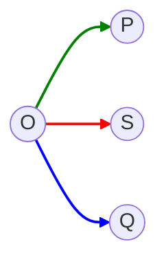
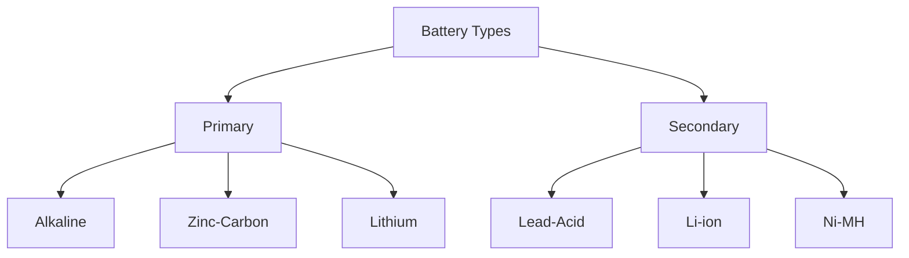
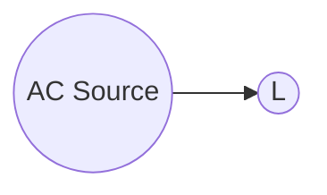
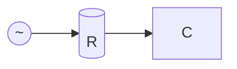
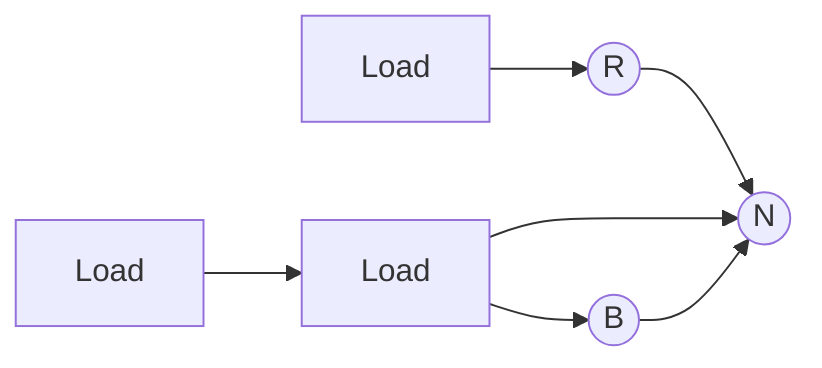
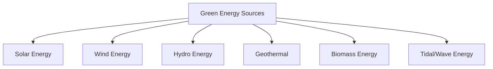
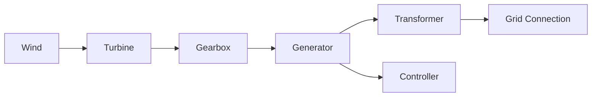
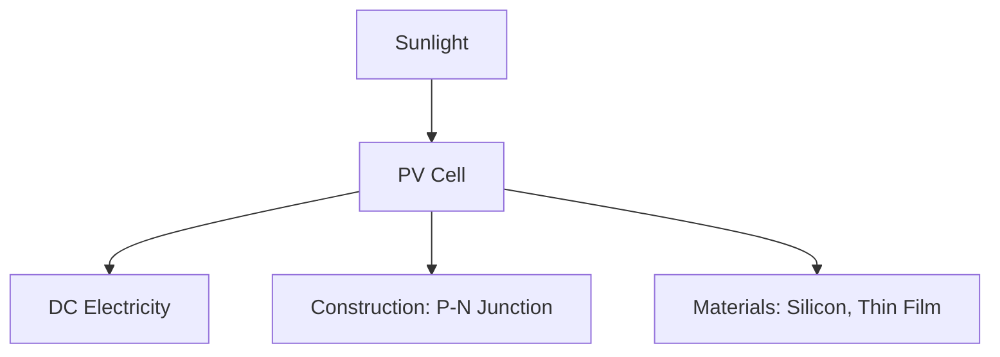
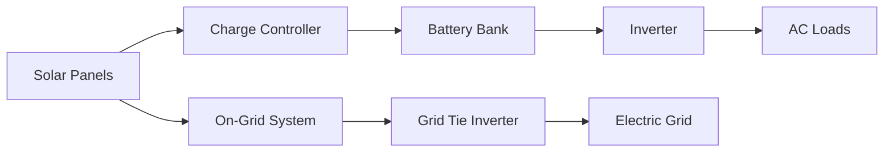

## Question 1(a) [3 marks]

**Define current, electric Power and energy.**

**Answer**:

| Term | Definition |
|------|------------|
| **Current** | The rate of flow of electric charge through a conductor (measured in amperes, A) |
| **Electric Power** | The rate at which electrical energy is transferred or consumed (measured in watts, W) |
| **Energy** | The capacity to do work, measured as power multiplied by time (measured in joules or watt-hours) |

**Mnemonic:** "CPE: Charge-Per-second, Product-of-VI, Energy-over-time"

## Question 1(b) [4 marks]

**Explain the effect of temperature on the value of resistance of pure metal, alloys and insulators.**

**Answer**:

| Material Type | Temperature Effect | Equation |
|---------------|-------------------|----------|
| **Pure Metals** | Resistance increases with temperature | R₂ = R₁[1 + α(T₂-T₁)] |
| **Alloys** | Slight increase with temperature (low α) | R₂ = R₁[1 + α(T₂-T₁)] |
| **Insulators** | Resistance decreases with temperature | R₂ = R₁e^(β(1/T₂-1/T₁)) |

where α is temperature coefficient, T is temperature, and R is resistance

**Mnemonic:** "MAI: Metals Add, Alloys Increase-little, Insulators Invert"

## Question 1(c) [7 marks]

**State and explain KCL and KVL with examples.**

**Answer**:

**Kirchhoff's Laws:**

| Law | Statement | Equation | Example Circuit |
|-----|-----------|----------|----------------|
| **KCL** | Sum of currents entering a node equals sum of currents leaving the node | ∑Iin = ∑Iout | ```mermaid graph TD; A((Node)); I1-->A; I2-->A; A-->I3; A-->I4; ``` |
| **KVL** | Sum of voltage drops equals sum of voltage rises in a closed loop | ∑V = 0 | ```mermaid graph LR; A((+))-->B((-))); B-->C((+)); C-->D((+)); D-->A; linkStyle 0 stroke:red,stroke-width:2px; linkStyle 1 stroke:green,stroke-width:2px; linkStyle 2 stroke:blue,stroke-width:2px; linkStyle 3 stroke:orange,stroke-width:2px; ``` |

**Example**: 

- **KCL**: At node A, if I₁ = 5A and I₂ = 3A entering, then I₃ + I₄ = 8A must be leaving
- **KVL**: In a loop with battery 12V and resistors R₁(4Ω) and R₂(8Ω), 12V = I×(4Ω+8Ω)

**Mnemonic:** "CLAN: Currents Leave And eNter equally, Voltage Around Loop is Null"

## Question 1(c) OR [7 marks]

**Explain series and parallel connections of resistors with necessary equations.**

**Answer**:

| Connection | Circuit Diagram | Equation | Current/Voltage Relation |
|------------|-----------------|----------|--------------------------|
| **Series** | ```mermaid graph LR; A---B[(R₁)]---C[(R₂)]---D[(R₃)]---E; ``` | Req = R₁ + R₂ + R₃ + ... + Rn | Same current through all resistors |
| **Parallel** | ```mermaid graph TD; A---B; A---C[(R₁)]---B; A---D[(R₂)]---B; A---E[(R₃)]---B; ``` | 1/Req = 1/R₁ + 1/R₂ + 1/R₃ + ... + 1/Rn | Same voltage across all resistors |

- **Series**: Total resistance increases, current decreases
- **Parallel**: Total resistance decreases, current increases

**Mnemonic:** "SPARC: Series Plus All Resistors, parallel Combines with reciprocals"

## Question 2(a) [3 marks]

**Write factors affecting the Resistance value.**

**Answer**:

| Factor | Effect on Resistance | Relation |
|--------|----------------------|----------|
| **Length (l)** | Directly proportional | R ∝ l |
| **Cross-sectional Area (A)** | Inversely proportional | R ∝ 1/A |
| **Material (ρ)** | Depends on resistivity | R ∝ ρ |
| **Temperature (T)** | Usually increases with temperature | R ∝ T |

**Mnemonic:** "LAMT: Length Adds, Area Minimizes, Material matters, Temperature transforms"

## Question 2(b) [4 marks]

**Draw power triangle and define active and reactive power.**

**Answer**:

**Power Triangle:**



| Power Type | Definition | Unit | Formula |
|------------|------------|------|---------|
| **Active Power (P)** | Actual power consumed by device | Watt (W) | P = VI cos φ |
| **Reactive Power (Q)** | Power oscillating between source and load | VAR | Q = VI sin φ |
| **Apparent Power (S)** | Vector sum of active and reactive power | VA | S = VI |

**Mnemonic:** "PAWS: Power Active Works, Apparent is Slant-hypotenuse, reactive Qoscillates"

## Question 2(c) [7 marks]

**Explain concept of cell and battery. List out various rating and types of battery.**

**Answer**:

**Cell vs Battery:**

| Term | Definition |
|------|------------|
| **Cell** | Basic electrochemical unit that converts chemical energy to electrical energy |
| **Battery** | Collection of one or more cells connected in series or parallel |

**Battery Ratings:**

| Rating | Description | Unit |
|--------|-------------|------|
| **Voltage** | Potential difference | Volts (V) |
| **Capacity** | Amount of charge stored | Ampere-hour (Ah) |
| **Energy** | Total energy available | Watt-hour (Wh) |
| **C-Rate** | Discharge/charge rate | C |
| **Cycle Life** | Number of charge/discharge cycles | - |

**Battery Types:**



**Mnemonic:** "CAVE: Cells Are Voltage Elements, batteries Bundle And TallY Energy"

## Question 2(a) OR [3 marks]

**Define the terms resistance, conductance and conductivity.**

**Answer**:

| Term | Definition | Unit | Formula |
|------|------------|------|---------|
| **Resistance (R)** | Opposition to current flow | Ohm (Ω) | R = ρl/A |
| **Conductance (G)** | Ease of current flow | Siemens (S) | G = 1/R |
| **Conductivity (σ)** | Material property of allowing current flow | S/m | σ = 1/ρ |

where ρ is resistivity, l is length, and A is cross-sectional area

**Mnemonic:** "RCG: Resist Current Gladly, Conduct Generously, σ Gets current through"

## Question 2(b) OR [4 marks]

**Prove that for pure inductive circuit, the current lags applied voltage by 90°.**

**Answer**:

**For pure inductive circuit:**



**Mathematical Proof:**

- Applied voltage: v = Vm sin(ωt)
- For inductor: v = L(di/dt)
- Therefore: L(di/dt) = Vm sin(ωt)
- Integrating: i = -(Vm/ωL)cos(ωt) = (Vm/ωL)sin(ωt-90°)

**Waveform:**

```goat
    v    i
    |    |
    |\  /|
    | \/ |
    | /\ |
    |/  \|
    |    |
    |    |
    |    |
    +----+
       t
```

**Mnemonic:** "ELI: Voltage Leads current In inductor by 90 degrees"

## Question 2(c) OR [7 marks]

**Describe Resistor, Inductor and Capacitor with their formula.**

**Answer**:

| Component | Symbol | Description | Formula | Energy Storage |
|-----------|--------|-------------|---------|---------------|
| **Resistor** | ```mermaid graph LR; A---B[(___/\/\/\___)]---C``` | Opposes current flow | V = IR | No storage |
| **Inductor** | ```mermaid graph LR; A---B[(_mmmmm_)]---C``` | Opposes change in current | V = L(di/dt) | E = ½LI² |
| **Capacitor** | ```mermaid graph LR; A---B[(_⎥⎥_)]---C``` | Opposes change in voltage | I = C(dv/dt) | E = ½CV² |

**Effect on AC Circuit:**

- **Resistor**: Current in phase with voltage (cos θ = 1)
- **Inductor**: Current lags voltage by 90° (cos θ = 0)
- **Capacitor**: Current leads voltage by 90° (cos θ = 0)

**Mnemonic:** "RIC: Resistor Impedes Current, Inductor Catches current-changes, Capacitor Controls voltage-changes"

## Question 3(a) [3 marks]

**Define and explain R.M.S value and average value of AC signal.**

**Answer**:

| Value | Definition | Formula for Sine Wave | Relation |
|-------|------------|----------------------|----------|
| **RMS Value** | Square root of mean of squared values | Vrms = Vmax/√2 = 0.707Vmax | Gives equivalent heating effect of DC |
| **Average Value** | Mean of rectified signal over half cycle | Vavg = 2Vmax/π = 0.637Vmax | Used for battery charging applications |

**Mnemonic:** "RAM: Rms-Average Method: Root-mean-square And Mean-of-absolute"

## Question 3(b) [4 marks]

**With necessary diagrams explain how alternating EMF is generated?**

**Answer**:

**Alternating EMF Generation:**


**Diagram:**

```goat
    N       S
    |       |
    +-------+
      |   |
      |   |
      |___|
       \ /
        |
        v
```

- Coil rotates in uniform magnetic field
- EMF = NBAlω sin(ωt)
- As coil rotates, cutting flux changes direction
- Generating sinusoidal waveform e = Emax sin(ωt)

**Mnemonic:** "FARM: Flux And Rotation Make alternating voltage"

## Question 3(c) [7 marks]

**Explain A.C analysis of purely resistive AC circuit.**

**Answer**:

**Purely Resistive Circuit:**



| Parameter | Formula | Waveform Relationship |
|-----------|---------|----------------------|
| **Applied Voltage** | v = Vm sin(ωt) | Current and voltage in phase |
| **Current** | i = v/R = (Vm/R)sin(ωt) | Follows Ohm's Law |
| **Power** | p = vi = Vm Im sin²(ωt) | Always positive |
| **Average Power** | P = Vrms × Irms = V²/R | Constant value |

**Waveform:**

```goat
    v,i  p
    |    |
    |\  /"\
    | \/ | \
    | /\ | /
    |/  \|/
    |    |
    |    |
    |    |
    +----+
       t
```

**Mnemonic:** "VIPS: Voltage In-Phase with current, Same waveform, Power always Positive"

## Question 3(a) OR [3 marks]

**Alternating current is given by I = 28.28sin(2Π50t). Find R.M.S value of current.**

**Answer**:

**Given:**

- I = 28.28sin(2Π50t)
- Therefore, Im = 28.28A

**Solution:**
| Step | Calculation |
|------|-------------|
| 1. Identify peak value | Im = 28.28A |
| 2. Apply RMS formula | Irms = Im/√2 |
| 3. Calculate | Irms = 28.28/√2 = 28.28/1.414 = 20A |

**Therefore, RMS value of current = 20A**

**Mnemonic:** "PER: Peak to Effective by Root-2"

## Question 3(b) OR [4 marks]

**Find maximum value and R.M.S value of sinusoidal voltage if Vav=60V.**

**Answer**:

**Given:**

- Average value (Vav) = 60V

**Solution:**

| Step | Formula | Calculation |
|------|---------|-------------|
| 1. Relation between Vav and Vm | Vav = 2Vm/π = 0.637Vm | Vm = Vav/0.637 = 60/0.637 |
| 2. Calculate maximum value | Vm = Vav × (π/2) | Vm = 60 × (π/2) = 60 × 1.57 = 94.2V |
| 3. Calculate RMS value | Vrms = Vm/√2 = 0.707Vm | Vrms = 0.707 × 94.2 = 66.6V |

**Therefore, maximum value = 94.2V and RMS value = 66.6V**

**Mnemonic:** "AVR: Average to peak Via multiplying by (π/2), Rms is peak/√2"

## Question 3(c) OR [7 marks]

**Derive equation of line and phase voltage for balanced star connected load with help of phasor diagram.**

**Answer**:

**Star Connection:**



**Phasor Diagram:**

```goat
     VRY
      ^
     /|\
    / | \
   /  |  \
  /   |   \
VRB   |    VYB
```

**Derivation:**

- Phase voltages: VRN, VYN, VBN (120° apart)
- Line voltages: VRY = VRN - VYN
- For balanced system with magnitude Vp for phase voltage:
- VRY = VRN - VYN = Vp∠0° - Vp∠-120° = Vp(1 - ∠-120°) = √3Vp∠30°

**Relation:**

- Line voltage (VL) = √3 × Phase voltage (Vp)
- Line voltage leads phase voltage by 30°

**Mnemonic:** "PALS: Phase to Line in Star: multiply by Square-root-3"

## Question 4(a) [3 marks]

**Write statement of Faraday's law and Lenz's law with expression.**

**Answer**:

| Law | Statement | Expression |
|-----|-----------|------------|
| **Faraday's Law** | EMF induced is directly proportional to rate of change of magnetic flux | e = -N(dΦ/dt) |
| **Lenz's Law** | Induced EMF opposes the cause producing it (negative sign in formula) | Direction opposes flux change |

**Mnemonic:** "FORC: Faraday's flux Over Rate Change, Lenz Opposes the Reason for Change"

## Question 4(b) [4 marks]

**State any four advantage of 3-phase supply over single-phase supply.**

**Answer**:

| Advantages of 3-Phase Over Single-Phase | Explanation |
|----------------------------------------|-------------|
| **Higher Power Density** | 3-phase delivers 1.732 times more power with same wire size |
| **Constant Power Delivery** | No pulsation in power as in single-phase |
| **Smaller Conductors** | Less copper required for same power transfer |
| **Self-Starting Motors** | No starting mechanism needed for motors |

**Additional: More efficient transmission, reduced harmonics, balanced loading**

**Mnemonic:** "PCCS: Power higher, Constant delivery, Copper less, Self-starting motors"

## Question 4(c) [7 marks]

**Explain Fleming's right-hand rule for generators and left-hand rule for motors.**

**Answer**:

**Fleming's Hand Rules:**

| Rule | Application | Hand Position | Diagram |
|------|-------------|--------------|---------|
| **Right-Hand Rule (Generator)** | Determines direction of induced EMF | **Thumb**: Motion<br>**Forefinger**: Field<br>**Middle finger**: Current/EMF | ```goat

    F ^
      |
    --+-- > M
      |
      v
      C
    ``` |
| **Left-Hand Rule (Motor)** | Determines direction of motion/force | **Thumb**: Motion/Force<br>**Forefinger**: Field<br>**Middle finger**: Current | ```goat
    F ^
      |
    --+-- > M
      |
      v
      C
    ``` |

- **Generator**: Mechanical energy converted to electrical energy
- **Motor**: Electrical energy converted to mechanical energy

**Mnemonic:** "FBI-MFC: Field-B-Induced current for right hand, Motion-Field-Current for left"

## Question 4(a) OR [3 marks]

**Describe phenomenon of electromagnetic induction.**

**Answer**:

**Electromagnetic Induction:**


**Key Factors:**

- Requires relative motion or changing flux
- EMF proportional to rate of change of flux
- Direction determined by Lenz's law

**Mnemonic:** "MICE: Motion Induces Current via Electromagnetic induction"

## Question 4(b) OR [4 marks]

**Explain the generation of 3-phase alternating EMF.**

**Answer**:

**3-Phase EMF Generation:**


**Three Phase Waveform:**

```goat
    +       R
    |   /\    /\
    |  /  \  /  \
    | /    \/    \
----+---------------
    |\    /\    /
    | \  /  \  /
    |  \/    \/  
    +       Y
    |   /\    /\
    |  /  \  /  \
    | /    \/    \
----+---------------
    |\    /\    /
    | \  /  \  /
    |  \/    \/
    +       B
```

- Three identical coils displaced 120° spatially
- Produces three identical EMFs displaced 120° in time
- EMFs: eR = Emax sin(ωt), eY = Emax sin(ωt-120°), eB = Emax sin(ωt-240°)

**Mnemonic:** "CPS: Coils Produce Shifted waveforms at 120 degrees"

## Question 4(c) OR [7 marks]

**Differentiate statically and dynamically induced E.M.F.**

**Answer**:

| Parameter | Statically Induced EMF | Dynamically Induced EMF |
|-----------|------------------------|-------------------------|
| **Definition** | EMF induced due to change in flux linking with stationary conductor | EMF induced due to conductor moving in a magnetic field |
| **Movement** | No relative motion between conductor and field | Relative motion exists |
| **Change Source** | Changing current in primary circuit | Physical movement of conductor |
| **Examples** | Transformer, inductor | Generator, alternator |
| **Mathematical Expression** | e = -N(dΦ/dt) due to changing current | e = Blv (B=flux density, l=length, v=velocity) |

**Mnemonic:** "SMCE: Static-Moving, Change-External: static has changing flux, moving has constant flux"

## Question 5(a) [3 marks]

**Differentiate HAWT and VAWT.**

**Answer**:

| Parameter | HAWT (Horizontal Axis Wind Turbine) | VAWT (Vertical Axis Wind Turbine) |
|-----------|-------------------------------------|-----------------------------------|
| **Orientation** | Blades rotate on horizontal axis | Blades rotate on vertical axis |
| **Wind Direction** | Needs to face wind direction | Works with wind from any direction |
| **Installation** | Tall tower, high off ground | Lower to ground, easier access |

**Diagram:**

```goat
   HAWT       VAWT
    /|\        _|_
   / | \      | | |
  /__|__\     |_|_|
     |          |
    _|_        _|_
```

**Mnemonic:** "HV-DIT: Horizontal-Vertical, Directional-Independent, Tall-lower"

## Question 5(b) [4 marks]

**Classification of green energy.**

**Answer**:

**Green Energy Classifications:**



| Source | Primary Principle | Application |
|--------|-------------------|-------------|
| **Solar** | Photovoltaic effect | Solar panels, thermal collectors |
| **Wind** | Kinetic energy of air | Wind turbines |
| **Hydro** | Potential energy of water | Dams, run-of-river |
| **Geothermal** | Earth's internal heat | Heat pumps, power plants |

**Mnemonic:** "SWHGBT: Sun Wind Hydro Geo Bio Tidal - Sources With Huge Green Benefits Today"

## Question 5(c) [7 marks]

**Explain wind power system.**

**Answer**:

**Wind Power System:**



**Components:**

- **Wind Turbine**: Converts wind energy to mechanical rotation
- **Gearbox**: Increases rotation speed for generator
- **Generator**: Converts mechanical to electrical energy
- **Controller**: Regulates output and safety functions
- **Transformer**: Steps up voltage for transmission
- **Tower**: Elevates turbine to capture stronger winds

**Working Principle:**

1. Wind turns blades (kinetic to mechanical)
2. Gearbox increases RPM
3. Generator produces AC power
4. Controller regulates output
5. Transformer prepares for grid connection

**Mnemonic:** "WINGER: Wind In, Gearbox Enhances Rotation, Generator outputs"

## Question 5(a) OR [3 marks]

**List any three needs of green energy.**

**Answer**:

| Need for Green Energy | Explanation |
|---------------------|-------------|
| **Environmental Protection** | Reduces pollution and greenhouse gas emissions |
| **Resource Conservation** | Preserves finite fossil fuel resources |
| **Energy Security** | Reduces dependence on imported fuels and price volatility |

**Other Needs**: Climate change mitigation, sustainable development, economic benefits

**Mnemonic:** "ECO: Environment protected, Conservation of resources, Oil-independence"

## Question 5(b) OR [4 marks]

**Write short note on PV cell.**

**Answer**:

**Photovoltaic (PV) Cell:**



**Working Principle:**

- Based on photovoltaic effect
- Converts sunlight directly to electricity
- Uses semiconductor material (usually silicon)
- Creates electron flow when photons hit P-N junction

**Types**: Monocrystalline, Polycrystalline, Thin-film

**Efficiency**: Typically 15-22% for commercial cells

**Mnemonic:** "SPEC: Sunlight Produces Electricity through Cells with p-n junctions"

## Question 5(c) OR [7 marks]

**Explain solar system.**

**Answer**:

**Solar Power System:**



**Components:**

- **Solar Panels**: Convert sunlight to DC electricity
- **Charge Controller**: Regulates battery charging
- **Battery Bank**: Stores electrical energy (off-grid)
- **Inverter**: Converts DC to AC for household use
- **Distribution Panel**: Connects to home electrical system

**Types:**

- **Grid-Connected**: Feeds excess power to grid
- **Off-Grid**: Independent with battery storage
- **Hybrid**: Combination of both systems

**Applications:** Home power, water pumping, street lighting, industrial use

**Mnemonic:** "SCBID: Solar Cells produce, Battery stores, Inverter converts, Distribution supplies"
