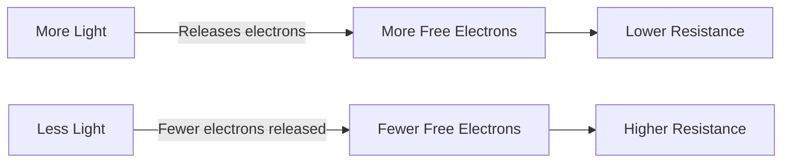
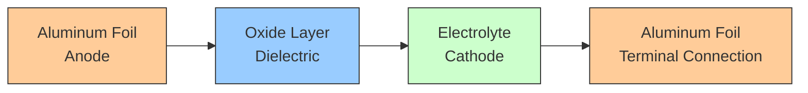
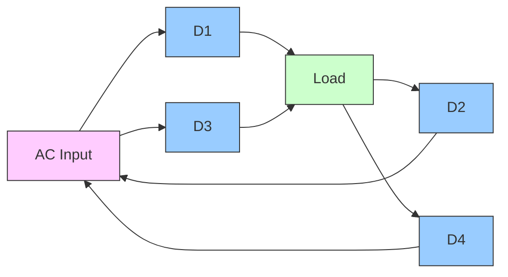
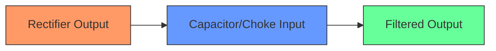
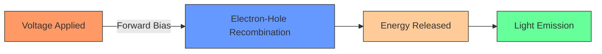
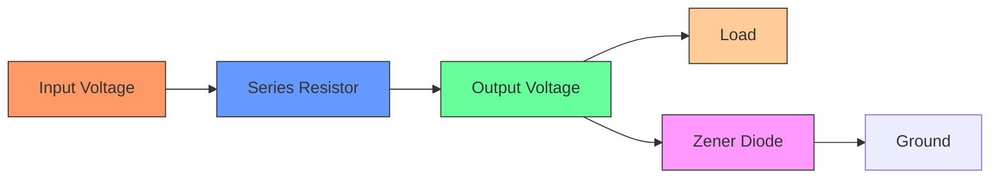
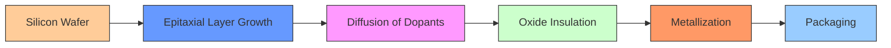
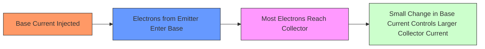
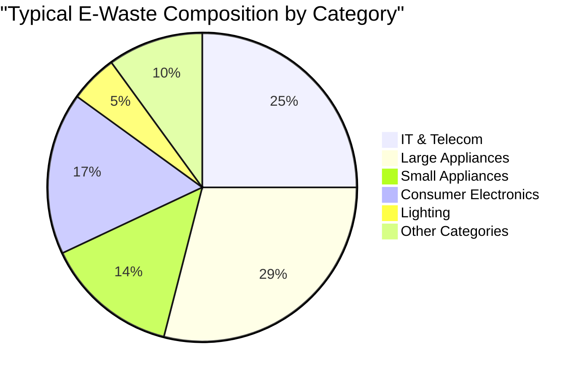
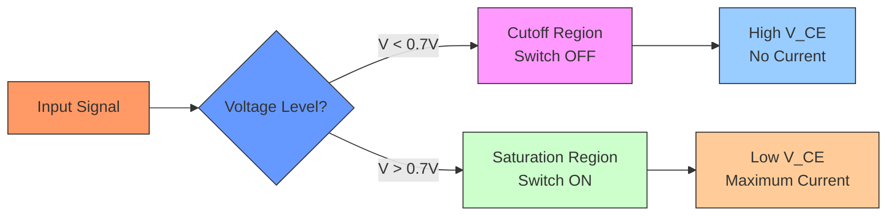

## પ્રશ્ન 1(a) [3 ગુણ]

**સક્રિય અને નિષ્ક્રિય ઘટકોને વ્યાખ્યાયિત કરો.**

**જવાબ**:

| સક્રિય ઘટકો | નિષ્ક્રિય ઘટકો |
|------------------|-------------------|
| • કામ કરવા માટે બાહ્ય પાવર સ્ત્રોતની જરૂર પડે છે | • બાહ્ય પાવર સ્ત્રોતની જરૂર પડતી નથી |
| • ઇલેક્ટ્રિકલ સિગ્નલને મોટા કરી શકે છે અને પ્રોસેસ કરી શકે છે | • સિગ્નલને મોટા કરી શકતા નથી અથવા પ્રોસેસ કરી શકતા નથી |
| • ઉદાહરણ: ટ્રાન્ઝિસ્ટર, ડાયોડ, ICs | • ઉદાહરણ: રેસિસ્ટર, કેપેસિટર, ઇન્ડક્ટર |

**મેમરી ટ્રીક:** "APE" - Active needs Power to Enhance signals

## પ્રશ્ન 1(b) [4 ગુણ]

**વપરાયેલ સામગ્રી પર આધારિત કેપેસિટરના પ્રકારો વર્ણવો.**

**જવાબ**:

**ટેબલ: સામગ્રી આધારિત કેપેસિટરના પ્રકારો**

| મટીરિયલ ટાઇપ | કેપેસિટર પ્રકાર | સામાન્ય ઉપયોગો |
|--------------|----------------|----------------------|
| સેરામિક | સેરામિક ડિસ્ક, મલ્ટિલેયર | બાયપાસ, કપલિંગ, હાઈ ફ્રીક્વન્સી |
| પ્લાસ્ટિક ફિલ્મ | પોલિએસ્ટર, પોલિપ્રોપિલીન, ટેફ્લોન | ટાઈમિંગ, ફિલ્ટરિંગ, પ્રીસિઝન |
| ઇલેક્ટ્રોલિટિક | એલ્યુમિનિયમ, ટેન્ટાલમ | પાવર સપ્લાય, DC બ્લોકિંગ, હાઈ કેપેસિટન્સ |
| પેપર | પેપર ડાયલેક્ટ્રિક | જૂના ઉપકરણોમાં, હવે સામાન્ય નથી |
| માઈકા | સિલ્વર્ડ માઈકા | હાઈ પ્રીસિઝન RF સર્કિટ્સ |
| ગ્લાસ | ગ્લાસ ડાયલેક્ટ્રિક | હાઈ વોલ્ટેજ એપ્લિકેશન |

**મેમરી ટ્રીક:** "CEPPMG" - Ceramic Electrolytic Paper Plastic Mica Glass

## પ્રશ્ન 1(c) [7 ગુણ]

**રેસિસ્ટર કલર કોડિંગ ટેકનિક ઉદાહરણ સાથે સમજાવો.**

**જવાબ**:

રેસિસ્ટર કલર કોડ રેસિસ્ટન્સ મૂલ્ય, ટોલરન્સ અને વિશ્વસનીયતા દર્શાવવા માટે રંગીન બેન્ડનો ઉપયોગ કરે છે.

**ટેબલ: સ્ટાન્ડર્ડ રેસિસ્ટર કલર કોડ**

| રંગ | અંક મૂલ્ય | મલ્ટિપ્લાયર | ટોલરન્સ |
|-------|------------|------------|-----------|
| કાળો | 0 | ×10⁰ (1) | - |
| બ્રાઉન | 1 | ×10¹ (10) | ±1% |
| લાલ | 2 | ×10² (100) | ±2% |
| નારંગી | 3 | ×10³ (1,000) | - |
| પીળો | 4 | ×10⁴ (10,000) | - |
| લીલો | 5 | ×10⁵ (100,000) | ±0.5% |
| વાદળી | 6 | ×10⁶ (1,000,000) | ±0.25% |
| વાયોલેટ | 7 | ×10⁷ (10,000,000) | ±0.1% |
| ગ્રે | 8 | ×10⁸ (100,000,000) | ±0.05% |
| સફેદ | 9 | ×10⁹ (1,000,000,000) | - |
| સોનેરી | - | ×0.1 (0.1) | ±5% |
| ચાંદી | - | ×0.01 (0.01) | ±10% |

**ઉદાહરણ 1:** લાલ-વાયોલેટ-નારંગી-સોનેરી

- 1લી બેન્ડ (લાલ) = 2
- 2જી બેન્ડ (વાયોલેટ) = 7
- 3જી બેન્ડ (નારંગી) = ×1,000
- 4થી બેન્ડ (સોનેરી) = ±5% ટોલરન્સ
- મૂલ્ય: 27 × 1,000 = 27,000Ω = 27kΩ ±5%

**ઉદાહરણ 2:** બ્રાઉન-બ્લેક-યલો-સિલ્વર

- 1લી બેન્ડ (બ્રાઉન) = 1
- 2જી બેન્ડ (બ્લેક) = 0
- 3જી બેન્ડ (યલો) = ×10,000
- 4થી બેન્ડ (સિલ્વર) = ±10% ટોલરન્સ
- મૂલ્ય: 10 × 10,000 = 100,000Ω = 100kΩ ±10%


**મેમરી ટ્રીક:** "BBROY Great Britain Very Good Wife" - કલર 0-9 માટે (Black Brown Red Orange Yellow Green Blue Violet Gray White)

## પ્રશ્ન 1(c) OR [7 ગુણ]

**LDR નું બાંધકામ, કાર્યકારી લાક્ષણિકતાઓ અને એપ્લિકેશન સમજાવો.**

**જવાબ**:

**લાઈટ ડિપેન્ડન્ટ રેસિસ્ટર (LDR)**

| પાસું | વર્ણન |
|--------|-------------|
| **બાંધકામ** | • સેમિકન્ડક્ટર મટીરિયલ (કેડમિયમ સલ્ફાઈડ) ઝિગઝેગ પેટર્નમાં ડિપોઝિટ<br>• પ્રકાશને પસાર થવા દેવા માટે પારદર્શક કેસમાં પેકેજિંગ<br>• સેમિકન્ડક્ટર સાથે બે ટર્મિનલ જોડાયેલા |
| **કાર્ય સિદ્ધાંત** | • જ્યારે પ્રકાશની તીવ્રતા વધે છે ત્યારે પ્રતિરોધ ઘટે છે<br>• ફોટોન્સ સેમિકન્ડક્ટર સામગ્રીમાં ઇલેક્ટ્રોન્સ મુક્ત કરે છે<br>• વધુ પ્રકાશ = વધુ મુક્ત ઇલેક્ટ્રોન્સ = ઓછો પ્રતિરોધ |
| **લાક્ષણિકતાઓ** | • અંધકારમાં ઉચ્ચ પ્રતિરોધ (MΩ રેન્જ)<br>• તેજ પ્રકાશમાં ઓછો પ્રતિરોધ (100-5000Ω)<br>• પ્રકાશની તીવ્રતા પ્રત્યે નોન-લીનિયર પ્રતિક્રિયા<br>• ધીમી પ્રતિક્રિયા સમય (દસ મિલિસેકન્ડ) |
| **ઉપયોગો** | • ઓટોમેટિક સ્ટ્રીટ લાઈટ્સ<br>• કેમેરામાં લાઈટ મીટર<br>• ચોર એલાર્મ સિસ્ટમ<br>• ડિસ્પ્લેમાં ઓટોમેટિક બ્રાઈટનેસ કંટ્રોલ |



**મેમરી ટ્રીક:** "MOLD" - More light On, Less resistance Down

## પ્રશ્ન 2(a) [3 ગુણ]

**સામગ્રીના આધારે રેસિસ્ટરને વર્ગીકૃત કરો.**

**જવાબ**:

**ટેબલ: સામગ્રી આધારિત રેસિસ્ટર વર્ગીકરણ**

| મટીરિયલ ટાઈપ | લાક્ષણિકતાઓ | ઉદાહરણો |
|--------------|-----------------|----------|
| કાર્બન કોમ્પોઝિશન | ઓછી કિંમત, નોઈઝી, નબળી ટોલરન્સ | સામાન્ય હેતુના રેસિસ્ટર |
| કાર્બન ફિલ્મ | કાર્બન કોમ્પોઝિશન કરતાં વધુ સારી સ્થિરતા | ઓડિયો ઉપકરણો, સામાન્ય સર્કિટ |
| મેટલ ફિલ્મ | ઉત્તમ સ્થિરતા, ઓછો નોઈઝ | પ્રિસિઝન સર્કિટ, ઈન્સ્ટ્રુમેન્ટેશન |
| મેટલ ઓક્સાઈડ | ઉચ્ચ સ્થિરતા, ગરમી પ્રતિરોધક | પાવર સપ્લાય, હાઈ વોલ્ટેજ સર્કિટ |
| વાયર વાઉન્ડ | ઉચ્ચ પાવર રેટિંગ, ઇન્ડક્ટિવ | પાવર સર્કિટ, હીટિંગ એલિમેન્ટ |
| થિક & થિન ફિલ્મ | નાના કદ, સારી સ્થિરતા | સરફેસ માઉન્ટ ઍપ્લિકેશન |

**મેમરી ટ્રીક:** "CMMWTF" - Carbon Makes Much Wire To Form resistors

## પ્રશ્ન 2(b) [4 ગુણ]

**આપેલ રંગ કોડ માટે રેસિસ્ટરની કિંમતની ગણતરી કરો. - (i) બ્રાઉન, બ્લેક, યલો, ગોલ્ડન (ii) યલો, વાયોલેટ, રેડ, સિલ્વર**

**જવાબ**:

**ભાગ (i): બ્રાઉન, બ્લેક, યલો, ગોલ્ડન**

- 1લી બેન્ડ (બ્રાઉન) = 1
- 2જી બેન્ડ (બ્લેક) = 0
- 3જી બેન્ડ (યલો) = ×10,000
- 4થી બેન્ડ (ગોલ્ડન) = ±5% ટોલરન્સ

**ગણતરી:**
મૂલ્ય = 10 × 10,000 = 100,000Ω = 100kΩ ±5%

**ભાગ (ii): યલો, વાયોલેટ, રેડ, સિલ્વર**

- 1લી બેન્ડ (યલો) = 4
- 2જી બેન્ડ (વાયોલેટ) = 7
- 3જી બેન્ડ (રેડ) = ×100
- 4થી બેન્ડ (સિલ્વર) = ±10% ટોલરન્સ

**ગણતરી:**
મૂલ્ય = 47 × 100 = 4,700Ω = 4.7kΩ ±10%

**મેમરી ટ્રીક:** "BBROY Great Britain Very Good Wife" રંગ અનુક્રમ 0-9 માટે

## પ્રશ્ન 2(c) [7 ગુણ]

**ઇલેક્ટ્રોલિટીક કેપેસિટર્સનું બાંધકામ અને સંચાલન સમજાવો.**

**જવાબ**:

**ઇલેક્ટ્રોલિટિક કેપેસિટર બાંધકામ અને કાર્યપ્રણાલી**

| ઘટક | વર્ણન |
|-----------|-------------|
| **એનોડ** | ઓક્સાઇડ લેયર (ડાયલેક્ટ્રિક) સાથે એલ્યુમિનિયમ અથવા ટેન્ટાલમ ફોઇલ |
| **કેથોડ** | ઇલેક્ટ્રોલાઇટ (લિક્વિડ, પેસ્ટ અથવા સોલિડ) અને મેટલ ફોઇલ |
| **સેપરેટર** | ઇલેક્ટ્રોલાઇટમાં ભીંજવેલું પેપર |
| **કેસિંગ** | ઇન્સ્યુલેટિંગ સ્લીવ સાથે એલ્યુમિનિયમ કેન |
| **ટર્મિનલ** | પોઝિટિવ (+) અને નેગેટિવ (-) લીડ્સ |

**કાર્યપ્રણાલી:**

1. એનોડ પર ઓક્સાઇડ લેયર અત્યંત પાતળા ડાયલેક્ટ્રિક તરીકે કાર્ય કરે છે
2. મોટા સરફેસ એરિયા અને પાતળા ડાયલેક્ટ્રિકથી ઉચ્ચ કેપેસિટન્સ બને છે
3. જ્યારે DC વોલ્ટેજ (યોગ્ય પોલારિટી સાથે) સાથે જોડાય છે, ત્યારે ચાર્જ એકત્રિત થાય છે
4. પોઝિટિવ પ્લેટ (+) નેગેટિવ ચાર્જને આકર્ષે છે; નેગેટિવ પ્લેટ (-) પોઝિટિવ ચાર્જને આકર્ષે છે



**મુખ્ય લાક્ષણિકતાઓ:**

- **પોલારિટી**: યોગ્ય રીતે જોડાવું જરૂરી (+/-)
- **ઉચ્ચ કેપેસિટન્સ**: 1μF થી હજારો μF
- **વોલ્ટેજ મર્યાદાઓ**: વધારે થવાથી બ્રેકડાઉન
- **લીકેજ કરંટ**: અન્ય કેપેસિટર પ્રકારો કરતાં વધારે

**મેમરી ટ્રીક:** "PAVE" - Polarized Aluminum with Very high capacitance and Electrolyte

## પ્રશ્ન 2(a) OR [3 ગુણ]

**રેક્ટિફાયરમાં ફિલ્ટર સર્કિટનું મહત્વ જણાવો.**

**જવાબ**:

**રેક્ટિફાયરમાં ફિલ્ટર સર્કિટનું મહત્વ**

| કાર્ય | વર્ણન |
|----------|-------------|
| **સ્મૂધિંગ** | રિપલ્સને ઘટાડીને પલ્સેટિંગ DCને સ્મૂધ DCમાં રૂપાંતરિત કરે છે |
| **વોલ્ટેજ સ્ટેબિલાઇઝેશન** | ઇનપુટ ફ્લક્ચુએશન છતાં સ્થિર આઉટપુટ વોલ્ટેજ જાળવે છે |
| **રિપલ રિડક્શન** | DC આઉટપુટમાં અનિચ્છનીય AC ઘટકોને ઘટાડે છે |
| **લોડ પ્રોટેક્શન** | વોલ્ટેજ વેરિએશનથી ઇલેક્ટ્રોનિક ઉપકરણોને સુરક્ષિત રાખે છે |

**મેમરી ટ્રીક:** "SVRL" - Smoothens Voltage by Reducing ripples for Load

## પ્રશ્ન 2(b) OR [4 ગુણ]

**P પ્રકાર સેમિકન્ડક્ટર અને N પ્રકાર સેમિકન્ડક્ટર વચ્ચે તફાવત કરો.**

**જવાબ**:

**ટેબલ: P-type vs N-type સેમિકન્ડક્ટર**

| લાક્ષણિકતા | P-type સેમિકન્ડક્ટર | N-type સેમિકન્ડક્ટર |
|----------------|----------------------|----------------------|
| **ડોપન્ટ વપરાશ** | ત્રિસંયોજક તત્વો (B, Al, Ga) | પંચસંયોજક તત્વો (P, As, Sb) |
| **મુખ્ય વાહકો** | હોલ્સ (પોઝિટિવ ચાર્જ વાહકો) | ઇલેક્ટ્રોન્સ (નેગેટિવ ચાર્જ વાહકો) |
| **ગૌણ વાહકો** | ઇલેક્ટ્રોન્સ | હોલ્સ |
| **વીજવાહકતા** | હોલ્સની ગતિને કારણે | ઇલેક્ટ્રોન્સની ગતિને કારણે |
| **ઊર્જા સ્તર** | વેલેન્સ બેન્ડ નજીક એક્સેપ્ટર એટમ | કન્ડક્શન બેન્ડ નજીક ડોનર એટમ |
| **ઇલેક્ટ્રિકલ ચાર્જ** | સમગ્ર ન્યૂટ્રલ, પરંતુ ઇલેક્ટ્રોન્સ સ્વીકારે છે | સમગ્ર ન્યૂટ્રલ, પરંતુ ઇલેક્ટ્રોન્સ દાન કરે છે |

**મેમરી ટ્રીક:** "HELP-NED" - Holes Exist in Large quantities in P-type, Negative Electrons Dominate N-type

## પ્રશ્ન 2(c) OR [7 ગુણ]

**વેવફોર્મ્સ સાથે બ્રિજ રેક્ટિફાયરનું કાર્ય સમજાવો.**

**જવાબ**:

**બ્રિજ રેક્ટિફાયર કાર્ય સિદ્ધાંત**

| ઘટક | કાર્ય |
|-----------|----------|
| **ડાયોડ્સ (D1-D4)** | બ્રિજ કોન્ફિગરેશનમાં ગોઠવાયેલ ચાર ડાયોડ |
| **ઇનપુટ** | ટ્રાન્સફોર્મર સેકન્ડરીથી AC વોલ્ટેજ |
| **આઉટપુટ** | લોડ રેસિસ્ટર પર પલ્સેટિંગ DC વોલ્ટેજ |
| **ઓપરેશન** | AC સાયકલના બંને અર્ધભાગને સમાન ધ્રુવતામાં રૂપાંતરિત કરે છે |

**પોઝિટિવ હાફ સાયકલમાં કાર્ય:**

- ડાયોડ D1 અને D3 કન્ડક્ટ કરે છે
- ડાયોડ D2 અને D4 રિવર્સ બાયસ્ડ (ઓફ) હોય છે
- કરંટ ફ્લો: AC+ → D1 → લોડ → D3 → AC-

**નેગેટિવ હાફ સાયકલમાં કાર્ય:**

- ડાયોડ D2 અને D4 કન્ડક્ટ કરે છે
- ડાયોડ D1 અને D3 રિવર્સ બાયસ્ડ (ઓફ) હોય છે
- કરંટ ફ્લો: AC- → D2 → લોડ → D4 → AC+



**વેવફોર્મ્સ:**

```goat
AC Input:      _/\      _/\      _/\      
              /    \   /    \   /    \   
    0 ______/      \_/      \_/      \__
             \    /   \    /   \    /
              \__/     \__/     \__/


DC Output:     _       _       _      
              / \     / \     / \     
    0 ______/   \___/   \___/   \_____
```

**ફાયદાઓ:**

- AC ઇનપુટના બંને અર્ધ સાયકલનો ઉપયોગ કરે છે
- હાફ-વેવની તુલનામાં ઉચ્ચ આઉટપુટ વોલ્ટેજ અને કાર્યક્ષમતા
- સેન્ટર-ટેપ્ડ ટ્રાન્સફોર્મરની જરૂર નથી

**મેમરી ટ્રીક:** "FBRO" - Four diodes, Both cycles, Rectified Output

## પ્રશ્ન 3(a) [3 ગુણ]

**વ્યાખ્યાયિત કરો (1) PIV (2) રિપલ ફેક્ટર.**

**જવાબ**:

| શબ્દ | વ્યાખ્યા |
|------|------------|
| **PIV (પીક ઇન્વર્સ વોલ્ટેજ)** | • રિવર્સ બાયસ સ્થિતિમાં ડાયોડ સહન કરી શકે તે મહત્તમ વોલ્ટેજ<br>• ડાયોડ બ્રેકડાઉન અટકાવવા માટે મહત્વની રેટિંગ<br>• સર્કિટમાં મહત્તમ રિવર્સ વોલ્ટેજ કરતાં ઉચ્ચ હોવું આવશ્યક |
| **રિપલ ફેક્ટર (r)** | • રેક્ટિફાયર ફિલ્ટરની અસરકારકતાનું માપ<br>• આઉટપુટમાં AC ઘટકના RMS મૂલ્યથી DC ઘટકના અનુપાત<br>• ઓછો રિપલ ફેક્ટર વધુ સારી ફિલ્ટરિંગ સૂચવે છે |

**ફોર્મ્યુલા:** રિપલ ફેક્ટર (r) = V₍ᵣₘₛ₎ₐ.ₖ / V₍ᵈᶜ₎

**મેમરી ટ્રીક:** "PIR" - Peak Inverse voltage Restricts, Ripple indicates Rectification quality

## પ્રશ્ન 3(b) [4 ગુણ]

**PN જંક્શન ડાયોડની VI લાક્ષણિકતાઓ સમજાવો.**

**જવાબ**:

**PN જંક્શન ડાયોડની V-I લાક્ષણિકતાઓ**

| ક્ષેત્ર | વર્તન | લાક્ષણિકતાઓ |
|--------|----------|-----------------|
| **ફોરવર્ડ બાયસ** | સરળતાથી કરંટ વહન કરે છે | • થ્રેશોલ્ડ પછી કરંટમાં એક્સપોનેન્શિયલ વધારો<br>• થ્રેશોલ્ડ વોલ્ટેજ: સિલિકોન માટે ~0.7V, જર્મેનિયમ માટે ~0.3V |
| **રિવર્સ બાયસ** | કરંટને અવરોધે છે | • ખૂબ નાનો લીકેજ કરંટ (μA)<br>• રિવર્સ બ્રેકડાઉન વોલ્ટેજ પર બ્રેકડાઉન |

```goat
         Current (I)
             ↑
             |              /
             |             /
             |            /
             |           /
             |          /
             |         /
             |        /
             |       /
    ---------|------/-------→ Voltage (V)
             |    0.7V
             |/
     ________|________________________
             |
             | Small leakage current
             |
             |        Breakdown
             |           ↓
             |           |
             |           |
```

**મુખ્ય પોઇન્ટ્સ:**

- **ફોરવર્ડ થ્રેશોલ્ડ**: Si માટે ~0.7V, Ge માટે ~0.3V
- **ફોરવર્ડ રિજન**: ઉચ્ચ કન્ડક્ટિવિટી
- **રિવર્સ રિજન**: ખૂબ ઉચ્ચ પ્રતિરોધ
- **બ્રેકડાઉન રિજન**: રિવર્સ કરંટમાં અચાનક વધારો

**મેમરી ટ્રીક:** "FBRL" - Forward Bias Resists Little, reverse blocks lots

## પ્રશ્ન 3(c) [7 ગુણ]

**તરંગ સ્વરૂપો સાથે કેપેસિટર ઇનપુટ અને ચોક ઇનપુટ ફિલ્ટરની કામગીરી સમજાવો.**

**જવાબ**:

**1. કેપેસિટર ઇનપુટ ફિલ્ટર**

| ઘટક | કાર્ય |
|-----------|----------|
| **કેપેસિટર** | લોડ રેસિસ્ટન્સ સાથે પેરેલલમાં જોડાયેલ |
| **કાર્ય સિદ્ધાંત** | • વોલ્ટેજના શિખર દરમિયાન ચાર્જ થાય છે<br>• વોલ્ટેજના ડિપ દરમિયાન ડિસ્ચાર્જ થાય છે<br>• ચાર્જના ભંડાર તરીકે કાર્ય કરે છે |
| **વેવફોર્મ્સ** | • રિપલ નોંધપાત્ર રીતે ઘટાડે છે<br>• આઉટપુટમાં થોડો ડિસ્ચાર્જ સ્લોપ હોય છે |

**ફાયદાઓ:**

- ઉચ્ચ DC આઉટપુટ વોલ્ટેજ
- સરળ અને આર્થિક
- સારું રિપલ રિડક્શન

**મર્યાદાઓ:**

- નબળું વોલ્ટેજ રેગ્યુલેશન
- ઉચ્ચ પીક ડાયોડ કરંટ
- ઓછા કરંટ એપ્લિકેશન માટે યોગ્ય

**2. ચોક ઇનપુટ ફિલ્ટર**

| ઘટક | કાર્ય |
|-----------|----------|
| **ઇન્ડક્ટર (ચોક)** | લોડ સાથે શ્રેણીમાં જોડાયેલ |
| **કેપેસિટર** | લોડ સાથે પેરેલલમાં જોડાયેલ |
| **કાર્ય સિદ્ધાંત** | • ઇન્ડક્ટર કરંટ પરિવર્તનનો વિરોધ કરે છે<br>• કેપેસિટર બાકીના રિપલને સ્મૂધ કરે છે |
| **વેવફોર્મ્સ** | • વધુ સતત કરંટ<br>• ઓછું પરંતુ વધુ સ્થિર આઉટપુટ વોલ્ટેજ |

**ફાયદાઓ:**

- વધુ સારું વોલ્ટેજ રેગ્યુલેશન
- ઓછા પીક ડાયોડ કરંટ
- ઉચ્ચ કરંટ એપ્લિકેશન માટે યોગ્ય

**મર્યાદાઓ:**

- ઓછું DC આઉટપુટ વોલ્ટેજ
- વધુ ખર્ચાળ
- કેપેસિટર ફિલ્ટર કરતાં વધુ મોટું



**વેવફોર્મ તુલના:**

```goat
Rectifier output:     __      __      __
                     /  \    /  \    /  \
                    /    \  /    \  /    \
           0 ______/      \/      \/      \____

Capacitor filter:    ___     ___     ___
                     \  \    \  \    \  \
                      \  \    \  \    \  \
           0 _________\__\____\__\____\__\____

Choke filter:         __________ __________
                     /          /
                    /          /
           0 ______/          /____________
```

**મેમરી ટ્રીક:** "VOICE" - Voltage Output Is Constant with Either filter, but choke gives better regulation

## પ્રશ્ન 3(a) OR [3 ગુણ]

**ઝેનર ડાયોડનું કાર્ય અને મહત્વ જણાવો.**

**જવાબ**:

**ઝેનર ડાયોડનું કાર્ય અને મહત્વ**

| કાર્ય | વર્ણન |
|----------|-------------|
| **વોલ્ટેજ રેગ્યુલેશન** | ઇનપુટ વેરિએશન છતાં સ્થિર આઉટપુટ વોલ્ટેજ જાળવે છે |
| **વોલ્ટેજ રેફરન્સ** | સર્કિટમાં ચોક્કસ રેફરન્સ વોલ્ટેજ પ્રદાન કરે છે |
| **વોલ્ટેજ પ્રોટેક્શન** | વોલ્ટેજ સ્પાઇક્સથી સર્કિટને નુકસાન થતું અટકાવે છે |
| **વોલ્ટેજ લિમિટિંગ** | સિગ્નલ વોલ્ટેજને પૂર્વનિર્ધારિત સ્તરે ક્લિપ કરે છે |
| **વેવફોર્મ ક્લિપિંગ** | વોલ્ટેજ સ્તરને મર્યાદિત કરીને વેવફોર્મ્સને આકાર આપે છે |

**મેમરી ટ્રીક:** "VPRVW" - Voltage Protection, Regulation, and Voltage Waveform control

## પ્રશ્ન 3(b) OR [4 ગુણ]

**પ્રકાશ ઉત્સર્જક ડાયોડ (LED) ને તેની લાક્ષણિકતા સાથે વર્ણવો.**

**જવાબ**:

**લાઈટ એમિટિંગ ડાયોડ (LED) લાક્ષણિકતાઓ**

| લાક્ષણિકતા | વર્ણન |
|----------------|-------------|
| **બાંધકામ** | • ડાયરેક્ટ બેન્ડગેપ સેમિકન્ડક્ટરથી બનેલું P-N જંક્શન<br>• સામાન્ય મટીરિયલ: GaAs, GaP, AlGaInP, InGaN |
| **કાર્ય સિદ્ધાંત** | • ઇલેક્ટ્રોલ્યુમિનિસન્સ: ઇલેક્ટ્રોન્સ હોલ્સ સાથે રિકોમ્બાઇન થાય છે<br>• ઊર્જા ફોટોન્સ (પ્રકાશ) તરીકે મુક્ત થાય છે |
| **ફોરવર્ડ વોલ્ટેજ** | • લાલ: 1.8-2.1V<br>• લીલો: 2.0-3.0V<br>• વાદળી/સફેદ: 3.0-3.5V |
| **ઉપલબ્ધ રંગો** | • સેમિકન્ડક્ટર મટીરિયલ પર આધારિત<br>• લાલ, લીલો, પીળો, વાદળી, સફેદ, IR, UV |
| **I-V લાક્ષણિકતાઓ** | • થ્રેશોલ્ડથી ઉપર ફોરવર્ડ બાયસ પર કન્ડક્ટ કરે છે<br>• કરંટ-મર્યાદિત રેસિસ્ટરની જરૂર પડે છે<br>• 5V ઉપરના રિવર્સ બાયસથી નુકસાન થાય છે |
| **ઉપયોગો** | • ઇન્ડિકેટર્સ, ડિસ્પ્લે, લાઇટિંગ, ઓપ્ટોકપલર્સ |



**મેમરી ટ્રીક:** "CRAVE" - Current Regulated And Voltage Emits light

## પ્રશ્ન 3(c) OR [7 ગુણ]

**કેપેસિટર ઇનપુટ અને ચોક ઇનપુટ ફિલ્ટરનું કાર્ય સમજાવો.**

**જવાબ**:

**કેપેસિટર ઇનપુટ ફિલ્ટર:**

| ઘટક | કાર્ય |
|-----------|----------|
| **સર્કિટ સ્ટ્રક્ચર** | લોડ સાથે પેરેલલમાં જોડાયેલ કેપેસિટર |
| **ઓપરેશન** | • કેપેસિટર પીક વોલ્ટેજ સુધી ચાર્જ થાય છે<br>• જ્યારે વોલ્ટેજ ઘટે છે ત્યારે લોડ દ્વારા ધીમે ધીમે ડિસ્ચાર્જ થાય છે<br>• ચાર્જના ભંડાર તરીકે કાર્ય કરે છે |
| **કામગીરી** | • સારું રિપલ રિડક્શન<br>• ઉચ્ચ આઉટપુટ વોલ્ટેજ<br>• વેરિંગ લોડ હેઠળ નબળું રેગ્યુલેશન |

**સર્કિટ ડાયાગ્રામ:**

```goat
    +------|>|------+
    |      D1       |
AC  |               | Load
In  |               | RL    +
    +------|<|------+-----||---+
    |      D2       |     C    |
    +---------------+----------+
```

**ચોક ઇનપુટ ફિલ્ટર:**

| ઘટક | કાર્ય |
|-----------|----------|
| **સર્કિટ સ્ટ્રક્ચર** | શ્રેણીમાં ઇન્ડક્ટર (ચોક), પેરેલલમાં કેપેસિટર |
| **ઓપરેશન** | • ઇન્ડક્ટર કરંટમાં ફેરફારનો વિરોધ કરે છે<br>• કરંટ પ્રવાહને સ્મૂધ કરે છે<br>• કેપેસિટર વધુ વોલ્ટેજ રિપલ્સને ફિલ્ટર કરે છે |
| **કામગીરી** | • વધુ સારું વોલ્ટેજ રેગ્યુલેશન<br>• ઓછું આઉટપુટ વોલ્ટેજ<br>• ઉચ્ચ-કરંટ એપ્લિકેશન માટે સારું |

**સર્કિટ ડાયાગ્રામ:**

```goat
    +------|>|------+
    |      D1       |
AC  |               +----LLLLL----+
In  |                     L       |
    +------|<|------+          RL +
    |      D2       |     C       |
    +---------------+----||-------+
```

**તુલના:**

| પેરામીટર | કેપેસિટર ઇનપુટ | ચોક ઇનપુટ |
|-----------|-----------------|-------------|
| **આઉટપુટ વોલ્ટેજ** | ઉચ્ચ (≈1.4Vm) | નીચું (≈0.9Vm) |
| **રિપલ ફેક્ટર** | ઉચ્ચ | નીચો |
| **વોલ્ટેજ રેગ્યુલેશન** | નબળું | સારું |
| **ડાયોડ કરંટ** | ઉચ્ચ પીક કરંટ | નીચા પીક કરંટ |
| **કિંમત & કદ** | ઓછી, નાનું | ઉચ્ચ, મોટું |
| **ઉપયોગો** | ઓછા કરંટની જરૂરિયાત | ઉચ્ચ કરંટની જરૂરિયાત |

**મેમરી ટ્રીક:** "CHEER" - Capacitor Holds Energy, inductor Ensures Regulated current

## પ્રશ્ન 4(a) [3 ગુણ]

**PN જંક્શન ડાયોડની લાક્ષણિકતાઓની ચર્ચા કરો.**

**જવાબ**:

**PN જંક્શન ડાયોડની લાક્ષણિકતાઓ**

| લાક્ષણિકતા | વર્ણન |
|----------------|-------------|
| **ફોરવર્ડ બાયસ** | • થ્રેશોલ્ડથી વધુ વોલ્ટેજ (Si માટે 0.7V, Ge માટે 0.3V) પર કન્ડક્ટ કરે છે<br>• વોલ્ટેજ સાથે કરંટ એક્સપોનેન્શિયલી વધે છે<br>• ઓછા રેઝિસ્ટન્સની સ્થિતિ |
| **રિવર્સ બાયસ** | • કરંટ પ્રવાહને અવરોધે છે<br>• નાનો લીકેજ કરંટ (μA)<br>• ઉચ્ચ રેઝિસ્ટન્સની સ્થિતિ |
| **બ્રેકડાઉન** | • ચોક્કસ રિવર્સ વોલ્ટેજ પર થાય છે<br>• કરંટ ઝડપથી વધે છે<br>• જો કરંટ મર્યાદિત ન હોય તો ડાયોડને નુકસાન થઈ શકે છે |
| **તાપમાનની અસરો** | • તાપમાન સાથે ફોરવર્ડ વોલ્ટેજ ઘટે છે<br>• દર 10°C પર રિવર્સ લીકેજ કરંટ બમણો થાય છે |
| **કેપેસિટન્સ** | • જંક્શન કેપેસિટન્સ લાગુ વોલ્ટેજ સાથે બદલાય છે<br>• ફોરવર્ડ બાયસમાં વધુ |

**મેમરી ટ્રીક:** "FRBCT" - Forward conducts, Reverse blocks, Breakdown destroys, Capacitance changes, Temperature affects

## પ્રશ્ન 4(b) [4 ગુણ]

**પી-એન જંક્શન ડાયોડ અને ઝેનર ડાયોડ વચ્ચે સરખામણી કરો.**

**જવાબ**:

**ટેબલ: P-N જંક્શન ડાયોડ vs. ઝેનર ડાયોડ**

| પેરામીટર | P-N જંક્શન ડાયોડ | ઝેનર ડાયોડ |
|-----------|-------------------|-------------|
| **સિમ્બોલ** | &#9654;&#9001; | &#9654;&#9001;&#9654; |
| **ફોરવર્ડ ઓપરેશન** | 0.7V ઉપર કન્ડક્ટ કરે છે | 0.7V ઉપર કન્ડક્ટ કરે છે (સમાન) |
| **રિવર્સ ઓપરેશન** | બ્રેકડાઉન સુધી કરંટને અવરોધે છે | નિયંત્રિત બ્રેકડાઉનમાં કાર્ય કરવા માટે ડિઝાઇન કરેલ છે |
| **બ્રેકડાઉન વોલ્ટેજ** | ઉચ્ચ, ચોક્કસ રીતે નિર્દિષ્ટ નથી | ઓછું, ચોક્કસ રીતે નિર્દિષ્ટ (2-200V) |
| **રિવર્સ બ્રેકડાઉન** | જો મર્યાદિત ન હોય તો વિનાશક | બિન-વિનાશક, કાર્ય માટે ઉપયોગમાં લેવાય છે |
| **ઉપયોગો** | રેક્ટિફિકેશન, સ્વિચિંગ | વોલ્ટેજ રેગ્યુલેશન, પ્રોટેક્શન |
| **ડોપિંગ લેવલ** | સામાન્ય ડોપિંગ | બ્રેકડાઉન નિયંત્રિત કરવા માટે ભારે ડોપિંગ |

**મેમરી ટ્રીક:** "FORBAR" - Forward Operation is Regular, Breakdown Application is the Real difference

## પ્રશ્ન 4(c) [7 ગુણ]

**વોલ્ટેજ રેગ્યુલેટર તરીકે ઝેનર ડાયોડનું કાર્ય સમજાવો.**

**જવાબ**:

**ઝેનર ડાયોડ અઝ વોલ્ટેજ રેગ્યુલેટર**

| ઘટક | કાર્ય |
|-----------|----------|
| **ઝેનર ડાયોડ** | બ્રેકડાઉન ક્ષેત્રમાં કોન્સ્ટન્ટ વોલ્ટેજ જાળવે છે |
| **સીરીઝ રેસિસ્ટર (Rs)** | કરંટને મર્યાદિત કરે છે અને વધારાના વોલ્ટેજને ડ્રોપ કરે છે |
| **લોડ રેસિસ્ટર (RL)** | પાવર આપવામાં આવેલ સર્કિટનું પ્રતિનિધિત્વ કરે છે |

**કાર્ય સિદ્ધાંત:**

1. ઝેનર ડાયોડ રિવર્સ બાયસમાં જોડાયેલ છે
2. જ્યારે ઇનપુટ વોલ્ટેજ ઝેનર વોલ્ટેજથી વધે છે, ત્યારે ડાયોડ કન્ડક્ટ કરે છે
3. વધારાનું વોલ્ટેજ સીરીઝ રેસિસ્ટર પર ડ્રોપ થાય છે
4. આઉટપુટ વોલ્ટેજ ઝેનર વોલ્ટેજ પર સ્થિર રહે છે



**સર્કિટ ડાયાગ્રામ:**

```goat
     +----[Rs]-----+-----+
     |             |     |
Vin  |             +    RL   Vout = Vz
     |             |     |
     +--------|>|--+-----+
              Zener
```

**રેગ્યુલેશન કેસિસ:**

| સ્થિતિ | પ્રતિક્રિયા |
|-----------|----------|
| **ઇનપુટ વોલ્ટેજ વધે છે** | • ઝેનર દ્વારા વધુ કરંટ<br>• Rs પર વધુ વોલ્ટેજ ડ્રોપ<br>• આઉટપુટ Vz પર રહે છે |
| **ઇનપુટ વોલ્ટેજ ઘટે છે** | • ઝેનર દ્વારા ઓછો કરંટ<br>• Rs પર ઓછો વોલ્ટેજ ડ્રોપ<br>• આઉટપુટ Vz પર રહે છે (લઘુત્તમ ઓપરેટિંગ વોલ્ટેજ સુધી) |
| **લોડ કરંટ વધે છે** | • ઝેનર દ્વારા ઓછો કરંટ<br>• લઘુત્તમ ઝેનર કરંટ સુધી આઉટપુટ વોલ્ટેજ સ્થિર |
| **લોડ કરંટ ઘટે છે** | • ઝેનર દ્વારા વધુ કરંટ<br>• આઉટપુટ વોલ્ટેજ સ્થિર રહે છે |

**મર્યાદાઓ:**

- ઝેનર અને Rs માં પાવર ડિસિપેશન
- લઘુત્તમ ઇનપુટ વોલ્ટેજની આવશ્યકતા (Vin > Vz + Rs પર વોલ્ટેજ ડ્રોપ)
- મર્યાદિત કરંટ ક્ષમતા

**મેમરી ટ્રીક:** "VISOR" - Voltage In Stays Out Regulated

## પ્રશ્ન 4(a) OR [3 ગુણ]

**ટ્રાન્ઝિસ્ટરની ટૂંકમાં ચર્ચા કરો.**

**જવાબ**:

**ટ્રાન્ઝિસ્ટર ઓવરવ્યુ**

| પાસું | વર્ણન |
|--------|-------------|
| **વ્યાખ્યા** | • ઇલેક્ટ્રિકલ સિગ્નલને એમ્પ્લિફાય/સ્વિચ કરતું સેમિકન્ડક્ટર ડિવાઇસ<br>• ત્રણ-ટર્મિનલ ડિવાઇસ: એમિટર, બેઝ, કલેક્ટર |
| **પ્રકારો** | • બાયપોલર જંક્શન ટ્રાન્ઝિસ્ટર (BJT): NPN, PNP<br>• ફીલ્ડ ઇફેક્ટ ટ્રાન્ઝિસ્ટર (FET): JFET, MOSFET |
| **કાર્ય સિદ્ધાંત** | • કરંટ/વોલ્ટેજ નિયંત્રિત ડિવાઇસ<br>• નાના બેઝ કરંટ મોટા કલેક્ટર કરંટને નિયંત્રિત કરે છે (BJT)<br>• ગેટ વોલ્ટેજ ચેનલ કન્ડક્ટિવિટી નિયંત્રિત કરે છે (FET) |
| **ઉપયોગો** | • એમ્પ્લિફિકેશન: ઓડિયો, RF, પાવર<br>• સ્વિચિંગ: ડિજિટલ સર્કિટ<br>• ઓસિલેટર્સ અને સિગ્નલ જનરેશન |
| **મહત્વ** | • આધુનિક ઇલેક્ટ્રોનિક્સનો પાયો<br>• ઇલેક્ટ્રોનિક ડિવાઇસના મિનિએચરાઇઝેશનને શક્ય બનાવ્યું |

**મેમરી ટ્રીક:** "TAWAI" - Transistors Amplify, Work As switches, and are Integral to electronics

## પ્રશ્ન 4(b) OR [4 ગુણ]

**ટ્રાન્ઝિસ્ટર એમ્પલીફાયર માટે α અને β વચ્ચેનો સંબંધ મેળવો.**

**જવાબ**:

**α અને β વચ્ચેનો સંબંધ**

| પેરામીટર | વ્યાખ્યા | ફોર્મ્યુલા |
|-----------|------------|---------|
| **α (આલ્ફા)** | • કોમન બેઝ (CB) કરંટ ગેઇન<br>• કલેક્ટર કરંટ અને એમિટર કરંટનો ગુણોત્તર | α = I<sub>C</sub>/I<sub>E</sub> |
| **β (બીટા)** | • કોમન એમિટર (CE) કરંટ ગેઇન<br>• કલેક્ટર કરંટ અને બેઝ કરંટનો ગુણોત્તર | β = I<sub>C</sub>/I<sub>B</sub> |

**ડેરિવેશન સ્ટેપ્સ:**

1. આપણે જાણીએ છીએ કે એમિટર કરંટ બેઝ અને કલેક્ટર કરંટનો સરવાળો છે:
   I<sub>E</sub> = I<sub>B</sub> + I<sub>C</sub>

2. આલ્ફા વ્યાખ્યા:
   α = I<sub>C</sub>/I<sub>E</sub>

3. બીટા વ્યાખ્યા:
   β = I<sub>C</sub>/I<sub>B</sub>

4. સ્ટેપ 1થી, આપણે લખી શકીએ:
   I<sub>B</sub> = I<sub>E</sub> - I<sub>C</sub>

5. બીટા વ્યાખ્યામાં સબ્સ્ટિટ્યુશન:
   β = I<sub>C</sub>/(I<sub>E</sub> - I<sub>C</sub>)

6. આલ્ફા વ્યાખ્યાનો ઉપયોગ કરીને, I<sub>C</sub> = α × I<sub>E</sub>:
   β = (α × I<sub>E</sub>)/(I<sub>E</sub> - α × I<sub>E</sub>)

7. સરળીકરણ:
   β = α/(1 - α)

8. તેનાથી વિપરીત, આપણે α ને β ના સંદર્ભમાં પણ વ્યક્ત કરી શકીએ:
   α = β/(β + 1)

**સંબંધ ટેબલ:**

| α (આલ્ફા) | β (બીટા) |
|-----------|----------|
| 0.9 | 9 |
| 0.95 | 19 |
| 0.98 | 49 |
| 0.99 | 99 |
| 0.995 | 199 |

**મેમરી ટ્રીક:** "ABR" - Alpha and Beta are Related by α = β/(β+1) or β = α/(1-α)

## પ્રશ્ન 4(c) OR [7 ગુણ]

**NPN અને PNP ટ્રાન્ઝિસ્ટરનું બાંધકામ વિગતવાર સમજાવો.**

**જવાબ**:

**NPN અને PNP ટ્રાન્ઝિસ્ટરનું બાંધકામ**

| પેરામીટર | NPN ટ્રાન્ઝિસ્ટર | PNP ટ્રાન્ઝિસ્ટર |
|-----------|----------------|----------------|
| **સ્ટ્રક્ચર** | • N-પ્રકાર (એમિટર)<br>• P-પ્રકાર (બેઝ)<br>• N-પ્રકાર (કલેક્ટર) | • P-પ્રકાર (એમિટર)<br>• N-પ્રકાર (બેઝ)<br>• P-પ્રકાર (કલેક્ટર) |
| **સિમ્બોલ** |  |  |
| **મટીરિયલ** | • સિલિકોન અથવા જર્મેનિયમ<br>• એમિટર: ભારે ડોપ્ડ N-પ્રકાર<br>• બેઝ: હળવા ડોપ્ડ P-પ્રકાર<br>• કલેક્ટર: મધ્યમ ડોપ્ડ N-પ્રકાર | • સિલિકોન અથવા જર્મેનિયમ<br>• એમિટર: ભારે ડોપ્ડ P-પ્રકાર<br>• બેઝ: હળવા ડોપ્ડ N-પ્રકાર<br>• કલેક્ટર: મધ્યમ ડોપ્ડ P-પ્રકાર |
| **જાડાઈ** | • બેઝ: ખૂબ જ પાતળી (1-10 μm)<br>• કલેક્ટર: સૌથી જાડી ક્ષેત્ર | • બેઝ: ખૂબ જ પાતળી (1-10 μm)<br>• કલેક્ટર: સૌથી જાડી ક્ષેત્ર |
| **ડોપિંગ લેવલ** | • એમિટર: સૌથી ઊંચું<br>• બેઝ: સૌથી નીચું<br>• કલેક્ટર: મધ્યમ | • એમિટર: સૌથી ઊંચું<br>• બેઝ: સૌથી નીચું<br>• કલેક્ટર: મધ્યમ |

**NPN ટ્રાન્ઝિસ્ટર બાંધકામ:**

```goat
    Emitter (N)   Base (P)   Collector (N)
       |            |            |
       v            v            v
    +------+     +---+     +----------+
    |  N+  |     | P |     |    N     |
    +------+     +---+     +----------+
       |           |           |
       |           |           |
       E           B           C
```

**PNP ટ્રાન્ઝિસ્ટર બાંધકામ:**

```goat
    Emitter (P)   Base (N)   Collector (P)
       |            |            |
       v            v            v
    +------+     +---+     +----------+
    |  P+  |     | N |     |    P     |
    +------+     +---+     +----------+
       |           |           |
       |           |           |
       E           B           C
```

**મેન્યુફેક્ચરિંગ પ્રોસેસ:**

1. સેમિકન્ડક્ટર સબસ્ટ્રેટ (N અથવા P પ્રકાર) થી શરૂ કરો
2. એપિટેક્ષિયલ ગ્રોથ દ્વારા લેયર્સ બનાવો
3. ડિફ્યુઝન અથવા આયન ઇમ્પ્લાન્ટેશન દ્વારા જંક્શન બનાવો
4. ટર્મિનલ્સ માટે મેટલ કોન્ટેક્ટ્સ ઉમેરો
5. પ્રોટેક્ટિવ કેસમાં પેકેજિંગ કરો



**મેમરી ટ્રીક:** "ENB-CPM" - Emitter has N in NPN, Collector is Proportionally Medium-doped

## પ્રશ્ન 5(a) [3 ગુણ]

**ટૂંકમાં ઈ-વેસ્ટ સમજાવો.**

**જવાબ**:

**ઇલેક્ટ્રોનિક વેસ્ટ (ઈ-વેસ્ટ)**

| પાસું | વર્ણન |
|--------|-------------|
| **વ્યાખ્યા** | • ફેંકી દીધેલા ઇલેક્ટ્રોનિક ઉપકરણો અને સાધનો<br>• મૂલ્યવાન સામગ્રી અને જોખમી પદાર્થો બંને ધરાવે છે |
| **સ્ત્રોતો** | • કોમ્પ્યુટર, ફોન, ટીવી, ઉપકરણો<br>• સર્કિટ બોર્ડ, બેટરી, ડિસ્પ્લે<br>• ઓફિસ ઉપકરણો, મેડિકલ ડિવાઇસ |
| **ચિંતાઓ** | • ઝેરી પદાર્થો (લેડ, મર્ક્યુરી, કેડમિયમ) ધરાવે છે<br>• અયોગ્ય રીતે ડિસ્પોઝ કરવાથી પર્યાવરણ પ્રદૂષણ<br>• માનવ અને વન્યજીવન માટે આરોગ્ય જોખમો |
| **મહત્વ** | • વિશ્વમાં સૌથી ઝડપથી વધતો કચરાનો પ્રવાહ<br>• સંસાધન પુનઃપ્રાપ્તિની ક્ષમતા (સોનું, ચાંદી, તાંબું)<br>• વિશિષ્ટ હેન્ડલિંગની જરૂર |

**મેમરી ટ્રીક:** "TECH" - Toxic Electronics Create Hazards when improperly disposed

## પ્રશ્ન 5(b) [4 ગુણ]

**આકૃતિ સાથે NPN ટ્રાન્ઝિસ્ટરની કામગીરી સમજાવો.**

**જવાબ**:

**NPN ટ્રાન્ઝિસ્ટર ઓપરેશન**

**સિમ્બોલ અને બેસિક ઓપરેશન:**

```goat
      Collector (C)
          |
          |
          v
    +-----+-----+
    |     |     |
    |    / \    |
Base|---|   |---| Collector
(B) |    \ /    |
    |     |     |
    +-----+-----+
          |
          |
          v
       Emitter (E)
```

**બેસિક ઓપરેટિંગ પ્રિન્સિપલ:**

- બેઝ-એમિટર જંક્શન ફોરવર્ડ બાયસ્ડ છે
- બેઝ-કલેક્ટર જંક્શન રિવર્સ બાયસ્ડ છે
- નાનો બેઝ કરંટ મોટા કલેક્ટર કરંટને નિયંત્રિત કરે છે

| ઓપરેટિંગ મોડ | બાયસિંગ સ્થિતિઓ | વર્ણન |
|----------------|-------------------|-------------|
| **એક્ટિવ મોડ** | • B-E: ફોરવર્ડ બાયસ્ડ<br>• B-C: રિવર્સ બાયસ્ડ | • સામાન્ય એમ્પ્લિફિકેશન મોડ<br>• I<sub>C</sub> = β × I<sub>B</sub> |
| **કટઓફ મોડ** | • B-E: રિવર્સ બાયસ્ડ<br>• B-C: રિવર્સ બાયસ્ડ | • ટ્રાન્ઝિસ્ટર OFF<br>• કોઈ કલેક્ટર કરંટ નહીં |
| **સેચુરેશન મોડ** | • B-E: ફોરવર્ડ બાયસ્ડ<br>• B-C: ફોરવર્ડ બાયસ્ડ | • ટ્રાન્ઝિસ્ટર પૂરો ON<br>• મહત્તમ કલેક્ટર કરંટ |



**NPN ટ્રાન્ઝિસ્ટરમાં કરંટ ફ્લો:**

- ઇલેક્ટ્રોન્સ એમિટરથી કલેક્ટર તરફ વહે છે
- નાનો બેઝ કરંટ મોટા કલેક્ટર કરંટને નિયંત્રિત કરે છે
- એમ્પ્લિફિકેશન ફેક્ટર (β) = I<sub>C</sub>/I<sub>B</sub>

**મેમરી ટ્રીક:** "BECAN" - Base current Enables Collector-to-emitter current Amplification in NPN

## પ્રશ્ન 5(c) [7 ગુણ]

**ઇનપુટ અને આઉટપુટ લાક્ષણિકતાઓ સાથે ટ્રાન્ઝિસ્ટરનું કોમન એમિટર (CE) રૂપરેખાંકન સમજાવો.**

**જવાબ**:

**કોમન એમિટર (CE) કોન્ફિગરેશન**

| ઘટક | વર્ણન |
|-----------|-------------|
| **સર્કિટ કોન્ફિગરેશન** | • એમિટર ઇનપુટ અને આઉટપુટ બંને માટે કોમન છે<br>• બેઝ અને એમિટર વચ્ચે ઇનપુટ<br>• કલેક્ટર અને એમિટર વચ્ચે આઉટપુટ |
| **ઇનપુટ પેરામીટર્સ** | • બેઝ કરંટ (I<sub>B</sub>)<br>• બેઝ-એમિટર વોલ્ટેજ (V<sub>BE</sub>) |
| **આઉટપુટ પેરામીટર્સ** | • કલેક્ટર કરંટ (I<sub>C</sub>)<br>• કલેક્ટર-એમિટર વોલ્ટેજ (V<sub>CE</sub>) |

**સર્કિટ ડાયાગ્રામ:**

```goat
                 +Vcc
                   |
                   |
                  RL
                   |
                   |
    +-----+    +---o--- Vout
    |     |    |   |
Vin o-----o----|B  C
    |     |    |   |
    RB    |    |   |
    |     |    |E  |
    |     |    |   |
    +-----+----+---o--- GND
                   |
                  RE
                   |
                   +
```

**ઇનપુટ લાક્ષણિકતાઓ:**

- વિવિધ V<sub>CE</sub> મૂલ્યો માટે I<sub>B</sub> vs V<sub>BE</sub> પ્લોટ કરે છે
- ફોરવર્ડ-બાયસ્ડ ડાયોડ લાક્ષણિકતા જેવું દેખાય છે
- સિલિકોન ટ્રાન્ઝિસ્ટર માટે થ્રેશોલ્ડ વોલ્ટેજ ~0.7V

```goat
    IB (μA)
      ↑
      |                /
      |               /
      |              /
      |             /
      |            /
      |           /
      |          /
      |         /
    --|--------/---------------→ VBE (V)
      |     0.7V
```

**આઉટપુટ લાક્ષણિકતાઓ:**

- વિવિધ I<sub>B</sub> મૂલ્યો માટે I<sub>C</sub> vs V<sub>CE</sub> પ્લોટ કરે છે
- ત્રણ ક્ષેત્રો બતાવે છે: એક્ટિવ, સેચુરેશન, કટઓફ

```goat
    IC (mA)
      ↑
      |                 ________ IB = 50μA
      |                /
      |               /________ IB = 40μA
      |              /
      |             /_________ IB = 30μA
      |            /
      |           /__________ IB = 20μA
      |          /
      |         /____________ IB = 10μA
      |        /
      |       /
    --|------/-------------------→ VCE (V)
      |  Saturation│  Active
      |  Region    │  Region
```

**લાક્ષણિકતાઓ:**

- કરંટ ગેઇન (β) = I<sub>C</sub>/I<sub>B</sub> (સામાન્ય રીતે 50-200)
- ઇનપુટ રેઝિસ્ટન્સ: 1-2 kΩ
- આઉટપુટ રેઝિસ્ટન્સ: 40-50 kΩ
- ફેઝ શિફ્ટ: ઇનપુટ અને આઉટપુટ વચ્ચે 180°

**મેમરી ટ્રીક:** "CASIO" - Common emitter Amplifies Signals with Inverted Output

## પ્રશ્ન 5(a) OR [3 ગુણ]

**ઈ-કચરાના પ્રકારો જણાવો.**

**જવાબ**:

**ઇલેક્ટ્રોનિક વેસ્ટ (ઈ-વેસ્ટ) ના પ્રકારો**

| કેટેગરી | ઉદાહરણો |
|----------|----------|
| **IT & ટેલિકોમ્યુનિકેશન** | • કોમ્પ્યુટર, લેપટોપ, પ્રિન્ટર<br>• મોબાઇલ ફોન, ટેબ્લેટ<br>• સર્વર, નેટવર્કિંગ ઇક્વિપમેન્ટ |
| **કન્ઝ્યુમર ઇલેક્ટ્રોનિક્સ** | • ટીવી, મોનિટર, ઓડિયો ઇક્વિપમેન્ટ<br>• DVD/બ્લુ-રે પ્લેયર<br>• કેમેરા, વિડિયો રેકોર્ડર |
| **હોમ એપ્લાયન્સિસ** | • રેફ્રિજરેટર, વોશિંગ મશીન<br>• માઇક્રોવેવ ઓવન, એર કન્ડિશનર<br>• નાના રસોડાના ઉપકરણો |
| **લાઇટિંગ ઇક્વિપમેન્ટ** | • ફ્લોરસન્ટ લેમ્પ, LED લાઇટ્સ<br>• હાઈ-ઇન્ટેન્સિટી ડિસ્ચાર્જ લેમ્પ |
| **ઇલેક્ટ્રિકલ & ઇલેક્ટ્રોનિક ટૂલ્સ** | • ડ્રિલ, સૉ, સોલ્ડરિંગ ઇક્વિપમેન્ટ<br>• લૉન મોવર, ગાર્ડનિંગ ટૂલ્સ |
| **મેડિકલ ડિવાઇસિસ** | • ડાયગ્નોસ્ટિક ઇક્વિપમેન્ટ<br>• ટ્રીટમેન્ટ ઇક્વિપમેન્ટ<br>• લેબ ઇક્વિપમેન્ટ |
| **મોનિટરિંગ ઇન્સ્ટ્રુમેન્ટ્સ** | • સ્મોક ડિટેક્ટર<br>• થર્મોસ્ટેટ<br>• કંટ્રોલ પેનલ |
| **ઇલેક્ટ્રોનિક કોમ્પોનન્ટ્સ** | • સર્કિટ બોર્ડ<br>• બેટરી<br>• કેબલ અને વાયર |

**મેમરી ટ્રીક:** "CLIMATE" - Computing, Lighting, Industrial, Medical, Appliances, Telecommunications, Electronic components

## પ્રશ્ન 5(b) OR [4 ગુણ]

**ઇલેક્ટ્રોનિક્સ વેસ્ટની વિવિધ શ્રેણીઓનું વર્ણન કરો.**

**જવાબ**:

**ઇલેક્ટ્રોનિક વેસ્ટની શ્રેણીઓ**

| શ્રેણી | વર્ણન | ઉદાહરણો |
|----------|-------------|----------|
| **મોટા ઘરેલુ ઉપકરણો** | • ભારે આઇટમ ઉચ્ચ ધાતુ સામગ્રી સાથે<br>• અક્સર રેફ્રિજરન્ટ ધરાવે છે | • રેફ્રિજરેટર, ફ્રીઝર<br>• વોશિંગ મશીન<br>• એર કન્ડિશનર |
| **નાના ઘરેલુ ઉપકરણો** | • પોર્ટેબલ ઘરેલુ ડિવાઇસ<br>• મિશ્ર સામગ્રી કમ્પોઝિશન | • વેક્યુમ ક્લીનર<br>• ટોસ્ટર, કોફી મશીન<br>• ઇલેક્ટ્રિક પંખા |
| **IT & ટેલિકોમ ઇક્વિપમેન્ટ** | • ડેટા પ્રોસેસિંગ/કોમ્યુનિકેશન ડિવાઇસ<br>• ઉચ્ચ કિંમતી ધાતુ સામગ્રી | • કોમ્પ્યુટર, લેપટોપ<br>• પ્રિન્ટર, કોપિંગ ઇક્વિપમેન્ટ<br>• મોબાઇલ ફોન, ટેલિકોમ ઇક્વિપમેન્ટ |
| **કન્ઝ્યુમર ઇક્વિપમેન્ટ** | • મનોરંજન/મીડિયા ડિવાઇસ<br>• અક્સર ડિસ્પ્લે સ્ક્રીન સાથે | • ટીવી, મોનિટર<br>• ઓડિયો/વિડિયો ઇક્વિપમેન્ટ<br>• મ્યુઝિકલ ઇન્સ્ટ્રુમેન્ટ |
| **લાઇટિંગ ઇક્વિપમેન્ટ** | • મર્ક્યુરી અને અન્ય ધાતુઓ ધરાવે છે<br>• વિશેષ હેન્ડલિંગની જરૂર | • ફ્લોરસન્ટ લેમ્પ<br>• હાઈ-ઇન્ટેન્સિટી ડિસ્ચાર્જ લેમ્પ<br>• LED લાઇટિંગ |
| **ઇલેક્ટ્રિકલ & ઇલેક્ટ્રોનિક ટૂલ્સ** | • પોર્ટેબલ અથવા ફિક્સ્ડ પાવર ટૂલ્સ<br>• ઊંચી મોટર સામગ્રી | • ડ્રિલ, સૉ<br>• સિલાઈ મશીન<br>• બાંધકામ ઉપકરણો |
| **ટોય્સ & સ્પોર્ટ્સ ઇક્વિપમેન્ટ** | • ઇલેક્ટ્રોનિક રમતો અને મનોરંજન આઇટમ<br>• મિશ્ર પ્લાસ્ટિક અને ઇલેક્ટ્રોનિક ઘટકો | • વિડિયો ગેમ કન્સોલ<br>• ઇલેક્ટ્રિક ટ્રેન/રેસિંગ સેટ<br>• ઇલેક્ટ્રોનિક્સ સાથે એક્સરસાઇઝ ઇક્વિપમેન્ટ |
| **મેડિકલ ડિવાઇસિસ** | • વિશિષ્ટ હેલ્થકેર ઇક્વિપમેન્ટ<br>• અક્સર મૂલ્યવાન અને જોખમી સામગ્રી ધરાવે છે | • ડાયગ્નોસ્ટિક ઇક્વિપમેન્ટ<br>• રેડિએશન થેરાપી ઇક્વિપમેન્ટ<br>• લેબોરેટરી ઇક્વિપમેન્ટ |



**મેમરી ટ્રીક:** "LIMCEST" - Large appliances, IT equipment, Medical devices, Consumer electronics, Electronic tools, Small appliances, Telecom equipment

## પ્રશ્ન 5(c) OR [7 ગુણ]

**ટ્રાન્ઝિસ્ટરને કટઓફ અને સંતૃત્તિ પ્રદેશમાં સ્વિચ તરીકે સમજાવો.**

**જવાબ**:

**ટ્રાન્ઝિસ્ટર એઝ એ સ્વિચ**

| પ્રદેશ | સ્થિતિ | સ્થિતિઓ | લાક્ષણિકતાઓ |
|--------|-------|------------|-----------------|
| **કટઓફ પ્રદેશ** | OFF | • V<sub>BE</sub> < 0.7V<br>• I<sub>B</sub> ≈ 0 | • I<sub>C</sub> ≈ 0<br>• V<sub>CE</sub> ≈ V<sub>CC</sub><br>• ઉચ્ચ ઇમ્પીડન્સ |
| **સેચુરેશન પ્રદેશ** | ON | • V<sub>BE</sub> > 0.7V<br>• I<sub>B</sub> > I<sub>C</sub>/β | • I<sub>C</sub> ≈ I<sub>C(sat)</sub><br>• V<sub>CE</sub> ≈ 0.2V<br>• ઓછો ઇમ્પીડન્સ |

**સર્કિટ ડાયાગ્રામ:**

```goat
                  +Vcc
                    |
                    |
                    R
                    |
                    |
                    C
           +--------+--------+
           |                 |
Input o----+----[RB]----+B   |
           |        |E  |    |
           |        |   |    |
           +--------+---+----o Output
                    |
                    |
                   GND
```

**કટઓફ ઓપરેશન (OFF સ્ટેટ):**

- ઇનપુટ વોલ્ટેજ 0.7V કરતાં નીચે છે (સામાન્ય રીતે 0V)
- બેઝ-એમિટર જંક્શન ફોરવર્ડ બાયસ્ડ નથી
- કોઈ બેઝ કરંટ વહેતો નથી (I<sub>B</sub> ≈ 0)
- કોઈ કલેક્ટર કરંટ વહેતો નથી (I<sub>C</sub> ≈ 0)
- કલેક્ટર-એમિટર વોલ્ટેજ લગભગ V<sub>CC</sub> છે
- ટ્રાન્ઝિસ્ટર ઓપન સ્વિચ તરીકે કાર્ય કરે છે

**સેચુરેશન ઓપરેશન (ON સ્ટેટ):**

- ઇનપુટ વોલ્ટેજ 0.7V થી ઉપર છે
- બેઝ-એમિટર જંક્શન ફોરવર્ડ બાયસ્ડ છે
- પૂરતો બેઝ કરંટ વહે છે (I<sub>B</sub> > I<sub>C</sub>/β)
- કલેક્ટર કરંટ મહત્તમ સ્તરે પહોંચે છે (I<sub>C(sat)</sub>)
- કલેક્ટર-એમિટર વોલ્ટેજ લઘુત્તમ થઈ જાય છે (V<sub>CE(sat)</sub> ≈ 0.2V)
- ટ્રાન્ઝિસ્ટર ક્લોઝ્ડ સ્વિચ તરીકે કાર્ય કરે છે



**ઉપયોગો:**

- ડિજિટલ લોજિક સર્કિટ
- રિલે અને મોટર ડ્રાઇવર
- LED અને લેમ્પ કંટ્રોલ
- પાવર કન્વર્ટર
- સિગ્નલ કન્ડિશનિંગ

**મુખ્ય ડિઝાઇન વિચારણાઓ:**

- બેઝ રેસિસ્ટર (R<sub>B</sub>) બેઝ કરંટને મર્યાદિત કરે છે
- કલેક્ટર રેસિસ્ટર (R<sub>C</sub>) કલેક્ટર કરંટને મર્યાદિત કરે છે
- વિશ્વસનીય સ્વિચિંગ માટે સેચુરેશનમાં I<sub>B</sub> > I<sub>C</sub>/β હોવું જરૂરી છે
- ઝડપી સ્વિચિંગ માટે ચાર્જ સ્ટોરેજ ઇફેક્ટ્સનું ધ્યાન રાખવું જરૂરી છે

**મેમરી ટ્રીક:** "COSVL" - Cutoff means Off State with Vce Large, saturation means low Vce
