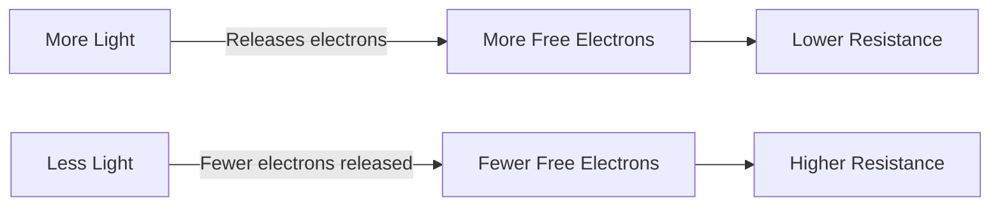
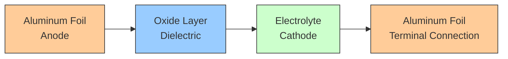
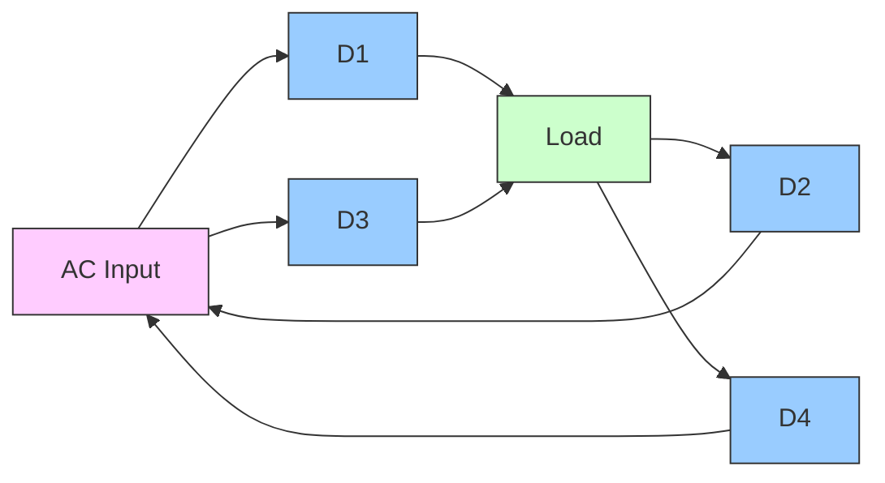
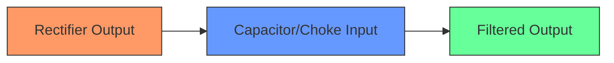
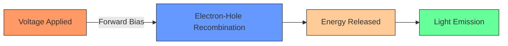
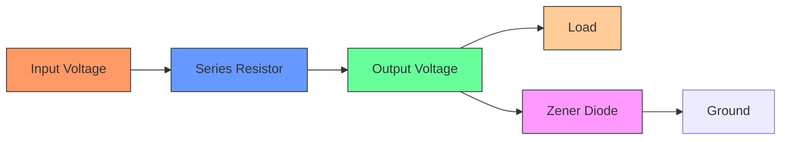
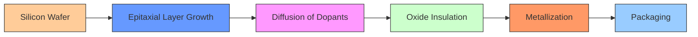
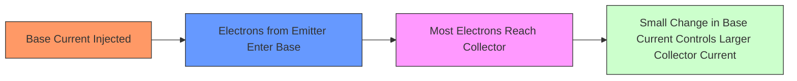
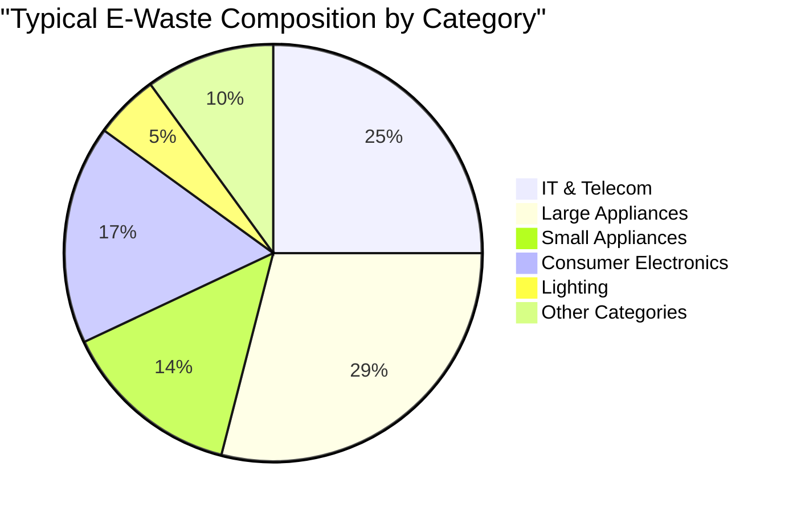
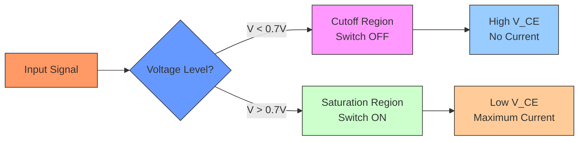

## Question 1(a) [3 marks]

**Define Active and Passive components.**

**Answer**:

| Active Components | Passive Components |
|------------------|-------------------|
| • Require external power source to operate | • Do not need external power source |
| • Can amplify and process electrical signals | • Cannot amplify or process signals |
| • Examples: transistors, diodes, ICs | • Examples: resistors, capacitors, inductors |

**Mnemonic:** "APE" - Active needs Power to Enhance signals

## Question 1(b) [4 marks]

**State types of capacitors based on materials used.**

**Answer**:

**Table: Types of Capacitors Based on Materials**

| Material Type | Capacitor Type | Typical Applications |
|--------------|----------------|----------------------|
| Ceramic | Ceramic disc, multilayer | Bypass, coupling, high frequency |
| Plastic Film | Polyester, Polypropylene, Teflon | Timing, filtering, precision |
| Electrolytic | Aluminum, Tantalum | Power supply, DC blocking, high capacitance |
| Paper | Paper dielectric | Old equipment, not common now |
| Mica | Silvered mica | High precision RF circuits |
| Glass | Glass dielectric | High voltage applications |

**Mnemonic:** "CEPPMG" - Ceramic Electrolytic Paper Plastic Mica Glass

## Question 1(c) [7 marks]

**Explain resistor color coding technique with example.**

**Answer**:

The resistor color code uses colored bands to indicate resistance value, tolerance, and reliability.

**Table: Standard Resistor Color Code**

| Color | Digit Value | Multiplier | Tolerance |
|-------|------------|------------|-----------|
| Black | 0 | ×10⁰ (1) | - |
| Brown | 1 | ×10¹ (10) | ±1% |
| Red | 2 | ×10² (100) | ±2% |
| Orange | 3 | ×10³ (1,000) | - |
| Yellow | 4 | ×10⁴ (10,000) | - |
| Green | 5 | ×10⁵ (100,000) | ±0.5% |
| Blue | 6 | ×10⁶ (1,000,000) | ±0.25% |
| Violet | 7 | ×10⁷ (10,000,000) | ±0.1% |
| Grey | 8 | ×10⁸ (100,000,000) | ±0.05% |
| White | 9 | ×10⁹ (1,000,000,000) | - |
| Gold | - | ×0.1 (0.1) | ±5% |
| Silver | - | ×0.01 (0.01) | ±10% |

**Example 1:** Red-Violet-Orange-Gold

- 1st band (Red) = 2
- 2nd band (Violet) = 7
- 3rd band (Orange) = ×1,000
- 4th band (Gold) = ±5% tolerance
- Value: 27 × 1,000 = 27,000Ω = 27kΩ ±5%

**Example 2:** Brown-Black-Yellow-Silver

- 1st band (Brown) = 1
- 2nd band (Black) = 0
- 3rd band (Yellow) = ×10,000
- 4th band (Silver) = ±10% tolerance
- Value: 10 × 10,000 = 100,000Ω = 100kΩ ±10%


**Mnemonic:** "BBROY Great Britain Very Good Wife" for colors 0-9 (Black Brown Red Orange Yellow Green Blue Violet Gray White)

## Question 1(c) OR [7 marks]

**Explain construction, working Characteristic and application of LDR.**

**Answer**:

**Light Dependent Resistor (LDR)**

| Aspect | Description |
|--------|-------------|
| **Construction** | • Semiconductor material (cadmium sulfide) deposited in zigzag pattern<br>• Packaged in transparent case to allow light exposure<br>• Two terminals connected to the semiconductor |
| **Working Principle** | • Resistance decreases when light intensity increases<br>• Photons release electrons in semiconductor material<br>• More light = more free electrons = lower resistance |
| **Characteristics** | • High resistance in darkness (MΩ range)<br>• Low resistance in bright light (100-5000Ω)<br>• Non-linear response to light intensity<br>• Slow response time (tens of milliseconds) |
| **Applications** | • Automatic street lights<br>• Light meters in cameras<br>• Burglar alarm systems<br>• Automatic brightness control in displays |



**Mnemonic:** "MOLD" - More light On, Less resistance Down

## Question 2(a) [3 marks]

**Classify Resistors based on materials.**

**Answer**:

**Table: Resistor Classification Based on Materials**

| Material Type | Characteristics | Examples |
|--------------|-----------------|----------|
| Carbon Composition | Low cost, noisy, poor tolerance | General purpose resistors |
| Carbon Film | Better stability than carbon composition | Audio equipment, general circuits |
| Metal Film | Excellent stability, low noise | Precision circuits, instrumentation |
| Metal Oxide | High stability, heat resistant | Power supplies, high-voltage circuits |
| Wire Wound | High power rating, inductive | Power circuits, heating elements |
| Thick & Thin Film | Small size, good stability | Surface mount applications |

**Mnemonic:** "CMMWTF" - Carbon Makes Much Wire To Form resistors

## Question 2(b) [4 marks]

**Calculate value of resistor for a given color code. – (i) Brown, Black, Yellow, Golden (ii) Yellow, Violet, Red, Silver**

**Answer**:

**Part (i): Brown, Black, Yellow, Golden**

- 1st Band (Brown) = 1
- 2nd Band (Black) = 0
- 3rd Band (Yellow) = ×10,000
- 4th Band (Golden) = ±5% tolerance

**Calculation:**
Value = 10 × 10,000 = 100,000Ω = 100kΩ ±5%

**Part (ii): Yellow, Violet, Red, Silver**

- 1st Band (Yellow) = 4
- 2nd Band (Violet) = 7
- 3rd Band (Red) = ×100
- 4th Band (Silver) = ±10% tolerance

**Calculation:**
Value = 47 × 100 = 4,700Ω = 4.7kΩ ±10%

**Mnemonic:** "BBROY Great Britain Very Good Wife" for the color sequence 0-9

## Question 2(c) [7 marks]

**Illustrate construction and operation of Electrolytic capacitors.**

**Answer**:

**Electrolytic Capacitor Construction and Operation**

| Component | Description |
|-----------|-------------|
| **Anode** | Aluminum or tantalum foil with oxide layer (dielectric) |
| **Cathode** | Electrolyte (liquid, paste or solid) and metal foil |
| **Separator** | Paper soaked in electrolyte |
| **Casing** | Aluminum can with insulating sleeve |
| **Terminals** | Positive (+) and negative (-) leads |

**Operation Principle:**

1. The oxide layer on the anode acts as an extremely thin dielectric
2. The large surface area and thin dielectric create high capacitance
3. When connected to DC voltage (with correct polarity), charges accumulate
4. Positive plate (+) attracts negative charges; negative plate (-) attracts positive charges



**Key Characteristics:**

- **Polarity**: Must be connected correctly (+/-)
- **High capacitance**: 1μF to thousands of μF
- **Voltage limitations**: Breakdown if exceeded
- **Leakage current**: Higher than other capacitor types

**Mnemonic:** "PAVE" - Polarized Aluminum with Very high capacitance and Electrolyte

## Question 2(a) OR [3 marks]

**State the importance of filter circuit in rectifier.**

**Answer**:

**Importance of Filter Circuit in Rectifier**

| Function | Description |
|----------|-------------|
| **Smoothing** | Converts pulsating DC to smooth DC by reducing ripples |
| **Voltage Stabilization** | Maintains steady output voltage despite input fluctuations |
| **Ripple Reduction** | Decreases unwanted AC components in DC output |
| **Load Protection** | Protects electronic devices from voltage variations |

**Mnemonic:** "SVRL" - Smoothens Voltage by Reducing ripples for Load

## Question 2(b) OR [4 marks]

**Differentiate between P type semiconductor and N type semiconductor.**

**Answer**:

**Table: P-type vs N-type Semiconductor**

| Characteristic | P-type Semiconductor | N-type Semiconductor |
|----------------|----------------------|----------------------|
| **Dopant used** | Trivalent elements (B, Al, Ga) | Pentavalent elements (P, As, Sb) |
| **Majority carriers** | Holes (positive charge carriers) | Electrons (negative charge carriers) |
| **Minority carriers** | Electrons | Holes |
| **Conductivity** | Due to movement of holes | Due to movement of electrons |
| **Energy level** | Acceptor atoms near valence band | Donor atoms near conduction band |
| **Electrical charge** | Overall neutral, but accepts electrons | Overall neutral, but donates electrons |

**Mnemonic:** "HELP-NED" - Holes Exist in Large quantities in P-type, Negative Electrons Dominate N-type

## Question 2(c) OR [7 marks]

**Illustrate working of Bridge Rectifier with waveforms.**

**Answer**:

**Bridge Rectifier Working Principle**

| Component | Function |
|-----------|----------|
| **Diodes (D1-D4)** | Four diodes arranged in bridge configuration |
| **Input** | AC voltage from transformer secondary |
| **Output** | Pulsating DC voltage across load resistor |
| **Operation** | Converts both halves of AC cycle to same polarity |

**Working in Positive Half Cycle:**

- Diodes D1 and D3 conduct
- Diodes D2 and D4 are reverse biased (off)
- Current flows: AC+ → D1 → Load → D3 → AC-

**Working in Negative Half Cycle:**

- Diodes D2 and D4 conduct
- Diodes D1 and D3 are reverse biased (off)
- Current flows: AC- → D2 → Load → D4 → AC+



**Waveforms:**

```goat
AC Input:      _/\      _/\      _/\      
              /    \   /    \   /    \   
    0 ______/      \_/      \_/      \__
             \    /   \    /   \    /
              \__/     \__/     \__/


DC Output:     _       _       _      
              / \     / \     / \     
    0 ______/   \___/   \___/   \_____
```

**Advantages:**

- Utilizes both half cycles of AC input
- Higher output voltage and efficiency compared to half-wave
- No center-tapped transformer required

**Mnemonic:** "FBRO" - Four diodes, Both cycles, Rectified Output

## Question 3(a) [3 marks]

**Define (1) PIV (2) Ripple Factor.**

**Answer**:

| Term | Definition |
|------|------------|
| **PIV (Peak Inverse Voltage)** | • Maximum voltage a diode can withstand in reverse bias condition<br>• Important rating to prevent diode breakdown<br>• Must be higher than maximum reverse voltage in circuit |
| **Ripple Factor (r)** | • Measure of effectiveness of a rectifier filter<br>• Ratio of RMS value of AC component to DC component in output<br>• Lower ripple factor indicates better filtering |

**Formula:** Ripple Factor (r) = V₍ᵣₘₛ₎ₐ.ₖ / V₍ᵈᶜ₎

**Mnemonic:** "PIR" - Peak Inverse voltage Restricts, Ripple indicates Rectification quality

## Question 3(b) [4 marks]

**Illustrate VI characteristics of PN junction diode.**

**Answer**:

**V-I Characteristics of PN Junction Diode**

| Region | Behavior | Characteristics |
|--------|----------|-----------------|
| **Forward Bias** | Conducts current easily | • Exponential increase in current after threshold<br>• Threshold voltage: ~0.7V for silicon, ~0.3V for germanium |
| **Reverse Bias** | Blocks current | • Very small leakage current (μA)<br>• Breakdown at reverse breakdown voltage |

```goat
         Current (I)
             ↑
             |              /
             |             /
             |            /
             |           /
             |          /
    ---------|--------/-----→ Voltage (V)
             |    0.7V
             |/
     ________|________________________
             |
             | Small leakage current
             |
             |        Breakdown
             |           ↓
             |           |
             |           |
```

**Key Points:**

- **Forward threshold**: ~0.7V for Si, ~0.3V for Ge
- **Forward region**: High conductivity
- **Reverse region**: Very high resistance
- **Breakdown region**: Sudden increase in reverse current

**Mnemonic:** "FBRL" - Forward Bias Resists Little, reverse blocks lots

## Question 3(c) [7 marks]

**Explain the working of capacitor input and choke input filter with waveforms.**

**Answer**:

**1. Capacitor Input Filter**

| Component | Function |
|-----------|----------|
| **Capacitor** | Connected in parallel with load resistance |
| **Working Principle** | • Charges during voltage peaks<br>• Discharges during voltage dips<br>• Acts as charge reservoir |
| **Waveforms** | • Reduces ripple significantly<br>• Output has slight discharge slope |

**Advantages:**

- Higher DC output voltage
- Simple and economical
- Good ripple reduction

**Limitations:**

- Poor voltage regulation
- High peak diode currents
- Suitable for low current applications

**2. Choke Input Filter**

| Component | Function |
|-----------|----------|
| **Inductor (Choke)** | Connected in series with load |
| **Capacitor** | Connected in parallel with load |
| **Working Principle** | • Inductor opposes current changes<br>• Capacitor smooths remaining ripples |
| **Waveforms** | • More constant current<br>• Lower but more stable output voltage |

**Advantages:**

- Better voltage regulation
- Lower peak diode currents
- Suitable for high current applications

**Limitations:**

- Lower DC output voltage
- More expensive
- Bulkier than capacitor filter



**Waveform Comparison:**

```goat
Rectifier output:     __      __      __
                     /  \    /  \    /  \
                    /    \  /    \  /    \
           0 ______/      \/      \/      \____

Capacitor filter:    ___     ___     ___
                     \  \    \  \    \  \
                      \  \    \  \    \  \
           0 __________\__\____\__\____\__\____

Choke filter:         __________ __________
                     /          /
                    /          /
           0 ______/          /____________
```

**Mnemonic:** "VOICE" - Voltage Output Is Constant with Either filter, but choke gives better regulation

## Question 3(a) OR [3 marks]

**State the function and importance of Zener diode.**

**Answer**:

**Function and Importance of Zener Diode**

| Function | Description |
|----------|-------------|
| **Voltage Regulation** | Maintains constant output voltage despite input variations |
| **Voltage Reference** | Provides precise reference voltage in circuits |
| **Voltage Protection** | Prevents voltage spikes from damaging circuits |
| **Voltage Limiting** | Clips signal voltages to predetermined levels |
| **Waveform Clipping** | Shapes waveforms by limiting voltage levels |

**Mnemonic:** "VPRVW" - Voltage Protection, Regulation, and Voltage Waveform control

## Question 3(b) OR [4 marks]

**Describe Light emitting diode (LED) with its characteristic.**

**Answer**:

**Light Emitting Diode (LED) Characteristics**

| Characteristic | Description |
|----------------|-------------|
| **Construction** | • P-N junction made from direct bandgap semiconductors<br>• Common materials: GaAs, GaP, AlGaInP, InGaN |
| **Working Principle** | • Electroluminescence: electrons recombine with holes<br>• Energy released as photons (light) |
| **Forward Voltage** | • Red: 1.8-2.1V<br>• Green: 2.0-3.0V<br>• Blue/White: 3.0-3.5V |
| **Colors Available** | • Depends on semiconductor material<br>• Red, green, yellow, blue, white, IR, UV |
| **I-V Characteristics** | • Conducts when forward biased above threshold<br>• Requires current-limiting resistor<br>• Damaged by reverse bias above 5V |
| **Applications** | • Indicators, displays, lighting, optocouplers |



**Mnemonic:** "CRAVE" - Current Regulated And Voltage Emits light

## Question 3(c) OR [7 marks]

**Illustrate the working of capacitor input and choke input filter.**

**Answer**:

**Capacitor Input Filter:**

| Component | Function |
|-----------|----------|
| **Circuit Structure** | Capacitor connected in parallel with load |
| **Operation** | • Capacitor charges to peak voltage<br>• Discharges slowly through load when voltage drops<br>• Acts as reservoir of charge |
| **Performance** | • Good ripple reduction<br>• Higher output voltage<br>• Poor regulation under varying loads |

**Circuit Diagram:**

```goat
    +------|>|------+
    |      D1       |
AC  |               | Load
In  |               | RL    +
    +------|<|------+-----||---+
    |      D2       |     C    |
    +---------------+----------+
```

**Choke Input Filter:**

| Component | Function |
|-----------|----------|
| **Circuit Structure** | Inductor (choke) in series, capacitor in parallel |
| **Operation** | • Inductor opposes change in current<br>• Smooths current flow<br>• Capacitor further filters voltage ripples |
| **Performance** | • Better voltage regulation<br>• Lower output voltage<br>• Good for high-current applications |

**Circuit Diagram:**

```goat
    +------|>|------+
    |      D1       |
AC  |               +----LLLLL----+
In  |                     L       |
    +------|<|------+          RL +
    |      D2       |     C       |
    +---------------+----||-------+
```

**Comparison:**

| Parameter | Capacitor Input | Choke Input |
|-----------|-----------------|-------------|
| **Output Voltage** | Higher (≈1.4Vm) | Lower (≈0.9Vm) |
| **Ripple Factor** | Higher | Lower |
| **Voltage Regulation** | Poor | Good |
| **Diode Current** | High peak currents | Lower peak currents |
| **Cost & Size** | Lower, smaller | Higher, larger |
| **Applications** | Low current needs | High current needs |

**Mnemonic:** "CHEER" - Capacitor Holds Energy, inductor Ensures Regulated current

## Question 4(a) [3 marks]

**Discuss characteristics of PN junction diode.**

**Answer**:

**Characteristics of PN Junction Diode**

| Characteristic | Description |
|----------------|-------------|
| **Forward Bias** | • Conducts when voltage > threshold (0.7V for Si, 0.3V for Ge)<br>• Current increases exponentially with voltage<br>• Low resistance state |
| **Reverse Bias** | • Blocks current flow<br>• Small leakage current (μA)<br>• High resistance state |
| **Breakdown** | • Occurs at specific reverse voltage<br>• Current increases rapidly<br>• Can damage diode if current not limited |
| **Temperature Effects** | • Forward voltage decreases with temperature<br>• Reverse leakage current doubles every 10°C |
| **Capacitance** | • Junction capacitance varies with applied voltage<br>• Higher in forward bias |

**Mnemonic:** "FRBCT" - Forward conducts, Reverse blocks, Breakdown destroys, Capacitance changes, Temperature affects

## Question 4(b) [4 marks]

**Compare between P-N junction diode and Zener diode.**

**Answer**:

**Table: P-N Junction Diode vs. Zener Diode**

| Parameter | P-N Junction Diode | Zener Diode |
|-----------|-------------------|-------------|
| **Symbol** | &#9654;&#9001; | &#9654;&#9001;&#9654; |
| **Forward Operation** | Conducts above 0.7V | Conducts above 0.7V (similar) |
| **Reverse Operation** | Blocks current until breakdown | Designed to operate in controlled breakdown |
| **Breakdown Voltage** | Higher, not specified precisely | Lower, precisely specified (2-200V) |
| **Reverse Breakdown** | Destructive if not limited | Non-destructive, used for operation |
| **Applications** | Rectification, switching | Voltage regulation, protection |
| **Doping Level** | Normal doping | Heavily doped to control breakdown |

**Mnemonic:** "FORBAR" - Forward Operation is Regular, Breakdown Application is the Real difference

## Question 4(c) [7 marks]

**Illustrate the function of Zener diode as a voltage regulator.**

**Answer**:

**Zener Diode as Voltage Regulator**

| Component | Function |
|-----------|----------|
| **Zener Diode** | Maintains constant voltage in breakdown region |
| **Series Resistor (Rs)** | Limits current and drops excess voltage |
| **Load Resistor (RL)** | Represents the circuit being powered |

**Working Principle:**

1. Zener diode is connected in reverse bias
2. When input voltage rises above Zener voltage, diode conducts
3. Excess voltage is dropped across series resistor
4. Output voltage remains constant at Zener voltage



**Circuit Diagram:**

```goat
     +----[Rs]-----+----+
     |             |    |
Vin  |             +   RL   Vout = Vz
     |             |    |
     +--------|>|--+----+
              Zener
```

**Regulation Cases:**

| Condition | Response |
|-----------|----------|
| **Input Voltage Increases** | • More current through Zener<br>• More voltage dropped across Rs<br>• Output remains at Vz |
| **Input Voltage Decreases** | • Less current through Zener<br>• Less voltage dropped across Rs<br>• Output remains at Vz (until minimum operating voltage) |
| **Load Current Increases** | • Less current through Zener<br>• Output voltage stable until minimum Zener current |
| **Load Current Decreases** | • More current through Zener<br>• Output voltage remains stable |

**Limitations:**

- Power dissipation in Zener and Rs
- Minimum input voltage requirement (Vin > Vz + Voltage drop across Rs)
- Limited current capability

**Mnemonic:** "VISOR" - Voltage In Stays Out Regulated

## Question 4(a) OR [3 marks]

**Discuss transistor in brief.**

**Answer**:

**Transistor Overview**

| Aspect | Description |
|--------|-------------|
| **Definition** | • Semiconductor device that amplifies/switches electrical signals<br>• Three-terminal device: emitter, base, collector |
| **Types** | • Bipolar Junction Transistor (BJT): NPN, PNP<br>• Field Effect Transistor (FET): JFET, MOSFET |
| **Working Principle** | • Current/voltage controlled device<br>• Small base current controls larger collector current (BJT)<br>• Gate voltage controls channel conductivity (FET) |
| **Applications** | • Amplification: audio, RF, power<br>• Switching: digital circuits<br>• Oscillators and signal generation |
| **Importance** | • Foundation of modern electronics<br>• Enabled miniaturization of electronic devices |

**Mnemonic:** "TAWAI" - Transistors Amplify, Work As switches, and are Integral to electronics

## Question 4(b) OR [4 marks]

**Derive relation between α and β for transistor amplifier.**

**Answer**:

**Relation Between α and β**

| Parameter | Definition | Formula |
|-----------|------------|---------|
| **α (Alpha)** | • Common Base (CB) current gain<br>• Ratio of collector current to emitter current | α = I<sub>C</sub>/I<sub>E</sub> |
| **β (Beta)** | • Common Emitter (CE) current gain<br>• Ratio of collector current to base current | β = I<sub>C</sub>/I<sub>B</sub> |

**Derivation Steps:**

1. We know that emitter current is the sum of base and collector currents:
   I<sub>E</sub> = I<sub>B</sub> + I<sub>C</sub>

2. Alpha definition:
   α = I<sub>C</sub>/I<sub>E</sub>

3. Beta definition:
   β = I<sub>C</sub>/I<sub>B</sub>

4. From step 1, we can write:
   I<sub>B</sub> = I<sub>E</sub> - I<sub>C</sub>

5. Substituting into beta definition:
   β = I<sub>C</sub>/(I<sub>E</sub> - I<sub>C</sub>)

6. Using alpha definition, I<sub>C</sub> = α × I<sub>E</sub>:
   β = (α × I<sub>E</sub>)/(I<sub>E</sub> - α × I<sub>E</sub>)

7. Simplifying:
   β = α/(1 - α)

8. Conversely, we can also express α in terms of β:
   α = β/(β + 1)

**Relationship Table:**

| α (Alpha) | β (Beta) |
|-----------|----------|
| 0.9 | 9 |
| 0.95 | 19 |
| 0.98 | 49 |
| 0.99 | 99 |
| 0.995 | 199 |

**Mnemonic:** "ABR" - Alpha and Beta are Related by α = β/(β+1) or β = α/(1-α)

## Question 4(c) OR [7 marks]

**Explain in detail the construction of NPN and PNP transistor.**

**Answer**:

**Construction of NPN and PNP Transistors**

| Parameter | NPN Transistor | PNP Transistor |
|-----------|----------------|----------------|
| **Structure** | • N-type (Emitter)<br>• P-type (Base)<br>• N-type (Collector) | • P-type (Emitter)<br>• N-type (Base)<br>• P-type (Collector) |
| **Symbol** |  |  |
| **Materials** | • Silicon or Germanium<br>• Emitter: Heavily doped N-type<br>• Base: Lightly doped P-type<br>• Collector: Moderately doped N-type | • Silicon or Germanium<br>• Emitter: Heavily doped P-type<br>• Base: Lightly doped N-type<br>• Collector: Moderately doped P-type |
| **Thickness** | • Base: Very thin (1-10 μm)<br>• Collector: Thickest region | • Base: Very thin (1-10 μm)<br>• Collector: Thickest region |
| **Doping Level** | • Emitter: Highest<br>• Base: Lowest<br>• Collector: Medium | • Emitter: Highest<br>• Base: Lowest<br>• Collector: Medium |

**NPN Transistor Construction:**

```goat
    Emitter (N)   Base (P)   Collector (N)
       |            |            |
       v            v            v
    +------+     +---+     +----------+
    |  N+  |     | P |     |    N     |
    +------+     +---+     +----------+
       |           |           |
       |           |           |
       E           B           C
```

**PNP Transistor Construction:**

```goat
    Emitter (P)   Base (N)   Collector (P)
       |            |            |
       v            v            v
    +------+     +---+     +----------+
    |  P+  |     | N |     |    P     |
    +------+     +---+     +----------+
       |           |           |
       |           |           |
       E           B           C
```

**Manufacturing Process:**

1. Start with semiconductor substrate (N or P type)
2. Create layers through epitaxial growth
3. Form junctions through diffusion or ion implantation
4. Add metal contacts for terminals
5. Package in protective case



**Mnemonic:** "ENB-CPM" - Emitter has N in NPN, Collector is Proportionally Medium-doped

## Question 5(a) [3 marks]

**Explain e-waste in brief.**

**Answer**:

**Electronic Waste (E-Waste)**

| Aspect | Description |
|--------|-------------|
| **Definition** | • Discarded electronic devices and equipment<br>• Contains both valuable materials and hazardous substances |
| **Sources** | • Computers, phones, TVs, appliances<br>• Circuit boards, batteries, displays<br>• Office equipment, medical devices |
| **Concerns** | • Contains toxic materials (lead, mercury, cadmium)<br>• Environmental contamination if improperly disposed<br>• Health risks to humans and wildlife |
| **Importance** | • Fastest growing waste stream globally<br>• Resource recovery potential (gold, silver, copper)<br>• Requires specialized handling |

**Mnemonic:** "TECH" - Toxic Electronics Create Hazards when improperly disposed

## Question 5(b) [4 marks]

**Illustrate operation of NPN transistor with figure.**

**Answer**:

**NPN Transistor Operation**

**Symbol and Basic Operation:**

```goat
       Collector (C)
           |
           |
           v
     +-----+-----+
     |     |     |
     |    / \    |
Base |---|   |---| Collector
(B)  |    \ /    |
     |     |     |
     +-----+-----+
           |
           |
           v
        Emitter (E)
```

**Basic Operating Principle:**

- Base-Emitter junction is forward biased
- Base-Collector junction is reverse biased
- Small base current controls larger collector current

| Operating Mode | Biasing Conditions | Description |
|----------------|-------------------|-------------|
| **Active Mode** | • B-E: Forward biased<br>• B-C: Reverse biased | • Normal amplification mode<br>• I<sub>C</sub> = β × I<sub>B</sub> |
| **Cutoff Mode** | • B-E: Reverse biased<br>• B-C: Reverse biased | • Transistor OFF<br>• No collector current |
| **Saturation Mode** | • B-E: Forward biased<br>• B-C: Forward biased | • Transistor fully ON<br>• Maximum collector current |



**Current Flow in NPN Transistor:**

- Electrons flow from emitter to collector
- Small base current controls larger collector current
- Amplification factor (β) = I<sub>C</sub>/I<sub>B</sub>

**Mnemonic:** "BECAN" - Base current Enables Collector-to-emitter current Amplification in NPN

## Question 5(c) [7 marks]

**Illustrate common emitter (CE) configuration of Transistor with input and output characteristics.**

**Answer**:

**Common Emitter (CE) Configuration**

| Component | Description |
|-----------|-------------|
| **Circuit Configuration** | • Emitter is common to both input and output<br>• Input between base and emitter<br>• Output between collector and emitter |
| **Input Parameters** | • Base current (I<sub>B</sub>)<br>• Base-emitter voltage (V<sub>BE</sub>) |
| **Output Parameters** | • Collector current (I<sub>C</sub>)<br>• Collector-emitter voltage (V<sub>CE</sub>) |

**Circuit Diagram:**

```goat
                 +Vcc
                   |
                   |
                  RL
                   |
                   |
    +-----+    +---o--- Vout
    |     |    |   |
Vin o-----o----|B  C
    |     |    |   |
    RB    |    |   |
    |     |    |E  |
    |     |    |   |
    +-----+----+---o--- GND
                   |
                  RE
                   |
                   +
```

**Input Characteristics:**

- Plots I<sub>B</sub> vs V<sub>BE</sub> for different V<sub>CE</sub> values
- Resembles forward-biased diode characteristic
- Threshold voltage ~0.7V for silicon transistors

```goat
    IB (μA)
      ↑
      |                /
      |               /
      |              /
      |             /
      |            /
      |           /
      |          /
      |         /
    --|--------/---------------→ VBE (V)
      |     0.7V
```

**Output Characteristics:**

- Plots I<sub>C</sub> vs V<sub>CE</sub> for different I<sub>B</sub> values
- Shows three regions: Active, Saturation, Cutoff

```goat
    IC (mA)
      ↑
      |                 ________ IB = 50μA
      |                /
      |               /________ IB = 40μA
      |              /
      |             /_________ IB = 30μA
      |            /
      |           /__________ IB = 20μA
      |          /
      |         /____________ IB = 10μA
      |        /
      |       /
    --|------/-------------------→ VCE (V)
      |  Saturation│  Active
      |  Region    │  Region
```

**Characteristics:**

- Current gain (β) = I<sub>C</sub>/I<sub>B</sub> (typically 50-200)
- Input resistance: 1-2 kΩ
- Output resistance: 40-50 kΩ
- Phase shift: 180° between input and output

**Mnemonic:** "CASIO" - Common emitter Amplifies Signals with Inverted Output

## Question 5(a) OR [3 marks]

**State types of e-waste.**

**Answer**:

**Types of Electronic Waste (E-Waste)**

| Category | Examples |
|----------|----------|
| **IT & Telecommunications** | • Computers, laptops, printers<br>• Mobile phones, tablets<br>• Servers, networking equipment |
| **Consumer Electronics** | • TVs, monitors, audio equipment<br>• DVD/Blu-ray players<br>• Cameras, video recorders |
| **Home Appliances** | • Refrigerators, washing machines<br>• Microwave ovens, air conditioners<br>• Small kitchen appliances |
| **Lighting Equipment** | • Fluorescent lamps, LED lights<br>• High-intensity discharge lamps |
| **Electrical & Electronic Tools** | • Drills, saws, soldering equipment<br>• Lawn mowers, gardening tools |
| **Medical Devices** | • Diagnostic equipment<br>• Treatment equipment<br>• Lab equipment |
| **Monitoring Instruments** | • Smoke detectors<br>• Thermostats<br>• Control panels |
| **Electronic Components** | • Circuit boards<br>• Batteries<br>• Cables and wires |

**Mnemonic:** "CLIMATE" - Computing, Lighting, Industrial, Medical, Appliances, Telecommunications, Electronic components

## Question 5(b) OR [4 marks]

**Illustrate different categories of Electronics waste.**

**Answer**:

**Categories of Electronic Waste**

| Category | Description | Examples |
|----------|-------------|----------|
| **Large Household Appliances** | • Bulky items with high metal content<br>• Often contain refrigerants | • Refrigerators, freezers<br>• Washing machines<br>• Air conditioners |
| **Small Household Appliances** | • Portable household devices<br>• Mixed material composition | • Vacuum cleaners<br>• Toasters, coffee machines<br>• Electric fans |
| **IT & Telecom Equipment** | • Data processing/communication devices<br>• High precious metal content | • Computers, laptops<br>• Printers, copying equipment<br>• Mobile phones, telecom equipment |
| **Consumer Equipment** | • Entertainment/media devices<br>• Often with display screens | • TVs, monitors<br>• Audio/video equipment<br>• Musical instruments |
| **Lighting Equipment** | • Contains mercury and other metals<br>• Special handling required | • Fluorescent lamps<br>• High-intensity discharge lamps<br>• LED lighting |
| **Electrical & Electronic Tools** | • Portable or fixed power tools<br>• High motor content | • Drills, saws<br>• Sewing machines<br>• Construction equipment |
| **Toys & Sports Equipment** | • Electronic games and recreational items<br>• Mixed plastic and electronic components | • Video game consoles<br>• Electric trains/racing sets<br>• Exercise equipment with electronics |
| **Medical Devices** | • Specialized healthcare equipment<br>• Often contains valuable and hazardous materials | • Diagnostic equipment<br>• Radiation therapy equipment<br>• Laboratory equipment |



**Mnemonic:** "LIMCEST" - Large appliances, IT equipment, Medical devices, Consumer electronics, Electronic tools, Small appliances, Telecom equipment

## Question 5(c) OR [7 marks]

**Explain transistor as a switch in cutoff and saturation region.**

**Answer**:

**Transistor as a Switch**

| Region | State | Conditions | Characteristics |
|--------|-------|------------|-----------------|
| **Cutoff Region** | OFF | • V<sub>BE</sub> < 0.7V<br>• I<sub>B</sub> ≈ 0 | • I<sub>C</sub> ≈ 0<br>• V<sub>CE</sub> ≈ V<sub>CC</sub><br>• High impedance |
| **Saturation Region** | ON | • V<sub>BE</sub> > 0.7V<br>• I<sub>B</sub> > I<sub>C</sub>/β | • I<sub>C</sub> ≈ I<sub>C(sat)</sub><br>• V<sub>CE</sub> ≈ 0.2V<br>• Low impedance |

**Circuit Diagram:**

```goat
                  +Vcc
                    |
                    |
                    R
                    |
                    |
                    C
           +--------+--------+
           |                 |
Input o----+----[RB]----+B   |
           |        |E  |    |
           |        |   |    |
           +--------+---+----o Output
                    |
                    |
                   GND
```

**Cutoff Operation (OFF State):**

- Input voltage is below 0.7V (typically 0V)
- Base-emitter junction is not forward biased
- No base current flows (I<sub>B</sub> ≈ 0)
- No collector current flows (I<sub>C</sub> ≈ 0)
- Collector-emitter voltage is approximately V<sub>CC</sub>
- Transistor acts as an open switch

**Saturation Operation (ON State):**

- Input voltage is above 0.7V
- Base-emitter junction is forward biased
- Sufficient base current flows (I<sub>B</sub> > I<sub>C</sub>/β)
- Collector current reaches maximum (I<sub>C(sat)</sub>)
- Collector-emitter voltage drops to minimum (V<sub>CE(sat)</sub> ≈ 0.2V)
- Transistor acts as a closed switch



**Applications:**

- Digital logic circuits
- Relay and motor drivers
- LED and lamp control
- Power converters
- Signal conditioning

**Key Design Considerations:**

- Base resistor (R<sub>B</sub>) limits base current
- Collector resistor (R<sub>C</sub>) limits collector current
- Saturation requires I<sub>B</sub> > I<sub>C</sub>/β for reliable switching
- Fast switching requires consideration of charge storage effects

**Mnemonic:** "COSVL" - Cutoff means Off State with Vce Large, saturation means low Vce
