## પ્રશ્ન 1 [14 ગુણ]

**દસમાંથી કોઈપણ સાત પ્રશ્નોના જવાબ આપો.**

### પ્રશ્ન 1(1) [2 ગુણ]

**રેઝીસ્ટરની વ્યાખ્યા આપો અને તેનો એકમ જણાવો.**

**જવાબ**:
રેઝીસ્ટર એ એક ઇલેક્ટ્રોનિક ઘટક છે જે વિદ્યુત પ્રવાહના પ્રવાહનો વિરોધ કરે છે. તેનો એકમ ઓહમ (Ω) છે.

**કોષ્ટક: રેઝીસ્ટરના ગુણધર્મો**

| ગુણધર્મ | વર્ણન |
|----------|-------------|
| સિમ્બોલ | ⏅ |
| એકમ | ઓહમ (Ω) |
| કાર્ય | પ્રવાહને મર્યાદિત કરે છે |

**નિયમ યાદ રાખવા માટે**: "રેઝીસ્ટર્સ વિરોધ કરે પ્રવાહ" (ROP)

### પ્રશ્ન 1(2) [2 ગુણ] 

**એક્ટીવ અને પેસીવ કમ્પોનન્ટના બે-બે ઉદાહરણ આપો.**

**જવાબ**:

**કોષ્ટક: ઇલેક્ટ્રોનિક ઘટકોનું વર્ગીકરણ**

| એક્ટીવ કમ્પોનન્ટ્સ | પેસીવ કમ્પોનન્ટ્સ |
|------------------|-------------------|
| 1. ટ્રાન્ઝિસ્ટર    | 1. રેઝીસ્ટર      |
| 2. ડાયોડ         | 2. કેપેસિટર     |

**નિયમ યાદ રાખવા માટે**: "TARD" - Transistors And Resistors Differ

### પ્રશ્ન 1(3) [2 ગુણ]

**કોઈપણ બે અર્ધવાહક ઉપકરણોના સિમ્બોલ દોરો.**

**જવાબ**:

**આકૃતિ:**

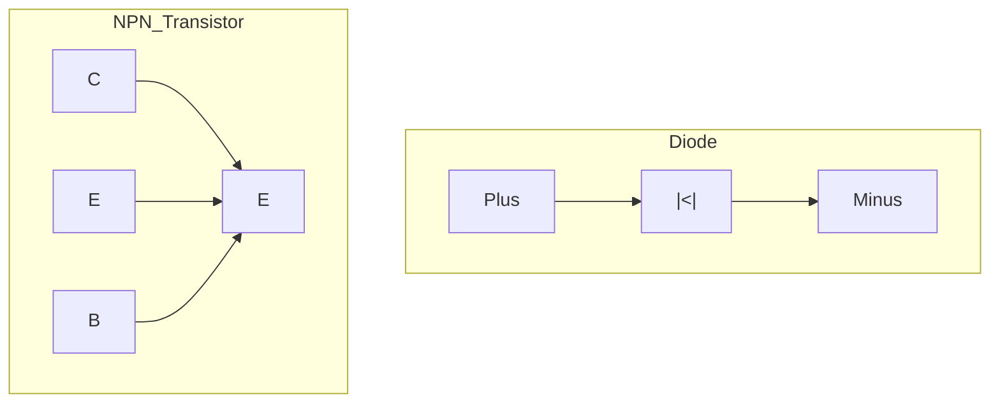

**નિયમ યાદ રાખવા માટે**: "ડાયોડ દિશા આપે, ટ્રાન્ઝિસ્ટર ટ્રાન્સફર કરે"

### પ્રશ્ન 1(4) [2 ગુણ]

**ઈન્ટ્રીસીક અને એક્સટ્રીસીક અર્ધવાહક વચ્ચેનો તફાવત લખો.**

**જવાબ**:

**કોષ્ટક: ઈન્ટ્રીસીક વિરુદ્ધ એક્સટ્રીસીક અર્ધવાહક**

| ઈન્ટ્રીસીક | એક્સટ્રીસીક |
|-----------|-----------|
| અશુદ્ધિઓ વિનાના શુદ્ધ અર્ધવાહક | અશુદ્ધિઓ ઉમેરેલા અર્ધવાહક |
| હોલ્સ અને ઇલેક્ટ્રોન્સની સંખ્યા સમાન | હોલ્સ અને ઇલેક્ટ્રોન્સની સંખ્યા અસમાન |
| ઉદાહરણ: શુદ્ધ સિલિકોન, જર્મેનિયમ | ઉદાહરણ: ફોસ્ફરસ સાથે ડોપ કરેલ સિલિકોન |

**નિયમ યાદ રાખવા માટે**: "શુદ્ધ ઈન, ડોપ્ડ એક્સ"

### પ્રશ્ન 1(5) [2 ગુણ]

**LED નું આખું નામ _________________.**

**જવાબ**:
LED નું આખું નામ **Light Emitting Diode** છે.

**આકૃતિ:**

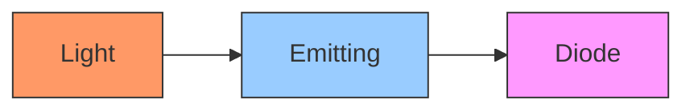

**નિયમ યાદ રાખવા માટે**: "પ્રકાશ ઉત્સર્જિત ડાયોડ" (LED)

### પ્રશ્ન 1(6) [2 ગુણ]

**ફોટો ડાયોડના બે ઉપયોગો જણાવો.**

**જવાબ**:

**કોષ્ટક: ફોટો-ડાયોડના ઉપયોગો**

| ઉપયોગ | કેવી રીતે કામ કરે છે |
|-------------|--------------|
| પ્રકાશ સેન્સર | પ્રકાશને વિદ્યુત પ્રવાહમાં રૂપાંતરિત કરે છે |
| ઓપ્ટિકલ કમ્યુનિકેશન | ફાઇબર ઓપ્ટિક્સમાં ઓપ્ટિકલ સિગ્નલ્સને શોધે છે |

**નિયમ યાદ રાખવા માટે**: "પ્રકાશ સેન્સિંગ કમ્યુનિકેશન" (LSC)

### પ્રશ્ન 1(7) [2 ગુણ]

**ટ્રાન્ઝિસ્ટરના પ્રકારોની યાદી બનાવો અને તેમના પ્રતીકો દોરો.**

**જવાબ**:

**ટ્રાન્ઝિસ્ટરના પ્રકારો:**

1. NPN ટ્રાન્ઝિસ્ટર
2. PNP ટ્રાન્ઝિસ્ટર

**આકૃતિ:**

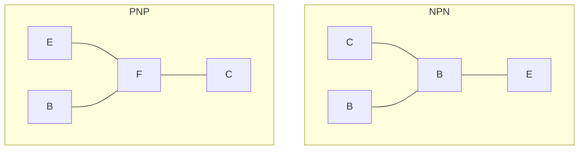

**નિયમ યાદ રાખવા માટે**: "Not Pointing iN, Pointing outP"

### પ્રશ્ન 1(8) [2 ગુણ]

**જર્મેનિયમ અને સિલિકોન ડાયોડના ફોરવર્ડ વોલ્ટેજ ડ્રોપનું મૂલ્ય આપો.**

**જવાબ**:

**કોષ્ટક: ફોરવર્ડ વોલ્ટેજ ડ્રોપ મૂલ્યો**

| ડાયોડનો પ્રકાર | ફોરવર્ડ વોલ્ટેજ ડ્રોપ |
|------------|----------------------|
| જર્મેનિયમ | 0.3V |
| સિલિકોન | 0.7V |

**નિયમ યાદ રાખવા માટે**: "જર્મેનિયમ ત્રણ, સિલિકોન સાત" (0.3V, 0.7V)

### પ્રશ્ન 1(9) [2 ગુણ]

**_________________ ડાયોડનો ઉપયોગ લાઇટ ડિટેક્ટર તરીકે થઈ શકે છે.**

**જવાબ**:
**ફોટોડાયોડ**નો ઉપયોગ લાઇટ ડિટેક્ટર તરીકે થઈ શકે છે.

**આકૃતિ:**

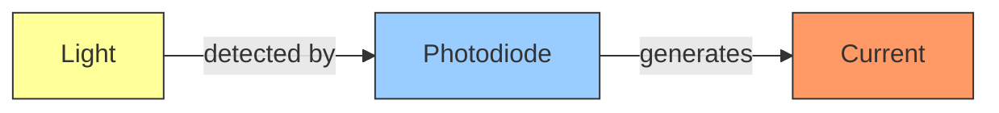

**નિયમ યાદ રાખવા માટે**: "ફોટો શોધે પ્રકાશ" (PDL)

### પ્રશ્ન 1(10) [2 ગુણ]

**કોઈલના Q-factor ની વ્યાખ્યા લખો.**

**જવાબ**:
Q-factor (ક્વોલિટી ફેક્ટર) એ કોઈલના ઇન્ડક્ટિવ રિએક્ટન્સનો તેના રેઝિસ્ટન્સ સાથેનો ગુણોત્તર છે, જે સૂચવે છે કે તે કેટલી કાર્યક્ષમતાથી ઊર્જા સંગ્રહિત કરે છે.

**કોષ્ટક: Q-Factor**

| પેરામીટર | વર્ણન |
|-----------|-------------|
| સૂત્ર | Q = XL/R |
| ઉચ્ચ Q | સારી ગુણવત્તા, ઓછો ઊર્જા વ્યય |
| નીચો Q | નબળી ગુણવત્તા, વધુ ઊર્જા વ્યય |

**નિયમ યાદ રાખવા માટે**: "ગુણવત્તા બરાબર રિએક્ટન્સ વિભાજિત પ્રતિરોધ" (QRR)

## પ્રશ્ન 2(અ) [3 ગુણ]

**રેઝીસ્ટરનો કલર કોડીંગ સમજાવો.**

**જવાબ**:

રેઝીસ્ટર કલર કોડિંગ રંગીન પટ્ટીઓનો ઉપયોગ કરે છે જે પ્રતિરોધ મૂલ્ય અને ટોલરન્સ દર્શાવે છે.

**કોષ્ટક: રેઝીસ્ટર કલર કોડ**

| રંગ | અંક | ગુણાંક |
|-------|-------|------------|
| કાળો | 0 | 10⁰ |
| બ્રાઉન | 1 | 10¹ |
| લાલ | 2 | 10² |
| નારંગી | 3 | 10³ |
| પીળો | 4 | 10⁴ |

4-બેન્ડ રેઝિસ્ટર માટે:

- પ્રથમ બેન્ડ: પ્રથમ અંક
- બીજી બેન્ડ: બીજો અંક
- ત્રીજી બેન્ડ: ગુણાંક
- ચોથી બેન્ડ: ટોલરન્સ

**નિયમ યાદ રાખવા માટે**: "Bad Boys Race Our Young Girls But Violet Generally Wins" (રંગોના ક્રમમાં: કાળો, બ્રાઉન, લાલ, નારંગી, પીળો, લીલો, વાદળી, જાંબલી, ગ્રે, સફેદ)

## પ્રશ્ન 2(અ) અથવા [3 ગુણ]

**લાઈટ ડિપેન્ડન્ટ રેઝીસ્ટર તેની લાક્ષણિકતાઓ સાથે સમજાવો.**

**જવાબ**:

LDR એક રેઝિસ્ટર છે જેનો પ્રતિરોધ પ્રકાશની તીવ્રતા વધે ત્યારે ઘટે છે.

**LDR ની લાક્ષણિકતાઓ:**

**કોષ્ટક: LDR ગુણધર્મો**

| પેરામીટર | વર્તન |
|-----------|----------|
| અંધારી સ્થિતિ | ઉચ્ચ પ્રતિરોધ (MΩ) |
| પ્રકાશિત સ્થિતિ | નીચો પ્રતિરોધ (kΩ) |
| પ્રતિસાદ સમય | થોડી મિલિસેકન્ડ |

**આકૃતિ:**

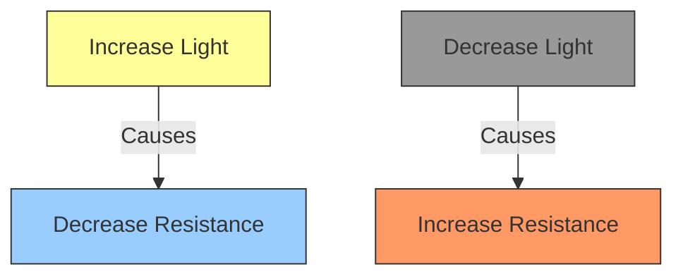

**નિયમ યાદ રાખવા માટે**: "પ્રકાશ વધે, અવરોધ ઘટે" (LVAG)

## પ્રશ્ન 2(બ) [3 ગુણ]

**કેપેસિટરનું વર્ગીકરણ વિગતવાર સમજાવો.**

**જવાબ**:

કેપેસિટર્સને ડાયઇલેક્ટ્રિક મટીરિયલ અને બાંધકામના આધારે વર્ગીકૃત કરવામાં આવે છે.

**કોષ્ટક: કેપેસિટર વર્ગીકરણ**

| પ્રકાર | ડાયઇલેક્ટ્રિક | ઉપયોગો |
|------|------------|--------------|
| સિરામિક | સિરામિક | ઉચ્ચ આવૃત્તિ |
| ઇલેક્ટ્રોલિટિક | એલ્યુમિનિયમ ઓક્સાઇડ | પાવર સપ્લાય |
| પોલિએસ્ટર | પ્લાસ્ટિક ફિલ્મ | સામાન્ય હેતુ |
| ટેન્ટલમ | ટેન્ટલમ ઓક્સાઇડ | નાના, ઉચ્ચ ક્ષમતા |

**આકૃતિ:**

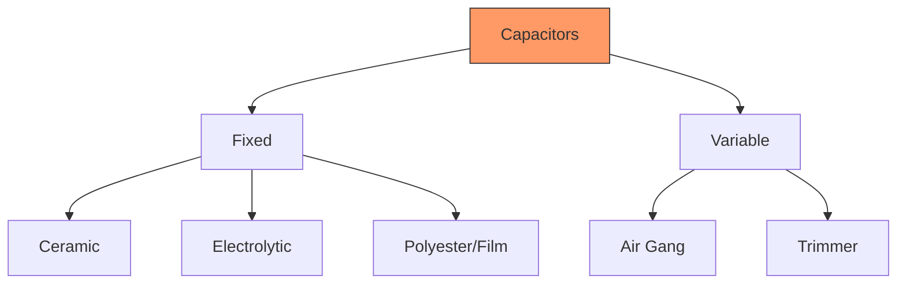

**નિયમ યાદ રાખવા માટે**: "CEPT" (Ceramic, Electrolytic, Polyester, Tantalum)

## પ્રશ્ન 2(બ) અથવા [3 ગુણ]

**ઈન્ડક્ટરનું વર્ગીકરણ વિગતવાર સમજાવો.**

**જવાબ**:

ઇન્ડક્ટર્સને કોર સામગ્રી અને બાંધકામના આધારે વર્ગીકૃત કરવામાં આવે છે.

**કોષ્ટક: ઇન્ડક્ટર વર્ગીકરણ**

| પ્રકાર | કોર | લાક્ષણિકતાઓ |
|------|------|-----------------|
| એર કોર | હવા | ઓછો ઇન્ડક્ટન્સ, ઓછા નુકશાન |
| આયર્ન કોર | લોખંડ | ઉચ્ચ ઇન્ડક્ટન્સ, ઉચ્ચ નુકશાન |
| ફેરાઇટ કોર | ફેરાઇટ | મધ્યમ ઇન્ડક્ટન્સ, ઓછા નુકશાન |
| ટોરોઇડલ | રિંગ આકારનું | ઉચ્ચ કાર્યક્ષમતા, ઓછું EMI |

**આકૃતિ:**

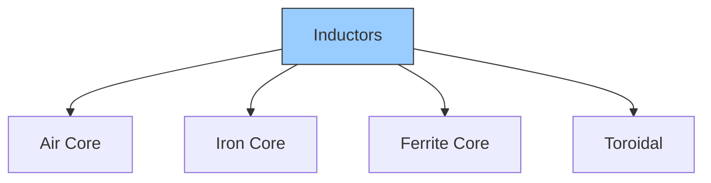

**નિયમ યાદ રાખવા માટે**: "હવા લોખંડ ફેરાઇટ ટોરોઇડ" (AIFT)

## પ્રશ્ન 2(ક) [4 ગુણ]

**ફેરાડેનો ઈલેક્ટ્રોમેગ્નેટીક ઈન્ડક્શનના નિયમો લખો તથા સમજાવો.**

**જવાબ**:

**ફેરાડેનો પ્રથમ નિયમ:**
જ્યારે વાહક સાથે જોડાયેલ ચુંબકીય ક્ષેત્ર બદલાય છે, ત્યારે વાહકમાં EMF પ્રેરિત થાય છે.

**ફેરાડેનો બીજો નિયમ:**
પ્રેરિત EMFનો પરિમાણ ચુંબકીય ફ્લક્સના પરિવર્તનના દરના સમપ્રમાણમાં હોય છે.

**કોષ્ટક: ફેરાડેના નિયમોનો સારાંશ**

| નિયમ | વિધાન | સૂત્ર |
|-----|-----------|---------|
| પ્રથમ નિયમ | ચુંબકીય ક્ષેત્રમાં ફેરફારથી EMF પ્રેરિત થાય છે | - |
| બીજો નિયમ | EMF ∝ ફ્લક્સના પરિવર્તનનો દર | E = -N(dΦ/dt) |

**આકૃતિ:**


**નિયમ યાદ રાખવા માટે**: "ચુંબકીય ક્ષેત્ર બદલાય, વિદ્યુત પ્રવાહ પેદા થાય" (CMFCEC)

## પ્રશ્ન 2(ક) અથવા [4 ગુણ]

**કેપેસિટરના સ્પેસિફીકેશન લખો તથા કોઈ પણ બે વિગતવાર સમજાવો.**

**જવાબ**:

**કેપેસિટરના સ્પેસિફિકેશન:**

1. કેપેસિટન્સ મૂલ્ય
2. વોલ્ટેજ રેટિંગ
3. ટોલરન્સ
4. લીકેજ કરંટ
5. તાપમાન ગુણાંક

**વિગતવાર સમજૂતી:**

**કેપેસિટન્સ મૂલ્ય:**
દર વોલ્ટ પર કેપેસિટર કેટલો ચાર્જ સંગ્રહિત કરી શકે છે, જે ફેરડ (F)માં માપવામાં આવે છે.

**વોલ્ટેજ રેટિંગ:**
મહત્તમ વોલ્ટેજ જે કેપેસિટરને નુકસાન કર્યા વિના લાગુ કરી શકાય છે.

**કોષ્ટક: કેપેસિટર સ્પેસિફિકેશન**

| સ્પેસિફિકેશન | વર્ણન | સામાન્ય મૂલ્યો |
|---------------|-------------|----------------|
| કેપેસિટન્સ | ચાર્જ સંગ્રહ ક્ષમતા | pF થી mF |
| વોલ્ટેજ રેટિંગ | મહત્તમ સુરક્ષિત વોલ્ટેજ | 16V, 25V, 50V, વગેરે |

**આકૃતિ:**

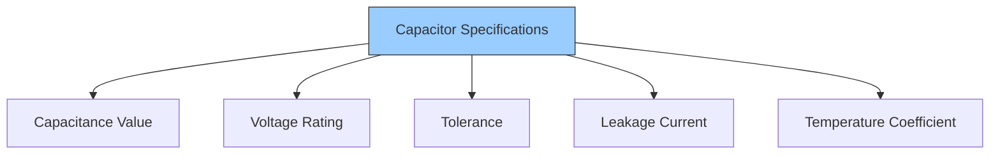

**નિયમ યાદ રાખવા માટે**: "કેપેસિટર્સ વૉલ્ટેજ ટોલરન્ટ ઓફ લો ટેમ્પરેચર" (CVTLT)

## પ્રશ્ન 2(ડ) [4 ગુણ]

**47Ω±5% મા​ટે કલર કોડ લખો.**

**જવાબ**:

47Ω±5% રેઝિસ્ટર માટે, કલર બેન્ડ્સ આ છે:

**કોષ્ટક: 47Ω±5% માટે કલર બેન્ડ્સ**

| બેન્ડ | રંગ | રજૂ કરે છે |
|------|-------|------------|
| 1લી બેન્ડ | પીળો | 4 |
| 2જી બેન્ડ | જાંબલી | 7 |
| 3જી બેન્ડ | કાળો | ×10⁰ |
| 4થી બેન્ડ | સોનેરી | ±5% |

**આકૃતિ:**


**નિયમ યાદ રાખવા માટે**: "પીળો જાંબલી કાળો સોનેરી" (રંગોનો ક્રમ)

## પ્રશ્ન 2(ડ) અથવા [4 ગુણ]

**આપેલ કલર કોડ માટે રેઝીસ્ટરની કિંમત તથા ટોલરન્સ શોધો: Brown, Black, yellow.**

**જવાબ**:

**કોષ્ટક: Brown, Black, Yellow નું અર્થઘટન**

| બેન્ડ | રંગ | મૂલ્ય | અર્થ |
|------|-------|-------|---------|
| 1લી | બ્રાઉન | 1 | પ્રથમ અંક |
| 2જી | કાળો | 0 | બીજો અંક |
| 3જી | પીળો | 10⁴ | ગુણાંક |

ગણતરી:
1લો અંક: 1
2જો અંક: 0
ગુણાંક: 10⁴

મૂલ્ય = 10 × 10⁴ = 100,000Ω = 100kΩ

4થી બેન્ડનો અભાવ એટલે ±20% ટોલરન્સ

**આકૃતિ:**


**નિયમ યાદ રાખવા માટે**: "બ્રાઉન બ્લેક યલો" (BBY)

## પ્રશ્ન 3(અ) [3 ગુણ]

**ડોપિંગની વ્યાખ્યા લખો. ડોપિંગથી બનતા અર્ધવાહકોના નામ તથા ઉદાહરણ આપો.**

**જવાબ**:

ડોપિંગ એ શુદ્ધ અર્ધવાહકમાં અશુદ્ધિઓ ઉમેરવાની પ્રક્રિયા છે જે તેના વિદ્યુત ગુણધર્મોને સંશોધિત કરે છે.

**કોષ્ટક: ડોપ્ડ અર્ધવાહકો**

| પ્રકાર | ઉમેરેલ ડોપન્ટ | ઉદાહરણ | મુખ્ય વાહકો |
|------|--------------|---------|-------------------|
| P-type | ત્રિસંયોજક (બોરોન, ગેલિયમ) | બોરોન સાથે ડોપ કરેલ સિલિકોન | હોલ્સ |
| N-type | પંચસંયોજક (ફોસ્ફરસ, આર્સેનિક) | ફોસ્ફરસ સાથે ડોપ કરેલ સિલિકોન | ઇલેક્ટ્રોન્સ |

**આકૃતિ:**

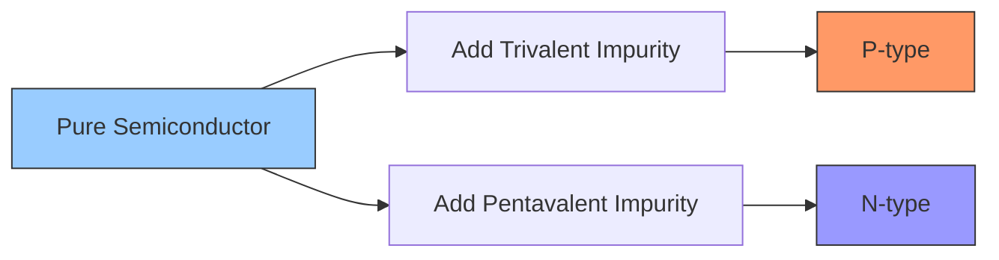

**નિયમ યાદ રાખવા માટે**: "પોઝિટિવમાં પ્લસ હોલ્સ, નેગેટિવમાં નંબર ઇલેક્ટ્રોન્સ" (PHNE)

## પ્રશ્ન 3(અ) અથવા [3 ગુણ]

**વ્યાખ્યા લખો: રીપલ ફેક્ટર, પીક ઈનવર્સ વોલ્ટેજ, રેક્ટીફીકેશન એફીસીયન્સી.**

**જવાબ**:

**કોષ્ટક: રેક્ટિફાયર પદો**

| પદ | વ્યાખ્યા | સૂત્ર |
|------|------------|---------|
| રિપલ ફેક્ટર | રેક્ટિફાઇડ આઉટપુટમાં AC ઘટકનું માપ | r = Vrms(AC)/Vdc |
| પીક ઇન્વર્સ વોલ્ટેજ | મહત્તમ રિવર્સ વોલ્ટેજ જે ડાયોડ સહન કરી શકે છે | - |
| રેક્ટિફિકેશન એફિસિયન્સી | DC આઉટપુટ પાવરનો AC ઇનપુટ પાવર સાથેનો ગુણોત્તર | η = (Pdc/Pac) × 100% |

**આકૃતિ:**

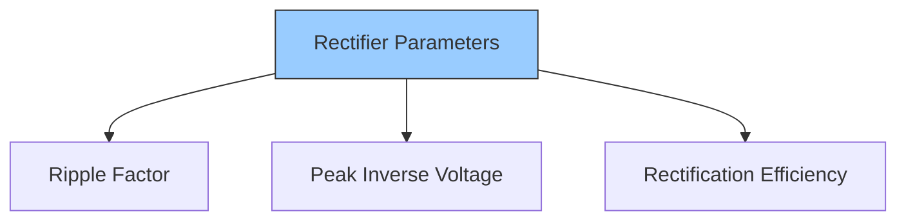

**નિયમ યાદ રાખવા માટે**: "રિપલ્સ પીક એફિશિયન્ટલી" (RPE)

## પ્રશ્ન 3(બ) [3 ગુણ]

**ક્રિસ્ટલ ડાયોડનું કાર્ય સમજાવો.**

**જવાબ**:

ક્રિસ્ટલ ડાયોડ એ પોઇન્ટ-કોન્ટેક્ટ ડાયોડ છે જે અર્ધવાહક ક્રિસ્ટલ સાથે બનાવવામાં આવે છે.

**કોષ્ટક: ક્રિસ્ટલ ડાયોડના ગુણધર્મો**

| ગુણધર્મ | વર્ણન |
|----------|-------------|
| બાંધકામ | અર્ધવાહક ક્રિસ્ટલ પર મેટલ પોઇન્ટ કોન્ટેક્ટ |
| કાર્ય | ઉચ્ચ આવૃત્તિના સિગ્નલનું રેક્ટિફિકેશન |
| ઉપયોગ | રેડિયો સિગ્નલ શોધ |

**આકૃતિ:**

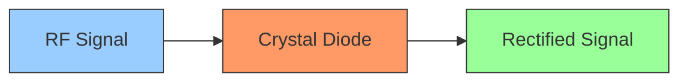

**નિયમ યાદ રાખવા માટે**: "ક્રિસ્ટલ શોધે રેડિયો ફ્રીક્વન્સી" (CDRF)

## પ્રશ્ન 3(બ) અથવા [3 ગુણ]

**ફોટોડાયોડનું કાર્ય સમજાવો.**

**જવાબ**:

ફોટોડાયોડ રિવર્સ બાયસમાં ઓપરેટ કરવામાં આવે ત્યારે પ્રકાશ ઊર્જાને વિદ્યુત પ્રવાહમાં રૂપાંતરિત કરે છે.

**કોષ્ટક: ફોટોડાયોડની લાક્ષણિકતાઓ**

| પેરામીટર | વર્તન |
|-----------|----------|
| પ્રકાશ સ્થિતિ | ઇલેક્ટ્રોન-હોલ જોડી ઉત્પન્ન કરે છે |
| રિવર્સ કરંટ | પ્રકાશની તીવ્રતા સાથે વધે છે |
| ગતિ | ઝડપી પ્રતિસાદ સમય |

**આકૃતિ:**

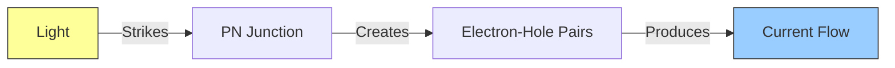

**નિયમ યાદ રાખવા માટે**: "પ્રકાશ આવે, કરંટ જાય" (LICO)

## પ્રશ્ન 3(ક) [4 ગુણ]

**સર્કિટ તથા વેવફોર્મ દોરી હાફ-વેવ રેક્ટીફાયર સમજાવો.**

**જવાબ**:

હાફ-વેવ રેક્ટિફાયર AC ને પલ્સેટિંગ DCમાં રૂપાંતરિત કરે છે, માત્ર પોઝિટિવ હાફ સાયકલ દરમિયાન પ્રવાહને પસાર કરીને.

**સર્કિટ ડાયાગ્રામ:**

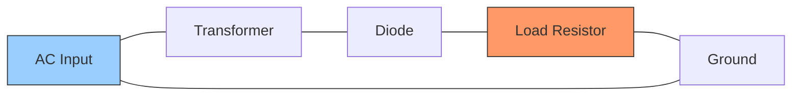

**વેવફોર્મ્સ:**

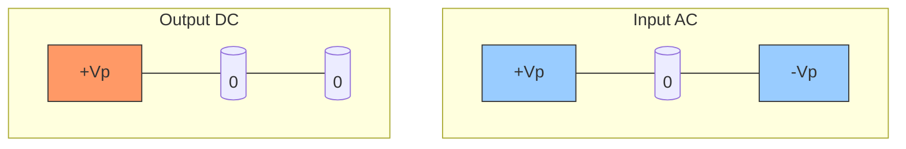

**કોષ્ટક: હાફ-વેવ રેક્ટિફાયરની લાક્ષણિકતાઓ**

| પેરામીટર | મૂલ્ય |
|-----------|-------|
| રિપલ ફેક્ટર | 1.21 |
| કાર્યક્ષમતા | 40.6% |
| આઉટપુટ ફ્રીક્વન્સી | ઇનપુટ જેવી જ |

**નિયમ યાદ રાખવા માટે**: "અર્ધ તરંગ અર્ધ પસાર" (HWPH)

## પ્રશ્ન 3(ક) અથવા [4 ગુણ]

**સર્કિટ તથા વેવફોર્મ દોરી ફુલ-વેવ રેક્ટીફાયર સમજાવો.**

**જવાબ**:

ફુલ-વેવ રેક્ટિફાયર AC ઇનપુટના બંને અર્ધ ભાગોને પલ્સેટિંગ DC આઉટપુટમાં રૂપાંતરિત કરે છે.

**સર્કિટ ડાયાગ્રામ (બ્રિજ પ્રકાર):**

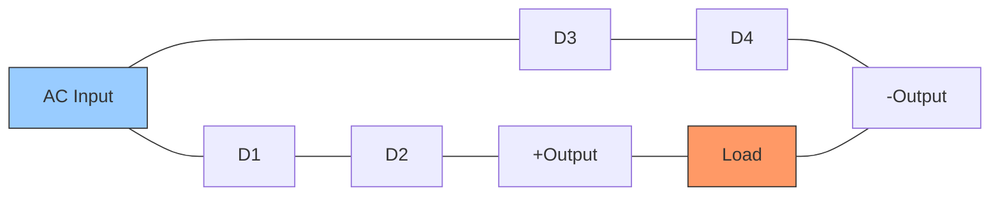

**વેવફોર્મ્સ:**

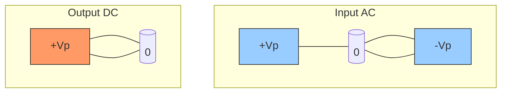

**કોષ્ટક: ફુલ-વેવ રેક્ટિફાયરની લાક્ષણિકતાઓ**

| પેરામીટર | મૂલ્ય |
|-----------|-------|
| રિપલ ફેક્ટર | 0.48 |
| કાર્યક્ષમતા | 81.2% |
| આઉટપુટ ફ્રીક્વન્સી | ઇનપુટથી બમણી |

**નિયમ યાદ રાખવા માટે**: "પૂર્ણ તરંગ પૂર્ણ ઉપયોગ" (FWMFU)

## પ્રશ્ન 3(ડ) [4 ગુણ]

**PN-જંક્શન ડાયોડના VI લાક્ષણિકતાઓ આકૃતિ દોરી સમજાવો.**

**જવાબ**:

**VI લાક્ષણિકતાઓ:**

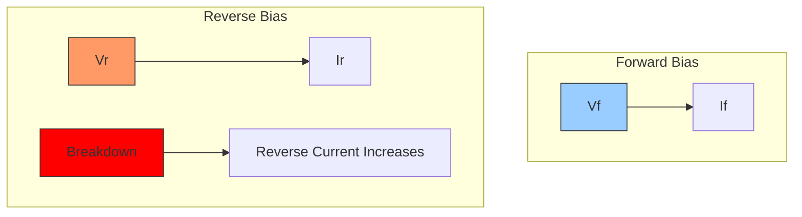

**કોષ્ટક: PN જંક્શન ડાયોડની લાક્ષણિકતાઓ**

| પ્રદેશ | વર્તન |
|--------|----------|
| ફોરવર્ડ બાયસ | 0.7V (Si) પછી કરંટ એક્સપોનેન્શિયલી વધે છે |
| રિવર્સ બાયસ | ખૂબ નાનો લીકેજ કરંટ વહે છે |
| બ્રેકડાઉન | ઉચ્ચ રિવર્સ વોલ્ટેજ પર થાય છે, કરંટ ઝડપથી વધે છે |

**ફોરવર્ડ બાયસ**: P-સાઇડ પર પોઝિટિવ વોલ્ટેજ, થ્રેશોલ્ડ પછી કરંટ સરળતાથી વહે છે.
**રિવર્સ બાયસ**: N-સાઇડ પર પોઝિટિવ વોલ્ટેજ, માત્ર નાનો લીકેજ કરંટ વહે છે.

**નિયમ યાદ રાખવા માટે**: "ફોરવર્ડ ફ્લો, રિવર્સ રેસ્ટ્રિક્ટ" (FFRR)

## પ્રશ્ન 3(ડ) અથવા [4 ગુણ]

**P-type અને N-type અર્ધવાહક વચ્ચેનો તફાવત લખો.**

**જવાબ**:

**કોષ્ટક: P-type vs N-type અર્ધવાહક**

| ગુણધર્મ | P-type | N-type |
|----------|--------|--------|
| ડોપન્ટ | ત્રિસંયોજક (બોરોન, ગેલિયમ) | પંચસંયોજક (ફોસ્ફરસ, આર્સેનિક) |
| મુખ્ય વાહકો | હોલ્સ | ઇલેક્ટ્રોન્સ |
| ગૌણ વાહકો | ઇલેક્ટ્રોન્સ | હોલ્સ |
| વિદ્યુત ચાર્જ | સાપેક્ષ રીતે પોઝિટિવ | સાપેક્ષ રીતે નેગેટિવ |
| વાહકતા | N-type કરતાં ઓછી | P-type કરતાં વધારે |

**આકૃતિ:**

```mermaid
graph LR
    subgraph "P-type"
    A[Silicon] --- B[Boron]
    C[Holes] --- D["\+"]
    end
    subgraph "N-type"
    E[Silicon] --- F[Phosphorus]
    G[Electrons] --- H["\-"]
    end
    style C fill:#f96,stroke:#333
    style G fill:#9cf,stroke:#333
```

**નિયમ યાદ રાખવા માટે**: "પોઝિટિવમાં પ્લસ હોલ્સ, નેગેટિવમાં નંબર ઇલેક્ટ્રોન્સ" (PHNE)

## પ્રશ્ન 4(અ) [3 ગુણ]

**LED ની કાર્યપદ્ધતિ સમજાવો.**

**જવાબ**:

LED (લાઇટ એમિટિંગ ડાયોડ) ફોરવર્ડ બાયસ થયેલ હોય ત્યારે ઇલેક્ટ્રોન-હોલ રિકોમ્બિનેશનને કારણે પ્રકાશ ઉત્સર્જિત કરે છે.

**કાર્યપદ્ધતિનો સિદ્ધાંત:**
જ્યારે ફોરવર્ડ બાયસ કરવામાં આવે છે, ત્યારે N-સાઇડથી ઇલેક્ટ્રોન્સ P-સાઇડ તરફ ગતિ કરે છે અને હોલ્સ સાથે રિકોમ્બાઇન થાય છે, જેના પરિણામે ફોટોન્સ (પ્રકાશ) તરીકે ઊર્જા છોડે છે.

**કોષ્ટક: LED ઓપરેશન**

| પ્રક્રિયા | પરિણામ |
|---------|--------|
| ફોરવર્ડ બાયસ | કરંટ વહે છે |
| ઇલેક્ટ્રોન-હોલ રિકોમ્બિનેશન | ઊર્જા રિલીઝ |
| એનર્જી બેન્ડ ગેપ | રંગ નક્કી કરે છે |

**આકૃતિ:**

```mermaid
graph LR
    A[Forward Bias] -->|Causes| B[Current Flow]
    B -->|Creates| C[Electron-Hole Recombination]
    C -->|Releases| D[Photons or Light]
    style A fill:#9cf,stroke:#333
    style D fill:#ff9,stroke:#333
```

**નિયમ યાદ રાખવા માટે**: "ફોરવર્ડ કરંટ પ્રકાશ ઉત્સર્જિત કરે" (FCEL)

## પ્રશ્ન 4(અ) અથવા [3 ગુણ]

**LED ના ઉપયોગો જણાવો.**

**જવાબ**:

**કોષ્ટક: LED ઉપયોગો**

| ઉપયોગ | ફાયદો |
|-------------|-----------|
| ડિસ્પ્લે ઇન્ડિકેટર્સ | ઓછો પાવર વપરાશ |
| ડિજિટલ ડિસ્પ્લે | વિવિધ રંગો ઉપલબ્ધ |
| લાઇટિંગ | ઊર્જા કાર્યક્ષમ |
| રિમોટ કંટ્રોલ | ઇન્ફ્રારેડ કમ્યુનિકેશન |
| ટ્રાફિક સિગ્નલ્સ | લાંબી લાઇફ, ઉચ્ચ દૃશ્યતા |

**આકૃતિ:**

```mermaid
graph TD
    A[LED Applications] --> B[Indicators]
    A --> C[Displays]
    A --> D[Lighting]
    A --> E[Communication]
    A --> F[Signals]
    style A fill:#9cf,stroke:#333
```

**નિયમ યાદ રાખવા માટે**: "ડિસ્પ્લે લાઇટ્સ ઇન ક્લેવર સિગ્નલ્સ" (DLICS)

## પ્રશ્ન 4(બ) [4 ગુણ]

**"ઝેનર ડાયોડ વોલ્ટેજ રેગ્યુલેટર તરીકે" સમજાવો.**

**જવાબ**:

ઝેનર ડાયોડ રિવર્સ બ્રેકડાઉન રીજીયનમાં ઓપરેટ કરવામાં આવે ત્યારે ઇનપુટ વોલ્ટેજની અસ્થિરતા છતાં સ્થિર આઉટપુટ વોલ્ટેજ જાળવે છે.

**સર્કિટ:**

```mermaid
graph LR
    A[Unregulated DC] --- B[Series Resistor] --- C[Output]
    C --- D[Zener Diode] --- E[Ground]
    C --- F[Load] --- E
    style A fill:#9cf,stroke:#333
    style C fill:#9f9,stroke:#333
    style D fill:#f96,stroke:#333
```

**કાર્ય:**

- સીરીઝ રેઝિસ્ટર કરંટ મર્યાદિત કરે છે
- ઝેનર બ્રેકડાઉન રીજીયનમાં કાર્ય કરે છે
- લોડ પર સ્થિર વોલ્ટેજ જાળવે છે

**કોષ્ટક: ઝેનર રેગ્યુલેટરની લાક્ષણિકતાઓ**

| પેરામીટર | વર્ણન |
|-----------|-------------|
| વોલ્ટેજ રેગ્યુલેશન | ઇનપુટમાં ફેરફાર છતાં સ્થિર આઉટપુટ જાળવે છે |
| પાવર રેટિંગ | પાવર ડિસિપેશન સંભાળવું જોઈએ |
| તાપમાન સ્થિરતા | આઉટપુટ તાપમાન સાથે થોડું બદલાય છે |

**નિયમ યાદ રાખવા માટે**: "ઝેનર બ્રેક ટુ રેગ્યુલેટ" (ZBR)

## પ્રશ્ન 4(બ) અથવા [4 ગુણ]

**ઝેનર વોલ્ટેજ રેગ્યુલેટરની મર્યાદાઓ.**

**જવાબ**:

**કોષ્ટક: ઝેનર વોલ્ટેજ રેગ્યુલેટરની મર્યાદાઓ**

| મર્યાદા | અસર |
|------------|--------|
| પાવર ડિસિપેશન | ઝેનર પાવર રેટિંગ દ્વારા મર્યાદિત |
| કરંટ ક્ષમતા | માત્ર નાના લોડ સંભાળી શકે છે |
| તાપમાન સંવેદનશીલતા | આઉટપુટ તાપમાન સાથે બદલાય છે |
| કાર્યક્ષમતા | સીરીઝ રેઝિસ્ટરમાં પાવર લોસને કારણે ખરાબ કાર્યક્ષમતા |
| નોઈઝ | ઇલેક્ટ્રિકલ નોઈઝ ઉત્પન્ન કરે છે |

**આકૃતિ:**

```mermaid
graph TD
    A[Zener Limitations] --> B[Power Limits]
    A --> C[Current Limits]
    A --> D[Temperature Effects]
    A --> E[Efficiency Issues]
    A --> F[Noise Generation]
    style A fill:#f96,stroke:#333
```

**નિયમ યાદ રાખવા માટે**: "પાવર કરંટ ટેમ્પરેચર એફિશિયન્સી નોઇઝ" (PCTEN)

## પ્રશ્ન 4(ક) [7 ગુણ]

**રેક્ટીફાયરમાં ફિલ્ટર સર્કિટની જરૂરીયાત વર્ણવો. રેક્ટીફાયરમાં ઉપયોગી વિવિધ પ્રકારની ફિલ્ટર સર્કિટના નામ જણાવો તથા કોઈ એક ફિલ્ટર સર્કિટ દોરી વિગતવાર સમજાવો.**

**જવાબ**:

**ફિલ્ટર સર્કિટની જરૂરીયાત:**
રેક્ટિફાયર આઉટપુટમાં AC રિપલ હોય છે જે સ્મૂધ DC માટે દૂર કરવી જરૂરી છે. ફિલ્ટર્સ આ રિપલ ઘટાડીને સ્થિર DC આઉટપુટ પૂરું પાડે છે.

**ફિલ્ટર સર્કિટના પ્રકારો:**

1. કેપેસિટર ફિલ્ટર (શન્ટ કેપેસિટર)
2. LC ફિલ્ટર
3. π-ફિલ્ટર (પાઇ-ફિલ્ટર)
4. RC ફિલ્ટર

**કેપેસિટર ફિલ્ટરની સમજૂતી:**

**સર્કિટ ડાયાગ્રામ:**

```mermaid
graph LR
    A[Rectifier Output] --- B[+]
    B --- C[Load]
    B --- D[Capacitor]
    C --- E[Ground]
    D --- E
    style A fill:#9cf,stroke:#333
    style C fill:#f96,stroke:#333
    style D fill:#9f9,stroke:#333
```

**કાર્ય:**

- કેપેસિટર વોલ્ટેજના પીક્સ દરમિયાન ચાર્જ થાય છે
- વોલ્ટેજ ડ્રોપ્સ દરમિયાન ધીમે ધીમે ડિસ્ચાર્જ થાય છે
- પીક્સ વચ્ચે આઉટપુટ વોલ્ટેજ જાળવે છે
- રિપલ વોલ્ટેજ ઘટાડે છે

**કોષ્ટક: કેપેસિટર ફિલ્ટરની લાક્ષણિકતાઓ**

| પેરામીટર | અસર |
|-----------|--------|
| કેપેસિટન્સ મૂલ્ય | ઉચ્ચ મૂલ્ય ઓછી રિપલ આપે છે |
| રિપલ ઘટાડો | સામાન્ય રીતે 70-80% ઘટાડે છે |
| લોડ કરંટ | ઉચ્ચ લોડ કરંટ વધુ રિપલ ઉત્પન્ન કરે છે |
| ફ્રીક્વન્સી | ઉચ્ચ ફ્રીક્વન્સી ફિલ્ટર કરવી સરળ છે |

**વેવફોર્મ્સ:**

```mermaid
graph TD
    subgraph "Rectifier Output"
    A[Pulsating DC]
    end
    subgraph "Filter Output"
    B[Smoother DC]
    end
    style A fill:#f96,stroke:#333
    style B fill:#9f9,stroke:#333
```

**નિયમ યાદ રાખવા માટે**: "કેપેસિટર્સ હોલ્ડ વોલ્ટેજ ડ્યુરિંગ ડ્રોપ્સ" (CHVDD)

## પ્રશ્ન 5(અ) [3 ગુણ]

**ઈ-વેસ્ટની વ્યાખ્યા લખો. સામાન્ય ઈ-વેસ્ટ વસ્તુઓની યાદી બનાવો.**

**જવાબ**:

ઈ-વેસ્ટ એટલે ત્યજિત ઇલેક્ટ્રોનિક ઉપકરણો અને ઘટકો કે જે તેમના ઉપયોગી જીવનકાળના અંતે પહોંચ્યા છે.

**કોષ્ટક: સામાન્ય ઈ-વેસ્ટ વસ્તુઓ**

| શ્રેણી | ઉદાહરણો |
|----------|----------|
| કમ્પ્યુટિંગ ઉપકરણો | કમ્પ્યુટર્સ, લેપટોપ, ટેબ્લેટ |
| કમ્યુનિકેશન ઉપકરણો | મોબાઇલ ફોન, ટેલિફોન |
| ઘરેલું ઉપકરણો | ટીવી, રેફ્રિજરેટર, વોશિંગ મશીન |
| ઇલેક્ટ્રોનિક ઘટકો | સર્કિટ બોર્ડ, બેટરી, કેબલ્સ |
| ઓફિસ ઉપકરણો | પ્રિન્ટર, સ્કેનર, કોપિયર |

**આકૃતિ:**

```mermaid
graph TD
    A[E-waste] --> B[Computing]
    A --> C[Communication]
    A --> D[Home Appliances]
    A --> E[Components]
    A --> F[Office Equipment]
    style A fill:#f96,stroke:#333
```

**નિયમ યાદ રાખવા માટે**: "કમ્પ્યુટર્સ, કમ્યુનિકેશન, કમ્પોનન્ટ્સ, હોમ એપ્લાયન્સિસ" (CCCHA)

## પ્રશ્ન 5(બ) [3 ગુણ]

**ઈ-વેસ્ટ મેનેજમેન્ટની વિવિધ વ્યૂહરચના જણાવો અને સમજાવો.**

**જવાબ**:

**કોષ્ટક: ઈ-વેસ્ટ મેનેજમેન્ટની વ્યૂહરચનાઓ**

| વ્યૂહરચના | વર્ણન |
|----------|-------------|
| ઘટાડવું | નવા ઇલેક્ટ્રોનિક્સની ખરીદી ઘટાડવી |
| ફરીથી ઉપયોગ | રિપેર અને રીપરપઝિંગ દ્વારા જીવનકાળ વધારવો |
| રિસાયકલ | મૂલ્યવાન સામગ્રી પુનઃપ્રાપ્ત કરવા માટે ઈ-વેસ્ટ પ્રોસેસ કરવો |
| જવાબદાર નિકાલ | અધિકૃત ઈ-વેસ્ટ સંગ્રહ કેન્દ્રોનો ઉપયોગ કરવો |
| વિસ્તૃત ઉત્પાદક જવાબદારી | ઉત્પાદકો જીવનકાળના અંત ઉત્પાદનો પાછા લે છે |

**આકૃતિ:**

```mermaid
graph TD
    A[E-waste Management] --> B[Reduce]
    A --> C[Reuse]
    A --> D[Recycle]
    A --> E[Responsible Disposal]
    A --> F[Extended Producer Responsibility]
    style A fill:#9cf,stroke:#333
```

**નિયમ યાદ રાખવા માટે**: "3R's અને 2 વધારાની કાર્યવાહી" (3R2A)

## પ્રશ્ન 5(ક) [4 ગુણ]

**"ટ્રાનઝીસ્ટર સ્વીચ તરીકે" સમજાવો.**

**જવાબ**:

ટ્રાન્ઝિસ્ટર કટઓફ (OFF) અથવા સેચુરેશન (ON) રીજીયનમાં ઓપરેટ કરીને ઇલેક્ટ્રોનિક સ્વિચ તરીકે કાર્ય કરી શકે છે.

**કોષ્ટક: ટ્રાન્ઝિસ્ટર સ્વિચ ઓપરેશન**

| સ્થિતિ | શરત | વર્તન |
|-------|-----------|----------|
| OFF (કટઓફ) | બેઝ કરંટ = 0 | કોઈ કલેક્ટર કરંટ વહેતો નથી |
| ON (સેચુરેશન) | બેઝ કરંટ પૂરતો | મહત્તમ કલેક્ટર કરંટ વહે છે |

**સર્કિટ ડાયાગ્રામ:**

```mermaid
graph LR
    A[+Vcc] --- B[Rc] --- C[Collector]
    C --- D[Emitter] --- E[Ground]
    F[Vin] --- G[Rb] --- H[Base]
    H --- D
    style F fill:#9cf,stroke:#333
    style A fill:#f96,stroke:#333
```

**કાર્ય:**

- જ્યારે ઇનપુટ HIGH હોય: ટ્રાન્ઝિસ્ટર સેચુરેટ થાય છે, બંધ સ્વિચ જેવું વર્તન કરે છે
- જ્યારે ઇનપુટ LOW હોય: ટ્રાન્ઝિસ્ટર કટ-ઓફ થાય છે, ખુલ્લા સ્વિચ જેવું વર્તન કરે છે

**નિયમ યાદ રાખવા માટે**: "નો બેઝ નો કરંટ, એપ્લાય બેઝ કનેક્ટ સર્કિટ" (NBNC-ABC)

## પ્રશ્ન 5(ડ) [4 ગુણ]

**ટ્રાંઝીસ્ટરના CE કંફીગરેશન માટે α તથા β વચ્ચેનો સંબંધ તારવો.**

**જવાબ**:

ટ્રાન્ઝિસ્ટરમાં, α (આલ્ફા) અને β (બીટા) કરંટ ગેઇન પેરામીટર્સ છે.

**વ્યાખ્યાઓ:**

- α = IC/IE (કોમન બેઝ કરંટ ગેઇન)
- β = IC/IB (કોમન એમિટર કરંટ ગેઇન)

**તારણ:**
IE = IC + IB થી, આપણે લખી શકીએ:
α = IC/IE = IC/(IC + IB)

ન્યુમરેટર અને ડિનોમિનેટરને IBથી ભાગીએ:
α = (IC/IB)/[(IC/IB) + 1] = β/(β + 1)

તેથી:
β = α/(1-α)

**કોષ્ટક: α અને β વચ્ચેનો સંબંધ**

| પેરામીટર | સૂત્ર | સામાન્ય રેન્જ |
|-----------|---------|---------------|
| α માંથી β | α = β/(β+1) | 0.9 થી 0.99 |
| β માંથી α | β = α/(1-α) | 50 થી 300 |

**આકૃતિ:**

```mermaid
graph TD
    A[alpha = IC divided by IE] --- B[beta = IC divided by IB]
    C[beta = alpha divided by 1 minus alpha] --- D[alpha = beta divided by beta plus 1]

    style A fill:#9cf,stroke:#333
    style B fill:#f96,stroke:#333
```

**નિયમ યાદ રાખવા માટે**: "બીટા બરાબર આલ્ફા ડિવાઇડેડ બાય વન માઇનસ આલ્ફા" (BAOA)
