## Question 1 [14 marks]

**Answer any seven out of ten.**

### Question 1(1) [2 marks]

**Define resistor and give its unit.**

**Answer**:
A resistor is an electronic component that opposes the flow of electric current. Its unit is Ohm (Ω).

**Table: Resistor Properties**

| Property | Description |
|----------|-------------|
| Symbol | ⏅ |
| Unit | Ohm (Ω) |
| Function | Limits current flow |

**Mnemonic:** "Resistors Oppose Current" (ROC)

### Question 1(2) [2 marks] 

**Give two examples of active and passive components each.**

**Answer**:

**Table: Electronic Components Classification**

| Active Components | Passive Components |
|------------------|-------------------|
| 1. Transistors    | 1. Resistors      |
| 2. Diodes         | 2. Capacitors     |

**Mnemonic:** "TARD" - Transistors And Resistors Differ

### Question 1(3) [2 marks]

**Draw symbols of any two semiconductor devices.**

**Answer**:

**Diagram:**

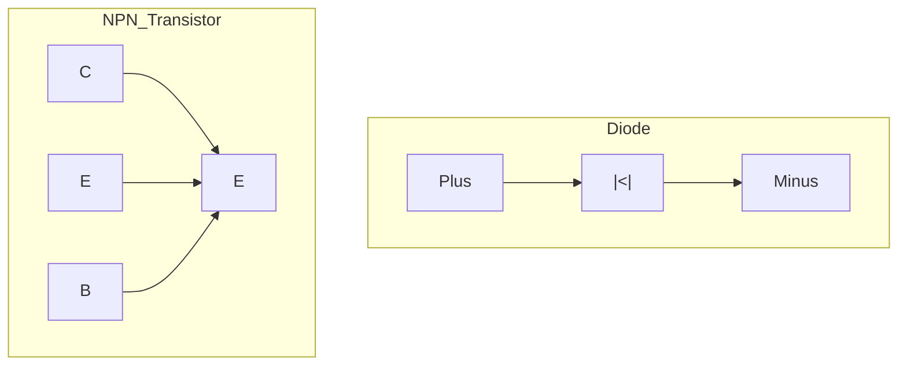

**Mnemonic:** "Diodes Direct, Transistors Transfer"

### Question 1(4) [2 marks]

**Differentiate between intrinsic and extrinsic semiconductor.**

**Answer**:

**Table: Intrinsic vs Extrinsic Semiconductors**

| Intrinsic | Extrinsic |
|-----------|-----------|
| Pure semiconductor without impurities | Semiconductor with added impurities |
| Equal number of holes and electrons | Unequal holes and electrons |
| Examples: Pure Silicon, Germanium | Examples: Silicon doped with Phosphorus |

**Mnemonic:** "Pure In, Doped Ex"

### Question 1(5) [2 marks]

**LED stands for _________________.**

**Answer**:
LED stands for **Light Emitting Diode**.

**Diagram:**

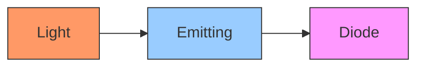

**Mnemonic:** "Light Emitters Dazzle"

### Question 1(6) [2 marks]

**State any two applications of Photo-diode.**

**Answer**:

**Table: Photo-diode Applications**

| Application | How it works |
|-------------|--------------|
| Light sensors | Converts light to electrical current |
| Optical communication | Detects optical signals in fiber optics |

**Mnemonic:** "Light Sensing Communication" (LSC)

### Question 1(7) [2 marks]

**List the types of transistor and draw their symbols.**

**Answer**:

**Types of Transistors:**

1. NPN Transistor
2. PNP Transistor

**Diagram:**

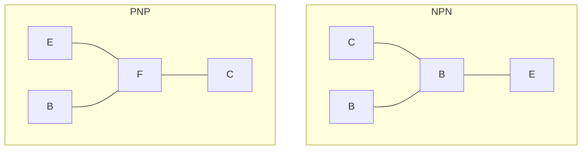

**Mnemonic:** "Not Pointing iN, Pointing outP"

### Question 1(8) [2 marks]

**Give the value of forward voltage drop of Germanium and Silicon diode.**

**Answer**:

**Table: Forward Voltage Drop Values**

| Diode Type | Forward Voltage Drop |
|------------|----------------------|
| Germanium | 0.3V |
| Silicon | 0.7V |

**Mnemonic:** "Germanium's Three, Silicon's Seven" (0.3V, 0.7V)

### Question 1(9) [2 marks]

**The _________________ diode can be used as a light detector.**

**Answer**:
The **Photodiode** can be used as a light detector.

**Diagram:**

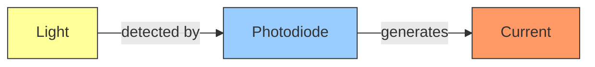

**Mnemonic:** "Photo Detects Light" (PDL)

### Question 1(10) [2 marks]

**Define Q-factor of a coil.**

**Answer**:
Q-factor (Quality factor) of a coil is the ratio of its inductive reactance to its resistance, indicating how efficiently it stores energy.

**Table: Q-Factor**

| Parameter | Description |
|-----------|-------------|
| Formula | Q = XL/R |
| Higher Q | Better quality, less energy loss |
| Lower Q | Poor quality, more energy loss |

**Mnemonic:** "Quality equals Reactance over Resistance" (QRR)

## Question 2(a) [3 marks]

**Explain colour coding method of resistor.**

**Answer**:

Resistor color coding uses colored bands to indicate resistance value and tolerance.

**Table: Resistor Color Code**

| Color | Digit | Multiplier |
|-------|-------|------------|
| Black | 0 | 10⁰ |
| Brown | 1 | 10¹ |
| Red | 2 | 10² |
| Orange | 3 | 10³ |
| Yellow | 4 | 10⁴ |

For a 4-band resistor:

- First band: First digit
- Second band: Second digit
- Third band: Multiplier
- Fourth band: Tolerance

**Mnemonic:** "Bad Boys Race Our Young Girls But Violet Generally Wins" (Colors in order: Black, Brown, Red, Orange, Yellow, Green, Blue, Violet, Grey, White)

## Question 2(a) OR [3 marks]

**Explain Light Dependent Resistor with its characteristics.**

**Answer**:

LDR is a resistor whose resistance decreases when light intensity increases.

**Characteristics of LDR:**

**Table: LDR Properties**

| Parameter | Behavior |
|-----------|----------|
| Dark condition | High resistance (MΩ) |
| Bright condition | Low resistance (kΩ) |
| Response time | Few milliseconds |

**Diagram:**

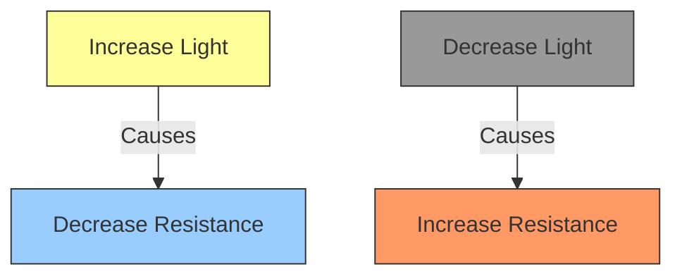

**Mnemonic:** "Light Up, Resistance Down" (LURD)

## Question 2(b) [3 marks]

**Explain classification of capacitors in detail.**

**Answer**:

Capacitors are classified based on dielectric material and construction.

**Table: Capacitor Classifications**

| Type | Dielectric | Applications |
|------|------------|--------------|
| Ceramic | Ceramic | High frequency |
| Electrolytic | Aluminum oxide | Power supplies |
| Polyester | Plastic film | General purpose |
| Tantalum | Tantalum oxide | Small, high capacity |

**Diagram:**

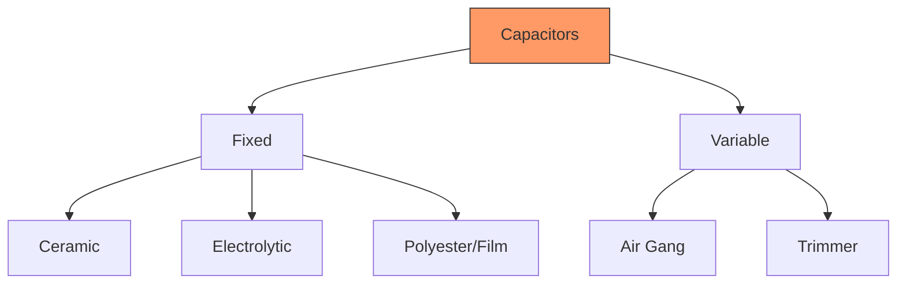

**Mnemonic:** "CEPT" (Ceramic, Electrolytic, Polyester, Tantalum)

## Question 2(b) OR [3 marks]

**Explain classification of inductor in detail.**

**Answer**:

Inductors are classified based on core material and construction.

**Table: Inductor Classifications**

| Type | Core | Characteristics |
|------|------|-----------------|
| Air core | Air | Low inductance, low losses |
| Iron core | Iron | High inductance, high losses |
| Ferrite core | Ferrite | Medium inductance, low losses |
| Toroidal | Ring shaped | High efficiency, low EMI |

**Diagram:**

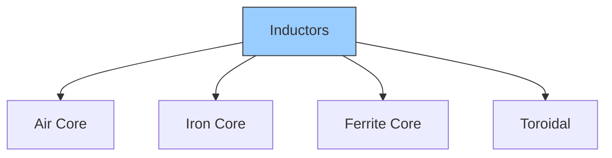

**Mnemonic:** "Air Iron Ferrite Toroid" (AIFT)

## Question 2(c) [4 marks]

**State and explain Faraday's laws of Electromagnetic Induction.**

**Answer**:

Faraday's laws explain how electromagnetic induction works.

**Faraday's First Law:**
When a magnetic field linked with a conductor changes, an EMF is induced in the conductor.

**Faraday's Second Law:**
The magnitude of induced EMF is proportional to the rate of change of magnetic flux.

**Table: Faraday's Laws Summary**

| Law | Statement | Formula |
|-----|-----------|---------|
| First Law | Change in magnetic field induces EMF | - |
| Second Law | EMF ∝ rate of change of flux | E = -N(dΦ/dt) |

**Diagram:**


**Mnemonic:** "Change Magnetic Field, Create Electric Current" (CMFCEC)

## Question 2(c) OR [4 marks]

**Enlist specifications of capacitors and explain two in detail.**

**Answer**:

**Specifications of Capacitors:**

1. Capacitance value
2. Voltage rating
3. Tolerance
4. Leakage current
5. Temperature coefficient

**Detailed Explanation:**

**Capacitance Value:**
The amount of charge a capacitor can store per volt, measured in Farads (F).

**Voltage Rating:**
The maximum voltage that can be applied without damaging the capacitor.

**Table: Capacitor Specifications**

| Specification | Description | Typical Values |
|---------------|-------------|----------------|
| Capacitance | Charge storage capacity | pF to mF |
| Voltage Rating | Maximum safe voltage | 16V, 25V, 50V, etc. |

**Diagram:**

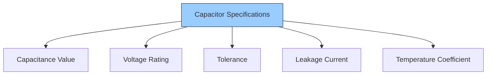

**Mnemonic:** "Capacitors Very Tolerant of Low Temperatures" (CVTLT)

## Question 2(d) [4 marks]

**Write colour band of 47Ω±5% resistance.**

**Answer**:

For 47Ω±5% resistor, the color bands are:

**Table: Color Bands for 47Ω±5%**

| Band | Color | Represents |
|------|-------|------------|
| 1st band | Yellow | 4 |
| 2nd band | Violet | 7 |
| 3rd band | Black | ×10⁰ |
| 4th band | Gold | ±5% |

**Diagram:**

```mermaid
graph LR
    A[Yellow] -->|4| B[Violet] -->|7| C[Black] -->|×10⁰| D[Gold] -->|±5%| E[47Ω±5%]
    style A fill:#ff9,stroke:#333
    style B fill:#f0f,stroke:#333
    style C fill:#000,stroke:#fff
    style D fill:#fd0,stroke:#333
    style E fill:#fff,stroke:#333
```

**Mnemonic:** "Yellow Violets Bring Gold" (The colors of the bands)

## Question 2(d) OR [4 marks]

**Calculate value of resistor and tolerance for a given colour code: Brown, Black, yellow.**

**Answer**:

**Table: Interpretation of Brown, Black, Yellow**

| Band | Color | Value | Meaning |
|------|-------|-------|---------|
| 1st | Brown | 1 | First digit |
| 2nd | Black | 0 | Second digit |
| 3rd | Yellow | 10⁴ | Multiplier |

Calculation:
1st digit: 1
2nd digit: 0
Multiplier: 10⁴

Value = 10 × 10⁴ = 100,000Ω = 100kΩ

No 4th band means ±20% tolerance

**Diagram:**


**Mnemonic:** "Big Black Yield" (Brown-Black-Yellow)

## Question 3(a) [3 marks]

**Define doping. Give the name of semiconductor materials fabricated by doping with an example of each.**

**Answer**:

Doping is the process of adding impurities to a pure semiconductor to modify its electrical properties.

**Table: Doped Semiconductors**

| Type | Dopant Added | Example | Majority Carriers |
|------|--------------|---------|-------------------|
| P-type | Trivalent (Boron, Gallium) | Silicon doped with Boron | Holes |
| N-type | Pentavalent (Phosphorus, Arsenic) | Silicon doped with Phosphorus | Electrons |

**Diagram:**

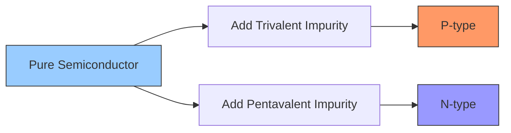

**Mnemonic:** "Positive has Plus Holes, Negative has Numerous Electrons" (PHNE)

## Question 3(a) OR [3 marks]

**Define Ripple factor, Peak Inverse Voltage (PIV), Rectification efficiency.**

**Answer**:

**Table: Rectifier Terms**

| Term | Definition | Formula |
|------|------------|---------|
| Ripple Factor | Measure of AC component in rectified output | r = Vrms(AC)/Vdc |
| Peak Inverse Voltage | Maximum reverse voltage a diode can withstand | - |
| Rectification Efficiency | Ratio of DC output power to AC input power | η = (Pdc/Pac) × 100% |

**Diagram:**

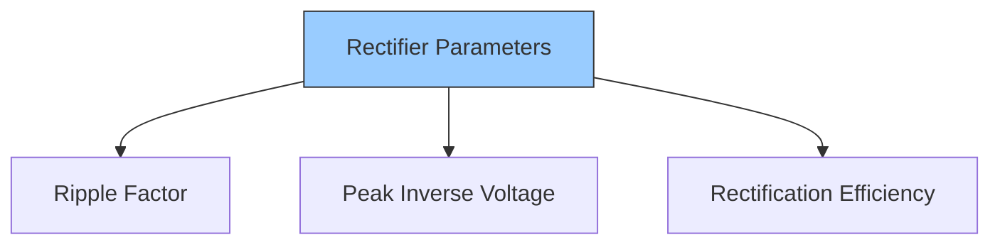

**Mnemonic:** "Ripples Peak Efficiently" (RPE)

## Question 3(b) [3 marks]

**Explain working of Crystal diode.**

**Answer**:

Crystal diode is a point-contact diode made with a semiconductor crystal.

**Table: Crystal Diode Properties**

| Property | Description |
|----------|-------------|
| Construction | Metal point contact on semiconductor crystal |
| Function | Rectification of high frequency signals |
| Application | Radio signal detection |

**Diagram:**

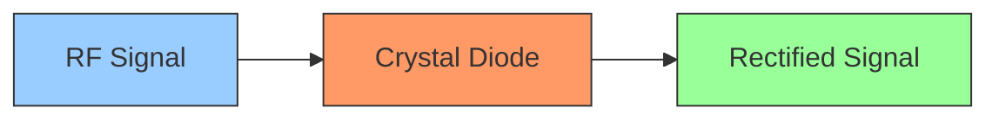

**Mnemonic:** "Crystal Detects Radio Frequencies" (CDRF)

## Question 3(b) OR [3 marks]

**Explain working of photodiode.**

**Answer**:

Photodiode converts light energy into electrical current when operated in reverse bias.

**Table: Photodiode Characteristics**

| Parameter | Behavior |
|-----------|----------|
| Light condition | Generates electron-hole pairs |
| Reverse current | Increases with light intensity |
| Speed | Fast response time |

**Diagram:**

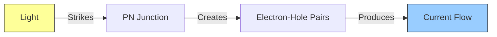

**Mnemonic:** "Light In, Current Out" (LICO)

## Question 3(c) [4 marks]

**Explain half-wave rectifier with circuit diagram and waveforms.**

**Answer**:

Half-wave rectifier converts AC to pulsating DC by allowing current flow only during positive half cycles.

**Circuit Diagram:**

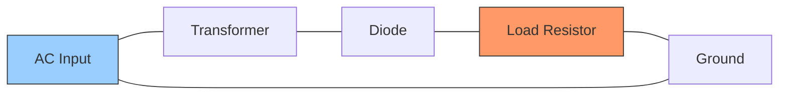

**Waveforms:**

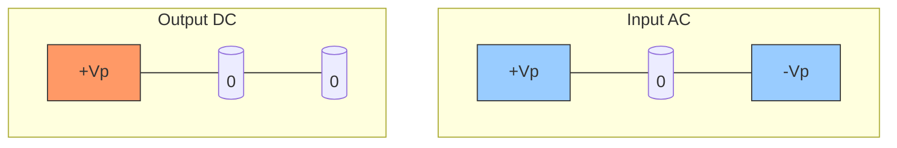

**Table: Half-Wave Rectifier Properties**

| Parameter | Value |
|-----------|-------|
| Ripple Factor | 1.21 |
| Efficiency | 40.6% |
| Output Frequency | Same as input |

**Mnemonic:** "Half Wave Passes Half" (HWPH)

## Question 3(c) OR [4 marks]

**Explain full-wave rectifier with circuit diagram and waveforms.**

**Answer**:

Full-wave rectifier converts both halves of AC input to pulsating DC output.

**Circuit Diagram (Bridge type):**

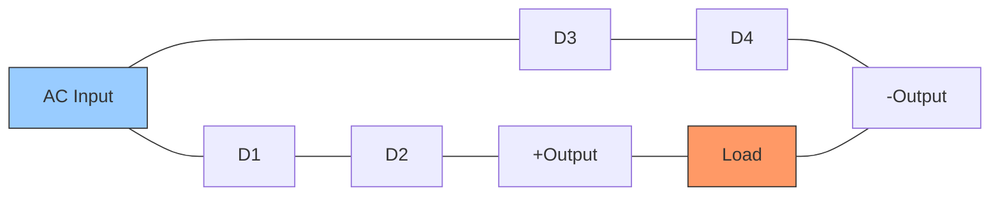

**Waveforms:**

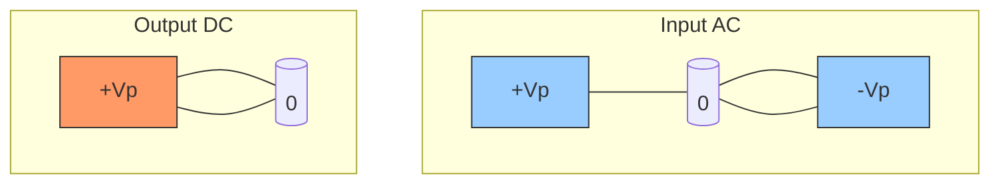

**Table: Full-Wave Rectifier Properties**

| Parameter | Value |
|-----------|-------|
| Ripple Factor | 0.48 |
| Efficiency | 81.2% |
| Output Frequency | Twice the input |

**Mnemonic:** "Full Wave Makes Full Use" (FWMFU)

## Question 3(d) [4 marks]

**Draw and explain VI characteristics of PN junction diode.**

**Answer**:

**VI Characteristics:**

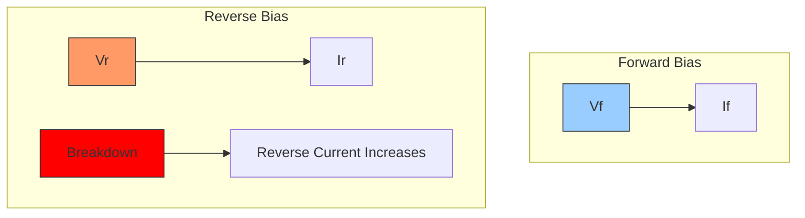

**Table: PN Junction Diode Characteristics**

| Region | Behavior |
|--------|----------|
| Forward Bias | Current increases exponentially after 0.7V (Si) |
| Reverse Bias | Very small leakage current flows |
| Breakdown | Occurs at high reverse voltage, current increases rapidly |

**Forward Bias**: Positive voltage to P-side, current flows easily after threshold.
**Reverse Bias**: Positive voltage to N-side, only small leakage current flows.

**Mnemonic:** "Forward Flows, Reverse Restricts" (FFRR)

## Question 3(d) OR [4 marks]

**Write difference between P-type and N-type semiconductor.**

**Answer**:

**Table: P-type vs N-type Semiconductor**

| Property | P-type | N-type |
|----------|--------|--------|
| Dopant | Trivalent (Boron, Gallium) | Pentavalent (Phosphorus, Arsenic) |
| Majority Carriers | Holes | Electrons |
| Minority Carriers | Electrons | Holes |
| Electrical Charge | Relatively Positive | Relatively Negative |
| Conductivity | Lower than N-type | Higher than P-type |

**Diagram:**

```mermaid
graph LR
    subgraph "P-type"
    A[Silicon] --- B[Boron]
    C[Holes] --- D[+]
    end
    subgraph "N-type"
    E[Silicon] --- F[Phosphorus]
    G[Electrons] --- H[-]
    end
    style C fill:#f96,stroke:#333
    style G fill:#9cf,stroke:#333
```

**Mnemonic:** "Positive has Plus Holes, Negative has Numerous Electrons" (PHNE)

## Question 4(a) [3 marks]

**Explain the principle of operation of LED.**

**Answer**:

LED (Light Emitting Diode) emits light when forward biased due to electron-hole recombination.

**Principle of Operation:**
When forward biased, electrons from N-side move to P-side and recombine with holes, releasing energy as photons (light).

**Table: LED Operation**

| Process | Result |
|---------|--------|
| Forward bias | Current flows |
| Electron-hole recombination | Energy release |
| Energy band gap | Determines color |

**Diagram:**

```mermaid
graph LR
    A[Forward Bias] -->|Causes| B[Current Flow]
    B -->|Creates| C[Electron-Hole Recombination]
    C -->|Releases| D[Photons or Light]

```

**Mnemonic:** "Forward Current Emits Light" (FCEL)

## Question 4(a) OR [3 marks]

**State applications of LED.**

**Answer**:

**Table: LED Applications**

| Application | Advantage |
|-------------|-----------|
| Display indicators | Low power consumption |
| Digital displays | Varied colors available |
| Lighting | Energy efficient |
| Remote controls | Infrared communication |
| Traffic signals | Long life, high visibility |

**Diagram:**

```mermaid
graph TD
    A[LED Applications] --> B[Indicators]
    A --> C[Displays]
    A --> D[Lighting]
    A --> E[Communication]
    A --> F[Signals]
    style A fill:#9cf,stroke:#333
```

**Mnemonic:** "Display Lights In Clever Signals" (DLICS)

## Question 4(b) [4 marks]

**Explain Zener diode as voltage regulator.**

**Answer**:

Zener diode maintains constant output voltage despite input voltage fluctuations when operated in reverse breakdown region.

**Circuit:**

```mermaid
graph LR
    A[Unregulated DC] --- B[Series Resistor] --- C[Output]
    C --- D[Zener Diode] --- E[Ground]
    C --- F[Load] --- E
    style A fill:#9cf,stroke:#333
    style C fill:#9f9,stroke:#333
    style D fill:#f96,stroke:#333
```

**Working:**

- Series resistor limits current
- Zener operates in breakdown region
- Maintains constant voltage across load

**Table: Zener Regulator Characteristics**

| Parameter | Description |
|-----------|-------------|
| Voltage regulation | Maintains constant output despite input changes |
| Power rating | Must handle power dissipation |
| Temperature stability | Output varies slightly with temperature |

**Mnemonic:** "Zeners Break to Regulate" (ZBR)

## Question 4(b) OR [4 marks]

**Give limitations of zener voltage regulator.**

**Answer**:

**Table: Limitations of Zener Voltage Regulator**

| Limitation | Effect |
|------------|--------|
| Power Dissipation | Limited by zener power rating |
| Current Capacity | Can handle only small loads |
| Temperature Sensitivity | Output varies with temperature |
| Efficiency | Poor efficiency due to power loss in series resistor |
| Noise | Generates electrical noise |

**Diagram:**

```mermaid
graph TD
    A[Zener Limitations] --> B[Power Limits]
    A --> C[Current Limits]
    A --> D[Temperature Effects]
    A --> E[Efficiency Issues]
    A --> F[Noise Generation]
    style A fill:#f96,stroke:#333
```

**Mnemonic:** "Power Current Temperature Efficiency Noise" (PCTEN)

## Question 4(c) [7 marks]

**Discuss the necessity of filter circuit in rectifier. List various types of filter circuits used in rectifier and explain any one with neat diagram.**

**Answer**:

**Necessity of Filter Circuit:**
Rectifier output contains AC ripple that must be removed for smoother DC. Filters reduce these ripples to provide steady DC output.

**Types of Filter Circuits:**

1. Capacitor filter (Shunt capacitor)
2. LC filter
3. π-filter (Pi-filter)
4. RC filter

**Explanation of Capacitor Filter:**

**Circuit Diagram:**

```mermaid
graph LR
    A[Rectifier Output] --- B[+]
    B --- C[Load]
    B --- D[Capacitor]
    C --- E[Ground]
    D --- E
    style A fill:#9cf,stroke:#333
    style C fill:#f96,stroke:#333
    style D fill:#9f9,stroke:#333
```

**Working:**

- Capacitor charges during voltage peaks
- Discharges slowly during voltage drops
- Maintains output voltage between peaks
- Reduces ripple voltage

**Table: Capacitor Filter Characteristics**

| Parameter | Effect |
|-----------|--------|
| Capacitance value | Higher value gives less ripple |
| Ripple reduction | Typically reduces by 70-80% |
| Load current | Higher load current causes more ripple |
| Frequency | Higher frequency is easier to filter |

**Waveforms:**

```mermaid
graph TD
    subgraph "Rectifier Output"
    A[Pulsating DC]
    end
    subgraph "Filter Output"
    B[Smoother DC]
    end
    style A fill:#f96,stroke:#333
    style B fill:#9f9,stroke:#333
```

**Mnemonic:** "Capacitors Hold Voltage During Drops" (CHVDD)

## Question 5(a) [3 marks]

**Define e-waste. List common e-waste items.**

**Answer**:

E-waste refers to discarded electronic devices and components that have reached the end of their useful life.

**Table: Common E-waste Items**

| Category | Examples |
|----------|----------|
| Computing devices | Computers, laptops, tablets |
| Communication devices | Mobile phones, telephones |
| Home appliances | TVs, refrigerators, washing machines |
| Electronic components | Circuit boards, batteries, cables |
| Office equipment | Printers, scanners, copiers |

**Diagram:**

```mermaid
graph TD
    A[E-waste] --> B[Computing]
    A --> C[Communication]
    A --> D[Home Appliances]
    A --> E[Components]
    A --> F[Office Equipment]
    style A fill:#f96,stroke:#333
```

**Mnemonic:** "Computers, Communication, Components, Home Appliances" (CCCHA)

## Question 5(b) [3 marks]

**State and explain various strategies of e-waste management.**

**Answer**:

**Table: E-waste Management Strategies**

| Strategy | Description |
|----------|-------------|
| Reduce | Minimize purchase of new electronics |
| Reuse | Extend life through repair and repurposing |
| Recycle | Process e-waste to recover valuable materials |
| Responsible disposal | Use authorized e-waste collection centers |
| Extended producer responsibility | Manufacturers take back end-of-life products |

**Diagram:**

```mermaid
graph TD
    A[E-waste Management] --> B[Reduce]
    A --> C[Reuse]
    A --> D[Recycle]
    A --> E[Responsible Disposal]
    A --> F[Extended Producer Responsibility]
    style A fill:#9cf,stroke:#333
```

**Mnemonic:** "3R's

## Question 5(c) [4 marks]

**Explain transistor as switch.**

**Answer**:

Transistor can function as an electronic switch by operating in either cutoff (OFF) or saturation (ON) region.

**Table: Transistor Switch Operation**

| State | Condition | Behavior |
|-------|-----------|----------|
| OFF (Cutoff) | Base current = 0 | No collector current flows |
| ON (Saturation) | Base current sufficient | Maximum collector current flows |

**Circuit Diagram:**

```mermaid
graph LR
    A[+Vcc] --- B[Rc] --- C[Collector]
    C --- D[Emitter] --- E[Ground]
    F[Vin] --- G[Rb] --- H[Base]
    H --- D
    style F fill:#9cf,stroke:#333
    style A fill:#f96,stroke:#333
```

**Working:**

- When input is HIGH: Transistor saturates, acts like closed switch
- When input is LOW: Transistor cuts off, acts like open switch

**Mnemonic:** "No Base No Current, Apply Base Connect Circuit" (NBNC-ABC)

## Question 5(d) [4 marks]

**Derive relation between α and β for CE configuration of transistor.**

**Answer**:

In transistors, α (alpha) and β (beta) are current gain parameters.

**Definitions:**

- α = IC/IE (Common Base current gain)
- β = IC/IB (Common Emitter current gain)

**Derivation:**
Since IE = IC + IB, we can write:
α = IC/IE = IC/(IC + IB)

Dividing numerator and denominator by IB:
α = (IC/IB)/[(IC/IB) + 1] = β/(β + 1)

Therefore:
β = α/(1-α)

**Table: Relationship between α and β**

| Parameter | Formula | Typical Range |
|-----------|---------|---------------|
| α from β | α = β/(β+1) | 0.9 to 0.99 |
| β from α | β = α/(1-α) | 50 to 300 |

**Diagram:**

```mermaid
graph TD
    A[alpha = IC divided by IE] --- B[beta = IC divided by IB]
    C[beta = alpha divided by 1 minus alpha] --- D[alpha = beta divided by beta plus 1]

    style A fill:#9cf,stroke:#333
    style B fill:#f96,stroke:#333
```

**Mnemonic:** "Beta equals Alpha divided by One minus Alpha" (BAOA)
