## પ્રશ્ન 1(અ) [3 ગુણ]

**ડાયોડના ફોરવડડ અને રિવર્સ બાયસને વ્યાખ્યાયિત કરો.**

**જવાબ**:

**ડાયોડનો ફોરવડડ બાયસ**: 

- **જોડાણની પદ્ધતિ**: P-ટાઈપ બેટરીના પોઝિટિવ ટર્મિનલ સાથે અને N-ટાઈપ નેગેટિવ ટર્મિનલ સાથે જોડાયેલા
- **અવરોધ પહોળાઈ**: અવરોધની પહોળાઈ ઘટે છે
- **અવરોધ**: ઓછો અવરોધ (આશરે 100-1000Ω)
- **કરંટ પ્રવાહ**: ડાયોડ દ્વારા સરળતાથી કરંટ પસાર થવા દે છે

**ડાયોડનો રિવર્સ બાયસ**:

- **જોડાણની પદ્ધતિ**: P-ટાઈપ નેગેટિવ ટર્મિનલ સાથે અને N-ટાઈપ પોઝિટિવ ટર્મિનલ સાથે જોડાયેલા
- **અવરોધ પહોળાઈ**: અવરોધની પહોળાઈ વધે છે
- **અવરોધ**: ખૂબ ઊંચો અવરોધ (આશરે કેટલાક MΩ)
- **કરંટ પ્રવાહ**: કરંટ પ્રવાહને અટકાવે છે (માત્ર નાનો લીકેજ કરંટ પસાર થાય છે)

**આકૃતિ**:

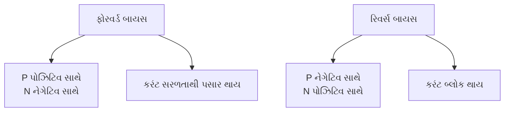

**યાદ રાખવાની ટિપ્સ**: "PFNR" - "Positive to P Forward, Negative to P Reverse"

## પ્રશ્ન 1(બ) [4 ગુણ]

**LDRનું બંધારણ અને કાર્ય સમજાવો.**

**જવાબ**:

**LDRનું બંધારણ**:

- **સામગ્રી**: સેમિકંડક્ટર સામગ્રી (કેડમિયમ સલ્ફાઇડ)થી બનેલું
- **પેટર્ન**: સિરામિક બેઝ પર ફોટોસેન્સિટિવ સામગ્રીનું ઝિગઝેગ પેટર્ન
- **ઇલેક્ટ્રોડ્સ**: બંને છેડે મેટલ ઇલેક્ટ્રોડ્સ
- **પેકેજિંગ**: પારદર્શક પ્લાસ્ટિક અથવા ગ્લાસ કેસમાં એન્કેપ્સ્યુલેટેડ

**કાર્યપ્રણાલી**:

- **ફોટોકન્ડક્ટિવિટી**: ફોટોકન્ડક્ટિવિટી સિદ્ધાંત પર આધારિત
- **અંધકારમાં અવરોધ**: અંધકારની સ્થિતિમાં ઉચ્ચ અવરોધ (MΩ રેન્જ)
- **પ્રકાશ સંપર્ક**: જ્યારે પ્રકાશના સંપર્કમાં આવે છે, ત્યારે ફોટોન્સ ઇલેક્ટ્રોન્સને મુક્ત કરે છે
- **અવરોધમાં ઘટાડો**: તેજ પ્રકાશમાં અવરોધ ઘટે છે (kΩ રેન્જ)

**આકૃતિ**:

```goat
 +------+
 |      |    Zigzag pattern of
 | +-\/-+ <- semiconductor material
 | |    |
 | +-/\-+
 |      |
 +------+
  |    |
  |    |
  L    D <- Leads
```

**યાદ રાખવાની ટિપ્સ**: "MILD" - "More Illumination, Less Dark-resistance"

## પ્રશ્ન 1(ક) [7 ગુણ]

**રેસિસ્ટરની કલર બેન્ડ કોડિંગ પદ્ધતિ સમજાવો. 47kΩ ±5% રેસિસ્ટરની કલર બેન્ડ લખો.**

**જવાબ**:

**કલર બેન્ડ કોડિંગ પદ્ધતિ**:

| રંગ     | મૂલ્ય | ગુણાંક    | ટોલરન્સ |
|---------|-------|-----------|---------|
| કાળો    | 0     | 10⁰       | -       |
| બ્રાઉન   | 1     | 10¹       | ±1%     |
| લાલ     | 2     | 10²       | ±2%     |
| નારંગી  | 3     | 10³       | -       |
| પીળો    | 4     | 10⁴       | -       |
| લીલો    | 5     | 10⁵       | ±0.5%   |
| બ્લુ    | 6     | 10⁶       | ±0.25%  |
| વાયોલેટ | 7     | 10⁷       | ±0.1%   |
| ગ્રે     | 8     | 10⁸       | ±0.05%  |
| સફેદ    | 9     | 10⁹       | -       |
| ગોલ્ડ   | -     | 10⁻¹      | ±5%     |
| સિલ્વર  | -     | 10⁻²      | ±10%    |
| રંગવિહીન | -     | -         | ±20%    |

**4-બેન્ડ રેસિસ્ટર કલર કોડ**:

- **પ્રથમ બેન્ડ**: પ્રથમ અર્થપૂર્ણ અંક
- **બીજી બેન્ડ**: બીજો અર્થપૂર્ણ અંક
- **ત્રીજી બેન્ડ**: ગુણાંક
- **ચોથી બેન્ડ**: ટોલરન્સ

**47kΩ ±5% માટે**:

- પ્રથમ અંક: 4 = પીળો
- બીજો અંક: 7 = વાયોલેટ
- ગુણાંક: 10³ = નારંગી (kΩ માટે)
- ટોલરન્સ: ±5% = ગોલ્ડ

**47kΩ ±5% માટે કલર બેન્ડ**: પીળો-વાયોલેટ-નારંગી-ગોલ્ડ

**આકૃતિ**:

```goat
+---+---+---+---+-------------+
|   |   |   |   |             |
| Y | V | O | G |             |
|   |   |   |   |             |
+---+---+---+---+-------------+
  |   |   |   |
  |   |   |   +-- Gold (±5%)
  |   |   +------ Orange (10³)
  |   +---------- Violet (7)
  +-------------- Yellow (4)
```

**યાદ રાખવાની ટિપ્સ**: "BAND" - "Beginning digits, Amplify with Multiplier, Note tolerance with last band, Decode carefully"

## પ્રશ્ન 1(ક) [7 ગુણ] (અથવા)

**એલ્યુમિનિયમ ઇલેક્ટ્રોલિટીક વેટ ટાઇપ કેપેસિટર સમજાવો.**

**જવાબ**:

**એલ્યુમિનિયમ ઇલેક્ટ્રોલિટીક વેટ ટાઇપ કેપેસિટર**:

**બંધારણ**:

- **પ્લેટ્સ**: બે એલ્યુમિનિયમ ફોઇલ્સ (એનોડ અને કેથોડ)
- **ડાયલેક્ટ્રિક**: એનોડ ફોઇલ પર એલ્યુમિનિયમ ઓક્સાઇડ લેયર
- **ઇલેક્ટ્રોલાઇટ**: લિક્વિડ ઇલેક્ટ્રોલાઇટ (બોરિક એસિડ, સોડિયમ બોરેટ વગેરે)
- **સેપરેટર**: ઇલેક્ટ્રોલાઇટમાં પલાળેલ પેપર સેપરેટર
- **એન્ક્લોઝર**: રબર સીલ સાથેનું એલ્યુમિનિયમ કેન

**કાર્યપ્રણાલી**:

- **ઓક્સાઇડ લેયર**: પાતળી એલ્યુમિનિયમ ઓક્સાઇડ લેયર ડાયલેક્ટ્રિક તરીકે કામ કરે છે
- **ઇલેક્ટ્રોલાઇટ**: બીજી પ્લેટ સાથે કેથોડ કનેક્શન તરીકે કાર્ય કરે છે
- **પોલરાઇઝેશન**: નિર્ધારિત ધ્રુવીયતા (+ અને -) ટર્મિનલ્સ ધરાવે છે

**લાક્ષણિકતાઓ**:

- **કેપેસિટન્સ રેન્જ**: 1μF થી 47,000μF
- **વોલ્ટેજ રેટિંગ**: 6.3V થી 450V
- **ધ્રુવીયતા**: ધ્રુવીય (યોગ્ય રીતે જોડવું જરૂરી)
- **લીકેજ કરંટ**: અન્ય કેપેસિટર પ્રકારો કરતાં વધારે
- **ESR**: ઉચ્ચ સમકક્ષ શ્રેણી અવરોધ

**આકૃતિ**:

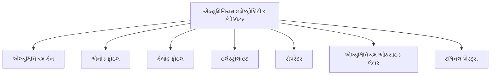

**યાદ રાખવાની ટિપ્સ**: "POLE" - "Polarized, Oxide layer, Liquid electrolyte, Enormous capacitance"

## પ્રશ્ન 2(અ) [3 ગુણ]

**શોટકી ડાયોડ, LED અને ફોટો-ડાયોડના સંજ્ઞા દોરો.**

**જવાબ**:

**સંજ્ઞાઓ**:

```goat
Schottky Diode      LED                 Photo-diode
   +----|<---+      +---|>|---+         +---|<|---+
   |         |      |    |    |         |    ↓    |
   |         |      |   / \   |         |   / \   |
   +---------+      |  /   \  |         |  \   /  |
                    | /     \ |         |   \ /   |
                    +---------+         +---------+
```

**મુખ્ય લક્ષણો**:

- **શોટકી ડાયોડ**: સ્ટાન્ડર્ડ ડાયોડ સંજ્ઞા સાથે વક્ર બાર (મેટલ-સેમિકંડક્ટર જંક્શનનું પ્રતિનિધિત્વ કરે છે)
- **LED**: સ્ટાન્ડર્ડ ડાયોડ સંજ્ઞા સાથે બહાર તરફ પોઈન્ટ કરતા બે તીર (પ્રકાશ ઉત્સર્જનનું પ્રતિનિધિત્વ કરે છે)
- **ફોટો-ડાયોડ**: સ્ટાન્ડર્ડ ડાયોડ સંજ્ઞા સાથે ડાયોડ તરફ પોઈન્ટ કરતા બે તીર (પ્રકાશ શોષણનું પ્રતિનિધિત્વ કરે છે)

**યાદ રાખવાની ટિપ્સ**: "SLP" - "Schottky has curve, LED emits, Photo-diode absorbs"

## પ્રશ્ન 2(બ) [4 ગુણ]

**ઉદાહરણ સાથે એક્ટિવ અને પેસીવ કમ્પોનન્ટને વ્યાખ્યાયિત કરો.**

**જવાબ**:

**પેસીવ કમ્પોનન્ટ્સ**:

| લાક્ષણિકતા | વર્ણન | ઉદાહરણો |
|------------|-------|---------|
| **પાવર** | પાવર જનરેટ કરી શકતા નથી | રેસિસ્ટર્સ, કેપેસિટર્સ, ઇન્ડક્ટર્સ |
| **સિગ્નલ** | સિગ્નલને એમ્પલિફાય કરી શકતા નથી | ટ્રાન્સફોર્મર્સ, ડાયોડ્સ |
| **નિયંત્રણ** | કરંટ પ્રવાહ પર કોઈ નિયંત્રણ નથી | કનેક્ટર્સ, સ્વિચેસ |
| **ઊર્જા** | ઊર્જા સંગ્રહ અથવા વપરાશ કરે છે | ફ્યુઝ, ફિલ્ટર્સ |

**એક્ટિવ કમ્પોનન્ટ્સ**:

| લાક્ષણિકતા | વર્ણન | ઉદાહરણો |
|------------|-------|---------|
| **પાવર** | પાવર જનરેટ કરી શકે છે | ટ્રાન્ઝિસ્ટર્સ, ICs |
| **સિગ્નલ** | સિગ્નલને એમ્પલિફાય કરી શકે છે | ઓપ-એમ્પ્સ, એમ્પલિફાયર્સ |
| **નિયંત્રણ** | કરંટ પ્રવાહને નિયંત્રિત કરે છે | SCRs, MOSFETs |
| **નિર્ભરતા** | બાહ્ય પાવરની જરૂર પડે છે | વોલ્ટેજ રેગ્યુલેટર્સ, માઇક્રોકન્ટ્રોલર્સ |

**આકૃતિ**:

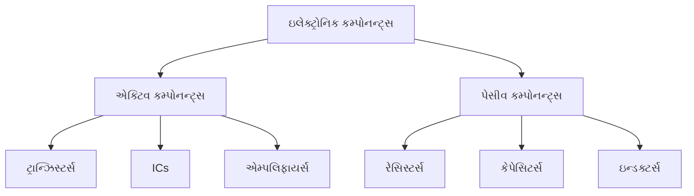

**યાદ રાખવાની ટિપ્સ**: "PASS-ACT" - "Passive stores or dissipates, Active controls or amplifies"

## પ્રશ્ન 2(ક) [7 ગુણ]

**ફુલ વેવ બ્રિજ રેક્ટિફાયરની કાર્યપદ્ધતી સમજાવો.**

**જવાબ**:

**ફુલ વેવ બ્રિજ રેક્ટિફાયર**:

**સર્કિટ બંધારણ**:

- **ડાયોડ્સ**: બ્રિજ કોન્ફિગરેશનમાં ગોઠવાયેલા ચાર ડાયોડ્સ
- **ઇનપુટ**: ટ્રાન્સફોર્મર સેકન્ડરીથી AC સપ્લાય
- **આઉટપુટ**: ફિલ્ટર કેપેસિટર સાથે લોડ રેસિસ્ટર પર પલ્સેટિંગ DC

**કાર્યપ્રણાલી**:

- **પોઝિટિવ હાફ સાયકલ**: D1 અને D3 કન્ડક્ટ કરે છે, D2 અને D4 બ્લોક કરે છે
- **નેગેટિવ હાફ સાયકલ**: D2 અને D4 કન્ડક્ટ કરે છે, D1 અને D3 બ્લોક કરે છે
- **કરંટ પ્રવાહ**: હંમેશા એક જ દિશામાં લોડ દ્વારા પસાર થાય છે

**પર્ફોર્મન્સ પેરામીટર્સ**:

- **રિપલ ફ્રિક્વન્સી**: ઇનપુટ ફ્રિક્વન્સીના 2× (50 Hz ઇનપુટ માટે 100 Hz)
- **કાર્યક્ષમતા**: 81.2%
- **PIV**: દરેક ડાયોડ માટે V₀(max)
- **TUF**: 0.812 (ટ્રાન્સફોર્મર યુટિલાઇઝેશન ફેક્ટર)

**આકૃતિ**:

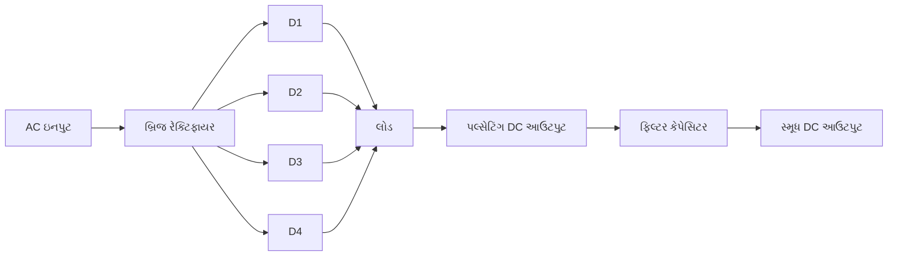

**યાદ રાખવાની ટિપ્સ**: "BRIDGE" - "Better Rectification with Improved Diode Geometry Efficiency"

## પ્રશ્ન 2(અ) [3 ગુણ] (અથવા)

**LED નું બંધારણ અને કાર્ય સમજાવો.**

**જવાબ**:

**LED નું બંધારણ**:

- **સામગ્રી**: સેમિકંડક્ટર (GaAs, GaP, AlGaInP, વગેરે)
- **જંક્શન**: ભારે ડોપિંગવાળા સેમિકંડક્ટર્સ સાથે P-N જંક્શન
- **પેકેજ**: પારદર્શક અથવા રંગીન એપોક્સી લેન્સમાં કેસિંગ
- **કેથોડ**: પેકેજ પર ફ્લેટ બાજુ અથવા ટૂંકા લીડ દ્વારા ઓળખાય છે

**કાર્યપ્રણાલી**:

- **ફોરવર્ડ બાયસ**: P-N જંક્શન પર લાગુ કરવામાં આવે છે
- **રિકંબિનેશન**: ઇલેક્ટ્રોન્સ અને હોલ્સ જંક્શન પર રિકમ્બાઇન થાય છે
- **ઊર્જા પ્રકાશન**: ફોટોન્સ (પ્રકાશ) તરીકે ઊર્જા પ્રકાશિત થાય છે
- **તરંગ લંબાઈ**: સેમિકંડક્ટર સામગ્રીના બેન્ડ ગેપ દ્વારા નક્કી થાય છે

**આકૃતિ**:

```goat
        +-------+
        |       |
        |   ^   |
        |  / \  | <- Epoxy lens
        | /   \ |
        |/     \|
    ----+-------+----
    |       |       |
    |       |       |
    |       |       |
  Anode   Chip   Cathode
```

**યાદ રાખવાની ટિપ્સ**: "LEDS" - "Light Emits During electron-hole recombination in Semiconductor"

## પ્રશ્ન 2(બ) [4 ગુણ] (અથવા)

**કોમ્પોસીશન ટાઈપ રિસિસ્ટર સમજાવો.**

**જવાબ**:

**કોમ્પોસીશન રિસિસ્ટર્સ**:

**બંધારણ**:

- **કોર સામગ્રી**: ઇન્સ્યુલેટિંગ સામગ્રી (ક્લે/સિરેમિક) સાથે મિશ્ર કાર્બન કણો
- **બાઇન્ડિંગ**: રેઝિન બાઇન્ડર ઘન સિલિન્ડ્રિકલ આકાર બનાવે છે
- **ટર્મિનલ્સ**: છેડા પર લીડ્સ વાળા મેટલ કેપ્સ
- **સુરક્ષા**: ઇન્સ્યુલેટિંગ પેઇન્ટ અથવા પ્લાસ્ટિકથી કોટેડ

**લાક્ષણિકતાઓ**:

- **રેસિસ્ટન્સ રેન્જ**: 1Ω થી 22MΩ
- **પાવર રેટિંગ**: 1/8W થી 2W
- **ટોલરન્સ**: ±5% થી ±20%
- **તાપમાન ગુણાંક**: -500 થી +500 ppm/°C

**ફાયદા અને મર્યાદાઓ**:

- **કિંમત**: ઓછી કિંમત
- **અવાજ**: ઉચ્ચ અવાજ સ્તર
- **સ્થિરતા**: તાપમાન સાથે ઓછી સ્થિરતા
- **ઉપયોગો**: સામાન્ય હેતુ, બિન-મહત્વપૂર્ણ એપ્લિકેશન્સ

**આકૃતિ**:

```goat
    +---------------------+
    |                     |
    |  +---------------+  |
    |  | Carbon        |  | <- Insulating
    |  | Composition   |  |    coating
    |  +---------------+  |
    |                     |
    +---------------------+
    |         |
    |         |
Lead         Lead
```

**યાદ રાખવાની ટિપ્સ**: "CCRI" - "Carbon Composition Resistors are Inexpensive"

## પ્રશ્ન 2(ક) [7 ગુણ] (અથવા)

**બે ડાયોડ - ફુલ વેવ રેક્ટિફાયરની કાર્યપદ્ધતી સમજાવો.**

**જવાબ**:

**બે ડાયોડ ફુલ વેવ રેક્ટિફાયર (સેન્ટર-ટેપ)**:

**સર્કિટ બંધારણ**:

- **ટ્રાન્સફોર્મર**: સેન્ટર-ટેપ્ડ ટ્રાન્સફોર્મર સેકન્ડરી
- **ડાયોડ્સ**: સેકન્ડરીના વિરોધાભાસી છેડાઓ સાથે જોડાયેલા બે ડાયોડ્સ
- **આઉટપુટ**: સેન્ટર ટેપ અને ડાયોડ જંક્શન વચ્ચેથી લેવામાં આવે છે

**કાર્યપ્રણાલી**:

- **પોઝિટિવ હાફ સાયકલ**: સેકન્ડરીનો ઉપરનો ભાગ પોઝિટિવ, D1 કન્ડક્ટ કરે છે, D2 બ્લોક કરે છે
- **નેગેટિવ હાફ સાયકલ**: સેકન્ડરીનો નીચેનો ભાગ પોઝિટિવ, D2 કન્ડક્ટ કરે છે, D1 બ્લોક કરે છે
- **કરંટ પ્રવાહ**: હંમેશા એક જ દિશામાં લોડ દ્વારા પસાર થાય છે

**પર્ફોર્મન્સ પેરામીટર્સ**:

- **રિપલ ફ્રિક્વન્સી**: ઇનપુટ ફ્રિક્વન્સીના 2× (50 Hz ઇનપુટ માટે 100 Hz)
- **કાર્યક્ષમતા**: 81.2%
- **PIV**: દરેક ડાયોડ માટે 2V₀(max) (સેન્ટર-ટેપ રેક્ટિફાયરના બે ગણા)
- **TUF**: 0.693 (ટ્રાન્સફોર્મર યુટિલાઇઝેશન ફેક્ટર)

**આકૃતિ**:

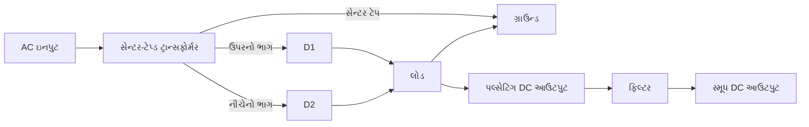

**યાદ રાખવાની ટિપ્સ**: "CTFWR" - "Center Tap Facilitates Whole-cycle Rectification"

## પ્રશ્ન 3(અ) [3 ગુણ]

**શોટકી ડાયોડની કાર્યપદ્ધતી સમજાવો.**

**જવાબ**:

**શોટકી ડાયોડની કાર્યપદ્ધતી**:

- **જંક્શન પ્રકાર**: P-N ને બદલે મેટલ-સેમિકંડક્ટર (M-S) જંક્શન
- **ચાર્જ કેરિયર્સ**: મેજોરિટી કેરિયર ડિવાઇસ (N-ટાઇપમાં ઇલેક્ટ્રોન્સ)
- **બેરિયર**: મેટલ-સેમિકંડક્ટર ઇન્ટરફેસ પર શોટકી બેરિયર બને છે
- **ફોરવર્ડ વોલ્ટેજ**: ઓછું ફોરવર્ડ વોલ્ટેજ ડ્રોપ (Si ડાયોડના 0.7V વિરુદ્ધ 0.2-0.4V)

**મુખ્ય લક્ષણો**:

- **સ્વિચિંગ સ્પીડ**: ખૂબ ઝડપી સ્વિચિંગ (માઇનોરિટી કેરિયર સ્ટોરેજ નથી)
- **ઉપયોગો**: હાઈ-ફ્રિક્વન્સી સર્કિટ્સ, પાવર સપ્લાય
- **રિકવરી ટાઇમ**: નહીવત રિવર્સ રિકવરી ટાઇમ

**આકૃતિ**:

```goat
Metal    |    N-type
         |
      +--+--+
      |     |
      | M-S |  <- Schottky Barrier
      |     |
      +-----+
```

**યાદ રાખવાની ટિપ્સ**: "SFAM" - "Schottky's Fast And Metal-based"

## પ્રશ્ન 3(બ) [4 ગુણ]

**N ટાઈપ સેમિકંડક્ટર સમજાવો.**

**જવાબ**:

**N-ટાઈપ સેમિકંડક્ટર**:

**નિર્માણ**:

- **બેઝ સામગ્રી**: ઇન્ટ્રિન્સિક સેમિકંડક્ટર (સિલિકોન અથવા જર્મેનિયમ)
- **ડોપિંગ એલિમેન્ટ**: પેન્ટાવેલન્ટ અશુદ્ધિ (P, As, Sb)
- **ડોપિંગ પ્રક્રિયા**: થર્મલ ડિફ્યુઝન અથવા આયોન ઇમ્પ્લાન્ટેશન
- **કન્સંટ્રેશન**: સામાન્ય રીતે 10⁸ સિલિકોન ભાગોએ 1 ભાગ અશુદ્ધિ

**લક્ષણો**:

- **મેજોરિટી કેરિયર્સ**: ઇલેક્ટ્રોન્સ (નેગેટિવ ચાર્જ કેરિયર્સ)
- **માઇનોરિટી કેરિયર્સ**: હોલ્સ
- **કન્ડક્ટિવિટી**: ઇન્ટ્રિન્સિક સેમિકંડક્ટર કરતાં વધારે
- **ફર્મી લેવલ**: કન્ડક્શન બેન્ડની નજીક

**આકૃતિ**:

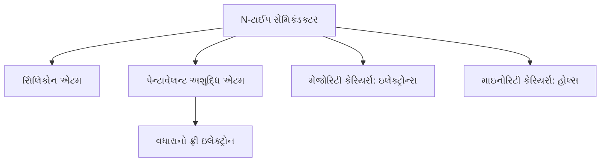

**યાદ રાખવાની ટિપ્સ**: "PENT" - "Pentavalent Element makes N-Type with free electrons"

## પ્રશ્ન 3(ક) [7 ગુણ]

**PN જંક્શન ડાયોડનું બંધારણ અને કાર્ય સમજાવો.**

**જવાબ**:

**PN જંક્શન ડાયોડનું બંધારણ**:

- **સામગ્રી**: P-ટાઈપ અને N-ટાઈપ સેમિકંડક્ટર પ્રદેશો
- **જંક્શન**: ડિફ્યુઝન અથવા એપિટેક્સિયલ ગ્રોથ દ્વારા બનાવવામાં આવે છે
- **ડિપ્લેશન રીજન**: જંક્શન ઇન્ટરફેસ પર બને છે
- **કોન્ટેક્ટ્સ**: બંને પ્રદેશોમાં મેટલ કોન્ટેક્ટ્સ જોડાયેલા
- **પેકેજિંગ**: ગ્લાસ, પ્લાસ્ટિક, અથવા મેટલ કેસમાં સીલ કરેલું

**કાર્યપ્રણાલી**:

- **ડિપ્લેશન રીજન**: કેરિયર્સના ડિફ્યુઝનને કારણે બને છે
- **બેરિયર પોટેન્શિયલ**: જંક્શન પર બને છે (Si માટે 0.7V, Ge માટે 0.3V)
- **ફોરવર્ડ બાયસ**: જ્યારે ફોરવર્ડ વોલ્ટેજ > બેરિયર પોટેન્શિયલ હોય ત્યારે કરંટ વહે છે
- **રિવર્સ બાયસ**: બ્રેકડાઉન સુધી માત્ર નાનો લીકેજ કરંટ વહે છે

**આકૃતિ**:

```goat
    +-------+-------+
    |       |       |
    |   P   |   N   |
    |       |       |
    +-------+-------+
        |       |
      Anode  Cathode

    Depletion region at junction
```

**યાદ રાખવાની ટિપ્સ**: "BIRD" - "Barrier forms at Interface, Rectifies Direct current"

## પ્રશ્ન 3(અ) [3 ગુણ] (અથવા)

**ફોટો ડાયોડની કાર્યપદ્ધતી સમજાવો.**

**જવાબ**:

**ફોટો-ડાયોડની કાર્યપદ્ધતી**:

- **ઓપરેશન મોડ**: રિવર્સ બાયસ્ડ P-N જંક્શન
- **પ્રકાશ શોષણ**: ફોટોન્સ ડિપ્લેશન રીજનમાં ઇલેક્ટ્રોન-હોલ જોડી બનાવે છે
- **કેરિયર જનરેશન**: પ્રકાશ ઊર્જા > બેન્ડ ગેપ ઊર્જા હોય તો ફ્રી કેરિયર્સ બને છે
- **કરંટ ફ્લો**: ફોટોકરંટ પ્રકાશની તીવ્રતા સાથે પ્રમાણમાં હોય છે

**મુખ્ય લક્ષણો**:

- **સેન્સિટિવિટી**: સેમિકંડક્ટર સામગ્રી અને તરંગ લંબાઈ પર આધાર રાખે છે
- **રિસ્પોન્સ ટાઇમ**: ખૂબ ઝડપી (ns રેન્જ)
- **ઓપરેટિંગ મોડ્સ**: ફોટોવોલ્ટેઇક મોડ અથવા ફોટોકન્ડક્ટિવ મોડ
- **ઉપયોગો**: લાઇટ સેન્સર્સ, ઓપ્ટિકલ કોમ્યુનિકેશન

**આકૃતિ**:

```goat
       Light
         ↓
    +----+----+
    |         |
 ---+         +---
    |    PN   |
    | Junction|
    |         |
 ---+         +---
    |         |
    +---------+
```

**યાદ રાખવાની ટિપ્સ**: "PLIP" - "Photons Lead to Increased Photocurrent"

## પ્રશ્ન 3(બ) [4 ગુણ] (અથવા)

**P ટાઈપ સેમિકંડક્ટર સમજાવો.**

**જવાબ**:

**P-ટાઈપ સેમિકંડક્ટર**:

**નિર્માણ**:

- **બેઝ સામગ્રી**: ઇન્ટ્રિન્સિક સેમિકંડક્ટર (સિલિકોન અથવા જર્મેનિયમ)
- **ડોપિંગ એલિમેન્ટ**: ટ્રાઇવેલન્ટ અશુદ્ધિ (B, Al, Ga)
- **ડોપિંગ પ્રક્રિયા**: થર્મલ ડિફ્યુઝન અથવા આયોન ઇમ્પ્લાન્ટેશન
- **કન્સંટ્રેશન**: સામાન્ય રીતે 10⁸ સિલિકોન ભાગોએ 1 ભાગ અશુદ્ધિ

**લક્ષણો**:

- **મેજોરિટી કેરિયર્સ**: હોલ્સ (પોઝિટિવ ચાર્જ કેરિયર્સ)
- **માઇનોરિટી કેરિયર્સ**: ઇલેક્ટ્રોન્સ
- **કન્ડક્ટિવિટી**: ઇન્ટ્રિન્સિક સેમિકંડક્ટર કરતાં વધારે
- **ફર્મી લેવલ**: વેલેન્સ બેન્ડની નજીક

**આકૃતિ**:

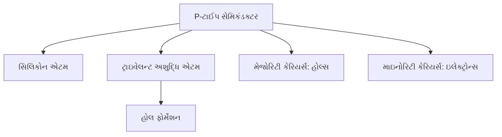

**યાદ રાખવાની ટિપ્સ**: "TRIP" - "TRIvalent impurity Produces holes in P-type"

## પ્રશ્ન 3(ક) [7 ગુણ] (અથવા)

**હાફ વેવ અને ફુલ વેવ રેક્ટિફાયરની સરખામણી કરો.**

**જવાબ**:

**હાફ વેવ અને ફુલ વેવ રેક્ટિફાયરની સરખામણી**:

| પેરામીટર | હાફ વેવ રેક્ટિફાયર | ફુલ વેવ રેક્ટિફાયર |
|-----------|---------------------|---------------------|
| **સર્કિટ જટિલતા** | સરળ, 1 ડાયોડ વાપરે છે | જટિલ, 2 અથવા 4 ડાયોડ વાપરે છે |
| **આઉટપુટ વેવફોર્મ** | અડધા સાયકલ માટે પલ્સેટિંગ DC | પૂર્ણ સાયકલ માટે પલ્સેટિંગ DC |
| **કાર્યક્ષમતા** | 40.6% | 81.2% |
| **રિપલ ફેક્ટર** | 1.21 | 0.48 |
| **રિપલ ફ્રિક્વન્સી** | ઇનપુટ જેટલી જ (50 Hz) | ઇનપુટના બમણી (100 Hz) |
| **ડાયોડનો PIV** | V<sub>m</sub> | 2V<sub>m</sub> (સેન્ટર-ટેપ), V<sub>m</sub> (બ્રિજ) |
| **TUF** | 0.287 | 0.693 (સેન્ટર-ટેપ), 0.812 (બ્રિજ) |
| **DC આઉટપુટ વોલ્ટેજ** | 0.318V<sub>m</sub> | 0.636V<sub>m</sub> |
| **ફોર્મ ફેક્ટર** | 1.57 | 1.11 |
| **ઉપયોગો** | ઓછી પાવર એપ્લિકેશન્સ | પાવર સપ્લાય, બેટરી ચાર્જર્સ |

**આકૃતિ**:

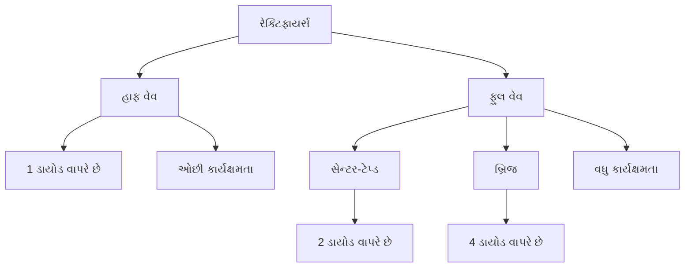

**યાદ રાખવાની ટિપ્સ**: "HERO" - "Half wave: Efficiency Reduced, One-half cycle only"

## પ્રશ્ન 4(અ) [3 ગુણ]

**PNP અને NPN ટ્રાન્ઝિસ્ટરની સંજ્ઞા અને બંધારણ યોગ્ય નામ નિદેશ સાથે દોરો.**

**જવાબ**:

**ટ્રાન્ઝિસ્ટર સંજ્ઞા અને બંધારણ**:

```goat
NPN Symbol         PNP Symbol
    C                  C
    |                  |
    |                  |
    —                  —
   /                  /
  |                  |
  |\                 |>
  | \                |
  |  >               |/
  | /                |
  |/                 |
    —                  —
    |                  |
    |                  |
    B                  B
    |                  |
    |                  |
    —                  —
    |                  |
    |                  |
    E                  E
```

**બંધારણ**:

```goat
NPN Construction           PNP Construction
    +-------+                 +-------+
    |   N   |                 |   P   | <- Collector
    +-------+                 +-------+
    |   P   |                 |   N   | <- Base
    +-------+                 +-------+
    |   N   |                 |   P   | <- Emitter
    +-------+                 +-------+
```

**યાદ રાખવાની ટિપ્સ**: "NIN-PIP" - "N-P-N layers for NPN, P-N-P layers for PNP"

## પ્રશ્ન 4(બ) [4 ગુણ]

**ટ્રાન્ઝિસ્ટર એમ્પ્લીફાયરની કાર્યપદ્ધતી સમજાવો.**

**જવાબ**:

**ટ્રાન્ઝિસ્ટર એમ્પ્લીફાયરની કાર્યપદ્ધતિ**:

**સર્કિટ કોન્ફિગરેશન**:

- **કોમન એમિટર**: સૌથી વધુ ઉપયોગમાં આવે છે
- **બાયસિંગ**: એક્ટિવ રીજનમાં કામ કરવા માટે યોગ્ય DC બાયસ આપવામાં આવે છે
- **કપલિંગ**: કેપેસિટર્સ દ્વારા ઇનપુટ/આઉટપુટ કપલિંગ
- **લોડ**: લોડ તરીકે કલેક્ટર રેસિસ્ટર

**કાર્યપ્રણાલી**:

- **ઇનપુટ સિગ્નલ**: બેઝ-એમિટર જંક્શન પર લાગુ કરવામાં આવે છે
- **બેઝ કરંટ**: નાનો બેઝ કરંટ મોટા કલેક્ટર કરંટને નિયંત્રિત કરે છે
- **એમ્પ્લિફિકેશન**: ઇનપુટ વોલ્ટેજમાં નાના ફેરફારથી આઉટપુટ વોલ્ટેજમાં મોટા ફેરફારો થાય છે
- **ફેઝ શિફ્ટ**: ઇનપુટ અને આઉટપુટ વચ્ચે 180° ફેઝ શિફ્ટ

**મુખ્ય પેરામીટર્સ**:

- **વોલ્ટેજ ગેઇન**: A<sub>v</sub> = V<sub>out</sub>/V<sub>in</sub>
- **કરંટ ગેઇન**: β = I<sub>c</sub>/I<sub>b</sub>
- **ઇનપુટ ઇમ્પીડન્સ**: સામાન્ય રીતે CE કોન્ફિગરેશનમાં 1-2kΩ

**આકૃતિ**:

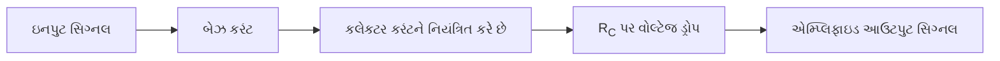

**યાદ રાખવાની ટિપ્સ**: "ABCD" - "Amplification through Base Controlled collector Current Dynamics"

## પ્રશ્ન 4(ક) [7 ગુણ]

**ઝેનર ડાયોડની કાર્યપદ્ધતી સમજાવો.**

**જવાબ**:

**ઝેનર ડાયોડની કાર્યપદ્ધતિ**:

**મૂળભૂત સ્ટ્રક્ચર**:

- **જંક્શન**: ભારે ડોપિંગવાળું P-N જંક્શન
- **બંધારણ**: સામાન્ય ડાયોડ જેવું પરંતુ બ્રેકડાઉન માટે ઓપ્ટિમાઇઝ્ડ
- **બ્રેકડાઉન**: રિવર્સ બ્રેકડાઉન રીજનમાં કામ કરવા માટે ડિઝાઇન કરેલું

**કાર્યપ્રણાલી**:

- **ફોરવર્ડ બાયસ**: સામાન્ય ડાયોડની જેમ કામ કરે છે
- **રિવર્સ બાયસ**: 
  - બ્રેકડાઉન નીચે: નાનો લીકેજ કરંટ
  - બ્રેકડાઉન પર: ઝેનર વોલ્ટેજ પર કરંટમાં તીવ્ર વધારો
  - બ્રેકડાઉનથી આગળ: સ્થિર વોલ્ટેજ જાળવે છે

**બ્રેકડાઉન મેકેનિઝમ્સ**:

- **ઝેનર ઇફેક્ટ**: 5V નીચે પ્રભાવી (ડાયરેક્ટ ટનલિંગ)
- **એવેલેન્ચ ઇફેક્ટ**: 5V ઉપર પ્રભાવી (ઇમ્પેક્ટ આયોનાઇઝેશન)

**ઉપયોગો**:

- **વોલ્ટેજ રેગ્યુલેશન**: સ્થિર આઉટપુટ વોલ્ટેજ જાળવે છે
- **રેફરન્સ વોલ્ટેજ**: ચોક્કસ વોલ્ટેજ રેફરન્સ
- **ઓવરવોલ્ટેજ પ્રોટેક્શન**: સંવેદનશીલ કોમ્પોનન્ટ્સનું રક્ષણ કરે છે

**આકૃતિ**:

```goat
    I
    ^
    |               /
    |              /
    |             /
    |            /
    |           /
    +----------+------> V
    |         /|
    |        / |
    |       /  |
    |      /   |
    |  Reverse | Forward
    |  Breakdown
```

**યાદ રાખવાની ટિપ્સ**: "ZEBRA" - "Zener Effect Breaks at Regulated Avalanche voltage"

## પ્રશ્ન 4(અ) [3 ગુણ] (અથવા)

**ટ્રાન્ઝિસ્ટરને સ્વીચ તરીકે સમજાવો.**

**જવાબ**:

**ટ્રાન્ઝિસ્ટર સ્વીચ**:

**ઓપરેટિંગ રીજન્સ**:

- **કટઓફ રીજન**: ટ્રાન્ઝિસ્ટર OFF (I<sub>B</sub> = 0, I<sub>C</sub> ≈ 0)
- **સેચ્યુરેશન રીજન**: ટ્રાન્ઝિસ્ટર ON (I<sub>B</sub> > I<sub>C</sub>/β, V<sub>CE</sub> ≈ 0.2V)

**સ્વિચિંગ ઓપરેશન**:

- **OFF સ્ટેટ**: કોઈ બેઝ કરંટ નહીં, ઉચ્ચ V<sub>CE</sub>, ઓપન સ્વિચ તરીકે કામ કરે છે
- **ON સ્ટેટ**: પૂરતો બેઝ કરંટ, નીચો V<sub>CE</sub>, ક્લોઝ્ડ સ્વિચ તરીકે કામ કરે છે

**સ્વિચિંગ લક્ષણો**:

- **ટર્ન-ON ટાઇમ**: કટઓફથી સેચ્યુરેશનમાં જવાનો સમય
- **ટર્ન-OFF ટાઇમ**: સેચ્યુરેશનથી કટઓફમાં જવાનો સમય

**આકૃતિ**:

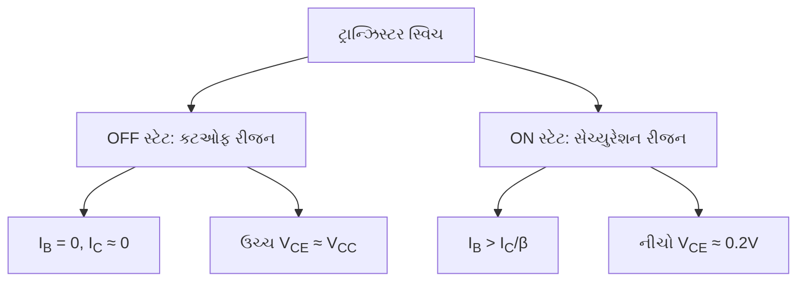

**યાદ રાખવાની ટિપ્સ**: "COST" - "Cutoff Off, Saturation Turns-on"

## પ્રશ્ન 4(બ) [4 ગુણ] (અથવા)

**CE એમ્પ્લીફાયરની કેરેક્ટરીસ્ટીક્સ દોરો અને સમજાવો.**

**જવાબ**:

**CE એમ્પ્લીફાયર કેરેક્ટરીસ્ટીક્સ**:

**ઇનપુટ કેરેક્ટરીસ્ટીક્સ**:

- **પ્લોટ**: સ્થિર V<sub>CE</sub> પર I<sub>B</sub> vs V<sub>BE</sub>
- **વર્તન**: ફોરવર્ડ-બાયસ્ડ ડાયોડ કર્વની જેમ દેખાય છે
- **ની વોલ્ટેજ**: સિલિકોન માટે આશરે 0.7V
- **ઇનપુટ રેસિસ્ટન્સ**: કર્વનો સ્લોપ (ΔV<sub>BE</sub>/ΔI<sub>B</sub>)

**આઉટપુટ કેરેક્ટરીસ્ટીક્સ**:

- **પ્લોટ**: સ્થિર I<sub>B</sub> પર I<sub>C</sub> vs V<sub>CE</sub>
- **રીજન્સ**: 
  - સેચ્યુરેશન (V<sub>CE</sub> < 0.2V)
  - એક્ટિવ (V<sub>CE</sub> > 0.2V)
  - કટઓફ (I<sub>B</sub> = 0)
- **અર્લી ઇફેક્ટ**: V<sub>CE</sub> વધતા I<sub>C</sub> માં થોડો વધારો

**આકૃતિ**:

```goat
   I_C |           I_B3
       |         ,------
       |        /
       |       /
       |      /  I_B2
       |     ,------
       |    /
       |   /
       |  /  I_B1
       | ,------
       |/
       +-------------> V_CE
       |
   
   I_B |
       |        /
       |       /
       |      /
       |     /
       |    /
       |   /
       |  /
       | /
       |/
       +-------------> V_BE
       |   0.7V
```

**યાદ રાખવાની ટિપ્સ**: "IAOC" - "Input curves At Origin, Output curves show Current gain"

## પ્રશ્ન 4(ક) [7 ગુણ] (અથવા)

**વેરેક્ટર ડાયોડની કાર્યપદ્ધતી સમજાવો.**

**જવાબ**:

**વેરેક્ટર ડાયોડની કાર્યપદ્ધતિ**:

**મૂળભૂત સ્ટ્રક્ચર**:

- **જંક્શન**: વિશેષ P-N જંક્શન ડાયોડ
- **ઓપરેશન**: હંમેશા રિવર્સ બાયસમાં કામ કરે છે
- **પ્રોપર્ટી**: જંક્શન કેપેસિટન્સ રિવર્સ વોલ્ટેજ સાથે બદલાય છે

**કાર્યપ્રણાલી**:

- **ડિપ્લેશન લેયર**: રિવર્સ વોલ્ટેજ વધવાથી પહોળી થાય છે
- **કેપેસિટન્સ ઇફેક્ટ**: ડિપ્લેશન રીજન P અને N રીજન વચ્ચે ડાયલેક્ટ્રિક તરીકે કામ કરે છે
- **કેપેસિટન્સ ફોર્મ્યુલા**: C ∝ 1/√V<sub>R</sub>
- **ટ્યુનિંગ રેન્જ**: સામાન્ય રીતે 4:1 થી 10:1 કેપેસિટન્સ

**ઉપયોગો**:

- **વોલ્ટેજ-કંટ્રોલ્ડ કેપેસિટર**: ઇલેક્ટ્રોનિક ટ્યુનિંગ સર્કિટમાં
- **ફ્રિક્વન્સી મોડ્યુલેશન**: વોલ્ટેજ-કંટ્રોલ્ડ ઓસિલેટર્સ (VCOs) માં
- **ઓટોમેટિક ફ્રિક્વન્સી કંટ્રોલ**: રિસીવર્સમાં
- **પેરામેટ્રિક એમ્પ્લિફિકેશન**: માઇક્રોવેવ સર્કિટમાં

**આકૃતિ**:

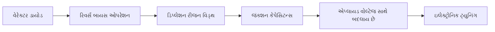

**યાદ રાખવાની ટિપ્સ**: "VCAP" - "Voltage Controls cAPacitance"

## પ્રશ્ન 5(અ) [3 ગુણ]

**ટ્રાન્ઝિસ્ટર એમ્પ્લીફાયર માટે એક્ટિવ, સેચ્યુરેશન અને કટ-ઓફ રીજીયનની વ્યાખ્યા આપો.**

**જવાબ**:

**ટ્રાન્ઝિસ્ટરના ઓપરેશન રીજન્સ**:

| રીજન | વ્યાખ્યા | બાયસિંગ કન્ડિશન | ઉપયોગ |
|--------|------------|-------------------|-------------|
| **એક્ટિવ રીજન** | બંને જંક્શન યોગ્ય રીતે બાયસ કરેલા છે (BE ફોરવર્ડ, BC રિવર્સ) | I<sub>B</sub> > 0, V<sub>CE</sub> > V<sub>CE(sat)</sub> | એમ્પ્લિફિકેશન |
| **સેચ્યુરેશન રીજન** | બંને જંક્શન ફોરવર્ડ બાયસ્ડ | I<sub>B</sub> > I<sub>C</sub>/β, V<sub>CE</sub> ≈ 0.2V | સ્વિચિંગ (ON સ્ટેટ) |
| **કટ-ઓફ રીજન** | બંને જંક્શન રિવર્સ બાયસ્ડ | I<sub>B</sub> = 0, I<sub>C</sub> ≈ 0, V<sub>CE</sub> ≈ V<sub>CC</sub> | સ્વિચિંગ (OFF સ્ટેટ) |

**આકૃતિ**:

```goat
   I_C |
       |         Active
       |         Region
       |        /|
       |       / |
       |      /  |
       |     /   |
       |    /    |
       |   /     |
       |  /      |
       | /       |
       |/        |
       +---------+------> V_CE
       |Saturation|Cut-off
```

**યાદ રાખવાની ટિપ્સ**: "ASC" - "Active for Signals, Saturation & Cutoff for switches"

## પ્રશ્ન 5(બ) [4 ગુણ]

**જો Ic = 10mA અને Ib = 100μA તો કરંટ ગેઈન α, અને β ની કીમત શોધો.**

**જવાબ**:

**આપેલ છે**:

- કલેક્ટર કરંટ (I<sub>C</sub>) = 10 mA
- બેઝ કરંટ (I<sub>B</sub>) = 100 μA = 0.1 mA

**β (કોમન એમિટર કરંટ ગેઇન) ની ગણતરી**:

- β = I<sub>C</sub> / I<sub>B</sub>
- β = 10 mA / 0.1 mA
- β = 100

**α (કોમન બેઝ કરંટ ગેઇન) ની ગણતરી**:

- I<sub>E</sub> = I<sub>C</sub> + I<sub>B</sub> = 10 mA + 0.1 mA = 10.1 mA
- α = I<sub>C</sub> / I<sub>E</sub>
- α = 10 mA / 10.1 mA
- α = 0.990 અથવા 0.99

**α અને β વચ્ચેનો સંબંધ**:

- α = β / (β + 1)
- α = 100 / (100 + 1) = 100 / 101 = 0.990
- β = α / (1 - α)
- β = 0.99 / (1 - 0.99) = 0.99 / 0.01 = 99 ≈ 100

**યાદ રાખવાની ટિપ્સ**: "ABC" - "Alpha equals Beta divided by (Beta plus one) for Current gains"

## પ્રશ્ન 5(ક) [7 ગુણ]

**નાના ઈલેક્ટ્રોનિક્સ ઉદ્યોગોમાં ઈલેક્ટ્રોનિક વેસ્ટ મેનેજમેન્ટની વ્યૂહરચનાઓની ચર્ચા કરો.**

**જવાબ**:

**નાના ઈલેક્ટ્રોનિક્સ ઉદ્યોગો માટે ઈ-વેસ્ટ મેનેજમેન્ટ વ્યૂહરચનાઓ**:

| વ્યૂહરચના | વર્ણન | અમલીકરણ |
|----------|-------------|----------------|
| **અલગીકરણ** | સામાન્ય કચરાથી ઈ-વેસ્ટને અલગ કરવું | વિવિધ ઘટકો માટે સમર્પિત કલેક્શન બિન્સ |
| **ઘટાડો** | કચરા ઉત્પાદનને ઘટાડવું | કાર્યક્ષમ ડિઝાઇન, વધારેલ ઉત્પાદન જીવન, રિપેર સેવાઓ |
| **ફરીથી ઉપયોગ** | ઘટકોનો ફરીથી ઉપયોગ | કામ કરતા ભાગોનું રિફર્બિશિંગ, પુન:ઉપયોગ |
| **રિસાયકલ** | સામગ્રી પુનઃપ્રાપ્તિ માટે પ્રોસેસિંગ | અધિકૃત રિસાયકલર્સ સાથે ભાગીદારી, માર્ગદર્શિકાનું પાલન |
| **તાલીમ** | કર્મચારીઓને શિક્ષિત કરવા | યોગ્ય હેન્ડલિંગ પ્રક્રિયાઓ પર નિયમિત વર્કશોપ |

**મુખ્ય અમલીકરણ પગલાં**:

- **ઇન્વેન્ટરી મેનેજમેન્ટ**: સમગ્ર લાઇફસાયકલમાં ઇલેક્ટ્રોનિક કમ્પોનન્ટ્સ ટ્રેક કરવા
- **અધિકૃત ભાગીદારી**: માત્ર પ્રમાણિત ઈ-વેસ્ટ હેન્ડલર્સ સાથે કામ કરવું
- **દસ્તાવેજીકરણ**: અનુપાલન માટે કચરા નિકાલના રેકોર્ડ જાળવવા
- **ગ્રીન ડિઝાઇન**: સરળ ડિસએસેમ્બલી અને રિસાયક્લિંગ માટે ઉત્પાદનો ડિઝાઇન કરવા

**નિયમનકારી અનુપાલન**:

- **રજિસ્ટ્રેશન**: પોલ્યુશન કંટ્રોલ બોર્ડ સાથે નોંધણી
- **ઓથોરાઇઝેશન**: જરૂરી પરમિટ મેળવવા
- **વાર્ષિક રિટર્ન**: નિયમિત અનુપાલન રિપોર્ટ સબમિટ કરવા

**આકૃતિ**:

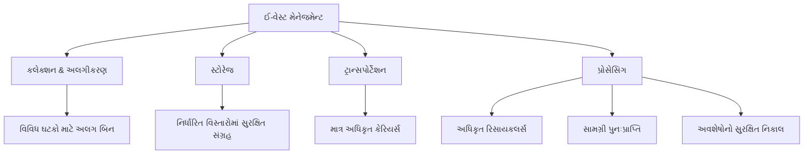

**યાદ રાખવાની ટિપ્સ**: "SRRTA" - "Segregate, Reduce, Reuse, Train, Authorize"

## પ્રશ્ન 5(અ) [3 ગુણ] (અથવા)

**CB, CE અને CC ટ્રાન્ઝિસ્ટરની સરકીટ રૂપરેખાંકન દોરો.**

**જવાબ**:

**ટ્રાન્ઝિસ્ટર કોન્ફિગરેશન સર્કિટ્સ**:

```goat
Common Base (CB)         Common Emitter (CE)        Common Collector (CC)
                                                     (Emitter Follower)
    +---+                     +---+                      +---+
    |   |                     |   |                      |   |
    | RC|                     | RC|                      |   |
    |   |                     |   |                      |   |
    +---+                     +---+                      +---+
      |                         |                          |
      |                         |                          |
      +-----+             +-----+                    +-----+
      |     |             |     |                    |     |
 Cout +     +---+    Cout +     +---+          +---->+     +---> Vout
      |     |             |     |              |     |     |
      +-----+             +-----+              |     +-----+
        |                   |                  |       |
        |                   |                  |       |
    +---+                   |                  |     +---+
    |   |                   |                  |     |   |
    | RE|               +---+---+              |     | RE|
    |   |               |       |              |     |   |
    +---+               |       |              |     +---+
      |                 +-------+              |       |
      |                     |                  |       |
     GND                   GND                 +-------+
                                                   |
 Input to Emitter      Input to Base           Input to Base
 Output from Collector Output from Collector   Output from Emitter
```

**મુખ્ય લક્ષણો**:

- **CB**: ઉચ્ચ સ્થિરતા, નીચી ઇનપુટ ઇમ્પીડન્સ, ઉચ્ચ આઉટપુટ ઇમ્પીડન્સ
- **CE**: મધ્યમ સ્થિરતા, મધ્યમ ઇનપુટ ઇમ્પીડન્સ, મધ્યમ આઉટપુટ ઇમ્પીડન્સ
- **CC**: નીચી સ્થિરતા, ઉચ્ચ ઇનપુટ ઇમ્પીડન્સ, નીચી આઉટપુટ ઇમ્પીડન્સ

**યાદ રાખવાની ટિપ્સ**: "EBC" - "Emitter input for CB, Base input for CE/CC, Collector output for CB/CE"

## પ્રશ્ન 5(બ) [4 ગુણ] (અથવા)

**કરંટ ગેઈન α અને β વચ્ચેનો સંબંધ મેળવો.**

**જવાબ**:

**કરંટ ગેઇન α અને β વચ્ચેનો સંબંધ**:

**આપેલી વ્યાખ્યાઓ**:

- α = I<sub>C</sub>/I<sub>E</sub> (કોમન બેઝ કરંટ ગેઇન)
- β = I<sub>C</sub>/I<sub>B</sub> (કોમન એમિટર કરંટ ગેઇન)

**સ્ટેપ 1**: ટ્રાન્ઝિસ્ટરમાં કરંટ સંબંધનો ઉપયોગ કરો

- I<sub>E</sub> = I<sub>C</sub> + I<sub>B</sub>

**સ્ટેપ 2**: β ના સંદર્ભમાં α વ્યક્ત કરો

- α = I<sub>C</sub>/I<sub>E</sub>
- α = I<sub>C</sub>/(I<sub>C</sub> + I<sub>B</sub>)

**સ્ટેપ 3**: I<sub>B</sub> = I<sub>C</sub>/β ને સબ્સ્ટિટ્યુટ કરો

- α = I<sub>C</sub>/(I<sub>C</sub> + I<sub>C</sub>/β)
- α = I<sub>C</sub>/(I<sub>C</sub>(1 + 1/β))
- α = I<sub>C</sub>/(I<sub>C</sub>(β + 1)/β)
- α = β/(β + 1)

**સ્ટેપ 4**: α ના સંદર્ભમાં β વ્યક્ત કરો

- β = α/(1 - α)

**આકૃતિ**:

```goat
      I_C
     ↗   ↘
    /     \
   /       \
  I_B       I_E

  α = I_C/I_E
  β = I_C/I_B
  I_E = I_C + I_B
```

**યાદ રાખવાની ટિપ્સ**: "ABR" - "Alpha = Beta divided by (Beta plus one) Reciprocally"

## પ્રશ્ન 5(ક) [7 ગુણ] (અથવા)

**ઈ-વેસ્ટની વ્યાખ્યા કરો અને ઈલેક્ટ્રોનિક કચરાનો નિકાલ સમજાવો.**

**જવાબ**:

**ઈ-વેસ્ટની વ્યાખ્યા**:
ઇલેક્ટ્રોનિક વેસ્ટ (ઈ-વેસ્ટ) તે ત્યજી દેવામાં આવેલા ઇલેક્ટ્રિકલ અથવા ઇલેક્ટ્રોનિક ઉપકરણોનો ઉલ્લેખ કરે છે જે જીવનકાળના અંત સુધી પહોંચ્યા છે અથવા જૂના થઈ ગયા છે, જેમાં કોમ્પ્યુટર્સ, ટેલિવિઝન, મોબાઇલ ફોન, પ્રિન્ટર્સ અને અન્ય ઇલેક્ટ્રોનિક ઉપકરણો સામેલ છે જેમાં લીડ, મર્ક્યુરી, કેડમિયમ, PCBs અને બ્રોમિનેટેડ ફ્લેમ રિટાર્ડન્ટ્સ જેવા જોખમી ઘટકો હોય છે.

**ઈ-વેસ્ટના નિકાલની પદ્ધતિઓ**:

| પદ્ધતિ | વર્ણન | પર્યાવરણીય અસર |
|--------|-------------|---------------------|
| **કલેક્શન & અલગીકરણ** | પ્રકાર અનુસાર એકત્રિત કરવું અને અલગ કરવું | પ્રદૂષણ ઘટાડે છે |
| **ડિસમેન્ટલિંગ** | ઘટકોનું મેન્યુઅલ ડિસએસેમ્બલી | લક્ષિત રિસાયક્લિંગ સક્ષમ કરે છે |
| **સામગ્રી રિકવરી** | મૂલ્યવાન સામગ્રીનું એક્સટ્રેક્શન | કુદરતી સંસાધનો સંરક્ષિત કરે છે |
| **રિફર્બિશમેન્ટ** | ફરીથી ઉપયોગ માટે રિપેરિંગ | ઉત્પાદન જીવનચક્ર લંબાવે છે |
| **અધિકૃત રિસાયક્લિંગ** | પ્રમાણિત સુવિધાઓ દ્વારા પ્રોસેસિંગ | યોગ્ય હેન્ડલિંગ સુનિશ્ચિત કરે છે |

**નિકાલ પ્રક્રિયા પ્રવાહ**:

- **પ્રારંભિક આકારણી**: નિર્ધારિત કરો કે ઉપકરણને રિપેર/રિયુઝ કરી શકાય છે કે નહીં
- **ડેટા સેનિટાઇઝેશન**: વ્યક્તિગત/વ્યાપારિક ડેટાનું સુરક્ષિત ભૂંસાવું
- **ડિસએસેમ્બલી**: ઘટક શ્રેણીઓમાં અલગ કરવું
- **રિસોર્સ રિકવરી**: મૂલ્યવાન સામગ્રીનું એક્સટ્રેક્શન
- **જોખમી કચરો**: વિષાક્ત ઘટકોનું વિશેષ હેન્ડલિંગ

**આકૃતિ**:

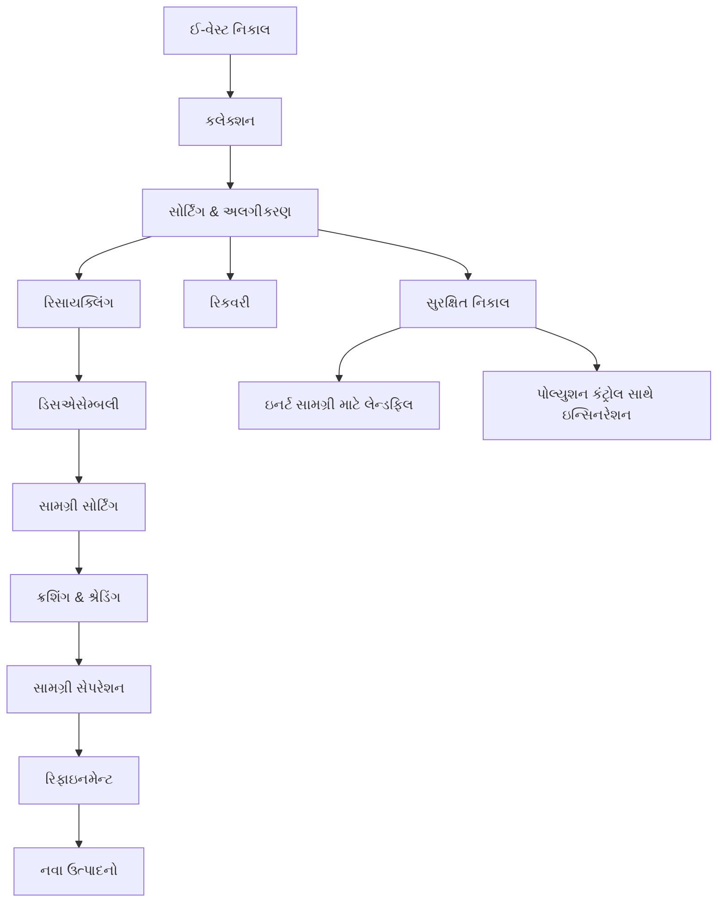

**યાદ રાખવાની ટિપ્સ**: "CRESD" - "Collect, Recycle, Extract, Separate, Dispose"
