## Question 1(a) [3 marks]

**Define Forward and reverse bias of diode.**

**Answer**:

**Forward Bias of Diode**: 

- **Connection Method**: P-type connected to positive terminal and N-type connected to negative terminal of battery
- **Barrier Width**: Barrier width decreases
- **Resistance**: Low resistance (typically 100-1000Ω)
- **Current Flow**: Allows current to flow easily through the diode

**Reverse Bias of Diode**:

- **Connection Method**: P-type connected to negative terminal and N-type connected to positive terminal
- **Barrier Width**: Barrier width increases
- **Resistance**: Very high resistance (typically several MΩ)
- **Current Flow**: Blocks current flow (only small leakage current flows)

**Diagram**:

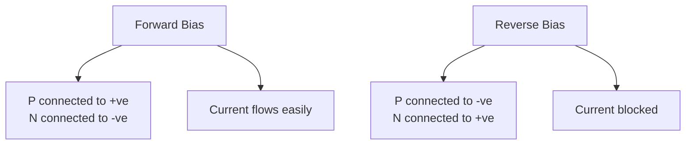

**Mnemonic**: "PFNR" - "Positive to P Forward, Negative to P Reverse"

## Question 1(b) [4 marks]

**Explain construction and working of LDR.**

**Answer**:

**Construction of LDR**:

- **Material**: Made of semiconductor material (Cadmium Sulfide)
- **Pattern**: Zigzag pattern of photosensitive material on ceramic base
- **Electrodes**: Metal electrodes at both ends
- **Package**: Encapsulated in transparent plastic or glass case

**Working Principle**:

- **Photoconductivity**: Based on photoconductivity principle
- **Dark Resistance**: High resistance (MΩ range) in dark conditions
- **Light Exposure**: When exposed to light, photons release electrons 
- **Resistance Drop**: Resistance decreases (kΩ range) in bright light

**Diagram**:

```goat
 +------+
 |      |    Zigzag pattern of
 | +-\/-+ <- semiconductor material
 | |    |
 | +-/\-+
 |      |
 +------+
  |    |
  |    |
  L    D <- Leads
```

**Mnemonic**: "MILD" - "More Illumination, Less Dark-resistance"

## Question 1(c) [7 marks]

**Explain the color band coding method of Resistor. Write color band of 47kΩ ±5% resistance.**

**Answer**:

**Color Band Coding Method**:

| Color   | Value | Multiplier | Tolerance |
|---------|-------|------------|-----------|
| Black   | 0     | 10⁰        | -         |
| Brown   | 1     | 10¹        | ±1%       |
| Red     | 2     | 10²        | ±2%       |
| Orange  | 3     | 10³        | -         |
| Yellow  | 4     | 10⁴        | -         |
| Green   | 5     | 10⁵        | ±0.5%     |
| Blue    | 6     | 10⁶        | ±0.25%    |
| Violet  | 7     | 10⁷        | ±0.1%     |
| Grey    | 8     | 10⁸        | ±0.05%    |
| White   | 9     | 10⁹        | -         |
| Gold    | -     | 10⁻¹       | ±5%       |
| Silver  | -     | 10⁻²       | ±10%      |
| Colorless | -   | -          | ±20%      |

**4-Band Resistor Color Code**:

- **First Band**: First significant digit
- **Second Band**: Second significant digit
- **Third Band**: Multiplier
- **Fourth Band**: Tolerance

**For 47kΩ ±5%**:

- First digit: 4 = Yellow
- Second digit: 7 = Violet
- Multiplier: 10³ = Orange (for kΩ)
- Tolerance: ±5% = Gold

**Color bands for 47kΩ ±5%**: Yellow-Violet-Orange-Gold

**Diagram**:

```goat
+---+---+---+---+-------------+
|   |   |   |   |             |
| Y | V | O | G |             |
|   |   |   |   |             |
+---+---+---+---+-------------+
  |   |   |   |
  |   |   |   +-- Gold (±5%)
  |   |   +------ Orange (10³)
  |   +---------- Violet (7)
  +-------------- Yellow (4)
```

**Mnemonic**: "BAND" - "Beginning digits, Amplify with Multiplier, Note tolerance with last band, Decode carefully"

## Question 1(c) [7 marks] (OR)

**Explain Aluminum Electrolytic wet type capacitor.**

**Answer**:

**Aluminum Electrolytic Wet Type Capacitor**:

**Construction**:

- **Plates**: Two aluminum foils (anode and cathode)
- **Dielectric**: Aluminum oxide layer on anode foil
- **Electrolyte**: Liquid electrolyte (boric acid, sodium borate, etc.)
- **Separator**: Paper separator soaked in electrolyte
- **Enclosure**: Aluminum can with rubber seal

**Working Principle**:

- **Oxide Layer**: Thin aluminum oxide layer acts as dielectric
- **Electrolyte**: Acts as cathode connection to second plate
- **Polarization**: Has defined polarity (+ and -) terminals

**Characteristics**:

- **Capacitance Range**: 1μF to 47,000μF
- **Voltage Rating**: 6.3V to 450V
- **Polarity**: Polarized (must connect correctly)
- **Leakage Current**: Higher than other capacitor types
- **ESR**: Higher equivalent series resistance

**Diagram**:

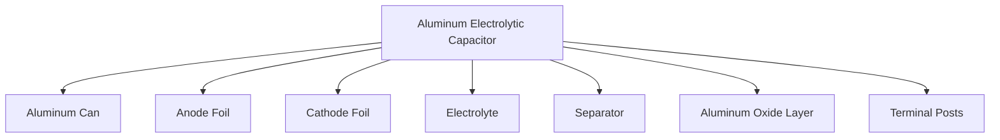

**Mnemonic**: "POLE" - "Polarized, Oxide layer, Liquid electrolyte, Enormous capacitance"

## Question 2(a) [3 marks]

**Draw the symbol of Schottkey diode, LED and Photo-diode.**

**Answer**:

**Symbols**:

```goat
Schottky Diode      LED                 Photo-diode
   +----|<---+      +---|>|---+         +---|<|---+
   |         |      |    |    |         |    ↓    |
   |         |      |   / \   |         |   / \   |
   +---------+      |  /   \  |         |  \   /  |
                    | /     \ |         |   \ /   |
                    +---------+         +---------+
```

**Key Features**:

- **Schottky Diode**: Standard diode symbol with curved bar (represents metal-semiconductor junction)
- **LED**: Standard diode symbol with two arrows pointing away (represents light emission)
- **Photo-diode**: Standard diode symbol with two arrows pointing toward diode (represents light detection)

**Mnemonic**: "SLP" - "Schottky has curve, LED emits, Photo-diode absorbs"

## Question 2(b) [4 marks]

**Define Active and Passive Components with example.**

**Answer**:

**Passive Components**:

| Characteristic | Description | Examples |
|----------------|------------|----------|
| Power | Cannot generate power | Resistors, Capacitors, Inductors |
| Signal | Cannot amplify signals | Transformers, Diodes |
| Control | No control over current flow | Connectors, Switches |
| Energy | Store or dissipate energy | Fuses, Filters |

**Active Components**:

| Characteristic | Description | Examples |
|----------------|------------|----------|
| Power | Can generate power | Transistors, ICs |
| Signal | Can amplify signals | Op-amps, Amplifiers |
| Control | Control current flow | SCRs, MOSFETs |
| Dependency | Require external power | Voltage regulators, Microcontrollers |

**Diagram**:

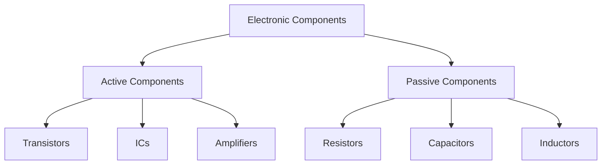

**Mnemonic**: "PASS-ACT" - "Passive stores or dissipates, Active controls or amplifies"

## Question 2(c) [7 marks]

**Explain working of full wave bridge rectifier.**

**Answer**:

**Full Wave Bridge Rectifier**:

**Circuit Construction**:

- **Diodes**: Four diodes arranged in bridge configuration
- **Input**: AC supply from transformer secondary
- **Output**: Pulsating DC across load resistor with filter capacitor

**Working Principle**:

- **Positive Half Cycle**: D1 and D3 conduct, D2 and D4 block
- **Negative Half Cycle**: D2 and D4 conduct, D1 and D3 block
- **Current Flow**: Always flows through load in same direction

**Performance Parameters**:

- **Ripple Frequency**: 2× input frequency (100 Hz for 50 Hz input)
- **Efficiency**: 81.2%
- **PIV**: V₀(max) per diode
- **TUF**: 0.812 (Transformer Utilization Factor)

**Diagram**:

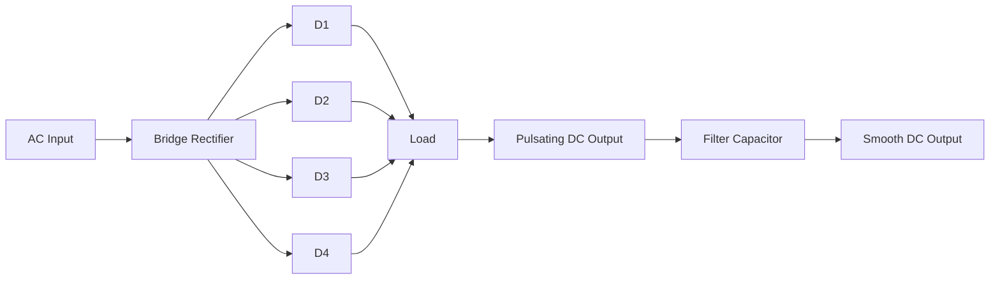

**Mnemonic**: "BRIDGE" - "Better Rectification with Improved Diode Geometry Efficiency"

## Question 2(a) [3 marks] (OR)

**Explain construction and working of LED.**

**Answer**:

**Construction of LED**:

- **Material**: Semiconductor (GaAs, GaP, AlGaInP, etc.)
- **Junction**: P-N junction with heavily doped semiconductors
- **Package**: Encased in transparent or colored epoxy lens
- **Cathode**: Identified by flat side on package or shorter lead

**Working Principle**:

- **Forward Bias**: Applied to P-N junction
- **Recombination**: Electrons and holes recombine at junction
- **Energy Release**: Energy released as photons (light)
- **Wavelength**: Determined by band gap of semiconductor material

**Diagram**:

```goat
        +-------+
        |       |
        |   ^   |
        |  / \  | <- Epoxy lens
        | /   \ |
        |/     \|
    ----+-------+----
    |       |       |
    |       |       |
    |       |       |
  Anode   Chip   Cathode
```

**Mnemonic**: "LEDS" - "Light Emits During electron-hole recombination in Semiconductor"

## Question 2(b) [4 marks] (OR)

**Explain composition type resistors.**

**Answer**:

**Composition Resistors**:

**Construction**:

- **Core Material**: Carbon particles mixed with insulating material (clay/ceramic)
- **Binding**: Resin binder forms solid cylindrical shape
- **Terminals**: Metal caps with leads attached to ends
- **Protection**: Coated with insulating paint or plastic

**Characteristics**:

- **Resistance Range**: 1Ω to 22MΩ
- **Power Rating**: 1/8W to 2W
- **Tolerance**: ±5% to ±20%
- **Temperature Coefficient**: -500 to +500 ppm/°C

**Advantages & Limitations**:

- **Cost**: Low cost
- **Noise**: Higher noise level
- **Stability**: Less stable with temperature
- **Applications**: General purpose, non-critical applications

**Diagram**:

```goat
    +---------------------+
    |                     |
    |  +---------------+  |
    |  | Carbon        |  | <- Insulating
    |  | Composition   |  |    coating
    |  +---------------+  |
    |                     |
    +---------------------+
    |         |
    |         |
Lead         Lead
```

**Mnemonic**: "CCRI" - "Carbon Composition Resistors are Inexpensive"

## Question 2(c) [7 marks] (OR)

**Explain working of full wave rectifier with two diodes.**

**Answer**:

**Full Wave Rectifier with Two Diodes (Center-tap)**:

**Circuit Construction**:

- **Transformer**: Center-tapped transformer secondary
- **Diodes**: Two diodes connected to opposite ends of secondary
- **Output**: Taken between center tap and diode junction

**Working Principle**:

- **Positive Half Cycle**: Upper half of secondary positive, D1 conducts, D2 blocks
- **Negative Half Cycle**: Lower half of secondary positive, D2 conducts, D1 blocks
- **Current Flow**: Always flows through load in same direction

**Performance Parameters**:

- **Ripple Frequency**: 2× input frequency (100 Hz for 50 Hz input)
- **Efficiency**: 81.2%
- **PIV**: 2V₀(max) per diode (twice the center-tap rectifier)
- **TUF**: 0.693 (Transformer Utilization Factor)

**Diagram**:

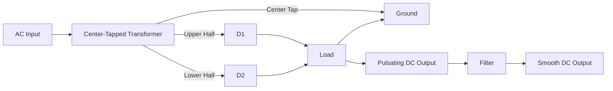

**Mnemonic**: "CTFWR" - "Center Tap Facilitates Whole-cycle Rectification"

## Question 3(a) [3 marks]

**Explain working of schhotkey diode.**

**Answer**:

**Working of Schottky Diode**:

- **Junction Type**: Metal-Semiconductor (M-S) junction instead of P-N
- **Charge Carriers**: Majority carrier device (electrons in N-type)
- **Barrier**: Schottky barrier formed at metal-semiconductor interface
- **Forward Voltage**: Lower forward voltage drop (0.2-0.4V vs 0.7V for Si diode)

**Key Characteristics**:

- **Switching Speed**: Very fast switching (no minority carrier storage)
- **Applications**: High-frequency circuits, power supplies
- **Recovery Time**: Negligible reverse recovery time

**Diagram**:

```goat
Metal    |    N-type
         |
      +--+--+
      |     |
      | M-S |  <- Schottky Barrier
      |     |
      +-----+
```

**Mnemonic**: "SFAM" - "Schottky's Fast And Metal-based"

## Question 3(b) [4 marks]

**Explain N type semiconductor.**

**Answer**:

**N-type Semiconductor**:

**Formation**:

- **Base Material**: Intrinsic semiconductor (Silicon or Germanium)
- **Doping Element**: Pentavalent impurity (P, As, Sb)
- **Doping Process**: Thermal diffusion or ion implantation
- **Concentration**: Typically 1 part impurity to 10⁸ parts silicon

**Characteristics**:

- **Majority Carriers**: Electrons (negative charge carriers)
- **Minority Carriers**: Holes
- **Conductivity**: Higher than intrinsic semiconductor
- **Fermi Level**: Closer to conduction band

**Diagram**:

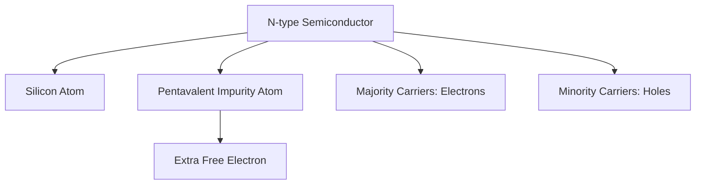

**Mnemonic**: "PENT" - "Pentavalent Element makes N-Type with free electrons"

## Question 3(c) [7 marks]

**Explain construction and working of PN Junction Diode.**

**Answer**:

**Construction of PN Junction Diode**:

- **Materials**: P-type and N-type semiconductor regions
- **Junction**: Formed by diffusion or epitaxial growth
- **Depletion Region**: Forms at junction interface
- **Contacts**: Metal contacts attached to both regions
- **Packaging**: Sealed in glass, plastic, or metal case

**Working Principle**:

- **Depletion Region**: Forms due to diffusion of carriers
- **Barrier Potential**: Created across junction (0.7V for Si, 0.3V for Ge)
- **Forward Bias**: Current flows when forward voltage > barrier potential
- **Reverse Bias**: Only small leakage current flows until breakdown

**Diagram**:

```goat
    +-------+-------+
    |       |       |
    |   P   |   N   |
    |       |       |
    +-------+-------+
        |       |
      Anode  Cathode

    Depletion region at junction
```

**Mnemonic**: "BIRD" - "Barrier forms at Interface, Rectifies Direct current"

## Question 3(a) [3 marks] (OR)

**Explain working of photo-diode.**

**Answer**:

**Working of Photo-diode**:

- **Operation Mode**: Reverse biased P-N junction
- **Light Absorption**: Photons create electron-hole pairs in depletion region
- **Carrier Generation**: Light energy > band gap energy creates free carriers
- **Current Flow**: Photocurrent proportional to light intensity

**Key Characteristics**:

- **Sensitivity**: Depends on semiconductor material and wavelength
- **Response Time**: Very fast (ns range)
- **Operating Modes**: Photovoltaic mode or photoconductive mode
- **Applications**: Light sensors, optical communication

**Diagram**:

```goat
       Light
         ↓
    +----+----+
    |         |
 ---+         +---
    |    PN   |
    | Junction|
    |         |
 ---+         +---
    |         |
    +---------+
```

**Mnemonic**: "PLIP" - "Photons Lead to Increased Photocurrent"

## Question 3(b) [4 marks] (OR)

**Explain P type Semiconductor.**

**Answer**:

**P-type Semiconductor**:

**Formation**:

- **Base Material**: Intrinsic semiconductor (Silicon or Germanium)
- **Doping Element**: Trivalent impurity (B, Al, Ga)
- **Doping Process**: Thermal diffusion or ion implantation
- **Concentration**: Typically 1 part impurity to 10⁸ parts silicon

**Characteristics**:

- **Majority Carriers**: Holes (positive charge carriers)
- **Minority Carriers**: Electrons
- **Conductivity**: Higher than intrinsic semiconductor
- **Fermi Level**: Closer to valence band

**Diagram**:

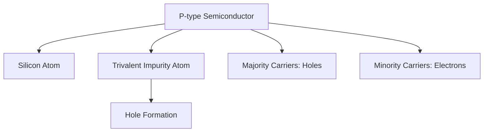

**Mnemonic**: "TRIP" - "TRIvalent impurity Produces holes in P-type"

## Question 3(c) [7 marks] (OR)

**Compare half wave and full wave rectifier.**

**Answer**:

**Comparison between Half Wave and Full Wave Rectifier**:

| Parameter | Half Wave Rectifier | Full Wave Rectifier |
|-----------|---------------------|---------------------|
| **Circuit Complexity** | Simple, uses 1 diode | Complex, uses 2 or 4 diodes |
| **Output Waveform** | Pulsating DC for half cycle | Pulsating DC for full cycle |
| **Efficiency** | 40.6% | 81.2% |
| **Ripple Factor** | 1.21 | 0.48 |
| **Ripple Frequency** | Same as input (50 Hz) | Twice the input (100 Hz) |
| **PIV of Diode** | V<sub>m</sub> | 2V<sub>m</sub> (center-tap), V<sub>m</sub> (bridge) |
| **TUF** | 0.287 | 0.693 (center-tap), 0.812 (bridge) |
| **DC Output Voltage** | 0.318V<sub>m</sub> | 0.636V<sub>m</sub> |
| **Form Factor** | 1.57 | 1.11 |
| **Applications** | Low power applications | Power supplies, battery chargers |

**Diagram**:

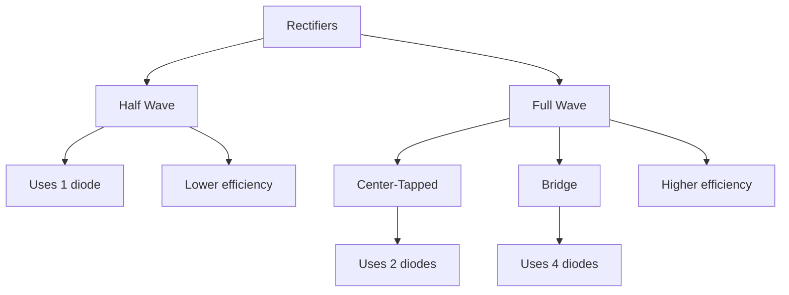

**Mnemonic**: "HERO" - "Half wave: Efficiency Reduced, One-half cycle only"

## Question 4(a) [3 marks]

**Draw the symbol and construction of PNP and NPN transistor with proper notation.**

**Answer**:

**Transistor Symbols and Construction**:

```goat
NPN Symbol         PNP Symbol
    C                  C
    |                  |
    |                  |
    —                  —
   /                  /
  |                  |
  |\                 |>
  | \                |
  |  >               |/
  | /                |
  |/                 |
    —                  —
    |                  |
    |                  |
    B                  B
    |                  |
    |                  |
    —                  —
    |                  |
    |                  |
    E                  E
```

**Construction**:

```goat
NPN Construction           PNP Construction
    +-------+                 +-------+
    |   N   |                 |   P   | <- Collector
    +-------+                 +-------+
    |   P   |                 |   N   | <- Base
    +-------+                 +-------+
    |   N   |                 |   P   | <- Emitter
    +-------+                 +-------+
```

**Mnemonic**: "NIN-PIP" - "N-P-N layers for NPN, P-N-P layers for PNP"

## Question 4(b) [4 marks]

**Explain working of Transistor amplifier.**

**Answer**:

**Working of Transistor Amplifier**:

**Circuit Configuration**:

- **Common Emitter**: Most commonly used
- **Biasing**: Proper DC bias provided to operate in active region
- **Coupling**: Input/output coupling through capacitors
- **Load**: Collector resistor as load

**Working Principle**:

- **Input Signal**: Applied to base-emitter junction
- **Base Current**: Small base current controls larger collector current
- **Amplification**: Small input voltage variations cause larger output voltage variations
- **Phase Shift**: 180° phase shift between input and output

**Key Parameters**:

- **Voltage Gain**: A<sub>v</sub> = V<sub>out</sub>/V<sub>in</sub>
- **Current Gain**: β = I<sub>c</sub>/I<sub>b</sub>
- **Input Impedance**: Typically 1-2kΩ in CE configuration

**Diagram**:

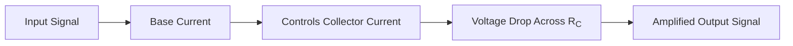

**Mnemonic**: "ABCD" - "Amplification through Base Controlled collector Current Dynamics"

## Question 4(c) [7 marks]

**Explain working of Zener diode.**

**Answer**:

**Working of Zener Diode**:

**Basic Structure**:

- **Junction**: Heavily doped P-N junction
- **Construction**: Similar to normal diode but optimized for breakdown
- **Breakdown**: Designed to operate in reverse breakdown region

**Working Principle**:

- **Forward Bias**: Acts like normal diode
- **Reverse Bias**: 
  - Below breakdown: Small leakage current
  - At breakdown: Sharp increase in current at Zener voltage
  - Beyond breakdown: Maintains constant voltage

**Breakdown Mechanisms**:

- **Zener Effect**: Dominant below 5V (direct tunneling)
- **Avalanche Effect**: Dominant above 5V (impact ionization)

**Applications**:

- **Voltage Regulation**: Maintains constant output voltage
- **Reference Voltage**: Precise voltage reference
- **Overvoltage Protection**: Protects sensitive components

**Diagram**:

```goat
    I
    ^
    |               /
    |              /
    |             /
    |            /
    |           /
    +----------+------> V
    |         /|
    |        / |
    |       /  |
    |      /   |
    |  Reverse | Forward
    |  Breakdown
```

**Mnemonic**: "ZEBRA" - "Zener Effect Breaks at Regulated Avalanche voltage"

## Question 4(a) [3 marks] (OR)

**Explain transistor as a switch.**

**Answer**:

**Transistor as a Switch**:

**Operating Regions**:

- **Cutoff Region**: Transistor OFF (I<sub>B</sub> = 0, I<sub>C</sub> ≈ 0)
- **Saturation Region**: Transistor ON (I<sub>B</sub> > I<sub>C</sub>/β, V<sub>CE</sub> ≈ 0.2V)

**Switching Operation**:

- **OFF State**: No base current, high V<sub>CE</sub>, acts as open switch
- **ON State**: Sufficient base current, low V<sub>CE</sub>, acts as closed switch

**Switching Characteristics**:

- **Turn-ON Time**: Time to go from cutoff to saturation
- **Turn-OFF Time**: Time to go from saturation to cutoff

**Diagram**:

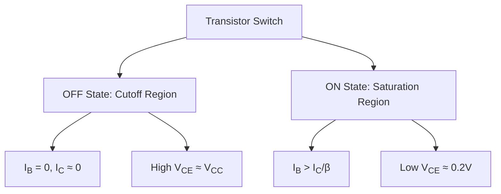

**Mnemonic**: "COST" - "Cutoff Off, Saturation Turns-on"

## Question 4(b) [4 marks] (OR)

**Draw and Explain characteristics of CE amplifier.**

**Answer**:

**CE Amplifier Characteristics**:

**Input Characteristics**:

- **Plot**: I<sub>B</sub> vs V<sub>BE</sub> at constant V<sub>CE</sub>
- **Behavior**: Resembles forward-biased diode curve
- **Knee Voltage**: Approximately 0.7V for silicon
- **Input Resistance**: Slope of curve (ΔV<sub>BE</sub>/ΔI<sub>B</sub>)

**Output Characteristics**:

- **Plot**: I<sub>C</sub> vs V<sub>CE</sub> at constant I<sub>B</sub>
- **Regions**: 
  - Saturation (V<sub>CE</sub> < 0.2V)
  - Active (V<sub>CE</sub> > 0.2V)
  - Cutoff (I<sub>B</sub> = 0)
- **Early Effect**: Slight increase in I<sub>C</sub> with increasing V<sub>CE</sub>

**Diagram**:

```goat
   I_C |           I_B3
       |         ,------
       |        /
       |       /
       |      /  I_B2
       |     ,------
       |    /
       |   /
       |  /  I_B1
       | ,------
       |/
       +-------------> V_CE
       |
   
   I_B |
       |        /
       |       /
       |      /
       |     /
       |    /
       |   /
       |  /
       | /
       |/
       +-------------> V_BE
       |   0.7V
```

**Mnemonic**: "IAOC" - "Input curves At Origin, Output curves show Current gain"

## Question 4(c) [7 marks] (OR)

**Explain working of Varactor diode.**

**Answer**:

**Working of Varactor Diode**:

**Basic Structure**:

- **Junction**: Special P-N junction diode
- **Operation**: Always operated in reverse bias
- **Property**: Junction capacitance varies with reverse voltage

**Working Principle**:

- **Depletion Layer**: Widens with increasing reverse voltage
- **Capacitance Effect**: Depletion region acts as dielectric between P and N regions
- **Capacitance Formula**: C ∝ 1/√V<sub>R</sub>
- **Tuning Range**: Typically 4:1 to 10:1 capacitance

**Applications**:

- **Voltage-Controlled Capacitor**: In electronic tuning circuits
- **Frequency Modulation**: In voltage-controlled oscillators (VCOs)
- **Automatic Frequency Control**: In receivers
- **Parametric Amplification**: In microwave circuits

**Diagram**:

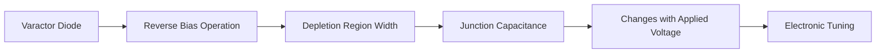

**Mnemonic**: "VCAP" - "Voltage Controls cAPacitance"

## Question 5(a) [3 marks]

**Define Active, Saturation and Cut-off region for transistor amplifier.**

**Answer**:

**Transistor Regions of Operation**:

| Region | Definition | Biasing Condition | Application |
|--------|------------|-------------------|-------------|
| **Active Region** | Both junctions are properly biased (BE forward, BC reverse) | I<sub>B</sub> > 0, V<sub>CE</sub> > V<sub>CE(sat)</sub> | Amplification |
| **Saturation Region** | Both junctions forward biased | I<sub>B</sub> > I<sub>C</sub>/β, V<sub>CE</sub> ≈ 0.2V | Switching (ON state) |
| **Cut-off Region** | Both junctions reverse biased | I<sub>B</sub> = 0, I<sub>C</sub> ≈ 0, V<sub>CE</sub> ≈ V<sub>CC</sub> | Switching (OFF state) |

**Diagram**:

```goat
   I_C |
       |         Active
       |         Region
       |        /|
       |       / |
       |      /  |
       |     /   |
       |    /    |
       |   /     |
       |  /      |
       | /       |
       |/        |
       +---------+------> V_CE
       |Saturation|Cut-off
```

**Mnemonic**: "ASC" - "Active for Signals, Saturation & Cutoff for switches"

## Question 5(b) [4 marks]

**If the value of I<sub>C</sub> = 10mA and I<sub>B</sub> = 100μA then find the value of current gains α and β.**

**Answer**:

**Given**:

- Collector current (I<sub>C</sub>) = 10 mA
- Base current (I<sub>B</sub>) = 100 μA = 0.1 mA

**Calculate β (Common Emitter Current Gain)**:

- β = I<sub>C</sub> / I<sub>B</sub>
- β = 10 mA / 0.1 mA
- β = 100

**Calculate α (Common Base Current Gain)**:

- I<sub>E</sub> = I<sub>C</sub> + I<sub>B</sub> = 10 mA + 0.1 mA = 10.1 mA
- α = I<sub>C</sub> / I<sub>E</sub>
- α = 10 mA / 10.1 mA
- α = 0.990 or 0.99

**Relation between α and β**:

- α = β / (β + 1)
- α = 100 / (100 + 1) = 100 / 101 = 0.990
- β = α / (1 - α)
- β = 0.99 / (1 - 0.99) = 0.99 / 0.01 = 99 ≈ 100

**Mnemonic**: "ABC" - "Alpha equals Beta divided by (Beta plus one) for Current gains"

## Question 5(c) [7 marks]

**Discuss Strategies of electronic waste management in the small electronics Industries.**

**Answer**:

**E-Waste Management Strategies for Small Electronics Industries**:

| Strategy | Description | Implementation |
|----------|-------------|----------------|
| **Segregation** | Separate e-waste from general waste | Dedicated collection bins for different components |
| **Reduce** | Minimize waste generation | Efficient design, extended product life, repair services |
| **Reuse** | Use components again | Refurbish, repurpose working parts |
| **Recycle** | Process for material recovery | Partner with authorized recyclers, follow guidelines |
| **Training** | Educate employees | Regular workshops on proper handling procedures |

**Key Implementation Steps**:

- **Inventory Management**: Track electronic components throughout lifecycle
- **Authorized Partnerships**: Work only with certified e-waste handlers
- **Documentation**: Maintain records of waste disposal for compliance
- **Green Design**: Design products for easy disassembly and recycling

**Regulatory Compliance**:

- **Registration**: Register with pollution control board
- **Authorization**: Obtain necessary permits
- **Annual Returns**: Submit regular compliance reports

**Diagram**:

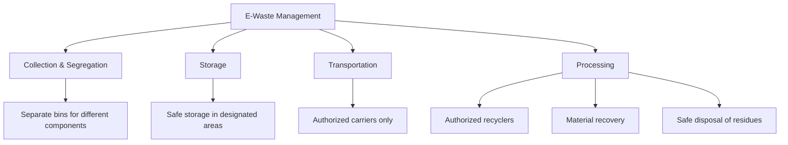

**Mnemonic**: "SRRTA" - "Segregate, Reduce, Reuse, Train, Authorize"

## Question 5(a) [3 marks] (OR)

**Draw CB, CE and CC transistor configuration circuits.**

**Answer**:

**Transistor Configuration Circuits**:

```goat
Common Base (CB)         Common Emitter (CE)        Common Collector (CC)
                                                     (Emitter Follower)
    +---+                     +---+                      +---+
    |   |                     |   |                      |   |
    | RC|                     | RC|                      |   |
    |   |                     |   |                      |   |
    +---+                     +---+                      +---+
      |                         |                          |
      |                         |                          |
      +-----+             +-----+                    +-----+
      |     |             |     |                    |     |
 Cout +     +---+    Cout +     +---+          +---->+     +---> Vout
      |     |             |     |              |     |     |
      +-----+             +-----+              |     +-----+
        |                   |                  |       |
        |                   |                  |       |
    +---+                   |                  |     +---+
    |   |                   |                  |     |   |
    | RE|               +---+---+              |     | RE|
    |   |               |       |              |     |   |
    +---+               |       |              |     +---+
      |                 +-------+              |       |
      |                     |                  |       |
     GND                   GND                 +-------+
                                                   |
 Input to Emitter      Input to Base           Input to Base
 Output from Collector Output from Collector   Output from Emitter
```

**Key Characteristics**:

- **CB**: High stability, low input impedance, high output impedance
- **CE**: Medium stability, medium input impedance, medium output impedance
- **CC**: Low stability, high input impedance, low output impedance

**Mnemonic**: "EBC" - "Emitter input for CB, Base input for CE/CC, Collector output for CB/CE"

## Question 5(b) [4 marks] (OR)

**Derive relation between current gains α and β.**

**Answer**:

**Relation Between Current Gains α and β**:

**Given definitions**:

- α = I<sub>C</sub>/I<sub>E</sub> (Common Base current gain)
- β = I<sub>C</sub>/I<sub>B</sub> (Common Emitter current gain)

**Step 1**: Use current relation in transistor

- I<sub>E</sub> = I<sub>C</sub> + I<sub>B</sub>

**Step 2**: Express α in terms of β

- α = I<sub>C</sub>/I<sub>E</sub>
- α = I<sub>C</sub>/(I<sub>C</sub> + I<sub>B</sub>)

**Step 3**: Substitute I<sub>B</sub> = I<sub>C</sub>/β

- α = I<sub>C</sub>/(I<sub>C</sub> + I<sub>C</sub>/β)
- α = I<sub>C</sub>/(I<sub>C</sub>(1 + 1/β))
- α = I<sub>C</sub>/(I<sub>C</sub>(β + 1)/β)
- α = β/(β + 1)

**Step 4**: Express β in terms of α

- β = α/(1 - α)

**Diagram**:

```goat
      I_C
     ↗   ↘
    /     \
   /       \
  I_B       I_E

  α = I_C/I_E
  β = I_C/I_B
  I_E = I_C + I_B
```

**Mnemonic**: "ABR" - "Alpha = Beta divided by (Beta plus one) Reciprocally"

## Question 5(c) [7 marks] (OR)

**Define E-Waste and Explain disposal of electronic waste.**

**Answer**:

**E-Waste Definition**:
Electronic waste (e-waste) refers to discarded electrical or electronic devices that have reached end-of-life or become obsolete, including computers, televisions, mobile phones, printers, and other electronic equipment containing hazardous components like lead, mercury, cadmium, PCBs, and brominated flame retardants.

**Disposal Methods of E-Waste**:

| Method | Description | Environmental Impact |
|--------|-------------|---------------------|
| **Collection & Segregation** | Gathering and separating by type | Reduces contamination |
| **Dismantling** | Manual disassembly of components | Enables targeted recycling |
| **Material Recovery** | Extracting valuable materials | Conserves natural resources |
| **Refurbishment** | Repairing for reuse | Extends product lifecycle |
| **Authorized Recycling** | Processing by certified facilities | Ensures proper handling |

**Disposal Process Flow**:

- **Initial Assessment**: Determine if device can be repaired/reused
- **Data Sanitization**: Secure erasure of personal/business data
- **Disassembly**: Separation into component categories
- **Resource Recovery**: Extraction of valuable materials
- **Hazardous Waste**: Special handling of toxic components

**Diagram**:

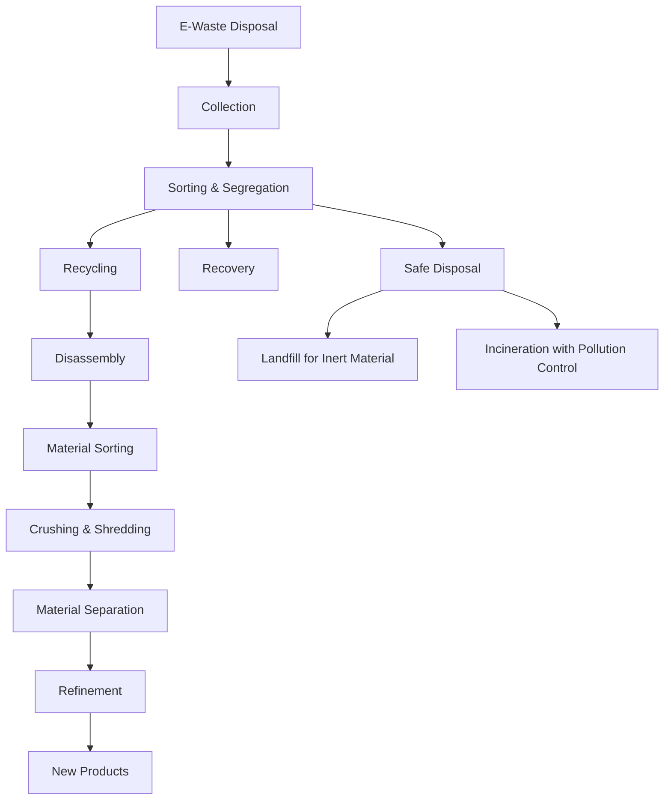

**Mnemonic**: "CRESD" - "Collect, Recycle, Extract, Separate, Dispose"
