## પ્રશ્ન 1(અ) [3 ગુણ]

**એક્ટિવ અને પેસિવ કમ્પોનન્ટ વચ્ચેનો તફાવત આપો.**

**જવાબ**:

| **પેસિવ કમ્પોનન્ટ** | **એક્ટિવ કમ્પોનન્ટ** |
|---|---|
| બાહ્ય પાવર સ્ત્રોતની જરૂર પડતી નથી | કાર્ય કરવા માટે બાહ્ય પાવર સ્ત્રોતની જરૂર પડે છે |
| સિગ્નલને એમ્પલિફાઈ કે પ્રોસેસ કરી શકતા નથી | સિગ્નલને એમ્પલિફાઈ, સ્વિચ કે પ્રોસેસ કરી શકે છે |
| ઉદાહરણ: રેઝિસ્ટર, કેપેસિટર, ઇન્ડક્ટર | ઉદાહરણ: ટ્રાન્ઝિસ્ટર, ડાયોડ, ICs |
| બીજા સિગ્નલ દ્વારા કરંટ ફ્લો કંટ્રોલ કરી શકતા નથી | બીજા સિગ્નલનો ઉપયોગ કરીને કરંટ ફ્લો કંટ્રોલ કરી શકે છે |
| ઊર્જાનો સંગ્રહ કે વ્યય કરે છે | ઊર્જા ઉત્પન્ન કરે છે અથવા ગેઈન પ્રદાન કરે છે |

**મેમરી ટ્રીક:** "PAPER-A" - Passive Are Power-free, Energy-storing/Resistive; Active Are Amplifying

## પ્રશ્ન 1(બ) [4 ગુણ]

**આકૃતિ સહિત Light dependent resistor ની કામગીરી સમજાવો.**

**જવાબ**:

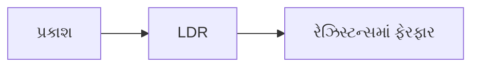

**LDR ની કાર્યપદ્ધતિ:**

- **રચના**: LDR અંધારામાં ઉચ્ચ રેઝિસ્ટન્સ ધરાવતા સેમિકન્ડક્ટર મટેરિયલ (સામાન્ય રીતે કેડમિયમ સલ્ફાઇડ) થી બનેલું હોય છે
- **ફોટોકન્ડક્ટિવિટી**: જ્યારે સપાટી પર પ્રકાશ પડે છે, ત્યારે ફોટોન ઇલેક્ટ્રોન્સને ઊર્જા આપે છે, જેનાથી ફ્રી ઇલેક્ટ્રોન-હોલ જોડી બને છે
- **રેઝિસ્ટન્સમાં ફેરફાર**: પ્રકાશની તીવ્રતા વધતાં રેઝિસ્ટન્સ નાટકીય રીતે ઘટે છે - અંધારામાં મેગાઓમ્સથી પ્રકાશમાં ફક્ત થોડાસો ઓમ્સ સુધી
- **ઉપયોગો**: લાઇટ સેન્સિંગ સર્કિટ, ઓટોમેટિક સ્ટ્રીટ લાઇટ્સ, કેમેરા એક્સપોઝર કંટ્રોલમાં વપરાય છે

**મેમરી ટ્રીક:** "MILD" - More Illumination, Less resistance in Devices

## પ્રશ્ન 1(ક) [7 ગુણ]

**Intrinsic અને Extrinsic સેમિકન્ડક્ટર વ્યાખ્યાયિત કરો. P અને N પ્રકારના સેમીકન્ડક્ટરને સવિસ્તર સમજાવો.**

**જવાબ**:

| **સેમિકન્ડક્ટર પ્રકાર** | **વર્ણન** |
|---|---|
| **Intrinsic** | શુદ્ધ સેમિકન્ડક્ટર મટેરિયલ જેમાં કોઈ અશુદ્ધિઓ ઉમેરવામાં આવતી નથી |
| **Extrinsic** | ડોપિંગ દ્વારા નિયંત્રિત અશુદ્ધિઓ ઉમેરાયેલા સેમિકન્ડક્ટર |

**P-પ્રકારના સેમિકન્ડક્ટર:**

- **ડોપિંગ**: શુદ્ધ સિલિકોનમાં ત્રિ-સંયોજી અશુદ્ધિઓ (બોરોન, ગેલિયમ, ઇન્ડિયમ) ઉમેરીને બનાવવામાં આવે છે
- **હોલ ક્રિએશન**: દરેક અશુદ્ધિ અણુ વેલેન્સ ઇલેક્ટ્રોન સ્વીકારીને એક હોલ બનાવે છે
- **મેજોરિટી કેરિયર્સ**: હોલ મેજોરિટી કેરિયર છે
- **માઈનોરિટી કેરિયર્સ**: ઇલેક્ટ્રોન્સ માઈનોરિટી કેરિયર છે
- **ઇલેક્ટ્રિકલ પ્રોપર્ટીઝ**: પોઝિટિવ ચાર્જ કેરિયર્સ કન્ડક્શનમાં મુખ્ય ભાગ ભજવે છે

**N-પ્રકારના સેમિકન્ડક્ટર:**

- **ડોપિંગ**: શુદ્ધ સિલિકોનમાં પંચ-સંયોજી અશુદ્ધિઓ (ફોસ્ફરસ, આર્સેનિક, એન્ટિમની) ઉમેરીને બનાવવામાં આવે છે
- **ઇલેક્ટ્રોન ક્રિએશન**: દરેક અશુદ્ધિ અણુ એક વધારાનો ઇલેક્ટ્રોન આપે છે
- **મેજોરિટી કેરિયર્સ**: ઇલેક્ટ્રોન મેજોરિટી કેરિયર છે
- **માઈનોરિટી કેરિયર્સ**: હોલ માઈનોરિટી કેરિયર છે
- **ઇલેક્ટ્રિકલ પ્રોપર્ટીઝ**: નેગેટિવ ચાર્જ કેરિયર્સ કન્ડક્શનમાં મુખ્ય ભાગ ભજવે છે

**આકૃતિ:**

```goat
+----------------+   +----------------+
| N-type         |   | P-type         |
|                |   |                |
| Si Si Si Si Si |   | Si Si Si Si Si |
|                |   |                |
| Si Si P  Si Si |   | Si Si B  Si Si |
|      |         |   |      |         |
| Si Si|Si Si Si |   | Si Si|Si Si Si |
|      v         |   |      v         |
| Si Si e- Si Si |   | Si Si h+ Si Si |
|                |   |                |
| Si Si Si Si Si |   | Si Si Si Si Si |
+----------------+   +----------------+
  Extra electron       Extra hole
```

**મેમરી ટ્રીક:** "PINE" - Positive Impurities make N-type Electrons, Pentavalent donors

## પ્રશ્ન 1(ક) OR [7 ગુણ]

**ફિલ્ટર સર્કિટ એટલે શું? તેના પ્રકાર અને જરૂરિયાત જણાવો અને "પાઇ" ફિલ્ટર સર્કિટને ટૂંકમાં સમજાવો.**

**જવાબ**:

**ફિલ્ટર સર્કિટ**: ઇલેક્ટ્રોનિક સર્કિટ જે સિગ્નલમાંથી અવાંછિત ફ્રિક્વન્સી કમ્પોનન્ટ્સને દૂર કરે છે, અને ઇચ્છિત ફ્રિક્વન્સીને પસાર થવા દે છે.

**ફિલ્ટરની જરૂરિયાત**:

- **રિપલ ઘટાડવા**: રેક્ટિફાયર આઉટપુટમાંથી AC રિપલ ઘટાડે છે
- **ક્લિન DC**: વધુ સારી રીતે સ્મૂધ DC આઉટપુટ વોલ્ટેજ પ્રદાન કરે છે
- **કમ્પોનન્ટ સુરક્ષા**: ડાઉનસ્ટ્રીમ કમ્પોનન્ટ્સને વોલ્ટેજ ફ્લક્ચ્યુએશનથી બચાવે છે
- **કાર્યક્ષમતા**: સમગ્ર પાવર સપ્લાયની કાર્યક્ષમતા સુધારે છે

**ફિલ્ટરના પ્રકાર**:

| **ફિલ્ટરનો પ્રકાર** | **કમ્પોનન્ટ્સ** | **ઉપયોગ** |
|---|---|---|
| શન્ટ કેપેસિટર | પેરેલલમાં એક કેપેસિટર | બેઝિક ફિલ્ટરિંગ |
| L-ટાઇપ | ઇન્ડક્ટર અને કેપેસિટર | બેટર ફિલ્ટરિંગ |
| π (પાઇ) ફિલ્ટર | બે કેપેસિટર અને એક ઇન્ડક્ટર | સુપિરિયર ફિલ્ટરિંગ |
| RC ફિલ્ટર | રેઝિસ્ટર અને કેપેસિટર | લો-પાવર એપ્લિકેશન |

**પાઇ (π) ફિલ્ટર**:

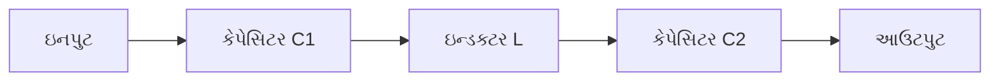

- **કાર્યપદ્ધતિ**: પ્રથમ કેપેસિટર (C1) પ્રારંભિક રિપલ ઘટાડે છે, ઇન્ડક્ટર (L) AC કમ્પોનન્ટને અવરોધે છે, બીજો કેપેસિટર (C2) બાકીના રિપલ્સને ફિલ્ટર કરે છે
- **ફાયદો**: સાધારણ રીતે 0.5% થી નીચેના રિપલ ફેક્ટર સાથે સુપિરિયર ફિલ્ટરિંગ પ્રદાન કરે છે
- **ઉપયોગો**: હાઇ-કરંટ પાવર સપ્લાયમાં વપરાય છે જ્યાં ક્લિન DC જરૂરી હોય

**મેમરી ટ્રીક:** "PIRO" - Pi filters Input Ripples Out effectively

## પ્રશ્ન 2(અ) [3 ગુણ]

**વિવિધ પ્રકારના કેપેસિટર લખો અને કોઈ પણ બે સમજાવો.**

**જવાબ**:

**કેપેસિટરના પ્રકાર**:

- સિરામિક કેપેસિટર
- ઇલેક્ટ્રોલિટિક કેપેસિટર
- ટેન્ટાલમ કેપેસિટર
- ફિલ્મ કેપેસિટર
- માઇકા કેપેસિટર
- વેરિએબલ કેપેસિટર

**સિરામિક કેપેસિટર**:

- **રચના**: ધાતુની પ્લેટો વચ્ચે ડાઇઇલેક્ટ્રિક તરીકે સિરામિક મટેરિયલથી બનેલા
- **કેપેસિટી**: 1pF થી 1μF
- **ફાયદા**: ઓછી કિંમત, ઉચ્ચ સ્થિરતા, નોન-પોલરાઈઝ્ડ
- **ઉપયોગો**: હાઇ-ફ્રિક્વન્સી ફિલ્ટરિંગ

**ઇલેક્ટ્રોલિટિક કેપેસિટર**:

- **રચના**: એલ્યુમિનિયમ ફોઇલ સાથે ડાઇઇલેક્ટ્રિક તરીકે ઓક્સાઇડ લેયર
- **કેપેસિટી**: 1μF થી 10,000μF
- **લાક્ષણિકતાઓ**: પોલરાઈઝ્ડ, ઉચ્ચ લીકેજ કરંટ
- **ઉપયોગો**: પાવર સપ્લાય ફિલ્ટરિંગ, ઓડિયો કપલિંગ

**મેમરી ટ્રીક:** "CAPEX" - Ceramics Are Precise, Electrolytics Expand capacity

## પ્રશ્ન 2(બ) [4 ગુણ]

**એર કોર અને ટોરોઇડલ ઇન્ડક્ટર સમજાવો.**

**જવાબ**:

**એર કોર ઇન્ડક્ટર:**

```goat
   +----------+
   |    Air   |
   |          |
 +-|----------|--+
 | |          |  |
 | |          |  |
 | |          |  |
 | |          |  |
 | |          |  |
 +-|----------|--+
   |          |
   +----------+
   Wire windings
```

- **રચના**: નોન-મેગ્નેટિક મટેરિયલ (પ્લાસ્ટિક, એર) પર વાયર કોઇલ કરીને બનાવવામાં આવે છે
- **ગુણધર્મો**: ઓછી ઇન્ડક્ટન્સ, મેગ્નેટિક કોર સેચ્યુરેશન નથી
- **ઉપયોગો**: હાઇ-ફ્રિક્વન્સી સર્કિટ, RF એપ્લિકેશન
- **ફાયદા**: કોર લોસેસ નથી, લિનિયર ઓપરેશન, સેચ્યુરેશન નથી

**ટોરોઇડલ ઇન્ડક્ટર:**

```goat
      +-------+
     /         \
    /           \
   /     Air     \
  |       +       |
  |      / \      |
  |     /   \     |
  |    +-----+    |
   \   |     |   /
    \  |     |  /
     \ |     | /
      ++-----++
     Wire windings
      around core
```

- **રચના**: રિંગ-આકારના મેગ્નેટિક કોર પર વાયર વીંટાળીને બનાવવામાં આવે છે
- **ગુણધર્મો**: ઉચ્ચ ઇન્ડક્ટન્સ, સેલ્ફ-શીલ્ડિંગ મેગ્નેટિક ફિલ્ડ
- **ઉપયોગો**: પાવર સપ્લાય, ફિલ્ટર, ટ્રાન્સફોર્મર
- **ફાયદા**: ઓછી ઇલેક્ટ્રોમેગ્નેટિક ઇન્ટરફેરન્સ, કાર્યક્ષમ ફ્લક્સ કન્ટેઇનમેન્ટ

**મેમરી ટ્રીક:** "TACO" - Toroids Are Contained, Omnidirectional field reduction

## પ્રશ્ન 2(ક) [7 ગુણ]

**હાફ વેવ રેક્ટિફાયર સમજાવો અને જુદા જુદા રેક્ટિફાયર સરખાવો.**

**જવાબ**:

**હાફ વેવ રેક્ટિફાયર:**

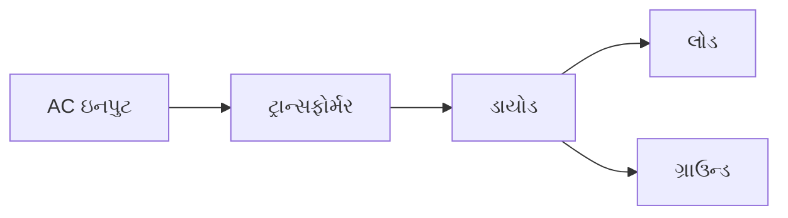

**કાર્યસિદ્ધાંત:**

- પોઝિટિવ હાફ-સાયકલ દરમિયાન: ડાયોડ કન્ડક્ટ કરે છે, કરંટ લોડ દ્વારા વહે છે
- નેગેટિવ હાફ-સાયકલ દરમિયાન: ડાયોડ બ્લોક કરે છે, કરંટ વહેતો નથી
- આઉટપુટમાં ફક્ત ઇનપુટ વેવફોર્મના પોઝિટિવ હાફ-સાયકલ હોય છે

**રેક્ટિફાયરની સરખામણી:**

| **પેરામીટર** | **હાફ વેવ** | **ફુલ વેવ (સેન્ટર-ટેપ)** | **બ્રિજ રેક્ટિફાયર** |
|---|---|---|---|
| જરૂરી ડાયોડ | 1 | 2 | 4 |
| આઉટપુટ ફ્રિક્વન્સી | f₁ = f<sub>in</sub> | f₂ = 2×f<sub>in</sub> | f₂ = 2×f<sub>in</sub> |
| રિપલ ફેક્ટર | 1.21 | 0.48 | 0.48 |
| કાર્યક્ષમતા | 40.6% | 81.2% | 81.2% |
| PIV | 2V<sub>m</sub> | 2V<sub>m</sub> | V<sub>m</sub> |
| TUF | 0.287 | 0.693 | 0.812 |
| DC આઉટપુટ | V<sub>m</sub>/π | 2V<sub>m</sub>/π | 2V<sub>m</sub>/π |

**મેમરી ટ્રીક:** "BRIEF" - Bridge Rectifiers Improve Efficiency Fundamentally

## પ્રશ્ન 2(અ) OR [3 ગુણ]

**વિવિધ કેપેસિટર સ્પષ્ટીકરણો લખો અને કોઈ પણ બે વિગતવાર સમજાવો.**

**જવાબ**:

**કેપેસિટર સ્પષ્ટીકરણો:**

- કેપેસિટન્સ વેલ્યુ
- વોલ્ટેજ રેટિંગ
- ટોલરન્સ
- તાપમાન ગુણાંક
- ESR (ઇક્વિવેલન્ટ સિરીઝ રેઝિસ્ટન્સ)
- લીકેજ કરંટ
- ડાઇઇલેક્ટ્રિક પ્રકાર

**કેપેસિટન્સ વેલ્યુ:**

- **વ્યાખ્યા**: દર વોલ્ટે સંગ્રહિત ઇલેક્ટ્રિક ચાર્જની માત્રા
- **એકમો**: ફેરડ (F)માં માપવામાં આવે છે, સામાન્ય રીતે માઇક્રોફેરડ (μF), નેનોફેરડ (nF), અથવા પિકોફેરડ (pF)
- **મહત્વ**: કપલિંગ, ફિલ્ટરિંગ, ટાઇમિંગ માટે એપ્લિકેશન યોગ્યતા નક્કી કરે છે
- **માર્કિંગ**: સીધી રીતે પ્રિન્ટ કરેલી અથવા કમ્પોનન્ટ પર કલર-કોડેડ

**વોલ્ટેજ રેટિંગ:**

- **વ્યાખ્યા**: બ્રેકડાઉન વગર લાગુ કરી શકાય તેવું મહત્તમ વોલ્ટેજ
- **સ્પેસિફિકેશન**: વર્કિંગ વોલ્ટેજ (WVDC) અને સર્જ વોલ્ટેજ
- **મહત્વ**: રેટિંગથી વધારે જવાથી ડાઇઇલેક્ટ્રિક બ્રેકડાઉન અને નિષ્ફળતા થાય છે
- **સેફ્ટી ફેક્ટર**: સામાન્ય રીતે સર્કિટ વોલ્ટેજથી 50% વધુ રેટિંગવાળા કેપેસિટર વાપરવા જોઈએ

**મેમરી ટ્રીક:** "CAVERN" - Capacitance And Voltage Ensure Reliable Network

## પ્રશ્ન 2(બ) OR [4 ગુણ]

**સામગ્રીના આધારે રેઝિસ્ટરનું વર્ગીકરણ સમજાવો.**

**જવાબ**:

| **રેઝિસ્ટર પ્રકાર** | **સામગ્રી** | **ગુણધર્મો** | **ઉપયોગો** |
|---|---|---|---|
| **કાર્બન કમ્પોઝિશન** | કાર્બન પાર્ટિકલ્સ + સિરેમિક બાઇન્ડર | ઉચ્ચ તાપમાન ગુણાંક, નોઈઝી | સામાન્ય ઉપયોગ, સર્જ પ્રોટેક્શન |
| **કાર્બન ફિલ્મ** | સિરેમિક પર કાર્બન ફિલ્મ | કાર્બન કમ્પોઝિશન કરતાં વધુ સ્થિરતા | સામાન્ય ઉપયોગ સર્કિટ |
| **મેટલ ફિલ્મ** | સિરેમિક પર નિકલ ક્રોમિયમ ફિલ્મ | ઓછો નોઇઝ, સ્થિર, ચોક્કસ | ઓડિયો સર્કિટ, ઇન્સ્ટ્રુમેન્ટેશન |
| **વાયર વાઉન્ડ** | સિરેમિક આસપાસ રેઝિસ્ટન્સ વાયર | હાઈ પાવર, લો તાપમાન ગુણાંક | પાવર સપ્લાય, હાઈ કરંટ એપ્લિકેશન |
| **મેટલ ઓક્સાઇડ** | સિરેમિક પર મેટલ ઓક્સાઇડ ફિલ્મ | સ્ટેબલ, હાઈ તાપમાન ટોલરન્સ | હાઈ સ્ટેબિલિટી એપ્લિકેશન, પાવર સપ્લાય |

**કાર્બન ફિલ્મ રેઝિસ્ટરની લાક્ષણિકતાઓ:**

- તાપમાન ગુણાંક: -250 થી 500 ppm/°C
- ટોલરન્સ: 5% થી 10%
- નોઇઝ: મધ્યમથી ઓછો

**મેટલ ફિલ્મ રેઝિસ્ટરની લાક્ષણિકતાઓ:**

- તાપમાન ગુણાંક: 50 થી 100 ppm/°C
- ટોલરન્સ: 0.1% થી 2%
- નોઇઝ: ખૂબ જ ઓછો

**મેમરી ટ્રીક:** "COMFORT" - Carbon Offers Moderate Films, Others Resist Temperature better

## પ્રશ્ન 2(ક) OR [7 ગુણ]

**ફુલ વેવ બ્રિજ અને સેન્ટર ટેપ્ડ રેક્ટિફાયર આકૃતિ સાથે સમજાવો.**

**જવાબ**:

**ફુલ વેવ બ્રિજ રેક્ટિફાયર:**

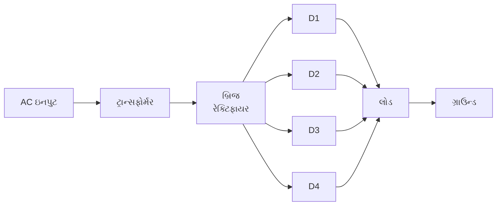

**કાર્યપદ્ધતિ:**

- **પોઝિટિવ હાફ-સાયકલ**: D1 અને D3 કન્ડક્ટ કરે છે, કરંટ લોડ મારફતે વહે છે
- **નેગેટિવ હાફ-સાયકલ**: D2 અને D4 કન્ડક્ટ કરે છે, કરંટ હજુ પણ એ જ દિશામાં લોડ મારફતે વહે છે
- **આઉટપુટ**: ઇનપુટના બંને હાફ-સાયકલ પોઝિટિવ આઉટપુટમાં રૂપાંતરિત થાય છે

**સેન્ટર ટેપ્ડ ફુલ વેવ રેક્ટિફાયર:**

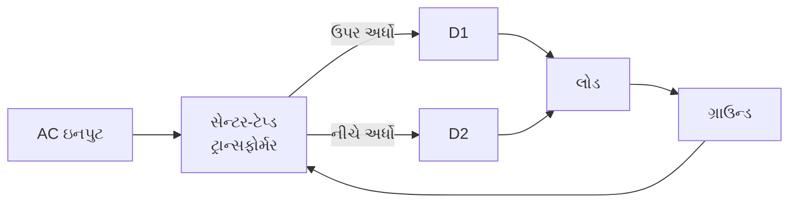

**કાર્યપદ્ધતિ:**

- **પોઝિટિવ હાફ-સાયકલ**: D1 કન્ડક્ટ કરે છે, D2 બ્લોક કરે છે
- **નેગેટિવ હાફ-સાયકલ**: D2 કન્ડક્ટ કરે છે, D1 બ્લોક કરે છે
- **આઉટપુટ**: ઇનપુટના બંને હાફ-સાયકલ પોઝિટિવ આઉટપુટમાં રૂપાંતરિત થાય છે

**વેવફોર્મ:**

```goat
Input:  ∿∿∿∿∿∿∿∿∿∿∿∿∿∿∿
         |
         v
Bridge: ∩∩∩∩∩∩∩∩∩∩∩∩∩∩∩
Rectifier
         |
         v
Output: ∩∩∩∩∩∩∩∩∩∩∩∩∩∩∩
(with filter)
```

**મેમરી ટ્રીક:** "FOUR-TWO" - FOUr diodes for Bridge, TWO diodes for Center-Tap

## પ્રશ્ન 3(અ) [3 ગુણ]

**વેરેક્ટર ડાયોડની લાક્ષણિકતા સમજાવો.**

**જવાબ**:

**વેરેક્ટર ડાયોડની લાક્ષણિકતાઓ:**

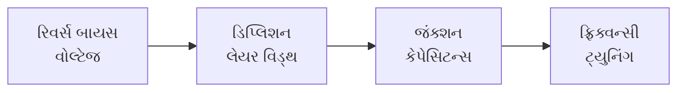

- **ઓપરેટિંગ સિદ્ધાંત**: જંક્શન કેપેસિટન્સ રિવર્સ બાયસ વોલ્ટેજ સાથે બદલાય છે
- **C-V સંબંધ**: રિવર્સ વોલ્ટેજ વધતાં કેપેસિટન્સ ઘટે છે
- **ટ્યુનિંગ રેશિયો**: સામાન્ય રીતે 4:1 થી 10:1 કેપેસિટન્સ વેરિએશન
- **ઉપયોગો**: વોલ્ટેજ-કંટ્રોલ્ડ ઓસિલેટર, FM મોડ્યુલેશન, ટ્યુનિંગ સર્કિટ

**મેમરી ટ્રીક:** "VARA" - Voltage Adjusts Reverse-biased capacitance Automatically

## પ્રશ્ન 3(બ) [4 ગુણ]

**ઇલેક્ટ્રોમેગ્નેટિક ઇન્ડક્શનના ફેરાડેના નિયમો જણાવો અને સમજાવો.**

**જવાબ**:

**ફેરાડેના ઇલેક્ટ્રોમેગ્નેટિક ઇન્ડક્શનના નિયમો:**

**પ્રથમ નિયમ:**

- **સ્ટેટમેન્ટ**: જ્યારે પણ કન્ડક્ટર મેગ્નેટિક ફ્લક્સને કાપે છે, ત્યારે કન્ડક્ટરમાં EMF ઇન્ડ્યુસ થાય છે
- **ગણિતીય અભિવ્યક્તિ**: EMF ∝ મેગ્નેટિક ફ્લક્સના પરિવર્તનનો દર
- **ઉપયોગ**: જનરેટર, ટ્રાન્સફોર્મર, ઇન્ડક્ટરનો આધાર

**બીજો નિયમ:**

- **સ્ટેટમેન્ટ**: ઇન્ડ્યુસ્ડ EMFનું પરિમાણ મેગ્નેટિક ફ્લક્સ લિંકેજના પરિવર્તનના દર સાથે સમાન છે
- **ગણિતીય અભિવ્યક્તિ**: EMF = -N × (dΦ/dt)
  - જ્યાં: N = લપેટાઓની સંખ્યા, dΦ/dt = ફ્લક્સના પરિવર્તનનો દર
- **નેગેટિવ ચિહ્ન**: દિશા દર્શાવે છે (લેન્ઝનો નિયમ) - ઇન્ડ્યુસ્ડ કરંટ પરિવર્તનનો વિરોધ કરે છે

**આકૃતિ:**

```goat
    N     S       
    |     |       
    v     v       
  +---+ +---+     
  |   | |   |     
  |   | |   |     
  +---+ +---+     
    ^     ^       
    |     |       
    |     |       
  +----------+    
  |   Coil   |-----> Induced EMF
  +----------+    
```

**મેમરી ટ્રીક:** "FACE" - Flux Alteration Creates Electricity

## પ્રશ્ન 3(ક) [7 ગુણ]

**વિવિધ ટ્રાન્ઝિસ્ટર રૂપરેખાંકનોની તુલના કરો.**

**જવાબ**:

| **પેરામીટર** | **કોમન ઇમિટર (CE)** | **કોમન બેઝ (CB)** | **કોમન કલેક્ટર (CC)** |
|---|---|---|---|
| **ઇનપુટ ટર્મિનલ** | બેઝ | ઇમિટર | બેઝ |
| **આઉટપુટ ટર્મિનલ** | કલેક્ટર | કલેક્ટર | ઇમિટર |
| **કોમન ટર્મિનલ** | ઇમિટર | બેઝ | કલેક્ટર |
| **કરંટ ગેઇન (α, β, γ)** | β = I<sub>C</sub>/I<sub>B</sub> (20-500) | α = I<sub>C</sub>/I<sub>E</sub> (0.95-0.99) | γ = I<sub>E</sub>/I<sub>B</sub> (β+1) |
| **વોલ્ટેજ ગેઇન** | હાઈ (250-1000) | મધ્યમ (150-800) | 1 થી ઓછું |
| **ઇનપુટ ઇમ્પિડન્સ** | મધ્યમ (1-2kΩ) | લો (30-150Ω) | હાઈ (50-500kΩ) |
| **આઉટપુટ ઇમ્પિડન્સ** | હાઈ (30-50kΩ) | વેરી હાઈ (250kΩ-1MΩ) | લો (50-100Ω) |
| **ફેઝ શિફ્ટ** | 180° | 0° | 0° |
| **ઉપયોગો** | એમ્પલિફાયર, ઓસિલેટર | RF એમ્પલિફાયર, હાઈ-ફ્રિક્વન્સી સર્કિટ | ઇમ્પિડન્સ મેચિંગ, બફર |

**α, β અને γ વચ્ચેનો સંબંધ:**

- β = α/(1-α)
- α = β/(1+β)
- γ = β+1

**મેમરી ટ્રીક:** "BEC" - Base input for Emitter output needs Collector as common terminal

## પ્રશ્ન 3(અ) OR [3 ગુણ]

**ફોરબિડન એનર્જી ગેપ શું છે? અવાહક, વાહક અને સેમીકન્ડક્ટર માટે એનર્જી બેન્ડ ડાયાગ્રામ દોરો.**

**જવાબ**:

**ફોરબિડન એનર્જી ગેપ:** ઘન પદાર્થમાં એનર્જીની શ્રેણી જ્યાં કોઈ ઇલેક્ટ્રોન સ્ટેટ અસ્તિત્વમાં નથી, વેલેન્સ બેન્ડને કન્ડક્શન બેન્ડથી અલગ કરે છે.

**એનર્જી બેન્ડ ડાયાગ્રામ:**

```goat
+---------------+  +---------------+  +---------------+
|///////////////|  |///////////////|  |///////////////|
|/// Conduction |  |/// Conduction |  |/// Conduction |
|///////////////|  |///////////////|  |///////////////|
+---------------+  +---------------+  +---------------+
|               |  |///////////////|  |      |        |
|               |  |///////////////|  |      | Small  |
| Large         |  | Overlap       |  |      | Gap    |
| Forbidden     |  |///////////////|  |      |        |
| Gap (>5eV)    |  |///////////////|  |      | (~1eV) |
|               |  |///////////////|  |      |        |
+---------------+  +---------------+  +---------------+
|///////////////|  |///////////////|  |///////////////|
|/// Valence    |  |/// Valence    |  |/// Valence    |
|///////////////|  |///////////////|  |///////////////|
+---------------+  +---------------+  +---------------+
    Insulator          Conductor        Semiconductor
```

- **અવાહક (ઇન્સુલેટર)**: મોટો ફોરબિડન ગેપ (>5eV) ઇલેક્ટ્રોન્સને કન્ડક્શન બેન્ડ સુધી પહોંચતા અટકાવે છે
- **વાહક (કન્ડક્ટર)**: ઓવરલેપિંગ બેન્ડ મુક્ત ઇલેક્ટ્રોન મૂવમેન્ટની મંજૂરી આપે છે
- **સેમિકન્ડક્ટર**: નાનો ગેપ (~1eV) થોડા ઇલેક્ટ્રોન્સને રૂમ ટેમ્પરેચર પર અથવા ઉત્તેજિત થયા પછી ક્રોસ કરવાની મંજૂરી આપે છે

**મેમરી ટ્રીક:** "IBCS" - Insulators Block, Conductors Share, Semiconductors have gap Between

## પ્રશ્ન 3(બ) OR [4 ગુણ]

**ઝેનર વોલ્ટેજ રેગ્યુલેટર સર્કિટની કામગીરીનું વર્ણન કરો.**

**જવાબ**:

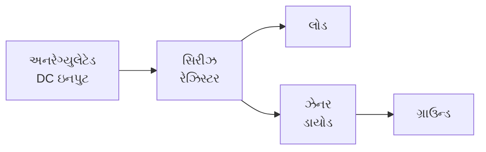

**કાર્યસિદ્ધાંત:**

- **સામાન્ય ઓપરેશન**: ઝેનર ડાયોડ રિવર્સ બાયસ્ડ છે અને જ્યારે વોલ્ટેજ બ્રેકડાઉન વોલ્ટેજ સુધી પહોંચે ત્યારે કન્ડક્ટ કરે છે
- **વોલ્ટેજ રેગ્યુલેશન**: જ્યારે ઇનપુટ વોલ્ટેજ વધે છે, ત્યારે ઝેનર ડાયોડ મારફતે વધુ કરંટ વહે છે, જેનાથી તેના પર સ્થિર વોલ્ટેજ જળવાઈ રહે છે
- **લોડ વેરિએશન**: જ્યારે લોડ વધુ કરંટ લે છે, ત્યારે ઝેનર મારફતે ઓછો કરંટ વહે છે, જેનાથી વોલ્ટેજ સ્થિર રહે છે
- **સિરીઝ રેઝિસ્ટર**: કરંટને મર્યાદિત કરે છે અને વધારાના વોલ્ટેજને ડ્રોપ કરે છે

**સર્કિટ બિહેવિયર:**

- **V<sub>out</sub> = V<sub>z</sub>** (ઝેનર બ્રેકડાઉન વોલ્ટેજ)
- **I<sub>z</sub> = (V<sub>in</sub> - V<sub>z</sub>)/R - I<sub>L</sub>**

**મેમરી ટ્રીક:** "SERZ" - Series resistor Enables Regulation with Zener

## પ્રશ્ન 3(ક) OR [7 ગુણ]

**P-N જંક્શન ડાયોડની V-I લાક્ષણિકતા સમજાવો અને P-N જંક્શન ડાયોડ અને ઝેનર ડાયોડ વચ્ચે સરખામણી આપો.**

**જવાબ**:

**P-N જંક્શન ડાયોડની V-I લાક્ષણિકતા:**

```goat
                 I
                 ^
                 |              /
                 |             /
                 |            /
                 |           /
Forward current  |          /
                 |         /
                 |        /
                 |       /
                 |  Knee/
                 |     /
        -V <-----|----+---> +V
                 |   /|
                 |    |
                 |    |
Reverse current  |    |
                 |    |    Breakdown
                 |    |       |
                 |    |       v
                 |    |       ⌄_____
```

**મુખ્ય પોઇન્ટ્સ:**

- **ફોરવર્ડ બાયસ**: ની વોલ્ટેજ (~0.7V સિલિકોન માટે) પછી સરળતાથી કન્ડક્ટ કરે છે
- **રિવર્સ બાયસ**: બ્રેકડાઉન વોલ્ટેજ સુધી ખૂબ જ ઓછો લીકેજ કરંટ
- **બ્રેકડાઉન રીજન**: ઉચ્ચ રિવર્સ વોલ્ટેજ પર થાય છે, સામાન્ય ડાયોડમાં નુકસાન કરે છે

**P-N જંક્શન ડાયોડ અને ઝેનર ડાયોડ વચ્ચેની સરખામણી:**

| **પેરામીટર** | **P-N જંક્શન ડાયોડ** | **ઝેનર ડાયોડ** |
|---|---|---|
| **સિમ્બોલ** | ▷\|— | ▷\|—◁ |
| **ફોરવર્ડ ઓપરેશન** | સરળતાથી કન્ડક્ટ કરે છે | સામાન્ય ડાયોડ જેવું જ |
| **રિવર્સ બ્રેકડાઉન** | ઉચ્ચ વોલ્ટેજ પર, નુકસાન કરે છે | નિયંત્રિત, નોન-ડિસ્ટ્રક્ટિવ |
| **ડોપિંગ લેવલ** | મધ્યમ | ભારે ડોપિંગ |
| **ઓપરેટિંગ રીજન** | ફોરવર્ડ બાયસ્ડ | રિવર્સ બાયસ્ડ (બ્રેકડાઉન રીજન) |
| **ઉપયોગો** | રેક્ટિફિકેશન, સ્વિચિંગ | વોલ્ટેજ રેગ્યુલેશન, રેફરન્સ |
| **બ્રેકડાઉન મેકેનિઝમ** | એવલાન્ચ | ઝેનર ઇફેક્ટ અને એવલાન્ચ |
| **તાપમાન ગુણાંક** | નેગેટિવ | પોઝિટિવ અથવા નેગેટિવ હોઈ શકે છે |

**મેમરી ટ્રીક:** "FORD" - Forward Operation for Rectifiers, Diodes; reverse operation for Zeners

## પ્રશ્ન 4(અ) [3 ગુણ]

**ફોટો ડાયોડના કાર્ય સિદ્ધાંતનું વર્ણન કરો.**

**જવાબ**:

**ફોટોડાયોડના કાર્યસિદ્ધાંત:**

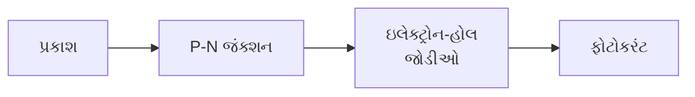

- **રચના**: પારદર્શક વિન્ડો અથવા લેન્સ સાથેનો P-N જંક્શન ડાયોડ
- **ઓપરેશન**: પ્રકાશ ડિટેક્શન માટે રિવર્સ બાયસ્ડ ઓપરેશન
- **ફોટોન એબ્સોર્પશન**: આવતા ફોટોન્સ ડિપ્લિશન રીજનમાં ઇલેક્ટ્રોન-હોલ જોડીઓ બનાવે છે
- **કરંટ જનરેશન**: ઇલેક્ટ્રિક ફિલ્ડ કેરિયર્સને તેમના સંબંધિત ટર્મિનલ તરફ મોકલે છે, જેનાથી ફોટોકરંટ બને છે
- **લાઇટ સેન્સિટિવિટી**: કરંટ પ્રકાશની તીવ્રતાના પ્રમાણમાં હોય છે

**મેમરી ટ્રીક:** "LIGER" - Light Induces Generation of Electrons in Reverse-bias

## પ્રશ્ન 4(બ) [4 ગુણ]

**શોટકી બેરિયર ડાયોડની લાક્ષણિકતા સમજાવો.**

**જવાબ**:

**શોટકી બેરિયર ડાયોડની લાક્ષણિકતાઓ:**

```goat
                 I
                 ^
                 |              /
                 |             / Schottky
                 |            /
                 |           /   PN Junction
Forward current  |          / ,/
                 |         / /
                 |        / /
                 |       / /
                 |      / /
                 |     //
        -V <-----|----|---> +V
                 |    |
                 |    |
                 |    |
Reverse current  |    |
                 |    |
```

- **ઓછો ફોરવર્ડ વોલ્ટેજ ડ્રોપ**: સિલિકોન PN જંક્શનના 0.7V ની તુલનામાં 0.2-0.3V
- **ફાસ્ટ સ્વિચિંગ**: કોઈ માઈનોરિટી કેરિયર સ્ટોરેજ નહીં, મિનિમલ રિવર્સ રિકવરી ટાઇમ
- **રચના**: P-N જંક્શનને બદલે મેટલ-સેમિકન્ડક્ટર જંક્શન
- **કોઈ રિવર્સ રિકવરી ટાઇમ નહીં**: મેજોરિટી કેરિયર ડિવાઇસ (કોઈ સ્ટોર્ડ ચાર્જ નહીં)
- **ઉપયોગો**: હાઈ-ફ્રિક્વન્સી એપ્લિકેશન, પાવર સપ્લાયમાં રેક્ટિફાયર

**મેમરી ટ્રીક:** "FAST" - Forward voltage low, Allows Switching Timely

## પ્રશ્ન 4(ક) [7 ગુણ]

**PNP અને NPN ટ્રાન્ઝિસ્ટરના કાર્ય સિદ્ધાંતને સમજાવો.**

**જવાબ**:

**NPN ટ્રાન્ઝિસ્ટરની સ્ટ્રક્ચર અને કાર્યપદ્ધતિ:**

```goat
    +-------+     +-------+     +-------+
    |       |     |       |     |       |
    |   N   |     |   P   |     |   N   |
    |       |     |       |     |       |
    +-------+     +-------+     +-------+
    Emitter        Base        Collector
        |            |            |
        |            |            |
        v            v            v
    Electron      Hole        Electron
     source    controller     collector
```

- **બાયસિંગ**: ઇમિટર-બેઝ જંક્શન ફોરવર્ડ બાયસ્ડ, કલેક્ટર-બેઝ જંક્શન રિવર્સ બાયસ્ડ
- **કરંટ ફ્લો**: ઇલેક્ટ્રોન્સ પાતળા બેઝ રીજન મારફતે ઇમિટરથી કલેક્ટર તરફ
- **એમ્પલિફિકેશન સિદ્ધાંત**: નાનો બેઝ કરંટ મોટા કલેક્ટર કરંટને નિયંત્રિત કરે છે
- **કરંટ સંબંધ**: I<sub>E</sub> = I<sub>B</sub> + I<sub>C</sub>
- **મેજોરિટી કેરિયર્સ**: ઇલેક્ટ્રોન્સ

**PNP ટ્રાન્ઝિસ્ટરની સ્ટ્રક્ચર અને કાર્યપદ્ધતિ:**

```goat
    +-------+     +-------+     +-------+
    |       |     |       |     |       |
    |   P   |     |   N   |     |   P   |
    |       |     |       |     |       |
    +-------+     +-------+     +-------+
    Emitter        Base        Collector
        |            |            |
        |            |            |
        v            v            v
     Hole         Electron        Hole
     source     controller     collector
```

- **બાયસિંગ**: ઇમિટર-બેઝ જંક્શન ફોરવર્ડ બાયસ્ડ, કલેક્ટર-બેઝ જંક્શન રિવર્સ બાયસ્ડ
- **કરંટ ફ્લો**: હોલ્સ પાતળા બેઝ રીજન મારફતે ઇમિટરથી કલેક્ટર તરફ
- **એમ્પલિફિકેશન સિદ્ધાંત**: નાનો બેઝ કરંટ મોટા કલેક્ટર કરંટને નિયંત્રિત કરે છે
- **કરંટ સંબંધ**: I<sub>E</sub> = I<sub>B</sub> + I<sub>C</sub>
- **મેજોરિટી કેરિયર્સ**: હોલ્સ
- **કરંટ દિશા**: NPN કરતાં વિપરીત (કન્વેન્શનલ કરંટ ઇમિટરથી કલેક્ટર તરફ)

**મેમરી ટ્રીક:** "NPNP" - Negative carriers in NPN, Positive carriers in PNP

## પ્રશ્ન 4(અ) OR [3 ગુણ]

**LED ના કાર્ય સિદ્ધાંતનું વર્ણન કરો.**

**જવાબ**:

**LED (લાઇટ ઇમિટિંગ ડાયોડ)ના કાર્યસિદ્ધાંત:**

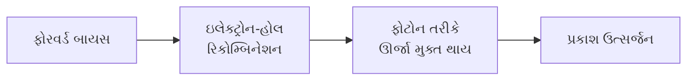

- **રચના**: ડાયરેક્ટ બેન્ડગેપ સેમિકન્ડક્ટર મટેરિયલથી બનેલા P-N જંક્શન
- **ફોરવર્ડ બાયસિંગ**: n-રીજનમાંથી ઇલેક્ટ્રોન્સ અને p-રીજનમાંથી હોલ્સ જંક્શન પર રિકોમ્બાઇન થાય છે
- **રિકોમ્બિનેશન**: ઇલેક્ટ્રોન કન્ડક્શન બેન્ડમાંથી વેલેન્સ બેન્ડમાં પડે છે
- **ઊર્જા ઉત્સર્જન**: રિકોમ્બિનેશન દરમિયાન છૂટી પડેલી ઊર્જા ફોટોન્સ (પ્રકાશ) ઉત્સર્જિત કરે છે
- **કલર ડિટરમિનેશન**: બેન્ડગેપ ઊર્જા ઉત્સર્જિત પ્રકાશની તરંગલંબાઈ (રંગ) નક્કી કરે છે

**મેમરી ટ્રીક:** "REBEL" - Recombination of Electrons and holes By Energetic Light emission

## પ્રશ્ન 4(બ) OR [4 ગુણ]

**કટ ઓફ અને સેચ્યુરેશન રીજીયનમાં ટ્રાન્ઝિસ્ટરનું સ્વિચ તરીકે એપ્લિકેશન કાર્ય સમજાવો.**

**જવાબ**:

**ટ્રાન્ઝિસ્ટર એઝ અ સ્વિચ:**

```goat
        Input                        Output
          |                            |
          |                            |
          v                            v
    +----------+                 +----------+
    |    R1    |                 |    RC    |
    +----------+                 +----------+
          |                            |
          |                            |
          |     +---------------+      |
          +---->|     B     C   |------+
                |       |       |
                |       |       |
                |     E         |
                +---------------+
                     |
                     |
                 Ground
```

**કટ-ઓફ રીજન (સ્વિચ OFF):**

- **બેઝ વોલ્ટેજ**: 0.7V (સિલિકોન માટે) થી નીચે
- **બેઝ કરંટ**: લગભગ શૂન્ય
- **કલેક્ટર કરંટ**: લગભગ શૂન્ય
- **કલેક્ટર-ઇમિટર વોલ્ટેજ**: સપ્લાય વોલ્ટેજના બરાબર
- **ઉપયોગો**: લોજિક ગેટ્સ, ડિજિટલ સર્કિટ, રિલે ડ્રાઇવર

**સેચ્યુરેશન રીજન (સ્વિચ ON):**

- **બેઝ વોલ્ટેજ**: 0.7V કરતાં ઘણું ઊંચું
- **બેઝ કરંટ**: લઘુત્તમ V<sub>CE</sub> સુનિશ્ચિત કરવા માટે પર્યાપ્ત
- **કલેક્ટર કરંટ**: મહત્તમ (કલેક્ટર રેઝિસ્ટર દ્વારા મર્યાદિત)
- **કલેક્ટર-ઇમિટર વોલ્ટેજ**: ખૂબ જ ઓછું (0.2V - 0.3V)
- **ઉપયોગો**: ડિજિટલ સ્વીચ, મોટર ડ્રાઇવર, LED ડ્રાઇવર

**મેમરી ટ્રીક:** "COSI" - Cutoff Opens Switch, Input saturates to close

## પ્રશ્ન 4(ક) OR [7 ગુણ]

**C-E ટ્રાન્ઝિસ્ટર એમ્પ્લિફાયર રચના ટૂંકમાં સમજાવો. ટ્રાન્ઝિસ્ટર એમ્પ્લીફાયર માટે α અને β વચ્ચેનો સંબંધ મેળવો.**

**જવાબ**:

**કોમન ઇમિટર કોન્ફિગરેશન:**

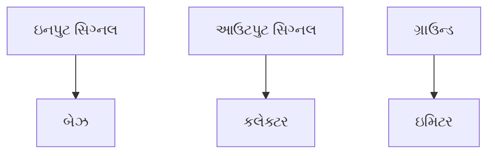

**કોમન ઇમિટર કોન્ફિગરેશનની લાક્ષણિકતાઓ:**

- **ઇનપુટ ટર્મિનલ**: બેઝ
- **આઉટપુટ ટર્મિનલ**: કલેક્ટર
- **કોમન ટર્મિનલ**: ઇમિટર (ગ્રાઉન્ડેડ)
- **કરંટ ગેઇન (β)**: હાઈ (20-500)
- **વોલ્ટેજ ગેઇન**: હાઈ (250-1000)
- **ઇનપુટ ઇમ્પિડન્સ**: મધ્યમ (1-2kΩ)
- **આઉટપુટ ઇમ્પિડન્સ**: હાઈ (30-50kΩ)
- **ફેઝ શિફ્ટ**: 180° (આઉટપુટ ઇનપુટથી ઇન્વર્ટેડ)

**α અને β વચ્ચેનો સંબંધ:**

વ્યાખ્યા પ્રમાણે:

- α = I<sub>C</sub>/I<sub>E</sub> (કોમન બેઝ કરંટ ગેઇન)
- β = I<sub>C</sub>/I<sub>B</sub> (કોમન ઇમિટર કરંટ ગેઇન)

કિરચોફના કરંટ લૉ પરથી:

- I<sub>E</sub> = I<sub>B</sub> + I<sub>C</sub>

બંને બાજુને I<sub>E</sub> વડે ભાગીએ:

- 1 = I<sub>B</sub>/I<sub>E</sub> + I<sub>C</sub>/I<sub>E</sub>
- 1 = I<sub>B</sub>/I<sub>E</sub> + α

તેથી:

- I<sub>B</sub>/I<sub>E</sub> = 1 - α

હવે, β = I<sub>C</sub>/I<sub>B</sub> = (I<sub>C</sub>/I<sub>E</sub>)/(I<sub>B</sub>/I<sub>E</sub>) = α/(1-α)

અને તેથી ઉલટું:

- α = β/(1+β)

**મેમરી ટ્રીક:** "BEAR" - Beta Equals Alpha divided by (1-alpha) Relation

## પ્રશ્ન 5(અ) [3 ગુણ]

**ઇ-વેસ્ટનો અર્થ શું છે? ઇ-કચરાના નિકાલની વિવિધ પદ્ધતિઓ શું છે?**

**જવાબ**:

**ઇ-વેસ્ટ (ઇલેક્ટ્રોનિક વેસ્ટ)**: ત્યજાયેલા ઇલેક્ટ્રોનિક ડિવાઇસ અને કમ્પોનન્ટ્સ જે તેમના જીવનકાળનાં અંતે પહોંચ્યા છે અથવા હવે ઉપયોગી નથી.

**ઇ-વેસ્ટ નિકાલની પદ્ધતિઓ:**

| **નિકાલ પદ્ધતિ** | **વર્ણન** |
|---|---|
| **રિસાયક્લિંગ** | મૂલ્યવાન સામગ્રી જેમ કે ધાતુઓ, પ્લાસ્ટિકને પુન:ઉપયોગ માટે અલગ કરવી |
| **લેન્ડફિલિંગ** | નિયુક્ત લેન્ડફિલ્સમાં નિકાલ (ભલામણ કરાતી નથી) |
| **ઇન્સિનરેશન** | ઉચ્ચ તાપમાને કચરાનું દહન (ઝેરી ઉત્સર્જન બનાવે છે) |
| **રિયુઝ/રિફર્બિશમેન્ટ** | વિસ્તારિત ઉપયોગ માટે રિપેરિંગ અને અપગ્રેડિંગ |
| **ઇક્સટેન્ડેડ પ્રોડ્યુસર રિસ્પોન્સિબિલિટી** | ઉત્પાદકો પાછા લે અને નિકાલ સંભાળે છે |

**મેમરી ટ્રીક:** "RIPER" - Recycling Is Preferable to Environmentally-harmful Remedies

## પ્રશ્ન 5(બ) [4 ગુણ]

**ઉદાહરણો સાથે ઈલેક્ટ્રોનિક કચરાનું સંચાલન કરવાની પદ્ધતિઓ સમજાવો.**

**જવાબ**:

**ઇલેક્ટ્રોનિક વેસ્ટ હેન્ડલિંગની પદ્ધતિઓ:**

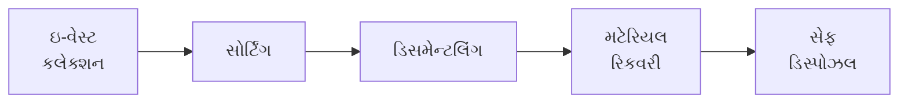

**કલેક્શન અને સેગ્રિગેશન:**

- **ઉદાહરણ**: જાહેર સ્થળોએ સમર્પિત ઇ-વેસ્ટ બિન્સ, ઇ-વેસ્ટ કલેક્શન ડ્રાઇવ્સ
- **લાભ**: સામાન્ય કચરા સાથે મિશ્રણ અટકાવે છે, યોગ્ય પ્રોસેસિંગ સક્ષમ કરે છે

**ડિસમેન્ટલિંગ અને રિસોર્સ રિકવરી:**

- **ઉદાહરણ**: સર્કિટ બોર્ડ અને કનેક્ટર્સમાંથી સોનું, ચાંદી, કોપર રિકવર કરવા
- **લાભ**: મૂલ્યવાન ધાતુઓ પુન:પ્રાપ્ત કરે છે, માઇનિંગની માંગ ઘટાડે છે

**રિફર્બિશમેન્ટ અને રિયુઝ:**

- **ઉદાહરણ**: શૈક્ષણિક સંસ્થાઓ માટે જૂના કમ્પ્યુટર્સની મરામત
- **લાભ**: પ્રોડક્ટ લાઇફસાયકલ વિસ્તૃત કરે છે, કચરા ઉત્પાદન ઘટાડે છે

**હાનિકારક કમ્પોનન્ટ્સનો યોગ્ય નિકાલ:**

- **ઉદાહરણ**: મર્ક્યુરી-ધરાવતા કમ્પોનન્ટ્સ માટે સ્પેશિયલાઇઝ્ડ ટ્રીટમેન્ટ
- **લાભ**: ઝેરી પદાર્થોને પર્યાવરણમાં પ્રવેશતા અટકાવે છે

**મેમરી ટ્રીક:** "CREED" - Collect, Recover, Extract, Extend, Dispose safely

## પ્રશ્ન 5(ક) [7 ગુણ]

**રિપલ ફેક્ટર શું છે? રેક્ટિફાયર માટે રિપલ ફેક્ટરનું સમીકરણ મેળવો.**

**જવાબ**:

**રિપલ ફેક્ટર**: રેક્ટિફાયરની ફિલ્ટરિંગની અસરકારકતાનું માપ - આઉટપુટમાં AC કમ્પોનન્ટ (રિપલ)નો DC કમ્પોનન્ટ સાથેનો ગુણોત્તર.

**વ્યાખ્યા**:

- રિપલ ફેક્ટર (γ) = AC કમ્પોનન્ટની RMS વેલ્યુ / DC વેલ્યુ
- ઓછો રિપલ ફેક્ટર વધુ સારા ફિલ્ટરિંગનો સંકેત આપે છે

**હાફ વેવ રેક્ટિફાયર માટે ડેરિવેશન:**

ચાલો ધારીએ કે સાઇન્યુસોઇડલ ઇનપુટ: v = V<sub>m</sub>sinωt

હાફ વેવ રેક્ટિફાયર માટે:

- આઉટપુટ v = V<sub>m</sub>sinωt જ્યારે 0 ≤ ωt ≤ π
- આઉટપુટ v = 0 જ્યારે π ≤ ωt ≤ 2π

**સ્ટેપ 1**: DC કમ્પોનન્ટ (એવરેજ વેલ્યુ) શોધો

- V<sub>DC</sub> = (1/2π) ∫<sub>0</sub><sup>2π</sup> v(ωt) d(ωt)
- V<sub>DC</sub> = (1/2π) ∫<sub>0</sub><sup>π</sup> V<sub>m</sub>sinωt d(ωt)
- V<sub>DC</sub> = V<sub>m</sub>/π

**સ્ટેપ 2**: RMS વેલ્યુ શોધો

- V<sub>RMS</sub> = √[(1/2π) ∫<sub>0</sub><sup>2π</sup> v²(ωt) d(ωt)]
- V<sub>RMS</sub> = √[(1/2π) ∫<sub>0</sub><sup>π</sup> V<sub>m</sub>²sin²ωt d(ωt)]
- V<sub>RMS</sub> = V<sub>m</sub>/2

**સ્ટેપ 3**: AC કમ્પોનન્ટ શોધો

- V<sub>AC</sub>² = V<sub>RMS</sub>² - V<sub>DC</sub>²
- V<sub>AC</sub>² = (V<sub>m</sub>/2)² - (V<sub>m</sub>/π)²
- V<sub>AC</sub>² = V<sub>m</sub>²(1/4 - 1/π²)

**સ્ટેપ 4**: રિપલ ફેક્ટર ગણો

- γ = V<sub>AC</sub>/V<sub>DC</sub>
- γ = √(V<sub>m</sub>²(1/4 - 1/π²))/(V<sub>m</sub>/π)
- γ = π√(1/4 - 1/π²)
- γ = 1.21 (હાફ વેવ રેક્ટિફાયર માટે)

**ફુલ વેવ રેક્ટિફાયર માટે**:
સમાન પગલાં અનુસરીને γ = 0.48 મળે છે

**મેમરી ટ્રીક:** "ROAD" - Ripple is Output's AC Divided by DC component

## પ્રશ્ન 5(અ) OR [3 ગુણ]

**ઈ-વેસ્ટમાં કયા ઝેરી પદાર્થો હોય છે?**

**જવાબ**:

**ઇ-વેસ્ટમાં ઝેરી પદાર્થો:**

| **ઝેરી પદાર્થ** | **ઇલેક્ટ્રોનિક્સમાં સ્ત્રોત** | **આરોગ્ય/પર્યાવરણીય અસર** |
|---|---|---|
| **લેડ (Pb)** | સોલ્ડર, CRT મોનિટર, બેટરીઓ | ન્યુરોલોજીકલ નુકસાન, વિકાસાત્મક સમસ્યાઓ |
| **મર્ક્યુરી (Hg)** | સ્વિચ, બેકલાઇટ્સ, બેટરીઓ | ન્યુરોલોજીકલ અને કિડનીને નુકસાન |
| **કેડમિયમ (Cd)** | રિચાર્જેબલ બેટરીઓ, સર્કિટ બોર્ડ | કિડનીને નુકસાન, હાડકાના રોગો |
| **બ્રોમિનેટેડ ફ્લેમ રિટાર્ડન્ટ્સ** | પ્લાસ્ટિક કેસિંગ, સર્કિટ બોર્ડ | એન્ડોક્રાઇન ડિસ્રપ્શન, બાયોએક્યુમ્યુલેશન |
| **હેક્સાવેલેન્ટ ક્રોમિયમ** | મેટલ પાર્ટ્સમાં કોરોઝન પ્રોટેક્શન | એલર્જીક રિએક્શન, DNA નુકસાન |
| **બેરિલિયમ (Be)** | કનેક્ટર્સ, સ્પ્રિંગ્સ | ફેફસાના રોગ, ત્વચાના વિકાર |

**મેમરી ટ્રીક:** "LMBCHB" - Lead, Mercury, and Beryllium Cause Harmful Bodily effects

## પ્રશ્ન 5(બ) OR [4 ગુણ]

**તમારી એપ્લિકેશન માટે યોગ્ય ટ્રાન્ઝિસ્ટર પસંદ કરવા માટેના મહત્વપૂર્ણ પરિમાણો લખો અને કોઈપણ બે સમજાવો.**

**જવાબ**:

**મહત્વપૂર્ણ ટ્રાન્ઝિસ્ટર સિલેક્શન પેરામીટર્સ:**

- મહત્તમ કલેક્ટર કરંટ (I<sub>C</sub>)
- મહત્તમ કલેક્ટર-ઇમિટર વોલ્ટેજ (V<sub>CEO</sub>)
- મહત્તમ કલેક્ટર-બેઝ વોલ્ટેજ (V<sub>CBO</sub>)
- કરંટ ગેઇન (hFE અથવા β)
- ફ્રિક્વન્સી રિસ્પોન્સ (f<sub>T</sub>)
- પાવર ડિસિપેશન (P<sub>tot</sub>)
- પેકેજ ટાઇપ (TO-3, SMT, વગેરે)
- તાપમાન રેન્જ

**મહત્તમ કલેક્ટર કરંટ (I<sub>C</sub>):**

- **વ્યાખ્યા**: નુકસાન વિના કલેક્ટર મારફતે વહી શકે તેવો મહત્તમ કરંટ
- **મહત્વ**: એપ્લિકેશનની પીક કરંટ જરૂરિયાતોને સેફ્ટી માર્જિન સાથે વટાવવો જોઈએ
- **સામાન્ય વેલ્યુ**: ટ્રાન્ઝિસ્ટર પ્રકાર પર આધારિત 100mA થી 100A
- **એપ્લિકેશન કન્સિડરેશન**: મહત્તમ જરૂરી કરંટ કરતાં 50% વધુ રેટિંગ પસંદ કરવી

**કરંટ ગેઇન (hFE અથવા β):**

- **વ્યાખ્યા**: કલેક્ટર કરંટનો બેઝ કરંટ સાથેનો ગુણોત્તર
- **મહત્વ**: એમ્પલિફિકેશન ક્ષમતા અને જરૂરી બેઝ ડ્રાઇવ નક્કી કરે છે
- **સામાન્ય વેલ્યુ**: સામાન્ય-હેતુના ટ્રાન્ઝિસ્ટર માટે 20-500
- **એપ્લિકેશન કન્સિડરેશન**: સ્વિચિંગ માટે, ઉચ્ચ ગેઇન બેઝ કરંટની જરૂરિયાત ઘટાડે છે; એમ્પલિફાયર માટે, ઓપરેટિંગ રેન્જમાં સુસંગત ગેઇન મહત્વપૂર્ણ છે

**મેમરી ટ્રીક:** "GIVE" - Gain and Ic are Very Essential parameters

## પ્રશ્ન 5(ક) OR [7 ગુણ]

**રેક્ટિફાયર કાર્યક્ષમતા શું છે? ફુલ વેવ રેક્ટિફાયરની કાર્યક્ષમતા શોધો.**

**જવાબ**:

**રેક્ટિફાયર કાર્યક્ષમતા**: DC આઉટપુટ પાવરનો AC ઇનપુટ પાવર સાથેનો ગુણોત્તર, ટકાવારીમાં વ્યક્ત.

**વ્યાખ્યા**:

- કાર્યક્ષમતા (η) = (P<sub>DC</sub>/P<sub>AC</sub>) × 100%
- ઉચ્ચ કાર્યક્ષમતા એટલે AC થી DC માં વધુ સારું રૂપાંતરણ

**ફુલ વેવ રેક્ટિફાયર માટે ડેરિવેશન:**

**સ્ટેપ 1**: DC આઉટપુટ પાવર ગણો

- I<sub>DC</sub> = V<sub>DC</sub>/R<sub>L</sub>
- P<sub>DC</sub> = I<sub>DC</sub>² × R<sub>L</sub> = V<sub>DC</sub>²/R<sub>L</sub>
- ફુલ વેવ માટે, V<sub>DC</sub> = 2V<sub>m</sub>/π
- P<sub>DC</sub> = (2V<sub>m</sub>/π)²/R<sub>L</sub> = 4V<sub>m</sub>²/(π²R<sub>L</sub>)

**સ્ટેપ 2**: AC ઇનપુટ પાવર ગણો

- I<sub>RMS</sub> = V<sub>RMS</sub>/R<sub>L</sub>
- P<sub>AC</sub> = I<sub>RMS</sub>² × R<sub>L</sub> = V<sub>RMS</sub>²/R<sub>L</sub>
- સાઇન વેવ માટે, V<sub>RMS</sub> = V<sub>m</sub>/√2
- P<sub>AC</sub> = (V<sub>m</sub>/√2)²/R<sub>L</sub> = V<sub>m</sub>²/(2R<sub>L</sub>)

**સ્ટેપ 3**: કાર્યક્ષમતા ગણો

- η = (P<sub>DC</sub>/P<sub>AC</sub>) × 100%
- η = [4V<sub>m</sub>²/(π²R<sub>L</sub>)] / [V<sub>m</sub>²/(2R<sub>L</sub>)] × 100%
- η = [4/(π²)] × 2 × 100%
- η = 8/(π²) × 100%
- η = 8/9.87 × 100%
- η = 81.2%

**ફુલ વેવ રેક્ટિફાયર કાર્યક્ષમતા** = 81.2%

**તુલના માટે:**

- હાફ વેવ રેક્ટિફાયર કાર્યક્ષમતા = 40.6%
- બ્રિજ રેક્ટિફાયર કાર્યક્ષમતા = 81.2%

**મેમરી ટ્રીક:** "PIDE" - Power Input Determines Efficiency
